## 第二十七章：—27—

政治与学术中的堆积

第二天一早，弗兰克悄悄从安全屋溜出来，穿过城镇前往警察学院。一到校园，周围是警察、学员和退休警员，他感到自己放松了下来。他甚至在穿过校园广场前往学院教职工办公室大楼时，露出了灿烂的笑容。

弗兰克已经好几年没进这座大楼了。通常，教授们都保持着开放的办公室政策，允许学生随时进来问问题。实际上，很少有学生利用这种机会，大多数人更喜欢等到考试前一天才意识到自己什么都不知道。弗兰克通常也拖得更久，直到坐下来参加考试时才发现自己的无知。

快速浏览一下教职员工名录，弗兰克发现卢普博士占据了大楼顶层的唯一办公室。他并不感到惊讶。那座教职工大楼的独特设计使得办公室分配成了一个争议话题。在最好的时候，每一层的办公室数量都刚好是下一层的一半，这意味着往上走，不仅视野更好，每个办公室的面积也翻倍。经过多年的激烈争斗，院长最终实行了基于资历的严格办公室优先分配制度——任何办公室的使用者，必须在直接下方的所有办公室使用者中拥有更长的资历。实际上，这使得教职工大楼变成了一个资历堆积的大楼。

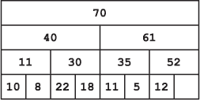

卢普博士，魔法犯罪学教授，已经在警察学院教授了 70 年。只有巴布尔顿博士，浮点运算教授，在教职年限上接近她，已有 61 年。

当弗兰克到达顶层时，他已经气喘吁吁，并且在想，一个 95 岁的教授是如何每天爬那么多次楼梯的。再说了，她的确有持续锻炼的好处。

“进来，进来，”卢普博士透过她开着的门喊道。“坐下，别站着，楼梯有点陡，像你这样年轻人都能喘不过气。”

弗兰克走进办公室，感激地瘫坐在卢普博士桌前的一把硬木椅子上。他又喘了几口气，卢普博士静静地看着他。

“不错的办公室，”弗兰克终于开口说道。

“真是*美妙*，不是吗？”卢普博士说道。“我等了 70 年才来到这里——70 年！伊特雷托教授简直不肯退休，等了好久。但我耐心等着。你知道伊特雷托教授宣布退休那天发生了什么吗？”

弗兰克摇了摇头，仍然因为气喘吁吁而无法做出恰当的回应。

“那个年轻的冒失鬼，Lambda 博士，竟然想偷走我的办公室！”

“真的吗？”弗兰克喘着气问道。

卢普博士耸耸肩。“你知道的，警察学院的退休总是充满了激情。由于我们的终身教职制度，只有资历最深的教授才能申请退休。一旦发生这种事，没人能抵挡偷偷溜进更好办公室的诱惑。”

“老实说，完全是 Iterator 教授的错。待了 75 年后，他就收拾东西冲出去，嘴里嘟囔着什么麻烦的孩子们。按照惯例，他唯一告诉的人就是离门最近的那位——Lambda 博士，他只在这里待了 11 年。”

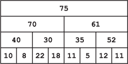

“Lambda 博士根本不顾我们早已建立的办公室分配系统，他把自己简陋办公室的东西收拾好，直接搬了上来。哈！每次有人离开都会发生这种事。楼里最底层的教授会跑上楼来，试图占据最上面的办公室。每次都是这样，我跟你说！

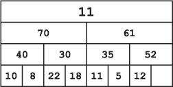

“当然，一听说 Iterator 博士要离开，我就立马跑上楼去争那个办公室。它本该是我的，你看。我是唯一合法的竞争者，毕竟我已经在这里待了 70 年。但 Babbleton 博士听见我跑上楼的声音，也决定去争一争。你知道，每次都是这样。

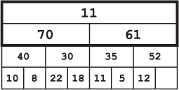

“一旦某个办公室空了，住在下面的两位教授会立刻争先恐后地跑上来争夺这个办公室。除非有某个资助申请的截止日期临近——那时可能需要几周才有人注意到这个空办公室。在这种情况下，我和 Babbleton 博士还得与 Lambda 博士的可预测尝试竞争，争取最好的办公室。

“总之，我们在那儿——Lambda 博士、Babbleton 博士和我。我们就终身职位的规则争论了足足一个小时。Lambda 博士没有任何理由，我们都知道这一点，但他固执地坚持了好一会儿。争论最终还是集中在了已经在这里待了可怜的 61 年的 Babbleton 博士和我之间。不可避免地，我赢了——迫使 Lambda 博士搬进了我以前的办公室。Babbleton 博士则继续待在楼下的办公室里。

“Lambda 博士收拾好自己的东西，搬到了我的办公室，但可怜的他发现那里已经有两位教授在等着。他们曾住在我楼下的办公室，现在正寻找升级的机会。

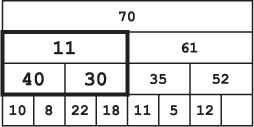

“他们俩对我的旧办公室有更好的争夺权，一个在这里待了 30 年，另一个待了 40 年。这次，Lambda 博士没怎么反抗。Variable 博士赢得了那个办公室。他也确实配得上，因为他已经待了 40 年。

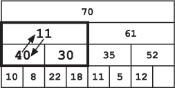

“幸运的是，Lambda 博士终于在下一层找到了一个机会。那里，下面的两位教授比他资历更浅。我觉得他特别高兴能胜利并把门关在了他们脸上。

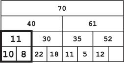

“从某种意义上说，Lambda 博士算是幸运的，”Loop 博士解释道，“当他试图窃取顶层办公室时，他最终被安排到了大楼的另一侧，和一些资历较浅的教授一起。他升了整整一层楼。规则只规定，任何办公室的占用者必须比下方*直接*办公室中的任何人任职时间更长。所以，纯粹是运气，Lambda 博士现在有了第二层的办公室，而他的部分资深同事仍在一楼。”

Frank 礼貌地等待着，看故事是否会继续。见没有动静，他试探性地说道：“Loop 博士，如果能占用您一点时间？我有几个问题。”

“当然，”Loop 博士说道，“我猜你是来问这周的作业吧？”

Frank 犹豫了，打断了思绪。“什么？不，我不是这里的学生。”

“你不是吗？那你应该考虑加入警察部门。这是个崇高的职业。”

“我已经毕业超过 10 年了。”

“是吗？”Loop 博士又耸了耸肩，“过了一段时间，所有的学生看起来都差不多。”

“好吧，”Frank 说，拼命地想要找回思路。“对，我需要了解安全魔法。”

“哦，我不*教*魔法，”Loop 博士解释道，“我教的是巫师犯罪学，这是研究——”

“我上过你的课，”Frank 打断她，“我不想知道如何施法。我想知道有哪些类型的安全魔法。特别是在警察局里。”

Loop 博士的表情突然变得严肃。“那是非常敏感的信息，”她说，声音冷冰冰的，“只有少数人知道。”

“正是为了这个，我才来找您的，”Frank 说道。

“那么，你到底为什么需要这些信息？”她问道。

“我正在调查首都警察局的盗窃案，”他反击道。先是那长篇大论的故事，现在她又开始盘问他了？他没时间浪费在这些上面。

“我需要查看你的证件，”Loop 博士提示道。她做了一个招手的动作。

Frank 伸手进他的风衣，从中拿出了私家侦探的证件。他将证件丢在她的桌子上。

“私家侦探？”Loop 博士笑了笑。然后，她的语气又变得冷硬。“滚出我的办公室。”

“Loop 博士——”Frank 开口说，但在听到弩箭上弦的声音时停住了。

**警察算法 101：堆**

***摘自德雷克教授的讲座***

*最大堆*是一种基于二叉树的数据结构，它保持节点与其子节点之间的特殊顺序关系。具体来说，堆按照*堆属性*存储元素，对于最大堆来说，树中任何节点的值都大于（或等于）其下面所有元素的值。这种结构使得最大堆能够高效地支持几个重要操作：（1）高效找到最大元素，（2）移除最大元素，以及（3）插入任意元素。这三种操作使得堆成为实现优先队列的理想数据结构。

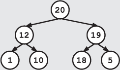

堆通常被可视化为树形结构，尽管它们很容易作为数组实现，其中数组中的每个元素对应树中的一个节点，根节点位于索引 0，如下图所示。子节点的索引是相对于父节点的索引定义的。具体来说，索引为 *i* 的节点的子节点位于索引 2*i* + 1 和 2*i* + 2。因此，索引为 1 的节点将有一个子节点位于索引 (2 × 1) + 1 = **3**，另一个子节点位于 (2 × 1) + 2 = **4**，如图所示。

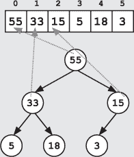

另外，一些堆的实现为了简化，直接跳过数组索引 0。根节点被放置在索引 1 的位置。在这种情况下，索引为 *i* 的节点，其子节点位于索引 2*i* 和 2*i* + 1，这使得索引计算更加简单。无论哪种方式，这种索引方案都允许算法根据父节点计算子节点的索引，或根据子节点计算父节点的索引。

由于根节点（数组中的第一个元素）总是对应最大堆中的最大值，因此你总是可以在常数时间内找到这个值（即，无论数组中有多少个值，都在相同的时间内找到）。这使得用户能够高效地查找优先队列中值最大的项目。

如果你想添加一个元素或移除最大元素，过程会更加复杂，因为它们需要先破坏堆的性质，再恢复堆的性质。

你通过首先将新元素添加到数组的末尾（树的底层的第一个空位置）来将新元素添加到堆中。这个新值可能大于它的父节点，这样就会破坏堆的性质，因此你需要将这个节点向上移动，直到它不再大于它的父节点，并恢复堆的性质。更正式地说，如果新值大于父节点的值，你就将它通过与父节点交换位置的方式“冒泡”到上面。例如，如果我们要将 60 添加到前面的堆中，我们会将它插入到底部并向上交换两次，因为在两个层级中，它都大于它的父节点。

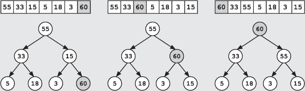

移除最大元素的过程类似。原始的最大值与数组的最后一个元素交换位置，使得最后一个元素成为新的根节点。

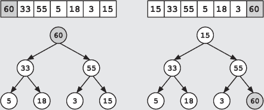

然后删除原始的最大值（当前最后一个元素）。我们现在已经删除了正确的节点，但在此过程中可能破坏了堆的性质。

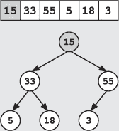

从新的根节点开始，我们将该节点沿着树向下走，以恢复堆的性质。在每一层，我们将该节点的值与其两个子节点进行比较。如果它小于任一子节点，我们将新的根节点向下移动，通过与较大的子节点交换位置来恢复堆的性质。向下交换会在没有更大子节点时终止。

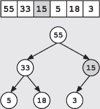

插入新元素和删除最大元素都要求我们在树的顶部和底部之间最多走一条路径。由于在向堆中添加一个新的节点层时，我们大致可以将堆中的节点数量翻倍，因此即使是对于大型堆，这些操作也能非常迅速。具体来说，我们可以将节点数量翻倍，并且这两种操作都只需要增加一步！此外，这两种操作还保证了树的平衡，因此未来的操作将会非常高效。
