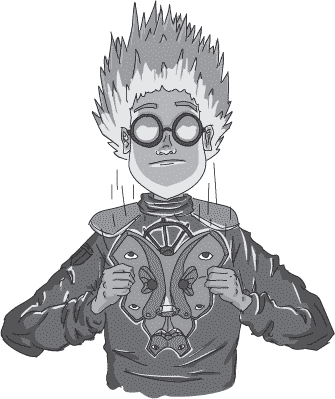

## 第二十九章：—29—

搜索终止

凌晨 12:01，门吱呀一声打开，一个警卫探出头，窥视着黑暗中的监狱牢房。他慢慢地用火把扫视着房间，直到他的目光落在睡着的囚犯身上。

“主人？”警卫轻声叫道。

囚犯动了动，坐起来，注视着警卫。

“主人，我——”警卫开口，但突然哽咽了一下，停住了。

弗兰克从监狱床上向他挥手。

警卫转身准备逃跑，但 Notation 走到门口，手持一把大十字弓。

“我……我只是做巡逻，”警卫说。

弗兰克咳嗽一声笑了笑，摇了摇头。“把火把交出来，慢慢的，”他指示道。“我的朋友刚从警察学院毕业，我听说她的十字弓使用成绩是全班第一。”

“实际上，我排第二，”Notation 在门口说道。

弗兰克叹了口气。“真是的？就这一次，你决定谦虚了？”

“对不起。我只是想准确一些。”

“这是威胁，Notation。你可以夸大威胁的程度。”

“对不起，”她重复道。

“不过，无论如何，重点不变。她有一把十字弓，而且比她所有同学中的除一个外，使用得都更好。请把火把交过来。”

警卫的眼睛四处打量，寻找逃生的机会。没有找到，他慢慢向前倾身，将火把递给弗兰克。当弗兰克伸手接过时，警卫突然转身，挥火把向弗兰克的头部砸去，火焰在空中发出嘶嘶声。

弗兰克向左倾斜，避开了燃烧的火把尖端。警卫转身准备再次挥动，但弗兰克站起身，迅速从他的手中拿走了火把，而 Notation 从后面推开了警卫。警卫踉跄了一下，跌倒在床上，姿势尴尬。

弗兰克摇了摇头。“很明显的举动，孩子，”他说。“想用火把打我。执行得很差，甚至差得离谱。虽然没打中，但我得承认你敢尝试。”

警卫呆滞地眨了眨眼，看着弗兰克。

“现在，摘下那个愚蠢的面具。我们知道是你，Socks。”

“Socks？那是谁？我从没听说过有人叫 Socks，”警卫完全不真诚地说。

“Socks，摘下面具，”弗兰克重复道。

警卫犹豫了一会儿，伸手到脖后解开了一个扣环。突然，一阵奇怪的旋转声充满了牢房，他的面容开始融化并变形成了一个复杂的面具。警卫随后将面具从脸上摘下，露出了 Socks 的面容。

“你怎么知道的？”Socks 问道。

“许多小事，”弗兰克说。“首先，你跟踪了我们，但直到 Vinettees 把我们逼到角落时才现身。他们虽然有很凶狠的名声，但在对囚犯得意忘形时并不聪明。事实上，他们更可能无意中泄露你的计划。但你的故事可怜得足够可信。”

“不过你在 Frayed Cable 岛上的表现就不那么可信了。是你丢掉的法杖毁掉了证据。你在监狱外的门前看起来很困惑，但当你自己的生命处于危险时，立刻施用了一个金属削弱的咒语。你甚至使用了加速生锈的咒语，正是那次攻击车队时用的咒语。”

“你还拒绝帮忙撬开监狱外面的锁，直到我提议让你单独爬过去，”Notation 补充道。“我猜你是想在我们找到文件时能在场。”

“那你为什么不直接 confront 我呢？”Socks 问道。

“我当时还是不确定该信谁，”Frank 承认道。他朝着仍站在门口持弩的 Notation 示意。“Notation 反应得稍微快一点。她告诉我，她在监狱事件后开始怀疑你，但当时没有确凿的证据。当我提议并行搜索时，阻止了她继续监视你。”

“老实说，我真的以为 Frank 提议并行搜索是为了暂时把你搁置一边，”Notation 承认道。

Frank 决定再也不提目标是把他们*两个人*都搁置在一边的事了。那时，他对 Notation 的怀疑比对 Socks 的怀疑更重。他提议并行搜索，是为了能单独跟进那些线程。

“我得承认，”Frank 继续说道，“你在整个监狱事件中的表现相当不错。我当时真的以为有人袭击了你。那时，我心里很困惑，为什么攻击者没有留下来，但我忽视了直觉。早该早点发现的。”

“不过有一件事我不明白，为什么你关了门？为什么不直接‘绊倒’然后丢掉法杖？”

Socks 耸了耸肩。“门是个意外。我并不是故意把我们锁在里面的。我的袖子卡在门上了，假装绊倒时碰到了门。”

“不过你演得不错，”Frank 说道。“而且把我们困住确实帮忙卖出了攻击的故事。”

Socks 耸了耸肩，但脸上闪过一丝骄傲。

“但最重要的是，你在二叉搜索树上的捷径，”Frank 说。“任何研究过二叉搜索树的人都知道，插入节点时应该从根节点开始。你的错误意味着你要么不是你所声称的专家，要么就是在故意破坏这棵树。”

Socks 笑了笑。“还不错，”他说。“我以为我的不称职巫师表演足以把你蒙混过去。”

“你做得不错，”Frank 承认道。“足够让我一次次忽视了明显的线索。”

“谢谢你，”Socks 说道。“我在学校的时候演过几季 Babbageville 社区剧场的戏。”

“看得出来，”Frank 说。“我猜你就是被选中去伪装成新转校生去抢劫档案室的那个人。虽然我得承认，我始终没搞清楚你到底伪装成了谁。”

“我用了最适合任务的人选。可选的转校生那么多。”

弗兰克点点头。说得通。“可惜车站没有保存监狱囚室分配的记录。我猜你清除了那些可能包含分配信息、囚室分配、指数、通知、监狱、囚犯和房间分配的书架。你白白偷了那些文件。”

“值得一试，”袜子说道。“这里有很多囚室。但你是怎么知道我要去监狱的？我甚至没提过。”

弗兰克笑了。“你们在关于袭击城堡的提示上并不隐晦，”他解释道，“你们是在试图把守卫从监狱引开——不是一个坏计划。如果我没有和鲁普博士聊过，可能我会错过监狱这个选项。”

袜子皱起眉头提到鲁普博士的名字。“她？她多年来一直是邪恶巫师的眼中钉。你知道她帮马库斯设计了监狱的安保吗？谁会在走廊里放一个轻微恶心的法术？这太恶劣了。”

“看起来没那么糟糕，”符号插话道，“他们给守卫戴上防止恶心的护符，只要囚犯在守卫身边或在自己的房间里，就会安全。”

“我已经呕吐两次了，”袜子反驳道。

“你们在破坏进入！这就是——”符号开始说。

弗兰克插话道，“袜子，你的同谋在哪里？”

“他一个人，”符号在袜子回答之前说道。

“什么？”弗兰克看着她。“你怎么知道这些？”

“外面停着另一个六座阵列车，”她回答道。“我不知道他为什么会用同一辆车，但它在那里，而且是空的。如果他和别人合作，应该会有其他人在守卫它或者等着逃跑。”

袜子耸了耸肩。“只有我们其中一个能用面具潜入监狱，而且大群人聚集在监狱外面通常会被认为是可疑的。所以我自愿一个人来。”

“我在哪儿能找到你的朋友们？”弗兰克问道。

袜子笑了。“你不需要找到*他们*，运行时先生。一旦我被捕的消息传出去，他们会找到*你*。今晚你得罪了不少强敌。”

“哦，真的？”弗兰克说道，“我似乎很擅长树敌。也许你可以把他们的名字告诉我，我可以把他们加入我的粉丝俱乐部。格雷琴也在其中吗？”

袜子笑了。 “格雷琴？你竟然还认为我是她的学徒？在你们揭露了其他所有谎言之后？”

“那是谁在幕后？”符号问道。

“不必要复杂性的联盟，”弗兰克回答道。他心里补充道，“显然并不包括一个叫格雷琴的巫师。”

“我很佩服你，运行时先生，”袜子说道。“没有多少人知道我们的小组织。”

“不必要复杂性的联盟？”符号问道。

“他们与巫师指数有关：追随者、同谋，或者可能只是崇拜者，”弗兰克解释道。

“指数！”符号惊叫道，“那个邪恶的巫师？他不是因为试图摧毁*整个王国*而被关进监狱的吗？”

“是的，就是他——那个真正坏的巫师。我不是提过他是袜子要去救的人吗？”弗兰克问道。

符号瞪回了他。

“你误解了，”袜子说道，“王国不会毁灭的。它会被拯救。一旦指数人（Exponentious）掌权，我们将迎来一个新的黄金时代。他——”

“他疯了，”弗兰克打断了他，“他会毁掉王国的。”

站在一旁的诺塔申（Notation）点头表示同意。“我得同意弗兰克的看法。”

袜子（Socks）的眼睛充满了愤怒。他猛地站起身，甩开斗篷，举起法杖，开始念诵一段长长的咒语，法杖在空中旋转成复杂的图案。袜子将法杖直接指向弗兰克，完成了咒语。

弗兰克冷静地看着，完全没有任何反应。诺塔申翻了个白眼。

“现在完了吗？”弗兰克问道，“你应该知道，魔法在这里不起作用。”

“是啊，我只是——”袜子开始说，带着挫败的语气。话音突然中断，他猛地朝门口冲去。在诺塔申准备开火之前，袜子挥动法杖攻击十字弩。她躲开了攻击，重新调整了十字弩，略感失望于这可怜的逃脱尝试。同时，弗兰克抓住袜子袍子的后摆，把他拉住。袜子的手臂像风车一样转动，拼命挣脱。

弗兰克发出一声哼，拉扯着袍子，袜子踉跄着倒退回牢房，跌倒在床上。弗兰克蹲下去捡起掉落的法杖。那把法杖对魔法毫无用处，但仍然能够打出难看的伤口。然后他大步走了出去。一旦他离开，诺塔申便猛地关上了门。
