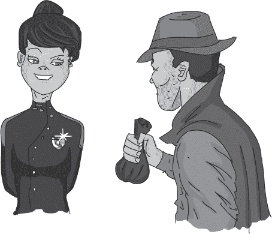

## 后记

Notation 正在大厅里等，当 Frank 从队长办公室出来时。她在他关门的瞬间就问道：“怎么样？”

“还行，”Frank 说道。“他没有对我吼，我又多了三个月的办公室租金。”他举起一袋小硬币。

“就这些？”Notation 问，声音中带着失望。

“你期待什么？”Frank 问。“奖状？私家侦探是不会得到奖状的。但我听说你得到了一个，还升了职。做得好，侦探 Notation。这可算是晋升了。”

Notation 脸红了。“谢谢，”她说道。“那你呢？我以为……也许……”

“你以为队长会让我回来，”Frank 填补道。“事实上，他告诉我，是你推荐的。”

Notation 脸红得像火一样。“你是个出色的侦探，”她说道。

Frank 笑了。“他没给我工作机会。”看到 Notation 脸上的表情，他补充道，“别太在意。他根本不会再给我机会回到警队。队长和我有着很长的历史，单单一个案件是无法抹去的。总之，私家侦探的生活更适合我。”

“所以你就回去……”

“去找某人丢失的龙？”

“是啊，”Notation 说道。“那个。”

“事实上，我得到了一个新机会。”他举起手制止她在她太兴奋之前继续说下去，并补充道，“作为一名独立承包商。”

“那是什么？”Notation 问。

“看起来外面有一个巫师联盟，试图解救 Exponentious 并接管王国。”

Notation 微笑着。“我很熟悉他们。我似乎记得我最近帮忙抓住了他们一个更活跃的成员。”

“他们其中一个更活跃的成员，没错，确实是个忠诚的成员。但也有可能他是其中一个能力较弱的成员。安娜公主担心，Socks 尝试越狱会激励联盟中一些更资深、更有能力的成员。”

“所以你在调查‘不必要复杂性联盟’？当然，是作为独立承包商。”

Frank 点了点头。“这是一个棘手的搜索问题——找出所有一个秘密邪恶组织的成员。但恰好，搜索问题正是我的专长。”

