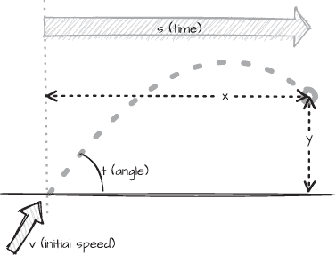

# 第一章：1 充分利用类型系统


清晰且易读的源代码对人类比对计算机更为重要。无论是调试现有代码还是学习使用新功能，我们不可避免地会阅读源代码。确保代码尽可能易读是很重要的，这样其他读者能清楚地理解它的含义。难以理解或容易被误解的代码是错误的温床。

改善代码清晰度的一种方式是通过创建我们自己的类型并赋予它们明确描述其目的的名称，从而充分利用类型系统。良好的命名对于系统中的所有类型都至关重要，但我们很容易忽视那些表示应用程序最细粒度信息的简单值类型。

在本章中，我们将研究一段简短但不清晰的代码，并通过多次迭代改进它，采用一系列技巧，帮助你学习如何有效地使用类型系统。到本章结束时，你将更好地理解自定义值类型如何为易于理解的代码做出贡献，并学会如何将丰富的类型集成到你的设计中。

我们将探讨以下内容：

+   如何通过自定义类型来表达意义，并使代码更具自文档性

+   如何封装特定领域的行为以减少错误

+   如何使用 C# v9.0 和 v10.0 中的一些语法特性，使代码更加简洁且易读

+   如何在日常代码中轻松自然地使用自定义类型

首先，让我们来看一个简单的值类型示例，了解它们为什么是我们设计中如此重要的特性。

## 良好命名的重要性

选择好的标识符名称可能很困难，但对代码的清晰度有着重大影响。考虑一下清单 1-1 中的Displacement方法。

```
public static (double, double)
Displacement(double t, double v, double s)
{
    var x = v * s * Math.Cos(t);
    var y = v * s * Math.Sin(t) - 0.5 * 9.81 * Math.Pow(s, 2);
    return (x, y);
}
```

清单 1-1：一个糟糕变量命名的示例

该方法的三个参数——t、v 和 s——命名不佳，且它们的目的并不立即明确。我们将在本章中通过多次改进，利用各种方法来提升代码的质量，明确其意图。

位移方法的目的是计算给定初始角度和速度以及自投射物发射以来所经过的时间后，投射物在其弹道弧线上的位置。如果你熟悉抛物线运动的方程式，你可能会认出这个算法，但变量名完全无法透露它们的目的。当调用时，位移方法会计算投射物相对于发射点的坐标值，如图 1-1 所示。



图 1-1： 投射物位移

图 1-1 中的角度、初速度和时间标签分别对应<`samp` class="SANS_TheSansMonoCd_W5Regular_11">t、v和<`samp` class="SANS_TheSansMonoCd_W5Regular_11">s这些参数。x和<`samp` class="SANS_TheSansMonoCd_W5Regular_11">y值对应于该方法返回的元组的分量。投射物以初速度和特定角度发射，并遵循一个明确的弹道弧线。位移方法计算投射物在经过一段时间后在该弧线上的位置。

我们不会深入探讨这里使用的算法，因为我们的重点仅仅是让这个方法的目的更加直观易懂。我们理解<`samp` class="SANS_TheSansMonoCd_W5Regular_11">位移方法的第一个障碍是它的参数和返回值的含义。

我故意夸大了单字母名称的问题，但在现实中我见过类似的例子，想过，*这些参数到底代表什么？* 即使我们仔细检查这些参数的使用方式，想要理解它们的含义，仍然需要熟悉方程式。这真的是很糟糕的代码风格。并不是所有人都还记得自己的弹道学学习。

我们希望让读者尽可能容易地判断方法的目的，无论他们是否熟悉该主题。实现这一目标的最快方法是确保参数名称更好地反映它们所代表的内容。特别是，代码应避免依赖专业术语。这里的 t 代表 *theta*，通常用于物理学中表示角度的大小，但即使我们将 t 替换为完整的单词 theta，那些不熟悉这个数学约定的读者也不太可能理解这个联系。

与其使用可能不清楚的单字母名称，不如为参数起个正确表示其含义的名称：

```
public static (double, double)
Displacement(double **angle**, double **speed**, double **elapsedTime**)
{
`--snip--`
```

通过将 t 重命名为 angle，将 v 重命名为 speed，将 s 重命名为 elapsedTime，我们使它们的目的更加明确。将速度改为速度看似是一个小变化，但我们使用的名称*很重要*。虽然 v 用于表示*速度*很常见，但 speed 更准确地描述了该值的目的。*Velocity* 是物理学中具有特定含义的术语；它代表*大小*（速度）和方向。我们尽可能准确、恰当地命名代码元素，可以减少这些名称被误解的风险。

选择合适的名称是使代码更清晰、易于阅读的第一步。然而，我们可以做得更多，以提高代码的清晰度，并消除关于这些标识符所代表内容的歧义。例如，我们可能会合理地问，angle、speed 和 elapsedTime 这些参数是以什么单位来衡量的。我们将在本章稍后讨论这个问题，但首先我们需要比 double 类型更复杂的机制。

## 通过类型添加清晰性

所有 Displacement 方法的参数都是相同的类型：double。这使得任何人，包括我们自己，在调用方法时很容易不小心混淆参数值——编译器不会发出任何警告。

double 类型本身并不是这里的罪魁祸首；如果参数全是 string 或全是 bool 类型，我们也会遇到同样的问题。即使每个参数都是不同的内置数值类型，由于它们之间存在隐式提升规则，仍然存在很多潜在的问题。此外，明确参数名称不一定有助于调用代码，尤其是当方法被传入像这样纯常量值时：

```
var result = Displacement(.523, 65, 4);
```

像这个例子中使用的硬编码值被称为 *魔法数字*，因为它们的意义或目的没有解释。我们可以用更具描述性的变量替换魔法数字，以使它们的目的更加明确，但方法的调用者仍然可能以错误的顺序传递参数。

调用代码处理这种顺序错误的一个常见方法是为每个参数指定参数名称。在我们查看如何使用不同类型来区分参数值之前，先来看看这个方法在实践中的应用。

### 命名参数

为每个传递给方法的参数嵌入参数名称，可以使这些参数的目的在调用代码中更加清晰，正如这里所示：

```
var result = Displacement(angle: .523, speed: 65, elapsedTime: 4);
```

这个对 Displacement 方法的调用指定了每个传入的值对应哪个参数。调用者必须匹配方法的参数名称，但可以按任何他们喜欢的顺序排列这些参数：

```
var result = Displacement(elapsedTime: 4, speed: 65, angle: .523);
```

命名参数使得传递参数的顺序变得不再重要。编译器将确保每个参数值根据其名称而不是位置传递到正确的参数中。

这种技巧将清晰性的责任转移给了方法的*调用者*。如果调用者忘记或懒得命名参数，编译器不会警告他们。如果调用者将 angle 和 speed 的值搞混，编译器也不会发出警告。代码会编译并运行，但几乎肯定会给出错误的结果。更糟糕的是，代码可能会对一组特定的参数给出几乎正确的结果，然后在传入不同值时，最糟糕的时刻发生故障。这类错误的原因可能很难追踪。

### 自定义类型

我们在 Displacement 方法中遇到的问题，源于使用 double 类型来表示几个不同的概念。这是 *原始迷恋*（Primitive Obsession）代码异味的一种变体，描述的是任何过度依赖原始类型的代码——即那些语言内置的类型，如 int、double 和 string。

诸如速度等测量和量度通常具有数值表示，但 double 类型过于通用；它可以用来表示各种各样的值，包括我们示例中的 角度 和 速度，这使得代码调用者可能提供错误的值。角度 和 速度 是以不同的方式来度量，代表不同的意义。使用原始的 double 并不能清晰地表达它们之间的区别。45 度的角度与每秒 45 米的速度是非常不同的两个值。

解决原始迷恋（Primitive Obsession）问题的著名方法是为我们的自定义类型赋予明确的目的，并确保它们之间不存在隐式转换。这使得编译器能够识别任何不恰当地使用的参数。与其使用 double 来存储 角度 和 速度 的值，Listing 1-2 定义了两个类型，更清楚地传达它们的区别。

```
public struct Angle
{
    public double Size {get; set;}
}
public struct Speed
{
    public double Amount {get; set;}
}
```

Listing 1-2：定义我们自己的类型

我们自定义的结构体 Angle 和 Speed 仍然相当原始；它们仅仅是对公共属性（分别是 Size 和 Amount）的封装，允许我们读取或写入每个表示的值。我们将改进这个设计，但现在它能满足当前的需求：通过类型而非仅仅通过参数名称来区分角度值和速度值。

Listing 1-3 演示了我们如何使用这些新类型作为 Displacement 方法的参数。

```
public static (double, double)
Displacement(**Angle** angle, **Speed** speed, **TimeSpan** elapsedTime)
{
`--snip--`
```

Listing 1-3：使用自定义类型作为参数

C# 标准库没有提供关于角度或速度的抽象，但它提供了 TimeSpan 类型，非常适合用于 elapsedTime 参数。现在，每个参数的*类型*描述了其值，因此参数名称的责任减少了。任何试图以错误的顺序提供参数，比如将 speed 替换为 angle，都会导致编译器报错，并显示一个非常明显的错误信息，提示无法将 Speed 转换为 Angle。

### 封装

在设计中使用不同的类型来表示值，强调了每个值的作用，而不是它的表现形式，这使得代码对人类读者更加自文档化，并允许编译器进行更好的错误检查。我们已经达成了防止 Displacement 参数顺序错误的目标，但目前 Speed 和 Angle 仍然是简单类型，它们*拥有*一个值，而不是*作为*某种特定类型的值。

这些类型并没有以任何方式封装它们的值，因为它们的值作为公开可变的 Size 和 Amount 属性暴露出来。目前，这些属性是创建这些类型实例的唯一方式，正如我们在 清单 1-4 中所做的那样，我们使用对象初始化来设置属性值。

```
var result = Displacement(angle: new Angle {Size = .523},
                          speed: new Speed {Amount = 65},
                          elapsedTime: seconds);
```

清单 1-4：使用对象初始化来创建内联参数实例

在这里使用公共属性来设置值显得不必要的冗长。清单 1-5 通过添加构造函数简化了语法，使我们可以直接用一个值来创建新的实例，而无需设置公共属性。

```
public struct Speed
{
    **public Speed(double amount)**
        **=>** **Amount** **=** **amount;**
    public double Amount {get; set;}
}
public struct Angle
{
    **public Angle(double size)**
        **=>** **Size** **=** **size;**
    public double Size {get; set;}
}
❶ var result = Displacement(new Angle(.523), new Speed(65), seconds);
```

清单 1-5：为 Speed 和 Angle 添加构造函数

在这里，当我们调用 Displacement 时，我们通过它们的值构造 Angle 和 Speed 实例，而不是设置它们的属性 ❶。现在类型名称更加描述性，参数的顺序不再模糊，因此命名参数的重要性不再那么大。

这些构造函数使用了*C# v6.0 引入的表达式主体语法*，该语法自 C# v7.0 以来适用于构造函数。使用这种语法时，表达式不是用花括号{…}括起来的代码块，而是一个单一的赋值表达式，且与构造函数签名通过=>符号分隔。由于Speed和Angle每个只有一个属性需要初始化，因此表达式主体构造函数简洁且方便。

将最后一行与清单 1-4 进行比较。在清单 1-5 中对Angle和Speed的更改，使我们能够构造所需的值，而不是在每个情况下使用对象初始化器。这减少了调用者需要输入的代码量，但更重要的是，它更直接地表达了Speed或Angle*是*一个值，而不仅仅是*拥有*一个值。

### 不可变性

目前，我们的值都是可变的，但一旦我们在构造函数中给Angle或Speed赋予一个值，就不需要允许该值再发生变化。如果我们需要一个具有不同值的Angle，我们可以创建一个新的实例来表示这个值。

我们通过移除set访问器来实现这种不可变性，使得Angle的Size属性变为只读属性。然后，提供值的唯一方式是通过构造函数，并且该值是永久且不可变的。我们将对Speed的Amount属性做同样的处理，如清单 1-6 所示。

```
public **readonly** struct Speed
{
    public Speed(double amount)
        => Amount = amount;
    public double Amount **{get;}**
}
```

清单 1-6：使 Speed 不可变

为了确保Speed实例无法更改，我们还将其设置为readonly。这样，编译器将确保Speed的成员不能修改状态，并且任何尝试更改实例的操作都会导致编译失败。

设计类型为不可变使得在代码检查时更容易推理代码，因为我们不需要考虑类型实例可能发生变化的各种方式。这在多线程程序中特别重要，但在某些情况下，通过使值类型只读，也可以通过让编译器使用某些优化来提高性能。

### 值验证

引入了类型的构造函数后，我们可以使用这些构造函数来检查无效参数，并在用户传入非法值时抛出异常。例如，速度的合理值必须是非负的。在列表 1-7 中，我们检查传给构造函数的值是否小于 0，如果是，则抛出异常。

```
public Speed(double amount)
{
    if(amount < 0)
        throw new ArgumentOutOfRangeException(
            **paramName:** nameof(amount),
              **message:** "Speed must be positive");
    Amount = amount;
}
```

列表 1-7：禁止超范围值

Speed 的构造函数验证了提供的值，并且由于构造函数是唯一提供 Speed 值的方式，我们确保只能创建合法的 Speed 值。我们应该使用构造函数来禁止其他非法的参数值，例如 double.NaN，并且也许还可以添加一个光速的上限。如果我们尝试创建一个带有非法值的 Speed，我们将得到一个运行时异常。

ArgumentOutOfRangeException 类型在标准库中定义，是一个命名非常具描述性的类型的良好示例。注意，在列表 1-7 中，我们为 ArgumentOutOfRangeException 构造函数命名了参数，*它接受两个普通的* string *参数*（paramName: 和 message:）。否则，这些参数的顺序容易混淆，特别是由于同名的 ArgumentException 将相同的参数顺序颠倒了！

在 Speed 构造函数中验证参数值是封装的一个示例：我们将验证逻辑集中在一个地方，而不是将其分散到任何使用它的方法中。现在，任何使用 Speed 实例的方法都会自动受益于 Speed 构造函数执行的范围检查。

> 注意

*创建我们自己的类型的一个主要好处是，我们将它们的责任封装起来，从而减少了使用它们的方法的责任。最小化重复代码是我们让代码更清晰、更易用、更容易维护的另一种方式。*

Speed 的构造函数建立了一个 *类不变量*——即在类型的任何实例的生命周期内都必须满足的条件——指定 Speed 的值永远不小于 0。由于我们使 Speed 不可变，这个不变量永远不会被打破。一旦创建了一个有效的 Speed 实例，其值永远不会改变，而且不可能创建一个具有无效值的 Speed 实例。

### 测试

通过将验证封装在 Speed 类型中，我们也可以独立于任何依赖它的算法来测试类的不变量。在 列表 1-8 中，我们尝试创建一个具有负值的 Speed 实例，以测试构造函数是否会抛出异常。

```
[Test]
public void Speed_cannot_be_negative()
{
    Assert.That(
        () => new Speed(-1),
        Throws.TypeOf<ArgumentOutOfRangeException>());
}
```

列表 1-8：测试速度的约束条件

因为验证代码被封装在 Speed 类型中，我们只需要对它进行这一项测试。我们不需要单独测试 Displacement，或者任何其他使用 Speed 的方法，是否会拒绝无效的速度值。所有关于 Displacement 的测试都可以专注于确保算法的正确性，而不必担心参数验证。

使用类型表示领域概念有几个优势。因此，使用我们自己类型的代码更加清晰，因为类型具有自描述的特性。我们分离了关注点，使得程序更易于理解，测试更聚焦和具体。这使得测试更简单，当被测试的代码需要更改时，也更容易维护。

## 重构

既然我们已经解决了 Displacement 方法参数的问题，接下来让我们看一下它的方法体，看看是否可以通过重构实现进一步改进。列表 1-9 显示了我们当前的 Displacement 代码。

```
public static (double, double)
Displacement(Angle angle, Speed speed, TimeSpan elapsedTime)
{
    var x = speed.Amount * elapsedTime.TotalSeconds * Math.Cos(angle.Size);
    var y = speed.Amount * elapsedTime.TotalSeconds * Math.Sin(angle.Size)
            - 0.5 * 9.81 * Math.Pow(elapsedTime.TotalSeconds, 2);
    return (x, y);
}
```

列表 1-9：当前位移实现

这段代码可以正常工作，但我们有一些问题需要处理。由于我们使用了 Speed、Angle 和 TimeSpan 类型作为参数，我们需要访问这些参数的属性才能获取它们的值，导致代码变得更加冗长。请注意，我们在这里使用了 TotalSeconds 属性；一个常见的错误是使用 TimeSpan 对象的 Seconds 属性，然而其目的是获取总秒数，但 Seconds 只返回 TimeSpan 的秒部分。如果给定一个表示 1 分钟的 TimeSpan，那么 Seconds 属性将返回 0，而 TotalSeconds 的值将为 60。

如果我们能够直接在算法中使用变量，像这样，Displacement 方法将更加清晰：

```
 var x = speed * elapsedTime * Math.Cos(angle);
    var y = speed * elapsedTime * Math.Sin(angle)
            - 0.5 * 9.81 * Math.Pow(elapsedTime, 2);
```

这个算法还依赖于三个硬编码值。像这样的“魔法数字”通常意味着我们需要为它们提供名称来澄清它们的目的。通常会在多个地方使用相同的魔法数字，所以如果值发生变化，我们需要查找每个使用该值的地方，并确保更新所有相关部分。

尽管我们可以看到将 0.5 相乘与除以 2 是等效的，但 9.81 的含义就不那么明显了。0.5 和用于调用 Math.Pow 的 2 只是算术值；给它们命名可能会掩盖它们的用途，而不是澄清它们的含义。另一方面，9.81 的值则显得更为重要。要理解这个数字的含义，我们需要知道 9.81 是地球引力对物体作用的近似值。我们首先通过简单地为这个值命名来解决这个问题。

### 用命名常量替换魔法数字

用描述性的名称替换代码中的魔法数字，可以帮助读者理解它们的含义，尤其是对于那些不熟悉算法细节的人。实现这一点的一种方法是创建一个新的值类型，类似于 Speed，来表示度量。然而，当我们只需要一些众所周知的值时，使用命名常量来表示它们通常更简单。现在，我们只需要一个值（地球的重力）。清单 1-10 显示了一种方法，我们可以通过给它赋予有意义的名称来指明该值的用途。

```
public static class Gravity
{
    public const double Earth = 9.81;
}
```

清单 1-10：魔法数字的简单编码

尽管重力的命名常量是替换魔法数字的最简单方法，但我们错过了一个机会，即使用更通用的类型（如 Acceleration）或类似类型。这样做可以为我们提供最大的灵活性，但也会增加复杂性和维护难度。保持代码简单有它自己的好处。

然而，我们应该记住，像 const 这样的值是由编译器内嵌到代码中的，因此如果我们更改了 Gravity.Earth 的值，但仍然编译针对一个使用相同常量的预构建程序集，那么整个程序可能会使用该常量的两个不同值。为了简洁和简单，我们将保持 const 值，并将 Displacement 中的硬编码数字替换为 Gravity.Earth 常量，这样读者可以立即知道它的含义：

```
 `--snip--` - 0.5 * Gravity.Earth * Math.Pow(elapsedTime.TotalSeconds, 2);
```

现在，如果我们想使用更精确的重力近似值，我们只需要改变常量的值，而不必去查找所有使用魔法数字 9.81 的地方，但需要注意的是，我们必须记得重新编译任何其他使用该常量的模块。

### 简化属性和值

我们的 Displacement 方法现在更明确地说明了它使用的变量的含义。清单 1-11 显示了它的当前实现。

```
public static (double, double)
Displacement(Angle angle, Speed speed, TimeSpan elapsedTime)
{
  ❶ var x = speed.Amount * elapsedTime.TotalSeconds
          ❷ * Math.Cos(angle.Size);
  ❸ var y = speed.Amount * elapsedTime.TotalSeconds * Math.Sin(angle.Size)
            - 0.5 * Gravity.Earth * Math.Pow(elapsedTime.TotalSeconds, 2);
    return (x, y);
}
```

清单 1-11：使用显式属性访问的 Displacement

如前所述，访问 angle、speed 和 elapsedTime 的属性使得实现变得相当冗长。如果我们能够在使用这些属性的操作中直接访问它们，那么 Displacement 方法会更加简洁，且更易读。speed 变量的 Amount 属性被与 elapsedTime.TotalSeconds 相乘 ❶，而 angle.Size 被用于调用 Math.Cos ❷ 和 Math.Sin ❸。每次使用我们的类型时，我们都需要显式地获取对应的属性值，以便将两个值相乘，并将它们作为参数传递给 Sin 和 Cos 方法。

我们不能改变 TimeSpan 变量的行为，使其能够与 Speed 相乘，但 TimeSpan 可以与 double 值相乘。如果我们能够像使用 double 值一样使用 Speed 实例，我们就可以避免在 Displacement 中显式地使用它们的属性，从而使方法更加简洁；也就是说，我们可以在不使用 speed.Amount 属性的情况下相乘 speed 和 elapsedTime。同样，使用 Angle 类型时，我们可以直接调用像 Math.Cos 和 Math.Sin 这样的函数，它们都期望传入一个 double 参数，前提是我们能够像使用 double 值一样直接使用 angle 变量。

整个表达式的结果将是一个 TimeSpan，这是将一个 TimeSpan 乘以一个数字后的结果类型，因此我们需要在某个时刻访问 TotalSeconds 属性。不过，移除对 Speed 的 Amount 和 Size 属性的访问，将简化并缩短该方法的实现。

实现这一结果的一种方法是定义我们自己的隐式转换运算符。这个方法表面上看起来很有吸引力，因为它简单易实现，但也有几个缺点。让我们来看看这些潜在的问题。

#### 隐式转换

我们通过实现隐式转换运算符方法并指定所需的目标类型，来为我们自己的类型定义隐式转换，如 Listing 1-12 中为 Speed 所示。

```
public readonly struct Speed
{
    `--snip--`
    public static implicit operator double(Speed speed)
        => speed.Amount;
}
```

Listing 1-12：为 Speed 定义隐式转换

这里的目标类型是 double，我们只需要返回 Amount 属性的值。我们还为 Angle 添加了类似的转换运算符（这里没有显示），它返回其 Size 属性。现在，我们不再需要在调用 Math.Cos 和 Math.Sin 时显式使用 angle.Size，并且我们可以直接将 speed 乘以 elapsedTime.TotalSeconds 的值，而无需获取 speed.Amount 属性。请对比 Listing 1-13 与之前的 Listing 1-11。

```
var x = speed * elapsedTime.TotalSeconds * Math.Cos(angle);
var y = speed * elapsedTime.TotalSeconds * Math.Sin(angle)
        - 0.5 * Gravity.Earth * Math.Pow(elapsedTime.TotalSeconds, 2);
```

Listing 1-13：使用隐式转换

我们现在的 Displacement 实现要紧凑得多，但我们也引入了一些隐藏的问题。

#### 意外的相互作用

隐式转换通过允许 Speed 和 Angle 在任何可能使用 double 的地方参与，削弱了它们的接口，这意味着它们可以在不合适的表达式中被使用。例如，将速度除以角度是一个合法的表达式，正如 Listing 1-14 所示。

```
var angle = new Angle(.523);
var speed = new Speed(65);
var unknown = speed / angle;
```

Listing 1-14: 隐式转换导致的未预期行为

这个表达式是合法的，因为存在从 Speed 和 Angle 到 double 的隐式转换，但结果没有意义，而且编译器没有发出警告。此外，隐式转换通常在代码中是不可见的。如果我们将一个 Speed 值传递给 Math.Cos，而不是 Angle，那么计算错误可能会很难发现。

#### 丢弃的恒定值

引入自定义类型 Speed 后，我们意识到的一个好处是可以在 Speed 的构造函数中封装验证逻辑。

允许将 Speed 隐式转换为 double 意味着使用 double 结果的代码可能会违反对 Speed 可接受范围的约束。在 Listing 1-15 中，我们将一个 Speed 从另一个较小的值中减去，得到的结果小于 0。

```
var verySlow = new Speed(10);
var reduceBy = new Speed(30);
var outOfRange = verySlow - reduceBy;
```

Listing 1-15: 隐式转换导致的未检查约束

这个减法表达式，因隐式转换将 Speed 转换为 double，而两个 double 值之间的运算可以正常执行。结果为负数，因此对于 Speed 来说超出了范围，但它是一个完全合法的 double 值。

为了解决这个越界值问题，我们需要限制对Speed和Angle的允许操作，以确保它们对于这些测量值是合理的。这也是引入Speed类不变式的整个目的，确保其实例始终具有有效的值。此外，我们希望禁止那些没有意义的操作，理想情况下能让编译器在出现问题时提醒我们。

我们将Speed和Angle作为特定类型引入，以便区分它们，并且使用普通的double类型显然过于笼统，无法代表这些测量值。然而，隐式转换使得Speed和Angle与double变得难以区分。

我们仍然可以实现使我们的类型在算术表达式中易于使用的目标，但我们需要控制这些类型可以执行哪些操作。我们将允许对Speed和Angle进行特定操作，同时不牺牲它们的自然用法或破坏类型的封装性。

### 重载算术运算符

我们引入隐式转换的初衷是为了支持Speed与TimeSpan值的TotalSeconds属性之间的乘法运算。目前，我们必须使用Speed的Amount属性来进行此计算，如下所示：

```
var x = speed.Amount * elapsedTime.TotalSeconds *
--snip--
```

像*这样的算术运算（乘法）已经为内建的数字类型（如double）预定义了。我们可以通过提供算术运算符重载，为我们自己的类型定义这些符号的意义。

清单 1-16 显示了Speed的乘法运算符重载。

```
public readonly struct Speed
{
    public static Speed operator*(Speed left, double right)
        => new (left.Amount * right);
    `--snip--`
}
```

清单 1-16：在 Speed 中支持乘法

我们使用 C# v9.0 中引入的目标类型的 new 表达式来创建 operator* 返回的值。编译器知道期望的类型是 Speed，因为它被直接返回，因此我们不需要显式地指定类型为 new Speed(…)。编译器会根据表达式左侧期望的值推断类型。

能够将速度值与一个数字相乘是直观的；例如，某物的速度可能是另一物的两倍。我们通过从 Amount 属性与传递给运算符参数的值的乘积创建一个新的 Speed 来实现该运算符。Speed 的构造函数会检查结果是否在 Speed 的允许范围内，如果结果超出范围，则抛出异常。我们可以通过一个简单的测试来证明这一点，例如 Listing 1-17，在该测试中，我们尝试将 Speed 与一个负数相乘。

```
var speed = new Speed(4);
Assert.That(
    () => speed * -1,
    Throws.TypeOf<ArgumentOutOfRangeException>());
var expect = new Speed(2);
Assert.That(speed * 0.5, Is.EqualTo(expect));
```

Listing 1-17: 测试乘法运算符

我们创建一个 Speed，然后验证当我们尝试将其乘以 -1 时，构造函数会抛出异常。我们还确保在将值减半时，操作能够成功，并得到预期结果。

我们可以为其他算术运算定义运算符重载，并精确指定允许参与运算的表达式，其中 Speed 是允许参与的。值通常会重载算术运算符，适当的时候可以这样做。

并非所有的值都是算术性质的，因此我们需要仔细考虑是否支持某个类型的这些运算。例如，创建我们自己的值类型来表示英国邮政编码是完全自然的，但将邮政编码与数字或另一个邮政编码相乘则毫无意义，因为邮政编码不是算术值。其他非算术值的示例包括美国邮政编码和颜色。

相反，Speed 值应该自然地参与某些，但不是所有的算术表达式。将 Speed 乘以 2 是有意义的，但将两个 Speed 值相乘则没有意义。我们可以使用自定义的算术运算符重载来控制哪些表达式应该被允许，通过明确支持它们，使得 Speed 更容易使用。

### 确定需要新类型

每当我们重构一段代码时，可能会发现引入新类型的需求或机会。Speed 和 Angle 类型的需求比较明显，因为我们引入它们是为了替代原始的参数变量。并不是所有缺失的抽象都是如此显而易见。

如果我们将一个 Speed 乘以一个数字，结果是一个新的 Speed，但我们的 Displacement 方法将 Speed 乘以 elapsedTime 值，而后者不仅仅是一个数字。这里我们将计算拆分成多个部分，以便更清晰地理解：

```
var tmp = speed * elapsedTime.TotalSeconds; // a Speed value
var x = tmp * Math.Cos(angle.Size);
```

如前所述，将一个 Speed 乘以一个数字直观地会产生一个新的 Speed。因此，tmp 和 x 都是 Speed 的实例，这是因为我们实现了乘法运算符，但请注意，elapsedTime.TotalSeconds 值不仅仅是一个数字，而是一个表示 *时间* 的 TimeSpan 实例。从数学角度看，这个表达式的结果根本不是速度：将速度与时间相乘会产生一个 *距离*，我们可以通过引入一个新的 Distance 类型在代码中直接表示这一点，如 Listing 1-18 所示。

```
public readonly struct Distance
{
    public Distance(double amount)
        => Amount = amount;
    public double Amount {get;}
}
```

Listing 1-18: 距离类型

现在我们可以为 Speed 创建一个新的 operator* 重载，直接将 Speed 乘以 TimeSpan 并生成一个 Distance。更棒的是，我们可以在我们已经定义的运算符之外，定义这个重载，这样它就能处理一个普通的 double 并返回一个新的 Speed。 清单 1-19 展示了这两个运算符重载。

```
public readonly struct Speed
{
    public static Speed operator*(Speed left, double right)
        => new (left.Amount * right);
    public static Distance operator*(Speed left, TimeSpan right)
        => new (left.Amount * right.TotalSeconds);
    `--snip--`
}
```

清单 1-19：重载运算符 * 

重载是非常灵活的。我们可以使用不同类型的参数重载一个方法，并且每个重载可以返回不同的类型。重载规则仅考虑方法签名——即参数的数量和类型。因此，我们可以从接受 double 的重载中返回一个 Speed，并从接受 TimeSpan 实例的方法中返回一个 Distance。

#### 完善新类型

接下来，我们需要为新的 Distance 类型添加行为，使其在我们的 Displacement 实现中能够正确工作。将 Speed 乘以 TimeSpan 会得到一个 Distance 值，我们可以在后续的算术表达式中使用它，如 清单 1-20 所示。

```
var distance = speed * elapsedTime;    // a Distance
var x = distance * Math.Cos(angle.Size);
var y = distance * Math.Sin(angle.Size)
        - 0.5 * Gravity.Earth * Math.Pow(elapsedTime.TotalSeconds, 2);
```

清单 1-20：正在使用的 Distance 类型

现在，x 和 y 的表达式都在将 Distance 值乘以从 Math.Cos 和 Math.Sin 返回的 double 值。这段代码将无法编译，因为 Distance 需要有自己的 operator* 重载。

与 Speed 值类似，将 Distance 乘以一个简单的数字会产生一个新的 Distance。Math.Cos 和 Math.Sin 的结果，除了不受我们控制外，都是标量值，因此当我们将它们与 Distance 相乘时，结果仍然是另一个 Distance。

Distance 还需要重载 operator-，以便计算 y 值时使用的减法操作能够编译。与乘法运算类似，减法右侧的表达式给出的是一个标量值，因此我们在 清单 1-21 中为 Distance 添加了乘法和减法运算符。

```
public static Distance operator*(Distance left, double right)
    => new (left.Amount * right);
public static Distance operator-(Distance left, double right)
    => new (left.Amount - right);
```

清单 1-21：距离值的算术运算

有了这些重载，我们可以自然地将 Speed 和 TimeSpan 值结合起来，以生成 Distance 值。这些值反过来又能与其他所需的表达式无缝配合。

#### 处理设计缺陷

我们的 Displacement 方法返回一个包含两个 double 值的元组。然而，通过我们的改动，返回的 x 和 y 值已经变成了 Distance 的实例，而不是普通的 double 值。这引入了另一个关于返回值的术语问题：在物理学中，像速度一样，距离总是为 0 或正值。将一个距离与三角函数的结果（如 Cos）结合时，得到的是一个坐标位置，而非距离，可能是负值。

我们从将速度与时间相乘的结果中识别出了 Distance 类型，但没有简单的方法区分 Math.Cos 或 Math.Sin 的结果与像 0.5 这样的普通数字，无法让我们在 Distance 中添加重载乘法运算符来返回一个新类型，比如 Position，而不是另一个 Distance。我们已经达到了使用当前选择的类型来建模现实世界概念的极限。

这样的问题可能是更深层设计问题的表现，表明该问题可能通过改变设计视角来解决。在这种情况下，我们可能通过将 Displacement 的算法改为完整的 Velocity 类型来获得更完整的解决方案，而不是相对原始的 Speed 和 Angle 类型。然而，探索这个解决方案相当复杂，最好将其留给专门讲解物理问题建模的文本来讨论，这让我们面临一个务实的决策。

一个选择是创建一个 Position 类型，或者类似的类型，来替代 Distance。这种方法的缺点是我们为 Distance 定义的算术操作并不那么自然地适用于 Position。此外，如果 Distance 在应用程序的其他地方有用，那么当我们将 Speed 与 TimeSpan 相乘时，结果是 Distance 而不是 Position，这完全合理。

另一种方法是不做任何改动，允许 Distance 在我们的应用程序中拥有负值。虽然在这种情况下 Distance 可能无法完美地表示其在物理学中的对应物，但这种方法在其他领域的使用简单自然。在列表 1-22 中，我们将 Displacement 的返回类型更改为直接使用 Distance 值，从而进一步简化了实现。

```
**public static (Distance, Distance)**
Displacement(Angle angle, Speed speed, TimeSpan elapsedTime)
{
    var x = speed * elapsedTime * Math.Cos(angle.Size);
    var y = speed * elapsedTime * Math.Sin(angle.Size)
            - 0.5 * Gravity.Earth * Math.Pow(elapsedTime.TotalSeconds, 2);
    return (x, y);
}
```

列表 1-22 新的位移方法

我们本可以保留现有的返回类型，通过返回 x 和 y 变量的 Amount 属性。例如，如果 Displacement 已经被广泛使用，那么更改其返回类型可能会带来干扰。尽管如此，在应用程序中更广泛地引入更丰富的 Distance 类型，类似于将 Displacement 中的 double 参数替换为 Speed、Angle 和 TimeSpan 类型，也具有其好处。

无论我们如何决定最好地满足应用程序及其用户的需求，我们都可以对 Displacement 类型做出更紧迫的改进。当我们在调用标准的 Math 静态类的方法时，我们仍然显式使用 angle.Size。在我们尝试解决这个问题之前，我们需要仔细思考每个类型代表的计量单位。

## 编码单位

测量值如速度、角度和距离可以有多种表示方式，这取决于我们使用的单位。根据目前的代码，我们的 Speed、Angle 和 Distance 类型并没有明确表示这些单位。例如，速度是以米每秒还是英里每小时为单位？角度是以度还是弧度为单位？使用错误的计量单位可能会引入很难诊断的错误。

在 Displacement 中使用的所有方程都假设速度以米每秒为单位。这是一个合理的默认值，因为米每秒是国际单位制（SI）中速度的标准单位，但它是隐含的。如果我们使用公里每小时作为速度单位，肯定会得到意料之外的结果。

同样，我们目前没有为 Angle 类型指定单位。处理三角函数的代码通常使用弧度作为度量单位，且 Math 类中的所有三角函数（如 Sin）都期望角度值为弧度。然而，大多数人习惯将角度视为度数，将两者混淆是常见的错误来源。

这暴露了可用性的问题：我们的代码应该要求单位更方便实现，还是更直观易懂呢？让我们来考虑这个问题，看看是否有可能同时实现这两个目标。

C# 有多个功能可以用来编码单位，其中一种常见的方法是通过使用 enum 来表示不同的单位。乍一看，这似乎是显而易见的解决方案，但它可能会导致一些问题。我们将探讨这个选项，并进一步研究使用静态方法创建具有所需单位的类型的替代解决方案。

### 使用枚举列出单位

*枚举类型*，或 enum，是一组相关的强类型常量。使用 enum 允许我们指定我们的类型支持的所有单位。示例 1-23 修改了我们的 Speed 类型，以使用 enum 来考虑单位。

```
public readonly struct Speed
{
    public enum Units
    {
        MetersPerSecond,
        KmPerSecond,
        KmPerHour
    }
    public Speed(double amount, Units unit)
    {
        if(amount < 0)
            throw new ArgumentOutOfRangeException(
               paramName: nameof(amount),
               message: "Speed must be positive");
        Amount = amount;
        In = unit;
    }
    public double Amount {get;}
    public Units In {get;}
}
```

示例 1-23：通过使用枚举指定 Speed 的单位

在这段代码中，Units 枚举是一个公共类型，嵌套在 Speed 内，告诉我们速度可以用米每秒、千米每秒或千米每小时表示。

> 注意

*虽然缩写所有名称很有诱惑力，但将 MetersPerSecond 缩写为 Ms 可能会与*毫秒*（milliseconds）混淆，所以最好在这种情况下写出单位全名。*

Speed 的构造函数接受一个数字作为大小，用户必须提供一个 enum 值来指定所需单位。用户可以稍后使用 In 属性来了解某个特定 Speed 实例在创建时使用的单位。通过支持多种测量单位，我们使得 Speed 在其他应用中更加通用。

使用 enum 表示支持的单位看起来很有吸引力，因为它似乎简单易实现。然而，这种方法存在缺点，尤其是在我们需要决定如何处理具有不同单位的两个值时，这些问题变得显而易见。

#### 值比较与单位转换

我们需要在 Speed 的实现中考虑多个地方的单位转换。例如，这两个 Speed 值使用不同的单位，但它们实际上表示相同的速度：

```
var limit = new Speed(3.6, Speed.Units.KmPerHour);
var unit  = new Speed(1,   Speed.Units.MetersPerSecond);
```

这两个 Speed 变量默认情况下不会相等，因为它们的 Amount 和 In 属性有不同的值。我们可以通过自定义 Speed 的相等性比较行为来解决这个问题，也许可以通过将两个值都转换为米/秒并比较这些值的相等性来实现。但我们还有其他更微妙的问题需要解决。

之前，我们为 Speed 添加了运算符重载，支持将其与标量值或时间相乘。为其他算术操作（包括将两个 Speed 相加）添加支持是合理的。我们需要将两个值转换为一个共同的单位，以便相加，但结果应该使用什么单位呢？

一种选择是总是将每个 Speed 值缩放到每秒米（米/秒），就像我们在 Listing 1-24 中所做的那样，通过使用 Speed 的构造函数根据所需单位转换参数值，但这种方法也会引入不同的问题。

```
public Speed(double amount, Units unit)
{
    if(amount < 0)
        throw new ArgumentOutOfRangeException(
            paramName: nameof(amount),
            message: "Speed must be positive");
    Amount = unit switch
    {
        Units.KmPerHour       => amount * 1000 / 3600,
        Units.KmPerSecond     => amount * 1000,
        Units.MetersPerSecond => amount, _                    => throw new ArgumentException(
                                    message: $"Unexpected unit {unit}",
                                    paramName: nameof(unit))
    };
}
```

Listing 1-24: 缩放到共同的值

这个Amount属性被分配为一个switch表达式的值，该表达式从 C# v8.0 开始可用，使用unit参数值的类型来缩放amount值到米每秒。switch中的最终_选择器是丢弃模式的示例，只有当unit类型与之前的类型不匹配时才会使用。在这种情况下，如果我们更新了Units enum并且没有更新构造函数，则会抛出异常。

请注意，我们使用unit参数仅用于确定如何缩放amount参数。单位不会被存储，因此也没有In属性，因为Speed总是以米每秒为单位报告。

使用相同单位存储所有Speed实例解决了相等比较和算术运算的问题，但它也有其他缺点。

#### 使用枚举表示单位的局限性

能够使用不同单位创建Speed实例是一回事，但Speed类型的用户也可能期望能够以不同的单位获取值。必要的转换很容易实现：清单 1-25 将In重新用作方法，将内部的米每秒值转换为所需的单位。

```
public Speed In(Units unit)
{
    var scaled = unit switch
    {
        Units.KmPerHour       => Amount / 1000 * 3600,
        Units.KmPerSecond     => Amount / 1000,
        Units.MetersPerSecond => Amount,
        _                     => throw new ArgumentException(
                                    message: $"Unexpected unit {unit}",
                                    paramName: nameof(unit))
    };
    return new Speed(scaled, unit);
}
```

清单 1-25：获取转换后的值

switch表达式，如清单 1-24 和 1-25 中的那些，是使用枚举区分不同类型的代码的特征。如果我们添加了新的单位，这些转换可能会变得繁琐，且会给维护带来麻烦。

在构造函数中始终将<sup class="SANS_TheSansMonoCd_W5Regular_11">Speed</sup>值转换为米每秒会带来另一个问题：当我们使用其他单位而非<sup class="SANS_TheSansMonoCd_W5Regular_11">MetersPerSecond</sup>时，创建<sup class="SANS_TheSansMonoCd_W5Regular_11">Speed</sup>时所使用的数值会发生变化。为了解释这个问题，参见清单 1-26，在其中我们通过使用<sup class="SANS_TheSansMonoCd_W5Regular_11">Amount</sup>属性并使用与创建原始值相同的单位来复制<sup class="SANS_TheSansMonoCd_W5Regular_11">Speed</sup>值。

```
var original = new Speed(3.6, Speed.Units.KmPerHour);
var copy = new Speed(original.Amount, Speed.Units.KmPerHour);
Assert.That(original.Equals(copy), Is.True);
```

清单 1-26：测试复制值的相等性

大多数人会期望此测试通过，但它失败了，因为<sup class="SANS_TheSansMonoCd_W5Regular_11">original.Amount</sup>被<sup class="SANS_TheSansMonoCd_W5Regular_11">Speed</sup>的构造函数转换成了米每秒。解决方案是使用<sup class="SANS_TheSansMonoCd_W5Regular_11">In</sup>方法进行复制，像这样：

```
copy = original.In(Speed.Units.KmPerHour);
```

将所有Speed值转换为公用单位“米每秒”简化了Speed的实现，但对于希望使用其他单位来表示Speed值的用户来说就不太方便了。

同样，尽管在需要使用三角函数方法时，使用弧度表示<sup class="SANS_TheSansMonoCd_W5Regular_11">Angle</sup>值非常方便，但对用户来说就不太方便。如前所述，大多数人自然习惯将角度视为度数而非弧度，虽然转换相对简单，但它并不是标准库的一部分。

因此，我们仍然需要弥合用户直观理解与我们代码内部使用之间的差距。接下来，我们将探索一种枚举的替代方法：使用静态方法，使我们的类型既方便用户使用，又能与标准方法如<sup class="SANS_TheSansMonoCd_W5Regular_11">Math.Sin</sup>无缝配合。

### 静态创建方法

我们可以采用*类工厂方法*模式，而不是使用带有enum参数的构造函数来表示单位，该模式通过静态方法替代公共构造函数，简化了实例的创建。这些方法的名称反映了它们所代表的单位，而不需要单独的enum值来标识这些单位。

在我们的Speed类型中，我们使用列表 1-27 中的类工厂方法将输入值转换为Speed内部使用的单位，并返回一个具有该转换值的新Speed实例。

```
public static Speed FromMetersPerSecond(double amount)
    => new (amount);
public static Speed FromKmPerSecond(double amount)
    => new (amount * 1000);
 public static Speed FromKmPerHour(double amount)
    => new (amount * 1000 / 3600);
```

列表 1-27：使用类工厂方法编码单位

在这里，我们有三种不同的方式来创建一个新的Speed，每种方式都返回一个根据方法名称所指示的单位转换后的Speed值。当我们需要一个新的Speed实例时，我们使用表示所需单位的方法，正如在列表 1-28 中所示。

```
var limit =  Speed.FromKmh(88);
var sound =  Speed.FromMetersPerSecond(343);
var escape = Speed.FromKmPerSecond(11.2);
```

列表 1-28：使用我们新的类工厂方法创建 Speed 值

现在，Speed的构造函数不再需要是公开的。如果我们允许用户直接使用new创建Speed实例，他们将绕过类工厂方法，从而失去转换的好处。为了避免这种情况，在列表 1-29 中，我们将构造函数设为私有。

```
private Speed(double amount)
{
    if(amount < 0)
    {
        throw new ArgumentOutOfRangeException(
            paramName: nameof(amount),
            message: "Speed must be positive");
    }
    Amount = amount;
}
```

列表 1-29：将 Speed 构造函数设为私有

构造函数仍然包含验证逻辑，但现在它只能通过我们的类工厂方法调用，并且参数会适当地缩放为米每秒。我们无法防止Speed的实例被默认初始化，但这将导致值为0，这个值无论单位如何都是相同的。请注意，这并不总是成立，因此我们需要警惕那些*不*符合这种情况的例子。例如，0摄氏度与0华氏度在温度上是不相同的。

### 设计中的对称性

虽然我们的类工厂方法允许我们从不同单位测量的值创建 Speed 值，但 Speed 值的内部表示是以米每秒为单位。为了提高可用性，我们需要提供相应的反向转换，以便 Speed 的用户在获取值时可以选择他们想要的单位。在 Listing 1-30 中，我们添加了属性，将 Speed 从其内部值转换为属性名称中编码的单位。

```
public readonly struct Speed
{
    `--snip--`
    public double InMetersPerSecond => amount;
    public double InKmPerSecond     => amount / 1000.0;
    public double InKmPerHour       => amount / 1000 * 3600;
    private readonly double amount;
}
```

Listing 1-30: 以不同单位查看 Speed

我们引入了一个私有数据成员，可以从这些属性中的每一个使用。这样做避免了 *属性转发*（一个属性调用另一个属性以获得所需的值），同时也允许我们为所有三个属性使用表达式体。这在很大程度上是一个美学选择；最明显的替代方法是使用属性转发，如下所示：

```
public double InMetersPerSecond {get;}
public double InKmPerSecond     => InMetersPerSecond / 1000.0;
public double InKmPerHour       => InMetersPerSecond / 1000 * 3600;
```

无论我们选择哪种方法，实际上，我们已经将模糊的 Amount 属性重命名为 InMetersPerSecond，其目的是返回 Speed 的内部值。新的名称更好地表达了该属性的含义，与其他属性所使用的命名约定相匹配，并且与类工厂方法 FromMetersPerSecond 一致。

通过为 From… 方法和 In… 属性使用类似的命名约定，我们提高了 Speed 接口的清晰度。当我们看到如 FromKmPerHour 这样的方法时，我们自然会期待一个相应的反向转换方法或属性。

类工厂方法和相应的属性提供了一种简洁的方式来表示单位的双向转换，并迫使我们在使用 Speed 时，明确表达我们所指的含义。

### 使单位显式

位移方法并没有直接使用速度的单位，因为这些单位被封装在我们为速度和时间间隔创建的乘法运算符中。位移*确实*使用了角度的单位，尽管这些单位目前通过角度.大小属性隐式表示，如清单 1-31 所示。

```
var x = speed * elapsedTime * Math.Cos(angle.Size);
`--snip--`
```

清单 1-31：位移中的角度

Math.Cos和Math.Sin都需要用弧度表示角度，弧度是测量角度的国际单位制（SI）单位。在清单 1-32 中，我们将大小属性重命名为以弧度为单位，以使单位更加明确，并添加了度数与弧度之间的转换。

```
public readonly struct Angle
{
    private Angle(double size)
        => radians = size;
    public static Angle FromRadians(double size)
        => new (size);
    public static Angle FromDegrees(double size)
        => new (size * Math.PI / 180);
    public double InRadians => radians;
    public double InDegrees => radians * 180 / Math.PI;
    private readonly double radians;
}
```

清单 1-32：向角度添加单位转换

就像我们为速度所做的那样，我们添加了类工厂方法来创建一个以度或弧度为单位的角度，并具有相应的属性来获取每种单位的值。现在，我们可以使用角度，通过要求弧度值的方法来轻松操作，并且使用角度对用户来说也更加方便，因为用户通常习惯于使用度数。

### 选择最自然的用法

Math.Cos 和 Math.Sin 方法接收一个 double 类型的参数，因此我们需要显式地访问 Angle.InRadians 属性来调用这些方法。我们不能更改这些方法的参数类型，因为它们是标准库的一部分，但我们可以在 Angle 接口中添加同名方法，这样就能将表达单位的显式需求封装起来。我们可以采取三种主要方法，每种方法都有其优缺点，并且每种方法都通过将 Angle 值（以弧度表示）传递给其对应的静态 Sin 和 Cos 方法，在 Math 静态类中实现。

最直接的方法是为 Angle 引入 Sin 和 Cos 实例方法，将 size 字段的值传递给相应的 Math 方法，如下所示：

```
public readonly struct Angle
{
    `--snip--`
    public double Sin() => Math.Sin(size);
    public double Cos() => Math.Cos(size);
    private readonly double size;
}
```

这种方法有效，因为我们选择了弧度作为 Angle 的基础单位，并提供了将角度转换为弧度以及从弧度转换为角度的方法。清单 1-33 显示了我们如何在 Displacement 方法中使用这些实例方法。与 清单 1-31 中直接调用 Math.Cos 方法相比，您可以进行对比。

```
var x = speed * elapsedTime * angle.Cos();
var y = speed * elapsedTime * angle.Sin()
        - 0.5 * Gravity.Earth * Math.Pow(elapsedTime .TotalSeconds, 2);
```

清单 1-33：调用我们新的实例三角函数方法

我们的第二个选择是提供一个静态类，模仿 Math 类，并拥有静态的 Sin 和 Cos 方法，这些方法接收一个 Angle 类型的参数，而不是一个普通的 double。每个方法都需要访问 InRadians 属性，因为它无法访问私有的 size 字段。虽然这种方法遵循了静态 Math 类所建立的常见约定，但我们失去了调用成员方法时更加紧凑的用法。

第三个替代方案是定义*扩展方法*，这些方法在定义时虽然是静态类中的方法，但使用时像实例方法一样调用。清单 1-34 定义了`Sin`和`Cos`扩展方法，来扩展`Angle`的接口。

```
public static class AngleExtensions
{
    public static double Cos(this Angle angle)
        => Math.Cos(angle.InRadians);
    public static double Sin(this Angle angle)
        => Math.Sin(angle.InRadians);
}
```

清单 1-34：为 Angle 定义扩展方法

静态`AngleExtensions`类中的**Cos**和**Sin**方法使用特殊语法`this Angle`作为它们的参数，这告诉编译器该方法是`Angle`的扩展方法。每个方法仅仅是将`Angle`的`InRadians`属性转发到`Math`命名空间中的对应方法。我们以完全相同的方式使用扩展方法，正如我们在清单 1-33 中调用实例方法版本的方式。

静态方法和扩展方法的一个好处是，有时会被忽视：这两种实现方式都不依赖于`Angle`的内部表示。实例成员方法也可以根据`InRadians`属性来实现，但通过将方法提取到单独的类型中（如果它们不依赖于`Angle`的私有实现），我们使得`Angle`的定义更小且更易于理解。第六章将更详细地探讨这个话题。

无论我们选择哪种方法，我们都将封装显式访问`angle.InRadians`属性的需求，以便调用`Math`三角函数方法，从而使任何人都能轻松使用我们的`Angle`类型。

### 返回单位隐含的类型

类工厂方法，如我们为 Speed 和 Angle 引入的那些，是简化值类型创建的常见方式。标准库中的 TimeSpan 类型使用了这种技术，方法如 FromSeconds 与 TotalSeconds 属性配对使用。方法的名称中编码了单位，因此创建值实例非常直接：

```
var speed = Speed.FromKmPerHour(234.0);
var angle = Angle.FromDegrees(30.0);
var seconds = TimeSpan.FromSeconds(4.0);
```

当我们初始化这些变量时，我们显式地指定了期望的类型以及单位，但一个值如 234.0kmh 必须是一个速度。我们不能直接表达这个值，但可以通过使用扩展方法来接近这一目标。

值 234.0 是一个 double 类型，尽管我们不能改变它的内建定义，但可以为 double 类型创建扩展方法，如 清单 1-35 所示。

```
public static class DoubleExtensions
{
    public static Speed Kmh(this double amount)
        => Speed.FromKmPerHour(amount);
    public static Angle Degrees(this double amount)
        => Angle.FromDegrees(amount);
    public static TimeSpan Seconds(this double amount)
        => TimeSpan.FromSeconds(amount);
    `--snip--`
}
```

清单 1-35：扩展双精度类型的接口

每个扩展方法返回一个新的实例，类型由方法名称中的单位所暗示，因此 Kmh 方法返回一个通过 Speed.FromKmPerHour 类工厂方法创建的 Speed 类型。我们像这样使用新的扩展方法来处理 double 类型：

```
var speed = 234.0.Kmh();
var angle = 30.0.Degrees();
var seconds = 4.0.Seconds();
```

为了避免在整数中显式添加小数点，我们可以添加重载方法来扩展 int 类型。虽然这种技术有助于为*字面*值提供紧凑的语法，但在处理像这样的变量时，它的效果就不太理想了：

```
 double value = 234.0;
    `--snip--`
    var speed = value.Kmh();
```

无论我们选择如何表示度量单位，它们都是这些类型的基本和固有部分。如果没有单位，一个数字仅仅是一个数字，即使该类型的名称具有描述性。如果我们使得我们值类型的单位易于定义，并且同样重要的是，能轻松在常见单位之间进行转换，那么我们的自定义值类型将更易于使用和理解。

## 一个完全封装的值

长参数列表是模糊代码的标志。它们通常表明一个方法没有明确的责任，因此可以通过重构来优化。某些或所有参数可能在某种程度上是相关的，这表明缺少一个抽象。在任何一种情况下，减少方法参数列表是提高代码清晰度的另一种方式。

本章中使用的位移方法确实有一个单一且明确的责任，并且只有三个参数。然而，其中两个参数是相关的：速度是由速度和方向的组合而成的。我们已经定义了丰富的类型来表示速度和角度，现在可以将它们组合起来，以表示具有自己类型的速度。列表 1-36 展示了我们新的速度结构体。

```
public readonly struct Velocity
{
    public Velocity(Speed speed, Angle angle)
        => (Speed, Direction) = (speed, angle);
    public Speed Speed {get;}
    public Angle Direction {get;}
}
```

列表 1-36：定义一个封装的速度类型

位移方法不再需要单独的速度和角度值，因为它们现在由速度类型处理：

```
public static (Distance, Distance)
Displacement(Velocity v0, TimeSpan elapsedTime)
{
    `--snip--`
```

将速度和角度封装到速度中有两个相关的好处。首先，像位移这样需要两个参数来表示速度的方法，现在只需要一个。其次，速度是一个新的抽象，用来表示一个独特的概念。我们可以为速度赋予自己的一组特定行为和语义，并独立于其他任何内容进行语义测试。

## 决定是否抽象类型

引入像速度这样的新类型并不总是最合适的方法。例如，考虑一下来自位移方法的返回值：

```
public static (Distance, Distance) Displacement(
`--snip--`
```

在讨论使用类型来表示概念时，将距离元组抽象为一种新类型可能看起来很有吸引力。但我们应该考虑几个因素，包括这些值将如何使用、是否有任何特定领域的行为需要与独立类型关联，以及添加新类型是否会增加清晰度或使其变得模糊。

如果某个值只在少数几个地方使用，那么创建一个自定义类型来表示它可能不值得，除非这样做还可以减少代码重复。如果我们希望封装某些行为，我们可以通过将行为放在一个地方来受益，并且可以在一个地方进行测试。

我们能否为新类型起一个有用的名字是另一个重要的考虑因素。例如，两个<sup class="SANS_TheSansMonoCd_W5Regular_11">Distance</sup>值的元组类似于一个坐标点，其中<sup class="SANS_TheSansMonoCd_W5Regular_11">x</sup>和<sup class="SANS_TheSansMonoCd_W5Regular_11">y</sup>值表示从原点出发的二维距离。然而，名称<sup class="SANS_TheSansMonoCd_W5Regular_11">Coordinate</sup>会产生误导，因为坐标的元素是位置或点，而不是距离。然而，既然我们已经创建了<sup class="SANS_TheSansMonoCd_W5Regular_11">Velocity</sup>类型，我们可以考虑重新审视<sup class="SANS_TheSansMonoCd_W5Regular_11">Displacement</sup>的实现，试图解决我们在引入<sup class="SANS_TheSansMonoCd_W5Regular_11">Distance</sup>类型时注意到的设计问题。我们的例子不值得引入额外的复杂性，因此我们将采用一种更简单的方法。

在从<sup class="SANS_TheSansMonoCd_W5Regular_11">Displacement</sup>返回的值中，元组组件的名称比给新类型命名更重要。我们不需要为从<sup class="SANS_TheSansMonoCd_W5Regular_11">Displacement</sup>返回的值定义一个全新的类型，而是可以利用 C# v7.0 及以后版本对元组的强大支持，直接将返回值“解包”到命名的变量中，如清单 1-37 所示。

```
**var (range, elevation)** = Displacement(velocity, TimeSpan.FromSeconds(0.9));
Assert.That(range.InMeters, Is.EqualTo(19.09).Within(.01));
Assert.That(elevation.InMeters, Is.EqualTo(18.78).Within(.01));
```

清单 1-37: 解包元组值

在这个例子中，我们使用了*元组解构*，给返回的元组值的每个成员都起了一个名字。编译器从元组中的值推断出<sup class="SANS_TheSansMonoCd_W5Regular_11">range</sup>和<sup class="SANS_TheSansMonoCd_W5Regular_11">elevation</sup>变量的类型，因此在这个例子中它们都是<sup class="SANS_TheSansMonoCd_W5Regular_11">Distance</sup>类型的实例。这既紧凑又足够描述性，适用于许多目的。

## 总结

> *我们将抽象定义为选择性无知——专注于与当前任务相关的想法，忽略其他一切。[...] 如果抽象设计得当并且选择得当，我们相信即使我们不理解它们的所有细节，也可以使用它们。我们不需要成为汽车工程师才能驾驶一辆车。*
> 
> —Andrew Koenig 和 Barbara Moo, *加速 C*++

C# 提供了几种原始类型，特别是数值类型，尽管它们的使用可能令人心动。然而，一个只接受长长的 double 参数的方法可能很难理解。这个问题不仅限于 double；带有长长的 string 或 bool 参数的方法也会遭遇相同的困境，但解决方法大体相同。

内建类型旨在适用于广泛的问题，并作为构建更复杂类型的基础。毕竟，C# 是一种面向对象的语言，它允许我们使用特定领域的类型来建模问题。

用我们自己的类型替代原始值有几个实际的好处。它可以通过确保方法的参数是明确的，从而减少代码中的误用和缺陷。这使我们能够利用编译器的类型检查。如果我们错误地交换了参数，代码将无法编译。这种早期的失败可以防止这些错误在运行时引发问题，或者更糟糕的是，进入生产系统并造成相当大的尴尬。

创建即使是简单的类型，也可以让我们提供描述性名称，使代码更具自描述性。反过来，这也免去了我们编写大量独立解释文档的需求，而这些文档往往容易过时。

通过将类型的行为与使用它的算法分开，并将该行为封装在类型本身中，我们可以独立于那些算法测试它。这样，类型变得更加内聚，算法也更加清晰，通常也更简洁。这些算法本身变得更容易测试，而不需要同时测试由领域类型抽象所捕捉的假设和实现。
