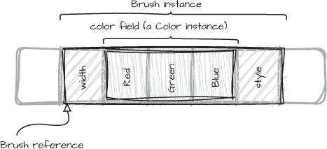
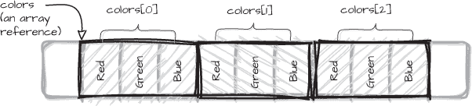

# 第二章：2 值类型与引用类型


我们可以通过多种方式在 C# 中创建新类型，并且我们需要考虑每种方法的个别特征，以确定哪种方法最适合我们的目标。特别是，了解值类型与引用类型的区别有助于我们选择合适的前进方式，因为这些差异在定义我们自己的类型时，可能会带来重要且有时未曾考虑到的影响。某些权衡将影响我们如何设计类型以及可以将其用于哪些场景。在本章中，我们将探讨这些差异以及它们对我们程序的意义。

我们将探讨以下内容：

+   创建我们自己类型时可选择的选项

+   为什么 C# 同时具有引用类型和值类型

+   选择其中一种类型如何影响构造、空值检查以及其他类型行为

+   为什么值类型不同于值语义

+   不同类型如何在内存中存储，以及这如何影响对象的生命周期

## 用户定义类型

大多数现代编程语言都允许你创建自定义类型。C# 中用户定义类型的基本原理对于许多其他语言的程序员来说是熟悉的，但一些细节有所不同。因此，在本节中，我们将探讨四种用户定义类型：结构体、类以及较新的记录类型和记录结构体（分别在 C# v9.0 和 v10.0 中引入）。

需要注意的是，这些类型的行为在很大程度上依赖于它们是引用类型还是值类型。让我们简要看看每种用户定义类型，并考虑这些差异。

### 结构体与类

清单 2-1 定义了一个简单的 结构体 来表示颜色。

```
public readonly struct Color
{
    public Color(int r, int g, int b)
        => (Red, Green, Blue) = (r, g, b);
    public int Red {get;}
    public int Green {get;}
    public int Blue {get;}
}
```

清单 2-1：定义一个简单的结构体

Color 结构体被标记为 readonly，表示 Color 的实例是不可变的——也就是说，它们的值永远不会改变。相应地，三个属性（Red、Green 和 Blue）都没有 set 访问器，因此在使用构造函数初始化它们的值之后，它们的值不能再被更改。

本例中的构造函数使用了表达式体语法（=>），这种语法你在第一章中已经见过，而不是用大括号{…}括起来的主体。我们通过使用*元组赋值*来将表达式主体写成单行语句，元组赋值将三个参数值r、g和b赋值给三个属性的元组。编译器将此语法转换为一种高效的赋值方式，直接将参数值赋给Red、Green和Blue属性的相应后备字段。

结构体定义中的readonly关键字并不是强制性的，但它强调了Color实例是不可变的。不可变值类型使我们的代码更易理解，并且可能通过编译器进行一些优化。

相比之下，如果我们定义一个Color类而不是结构体，我们不能在其定义中使用readonly关键字，尽管我们可以通过不为属性提供set访问器来使其不可变。定义Color作为类的唯一其他区别是使用class关键字进行定义：

```
public class Color
{
`--snip--`
```

Color的定义在其他方面与示例 2-1 中的定义相同。

这两种类型的主要区别在于，类是引用类型，而结构体是值类型。在我们分析这种区别的影响之前，让我们先看看记录和记录结构体类型。

### 记录和记录结构体

从 C# v9.0 开始，我们可以使用record关键字定义一个记录类型。记录引入了一种新的语法，用于简洁地定义类型。示例 2-2 创建了一个名为Color的记录类型。

```
public record Color(int Red, int Green, int Blue);
```

示例 2-2：定义一个记录

这个示例展示了一个 *位置型* 记录；Color 类型没有定义主体，但类型定义有自己的位置参数，编译器使用这些位置参数来生成完整的类型。在后台，编译器将记录转换为类定义，这意味着记录是引用类型。编译器还将参数名称 Red、Green 和 Blue 转换为同名的公共属性，并生成一个公共构造函数，通过匹配的参数初始化属性值。位置参数也被编译器用来生成其他方法，包括 Equals、GetHashCode 和 ToString，这些方法是对 object 基类中对应方法的重写。

列表 2-3 创建了一个新的 Color 记录实例，并像使用类或结构体一样使用其属性。

```
var tomato = new Color(Red: 255, Green: 99, Blue: 71);
Assert.That(tomato.Red, Is.EqualTo(255));
Assert.That(tomato.Green, Is.EqualTo(99));
Assert.That(tomato.Blue, Is.EqualTo(71));
```

列表 2-3：创建 Color 实例

在这里，我们在构造类型为 Color 的 tomato 变量时使用了命名参数，以强调编译器为构造函数参数所赋予的名称。请注意，断言中使用的属性名称与构造函数中使用的名称完全相同，并且都与记录定义中的名称一致。

> 注意

*记录与结构体或类之间的一个重要区别，涉及到处理两个实例之间的相等比较，这是我们将在“身份相等与值相等”一节中更详细地讨论的主题，见第 47 页。*

与记录紧密相关的是记录结构体，它是在 C# v10.0 中引入的。与记录不同，记录结构体被编译为结构体定义，使它们成为值类型。除此之外，它们与记录相同。记录结构体由 record struct 关键字标识，如下所示：

```
public readonly record struct Color(int Red, int Green, int Blue);
```

这个记录结构体，就像清单 2-1 中的结构体一样，被标记为readonly。如果我们省略了readonly关键字，编译器生成的属性将是读写属性，既有get访问器，也有set访问器。使用readonly关键字使得Color成为不可变的记录结构体。

### 继承

表示类与类之间、记录与记录之间关系的常见方法是使用*继承*，即将一个类型从另一个类型派生。然而，我们不能将继承应用于结构体或记录结构体；它仅适用于引用类型。

继承的另一个限制是，记录可以继承自另一个记录，但不能显式地继承自类。同样，类也不能继承自记录。在其他方面，记录与类在继承方面遵循相同的规则，并具有相同的特性。类和记录可以定义虚方法和属性，允许更派生的类型通过重写方法或属性来提供其自己的行为，我们可以选择忽略、重写或隐藏派生类型中的任何虚方法。

相反，结构体和记录结构体默认是*密封的*，这意味着禁止从它们继承。如果我们试图从结构体或记录结构体派生，将会遇到编译时错误。结构体和记录结构体也不能从其他用户定义的类型继承。

一个类或记录的另一个限制是它只能继承一个基类型。任何多重继承的尝试都会导致编译器错误。如果没有显式指定基类型，object将成为隐式的基类。正如你在“公共类型系统”章节中看到的，在第 45 页，每个类型最终都会直接或间接地继承自object。例如，清单 2-4 中的Command类隐式继承自object，而DummyCommand类则显式继承自Command，通过Command基类隐式继承object。

```
public class Command
{
    public virtual IEnumerable<Result> RunQuery(string query)
    {
        using var transaction = connection.BeginTransaction();
        return connection.Execute(transaction, query);
    }
    private readonly DatabaseConnection connection;
}
public class DummyCommand : Command
{
    public override IEnumerable<Result> RunQuery(string query)
    {
        return new List<Result>();
    }
}
```

清单 2-4：继承语法

这个Command基类定义了一个虚方法RunQuery，该方法在派生类DummyCommand中被重写，以改变方法的行为。像DummyCommand这样的存根实现可能在测试中使用，以避免测试代码依赖于底层数据存储的内容。

任何类型都可以*实现*多个接口，但重要的是要理解继承与接口实现是完全不同的。当我们实现一个接口时，默认情况下，实现的方法*不是*虚方法。一个实现了接口方法的类或记录可以选择将其方法实现标记为虚方法，但结构体或记录结构体不能这么做。

我们可以显式地将类或记录的任何成员指定为protected，与public、private或internal相对。受保护的成员可以在声明它的类内部访问，也可以在继承该类的任何类型中访问，但对其他代码不可见。由于值类型是封闭的，因此它们不可能拥有虚方法或受保护的成员。如果我们试图在值类型定义中将方法声明为虚方法，或定义任何受保护的字段、属性或方法，编译器将报错。

我们可以选择将类或记录类型声明为sealed，这样就不能再被继承。封闭类不会影响它自己能继承什么，只影响什么可以继承它。通常会封闭具有值类型特征的类，如string，或者当我们希望限制类的行为仅限于我们自己的实现时。如果一个类被设计为不可变的，无论它是否具有值类型特征，封闭它可以确保其不可变性不会被可变的派生类破坏。

记录类型专门用于作为值类型，并由编译器定义了值类型行为。这意味着除非有充分的理由，否则我们应当封闭记录类型。我们将在第六章和第七章中详细讨论*值类型*的含义，以及为什么这样的类型应当被封闭。

继承是面向对象代码的核心特性，但它仅适用于引用类型。继承以及支持继承的特性（如虚方法）并不适用于值类型，部分原因是值类型实例使用内存的方式不同。

### 类型实例生命周期

值类型和引用类型在内存使用方式上有所不同，具体来说，主要体现在它们实例的生命周期上。值类型实例的生命周期较短，它们的生命周期与表示它们的变量的生命周期绑定。对于值类型来说，变量*就是*实例；当我们创建一个值类型的新实例时，目标变量实际上包含了实例数据——也就是类型中每个字段的值。

在许多情况下，变量的生命周期由一个代码块定义，比如方法体或一个 foreach 循环。块内的任何局部变量在块结束时会停止存在。另一种情况是，变量可能被包含在另一个对象中，在这种情况下，变量的生命周期由包含对象的生命周期决定。每当我们通过将值类型变量赋值给另一个变量或将其作为参数传递给方法来复制变量时，这个副本就是类型的一个全新实例，存储在*不同*的变量中。

另一方面，引用类型实例通常生命周期较长，并且可以被多个变量引用。当我们创建一个引用类型的新实例时，我们会获得该实例在内存中的引用。每当我们复制该引用时，我们并不是在复制实例。原始引用和副本都指向相同的实例。引用存储在*引用变量*中。

所有引用类型实例都分配在堆上。它们的生命周期由自动垃圾回收管理，当程序不再需要它们时，垃圾回收会释放它们的内存。当垃圾回收器确定没有其他活动引用指向该实例时，对象被认为是未使用的。虽然引用类型实例不受其作用域的限制，但引用变量*是*受作用域限制的，因此当引用变量超出作用域时，它将不再是对实例的有效引用。因此，引用类型实例的生命周期由*所有*指向该实例的引用的生命周期决定。

分配到堆上是有代价的，因为垃圾回收过程需要时间，而程序在运行时必须处理它。确保未使用的堆内存被适当地清理是一项复杂的操作，并且可能会在短时间内中断程序的正常执行，因此引用类型会有额外的开销。

值类型不需要与垃圾回收相关的开销。当值类型实例的变量生命周期结束时，它所使用的内存可以被释放。为了更好地理解生命周期，我们可以更仔细地看一下在不同上下文中*变量*的含义。

## 变量

*变量*只是一个命名的内存区域。我们使用这个名称——或者*标识符*——来在变量的生命周期内操作内存位置。C# 有五种主要的变量类型：

**局部变量**

这些是块作用域变量，其中一个*块*可能是一个带有语句体的方法、循环体，或是任何由匹配的大括号 {} 限定的代码块。当控制流离开一个块时，位于该块内的局部变量将超出作用域。当一个异常在块内被抛出时，控制流也会离开该作用域以及任何包含该作用域的范围，直到异常被捕获或程序退出。

**实例字段**

这些是结构体和非静态类的普通数据成员，称为*字段*。每个类型的实例都有其自身的字段副本。实例字段的生命周期由它所属对象的生命周期决定。

**静态字段**

这些字段与类型相关，而不是与类型的单个实例相关。静态字段的生命周期通常与应用程序绑定，因此与静态字段关联的实例通常在应用程序退出时被释放。

**数组元素**

数组中的各个元素都是变量。我们可以通过索引访问特定元素，并且如果该元素是可变的，可以修改其实例。

**方法参数**

方法定义中的参数技术上称为*形式参数*，但通常称为*参数*。参数的作用域是方法体，就像该参数在方法体内被声明为局部变量一样。在调用方法的代码中，我们传递与方法参数对应的*实际参数*，更常被称为*实参*。

无论类型如何，变量总是有一个关联类型。这可能是显式声明的类型，比如声明 int size，或者对于局部变量，类型可能通过 var 关键字隐式推断。如果变量的类型是引用类型，则该变量的*值*是一个引用。非<sup class="SANS_TheSansMonoCd_W5Regular_11">null</sup>的引用是指向堆中某个实例的句柄。如果变量的类型是值类型，则变量的值是该类型的一个实例。

### 变量与值

判断什么是变量、什么是值并不总是直观的，但这种区分很重要：

+   *变量*是可以赋值的，尽管<sup class="SANS_TheSansMonoCd_W5Regular_11">readonly</sup>字段变量只能在其类型的构造函数中赋值，或者通过字段初始化赋值（我们将在“字段初始化器”一节中讨论，第 58 页）。

+   *值*是表达式的结果——例如调用new的结果、方法的返回值，或者常量表达式，如字面量数字或string字面量。*值*不能被赋值，但我们通过赋值或将它们作为参数传递给方法来初始化变量。

变量大多数情况下都有名称。严格来说，单个数组元素没有自己的名称，但对于一个数组变量arr，表达式arr[index] 本质上是元素的标识符。一个值可以有名称，但不需要有名称：表达式2 + 2 生成一个新值，但它是匿名的，除非我们将该值赋给一个变量。

值的类型定义了*实例*的样子。除此之外，类型可能有多个字段，当类型的实例创建时，需要在内存中分配空间。变量的类型定义了它可以包含的值的种类。

一个值仅仅是位模式。类型是一个正式的规范，用来解释该位模式并赋予它在程序中的意义。如果两个值具有相同的位模式，但它们的类型不同，它们可能会被不同地解释。如果类型是long，则一组全是0的位表示一种含义；如果类型是DateTime，则它完全表示另一种含义。

值类型的变量直接包含其数据，而引用类型的变量包含对其数据的引用。更准确地说，引用变量的值是对堆中某个对象的引用。简单来说，引用是指向引用类型实例的；引用类型变量的值是一个引用。

变量和值之间的关系是所有变量*都有*一个值，尽管在变量被确定赋值之前无法访问该值。

### 确定赋值

我们无法读取一个变量的值，除非编译器确认该变量已经被明确地赋予了初始值。更正式地说，只有在变量*已确定赋值*之后，才能读取它的值。C#语言规范精确定义了什么构成了确定赋值，但本质上是变量必须至少被赋值或初始化一次，才能读取它的值。

如果我们尝试获取任何尚未明确赋值的变量的值，编译器会抛出错误，告诉我们这不允许。例如，当我们在方法中声明一个局部变量时，除非我们给它赋值，否则它是未初始化的。这类变量最初被认为是 *未*赋值的。从概念上讲，至少在最初，一个未赋值的变量没有值。

当我们给一个变量赋值时，我们为该变量赋予一个新值。当我们从变量中读取时，我们获取它的值。变量和值都是 *表达式*，这意味着只要它们已经被明确赋值，我们就可以对它们进行求值以生成一个值。

重申一下，尝试从任何尚未被明确赋值的变量中读取值是一个错误。当我们使用 var 声明局部变量时，必须在声明变量的地方提供一个初始值，因为变量的类型是根据赋给它的值的类型推断出来的。

## 实例和存储

现在我们已经清楚地定义了变量和值，我们可以探讨它们与类型实例的关系。无论一个实例是值类型还是引用类型，都会影响它在内存中的分配和管理；因此，值类型变量有一些引用类型没有的特殊性。

尽管存在普遍的误解，值类型并不总是存储在栈上。局部变量的值通常与方法的块作用域相关联，因此可能与该方法的栈帧相关联，但值也可以作为成员或数组中的元素包含在另一个对象中。让我们通过查看一些变量如何嵌入到对象中的例子，来更深入地研究这一点。

### 嵌入值

如果一个变量是嵌入在另一个类型的实例中的字段，它的值会被分配到其外部对象的内存中。这对于直接包含其类型实例的值类型变量尤其重要。考虑 清单 2-5 中的 Color 结构体。

```
public readonly struct Color
{
    public Color(int r, int g, int b)
        => (Red, Green, Blue) = (r, g, b);
    public int Red {get;}
    public int Green {get;}
    public int Blue {get;}
}
```

清单 2-5: 定义一个具有多个字段的 Color 结构体

Color 结构体有三个属性，表示 RGB 颜色的各个组成部分。当 Color 值作为类中的字段或属性使用时，该类的实例将完全包含一个在堆上的 Color 值。以 清单 2-6 中的 Brush 类为例，它有几个字段，其中一个字段是 Color 类型。

```
public class Brush
{
`--snip--`
    public enum BrushStyle {Solid, Gradient, Texture}
    private readonly int width;
    private readonly Color color;
    private readonly BrushStyle style;
}
```

清单 2-6：嵌入在 Brush 类中的 Color 值

Brush 类型是一个类，因此是引用类型。当我们创建任何引用类型的实例时，它会被分配到堆上。Brush 类有三个字段，其中一个是 Color 实例，它本身有三个字段（Red、Green 和 Blue）。Brush 的实例在内存中的表现可能大致如下所示：图 2-1。



图 2-1：堆中 Brush 实例中嵌入的 Color 值

当我们创建一个新的 Brush 时，实例会被创建在堆上，并且我们会获得它的引用。color 字段直接占用 Brush 实例的内存空间。如果我们将 Color 实现为记录结构而不是结构体，结果仍然相同。记录结构与结构体一样，都是值类型，并直接分配在任何包含对象的内存空间中。

值类型实例不会单独进行垃圾回收，但如果值类型实例嵌入在另一个已分配在堆上的对象中，则该值类型实例所使用的*内存*将在包含对象的垃圾回收过程中被回收。

由 color 字段表示的 Color 实例的生命周期与 Brush 实例的生命周期相关。当垃圾回收器确定 Brush 实例不再使用时，它会释放该实例的内存，包括嵌入的 Color 值。

#### 数组元素

当值类型实例是数组中的一个元素时，严格来说，它并不是数组对象的一个字段，但该值仍然嵌入在数组的内存中。数组总是分配在堆上，无论其元素的类型如何。当我们创建一个数组时，会得到它的引用。为了说明这一点，考虑以下这个 Color 值的数组，其中 Color 是一个结构体：

```
var colors = new Color[3];
```

这里的<colors>变量是对堆上三个<Color>实例数组的引用。<colors>数组的内存布局可能如下图 2-2 所示。



图 2-2：内存中的 Color 结构数组

在<colors>数组中，每个元素的大小足以存储三个<int>后备字段。如果元素类型有更多字段，每个元素将需要更多的堆内存。如果<Color>类型是记录结构而不是结构体，那么布局将是相同的；回想一下，编译器会将记录结构转换为结构体。

相比之下，引用变量的大小是相同的，与类型定义中声明的字段数量无关。引用数组所需的内存仅由元素的数量决定，而与每个实例的大小无关。

无论数组的元素是引用还是值类型实例，数组始终存在于堆上，数组变量引用其元素。如果垃圾回收器确定该数组不再使用——即没有活跃的引用变量指向它——那么它所有元素的内存将一次性被释放。

#### 嵌入式引用

引用字段也嵌入在它们的封闭类型中，但它们的实例并非如此。如果我们在示例 2-5 中将<Color>实现为引用类型，而不是值类型，那么<Brush>实例的布局会有所不同。<Brush>类的<color>字段将是一个引用，如图 2-3 所示。


图 2-3：嵌入在 Brush 实例中的颜色引用字段

<Brush>类型的<color>字段并不包含整个<Color>实例，而是引用堆上某个地方的单独<Color>实例。引用类型的实例始终分配在堆上，并且相互独立。这适用于任何引用类型，因此无论我们将<Color>实现为类还是记录类型，这一情况都是成立的。

这里的`Color`实例的生命周期是*独立的*，与`Brush`实例无关。当`Brush`实例不再使用并释放内存时，`Color`实例将继续存在于内存中，直到垃圾回收器确定它不再需要为止。

#### 字段和属性布局

所有用户定义的类型都可以包含实例字段和属性。然而，结构体和记录结构体有一个限制，这个限制不适用于类或记录：值类型定义不能包含其自身类型的字段。

你已经看到值类型实例直接包含它们的字段。如果一个类型有一个字段，它本身是值类型，那么该字段也会直接包含*它*的数据。如果该字段的类型与其包含类型相同，编译器就无法确定如何创建它。考虑清单 2-7 中的简单结构体，它将一个自身的实例嵌入作为字段。

```
struct Node
{
    Node p;
}
```

清单 2-7：一个包含自身实例的结构体

这个示例将无法编译。编译器无法知道如何布局名为`p`的字段，因为`p`的类型在声明时尚未完全定义。属性也是如此，因为即使是自动属性也需要一个后备字段，尽管该字段对我们是隐藏的。

相同的推理适用于间接依赖，见清单 2-8。

```
struct Tree
{
    Node root;
}
struct Node
{
    Tree leftChild, rightChild;
}
```

清单 2-8：一个具有循环依赖的结构体

这里不能创建`Tree`类型或`Node`类型，因为每个类型的布局都依赖于另一个。这听起来可能有些苛刻，但实际上很少出现问题，我们有一个简单的解决方法：如果我们将`Tree`或`Node`的定义更改为引用类型，编译器会接受这段代码。这个规则只适用于值类型，因为如前所述，引用的大小始终是固定的，不管它们指向什么类型。这意味着编译器不需要知道类或记录的布局，就可以创建对它的引用。

### 装箱值

引用只能引用堆上的对象，不能引用单独的值类型实例，即使它们被封装在引用类型对象中。引用变量唯一能单独引用值类型实例的方式是复制该值，将副本放到堆上，并通过新的引用指向副本。创建副本并将其存储在堆上的过程，称为 *装箱*，当变量类型为引用类型时，这一过程是自动进行的。一个装箱的值总是可以转换回其原始值类型，这个过程叫做 *拆箱*，其中盒子中的值被 *复制* 到目标变量中。

当我们使用像 object 这样的引用变量来引用一个值，或者当我们将一个值作为参数传递给一个接受引用类型参数的方法时，装箱会自动发生。拆箱则总是 *显式* 的：我们需要将装箱变量转换回其正确的值类型，如 列表 2-9 所示。

```
public readonly struct Color
{
    public Color(int r, int g, int b)
        => (Red, Green, Blue) = (r, g, b);
    public int Red {get;}
    public int Green {get;}
    public int Blue {get;}
}
var red = new Color(0xFF, 0, 0);
var green = new Color(0, 0xFF, 0);
❶ object copy = green;
Assert.That(object.Equals(❷ red, copy), Is.False);
var copyGreen = ❸ (Color)copy;
```

列表 2-9: 装箱和拆箱

copy 变量的类型是 object，因此它是一个引用，所以 green 的值会被装箱到 copy 中 ❶。类似地，调用 object.Equals 方法时，会将 red 的值装箱，因为该方法接受两个 object 类型的参数 ❷。我们不需要显式地将值转换为 object 类型；它会被隐式装箱。我们确实需要显式转换来拆箱存储在 copy 中的值到一个新变量 ❸。

正如我们在接下来的公共类型系统部分中会看到的，object 是所有类型的基类，这意味着我们总是可以使用 object 来引用任何其他变量，包括值类型实例。结构体也可以实现一个或多个接口。接口是引用类型，因此，如果我们使用 object 或接口类型来引用一个值，那么该值会自动装箱到堆上。

装箱值只能被解箱为其原始类型。例如，我们不能将一个 int 值解箱为 double，即使从 int 到 double 存在隐式的内置转换。如果我们尝试将一个值解箱为除原始类型之外的任何类型，在运行时会抛出 InvalidCastException 异常。

被装箱的值会被复制到堆上，这意味着该盒子不再受到其变量作用域的限制，并且可能在原始值的生命周期之外存在。垃圾回收器负责清理装箱的值。第四章详细讨论了装箱问题。

## 语义学和类型

值类型具有超越结构体或记录结构体实例的语义意义。当我们定义自己的类型时，选择值类型而不是引用类型，考虑的不仅仅是潜在的优化。特别是记录类型与类不同，尽管记录类型在编译时会转换为类，因此是引用类型，但它们与值类型共享一些重要的行为特征。

在深入了解记录类型和记录结构体类型的行为之前，我们需要更好地理解结构体与类之间的差异。

### 公共类型系统

C# 拥有一个层次化的类型系统，称为 *公共类型系统*，其中所有类型都派生自 object，这是 System.Object 类型的关键字别名。这就是为什么我们始终可以使用 object 来引用任何其他变量——尽管正如你刚刚看到的，对于值类型，实例会被装箱，以便通过 object 引用。

即使是内置类型，如 int 和 float，也继承自 object。事实上，所有内置类型都是 System 命名空间中类型的别名。作为底层数值类型的 System 类型，都是结构体，因此是值类型。例如，int 是 System 类型 public readonly struct Int32 的别名。

使用 `enum` 关键字创建的枚举类型并不是 System 类型的别名，尽管它们都*派生*自 System.Enum 类。一个 `enum` 声明的各个值具有一个底层的数值类型，默认情况下是 int。我们可以指定一个不同的数值类型——例如，如果我们希望允许 `enum` 元素的值大于或小于 int 所允许的值。

非数值内建类型 `string` 和 `object` 是 System 命名空间中类的别名，因此它们都是引用类型。

当我们使用 `class` 或 `record` 关键字定义我们自己的引用类型时，我们的新类型直接派生自 `object` 基类，除非它显式继承自其他类型。`object` 基类既不是接口，也不是 `抽象` 类。它具有虚拟、非虚拟和静态成员，这些成员提供了所有对象的默认实现。

所有结构体类型（包括记录结构体）和 `System.Enum` 类型都隐式地从 `System.ValueType` 派生（对于 `ValueType` 没有关键字别名），而 `System.ValueType` 又派生自 `object` 基类，因此所有结构体类型*间接*派生自 `object`。值类型与引用类型不同，具有由语言定义的中间基类。

> 注意

*ValueType 本身不是* *结构体，这一点有时会被忽视。所有结构体都隐式继承自 ValueType，因此 ValueType 本身必须是一个类。此外，ValueType 是一个* 抽象 *类，这意味着我们可以创建对象的实例，但不能创建 ValueType 的实例。*

ValueType 类覆盖了在 object 基类中定义的所有虚方法——Equals、GetHashCode 和 ToString——并自定义了它们的实现，以提供适用于值类型的行为。ValueType 对 Equals 和 GetHashCode 的实现非常重要，因为它们提供了基于*值*的相等性定义，这将值类型与引用类型区分开。两者实现之间的区别在于值的复制方式。

### 复制语义

引用类型和值类型存储其实例数据的位置之间的区别，在我们复制变量时具有重要的意义，因为复制引用不会复制实例。Listing 2-10 显示了一个简单的例子来说明这种区别。

```
var thing = new Thing {Host = "Palmer"};
❶ var copy = thing;
❷ copy.Host = "Bennings";
Assert.That(thing.Host, Is.EqualTo("Palmer"));
```

Listing 2-10: 复制一个变量

在这里，我们将 thing 变量的值复制到一个名为 copy 的新变量中 ❶。然后我们为 copy 的 Host 属性赋予一个新值 ❷。测试检查原始变量的属性是否没有变化。测试断言是否成功取决于 Thing 是值类型还是引用类型。

如前所述，所有变量都有一个值，我们可以将其复制到一个新的变量。如果 Thing 是一个值类型，那么我们所做的任何复制都是该类型的新实例，因此如果我们修改该副本的任何字段，这些更改对原始值的字段没有影响。因此，如果 Thing 是一个结构体或记录结构体，测试将通过。

另一方面，如果 Thing 是一个引用类型，那么 thing 变量的值是一个引用。当我们复制引用时，只有引用的值被复制，并且它指向与原始变量值相同的实例。这意味着，如果我们使用一个引用修改实例，该更改会反映在*所有*指向该实例的引用中。因此，如果 Thing 是一个类或记录，测试将失败。

#### 锁和引用语义

有些情况需要引用类型变量的行为，使用值类型实例则会不正确甚至被禁止。例如，我们不能在lock语句中使用值类型来防止多线程并发执行某段代码。编译器禁止这样做，因为作为锁使用的变量需要是指向堆上对象的引用。锁对象的目的是让同一时刻只有一个线程可以执行它所保护的代码。对象实例标识了这个锁，之后可以有多个线程的引用指向它。

lock语句的底层机制是System.Threading.Monitor类。lock语句会转化为Monitor类的Enter方法，该方法以object作为参数。传给Monitor.Enter的任何值类型实例都会自动被装箱。每个线程调用Monitor.Enter时都会分别装箱该值，因此锁的获取不会失败，这使得这种方法变得毫无意义。

当我们使用完锁后，需要调用Monitor.Exit并传入用来获取锁的*相同*引用，即传给Monitor.Enter的引用。编译器会在lock代码块的闭合大括号处自动插入调用Monitor.Exit的代码。如果我们使用值类型，调用Exit会导致在堆上创建一个新的装箱值，因此它与传给Enter的引用不同。结果是释放锁时会失败，并抛出SynchronizationLockException错误。

这是一个积极要求引用语义的情况，因为传给Enter方法的引用不会复制实例。monitor和使用锁的代码都持有对同一实例的引用。

#### 标识等价性与值等价性

当我们说我们在比较变量以判断它们是否相等时，实际上是指我们在比较变量的*值*。如果两个变量的值相同，它们就被认为是相等的。每个值的类型在其中起着重要作用：被比较的值必须是相同类型的，尽管一个或两个值可能是通过隐式转换得到的。

如果我们比较两个相同引用类型变量的值，它们各自的值是引用，默认情况下，如果它们都引用内存中的同一对象，则被认为相等。这被称为*身份比较*。我们可以在自定义的引用类型中重写默认的身份比较行为（这是第五章中详细讨论的内容），但是如果两个引用指向具有相同字段值的不同实例，根据默认的身份比较，它们会被认为*不相等*，因为它们引用的是不同的对象。

相比之下，两个值类型实例会被认为相等——同样是默认情况下，因为我们可以修改这种行为——如果一个实例的所有字段与另一个实例的对应字段相等。值类型实例和引用类型实例在相等比较行为上的差异，直接与它们各自的复制语义相关。由于值类型实例的副本是具有相同*状态*的独立新实例，因此身份比较没有意义。因此，复制和相等的两个概念是密切相关的。

比较两个值是否相等的能力通常被低估。即使在我们的代码中很少需要比较变量，常用的类，如List< T >、Dictionary< T >以及作用于集合的 LINQ 方法，可能在我们看不见的地方执行了这些比较。Equals是由<object>基类定义的虚方法，这正表明它的重要性，因为这意味着我们可以在*任何*值上调用<code>Equals</code>方法来与其他任何值进行比较。

然而，object.Equals的实现始终执行身份比较，而对于值类型来说，这种比较是没有意义的。因此，所有结构体都隐式继承了ValueType类。ValueType重写了<code>Equals</code>方法，执行基于值的比较。

引用类型和值类型在相等性上的差异会影响我们的代码在运行时的行为。请参考 Listing 2-11，在这个例子中，Thing 类型尚未作为引用类型或值类型分配，也没有显式重写 Equals 方法。在这里，我们创建了两个 Thing 实例，它们的 Host 属性值相同。我们调用 Equals 方法时发生的情况，完全取决于 Thing 是类、记录、结构体还是记录结构体。

```
public ??? Thing
{
    public string Host {get; set;}
}
var thing = new Thing {Host = "Palmer"};
var clone = new Thing {Host = "Palmer"};
Assert.That(clone.Equals(thing), Is.True);
```

Listing 2-11: 比较两个独立变量的相等性

如果 Thing 是一个类，那么这个断言会失败，因为 object.Equals 方法只有在 clone 和 thing 是指向同一实例的引用时才会返回 true，但它们并不是指向同一实例。如果 Thing 是一个结构体，那么这个断言会通过，因为 ValueType 实现的 Equals 方法会在 clone 和 thing 具有相同的值时返回 true，即它们的所有字段都相等。

如果 Thing 是记录类型或记录结构体类型，则 clone 和 thing 变量也会被认为相等，因为它们也使用基于值的比较来判断相等性。

### 记录、结构体和值语义

记录是引用类型，但在比较两个记录变量是否相等时表现出类似值类型的行为。当一个记录类型被编译时，编译器会生成一个带有重写实现的 Equals 方法的类定义，除非我们自己定义一个。为记录生成的 Equals 方法通过比较两个实例的状态来判断它们是否相等，而不仅仅是比较两个引用是否指向同一个实例。

另一方面，在结构类型中，如果我们不重写 Equals，则相等性比较依赖于 ValueType 基类提供的 Equals 实现。记录类型作为引用类型，不继承自 ValueType。记录结构类型继承自 ValueType，但是与记录类型一样，Equals 由编译器生成的实现重写，因为 ValueType.Equals 可能不是最优实现。

ValueType 的实现必须是通用的；它必须适用于*任何*结构类型，无论该结构的字段类型如何。如果某个字段类型有自定义的 Equals 实现，则包含该字段的类型实例必须使用该字段的实现进行比较；简单的结构或按位比较实例可能并不总是正确的。ValueType 提供的 Equals 实现依赖于运行时的反射来确定如何比较字段，并且会使用重写的 Equals 实现来比较字段（如果该字段的类型有实现的话）。

如果我们希望避免在结构中使用反射的开销，我们必须重写 Equals 方法，通过我们自己的实现来比较每个字段和属性，并与正在比较的实例中的相应字段或属性进行对比。如果每个字段和属性值比较相等，并且在需要时使用其 Equals 方法，那么这两个实例就是相等的。这本质上是编译器为记录类型和记录结构类型提供的实现。

重申一下，结构体、记录类型和记录结构体都使用基于值的比较来实现 Equals 方法，但对于记录类型和记录结构类型，实施是由编译器自动生成的，免除了我们提供自定义实现的责任。

我们为记录类型使用的变量——但不包括记录结构类型——是引用类型，当我们将一个记录引用赋给另一个变量时，我们仍然得到指向同一个记录实例的两个引用，就像我们在类型为类时一样。因此，记录类型具有引用语义用于复制，而具有值语义用于相等性比较。

值类型和引用类型的比较和复制语义对于这些类型实例在运行时的行为有重要影响。然而，这些实例在最初创建时的差异也很重要。接下来的部分，我们将探讨类型是值类型还是引用类型时，构造和初始化的不同之处。

## 构造和初始化

创建一个新对象表面上是一个简单的操作，但在背后，编译器会付出很大努力，使这个过程尽可能高效。从原则上讲，创建一个对象涉及分配一个类型实例的内存，然后调用一个构造函数，构造函数的工作是初始化实例的字段。无论是值类型还是引用类型，语法都是相同的，但 new 会以不同的方式对待它们，并隐藏了有关不同类型在内存中如何分配的复杂性。换句话说，new 表达式是一个抽象，它让我们不必关心内存如何分配和使用的实现细节。

具体来说，引用类型实例的内存是动态分配的。当创建一个类或记录类型的新实例时，内存会在运行时分配到堆上。结构体和记录结构体类型的实例则以不同的方式分配内存，这取决于实例的使用方式。考虑以下代码，它用名为 Thing 类型的新实例初始化一个变量：

```
var thing = new Thing();
```

这个创建对象并将其分配给变量的基本语法，无论 Thing 是类、结构体、记录还是记录结构体，都是相同的。正如你将在接下来的部分看到的，这段代码依赖于 Thing 具有一个可以无参数调用的可访问构造函数，而当 Thing 是引用类型时，情况未必如此。不过，暂时假设可以通过这种方式创建 Thing 实例。如果 Thing 是类或记录，new 会在运行时将内存分配到堆上，并返回对新对象的引用，该引用会被赋值给 thing 变量。

如果Thing是一个结构体或记录结构体，则新的实例会被分配给thing变量。然而，这段代码可能会也可能不会为Thing的一个新实例分配内存，也可能会也可能不会调用构造函数。原因在于构造和初始化是两个独立的过程。部分差异与Thing是值类型还是引用类型有关。

### 默认初始化

*默认初始化*意味着类型的每个字段，包括属性的后备字段，都将被赋予默认值，语言中对此有明确定义，通常意味着以下之一：

+   引用被设置为null。

+   内建的数值类型变量被设置为0。

+   所有其他值类型都被默认初始化。

默认初始化的引用类型字段是错误的常见原因。例如，Listing 2-12 中的简单MusicTrack结构体依赖于我们手动初始化实例并设置其属性。如果我们忽视了为MusicTrack实例的属性设置合适的值，使用该实例时可能会遇到异常。

```
public struct MusicTrack
{
    public string Artist {get; set;}
    public string Name {get; set;}
    public override string ToString()
        => $"{Artist.ToUpper()}: {Name.ToUpper()}";
}
 var defaultTrack = new MusicTrack();
var print = defaultTrack.ToString();
```

Listing 2-12：初始化引用类型字段

对ToString的调用会导致null引用异常，因为defaultTrack的值已经被默认初始化。ToString方法会对其Artist和Name属性调用ToUpper，而这些属性的默认初始化值是null。我们需要警惕任何使用默认初始化引用的情况，以避免由于访问null引用而导致的问题。最小化默认初始化值影响的一种方式是提供我们自己的实例构造函数。

### 实例构造函数

实例构造函数与方法类似，可以有零个或多个参数。像方法一样，构造函数也可以被重载，因此我们可以为一个类型定义多个构造函数，每个构造函数具有不同数量的参数或不同类型的参数。类、结构体、记录和记录结构体的构造函数定义有许多相似之处，但也存在一些重要的区别。

在示例 2-13 中，我们为MusicTrack结构体添加了一个构造函数，并使用参数值来初始化实例的属性值。如果某个属性的对应参数为null，我们使用空值合并运算符??为每个属性分配一个空字符串。

```
public readonly struct MusicTrack
{
    public MusicTrack(string artist, string name)
    => (Artist, Name) = (artist ?? string.Empty, name ?? string.Empty);
    public string Artist {get;}
    public string Name {get;}
    public override string ToString()
        => $"{Artist.ToUpper()}: {Name.ToUpper()}";
}
```

示例 2-13：添加带参数的实例构造函数

通过添加构造函数，我们不再需要依赖MusicTrack的用户显式设置属性，因为这些属性的初始值已经在构造函数中设置。我们将这些属性设置为get-only，即它们只能在构造函数中赋值，并将MusicTrack设为readonly结构体。然而，我们仍然需要小心在ToString方法中使用这些属性值，因为任何值类型的实例都可以被默认初始化，无论是否存在用户定义的构造函数。为MusicTrack添加自己的构造函数以赋予属性有意义的值，并不足以防止因使用null引用调用方法时发生的异常，因为MusicTrack是一个结构体类型。

如果启用了可空引用类型特性（参见 第 64 页 了解更多），构造函数的参数将是非可空变量，这意味着如果传递 null 给任何一个参数，就会导致编译器警告。使用非可空参数并不意味着不能传递 null 作为参数，但我们可以决定警告足够的保护，可能会允许我们省略构造函数中的空合并赋值。然而，可空引用类型特性并不意味着我们可以避免在使用属性值之前验证它们是否为 null。幸运的是，空值条件运算符使得检查变得简单且安全：

```
public override string ToString()
    => $"{Artist?.ToUpper()}: {Name?.ToUpper()}";
```

这里出现了空值条件运算符，一个附加在每个属性名称后的 ?，意味着在每种情况下，ToUpper 方法只有在属性值非 null 时才会被调用。如果任一属性为 null，则花括号内字符串的表达式结果为 null，而字符串插值会将其视为空字符串。

如果 MusicTrack 是一个类或记录类型，存在我们自己的构造函数意味着我们无法再创建一个不传递参数的实例，必须像这样传递参数：

```
var track = new MusicTrack();
```

如果我们尝试创建一个默认构造的实例，会出现以下编译器错误：

```
[CS7036] There is no argument given that corresponds to the required formal parameter 'artist'
of 'MusicTrack.MusicTrack(string, string)'
```

如果我们没有为类或记录类型提供任何构造函数，编译器会为我们插入一个默认构造函数。然而，当我们为自定义引用类型定义构造函数时，编译器不会生成默认构造函数。编译器不会为值类型生成默认构造函数，但即使我们没有定义自己的构造函数，结构体或记录结构体的实例也可以进行默认初始化。

#### 默认构造函数与生成的构造函数

引用类型和值类型的行为有所不同，部分原因是引用类型在堆上分配内存，而值类型可能不在堆上分配。编译器为引用类型生成默认构造函数，因为这类类型的实例是动态分配的，其实例会在运行时初始化。当引用类型的实例在堆上分配时，分配给它的内存会被初始化为零，从而有效地进行默认初始化。

值类型的处理方式不同，因为它们的内存不一定是在运行时分配的：对于局部值类型变量，编译器可能会为实例数据“保留”内存，程序直接访问这些内存。底层的通用中间语言（CIL）有一个高效的指令来默认初始化值类型实例，实际上将实例使用的内存清零，无论其内存实际位于何处。

我们可以将结构体或记录结构体的默认初始化视为由编译器提供的默认构造函数执行，因为无论如何结果是相同的。默认初始化值类型提供了一定的性能优势，因为它不需要调用构造函数的方法，尽管这几乎从来不是最重要的优化。

在位置记录或位置记录结构体中，编译器会根据我们在类型定义中使用的参数生成一个公共构造函数，如下所示：

```
public sealed record Color(int Red, int Green, int Blue);
```

这个示例中Color的参数告诉编译器使用这些名称和类型创建公共属性。编译器还会生成一个与记录的参数列表具有相同签名的构造函数，并将属性赋予它们的值。编译器生成的构造函数等同于以下内容：

```
public Color(int Red, int Green, int Blue)
    => (this.Red, this.Green, this.Blue) = (Red, Green, Blue);
```

虽然构造函数是由编译器生成的，但它仍然被视为用户定义的构造函数，因此仍然会抑制默认构造函数，用于Color记录。

无论其类型如何，实例在第一次创建时总是默认初始化的，无论其内存是分配在堆上还是其他地方。

当我们为类定义自己的构造函数时，可以依赖所有字段在构造函数体之前已经被默认初始化；类的字段在构造函数内被视为*初始赋值*。在结构体的构造函数中，字段是*初始未赋值*的，因此我们必须为结构体或记录结构体的每个字段分配一个值，即使只是用默认初始化的等效值来替换它。

#### 构造函数重载

我们可以为任何类型提供带参数的构造函数，并且通过定义多个具有不同数量或类型参数的构造函数来重载构造函数。当我们希望支持不同方式构造类型时，这非常有用。例如，清单 2-14 展示了一个具有两个具有不同签名的构造函数的结构体。

```
public readonly struct Color
{
    public Color(int red, int green, int blue)
        => (Red, Green, Blue) = (red, green, blue);
    public Color(uint rgb)
        => (Red, Green, Blue) = Unpack(rgb);
    public int Red {get;}
    public int Green {get;}
    public int Blue {get;}
}
```

清单 2-14: 构造函数重载

第一个构造函数通过三个单独的参数（red、green、blue）初始化三个属性。第二个构造函数接收一个 RGB 值的数字表示，并通过调用Unpack方法（此处未显示）来解包数字为其组成部分，从而初始化<sup class="SANS_TheSansMonoCd_W5Regular_11">Red</sup>、<sup class="SANS_TheSansMonoCd_W5Regular_11">Green</sup>和<sup class="SANS_TheSansMonoCd_W5Regular_11">Blue</sup>属性。我们通过传递不同的参数来选择不同的重载构造函数，如列表 2-15 所示。

```
var orange = new Color(0xFFA500);
var yellow = new Color(0xFF, 0xFF, 0);
```

列表 2-15：选择正确的重载

在这里，orange变量是使用带有单个uint参数的构造函数（列表 2-14 中的第二个构造函数）创建的，而yellow变量则使用带有三个int参数的构造函数（列表 2-14 中的第一个构造函数）。

#### 无参数构造函数

如前所述，为类类型定义我们自己的构造函数将会抑制编译器生成的默认构造函数，这意味着我们只能通过将参数传递给我们自己构造函数的参数来创建该类型的新实例。如果我们需要在没有参数的情况下创建此类引用类型的实例，我们可以定义自己的*无参数构造函数*，我们可能会用它来初始化引用类型的字段和属性为非<.samp class="SANS_TheSansMonoCd_W5Regular_11">null的值。当一个类包含需要初始化但可以为空的集合时，这种做法很常见，如列表 2-16 所示。

```
public sealed class Playlist
{
    public Playlist(IEnumerable<MusicTrack> items)
      ❶ => queue = new(items);
    public Playlist()
      ❷ => queue = new();
 public void Append(MusicTrack item)
        => queue.Add(item);
`--snip--`
    private Queue<MusicTrack> queue;
}
```

列表 2-16：定义一个无参数构造函数

此处定义的两个构造函数允许我们通过传递一系列项来填充队列 ❶，或者通过不传递任何参数 ❷ 来创建一个<sup class="SANS_TheSansMonoCd_W5Regular_11">Playlist</sup>。如果我们不传递任何参数，则<sup class="SANS_TheSansMonoCd_W5Regular_11">queue</sup>字段将被初始化为空队列，确保它不是null。

两个构造函数通过使用类型推断来初始化 queue 字段，这是一种在 C# v9.0 中引入的特性，称为 *目标类型的新建*。编译器从正在初始化的目标变量的类型中推断出 new 所需的类型——在本例中，是 Queue< MusicTrack>。queue 字段对于任何 Playlist 实例都保证非 null，因此我们不需要在 Playlist.Append 方法中检查 null。

在位置记录中，编译器根据位置参数为记录创建构造函数，因此默认情况下，位置记录的实例不能在没有参数的情况下创建。如果我们需要这种行为，可以为位置记录定义自己的无参构造函数。另一方面，结构体或位置记录结构体 *总是* 可以在没有参数的情况下创建，无论我们是否定义自己的构造函数。

#### 结构体和默认值

从 C# v10.0 开始，我们可以为值类型定义自己的无参构造函数，以帮助确保任何引用类型字段都为非 null。然而，我们仍然需要在值类型的实现中检查 null，因为结构体或记录结构体的实例始终可以通过默认初始化，这实际上绕过了我们定义的任何构造函数。此处在 列表 2-17 中进行了说明，我们为 MusicTrack 结构体添加了一个无参构造函数，该构造函数显式初始化了两个 string 属性。

```
public readonly struct MusicTrack
{
    public MusicTrack()
        => (Artist, Name) = (string.Empty, string.Empty);
    public MusicTrack(string artist, string name)
        => (Artist, Name) = (artist, name);
    public string Artist {get;}
    public string Name {get;}
    public override string ToString()
        => $"{Artist?.ToUpper()}: {Name?.ToUpper()}";
}
```

列表 2-17：为结构体添加无参构造函数

无参数构造函数将两个引用类型属性设置为非 null 值，因此在使用通过 new MusicTrack 创建的 MusicTrack 实例时，调用这两个属性的 ToUpper 是安全的。然而，这并不意味着我们可以省略 ToString 中的空值条件检查。如果实例是一个默认初始化的 MusicTrack（例如，它是数组中的一个元素），则 Artist 或 Name 仍然可能为 null。

```
var favorites = new MusicTrack[3];
var print = favorites[0].ToString();
```

如果在 ToString 中没有检查 null，这段代码会导致 ToString 抛出 NullReferenceException，因为创建 favorites 数组时并没有调用元素的无参数构造函数。每个元素都被默认初始化，导致 Name 和 Artist 属性的默认值为 null，因此尝试对 null 引用调用 ToUpper 方法会导致异常。

数组元素在没有调用我们提供的任何无参数构造函数的情况下进行默认初始化。无参数构造函数仅在使用 new 关键字创建新实例时使用。

#### 值类型初始化

值类型实例在内存中分配的一种微妙后果是，如果值类型的字段都是公开的，我们可以明确地在构造函数外为每个字段赋值（只要它们不是只读的），这将导致整个实例被完全赋值。

例如，清单 2-18 为一个未初始化的结构体变量的每个字段赋值。

```
public struct Color
{
    public int red;
    public int green;
    public int blue;
}
Color background;   // initially unassigned variable
background.red = 0xFF;
background.green = 0xA5;
background.blue = 0;
Assert.That(background.red, Is.EqualTo(0xFF));
```

清单 2-18：明确为结构体赋值

这段代码能够编译，且测试通过。我们可以读取 red 字段的值，即使我们从未用 new 分配过 background 变量或为其调用构造函数。如果 Color 是记录结构体，情况也是一样的。

这个示例展示了值类型变量直接包含其类型的实例。为每个字段赋值意味着我们不需要显式构造一个实例。然而，依赖这种行为可能会引发其他问题，最重要的一点是，使用公共字段会使得 Color 类型容易被滥用，无论是有意还是无意。在实践中，构造函数是初始化值类型字段的更好方式，这些字段应该都是私有且只读的。

请注意，如果我们将公共字段更改为可公开修改的属性，代码将无法编译。在实例本身被完全并明确赋值之前，无法以任何方式访问值类型的属性。每个属性都有一个由编译器生成的备份字段，并且该备份字段始终是私有的。

#### 构造函数访问性

带参数的构造函数可以在任何类型中设为公共或私有。当我们希望防止用户使用特定参数创建实例时，私有构造函数非常有用。在第一章的“静态创建方法”中，我们使用了这种技术，强制用户调用我们定义的静态类工厂方法来创建某些值，而不是直接使用 new 关键字。在类或记录中，我们可以将无参构造函数设为私有，以防止用户创建默认构造的实例，示例如 Listing 2-19 中的 Color 记录。

```
public sealed record Color
{
    private Color() {}
    public static Color Black {get;} = new Color();
`--snip--`
}
```

Listing 2-19: 为引用类型设置私有构造函数

由于 Color 的构造函数被标记为 private，我们可以用它来初始化静态的 Black 属性值以及 Color 的其他静态或实例成员，但它对 Color 类型之外的代码不可访问。如果 Color 的用户忘记并尝试使用 new 创建实例，编译器将禁止此操作：

```
var black = new Color();
[CS0122] 'Color.Color()' is inaccessible due to its protection level
```

类和记录也可以在构造函数上使用protected关键字，使其对继承类型可用。由于结构体和记录结构体不能被继承，编译器将阻止在值类型中使用protected。

在结构体（struct）或记录结构体（record struct）中，如果我们定义了自己的无参构造函数，它*必须*是公共的。无论是否提供无参构造函数，结构体和记录结构体的实例*总是*可以进行默认初始化。

### 字段初始化器

在类或记录定义中，以及在 C# v10.0 及以后版本中的结构体或记录结构体中，我们可以通过使用*字段初始化器*来内联赋值给字段。对于自动属性，我们可以通过使用*属性初始化器*来做同样的事情，初始化与属性关联的隐藏后备字段。列表 2-20 使用字段初始化器为列表 2-16 中的`Playlist`类的`queue`字段赋值，并为`Playlist`添加了一个`Name`属性，我们通过属性初始化器也为其赋了初值。

```
public sealed class Playlist
{
`--snip--`
    public string Name {get; set;} = "_playlist";
    private Queue<MusicTrack> queue = new();
}
```

列表 2-20：为字段和属性赋初值

字段和属性初始化器是对象构造的一部分，但在值类型实例进行默认初始化时不会应用。概念上，初始化器是在构造函数体之前应用的。如前所述，如果没有用户定义的构造函数或位置构造函数，编译器会为类和记录类型创建一个默认构造函数；然而，编译器不会为任何值类型合成一个无参构造函数。因此，如果我们想在结构体或记录结构体类型中使用字段或属性初始化器，必须定义至少一个构造函数。这可以是一个无参构造函数，也可以是一个接受一个或多个参数的构造函数。

字段初始化器不能引用任何实例成员。然而，由于静态字段在任何实例字段之前肯定会被赋值，因此字段初始化器可以引用静态值。静态字段也可以有初始化器，并且可以引用其他静态字段。然而，在引用一个静态字段时，我们需要小心，因为静态字段是按照它们在类中出现的顺序进行初始化的。

### 对象初始化器

使用*对象初始化器*，我们可以在创建新实例时为公共可变属性设置值，如下所示：

```
var fineBrush = new Brush {Width = 2};
```

类、记录、结构和记录结构都支持这种语法，并且它们的行为方式相同。每种类型的初始化过程相同：通常的方式调用构造函数来创建实例，然后将值分配给实例的属性。在此示例中，使用无参数构造函数（或具有所有可选参数的构造函数）创建一个 Brush，但我们可以在大括号内的初始化表达式之前调用任何构造函数。在不需要任何参数的构造函数的特殊情况下，我们可以省略构造函数的圆括号。

类和记录需要有一个可访问的无参数构造函数才能使用此语法。如果类或记录的无参数构造函数被隐藏或为非公共的，我们*必须*在大括号内的对象初始化之前调用一个有效的构造函数。对于结构或记录结构类型，我们不必担心这个问题，因为如果类型没有无参数构造函数，它们总是可以进行默认初始化。

#### 仅初始化属性

从 C# v9.0 开始，任何属性都可以是*仅初始化*的，这意味着它只能在创建新实例时进行赋值。在 C# v9.0 之前，对象初始化要求属性必须具有公共的 set 访问器，这意味着不可变属性无法使用对象初始化。对象初始化要求在构造函数完成后设置属性的值，而没有公共 set 访问器的属性不允许这样做。一个 init 访问器允许在对象初始化期间设置属性值，且在初始化完成后使属性变为不可变。

示例 2-21 中的 Color 结构演示了如何在对象初始化过程中使用 init 仅初始化属性。

```
public readonly struct Color
{
    public int Red {get; init;}
    public int Green {get; init;}
    public int Blue {get; init;}
}
var orange = new Color {Red = 0xFF, Green = 0xA5};
Assert.That(orange.Red, Is.EqualTo(0xFF));
Assert.That(orange.Green, Is.EqualTo(0xA5));
Assert.That(orange.Blue, Is.EqualTo(0));
```

示例 2-21：将属性设置为仅初始化

当我们创建orange变量时，首先会默认构造一个新的Color，为每个属性赋予其默认值0。大括号中的对象初始化器为Red和Green属性赋予新值，而Blue属性则保留其默认值。请注意，Color是一个readonly结构，这要求该结构不能具有可变的属性。

我们可以在实例构造函数中或通过对象初始化为init只读属性赋值，但在实例创建之后不能再为其赋新值。init只读属性是不可变的。init访问器语法可以用于任何类型的属性和索引器，尽管它是在 C# v9.0 中引入的，以支持由记录支持的特殊初始化语法，这种语法被称为*非破坏性*变异。

#### 非破坏性变异

记录和记录结构支持非破坏性变异语法，并且从 C# v10.0 起，结构体和匿名类型也支持这一语法。从语法上看，非破坏性变异与对象初始化类似，唯一的区别是它通过复制现有实例并为复制中的选定属性提供新值来初始化一个新实例。列表 2-22 展示了这种语法，使用with关键字将orange记录变量复制到一个名为yellow的新变量中，然后为复制中的某个属性分配新值。

```
public sealed record Color(int Red, int Green, int Blue);
var orange = new Color(0xFF, 0xA5, 0);
var yellow = orange with {Green = 0xFF};
Assert.That(yellow.Red, Is.EqualTo(0xFF));
Assert.That(yellow.Green, Is.EqualTo(0xFF));
Assert.That(orange.Green, Is.EqualTo(0xA5)); // unchanged in orange
Assert.That(orange.Blue, Is.EqualTo(0));
```

列表 2-22：使用非破坏性变异初始化记录的副本

我们在创建yellow变量时使用的<code>with</code>表达式，会创建一个新的Color记录实例，该实例的属性值与原始的orange实例相同。接着，with后面的大括号中的属性将通过与对象初始化相同的语法赋值。这种方法被称为*非破坏性*变异，因为它不会对原始记录进行任何修改。

构造函数和初始化器都是我们可以使用已知值创建新实例的方法。然而，有时我们无法为变量提供初始值，但将其保持未初始化状态又太过严格：我们甚至无法测试它是否有值，因为确定赋值的规则。下一节中，我们将探讨在需要没有值的变量时，我们有哪些选择，并且值类型和引用类型在这一点上也有所不同。

## null 值与默认值

一个普通的值类型变量永远不能是 null。值类型的实例直接包含其所有字段，并不一定有表示“无值”的方式。通过默认初始化的值类型实例并不相同——它是该类型的完整实例，只是每个字段都被默认初始化了。

我们可以使用可空值类型，它可以赋值并与值 null 进行比较，稍后你将看到，但普通的值类型实例与 null 不兼容。null 常量表达式是一个引用，因此只能赋值给引用类型变量。不能将 null 赋给值类型变量的一个含义是，我们不能将 null 作为参数传递给值类型方法。

同样，试图*比较*一个值与 null 也没有意义。如果我们这样做，如列表 2-23 所示，编译器会拒绝代码。

```
public readonly struct Speed
{
`--snip--`
}
var c = new Speed();
Assert.That(c == null, Is.False);
```

列表 2-23：将值类型变量与 null 进行比较

编译器给出的错误如下所示：

```
[CS0019] Operator '==' cannot be applied to operands of type 'Speed' and '<null>'
```

然而，我们可以将任何引用类型与 null 进行比较，并且从 C# v8.0 开始，我们可以使用常量模式通过使用 is 关键字，使这一比较更加直接：

```
Assert.That(someObject is null, Is.True);
```

将任何值类型与 null 进行比较没有意义，无论我们选择哪种方法，因为 null 是一个引用类型，并且因此与值类型有不同的表示方式。话虽如此，关于不能将值类型与 null 进行比较的规则有一个例外：泛型类型。

### 泛型与 null

在通用类或方法中，未约束的类型参数变量可以与null进行比较。未约束的通用类型可以是值类型或引用类型。为了说明这一点，列表 2-24 中的简单示例将通用参数类型的实例与null进行比较。

```
public static int Compare<T>(T left, T right)
{
    if(left is null) return right is null ? 0 : -1;
`--snip--`
}
```

列表 2-24：将通用类型参数实例与 null 进行比较

Compare通用方法有一个名为T的类型参数，它可以表示值类型或引用类型，因为它没有类型约束。在这个实例中，T不被认为是值类型，因此编译器允许这种语法。如果T的类型在运行时被确定为值类型，则整个表达式会简单地计算为false。

编译器仍然阻止我们将null赋值给类型为T的变量，因为如果T是值类型，则赋值会在运行时失败。同样，我们也不能通过未约束的类型参数返回null，这在列表 2-25 中进行了演示。

```
public static T Consume<T>(IProducerConsumerCollection<T> collection)
    => collection.TryTake(out var item) ? item : null;
```

列表 2-25：尝试将 null 作为通用参数类型返回

这将导致以下错误：

```
[CS0403] Cannot convert null to type parameter 'T' because it could be a non-nullable value
type. Consider using 'default(T)' instead.
```

在这个例子中，问题的根源在于T是未约束的。它可能表示一个结构体或记录结构体类型，对于这些类型，null不是一个有效的值。错误消息给出了一个线索，提示我们可以返回T的*默认*值，而不是返回null。默认值也有其他更重要的用例，但也有一些限制。

### 通用类型和默认值

默认值的概念与null值密切相关，尤其是在通用类型和方法的上下文中。有时候，我们——以及编译器——必须确保一个通用参数类型T的实例被确实赋值，即使在编译时不知道T的类型。我们不能仅仅使用new来创建类型T的新实例，因为编译器无法确定T可用的构造函数。

如果T是值类型，我们可以*始终*通过使用默认初始化或调用无参数构造函数来创建默认实例，但如果T是引用类型，它可能没有可访问的默认或无参数构造函数。我们可以在T上使用new约束，这意味着我们的通用类型或方法将仅与具有可访问无参数构造函数的类型一起工作，但这可能过于严格。

在通用类型中，我们可以使用通用参数表示通用参数类型的字段或属性。通用值类型必须确保*所有*字段在控制离开构造函数之前都已确实赋值。为了实现这一点，我们使用default关键字初始化T的默认实例，如在清单 2-26 中所示的通用结构体。

```
public readonly struct Node<T>
{
    public Node(int index)
    {
        idx = index;
        contained = default;
    }
 private readonly int idx;
    private readonly T contained;
}
```

清单 2-26：初始化类型参数的默认实例

在Node构造函数中，contained字段通过使用目标类型的默认字面量（自 C# v7.1 起可用）被赋予其类型的默认值，这等同于表达式default(T)。其中，T如果是类或记录类型，则其默认值为null；如果T是结构体或记录结构体，则默认值为一个默认初始化的实例。请注意，通过使用default初始化值时，并不会调用无参数构造函数，即使我们已定义了该构造函数。此代码是有效的，因为我们总是可以为类型T的变量创建一个默认的*值*：如果T是值类型，则该值是T的默认实例；如果T是引用类型，则默认值为null。default关键字在泛型类型和方法之外有许多用途，但在泛型代码中，它是不可或缺的。

默认值很有用，但它们不足以将某个特定的值类型实例标识为无效。换句话说，当我们真正想表示的是*没有值*时，我们不能使用默认值。结构体或记录结构体的默认值是一个默认初始化的实例，因此可能是一个*有效*值。请参考示例 2-27。

```
int x = default;
int y = 0;
Assert.That(x.Equals(y), Is.True);
```

示例 2-27：默认值可能是有效的。

int类型的默认值是0，在某些情况下我们可能使用它来表示无效的数字，但并非所有情况下都如此。是否重要，尤其是对于我们自己的值类型，取决于类型实例使用的上下文，但仅限于非零值作为有效整数将非常局限。幸运的是，我们有替代方案。

### 可空值类型

*可空值类型*允许我们表示一个值类型，意味着*没有值*。可空值类型是对值类型的包装，且可空值类型变量可能有值，也可能没有值。可空值类型变量还可以被赋值为null，通过在示例 2-28 中使用一个简单的测试进行演示。

```
int? x = null;
int y = 0;
Assert.That(x.Equals(y), Is.False);
```

示例 2-28：使用可空值

x 变量的 int 类型后面的 ? 是简写方式，表示 x 是一个 Nullable<int>。我们现在可以表示一个无效的 x 值，它与任何有效的 int 值不同。我们可以对任何值类型使用可空变量，而不仅限于内建类型。可空类型的默认值是 null，如下所示：

```
int? x = default;
int? y = null;
Assert.That(x.Equals(y), Is.True);
```

该测试通过，因为 x 和 y 都是 null。第一行中 x 的声明没有初始化默认的 int，而是初始化了默认的 Nullable<int>。可空值之间的相等比较会比较底层值（如果有的话）。如果两个可空值都没有值，或者它们的值本身相等，那么这两个可空值相等。Nullable<T> 是一个结构体，并重写了 Equals 方法以提供此行为。

由于不能将 null 赋给普通值类型变量，我们无法在 as 表达式的右侧使用普通值类型，如下所示：

```
object speed = new Speed();
var actual = speed as Speed;
```

如果 Speed 是一个结构体或记录结构体，这段代码将无法编译，因为如果转换失败，as 运算符将返回 null。正如我们所知，null 不能赋值给一个值类型。解决方案是使用可空值类型作为转换的源，如下所示：

```
var actual = speed as Speed?;
```

在此示例中，actual 变量的类型是可空的 Speed，如果转换失败（即 speed 变量实际上不是 Speed 类型），它将具有值 null。

### 可空引用类型

C# v8.0 引入了 *可空引用类型*，这是一个功能，它允许编译器在引用为 null 或可能为 null 时发出警告，而我们期望它具有一个真实的值。虽然引用变量一直可以拥有 null 值，但可空引用类型功能使我们能够明确表示我们是否 *打算* 让它们为 null。换句话说，当我们使用一个可空引用类型变量时，我们在明确表示 null 是该变量的 *预期* 潜在值。

引用变量默认是非可空的。在清单 2-29 中的声明中，brush 变量是一个 *非可空* 引用。

```
object brush = null;
```

清单 2-29：声明一个非可空引用变量

编译器执行静态分析，使其能够在无法保证非可空引用为非 null 时发出警告。用更少的否定来表述，编译器发出警告，如果可能为 null 的值被赋值给一个非可空引用。特别地，赋值 null 给一个非可空引用，如我们刚刚所做的，会引发此警告：

```
[CS8600] Converting null literal or possible null value to non-nullable type
```

如果我们尝试将一个可能是 null 的值作为参数传递给一个非可空的方法参数，编译器将给我们发出警告。考虑清单 2-30 中的方法，它将字符串中每个单词的第一个字符大写。

```
public static string ToTitleCase(string original)
{
    var txtInfo = Thread.CurrentThread.CurrentCulture.TextInfo;
    return txtInfo.ToTitleCase(original.Trim());
}
```

清单 2-30：定义具有非可空引用参数的 ToTitleCase 方法

在 ToTitleCase 方法中，我们应该能够依赖 original 参数具有一个真实的、非 null 值，因为它是一个非可空字符串。这意味着我们可以避免显式地编写代码来检查它是否为 null。当我们调用 ToTitleCase 时，如果编译器无法保证我们传递的参数不是 null，它将给我们一个警告。

然而，我们可能确实需要一个null引用，在这种情况下，我们将变量的类型标记为可空类型，以抑制编译器关于可能的 null 赋值警告。语法与可空值类型相同：我们在类型后面加上?。 示例 2-31 展示了一个可空的string元素集合，通过string?类型名称来指定。

```
var names = new List<string?>();
// Load names from somewhere, may contain null elements
--`snip--`
var properNames = names.Select(name => ToTitleCase(name));
```

示例 2-31：传递一个可能为 null 的参数给不可空的参数

如果我们将示例 2-30 中的ToTitleCase方法应用于这个集合，我们会得到与示例 2-29 相似的编译器警告，在那里我们显式地将null赋值给一个不可空引用类型的变量：

```
[CS8604] Possible null reference argument for parameter 'original' in 'string
ToTitleCase(string original)'.
```

我们会收到这个警告，因为编译器无法保证集合中不包含null元素。编译器假设集合中的任何元素都可能是null，因为集合的元素类型是一个可空引用类型。

如果我们在调用ToTitleCase方法之前显式地检查每个元素，编译器可以确定我们没有将null引用作为方法的参数。为了实现这一点，我们可以将Select表达式展开成一个循环，例如示例 2-32 中的foreach循环。

```
foreach (var name in names)
{
    if(name is not null)
        properNames.Add(ToTitleCase(name));
}
```

示例 2-32：显式地使用非空引用

这段代码不会在调用ToTitleCase方法时提示关于参数的警告，因为编译器可以对方法调用之前的代码进行足够的分析，以确保name参数不是null。

然而，有时编译器需要我们的帮助来判断将变量赋值给不可空引用类型或调用具有不可空参数的方法是否安全。示例 2-33 展示了示例 2-31 的略微修改版本，其中调用了ToTitleCase，在调用方法之前已经过滤掉了所有null元素。

```
var properNames = names
    .Where(name => name is not null)
    .Select(name => ToTitleCase(name));
```

示例 2-33：在方法调用之前移除 null 元素

这段代码给出的警告与 Listing 2-31 中的相同，然而，由于编译器无法确定<ssamp class="SANS_TheSansMonoCd_W5Regular_11">ToTitleCase不会用<ssamp class="SANS_TheSansMonoCd_W5Regular_11">null参数调用。尽管看起来像是对<ssamp class="SANS_TheSansMonoCd_W5Regular_11">null进行了内联检查，实际上我们是在调用一个 lambda 函数来进行这个比较，编译器不会尝试分析每一条可能的代码路径来确保其安全。幸运的是，我们有解决方法。

### 空容忍操作符

我们可以使用*空容忍操作符*来告诉编译器，我们确实知道自己在做什么，且没有将<ssamp class="SANS_TheSansMonoCd_W5Regular_11">null引用作为非可空参数的传入。空容忍操作符是附加到变量上的<ssamp class="SANS_TheSansMonoCd_W5Regular_11">!，因此它也被称为*该死的操作符*，意思是，“它绝对不是<ssamp class="SANS_TheSansMonoCd_W5Regular_11">null，该死！”当我们从集合中过滤掉所有<ssamp class="SANS_TheSansMonoCd_W5Regular_11">null元素时，我们会将该死的操作符应用于<ssamp class="SANS_TheSansMonoCd_W5Regular_11">ToTitleCase的参数，如 Listing 2-34 所示。

```
var properNames = names
    .Where(name => name is not null)
    .Select(name => ToTitleCase(name!));
```

Listing 2-34：使用空容忍操作符

使用空容忍操作符与参数<ssamp class="SANS_TheSansMonoCd_W5Regular_11">ToTitleCase，可以使编译器相信调用具有非<ssamp class="SANS_TheSansMonoCd_W5Regular_11">null引用类型参数的方法是安全的。如果我们不小心传入一个<ssamp class="SANS_TheSansMonoCd_W5Regular_11">null引用，就会（理所当然地）遇到令人头痛的<ssamp class="SANS_TheSansMonoCd_W5Regular_11">Object reference not set to an instance of an object异常。我们在使用空容忍操作符时必须小心，确保我们真的知道该变量不能为<ssamp class="SANS_TheSansMonoCd_W5Regular_11">null。

可空引用类型虽然具有与可空值类型相同的语法，但它只是一个提示编译器我们对变量作出特定假设的机制。与由编译器注入行为的独立类型支撑的可空值类型不同，可空引用类型纯粹是编译时机制，用于静态分析，并不会以任何方式改变我们的代码行为。在运行时，可空和非可空引用只是引用。然而，在代码中区分它们对于编码我们关于可空性的假设是有帮助的。

意外的 null 引用异常是许多程序的祸根，程序员在世界各地都竭尽全力避免这种错误。现代 C# 的可空引用类型特性将部分责任从程序员转移到了编译器上。

## 总结

> *我的目标是确保所有引用的使用应该是绝对安全的，且由编译器自动执行检查。但我无法抗拒引入空引用的诱惑，因为它太容易实现了。这导致了无数的错误、漏洞和系统崩溃，这些问题可能在过去四十年中造成了数十亿美元的损失和痛苦。*
> 
> —Tony (C.A.R.) Hoare

C# 的类型系统与许多其他编程语言大致相似，包括其对用户定义类型的支持。C# 的区别在于它对引用类型和值类型的区分。虽然有许多关于何时选择定义值类型而不是引用类型的建议，包括微软的文档，但这些指南通常只考虑了部分情况。

区分值类型和引用类型的技术目的是让编译器和公共语言运行时（CLR）对值做出假设，这可能为优化提供某些机会。我们讨论的一些差异源于引用类型和值类型实例在内存中的存储和管理方式。值类型变量不会单独进行垃圾回收，这本身可能是一个巨大的优势。然而，我们不能仅仅将类转变为结构体或记录结构体，并指望我们的程序突然使用更少的内存或运行得更快。值语义远不止仅仅声明某个类型为值类型。

同样，值类型的按值复制行为不仅仅是值使用内存方式的副作用。按值复制带来了许多对值类型施加的约束，而引用类型则不需要这些约束。在合适的地方使用值类型，可以以微妙的方式使我们的代码更加简洁清晰，例如无需在每次使用值时检查 null 值。值复制的特性还影响了 Equals 方法的行为；虽然比较变量是否相等听起来似乎无关紧要，但这是处理变量时的一个关键方面。

值类型和引用类型之间的区别不仅仅是一份*限制*列表。真正的语义差异会影响我们程序的行为，并且能够带来实际的好处。值类型的一大优势是它们永远不可能是 null。不断检查引用以确保它们有效可能会变得繁琐且容易出错。使用不可空引用类型功能是减少因解引用 null 引用而导致意外错误的一种方法。

C# 作为一种编译型且类型安全的语言，其一大优势就是编译器可以在我们的程序运行之前识别出许多类型的错误，*在运行之前*。
