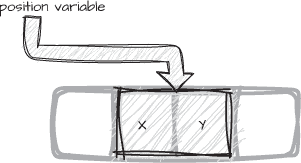
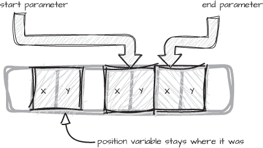
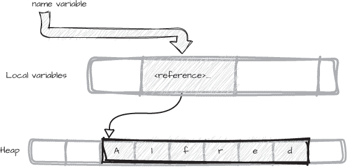
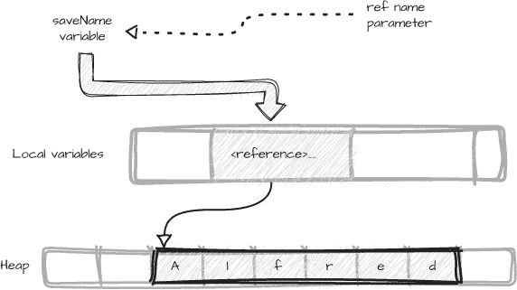

# 第三章：3 引用参数和值参数


在这一章中，我们将讨论方法参数和实参如何与引用类型和值类型相关。我们将重温所有变量都有值这一概念，无论它们的类型如何，并探讨如何将不同类型的值以*值传递*或*引用传递*的方式作为方法的实参。

我们将探索以下内容：

+   如何*引用*和*按引用传递*的含义有所不同

+   为什么别名和可变性如此紧密相关

+   如何避免副作用可以使我们的代码更加清晰

+   何时将值按引用传递作为优化

按值或按引用传递方法参数与这些参数是值类型还是引用类型不同。换句话说，参数的类型（值类型或引用类型）与方法如何使用该参数（按值传递或按引用传递）是不同的。这里的*传递*指的是将值提供给方法的参数并接收方法返回结果的机制。

在我们深入讨论这些区别之前，先来看看方法参数和实参是如何工作的。

## 方法参数和实参

正如在第二章中解释的那样，方法参数是一种特殊的变量。参数变量在方法定义中声明一个名称和显式类型，并在方法结束时超出作用域。如果方法定义在泛型类型中，或方法本身是泛型的，那么参数类型也可以是泛型的。当我们调用方法时，我们将实参传递给每个参数。

C# 有四种方法参数类型：

**值参数**

最常见的参数类型——值参数——表现得就像是方法中的局部变量。值参数通过传递给它的实参的值进行初始化。

**引用参数**

这些参数使用 ref 修饰符，表示它们是按引用传递的。传递的实参也使用 ref 修饰符，以确保实参和参数都指向相同的内存位置。

**输出参数**

这些是使用 out 修饰符的参数，意味着它们在方法中会被赋予一个新值。输出参数也是按引用传递的。与引用参数的 ref 修饰符一样，我们对传递的实参和参数都使用 out 修饰符。

**输入参数**

这种特殊类型的引用参数使用 in 修饰符来表示它的值在方法内部不会改变。与 ref 或 out 参数不同，传递给输入参数的实参不需要 in 修饰符，因为 in 设计时是为了对调用代码透明的。

引用、输出和输入参数是特殊的变量，因为它们表示指向实际变量的间接层级。它们统称为*通过引用传递的参数*。

当我们调用一个方法时，传递的参数会填充我们为该方法声明的参数。如果参数是值参数，那么我们的实参是通过值传递的。如果参数是任何一种通过引用传递的参数，则我们的实参是通过引用传递的。

### 引用类型与通过引用传递的参数

通过引用传递的参数有时会与引用类型变量混淆，部分原因是因为“*通过引用传递*”这一短语常与其搭档“*通过值传递*”一起使用，用来描述引用类型与值类型的区别。参考微软的框架设计指南（[*http://<wbr>msdn<wbr>.microsoft<wbr>.com<wbr>/en<wbr>-us<wbr>/library<wbr>/ms229017<wbr>.aspx*](http://msdn.microsoft.com/en-us/library/ms229017.aspx)），其中包括以下内容：

> 引用类型通过引用传递，而值类型通过值传递。

这对通过引用传递的机制描述并不完全准确。说引用类型是通过引用传递的，将类型与传递方式的概念混淆了。无论实参的类型如何，传递给通过引用传递的参数的实参都会通过引用传递。换句话说，无论是引用类型还是值类型的实参，都可以根据方法参数是否包含 ref、out 或 in 修饰符来决定是通过引用传递还是通过值传递。一个通过引用传递的参数本身不是引用，但它所指向的变量可能是。术语有趣吧？

在第二章中，我们探讨了引用类型和值类型在复制语义上的不同，以及传递参数和复制变量值是如何相关的。特别是，当我们通过值传递参数时，我们是对其值进行了复制。前面引用的微软文档文章继续这样写道：

> 对引用类型实例的修改会影响所有指向该实例的引用。[...] 当修改一个值类型实例时，当然不会影响其任何副本。

这里的关键词是 *实例*。我们可以对引用类型的单个实例有多个引用。复制一个引用并不会复制 *实例*，而只是复制引用的值。相比之下，值类型变量的复制是一个新的实例，它独立于原始值。值 *就是* 实例。

### 值类型与参数

*值类型变量* 直接包含由该类型成员字段表示的数据。无论变量是本地实例、存储在其他对象中的字段，还是方法的参数，这一点都是成立的。考虑 列表 3-1 中表示二维坐标的简单值类型。

```
public readonly struct Coordinate
{
    public int X {get; init;}
    public int Y {get; init;}
}
var position = new Coordinate {X = 10, Y = 20};
```

列表 3-1：一个简单的坐标值类型

Coordinate 类型有两个 int 字段，每个字段占用内存中的一个位置。像 列表 3-1 中的 position 变量这样的该类型变量，会直接包含整个实例。position 变量所使用的内存大致类似于 图 3-1 中的表示。



图 3-1：简单值的内存表示

position 变量并不引用内存中的数据，而是直接存储一个 Coordinate 类型每个字段的内容。如果一个类型有多个字段，这些字段会存储在连续的位置。如果我们将 position 复制到另一个变量中，新变量中每个字段的值将是原始 position 变量对应字段值的独立副本。

如果我们将一个 Coordinate 值作为参数传递给方法的值参数，整个值将被复制到参数中。在 列表 3-2 中，我们有一个方法 Difference，它有两个 Coordinate 值参数，start 和 end，我们将 position 变量作为参数传递给这两个参数。

```
public Coordinate Difference(Coordinate start, Coordinate end)
{
    `--snip--`
}
var position = new Coordinate {X = 10, Y = 20};
**var distance** **=** **Difference(position, position);**
```

列表 3-2：一个带有两个值参数的方法

因为 Difference 方法的参数都是按值传递的，每个参数都会接收到它自己的副本，且与原始值是独立的。结果在内存中的表现类似于图 3-2。



图 3-2：复制值的内存表示

start 和 end 参数被初始化为传递给它们的 position 参数的值，并且它们各自拥有该值的副本，在方法内部独立存在。

当我们将一个值赋给另一个值，或者按值传递一个值类型实例作为参数时，我们是在复制该值。两个值类型变量总是独立的实例。这就是 *按值复制* 语义的本质。

引用类型变量的行为不同，因为它们的值是一个引用。引用的值用于标识堆上某类型的实例，或者是 null。

### 引用的值

当我们创建一个引用类型的实例时，内存会在堆上分配，并且一个标识该内存位置的引用会存储在变量中。从语法上来看，引用变量的类型似乎是它所引用的实例的类型，如这里所示的一个 string 变量：

```
string name = "Alfred";
```

我们通常会将 name 变量称为一个字符串。然而，这并不完全准确。更精确的说法是，name 是一个 *类型* 为 string 的变量，而它的 *值* 是一个指向 string 类型实例的 *引用*。引用变量的类型不一定需要与实例的类型完全匹配。例如，我们可以使用基类引用变量，如 object，来引用一个更具体的引用类型实例，如 string。

引用的值是一个不透明的句柄，供公共语言运行时（CLR）用来标识一个对象。我们其实并不关心引用值是什么；引用只是我们访问和操作引用类型实例的机制，如图 3-3 所示。



图 3-3：字符串引用的内存表示

在图 3-3 中，name是一个值为引用的变量。引用本身并没有独立的类型（当然，我们无法为它命名），但它有一个值。一个非null引用的值是指向堆上分配内存区域的句柄，该区域包含一个引用类型的实例。

这种精确度非常重要，因为当我们谈论传递或复制变量时，实际上是指传递或复制*值*。对于值类型而言，这种区别不存在：结构体变量的值*就是*实例。然而，引用变量与它们所指向的实例是不同的——当我们复制一个引用变量的值时，实际上是在复制引用，而不是实例。

一些语言使用指针来访问内存中的对象，但引用与指针略有不同。引用不能像指针一样用于内存中的任何位置。它们专门用于访问堆上的引用类型对象，并在垃圾回收和内存压缩时跟踪这些对象的移动。我们不需要关心这些过程的细节，它们作为引用类型内存管理的一部分被自动处理。

我们可以将引用的值看作是一种地址。在这方面，引用值的行为与值类型实例非常相似。像值类型变量一样，引用类型变量直接包含它的值（一个地址），并且存在于其父作用域内，可能是方法的局部变量栈帧。

鉴于此，考虑一下：*所有*变量，无论是表示引用类型还是值类型，都有可能被复制。更重要的是，默认情况下，所有变量值都是按值*复制*并传递的。

### 引用变量与别名

*别名*指的是通过多个变量访问同一内存位置。正如你所见，当我们将一个引用复制到另一个引用时，例如将引用作为参数传递给方法时，我们就创建了两个指向同一内存对象的别名引用——参数变量和参数对应的变量。

相比之下，当我们将值类型实例作为参数传递时，参数变量和参数对应的变量是完全相同但独立的副本。参考类型和值类型在这方面的区别在实例是可变时最为显著（即它们的状态可以改变）。

别名化可以是有意为之且有用的，比如当我们希望对某个对象的更改能被所有引用该对象的地方观察到时。例如，请参阅示例 3-3 中的 Command 和 DataStore 类；我们通过使用 DataStore 的 CreateCommand 方法来创建一个 Command 类型的实例，而 Command 对象保存了对用于创建 Command 实例的 DataStore 实例的引用。

```
public class Command
{
    public Command(DataStore store)
        => Connection = store;
    **public DataStore Connection {get;}**
}
 public class DataStore
{
    public enum ConnectionState {Closed, Open}
    **public Command CreateCommand()**
        **=>** **new Command(this);**
    public void Open() => State = ConnectionState.Open;
    public void Close() => State = ConnectionState.Closed;
    public ConnectionState State {get; private set;}
}
```

示例 3-3：将 DataStore 的引用作为 Command 的属性保存

CreateCommand 方法返回对新创建的 Command 对象的引用，该对象持有对 DataStore 实例的引用。我们可以通过使用 Open 或 Close 方法来*修改*（更改状态）DataStore 对象，无论我们使用本地的 DataStore 变量，还是使用从 CreateCommand 返回的 Command 对象的 Connection 属性，我们都会更新相同的 DataStore 实例，因为这两个引用都是指向同一个对象的别名，如示例 3-4 所示。

```
var store `=` new DataStore(…);
Command command = store.CreateCommand();
// Open the connection.
**command.Connection.Open();**
Assert.That(store.State, Is.EqualTo(ConnectionState.Open));
```

示例 3-4：通过别名修改 DataStore 实例

我们通过使用 command 变量的 Connection 属性来调用 Open 方法，并测试名为 store 的本地变量的状态是否已被更改。

值类型变量从不是单一实例的别名，因此对实例的更改只对用于进行更改的变量可见。值类型实例是按值复制的，因此每个副本都是独立的实例。这个过程类似于我将文档作为电子邮件附件发送给你：我们每个人都有文档的副本，因此如果我更改了我的副本，你的副本不会受到影响，反之亦然。

然而，如果我发送一个我们都可以编辑的共享文档的链接，那么我们双方所做的任何更改都将通过该链接对我们两个人可见。这个链接类似于一个引用；它是文档的地址，但它不是文档本身。这个链接代表了指向真实文档的间接层次。完全同样地，引用变量并不包含对象，而是一个引用，通过该引用间接访问对象的实例。

## 可变的按引用传递参数

默认情况下，方法参数是值参数，这意味着传递给它们的参数是按值传递的，无论参数的类型如何。在本节中，我们将讨论*可变的按引用传递参数*，即ref和out，它们使得参数按引用传递。

值类型的实例和引用都可以通过使用ref或out修饰符按引用传递，因此理解按引用传递的参数与引用类型的*值*参数不同是很重要的。当我们将引用作为参数传递给引用类型值参数时，参数和引用变量都指向相同的对象实例，对实例所做的任何更改都可以通过任一变量看到。相比之下，按引用传递的参数是参数变量值的别名，无论该值是引用类型还是值类型实例。

在参数上使用ref或out修饰符意味着，当我们调用方法时，传递的是参数值的地址，而不是值的副本。这个额外的间接层次意味着无论参数的类型如何，调用者和方法都能直接访问相同的值。如果参数的值是引用类型，我们可以将它更改为指向一个新实例，或者将null赋给它，这一变化通过参数和参数变量都能看到。

为了说明引用变量和按引用传递的参数之间的区别，考虑列表 3-5，其中我们通过值传递一个引用给尝试更改其name参数的<code>AutoAppend</code>方法。

```
public void AutoAppend(**string name**, string extension)
{
    if(!name.EndsWith(extension))
        **name** **+=** **extension;**
}
var saveName = "Alfred";
AutoAppend(saveName, ".docx");
Assert.That(saveName, Is.EqualTo("Alfred.docx"));
```

列表 3-5：创建新实例与更改实例

即使string是引用类型，这个测试仍然会失败。尽管+=操作符看起来像是在修改字符串，实际上它创建了一个包含更新内容的新字符串，并返回一个新的引用指向它。新的引用和实例在AutoAppend方法中可见，但在方法外部不可见。原始字符串没有变化。

AutoAppend方法并没有改变共享的string实例，而是改变了其name参数的*值*。在这里调用+=会改变引用，使其指向一个新的、不同的实例。用作AutoAppend参数的saveName变量仍然指向原始的、未改变的实例。

这清楚地证明了，当我们按引用传递一个参数时，默认情况下它是按值传递的。为了使清单 3-5 中的AutoAppend方法按预期工作，我们需要按引用传递saveName引用，这样当方法更改引用*变量*的值时，变化能被调用代码看到。

### 按引用传递引用

使我们在清单 3-5 中的测试通过的最直接方法是使用ref修饰符，将name参数改为引用类型。清单 3-6 展示了与清单 3-5 相同的AutoAppend方法，不同之处在于，在这个版本中，我们通过在name参数上使用ref修饰符，使其通过引用传递。

```
public void AutoAppend(**ref string name**, string extension)
{
    if(!name.EndsWith(extension))
        name += extension;
}
var saveName = "Alfred";
AutoAppend(**ref saveName**, ".docx");
Assert.That(saveName, Is.EqualTo("Alfred.docx"));
```

清单 3-6：使用 ref 修饰符按引用传递 name

我们在方法的参数和传递给它的参数上都使用了ref修饰符，因为我们是按引用传递变量。现在测试通过了，因为AutoAppend方法对引用变量值所做的更改可以通过调用代码中的saveName变量看到。

name参数实际上是<sup>saveName</sup>变量的别名，如图 3-4 所示。



图 3-4：按引用传递的参数作为变量的别名。

使用按引用传递的参数的结果是，参数变量和实参变量不仅指向相同的实例——它们实际上是相同的引用。我们仍然可以使用<sup>name</sup>参数访问<sup>string</sup>实例（例如，访问属性或调用方法），而编译器隐藏了通过参数上的<sup>ref</sup>修饰符提供的额外间接层。

### 按引用传递值

我们也可以通过引用传递值类型变量。请记住，通过引用传递参数并不意味着该参数是引用变量。

当我们将一个值类型实例作为参数传递给方法时，方法通常会获得该实例的副本，因为值类型的语义是按值传递。如你之前所见，方法内对实例字段的任何修改在调用代码中是不可见的。

如果我们希望这些更改在方法外部可见，就需要通过引用传递值。在列表 3-7 中，我们引入了一个名为<sup>Increment</sup>的方法，该方法通过引用传递一个可变的<sup>Speed</sup>值类型参数并更改其值。像<sup>Speed</sup>这样的值类型几乎总是应该是不可变的，你将在《突变与创建》一章中（见第 89 页）了解如何以不同的方式表达这一点。这个例子只是为了演示按引用传递值类型的机制与按引用传递引用类型是相同的。

```
public struct Speed
{
    public double InMetersPerSecond {get; set;}
}
public void Increment(ref Speed initial, double amount)
    **=>** **initial.InMetersPerSecond** **+=** **amount;**
```

列表 3-7：按引用传递值类型参数

当我们调用<sup>Increment</sup>方法时，我们使用<sup>ref</sup>修饰符按引用传递<sup>initial</sup>参数的值，就像在列表 3-6 中对<sup>name</sup>参数所做的那样。因此，在<sup>Increment</sup>方法中对<sup>initial</sup>的<sup>InMetersPerSecond</sup>属性的更改对调用代码是可见的，正如在列表 3-8 中所示。

```
var speed = new Speed {InMetersPerSecond = 50.0};
**Increment(ref speed, 20);**
Assert.That(speed.InMetersPerSecond, Is.EqualTo(70.0));
```

清单 3-8：使用 ref 修饰符通过引用传递 speed

由于speed变量通过引用传递给Increment，因此speed在Increment方法中被别名化。调用代码和Increment方法实际上使用的是同一个变量，因此对initial参数值的任何更改在Increment方法和调用它的代码中都可见。测试表明，我们期望该值被更改。

> 注意

*再强调一次，通过引用传递的参数与引用类型变量不同。一个*引用类型变量*是指向一个引用类型实例的，而一个*通过引用传递的参数*是指向一个变量，该变量可以是引用类型或值类型。*

引用只能引用堆上的对象。如果我们将引用类型变量分配给值类型实例，则该值会被装箱到堆上，变量会引用装箱的副本。通过引用传递的参数为变量的值添加了一个额外的间接层。当我们通过引用传递值类型实例时，值既没有被装箱也没有被复制。

### 处理输出参数

*输出参数*，由out修饰符指定，是通过引用传递的可变参数，通常在需要方法为该参数变量创建新实例时使用。它们与引用参数类似，因为它们也别名化用作参数的变量。我们传递给方法的参数通常未初始化，方法将通过为输出参数变量赋值来初始化它。

更正式地说，引用参数和输出参数之间的区别在于，引用参数在传递之前必须被明确赋值，而输出参数在传递时可以已初始化也可以未初始化，但无论如何，参数必须在方法中被赋值。

输出参数通常用于当获取新对象实例可能失败，但失败不会是致命的或严重问题的情况。例子包括解析字符串以获取特定格式的值、连接到不可靠的服务以及从共享资源（如队列）中读取值，该资源可能为空。在这种情况下，我们通常希望能够尝试该过程，并能够忽略失败或重试操作。如果操作成功，我们将获得一个有效的对象作为结果。

解决此使用案例的常见方法是定义一个方法，该方法至少接受一个输出参数，并返回一个表示成功或失败的 bool。如果方法成功，out 参数将被初始化为一个新对象，方法返回 true，表示传递的参数已成功初始化。如果操作失败，方法返回 false，指示调用者忽略输出参数的值。这是 C# 中一种常见的技术，称为 TryXXX。

#### 使用 TryXXX 习语

标准库中有多个示例，演示了如何使用 TryXXX 来解析字符串，查找特定类型的值，例如 DateTime 对象。DateTime.TryParse 方法接受一个 string 参数和一个用于输出 DateTime 值的输出参数。如果解析失败，该方法返回 false。如果解析成功，DateTime 值将包含从 string 解析出的日期。清单 3-9 演示了我们如何使用这个习语。

```
string logTime = `--snip--`
if(DateTime.TryParse(logTime, out DateTime timeStamp))
{
    var elapsed = DateTime.Now - timeStamp;
    `--snip--`
```

清单 3-9：TryXXX 习语

作为参数传递给 TryParse 的 logTime 变量可能来自不可靠的来源，例如用户输入或文件。格式错误的日期是一个错误，但不应视为异常情况。成功调用 TryParse 表示 timeStamp 变量是一个有效的 DateTime 实例。如果 TryParse 返回 false，则 timeStamp 变量将被默认初始化。

> 注意

*DateTime 的文档中指定，当解析失败时，变量将初始化为 MinValue 属性的值，但这等同于一个默认的 DateTime。*

TryXXX 方法通常有一个伴随版本，在操作失败时*会*抛出异常。例如，DateTime.TryParse 方法的异常版本是 DateTime.Parse，该方法在成功时返回一个 DateTime 值，并在失败时抛出 FormatException 错误。处理异常可能会有干扰，并且无法将字符串解析为有效的 DateTime 是我们通常希望尽快处理的错误。

如果我们使用普通的 Parse 方法，我们可能会将调用包装在一个 try…catch 块中，但如果需要解析多个字符串，这可能会变得繁琐：为了捕获某一个值的失败，我们必须将*每个调用*都放入自己的 try 块中。相反，使用 TryParse 更直接且不那么冗长。

#### 进行明确的赋值

ref 和 out 参数的底层机制在 CIL 中是相同的，CIL 本身对引用参数和参数有原生支持。它们在编译器强加的语义上有所不同：ref 参数在方法中被视为初始已赋值，这意味着在传递之前，ref 参数必须已被明确赋值；而 out 参数则被视为方法中未赋值，无论调用之前它是否已被赋值。因此，我们必须在方法返回之前明确赋值所有 out 参数。不这样做会导致编译时失败，如下所示：该方法尝试在 connection 参数尚未赋值之前返回：

```
public bool TryRemote(string address, out DataStore connection)
{
    if(string.IsNullOrEmpty(address))
        **return false;**
    `--snip--`
```

我们收到这个错误：

```
[CS0177] The out parameter 'connection' must be assigned to before control
leaves the current method
```

避免此示例中的错误最直接的方法是预先将 null 赋值给 connection 参数，然后返回 false。根据惯例，传递给 TryXXX 方法的 out 参数应该仅在方法返回 true 时，才在调用代码中被视为具有有效值。

调用代码中的目标 out 变量只有在方法正常返回之后才被视为已确定赋值。在所有 out 参数赋值之前，控制可能通过抛出异常以*非正常*方式离开方法。如果方法以异常退出，则在方法调用之前没有明确赋值的作为 out 参数的变量将保持未明确赋值。任何在调用之前已明确赋值的参数将继续保持已明确赋值，尽管它们可能在抛出异常之前仍在方法内被赋予了新值。

然而，我们通常会使用 TryXXX 习惯用法来*避免*异常，因为大多数用户期望此类方法不会抛出任何异常。

#### 选择操作

使用 TryXXX 习惯用法与 out 参数一起使用，如 示例 3-9 中所示，具有吸引力，因为该方法可以在简单的 if 语句中内联使用，测试返回值并捕获所需输出参数的值。在 示例 3-10 中，我们使用 TryRemote 方法来确定如何获取结果列表，使用三元条件运算符 ?: 而不是 if…else 块。connection 输出变量在方法的参数列表中内联声明。

```
List<Record> results = TryRemote(remoteName, **out DataStore connection**)
    ? connection.LoadData()
    : LoadFromCache();
```

示例 3-10：使用简单的 out 参数

如果 TryRemote 返回 true，则执行 ? 后面的分支，我们可以在调用 TryRemote 时使用 connection 输出变量。如果方法返回 false，表示连接到远程资源失败，我们的代码将执行 : 后面的分支，并从缓存中加载结果。

请注意，我们还可以使用 var 来声明内联 connection 参数的类型，在这种情况下，编译器将根据方法定义中参数的类型来确定其类型。TryRemote 方法使我们能够处理连接失败的情况，而无需额外的成本和复杂的异常处理，并尝试不同的方法来获取结果列表。

我们可以将 TryXXX 方法视为返回多个值：一个 bool 值，用于指示获取资源是否成功，以及在获取成功时返回的资源本身。

## 按引用传递参数的限制

虽然带有按引用传递参数的方法非常适合某些情况，例如 TryXXX 技巧，但按引用传递的参数并不适用于所有情况，且关于明确赋值的规则有时可能需要采用不同的方法。其他限制也可能影响我们可以使用这些参数的地方。我们将在本节中探讨这些限制。

### 属性值

获取属性或索引器值的结果不能直接作为 ref 或 out 参数使用。在 列表 3-11 中，我们尝试将 Velocity 实例的 Speed 属性作为参数传递给 ref 参数。

```
public readonly struct Velocity
{
    public Speed Speed {get;}
    public Angle Direction {get;}
}
public void Increment(ref Speed initial, double amount)
    => initial.InMetersPerSecond += amount;
var start = new Velocity (`--snip--)`;
Increment(**ref start.Speed**, 25);
```

列表 3-11：将属性传递给 ref 参数

编译器拒绝了这段代码，并显示以下错误：

```
[CS0206] A property or indexer may not be passed as an out or ref parameter
```

编译器不允许此代码，因为属性结果是值，而不是变量。在第二章中，您看到过变量可以被赋值，但值不能。访问属性与读取方法调用的返回值完全相同——这是我们在第四章中详细讨论的内容——而方法返回的是值，而不是变量。我们通常使用ref参数，当我们期望被调用的方法修改其参数时，但因为属性不是变量，所以它*不能*被修改。

无论Speed是引用类型还是值类型，都没有区别。传递ref或out参数本质上是传递参数的地址，而我们不能传递一个非变量的地址。

### 基于引用参数的重载

通过引用的参数修饰符是方法签名的一部分。引用参数或输出参数实际上是不同于其值参数等价物的类型。如果我们有一个接受ref参数的方法，我们可以通过一个接受该参数按值传递的方法进行重载。

方法重载可以具有不同的返回类型，因此我们可以编写一个按值传递参数并返回一个新对象的方法，并通过一个版本进行重载，该版本接受一个ref参数来修改对象本身，如列表 3-12 所示。

```
public Speed Increment(**Speed initial**, double amount)
    => new Speed {InMetersPerSecond = initial.InMetersPerSecond + amount};
public void Increment(**ref Speed initial**, double amount)
    => initial.InMetersPerSecond += amount;
```

列表 3-12：基于引用修饰符的重载

当我们调用Increment方法时，编译器会根据是否使用ref关键字通过引用传递Speed参数，或者省略修饰符来调用带值参数的版本，从而选择正确的重载方法。

然而，我们不能仅通过参数的引用修饰符类型不同来重载方法，就像我们在列表 3-13 中尝试做的那样。

```
public void Increment(**ref Speed initial**, double amount)
    => initial.InMetersPerSecond += amount;
public void Increment(**out Speed initial**, double amount)
    => initial = new Speed {InMetersPerSecond = amount};
```

列表 3-13：基于不同修饰符的重载

这可能看起来是一个随意的限制。毕竟，调用代码必须区分传递一个 ref 参数和传递一个 out 参数。然而，编译器拒绝这个重载，因为公共语言基础设施（CLI）无法区分方法签名中的 ref 和 out。两者都是通过引用的参数，因此从 CLI 的角度来看，这两个重载具有相同的签名，导致了歧义。

相同的限制适用于 in 参数，详情请参见“只读引用和按引用返回”一节，见 第 92 页。与 ref 和 out 参数一样，in 参数对于 CLI 来说仅仅是另一种通过引用的参数。

基于参数是通过引用传递还是按值传递来重载方法，最好避免在任何情况下使用。调用这种方法的人需要对这种略显晦涩的重载规则角落有透彻的了解，因此这类代码可能会很容易让人困惑。

### 使用字段

将字段设置为通过引用的变量是不可能的。再次强调，这可能看起来很随意，但否则一个通过引用的字段可能会变成一个 *悬空* 引用——即它可能指向一个已不存在的对象。

> 注意

*从 C# v11.0 开始，允许在 ref 结构类型中使用通过引用的字段，这些类型是为高性能应用程序设计的专用值类型。由于 ref 结构类型有许多限制，使它们不太适合大多数通用代码，因此我们在本书中不涉及它们。*

考虑一下像 清单 3-14 中的 Reminder 类，它尝试将一个 ref 参数存储在一个 ref 字段中。

```
public class Reminder
{
    public Reminder(ref DateTime start)
        => time = start;
    private readonly ref DateTime time;
}
```

清单 3-14：一个假设的 Reminder 类，它通过引用存储一个字段

尽管这种方法在原则上看起来很有吸引力——比如，如果我们希望让 Reminder 类故意别名化其构造函数的参数，或者我们希望避免复制 DateTime 实例——但是这段代码无法编译。编译器会拒绝它，认为它只是无效的语法，因为 Reminder 实例可能在引用的 DateTime 变量已经超出作用域后仍被使用，这意味着该字段将变成指向不再存在的内存的引用，或者更糟的是，指向已分配给其他内容的内存。time 字段将是一个悬空引用，这是 C# 规则极力避免的。

尽管引用类型具有不同的生命周期并享有自动内存管理，但仅允许对引用类型使用 ref 字段确实显得武断，并且可能引发混淆和错误。这种能力也几乎没有实际意义，因为引用变量本身就具有别名行为，且按引用传递的变量在复制时与引用的大小相同，因此编译器禁止这么做。

#### 闭包

禁止使用 ref 和 out 字段也是我们无法在闭包中使用按引用参数的原因。*闭包* 是一种方法，它将行为与其 *上下文* 封装在一起——即，方法外部声明的但在实现中使用的任何变量的状态。这些外部变量被称为已被方法 *闭合*，因此称为 *闭包*。列表 3-15 显示了一个方法尝试在 lambda 表达式中使用 ref 参数的示例。

```
public static Reminder
NextAppointment(**ref DateTime time**, IEnumerable<Reminder> items)
{
    var results = items.Where(**item** **=>** **item.Date** **==** **time.Date**);
    return results.FirstOrDefault();
}
```

列表 3-15: 匿名闭包捕获 ref 参数

编译器拒绝了 NextAppointment 方法，给出了以下错误：

```
[CS1628] Cannot use ref, out, or in parameter 'time' inside an anonymous method, lambda
expression, query expression, or local function
```

NextAppointment 方法中的闭包是由 Where 方法使用的 lambda 表达式。该 lambda 是一个匿名方法，使用了捕获的 time 参数，后者属于 NextAppointment 的作用域。闭包函数由编译器实现为一个小型的、不可命名的类，并为每个被闭包捕获的变量创建字段。在此示例中，捕获的变量是一个 ref 参数，正如你在 清单 3-14 中看到的，它不是一个有效的字段。

如错误信息所示，同样的问题也适用于嵌套的局部函数和匿名方法，这些方法也可以捕获外部方法的变量，包括其参数。匿名方法、lambda 表达式和局部函数的实现方式是相同的：使用编译器合成的隐藏类。任何被捕获的变量都成为该类的字段。

#### 迭代器块

*迭代器块* 是编译器生成的类，它实现了标准的 IEnumerable< T > 接口，用于通过延迟执行遍历序列中的元素，例如数组或 List< T >。它也被称为 *懒惰枚举*，*延迟执行* 意味着只有当用户请求时，才会从序列中获取下一个元素；序列是按需生成的，理论上甚至可能是无限的。

每当我们使用 yield 语句时，就会创建一个迭代器块，如 清单 3-16 所示。然而，编译器拒绝了 AppointmentsForDay 方法，因为它有一个 ref 参数。

```
public static IEnumerable<Reminder>
AppointmentsForDay(**ref DateTime time**, IEnumerable<Reminder> items)
{
    foreach (var item in items)
    {
        if(item.Time.Date == time.Date)
            **yield return item;**
    }
}
```

清单 3-16：迭代器中的 ref 参数

这里的 AppointmentsForDay 方法试图过滤作为参数传递的 items 序列，以匹配 time 参数。然而，像闭包一样，使用迭代器块的方法不能有按引用传递的参数，因此 清单 3-16 中的方法无法编译，出现以下错误：

```
[CS1623] Iterators cannot have ref, in or out parameters
```

每当方法生成一个值时，控制权会返回到调用代码。当请求下一个项时，方法必须从`yield`语句后的语句继续执行，并且必须在相同的状态下进行。编译器将`yield`语句转换为返回一个迭代器块类的实例，该类在每次请求元素时捕获状态，这与闭包的工作原理类似。

编译器生成的类需要捕获*所有*方法参数和任何局部变量作为字段，以在每次请求值时保存方法的状态，这也是迭代器方法不能使用传引用参数的原因。

#### 异步方法

最后，正如闭包和迭代器块的原因一样，我们不能为`async`方法声明传引用参数，比如示例 3-17 中的`TryGetResponse`方法。

```
public static async Task<bool> TryGetResponse(**out string response**)
{
    response = **await Task.Run(()** **=>** **GetUserInput())**;
    return !string.IsNullOrEmpty(response);
}
```

示例 3-17: 异步方法中的 `out` 参数

该方法未能编译，出现以下错误：

```
[CS1988] Async methods cannot have ref, in or out parameters
```

在这个例子中，编译器合成了一个隐藏的类来管理异步调用`Task.Run`方法。当执行到`await`语句时，异步方法将控制权返回给调用者，因此，像迭代器块一样，它们必须保存*所有*变量的状态。编译器生成的类将所有局部变量和参数作为字段捕获，因此任何带有`async`修饰符的方法都不允许使用传引用参数。

### 扩展方法

我们可以在不使用闭包、迭代器块或使用`await`关键字的异步操作的任何方法中使用传引用参数。然而，*扩展方法*（静态方法，用于扩展其他类型的接口）存在一些注意事项。扩展方法的第一个参数是被扩展类型，并使用特殊的`this`修饰符。扩展方法对`this`参数使用传引用参数有一些限制。首先，扩展方法的`this`参数不能是`out`参数，正如示例 3-18 中所示。

```
public static void
FormatConnection(**out this string connString**, string host, string source)
{
    connString = $"Server={host};Database={source};Trusted_Connection=True;";
}
```

示例 3-18: 使用 `out` 参数的扩展方法

这段代码会生成以下错误信息：

```
[CS8328] The parameter modifier 'this' cannot be used with 'out'
```

如果允许这种语法，使用 FormatConnection 方法的代码可能会*看起来*像是在使用未初始化的变量调用方法，如下所示：

```
string connection;  // uninitialized variable
connection.FormatConnection(host, source);
```

大多数用户可能会发现这段代码令人困惑，因为在其他任何情况下都不允许使用未初始化的变量来调用方法。无论如何，我们有更好的替代方案来实现相同的结果，而 this 参数的语法也是错误的。我们可以像使用任何常规方法一样，使用 out 修饰符来修饰其他参数，但不能将 this 作为输出参数。

如果 this 参数是值类型，使用 ref 是允许的，但如果它是引用类型，则不允许。这一限制乍一看可能显得不合理，但它旨在明确禁止如下代码：

```
public static void Nullify(ref this string val)
    => val = null;
```

编译器拒绝了 Nullify 方法，并报告了以下错误：

```
[CS8337] The first parameter of a 'ref' extension method 'Nullify' must be a value type or a
generic type constrained to struct.
```

如果允许这种代码，调用该方法的变量可能会引用不同的变量，或者—如本例所示—在方法返回后被设置为 null。大多数用户可能会对这种行为感到惊讶，因此，编译器再次禁止了这种做法。

我们可以在 this 参数为值类型时使用 ref，这样可以避免复制 this 参数的值。虽然避免复制引用类型没有实际好处，但复制一个大的值类型可能会相对昂贵。值类型变量不能赋值为 null，但是方法可以为 ref this 参数赋予新值，从而改变参数的值。同样，这种做法很可能会让大多数方法用户感到惊讶，因此，尽管语法合法，我们应避免使用 ref this 参数。如果我们确实希望避免复制 this 参数的值，那么我们可以使用 in 修饰符来使 this 成为只读引用参数，正如在《只读引用与按引用返回》中 第 92 页 所详细讨论的那样。

尽管按引用参数有其局限性，但它们是 C# 的核心部分，理解它们的语义非常重要。没有这些限制特别繁重，主要是因为这些参数的使用场景有限。大多数程序员会认为，在扩展方法中使用 ref this 值类型参数是不常见的，而且这是一个足够小众的特性，通常最好避免使用。

字段*必须*是实际变量，并且 C# 不提供将按引用变量存储为通用类型字段的方式。本节中的其他所有示例可以用不同的方式表达，以达到相同的结果。

## 副作用和直接效果

带有按引用参数的方法故意将调用代码中的变量进行别名化，因此在方法内部对这些参数的修改在方法的作用域外是可见的。修改别名对象的状态是*副作用*的一个例子，副作用通常定义为任何在发生更改的作用域之外可见的状态变化。

副作用本身并不坏，但过度依赖副作用的程序可能比仅依赖直接效果的程序更难理解。方法的*直接效果*是其返回值，通常称为方法的输出，而输入是方法的形式参数。按引用参数，特别是 out 参数，模糊了方法输入和输出之间的区别，因为副作用可能会改变与方法直接效果无关的状态。

考虑如何使用 TryXXX 方法来初始化变量，如示例 3-19 所示。

```
if(TryRemote(remoteName, out var connection))
{
    // Perform activities using connection
}
```

示例 3-19 使用带有输出参数的 TryRemote 来初始化连接变量

TryRemote 方法的直接效果是 bool 返回值，指示初始化其输出参数的成功或失败。我们使用返回值来判断 connection 变量是否已初始化；换句话说，直接效果告诉我们副作用是否成功。在这种情况下，TryRemote 的副作用和直接效果之间存在联系，但与其他 TryXXX 方法一样，直接效果似乎是副作用的附带效果！

带有引用参数的方法，通常来说，依赖副作用的操作，往往会导致非常程序化的代码，这些代码由一组逻辑步骤或指令组成，用以完成某项任务。程序化解决方案被描述为*命令式代码*，因为它们是为了实现结果而执行的一系列明确的指令。与之对立的方法是*声明式代码*，它强调结果而非具体实现。声明式方法将焦点从*如何*完成任务转移到*什么*被完成上，从而让我们可以专注于结果。

声明式风格的一个方面是，我们更加注重方法的直接效果，并明确区分方法的输入和输出。

我们可以通过去掉 out 参数，并直接返回所需的 DataStore 引用，使得 Listing 3-19 中的 TryRemote 方法更加声明式；由于 DataStore 是引用类型，我们可以在 TryRemote 方法失败时返回 null。然而，当这些参数是引用类型时，与引用参数相关的副作用并不是问题。引用类型通常是可变的——这是有设计上的原因的——并且多个变量引用同一个实例通常是期望的行为，正如你在“引用变量与别名”一节中看到的 第 74 页。当我们使用值类型时，声明式代码的好处更加重要，因为值类型应该是不可变的。

### 变异与创建

使用 ref 和 out 参数的方法强烈表明这些参数在方法中会发生变化。由于这些参数是传入它们的变量的别名，我们需要注意哪些变量可能会被修改。对变量的意外修改可能会导致很难识别的错误，特别是在使用多线程的代码中。如果我们遵循常见的建议，使我们的值类型不可变，我们就能减少这种问题发生的可能性，这也意味着我们应该避免使用值类型的可变引用参数。这样，值类型变量唯一能改变的方式就是通过赋值。

如果我们拥有一个值的实例，并且需要一个具有不同属性的实例，我们只需创建一个具有所需状态的新实例，保持原始实例不变。将 列表 3-20 中的 Incremented 方法与 列表 3-7 中类似的 Increment 方法进行比较。

```
public Speed Incremented(Speed initial, double amount)
    => Speed.FromMetersPerSecond(initial.InMetersPerSecond + amount);
```

列表 3-20：创建新值而不是修改现有变量

我们创建并返回一个新的 Speed 实例，该实例使用参数变量的 InMetersPerSecond 属性初始化，而不是改变通过引用传递的值的属性。请注意，方法名称是 Incremented，而不是 Increment。名称 Increment 是一个直接动词，可能暗示 Speed 参数在某种程度上被修改了。相比之下，名称 Incremented 是一个形容词，描述的是结果。使用形容词来命名不可变方法，进一步表明没有状态被更改。此命名惯例的其他示例包括 Sorted、UpperCased 和 Rounded。

调用 Incremented 方法时，我们传递一个现有的 Speed 值，以及一个用于增加其值的数值，如下所示：

```
var speed = Speed.FromMetersPerSecond(50.0);
var newSpeed = Incremented(speed, 20);
Assert.That(speed.InMetersPerSecond, Is.EqualTo(50));
Assert.That(newSpeed.InMetersPerSecond, Is.EqualTo(70));
```

调用代码中的 speed 变量没有被更改；Incremented 方法返回一个具有所需值的*新* Speed 实例。我们将新值赋给一个不同的变量，但也可以用新实例覆盖原始的 speed 变量。

不是所有对象都是值类型，有时某些对象需要是可变的；你之前看到的 DataStore 对象具有可变状态，可以通过它的 Open 和 Close 方法进行更改。

别名（Aliasing）在我们需要通过所有*引用*来查看对象变化时非常有用，但对于值类型，这种副作用的好处并不那么明显。副作用不仅限于输出参数。它们发生在任何时候，只要我们能修改对象的状态，而这个状态在我们进行修改的范围之外是可见的，包括通过普通的引用变量。

改变任何对象的状态都需要特别小心，尤其是在多线程环境中，因此，如果我们限制修改对象的需求，就可以减少潜在的问题。如果我们让所有值类型都变成不可变的，就能减少副作用的发生，而副作用往往很难被识别，有时还会使我们的逻辑变得不那么清晰。

创建基于现有实例属性的新值的另一种方法是使用非破坏性变异语法，该语法在第二章中介绍。示例 3-21 使用了with关键字来复制一个现有的Velocity变量，并为该副本的Direction属性提供一个新值。

```
public readonly struct Velocity
{
    public Speed Speed {get; init;}
    public Angle Direction {get; init;}
}
 var velocity = new Velocity
    {
        Speed = Speed.FromMetersPerSecond(10),
        Direction = Angle.FromRadians(.88)
    };
**var copy** **=** **velocity with {Direction** **=** **Angle.FromRadians(.99)};**
```

示例 3-21：将实例作为模板进行复制

Velocity类型上每个属性的init访问器使我们能够复制一个实例，并通过使用with关键字来改变新实例的选定属性。非破坏性变异是在 C# v9.0 中为记录类型引入的，自 C# v10.0 起，我们也可以在结构体、记录结构体，甚至匿名类型中使用它。

init访问器还允许我们通过对象初始化（如示例 3-21 中对velocity变量的处理所示）或通过构造函数为属性赋值，但一旦通过init设置了属性值，该属性就变得不可变。如果我们使用的是private set访问器，而不是init，那么对象初始化和非破坏性变异语法将不可行。非破坏性变异和对象初始化都需要使用公共的init或公共的set访问器。

复制不可变值的选定属性是声明式问题解决方法的另一个方面，在某些情况下，它通过使用现有变量作为模板来创建新值，使得这一过程更简单、直接。

### 声明式代码与性能

使用声明式风格可以使代码更加清晰和直接，但通常会导致创建更多的变量副本，从而增加存储开销。这对于值类型尤其重要，因为复制大实例的成本可能会影响程序的性能。到目前为止，我们只考虑了非常小的实例，这些实例不太可能显著影响性能。虽然引用变量的大小始终相同，但值类型可以是任意大小。在复制值时，大小在一定程度上是重要的。一个简单封装了单个int字段的值类型比具有多个字段的值类型复制时成本更低，这也是为什么我们通常建议保持值类型尽可能小的原因。

*小*的定义有所不同，但通常在 16 到 24 字节之间。请注意，在 64 位架构中，引用占用 8 字节，因此很容易想象出一个有用的值类型，它的大小超出了推荐的大小限制。我们将在第八章中探讨一些大值类型的性能特征。

然而，值类型的大小不应成为选择类或记录而不是结构或记录结构的主要动机。如果我们希望类型的实例具有值语义，那么无论它多大，我们都应该将其定义为值类型。当我们将值类型变量作为ref或out参数传递时，并不会创建实例的副本，因为这些参数是按引用传递的。那么，偏好返回值而不是使用ref或out参数，是否会影响我们代码的效率呢？

对于具有多个字段的值类型，避免复制可能带来净性能提升，但我们也应该考虑这种选择对*人类*读者的影响。使用按引用传递的参数以避免复制大值看起来可能很有吸引力，然而使用ref或out参数强烈暗示传递的参数可能会发生变化。如果我们希望代码尽可能自我文档化，将ref参数作为*优化*来使用，可能会让人感到惊讶。

与使用可变的 out 或 ref 参数不同，我们可以使用 in 参数，它是 *不可变* 的按引用传递参数。对于 in 参数，参数通过引用传递的方式与 ref 和 out 参数完全相同，但 in 参数变量在方法中是只读的。在下一节中，我们将探讨如何通过使用只读引用参数避免复制值类型方法参数，以及如何通过引用返回值。

## 只读引用和按引用返回

只读引用和按引用返回是相关概念，两者都能帮助我们减少代码中值类型实例的复制次数。首先，我们将查看只读引用参数，这些参数通过在方法参数中使用 in 关键字来表示。in 修饰符，像 ref 和 out 修饰符一样，使参数按引用传递，但与 ref 或 out 参数不同，它禁止修改基础变量的值。换句话说，in 参数变量是不可变的。当我们传递大型值类型实例作为参数时，使用 in 参数可能是有益的，因为这样可以避免复制实例。

从技术上讲，我们也可以将引用传递给 in 参数，但没有必要这么做。只有在需要改变引用指向一个新实例时，按引用传递引用才有意义。为了实现这一点，我们需要使用 ref 或 out 参数。按引用传递引用不会带来性能上的好处，而值类型则可能带来一些。

清单 3-22 展示了一个简单的表达式体方法 DistanceInKm，该方法根据 speed 和 time 参数值计算距离，这两个参数都是值类型。

```
public double DistanceInKm(**in Speed speed**, **in TimeSpan time**)
    => speed.InKmh * time.TotalHours;
```

清单 3-22：只读引用参数

`speed` 和 `time` 变量使用了 `in` 修饰符，使它们在 `DistanceInKm` 方法中成为只读引用参数。由于这些参数是只读的，编译器会拒绝任何试图设置可变属性、更改公共字段或为它们赋予新值的操作。

当我们调用一个具有 `ref` 或 `out` 参数的方法时，我们必须使用 `ref` 或 `out` 关键字修改我们传递的参数。相比之下，传递给 `in` 参数的参数则 *不* 需要 `in` 修饰符，如下所示：

```
var time = TimeSpan.FromHours(2.5);
var speed = Speed.FromKmh(20);
var distance = **DistanceInKm(speed, time)**;
Assert.That(distance, Is.EqualTo(50.0));
```

与引用和输出参数一样，我们可以重载 `DistanceInKm` 方法，使用一个具有值参数的版本。如果我们没有为参数指定 `in` 修饰符，那么没有修饰符的重载版本会优先选择。在传递给输入参数的参数上显式使用 `in`，可以选择使用按引用传递参数的版本。正如本章前面提到的，仅根据参数是通过引用传递还是通过值传递来重载方法，可能会导致混淆。

只读引用参数设计为在调用代码中是透明的；也就是说，传递给 `in` 参数的参数与传递值参数看起来是一样的。一个结果是，方法可以修改为接收按只读引用传递的参数，而不需要修改调用代码。以前通过值传递的参数，现在将通过引用传递。只有当 *参数* 变量可能会改变时（可能是在不同的线程中），这才重要。请记住，方法中的只有参数变量是只读的；通常，传递的参数变量不是。由于传递给 `in` 参数的参数是按引用传递的，因此对参数值的任何更改都会反映在方法内部的参数变量值中。Listing 3-23 演示了即使没有多个线程，也可以修改传递给 `in` 参数的参数的值。

```
void ModifyByCallback(in int value, Action callback)
{
  ❶ var temp = value;
  ❷ callback();
    Assert.That(value, Is.Not.EqualTo(temp));
}
int input = 100;
❸ ModifyByCallback(value: input, callback: () => input = 200);
```

清单 3-23：通过回调委托修改只读参数的值

`ModifyByCallback` 方法通过只读引用传递一个 `int` 值和一个 `Action` 委托。*委托* 是一个引用方法的变量；在这里，我们使用标准的 `Action` 类型的委托，它表示一个没有参数并返回 `void` 的方法。在 `ModifyByCallback` 方法内部，我们将 `value` 参数的*值*复制到一个临时变量 ❶ 中。然后我们调用 `callback` 委托，在测试 `value` 参数的值是否与调用委托之前复制到 `temp` 的值不同之前 ❷。当我们调用 `ModifyByCallback` 时，我们传递 `input` 值以及一个用于 `callback` 参数的 lambda 表达式。这个 lambda 捕获了 `input` 变量，并且它的值在 lambda 中发生变化 ❸。

在 `ModifyByCallback` 方法中的测试通过，是因为 `value` 参数是调用代码中 `input` 变量的别名。当 `input` 变量的值在 lambda 函数内部发生变化时， `value` 参数的值也随之变化。因此，我们应该对同时具有 `in` 参数和委托参数的方法保持谨慎。更一般来说，我们应该对那些改变作为参数传递给方法的任何变量值的代码保持怀疑，特别是当方法和调用代码可能在不同的执行线程上运行时。改变一个看似只读的变量可能会引发难以追踪的错误。

### 通过引用返回值

尽管值类型的实例通常不会按引用复制，但我们可以按引用返回值类型实例，并通过使用按引用的变量接收返回的引用。如果我们特别关注复制大实例的成本，这可能会很有用，尽管这种技术足够复杂，以至于我们可能不应该常规使用它。示例 3-24 展示了一个结构体，它的实例将比引用变量大。

```
public readonly struct Address
{
    public Address(string street, string city, string state, string zip)
        => (Street, City, State, Zip) = (street, city, state, zip);
    public string Street {get;}
    public string City   {get;}
    public string State  {get;}
    public string Zip    {get;}
}
```

示例 3-24：包含多个字段的 Address 结构体

这个Address结构体有四个string字段，因此该结构体的实例比单一引用更大，复制成本也更高。如果需要复制大量实例，我们可能希望考虑这些复制的成本。然而，按引用返回并不一定比按值返回较大值更便宜，甚至可能代表一种性能成本。尽管如此，如果经过仔细的性能分析发现实例复制是一个问题，那么按引用返回值可能会证明是有益的。

当我们访问一个属性时，我们会无意中复制该属性的值。我们可以通过按引用返回值来避免进行此复制，这称为*引用返回值*，或者简称为*ref 返回*。我们通过添加ref关键字来标记一个值为引用返回，就像我们在修改按引用传递的方法参数时所做的那样。示例 3-25 中的Mail类有一个Destination属性，通过引用返回destination字段的值。

```
public sealed class Mail
{
    public Mail(string name, Address address)
        => (Addressee, destination) = (name, address);
    public string Addressee {get;}
    **public ref Address Destination** **=>** **ref destination;**
    private Address destination;
}
```

示例 3-25：Destination 属性通过引用返回 destination 字段值

请注意，我们需要在属性和通过引用返回的变量上都添加ref关键字。

当我们访问一个通过引用返回其值的属性时，我们也可以通过引用接收该值，而无需复制它。一个*按引用的变量*，或*引用局部变量*，是一个局部变量，它指向与`ref`返回相同的变量。通过一个简单的示例可以更好地说明这一点。在示例 3-26 中，我们使用局部引用变量接收来自Mail.Destination的`ref`返回值。

```
var address = new Address ("62 West Wallaby Street",
                           "Wigan", "Lancashire", "WG7 7FU");
var letter = new Mail("G Lad Esq.", address);
**ref var local** **=** **ref letter.Destination;**
```

示例 3-26：通过引用返回的值的使用

这个 local 变量是对 letter 实例中 destination 字段的别名，而不是其值的副本。同样，需要注意的是，我们必须在目标变量和属性访问中都使用 ref 修饰符；如果我们忘记其中任何一个，编译器会给我们一个错误。如果我们省略了这两个，编译器会将属性的值按值复制到一个普通变量中。

### 防止对数据的修改

就像通过引用传递的参数一样，ref 返回值和 ref 本地变量为一个值引入了一个别名。如果我们通过这个别名修改一个值，我们需要确保知道这些修改会在哪里可见。

我们可以使用 ref 本地引用来改变 letter 中的字段，尽管在这个示例中我们只能为其分配一个全新的值，因为 Address 是一个只读结构体。列表 3-27 展示了修改 ref 本地引用也会改变 letter 变量的字段。

```
var letter = new Mail("G Lad Esq.",
    new ("62 West Wallaby Street", "Wigan", "Lancashire", "WG7 7FU"));
**ref var address** **=** **ref letter.Destination;**
Assert.That(address.Street, Is.EqualTo("62 West Wallaby Street"));
address = new Address("1619 Pine Street", "Boulder", "CO", "80302");
**Assert.That(letter.Destination.Street,**
    **Is.EqualTo("1619 Pine Street"));**
```

列表 3-27：通过使用 ref 本地变量修改字段

以这种方式修改实例的 *private* 字段可能不是我们想要的。首先，这违反了 Mail 类中字段的封装性；其次，和任何别名一样，直接改变对象可能会在多线程代码中引发问题。*竞争条件*发生在对象的状态可以被多个线程同时修改，或者当一个线程在另一个线程完成修改之前读取对象时。Address 类型的大小意味着分配新值不会是一个原子操作，这意味着第二个线程可能会读取一个部分初始化的实例。

解决竞争条件的一种常见方法是通过使用锁来保护多个线程对变量的访问。在这种情况下，仅在属性本身内部锁定数据访问是不足够的，因为底层数据可以在属性定义之外被修改；我们需要锁定属性的每次使用，这可能会影响代码的性能。幸运的是，我们有一个更不具侵入性的方法：我们可以简单地使该属性变为不可变的。共享不可变的状态不会有多个线程修改数据所带来的缺点。

为了保护Mail中的destination字段不被修改，我们可以将Destination属性更改为返回指向destination字段的只读引用。如果我们返回这样的ref readonly变量，则调用代码也需要为目标变量使用readonly关键字，如清单 3-28 所示。

```
public sealed class Mail
{
    `--snip--`
    public ref readonly Address Destination => ref destination;
    private readonly Address destination;
}
var address = new Address ("62 West Wallaby Street", "Wigan", "Lancashire", "WG7 7FU");
var letter = new Mail("G Lad Esq.", address);
ref readonly var local = ref letter.Destination;
```

清单 3-28：防止 ref 返回值的变异

编译器将不允许通过只读local引用变量进行任何修改。我们还在Mail类中将destination字段设为只读。这意味着如果我们返回指向destination字段的引用，*必须*使用只读引用。如果我们试图在没有readonly ref修饰符的情况下返回只读字段的引用，编译器会给出以下错误：

```
[CS8160] A readonly field cannot be returned by writable reference
```

我们可以使用与将 ref 局部变量分配给属性结果相同的语法，将一个ref变量赋值给另一个。请注意，ref readonly变量可以从非只读引用中赋值。会发生从普通或*可写*的 ref 返回值或 ref 局部变量*到* ref readonly变量的自动隐式转换，但反向转换不会发生。只读引用不能分配给可写的 ref 局部变量。这样做会破坏只读引用的不可变性保证。

### 保持按引用传递的变量在作用域内

方法也可以通过引用返回值，语法与属性相同。然而，通过引用返回的变量的生命周期必须至少与引用的生命周期一样长。更正式地说，被引用的变量的作用域必须*包括*返回指向该变量的引用的方法或属性。

这一规则的一个含义是，我们不能返回一个指向局部变量的引用，因为该变量会在方法或属性实现返回后立即超出作用域。对于值类型，这一点最为明显。一个值的生命周期在作用域结束时就结束，因此它的生命周期比引用的生命周期*短*。清单 3-29 中的方法编译失败，因为它试图返回一个指向局部变量的引用。

```
public ref Address Get()
{
    var val = new Address();
    **return ref val;**
}
```

示例 3-29：尝试返回对局部变量的引用

如果我们*能够*返回对val变量的引用，那么调用此方法的代码将获得对一个不再存在的值的引用。编译器通过拒绝编译代码来防止这种情况发生，给出以下错误：

```
[CS8168] Cannot return local 'val' by reference because it is not a ref local
```

这一规则适用于无论局部变量的值是引用类型还是结构体实例的情况。即使*实例*存在于堆上，*变量*依然会超出作用域。按引用的变量和按引用返回的值实际上是对变量的引用，而不是实例，就像按引用传递的参数一样。

#### 值类型的实例字段

如果编译器不能保证变量至少在与任何引用它的时间一样长的时间内保持有效，它将阻止我们通过引用返回变量。这个规则的一个不那么明显的后果是，值类型的方法或属性不能返回对该类型实例字段之一的引用。例如，示例 3-30 中的代码将无法编译。

```
public readonly struct Color
{
    --`snip--`
    public ref readonly uint Rgb => ref rgbValue;
    private readonly uint rgbValue;
}
```

示例 3-30：通过引用返回结构体字段

编译器给出了以下错误信息：

```
[CS8170] Struct members cannot return 'this' or other instance members by reference
```

由于编译器无法轻易确定Color实例会在任何对其内部字段的引用之前仍然存在，因此禁止此操作。示例 3-31 展示了一个病态示例，说明为什么这可能会成为问题。

```
public ref readonly uint DefaultRgb()
{
    var source = new Color();
    ref readonly var rgb = ref source.Rgb;
    return ref rgb;
}
```

示例 3-31：返回结构体字段引用的无效代码

如果示例 3-30 中的Color结构体能够合法地通过引用返回它的字段，那么示例 3-31 中的DefaultRgb方法将返回对一个已经超出作用域的对象字段的引用。这与返回对局部变量的引用是类似的问题，但这次问题与Color是一个结构体直接相关。当Color变量超出作用域时，它的每个字段也都会超出作用域。编译器禁止通过引用返回值类型的任何实例字段，以避免这种情况的发生。

值类型的成员方法和属性也被禁止通过引用返回this。这与实例字段的原因完全相同：如果允许这样做，我们将返回对一个局部值的引用——即该类型的实例——它已经超出了作用域。

#### 对引用的引用

当一个引用变量超出作用域时，它所代表的实例仍然存在于堆中，直到被垃圾回收。因此，我们可以安全地从类或记录的属性或方法中返回对实例字段的引用。实际上，持有这种通过引用的变量*防止*该实例被垃圾回收。在清单 3-32 中，我们获取一个指向局部引用类型对象实例字段的引用并返回它。

```
public ref readonly Address GetAddress()
{
    var local = new Mail("G Lad Esq.",
        new ("62 West Wallaby Street", "Wigan", "Lancashire", "WG7 7FU"));
    **ref readonly var address** **=** **ref local.Destination;**
    **return ref address;**
}
```

清单 3-32：返回指向局部对象字段的引用

编译器接受这段代码，并且使用这种方法是安全的，尽管我们应该小心，因为这种技术依赖于垃圾回收器的一个相对深奥的特性。当GetAddress返回时，local变量超出作用域，不再直接有指向在GetAddress方法内创建的Mail实例的活跃引用变量。通常情况下，该实例将变为垃圾回收的候选对象，这使得通过引用返回值成为悬挂引用。然而，返回的通过引用变量足以防止垃圾回收器销毁Mail实例，因此持有一个指向其字段的通过引用变量仍然有效。

在幕后，指向类或记录实例内字段的通过引用变量或参数表示一个托管指针。*托管指针*是 CLR 的一个实现细节，但关键点是它们由垃圾回收器追踪，并被视为*对象根*——简单来说，它们是对当前垃圾回收器运行时被认为是存活的对象的引用或托管指针。这些对象可能会包含对堆上其他对象的引用，因此引用链形成了当前垃圾回收器运行时在用对象的图。

垃圾回收器使用对象根来确定对象实例是否可以被回收：任何它无法从对象根通过对象图访问到的实例都可以被回收，任何*可以*访问到的对象则会生存下来。存储一个引用局部变量足以防止拥有该对象的对象被垃圾回收。

我们始终可以安全地通过引用返回一个通过引用的参数变量，因为该参数别名的变量必须在调用代码的作用域内。严格来说，变量的作用域包括接受通过引用参数的方法，如清单 3-33 所示。

```
public ref Color RemoveRed(ref Color color)
{
    color = new Color(0, color.Green, color.Blue);
    return ref color;
}
var hasRed = new Color(0x77, 0xFF, 0x11);
ref var noRed = ref RemoveRed(ref hasRed);
Assert.That(noRed.Red, Is.EqualTo(0));
Assert.That(hasRed.Red, Is.EqualTo(0));
```

清单 3-33：通过引用返回一个引用参数

RemoveRed 方法的 color 参数可以通过引用返回，因为引用不能超出它所引用的变量的生命周期，因为在调用代码中，hasRed 变量的作用域 *包括* 了 RemoveRed。 Listing 3-34 显示，虽然看起来像是返回了对局部变量的引用，但同样的规则也适用于 out 参数。

```
public ref Color CreateColor(out Color result)
{
    result = new Color();
    return ref result;
}
ref var created = ref CreateColor(out Color color);
Assert.That(created.Red, Is.EqualTo(0));
Assert.That(color.Red, Is.EqualTo(0));
```

Listing 3-34: 通过引用返回一个 out 参数

CreateColor 方法中的 result 参数是对调用代码中变量的引用，该变量的作用域同样包括了 CreateColor 方法本身。

> 注意

*从 C# v11.0 开始，禁止通过引用返回输出参数，但仍允许通过引用返回 `ref` 参数。*

我们也可以通过引用返回 in 参数，但必须作为 ref readonly 返回，因为 in 参数是不可变的。如果我们忘记将返回的引用标记为 readonly，编译器将给出一个可预见的错误：

```
[CS8333] Cannot return variable 'in Color' by writable reference because it is a readonly
variable
```

鉴于用于填充 in 参数的变量必须已经是调用代码的一部分，并且我们不能以任何方式修改它，因此通常不需要通过引用返回 in 参数。我们可以将变量传递给 in 参数以避免复制，但方法同样可以返回 void，因为调用代码已经必须知道该变量，并且该变量不能被方法修改。

#### 可变与不可变属性

通过引用返回的属性不能具有 set 访问器，因此它们显得是不可变的。然而，引用返回有一个特殊之处：如果我们通过 *可写* 引用返回，如 Listing 3-35 中的 Color 属性所示，我们可以使用该引用修改底层值，就像使用属性的 setter 一样。

```
public class Brush
{
    public Brush(Color c) => color = c;
    **public ref Color Color** **=>** **ref color;**
    private Color color;
}
var brush = new Brush(new Color(0x77, 0x33, 0xFF));
**brush.Color** **=** **new Color();**
Assert.That(brush.Color.Red, Is.EqualTo(0));
```

Listing 3-35: 设置可写引用属性的新值

看起来我们是在将brush变量的Color属性设置为一个新的Color实例，但实际上我们是通过引用直接给Brush类中的*字段*赋值。语义上的差别有些微妙。属性的部分目的就是*封装*对一个值的访问，但在这里我们故意绕过了这个封装，通过返回字段的引用。

如果Color属性返回一个ref readonly，那么这段代码将无法编译，因为我们试图修改一个只读变量。为Color属性添加一个set访问器将允许我们修改其值，但允许对只读属性使用set访问器似乎是违背常理的。

### 考虑性能与简洁性

当我们不使用值类型实例的副本，而是希望避免大量复制时，使用 ref 返回值与 ref 局部变量可能会带来好处，特别是在需要生成*多个*副本的情况下。ref 局部变量和 ref 返回值是一种相对复杂的优化特性，需要谨慎使用。当值较小时，创建对它们的引用并没有带来好处，反而可能由于访问值所需的额外间接操作而增加成本。我们也可以对引用变量使用 ref 返回值和 ref 局部变量，但同样，这样做并没有优势；C#允许这样做只是为了保持对称性。

我们需要注意*所有*通过引用传递的变量的成本，无论它们是参数、返回值还是局部变量。任何通过引用传递的变量都会引入额外的间接访问，以获取*实际*的底层值。

## 关于通过引用传递可变参数的最终意见

如前所述，使用可变的通过引用传递的参数类型ref和out通常表示非常过程化的代码。一般来说，如果我们倾向于更具声明性的风格，我们的代码通常会更加自描述且更为简洁。然而，输出参数在现代 C#中有一个用途，支持相同的声明性方法。这个术语是*对象析构*，尽管out参数在这里的相关性可能并不显而易见。

我们从值元组开始，它在 C# v7.0 中引入，用于简化轻量级聚合类型的创建，例如 示例 3-36 中的 point 变量。

```
var point = (X: 30, Y: 50);
Assert.That(point.X, Is.EqualTo(30));
Assert.That(point.Y, Is.EqualTo(50));
```

示例 3-36：一个表示点的值元组

这个 point 变量是一个 *命名元组*，我们为每个组成部分指定了名称。测试展示了我们如何像使用属性一样使用这些名称来获取它们的值。值元组支持解构：我们可以将 point 变量解构为独立的变量，这些变量的名称与我们为组成部分指定的名称无关。示例 3-37 使用解构语法从 示例 3-36 中的 point 元组的字段中赋值给两个独立的变量。

```
**var (horizontal, vertical)** **=** **point;**
Assert.That(horizontal, Is.EqualTo(30));
Assert.That(vertical, Is.EqualTo(50));
```

示例 3-37：元组解构

在这段代码中，horizontal 和 vertical 变量的类型是从 point 值元组的组成部分推断出来的，我们可以单独使用它们，而无需再提到 point。通过编写一个公共的 Deconstruct 方法，我们可以在自己的类型中支持这种语法，该方法使用 out 参数按引用传递所有参数。示例 3-38 展示了一个包含此方法的 Coordinate 结构体类型。

```
public readonly struct Coordinate
{
    public Coordinate(int x, int y) => (X, Y) = (x, y);
 int X {get; init;}
    int Y {get; init;}
    **public void Deconstruct(out int x, out int y)**
    **{**
        **x** **=** **X;**
        **y** **=** **Y;**
    **}**
}
```

示例 3-38：用户定义的类型解构

我们可以使用与 示例 3-37 中相同的语法将 Coordinate 值解构为独立的变量：

```
var point = new Coordinate(30, 50);
var (horizontal, vertical) = point;
```

编译器将这段代码转换为调用 Coordinate 结构体的 Deconstruct 方法，因此调用代码中没有提到 out 参数，甚至没有方法调用。编译器对对象解构的支持使得使用 Coordinate 的代码能够以简洁明了的方式访问其属性，作为独立的变量。

Deconstruct 方法的相同语法也支持类。编译器为记录类型和记录结构体生成 Deconstruct 方法，从而避免我们需要自己定义该方法的实现。

简单的值类型，如Coordinate和point值元组，在函数式编程中很常见，因为它们用最少的语法开销封装了简单的抽象。它们也几乎不带有性能开销，让我们可以更简洁地编写表达力强且高效的程序。

## 摘要

> *我们如何说服人们相信，在编程中，简洁性和清晰性 [...] 不是可有可无的奢侈品，而是决定成功与失败的关键问题？*
> 
> —埃兹赫尔·W·戴克斯特拉，*《计算机的精选文献：个人视角》*

引用传递的概念，以及它与值传递的区别，比表面看起来要复杂得多。常见的解释——即值类型按值传递，引用类型按引用传递——是误导性的。我们传递的不是类型，而是值。而且，默认情况下所有值都是按值传递的。

理解变量的值到底是什么，有助于我们更精确地定义按引用传递到底意味着什么。按值传递仅仅是默认行为；我们必须主动选择按引用传递一个值。引用类型和值类型在语义上有所不同，因为引用变量的值与它所代表的类型实例不同。然而，对于值类型变量来说，值与实例是同一回事。

此外，我们可以通过几种方式按引用传递一个变量，每种方式的行为和限制不同。我们已经探讨了使用按引用传递的方法参数以不同方式修改变量的情况，并且讨论了避免副作用并使值不可变的替代方案，这些替代方案可以让我们的程序更加直接和易于理解。不可变性是避免与不希望的别名相关的问题的一个重要方面，即使在使用按引用的变量时也是如此。如果我们谨慎地使用只读属性和只读结构体，就可以在不需要管理共享可变数据访问的复杂性的情况下，利用按引用传递的一些性能优势。

当一个不可变值被多个引用共享时，别名问题永远不会成为问题。这是in参数和只读局部引用背后的基本原理，但它也是我们在需要值语义同时希望为了性能获得引用语义的好处时需要考虑的问题。

然而，按引用传递也不是没有代价的。每次访问一个按引用传递的参数都会涉及额外的间接层级。这种代价可能微不足道，但如果该方法在代码中的“热路径”中使用，可能会对性能产生不利影响。像所有性能优化一样，我们必须通过衡量结果来确定优化是否值得。
