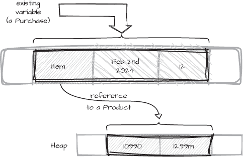
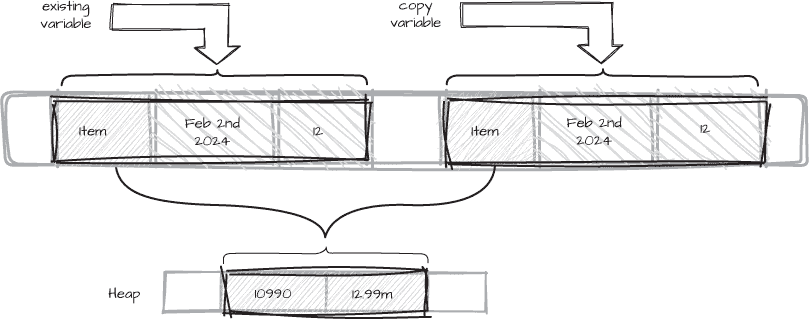

# 第四章：4 隐式和显式拷贝


在几乎任何有用的程序中，变量的值都在不断被拷贝，即使我们没有意识到。在这一章中，我们将研究拷贝的原因和可能的后果。这个话题看似微不足道，但拷贝可能会带来隐藏的成本，当我们不清楚某段代码*是否*在进行拷贝时，这些成本可能会变得成问题。

我们将探索以下内容：

+   为什么知道一个值是否是拷贝对于理解程序至关重要

+   如何在某些情况下避免拷贝值

+   编译器可能在哪些地方对值进行了隐藏拷贝

+   我们可以做些什么来防止编译器进行隐藏的拷贝

你已经从之前的章节了解到，拷贝引用始终是一个廉价的操作，因为它并不会同时拷贝实例。然而，当我们拷贝值类型实例时，每个字段的值也会被拷贝，这会消耗时间和内存空间，尤其是当实例包含多个字段时。因此，了解何时可能发生拷贝，可能有助于我们发现避免某些拷贝的机会，从而提高程序的内存使用效率和速度。

拷贝引用和拷贝实例之间的相对成本差异，是建议将值类型做小的常见建议背后的部分原因。然而，拷贝的成本只是其中的一部分。拷贝值类型实例通常是便宜的，尽管一些极端情况可能引起关注，但使用拷贝可能还会有*语义*上的影响。特别是，如果我们没有注意到自己做了拷贝，我们可能会惊讶于我们对一个值所做的更改没有以预期的方式显示出来。相应地，使用拷贝的引用对实例进行的意外更改，可能会引发微妙的问题。

## 通过简单赋值进行拷贝

值类型和引用类型的拷贝行为差异可能会有微妙的后果，这些后果可能隐藏在看似简单的表达式中，从而产生拷贝。拷贝的最简单例子发生在赋值的结果中：

```
var copy = existing;
```

将一个变量的值赋给另一个变量，这种操作叫做*简单赋值*，而左边—赋值的目标—必须是一个变量，或者是具有可访问的 set 访问器的属性或索引器。右边是一个*表达式*，它描述了任何可以计算出一个值的内容。这个表达式可能是一个简单的值，比如字面量或 枚举 成员，另一个变量，或者是一个更复杂的表达式，比如调用方法。

变量和值都与类型相关联。由于在前面的示例中我们使用了类型推导来声明<code>copy</code>变量并使用<code>var</code>声明，编译器根据<code>existing</code>的*值*推导出<code>copy</code>变量的类型。目标变量的类型不一定需要与赋值的值的类型完全相同。如果我们为目标变量指定了不同的类型，那么右侧值的类型必须能够*隐式转换*为左侧变量的类型。

我们可以尝试通过显式转换来强制将值转换为目标类型，如第二章中所示。例如，double类型可以显式转换为<code>int</code>类型，尽管此转换可能会丢失信息，因为值会被截断。如果编译器检测到显式转换永远不会成功，例如从<code>string</code>到<code>int</code>，则代码将无法编译。否则，转换会在运行时发生，如果转换失败，可能会引发<code>InvalidCastException</code>异常。

### 值拷贝行为

我们知道，非<code>null</code>引用的拷贝会引用与原始引用相同的内存实例。这意味着对引用类型实例的任何更改，通过*所有*引用该实例的引用都能看到。相比之下，当我们拷贝值类型的实例时，拷贝是该类型的新独立实例，包含原始值字段的副本。

然而，并非总是值类型的一个实例的更改不能被其他实例观察到。如果从原始值类型实例复制的任何字段是引用类型，那么被复制的实例将拥有这些引用的副本。因此，值类型实例的拷贝仍然可以通过其字段别名指向堆上的对象。为了说明这一点，考虑列表 4-1 中不推荐的示例，其中<code>Purchase</code>结构体的<code>Item</code>属性是指向可变<code>Product</code>类的引用。

```
public sealed class Product
{
    public int     Id {get; set;}
    public decimal Price {get; set;}
}
public readonly struct Purchase
{
    **public Product  Item {get; init;}**
    public DateTime Ordered {get; init;}
    public int      Quantity {get; init;}
}
```

列表 4-1：可变引用字段

在这里，Product是一个简单的数据承载类，类似于常用于从数据库或消息队列读取数据的类型。像Product这样的简单数据承载类的一个共同特征是具有可变属性，用于读取和写入它们的值。与此同时，Purchase类型是一个结构体，也是一个行为良好的值类型；它被标记为readonly，并且所有属性都是init-only，这意味着它们只能在初始化新的Purchase实例时赋值。

尽管Purchase是一个readonly结构体，但它*不是*不可变的，因为它的Item属性是一个可变类型。而且，这个属性是一个引用类型，因为Product是一个引用类型。因此，两个Purchase实例可以指向堆中的同一个*可变*Product实例。为了说明这一点，让我们看看这些类型的实例是如何在内存中布局的。

我们像这样从清单 4-1 中创建<sup class="SANS_TheSansMonoCd_W5Regular_11">Purchase</sup>类型的实例及其属性：

```
var existing = new Purchase
    {
        Item = new Product {Id = 10990, Price = 12.99m},
        Ordered = DateTime.Parse("2024-02-02"),
        Quantity = 12
    };
```

existing变量所使用的内存可能看起来像图 4-1。



图 4-1：结构体中引用的内存布局

由于 Purchase 是值类型，Purchase 类型的变量在声明的地方会包含一个完整的实例。在 图 4-1 中，existing 标识符是表示一个内存位置的名称，该位置包含 Purchase 类型的三个字段的值。其中一个字段是 Item 属性的备份字段，其类型为 Product 类。作为引用类型，Product 实例分配在堆上，Item 属性存储对它的引用。其他属性值的内容，由于它们是值类型实例，直接存储在 existing 变量中。现在考虑当我们在 清单 4-2 中*复制* existing 变量时会发生什么。

```
var existing = new Purchase
    {
        Item = new Product {Id = 10990, Price = 12.99m},
        Ordered = DateTime.Parse("2024-02-02"),
        Quantity = 12
    };
--`snip--`
**var copy** **=** **existing;**
```

清单 4-2：复制现有变量的值

因为 Item 属性的类型是一个类，所以只有*引用*被复制到新的 copy 变量的实例中，导致 existing 和 copy 两个变量都引用堆上同一个 Product 实例，如 图 4-2 所示。



图 4-2：复制结构体实例后的内存布局

将 existing 复制到 copy 后，我们现在在内存中有两个 Purchase 实例，但 Item 的实例数据尚未被复制。每个 Purchase 实例都引用堆上的同一个 Product 实例。

### 只读属性与不可变类型

将清单 4-1 中的<code class="SANS_TheSansMonoCd_W5Regular_11">Purchase</code>结构体设为只读并不能保护它免受与引用别名相关的意外副作用，也不能通过它的<code class="SANS_TheSansMonoCd_W5Regular_11">Item</code>属性没有<code class="SANS_TheSansMonoCd_W5Regular_11">set</code>访问器来保护。我们仍然可能无意中修改<code class="SANS_TheSansMonoCd_W5Regular_11">Item</code>属性所引用的对象，因为即使<code class="SANS_TheSansMonoCd_W5Regular_11">Purchase.Item</code>没有<code class="SANS_TheSansMonoCd_W5Regular_11">set</code>访问器，它所引用的<code class="SANS_TheSansMonoCd_W5Regular_11">Product</code>类型具有可变属性。如果我们通过<code class="SANS_TheSansMonoCd_W5Regular_11">copy</code>变量修改<code class="SANS_TheSansMonoCd_W5Regular_11">Product</code>实例的属性，这一更改将在清单 4-3 中演示，并且可以在<code class="SANS_TheSansMonoCd_W5Regular_11">现有</code>变量中看到。

```
var existing = new Purchase
    {
        Item = new Product {Id = 10990, Price = 12.99m},
        Ordered = DateTime.Parse("2024-02-02"),
        Quantity = 12
    };
var copy = existing;
**copy.Item.Price** **=** **14.99;**
Assert.That(existing.Item.Price, Is.EqualTo(14.99));
```

<code class="SANS_Futura_Std_Book_Oblique_I_11">清单 4-3：通过共享引用修改 Product 的状态</code>

由于<code class="SANS_TheSansMonoCd_W5Regular_11">Product</code>类型的属性是可写的，我们可以通过任何对其的引用来更改该实例。如果我们将<code class="SANS_TheSansMonoCd_W5Regular_11">Product</code>类型设为不可变的，我们就不能通过*任何*引用来更改<code class="SANS_TheSansMonoCd_W5Regular_11">Product</code>实例中的数据，因此它是否在多个引用变量之间共享也不重要。值类型包含引用作为字段或属性并不特别不寻常，但我们必须小心我们在值类型中存储的*引用种类*。如果我们想避免与<code class="SANS_TheSansMonoCd_W5Regular_11">Purchase</code>实例相关的意外更改问题，我们必须确保<code class="SANS_TheSansMonoCd_W5Regular_11">Purchase.Item</code>所引用的对象不能通过*任何*引用进行更改；仅仅确保引用的对象不能通过<code class="SANS_TheSansMonoCd_W5Regular_11">Purchase</code>本身进行更改是不够的。实现这一目标的最简单方法是将<code class="SANS_TheSansMonoCd_W5Regular_11">Product</code>设为不可变类型。更一般来说，具有引用类型字段的值类型应只引用不可变类型。

知道我们拥有的是引用的副本还是完整实例的副本是非常有价值的信息。将一个变量赋值给另一个变量是程序中最直观的值复制示例。在接下来的几个小节中，我们将看一些不太明显的值复制示例，看看我们的程序可能比我们想象的复制了更多的副本。

## <code class="SANS_Futura_Std_Bold_B_11">创建新对象</code>

大多数时候，我们不需要担心对象实例如何使用内存；这是 CLR 的责任。我们通过new表达式来创建对象实例，这种方式抽象了内存分配的细节以及内存在哪里分配。新对象总是通过调用构造函数创建的，尽管正如你在第二章中看到的，当我们使用对象初始化语法时，构造函数调用可能会被编译器隐式插入。无论哪种方式，都可能需要额外复制一个新的值类型实例，因此，为了更好地监控我们的程序使用的内存，我们需要特别注意*如何*构造新对象。

例如，清单 4-4 展示了通过对象初始化创建一个Purchase值类型实例。虽然在代码中看不见，但使用了一个额外的Purchase实例来执行初始化。

```
public readonly struct Purchase
{
    public Product   Item {get; init;}
    public DateTime  Ordered {get; init;}
    public int       Quantity {get; init;}
}
var order = new Purchase
    {
        Item = new Product {Id = 10990, Price = 12.99m},
        Ordered = DateTime.Parse("2024-02-02"),
        Quantity = 12
    };
```

清单 4-4：通过对象初始化创建一个新的 Purchase 值类型实例

> 注意

*额外的 Purchase 副本仅在我们实际访问其属性时才需要，但设置那些从不读取的属性值可能并不常见。*

当我们使用对象初始化来创建一个新对象时，构造函数仍然会被调用，即使它没有被显式指定。由于Purchase是一个结构体，并且没有用户定义的构造函数，新的实例首先会进行默认初始化，然后根据大括号中指定的值来赋值其属性。

由构造函数调用创建的默认初始化实例在我们的代码中*不可见*。新实例的属性通过一个隐藏的变量进行初始化，该变量在对象初始化完成后被复制到目标变量——清单 4-4 中的<sup class="SANS_TheSansMonoCd_W5Regular_11">order</sup>变量。当编译器编译初始化Purchase的代码时，它会生成相当于清单 4-5 的代码。

```
**var __temp** **=** **new Purchase();**
__temp.Item = new Product {Id = 10990, Price = 12.99m};
__temp.Ordered = DateTime.Parse("2024-02-02");
__temp.Quantity = 12;
**var order** **=** **__temp;**
```

清单 4-5：与对象初始化语法等效的代码

> 注意

*我们自己无法编写相同的代码，因为 Purchase 类型的 Item、Ordered 和 Quantity 属性是只初始化的。编译器还会将 Item 属性的初始化转换为对构造函数的调用，并单独设置其属性，但为了简洁起见，这里保留了对象初始化语法。*

在构造函数完成后，实例仅被默认初始化，特别是由于`Item`属性是引用类型，因此它将是null。这种两阶段初始化的目的是防止不完整的实例被访问。当初始化完成并且所有属性都被赋值后，隐藏的__temp变量的值被复制到目标order变量。

### 覆盖一个值

隐藏的变量还允许我们通过使用其先前值的属性重新赋值一个变量。列表 4-6 通过新的实例重新初始化`order`变量，并使用现有的`order.Item`值来为新实例的`Item`属性赋值。

```
order = new Purchase
    {
        **Item** **=** **order.Item,**
        Ordered = DateTime.Parse("2024-02-03"),
        Quantity = 5
    };
```

列表 4-6：使用自身属性重新初始化`order`变量

如果没有编译器引入的隐藏__temp变量，`new`表达式的结果将在获取`Item`属性的值之前被赋给`order`。`order`变量的初始化过程将类似于以下内容：

```
order = new Purchase();
**order.Item** **=** **order.Item;**
order.Ordered = DateTime.Parse("2024-02-03");
order.Quantity = 5;
```

请注意，在设置其属性之前，被赋值的order变量是默认初始化的。`Item`属性实际上被用来重新初始化自身。如果没有隐藏的__temp变量，`Item`将在`order`变量的初始化过程中被初始化为null，然后再次被赋值为相同的null值。因此，`order`变量的`Item`属性最终将变为null，这显然不是我们希望的结果。列表 4-5 中展示的方法通过在临时副本完全初始化之前不覆盖`order`实例来正确处理这种行为。

当Purchase是值类型时，如这些示例所示，额外的__temp副本可能很重要，因为它是整个实例值的副本。当类型是类或记录时，副本只是指向相同实例的新引用，因此额外副本的成本可以忽略不计。

在 C# v9.0 之前，只有具有公共set访问器的属性才能使用对象初始化。随着init仅限属性的引入，这个限制被取消了，但通常情况下，构造函数是初始化实例的更直接的方法，至少部分原因是它避免了隐藏变量的需求——嗯，*大多数*情况下如此。正如你接下来看到的，这对值类型来说并非普遍适用。

### 构造值类型

当我们通过用户定义的构造函数创建结构体或记录结构体类型的局部变量实例时，编译器可以对我们在对象初始化中看到的两阶段初始化进行一些变化。编译器仍然插入一个隐藏变量，但它不再设置属性，而是通过在隐藏实例上直接调用所需的构造函数，然后将其值复制到目标变量。

列表 4-7 显示了一个Color结构体，其属性既没有set也没有init访问器，因此我们必须使用构造函数来初始化这些属性。

```
public readonly struct Color
{
    public Color(int red, int green, int blue)
        => (Red, Green, Blue) = (red, green, blue);
    public int Red {get;}
    public int Green {get;}
    public int Blue {get;}
}
**var background** **=** **new Color(red: 0xFF, green: 0xA5, blue: 0x0);**
```

列表 4-7：调用构造函数初始化 Color 结构体的属性

构造函数在编译后的代码中具有特殊名称.ctor，因此使用参数创建Color的实例大致等同于：

```
Color __temp;
__temp..ctor(red: 0xFF, green: 0xA5, blue: 0x0);
Color background = __temp;
```

构造函数在第二行的__temp值上*原地*调用。__temp变量的声明导致编译器为Color的默认实例预留足够的空间，并且在运行时，构造函数在该实例上调用，就像它是一个普通方法一样。

由于Color是值类型，隐藏变量表示一个完整的实例，并且该实例被完整地复制到目标变量。这种行为仅适用于结构体和记录结构体类型的用户定义构造函数；值类型的默认构造函数只会默认初始化每个字段，因此不需要隐藏副本。

正如我们在对象初始化时看到的，隐藏的__temp变量防止了部分构造的实例被观察到。实际上，编译器通常可以将隐藏的实例完全优化掉，但在某些情况下，例如在构造实例可能因异常而失败时，隐藏的副本是无法避免的。考虑示例 4-8 中的Brush类，其中的background字段使用字段初始化器进行初始化。在Assign方法中，我们为background字段赋予一个新值。

```
public class Brush
{
    public void Assign(int r, int g, int b)
    {
        **background** **=** **new Color(red: r, green: g, blue: b);**
    }
    private Color background = new Color(red: 0xFF, green: 0xA5, blue: 0);
}
```

示例 4-8：调用可能抛出异常的结构体构造函数

隐藏的临时副本Color在我们在Brush的Assign方法中重新赋值给background字段时至关重要，因为它确保background始终具有有效且可预测的值。如果直接在background实例上调用Color构造函数并且发生异常，它可能会使background处于不确定的状态。在Assign方法中，编译器必须确保即使Color构造函数抛出异常，现有的background字段值仍然可以使用。

通过将Color实例的构造与赋值给background字段的操作分开，编译器确保该变量的唯一*可观察*状态是：要么是完全构造的值（如果没有发生异常），要么是其之前的值（如果构造函数抛出异常）。请注意，复制值类型实例永远不会抛出异常；将值从一个内存位置复制到另一个内存位置总是安全的，并且在运行时不需要分配新的内存。

复制值类型实例并不保证是原子的。例如，如果该类型有多个字段或浮动点值，不同的线程可能会在复制操作的过程中观察到目标值，这种风险被称为*内存撕裂*。这个问题只会在多个线程共享可以写入的内存时发生。然而，重要的是要记住，不可变性不仅仅是关于设置属性；不可变值也可以被复制。防止内存撕裂的最简单方法是确保多个线程可以访问的内存是只读的。

### 复制类似值类型的记录

第二章展示了如何使用无破坏性变更来复制现有的记录实例，并通过使用with关键字来更改该副本的选定属性。清单 4-9 展示了如何通过这种方式克隆一个Color记录。

```
public sealed record Color(int Red, int Green, int Blue);
var pink = new Color(Red: 0xFF, Green: 0xA5, Blue: 0xFF);
**var orange** **=** **pink with {Blue** **=** **0};**
```

清单 4-9：使用 with 克隆记录实例

使用无破坏性变更克隆实例意味着保留原始实例，同时改变复制的实例。在清单 4-9 中，克隆变量orange继承了pink的所有属性，*除了*显式将Blue属性的值设置为0。

相同的语法也可以用于复制结构体和记录结构体，并提供了一种方便的方式来设置目标变量上的init仅限属性。记录类型具有额外的好处，因为它们是引用类型，因此不具有真正值类型的按值复制语义。如果我们仅将一个记录变量赋值给另一个变量，我们仍然得到对同一实例的两个引用，如下所示：

```
var black = pink;
Assert.That(ReferenceEquals(black, pink), Is.True);
```

如果pink变量是值类型，black将是该实例的副本。无论是值类型还是引用类型，with关键字总是复制一个实例。

就像对象初始化一样，编译器会创建一个隐藏的临时实例，并在将其复制到目标变量之前设置其属性。非破坏性变异与对象初始化的不同之处在于，对于记录类型，新的实例是通过虚拟的编译器生成的Clone方法创建的。这个方法至关重要，因为默认情况下，像示例中的Color记录这样的位置信息记录没有可访问的无参构造函数。

记录结构体和结构体总是可以在没有参数的情况下构造，并且总是按值复制，这意味着它们不需要也没有Clone方法。with语法不支持类类型，因为除了其他挑战外，大多数类并不打算模拟值语义。

引用类型实例的初始化过程与值类型的初始化过程不同，主要是由于不同类型在内存中的分配和存储方式。这对我们用来访问这些实例的变量也有影响，尤其是当我们需要使用引用变量来引用值类型实例时，会导致值被装箱。

## 识别不必要的装箱

值类型实例除非作为另一个对象的一部分，否则不会存在于堆上，因此我们不能使用引用直接引用它们。如你在第二章中所知，装箱通过将值复制到堆上的已知位置来解决这个问题，并允许我们引用这个副本。

然而，由于装箱总是将数据复制到堆上，装箱的对象会受到垃圾回收和其他堆管理任务的影响。如果我们随意地进行装箱，那么程序的性能和内存使用将受到影响。花时间识别和移除不必要的装箱将提高代码的效率。

装箱发生在我们使用引用类型变量引用值类型实例时。它通常是隐式发生的（尽管我们可以显式地进行装箱，但很少需要这样做）。回想一下第二章，所有类型最终都派生自object，因此我们总是可以隐式地将任何类型的值转换为object。当该值本身不是引用时，结果就是引用一个已装箱的实例。

让我们来看一个例子。清单 4-10 中的 Clone 方法创建了一个新的本地 Coordinate 值类型实例，并返回一个指向它的 object 引用。返回的值是指向已装箱的 Coordinate 的引用。

```
public readonly struct Coordinate
{
    public int X {get; init;}
    public int Y {get; init;}
    public object Clone()
    {
        var item = new Coordinate {X = this.X, Y = this.Y};
        return item;
    }
    `--snip--`
}
```

清单 4-10：返回对装箱值类型变量的引用

当我们调用 Clone 方法时，我们会返回一个指向装箱后的 Coordinate 实例的 object 引用。装箱发生在方法退出之前；堆上为 item 的值分配空间，并返回指向该盒子的引用。

拆箱是装箱的逆操作，它将堆上盒子中的值复制到其原始值类型的实例中。拆箱必须始终显式进行，并且在语法上与将装箱值显式转换为目标类型的强制转换相同，如清单 4-11 所示。

```
var original = new Coordinate(`--snip--)`;
object box = original.Clone();
**Coordinate clone** **=** **(Coordinate)box;**
```

清单 4-11：拆箱为原始类型

当一个值类型实现了一个或多个接口时，实例也可以通过任何这些接口类型的变量来引用，这同样需要对实例进行装箱。

### 到接口

只有当值能够隐式转换为目标引用类型时，值才可以进行装箱。由于所有值类型都是封闭的——意味着禁止继承——因此有效的转换可以是到一个 object 变量引用、一个 System.ValueType（它本身*不是*值类型），或者一个值类型实现的接口。如果值是一个 enum 成员，它还可以转换为 System.Enum 类或 System.Enum 实现的任何接口。

我们只在极少数情况下需要对一个值进行直接的 object 引用，除了纯粹的教学示例外，装箱到 System.ValueType 并没有任何意义。一个值类型变量可以隐式转换为该类型实现的任何接口，比如清单 4-12 中，Color 结构实现的 IComparable 接口。

```
**public readonly struct Color : IComparable<Color>**
{
    public Color(uint val) => rgb = val;
    int IComparable<Color>.CompareTo(Color other)
        => rgb.CompareTo(other.rgb);
    private readonly uint rgb;
}
```

Listing 4-12: Color 结构体实现 IComparable 接口

IComparable< T > 接口指定了一个名为 CompareTo 的方法，在该方法中我们定义了比较操作，使得 T 类型的集合能够进行排序。这里 Color 的实现只是将操作委托给它的 uint 字段，而 uint 实现了 IComparable< uint> 接口。

请注意，IComparable< Color>.CompareTo 的实现是一个 *显式* 实现，这意味着我们只能通过接口类型的引用来调用 CompareTo。任何直接在 Color 变量上调用 CompareTo 都会导致编译错误。如果我们将 Color 变量强制转换为 IComparable< Color> 接口类型，该值将被装箱为 IComparable< Color> 引用，正如在 Listing 4-13 中所示。

```
var red = new Color(0xFF0000);
var green = new Color(0x00FF00);
**IComparable<Color>** **compare** **=** **red;**
var less = compare.CompareTo(green);
```

Listing 4-13: 显式装箱为接口类型

当我们初始化这个 compare 变量时，red 的值被装箱，因为任何接口类型的变量都是引用类型。如果我们将 CompareTo 改为非显式实现，就可以直接使用 red 变量调用，而无需进行接口类型的强制转换。这并不意味着我们应该偏好非显式实现；显式接口方法是很好的一种方式，可以将类型的公共接口进行隔离。

我们可以通过使用约束为接口类型的泛型类型参数来调用显式接口实现。在这种情况下，不需要进行强制转换，也不会发生装箱。为了演示，清单 4-14 中的泛型 LessThan 方法在传递 Color 值作为参数时不会装箱，即使泛型参数 T 被约束为 IComparable< T > 接口。

```
public static bool LessThan<T>(T left, T right)
    **where T : IComparable<T>**
{
    return left.CompareTo(right) < 0;
}
var red = new Color(0xFF0000);
var green = new Color(0x00FF00);
Assert.That(LessThan(green, red), Is.True);
```

清单 4-14：将泛型类型参数 T 限制为 IComparable< T > 接口类型

当以这种方式约束泛型类型参数时，泛型类型的变量被认为是用于约束的类型。在这个例子中，left 被当作 IComparable< T > 类型的变量使用。我们可以直接在 T 表示的任何值上调用该方法，即使实现方法是显式实现。

### 在方法调用中

通过将值类型实例赋值给引用类型变量进行装箱在代码中通常非常显眼，但当我们将值类型实例作为引用类型方法参数的参数传递时，也会发生装箱。与赋值给引用变量一样，如果存在到参数类型的隐式转换，则值会被隐式装箱。由于装箱通常是隐式的，因此很难察觉。例如，清单 4-15 将 now 变量装箱，因为 DateTime 是一个值类型，而 Console.WriteLine 接受一个 object? 参数，后者遵循 string 参数格式。

```
DateTime now = DateTime.Now;
--`snip--`
Console.WriteLine("Time now: {0}", now);
```

清单 4-15：将 now 参数传递给 Console.WriteLine 进行装箱

如果我们在将值类型作为引用类型参数传递时保持警觉，就可以最小化装箱参数的需求，或者修改代码以避免装箱。然而，重要的是要权衡装箱的成本与其余代码的上下文。

例如，在示例 4-15 中，我们可以传递now变量作为Console.WriteLine的参数，而不是仅仅传递它。我们可以传递now.ToString，因为它不需要装箱，因为DateTime结构体重写了ToString方法，而WriteLine方法无论如何都会调用它。然而，有人认为，显式调用ToString会降低代码的直接性，而将now变量装箱的开销与写入控制台的开销相比是微不足道的。

当我们在一个没有特意重写该方法的值类型实例上调用基类的虚方法时，实例会被装箱以调用基类实现。如果该方法被类型重写（就像ToString在DateTime中那样），则不会发生装箱。在这种情况下，通过重写从object类继承的所有虚方法（包括ToString、Equals和GetHashCode），我们可以避免装箱自己的值类型。

然而，对一个值类型调用GetType方法会*始终*导致该值被装箱。GetType方法用于获取变量的运行时类型，并且是基于object类实现的。然而，GetType方法不是虚拟的，因此不能被重写。

这里的教训是，我们应该避免对值类型调用GetType。如果我们需要值类型的信息，可以改用typeof。由于值类型是密封的，不能继承其他类型，因此typeof返回的编译时类型将始终与GetType给出的运行时类型匹配。

## 方法参数和参数

大多数值的副本是无法轻易避免的，传递参数给方法可能是副本创建最多的地方。避免这样的复制并不总是有益的，但理解方法调用的机制是至关重要的。本节将讨论在属性、索引器、操作符和转换中，隐藏的副本通常是由幕后方法调用导致的。

方法可以通过值传递或引用传递它们的参数。正如你在第三章中看到的，引用参数的特点是我们需要使用其中一个关键字：ref、out或in，来声明它们，并且对于<spamp class="SANS_TheSansMonoCd_W5Regular_11">ref和out参数，还需要在传递的参数中指定。不是引用参数的参数被称为*值参数*。将一个参数传递给值参数是非常常见的事情，以至于我们容易忘记它会导致一个副本的创建。捕获方法调用的结果通常也会创建返回值的副本。

此外，值类型和引用类型之间的语义和行为差异在我们使用方法返回的值时具有重要影响。我们并不总是清楚自己是否在调用一个方法或使用从方法返回的值。然而，在我们调查这些情况之前，让我们先回顾一下值参数和返回值的基本机制。

### 按值传递和返回

示例 4-16 展示了一个简单的值类型Speed，它有一个静态的Incremented方法，该方法接受一个值参数original，并返回一个新值。Incremented方法中的参数和返回语句都表示Speed实例的副本。

```
public readonly struct Speed
{
    private Speed(double ms) => InMetersPerSecond = ms;
    public double InMetersPerSecond {get;}
    public static Speed FromMetersPerSecond(double val) => new Speed(val);
    **public static Speed Incremented(Speed original)**
    **{**
        **var result** **=**
            **Speed.FromMetersPerSecond(original.InMetersPerSecond** **+** **10);**
        **return result;**
    **}**
}
var start = Speed.FromMetersPerSecond(40);
var end = Speed.Incremented(start);
Assert.That(end.InMetersPerSecond, Is.EqualTo(50));
```

示例 4-16：按值传递和返回 Speed 实例

Incremented 方法通过值接收它的 original 参数，这意味着 original 是方法内的一个局部变量。返回值也是通过值返回，因此当我们调用该方法时，返回的是一个新的 Speed 实例作为新值。作为优化，编译器可能通过使用 result 局部变量直接将目标变量赋值，从而避免复制，只要观察到的效果与进行复制时相同。我们可以像这里一样将值赋给一个新变量，或者使用新值覆盖最初作为参数传入的 start 变量的值。

我们可以使用扩展方法，而不是普通的静态方法，这样我们就像调用实例方法一样调用它。扩展方法的第一个参数很特别，因为它表示在普通实例成员中隐式可用的 this 标识符。扩展方法是提供不同单位（可能是较少见的单位）的好选择。清单 4-17 使用了一个名为 InMph 的扩展方法，以获取以每小时英里为单位的 Speed 值。

```
public static class SpeedExtensions
{
    **public static double InMph(this Speed speed)**
        => speed.InMetersPerSecond * 2.236936;
}
var mph = initial.InMph();
```

清单 4-17：为 Speed 定义 InMph 扩展方法

尽管在 InMph 扩展方法的声明中有特殊的 this 语法，第一参数仍然只是一个值参数，通过值接收它的参数。因此，initial 变量的值将被复制到 speed 参数中以调用该方法。由于 Speed 类型是结构体，所以我们每次进行复制都会得到一个完整的 Speed 实例。

> 注意

*我们有许多在线转换器可以选择来进行这种类型的转换。用于清单 4-17 的转换器来自 Inch Calculator 网站，* [`www.inchcalculator.com/convert/meter-per-second-to-mile-per-hour/*.*`](https://www.inchcalculator.com/convert/meter-per-second-to-mile-per-hour/)

### 访问属性

每当我们访问一个属性时，实际上是在调用一个方法，要么获取它的值，要么设置一个新值。get 和 set 访问器都被实现为类型上的隐藏方法。默认情况下，set 有一个值参数，而 get 通过值返回。因此，在这两种情况下，当我们访问属性时，都会创建值的副本。这个过程很容易被忽略，因为使用属性的语法看起来像是在直接获取或设置字段。

请参考 Listing 4-18 中显示的 Velocity 值类型的 Speed 属性。

```
public readonly struct Velocity
{
    public Velocity(Speed speed, Angle angle)
        => (Speed, Direction) = (speed, angle);
    **public Speed Speed {get;}**
    public Angle Direction {get;}
}
```

Listing 4-18: 定义 Velocity 结构体的属性

查看编译后的 CIL 文件，发现 Velocity 结构体的 Speed 属性的访问器被编译为对隐藏的 get_Speed 方法的调用：

```
.property instance valuetype Speed Speed()
{
    .get instance valuetype Speed Velocity::**get_Speed**()
} // end of property Velocity::Speed
```

除了 CIL 特定的标记 .property、instance 和 valuetype 外，调用 get_Speed 只是一个常规的方法调用。编译器也会合成 get_Speed 方法，其签名在 CIL 中如下所示：

```
.method public hidebysig specialname instance valuetype Speed
    **get_Speed**() cil managed
{
    `--snip--`
```

如果 Speed 有一个对应的 set 访问器，它将被编译为一个名为 set_Speed 的方法，该方法接收一个 Speed 参数，并返回 void。CIL 标记 hidebysig 和 specialname 在执行过程中不被使用，但它们被处理 CIL 的工具使用。

编译器将 get_Speed 访问器实现为一个不带参数的方法，返回一个 Speed 类型的值，*按值*返回。它几乎就像我们自己写了一个返回 Speed 的方法，代码如下：

```
public Speed get_Speed()
{
    // return a Speed value
}
```

Speed 属性的 get 访问器返回一个 *副本* 的 Speed 实例，和任何返回 Speed 副本的方法一样。

很容易将使用属性或索引器误认为是直接访问字段，因为编译器注入的方法调用被巧妙地隐藏了。然而，需要意识到的是，访问属性或索引器会调用一个方法，并且通常会复制值。

> 注意

索引器 *是特殊的实例方法，允许像访问数组或类似序列的对象一样访问对象。它们通过与属性相同的方式实现，即通过方法。*

### 使用带运算符的表达式

带运算符的表达式，如 + 或 ==，通常也表示方法调用，要求为参数和返回值复制，并且可能会在内部做其他副本。例如，在列表 4-19 中，我们将两个 Speed 值相加。

```
var start = Speed.FromMetersPerSecond(55);
var increase = Speed.FromMetersPerSecond(15);
var final = **start** **+** **increase**;
```

列表 4-19：加法两个 Speed 值

这种加法背后的方法调用可能并不立即显现，但仔细观察会发现，简单地将实例相加可能表示多个副本。列表 4-20 展示了将两个 Speed 值相加的标准形式 operator+。

```
public static Speed operator+(Speed left, Speed right)
    => new Speed(left.InMetersPerSecond + right.InMetersPerSecond);
```

列表 4-20：定义 Speed 的加法运算符

left 和 right 参数对于 operator+ 表示每个副本。概念上，也会为返回值创建副本，尽管编译器可以优化掉这个副本，并直接在目标变量中构造新的 Speed 实例。

我们还可以重载<сamp class="SANS_TheSansMonoCd_W5Regular_11">==相等操作符、如<сamp class="SANS_TheSansMonoCd_W5Regular_11">operator<的比较操作符、二进制组合操作符<сamp class="SANS_TheSansMonoCd_W5Regular_11">|和<сamp class="SANS_TheSansMonoCd_W5Regular_11">&，甚至是布尔运算符<сamp class="SANS_TheSansMonoCd_W5Regular_11">true和<сamp class="SANS_TheSansMonoCd_W5Regular_11">false，这使得我们可以像<сamp class="SANS_TheSansMonoCd_W5Regular_11">if(speed) {…}一样在布尔测试表达式中包含一个变量。希望我们*不要*被诱惑重载像<сamp class="SANS_TheSansMonoCd_W5Regular_11">Speed这样的类型的布尔操作符。

所有这些操作符重载都作为类型的静态方法实现，并且所有方法至少接受一个参数，即它们所属的类型。这个参数通常按值传递，因此表示一个副本。

用户定义的转换操作符也是方法，当它们的参数或返回类型是值类型时，就像其他值类型一样按值传递。识别隐式转换的调用位置尤其困难，因为这一过程在代码中几乎没有语法线索。举例来说，参考示例 4-21 中的Velocity类型，该类型定义了一个从<сamp class="SANS_TheSansMonoCd_W5Regular_11">Velocity到<сamp class="SANS_TheSansMonoCd_W5Regular_11">Speed的隐式转换。

```
public readonly struct Velocity
{
    public Velocity(Speed speed, Angle angle)
        => (Speed, Direction) = (speed, angle);
    public Speed Speed {get;}
    public Angle Direction {get;}
    **public static implicit operator Speed(Velocity velocity)**
        **=>** **velocity.Speed;**
}
```

示例 4-21：用户定义的隐式转换

这个转换操作符使用一个<сamp class="SANS_TheSansMonoCd_W5Regular_11">Velocity的副本作为参数，和两个<сamp class="SANS_TheSansMonoCd_W5Regular_11">Speed的副本——一个用于访问<сamp class="SANS_TheSansMonoCd_W5Regular_11">velocity参数的属性，另一个用于返回值。与其他方法一样，编译器可能能够避免显式地复制返回值。在示例 4-22 中，<сamp class="SANS_TheSansMonoCd_W5Regular_11">DistanceInKm方法接受一个<сamp class="SANS_TheSansMonoCd_W5Regular_11">Speed参数，并且是使用<сamp class="SANS_TheSansMonoCd_W5Regular_11">Velocity的实例调用的，而不是<сamp class="SANS_TheSansMonoCd_W5Regular_11">velocity.Speed属性。

```
public double **DistanceInKm(Speed speed, TimeSpan elapsed)**
    => speed.InMetersPerSecond / 1000 * elapsed.TotalSeconds;
var velocity = new Velocity(initial, direction);
var distance = **DistanceInKm(velocity, TimeSpan.FromHours(2));**
```

示例 4-22：使用隐式转换传递参数

尽管这看起来是对`DistanceInKm`方法的常规调用，但`velocity`参数首先需要转换为`Speed`。我们的类型转换操作符使得这一点成为可能，而且由于我们将转换设为隐式，编译器会在调用`DistanceInKm`时自动插入对该操作符的调用，同时复制`Velocity`参数和`Speed`返回值。

类型转换需要谨慎使用。它们可能隐藏各种复杂性，除了通常表示的副本外。隐式转换是按设计自动发生的，代码中仅留下微妙的线索，例如在清单 4-22 中的方法调用`DistanceInKm`。显式的用户定义转换在使用它们的代码中语法上更为明显，但仍然很容易忽略它们同样代表对方法的调用。

当方法通过引用返回一个变量时——我们在第三章中首先研究了这一点——只要这两个变量都不是只读的，我们可以使用这个通过引用返回的变量直接修改底层变量。然而，记住，`ref`返回是一个优化特性，不应当不加选择地引入。

所有其他非`void`的方法都会产生值，而不是变量，这意味着我们不能直接将结果赋值给变量。如果我们忘记这一点并错误使用返回值，可能会导致意外的行为。

## 修改返回类型实例

你在第二章中看到过，变量可以被赋值，但值不能。值是表达式的结果，包括方法调用，并且是不可变的。我们不能直接修改任何方法返回的值。

一个常见的困惑源是值类型实例和引用类型实例在这一点上的行为不同：如果方法返回对可变类型的引用，我们可以使用返回的引用直接修改内存中的实例，但如果返回的是可变值类型实例，我们不能直接修改它，除非首先将返回的值复制到一个变量中。理解值类型与引用类型在这一点上的区别将帮助我们避免一些常见的危险，并更好地理解将所有值类型设为不可变的最佳实践。

当返回值是一个值类型实例时，我们不能使用它来设置属性值或修改该值的任何公共字段。我们必须先将该值赋给一个变量，然后才能对其进行修改。为了演示，Listing 4-23 展示了一个包含故意可变的InMetersPerSecond属性的结构体和一个名为FromKmh的静态工厂方法。

```
public struct Speed
{
    public double InMetersPerSecond {get; set;}
    public static Speed FromKmh(double val)
        => new Speed(val * 1000 / 3600);
    private Speed(double ms) => InMetersPerSecond = ms;
}
**Speed.FromKmh(70).InMetersPerSecond** **=** **15.2;**
```

Listing 4-23: 尝试修改 FromKmh 返回值

在最后一行，我们尝试为从静态方法返回的值的InMetersPerSecond属性设置一个值，这会导致编译错误：

```
[CS1612] Cannot modify the return value of 'Speed.FromKmh(double)' because it is not a variable
```

这个示例编译失败，因为FromKmh方法返回的是一个Speed*值*。编译器拒绝对该值进行任何修改，即使InMetersPerSecond属性有一个公共的set访问器。

> 注意

*C*++ *程序员会将返回值称为 rvalue。*

如果允许对返回值进行修改，这些修改将作用于由编译器引入的临时实例，该实例用于捕获方法返回的值。在 Listing 4-23 中，由FromKmh方法创建的Speed实例的生命周期在方法返回时结束，因此返回值需要存储在某个地方——即实例的一个隐藏副本中。

在任何情况下，我们通常会将由FromKmh返回的Speed值赋给另一个变量。我们可以修改目标*变量*的InMetersPerSecond属性，因为Speed具有公共的set访问器，如下所示：

```
var start = Speed.FromKmh(70);
start.InMetersPerSecond = 15.2;
```

返回值不可修改的限制并不限于属性；如果我们尝试修改返回值上的公共字段，它也适用。编译器会阻止这样的修改，因为方法的返回值并不是一个变量。然而，正如你已经看到的，代码的某些部分看起来不像方法，但在编译后的代码中却表现为方法。这种对修改返回值的限制同样适用于它们，因为它们也会生成临时副本。

### 引用类型属性

如果从方法（或属性、索引器、运算符）返回的值是引用类型，我们可以修改所引用的实例，因为该值的临时副本是指向同一实例的另一个引用。因此，我们可以使用返回的引用来设置公共可变属性，尽管我们不能通过将其赋值为指向不同对象的引用来更改引用本身的值。

请参考示例 4-24，该示例使用从Data方法返回的值来设置引用类型实例的属性。

```
public class ReadBuffer
{
    public StringBuilder Data()
        => buffer;
    private readonly StringBuilder buffer = new();
}
var buffer = new ReadBuffer();
**buffer.Data().Capacity** **=** **128;**
```

示例 4-24：设置引用类型属性

StringBuilder类型是一个具有公共可写的Capacity属性的类。ReadBuffer.Data返回的值是一个指向存储在ReadBuffer字段中的StringBuilder实例的引用。因此，我们可以使用从Data方法返回的引用来设置存储在buffer字段中的实例的Capacity。

然而，我们不能将该引用分配给一个新的StringBuilder实例，因为那样做会改变返回的值，而不是实例：

```
buffer.Data() = new StringBuilder();
```

这会导致编译失败，因为我们试图给一个值赋值，而不是给一个变量赋值：

```
[CS0131] The left-hand side of an assignment must be a variable, property or indexer
```

返回引用类型和返回值类型实例的方法在行为上的差异是建议将所有值类型设为不可变的原因之一。通过这样做，我们可以消除任何关于值类型实例可能被修改的混淆，因为它无法被任何东西修改。当我们试图修改返回的值时，代码会编译失败。当值是值类型实例时，编译失败是件好事：如果允许修改，我们可能不会修改我们认为会修改的实例。除非一个值类型是真正不可变的，最好是作为只读结构体或只读记录结构体存在，否则即使它是一个隐藏的副本，实例仍然可以通过其实例方法被修改。

### 实例方法与可变性

尽管我们不能在返回的值类型实例上设置属性值，但我们可以在该实例上调用方法。如果该类型具有非只读字段，或具有 set 访问器的属性，那么我们调用的方法就可以修改该实例。在下一个示例中，我们有一个可变的 Speed 结构体，它具有一个可以改变 InMetersPerSecond 属性值的 Reset 方法：

```
public struct Speed
{
    public double InMetersPerSecond {get; set;}
    **public void Reset()** **=>** **InMetersPerSecond** **=** **0;**
    `--snip--`
}
```

Reset 方法可以在任何 Speed 值上调用，包括从方法或属性返回的值。在 列表 4-25 中，我们使用一个 Velocity 对象的 Speed 属性的值来调用 Reset。

```
var velocity = new Velocity(Speed.FromKmh(55), Angle.FromDegrees(45));
**velocity.Speed.Reset();**
Assert.That(velocity.Speed.InMetersPerSecond, Is.EqualTo(0));
```

列表 4-25：在 Velocity 的 Speed 属性返回的值上调用 Reset 方法

当我们在 velocity.Speed 上调用 Reset 时，我们可能会误以为我们已经改变了 velocity 变量中存储的值，但这里 velocity 并没有发生变化，测试也因此失败，因为 Reset 方法只会改变调用它的实例。通过 Speed 属性返回的实例是一个临时值。回想一下 列表 4-23，我们不能直接使用该值来设置 InMetersPerSecond 属性，但我们可以通过 Speed 的实例方法来改变该属性。

我们可以通过类似的方式改变从索引器获得的值，而且我们也可以很容易忽视只有隐藏的副本被改变。考虑 列表 4-26，它在从 Journey 类型的索引器返回的值上调用方法。

```
public class Journey
{
    `--snip--`
    public Velocity this[int idx]
    {
        get => legs[idx]; set => legs[idx] = value;
  }
    private List<Velocity> legs = new List<Velocity>();
}
**journey[0].Speed.Reset();**
```

列表 4-26：在 Journey 的索引器返回的值上调用方法

索引器作为方法实现，与属性的实现方式相同，并且具有完全相同的行为。同样，容易忘记属性不是变量，特别是当它们是值类型实例时。编译器无法阻止我们对返回值调用方法，因为这是一个完全合理的操作。防止这种错误行为的唯一方法是将 Speed 设为不可变类型，从而完全禁止任何修改方法。这是将所有值类型设置为不可变的另一个重要原因。

### 属性作为只读参数的参数

方法返回值而非变量的另一个后果是，它们不能直接作为 ref 或 out 参数传递。如同在第三章中所见，按引用传递的参数接收其参数的地址，但只有变量才有地址。如果我们先将方法返回值或属性结果赋值给一个变量，就可以通过引用将该变量传递。

第三章 还解释了 in 参数是一个不可变的按引用传递的变量。虽然 in 参数以与 ref 和 out 参数完全相同的方式获取其参数的地址，但它们的设计目的是表现得像值类型参数。因此，编译器允许我们将非变量作为 in 参数的实参，但会将值复制到一个隐藏的变量中，传递的实际上是该变量的地址。

示例 4-27 定义了一个包含两个 in 参数的 BallisticRange 方法，并通过一个 Velocity 类型的 Speed 和 Direction 属性来调用它。

```
public static double BallisticRange(in Speed initialSpeed, in Angle initialDirection)
{
    const double Gravity = 9.81;
    return initialSpeed.InMetersPerSecond * initialSpeed.InMetersPerSecond *
            Math.Sin(initialDirection.InRadians * 2) / Gravity;
}
public readonly struct Velocity
{
    public Velocity(Speed speed, Angle angle)
        => (Speed, Direction) = (speed, angle);
 public Speed Speed {get;}
    public Angle Direction {get;}
}
var velocity = new Velocity(Speed.FromMetersPerSecond(55),
                            Angle.FromRadians(0.78));
**var distance** **=** **BallisticRange(velocity.Speed, velocity.Direction);**
```

示例 4-27：将属性作为 in 参数传递

请记住，与 ref 和 out 参数不同，我们不需要通过 in 关键字来修改传入的 in 参数。

在这里，编译器从velocity.Speed和velocity.Direction获取值并创建副本，然后将这些副本的引用传递给BallisticRange方法的in参数。这就像我们写了这样的一段代码：

```
var __temp_Speed = velocity.Speed;
var __temp_Angle = velocity.Direction;
var distance = BallisticRange(in __temp_Speed, in __temp_Angle);
```

创建__temp_Speed和__temp_Angle副本的原因是，访问属性的get访问器会生成一个值，而不是一个变量。通过引用传递一个参数实际上需要编译器获取该参数在内存中的地址，但只有变量才有地址。get访问器返回的是一个临时值，需要将其赋值给变量以便获取地址，或者将其传递给一个值参数，后者会生成该值的副本。虽然in参数可以帮助减少我们应用程序生成的副本数量，但只有在我们传递变量作为参数时，我们才能看到它们的好处。

对于非变量的其他表达式，如常量和数值类型方法返回值，也会创建一个隐藏副本。这些副本仅为只读的in参数创建。如果我们试图将属性值或其他非变量传递给ref或out参数，编译器将直接拒绝我们的代码。这种*可变*引用变量是为了被调用的方法修改，而这些修改在常量或由get访问器返回的临时值上是非法的。

## 防御性副本

每当编译器需要一个只读变量，但无法保证其值永远不会改变时，编译器会创建一个*防御性副本*。因此，任何变化，不论多么无意，都会应用于隐藏副本，而不是可见的变量，因此无法观察到这些变化。

在示例 4-8 中，你看到了编译器如何在构造值类型时为其创建一个防御性副本，构造一个值类型实例时，编译器会创建一个隐藏的临时实例，并在构造函数完成后将其复制到目标变量中。这个过程可以保护现有的值不受构造函数体内可能发生的异常的影响。如果发生异常，原始值将保持不变。

编译器还可能创建一个值类型实例的防御性副本，以保护只读变量不被修改。

对于引用类型，防御性复制不是必需的，因为编译器总是能够检测到引用值的变化。如果引用变量是只读的，任何尝试为其赋新引用的操作都会导致编译错误。引用的实例是否不可变在这里并没有影响；如果我们要求实例为只读，确保它不发生变化是我们的责任。值类型变量的值即为实例，而可变值可以通过实例方法进行修改，因此如果变量应为只读，编译器可能会在调用这些方法时引入防御性复制。

### 可变值类型和输入参数

在 第三章 中，你已经了解了如何使用 in 修饰符来避免复制参数值，前提是方法实现不会修改相应参数变量的值。然而，除非编译器能够保证即便是无意间的参数值变化也不可能发生，否则它将会对这些值进行防御性复制。

清单 4-27 显示了 BallisticRange 方法，该方法有两个只读引用参数，initialSpeed 和 initialDirection。方法实现使用这些参数变量的属性（分别是 InMetersPerSecond 和 InRadians）来计算返回值。如果这些属性的类型没有明确标记为不可变，编译器将会对其值进行防御性复制，以保证 in 参数的只读特性。Speed 和 Angle 结构体类型由 BallisticRange 使用，详见 清单 4-28。这两种类型的属性都是不可变的，但请注意，这些类型本身并没有标记为 readonly。

```
public struct Speed
{
      `--snip--`
    public double InMetersPerSecond => amount;
    private readonly double amount;
}
public struct Angle
{
    public double InRadians {get;}
      `--snip--`
}
public static double BallisticRange(in Speed initialSpeed, in Angle initialDirection)
{
    const double Gravity = 9.81;
    return initialSpeed.InMetersPerSecond * initialSpeed.InMetersPerSecond *
            Math.Sin(initialDirection.InRadians * 2) / Gravity;
}
```

清单 4-28：为 BallisticRange 方法使用输入参数属性

在 BallisticRange 中，编译器会为每次使用 initialspeed.InMetersPerSecond 属性时，复制一次 initial 参数（总共复制两次），即使在 BallisticRange 中没有尝试修改 initialSpeed 参数变量。另一方面，initialDirection 参数在访问其 InRadians 属性时并不会被复制，尽管像 Speed 一样，Angle 结构体并不是只读类型。

要确定为何 Speed 参数被复制，而 Angle 参数没有，我们需要理解编译器提供了什么以及它做了哪些假设。

### 自动属性与非自动属性

尽管 列表 4-28 中的 Speed 和 Angle 类型的属性都是 get 只读的，它们的实现方式却有所不同。Angle 的 InRadians 属性是一个 *自动属性*，意味着编译器为它引入了一个隐藏的后备字段，并生成了 get 访问器的实现，以获取该字段的值。如果我们还为 InRadians 指定了 set 访问器，编译器将生成相应的实现来设置后备字段的值。

相比之下，Speed 的 InMetersPerSecond 属性是一个 *表达式体属性*，意味着它返回一个显式声明的私有字段的值。表达式体属性相当于一个 *非自动属性*，没有 set 访问器，如下所示：

```
public double InMetersPerSecond
{
    get {return amount;}
}
```

我们通常会理解为这是一个只读属性，因为通常无法更改没有 `set` 访问器的属性值。然而，C# 并没有规则要求 `get` 访问器*不能*修改类型的字段；这仅仅是一种约定。在 `BallisticRange` 内，`InMetersPerSecond` 属性是通过不可变引用进行访问的；如果 `get` 访问器确实修改了参数的值，那么该变化将在 `BallisticRange` 方法外部可见，因为该参数是通过引用传递的。

如果参数变量应该是不可变的，比如 `in` 参数，编译器必须确保使用该变量的任何方式都不会改变其值。如果没有这个保证，编译器会在每次使用该参数访问属性或调用方法时创建防御性副本。如果方法或属性*确实*改变了值，只有隐藏的副本会受到影响。通过传递给方法参数的实参，方法外部永远无法观察到变化。

Listing 4-28 中 `Angle` 的 `InRadians` 属性也是 `get` 只读，但由于它是自动属性，编译器会在 `get` 访问器方法上添加特殊属性，以指示它是只读实现。 Listing 4-29 显示了 `get_InRadians` 方法的生成 CIL。

```
.method public hidebysig specialname instance float64
get_InRadians() cil managed
{
  .custom instance void [System.Runtime]
          **System.Runtime.CompilerServices.IsReadOnlyAttribute**::.ctor()
   = (01 00 00 00)
--`snip--`
```

Listing 4-29: 一个只读的自动属性

编译器在编译后的代码中为自动属性添加 `IsReadOnlyAttribute` 指示符，并且可以廉价地检查该属性是否存在，即使参数的类型声明在不同的编译程序集里。在位置记录结构中，编译器会为传递给类型的参数生成属性。这些生成属性的 `get` 访问器也会应用 `IsReadOnlyAttribute`。

当我们使用 in 参数变量调用方法或访问属性值时，编译器会检查这些方法和属性。如果存在此属性，编译器会知道它可以避免创建防御性副本。

### 只读引用变量

当我们使用只读本地引用变量时，也需要创建防御性副本，除非编译器确信访问该变量不会更改其值。我们在第三章中探讨了本地引用变量如何与引用返回值协同使用。

类或记录的一个方法或属性——但不是结构体或记录结构体——可以通过引用返回实例字段。如果我们通过引用返回一个值，则不会创建该值的副本。将其设为只读可以确保该值不能通过引用被修改。例如，清单 4-30 中的 Projectile 类具有返回实例字段引用的属性。

```
public sealed class Projectile
{
    public Projectile(Speed speed, Angle angle)
        => (initial, direction) = (speed, angle);
    **public ref readonly Speed Speed** **=>** **ref initialSpeed;**
    **public ref readonly Angle Angle** **=>** **ref initialDirection;**
    private readonly Speed initialSpeed;
    private readonly Angle initialDirection;
}
```

清单 4-30：为 Projectile 类定义引用返回值

这些 Angle 和 Speed 属性返回的引用永远不会超出 Projectile 实例的生命周期，因为 Projectile 是一个类，所以它的实例分配在堆上，其生命周期由垃圾回收器管理。值类型不允许通过引用返回其字段，因为实例的生命周期可能会在引用其内部字段之前结束。

对于 ref readonly 属性，我们通常还会在本地只读引用变量中捕获返回的引用，这些本地变量也被称为 ref readonly *本地变量*。在以下代码中，我们使用 ref readonly 本地变量来接收从 清单 4-30 中的 Projectile 属性返回的引用：

```
var dart = new Projectile(initial, direction);
**ref readonly var speed** **=** **ref dart.Speed;**
**ref readonly var angle** **=** **ref dart.Angle;**
var kmh = speed.InMetersPerSecond;
var degrees = angle.InRadians;
```

因为 Projectile 的属性返回只读引用，我们必须将它们赋值给只读引用变量，或者通过完全省略目标变量上的 ref 关键字来显式地复制它们的值。

只读引用变量必须保证像 in 参数一样不可变。因此，当我们后续使用其 InMetersPerSecond 属性时，编译器会对 speed 变量做防御性复制，以防该属性改变值。

Angle 类的 InRadians 属性是一个自动属性，具有 IsReadOnlyAttribute 标识，因此编译器不需要复制 angle 变量。如果我们手动复制 ref 返回值，那么通过该变量修改 `Projectile` 的只读字段就不会发生，因此编译器在这种情况下不会引入额外的复制。

### 只读字段

对只读字段的每次访问都会生成一个防御性副本，除非编译器确认该属性不会更改其实例。调用只读字段的实例方法时，情况也是如此。

在 示例 4-31 中，我们将 示例 4-28 中的 BallisticRange 方法改为 `Projectile` 类的实例成员，并修改其实现，使用类的实例字段，而不是接受 in 参数。

```
public sealed class Projectile
{
    public double BallisticRange()
    {
        const double Gravity = 9.81;
        return initialSpeed.InMetersPerSecond * initialSpeed.InMetersPerSecond *
               Math.Sin(initialDirection.InRadians * 2) / Gravity;
    }
    **private readonly Speed initialSpeed;**
    **private readonly Angle initialDirection;**
}
```

示例 4-31：访问 `Projectile` 类的只读字段属性

Speed 和 Angle 类型与 示例 4-28 中相同，但它们是只读字段而不是参数。由于只读字段必须不可变，编译器会对每次访问字段的 InMetersPerSecond 属性时做防御性复制。使用 Angle.InRadians 属性不会引起防御性复制，因为它是一个自动属性。

有趣的是，如果我们将 Projectile 的字段设置为*非*只读，编译器就会省略防御性复制。原因现在应该很清楚了：防御性复制是为了防止对只读变量进行*不希望的*修改，而这些修改会被外部可见。如果变量不是只读的，允许它们被修改不会造成问题，编译器也不需要进行防御性干预。

然而，将概念上不可变的字段和属性设置为可变并不是真正的解决方案。我们真正想要的是更强的不可变性保证，而不是为了减少防御性复制而牺牲不可变性。我们可以采取措施，允许我们使用 in 参数、ref 局部变量和只读字段，而不产生编译器进行额外防御性复制的成本。

## 防御性修改防护

我们可以通过几种方式修改代码，避免需要进行防御性复制。在每种方法中，我们都保证方法或属性永远不会改变实例的值，这意味着编译器无需进行复制来保护只读变量。

总结一下，以下类型的变量是只读的：

+   in 参数

+   ref readonly 局部变量

+   只读字段

当我们使用只读值类型变量来访问属性或调用方法时，编译器可能需要对该值进行防御性复制。如果变量的类型是引用类型，则无需进行防御性复制，尽管我们必须记住，即使引用变量是只读的，实例本身仍然可以被修改。当编译器无法保证值是不可变时，需要对值类型实例进行防御性复制。

避免许多防御性复制的一种简单方法是使用自动实现的属性，而不是手动实现的属性。正如我们所讨论的，编译器会将 IsReadOnlyAttribute 标记添加到自动属性的 get 访问器，以确认它不会以任何方式改变值。当访问该属性时，属性的存在证明了编译器不需要进行防御性复制。

然而，并非总是可以或希望使用自动属性，比如当我们想要一个多个属性共享的公共后备字段，或者需要执行计算的属性时。将属性设为自动属性也不能阻止编译器在通过只读变量调用方法时进行防御性复制。幸运的是，我们可以采用几种替代自动属性的方法来帮助避免防御性复制。我们选择哪种方法将取决于应用程序的具体需求，但在每种情况下，我们都明确保证调用方法或访问属性不会改变实例的状态。

### 只读访问器和方法

避免在访问非自动属性时进行防御性复制的一个选项是向属性添加 readonly 修饰符，如 列表 4-32 中的 InMetersPerSecond 属性所示。对于需要同时拥有 set 访问器的属性，例如这里展示的 InKmh 属性，我们可以仅对 get 访问器使用 readonly。

```
public struct Speed
{
    `--snip--`
    **public readonly double InMetersPerSecond** **=>** **amount;**
    public double InKmh
    {
        **readonly get** **=>** **amount / 1000 * 3600;** private set {amount = value / 3.6;}
  }
    private double amount;
}
```

列表 4-32：声明只读的获取器

请注意，如果我们尝试通过使用只读变量（例如 in 参数）为可变的 InKmh 属性设置值，编译器会给出一个错误信息，说明该变量是只读的。类似地，只有读属性不能修改类型的实例字段；尝试这样做会导致编译器错误。

结构体和记录结构体的实例方法也可以标记为 readonly，如下所示，这是我们 Angle 类型的 Sin 方法：

```
public struct Angle
{
    public readonly double InRadians {get;}
    **public readonly double Sin()**
        => Math.Sin(InRadians);
}
```

为属性访问器和方法添加 readonly 修饰符会导致编译器使用 IsReadOnlyAttribute 注释已编译的方法，编译器在使用只读变量时可以轻松检查这一点。

### 只读类型

当结构体或记录结构体不需要修改其字段或属性时，我们可以将整个类型设置为只读。清单 4-33 通过在类型声明中添加readonly关键字，使得<-samp class="SANS_TheSansMonoCd_W5Regular_11">Speed结构体完全不可变。

```
**public readonly struct Speed**
{
    public Speed(double amount) => this.amount = amount;
    public double InMetersPerSecond => amount;
    public double InKmh => amount / 1000 * 3600;
    private readonly double amount;
}
```

清单 4-33: 声明只读结构体

这是不可变性的最终做法：只读结构体的所有字段必须是只读的，并且其属性不能有set访问器。我们不需要将readonly修饰符添加到单个属性或任何方法中。编译器会将IsReadOnlyAttribute属性添加到只读类型的每个方法和属性中。

我们可以通过将值类型设置为只读，避免几乎所有的防御性复制，因为这为编译器提供了最强的保证，确保其实例方法和属性不会改变值。

使值类型变为只读不足以避免编译器所做的*所有*不可见复制。如果将属性作为in参数的参数传递，当它是值类型时，始终会复制属性值。无论类型是否不可变，属性都不是变量，因此编译器必须复制其值，以便将对它的引用传递给in参数。

当编译器判断需要防御性复制以保护一个值免受潜在改变时，该复制是不可见的。引用参数，特别是局部引用变量的目的是*避免*不必要的复制，从而使我们的代码更加高效。防御性复制抵消了通过引用传递值类型实例的任何优势。在所有结构体和记录结构体上使用readonly关键字，是减少这些不可见复制需求的最有效方法。

## 总结

> *真正的问题在于程序员花费了过多时间在错误的地方和错误的时机关注效率。*
> 
> —唐纳德·E·克努特，《计算机编程作为一种艺术》，*ACM 通信 1974*

在大多数程序中，值被大量复制——也许比许多程序员想象的还要多。例如，容易忽视这样一个事实：当我们访问一个属性时，我们实际上是在复制该值，而值类型实例的按值传递特性会使得这一点成为一个隐性成本。几乎每次访问值类型实例时都会涉及复制。有些复制是显而易见的，当我们阅读代码时立刻能察觉到。其他的复制则更为微妙，还有一些完全不可见，甚至可能令人惊讶。不管是引用还是实例，我们都在频繁地复制这些值，通常是隐式的，有时是意外的。

通常推荐将值类型设计得小巧，以最小化复制它们的成本。然而，在实践中，过于强调它们的大小。即使是具有多个字段的实例，复制值通常也是不昂贵的，但它仍然可能比复制引用成本更高。

我们可以将值建模为类，或者使用具有类似值行为的记录类型来试图缓解复制的成本。知道何时发生复制——以及发生的频率——可以帮助我们在将值实现为值类型或引用类型之间做出选择。这一知识也可以在识别现有程序中的算法瓶颈时发挥重要作用。当然，最小化复制是一种微优化，然而，是否复制的成本显著，我们只能通过衡量来判断。我们需要权衡复制值类型实例的成本与其他代价之间的平衡，比如引入引用类型可能带来的垃圾回收开销。

即使是隐性复制，也可能对性能几乎没有影响。在许多情况下，即使编译器引入了防御性复制，及时编译器（JIT）也可能能够优化掉这些复制。然而，我们可以使用一些有用的技巧，帮助编译器和 JIT 编译器最大化性能。我们不应对复制掉以轻心，因为内存是有限的资源。

使我们的值类型不可变可以提高程序的效率，但这样做还有其他重要的好处。可变值可能会导致意外行为，进而引发错误。如果我们默认将值类型设为不可变，我们将避免许多与意外别名相关的问题。我们还可以最大化编译器对真正只读值所做的假设，从中获得最佳优势。这不是过早优化——而是故意选择不让我们的程序变得低效。

复制值通常并不昂贵，除非实例非常庞大。除了性能如何受到值类型实例复制影响之外，我们还面临许多其他考量。如果我们希望类型的行为最适合用值类型来建模，我们应该选择将其实现为结构体（struct）或记录结构体（record struct）。
