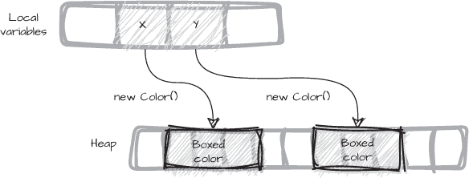
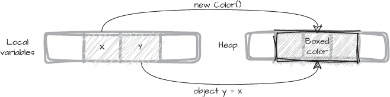
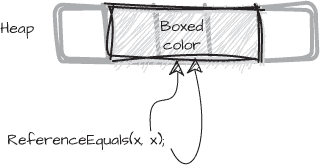

# <samp class="SANS_Futura_Std_Bold_Condensed_B_11">5</samp> <samp class="SANS_Dogma_OT_Bold_B_11">相等性类型</samp>


程序经常比较变量以查看它们的值是否相等，尽管这种操作通常被忽视，因为它是隐式完成的。每个类型都会从 <samp class="SANS_TheSansMonoCd_W5Regular_11">object</samp> 基类继承 <samp class="SANS_TheSansMonoCd_W5Regular_11">Equals</samp> 方法，因此，给定任意两个值 <samp class="SANS_TheSansMonoCd_W5Regular_11">x</samp> 和 <samp class="SANS_TheSansMonoCd_W5Regular_11">y</samp>，表达式 <samp class="SANS_TheSansMonoCd_W5Regular_11">x.Equals(y)</samp> 始终有效。

C# 还提供了 <samp class="SANS_TheSansMonoCd_W5Regular_11">==</samp>，或者称为 *等号运算符*，用于显式检查两个值是否相等。使用 <samp class="SANS_TheSansMonoCd_W5Regular_11">==</samp> 进行比较与使用 <samp class="SANS_TheSansMonoCd_W5Regular_11">Equals</samp> 方法在多个方面不同。在本章中，我们将探讨为什么 C# 支持两种相等性比较技巧，以及每种方法如何受到类型差异的影响。

我们将探讨以下内容：

+   <samp class="SANS_TheSansMonoCd_W5Regular_11">Equals</samp>方法与 <samp class="SANS_TheSansMonoCd_W5Regular_11">==</samp> 运算符在比较中的差异如何影响我们的程序

+   编译器为比较提供了哪些支持，我们自己需要提供什么

+   为什么相等性比较与哈希码如此紧密相关

+   当我们需要为自定义类型定制相等性比较时

+   变量的类型如何影响相等性行为

我们将采用法医学的方法，看看编译器如何处理不同类型的相等性，并探讨为什么相等性话题远不止 <samp class="SANS_TheSansMonoCd_W5Regular_11">Equals</samp> 和 <samp class="SANS_TheSansMonoCd_W5Regular_11">==</samp>。拥有不止一种比较值的方式，凸显了这种最基本的比较有多么重要。首先，让我们看看内置类型的相等性是如何工作的。

## <samp class="SANS_Futura_Std_Bold_B_11">内置相等性</samp>

在本节中，我们将查看 C# 内置类型之间的相等性比较基础知识——包括整数和浮动点数、引用变量以及数组——以及一些内置类型如何重写默认的相等性行为。

> <samp class="SANS_Dogma_OT_Bold_B_21">注意</samp>

*惯例* 等号运算符*，或有时称为*双等号*，由多种语言使用，以区分相等性比较与赋值运算符 <samp class="SANS_TheSansMonoCd_W5Regular_11">=</samp>，后者只是*等号*。JavaScript 有一个第三种变体，*等号等号等号*，用于检查两个变量是否具有相同的类型*和*值。 

因为 C#中的每个类型都继承了<samp class="SANS_TheSansMonoCd_W5Regular_11">Equals</samp>方法自<samp class="SANS_TheSansMonoCd_W5Regular_11">object</samp>类，我们可以用该方法比较任意两个变量。然而，使用<samp class="SANS_TheSansMonoCd_W5Regular_11">==</samp>来比较内建类型的变量效率更高，并且与使用<samp class="SANS_TheSansMonoCd_W5Regular_11">Equals</samp>方法比较时可能会表现出不同的行为，正如你将很快看到的。

使用<samp class="SANS_TheSansMonoCd_W5Regular_11">==</samp>进行相等比较是 CLR 为所有基本类型内建的——即，所有数字类型（除了<samp class="SANS_TheSansMonoCd_W5Regular_11">decimal</samp>，该类型有内建的编译器支持，但不是原生 CLR 类型）、<samp class="SANS_TheSansMonoCd_W5Regular_11">char</samp>和<samp class="SANS_TheSansMonoCd_W5Regular_11">bool</samp>类型，以及引用类型。CLR 有一条内建指令用于比较两个基本类型的值，因此我们可以始终使用<samp class="SANS_TheSansMonoCd_W5Regular_11">==</samp>来比较这些值，而且效率是可能达到的最优。

### <samp class="SANS_Futura_Std_Bold_Condensed_Oblique_BI_11">整数</samp>

内建的*整数*类型——<samp class="SANS_TheSansMonoCd_W5Regular_11">int</samp>、<samp class="SANS_TheSansMonoCd_W5Regular_11">short</samp>、<samp class="SANS_TheSansMonoCd_W5Regular_11">long</samp>和<samp class="SANS_TheSansMonoCd_W5Regular_11">byte</samp>——表示整数，而<samp class="SANS_TheSansMonoCd_W5Regular_11">char</samp>类型表示 UTF-16 字符。它们在进行相等比较时表现相同。<samp class="SANS_TheSansMonoCd_W5Regular_11">bool</samp>类型的值，虽然严格来说不是数字值，但也按相同方式进行比较。示例 5-1 使用<samp class="SANS_TheSansMonoCd_W5Regular_11">==</samp>运算符比较两个整数值。

```
int x = 10;
int y = x;
Assert.That(x == y, Is.True);
```

<samp class="SANS_Futura_Std_Book_Oblique_I_11">示例 5-1: 内建的数字比较</samp>

在这里，我们将<samp class="SANS_TheSansMonoCd_W5Regular_11">x</samp>的值复制并赋给<samp class="SANS_TheSansMonoCd_W5Regular_11">y</samp>，使得这两个变量的值相同。结果是它们会被认为相等。如果我们查看编译器生成的 CIL 代码，就会看到这些内建类型在运行时如何得到特别的支持：

```
❶ <samp class="SANS_TheSansMonoCd_W5Regular_11">L_0001: ldc.i4.s 10</samp>
L_0003: stloc.0  // x
❷ L_0004: ldloc.0  // x
L_0006: stloc.1  // y
❸ L_0007: ldloc.0  // x
L_0008: ldloc.1  // y
❹ L_0009: ceq
```

所有 CIL 指令都遵循类似的低级格式。每行都有一个格式为<samp class="SANS_TheSansMonoCd_W5Regular_11">L_</samp><samp class="SANS_TheSansMonoCd_W5Regular_11">0</samp><samp class="SANS_TheSansMonoCd_W5Regular_Italic_I_11">XXX</samp>的标签，后跟指令本身及其所需的任何参数。第一条指令<samp class="SANS_TheSansMonoCd_W5Regular_11">ldc.i4.s</samp>将其参数值<samp class="SANS_TheSansMonoCd_W5Regular_11">10</samp>推送到评估栈 ❶。接下来的指令<samp class="SANS_TheSansMonoCd_W5Regular_11">stloc.0</samp>没有参数，但会将评估栈顶部的值弹出，并存储到位置<samp class="SANS_TheSansMonoCd_W5Regular_11">0</samp>的变量中，正如反编译器在注释中帮助我们指出的那样，该位置对应的是<samp class="SANS_TheSansMonoCd_W5Regular_11">x</samp>变量。这两行的结果是将值<samp class="SANS_TheSansMonoCd_W5Regular_11">10</samp>赋给了<samp class="SANS_TheSansMonoCd_W5Regular_11">x</samp>变量。

接下来，先前存储的值<samp class="SANS_TheSansMonoCd_W5Regular_11">x</samp>被加载，并存储到<samp class="SANS_TheSansMonoCd_W5Regular_11">y</samp>中 ❷。然后，<samp class="SANS_TheSansMonoCd_W5Regular_11">x</samp>和<samp class="SANS_TheSansMonoCd_W5Regular_11">y</samp>的值被推回到评估栈中，以便下一条指令进行解释 ❸。最后，内置指令<samp class="SANS_TheSansMonoCd_W5Regular_11">ceq</samp>对评估栈顶部的两个值进行相等性比较 ❹。<samp class="SANS_TheSansMonoCd_W5Regular_11">ceq</samp>指令直接对应于两个内置值之间的<samp class="SANS_TheSansMonoCd_W5Regular_11">==</samp>比较。

使用<samp class="SANS_TheSansMonoCd_W5Regular_11">ceq</samp>进行比较的方式取决于 JIT 编译器，JIT 编译器在运行时将 CIL 翻译为机器码，但我们可以将其看作是对两个数值的逐位比较。如果它们相等，则整数<samp class="SANS_TheSansMonoCd_W5Regular_11">1</samp>（被解释为布尔值<samp class="SANS_TheSansMonoCd_W5Regular_11">true</samp>）被推送到评估栈中；否则，<samp class="SANS_TheSansMonoCd_W5Regular_11">0</samp>会被推送并解释为<samp class="SANS_TheSansMonoCd_W5Regular_11">false</samp>。

布尔结果作为第一个参数传递给<samp class="SANS_TheSansMonoCd_W5Regular_11">Assert.That</samp>方法（在 CIL 列表中未显示）。测试通过，因为<samp class="SANS_TheSansMonoCd_W5Regular_11">x</samp>和<samp class="SANS_TheSansMonoCd_W5Regular_11">y</samp>具有相同的数值。

### <samp class="SANS_Futura_Std_Bold_Condensed_Oblique_BI_11">浮点值</samp>

当我们使用`==`运算符比较<samp class="SANS_TheSansMonoCd_W5Regular_11">float</samp>和<samp class="SANS_TheSansMonoCd_W5Regular_11">double</samp>值时，会使用相同的<samp class="SANS_TheSansMonoCd_W5Regular_11">ceq</samp>指令。然而，对于浮点数，这种比较方法并不一定像我们预期的那样工作。在 C#中，<samp class="SANS_TheSansMonoCd_W5Regular_11">float</samp>和<samp class="SANS_TheSansMonoCd_W5Regular_11">double</samp>值是以由电气和电子工程师协会（IEEE）发布的浮点数算术标准定义的二进制格式表示的。IEEE-754 标准为这些类型规定了固定精度，导致许多数字无法精确表示。

当一个数字无法精确表示时，它会被四舍五入为最接近的可表示数字。下一个最接近的可表示数字可能比原始值大或小。两个相邻的精确表示之间的差异与这些数字的大小成比例，因此一个非常大的数字的舍入差异通常会远大于一个非常小的数字的舍入差异。多个经过舍入的数字进行计算时，舍入误差会积累，这个问题并不仅限于非常大或非常小的数字。列表 5-2 比较了我们直觉上可能认为相等的两个<samp class="SANS_TheSansMonoCd_W5Regular_11">double</samp>值。

```
double x = 0.3;
double y = 0.1 + 0.2;
Assert.That(x == y, Is.True);
```

<samp class="SANS_Futura_Std_Book_Oblique_I_11">列表 5-2：一个简单的浮点计算</samp>

该测试失败，因为常量值在<samp class="SANS_TheSansMonoCd_W5Regular_11">double</samp>格式中无法精确表示。赋给<samp class="SANS_TheSansMonoCd_W5Regular_11">x</samp>和<samp class="SANS_TheSansMonoCd_W5Regular_11">y</samp>的值会被四舍五入为最接近的可表示值。更进一步，加法的结果是一个不精确的表示，因此又会被四舍五入，产生一个与赋给<samp class="SANS_TheSansMonoCd_W5Regular_11">x</samp>的值不同的结果。对<samp class="SANS_TheSansMonoCd_W5Regular_11">x</samp>和<samp class="SANS_TheSansMonoCd_W5Regular_11">y</samp>的相等性测试失败，因为它们的最不重要数字存在差异。

从一个浮点数中减去另一个浮点数也可能会产生意外结果：如果两个数字几乎相等，结果将只在那些最不重要的位置上有值，而这些位置正是舍入误差会明显表现出来的地方。结果是，结果中的一些或所有有效数字可能会丢失，这个问题有时称为*取消*。

四舍五入和取消问题是 IEEE-754 浮点值表示法的固有问题，并非 C#特有。然而，根据我们想要达到的具体目标，还是有可能缓解其中一些问题。

#### <samp class="SANS_Futura_Std_Bold_Condensed_B_11">缓解四舍五入和取消的限制</samp>

四舍五入的幅度是可以预测的，因为它与二进制表示的精度直接相关。这里的*精度*指的是类型中可以存储的二进制位数。重要的是，这意味着任何在给定类型中没有精确表示的数字，对于相同类型，总是会以相同的方式进行四舍五入。

重复计算所引起的累积误差更难预测，计算中的运算顺序会显著影响结果。相同的操作顺序执行两次，可能会产生不同的结果，这取决于优化和结果存储位置等因素。全面分析不同的浮点数比较方法是一个非常庞大的话题，在这里无法完全展开，但本质上，我们可以提供一种实现方法，而不是直接比较浮点数是否完全相等，而是判断两个数是否大致相等。

一种方法是比较两个数是否在某个小数位数内相等，如清单 5-3 所示。

```
public static bool ApproximatelyEqual(double x, double y)
    => Math.Round(Math.Abs(x - y), 7) == 0;
```

<samp class="SANS_Futura_Std_Book_Oblique_I_11">清单 5-3：浮点数的简单近似比较</samp>

我们使用<samp class="SANS_TheSansMonoCd_W5Regular_11">Math.Round</samp>方法来判断两个值是否在指定的小数位数范围内相等——例如七位数字。我们也可以考虑将所需的小数位数作为参数传递，而不是依赖硬编码的常量。无论哪种方式，这都是比较浮点值的快速简便方法。缺点是它对小于我们指定的小数位数的差异不敏感，并且在比较非常大的数字时不准确。

第二种方法是确定两个数的差值是否小于某个公差，例如：

```
public static bool ApproximatelyEqual(double x, double y)
    => Math.Abs(x - y) < Tolerance;
```

这个<samp class="SANS_TheSansMonoCd_W5Regular_11">ApproximatelyEqual</samp>方法会在两个浮点数的绝对差值小于预定义的公差时返回<samp class="SANS_TheSansMonoCd_W5Regular_11">true</samp>，但我们需要为<samp class="SANS_TheSansMonoCd_W5Regular_11">Tolerance</samp>定义一个合理的值。这样做并不简单，因为两个浮点值之间的差异可能会根据它们的大小而有所不同。清单 5-4 使用了一个根据比较的较小数值大小加权的公差值。

```
private const double Tolerance = 1E-15;
public static bool ApproximatelyEqual(double x, double y)
    => Math.Abs(x - y) <
       Math.Max(Tolerance, Math.Min(x, y)) * Tolerance;
```

<samp class="SANS_Futura_Std_Book_Oblique_I_11">清单 5-4：使用加权容差进行近似比较</samp>

我们添加了一个<Tolerance>常量，用来表示我们希望比较的敏感度，尽管我们并未在比较中使用其未经修正的值。对于非常大的值，四舍五入误差的幅度远大于非常小数值的误差，我们的容差需要对这一点敏感。相反，我们会根据被比较的数值来调整容差。我们使用两个值中较小的一个来进行缩放，因为那可能是我们最敏感的四舍五入误差位置。为了避免与 0 相乘作为折衷，如果最小值小于<Tolerance>，我们会将<Tolerance>按自身进行缩放，这可能会影响我们在比较小数值时的精度。

这里选择的<Tolerance>值足够敏感，当数值接近 0 时，可以区分大约 25 位小数的差异。当数值接近 1.0 时，由于缩放，差异可以在 15 或 16 位小数内被检测到，且随着数值的增大，灵敏度会减小。采用这种方法来判断浮点数之间的相等性并不适用于所有情况，特定的应用可能需要更加精细的实现。

#### <samp class="SANS_Futura_Std_Bold_Condensed_B_11">使用替代数值表示法</samp>

我们必须始终记住，浮点数在数学意义上并不是真正的数，因为许多实数不能表示为浮点值。实数具有无限精度，但计算机内存是有限的，因此<samp class="SANS_TheSansMonoCd_W5Regular_11">double</samp>和<samp class="SANS_TheSansMonoCd_W5Regular_11">float</samp>值的固定和有限精度是一种折衷。

浮点数值的不精确性是否重要取决于我们的目标。一种替代方案是使用不同的表示方法，比如以 *十进制* 而非二进制表示的 <samp class="SANS_TheSansMonoCd_W5Regular_11">decimal</samp> 类型，它的精度比 <samp class="SANS_TheSansMonoCd_W5Regular_11">double</samp> 更高。在实践中，<samp class="SANS_TheSansMonoCd_W5Regular_11">decimal</samp> 可以更准确地表示更多的实数，因为它具有更多的有效数字来表示这些数字。这意味着 <samp class="SANS_TheSansMonoCd_W5Regular_11">decimal</samp> 值不太容易发生舍入误差。然而，每种类型都有其取舍，<samp class="SANS_TheSansMonoCd_W5Regular_11">decimal</samp> 并不是一个通用类型：它专门用于最自然地用十进制表示的计算，例如金融计算。<samp class="SANS_TheSansMonoCd_W5Regular_11">decimal</samp> 的表示范围比 <samp class="SANS_TheSansMonoCd_W5Regular_11">float</samp> 或 <samp class="SANS_TheSansMonoCd_W5Regular_11">double</samp> 都要小，因此它能表示的最大正负值都比 <samp class="SANS_TheSansMonoCd_W5Regular_11">float</samp> 或 <samp class="SANS_TheSansMonoCd_W5Regular_11">double</samp> 所能表示的要小。另一个考虑因素是，<samp class="SANS_TheSansMonoCd_W5Regular_11">decimal</samp> 值需要比 <samp class="SANS_TheSansMonoCd_W5Regular_11">double</samp> 更多的内存。

作为选择 <samp class="SANS_TheSansMonoCd_W5Regular_11">double</samp> 和 <samp class="SANS_TheSansMonoCd_W5Regular_11">decimal</samp> 之间的实际应用示例，考虑一下 <samp class="SANS_TheSansMonoCd_W5Regular_11">Math</samp> 类中的三角函数方法，如 <samp class="SANS_TheSansMonoCd_W5Regular_11">Sin</samp> 和 <samp class="SANS_TheSansMonoCd_W5Regular_11">Cos</samp>，这些方法接受 <samp class="SANS_TheSansMonoCd_W5Regular_11">double</samp> 类型作为参数，并且没有提供接收 <samp class="SANS_TheSansMonoCd_W5Regular_11">decimal</samp> 类型值的重载。如果我们的代码使用了这些方法，我们不能将 <samp class="SANS_TheSansMonoCd_W5Regular_11">double</samp> 替换为 <samp class="SANS_TheSansMonoCd_W5Regular_11">decimal</samp>，因为 <samp class="SANS_TheSansMonoCd_W5Regular_11">decimal</samp> 类型是专门为货币值设计的，因此不能表示三角运算的结果。

#### <samp class="SANS_Futura_Std_Bold_Condensed_B_11">处理无效数字</samp>

使用 <samp class="SANS_TheSansMonoCd_W5Regular_11">double</samp> 和 <samp class="SANS_TheSansMonoCd_W5Regular_11">float</samp> 值的另一个后果是，某些操作可能会产生 <samp class="SANS_TheSansMonoCd_W5Regular_11">NaN</samp>（非数字）结果，它没有*数值表示*。当我们使用 <samp class="SANS_TheSansMonoCd_W5Regular_11">double</samp> 或 <samp class="SANS_TheSansMonoCd_W5Regular_11">float</samp> 值时，我们需要确保正确识别计算结果是否为 <samp class="SANS_TheSansMonoCd_W5Regular_11">NaN</samp>，因为 <samp class="SANS_TheSansMonoCd_W5Regular_11">NaN</samp> 是传染性的：任何涉及 <samp class="SANS_TheSansMonoCd_W5Regular_11">NaN</samp> 的计算都会产生 <samp class="SANS_TheSansMonoCd_W5Regular_11">NaN</samp> 作为其结果。例如，如果我们尝试将 0.0 除以 0.0，我们会得到一个 <samp class="SANS_TheSansMonoCd_W5Regular_11">NaN</samp>。

我们可能会期望通过使用 <samp class="SANS_TheSansMonoCd_W5Regular_11">==</samp> 直接比较来识别 <samp class="SANS_TheSansMonoCd_W5Regular_11">NaN</samp>，如 示例 5-5 中所示。

```
var x = 0.0 / 0.0;
Assert.That(x == double.NaN, Is.True);
```

<samp class="SANS_Futura_Std_Book_Oblique_I_11">示例 5-5：比较 NaN</samp>

将 0.0 除以 0.0 确实会产生 <samp class="SANS_TheSansMonoCd_W5Regular_11">NaN</samp>，因此许多程序员会期望这个与 <samp class="SANS_TheSansMonoCd_W5Regular_11">NaN</samp> 的相等测试通过，但事实并非如此。IEEE-754 标准规定，两个 <samp class="SANS_TheSansMonoCd_W5Regular_11">NaN</samp> 值不会比较相等，因此这个测试失败是正确的行为。相反，C# 提供了 <samp class="SANS_TheSansMonoCd_W5Regular_11">IsNaN</samp> 静态方法，我们可以像这样使用它：

```
Assert.That(double.IsNaN(x), Is.True);
```

从 C# v8.0 开始，我们可以使用常量模式使比较更加自然：

```
Assert.That(x is double.NaN, Is.True);
```

编译器将模式表达式转换为 <samp class="SANS_TheSansMonoCd_W5Regular_11">double.IsNaN(x)</samp>，因此不会使用 <samp class="SANS_TheSansMonoCd_W5Regular_11">==</samp> 或 <samp class="SANS_TheSansMonoCd_W5Regular_11">Equals</samp> 进行比较。<samp class="SANS_TheSansMonoCd_W5Regular_11">IsNaN</samp> 方法将始终为我们提供正确的结果。它还突出了使用 <samp class="SANS_TheSansMonoCd_W5Regular_11">==</samp> 比较浮动点数值与使用 <samp class="SANS_TheSansMonoCd_W5Regular_11">double.Equals</samp> 方法之间的一个重要区别：<samp class="SANS_TheSansMonoCd_W5Regular_11">Equals</samp> 方法通过 <samp class="SANS_TheSansMonoCd_W5Regular_11">ceq</samp> 比较浮动点数值，但与 <samp class="SANS_TheSansMonoCd_W5Regular_11">==</samp> 运算符不同，<samp class="SANS_TheSansMonoCd_W5Regular_11">Equals</samp> 在数值“不相等”时还会调用 <samp class="SANS_TheSansMonoCd_W5Regular_11">IsNaN</samp>。考虑以下测试，在这个测试中，我们使用 <samp class="SANS_TheSansMonoCd_W5Regular_11">Equals</samp> 方法比较两个 <samp class="SANS_TheSansMonoCd_W5Regular_11">NaN</samp> 值：

```
var x = 0.0 / 0.0;
Assert.That(x.Equals(Double.NaN), Is.True);
```

该测试通过，因为根据 <samp class="SANS_TheSansMonoCd_W5Regular_11">Equals</samp> 方法，当数值完全相等或都为 <samp class="SANS_TheSansMonoCd_W5Regular_11">NaN</samp> 时，<samp class="SANS_TheSansMonoCd_W5Regular_11">double</samp> 和 <samp class="SANS_TheSansMonoCd_W5Regular_11">float</samp> 值被认为是相等的。因此，对于浮动点数值，<samp class="SANS_TheSansMonoCd_W5Regular_11">Equals</samp> 方法的结果可能与使用 <samp class="SANS_TheSansMonoCd_W5Regular_11">==</samp> 的结果不同，因为后者不比较 <samp class="SANS_TheSansMonoCd_W5Regular_11">IsNaN</samp> 的结果。因此，<samp class="SANS_TheSansMonoCd_W5Regular_11">Equals</samp> 和 <samp class="SANS_TheSansMonoCd_W5Regular_11">==</samp> 最终都通过 <samp class="SANS_TheSansMonoCd_W5Regular_11">ceq</samp> 对 <samp class="SANS_TheSansMonoCd_W5Regular_11">float</samp> 和 <samp class="SANS_TheSansMonoCd_W5Regular_11">double</samp> 值进行严格比较，因此我们不应依赖这两种方法来比较浮动点数值，因为结果可能与预期不符。

> <samp class="SANS_Dogma_OT_Bold_B_21">注意</samp>

*某些计算可能会导致正无穷或负无穷*，分别表示为 double.PositiveInfinity 和 double.NegativeInfinity。虽然这两种值可能是错误的结果，但无限值通常不像 NaN 那样被认为是*无效的*。我们可以使用 is 关键字在常量模式下将一个值与 double.PositiveInfinity 或 double.NegativeInfinity 进行比较，但也可以直接使用* <samp class="SANS_TheSansMonoCd_W5Regular_11">==</samp> *进行比较两种无限值。*

### <samp class="SANS_Futura_Std_Bold_Condensed_Oblique_BI_11">引用相等性</samp>

如第二章所述，一个引用要么是 <samp class="SANS_TheSansMonoCd_W5Regular_11">null</samp>，要么是指向堆上对象的一个不透明句柄。一个对象可以有多个引用指向它，两个指向同一对象的引用是相等的。每个对象实例都有一个唯一的身份标识，非 <samp class="SANS_TheSansMonoCd_W5Regular_11">null</samp> 引用的值是它所指向对象的身份标识。为了判断两个引用是否指向相同的对象或不同的实例，我们使用身份比较。

我们可能还会关心一个引用是否为 <samp class="SANS_TheSansMonoCd_W5Regular_11">null</samp>，因此让我们来看一下如何比较一个引用与另一个引用或 <samp class="SANS_TheSansMonoCd_W5Regular_11">null</samp> 引用的机制。

#### <samp class="SANS_Futura_Std_Bold_Condensed_B_11">比较两个引用</samp>

如果 <samp class="SANS_TheSansMonoCd_W5Regular_11">x</samp> 和 <samp class="SANS_TheSansMonoCd_W5Regular_11">y</samp> 都是指向同一个对象的引用，它们具有相同的身份，因此可以通过 <samp class="SANS_TheSansMonoCd_W5Regular_11">==</samp> 或 <samp class="SANS_TheSansMonoCd_W5Regular_11">Equals</samp> 进行比较。如果它们指向不同的对象，即使这些对象的状态相同，<samp class="SANS_TheSansMonoCd_W5Regular_11">x</samp> 和 <samp class="SANS_TheSansMonoCd_W5Regular_11">y</samp> 也不会相等。在示例 5-6 中，我们使用 <samp class="SANS_TheSansMonoCd_W5Regular_11">==</samp> 来比较两个引用变量。

```
public sealed class MusicTrack
{
}
var x = new MusicTrack();
var y = new MusicTrack();
Assert.That(x == y, Is.False);
```

<samp class="SANS_Futura_Std_Book_Oblique_I_11">示例 5-6：比较引用</samp>

这两个 <samp class="SANS_TheSansMonoCd_W5Regular_11">x</samp> 和 <samp class="SANS_TheSansMonoCd_W5Regular_11">y</samp> 引用变量不相等，因为它们指向的是不同的对象，尽管这两个对象的状态相同。与我们在示例 5-1 中所做的为两个变量赋予常量值不同，我们现在是在堆上创建新对象，并且这些变量是指向这些对象的引用。当我们检查生成的 CIL 代码时，可以看到在最后一行，我们使用与示例 5-1 相同的 <samp class="SANS_TheSansMonoCd_W5Regular_11">ceq</samp> 指令来比较这两个引用是否相等：

```
IL_0001:  newobj    instance void MusicTrack::.ctor()
IL_0006:  stloc.0   // x
IL_0007:  newobj    instance void MusicTrack::.ctor()
IL_000c:  stloc.1   // y
IL_000d:  ldloc.0
IL_000e:  ldloc.1
IL_000f:  ceq
```

<samp class="SANS_TheSansMonoCd_W5Regular_11">newobj</samp>指令创建一个类型的新实例，并将其引用存储在评估栈上。我们在堆上创建了两个<samp class="SANS_TheSansMonoCd_W5Regular_11">MusicTrack</samp>实例，因为<samp class="SANS_TheSansMonoCd_W5Regular_11">MusicTrack</samp>是一个类，并将它们的引用分别存储在<samp class="SANS_TheSansMonoCd_W5Regular_11">x</samp>和<samp class="SANS_TheSansMonoCd_W5Regular_11">y</samp>变量中。由于<samp class="SANS_TheSansMonoCd_W5Regular_11">x</samp>和<samp class="SANS_TheSansMonoCd_W5Regular_11">y</samp>指向不同的实例，变量具有不同的*值*，因此在使用<samp class="SANS_TheSansMonoCd_W5Regular_11">ceq</samp>进行比较时不相等。

就<samp class="SANS_TheSansMonoCd_W5Regular_11">ceq</samp>指令而言，在运行时，引用仅仅是一个比特序列，类似于数字是如何以比特序列表示的。<samp class="SANS_TheSansMonoCd_W5Regular_11">ceq</samp>指令仅仅是比较两个比特模式，以确定它们是否匹配。指向堆上不同对象实例的两个引用具有不同的比特模式，因此它们在比较时不相等。

#### <samp class="SANS_Futura_Std_Bold_Condensed_B_11">与 null 引用进行比较</samp>

引用变量的值要么是指向堆上对象的引用，要么是<samp class="SANS_TheSansMonoCd_W5Regular_11">null</samp>。我们可以使用<samp class="SANS_TheSansMonoCd_W5Regular_11">==</samp>来将任何引用与<samp class="SANS_TheSansMonoCd_W5Regular_11">null</samp>进行比较，以确定它是否指向一个对象。如果引用指向一个对象，如示例 5-7 所示，那么该引用与<samp class="SANS_TheSansMonoCd_W5Regular_11">null</samp>不相等。

```
var x = new MusicTrack();
Assert.That(x == null, Is.False);
```

<samp class="SANS_Futura_Std_Book_Oblique_I_11">示例 5-7：将引用与 null 进行比较</samp>

这个比较也使用了内置的<samp class="SANS_TheSansMonoCd_W5Regular_11">ceq</samp>指令：

```
IL_0016: newobj    instance void MusicTrack::.ctor()
IL_001c: ldloc.1   // x
IL_001d: ldnull
IL_001e: ceq
```

<samp class="SANS_TheSansMonoCd_W5Regular_11">null</samp>引用是一个常量值，由<samp class="SANS_TheSansMonoCd_W5Regular_11">ldnull</samp>指令压入评估栈；<samp class="SANS_TheSansMonoCd_W5Regular_11">null</samp>没有自己的类型，但可以隐式地转换为*任何*引用类型。当我们将<samp class="SANS_TheSansMonoCd_W5Regular_11">null</samp>赋值给引用变量或将其作为参数传递给方法时，它会自动转换为目标变量的类型。在这里，我们可以将<samp class="SANS_TheSansMonoCd_W5Regular_11">x</samp>与<samp class="SANS_TheSansMonoCd_W5Regular_11">null</samp>进行比较，因为<samp class="SANS_TheSansMonoCd_W5Regular_11">null</samp>引用与<samp class="SANS_TheSansMonoCd_W5Regular_11">MusicTrack</samp>引用类型兼容。

#### <samp class="SANS_Futura_Std_Bold_Condensed_B_11">比较数组变量</samp>

C# 数组始终是引用类型，因此比较数组变量的方式与比较引用相同。C# 数组是声明和使用元素序列的内置语法，这些元素始终分配在堆上。数组变量是对数组元素的引用。在 示例 5-8 中，我们创建了两个元素相同的数组，并使用 <samp class="SANS_TheSansMonoCd_W5Regular_11">==</samp> 进行比较。

```
int[] x = {10, 20};
int[] y = {10, 20};
Assert.That(x == y, Is.False);
```

<samp class="SANS_Futura_Std_Book_Oblique_I_11">示例 5-8：隐式初始化和比较两个数组</samp>

编译器根据我们用来初始化数组的值推导出每个数组的大小。两个数组具有相同的元素，但比较结果为不相等，因为使用 <samp class="SANS_TheSansMonoCd_W5Regular_11">==</samp> 比较数组时会执行引用比较，并使用内置的 <samp class="SANS_TheSansMonoCd_W5Regular_11">ceq</samp> 指令。示例 5-8 中的 <samp class="SANS_TheSansMonoCd_W5Regular_11">x</samp> 和 <samp class="SANS_TheSansMonoCd_W5Regular_11">y</samp> 变量是不同数组的引用，因此它们不会相等，所以测试通过。

当我们比较两个数组变量时，比较并不考虑数组元素，而仅仅使用两个数组变量的标识。因此，只有当它们指向 *相同* 的数组实例时，两个数组引用才会相等。要检查两个数组是否具有相同的元素，我们必须手动逐个比较每个元素，或者使用像 <samp class="SANS_TheSansMonoCd_W5Regular_11">System.Enumerable.SequenceEqual</samp> 这样的库功能。

### <samp class="SANS_Futura_Std_Bold_Condensed_Oblique_BI_11">字符串和值的相等性</samp>

尽管 <samp class="SANS_TheSansMonoCd_W5Regular_11">string</samp> 变量是引用类型，但在比较时，我们通常更关注它们的内容是否相同，而不是它们是否引用同一个 <samp class="SANS_TheSansMonoCd_W5Regular_11">string</samp> 实例。

<samp class="SANS_TheSansMonoCd_W5Regular_11">string</samp> 类重载了默认的 <samp class="SANS_TheSansMonoCd_W5Regular_11">==</samp> 和 <samp class="SANS_TheSansMonoCd_W5Regular_11">Equals</samp> 方法，以便为字符串提供类似值的语义。使用 <samp class="SANS_TheSansMonoCd_W5Regular_11">==</samp> 或 <samp class="SANS_TheSansMonoCd_W5Regular_11">Equals</samp> 比较字符串时，执行的是基于值的比较，而不是基于引用的比较。虽然堆上可能存在多个对同一个 <samp class="SANS_TheSansMonoCd_W5Regular_11">string</samp> 实例的引用，但这些引用依然会比较相等。然而，也可能存在两个内容相同的独立 <samp class="SANS_TheSansMonoCd_W5Regular_11">string</samp> 实例，它们的比较结果也会是相等的。

例如，在列表 5-9 中，<samp class="SANS_TheSansMonoCd_W5Regular_11">x</samp> 和 <samp class="SANS_TheSansMonoCd_W5Regular_11">y</samp> 变量并不指向同一个 <samp class="SANS_TheSansMonoCd_W5Regular_11">string</samp> 实例，但在运行时它们具有相同的*值*。

```
var monarch = "Henry";
var number = "IV";
var x = $"{monarch} the {number}";
var y = $"{monarch} the {number}";
Assert.That(x == y, Is.True);
Assert.That(x.Equals(y), Is.True);
Assert.That(ReferenceEquals(x, y), Is.False);
```

<samp class="SANS_Futura_Std_Book_Oblique_I_11">列表 5-9：比较字符串值</samp>

<samp class="SANS_TheSansMonoCd_W5Regular_11">string</samp> 类自定义了 <samp class="SANS_TheSansMonoCd_W5Regular_11">==</samp> 和 <samp class="SANS_TheSansMonoCd_W5Regular_11">Equals</samp> 方法的行为，因此 <samp class="SANS_TheSansMonoCd_W5Regular_11">x</samp> 和 <samp class="SANS_TheSansMonoCd_W5Regular_11">y</samp> 变量被认为相等，因为它们具有相同的内容，尽管它们是指向不同实例的引用。由于 <samp class="SANS_TheSansMonoCd_W5Regular_11">string</samp> 重写了 <samp class="SANS_TheSansMonoCd_W5Regular_11">==</samp> 的行为，我们在这里使用 <samp class="SANS_TheSansMonoCd_W5Regular_11">ReferenceEquals</samp> 方法来进行引用比较。<samp class="SANS_TheSansMonoCd_W5Regular_11">ReferenceEquals</samp> 是一个定义在 <samp class="SANS_TheSansMonoCd_W5Regular_11">object</samp> 上的静态方法，它在任何两个引用类型变量之间执行身份比较。在这个例子中，<samp class="SANS_TheSansMonoCd_W5Regular_11">ReferenceEquals</samp> 返回 <samp class="SANS_TheSansMonoCd_W5Regular_11">false</samp>，因为它的参数是指向堆上不同对象的引用。

在列表 5-9 中的 <samp class="SANS_TheSansMonoCd_W5Regular_11">x</samp> 和 <samp class="SANS_TheSansMonoCd_W5Regular_11">y</samp> 变量都使用了字符串插值将命名变量的值插入到字符串中，从而确保 <samp class="SANS_TheSansMonoCd_W5Regular_11">x</samp> 和 <samp class="SANS_TheSansMonoCd_W5Regular_11">y</samp> 确实是不同的实例——至少在调试模式下是这样。如果我们像在列表 5-10 中那样使用两个简单的字符串字面量，<samp class="SANS_TheSansMonoCd_W5Regular_11">ReferenceEquals</samp> 会给出不同的结果。

```
var x = "Henry the IV";
var y = "Henry the IV";
Assert.That(ReferenceEquals(x, y), Is.True);
```

<samp class="SANS_Futura_Std_Book_Oblique_I_11">列表 5-10：比较字符串字面量值</samp>

这个测试表明，尽管 <samp class="SANS_TheSansMonoCd_W5Regular_11">x</samp> 和 <samp class="SANS_TheSansMonoCd_W5Regular_11">y</samp> 分别独立地被赋值为两个看似独立的字符串，它们在内存中实际上是同一个实例。不同表现的原因在于编译器通过使用*字符串驻留*来节省内存，这种方法维护了一个*驻留池*，其中包含程序中每个唯一字符串字面量的单一实例。这样，即使同一个字符串字面量在代码中出现多次，内存中也只会存在一个实例。字符串是不可变的，因此多个引用指向同一个实例永远不会引起别名问题。

我们可以在运行时自己使用 intern 池，尽管我们还需要考虑其他内存方面的因素。我们可能会在单个字符串值上节省内存，但 intern 池本身不会常规地进行垃圾回收，并且很可能会一直保留在内存中，直到程序终止。

我们可以通过 <samp class="SANS_TheSansMonoCd_W5Regular_11">ReferenceEquals</samp> 或其他方法来判断两个 <samp class="SANS_TheSansMonoCd_W5Regular_11">string</samp> 变量是否引用不同的实例，但通常这并不重要。无论两个 <samp class="SANS_TheSansMonoCd_W5Regular_11">string</samp> 变量是否引用同一个 <samp class="SANS_TheSansMonoCd_W5Regular_11">string</samp> 实例，或者是两个具有相同内容的独立实例，它们仍然被认为是相等的。

## <samp class="SANS_Futura_Std_Bold_B_11">自定义类的相等性</samp>

如果我们希望为自定义类类型实现基于值而非基于引用的相等性，我们需要重写 <samp class="SANS_TheSansMonoCd_W5Regular_11">Equals</samp> 方法，并为该类定义 <samp class="SANS_TheSansMonoCd_W5Regular_11">operator==</samp> 来自定义相等性比较的行为。类中完整实现相等性比较有几个方面，因此我们将分阶段构建，并逐步实现每个部分，以便更好地理解所有组件是如何组合在一起的。

我们的第一个任务是为类自定义虚方法 <samp class="SANS_TheSansMonoCd_W5Regular_11">Equals</samp>。列表 5-11 中的 <samp class="SANS_TheSansMonoCd_W5Regular_11">MusicTrack</samp> 类有两个 <samp class="SANS_TheSansMonoCd_W5Regular_11">string</samp> 属性，我们定义 <samp class="SANS_TheSansMonoCd_W5Regular_11">Equals</samp> 方法，使得当两个 <samp class="SANS_TheSansMonoCd_W5Regular_11">MusicTrack</samp> 实例的两个字段的值相等时，它们也被认为是相等的。

```
public sealed class MusicTrack
{
    public MusicTrack(string artist, string name)
        => (Artist, Name) = (artist, name);
    public string Artist {get;}
    public string Name {get;}
    **public override bool Equals(object? obj)**
        **=>** **obj is MusicTrack other &&**
            **this.Artist** **==** **other.Artist &&**
            **this.Name** **==** **other.Name;**
}
```

<samp class="SANS_Futura_Std_Book_Oblique_I_11">列表 5-11：重写 Equals 方法</samp>

因为我们正在自定义继承自虚方法的实现，所以使用 <samp class="SANS_TheSansMonoCd_W5Regular_11">override</samp> 关键字，并且该方法的签名必须与被重写的基类方法的签名匹配。请注意，编译这段代码时会发出警告，提醒我们没有重写 <samp class="SANS_TheSansMonoCd_W5Regular_11">GetHashCode</samp>。我们稍后会处理这个问题。

虚拟的 <samp class="SANS_TheSansMonoCd_W5Regular_11">Equals</samp> 方法接受一个单一的可空 <samp class="SANS_TheSansMonoCd_W5Regular_11">object</samp> 引用，我们需要将其转换为我们实现的类型，以便与当前实例进行比较。在这里，如果 <samp class="SANS_TheSansMonoCd_W5Regular_11">obj</samp> 参数非 <samp class="SANS_TheSansMonoCd_W5Regular_11">null</samp> 且从 <samp class="SANS_TheSansMonoCd_W5Regular_11">obj</samp> 类型到 <samp class="SANS_TheSansMonoCd_W5Regular_11">MusicTrack</samp> 类型存在身份转换或隐式引用转换，我们使用 *声明模式* 来声明 <samp class="SANS_TheSansMonoCd_W5Regular_11">other</samp> 变量。*身份转换* 只是意味着某个类型可以转换为自身。*隐式引用转换* 可以有多种形式，但在这里为了简单起见，它意味着 <samp class="SANS_TheSansMonoCd_W5Regular_11">MusicTrack</samp> 是 <samp class="SANS_TheSansMonoCd_W5Regular_11">obj</samp> 运行时类型的基类。在这个例子中，由于 <samp class="SANS_TheSansMonoCd_W5Regular_11">MusicTrack</samp> 是一个密封类，因此类型要么完全匹配（身份转换），要么根本不匹配。

如果 <samp class="SANS_TheSansMonoCd_W5Regular_11">obj</samp> 变量的类型与模式匹配，<samp class="SANS_TheSansMonoCd_W5Regular_11">obj</samp> 将被转换为指定类型并赋值给 <samp class="SANS_TheSansMonoCd_W5Regular_11">other</samp> 变量。因此，<samp class="SANS_TheSansMonoCd_W5Regular_11">other</samp> 变量是一个 <samp class="SANS_TheSansMonoCd_W5Regular_11">MusicTrack</samp> 引用，我们使用它来比较其属性与当前实例的属性，看看它们是否相等。

### <samp class="SANS_Futura_Std_Bold_Condensed_Oblique_BI_11">定义相等操作符</samp>

<samp class="SANS_TheSansMonoCd_W5Regular_11">Equals</samp> 方法很少直接使用，因为大多数程序员发现使用 <samp class="SANS_TheSansMonoCd_W5Regular_11">==</samp> 比调用 <samp class="SANS_TheSansMonoCd_W5Regular_11">Equals</samp> 更自然。一般来说，<samp class="SANS_TheSansMonoCd_W5Regular_11">==</samp> 和 <samp class="SANS_TheSansMonoCd_W5Regular_11">Equals</samp> 的行为应当一致，我们通过为 <samp class="SANS_TheSansMonoCd_W5Regular_11">MusicTrack</samp> 类实现 <samp class="SANS_TheSansMonoCd_W5Regular_11">operator==</samp> 来简便地调用我们已定义的 <samp class="SANS_TheSansMonoCd_W5Regular_11">Equals</samp> 方法，从而实现这一点。

操作符定义如<samp class="SANS_TheSansMonoCd_W5Regular_11">operator==</samp>是静态方法。<samp class="SANS_TheSansMonoCd_W5Regular_11">operator==</samp>的定义需要两个参数，其中至少一个必须是实现该操作符的类型。返回类型通常是<samp class="SANS_TheSansMonoCd_W5Regular_11">bool</samp>，尽管这不是严格要求。通常的实现中，两个参数是相同类型的，这使得我们可以使用<samp class="SANS_TheSansMonoCd_W5Regular_11">==</samp>来比较两个实例，如列表 5-12 所示。

```
public static bool operator==(MusicTrack? left, MusicTrack? right)
{
    if(left is null)
    {
        return right is null;
    }
    else
    {
        return left.Equals(right);
    }
}
public static bool operator!=(MusicTrack? left, MusicTrack? right)
    => !(left == right);
```

<samp class="SANS_Futura_Std_Book_Oblique_I_11">列表 5-12：为 MusicTrack 类定义操作符</samp>== 

如果我们提供了<samp class="SANS_TheSansMonoCd_W5Regular_11">operator==</samp>，我们还必须实现一个匹配的<samp class="SANS_TheSansMonoCd_W5Regular_11">operator</samp><samp class="SANS_TheSansMonoCd_W5Regular_11">!</samp><samp class="SANS_TheSansMonoCd_W5Regular_11">=</samp>，我们通过简单地反转调用<samp class="SANS_TheSansMonoCd_W5Regular_11">==</samp>操作符方法的结果来实现。

由于<samp class="SANS_TheSansMonoCd_W5Regular_11">MusicTrack</samp>是一个类，因此操作符的一个或两个参数可能是<samp class="SANS_TheSansMonoCd_W5Regular_11">null</samp>，所以我们通过为参数使用可空引用语法来明确这一预期。如果两个参数都是<samp class="SANS_TheSansMonoCd_W5Regular_11">null</samp>，它们会被认为相等。如果<samp class="SANS_TheSansMonoCd_W5Regular_11">left</samp>不是<samp class="SANS_TheSansMonoCd_W5Regular_11">null</samp>，我们会调用<samp class="SANS_TheSansMonoCd_W5Regular_11">Equals</samp>方法，将<samp class="SANS_TheSansMonoCd_W5Regular_11">right</samp>作为参数，即使<samp class="SANS_TheSansMonoCd_W5Regular_11">right</samp>是<samp class="SANS_TheSansMonoCd_W5Regular_11">null</samp>引用。我们对<samp class="SANS_TheSansMonoCd_W5Regular_11">Equals</samp>的实现已经处理了将<samp class="SANS_TheSansMonoCd_W5Regular_11">null</samp>传递给其参数的情况。

### <samp class="SANS_Futura_Std_Bold_Condensed_Oblique_BI_11">处理与 null 的比较</samp>

在 Listing 5-12 中，我们使用了常量模式和 `<samp class="SANS_TheSansMonoCd_W5Regular_11">is</samp>` 关键字来比较 `<samp class="SANS_TheSansMonoCd_W5Regular_11">left</samp>` 和 `<samp class="SANS_TheSansMonoCd_W5Regular_11">right</samp>` 参数与 `<samp class="SANS_TheSansMonoCd_W5Regular_11">null</samp>`。如果我们改为使用 `<samp class="SANS_TheSansMonoCd_W5Regular_11">==</samp>` 进行比较，`<samp class="SANS_TheSansMonoCd_W5Regular_11">operator==</samp>` 将会递归调用自身，因为在这些比较中，`<samp class="SANS_TheSansMonoCd_W5Regular_11">null</samp>` 会被隐式转换为 `<samp class="SANS_TheSansMonoCd_W5Regular_11">MusicTrack</samp>`。在此处应用常量模式避免了这一陷阱，因为 `<samp class="SANS_TheSansMonoCd_W5Regular_11">is null</samp>` 表达式从不调用用户定义的 `<samp class="SANS_TheSansMonoCd_W5Regular_11">operator==</samp>` 实现。编译器将所有这些比较转化为使用本地的 `<samp class="SANS_TheSansMonoCd_W5Regular_11">ceq</samp>` 指令。

由于 `<samp class="SANS_TheSansMonoCd_W5Regular_11">if</samp>` 和 `<samp class="SANS_TheSansMonoCd_W5Regular_11">else</samp>` 块的内容是简单表达式，我们通过使用三元运算符使得 Listing 5-13 中的 `<samp class="SANS_TheSansMonoCd_W5Regular_11">operator==</samp>` 实现更加简洁，三元运算符的形式为：<samp class="SANS_TheSansMonoCd_W5Regular_Italic_I_11">expression</samp> <samp class="SANS_TheSansMonoCd_W5Regular_11">?</samp> <samp class="SANS_TheSansMonoCd_W5Regular_Italic_I_11">true 时的结果</samp> <samp class="SANS_TheSansMonoCd_W5Regular_11">:</samp> <samp class="SANS_TheSansMonoCd_W5Regular_Italic_I_11">false 时的结果</samp>。

```
public static bool operator==(MusicTrack? left, MusicTrack? right)
{
    return left is null ? right is null : left.Equals(right);
}
```

<samp class="SANS_Futura_Std_Book_Oblique_I_11">Listing 5-13: operator== 的更简洁实现</samp>

我们可以通过使用空条件运算符<samp class="SANS_TheSansMonoCd_W5Regular_11">?.</samp>进一步简化<code>operator==</code>的代码，空条件运算符只有在用于调用的变量非<samp class="SANS_TheSansMonoCd_W5Regular_11">null</samp>时才会调用实例方法。在表达式<samp class="SANS_TheSansMonoCd_W5Regular_Italic_I_11">x</samp><samp class="SANS_TheSansMonoCd_W5Regular_11">?</samp><samp class="SANS_TheSansMonoCd_W5Regular_11">.</samp><samp class="SANS_TheSansMonoCd_W5Regular_Italic_I_11">y</samp>中，如果<samp class="SANS_TheSansMonoCd_W5Regular_Italic_I_11">x</samp>为<samp class="SANS_TheSansMonoCd_W5Regular_11">null</samp>，则整个表达式的结果为<samp class="SANS_TheSansMonoCd_W5Regular_11">null</samp>；否则，结果为<samp class="SANS_TheSansMonoCd_W5Regular_Italic_I_11">x</samp><samp class="SANS_TheSansMonoCd_W5Regular_11">.</samp><samp class="SANS_TheSansMonoCd_W5Regular_Italic_I_11">y</samp>。使用空条件运算符来实现<code>operator==</code>使得实现变得更加紧凑，特别是如果我们还将该运算符设置为表达式主体的方法，如下所示：

```
public static bool operator==(MusicTrack? left, MusicTrack? right)
    => left?.Equals(right) ?? right is null;
```

在这里，只有在<samp class="SANS_TheSansMonoCd_W5Regular_11">left</samp>参数非<samp class="SANS_TheSansMonoCd_W5Regular_11">null</samp>时，<samp class="SANS_TheSansMonoCd_W5Regular_11">Equals</samp>方法才会被调用，因为我们在<samp class="SANS_TheSansMonoCd_W5Regular_11">left</samp>变量上使用了空条件运算符。我们将空条件运算符与空合并运算符<samp class="SANS_TheSansMonoCd_W5Regular_11">??</samp>结合使用，空合并运算符只有在整个左侧表达式为<samp class="SANS_TheSansMonoCd_W5Regular_11">null</samp>时才会计算右侧表达式。如果<samp class="SANS_TheSansMonoCd_W5Regular_11">left</samp>为<samp class="SANS_TheSansMonoCd_W5Regular_11">null</samp>，那么只有在<samp class="SANS_TheSansMonoCd_W5Regular_11">right</samp>也为<samp class="SANS_TheSansMonoCd_W5Regular_11">null</samp>时，<samp class="SANS_TheSansMonoCd_W5Regular_11">left</samp>和<samp class="SANS_TheSansMonoCd_W5Regular_11">right</samp>才相等。

<samp class="SANS_TheSansMonoCd_W5Regular_11">null</samp> 常量模式、null 条件运算符和空合并运算符是测试引用是否等于 <samp class="SANS_TheSansMonoCd_W5Regular_11">null</samp> 的不同方式，而无需调用 <samp class="SANS_TheSansMonoCd_W5Regular_11">Equals</samp> 方法或任何用户定义的 <samp class="SANS_TheSansMonoCd_W5Regular_11">operator==</samp> 实现。尽管我们可以自定义 <samp class="SANS_TheSansMonoCd_W5Regular_11">Equals</samp> 和 <samp class="SANS_TheSansMonoCd_W5Regular_11">operator==</samp>，但我们无法更改使用 <samp class="SANS_TheSansMonoCd_W5Regular_11">is</samp> 关键字或 null 条件与空合并运算符进行比较时的行为。

### <samp class="SANS_Futura_Std_Bold_Condensed_Oblique_BI_11">进行类型安全的比较</samp>

当我们比较两个值是否相等时，通常比较的是同类型的两个值，这就是为什么常规实现的 <samp class="SANS_TheSansMonoCd_W5Regular_11">operator==</samp> 具有两个匹配参数的原因。然而，我们的 <samp class="SANS_TheSansMonoCd_W5Regular_11">Equals</samp> 方法接受一个 <samp class="SANS_TheSansMonoCd_W5Regular_11">object</samp> 参数，该参数必须被强制转换回 <samp class="SANS_TheSansMonoCd_W5Regular_11">MusicTrack</samp>，以便我们可以比较其各个属性值。我们可以通过编写一个接受 <samp class="SANS_TheSansMonoCd_W5Regular_11">MusicTrack</samp> 参数的 <samp class="SANS_TheSansMonoCd_W5Regular_11">Equals</samp> 重载来避免这种强制转换，见 列表 5-14。

```
public bool **Equals(MusicTrack? other)**
    => other is not null &&
        this.Artist == other.Artist &&
        this.Name == other.Name;
```

<samp class="SANS_Futura_Std_Book_Oblique_I_11">列表 5-14：类型安全的 Equals 方法</samp>

我们仍然需要将参数与 <samp class="SANS_TheSansMonoCd_W5Regular_11">null</samp> 进行比较，正如我们对 <samp class="SANS_TheSansMonoCd_W5Regular_11">operator==</samp> 所做的那样，我们使用常量模式来尽可能高效地进行比较。为了避免重复比较属性值的代码，我们将 <samp class="SANS_TheSansMonoCd_W5Regular_11">Equals(object?)</samp> 方法修改为调用类型安全的重载，如下所示：

```
public override bool Equals(object? obj)
    => Equals(obj as MusicTrack);
```

尽管我们使用 <samp class="SANS_TheSansMonoCd_W5Regular_11">as</samp> 关键字进行运行时类型转换，但 列表 5-14 中重载的 <samp class="SANS_TheSansMonoCd_W5Regular_11">Equals</samp> 方法，它接收一个 <samp class="SANS_TheSansMonoCd_W5Regular_11">MusicTrack?</samp> 参数，比重载接收 <samp class="SANS_TheSansMonoCd_W5Regular_11">object?</samp> 参数的方法更可能被调用。特别是，我们对 <samp class="SANS_TheSansMonoCd_W5Regular_11">operator==</samp> 的实现将始终调用特定类型的重载，因为该运算符的两个参数都是 <samp class="SANS_TheSansMonoCd_W5Regular_11">MusicTrack</samp> 变量。

由于我们已经重写了 <samp class="SANS_TheSansMonoCd_W5Regular_11">Equals</samp> 方法用于 <samp class="SANS_TheSansMonoCd_W5Regular_11">MusicTrack</samp> 类，编译器会警告我们，应该也重写 <samp class="SANS_TheSansMonoCd_W5Regular_11">GetHashCode</samp> 方法。

### <samp class="SANS_Futura_Std_Bold_Condensed_Oblique_BI_11">处理哈希值</samp>

<samp class="SANS_TheSansMonoCd_W5Regular_11">Equals</samp> 和 <samp class="SANS_TheSansMonoCd_W5Regular_11">GetHashCode</samp> 方法是紧密关联的。就像 <samp class="SANS_TheSansMonoCd_W5Regular_11">Equals</samp> 一样，<samp class="SANS_TheSansMonoCd_W5Regular_11">GetHashCode</samp> 是在 <samp class="SANS_TheSansMonoCd_W5Regular_11">object</samp> 上定义的，并且是虚拟的。<samp class="SANS_TheSansMonoCd_W5Regular_11">GetHashCode</samp> 方法被字典类如 <samp class="SANS_TheSansMonoCd_W5Regular_11">Dictionary</samp> 和 <samp class="SANS_TheSansMonoCd_W5Regular_11">HashSet</samp> 用来高效地存储和查找键。实际上，像哈希表这样的数据结构通过使用对象的 *哈希值* 来确定其在数据结构中的位置。当我们添加一个新键或尝试定位一个现有键时，查找算法会通过哈希值快速识别表中的正确位置。

然而，表中的某个特定哈希值可能会标识多个不同的键，因为尽管哈希表中的项目通常是唯一的，哈希值不必是唯一的。当我们将一个新项添加到哈希表中，而该项的哈希值已经存在于表中——这种情况称为 *冲突*——则会对每个具有相同哈希值的键使用 <samp class="SANS_TheSansMonoCd_W5Regular_11">Equals</samp> 方法来验证表中是否已经包含新项。这就是为什么 <samp class="SANS_TheSansMonoCd_W5Regular_11">Equals</samp> 和 <samp class="SANS_TheSansMonoCd_W5Regular_11">GetHashCode</samp> 是如此紧密相关的原因。

键可以是任何对象，只要遵循以下两个规则：

+   根据 <samp class="SANS_TheSansMonoCd_W5Regular_11">Equals</samp> 判断相等的对象具有相同的哈希值。

+   作为键使用的对象的哈希值不会改变。

理想情况下，每个唯一的哈希值会标识一个唯一的键——这意味着我们避免通过 <samp class="SANS_TheSansMonoCd_W5Regular_11">Equals</samp> 比较多个对象——因此查找键的速度要更快。当我们在表中查找键时，如果哈希值只与一个键匹配，那么只要遵循了这两个规则，它 *必须* 是所需的键。建议确保哈希值广泛分布，以增加每个哈希值唯一标识一个键的可能性。

对于类类型，<samp class="SANS_TheSansMonoCd_W5Regular_11">GetHashCode</samp>的默认实现使用对象的标识而不是其值来创建哈希码，就像< samp class="SANS_TheSansMonoCd_W5Regular_11">Equals</samp>的默认实现比较对象标识，而不是它们的状态。如果两个引用相等，它们必须具有相同的哈希值，因为它们引用的是相同的*实例*。实例的默认哈希码也永远不会改变。然而，如果我们接受类的< samp class="SANS_TheSansMonoCd_W5Regular_11">GetHashCode</samp>的默认行为，就必须在使用类类型作为键时特别小心。

我们可以安全地使用任何没有重写< samp class="SANS_TheSansMonoCd_W5Regular_11">GetHashCode</samp>方法的类类型作为键，但当我们在像< samp class="SANS_TheSansMonoCd_W5Regular_11">Dictionary</samp>或< samp class="SANS_TheSansMonoCd_W5Regular_11">HashSet</samp>这样的哈希集合中查找对象时，我们必须确保使用的是最初插入的相同实例。如果我们尝试用一个不同的实例来查找项，则该项将无法找到。为了演示，请参见列表 5-15，在其中我们使用一个新的对象实例在< samp class="SANS_TheSansMonoCd_W5Regular_11">HashSet</samp>中查找键。

```
public sealed class Character
{
    public Character(string name)
            => Name = name;
    public string Name {get;}
}
var cast = new HashSet<Character>
    {
        new Character("MacReady")
    };
**var key** **=** **new Character("MacReady");**
**Assert.That(cast.Contains(key), Is.True);**
```

<samp class="SANS_Futura_Std_Book_Oblique_I_11">列表 5-15：使用字符类标识作为键</samp>

这个例子中的测试失败了，因为我们在查找与最初添加到< samp class="SANS_TheSansMonoCd_W5Regular_11">HashSet</samp>中的< samp class="SANS_TheSansMonoCd_W5Regular_11">Character</samp>类的不同实例。由于< samp class="SANS_TheSansMonoCd_W5Regular_11">Character</samp>没有重写< samp class="SANS_TheSansMonoCd_W5Regular_11">GetHashCode</samp>方法，因此查找的实例的哈希码与< samp class="SANS_TheSansMonoCd_W5Regular_11">HashSet</samp>中包含的项的哈希码不同，即使这两个实例具有相同的状态。

#### <samp class="SANS_Futura_Std_Bold_Condensed_B_11">创建合适的键</samp>

在集合中找不到键会产生重要后果。< samp class="SANS_TheSansMonoCd_W5Regular_11">HashSet</samp>中的元素和< samp class="SANS_TheSansMonoCd_W5Regular_11">Dictionary</samp>中的键应该是*唯一*的。当我们尝试插入一个新键时，它应该只在集合中不存在时才会被添加。然而，如果键已经存在但无法找到，我们将得到一个*重复的*键。新的对象将错误地添加到表中，从而有效地破坏集合。

需要依赖单个对象实例同时插入和查找哈希集合中的特定键通常过于严格。例如，如果集合是从文件或用户输入中填充的，原始实例在我们需要查找特定项时往往并不立即可用。对于作为键的对象来说，根据其状态而不是身份生成哈希码要方便得多。这样，我们就可以使用任何具有相同状态的键来识别表中的对象。

如今，我们在清单 5-11 中定义的 <samp class="SANS_TheSansMonoCd_W5Regular_11">MusicTrack</samp> 类不适合作为 <samp class="SANS_TheSansMonoCd_W5Regular_11">HashSet</samp> 或 <samp class="SANS_TheSansMonoCd_W5Regular_11">Dictionary</samp> 的键，因为它违反了两个基本规则中的第一个——相等的对象应产生相同的哈希码——因为我们自定义了相等性来比较对象的状态。为了让 <samp class="SANS_TheSansMonoCd_W5Regular_11">MusicTrack</samp> 正常工作，我们还必须重写 <samp class="SANS_TheSansMonoCd_W5Regular_11">GetHashCode</samp> 并确保根据我们自定义的 <samp class="SANS_TheSansMonoCd_W5Regular_11">Equals</samp> 方法比较相等的两个 <samp class="SANS_TheSansMonoCd_W5Regular_11">MusicTrack</samp> 实例生成相同的哈希码。为此，我们将使用决定两个实例是否相等的相同属性来生成哈希码。清单 5-16 展示了一种为 <samp class="SANS_TheSansMonoCd_W5Regular_11">MusicTrack</samp> 类实现 <samp class="SANS_TheSansMonoCd_W5Regular_11">GetHashCode</samp> 的方式。

```
public override int GetHashCode()
    => HashCode.Combine(Artist, Name);
```

<samp class="SANS_Futura_Std_Book_Oblique_I_11">清单 5-16：重写 GetHashCode</samp>

我们使用了来自标准库的 <samp class="SANS_TheSansMonoCd_W5Regular_11">HashCode</samp> 静态类，它结合了多个参数以创建合理分布的哈希码。我们对 <samp class="SANS_TheSansMonoCd_W5Regular_11">GetHashCode</samp> 的实现使用了与 清单 5-14 中 <samp class="SANS_TheSansMonoCd_W5Regular_11">Equals</samp> 方法相同的 <samp class="SANS_TheSansMonoCd_W5Regular_11">MusicTrack</samp> 属性，因此比较相等的两个对象始终会生成相同的哈希码。

#### <samp class="SANS_Futura_Std_Bold_Condensed_B_11">使用浮动点数作为键</samp>

在哈希表中使用浮点数作为键可能会导致键丢失，这与依赖类类型的默认 <samp class="SANS_TheSansMonoCd_W5Regular_11">object</samp> 实现的 <samp class="SANS_TheSansMonoCd_W5Regular_11">GetHashCode</samp> 相似。如前所述，严格比较浮点数是否相等并不可靠。在列表 5-17 中，我们尝试识别集合中是否有特定的 <samp class="SANS_TheSansMonoCd_W5Regular_11">double</samp> 值。

```
var history = new HashSet<double>();
var rate = 0.1 + 0.2;
**history.Add(rate);**
Assert.That(history.Contains(0.3));
```

<samp class="SANS_Futura_Std_Book_Oblique_I_11">列表 5-17：使用浮点数作为键</samp>

这个测试失败是因为值 <samp class="SANS_TheSansMonoCd_W5Regular_11">0.3</samp> 与 <samp class="SANS_TheSansMonoCd_W5Regular_11">0.1</samp> <samp class="SANS_TheSansMonoCd_W5Regular_11">+</samp> <samp class="SANS_TheSansMonoCd_W5Regular_11">0.2</samp> 的表示不完全匹配。由于使用 <samp class="SANS_TheSansMonoCd_W5Regular_11">double</samp> 值的计算不精确，因此通常不建议将它们作为哈希集合中的键。通过扩展，这一逻辑也适用于具有浮点字段值的用户自定义类型；比较此类类型的对象是否相等时，必须比较其中的浮点字段，这样就存在错误的潜在风险。

在一个包含浮点字段的类型中，我们可能会倾向于通过使用类似于列表 5-3 和 5-4 中的 <samp class="SANS_TheSansMonoCd_W5Regular_11">ApproximatelyEqual</samp> 实现的方法来重写其 <samp class="SANS_TheSansMonoCd_W5Regular_11">Equals</samp> 方法，但这样做会引入两个问题。首先，等同性是值之间的传递关系：对于三个值 <samp class="SANS_TheSansMonoCd_W5Regular_11">x</samp>、<samp class="SANS_TheSansMonoCd_W5Regular_11">y</samp> 和 <samp class="SANS_TheSansMonoCd_W5Regular_11">z</samp>，如果 <samp class="SANS_TheSansMonoCd_W5Regular_11">x</samp> 等于 <samp class="SANS_TheSansMonoCd_W5Regular_11">y</samp>，并且 <samp class="SANS_TheSansMonoCd_W5Regular_11">y</samp> 等于 <samp class="SANS_TheSansMonoCd_W5Regular_11">z</samp>，那么 <samp class="SANS_TheSansMonoCd_W5Regular_11">x</samp> 必须等于 <samp class="SANS_TheSansMonoCd_W5Regular_11">z</samp>。如果将 <samp class="SANS_TheSansMonoCd_W5Regular_11">Equals</samp> 实现为*大致相等*，那么传递关系就不一定成立，因为 <samp class="SANS_TheSansMonoCd_W5Regular_11">x</samp> 和 <samp class="SANS_TheSansMonoCd_W5Regular_11">z</samp> 之间的差异可能会大于我们定义的任何容差，即便 <samp class="SANS_TheSansMonoCd_W5Regular_11">x.Equals(y)</samp> 和 <samp class="SANS_TheSansMonoCd_W5Regular_11">y.Equals(z)</samp> 都是 <samp class="SANS_TheSansMonoCd_W5Regular_11">true</samp>。

第二个问题与哈希码直接相关。回想一下，比较相等的对象应该具有相同的哈希码。使用<samp class="SANS_TheSansMonoCd_W5Regular_11">ApproximatelyEqual</samp>来实现<samp class="SANS_TheSansMonoCd_W5Regular_11">Equals</samp>可能会轻易打破这个规则，因为两个*几乎*相等的值仍然会生成不同的哈希码。我们可以实现<samp class="SANS_TheSansMonoCd_W5Regular_11">GetHashCode</samp>来忽略任何浮点字段，但这样做会影响我们对象的哈希码分布效果。这也引出了一个问题，即对于只有一个浮点字段的类型该怎么办，比如我们在第一章中开发的<samp class="SANS_TheSansMonoCd_W5Regular_11">Speed</samp>和<samp class="SANS_TheSansMonoCd_W5Regular_11">Angle</samp>类型。

浮点数和包含浮点值的类型因此不适合作为哈希表、字典和其他依赖于<samp class="SANS_TheSansMonoCd_W5Regular_11">GetHashCode</samp>实现的数据结构的键。不幸的是，C#不允许我们阻止某个特定类型作为哈希表或类似数据结构中的键使用，因为<samp class="SANS_TheSansMonoCd_W5Regular_11">GetHashCode</samp>是定义在<samp class="SANS_TheSansMonoCd_W5Regular_11">object</samp>上的，且不能被隐藏。确保我们使用的键适合该目的完全取决于我们自己。

字符串是哈希表的绝佳键，因为<samp class="SANS_TheSansMonoCd_W5Regular_11">string</samp>类重写了<samp class="SANS_TheSansMonoCd_W5Regular_11">Equals</samp>和<samp class="SANS_TheSansMonoCd_W5Regular_11">GetHashCode</samp>以比较字符串内容。这与编译器在记录（record）和记录结构（record struct）类型中为我们添加的行为相同。<samp class="SANS_TheSansMonoCd_W5Regular_11">Equals</samp>方法和<samp class="SANS_TheSansMonoCd_W5Regular_11">GetHashCode</samp>是由编译器合成的，因此记录和记录结构的实例使用它们的*值*进行相等比较和生成哈希码。尽管记录是引用类型，但像字符串一样，它们作为键的表现也非常好，但仍需注意我们刚刚讨论的关于浮点字段的警告。

编译器还为记录类型和记录结构体生成了 <samp class="SANS_TheSansMonoCd_W5Regular_11">operator==</samp> 及其伴随的 <samp class="SANS_TheSansMonoCd_W5Regular_11">operator</samp><samp class="SANS_TheSansMonoCd_W5Regular_11">!</samp><samp class="SANS_TheSansMonoCd_W5Regular_11">=</samp>。它们遵循我们为 <samp class="SANS_TheSansMonoCd_W5Regular_11">MusicTrack</samp> 使用的相同模式，其中 <samp class="SANS_TheSansMonoCd_W5Regular_11">operator==</samp> 使用 <samp class="SANS_TheSansMonoCd_W5Regular_11">Equals</samp> 方法，而 <samp class="SANS_TheSansMonoCd_W5Regular_11">operator</samp><samp class="SANS_TheSansMonoCd_W5Regular_11">!</samp><samp class="SANS_TheSansMonoCd_W5Regular_11">=</samp> 返回 <samp class="SANS_TheSansMonoCd_W5Regular_11">operator==</samp> 结果的相反值。编译器 *不* 为普通结构体生成这些方法，普通结构体依赖于所有结构体类型共享的 <samp class="SANS_TheSansMonoCd_W5Regular_11">ValueType</samp> 基类。

## <samp class="SANS_Futura_Std_Bold_B_11">结构体与相等性</samp>

由于值类型实例是按值复制的，因此每个值类型变量都是该类型的一个独立实例，因此两个实例不能根据它们的身份相等。我们需要比较它们的值，也就是说，我们比较它们的状态。这通常涉及将一个实例的每个字段与另一个实例的相应字段进行比较。

结构体隐式地继承自 <samp class="SANS_TheSansMonoCd_W5Regular_11">System.ValueType</samp> 类，该类提供了值类型所需的基于值的相等性。默认情况下，调用结构体上的 <samp class="SANS_TheSansMonoCd_W5Regular_11">Equals</samp> 将使用 <samp class="SANS_TheSansMonoCd_W5Regular_11">ValueType</samp> 的实现，因为 <samp class="SANS_TheSansMonoCd_W5Regular_11">Equals</samp> 是一个虚方法。正如第二章所解释的，<samp class="SANS_TheSansMonoCd_W5Regular_11">ValueType.Equals</samp> 方法依赖于反射，这为任何可能的结构体类型提供正确的行为，尽管它牺牲了性能。虽然它可能不是最有效的比较方法，但 <samp class="SANS_TheSansMonoCd_W5Regular_11">ValueType.Equals</samp> 方法使用每个字段的 <samp class="SANS_TheSansMonoCd_W5Regular_11">Equals</samp> 方法将该字段与其伴随字段进行比较，因此它具有我们所需的行为。同样，<samp class="SANS_TheSansMonoCd_W5Regular_11">ValueType</samp> 也重写了 <samp class="SANS_TheSansMonoCd_W5Regular_11">GetHashCode</samp>，以根据结构体的字段生成哈希码，确保任何两个根据 <samp class="SANS_TheSansMonoCd_W5Regular_11">Equals</samp> 相等的结构体实例也生成相同的哈希码。

### <samp class="SANS_Futura_Std_Bold_Condensed_Oblique_BI_11">重写结构体的 Equals 方法</samp>

对结构体类型重写默认的 <samp class="SANS_TheSansMonoCd_W5Regular_11">Equals</samp> 和 <samp class="SANS_TheSansMonoCd_W5Regular_11">GetHashCode</samp> 方法是常见做法，因为 <samp class="SANS_TheSansMonoCd_W5Regular_11">ValueType</samp> 实现的这些方法可能并不理想。为结构体实现高效的相等性检查遵循与类相似的模式，如清单 5-18 所示，在其中我们创建一个结构体来表示颜色值。

```
public readonly struct Color
{
    public Color(int r, int g, int b)
        => (Red, Green, Blue) = (r, g, b);
    public int Red {get;}
    public int Green {get;}
    public int Blue {get;}
    public bool Equals(Color other)
        => Red == other.Red &&
           Green == other.Green &&
           Blue == other.Blue;
 public override bool Equals(object? obj)
        => obj is Color color && Equals(color);
    public override int GetHashCode()
        => HashCode.Combine(Red, Green, Blue);
}
```

<samp class="SANS_Futura_Std_Book_Oblique_I_11">清单 5-18：重写 Color 结构体的相等性</samp>

正如我们在前一节中对 <samp class="SANS_TheSansMonoCd_W5Regular_11">MusicTrack</samp> 所做的那样，我们重写了基类的 <samp class="SANS_TheSansMonoCd_W5Regular_11">Equals</samp> 方法，并添加了一个特定类型的重载方法，接受 <samp class="SANS_TheSansMonoCd_W5Regular_11">Color</samp> 参数。与 <samp class="SANS_TheSansMonoCd_W5Regular_11">MusicTrack</samp> 实现方法相关的微妙差异，主要涉及 <samp class="SANS_TheSansMonoCd_W5Regular_11">null</samp>。作为一个结构体类型，<samp class="SANS_TheSansMonoCd_W5Regular_11">Color</samp> 实例不能为 <samp class="SANS_TheSansMonoCd_W5Regular_11">null</samp>，因此类型安全的 <samp class="SANS_TheSansMonoCd_W5Regular_11">Equals</samp> 方法通过值而不是可空引用来传递其 <samp class="SANS_TheSansMonoCd_W5Regular_11">Color</samp> 参数，并且我们不会在 <samp class="SANS_TheSansMonoCd_W5Regular_11">Equals(Color)</samp> 的实现中检查 <samp class="SANS_TheSansMonoCd_W5Regular_11">null</samp>。

在 <samp class="SANS_TheSansMonoCd_W5Regular_11">Equals(object?)</samp> 重写方法中，我们使用声明模式将 <samp class="SANS_TheSansMonoCd_W5Regular_11">obj</samp> 变量转换为正确的类型。我们在清单 5-11 中为 <samp class="SANS_TheSansMonoCd_W5Regular_11">MusicTrack</samp> 使用了声明模式，但后来改用了更简单的 <samp class="SANS_TheSansMonoCd_W5Regular_11">as</samp> 运行时转换。由于如果转换失败，结果会是 <samp class="SANS_TheSansMonoCd_W5Regular_11">null</samp>，而结构体变量无法赋值为 <samp class="SANS_TheSansMonoCd_W5Regular_11">null</samp>，我们在结构体实现中不能使用 <samp class="SANS_TheSansMonoCd_W5Regular_11">as</samp>。正如在第二章中提到的，我们*可以*使用 <samp class="SANS_TheSansMonoCd_W5Regular_11">as</samp> 将值转换为可空的 <samp class="SANS_TheSansMonoCd_W5Regular_11">Color</samp>，但在这种情况下，参数将匹配带有 <samp class="SANS_TheSansMonoCd_W5Regular_11">object?</samp> 参数的 <samp class="SANS_TheSansMonoCd_W5Regular_11">Equals</samp> 方法，而不是我们的类型安全重载，这会导致方法递归。应用声明模式可以避免这个问题。

<samp class="SANS_TheSansMonoCd_W5Regular_11">GetHashCode</samp> 的实现原则上与 Listing 5-16 中的 <samp class="SANS_TheSansMonoCd_W5Regular_11">MusicTrack</samp> 实现相同。

结构体类型默认不允许使用 <samp class="SANS_TheSansMonoCd_W5Regular_11">==</samp> 进行比较。如果我们想支持这种比较，必须为该类型定义我们自己的 <samp class="SANS_TheSansMonoCd_W5Regular_11">operator==</samp>。如下面所示，等于操作符可以通过我们的 <samp class="SANS_TheSansMonoCd_W5Regular_11">Equals</samp> 方法轻松实现：

```
public static bool operator==(Color left, Color right)
    => left.Equals(right);
public static bool operator!=(Color left, Color right)
    => !left.Equals(right);
```

虽然 <samp class="SANS_TheSansMonoCd_W5Regular_11">Equals</samp> 是一个虚拟实例方法，并且被 <samp class="SANS_TheSansMonoCd_W5Regular_11">ValueType</samp> 重写，<samp class="SANS_TheSansMonoCd_W5Regular_11">operator==</samp> 是一个静态方法，因此 *不能* 是虚拟的。静态方法从不被继承，所以这些操作符无法由 <samp class="SANS_TheSansMonoCd_W5Regular_11">ValueType</samp> 类有效实现。

由于 <samp class="SANS_TheSansMonoCd_W5Regular_11">Color</samp> 变量不能为 <samp class="SANS_TheSansMonoCd_W5Regular_11">null</samp>，我们可以简单地使用 <samp class="SANS_TheSansMonoCd_W5Regular_11">left</samp> 变量调用 <samp class="SANS_TheSansMonoCd_W5Regular_11">Equals</samp>，并将 <samp class="SANS_TheSansMonoCd_W5Regular_11">right</samp> 作为参数传递，以调用我们类型安全的实现，该实现按值传递 <samp class="SANS_TheSansMonoCd_W5Regular_11">Color</samp> 参数。因此，等于操作符比类的等于操作符更简单，而且，更重要的是，调用 <samp class="SANS_TheSansMonoCd_W5Regular_11">Equals</samp> 时，<samp class="SANS_TheSansMonoCd_W5Regular_11">left</samp> 和 <samp class="SANS_TheSansMonoCd_W5Regular_11">right</samp> 变量不会被装箱。请注意，与其反转 <samp class="SANS_TheSansMonoCd_W5Regular_11">==</samp> 的结果，我们反转了调用 <samp class="SANS_TheSansMonoCd_W5Regular_11">Equals</samp> 的结果。两种情况下效果相同，但这种版本的 <samp class="SANS_TheSansMonoCd_W5Regular_11">!</samp><samp class="SANS_TheSansMonoCd_W5Regular_11">=</samp> 避免了额外的间接调用，也避免了调用 <samp class="SANS_TheSansMonoCd_W5Regular_11">operator==</samp> 及其涉及的额外参数复制。

另一个原因是，正如前面讨论的那样，<samp class="SANS_TheSansMonoCd_W5Regular_11">ValueType</samp>为结构体提供的默认实现是无用的，因为操作符重载要求至少一个参数的类型与实现类型匹配。例如，我们不能定义自己的<samp class="SANS_TheSansMonoCd_W5Regular_11">operator==</samp>来比较两个<samp class="SANS_TheSansMonoCd_W5Regular_11">object</samp>变量，因为那样会劫持<samp class="SANS_TheSansMonoCd_W5Regular_11">==</samp>对<samp class="SANS_TheSansMonoCd_W5Regular_11">object</samp>变量的默认行为。使用<samp class="SANS_TheSansMonoCd_W5Regular_11">==</samp>比较两个<samp class="SANS_TheSansMonoCd_W5Regular_11">object</samp>变量时，*总是*比较标识符，因为这些变量是引用。当<samp class="SANS_TheSansMonoCd_W5Regular_11">object</samp>变量引用了一个被装箱的值类型实例（例如<samp class="SANS_TheSansMonoCd_W5Regular_11">Color</samp>）时，这一点具有重要影响。

### <samp class="SANS_Futura_Std_Bold_Condensed_Oblique_BI_11">装箱值与通过标识符比较</samp>

当我们使用引用类型变量来引用值类型实例时，值会隐式地被装箱。因为值类型具有基于值的相等性，而引用类型变量具有基于引用的相等性，所以装箱对对象的标识和相等性有影响。我们已经花了一些功夫，确保在比较<samp class="SANS_TheSansMonoCd_W5Regular_11">Color</samp>实例时，<samp class="SANS_TheSansMonoCd_W5Regular_11">Equals</samp>和<samp class="SANS_TheSansMonoCd_W5Regular_11">==</samp>具有相同的行为，但当我们比较已装箱的<samp class="SANS_TheSansMonoCd_W5Regular_11">Color</samp>值时，<samp class="SANS_TheSansMonoCd_W5Regular_11">Equals</samp>和<samp class="SANS_TheSansMonoCd_W5Regular_11">==</samp>的行为则不同。

为了说明装箱如何影响相等性，列表 5-19 创建了两个<samp class="SANS_TheSansMonoCd_W5Regular_11">Color</samp>结构体实例，但不是让编译器推导变量类型为<samp class="SANS_TheSansMonoCd_W5Regular_11">Color</samp>，我们显式地将它们声明为<samp class="SANS_TheSansMonoCd_W5Regular_11">object</samp>，从而导致这些值被装箱。当我们用<samp class="SANS_TheSansMonoCd_W5Regular_11">==</samp>比较它们时，这些变量不相等。

```
object x = new Color(0xFF, 0xA0, 0);
object y = new Color(0xFF, 0xA0, 0);
Assert.That(x == y, Is.False);
```

<samp class="SANS_Futura_Std_Book_Oblique_I_11">列表 5-19：显式装箱值</samp>

这个测试通过了，因为引用变量是通过它们的标识符进行比较的。这些<samp class="SANS_TheSansMonoCd_W5Regular_11">x</samp>和<samp class="SANS_TheSansMonoCd_W5Regular_11">y</samp>变量是指向堆上不同装箱的<samp class="SANS_TheSansMonoCd_W5Regular_11">Color</samp>值的引用，近似如图 5-1 所示。



<samp class="SANS_Futura_Std_Book_Oblique_I_11">图 5-1：内存中的框值</samp>

在图 5-1 中，两个<samp class="SANS_TheSansMonoCd_W5Regular_11">Color</samp>实例的框可能位于堆的任何位置；内存分配的方式由 CLR 决定。当我们使用<samp class="SANS_TheSansMonoCd_W5Regular_11">==</samp>来比较<samp class="SANS_TheSansMonoCd_W5Regular_11">x</samp>和<samp class="SANS_TheSansMonoCd_W5Regular_11">y</samp>变量时，实例值并不会被考虑。即使<samp class="SANS_TheSansMonoCd_W5Regular_11">Color</samp>重载了<samp class="SANS_TheSansMonoCd_W5Regular_11">operator==</samp>以允许使用<samp class="SANS_TheSansMonoCd_W5Regular_11">==</samp>比较两个<samp class="SANS_TheSansMonoCd_W5Regular_11">Color</samp>值，当我们比较两个<samp class="SANS_TheSansMonoCd_W5Regular_11">对象</samp>引用时，这个自定义的相等性实现并不会被调用。这是因为<samp class="SANS_TheSansMonoCd_W5Regular_11">operator==</samp>是一个*静态*方法，它需要两个<samp class="SANS_TheSansMonoCd_W5Regular_11">Color</samp>类型的参数，而不是两个<samp class="SANS_TheSansMonoCd_W5Regular_11">对象</samp>类型的参数。因此，使用<samp class="SANS_TheSansMonoCd_W5Regular_11">==</samp>的比较结果正确地返回<samp class="SANS_TheSansMonoCd_W5Regular_11">false</samp>，因为这两个<samp class="SANS_TheSansMonoCd_W5Regular_11">对象</samp>变量指向的是独立的实例。

如果我们改为使用<samp class="SANS_TheSansMonoCd_W5Regular_11">Equals</samp>方法进行比较，变量将被认为相等，因为<samp class="SANS_TheSansMonoCd_W5Regular_11">Equals</samp>方法是虚拟的：

```
Assert.That(x.Equals(y), Is.True);
```

用于调用<samp class="SANS_TheSansMonoCd_W5Regular_11">Equals</samp>的方法变量<samp class="SANS_TheSansMonoCd_W5Regular_11">x</samp>是一个<samp class="SANS_TheSansMonoCd_W5Regular_11">对象</samp>引用，但它仍然指向一个<samp class="SANS_TheSansMonoCd_W5Regular_11">Color</samp>实例，因此这里调用的是我们重写的<samp class="SANS_TheSansMonoCd_W5Regular_11">Equals</samp>方法。如果<samp class="SANS_TheSansMonoCd_W5Regular_11">Color</samp>没有重写<samp class="SANS_TheSansMonoCd_W5Regular_11">Equals</samp>，那么将调用<samp class="SANS_TheSansMonoCd_W5Regular_11">ValueType</samp>的实现。无论哪种情况，<samp class="SANS_TheSansMonoCd_W5Regular_11">Equals</samp>都会返回<samp class="SANS_TheSansMonoCd_W5Regular_11">true</samp>，因为这两个<samp class="SANS_TheSansMonoCd_W5Regular_11">Color</samp>实例具有完全相同的状态。

我们可以将装箱的值看作是堆上一个简单引用类型的实例，该实例包含一个与原始值类型相同的字段中的值副本。由于盒子位于堆上，因此可以通过多个引用变量引用它，如在列表 5-20 所示。

```
var color = new Color(0xFF, 0xA0, 0);
object x = color;
object y = x;
Assert.That(x == y, Is.True);
Assert.That(x.Equals(y), Is.True);
```

<samp class="SANS_Futura_Std_Book_Oblique_I_11">列表 5-20：两个引用指向一个装箱值</samp>

在这个例子中，<samp class="SANS_TheSansMonoCd_W5Regular_11">x</samp> 是对装箱值的引用，而 <samp class="SANS_TheSansMonoCd_W5Regular_11">y</samp> 是对 *同一个盒子* 的另一个引用，如图 5-2 所示。



<samp class="SANS_Futura_Std_Book_Oblique_I_11">图 5-2：向现有盒子添加引用</samp>

<samp class="SANS_TheSansMonoCd_W5Regular_11">x</samp> 和 <samp class="SANS_TheSansMonoCd_W5Regular_11">y</samp> 变量通过 <samp class="SANS_TheSansMonoCd_W5Regular_11">==</samp> 比较相等，因为 <samp class="SANS_TheSansMonoCd_W5Regular_11">x</samp> 和 <samp class="SANS_TheSansMonoCd_W5Regular_11">y</samp> 都是指向同一实例的引用。与虚拟调用 <samp class="SANS_TheSansMonoCd_W5Regular_11">Equals</samp> 进行比较时，结果也会返回 <samp class="SANS_TheSansMonoCd_W5Regular_11">true</samp>，因为实例总是与自身相等。

#### <samp class="SANS_Futura_Std_Bold_Condensed_B_11">装箱方法参数</samp>

当我们将值传递给一个接受 <samp class="SANS_TheSansMonoCd_W5Regular_11">object</samp> 或其他引用类型参数的方法时，值会自动被装箱。其效果与直接将值赋给 <samp class="SANS_TheSansMonoCd_W5Regular_11">object</samp> 变量相同，就像我们在列表 5-19 中做的那样，但装箱在我们的代码中不那么显眼。

考虑列表 5-21，在这里我们将相同的值两次传递给 <samp class="SANS_TheSansMonoCd_W5Regular_11">object.ReferenceEquals</samp> 方法，该方法接受两个 <samp class="SANS_TheSansMonoCd_W5Regular_11">object</samp> 参数并比较它们的身份相等性。

```
Color x = new Color();
Assert.That(object.ReferenceEquals(x, x), Is.False);
```

<samp class="SANS_Futura_Std_Book_Oblique_I_11">列表 5-21：将值作为装箱参数传递</samp>

这个测试断言传递给 <samp class="SANS_TheSansMonoCd_W5Regular_11">ReferenceEquals</samp> 的两个参数 *不* 相等。这个测试应该通过吗？

是的，应该是的。传递给 <samp class="SANS_TheSansMonoCd_W5Regular_11">ReferenceEquals</samp> 的参数是不同的 <samp class="SANS_TheSansMonoCd_W5Regular_11">object</samp> 变量。将值类型作为参数传递给 <samp class="SANS_TheSansMonoCd_W5Regular_11">object</samp> 参数会对该值进行装箱。即使将相同的值传递给两个参数，每个参数都会单独进行装箱，导致两个独立的盒子。其结果与显式地将相同的值装箱到不同的 <samp class="SANS_TheSansMonoCd_W5Regular_11">object</samp> 变量中的情况相同，如下所示：

```
object a = x;
object b = x;
Assert.That(object.ReferenceEquals(a, b), Is.False);
```

<samp class="SANS_TheSansMonoCd_W5Regular_11">x</samp> 的值被显式装箱为两个独立的 <samp class="SANS_TheSansMonoCd_W5Regular_11">object</samp> 引用。对 <samp class="SANS_TheSansMonoCd_W5Regular_11">ReferenceEquals</samp> 的调用等价于 <samp class="SANS_TheSansMonoCd_W5Regular_11">a</samp> <samp class="SANS_TheSansMonoCd_W5Regular_11">==</samp> <samp class="SANS_TheSansMonoCd_W5Regular_11">b</samp>，它们*不*相等，因为它们是不同的对象。

将 清单 5-21 与以下内容进行对比，其中我们在调用 <samp class="SANS_TheSansMonoCd_W5Regular_11">ReferenceEquals</samp> 之前，显式地将值装箱为一个 <samp class="SANS_TheSansMonoCd_W5Regular_11">object</samp> 变量：

```
object x = new Color();
Assert.That(object.ReferenceEquals(x, x), Is.True);
```

我们将相同的引用传递给 <samp class="SANS_TheSansMonoCd_W5Regular_11">ReferenceEquals</samp> 的两个参数，因此它们会被比较为相等。在这种情况下，对 <samp class="SANS_TheSansMonoCd_W5Regular_11">ReferenceEquals</samp> 的调用与表达式 <samp class="SANS_TheSansMonoCd_W5Regular_11">x</samp> <samp class="SANS_TheSansMonoCd_W5Regular_11">==</samp> <samp class="SANS_TheSansMonoCd_W5Regular_11">x</samp> 相同，且 <samp class="SANS_TheSansMonoCd_W5Regular_11">x</samp> 变量是指向一个装箱后的 <samp class="SANS_TheSansMonoCd_W5Regular_11">Color</samp> 类型的引用，如 图 5-3 所示。



<samp class="SANS_Futura_Std_Book_Oblique_I_11">图 5-3：将已装箱的值传递给方法</samp>

<samp class="SANS_TheSansMonoCd_W5Regular_11">ReferenceEquals</samp> 方法接收两个参数，但它们是指向堆上相同装箱值的引用。

除了测试变量是否相等之外，我们还需要确保理解值是在哪里被装箱的，以及我们的代码是否使用了装箱的值。装箱会影响值的*身份*，而这在我们比较两个值时最为明显，它也有更广泛的影响，例如我们是否需要关心别名化或副作用的问题。

#### <samp class="SANS_Futura_Std_Bold_Condensed_B_11">接口装箱</samp>

我们可以通过类型实现的任何接口来引用一个对象。为了演示，在 清单 5-22 中，<samp class="SANS_TheSansMonoCd_W5Regular_11">Angle</samp> 值类型实现了 <samp class="SANS_TheSansMonoCd_W5Regular_11">IFormattable</samp> 接口，这是标准库提供的常见系统接口之一。在这段代码中，我们使用接口名称引用两个 <samp class="SANS_TheSansMonoCd_W5Regular_11">Angle</samp> 实例。

```
public readonly struct Angle : IFormattable
{
    `--snip--`
}
IFormattable x = new Angle();
IFormattable y = new Angle();
Assert.That(x == y, Is.False);
```

<samp class="SANS_Futura_Std_Book_Oblique_I_11">清单 5-22：通过接口名称引用一个值</samp>

*接口类型*是一个引用类型，定义了类型实现时保证可用的公共操作。接口类型的变量始终是引用类型，无论实现类型如何。因此，通过接口变量引用值类型实例时，必须将值装箱，这样在清单 5-22 中的比较实际上与清单 5-19 中将值装箱到<samp class="SANS_TheSansMonoCd_W5Regular_11">object</samp>变量时的比较相同。

在这个例子中，<samp class="SANS_TheSansMonoCd_W5Regular_11">x</samp> <samp class="SANS_TheSansMonoCd_W5Regular_11">==</samp> <samp class="SANS_TheSansMonoCd_W5Regular_11">y</samp>表达式执行的是引用相等性检查，将比较对象标识。每个<samp class="SANS_TheSansMonoCd_W5Regular_11">new Angle</samp>表达式返回的值将被装箱，以便引用<samp class="SANS_TheSansMonoCd_W5Regular_11">x</samp>和<samp class="SANS_TheSansMonoCd_W5Regular_11">y</samp>的变量能够引用它们，并且每个变量将引用不同的装箱对象。如果我们使用<samp class="SANS_TheSansMonoCd_W5Regular_11">x.Equals(y)</samp>进行比较，由于<samp class="SANS_TheSansMonoCd_W5Regular_11">Equals</samp>方法的虚拟特性，<samp class="SANS_TheSansMonoCd_W5Regular_11">x</samp>和<samp class="SANS_TheSansMonoCd_W5Regular_11">y</samp>变量将被认为相等。

## <samp class="SANS_Futura_Std_Bold_B_11">比较泛型变量</samp>

我们使用泛型类型或方法实现适用于多种其他类型的功能，通常透明地适用于引用类型和值类型。在泛型类型或泛型方法的上下文中，给定的变量在程序执行的不同阶段可能表示值或引用。

这为泛型变量的相等性比较带来了问题；特别是，使用<samp class="SANS_TheSansMonoCd_W5Regular_11">==</samp>比较由泛型参数指定类型的变量时，永远不会调用用户定义的<samp class="SANS_TheSansMonoCd_W5Regular_11">operator==</samp>实现。如果泛型参数没有约束，我们甚至不能使用<samp class="SANS_TheSansMonoCd_W5Regular_11">==</samp>比较两个相同泛型类型的变量。

> <samp class="SANS_Dogma_OT_Bold_B_21">注意</samp>

*C# v11.0 引入了一个名为*静态抽象接口成员*的预览功能，它使你能够在泛型代码中使用用户定义的运算符，包括运算符*<samp class="SANS_TheSansMonoCd_W5Regular_11">==</samp>*。有关此功能的更多信息，请参见* [`learn.microsoft.com/en-us/dotnet/csharp/whats-new/tutorials/static-virtual-interface-members*.*`](https://learn.microsoft.com/en-us/dotnet/csharp/whats-new/tutorials/static-virtual-interface-members)

考虑清单 5-23 中的简单通用类，该类使用<samp class="SANS_TheSansMonoCd_W5Regular_11">==</samp>来比较使用通用类型参数<samp class="SANS_TheSansMonoCd_W5Regular_11">T</samp>声明的两个变量。按原样，这个类无法编译。

```
public class Playlist<T>
{
    public void PlayNow(T item)
    {
        **if(item** **==** **current)**
        {
           `--snip--`
        }
    }
    private T current;
}
```

<samp class="SANS_Futura_Std_Book_Oblique_I_11">清单 5-23：通用类型参数比较</samp>

<samp class="SANS_TheSansMonoCd_W5Regular_11">播放列表</samp>是一个具有类型参数的通用类，按照约定，类型参数通常命名为<samp class="SANS_TheSansMonoCd_W5Regular_11">T</samp>。我们通常将这个类称为*类型 T 的播放列表*。

我们不能使用<samp class="SANS_TheSansMonoCd_W5Regular_11">==</samp>来比较<scode class="SANS_TheSansMonoCd_W5Regular_11">item</samp>参数和字段<samp class="SANS_TheSansMonoCd_W5Regular_11">current</samp>，因为当<samp class="SANS_TheSansMonoCd_W5Regular_11">T</samp>是一个没有约束的类型参数时，<samp class="SANS_TheSansMonoCd_W5Regular_11">==</samp>和<samp class="SANS_TheSansMonoCd_W5Regular_11">!=</samp>运算符只能用于检查<T></code>实例是否等于或不等于<samp class="SANS_TheSansMonoCd_W5Regular_11">null</samp>。

如果我们为<samp class="SANS_TheSansMonoCd_W5Regular_11">T</samp>添加了一个通用类约束，或者为其指定了基类或接口类型约束，<samp class="SANS_TheSansMonoCd_W5Regular_11">item</samp> <samp class="SANS_TheSansMonoCd_W5Regular_11">==</samp> <samp class="SANS_TheSansMonoCd_W5Regular_11">current</samp>将可以编译，但它将始终表示引用比较。C#没有可以为<samp class="SANS_TheSansMonoCd_W5Regular_11">T</samp>添加的通用约束，使得表达式<samp class="SANS_TheSansMonoCd_W5Regular_11">x</samp> <samp class="SANS_TheSansMonoCd_W5Regular_11">==</samp> <samp class="SANS_TheSansMonoCd_W5Regular_11">y</samp>调用一个重载的<samp class="SANS_TheSansMonoCd_W5Regular_11">operator==</samp>，其中<samp class="SANS_TheSansMonoCd_W5Regular_11">x</samp>或<samp class="SANS_TheSansMonoCd_W5Regular_11">y</samp>由通用参数类型化。

我们*可以*调用 <samp class="SANS_TheSansMonoCd_W5Regular_11">Equals</samp> 方法，如果存在重写的实现，它将在运行时根据 <samp class="SANS_TheSansMonoCd_W5Regular_11">T</samp> 所代表的类型被调用。<samp class="SANS_TheSansMonoCd_W5Regular_11">Equals</samp> 方法定义在 <samp class="SANS_TheSansMonoCd_W5Regular_11">object</samp> 基类中，因此对于任何变量都可用，无论其实际类型如何。然而，当 <samp class="SANS_TheSansMonoCd_W5Regular_11">T</samp> 的类型是值类型时，调用接受 <samp class="SANS_TheSansMonoCd_W5Regular_11">object?</samp> 参数的 <samp class="SANS_TheSansMonoCd_W5Regular_11">Equals</samp> 方法时，参数可能会被装箱。

### <samp class="SANS_Futura_Std_Bold_Condensed_Oblique_BI_11">泛型代码与 Equals 方法</samp>

在 清单 5-11 中，我们为 <samp class="SANS_TheSansMonoCd_W5Regular_11">MusicTrack</samp> 类型实现了相等比较，使得它们的实例通过值而非标识进行比较。在 清单 5-18 中，我们为 <samp class="SANS_TheSansMonoCd_W5Regular_11">Color</samp> 结构体做了同样的事情，重写了 <samp class="SANS_TheSansMonoCd_W5Regular_11">ValueType.Equals</samp> 方法。为了提高比较效率，我们为这两种类型分别添加了类型安全的 <samp class="SANS_TheSansMonoCd_W5Regular_11">Equals</samp> 重载，参数类型为 <samp class="SANS_TheSansMonoCd_W5Regular_11">MusicTrack</samp> 和 <samp class="SANS_TheSansMonoCd_W5Regular_11">Color</samp>，而不是 <samp class="SANS_TheSansMonoCd_W5Regular_11">object</samp>，从而避免了装箱。

然而，在当前的 <samp class="SANS_TheSansMonoCd_W5Regular_11">MusicTrack</samp> 和 <samp class="SANS_TheSansMonoCd_W5Regular_11">Color</samp> 实现中，如果使用泛型类型参数变量调用 <samp class="SANS_TheSansMonoCd_W5Regular_11">Equals</samp>，其类型安全的重载将不会被使用。当使用泛型变量调用 <samp class="SANS_TheSansMonoCd_W5Regular_11">Equals</samp> 时，默认会调用带有 <samp class="SANS_TheSansMonoCd_W5Regular_11">object?</samp> 参数的虚拟方法。对于 <samp class="SANS_TheSansMonoCd_W5Regular_11">MusicTrack</samp> 类，这只会导致额外的运行时类型转换，但对于 <samp class="SANS_TheSansMonoCd_W5Regular_11">Color</samp> 结构体，参数会被装箱成 <samp class="SANS_TheSansMonoCd_W5Regular_11">object</samp>，然后再拆箱以比较 <samp class="SANS_TheSansMonoCd_W5Regular_11">Color</samp> 的属性。

为了演示，列表 5-24 将<samp class="SANS_TheSansMonoCd_W5Regular_11">Color</samp>作为泛型<samp class="SANS_TheSansMonoCd_W5Regular_11">HashSet</samp>集合类型的类型参数。<samp class="SANS_TheSansMonoCd_W5Regular_11">HashSet< T >.Contains</samp>方法使用<samp class="SANS_TheSansMonoCd_W5Regular_11">GetHashCode</samp>和<samp class="SANS_TheSansMonoCd_W5Regular_11">Equals</samp>的组合来确定集合中是否有任何项与<samp class="SANS_TheSansMonoCd_W5Regular_11">orange</samp>参数匹配。

```
var colors = new HashSet<Color>();
var orange = new Color(0xFF, 0xA0, 0);
colors.Add(orange);
Assert.That(**colors.Contains(orange)**, Is.True);
```

<samp class="SANS_Futura_Std_Book_Oblique_I_11">列表 5-24: 搜索 Color 值集合</samp>

测试通过，但将使用<samp class="SANS_TheSansMonoCd_W5Regular_11">Equals(object?)</samp>方法，因为<samp class="SANS_TheSansMonoCd_W5Regular_11">HashSet.Contains</samp>的实现无法知道<samp class="SANS_TheSansMonoCd_W5Regular_11">Color</samp>实现了一个类型安全的<samp class="SANS_TheSansMonoCd_W5Regular_11">Equals</samp>重载，该重载直接接受一个<samp class="SANS_TheSansMonoCd_W5Regular_11">Color</samp>参数。这对于<samp class="SANS_TheSansMonoCd_W5Regular_11">Color</samp>很重要，因为它是一个结构体，因此每次比较都会将参数装箱为一个<samp class="SANS_TheSansMonoCd_W5Regular_11">object</samp>引用。如果<samp class="SANS_TheSansMonoCd_W5Regular_11">HashSet</samp>包含大量元素，那么这种装箱可能会导致许多不必要的<samp class="SANS_TheSansMonoCd_W5Regular_11">Color</samp>副本。

对于包含<samp class="SANS_TheSansMonoCd_W5Regular_11">MusicTrack</samp>元素的<samp class="SANS_TheSansMonoCd_W5Regular_11">HashSet</samp>也是如此，尽管影响稍微小一些，但仍然是一种不必要的低效。

为了让泛型代码优先选择我们类型安全的<samp class="SANS_TheSansMonoCd_W5Regular_11">Equals</samp>而不是继承自<samp class="SANS_TheSansMonoCd_W5Regular_11">object</samp>的更通用实现，我们的类型必须实现<samp class="SANS_TheSansMonoCd_W5Regular_11">IEquatable< T ></samp>接口。

### <samp class="SANS_Futura_Std_Bold_Condensed_Oblique_BI_11">IEquatable<T>接口</samp>

当我们在任何类或结构上实现 <samp class="SANS_TheSansMonoCd_W5Regular_11">IEquatable< T ></samp> 接口时，我们是在向泛型代码表明该类型有一个公共的类型安全实现的 <samp class="SANS_TheSansMonoCd_W5Regular_11">Equals</samp> 方法。<samp class="SANS_TheSansMonoCd_W5Regular_11">IEquatable< T ></samp> 接口规定了由 <samp class="SANS_TheSansMonoCd_W5Regular_11">T</samp> 表示的类型包含一个以 <samp class="SANS_TheSansMonoCd_W5Regular_11">T</samp> 作为参数的 <samp class="SANS_TheSansMonoCd_W5Regular_11">Equals</samp> 方法。像 <samp class="SANS_TheSansMonoCd_W5Regular_11">HashSet< T ></samp> 这样的泛型代码可以检测到某个泛型类型是否实现了 <samp class="SANS_TheSansMonoCd_W5Regular_11">IEquatable< T ></samp>，并在可用时使用特定类型的重载方法 <samp class="SANS_TheSansMonoCd_W5Regular_11">Equals</samp>。清单 5-25 展示了我们的 <samp class="SANS_TheSansMonoCd_W5Regular_11">Color</samp> 结构如何实现 <samp class="SANS_TheSansMonoCd_W5Regular_11">IEquatable< T ></samp> 接口。

```
public readonly struct Color **: IEquatable<Color>**
{
    `--snip--`
    public bool Equals(Color other)
        => other.Red == Red &&
           other.Green == Green &&
           other.Blue == Blue;
    `--snip--`
}
```

<samp class="SANS_Futura_Std_Book_Oblique_I_11">清单 5-25：IEquatable</samp>< T > <samp class="SANS_Futura_Std_Book_Oblique_I_11">接口</samp>

这个 <samp class="SANS_TheSansMonoCd_W5Regular_11">Equals</samp> 方法与清单 5-18 中的原始类型安全方法完全相同；不同之处在于 <samp class="SANS_TheSansMonoCd_W5Regular_11">Color</samp> 通过显式实现 <samp class="SANS_TheSansMonoCd_W5Regular_11">IEquatable< Color></samp> 来表示该重载的存在。现在，当我们使用 <samp class="SANS_TheSansMonoCd_W5Regular_11">Color</samp> 作为 <samp class="SANS_TheSansMonoCd_W5Regular_11">HashSet</samp> 或其他泛型集合的元素类型时，任何使用 <samp class="SANS_TheSansMonoCd_W5Regular_11">Equals</samp> 的比较都将使用我们的类型安全实现，避免了需要对参数进行装箱。

之所以有效，是因为像 <samp class="SANS_TheSansMonoCd_W5Regular_11">HashSet</samp> 这样的泛型集合不会直接调用 <samp class="SANS_TheSansMonoCd_W5Regular_11">Equals</samp>；相反，它们将比较操作推迟到名为 <samp class="SANS_TheSansMonoCd_W5Regular_11">EqualityComparer< T ></samp> 的辅助类，该类内部会选择一个特定于类型的 <samp class="SANS_TheSansMonoCd_W5Regular_11">Equals</samp> 方法，如果 <samp class="SANS_TheSansMonoCd_W5Regular_11">T</samp> 实现了 <samp class="SANS_TheSansMonoCd_W5Regular_11">IEquatable< T ></samp> 接口。如果 <samp class="SANS_TheSansMonoCd_W5Regular_11">T</samp> 没有实现该接口，则使用虚拟的 <samp class="SANS_TheSansMonoCd_W5Regular_11">Equals(object?)</samp> 方法。

我们可以在自己的泛型代码中使用<samp class="SANS_TheSansMonoCd_W5Regular_11">EqualityComparer</samp>类，自动选择适合的<samp class="SANS_TheSansMonoCd_W5Regular_11">Equals</samp>方法实现，针对泛型参数类型的变量。清单 5-26 展示了通过<samp class="SANS_TheSansMonoCd_W5Regular_11">EqualityComparer</samp>对象检查相等性的常见模式。

```
public void PlayNow(T item)
{
    var comparer = EqualityComparer<T>.Default;
    if(!comparer.Equals(Current, item))
        Current = item;
}
```

<samp class="SANS_Futura_Std_Book_Oblique_I_11">清单 5-26：使用 EqualityComparer 进行相等性比较</samp>< T > <samp class="SANS_Futura_Std_Book_Oblique_I_11">类</samp>

<samp class="SANS_TheSansMonoCd_W5Regular_11">EqualityComparer< T >.Default</samp>静态属性返回一个标准的<samp class="SANS_TheSansMonoCd_W5Regular_11">IEqualityComparer< T ></samp>接口的实现，该实现具有适用于<T>类型参数的相应行为。当<T>实现了<samp class="SANS_TheSansMonoCd_W5Regular_11">IEquatable< T ></samp>时，<samp class="SANS_TheSansMonoCd_W5Regular_11">Default</samp>属性返回一个使用类型特定的重载的<samp class="SANS_TheSansMonoCd_W5Regular_11">Equals</samp>方法的<samp class="SANS_TheSansMonoCd_W5Regular_11">IEqualityComparer< T ></samp>实现。

除了<samp class="SANS_TheSansMonoCd_W5Regular_11">HashSet</samp>之外，<samp class="SANS_TheSansMonoCd_W5Regular_11">Dictionary</samp>集合和一些 LINQ 算法也使用<samp class="SANS_TheSansMonoCd_W5Regular_11">IEqualityComparer< T ></samp>来定义元素之间的相等性。它们都可以被赋予特定的<samp class="SANS_TheSansMonoCd_W5Regular_11">IEqualityComparer< T ></samp>实现，因此我们可以提供自己的实现来自定义该行为。在第八章中，我们将使用此技术来修改<samp class="SANS_TheSansMonoCd_W5Regular_11">SequenceEqual</samp>方法的行为。

<samp class="SANS_TheSansMonoCd_W5Regular_11">EqualityComparer< T ></samp>类是为泛型代码设计的，但在需要以最通用和高效的方式进行相等性比较时也非常有用。一个这样的情况就是编译器生成的代码。

## <samp class="SANS_Futura_Std_Bold_B_11">编译器生成的相等性</samp>

编译器本身能够为某些类型合成一个正确且完整的相等性实现。编译器生成的代码使用了我们一直在探索的相同技术。在本节中，我们将通过示例来更好地理解编译器准备为我们生成的内容，即使是像变量相等性比较这样基本的操作。

### <samp class="SANS_Futura_Std_Bold_Condensed_Oblique_BI_11">记录和记录结构体</samp>

记录和记录结构体为我们提供了一种简洁的方式来创建具有内置值语义的类型。记录在语法上不同于类和结构体，但在 CIL 中，它们只是具有一些编译器生成特性的类，包括对 `<samp class="SANS_TheSansMonoCd_W5Regular_11">Equals</samp>` 和 `<samp class="SANS_TheSansMonoCd_W5Regular_11">GetHashCode</samp>` 方法的重写。同样，记录结构体在编译后的代码中是结构体，并且具有与记录相同的大部分编译器提供的特性。

显著的例外是，编译器为记录实现了 `<samp class="SANS_TheSansMonoCd_W5Regular_11">Clone</samp>` 方法，但没有为记录结构体实现该方法。`<samp class="SANS_TheSansMonoCd_W5Regular_11">Clone</samp>` 模拟通过值复制记录实例，以支持非破坏性的变异，这一点我们在 第四章 中有所探讨。由于记录结构体本质上是按值复制的，因此它们不需要 `<samp class="SANS_TheSansMonoCd_W5Regular_11">Clone</samp>` 方法。

记录和记录结构体都实现了 `<samp class="SANS_TheSansMonoCd_W5Regular_11">IEquatable< T ></samp>`，编译器生成的类型特定的 `<samp class="SANS_TheSansMonoCd_W5Regular_11">Equals</samp>` 方法重载会比较类型的每个字段，正如我们之前在 `<samp class="SANS_TheSansMonoCd_W5Regular_11">MusicTrack</samp>` 和 `<samp class="SANS_TheSansMonoCd_W5Regular_11">Color</samp>` 中所做的那样。`<samp class="SANS_TheSansMonoCd_W5Regular_11">GetHashCode</samp>` 方法的实现使用所有字段来生成良好分布的哈希码。所有这些都与普通结构体形成对比，后者的默认基于值的相等行为由一个公共基类 `<samp class="SANS_TheSansMonoCd_W5Regular_11">ValueType</samp>` 提供。

这个简单的 `<samp class="SANS_TheSansMonoCd_W5Regular_11">Color</samp>` 类型被实现为一个位置记录，并且极好地展示了记录定义的简洁性：

```
public sealed record Color(int Red, int Green, int Blue);
```

记录的这种位置语法会导致编译器为 `<samp class="SANS_TheSansMonoCd_W5Regular_11">Color</samp>` 创建三个属性，每个属性的名称和类型与为该类型定义的相应位置参数相同。编译器还提供了一个包含这三个参数的公共构造函数，用于初始化这三个属性值。这种位置语法可以用于记录和记录结构体。

#### <samp class="SANS_Futura_Std_Bold_Condensed_B_11">记录相等性内部</samp>

所有记录都是类，但它们具有基于值的相等语义，这是由于编译器自动提供的 `<samp class="SANS_TheSansMonoCd_W5Regular_11">IEquatable< T ></samp>` 接口的实现。列表 5-27 中展示的 `<samp class="SANS_TheSansMonoCd_W5Regular_11">Equals</samp>` 方法几乎——但不完全——与编译器为 `<samp class="SANS_TheSansMonoCd_W5Regular_11">Color</samp>` 记录生成的相同。

```
public bool Equals(Color? other)
    => (object?)other != null &&
       GetType() == other.GetType() &&
       EqualityComparer<int>.Default.Equals(Red, other.Red) &&
       EqualityComparer<int>.Default.Equals(Green, other.Green) &&
       EqualityComparer<int>.Default.Equals(Blue, other.Blue);
public override bool Equals(object? obj)
    => Equals(obj as Color);
```

<samp class="SANS_Futura_Std_Book_Oblique_I_11">Listing 5-27: 为记录生成的相等性实现</samp>

编译器生成的类型安全的<sam class="SANS_TheSansMonoCd_W5Regular_11">Equals</sam>方法可以*直接*访问<sam class="SANS_TheSansMonoCd_W5Regular_11">Red</sam>、<sam class="SANS_TheSansMonoCd_W5Regular_11">Green</sam>和<sam class="SANS_TheSansMonoCd_W5Regular_11">Blue</sam>属性的支持字段，从而避免了这里为读取属性值所做的额外方法调用。请注意，<sam class="SANS_TheSansMonoCd_W5Regular_11">Equals</sam>方法使用<sam class="SANS_TheSansMonoCd_W5Regular_11">EqualityComparer< T ></sam>类来比较每个值，因此如果任何属性的类型实现了<sam class="SANS_TheSansMonoCd_W5Regular_11">IEquatable< T ></sam>接口，类型安全的<sam class="SANS_TheSansMonoCd_W5Regular_11">Equals</sam>实现将会被使用。

记录（Records）默认情况下可以继承自其他记录，因此相等性检查并不像比较每个对象的字段那么简单。在这种情况下，<samp class="SANS_TheSansMonoCd_W5Regular_11">Equals</samp>的<sam class="SANS_TheSansMonoCd_W5Regular_11">other</samp>参数可能指向一个更派生的记录实例。检查具有不同运行时类型的对象的相等性时需要格外小心。在大多数情况下，不同类型的对象不相等，这也是我们在 Listing 5-27 的<sam class="SANS_TheSansMonoCd_W5Regular_11">Equals(Color?)</samp>方法中使用<sam class="SANS_TheSansMonoCd_W5Regular_11">GetType</sam>的原因。

我们的<sam class="SANS_TheSansMonoCd_W5Regular_11">Color</sam>记录是密封的（sealed），并且没有继承自其他记录。因此，类型检查是多余的，因为<sam class="SANS_TheSansMonoCd_W5Regular_11">other</sam>参数不能指向除了<sam class="SANS_TheSansMonoCd_W5Regular_11">Color</sam>实例之外的任何对象。

由于<sam class="SANS_TheSansMonoCd_W5Regular_11">Color</sam>记录是密封的并且没有基类类型，我们应该考虑将其定义为记录结构体（record struct）。记录结构体编译为结构体定义，而结构体不能被继承，也不能具有<sam class="SANS_TheSansMonoCd_W5Regular_11">null</sam>值，这使得其内部结构更加简单。对于记录结构体类型，类型安全的<sam class="SANS_TheSansMonoCd_W5Regular_11">Equals</sam>方法不会检查<sam class="SANS_TheSansMonoCd_W5Regular_11">null</sam>或类型是否匹配，但其他实现与记录类型相同。

除了<samp class="SANS_TheSansMonoCd_W5Regular_11">Equals</samp>和<samp class="SANS_TheSansMonoCd_W5Regular_11">GetHashCode</samp>方法的实现外，编译器还会为记录和记录结构生成<samp class="SANS_TheSansMonoCd_W5Regular_11">operator==</samp>和相应的<samp class="SANS_TheSansMonoCd_W5Regular_11">operator</samp><samp class="SANS_TheSansMonoCd_W5Regular_11">!</samp><samp class="SANS_TheSansMonoCd_W5Regular_11">=</samp>。<samp class="SANS_TheSansMonoCd_W5Regular_11">operator==</samp>的实现会调用<samp class="SANS_TheSansMonoCd_W5Regular_11">Equals</samp>方法，因此，当记录变量使用<samp class="SANS_TheSansMonoCd_W5Regular_11">==</samp>进行比较时，它们会表现出基于值的相等性，而不是类的默认基于标识的比较。我们在示例 5-28 中验证了这一行为对于<Color>记录的表现。

```
var red1 = new Color(0xFF, 0, 0);
var red2 = new Color(0xFF, 0, 0);
Assert.That(red1 == red2, Is.True);
Assert.That(ReferenceEquals(red1, red2), Is.False);
```

<samp class="SANS_Futura_Std_Book_Oblique_I_11">示例 5-28：使用</samp> == <samp class="SANS_Futura_Std_Book_Oblique_I_11">比较记录</samp>

在这里，我们看到两个<samp class="SANS_TheSansMonoCd_W5Regular_11">Color</samp>变量比较相等，因为尽管它们显然不是对同一个实例的两个引用，但实例的状态是相同的。

#### <samp class="SANS_Futura_Std_Bold_Condensed_B_11">记录相等性自定义实现</samp>

编译器通常会为记录或记录结构生成至少两个版本的<samp class="SANS_TheSansMonoCd_W5Regular_11">Equals</samp>方法：一个接受<samp class="SANS_TheSansMonoCd_W5Regular_11">object</samp>参数（或在可为空的上下文中为<samp class="SANS_TheSansMonoCd_W5Regular_11">object?</samp>），另一个实现<samp class="SANS_TheSansMonoCd_W5Regular_11">IEquatable< T ></samp>接口，用于比较每个实例的字段。接受<samp class="SANS_TheSansMonoCd_W5Regular_11">object</samp>参数的版本将其参数转换为所需类型，并在转换成功时调用类型特定的重载方法，正如我们在示例 5-27 中对<Color>记录所做的那样。如果我们提供了自己类型安全的<samp class="SANS_TheSansMonoCd_W5Regular_11">Equals</samp>方法实现，编译器将使用我们的实现而不是生成一个。如果这样做，我们还应该实现自己的<samp class="SANS_TheSansMonoCd_W5Regular_11">GetHashCode</samp>方法，以确保与之匹配，这将替代编译器生成的实现。

然而，我们不能为比较两个记录或记录结构实例提供我们自己的 <samp class="SANS_TheSansMonoCd_W5Regular_11">operator==</samp> 或 <samp class="SANS_TheSansMonoCd_W5Regular_11">operator</samp><samp class="SANS_TheSansMonoCd_W5Regular_11">!</samp><samp class="SANS_TheSansMonoCd_W5Regular_11">=</samp> 实现。如果我们尝试这样做，编译器会给出错误：

```
[CS0111] Type 'Color' already defines a member called 'op_Equality' with the same parameter
types
```

<samp class="SANS_TheSansMonoCd_W5Regular_11">op_Equality</samp> 是编译器将 <samp class="SANS_TheSansMonoCd_W5Regular_11">operator==</samp> 转换为的静态方法名称。<samp class="SANS_TheSansMonoCd_W5Regular_11">operator</samp><samp class="SANS_TheSansMonoCd_W5Regular_11">!</samp><samp class="SANS_TheSansMonoCd_W5Regular_11">=</samp> 的名称是 <samp class="SANS_TheSansMonoCd_W5Regular_11">op_Inequality</samp>，编译器始终提供这两个方法，防止我们定义自己的方法。

我们几乎总是应该接受记录和记录结构的默认相等实现，因为编译器生成的代码既正确又高效。然而，如果我们需要自定义记录或记录结构的相等行为，我们只需要重写类型安全的 <samp class="SANS_TheSansMonoCd_W5Regular_11">Equals</samp> 方法。其他所有相等方法，包括重写的接受 <samp class="SANS_TheSansMonoCd_W5Regular_11">object</samp> 参数的 <samp class="SANS_TheSansMonoCd_W5Regular_11">Equals</samp> 方法，最终都会调用类型特定的重载方法来执行实际的比较。编译器对 <samp class="SANS_TheSansMonoCd_W5Regular_11">==</samp> 运算符的实现与这里展示的 <samp class="SANS_TheSansMonoCd_W5Regular_11">Color</samp> 相同，因此，如果我们更改了 <samp class="SANS_TheSansMonoCd_W5Regular_11">Equals</samp> 方法的行为，这一行为也会体现在编译器提供的 <samp class="SANS_TheSansMonoCd_W5Regular_11">operator==</samp> 和 <samp class="SANS_TheSansMonoCd_W5Regular_11">operator</samp><samp class="SANS_TheSansMonoCd_W5Regular_11">!</samp><samp class="SANS_TheSansMonoCd_W5Regular_11">=</samp> 实现中：

```
public static bool operator==(Color left, Color right)
{
    if((object)left == (object)right) return true;
    return (object)left != null && left.Equals(right);
}
public static bool operator!=(Color left, Color right)
    => !(left == right);
```

当我们定义位置记录或位置记录结构时，编译器会合成一个完整的类型，并生成支持相等比较的方法。编译器也会生成支持可空值类型相等性比较的代码，尽管其实现方式截然不同。

### <samp class="SANS_Futura_Std_Bold_Condensed_Oblique_BI_11">可空值的相等性</samp>

我们通过在值类型变量上使用特殊的 <samp class="SANS_TheSansMonoCd_W5Regular_11">?</samp> 符号来表示一个可空值类型。编译器将可空值类型转换为系统类型 <samp class="SANS_TheSansMonoCd_W5Regular_11">Nullable< T ></samp> 的实例，其中 <samp class="SANS_TheSansMonoCd_W5Regular_11">T</samp> 是变量的声明类型。<samp class="SANS_TheSansMonoCd_W5Regular_11">Nullable< T ></samp> 是一个结构体，它的实例可能有一个类型为 <samp class="SANS_TheSansMonoCd_W5Regular_11">T</samp> 的值，或者没有值（由 <samp class="SANS_TheSansMonoCd_W5Regular_11">null</samp> 表示）。

比较可空值类型变量与比较引用类型不同，引用类型可能为 <samp class="SANS_TheSansMonoCd_W5Regular_11">null</samp>，因为对于两个可空值类型变量，如果其中一个有值，我们必须始终比较每个底层值。为了说明这一点，考虑 Listing 5-29，在该示例中我们比较了两个可空值类型变量，一个有值，另一个为 <samp class="SANS_TheSansMonoCd_W5Regular_11">null</samp>。

```
public readonly struct Color
{
    `--snip--`
    public static bool operator==(Color left, Color right)
        => left.Equals(right);
    public static bool operator!=(Color left, Color right)
        => !left.Equals(right);
}
Color? fg = new Color(0xFF, 0xA0, 0);
Color? bg = null;
Assert.That(fg == bg, Is.False);
```

<samp class="SANS_Futura_Std_Book_Oblique_I_11">Listing 5-29: 比较可空值</samp>

在这个示例中，<samp class="SANS_TheSansMonoCd_W5Regular_11">fg</samp> 和 <samp class="SANS_TheSansMonoCd_W5Regular_11">bg</samp> 都是可空类型，但虽然 <samp class="SANS_TheSansMonoCd_W5Regular_11">fg</samp> 有一个 <samp class="SANS_TheSansMonoCd_W5Regular_11">Color</samp> 值，<samp class="SANS_TheSansMonoCd_W5Regular_11">bg</samp> 为 <samp class="SANS_TheSansMonoCd_W5Regular_11">null</samp>。测试通过，因为它们的值不相等。如果两个可空值类型变量都没有值，或者它们都有值并且这些值本身相等，那么这两个变量是相等的。这个示例有趣之处在于，尽管 <samp class="SANS_TheSansMonoCd_W5Regular_11">Color</samp> 有一个自定义的 <samp class="SANS_TheSansMonoCd_W5Regular_11">operator==</samp> 来比较两个 <samp class="SANS_TheSansMonoCd_W5Regular_11">Color</samp> 值，但它只接受两个*非*可空的 <samp class="SANS_TheSansMonoCd_W5Regular_11">Color</samp> 参数。由于 <samp class="SANS_TheSansMonoCd_W5Regular_11">Color</samp> 是一个结构体，<samp class="SANS_TheSansMonoCd_W5Regular_11">null</samp> 不是它的有效值，尽管 <samp class="SANS_TheSansMonoCd_W5Regular_11">null</samp> 对于*可空的* <samp class="SANS_TheSansMonoCd_W5Regular_11">Color</samp> 来说是有效的。

<samp class="SANS_TheSansMonoCd_W5Regular_11">Nullable< T ></samp> 结构体没有自己重载的 <samp class="SANS_TheSansMonoCd_W5Regular_11">operator==</samp>。当编译器遇到比较两个可空值类型，或者一个可空值类型与一个普通值类型实例的代码时，它会通过插入对应底层（非可空）值类型的操作符定义来重写比较。这一过程被称为 *提升* 操作符。由于这些参数中的一个或两个可能 *没有* 值，提升操作会在最终通过原始的非可空比较进行比较之前，额外检查是否存在值。

因此，如果 <samp class="SANS_TheSansMonoCd_W5Regular_11">T</samp> 没有定义 <samp class="SANS_TheSansMonoCd_W5Regular_11">operator==</samp>，则两个 <samp class="SANS_TheSansMonoCd_W5Regular_11">T?</samp> 变量的比较会编译失败，因为编译器没有可提升的操作符实现。列表 5-30 中的 <samp class="SANS_TheSansMonoCd_W5Regular_11">lifted_op_Equality</samp> 方法是虚构的，但它展示了提升的相等比较操作的基本算法。

```
bool lifted_op_Equality(Color? fg, Color? bg)
{
    if(fg.HasValue && bg.HasValue)
        return fg.Value == bg.Value; // uses Color.operator==
    else
        return !fg.HasValue && !bg.HasValue;
}
```

<samp class="SANS_Futura_Std_Book_Oblique_I_11">列表 5-30：提升的相等操作符</samp>

编译器并不会为此算法生成新方法，而是简单地将逻辑内联到我们的代码中，用以下内容替换列表 5-29 中使用 <samp class="SANS_TheSansMonoCd_W5Regular_11">==</samp> 的原始比较：

```
Assert.That(
    fg.HasValue == bg.HasValue &&
    (!fg.HasValue || fg.GetValueOrDefault() == bg.GetValueOrDefault()),
Is.False);
```

这段代码的逻辑与列表 5-30 中的代码基本相同，但它是一个单一表达式，因此编译器更容易内联。之所以使用 <samp class="SANS_TheSansMonoCd_W5Regular_11">GetValueOrDefault</samp> 而不是 <samp class="SANS_TheSansMonoCd_W5Regular_11">Value</samp> 属性，是因为后者需要检查是否存在有效值，并且如果没有值，则会抛出异常。因此，<samp class="SANS_TheSansMonoCd_W5Regular_11">GetValueOrDefault</samp> 稍微更高效一些。

尽管可空值类型是特殊系统类型 <samp class="SANS_TheSansMonoCd_W5Regular_11">Nullable< T ></samp> 的实例，但通过让 <samp class="SANS_TheSansMonoCd_W5Regular_11">Nullable< T ></samp> 本身拥有 <samp class="SANS_TheSansMonoCd_W5Regular_11">operator==</samp> 来执行比较，是无法实现相同功能的。提升基础类型的 <samp class="SANS_TheSansMonoCd_W5Regular_11">operator==</samp> 的目的是确保当两个变量都有值时，它们被比较的方式与它们是非可空类型时相同——也就是说，像直接实例化原始值类型一样。对于 <samp class="SANS_TheSansMonoCd_W5Regular_11">Nullable< T ></samp> 的 <samp class="SANS_TheSansMonoCd_W5Regular_11">operator==</samp> 实现将需要使用 <samp class="SANS_TheSansMonoCd_W5Regular_11">==</samp> 来比较两个泛型类型 <samp class="SANS_TheSansMonoCd_W5Regular_11">T</samp> 的实例，但我们知道这并不允许。

通过提升基础类型的 <samp class="SANS_TheSansMonoCd_W5Regular_11">operator==</samp>，编译器确保了正确的行为，并确保无论类型是否可为空，值的比较方式保持一致。

编译器还生成内联代码来支持值元组变量的比较，这一功能自 C# v7.0 起引入，尽管值元组的实现方式稍有不同。

### <samp class="SANS_Futura_Std_Bold_Condensed_Oblique_BI_11">值元组与相等性</samp>

*元组* 是许多现代编程语言中的常见特性，它将多个相关的值聚集到一个轻量级的数据结构中。在 C# 中，元组类似于一个具有所有公共字段且没有成员方法的结构体，尽管声明和使用元组的语法与结构体有所不同。

编译器对元组类型的支持取代了 .NET v4.0 中引入的 <samp class="SANS_TheSansMonoCd_W5Regular_11">System.Tuple</samp> 类。自 C# v7.0 起推出的更现代的特性被称为 *值元组*。值元组由一个名为 <samp class="SANS_TheSansMonoCd_W5Regular_11">ValueTuple</samp> 的系统类型支撑，但该类型并不打算直接使用。相反，当我们希望将多个字段关联在一起而无需额外定义完整的类或结构体时，我们使用值元组语法。

值元组在编译器中得到了复杂的支持，无论是在变量声明还是在使用方式上。 示例 5-31 展示了一个比较值元组变量是否相等的例子。

```
var x = (10, "October");
var y = (ShortMonth: 10, LongMonth: "October");
Assert.That(x == y, Is.True);
```

<samp class="SANS_Futura_Std_Book_Oblique_I_11">示例 5-31：比较值元组变量是否相等</samp>

我们通过将多个值括在括号中，声明了两个元组变量，<samp class="SANS_TheSansMonoCd_W5Regular_11">x</samp> 和 <samp class="SANS_TheSansMonoCd_W5Regular_11">y</samp>；这种语法在支持元组的多种编程语言中都很常见，可能对许多程序员来说也很熟悉。然而，尽管 <samp class="SANS_TheSansMonoCd_W5Regular_11">x</samp> 和 <samp class="SANS_TheSansMonoCd_W5Regular_11">y</samp> 变量具有相同的*值*，它们在声明时看起来明显不同。特别地，<samp class="SANS_TheSansMonoCd_W5Regular_11">y</samp> 给它的组成部分命名，而 <samp class="SANS_TheSansMonoCd_W5Regular_11">x</samp> 则没有。测试表明，<samp class="SANS_TheSansMonoCd_W5Regular_11">x</samp> 和 <samp class="SANS_TheSansMonoCd_W5Regular_11">y</samp> 相等，因此测试通过。

> <samp class="SANS_Dogma_OT_Bold_B_21">注意</samp>

*支持使用* <samp class="SANS_TheSansMonoCd_W5Regular_11">==</samp> *来比较值元组是在 C# v7.3 中引入的，值元组刚被引入后不久。*

当我们使用 <samp class="SANS_TheSansMonoCd_W5Regular_11">==</samp> 比较值元组变量时，编译器会生成代码来比较值元组的每个元素与另一个值元组中相应元素的值。值元组的元素是公共字段，而不是属性，这意味着读取或写入值时会直接访问字段。与可空值类似，编译器通过插入代码来直接比较 <samp class="SANS_TheSansMonoCd_W5Regular_11">x</samp> 和 <samp class="SANS_TheSansMonoCd_W5Regular_11">y</samp> 的字段，从而重写我们的比较表达式。

清单 5-32 中的 CIL 提取仅显示了 清单 5-31 中元组第一个组件的比较。

```
IL_0021: ldloc.2    // V_2
IL_0022: ldfld      !0/*int32*/ valuetype System.ValueTuple`2<int32, string>::Item1
IL_0027: ldloc.3    // V_3
IL_0028: ldfld      !0/*int32*/ valuetype System.ValueTuple`2<int32, string>::Item1
IL_002d: **bne.un.s   IL_0042**
```

<samp class="SANS_Futura_Std_Book_Oblique_I_11">清单 5-32：新风格值元组比较 CIL</samp>

编译器通过使用 <samp class="SANS_TheSansMonoCd_W5Regular_11">ldfld</samp> 指令直接加载字段，然后使用 <samp class="SANS_TheSansMonoCd_W5Regular_11">bne</samp> 指令比较这些值，<samp class="SANS_TheSansMonoCd_W5Regular_11">bne</samp> 代表的是*不相等时跳转*。<samp class="SANS_TheSansMonoCd_W5Regular_11">bne</samp> 指令是我们在 清单 5-1 中遇到的 <samp class="SANS_TheSansMonoCd_W5Regular_11">ceq</samp> 指令的伴侣。与 <samp class="SANS_TheSansMonoCd_W5Regular_11">ceq</samp> 将其结果推入评估栈不同，<samp class="SANS_TheSansMonoCd_W5Regular_11">bne</samp> 如果比较的值*不*相等，则跳转到指定标签（例如此示例中的 <samp class="SANS_TheSansMonoCd_W5Regular_11">IL_0042</samp>）；否则，处理继续执行 <samp class="SANS_TheSansMonoCd_W5Regular_11">bne</samp> 后的下一条指令。

我们试图将一个简单的元组与一个具有命名元素的元组进行比较这一事实并不重要。生成的代码不会尝试使用我们为字段命名的名称。它只比较它们的值，因此 <samp class="SANS_TheSansMonoCd_W5Regular_11">x</samp> <samp class="SANS_TheSansMonoCd_W5Regular_11">==</samp> <samp class="SANS_TheSansMonoCd_W5Regular_11">y</samp> 的结果是 <samp class="SANS_TheSansMonoCd_W5Regular_11">true</samp>。我们也可以将 <samp class="SANS_TheSansMonoCd_W5Regular_11">x</samp> 与使用不同名称的元组进行比较，结果相同；只有字段的类型和值才是关键。

我们为元组组件命名只是一个纯粹的编译时构造，目的是为了*我们的*方便。事实上，我们为 <samp class="SANS_TheSansMonoCd_W5Regular_11">y</samp> 变量的组件所赋予的名称甚至不会出现在编译后的代码中。

与比较 <samp class="SANS_TheSansMonoCd_W5Regular_11">Nullable< T ></samp> 值的生成代码一样，编译器会在需要时插入调用用户定义的 <samp class="SANS_TheSansMonoCd_W5Regular_11">operator==</samp> 的代码。你可以在清单 5-33 中看到这一点，里面展示了我们元组第二个组件（一个 <samp class="SANS_TheSansMonoCd_W5Regular_11">string</samp> 字段）比较的 CIL 代码。

```
IL_002f: ldloc.2   // V_2
IL_0030: ldfld     !1/*string*/ valuetype System.ValueTuple`2<int32, string>::Item2
IL_0035: ldloc.3   // V_3
IL_0036: ldfld     !1/*string*/ valuetype System.ValueTuple`2<int32, string>::Item2
IL_003b: call      bool [System.Runtime] **System.String::op_Equality(string, string)**
```

<samp class="SANS_Futura_Std_Book_Oblique_I_11">清单 5-33：编译器插入的对用户定义的相等运算符的调用</samp>

与用于 <samp class="SANS_TheSansMonoCd_W5Regular_11">int</samp> 字段的 <samp class="SANS_TheSansMonoCd_W5Regular_11">bne</samp> 指令不同，编译器合成了对 <samp class="SANS_TheSansMonoCd_W5Regular_11">op_Equality</samp> 的调用，就像我们手写代码一样。值元组的字段是按它们出现的顺序进行比较的，因此一个元组的第一个字段与相应变量的第一个字段进行比较，依此类推。

这种方法与记录类型不同，后者使用 <samp class="SANS_TheSansMonoCd_W5Regular_11">EqualityComparer</samp> 协议，而不是 <samp class="SANS_TheSansMonoCd_W5Regular_11">==</samp> 来比较它们的字段。对于记录类型，编译器会在底层类或结构体类型上生成正确的方法来实现相等性。当我们使用 <samp class="SANS_TheSansMonoCd_W5Regular_11">==</samp> 比较两个记录时，我们实际上是在调用为该记录类型生成的 <samp class="SANS_TheSansMonoCd_W5Regular_11">op_Equality</samp> 方法。该方法通过使用记录的 <samp class="SANS_TheSansMonoCd_W5Regular_11">Equals</samp> 方法，依次比较记录的每个字段。

对于值元组，和可空值类型一样，编译器生成的比较代码是*内联的*，实际上将两个元组的比较替换为直接比较每个元组类型的组件字段。如果元组的某个组件字段定义了< samp class="SANS_TheSansMonoCd_W5Regular_11">operator==</samp>，则会使用该实现，但像< samp class="SANS_TheSansMonoCd_W5Regular_11">Nullable< T ></samp>一样，< samp class="SANS_TheSansMonoCd_W5Regular_11">ValueTuple</samp>类型本身并没有自己的< samp class="SANS_TheSansMonoCd_W5Regular_11">operator==</samp>。

如果字段无法使用< samp class="SANS_TheSansMonoCd_W5Regular_11">ceq</samp>或< samp class="SANS_TheSansMonoCd_W5Regular_11">operator==</samp>进行比较，那么我们使用< samp class="SANS_TheSansMonoCd_W5Regular_11">==</samp>来比较值元组的代码将无法编译。< samp class="SANS_TheSansMonoCd_W5Regular_11">ValueTuple</samp>类型确实重写了< samp class="SANS_TheSansMonoCd_W5Regular_11">Equals</samp>方法，并且实现了< samp class="SANS_TheSansMonoCd_W5Regular_11">IEquatable< T ></samp>接口。因此，如果某个字段没有< samp class="SANS_TheSansMonoCd_W5Regular_11">operator==</samp>，我们仍然可以使用< samp class="SANS_TheSansMonoCd_W5Regular_11">Equals</samp>来比较值元组变量，这将依次调用每个字段的< samp class="SANS_TheSansMonoCd_W5Regular_11">Equals</samp>方法，放心地知道< samp class="SANS_TheSansMonoCd_W5Regular_11">Equals</samp>始终存在，无论我们使用什么类型。

## <samp class="SANS_Futura_Std_Bold_B_11">总结</samp>

> *所有动物都是平等的，但有些动物比其他动物更平等。*
> 
> —乔治·奥威尔，*动物农场*

对于如此简单的表达式，比较两个变量是否相等可以表现出多种行为，从在编译后的代码中使用简单的内置相等检查（<samp class="SANS_TheSansMonoCd_W5Regular_11">ceq</samp>）到编译器自动生成正确的代码来执行比较。我们已经讨论了如何比较引用，如何重写< samp class="SANS_TheSansMonoCd_W5Regular_11">Equals</samp>方法和< samp class="SANS_TheSansMonoCd_W5Regular_11">==</samp>操作符会如何影响行为，以及编译器如何生成代码以确保“正确的事情”发生。

对于许多程序员来说，使用<samp class="SANS_TheSansMonoCd_W5Regular_11">==</samp>来比较变量比调用<samp class="SANS_TheSansMonoCd_W5Regular_11">Equals</samp>方法更自然。对于内置的数字类型，使用<samp class="SANS_TheSansMonoCd_W5Regular_11">==</samp>总是更高效，尽管对于二进制浮点类型<samp class="SANS_TheSansMonoCd_W5Regular_11">float</samp>和<samp class="SANS_TheSansMonoCd_W5Regular_11">double</samp>，我们在使用任一方法时都必须小心。尽管如此，调用方法的成本非常小，但它永远不能像内建的<samp class="SANS_TheSansMonoCd_W5Regular_11">ceq</samp>指令那样快。

详细研究这些影响的目的是为了证明，我们不能理所当然地认为程序运行时如此简单的表达式会做什么。任何表达式的运行时复杂性可能是隐藏的，或许被编译器选择了一个意想不到的方法重载或覆盖，取而代之的是直接比较两个变量。尽管在这些例子中的性能开销较小，但在程序中的“热点”路径上，它们可能会变得很重要。

装箱值类型实例会对性能产生显著影响，不仅因为装箱会生成值的副本，还因为这些副本会被放到堆上，给垃圾回收器带来压力。标准的<samp class="SANS_TheSansMonoCd_W5Regular_11">IEquatable< T ></samp>和<samp class="SANS_TheSansMonoCd_W5Regular_11">EqualityComparer< T ></samp>类型帮助我们避免许多原本需要装箱的情况，特别是在泛型代码中。

我们应该始终注意到那些编译器代表我们生成代码的情况，但在进行相等比较时，编译器会费劲心思确保代码尽可能高效。
