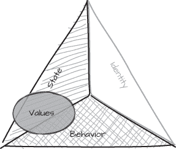
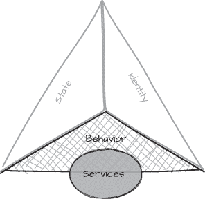
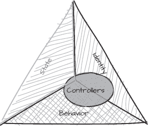

# 第六章：6 值的本质


C# 对术语*值类型*赋予了特殊的意义，但值的概念并不仅限于 C#。在这一章中，我们将更广泛地回顾值的概念，并确定一些关键特征，帮助我们判断何时应该将某个内容实现为值类型。我们将探讨值和值类型在程序中的独特且重要的角色，以及如何实现一个表现良好的值类型不仅仅需要使用结构体（struct）或记录结构体（record struct）。

我们将探讨以下内容：

+   如何通过使用值类型对象来封装行为，进而改进我们的设计

+   如何覆盖某些类型的原生引用语义对其行为产生不利影响

+   不同对象类型在应用中所扮演的角色是什么，以及定义这些角色的特征是什么

+   为什么相等性与等价性不同

+   如何识别我们应用中适合做值类型的候选项

每个应用程序都是不同的，作为开发者，我们有责任为特定程序的具体问题创造解决方案。最终，这要求我们根据对所选编程语言的最佳应用做出自己的判断。在 C# 中，在某种程度上，这意味着我们需要选择是使用类、结构体、记录类型（record）还是记录结构体（record struct）来创建我们的类型。

并不是*所有*东西都适合成为值类型；有时候，值语义并不适合我们需要的功能。在选择不同类型时，我们需要判断何时值语义对某个类型是合适的——同样重要的是，何时它并不适合。

## 值语义与引用语义

*值语义*这个术语广泛用于描述值类型，通常与其对立面——*引用语义*进行对比。然而，虽然引用语义可以通过引用变量（或其他语言中的类似机制）间接访问实例来轻松定义，但值语义往往没有明确的定义，或者仅仅表面上被解释为值类型所具备的特性。在 C# 中，值类型的典型代表是结构体（struct）。

在 C# 中，结构体与类的最显著区别在于，结构体实例是按值复制的，意味着复制的是一个全新的实例。因此，结构体通常被称为具有值语义。我们可能会推测，值语义意味着实例是按值复制的，C# 语言规范也明确支持这一定义（[*https://<wbr>docs<wbr>.microsoft<wbr>.com<wbr>/en<wbr>-gb<wbr>/dotnet<wbr>/csharp<wbr>/language<wbr>/reference<wbr>/language<wbr>-specification<wbr>/structs*](https://docs.microsoft.com/en-gb/dotnet/csharp/language-reference/language-specification/structs):））。

> [结构体（Structs）]可以方便地使用值语义来实现，其中赋值会复制值而不是引用。

正如我们在前几章中讨论的，按值复制是值类型变量使用内存方式的直接结果。每个值类型变量的值都是该类型的完整实例。当值被复制时，副本必然是该类型的全新实例，包括从原始实例复制的每个字段的值。这与复制引用变量不同，在复制引用变量时，副本是指向内存中与原始变量相同实例的新引用。原始对象的字段值根本没有被复制。

复制行为的差异仅仅是值类型和引用类型表示方式的结果。引用变量可能会被频繁复制，但它们引用的实例很少被复制，这是一种方便且高效的内存使用方式。结构体和记录结构体变量是按值复制的，因为它们无法以其他方式复制。然而，复制行为只是值语义和引用语义之间差异的一个方面。

### 复制和相等比较行为

相等比较行为与变量的复制方式密切相关。当我们复制一个变量时，复制应该与原始变量比较相等。虽然这似乎显而易见，但这也是为什么所有结构体都从ValueType继承< samp class="SANS_TheSansMonoCd_W5Regular_11">Equals，并且结构体的< samp class="SANS_TheSansMonoCd_W5Regular_11">Equals方法的默认实现非常重要的原因。如果没有ValueType，结构体变量的副本将无法与原始值比较相等，因为结构体变量是按值复制的。副本是一个独立的实例，而<object.Equals提供的默认引用比较方法永远不会将副本和原始值视为相等。继承自ValueType的< samp class="SANS_TheSansMonoCd_W5Regular_11">Equals方法执行基于值的比较，以确保当我们复制值类型实例时，副本和原始变量将被视为相等。

当我们比较引用时，我们是在检查它们是否代表相同的特定实例，而不是检查这些实例是否相似。类类型从object继承的< samp class="SANS_TheSansMonoCd_W5Regular_11">Equals方法的行为与引用的复制行为相匹配，因为复制一个引用变量并不会复制实例。

仅仅通过值复制并不是赋予值类型值语义的原因；它只是语言中定义的复制结构体类型变量的机制。事实上，通过值复制的行为甚至不是值语义的必要成分。举个例子，string类，它重写了默认的Equals和operator==方法，以执行基于值的比较。正如在第五章中所述，string是一个类，string变量是引用类型，但当我们比较两个string变量时，我们最关心的是它们是否有相同的内容——也就是说，它们的字符序列是否相同。

至少在进行相等性比较时，一个字符串的*值*是字符序列，而不是引用的实际值。两个变量是否引用内存中相同的字符串几乎总是无关紧要的。由于string变量是引用类型，string实例通常不是通过值复制的，但它们是通过值进行*比较*的。

当我们试图定义或理解值语义时，相等行为比变量如何被复制更为重要。从广义上讲，值类型是任何基于其状态进行相等性比较的类型；也就是说，如果两个值类型对象具有相同的值，则它们是相等的。进一步来说，值语义不仅仅局限于类型是作为结构体或记录结构体实现的；拥有值语义是让一个类型成为*值*类型的关键，如果我们接受一个比 C#语言规范中*值类型*定义更广泛的解释。

我们也可以为任何自定义的类类型重写这种行为，但这样做并不总是合适的。

#### 基于引用的比较

大多数对象都有一些状态，无论是私有实例字段还是公共属性值。我们可能会倾向于为所有类重写默认的引用相等性行为，并总是使用该状态作为对象比较的值。然而，尽管我们可以通过类来建模值，就像 C#对string所做的那样，*拥有*一个值和*作为*一个值是非常不同的。大多数类型并不是设计成值类型的，默认的引用比较对于我们创建的大多数类来说更加合适。

作为基于引用的比较对对象很重要的一个例子，考虑 示例 6-1 中的 Login 类，它用于跟踪已登录用户的系统。由于 Login 是一个类，因此引用比较的语义对于它是合理的，因为我们需要能够区分不同的实例。

```
public sealed class Login
{
    public string   UserName {get;}
    public DateTime Established {get;}
    public bool     Active {get; private set;}
    `--snip--`
    public void Disconnect()
    {
        Active = false;
    }
}
```

示例 6-1：基于引用的相等性对于类类型很重要。

尽管公共属性直接暴露了一个 Login 实例的状态，但使用这些属性来实现相等性比较是一个错误。两个具有相同属性值的 Login 实例可能表示不同的连接。即使我们假设 UserName 属性在所有用户中是唯一的，我们仍然需要在允许同一用户多次连接的系统中区分每个登录实例。同一用户甚至可能在完全相同的时刻登录两次，因此仅仅通过 Established 属性来区分不同的连接是不够的。

如果我们重写了 Login 的 Equals 方法来比较它的属性值，那么我们就无法使用 Equals 来区分具有相同属性的不同实例。如果我们需要通过调用其 Disconnect 方法强制断开某个特定连接，我们希望确保断开的是正确的连接！因此，我们需要能够识别出一个特定的 *登录实例*，而不管其公共属性的值如何。

我们可以使用 Equals 方法以外的机制来区分具有相同状态的不同实例，但这将增加额外的复杂性，以支持正常的引用比较已经提供的功能。

#### 引用语义与副作用

值语义（value semantics）和引用语义（reference semantics）之间的区别，也在于通过别名引用可能带来的副作用，这与可变性密切相关。如果我们通过一个变量修改了一个对象，并希望通过另一个变量看到该变化，我们就需要引用语义。

来自清单 6-1 的`Login`类具有一个`Disconnect`方法，该方法会改变实例的内部状态。如果我们通过一个引用变量调用`Disconnect`方法，我们希望该实例的每个引用都变为不活动状态。如清单 6-2 所示，我们还希望没有其他实例受到影响。

```
var mac = new Login("macreadyrj");
var norris = new Login("norrisv");
Assert.That(mac.Active, Is.True);
Assert.That(norris.Active, Is.True);
var thing = norris;
thing.Disconnect();
Assert.That(norris.Active, Is.False);
Assert.That(mac.Active, Is.True);
```

清单 6-2：通过共享引用故意改变实例

在这里，我们复制了`norris`引用变量，并在复制的副本上调用`Disconnect`方法，将其`Active`属性设置为`false`。尽管我们从未使用`norris`变量调用`Disconnect`，但是由于该实例通过另一个引用进行了修改，`norris`所引用的实例的状态在调用`Disconnect`后发生了变化。`mac`变量引用的是一个独立的`Login`实例，因此它不会受到对`thing`更改的影响。

我们希望对`Login`类使用引用语义，因为这意味着我们可以拥有多个指向特定`Login`实例的引用。我们可以将引用作为参数传递给方法，并安排这些方法故意修改该实例。我们无需担心搜索所有其他指向已修改实例的引用，以确保它们已经更新了我们的更改，因为引用本身具有这种行为。

引用语义的一个稍微更微妙的结果是，如果我们通过一个引用类型实例修改其状态，该变量仍然会与对同一实例的任何其他引用进行比较时相等。清单 6-3 检查了即使实例已被其中一个变量修改后，两个引用是否仍然相等。

```
var norris = new Login("norrisv");
var thing = norris;
Assert.That(norris.Equals(thing), Is.True);
thing.Disconnect();
Assert.That(norris.Equals(thing), Is.True);
```

清单 6-3：检查引用相等性

这个例子演示了当我们改变一个引用类型的实例时，这个改变通过所有其他与用于改变的引用*相等*的引用是可见的。结果是，如果两个引用变量在基于引用的比较中第一次比较相等，并且没有任何一个变量被赋值为不同的实例，那么它们将*始终*比较相等，因为引用在具有相同身份时是相等的。

#### 对象身份

对象的*身份*是将其与同类型的其他对象区分开的特征。两个引用类型实例具有不同的身份——它们是独立的对象——无论它们的字段是否包含相同的值。我们可以把对象的地址看作它的身份，尽管这只是一个类比：如果对象因堆内存碎片整理或其他内存管理任务被移动，地址会发生变化，但对象保持其身份不变。

在第二章中，你看到了如何利用 lock 语句依赖于引用语义；这是对象身份比它所包含的状态更重要的一个例子，尽管底层的 Monitor 类并未以任何方式尝试改变作为锁的对象。Monitor 的实现依赖于知道特定对象实例的身份，并且该身份在多个执行线程中保持有效。

引用语义是我们工具箱中的一个重要元素，这样我们就可以识别特定的对象实例，而不仅仅是具有与另一个对象相同状态的对象。两个引用变量如果指向具有完全相同状态的不同类实例，通常不应比较相等。

唯一的例外发生在我们使用类来模拟值类型时。在这种情况下，身份不重要，因为我们故意赋予该类*值*语义。string 类型就是一个经典例子。该类型不是结构体，主要是出于效率考虑：作为类，字符串的内容不会频繁复制，其值也永远不会被装箱。然而，string 变量是按值进行比较的，并且由于值语义的存在，使用它们直观且简单。大多数类并非旨在模拟值。

对于有值语义的类型，实例的身份几乎没有或完全没有意义。值应该是*引用透明*的：只要两个实例具有相同的状态，我们可以用一个不同的实例替换值的一个实例，而不影响程序的逻辑或行为。

当我们可以改变一个对象的状态时，对象的身份就变得重要，因为身份是唯一能够区分不同对象实例的特征。引用类型的本地引用相等性告诉我们*哪个*变量会反映我们对某个特定实例所做的更改。

#### 基于值的比较

如果清单 6-1 中的Login类型是结构体或记录结构体，而不是类，则清单 6-2 和清单 6-3 中的最终断言将失败，因为Disconnect方法将会修改与断言中使用的变量不同的实例。当我们不需要引用语义的别名行为或能够同时引用同一实例时，值类型是非常有用的。将清单 6-1 中的Login类型与清单 6-4 中的Color类型对比。

```
public readonly struct Color
{
    public int Red {get; init;}
    public int Green {get; init;}
    public int Blue {get; init;}
}
var crayon = new Color {Red = 0xFF};
var pencil = new Color {Red = 0xFF};
```

清单 6-4：比较两个 Color 值的状态

这个Color类型是一个结构体，使其成为一个值类型。两个变量crayon和pencil显然是不同的实例，但它们具有相同的颜色值，因此应该比较为相等。至少就测试两个实例是否相等而言，Color类型唯一有趣的方面是它的状态。如果两个Color实例的外部可见属性值相同，它们就应该被认为是相等的。

从一个角度来看，一个Color的*身份*就是它的值，因为身份是区分不同对象的标准。值是暂时性的，因为我们可以在任何时候根据某一给定的状态创建一个值。如果我们在不同的时间或不同的方法中创建多个具有相同状态的值类型实例，那么从实际目的上来说，它们是*相同的*值，因为它们无法区分，尽管语言的机制意味着它们本质上是独立的实例。

可以*合法*地说，相同的值可以互相替代。例如，C#中的典型值类型：int。两个具有相同值的整数实际上可以认为是同一个整数。这听起来可能很显而易见，但重要的点在于，我们和我们的程序并不关心它们是否是内存中同一个int，还是两个独立的变量。唯一重要的是它们是否具有相同的值。

从某种意义上说，值的生命周期超越了作用域或内存管理所施加的技术边界。如果两个值类型实例的内容完全相同，且*这才是最重要的*，它们是无法区分的。因此，正如你接下来会看到的，值通常是不可变的。

### 可变性

值有时被描述为*永恒的*：它们的生命周期不受程序内变量作用域甚至程序本身生命周期的限制。从某种意义上说，我们可以像凭空抓取一样使用值。当我们需要数字100时，我们只需将其作为常量值“显现”出来。

这一特性并不限于内置的值类型。其他值也一样，比如货币金额$9.99，字符串"To be, or not to be"，以及日期2024 年 1 月 1 日。当我们需要时，它们*就在那里*。

在实际操作中，真实的变量确实具有可测量的生命周期，每个实例都需要存储空间，因此我们不能简单地忽视环境的技术需求。然而，关于永恒且不可变值的理论观点，是模拟我们自己值类型行为的一种有用方式。

当我们将两个数字相加时，并不会改变它们中的任何一个；相反，我们得到一个新的数字，表示它们的和。类似地，将一天加到DateTime上，或将一笔金额四舍五入到最接近的整美元，都不会改变原始值——它们产生了一个新值。

我们不能改变数字100的值，¹但我们可以通过将100与另一个数字一起使用，得到一个新数字。如果我们将^(1)加到100上，尽管表达式的结果是一个新数字，但100的值并没有消失。对于日期、速度、长度、温度和其他自然值也同样如此。值本质上是不可变的。

当我们创建表示值的类型时，不可变性可能看起来像是一个不必要的限制。毕竟，如果我们增加一个速度值，我们可能不关心之前的值。通常改变一个值的地方比创建一个新实例并改变其值更高效，不是吗？嗯，也许——我们得测量一下。不过，不可变性还有其他更微妙的后果和好处。

两个不可变的值——并且请记住，正如第四章中所述，**readonly**并不总是等同于不可变——如果它们比较相等，*总是*如此。这对哈希容器中的键具有重要意义，例如Dictionary集合。哈希容器依赖于其键的不变性。如果我们在键添加到容器后更改其值，那么之后我们无法使用该值查找项，因为从某种意义上说，通过改变其值，我们已经改变了该键的身份。

状态和实例身份的区别主要在于相等性。具体来说，当我们检查一个值是否等于另一个值时，我们是关心它们是否具有相同的状态，还是它们是否是同一个对象？如果是后者，我们需要一个类。如果是前者——我们关心的是内容，而不在乎变量是否是同一个实例——我们需要一个值类型。

### 机制与语义

微软文档中有一部分标题为《框架设计指南》，其中包括关于如何选择类和结构体的建议，但对何时选择值语义作为类型的选择并没有太多指导。指南中提供了以下建议（[*https://<wbr>docs<wbr>.microsoft<wbr>.com<wbr>/en<wbr>-us<wbr>/dotnet<wbr>/standard<wbr>/design<wbr>-guidelines<wbr>/choosing<wbr>-between<wbr>-class<wbr>-and<wbr>-struct*](https://docs.microsoft.com/en-us/dotnet/standard/design-guidelines/choosing-between-class-and-struct)）：）：

> 如果类型的实例较小并且通常生命周期较短，或者常嵌入其他对象中，可以考虑定义一个结构体而不是类。

如果我们表面上看待这一点，这似乎并不不合理。特别是，值类型较小的理由直接与内存使用和按值复制行为有关：具有多个字段的结构体占用更多内存空间，而将值从一个位置复制到另一个位置的成本相应地更高。

然而，这些建议纯粹关注内存使用和性能影响，对于何时使用记录或记录结构体并未提供明确的指导。值类型与其他类型之间还存在其他语义差异，我们应该加以考虑。虽然像这样的建议可以为我们提供指导，但它们只是故事的一小部分。每个应用程序都有自己的需求、约束和行为。我们并没有一个普适的规则可以应用于所有情况。

坚持或至少建议值类型应具有少量数据成员且生命周期短的策略，关注的是内存表示和使用的技术机制，而不是该类型应该表现的更概念化的行为前提。值类型可能通常较小，但这并不意味着所有小的类型都应该是结构体。引用类型可能只有一个字段，但这并不自动表明它应该是结构体或其他类似值类型的类型。

相应地，仅仅因为我们需要一个具有多个字段的类型，并不意味着它不能是值类型。如果值语义对于我们的类型有意义，我们应该将其定义为值类型，而不管它携带了多少数据。对象所需的字段数不应成为我们决策的主要因素。如果我们担心复制大值的成本，我们可以赋予引用类型值类型的行为来解决这些问题，关于这个话题我们将在第八章中重新讨论。

我们可以通过将值类型的特征与程序中其他类型进行比较，来确定在哪些地方可能使用值类型。尽管我们不能考虑任何潜在应用的每一种可能的对象类型，但许多程序共享一些常见的对象角色类别，正如我们接下来将讨论的那样。

## 对象关系

面向对象的应用程序包含多种具有不同角色、职责和交互的对象。这些角色通过对象之间的关系以及这些对象如何协作形成一个一致的应用程序来表征。

在设计应用程序时，我们很容易忽视值和值类型所扮演的核心角色。如果我们认识到它们的重要性，通常可以简化我们的设计，使我们的程序更加清晰，易于推理。

我们可能会将值视为一个变量的有效载荷，无论是一个<int>的表示还是堆上一个对象的属性。我们很容易把我们使用的值看作是与应用程序目的无关的附带内容。这样做可能会导致我们过度依赖内置类型，并且过于简化自定义值类型的实现，从而导致马丁·福勒所描述的*贫血领域模型*。

在贫血设计中使用的类型只是设计中常见概念的敷衍表现，尤其是值类型。这些类型通常仅由公共属性组成，所有属性都有公共的 getter 和 setter。它们没有其他相关的行为，而是依赖周围的代码来执行常见任务，如数据验证、计算，甚至是管理比较操作。反过来，这会导致代码重复、错误处理分散和职责分散。

克服贫弱设计的解药是*丰富的领域模型*，在这种模型中，不同种类的类型拥有各自的角色和明确定义的责任。每个类型都包含特定的行为，而不是将行为分散到代码的其他部分。要成功识别我们的应用程序所需的类型，我们必须认识到对象并非都是相同的；然而，即便是在最复杂的系统中，对象仍然可以归入几个类别。

### 对象种类

如果我们不小心划分应用程序的角色，我们的设计可能会变得不连贯，导致难以管理和维护。一旦我们识别出不同类型的对象所扮演的主要角色，我们可以根据这些角色来分类我们创建的类型，从而使设计更具结构性，并使其更容易理解和使用。对象大致可以分为以下四类：

**值对象**

值对象负责确保应用程序数据的有效性和一致性，并控制对这些数据的访问。它们通常不会与系统中的其他对象进行明显的合作，除非是包含其他值对象。值对象的属性通常不会随时间变化，但具有不同属性的新值对象会频繁出现。

**服务**

服务是边界对象，表示与应用程序外部系统的接口。服务通常是无状态的，可以按需使用和访问。它们可能是永久的，意味着它们是静态类型或具有全局实例，或者是短暂的，根据需要实例化。服务可能被许多对象使用，但通常自身的协作较少。

**实体**

实体是应用程序中的高阶设计元素。值对象是信息的货币，而实体代表使用或作用于这些信息的事务。实体通常是持久的，意味着它们会长时间驻留在内存中，而不是经常被创建和销毁。实体的属性可能会随着时间的推移而变化——可能会频繁变化——以适应系统的需求，而且它们经常与其他实体进行协作。实体的属性通常是其他实体或值对象。

**控制器**

控制器是系统中的任务对象：它们执行操作。实体和控制器通常合作以完成任务。控制器通常也是持久化的，并可能具有某种状态，这种状态通常与它们与其他对象的协作相关。控制器通常用于调解实体与服务之间的交互。

这些是定义特定设计和解决方案领域行为的应用角色。这四个角色在大多数系统中都很常见，尽管并非所有应用程序都会使用或需要它们。其他类别的对象——例如集合、生命周期管理器和异常——在应用程序中扮演支持角色，而不是系统中的设计元素。

在 C#中，值通常通过结构体、记录或记录结构体表示，尽管它们也可以通过类建模，正如你在 string 中看到的那样。几乎所有其他角色都会由类来承担。到目前为止，术语*对象*仅限于引用类型实例。如果我们认为值也是另一种类型的对象，那么我们就可以为比较应用程序中所有对象的特征提供一个共同且统一的基础。

因此，一个特定对象的特征提示了它正在履行的角色。换句话说，我们可以通过查看该对象实现的特征来识别对象的角色。

### 对象特征

三个非值角色——服务、实体和控制器——在行为上非常强烈，因为我们用它们来执行操作或任务。相比之下，值在系统中通常扮演被动角色，通常由其他对象使用。

行为是所有系统中对象共有的三大主要特征之一，正如 Grady Booch 及其合著者在《*面向对象分析与设计及应用*》（Addison-Wesley，2007）中所描述的。另两个主要特征是状态和身份（参见图 6-1），每个特征相对于其他特征的重要性对于每个应用角色来说是不同的。


图 6-1：对象的特征

Booch 及其合著者将这三大特征描述如下：

**行为**

对象的行为描述了它可以做什么或其可见的属性。这两个方面通常是相互关联的：当一个对象执行某个操作时，结果可能会改变它的可见属性。可见属性可能构成对象状态的一部分或全部。类型的公共接口定义了该类型实例的行为；也就是说，接口告诉我们一个对象能做什么，而不是它是如何实现的。

**状态**

对象的状态由其成员数据定义，这些数据可能是持久的且不可变的，也可能随着时间的推移发生变化。正如前面所述，状态可能在接口中公开可见，也可能是私有的且被隐藏，只在类型的内部实现中使用。

**身份**

每个类型的实例都有一个独特的身份，正如你所看到的，它使我们能够区分一个对象与另一个对象。身份在我们需要知道一个变量是否代表共享实例或本地值时非常重要。

每个对象角色优先考虑不同的对象特征，在某些情况下，多个特征对于给定的角色都很重要。我们可以通过查看对象在这些特征上的表现来识别它所承担的角色。

#### 值类型

在所有应用角色中，值类型最看重的是它们的状态；这几乎是它们的区分特征。值类型总是与它们所代表的概念有某种行为相关联，但这种行为不会改变状态。在大多数情况下，行为通过属性来表示，用于访问状态的各个组成部分。值类型也可能有方法返回其状态的不同表示，或者具有工厂方法来创建新的值。在任何情况下，值对象的所有行为都与其状态直接相关。

值类型通过它们的相等语义来强烈定义，一个值与任何具有相同状态的其他值相等。它们是不可变的，通常不会与其他对象类型进行协作。值类型经常将其他值类型作为字段，正如在代码清单 6-5 中展示的Product和Purchase类型所示。

```
public readonly struct Product : IEquatable<Product>
{
    public Product(string desc, decimal amount)
        => (Description, Price) = (desc, amount);
    public string Description {get;}
    public decimal Price {get;}
 `--snip--`
}
public readonly struct Purchase : IEquatable<Purchase>
{
    public Purchase(DateTime time, Product product, int qty)
        => (Time, Product, Quantity) = (time, product, qty);
    public DateTime Time {get;}
    public Product Product{get;}
    public int Quantity {get;}
    `--snip--`
}
```

代码清单 6-5：定义值对象

Product和Purchase结构体都实现了IEquatable< T >接口，类似于我们在第五章中研究的值类型。连同它们的属性，Product和Purchase都强调相等性行为，通过IEquatable< T >协议来表示，尽管这种行为是次要的，且完全依赖于它们的状态（见图 6-2）。



图 6-2：值对象特征

在这里，你可以看到值对象的状态是它的主要特征；我们通过状态而不是身份来区分不同的值，并且具有相同状态的值可以互换使用。值类型的行为特征不如状态突出，尽管相等语义无疑使其变得重要。然而，值类型的身份是无关紧要的，因此它不会被着色。

#### 服务类型

服务对象通常仅封装行为，而没有状态。它们通常提供某种外观模式或适配逻辑，以便与代表应用外部系统的接口进行交互。

身份通常对服务对象并不重要。服务可能是全局的，并且在整个应用程序中有一个广为人知的实例，或者它们可能根据需要创建，但每个实例都与其他实例不可区分，因为它们没有任何状态。服务有时作为纯静态接口实现（如只有静态方法的静态类），就像列表 6-6 中的 InternetTime 类。

```
public static class InternetTime
{
    public static async Task<DateTime> CurrentTime(Uri provider)
    {
        using var client = new HttpClient();
        var body = await client.GetStringAsync(provider);
        return Deserialize.DateAndTime(body);
    }
}
```

列表 6-6：实现静态服务

这个 InternetTime 类是一个仅暴露静态方法的服务；它没有身份，因为没有对象。

图 6-3 表明，服务对象的行为不仅是其最重要的特征——它通常是其*唯一*的特征。



图 6-3：服务对象特性

对于服务来说，像值那样，对象的身份并不重要，但原因稍有不同。当一个服务对象有身份时，比如它作为一个全局可访问的对象实现，我们可以用另一个对象替代该实例，只要它的公共接口相同。正如我们所知道的，如果值具有相同的状态，它们是可以互换的。与值不同，服务很少有状态，因此状态和身份在图 6-3 中都没有阴影。

#### 实体

实体通常有某种状态，这意味着我们需要能够区分一个实例和另一个实例。实体的状态通常只能通过其行为来观察，这可能涉及读取或修改状态。实体通常不会直接暴露其状态，而是提供方法以不同的形式操作或访问其状态的表示。

考虑列表 6-7 中的 Account 类，它有一个方法用于向账户添加购买，这会影响账户余额。余额本身并没有直接作为状态在 Account 类中表示，而是通过未结账款来计算。

```
public class Account
{
    public virtual decimal ChargeToAccount(Purchase item)
    {
        activity.Add(item);
        return CalculateBalance();
    }
    public virtual decimal CalculateBalance()
        => activity.Sum(item => item.Product.Price * item.Quantity);
    public virtual IEnumerable<Purchase> Statement
        => activity.OrderBy(item => item.Time);
    private readonly List<Purchase> activity = new();
}
```

列表 6-7：创建实体对象

实体也可能具有与其状态无关的行为，但可能会更新或修改另一个实体对象的参数。抽象方法和虚方法是实体类型的一个常见特征（如这里的 Account 实体），允许它们被继承，派生类型可以自定义基类行为。

我们通常关心的是使用实体类型的特定实例，因此对象身份至关重要，无论我们是否有多个具有相同状态的实例。

如图 6-4 所示，实体在这三种对象特征上都赋予了相当高的优先级。


图 6-4：实体对象特征

#### 控制器

控制器通常也有一些状态，但与实体不同的是，状态会影响控制器执行任务的方式。一个例子是数据库 Command 对象，它的状态包括与数据源的连接和 SQL 指令的表示。控制器可能会公开其状态，甚至允许直接更改，这会影响控制器的行为。例如，考虑 Command 类的 Execute 方法如何在清单 6-8 中使用 Query 属性。

```
public class Command
{
    public Command(DatabaseConnection connection)
        => (this.connection, Query) = (connection, string.Empty);
    public string Query {get; set;}
    public QueryResult Execute()
    {
        connection.Open();
        var result = connection.ExecuteQuery(Query);
        connection.Close();
        return result;
    }
    private readonly DatabaseConnection connection;
}
```

清单 6-8：定义控制器

Command 对象允许我们通过可变的 Query 属性来更改其 SQL 指令。我们可以在一个 Command 实例上反复调用 Execute 方法，以获得不同的结果，而不是为每个查询创建一个新的 Command 对象。

如图 6-5 所示，控制器主要以身份和行为为特征。它们在某种程度上依赖于状态，但比实体依赖得少，因为这些数据用于支持或修改控制器的行为，而不是作为隐藏的实现细节。



图 6-5：控制器对象特征

控制器对象的具体实现可能会根据其特定需求，更加重视它们的状态或行为。然而，和实体一样，控制器对象的身份通常非常重要，因为我们需要能够区分不同的实例。引用语义对于实体和控制器通常都很重要，以确保对实例的任何修改都会反映在所有引用中。

### 模型对象角色的设计优化

身份、状态和行为这三个特征为我们提供了一个相对简单的度量标准，可以用来确定一个对象最接近值、实体、控制器还是服务。我们可以利用这些信息来优化设计或重构代码。查看一个对象的特征可能告诉我们它承担了过多的责任或代表了多个应用角色的混合，我们应该相应地调整代码。

一个高度依赖于其状态的对象，并且具有不同实例的相同状态且被认为相等，通常是一个强有力的值候选对象。然而，如果一个特定实例的身份很重要，那么它很可能不应该是一个值类型，因此我们需要查看其他特征来确定它最能代表哪个非值角色。如果我们不能根据对象的特征清晰地识别出特定角色，我们应该借此机会将该类型分解，以更好地使用单独的抽象来建模各个角色。

在设计系统时，程序员通常会寻找主要角色——即服务、实体和控制器角色。识别值类型候选对象并不总是那么直接，这也可能是它们经常由内置类型表示的原因，比如 int、double 或 string。

一个对象应该有单一的责任，并且仅履行一个应用角色。通过关注身份、状态和行为的相对优点，我们可以更加紧密和清晰地对对象的角色进行建模。由于值类型如此重视它们的状态，因此关于值的一切都集中在该状态上，无论是获取、报告还是操控它。识别应用中的值类型有助于通过划分责任和封装行为来简化设计。

## 抽象与词汇

一些对象被认为是良好的值候选，例如简单的度量和数量，比如速度、温度、距离、长度和金钱。这些对象通常是围绕像 int 和 double 这样的基本类型的简单封装。每个对象在逻辑上代表一个抽象的单一概念。我们很难将它们分解，除非回退到使用基本类型。

我们使用这些类型的名称来构成程序的一部分*词汇表*。我们以特定概念（如 Speed 和 Length）的方式编写程序，而不是使用像 double 这样的通用类型。更重要的是，当我们与其他参与同一项目的人交流时，我们使用的名称与代码中的名称相匹配。

使用具体命名的类型代替内建的原始类型还可以防止一些简单错误，比如误将温度值当作长度值使用。例如，如果我们将一个 Temperature 类型的实例传递给一个期望 Length 类型的方法，程序将无法编译。当我们使用像 double 这样的内建类型来表示长度和温度值时，这种错误容易被忽视。

其他的值候选类型较难使用原始类型表示，因为它们由多个组成部分构成。表示汇率、色彩空间、笛卡尔坐标和电话号码等概念的类型每个都有几个相关的部分。然而，它们都代表了不同的抽象，我们可以为这些抽象赋予有意义的名称，如 FxRate、Color、Coordinate 和 PhoneNumber。

我们为类型命名时，应提供关于其目的的关键信息。我们可以将 RGB 色彩空间中的红、绿、蓝分量收集成一个简单的元组类型，但很难将这样的值与包含 x、y 和 z 分量的三维坐标元组区分开。为 Color 和 Coordinate 创建独立的用户定义类型，使我们的代码更容易被其他程序员理解。

当我们使用一个抽象名称时，我们隐含地指的是与该抽象相关的行为。这个名称成为该概念的简写，当代表该抽象的类型是一个单一的、内聚的概念，并且其行为被良好封装时，最容易理解。值类型是探索这些思想的丰富资源，尽管相同的原则也适用于所有类型。

## 封装与内聚性

当我们设计自己的类型时，除了给它起个能表达其目的的名字外，将与我们所建模的抽象相适应的行为集合起来也是有益的。这就是通常所说的*封装*：将对象的数据和支持它的方法组合在一起。然而，封装远不止是添加成员方法；我们还需要牢记类型的内聚性，这是一个更为抽象的概念。

如果一个类型是*内聚*的，那么为其定义的所有操作都能协同工作，提供一个清晰且合理的接口来使用该类型的实例。换句话说，内聚意味着该类型的概念作为一个整体是有意义的。在这个背景下，我们讨论的是其他程序员是否容易理解某个类型。编译器只关心语法是否正确，但如果我们发现一个主要涉及金钱的类型中有一个用于将字符串转换为大写的方法，我们可能会感到惊讶。

一个类型不仅仅是定义方法的地方；这些方法应该有助于我们尝试表示的抽象。相反，正如之前所提到的，像 列表 6-9 中的 Speed 类型那样没有任何行为的类型通常是过于简化的。

```
public struct Speed
{
    public double InMetersPerSecond {get; set;}
}
```

列表 6-9：贫血类型设计

这个 Speed 结构体并没有封装任何东西，它的 InMetersPerSecond 属性完全可以是一个公共字段。虽然类型的名字给了我们关于其预期用途的一些线索，并且至少可以让编译器捕捉到许多不当的用法，但 Speed 仍然是一个贫血类型的例子。我们添加的任何行为都应该支持并且有助于名字 Speed 所暗示的抽象。

这一建议同样适用于系统中的所有类型，而不仅仅是值类型。无论我们创建的类型目的是什么，我们都需要在设计中捕捉到各个抽象。好的抽象是高度封装的；它们不会泄露实现细节。一个内聚的类型比一个只是方法集合的类型更容易理解。封装性和内聚性共同作用于抽象的质量。

我们创建的许多对象都有某种状态，但这并不等同于它们表示的是值。对于值类型来说，我们表示的抽象*就是*那个值。如果我们定义一个类型来表示速度，那么我们为该类型定义的操作应该提供一个与普遍接受的 Speed 概念一致的接口。值是我们希望实现的封装性和内聚性的核心。

> 注意

*术语*封装*有时仅用于指数据隐藏。虽然直接暴露字段通常是一个不好的主意，正如我们稍后会讨论的那样，封装涉及的内容远不止使数据变得私有。封装与内聚性有着密切的关系，并且二者共同在设计易于正确使用且难以错误使用的类型中发挥着重要作用。*^(2)

### 消除重复代码

将行为封装成一个命名类型可以让我们将常见代码集中到一个地方。如同你在第一章中看到的，合理的速度值应该在特定的范围内，因此，尝试使用一个超出此范围的速度值应该是一个错误。如果我们使用一个过于简单的类型来表示速度，我们就必须在每次使用速度值的地方重复进行这些验证检查，这可能会在多个地方发生。考虑第 6-10 节中的方法，它们使用了第 6-9 节中的< s am p class="SANS_TheSansMonoCd_W5Regular_11">Speed结构体。我们必须为每次使用< s am p class="SANS_TheSansMonoCd_W5Regular_11">Speed时验证该值。

```
private const double C = 299792458;
public static double Distance(Speed speed, double time)
{
    if(speed.InMetersPerSecond > C ||
       speed.InMetersPerSecond < 0 ||
       speed.InMetersPerSecond is double.NaN)
    {
        throw new ArgumentOutOfRangeException(…
    `--snip--`
}
public static double Time(Speed speed, double distance)
{
    if(speed.InMetersPerSecond > C ||
       speed.InMetersPerSecond < 0 ||
       speed.InMetersPerSecond is double.NaN)
    {
        throw new ArgumentOutOfRangeException(…
    `--snip--`
}
```

第 6-10 节：重复的验证代码

为了防止无效的速度值作为参数传递给这些方法，我们必须验证参数，确保它不大于最大允许值、不为负数，并且是一个实数。我们使用的测试对于每个使用< s am p class="SANS_TheSansMonoCd_W5Regular_11">Speed的方法都是相同的，我们还应该验证< s am p class="SANS_TheSansMonoCd_W5Regular_11">time和< s am p class="SANS_TheSansMonoCd_W5Regular_11">distance参数的值。在编写一个使用速度、时间或距离的新函数时，很容易忘记其中的某个检查，或者不小心使用错误的最大允许速度值。

验证代码的重复也是一个维护问题。如果我们需要修改速度的可接受范围，就必须确保在所有出现的地方都进行相应的更改。我们还需要在每个应用此验证逻辑的方法中测试验证逻辑，因此这些测试也将被重复。

如果我们将验证逻辑封装在一个< s am p class="SANS_TheSansMonoCd_W5Regular_11">Speed的构造函数中，那么我们就可以仅在一个地方对其特性进行测试，并且与其他所需的测试相互独立。我们不再需要担心使用< s am p class="SANS_TheSansMonoCd_W5Regular_11">Speed值的方法中，值可能超出范围的问题。任何使用< s am p class="SANS_TheSansMonoCd_W5Regular_11">Speed的方法都可以依赖它所封装的验证逻辑。我们可以删除重复的验证代码以及任何重复的测试。

### 建立类不变量

拥有一个执行类型值必要验证的构造函数是建立*类不变量*的一个例子（其中*类*与类型理论相关，而不是class关键字）。这种方法确保所有实例的值都符合该类型的逻辑。

清单 6-11 展示了如何将switch表达式与模式匹配结合起来，以便在构造函数中高效地进行数值验证。

```
public readonly struct Speed
{
    private const double C = 299792458;
    public Speed(double val)
        => amount = val switch
        {
          ❶ double.NaN => throw new ArgumentException(
                             message: "Must be a number",
                             paramName: nameof(val)),
          ❷ < 0 or > C => throw new ArgumentOutOfRangeException(
                             paramName: nameof(val),
                             message: $"Must be between 0 and {C}"),
          ❸            => val
        };
    `--snip--`
    private readonly double amount;
}
```

清单 6-11：定义带有验证的简单值类型

Speed的构造函数确保我们永远不会有一个不是数字、为负数或大于光速的值。

switch表达式中的模式是从上到下匹配的，在被测试的值—在此情况下是val参数—匹配模式时，关联的表达式会被评估并产生结果。前两个模式是错误条件，并会抛出异常，而不是生成一个值。

第一个模式是常量模式匹配NaN，正如你在第五章中看到的❶。第二个模式会抛出一个ArgumentOutOfRange异常，如果val小于0或大于常量C❷。这个模式使用了自 C# v9.0 以来可用的组合功能：关系模式和析取模式。

*关系模式*，适用于任何内置的数值类型，使用关系运算符<、>、<=或>=来判断一个数字是否在给定范围内。*析取模式*通过使用or关键字将其他模式结合起来，当其任何表达式匹配时，模式会匹配。类似的*合取模式*（此处未使用）使用and关键字，只有当所有组件表达式匹配时，模式才会匹配。

如果 val 值不匹配前两个模式中的任何一个，它将匹配最后一个丢弃模式，其表达式只是 val 的值 ❸。这将成为整个 switch 表达式的结果，并分配给 amount 字段。由于丢弃模式始终匹配，它必须是 switch 表达式中的最后一个模式。

除了将验证逻辑封装在 Speed 类型中，我们还使 Speed 变得不可变，以确保一旦实例通过验证，就再也不会变得无效。如果状态不能被改变，那么类的不变性仅需在构造函数中检查一次。

### 通过对称性来澄清

接口中对称性的重要性常常被低估，但它在使我们的类型易于使用和理解方面可能非常关键。例如，你在第一章中看到过，类工厂方法如何帮助我们为像 Speed 这样的类型表示单位。我们使用这些方法，而不是直接访问公共构造函数，每个方法都封装了它所代表的单位名称。清单 6-12 展示了如何将类工厂方法与相应的属性配对，以便获得不同单位的值。

```
public static Speed FromMetersPerSecond(double value) => new Speed(value);
public      double InMetersPerSecond => amount;
public static Speed FromKmh(double value) => new Speed(value * 1000 / 3600);
public      double InKmh => amount * 3600 / 1000;
```

清单 6-12：通过将类工厂方法与各自的属性配对来应用对称性

我们可能会期望，如果我们可以通过使用以公里每小时为单位的值来创建一个 Speed，那么我们在后续阶段也能够获得相同单位的值。我们通过将每一对特定单位的类工厂方法和对应的属性一起声明，强调了它们之间的对称性。

清单 6-12 中的方法和属性并不会阻止我们使用错误的单位。我们仍然可以将一个值以 kmh 传递给 FromMetersPerSecond 工厂方法。然而，通过将我们使用的单位编码到类工厂方法和属性的名称中，我们使它们比直接使用普通构造函数更为明确和富有表现力。

明确的表示有助于使 Speed 接口更加一致，并且比错误地使用更容易正确使用。我们的 Speed 类型已经不再只是一个简单的包装原始值的容器。

使用像 FromKmh 和 InKmh 这样明确的名称来表示 Speed 实例的可用转换，有助于保持内部表示的封装。一个接受 double 参数的构造函数，以及一个模糊命名的属性来简单返回该值，会泄露 Speed 具有特定底层表示的细节。这里显示的类工厂方法和属性隐藏了这些实现细节，并通过一些常见的转换为用户增加了价值。

我们可以轻松想象使用类似的类工厂方法和属性，在其他类型之间进行单位转换，例如在温度单位摄氏度和华氏度之间，或在长度单位米和英尺之间进行转换。

## 封装和公共接口

尽管封装不仅仅是让数据变为私有，但它建立在类型的内部数据不能被直接访问——尤其不能被其他代码改变——这一前提上，只有类型的方法才能访问。对私有数据的访问由类型的公共接口控制。

良好封装的类型有助于我们推理代码，因为我们可以始终确保私有字段具有一致的值，并且这些值在没有我们知道的情况下永远不会改变。更重要的是，这意味着作为设计者，我们可以在不改变接口的情况下更改底层表示。如果我们从不直接暴露类型的数据，除了该类型的成员实例方法外，任何其他代码都无法依赖于其表示。

通过将 Speed 的 double amount 字段封装为私有，并仅在成员方法和属性所提供的受控条件下对其进行暴露或操作，我们将更改表示的范围和影响限制在这些成员之间。

相应地，如果我们限制具有直接访问字段的成员数量，我们进一步缩小了更改的范围。如果我们编写只依赖于 Speed 公共接口的方法，即使我们更改底层数据类型，它们也会继续工作。

### 扩展接口

如果我们向任何类型添加太多实例方法，我们就有可能使其接口变得凌乱。当类型的某些方法仅偶尔有用时，它的核心接口就更难以发现。相比之下，将类型的方法保持在合理的最小数量内，可以使代码更容易理解。

实例成员方法的一种替代方案是使用扩展方法，这些方法定义在它们扩展的类型之外。一个为<sam class="SANS_TheSansMonoCd_W5Regular_11">Speed</sam>类型编写的扩展方法示例在 Listing 6-13 中给出，其中<sam class="SANS_TheSansMonoCd_W5Regular_11">WithPercentAdded</sam>方法利用<sam class="SANS_TheSansMonoCd_W5Regular_11">Speed</sam>中定义的公共方法和属性来创建一个不同值的新的<sam class="SANS_TheSansMonoCd_W5Regular_11">Speed</sam>实例。

```
public static class SpeedExtensions
{
    public static Speed WithPercentAdded(this Speed speed, double percent)
        => Speed.FromMetersPerSecond(speed.InMetersPerSecond +
                     percent / 100 * speed.InMetersPerSecond);
}
var start = Speed.FromMetersPerSecond(100);
var end = start.WithPercentAdded(25);
Assert.That(end.InMetersPerSecond, Is.EqualTo(125));
```

Listing 6-13: 扩展 Speed 的接口

WithPercentAdded方法不会修改传递给它的<sam class="SANS_TheSansMonoCd_W5Regular_11">Speed</sam>实例——它不能修改，因为<sam class="SANS_TheSansMonoCd_W5Regular_11">Speed</sam>是一个只读结构体。相反，我们返回一个新的具有所需值的<sam class="SANS_TheSansMonoCd_W5Regular_11">Speed</sam>实例。扩展方法必须在静态类中定义，因此它总是静态方法。通常，将扩展特定类型的多个方法组合在一个静态类定义中，所以<sam class="SANS_TheSansMonoCd_W5Regular_11">SpeedExtensions</sam>类可能会包含多个扩展<sam class="SANS_TheSansMonoCd_W5Regular_11">Speed</sam>接口的方法。

扩展方法对于在不使其主要内部接口过于繁重的情况下向类型添加实用方法非常有用。

### 减少内部接口

类型的接口定义了该类型的对象与系统中其他对象之间可以进行的协作。类型内定义的公共方法、构造函数和属性构成了*内部*接口或*固有*接口，定义了其他对象可以对类型实例执行的操作。类型还具有*外部*接口或*偶然*接口，其中包含接受类型参数但定义在类型外部的方法。外部接口定义了哪些其他对象依赖于该类型。这些外部方法无法访问类型的内部，因此它们不会受到底层表示变化的影响。

拥有许多公共成员的类型，其基本特征可能很难辨认，因为类的物理定义变得庞大。如果我们将内部接口成员限制为仅包含那些需要访问类型私有实现细节的成员，那么类型定义会变得更简洁，从而更容易理解。那些可以完全通过内部公共接口实现的方法，可以提取到单独的类中。是否将它们作为扩展方法或普通静态方法，取决于哪种使用方式更自然。

合理的结论是，在可能的情况下，我们应尽量减少内部接口，而不破坏类型的封装性或降低其内聚性。这种方法有两种相互竞争的观点。一方面，通过提取像WithPercentAdded这样的根据Speed的其他公共方法实现的方式，我们使得Speed变得更小，更易于理解。我们还减少了对Speed内部表示所做更改的潜在影响。另一方面，WithPercentAdded仍然是Speed的整体可访问接口的一部分，通过将该方法单独提取出来，我们使得它更难被发现。

我们必须在内部接口和外部接口之间找到平衡，针对Speed。虽然WithPercentAdded方法可能是一个对Speed值有用的工具，但它并不是Speed概念的本质部分。将其提取为扩展方法并不会降低Speed的内聚性，也不会通过要求我们引入一个本不需要的新属性，或将私有成员改为公有成员来破坏其封装性。将像WithPercentAdded这样的扩展方法集中在一个地方，是让外部接口更容易发现的一种方式。

另一方面，FromKmh 类工厂方法更适合作为 Speed 类型的成员。我们可以将其实现为一个不同类型上的静态方法，并以 FromMetersPerSecond 为基础。然而，这样做会降低 Speed 的内聚性，因为 FromKmh 和 FromMetersPerSecond 自然是一起的。如果我们将这两个方法提取到一个单独的类型中，就需要将 Speed 的构造函数设为公共的，从而降低了它的封装性。FromKmh 方法是 Speed 接口的内在部分，因为它表示以特定单位创建 Speed 的一种方式，并且与其他内在方法有自然的联系。

一些方法 *必须* 是它们类型的成员，即使它们理论上可以通过其他公共属性和方法来实现。Equals(object?) 方法覆盖了基类的实现，并且必须是实例方法。重载的操作符也必须是静态成员方法。一个操作符重载至少需要一个作为其成员类型的参数，因此我们无法在一个单独的类型中实现它。

### 组合抽象

值可以不仅仅是对基本类型的简单封装，比如 double。结构体可以包含其他用户定义类型作为字段，因此我们可以通过组合现有的抽象类型来创建新的抽象类型。例如，我们可以创建一个新的类型来表示 Velocity（速度），它将 Speed（速度）类型和 Angle（角度）类型结合起来。虽然 Listing 6-14 中的 Velocity 类型本身没有行为，但它可以利用 Angle 和 Speed 所代表的更丰富的抽象。

```
public readonly struct Velocity
{
    public Velocity(Speed speed, Angle angle)
        => (Speed, Angle) = (speed, angle);
    public Speed Speed {get;}
    public Angle Angle {get;}
}
var velocity = new Velocity(100.Kmh(), 45.Degrees());
```

Listing 6-14: 为 Velocity 组合一个新的抽象

`Velocity` 类型受限于 `Speed` 和 `Angle` 的可能值的验证约束，可以使用它们的任何公共操作和属性，包括任何扩展方法。在这些包含的类型的基础上，我们可以为 `Velocity` 添加任何特定于它的行为，例如算术操作或不同表示形式之间的转换。

`Velocity` 代表一个特定的单一概念，尽管它是一个用于存储其他类型值的容器。 `Velocity` 的 `Speed` 和 `Angle` 属性不是任意的；它们定义了速度测量的含义。`Velocity` 抽象是程序词汇的一部分，连同 `Speed` 和 `Angle` 一起使用。

`Velocity` 是作为记录或记录结构体实现的一个不错选择，特别是使用这些类型可用的紧凑位置语法。然而，位置语法不太适合 `Speed` 和 `Angle` 类型。为了说明原因，接下来的章节我们将探讨定义类型的不同方式之间的一些权衡和折中。

## `选择值语义与引用语义`

在大多数程序中，大多数用户定义的类型将是类，类支持 C# 提供的最广泛的特性。类是 C# 中创建我们自己类型的最通用方式，因为它们支持语言的所有面向对象功能，例如继承和虚方法。类实例还受益于堆上分配的对象所提供的自动内存管理。通常，只有当我们需要值语义相关的行为时，才应该以不同的方式定义类型。

我们有一些指示器可以判断某个类型定义是否适合使用值语义。值类型不应支持其状态的更改，这也是为什么建议值类型仅包含其他值的原因。当所有值类型都是不可变的，无论它们是通过类、记录、结构还是记录结构实现的，我们就不必担心对象的状态会意外改变，因为我们的代码行为更加可预测。需要对其状态进行不受限制写入访问的类型，通常不是值类型的好候选。

另一个相关的指示器是需要类型支持其状态的完整深拷贝。当我们想避免别名引用带来的副作用时，我们需要进行*深拷贝*，也称为*克隆*，以复制可变状态。通常，状态需要在克隆之后立即被写入，以便新对象可以与原对象具有不同的属性。我们在第二章和第四章中讨论的非破坏性变异功能就是为类似值的类型提供有限可变性的一个很好例子。

每当我们为一个类定制相等性行为，使得两个实例能够根据其状态进行比较时，这就是另一个强烈的指示，表明该类型应该实现为一个完整的值类型。克隆通常伴随有重写的 Equals 方法。

基于状态的相等性行为以及支持深拷贝以避免别名问题，是需要值语义的两个最强信号。尽管可以使用类来实现一个值类型（正如我们在 string 中看到的那样），但其他类型定义通常更为优先。

记录类型、结构体和记录结构体都是用于创建表示值的类型的工具——也就是说，用于定义具有*值语义*的类型。它们之间的选择并不总是显而易见，因为每种类型有不同的优缺点。

### 避免默认变量的陷阱

对于结构体和记录结构体类型，我们需要记住，实例总是可以进行默认初始化，因此默认值必须被类型的实现以及使用该类型的代码视为有效。对于像 Speed 或 Length 这样的简单数值类型，这不是问题。此类类型的默认值是 0，无论单位是什么，这都是一个完全可以接受的状态：0 米与 0 英里或 0 英寸是完全相同的值。

并非所有值都适用这种情况。例如，在温度测量中，存储值的单位是很重要的：0°C 等于 32°F，而 0°F 约等于–17.78°C。我们可能会约定默认的温度单位是摄氏度，但如果没有为每个单位创建单独的类型，这一点就很难明确指出，而这似乎是没有必要的。

如果我们使用类或记录类型而不是结构体或记录结构体，我们可以防止默认值并强制用户在创建实例时指定正确的单位。然而，类和记录类型都是引用类型，这意味着变量可以有null值。在 C# v8.0 及以后的版本中，我们可以通过尽可能多地利用不可为空的引用来缓解这一问题，尽管这可能无法防止所有潜在的误用。

尽管如此，当我们在选择使用类还是记录类型来建模具有值语义的类型时，记录类型几乎总是更为可取。记录类型专门用于定义具有值语义的类型，编译器会根据被比较实例的状态为记录类型提供默认的相等性行为。

### 实现自定义行为与生成行为

如果我们希望类具有基于值的相等性，则必须自己定义。至少，我们应该重写Equals(object?)和GetHashCode方法，但正如你在第五章中看到的，更完整的定义包括实现IEquatable<T>接口，并重载operator==以及其伴随的operator!=，使得相等比较更加自然和简便。

对于大多数具有值语义的类型，只要我们小心避免常见错误，实现这些方法是很简单的。然而，如果我们使用record而不是class，编译器会为所有这些方法生成实现。这使得记录类型的定义更加简洁易懂，避免了我们必须记住所有潜在的陷阱。

对于我们预期的Temperature类型，我们可能会考虑使用位置记录，这样可以省去完全定义的麻烦。作为位置记录的临时实现，Temperature可能看起来像清单 6-15 中的定义，但位置记录有需要考虑的局限性。

```
public sealed record Temperature(double InCelsius)
{
    public static Temperature FromCelsius(double val)
        => new Temperature(val);
    public double InFahrenheit => InCelsius * 1.8 + 32;
    public static Temperature FromFahrenheit(double val)
        => new Temperature((val - 32) / 1.8);
};
```

清单 6-15：一个位置记录的温度

编译器使用Temperature定义的参数自动生成一个名为InCelsius的属性，但我们必须编写自己的InFahrenheit属性，这样我们才能添加代码来执行转换。用户可以调用类工厂方法来创建具有不同单位的Temperature实例，但编译器生成的Temperature构造函数是*公开的*。生成的构造函数也不会验证其参数，而我们可能希望确保Temperature不能低于绝对零度。

如果我们希望用户明确指定单位，我们需要强制他们使用这些类工厂方法，因此位置记录无法满足我们的需求。出于相同的原因，位置语法不适用于我们在清单 6-14 中使用的Speed和Angle类型。

### 重写生成的方法

当位置记录语法不能满足我们的需求时，我们可以使用完整的记录定义，它没有位置类型的参数。我们可以提供自己的*私有*构造函数，并利用它来验证初始值。

我们为了Temperature而牺牲了一些使用位置记录的便利性，因为我们必须编写自己的InCelsius属性，因为编译器只为位置记录生成属性。清单 6-16 中的记录定义展示了我们如何定制记录类型的行为，同时仍能享受编译器提供的其他代码的好处。

```
public sealed record Temperature
{
    private const double ZeroKelvin = -273.15;
    private Temperature(double celsius)
        => value = celsius switch
            {
               Double.PositiveInfinity or < ZeroKelvin
                  => throw new ArgumentOutOfRangeException(`--snip--)`,
               double.NaN =>  throw new ArgumentException(`--snip--`),
                           => celsius
            };
    public double             InCelsius => value;
    public static Temperature FromCelsius(double val)
        => new Temperature(val);
    public double             InFahrenheit => value * 1.8 + 32;
    public static Temperature FromFahrenheit(double val)
        => new Temperature((val - 32) / 1.8);
    public static Temperature AbsoluteZero
        => new Temperature(ZeroKelvin);
    private readonly double value;
}
```

清单 6-16：一个温度的完整记录定义

编译器仍然会为非位置记录生成方法，以实现基于值的相等性，这样我们可以专注于正确实现与<code class="SANS_TheSansMonoCd_W5Regular_11">Temperature</code>类型相关的其他行为。

当我们能够接受位置语法的所有默认行为时，记录和记录结构比类和结构体提供了最大的优势。一个很好的例子是示例 6-4 中的<code class="SANS_TheSansMonoCd_W5Regular_11">Color</code>类型，作为位置记录结构，它看起来像这样：

```
public readonly record struct Color(int Red, int Green, int Blue);
```

对于<code class="SANS_TheSansMonoCd_W5Regular_11">Color</code>类型，默认初始化的实例是一个有效的<code class="SANS_TheSansMonoCd_W5Regular_11">Color</code>，并且与所有属性为<code class="SANS_TheSansMonoCd_W5Regular_11">0</code>的实例比较时是相等的，示例如下：

```
var background = new Color();
var black = new Color(0, 0, 0);
Assert.That(background == black, Is.True);
```

我们不需要添加任何自定义的方法或属性，因此位置语法简洁且恰好能满足我们的需求。

记录和记录结构对于定义简单的值类型（如<code class="SANS_TheSansMonoCd_W5Regular_11">Color</code>）非常方便，尽管编译器可能不会提供类型所需的所有内容。特别是，如果我们需要比较两个值，看看一个是否小于另一个，我们必须始终提供自己的比较实现。

## 排序比较

基于值的相等性原则是定义什么是值的*唯一标准*。当我们讨论某物是否是值类型时，这实际上是指两个实例是否根据它们的状态或身份比较相等。使用状态作为相等性的基础是所有值的内在特性。然而，有些值可能是等价的，但不一定相等。

通常，如果两个值具有完全相同的状态，它们被认为是相等的。在示例 6-17 中，两个<code class="SANS_TheSansMonoCd_W5Regular_11">LogEntry</code>记录结构实例相等的前提是它们的所有属性也都相等，而单个<code class="SANS_TheSansMonoCd_W5Regular_11">LogEntry</code>实例的身份并不重要。

```
public enum Severity {Debug, Info, Warning, Error}
public readonly record struct LogEntry(DateTime stamp,
                                       Severity Level,
                                       string Message);
```

示例 6-17：值类型相等性

有些值具有自然的排序顺序，这使得我们可以对它们进行排序。存在许多排序算法，但所有排序算法通常都是通过依次比较集合中的每个项，确定一个是否小于另一个。如果左侧的值小于右侧，则这些项被认为是按顺序排列的。

我们可以根据自己的需求自定义 *小于* 的含义，从而定义 *有序*。在 C# 中，定义 *小于* 的协议是 IComparable< T > 接口，它要求我们为类型实现一个名为 CompareTo 的方法。如果左边的参数小于右边，CompareTo 返回一个负整数；如果右边小于左边，结果为正数。否则，结果为 0。

当我们比较两个 LogEntry 值是否相等时，我们会使用所有的属性。然而，对于排序，我们可能只关心 TimeStamp 属性，因为我们只是希望按日志记录的顺序排列条目。按消息排序 LogEntry 值没有太大意义，而按严重性排序对我们的使用场景来说也不必要。

LogEntry 的 TimeStamp 属性是一个 DateTime 实例，它本身实现了 IComparable 接口，因此 清单 6-18 实现了 CompareTo 方法，只需通过比较 TimeStamp 属性来实现 LogEntry 的比较。

```
public readonly record struct LogEntry(DateTime TimeStamp,
                                       Severity Level,
                                       string Message)
    : IComparable<LogEntry>
{
    public int CompareTo(LogEntry other)
        => TimeStamp.CompareTo(other.TimeStamp);
}
```

清单 6-18：为 LogEntry 值定义按 TimeStamp 排序

我们通常不会直接调用 CompareTo 方法来比较一个 LogEntry 实例；它通常是在我们对一组 LogEntry 值进行排序时间接调用的。除非我们明确指定使用不同的比较方法来排序，否则会使用我们的 CompareTo 方法来确定如何排序 LogEntry 元素，因此 LogEntry 值的默认排序仅基于 TimeStamp 属性。

值具有*外延性*：如果两个实例具有相同的可观察属性，它们就是相等的。这不一定意味着它们具有相同的结构定义，这被称为*意图性*。虽然相对较少见，但确实有可能需要一些额外的数据，这些数据不会以有意义的方式贡献于值，因此不用于相等性测试。这样的数据通常也是实现的私密细节。

当我们不仅要比较值是否相等，还要对它们进行排序时，意图性（intentionality）与外延性（extensionality）之间的区别变得更加重要。将值排序需要一种不同但密切相关的比较方法，这可能会导致两个不相等的值在排序时被认为是等价的。

### 等价性与相等性

对于大多数值类型，如果CompareTo返回0，那么这两个值确实相等，并且调用Equals将返回true。这对于我们TimeStamp属性下的DateTime值是成立的。然而，尽管这种结果通常是我们预期的，但它并不是一个严格的要求。CompareTo方法应该在两个值都不小于另一个时返回0，尽管这些值可能并不实际相等。相反，这些值在排序时是*等价的*。

使用我们的LogEntry值，当它们的TimeStamp属性完全匹配时，这两个值是等价的。尽管如此，这两个值很可能是*不*相等的，因为它们的Severity或Message属性可能不同，正如列表 6-19 中所示的简单测试。

```
var logTime = new DateTime(year:2020, month:5, day:31, 15, 35, 01, 12);
var log1 = new LogEntry(logTime, Severity.Debug, "Debug Message");
var log2 = new LogEntry(logTime, Severity.Info, "Info Message");
Assert.That(log1.Equals(log2), Is.False);
Assert.That(log1.CompareTo(log2), Is.Zero);
```

列表 6-19：LogEntry 的相等性与等价性

这段代码没有矛盾：这两个条目显然具有不同的值，但为了对LogEntry实例进行排序，它们仍然是等价的，因为不管一个在另一个之前还是之后，都没有关系。等价性不一定意味着相等性，我们应该避免将相等性通过CompareTo来实现。

一个常见的例子展示了等价和相等之间的区别，那就是比较字符串值。有时我们希望在排序时使用不区分大小写的字符串比较，但在判断相等时不使用。两个字符串值"September"和"september"可能在排序时被视为等价，但它们显然不相等。

### 比较契约

我们必须满足CompareTo方法的某些预期。特别是，比较一个值和它自己时应该报告等价；也就是说，x.CompareTo(x)必须为0。更一般地，对于两个根据Equals方法相等的对象，CompareTo应该返回0。IComparable接口是一个契约，比较一个对象与它自身的语义只是该契约的一个方面。

我们可以使用CompareTo实现来定义<运算符，用于LogEntry，这为我们提供了一种自然的方式来判断log1 < log2，并且为其余的契约提供了一种更紧凑的表达方式。小于关系的契约指定它具有以下特性：

**非自反性**

x < x始终为false。

**反对称**

如果x < y为true，那么y < x必须为false。

**传递性**

如果 x < y 且 y < z 为 true，则 x < z 也必须为 true。

**稳定**

只要没有任何一个值被改变，x < y 的结果保持不变。

**安全**

比较相同类型的值不会抛出异常。

我们可以类似地为引用类型定义 CompareTo 和 operator<，尽管我们还需要考虑 null 引用，通常它应当比任何非 null 值小。

### 其他类型的排序

通过 DateTime 或 number 排序是按大小排序的一个例子，但也可以有其他排序方式。字符串通常使用 *字典序* 排序，这意味着，如果一个字符串在字典中出现在另一个字符串之前，那么它就比那个字符串小。

其他值本质上是顺序的，例如一年中的月份。顺序比较有时需要一些小心。以英文中的星期几为例：星期天应该排在星期一之前吗？这个问题的答案取决于我们如何定义一周的第一天。

有些值本身没有比另一个值小的性质。例如 Color 类型：红色在我们列举彩虹颜色时排在蓝色之前——这是由于它们的相对波长——但蓝色在英文词典中肯定排在红色之前。在不同情况下，我们可能会对 Color 对象应用几种不同的排序方式，但这些排序定义是外部于颜色概念的。

我们可以通过创建自己的比较器，甚至多个比较器来定制序列中元素的排序，以应对不同的场景。IComparer< T > 接口与 第五章 中的 IEqualityComparer< T > 接口互为补充。正如 IEqualityComparer< T > 定义了一个与被比较类型无关的相等性比较，IComparer< T > 的实现则是外部定义的排序比较。清单 6-20 展示了一个自定义比较器类型，用于按 Message 属性而非时间对 LogEntry 对象进行排序。

```
public sealed class LogEntryComparer : IComparer<LogEntry>
{
    public int Compare(LogEntry x, LogEntry y)
        => string.Compare(x.Message, y.Message, StringComparison.Ordinal);
}
```

清单 6-20：为 LogEntry 对象定义外部比较器

Compare 方法的语义与 IComparable.CompareTo 方法一致，当 x 小于 y 时返回负整数，当 y 小于 x 时返回正整数，否则返回 0。标准库中的多个排序算法有接受显式比较器对象作为参数的重载，包括这里显示的 Order 方法：

```
var log = new List<LogEntry>();
`--snip--`
var comparer = new LogEntryComparer();
var alphabeticalLog = log.Order(comparer).ToList();
```

这个 alphabeticalLog 是一个新的 LogEntry 列表，通过使用 LogEntryComparer.Compare 比较进行按字母顺序排序。类似的重载也提供给 List< T >.Sort 和 List< T >.BinarySearch 以及 SortedList 的构造函数。

排序是值的一种常见特征，但并不像基于值的相等性那样是本质的。当一个值具有自然排序时，实现CompareTo方法是有意义的。另一方面，引用类型通常不会重写CompareTo，除非它们也重写了Equals。将基于身份的相等性与基于值的排序混合使用，或者反过来，很可能会导致混乱，并可能出现难以追踪的错误。特别是，引用没有自然排序；说一个引用的值小于另一个引用是没有意义的。

## 统一性和一致性的危险

有时，编码指南建议我们应当重写Equals并实现CompareTo方法，以适用于每种类型。这类规则背后的思想通常是尽量消除对对象使用的限制。未实现IComparable的类型不能作为SortedList中的键使用。未重写Equals和GetHashCode的类型不能可靠地作为Dictionary中的键使用。虽然我们可以使用IComparer< T >的实现来解决前者，使用自定义的IEqualityComparer< T >来解决后者，但我们必须记得显式使用这些实现。

这些指南旨在提高一致性，并消除常见需求的障碍。目标通常是使*任何*对象都可以作为哈希容器中的键使用，或者根据其状态对它们的集合进行排序，而无需显式定义外部比较器。

建议这种统一性的指南忽视了值和非值在语义上和概念上的差异，这些差异远远超出了引用类型和值类型的技术特征。引用语义具有自身的优点，特别是当我们需要多个别名引用指向单一可变实例时。这些特性不太适合作为集合中的键，并且常常与排序发生冲突。一个包含可变对象的排序集合，通过改变其元素的状态，可能会轻易变得*无*序，这也为所有值类型保持不变提供了更多理由。已经排序的值集合应该保持排序。

如我们所讨论的，某些类型没有自然的排序方式。让我们回顾一下Color的例子。坚持要求一个Color类型实现IComparable接口会给我们带来一个问题：对于两个Color值，CompareTo应该如何表现？我们可以选择一个合理的实现方式，但这可能无法满足所有的使用场景，从而在代码的其他方面引发困难。这就是为什么尽管记录类型和记录结构提供了IEquatable<T>接口的默认实现，它们却没有实现IComparable<T>接口。即使单个字段可以使用CompareTo进行比较，这也并不意味着整个类型可以通过这种方式进行比较。毕竟，Color的所有字段都是实现了IComparable<int>的<int>类型值，但*小于*并不是对Color值的有意义比较。

重写值类型的Equals方法的目的是为了允许它们作为键使用，而不是主要为了这个目的。值类型不需要引用相等性，因为一个具有相同属性的值与任何其他值一样好。基于值的相等性是比较这些值类型变量的唯一、自然的方式。

相比之下，引用类型通常依赖于基于身份的相等性。任何不是专门设计为具有值语义的类型，可能不应作为Dictionary中的键使用。

### 算术类型与非算术类型

就像并非所有的值都有自然的排序方式一样，有些值本质上是算术的，而有些则不是。例如，我们可以定义操作，允许从 Listing 6-11 中的Speed类型实例进行加法操作。像加法这样的操作，使用算术运算符有自然的表现形式，比如在像startingSpeed + Speed.FromKmh(10)这样的表达式中。

引入对算术运算或任何运算的支持，需要我们作为设计者作出一定的判断。我们需要关注我们创建的类型的常见使用场景，以及更广泛的期望，例如能够通过 + 运算符将两个实例相加。

与 Speed 不同，Listing 6-17 中的 LogEntry 类型并非算术类型，因此我们应该避免为其重载算术运算符。将两个 LogEntry 实例相加是没有意义的。

对于 LogEntry 来说，重载 operator== 和它的对应运算符 operator!= 用于等式比较是有意义的。LogEntry 类型是一个记录结构，因此编译器会自动提供等式运算符的定义。由于我们已经为 LogEntry 实现了 IComparable< LogEntry>，我们还应该考虑重载 operator< 和 operator>，这是编译器不会自动提供的。Listing 6-21 显示了基于 CompareTo 方法实现这些运算符是直接的。

```
public static bool operator<(LogEntry left, LogEntry right)
    => left.CompareTo(right) < 0;
public static bool operator>(LogEntry left, LogEntry right)
    => left.CompareTo(right) > 0;
```

Listing 6-21: 等价比较运算符定义

这些运算符定义使得处理等式和比较操作对于 LogEntry 实例变得更加自然。

### 非标准运算符行为

有时，算术运算符除了真正的算术运算外也很有用。例如，string 实例可以“相加”，而大多数程序员都知道，两个字符串相加会将它们连接在一起，所以 "key" + "board" 变成了 "keyboard"。在算术中，加法是交换律的，所以 a + b 和 b + a 给出的结果是相同的。但这在使用 string 实例时显然不成立，但用 + 连接两个 string 是一种广泛使用并且被接受的约定。

当我们以这种方式突破规则时，尤其重要的是要注意习惯用法、自然用法和期望。例如，在算术中，加法的能力与减法的能力密切相关。试想从一个字符串中减去另一个字符串可能意味着什么。它会删除左边字符串中所有出现的右边字符串的实例吗？仅仅是如果它出现在字符串的末尾？字符串的减法并没有像字符串的加法/连接那样具备自然和约定俗成的吸引力。

我们通常期望在 + 和 - 之间找到一种对称性，而对称性通常是一种值得追求的特性。当我们重载 == 时，编译器坚持要求我们也实现 != 运算符。将加法与减法结合用于 string 值是一个对称性不受欢迎的例子，因为它带来了冲突的期望。

对称性在其他情况中也是不合适的。例如，将每个属性 get 访问器与相应的 set 配对，从表面上看是吸引人的，但这与“值类型不可变”的建议相矛盾。这是另一个需要我们根据自己的判断来决定对称性是否为积极特性的实例。

## 总结

> *当你知道自己的价值观时，做决定并不困难。*
> 
> — 罗伊·迪士尼，美国电影编剧和制片人

尽管 C# 有自己对 ValueType 的定义，但值的更广泛概念并不限于 C#。这个更一般化的值类型概念与 C# 的定义有相似之处，但也存在显著的差异。

值类型的语言定义主要关注与结构体相关的内存要求和行为。然而，我们需要考虑其他因素，以便决定何时以及如何将值引入到程序中。在本章中，我们通过将值与引用类型进行对比，探讨了其中的一些考量——特别是通过检查值如何在程序中执行特定且重要的角色。

面向对象的系统由几种不同类型的对象组成，这些对象在身份、状态和行为的特征上有不同的侧重。当一个对象的角色高度依赖于实例身份时，这通常是一个强烈的信号，表明该类型不应为值类型。当优先考虑的是对象的状态，而身份不重要时，该类型几乎可以肯定地最好建模为值类型。

类型是否有单一字段或多个字段，并不一定是决定是否将其定义为值类型的最佳标准。有时我们需要值语义，有时引用语义更为重要。*值语义*和*按值复制*这两个短语有时可以互换使用，甚至可以通过彼此来定义。然而，值语义更多的是与基于值的相等性相关，而不是与复制相关。

区分值类型和其他类型是将其职责划分到应用程序中的一个重要第一步。识别候选的值类型有助于通过引入封装行为和责任的专门类型来明确我们的设计。反过来，我们能够从更模块化的系统中受益，无论是在实现上，还是在所需的测试中。决定将某个类型建模为值类型后，我们有更多的实现选项。C# 对所有用户定义类型提供了丰富的支持，但它对值类型的支持有时被低估了。

1.  1 FORTRAN 程序员，请对此保持沉默（[*https://<wbr>softwareengineering<wbr>.stackexchange<wbr>.com<wbr>/questions<wbr>/254799<wbr>/ever<wbr>-change<wbr>-the<wbr>-value<wbr>-of<wbr>-4<wbr>-how<wbr>-did<wbr>-this<wbr>-come<wbr>-into<wbr>-hayes<wbr>-thomas<wbr>-quiz*](https://softwareengineering.stackexchange.com/questions/254799/ever-change-the-value-of-4-how-did-this-come-into-hayes-thomas-quiz)）。

1.  2 特此感谢并向 Scott Meyers 道歉。
