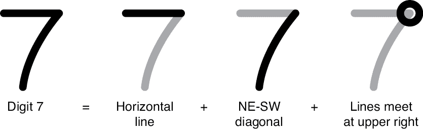
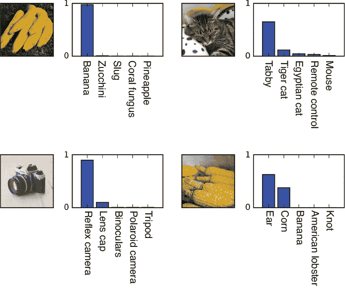
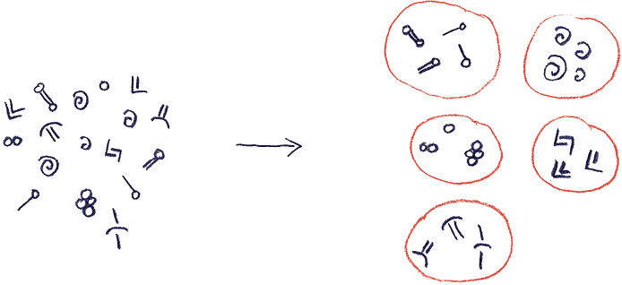
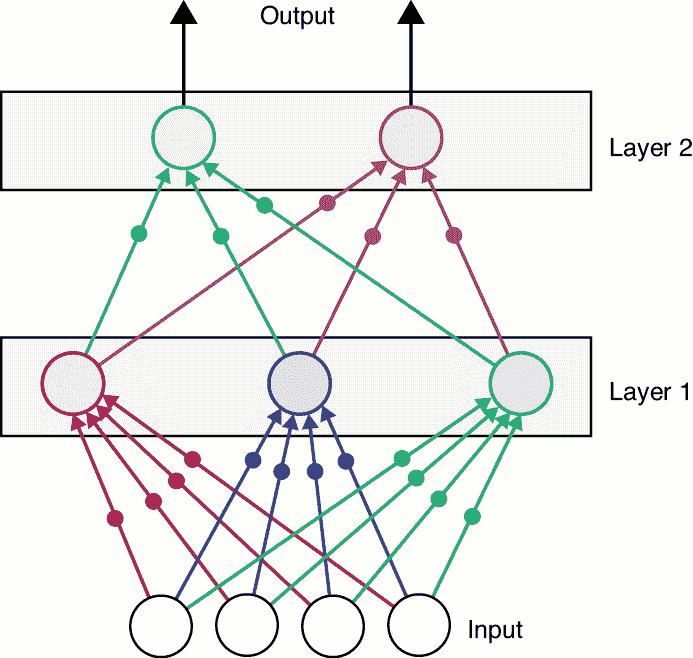

# 第一章：机器学习概述

本书讲述的是*深度学习*，它是*机器学习*的一个子领域。*机器学习*这个词描述了一个不断发展的技术体系，这些技术有一个共同的目标：从数据中提取有意义的信息。在这里，*数据*指的是任何可以用数字表示的东西。数据可以是原始数字（例如连续几天的股票价格、不同星球的质量，或是参加县展览的人们的身高），但也可以是声音（某人说话时手机中的声音）、图片（花朵或猫的照片）、文字（报纸文章或小说的文本）、行为（某人喜欢什么活动）、偏好（某人喜欢的音乐或电影）等任何我们能够收集并用数字描述的东西。

我们的目标是发现有意义的信息，至于什么是有意义的，由我们自己决定。我们通常希望找到能够帮助我们理解数据的模式，或者用过去的测量值预测未来的事件。例如，我们可能想根据某人已经评分的电影来预测他们会喜欢什么电影，或者识别一个便条上的手写字，或者仅凭几句音符就能辨认出一首歌。

我们通常通过三个步骤找到我们需要的信息：我们确定想要寻找的信息，收集我们希望包含这些信息的数据，然后设计并运行算法，从这些数据中提取尽可能多的信息。

在本章中，我们将介绍机器学习中的一些主要发展。我们将首先讨论一种早期的机器学习方法——专家系统。接下来，我们将讨论三种主要的学习方法：监督学习、无监督学习和强化学习。最后，我们将讨论深度学习。

## 专家系统

在深度学习广泛应用之前，从数据中学习的一个流行方法是创建*专家系统*。这种方法至今仍在使用，它们是旨在封装人类专家（如医生、工程师甚至音乐家）思维过程的计算机程序。其思路是研究人类专家的工作，观察他们的行为和方式，并可能让他们描述自己的过程。我们通过一组规则来捕捉这种思维和行为。希望计算机能够仅仅通过遵循这些规则来完成专家的工作。

这种类型的系统一旦建立起来就能运行得很好，但它们的创建和维护非常困难。值得花点时间了解其中的原因。问题在于，产生规则的关键步骤，称为*特征工程*，可能需要不切实际的人工干预和创造力。深度学习成功的部分原因就是它通过算法方式创建规则，正好解决了这个问题。

让我们通过一个实际例子来说明专家系统面临的问题：识别数字。假设我们想教计算机识别数字 7。通过与人们交谈并提问，我们可能会提出三条小规则，帮助我们将 7 与其他数字区分开：首先，7 的顶部有一条大致水平的线；其次，它有一条大致的东北—西南方向的对角线；第三，这两条线在右上角相交。这些规则如图 1-1 所示。

直到我们遇到像图 1-2 中的 7，之前的规则可能才会有些效果。

图 1-1：顶部：手写的 7。底部：一组用于区分手写 7 与其他数字的规则。

图 1-2：由于多出的横线，规则无法识别为图 1-1 中的 7。

我们的规则集无法将这个识别为 7，因为我们最初没有考虑到有些人会在对角线的中间加上一条横线。所以现在我们需要为这种特殊情况添加一个新规则。在实际操作中，这种问题在任何开发专家系统的人身上都会反复发生。在任何复杂的问题中，找到一套好的完整规则常常是一个非常艰巨的任务。将人类的专业知识转化为一系列明确的指令，往往意味着要艰难地揭示人们在不自觉的情况下做出的推论和决策，将这些转化为大量的指令，然后调整和手动调优这些指令，以覆盖最初被忽视的所有情况，调试那些相互矛盾的规则，等等，这一系列任务似乎永无止境，并且处理的是一大堆复杂的规则。

找到完成任务的规则这一过程是艰苦的工作：人类专家遵循的规则往往不是明确的，正如我们所看到的，很容易忽视例外情况和特殊情形。试想要找到一套完整的规则，能够模仿放射科医生判断 MRI 图像上的污点是否良性的思维过程，或者空中交通管制员如何处理繁忙的航班调度，抑或一个人在极端天气条件下如何安全地驾驶汽车。更复杂的是，围绕人类活动的技术、法律和社会习惯不断变化，这要求我们不断地监控、更新并修复这些错综复杂的规则网络。

基于规则的专家系统在某些情况下是可以工作的，但设计一套合适的规则，确保它们能在各种数据下正常工作，并保持更新，这些困难使得它们作为一种通用解决方案变得不切实际。

如果我们能找到并管理这一系列规则，那么计算机就可以模仿某些形式的人类决策过程。这正是深度学习的核心所在。这些算法，在有足够的训练数据的情况下，可以*自动*发现决策规则。我们不需要明确告诉算法如何识别数字 2 或 7，因为系统自己会弄明白。它可以判断一个 MRI 的模糊区域是否是良性的，判断手机照片是否曝光适当，或者判断一段文字是否真的是某个历史人物所写。这些都是深度学习已经在为我们执行的许多应用之一。

计算机通过检查输入数据并提取模式来发现决策规则。系统从不“理解”它所做的事情，像人类那样。它没有常识、意识或理解力。它只是衡量训练数据中的模式，然后使用这些模式来评估新数据，基于它所训练的示例做出决策或结果。

一般来说，根据我们拥有的数据和希望计算机为我们提供的输出，我们会以三种不同的方式训练深度学习算法。让我们简要地了解一下这些方法。

## 监督学习

我们首先考虑*监督学习*。这里，*supervised*一词是“已标注”的同义词。在监督学习中，我们通常会给计算机提供一对对的值：一个来自数据集的项，以及我们为该项分配的标签。

例如，我们可能正在训练一个叫做*图像分类器*的系统，目标是让它告诉我们照片中最突出的是哪个物体。为了训练这个系统，我们会给它一组图像，并为每个图像附上一个标签，描述最显著的物体。所以，举个例子，我们可能会给计算机一张老虎的图片，并附上标签*老虎*。

这一理念可以扩展到任何类型的输入。假设我们有一些做过的菜谱，记录了我们每道菜的喜好程度。在这种情况下，菜谱就是输入，而我们对它的评分则是该菜谱的标签。在对所有这些菜谱进行训练后，我们可以给我们的训练系统一个新的菜谱，它就能预测我们会多喜欢吃这个菜。一般来说，我们训练系统的能力越强（通常是通过提供更多的训练数据），它的预测结果就会越准确。

无论数据类型如何，通过给计算机提供大量的输入和标签对，针对任务设计的成功系统将逐渐从输入中发现足够的规则或模式，进而能够正确地*预测*每个提供的标签。也就是说，通过这种训练，系统学会了在每个输入中应该测量什么，以便能够识别它应该返回的学习标签。当它频繁地得到正确答案以满足我们的需求时，我们称系统已经被*训练*过。

请记住，计算机并不理解食谱是什么，或者食物的味道如何。它仅仅是利用输入中的数据，按照它在训练过程中学到的规则，找到最接近的匹配标签。

图 1-3 展示了将四张照片输入到训练过的图像分类器后的结果。

这些照片是从网络上找到的，系统以前从未见过它们。针对每张图片，分类器会告诉我们它训练时识别的 1,000 个标签中的每一个的可能性。这里我们展示了每张照片的前五个预测标签及其相关的概率。

图 1-3 左上角的图片是一串香蕉，因此理想情况下，我们希望返回一个像“香蕉串”这样的标签。但这个特定的分类器没有针对标注为“香蕉串”的任何图像进行训练。该算法只能返回它训练时使用的标签之一，就像我们只能用我们知道的词汇来识别物体一样。它从训练过的标签中找到的最接近的匹配是“香蕉”，所以它返回了这个标签。

图 1-3：四张图像及其预测标签和概率，来自深度学习分类器

在左上角，计算机对香蕉标签的信心非常高。在右下角，计算机对耳朵标签的信心大约是 60%。但它对玉米的信心大约是 40%。如果我们遵循常见的做法，每张图像只返回一个标签给用户，那么同时返回计算机对标签是否正确的信心值也会很有帮助。如果信心值不令人放心，比如耳朵的信心只有大约 60%，我们可能决定使用不同的算法重新尝试，或者甚至请求人工帮助。

## 无监督学习

当我们的数据没有标签时，我们使用一种被统称为*无监督学习*的技术。这些算法学习的是输入元素之间的关系，而不是每个输入与标签之间的关系。

无监督学习经常用于*聚类*或者将我们认为相关的数据片段分组。例如，假设我们在挖掘新房子的基础时，发现地面上布满了旧的陶罐和花瓶。我们打电话给一位考古学家朋友，他意识到我们发现了一堆混乱的古代陶器，显然来自许多不同的地方，甚至可能是不同的时期。

考古学家无法识别任何标记和装饰，因此她无法确切地说出每个标记来自哪里。有些标记看起来像是同一主题的变体，但其他标记则像是不同的符号。为了解决问题，她对标记进行拓印，然后试图将它们分成组。但她需要分类的标记太多了，而且由于所有研究生都在进行其他项目，她转向一个机器学习算法，以自动将标记合理地分组在一起。

图 1-4 展示了她捕捉到的标记以及算法可能产生的分组。

图 1-4：使用聚类算法来组织陶罐上的标记。左图：陶罐上的标记。右图：标记按相似簇分组。

因为这种技术将我们的数据分成相关的组（或*簇*），所以我们称这个过程为*聚类*，并且我们将这种算法称为*聚类算法*。

无监督学习算法也可以用来提高测量数据的质量（例如，去除手机相机拍摄的照片中的斑点）或者压缩数据集以便在我们的磁盘上占用更少的空间，而不会丢失我们关心的任何特性（例如 MP3 和 JPG 编码器为声音和图像所做的）。

## 强化学习

有时我们想训练计算机学习如何执行一个任务，但我们甚至自己都不知道最佳方法。也许我们在玩一个复杂的游戏或写一些音乐。下一步该采取什么最佳动作或者下一个最佳音符该选择什么？通常并没有单一的最佳答案。但我们也许能够大致说一个答案比另一个更好。能够训练计算机通过让它尝试可能的方法来找到朝着良好结果的最佳步骤将是很好的，我们只需要以非常一般的方式对其进行排名，比如“可能不错”，或者“比上一个好”。

例如，假设我们负责设计新办公楼电梯的运行，就像图 1-5 中所示。我们的工作是决定电梯车在不需要时应该等待在哪里，以及哪辆车应该在有人按下呼叫按钮时响应。假设我们的目标是尽量减少所有乘客的平均等待时间。

图 1-5：我们希望找到这些电梯的最佳时间表。

我们该怎么做呢？我们能想到的任何解决方案的质量将完全依赖于人们想要出行的时间和地点的模式。也许在早上，每个人都在上班，所以我们应该总是将空车送到一楼，准备好迎接新到的人。但也许在午餐时间，每个人都想出去，所以我们应该把空闲的车停在高层，随时准备下来接人到一楼。但如果下雨了，也许大多数人反而会想去顶楼的餐厅。一天又一天，一小时又一小时，最好的策略是什么？

可能没有单一的最佳策略，因此计算机无法学会给我们提供它。我们能做的只是随着时间的推移尝试不同的方法，选择那个似乎能给我们带来最佳结果的策略。所以我们会让计算机发明一个策略，或者对现有的策略进行变更，看看它的表现如何。然后，我们根据乘客的平均等待时间给它打分。在尝试了许多变化后，我们可以选择那个得分最高的策略。随着时间的推移，随着模式的变化，我们可以尝试新的方法，不断搜索，但保持得分最好的时间表。

这是一个*强化学习 (RL)* 的例子。强化学习技术是最近击败人类大师的游戏算法的核心，例如围棋，甚至像*星际争霸*这样的在线战略游戏。

## 深度学习

*深度学习*这个词指的是使用一系列计算步骤或*层*的机器学习算法（Bishop 2006；Goodfellow, Bengio, 和 Courville 2017）。我们可以以任何我们喜欢的方式在页面上绘制这些层，只要结构清晰。如果我们将这些层竖直绘制，我们可以想象从底部往上看，说系统很高，或者从顶部往下看，说它很深。如果我们将许多层水平绘制，我们可能会说系统是宽的。没有特别的原因，"深度"这个词最终流行了，并且赋予了整个领域“深度学习”的名称。

需要记住的是，这些系统之所以被称为“深度”，仅仅是因为它们在我们竖直堆叠时的外观。它们并不具备深刻的理解或透彻的洞察力。当一个深度学习系统在照片中为一张脸贴上名字时，它并不知道什么是脸，什么是人，甚至不知道人类的存在。计算机只是测量像素，并且利用它从训练数据中学到的模式，产生最可能的标签。

让我们跳过许多章节，快速看一下一个深度网络，如图 1-6 所示。在这个简单的网络中，我们从四个输入数字开始，图底部显示了这些数字。这些数字可能是一个 2x2 灰度图像中四个像素的值，四个连续天数的股票收盘价，或者是某段语音数据的四个样本。每个输入值只是一个浮动的数字，如-2.982 或 3.1142\。

图 1-6：一个简单的深度神经网络

这四个值在图中向上进入一个*层*，或者叫做一组三个*人工神经元*。尽管它们的名字中有“神经元”这个词，且灵感源自于真实的神经元，但这些人工神经元极其简单。我们将在第十三章详细介绍它们，但最好把它们看作是执行小型计算的单元，远远不如真实神经元复杂。

在这个图示中，第一层的每个神经元接收四个起始数字中的每一个作为输入。请注意，图中每一条将输入值传入神经元的 12 条线都有一个小点。在这个图中，每个点代表了这样一个概念：沿着这条线传递的输入值在到达神经元之前，会被乘以另一个数字，称为*权重*。这些权重对于网络至关重要，我们稍后会详细讨论它们。

第一层中每个人工神经元的输出是一个新的数字。在图 1-6 中，这些输出被输入到第二层的每个神经元中，同样，每个值在传递过程中都会被乘以一个权重。最后，第二层的两个神经元产生的值就是网络的输出。我们可能将这些输出值解释为输入属于两个类别中的每一个的概率，或者说这段语音片段是由哪个人说的，或者是未来两天的股票预测价格。

每个表示人工神经元的大圆圈将其输入值转换为一个数字。这些计算是固定的：一旦我们设置好网络，每个神经元在给定输入下总是会计算出相同的输出。所以，一旦我们选择了人工神经元并将它们安排成图 1-6 中的网络，几乎所有东西都已经被指定好了。

在图 1-6 中，唯一能改变的东西是输入和权重。这是使得网络能够训练的关键洞察。权重一开始是随机数字。这意味着网络的输出最初会是无意义的，我们永远不会得到我们想要的结果（除非我们偶尔运气好）。

为了让网络可靠地生成我们想要的答案，我们在每次错误输出后，都会小心地调整权重，逐步改变，以使网络更有可能生成期望的输出值。如果我们这样小心操作，随着时间的推移，输出值将逐渐接近我们想要的结果。最终，如果我们完成得好，网络将能够对我们训练数据库中的几乎所有数据产生正确的答案，然后我们可以将网络发布到网络上，或将其作为产品或服务提供。

简而言之，训练这个网络，或者说是教它，实际上就是为权重找到值，使得每个输入都能产生期望的输出。令人惊讶的是，这就是全部！即使我们的网络发展到拥有数百层、许多种类、成千上万个人工神经元和数百万个权重，学习通常也只是逐渐改变权重，直到我们得到想要的答案。更复杂的网络可能还会学习其他一些值，但权重始终是至关重要的。

这个过程的一个美妙之处在于，它实现了特征工程的承诺。例如，考虑一个接受照片作为输入并告诉我们图片中是什么犬种的系统。当该系统的训练过程完成且权重稳定在最佳值时，这些权重的效果是将神经元转变为小的特征检测器。例如，早期层的一个神经元可能会在“看到”眼睛时产生一个较大的值，另一个则是在“看到”下垂的耳朵时产生一个值（我们将在第十六章中看到具体是如何实现的）。然后，后续的神经元可能会寻找这些特征的组合，比如蓬松的尾巴加上短腿，或者黑色的眼睛加上长鼻子和大身体，以帮助判断犬种。简而言之，神经元在寻找特征，尽管我们从未明确引导它们这样做。特征检测只是训练权重以产生正确答案的自然结果。

所以，虽然手动构建一个像放射科医生一样的专家系统几乎是不可能的任务，但创建一个复杂的深度网络并成功训练它，可以自动实现这个目标。系统会找到将每张图片的像素值组合成特征的方式，然后使用这些特征来判断该图片是否显示了健康的组织（Saba 等，2019）。

## 总结

在本章中，我们对深度学习有了一个总体的了解。我们从专家系统开始，这些系统在实践中需要过多的人工工作，难以成功。我们看到，训练一个深度学习系统通常遵循三种方法之一。监督学习意味着我们为每个数据提供一个标签，以便我们可以训练系统预测新数据的正确标签。无监督学习意味着我们只给系统提供数据，没有标签，因此我们训练系统将数据聚类成相似的组。强化学习意味着我们对计算机提出的各种建议进行评分，期望它最终能提出一个足够好的解决方案。

然后，我们看了一个真实但微小的深度学习系统。其基本结构将人工神经元组织成层级。每一层的神经元与前一层和后一层的神经元进行通信。正是这种结构的形状（当我们将其绘制成这样的层塔状）赋予了深度学习这个名字。

最后，我们看到了权重的重要性，或者说是那些在到达人工神经元输入之前，乘以每个数字的值。当我们教导一个系统，或者我们说它在学习时，我们通常做的就是调整这些权重。当权重找到足够好的值时，系统就能够完成我们要求的任务。

接下来的几章将深入探讨我们设计和构建深度学习系统所需的背景知识。
