# 第二章：基础统计学

我们对数据的理解越深入，就能设计出更好的深度学习系统，从而最大化地利用这些数据。

通过研究和分析我们所开始的数据，我们可以选择最佳的算法来从中学习。让我们能够进行这种分析的思想和工具通常被归纳为*统计学*。统计学的概念和语言在机器学习中随处可见，从论文和源代码注释到库文档。

在本章中，我们将涵盖进行深度学习时所需的关键统计学概念，而不深入探讨数学或细节。这些概念大致分为两类。第一类涉及随机数，以及如何以对机器学习最有价值的方式描述它们。第二类涉及如何从一个集合中选择对象（如数字），以及如何衡量这些选择如何代表整个集合。我们在这里的目标是发展足够的理解和直觉，以帮助我们在进行机器学习时做出正确的决策。

如果你已经熟悉统计学和随机值，至少快速浏览一下本章。这样你将了解我们在本书中使用的语言，并且如果你想复习时可以知道哪里需要回头查看。

## 描述随机性

随机数在许多机器学习算法中起着重要作用。我们使用它们来初始化系统、控制学习过程中的步骤，有时甚至影响输出。正确选择随机数非常重要：这样做可能意味着一个系统能够从我们的数据中学习并产生有用的结果，或者一个系统顽固地拒绝学习任何东西。我们不会仅仅凭空挑选一些任意的数字，而是使用各种工具来控制我们想要使用哪些类型的数字，以及如何选择它们。

我们通常在给定的最小值和最大值之间选择一个随机数，比如当有人让我们“从 1 到 10 中选择一个数字”时。在这个例子中，意味着我们的选择限制在有限的选项范围内（从 1 到 10 的整数）。我们还经常使用*实数*，这些数字可能位于整数之间。从 1 到 10 之间有 10 个整数（包括端点），但是在这个范围内有无限多个实数。

当我们讨论数字集合时，无论是随机的还是其他类型的，我们通常还会谈到它们的*平均值*。这是一个快速描述数值集合的有用方法。有三种常见的计算平均值的方法，它们经常出现，因此我们将在这里标出它们。作为一个示例，我们使用五个数字的列表：1, 3, 4, 4, 13。

*均值*是我们在日常语言中所说的*平均数*。它是所有条目之和除以列表中的条目数量。在我们的例子中，将所有列表元素加起来得到 1 + 3 + 4 + 4 + 13 = 25。共有五个元素，所以均值是 25 / 5，或者 5。

*众数*是列表中出现次数最多的值。在我们的例子中，4 出现了两次，而其他三个值各出现一次，所以 4 是众数。如果没有任何值比其他值出现得更多，我们就说列表没有众数。

最后，*中位数*是当我们将列表中的值从小到大排序后，位于中间的那个数。在我们的列表中，已排序的列表为 1、3、4、4、13，1 和 3 构成左边部分，4 和 13 构成右边部分，另一个 4 位于中间。因此，4 是中位数。如果列表包含偶数个条目，那么中位数是两个中间条目的平均值。例如，对于列表 1、3、4、8，中位数是 3 和 4 的平均值，即 3.5。

平均值很有用，但它并不能告诉我们集合中数字的分布情况。例如，数字可能在整个范围内均匀分布，也可能分成一个或多个聚类。接下来，我们将探讨描述数字分布情况的技术。

## 随机变量和概率分布

在深入细节之前，让我们通过一个类比来培养直觉。假设我们是摄影师，被指派拍摄关于汽车废品场的文章，任务是拍摄大量的报废卡车和汽车。出于冒险的心态，我们去了一个有很多报废车辆的废品场。我们与老板交谈，达成一致，最好的拍摄方式是由我们付钱，让她把车一辆一辆地送来拍照。她通过在办公室里使用一个老式的嘉年华轮盘让过程更加有趣。轮盘上每个车位大小相等，正如图 2-1 所示。车位和车辆都从 1 开始编号。

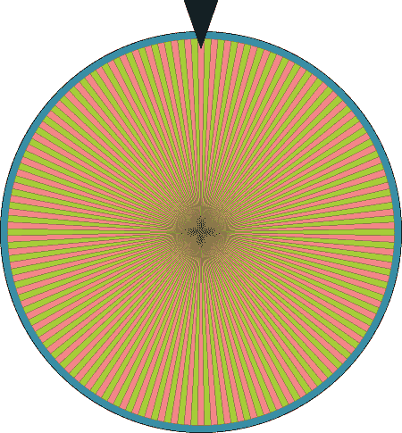

图 2-1：废品场老板的嘉年华轮盘。每个大小相等的扇区代表她场地中的一辆车。

一旦我们付钱，她就会旋转轮盘。当轮盘停止时，她记录下顶部的数字，然后带着拖车出去，把对应编号的车辆拖回来。我们拍照后，她将车辆送回废品场。如果我们想拍摄另一辆车，就再次付费，她再旋转轮盘，过程就这样重复。

假设我们的任务是拍摄五种不同类型的车：轿车、皮卡、厢式车、SUV 和旅行车。对于每种车，我们希望知道她旋转轮盘时，我们得到该类型车辆的概率。为了计算这一点，假设我们进入车场，检查每辆车，并将其分配到这五个类别中的一个。我们的结果如图 2-2 所示。

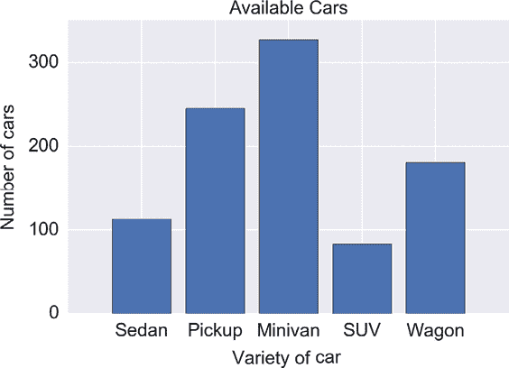

图 2-2：我们的废品场中有五种不同类型的车。每个条形显示了我们拥有的该类型车的数量。

在她的车场上，几乎有 950 辆车，其中最大数量的是迷你面包车，其次是皮卡车、旅行车、轿车和 SUV，按此顺序排列。由于车场上的每辆车被选中的机会是均等的，因此在每次转动轮盘时，我们最有可能选中迷你面包车。

但具体来说，获得迷你面包车的可能性*有多大*？为了确定获得每种类型车辆的可能性，我们可以将图 2-2 中每个条形的高度除以车辆的总数。这个数值给出了我们获得某种类型汽车的概率，如图 2-3 所示。

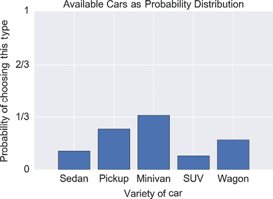

图 2-3：获得废品场中每种类型汽车的概率

要将图 2-3 中的数值转换为百分比，我们将它们乘以 100。例如，迷你面包车条形的高度约为 0.34，因此我们说获得迷你面包车的概率是 34%。我们说每个条形的高度是我们获得那种类型车辆的*概率*。如果我们将所有五个条形的高度相加，我们会发现总和是 1.0。这说明了将任何数字列表转化为概率的规则：数值必须介于 0 和 1 之间，且总和为 1。

我们将图 2-3 称为*概率分布*，因为它将获得某种车辆的 100%概率分配到所有可选项中。我们有时也说图 2-3 是图 2-2 的*归一化*版本，这意味着所有数值相加的结果是 1。

我们可以使用我们的概率分布来绘制一个简化版的嘉年华轮盘，如图 2-4 所示。

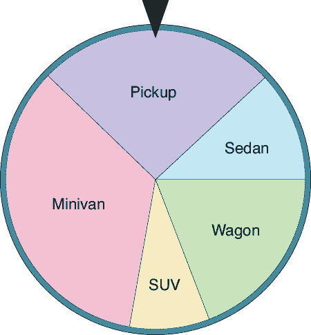

图 2-4：一个简化版的嘉年华轮盘，告诉我们如果车主转动图 2-1 的大轮盘，我们会获得哪种类型的车辆

轮盘的指针停在某个区域的概率由该区域所占轮盘周长的比例决定，这个比例与图 2-3 中显示的比例相同。

大多数时候，在我们生成计算机上的随机数时并没有嘉年华轮盘。相反，我们依赖软件来模拟这一过程。例如，我们可能将一个数值列表（如图 2-3 中条形的高度）传递给一个库函数，并要求它返回一个值。我们期望大约 34%的时间会返回迷你面包车，大约 26%的时间会返回皮卡车，依此类推。

从一系列具有各自概率的选项中随机选一个值的工作需要一些操作。为了方便，我们将这个选择过程封装成一个概念化的过程，称为*随机变量*。

这个术语可能会让程序员感到困惑，因为程序员通常将变量视为一个有名称的存储单元，可以用来存储数据。在这个上下文中，随机变量不是一个存储单元，而是一个*函数*（维基百科 2017b），它接受一个概率分布作为输入，并产生一个单一的值作为输出。从分布中选择一个值的过程叫做*从随机变量中抽取*一个值。

我们称图 2-3 为概率分布，但我们也可以将其视为一个函数。我们调用该函数，它会根据这些概率返回某一种类型的车辆。这个概念引出了分布的两个更正式的名称。当只有有限数量的可能返回值时，比如图 2-3 中的五个值，我们有时会使用斜体名称*概率质量函数*或*pmf*（这个缩写通常写为小写）。pmf 有时也被称为*离散概率分布*（在这个术语末尾加上*函数*是可选的）。这些术语旨在提醒我们，只有固定数量的可能输出。

我们可以轻松创建连续的概率分布。当我们初始化神经网络中的值时，我们使用这些函数的近似值。做个类比，假设我们想知道废车场商人带给我们的每辆车剩下多少油。油量是一个连续变量，因为它可以取任何实数。图 2-5 展示了我们的油量测量的连续图表。这个图表告诉我们，不仅仅是几个特定值的概率，而是任何实数值的概率，这些值位于 0（空）和 1（满）之间。

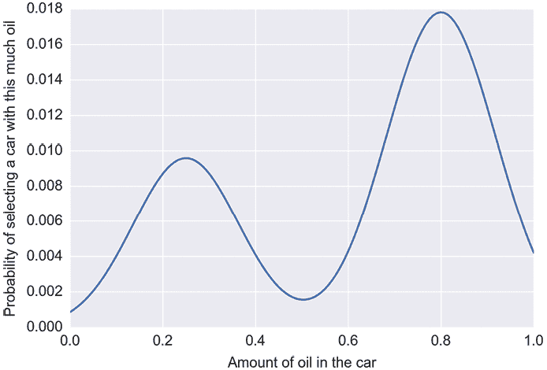

图 2-5：连续范围值的概率分布

如图 2-5 所示的分布被称为*连续概率分布*（或*cpd*），或*概率密度函数*（或*pdf*）。有时，人们会随意使用概率密度函数或 pdf 来指代离散分布，而不是连续分布。通常情况下，上下文会清楚地表明是指哪种解释。

回想一下，对于离散情况，所有可能的返回值需要加起来为 1。在连续情况下，如图 2-5 所示，这意味着曲线下方的面积为 1。

大多数时候，我们通过选择一个分布，然后调用一个库函数来从该分布中生成一个值，从而获得随机数（即，从我们给定的分布中抽取一个随机变量）。当我们需要时，可以自己创建分布，但大多数库提供了一些已经被证明适用于大多数情况的分布。这样，我们只需在选择随机数时使用这些预构建的分布之一。让我们来看一下这些分布。

## 一些常见的分布

我们之前提到过，可以从一个分布中抽取一个随机变量。每次抽取随机变量时，它会根据分布的规律取一个数值：在分布中对应值较大的数字比对应值较小的数字更可能出现。这使得分布具有很大的实际价值，因为不同的算法会希望使用具有特定概率值的随机变量。为此，我们只需要选择一个合适的分布。

### 连续分布

以下大多数分布都是由主要库提供的内置例程，因此它们易于指定和使用。为了简便起见，我们将演示以下两个分布的连续形式。大多数库为我们提供了连续版本和离散版本的选择，或者它们可能提供一个通用例程，根据需要将任何连续分布转换为离散分布，反之亦然。我们将在后面的部分讨论一些离散分布。

#### 均匀分布

图 2-6 显示了*均匀分布*。基本的均匀分布在 0 到 1 之间的取值为 1，其他地方的取值为 0。

在图 2-6 中，可能看起来在 0 和 1 处各有两个值，但实际上并没有。我们的约定是，开放圆圈（如下线所示）表示“该点不属于该线”，而闭合圆圈（如上线所示）表示“该点属于该线”。因此，在输入值为 0 和 1 时，图形的输出值为 1。这是一种常见的函数定义方式，但有些实现可能会将其中一个或两个输出值设为 0。因此，检查非常重要。

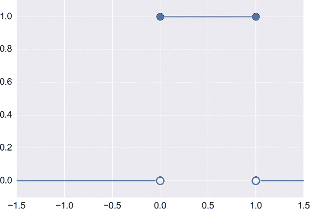

图 2-6：均匀分布的示例

这个分布有两个关键特征。首先，我们只能得到 0 到 1 之间的值，因为所有其他值的概率为 0。第二，在 0 到 1 的范围内，每个值的概率是相同的。我们得到 0.25、0.33 或 0.793718 的概率是一样的。我们说图 2-6 是*均匀*的，或*常数*的，或*平坦*的，在 0 到 1 的范围内，这三种说法都意味着该范围内的所有值的概率是相同的。我们还说它是*有限*的，意味着所有非零值都在某个特定的范围内（也就是说，我们可以确定 0 和 1 是它能返回的最小值和最大值）。

为我们创建均匀分布的库函数通常允许我们选择非零区域的起始点和结束点。除了默认的 0 到 1 范围外，最流行的选择可能是−1 到 1 的范围。库会处理诸如调整函数高度以确保面积始终为 1.0 等细节（回想一下，如果图形要表示一个概率分布，这是必需的）。

#### 正态分布

另一个常用的分布是*正态分布*，也叫做*高斯分布*，或简单地称为*钟形曲线*。与均匀分布不同，它是平滑的，没有尖锐的角或突兀的跳跃。

图 2-7 展示了几个典型的正态分布。

图 2-7 中的所有四条曲线具有相同的基本形状。它们的形状之所以不同，是因为我们对曲线进行了缩放、水平移动，或两者同时进行。对于这些插图，我们没有对曲线进行缩放，使得曲线下面的面积之和为 1。

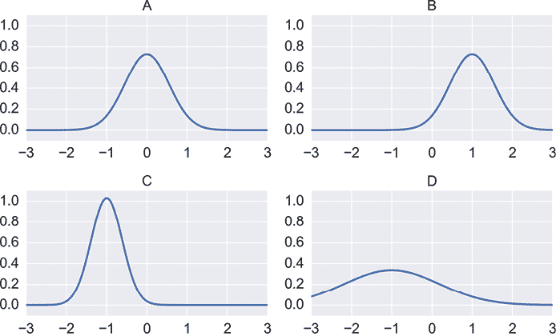

图 2-7：一些正态分布

图 2-8 展示了通过从每个分布中抽取值得到的一些代表性样本。它们在分布值高的地方聚集（即，在该值处抽到样本的概率较高），在分布值低的地方则较为稀疏（即，在该值处抽到样本的概率较低）。红点的垂直位置仅为了使样本更容易观察而进行了抖动，没有实际意义。

图 2-8：每个红色圆圈表示从其正态分布中抽取的一个样本的值。

正态分布在几乎所有地方都接近 0，除了它在某个区域平滑地上升形成凸起。尽管值在凸起两侧逐渐趋近于 0，但永远不会真正达到 0。因此我们说这个分布的宽度是*无限的*。实际上，我们通常将接近 0 的任何值视为 0，从而得到一个有限的分布。在讨论正态分布时，还会出现一些其他术语。由正态分布的随机变量产生的值有时称为*正态偏差*，并且说这些值是*正态分布的*。我们也说这些值*符合*或遵循正态分布。

每个正态分布由两个数字定义：*均值*和*标准差*。均值告诉我们凸起中心的位置。图 2-9 展示了图 2-7 中的四个高斯分布及其均值。这是正态分布的许多优良性质之一：其均值也是中位数和众数。

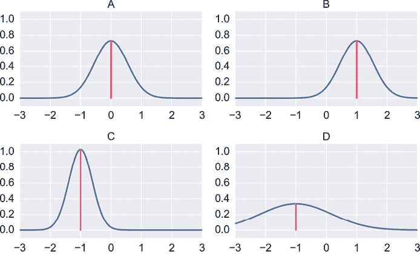

图 2-9：正态分布的均值是凸起中心的位置，这里用红线表示。

*标准差*也是一个数字，通常用小写希腊字母σ（西格玛）表示，它告诉我们凸起的宽度。可以想象从凸起的中心开始，向外对称移动，直到包围了曲线下面约 68%的总面积。凸起中心到这些端点的距离叫做该曲线的*一个标准差*。图 2-10 展示了我们的四个高斯分布，其中一个标准差范围内的区域用绿色阴影表示。

我们可以使用标准差来表征一个凸起：当标准差较小时，意味着凸起较窄；当标准差增大时，凸起在水平方向上变得更加宽广。

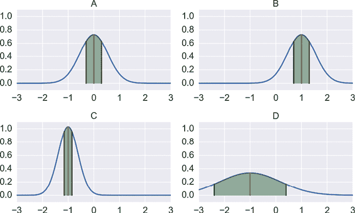

图 2-10：一些正态分布，其中一个标准差内的区域用绿色阴影标出

如果我们从中心对称地再往外走一个标准差（也就是相同的距离），那么我们就涵盖了大约 95%的曲线下方的区域，如图 2-11 所示。再往外走一个标准差，我们就涵盖了大约 99.7%的曲线下方的区域，这也在图 2-11 中展示了。这一特性有时被称为*三西格玛规则*，因为标准差使用的是符号σ。它有时也被称为*68-95-99.7 规则*，这个名字听起来也很有吸引力。

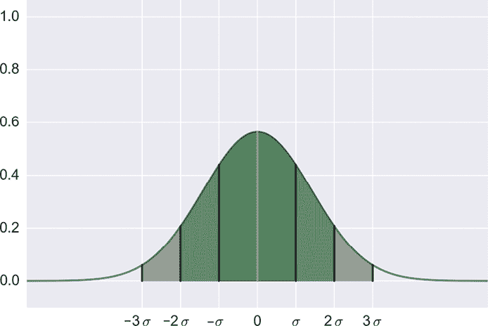

图 2-11：三西格玛规则，或 68-95-99.7 规则

假设我们从任何正态分布中抽取 1000 个样本。我们会发现，大约 680 个样本的值距离该分布的均值不超过一个标准差，即在范围−σ到σ之间；大约 950 个样本的值在两个标准差范围内，即在−2σ到 2σ之间；大约 997 个样本的值在三个标准差范围内，即在−3σ到 3σ之间。

总结一下，均值告诉我们曲线的中心在哪里，而标准差告诉我们曲线的分布范围有多广。标准差越大，曲线就越宽，因为 68%的临界值离中心越远。

有时人们会使用一个不同但相关的值，称为*方差*，而不是标准差。方差就是标准差的平方（即标准差乘以自身）。这个值在计算中有时更为方便。尽管如此，它的一般解释是相同的：方差较大的曲线比方差较小的曲线更为分散。

正态分布在机器学习和其他领域中经常出现，因为它自然地描述了许多现实世界的观察结果。如果我们测量某一地区成年公马的身高，或是向日葵的大小，或者果蝇的寿命，我们会发现这些数据往往呈现出正态分布的形态。

### 离散分布

现在让我们看一下两个离散分布。

#### 伯努利分布

一个有用但特殊的离散分布是*伯努利分布*（发音为 ber-noo′-lee）。该分布只返回两个可能的值：0 和 1\。伯努利分布的常见例子是掷硬币时获得正面或反面的概率。我们通常用字母 *p* 来描述得到 1（假设是正面）的概率。如果忽略硬币侧立等特殊情况，正反面的概率之和必须等于 1，这意味着得到 0（或反面）的概率是 1 − *p*。图 2-12 以图形方式展示了公平硬币和加权硬币的概率。由于我们只有两个值，所以我们可以将伯努利分布绘制为柱状图，而不是我们在连续分布中看到的线条和曲线。

使用分布语言来处理这么简单的情况可能看起来有些过度，但它的好处在于我们可以与从分布中生成值的库例程一起使用它。我们可以将一个均匀分布、正态分布或伯努利分布传递给我们的例程，它将根据分布的概率返回一个从该分布中抽取的值。这使得编程变得更加容易。

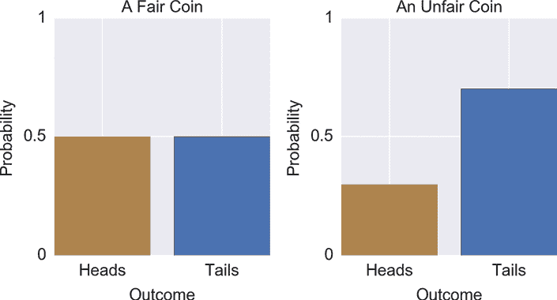

图 2-12：伯努利分布告诉我们抽取 0 或 1 的概率。左侧：公平硬币。右侧：不公平硬币。

#### 多项伯努利分布

伯努利分布只返回两种可能的值。但假设我们正在进行一个实验，实验的结果可以是多个可能性中的任何一种。例如，除了抛硬币只会出现正面或反面，我们可能会掷一个 20 面的骰子，它可以显示 20 个不同的值中的任何一个。

为了模拟掷骰子的结果，我们的随机变量可以返回一个从 1 到 20 之间的整数。但在其他情况下，拥有一个可能值列表也很有用，其中除了我们抽取的条目，其余所有条目的概率值都是 0，而抽中的条目的概率是 1\。这样的列表在我们构建机器学习系统时非常有用，可以用来将输入分类为不同的类别——例如，描述照片中出现的是 10 种不同动物中的哪一种。

假设我们有一张鳄鱼的照片，并且这是我们列表中的第五个条目。如果我们的算法无法确定图像是什么，我们可能会得到类似于图 2-13 左侧的结果，其中识别出了三种动物作为可能性。我们希望系统能够输出右侧的结果，其中除了鳄鱼的值为 1 外，其他每个条目的值都为 0\。

以这种方式表示从列表中选择一个单一选项是训练具有两个以上类别的分类器的关键步骤。我们将在第六章中回到这个想法，它是一个名为*交叉熵*的概念的组成部分。

因为图 2-13 中的每个分布都是将二项分布的两个结果推广到多个结果的泛化，我们可以称之为“多项伯努利分布”，但我们将这些词组合在一起，创造了一个新词，称之为*多项伯努利分布*（有时也叫做较为平淡的*分类分布*）。

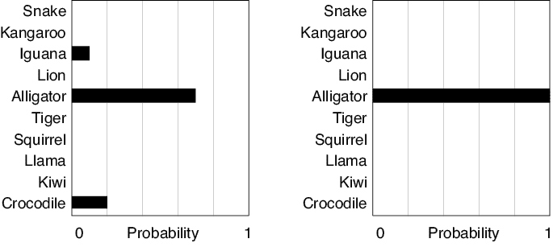

图 2-13：左：鳄鱼图片的可能预测概率。右：我们期望的概率。

## 随机值的集合

我们已经看到如何从分布中生成随机值。我们通过该分布的概率来抽取值，从而确定哪些返回值比其他值更可能被选中。

当我们从一个或多个随机变量中抽取了大量值时，通常需要对这些值进行描述，以便我们可以将其作为一个整体来讨论。让我们来看三个在机器学习中常出现的相关概念。

### 期望值

如果我们从任何一个概率分布中选取一个值，然后再选取另一个，再选取另一个，随着时间的推移，我们会积累一长串的值。

如果这些值是数字，那么它们的均值称为*期望值*。这对于许多应用来说是有用的信息。举个简单的例子，我们可能需要在-1 到 1 之间生成随机数，且正负值大致相等。如果随机变量的期望值为 0，那么我们就知道我们得到了一个平衡的值集。

请注意，期望值可能并不是从分布中抽取的值之一！例如，如果 1、3、5 和 7 是唯一的值，且它们的概率相等，那么我们用来从该列表中抽取值的随机变量的期望值为（1 + 3 + 5 + 7）/ 4 = 4，这个值在分布中是无法抽取到的。

### 依赖性

到目前为止，我们看到的随机变量彼此之间完全没有关联。当我们从某个分布中抽取一个值时，之前是否抽取过其他值并不重要。每次抽取新的随机变量时，都是一个全新的世界。

我们称这些为*独立*变量，因为它们之间没有任何依赖关系。这是最容易处理的随机变量类型，因为我们不需要担心如何管理两个或更多随机变量可能相互影响。

相比之下，存在*依赖*变量，它们之间相互依赖。例如，假设我们有几种动物的毛发长度分布：狗、猫、仓鼠等等。我们可能首先从动物列表中随机选择一种动物，然后使用该动物来选择适当的毛发长度分布。接着，我们从该分布中抽取一个值，以找到该动物的毛发长度。动物的选择不依赖于任何其他因素，因此它是一个独立变量。但毛发长度依赖于我们使用的分布，而该分布又取决于我们选择了哪种动物，因此毛发长度是一个依赖变量。

### 独立同分布变量

许多机器学习技术的数学和算法都是设计来处理从具有相同分布的随机变量中抽取的多个值，并且这些值彼此独立。也就是说，我们反复从同一个分布中抽取值，并且连续的值之间没有关系。实际上，一些算法要求我们以这种方式生成随机值，而其他算法则在这种方式下效果最好。

这一要求非常常见，以至于这些变量有一个专门的名称：*i.i.d.*，表示*独立同分布*（这个缩写不常见，因为通常会以小写字母书写，并且字母之间有点号）。例如，我们可能会看到某个库函数的参数这样描述：“确保连续的输入是 i.i.d.”。

*同分布*这个词只是简洁地表达“从相同的分布中选择”的意思。

## 抽样与替换

在机器学习中，通常会通过随机选择现有数据集中的一些元素来构建新的数据集。我们将在下一节中进行这种操作，寻找一组样本的均值。让我们看两种方法，如何从一个起始对象池中选择并创建一个选择列表。

### 带替换的选择

让我们先来看一种方法，其中我们对每个选中的项目进行复制，这样原始项目保持不变，如图 2-14 所示。我们称这种方法为*带替换的选择*，或者*SWR*，因为我们可以把它理解为移除物体，制作副本并替换原物。

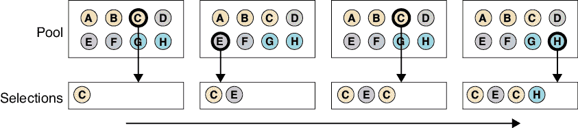

图 2-14：带替换的选择

带替换选择的一个含义是我们可能会多次得到相同的物体。在极端情况下，我们的新数据集可能完全由相同物体的多个副本组成。第二个含义是我们可以创建一个比原始数据集小、新数据集与原始数据集相同大小，甚至更大的数据集。由于原始数据集从未被更改，我们可以继续选择元素，直到我们满意为止。

这一过程的统计含义是我们的选择是*相互独立*的。没有历史记录，所以我们的选择完全不受之前选择的影响，也不影响未来的选择。为了说明这一点，请注意，图 2-14 中的池（或起始数据集）始终包含八个物体，因此每个物体被选中的几率是 1/8。在图中，我们首先选择了元素 C。现在我们新数据集里包含了 C 元素，但在选择后我们将该元素重新放回了池中。当我们再次查看池时，所有八个项目依然存在，如果我们再次选择，每个项目依旧有 1/8 的机会被选中。

一个日常的放回抽样近似是去一个备货充足的咖啡店点单。如果我们点了一杯香草拿铁，它并不会从菜单中被移除，而是继续供下一个顾客选择。

### 不放回抽样

另一种随机选择新数据集的方法是从原始数据集中移除我们的选择，并将其放入新数据集中。我们不进行复制，因此原始数据集就失去了一个元素。这种方法叫做*不放回抽样*，或*SWOR*，如图 2-15 所示。

一个日常的非放回抽样例子是玩扑克牌等卡牌游戏。每次发牌时，卡片会被从牌堆中移除，不能再被发出（直到牌被收集并洗牌）。

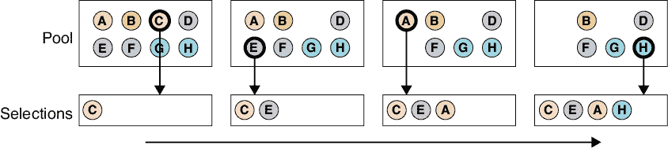

图 2-15：不放回抽样

让我们将不放回抽样（SWOR）与放回抽样（SWR）的含义进行比较。首先，在不放回抽样中，任何物品不能被选中超过一次，因为我们将其从原始数据集中移除。其次，我们的新数据集可能比原始数据集小，或者大小相同，但绝不会更大。第三，我们的选择现在是相互依赖的。在图 2-15 中，每个元素最初有相同的 1/8 的机会被第一次选中。当我们选择了 C 项时，它并未被放回。当我们进行下一次选择时，只有七个元素可供选择，每个元素现在有 1/7 的机会被选中。选择其中任何一个元素的几率增加了，因为竞争选择的元素减少了。如果我们再选择一个项目，其余的元素每个有 1/6 的机会被选中，依此类推。在我们选择了七个项目后，最后一个项目在下一次选择中有 100%的概率被选中。

继续比较，假设我们想要创建一个比原始数据池更小的数据集。我们可以选择有放回抽样或无放回抽样。但是有放回抽样可以生成比无放回抽样更多的可能新集合。为了说明这一点，假设我们在原始数据池中只有三个物体（我们称它们为 A、B 和 C），并且我们想要一个包含两个物体的新集合。无放回抽样只能给我们三个可能的新集合：(A,B)、(A,C) 和 (B,C)。有放回抽样则给我们这三个集合，还包括(A,A)、(B,B) 和 (C,C)。一般来说，有放回抽样总是能给我们更多可能的新集合。

## 自助法

让我们来看一个刚才提到的无放回和有放回抽样算法的实用应用。

有时候我们想了解一些数据集的统计信息，而这些数据集太大，以至于我们无法在实践中处理。例如，假设我们想知道当前全球所有人的平均身高。实际上，根本没有办法测量每个人。通常，我们会通过提取数据集中的一个具有代表性的部分，然后进行测量来回答这类问题。我们可能会找出几千个人的身高，并希望这些测量值的平均值接近于我们如果能够测量每个人时得到的平均值。

假设我们把全世界的每个人都看作我们的*总体*。由于人数太多，无法直接操作，我们将收集一个合理规模的群体，期望它能够代表这个总体。我们称这个较小的群体为*样本集*。我们将在没有放回的情况下构建这个样本集，因此每次从总体中选择一个值（即一个人的身高）时，它会从总体中移除，放入样本集中，并且不能再被选择。

我们希望通过仔细构建我们的样本集，使其在我们想要衡量的属性上能够合理地代表整个总体。图 2-16 展示了一个包含 21 个圆圈数字的总体的构思。样本集包含了来自该总体的 12 个元素。

图 2-16：通过无放回抽样从总体中创建样本集

现在我们将测量样本集的平均值，并将其作为总体平均值的估计。在这个小例子中，我们可以计算出总体的平均值，约为 4.3。而我们的样本集的平均值约为 3.8。虽然这两者的匹配不是很完美，但也并不算非常偏差。

大多数时候我们无法测量总体（这也是我们首先要建立样本集的原因）。通过计算样本集的均值，我们得到了一个近似值，但这个值有多准确呢？我们应该依赖这个值作为对整个总体的良好估计吗？很难说。如果我们能将结果表示为**置信区间**，情况就会更好。这让我们能够做出类似“我们有 98%的把握，总体均值在 3.1 到 4.5 之间”的陈述。为了做出这样的陈述，我们需要知道范围的上下界（在这里是 3.1 和 4.5），并且知道我们有多大的信心认为值位于该范围内（在这里是 98%）。通常，我们会根据任务需求选择所需的置信度，然后从中找出相应范围的上下值。

我们希望能够对均值或我们感兴趣的任何统计量做出类似的陈述。我们可以通过**自助法**（Efron 和 Tibshirani 1993; Teknomo 2015）来实现这一点，该方法包括两个基本步骤。第一个步骤是我们在图 2-16 中看到的步骤，即使用**不放回抽样**从原始总体中创建一个样本集。第二个步骤是对样本集进行重抽样，生成新的样本集，这次使用**放回抽样**。每个新的样本集都叫做一个**自助抽样**。这些自助抽样是我们构建置信度声明的关键。

要创建一个自助抽样，我们首先决定从起始样本集中选取多少个元素。我们可以选择任何数量，最多为样本集中的元素数量，尽管我们通常只选取较少的元素。一旦我们确定了选取的数量，就会从样本集中随机抽取这么多元素，且允许放回抽样，因此有可能会多次抽取到相同的元素。这个过程在图 2-17 中有所示。

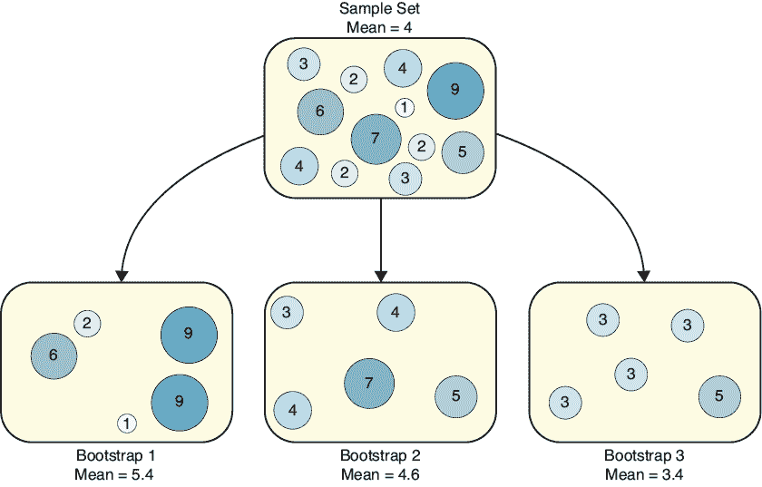

图 2-17：使用**放回抽样**创建三个自助抽样并求出它们的均值

总结一下，我们从一个总体开始。我们通过**不放回抽样**从总体中抽取一个样本集。接着，我们使用**放回抽样**从这个样本集生成自助抽样。最后一步需要使用放回抽样，因为我们可能想要生成与样本集大小相同的自助抽样。在我们的示例中，我们可能希望我们的自助抽样包含 12 个值。如果不使用放回抽样，那么每个自助抽样将与样本集完全相同。

如果我们真的希望找到全世界每个人的平均身高，我们需要比 21 个测量值多得多的样本。让我们增加样本量，并大幅缩小它们的范围。为了方便起见，我们将聚焦于两个月大婴儿的身高。它们通常约为 500 厘米长，因此我们创建了一个模拟的 5,000 个测量值的种群，长度从 0 到 1,000 毫米（即 1 米，约 3.2 英尺）。从这个种群中，我们随机抽取了 500 个测量值作为样本集，然后创建了 1,000 个自助法样本，每个样本包含 20 个元素。图 2-18 展示了每个大约 100 个不同区间中，每个区间内具有均值的自助法样本的数量，这些区间的范围从 0 到 1,000（几乎没有均值低于 200 或高于 800）。像这样的图形几乎总是呈现近似的钟形曲线，因为自助法的特性使得更多的样本均值靠近真实均值，而远离真实均值的样本较少。

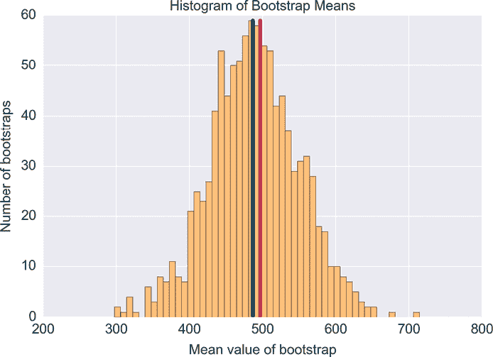

图 2-18：直方图显示了有多少自助样本的均值为给定值。大约 490 的蓝色条是样本集的均值。大约 500 的红色条是种群的均值。

由于我们是创建数据的，因此我们知道种群的均值是 500。我们的样本集的均值接近这个值，大约为 490。自助法的目的是帮助我们确定应该多大程度上信任这个 490 的值。虽然不深入数学计算，自助样本均值的近似钟形曲线已经能告诉我们所有需要知道的信息。假设我们想找到我们有 80％信心包含种群均值的区间，那么我们只需要切掉自助法样本值中最低和最高的 10％，留下中间的 80％（Brownlee 2017）。图 2-19 显示了一个框，正是做了这件事，封闭了我们 80％信心认为包含真实值的区间，我们知道真实值是 500。从图表中读取，我们现在可以说：“我们有 80%的信心，原始种群的均值在大约 410 到 560 之间。”

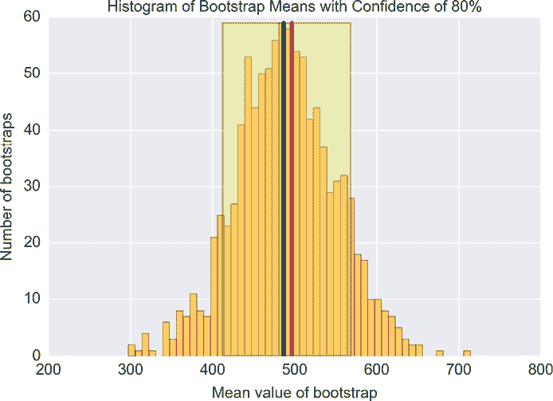

图 2-19：我们有 80%的信心，这个框包含了种群的均值。

自助法具有吸引力，因为我们通常可以使用小型自助样本，可能每个样本只有 10 个或 20 个元素，即使在具有数百万测量值的大型种群中也适用。由于每个自助样本都很小，构建和处理通常比较快。为了弥补样本小的不足，我们通常会创建数千个自助样本。我们构建的自助样本越多，结果就越像一个高斯分布的峰值，我们对置信区间的精确度也可以越高。

## 协方差与相关性

有时候，变量之间可能会相互关联。例如，一个变量可能告诉我们外面的温度，另一个变量则是降雪的几率。当温度非常高时，降雪的几率为零，因此了解其中一个变量可以告诉我们关于另一个变量的信息。在这种情况下，关系是*负相关*的：温度上升时，降雪几率下降，反之亦然。另一方面，我们的第二个变量可能告诉我们预计在本地湖泊中游泳的人数。温度和游泳人数之间的关系是*正相关*的，因为在较暖的日子里我们会看到更多的游泳者，反之亦然。

能够发现这些关系并衡量它们的强度是很有用的。例如，假设我们计划教授一个算法来从数据集中提取信息。如果我们发现数据中的两个值密切相关（例如温度和降雪几率），我们可能能够从数据中删除其中一个变量，因为它是冗余的。这可以提高我们的训练速度，甚至改善我们的结果。

在这一部分，我们将介绍一个叫做*协方差*的度量，它由数学家们开发，用来让我们确定这些关系的强度。我们还将看到一种变体，叫做*相关性*，它通常更有用，因为它不依赖于涉及的数字大小。

### 协方差

假设我们有两个变量，并且注意到它们之间存在特定的数值模式。当任何一个变量的值增加时，另一个变量增加该量的固定倍数，反之亦然。举个例子，假设变量 A 增加了 3，变量 B 增加了 6。然后，B 增加了 4，A 增加了 2。接着 A 减少了 4，B 减少了 8。在每个例子中，B 的增减都等于 A 增减的两倍，因此我们的*固定倍数*是 2。

如果我们看到这样的关系（对于任何倍数，而不仅仅是 2），我们说这两个变量*协变*。我们用一个叫做*协方差*的数字来衡量两个变量之间的关系强度，或者它们协变的一致性。如果我们发现当一个值增加或减少时，另一个值按可预测的量做出相同的变化，那么协方差是一个正数，我们说这两个变量表现出*正协方差*。

传统上，讲解协方差的方式是绘制二维图点，如图 2-20 所示。在这里我们看到两组不同的协变点。每个点都有 x 和 y 坐标，但这些坐标仅仅是我们想要比较的两个变量的代表。y 的变化越一致地跟随 x 的变化，协方差就越强。

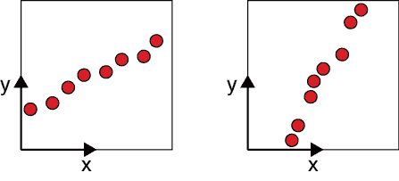

图 2-20：每个图示展示了具有正协方差的不同点集。

在图 2-20 的左侧，水平相邻的每一对点之间的 y 值变化大致相同。这是正协方差。在右侧，y 值的变化在每对点之间稍有不同，表示较弱的正协方差。非常强的正协方差告诉我们，这两个变量是一起变化的，因此每当其中一个变量按给定量变化时，另一个变量会以一致且可预测的量变化。

如果一个值在另一个值增加时减少，我们称这两个变量具有*负协方差*。图 2-21 展示了两组具有负协方差的点。

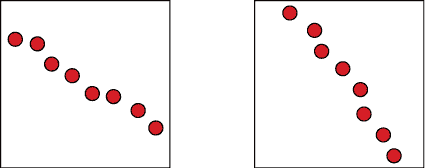

图 2-21：每个图示展示了一组具有负协方差的点。

如果两个变量没有这种一致匹配的变化，那么协方差为零。图 2-22 展示了一些例子。

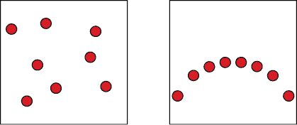

图 2-22：这些数据点的每一组都具有零协方差。

我们对协方差的理解只捕捉到变量之间在它们的变化是彼此倍数关系时的关系。图 2-22 右侧的图表显示数据中可以有明显的模式（这里点的形状构成了一个圆的一部分），但协方差仍然为零，因为它们的关系如此不一致。

### 相关性

协方差是一个有用的概念，但它有一个问题。由于它的数学定义方式，它没有考虑到两个变量单位之间的关系，这使得我们很难比较不同协方差的强度。例如，假设我们测量了一打描述吉他的变量：木材的厚度、琴颈的长度、音符的共鸣时间、弦的张力等等。我们可能会找到这些测量值之间的协方差，但无法有意义地比较协方差的大小，以找出哪些对变量之间的关系最强或最弱。甚至尺度也很重要：如果我们找到一对测量值的协方差单位是厘米，而另一对测量值的协方差单位是英寸，我们无法比较这两个值，以确定哪一对的协方差更强。

协方差的*符号*是我们唯一能够了解的信息：正值表示正相关，负值表示负相关，零表示无关。仅仅有符号是不够的，因为我们实际上想要比较不同变量集之间的关系。这样我们可以找出哪些变量之间正相关最强或负相关最强。然后，我们可以根据这些信息来缩小数据集的规模，例如，通过删除一个或多个强相关对中的一个测量值。

为了获得一个可以进行比较的度量，我们可以计算一个稍微不同的数值，叫做*相关系数*，或者简称*相关性*。这个值从协方差开始，但包括了一步额外的计算。结果是一个不依赖于所选变量单位的数字。我们可以把相关性看作协方差的缩放版本，总是给我们一个介于 −1 和 1 之间的值。+1 的值告诉我们存在*完全正相关*，而 −1 的值则告诉我们存在*完全负相关*。

完全正相关很容易辨认：所有的点都落在沿东北-西南方向移动的直线上一，如图 2-23 所示。

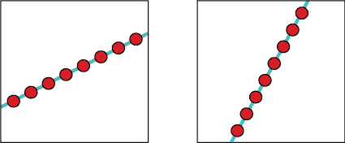

图 2-23：显示完全正相关，或相关系数为 +1 的图形

什么样的点之间的关系会给我们一个正相关，但在 0 和 1 之间的某个范围内？这是一个 y 值随着 x 值持续增加，但比例不会保持恒定的情况。我们可能无法预测它变化的程度，但我们知道 x 增加会导致 y 增加，x 减少会导致 y 减少。图 2-24 显示了相关系数在 0 和 1 之间的正值的一些点图。点越接近落在一条直线上，相关值就越接近 1。我们说，如果值接近零，则相关性是*弱*（或*低*），如果接近 0.5，则是*中等*，如果接近 1，则是*强*（或*高*）。

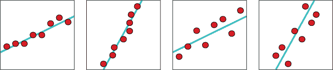

图 2-24：从左到右显示减少的正相关例子

现在让我们来看一下零相关值。零相关意味着一个变量的变化与另一个变量的变化之间没有关系。我们无法预测会发生什么。回想一下，相关性只是协方差的缩放版本，因此当协方差为零时，相关性也为零。图 2-25 展示了一些具有零相关的数据。

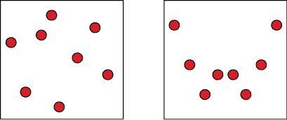

图 2-25：这些模式具有零相关性。

负相关就像正相关一样，只是变量朝相反的方向移动：当 x 增加时，y 减少。图 2-26 展示了一些负相关的例子。就像正相关一样，如果值接近零，则相关性是*弱*（或*低*），如果接近 −0.5，则是*中等*，如果接近 −1，则是强（或*高*）。

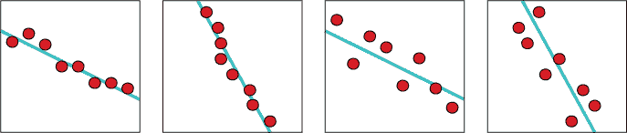

图 2-26：从左到右显示减少的负相关例子

最后，图 2-27 展示了完全负相关，或相关系数为 −1 的情况。

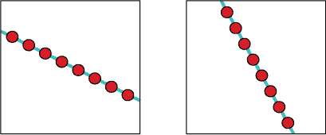

图 2-27：这些模式具有完全负相关，或相关系数为 −1。

还有一些其他术语值得一提，因为它们在文档和文献中时常出现。我们之前讨论的两个变量之间的关系通常称为*简单相关*。然而，我们可以研究多个变量之间的关系，这被称为*多重相关*。如果我们有一堆变量，但我们只研究其中两个变量如何相互影响，这叫做*偏相关*。

当两个变量之间具有完美的正相关或负相关（即 +1 和 −1 的值）时，我们说这两个变量是*线性相关*的，因为（正如我们所看到的）这些点都在一条直线上。任何其他相关值描述的变量都被称为*非线性相关*。

图 2-28 总结了线性相关性不同值的含义。

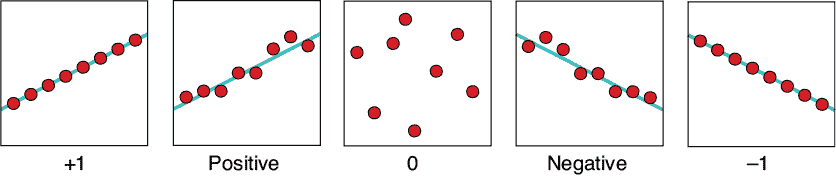

图 2-28：总结线性相关性不同值的含义

## 统计数据并不能告诉我们一切

本章中我们看到的统计数据确实能告诉我们关于数据集的很多信息，但我们不应假设统计数据能告诉我们一切。一个著名的例子，展示了统计数据如何欺骗我们，是由四组不同的二维点组成的。这些数据集看起来彼此毫不相似，但它们都具有相同的均值、方差、相关性和直线拟合。这些数据被称为*安斯科姆四重奏*，以发明这些数据值的数学家安斯科姆命名（Anscombe 1973）。这四个数据集的数值在网上广泛可见（Wikipedia 2017a）。

图 2-29 显示了这个四重奏中的四个数据集，以及最适合每个数据集的直线。

这四个不同的数据集的一个惊人之处在于，它们共享许多相同的统计量。每个数据集中的 x 值的均值是 9.0。每个数据集中的 y 值的均值是 7.5。每组 x 值的标准差是 3.16，每组 y 值的标准差是 1.94。每个数据集中 x 和 y 之间的相关性为 0.82。每个数据集的最佳直线通过 Y 轴截距为 3，斜率为 0.5。

换句话说，这七个统计量对于这四组点几乎都有相同的值（当我们进一步查看更多的数字时，某些统计量会有所不同）。如果我们仅仅根据这些统计量，就会认为这四个数据集是相同的。

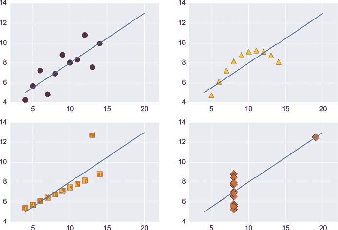

图 2-29：安斯科姆四重奏中的四个数据集及其最佳拟合直线

图 2-30 将所有四组点及其最佳直线近似叠加在一起。四条线相同，所以在图中我们只看到一条线。

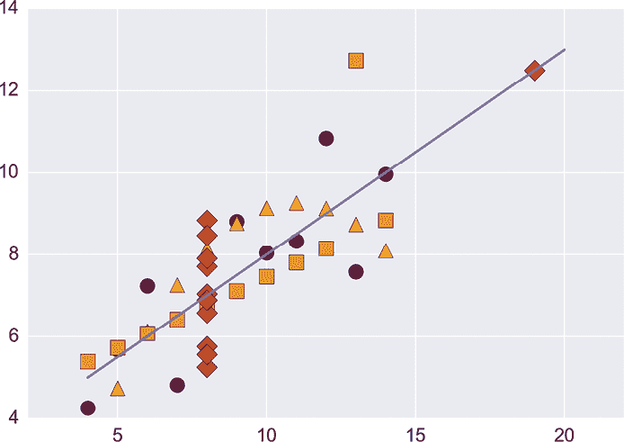

图 2-30：安斯科姆四重奏的四个数据集及其最佳直线拟合，叠加显示

这四组数据，虽然很著名，但并不特殊。如果我们想要制作更多具有相同（或近似相同）统计特征的不同数据集，我们可以随意制作多少组都可以（Matejka 和 Fitzmaurice 2017）。这个道理是，我们不应假设统计数据能告诉我们任何数据集的完整故事。

每当我们处理一组新的数据时，花时间了解它总是值得的。这可以包括计算统计数据，但调查过程通常还包括绘制图表和其他可视化内容。一般来说，理解数据越深，我们设计和训练算法从数据中学习的效果就会越好。

## 高维空间

让我们再探讨一个与数字相关的话题。它更多的是一个概念，而不是一个统计工具，但它影响我们在进行统计分析、机器学习，或是处理大数据集时对数据的思考方式。

在机器学习中，我们通常将多个数字组合成一个单一的*样本*，或者数据片段。例如，我们可能会通过水果的重量、颜色和大小来描述一个水果。我们称每个数字为样本的*特征*。一张照片则可以描述为一个样本，其特征是描述每个像素颜色的数字。

我们经常谈论每个样本是某个巨大*空间*中的一个点。如果一个样本有两个特征，我们可以通过将一个特征与 X 轴关联，另一个特征与 Y 轴关联，把样本绘制成平面上的一个点或圆点。如果样本有三个特征，我们可以在三维空间中放置一个点。但我们通常有更多特征的样本。例如，一张宽 1000 像素、高 1000 像素的灰度照片由 1000 × 1000 个像素值描述。这是一百万个数字。我们无法在一个拥有一百万维的空间中画出一个点的图像，甚至无法想象这样的空间可能是什么样子，但我们可以通过类比我们熟悉的二维和三维空间来推理它。这是处理实际数据时一个重要的思维工具，所以让我们感受一下由大量特征占据的样本空间。

一般来说，空间的每个维度或轴对应样本中的一个特征。将所有特征（即所有数字）看作是一个列表是很有帮助的。如果我们有一个只有一个特征的数据（比如温度），那么我们可以用一个仅包含一个数字的列表来表示该特征。在视觉上，我们只需要显示一条线的长度来表示这个测量值的大小，如图 2-31 所示。我们称这条线为*一维空间*，因为从线上的任何一点开始，我们只能在一个维度或方向上移动。在图 2-31 中，这个方向是水平方向的。

图 2-31：一个只有单个值的数据只需要一个坐标轴或维度来绘制它的值。左：X 轴。右：一些数据点，用 X 轴上的点或者不同长度的线段表示。

如果我们在样本中有两条信息，比如温度和风速，那么我们需要一个长度为两个项的列表。为了绘制它，我们需要两个维度，每个维度对应一个测量值。在图形上，我们通常使用两个垂直的坐标轴，如图 2-32 所示。一个点的位置是先沿 X 轴按第一个测量值的量移动，然后沿 Y 轴按第二个测量值的量移动。我们说这是一个*二维空间*。

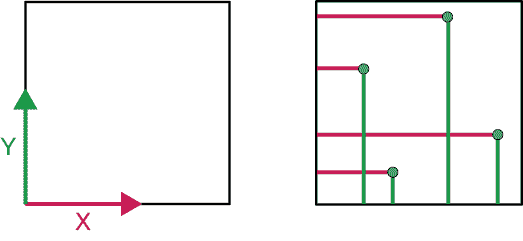

图 2-32：如果我们的数据有两个值，我们需要两个维度或坐标轴来绘制这些数据。

如果我们的样本中有三个值，那么我们使用一个包含三个值的列表。如同之前，每个值在我们将其绘制的空间中都有一个对应的维度。这三个维度可以通过三个坐标轴表示，如图 2-33 所示。我们称之为*三维空间*。

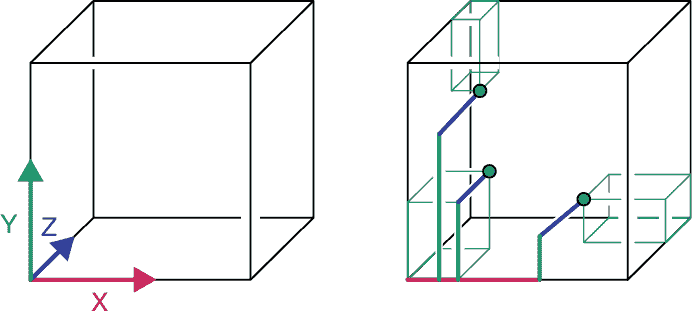

图 2-33：当每个数据点有三个值时，我们需要三个维度或坐标轴来绘制它。

如果我们有四个测量值呢？尽管有一些勇敢的尝试，但目前没有一种公认的方式可以绘制四维空间，特别是在二维的页面上（Banchoff 1990; Norton 2014; ten Bosch 2020）。而一旦我们涉及到五维、十维或百万维，绘制空间图像几乎就成了不可能完成的任务。

这些高维空间可能看起来很深奥且罕见，但实际上它们是很常见的，我们每天都能见到。正如我们所看到的，一个边长为 1,000 像素的灰度图像有一百万个值，等同于一百万维的空间。一个相同大小的彩色图像有三百万个值，所以它是一个位于三百万维空间中的点（或点）。我们根本无法绘制出如此多维的图像。我们甚至无法在脑海中构想出这样一个图像。然而，我们的机器学习算法可以像处理二维或三维空间一样轻松地处理这样的空间。数学和算法并不关心空间的维度有多少。

需要记住的关键点是，每一条数据都可以解释为某个广阔空间中的一个单独的点。就像一个二维（2D）点用两个数字来告诉我们它在平面上的位置一样，一个 750,000 维的点用 750,000 个数字来告诉我们它在那个巨大的空间中的位置。我们通常会为空间命名，以便跟踪它们描述的内容，所以我们可能会说我们的图像由*图像空间*中的一个单一点表示。

我们称具有许多维度的空间为*高维空间*。关于“高”从何时开始，并没有正式的共识，但这个短语通常用于描述那些具有超过我们可以合理绘制的三维空间的空间。当然，对于大多数人来说，几十个或几百个维度就足以被认为是高维空间。

本书中我们将使用的算法的一个重要优势是，它们能够处理具有任意维度的数据。当涉及到更多数据时，计算需要更多时间，但理论上，我们可以以与处理二维数据相同的方式处理具有 2000 个维度的数据（实际上，我们通常会根据数据集的维度对算法和数据结构进行调优，以确保它们在处理数据时最为高效）。

我们将经常处理可以看作是抽象高维空间中点的数据。我们不会深入探讨数学内容，而是依赖于我们刚才看到的概念的直观推广，将我们的空间看作是巨大的（且无法视觉化的）类比，类似于我们的直线、正方形和立方体，每个数据点都由某个庞大抽象空间中的一个点表示，在这个空间中，每个方向或维度都对应样本中的一个单一值。然而，我们需要小心不要过度依赖我们的直觉。在第七章中，我们将看到，高维空间并不总是像我们习惯的二维或三维空间那样表现。

## 总结

我们经常需要描述一组数字。统计学领域致力于找到描述这些集合的有用方法。在本章中，我们了解了基本的统计度量，它们将在整本书中对我们有帮助。我们看到，控制我们在机器学习中需要的数字类型的一个方便方法是使用分布，并且我们了解了一些有用的分布。

我们看到，我们可以选择有放回或无放回地从总体中抽取元素，这样会得到不同种类的集合。我们可以使用许多这样的集合或自助法（bootstraps）的统计数据，来估计起始总体的统计数据。我们了解了协方差和相关性的概念，它们为我们提供了一种衡量一个变量变化如何预测另一个变量变化的方式。我们还看到，我们可以将数字列表看作是任何维度空间中的点。

在下一章，我们将转向概率的概念，在这一概念中，我们考虑随机事件，并试图描述它们发生的可能性，以及一个事件发生后另一个事件发生的可能性，或者与另一个事件同时发生的可能性。
