# 第三章：性能度量

当我们构建系统来预测、分类以及在数据中发现模式时，我们需要某种方式来讨论它们的表现如何。为此，我们使用了各种数值度量工具，统称为*性能度量标准*。这些工具的设计旨在帮助我们仔细描述系统做得对的地方，更重要的是，当系统得出错误的答案时，具体是哪些地方错了。这些工具是解释任何系统结果的关键。

我们的度量标准基于*概率*，即我们看到不同类型结果的可能性。因此，我们将从轻松讨论概率开始，专注于最重要的概念。然后，我们将应用这些概念来构建我们的性能度量标准。

概率是一个庞大的主题，包含许多深奥的专业领域。由于我们关注的是如何明智地使用机器学习工具，我们只需要掌握一些基本的术语和主题：不同类型的概率、如何衡量正确性，以及一种叫做*混淆矩阵*的概率组织方式。掌握了这些基本概念后，我们将能够准备好数据，以便在后续使用工具时获得最佳性能。有关我们将讨论的所有主题的更广泛和深入的讨论，以及该领域的许多其他主题，可以在许多参考资料中找到（Jaynes 2003；Walpole 等 2011；Kunin 等 2020）。

## 概率的不同类型

概率有许多种类型。我们将在这里讨论其中的一些，从一个比喻开始。

### 掷飞镖

*掷飞镖*是讨论基础概率的经典比喻。基本思想是我们站在一个房间里，手里拿着一堆飞镖，面对着一面墙。我们没有挂一个软木靶，而是用不同颜色和大小的油漆斑块涂满了墙面。我们将飞镖投向墙面，并追踪每一支飞镖落在哪个颜色区域（背景也算作一个区域）。这个概念如图 3-1 所示。

图 3-1：向墙上投掷飞镖。墙上覆盖着不同颜色的油漆斑块。

我们现在假设我们的飞镖总是会击中墙壁的某个地方（而不是落到地板或天花板上）。因此，每支飞镖击中墙壁*某个地方*的概率是 100%。我们将同时使用浮动点数（或实数）和百分比来表示概率，因此概率为 1.0 就是 100%，概率为 0.75 就是 75%，以此类推。

让我们更仔细地看看我们的投掷飞镖的场景。在现实世界中，我们更可能击中直接在我们面前的墙面部分，而不是击中侧面的一部分。但为了讨论的方便，我们假设在墙面上的任何一点被击中的概率都是相同的*在任何地方都是如此*。也就是说，*墙面上的每一点被飞镖击中的机会相同*。用第二章的术语来说，我们也可以说击中任意一个点的概率遵循均匀分布。

剩下的讨论将重点比较不同区域的面积，以及我们击中这些区域的概率。记住，背景也算作一个区域（在图 3-1 中，它是白色区域）。

这里有一个例子。图 3-2 显示了墙面上的一个红色方块。当我们投掷飞镖时，我们知道它会击中墙面上的某个位置，概率为 1\。

图 3-2：我们保证会击中墙面。我们击中红色方块的概率是多少？

那么，击中红色方块的概率是多少呢？在这个图中，红色方块覆盖了墙面总面积的一半。由于我们的规则是墙面上的每一点被击中的概率相同，所以当我们投掷飞镖时，飞镖落入红色方块的概率是 50%，即 0.5。概率就是面积的比值。我们的方块越大，所覆盖的面积越多，因此我们落入方块的概率也就越大。

我们可以通过一个小图示来说明面积的比值。图 3-3 展示了我们方块与墙面之间的面积比。这个图示通过绘制一个形状在另一个形状上方的“分数”，为我们提供了一种直观的方式，帮助我们跟踪讨论的面积，并对它们的相对大小有一个直观的感受。

图 3-3 准确显示了相对面积，因此红色方块的面积实际上是其下方白色方框面积的一半。当其中一个形状远大于另一个形状时，使用全尺寸图形可能会导致图表不够紧凑，因此有时我们会缩小区域，以便让结果图更好地适应页面。这没关系，因为面积比值不会改变。记住，这些形状比值的目的是为了说明一个形状相对于另一个形状的面积。

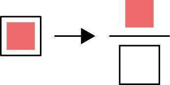

图 3-3：在图 3-2 中，击中红色方块的概率由红色方块的面积与墙面面积的比值表示，这里以符号分数的形式展示。

### 简单概率

当我们谈论某件事发生的概率时，我们将这件事称为*事件*。我们通常用大写字母表示事件，如 A、B、C 等等。短语“事件 A 发生的概率”只是指 A 发生的概率。为了节省空间，而不是写“事件 A 发生的概率”或更简洁地写“事件 A 的概率”，我们通常写成 P(A)（一些作者使用小写 p，写作 p(A)）。

假设 A 是我们投掷飞镖并击中图 3-2 中的红色方块的事件。我们可以像之前一样用比率表示 P(A)。图 3-4 从图形上展示了这一点。

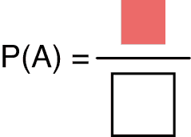

图 3-4：我们假设用飞镖击中方形区域是事件 A。事件 A 发生的概率由图 3-3 中的面积比表示。我们将这个概率写作 P(A)。

这里，P(A) 是方形区域的面积除以墙壁的面积，因此 P(A) 为 1/2。这个比率是投掷飞镖时击中方形区域而不是墙壁其余部分的概率。我们称 P(A) 为*简单概率*。

### 条件概率

现在让我们讨论涉及两个事件的概率。这两个事件中的任一个可能发生，或者两个都发生，或者都不发生。

例如，我们可能会问房子里有钢琴的概率和房子里有狗的概率。这两个特征（或事件）之间可能没有任何关系。我们称这些彼此无关的事件为*独立事件*。

许多事件类型并非相互独立，而是至少有某种程度的联系。我们称这些为*依赖事件*。当事件是依赖的时，我们可能希望找出它们之间的关系。也就是说，当我们已经知道某个特定事件已经发生（或正在发生）时，我们想要知道另一个特定事件发生的概率。例如，假设我们路过一栋房子，听到里面有狗在叫。然后我们可能会问：“*给定*我们知道房子里有一只狗的情况下，房子里有狗咬玩具的概率是多少？”换句话说，我们知道一个事件已经发生，而我们想要知道另一个事件发生的概率。

让我们将这个问题变得更加抽象，讨论两个事件 A 和 B。假设我们知道 B 已经发生，或者等效地，B 为真。知道这一点后，我们可以问 A 也为真的概率是多少？我们将这个概率写作 P(A|B)。竖线表示“*给定*”，所以我们可以把它读作“在 B 为真的情况下，A 为真的概率”，或者更简单地说，“给定 B 的 A 的概率”。这就是 A 给定 B 的*条件概率*，因为它只适用于 B 为真的情形或条件。我们还可以讨论 P(B|A)，即给定 A 为真时 B 为真的概率。

我们可以通过图示来说明这一点。图 3-5 左图展示了我们的墙面，上面有两个重叠的斑块，标记为 A 和 B。P(A|B) 是指在已知飞镖已经落在 B 区的情况下，它落在 A 区的概率。图 3-5 右边的符号比例中，顶部的形状是 A 区和 B 区的公共区域。也就是说，它是它们的重叠部分，或者是给定飞镖已经落在 B 区时，飞镖可能落在 A 区的区域。

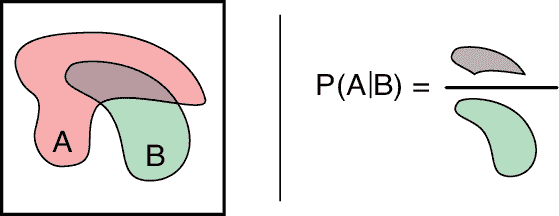

图 3-5：左图：墙上涂的两个斑块。右图：已知飞镖已经落在 B 区时，落在 A 区的概率是 A 区与 B 区重叠区域的面积与 B 区面积之比。

P(A|B) 是一个正数，我们可以通过使用飞镖来估算它。我们可以通过计数所有落在 A 区和 B 区重叠部分的飞镖，并将其数量除以落在 B 区任何部分的飞镖数量，来估算 P(A|B)。

让我们看看这个过程的实际应用。在图 3-6 中，我们已经将若干飞镖投向墙面，墙上有图 3-5 中所示的斑块。我们把飞镖投放的位置确保能够覆盖整个区域，且没有两个点距离过近。飞镖的尖端很难看到，所以我们用黑色圆圈表示每个飞镖的落点，圆圈的中心表示飞镖的撞击位置。

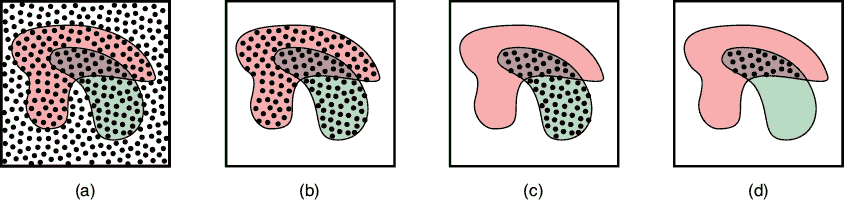

图 3-6：向墙面投掷飞镖以找到 P(A|B)。 (a) 飞镖击中墙面。(b) 所有落在 A 区或 B 区的飞镖。(c) 仅落在 B 区的飞镖。(d) 落在 A 区和 B 区重叠部分的飞镖。

在图 3-6(a)中，我们展示了所有的飞镖。在图 3-6(b)中，我们仅仅展示了落在 A 区或 B 区的飞镖（记住，只有每个黑色圆圈的中心才是有效的）。在图 3-6(c)中，我们看到有 66 支飞镖落在 B 区，而在图 3-6(d)中，我们看到有 23 支飞镖落在 A 区和 B 区的重叠部分。23/66（约 0.35）的比例估算了落在 B 区的飞镖同时落在 A 区的概率。因此，P(A|B) 约为 0.35。也就是说，如果飞镖落在 B 区，那么大约 35% 的情况下，它也会落在 A 区。

请注意，这个过程并不依赖于颜色斑块的绝对面积，比如以平方英寸为单位的数字。它仅仅是一个区域相对于另一个区域的*相对*大小，这才是我们真正关心的唯一度量标准（如果墙面面积加倍，颜色区域也加倍，那么每个区域内落镖的概率并不会改变）。

A 区和 B 区的重叠越大，飞镖落在两者重叠部分的概率就越高。如果 A 区围绕着 B 区，就像在图 3-7 中那样，那么只要飞镖落在 B 区，我们*一定*也会落在 A 区。在这种情况下，A 区和 B 区的重叠部分（以灰色表示）就是 B 区本身。因此，重叠区域面积与 B 区面积之比为 100%，即 P(A|B) = 1。

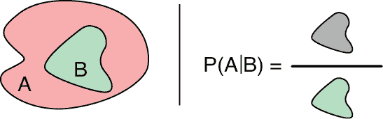

图 3-7：左：墙上两个新斑点。右：当我们处于 B 中时，落入 A 的概率为 1，因为 A 包围 B，因此它们的重叠与 B 相同。

另一方面，如果 A 和 B 没有任何重叠，就像 图 3-8 中一样，那么在 B 中落入 A 的概率为 0%，或者 P(A|B) = 0。

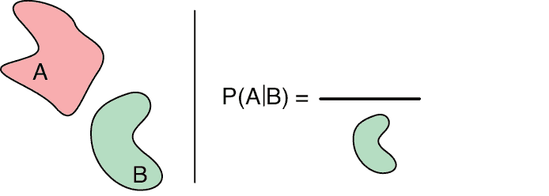

图 3-8：左：墙上另外两个新斑点。右：当我们处于 B 中时，落入 A 的概率为 0（或等效地说，0%），因为 A 和 B 之间没有重叠。

在 图 3-8 中的符号比例显示，重叠区域的面积为 0，而 0 除以任何数仍然是 0。

作为一种娱乐，让我们换个角度来看这个问题，问问 P(B|A)，或者我们在 A 中时落入 B 的概率。使用与 图 3-5 中相同的斑点，结果显示在 图 3-9 中。

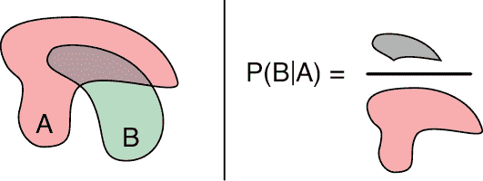

图 3-9：条件概率 P(B|A) 是我们在 A 中落入 B 的概率。

逻辑与以前相同。重叠区域的面积除以 A 的面积告诉我们 B 出现在 A 中的概率。它们重叠得越多，飞镖落入 A 中并落入 B 的可能性就越大。让我们给 P(B|A) 赋一个数值。参考 图 3-6，我们看到有 104 枚飞镖落入 A，23 枚落入 B，所以 P(B|A) 是 23/104，约为 0.22。

注意顺序很重要。从 图 3-5 和 图 3-9 可以看出，P(A|B) 的值与 P(B|A) 不同。考虑到 A、B 及其重叠的大小，落入 A 的概率在已经落入 B 的条件下要大于落入 B 的概率。也就是说，P(A|B) 约为 0.35，而 P(B|A) 约为 0.22。

### 联合概率

在上一节中，我们看到了一种表达一个事件发生概率的方式，前提是另一个事件已经发生。知道两件事同时发生的概率也会很有帮助。用我们的斑点语言来说，飞镖投向墙壁时，落入斑点 A 和斑点 B 的机会有多大？我们将同时发生 A 和 B 的概率写作 P(A,B)，在这里逗号的意思是“和”。因此我们大声读出 P(A,B) 为“A 和 B 的概率”。

我们称 P(A,B) 为斑点 A 和斑点 B 的*联合概率*。利用我们的斑点，我们可以通过比较斑点 A 和斑点 B 的重叠区域与墙壁面积来找到这个联合概率 P(A,B)。毕竟，我们正在询问飞镖落入 A 和 B 的概率，即落入它们的重叠区域，相比于它可能落入墙壁的任何地方。参见 图 3-10。

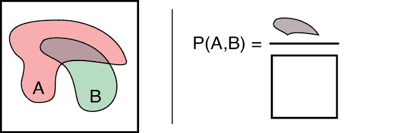

图 3-10：A 和 B 同时发生的概率称为它们的联合概率，记作 P(A,B)。

还有另一种看待联合概率的方法，它稍微复杂一些，但非常强大。它非常有用，将引领我们进入第四章的核心内容。这种联合概率的替代视角将简单概率与条件概率结合起来。

假设我们知道击中 B 的简单概率，或者 P(B)。假设我们还知道条件概率 P(A|B)，即在已知击中 B 的情况下，击中 A 的概率。我们可以将这些结合起来形成一条推理链：在知道击中 B 的概率后，我们将其与已知击中 B 时击中 A 的概率结合，以得到同时击中 A 和 B 的概率。

让我们通过一个例子来看一下推理链。假设 B 区域覆盖了墙的一半，所以 P(B) = 1/2。进一步假设 A 区域覆盖了 B 的一三分之一，所以 P(A|B) = 1/3。那么我们投掷到墙上的一半飞镖将落在 B 区域，其中三分之一的飞镖将落在 A 区域。由于一半的飞镖落在 B 区域，而其中三分之一也将落在 A 区域，所以同时落在 B 和 A 的飞镖总数是 1/2 × 1/3，即 1/6。

这个例子向我们展示了一个通用规则：要找 P(A,B)，我们将 P(A|B)与 P(B)相乘。这真的非常了不起：我们仅用条件概率 P(A|B)和简单概率 P(B)就找到了联合概率 P(A,B)！我们将其写作 P(A,B) = P(A|B) × P(B)。实际上，我们通常省略显式的乘法符号，直接写作 P(A,B) = P(A|B) P(B)。

图 3-11 展示了我们刚刚使用小面积图示所做的事情。

图 3-11：另一种思考联合概率 P(A,B)的方法

考虑图 3-11 的右侧，并将这些小的符号比率看作实际的分数。然后，绿色的 B 区域相互抵消，剩下的就是覆盖在正方形上的灰色区域，这表明我们的小方程的左右两边确实是相等的。

我们也可以反过来做，使用事件 A 而不是 B。我们从 P(B|A)开始，学习在已知落在 A 的情况下落在 B 的概率，然后将其与落在 A 的概率 P(A)相乘。结果是 P(A,B) = P(B|A) P(A)。在图形上，这遵循与图 3-11 相同的模式，只是这次是 A 区域相互抵消。

用符号表示，P(B,A) = P(A,B)，因为这两者都指的是同时落在 A *和* B 的概率。与条件概率不同，在联合概率中，A 和 B 的顺序不重要。

这些概念可能有些难以理解，但掌握它们将在第四章派上用场。你可以尝试构造几个小情境并加以练习，想象不同的区域及它们的重叠，或者甚至把 A 和 B 看作实际的情境。例如，假设有一家冰激凌店，顾客可以购买不同口味的冰激凌，且可以选择用华夫饼干筒或杯子装。我们可以说如果某人点了香草冰激凌，那么 V 为真；如果某人选择了华夫饼干筒，那么 W 为真。这样，P(V)表示随机顾客点香草冰激凌的可能性，P(W)表示随机顾客选择华夫饼干筒的可能性。P(V|W)告诉我们在选择了华夫饼干筒的人中，有多大可能性点了香草口味，而 P(W|V)则告诉我们在选择了香草冰激凌的人中，有多大可能性选择了华夫饼干筒。而 P(V,W)告诉我们随机顾客点香草冰激凌并选择华夫饼干筒的可能性。

### 边际概率

另一个用于简单概率的术语是*marginal probability*（边际概率），理解这个术语的来源将帮助我们理解如何计算多个事件的简单概率。

让我们从词语*marginal*开始，它在这个背景下可能看起来有些陌生。毕竟，边缘和概率有什么关系呢？“边际”一词的由来是它源自于包含预计算概率表格的书籍。其背后的理念是我们（或印刷工）会将表格中每一行的总和算出，然后把这些总和写在页面的边缘（Glen 2014）。

让我们通过回到我们的冰激凌店来说明这个概念。在图 3-12 中，我们展示了顾客近期的购买情况。我们的店铺刚开张，出售香草和巧克力冰激凌，且只能选择华夫饼干筒或杯子装。根据昨天进店的 150 位顾客的购买情况，我们可以问一下顾客购买杯子装与华夫饼干筒的概率，或者香草与巧克力的概率。我们通过将每一行或每一列的数值加起来（得到边缘的数字），然后除以总顾客数，来计算这些概率。

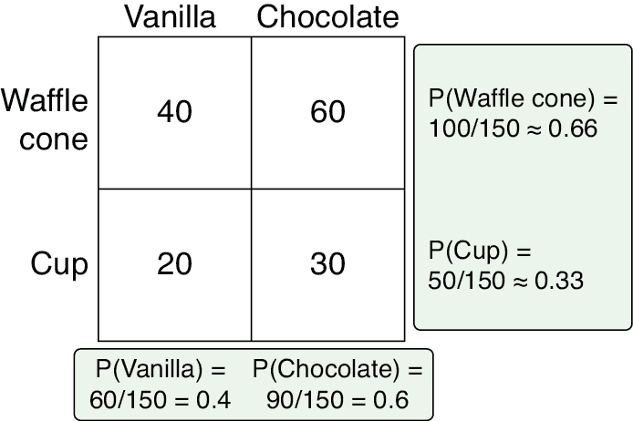

图 3-12：计算 150 名冰激凌店近期顾客的边际概率。绿色框中的数值（位于网格的边缘）是边际概率。

请注意，顾客购买杯子*或*华夫饼干筒的概率之和为 1，因为每个顾客要么买杯子，要么买华夫饼干筒。同样，所有人都购买香草或巧克力冰激凌，所以这些概率的和也为 1。一般来说，任何事件的不同结果的概率之和总是为 1，因为总有一个选择是 100%发生的。

## 测量正确性

现在，让我们从概率转到第一个性能度量：给定一个不完美的算法，它产生正确答案的可能性有多大？这是机器学习中的关键问题，因为我们几乎总是会与那些不完全准确的系统打交道。所以，理解它们会犯哪些错误是非常重要的。

让我们考虑一个只有两个类别的简单分类器。我们可以询问它某个数据点属于某个特定类别的概率（这两个类别分别是*在类别内*和*不在类别内*）。例如，我们可能会询问一张照片是狗的概率，或飓风登陆的概率，或我们的高科技围栏是否足够坚固以容纳我们的基因工程超级恐龙的概率（剧透：不太可能）。

自然地，我们希望我们的分类器做出准确的决策。诀窍在于定义我们所说的*准确*是什么。仅仅统计错误结果的数量是衡量准确度的最简单方法，但它并不十分有启发性。原因在于，错误的表现形式不止一种。如果我们希望通过错误来改进我们的表现，那么我们需要识别预测出错的不同方式，并考虑每种错误类型带来的困扰。这种分析不仅仅适用于机器学习。以下的思想可以帮助诊断和解决各种基于标签做出决策的问题。

在深入探讨之前，我们需要注意，像*精度*、*召回率*和*准确性*等术语在流行和非正式写作中使用得比较随意。但在技术讨论中（比如在本书中），这些词有精确的定义和特定的含义。不幸的是，并不是所有的作者对这些术语的定义都是一致的，这可能会引起各种混淆。在本书中，我们将坚持通常在讨论概率和机器学习时的用法，并将在本章后续部分详细定义它们。但请注意，这些术语在许多地方的含义不同，或只是作为模糊概念使用。当这些词语被过度加载时，虽然很遗憾，但它是常见的现象。

### 样本分类

让我们将语言集中于当前的任务。我们想知道给定的一个数据点或样本是否属于某个特定类别。现在，可以将其视为一个是/否问题：这个样本属于该类别吗？不允许有“可能”这样的回答。

如果答案是“是”，我们称该样本为*正面*。如果答案是“否”，我们称该样本为*负面*。我们将通过将分类器的答案与我们提前分配的真实或正确标签进行比较，来讨论准确性。我们手动分配给样本的正面或负面标签称为其*真实值*或*实际值*。我们将分类器返回的值称为*预测值*。在理想情况下，预测值将始终与真实值匹配。在现实世界中，通常会发生错误，我们的目标是描述这些错误。

我们将通过二维（2D）数据来说明我们的讨论。也就是说，每个样本或数据点都有两个值。这些值可能是一个人的身高和体重，或者是天气的湿度和风速，或者是音乐音符的频率和音量。然后，我们可以将每个数据点绘制在一个二维坐标系中，X 轴对应一个测量值，Y 轴对应另一个测量值。

我们的样本将属于两个类别之一。我们称它们为*正面*和*负面*。为了确定样本的正确分类或真实值，我们将使用颜色和形状提示，如图 3-13 所示。

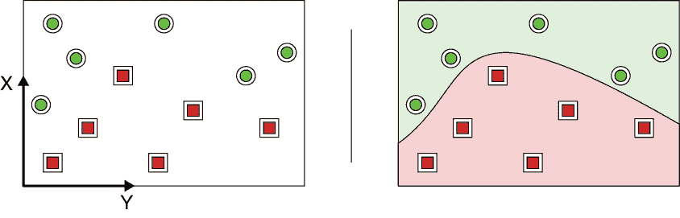

图 3-13：属于两个不同类别的二维数据

我们将通过绘制一条*边界*或曲线来展示预测结果，穿过一组数据点。边界可以是平滑的，也可以是弯曲的。我们可以将其视为分类器决策过程的一种总结。曲线一侧的所有点将被预测为一个类别，而另一侧的所有点则被预测为另一个类别。在图 3-13 的右侧图中，分类器已完美地预测了每个样本的真实情况。这是非常罕见的情况。

我们有时会说边界有正面和负面两侧。如果我们将分类器视为回答“这个样本属于该类别吗？”这个问题，这与我们课堂上所学的内容相符。如果答案是肯定的，那么预测就是“是”，否则预测就是“否”。通常，将边界两侧的区域上色，如我们在图 3-13 中所做的那样，会有助于清晰地看到哪一侧表示*正面*预测，哪一侧表示*负面*预测。

对于我们的数据集，我们将使用一组 20 个样本，如图 3-14 所示。具有*正面*真实值（或手动标签）的样本显示为绿色圆圈，而具有*负面*真实值（或手动标签）的样本则显示为红色方块。因此，每个样本的颜色和形状对应于其真实值，而背景颜色显示分类器分配的值。

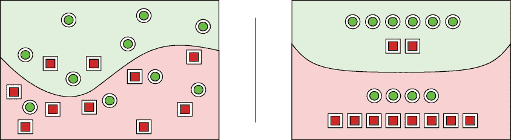

图 3-14：左侧：分类器的曲线在分类数据方面做得还可以，但它犯了一些错误。右侧：相同图表的示意图。曲线边界提醒我们，实际边界很少是直线。

分类器的任务是尽量找到一个边界，使得所有正样本都位于一侧，所有负样本都位于另一侧。为了查看分类器对每个样本的预测与实际情况的匹配程度，我们可以直接观察该样本是否落在分类器边界曲线的正确一侧。那条曲线将空间分为两个区域。我们使用浅绿色表示正区域，浅红色表示负区域，因此在浅绿色区域内的每个点都被预测或分类为正类，而在浅红色区域内的每个点都被分类为负类。

在理想的情况下，所有绿色圆圈（具有正实际标签的那些）都会位于边界曲线的绿色一侧（显示分类器将它们预测为正类），所有红色方块都会位于红色一侧。但正如我们在图中所看到的，这个分类器确实犯了一些错误。在图 3-14 的左侧，我们用每个数据的两个值以及描述分类器决策的边界曲线（和区域）绘制了每一条数据。但在这个讨论中，我们并不关心点的位置或曲线的形状。我们的兴趣在于有多少点被正确或错误地分类，因此落在了边界的正确或错误一侧。因此，在右侧的图中，我们简化了几何结构，以便一目了然地计算样本数量。

该图表示我们在真实数据集上运行分类器时通常发生的情况。一些数据被正确分类，而一些则没有。如果我们的分类器表现得不够好，我们需要采取一些措施——可能是修改分类器，甚至丢弃它并重新创建一个新的——因此，能够有效地描述其表现非常重要。

让我们找些方法来做到这一点。我们希望能够描述图 3-14 中的错误，以一种能够告诉我们分类器表现的性质，或者它的预测与给定标签的匹配程度的方式。我们希望了解的不仅仅是“对”或“错”——我们希望了解错误的性质，因为有些错误对我们来说可能非常重要，而另一些错误可能根本不重要。

### 混淆矩阵

为了描述分类器的预测结果，我们可以制作一个小表格，表格有两列，每一列代表一个预测类别，和两行，每一行代表一个实际类别，或者称为真实类别。这就形成了一个 2×2 的网格，称为*混淆矩阵*。这个名称反映了矩阵如何展示分类器在预测时出错或混淆的情况。分类器的输出在图 3-15 中得以展示，同时也展示了它的混淆矩阵。

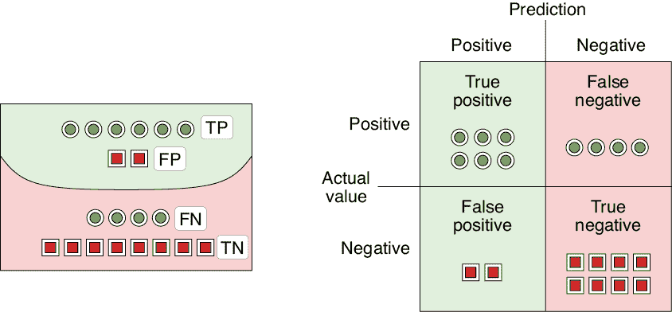

图 3-15：我们可以将图 3-14（此处左侧重复，带有标签）中的内容汇总到一个混淆矩阵中，这个矩阵告诉我们有多少样本落入了四个类别中的每一个。

正如图 3-15 所示，表格中的每一个单元格都有一个传统名称，描述了预测值和实际值的特定组合。六个绿色的正圆圈被正确预测为正，因此它们进入*真正类*。换句话说，它们被预测为正，实际上也确实是正，因此正的预测是正确的，或者说是真的。四个错误分类为负的绿色圆圈进入*假负类*，因为它们被错误地或虚假地标记为负。八个红色负方块被正确分类为负，因此它们都进入*真负类*。最后，两个被错误预测为正的红色方块进入*假正类*，因为它们被错误地或虚假地预测为正。

我们可以使用四个类别的两字母缩写和描述每个类别中有多少样本的数字来更简洁地表达这一点。图 3-16 展示了混淆矩阵通常的形式。

不幸的是，对于混淆矩阵图中的各个标签的位置，并没有统一的约定。一些作者将预测值放在左侧，将实际值放在顶部，而有些则将正负类别的位置与这里所示的相反。当我们遇到混淆矩阵时，重要的是查看标签，确保我们知道每个单元格代表什么。

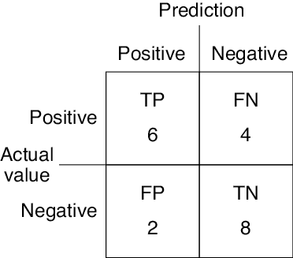

图 3-16：图 3-15 的混淆矩阵的数字表示形式

### 描述错误预测

我们之前提到过，有些错误可能对我们更重要。让我们来看看为什么会这样。

假设我们在一个公司工作，这家公司生产以流行电视角色为原型的玩具人物模型。我们的玩具现在非常受欢迎，所以生产线正处于满负荷运转。我们的工作是将制造出来的模型人物包装好，并送往零售商店。

突然有一天，我们被告知，公司失去了销售名为眼镜麦克眼镜脸的角色的权利。如果我们不小心发货了这些洋娃娃，我们会被起诉，因此确保这些娃娃不离开我们的工厂非常重要。不幸的是，机器仍在生产这些娃娃，如果我们停止生产线来更新机器，我们的订单会落后很多。我们决定更好的做法是继续生产这些禁止的洋娃娃，但在它们被制造出来之后，再把它们挑出来放进回收箱。所以我们的目标是识别每一个眼镜麦克眼镜脸并将其丢进回收箱，确保它们不会从工厂流出。

图 3-17 展示了这一情况。

我们需要快速工作，因此可能会犯一些错误。在图 3-17 中，我们看到一个被错误回收的洋娃娃。也就是说，在回答“这是眼镜麦克眼镜脸吗？”这个问题时，我们错误地说了“是的”。按照我们上一节的说法，这个娃娃是一个假阳性。这会是一个多大的问题呢？

在这种情况下，这并不是一个大问题（只要我们不要做得太频繁）。我们的目标是确保每个眼镜麦克眼镜脸都能被正确识别和移除。即使错过一个也会给我们带来很大的损失。但一个假阳性仅仅会给我们带来一点损失，因为我们会将塑料融化并重新使用。所以在这种情况下，假阳性虽然不理想，但可以容忍。

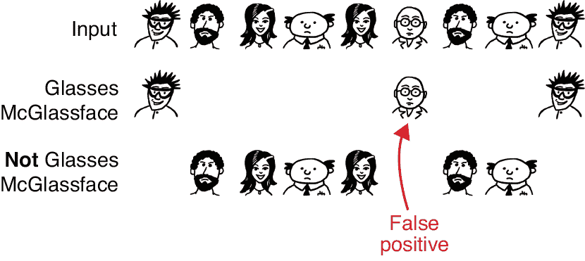

图 3-17：眼镜麦克眼镜脸是第一排的第一个角色。我们想要移除所有可能是该角色的洋娃娃。我们的选择在第二排。

假设我们后来发现一些洋娃娃的眼睛没有画好。给孩子一个没有眼睛的玩具可能会造成创伤，因此我们绝对想要抓住所有这种情况。像之前一样，我们会检查每一个玩具，这次问的是：“眼睛在吗？”如果没有，就将洋娃娃丢进回收箱。图 3-18 展示了这个思路。

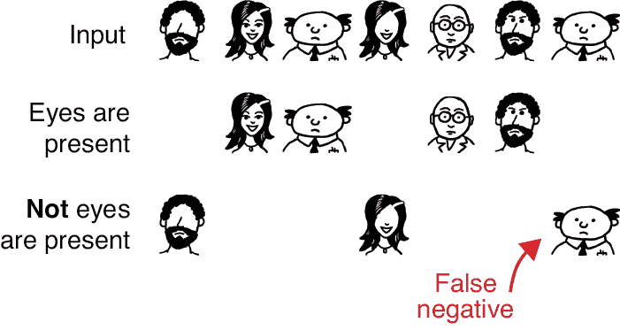

图 3-18：一组新的玩具。现在我们在寻找眼睛画错的玩具。我们的选择在最下面一排。

在这里，我们遇到了一个假阴性：洋娃娃的眼睛已经画上了，但我们说它没有眼睛。在这种情况下，少数假阴性并不是什么大问题。只要我们确保移除所有没有眼睛的洋娃娃，即使移除了一些眼睛存在的娃娃也是可以接受的。

总结一下，真正的正例和真正的负例是容易理解的情况。我们如何应对假阳性和假阴性，取决于我们的情况和目标。了解我们的问题是什么，政策是什么，这样我们才能确定如何应对这些不同类型的错误。

### 衡量正确与错误

让我们回到关于真阳性、假阳性和假阴性的概述，正如混淆矩阵中总结的那样。查看混淆矩阵可能会令人困惑，因此人们创造了各种术语来帮助我们讨论我们的分类器性能如何。

我们将通过一个医疗诊断场景来说明这些术语，其中*阳性*表示某人患有特定的疾病，*阴性*表示他们健康。假设我们是公共卫生工作者，来到了一个正经历着一场可怕但完全虚构的疾病叫做*拇指病*（*MP*）的爆发。任何患有 MP 的人都需要立刻接受拇指切除手术，否则疾病会在数小时内致命。因此，正确诊断所有患有 MP 的人至关重要。但我们绝对不希望做出错误诊断，导致切除任何人的拇指，特别是当他们的生命不在危险中时——拇指是很重要的！

假设我们有一种用于检测 MP 的实验室测试。这个实验室测试是完美无缺的，因此它总是能给出正确的答案：阳性诊断意味着此人有 MP，阴性诊断意味着没有。使用这个测试，我们已经检查了城镇中的每个人，现在知道他们是否患有 MP。但我们的实验室测试速度慢且费用高昂。我们担心未来的疫情，因此根据我们刚刚学到的情况，我们开发了一种快速、便宜且便于携带的现场测试，它可以立即预测某人是否患有 MP。

不幸的是，我们的现场测试并不完全可靠，有时会做出错误的诊断。尽管我们知道我们的现场测试有缺陷，但在爆发期间，它可能是我们唯一的工具。因此，我们希望了解现场测试的正确性以及错误的频率，并且在出现错误时，我们希望了解错误的具体方式。

为了计算这个，我们需要数据。我们刚刚听说另一个城镇有几个人报告了 MP。我们将用两种测试检查镇上的每个人：我们的完美（但慢且昂贵）实验室测试，和我们不完美（但快速且便宜）现场测试。换句话说，实验室测试为每个人提供了真实的结果，而现场测试则提供了预测。实验室测试太贵，不能总是对每个人都进行这两项测试，但我们这一次可以负担得起。

通过将现场测试的预测与实验室测试的标签进行比较，我们将知道现场测试的混淆矩阵的四个象限：

1.  **真阳性**：此人有 MP，且我们的现场测试正确地诊断出他们有。

1.  **真阴性**：此人没有 MP，且我们的现场测试一致。

1.  **假阳性**：此人没有 MP，但我们的现场测试说他们有。

1.  **假阴性**：此人有 MP，但我们的现场测试说他们没有。

真阳性和真阴性都是正确答案，而假阴性和假阳性是错误的。假阳性意味着我们会在没有理由的情况下操作，而假阴性则会让某人面临死亡风险。

如果我们通过为混淆矩阵的四个单元格附加数字来构建我们的实地测试，我们可以利用这些值来判断我们的实地测试表现如何。我们将能够通过一些常见的统计数据来描述其表现。*准确率*将告诉我们实地测试给出正确答案的频率，*精度*将告诉我们关于假阳性的一些信息，而*召回率*将告诉我们关于假阴性的一些信息。这些值是人们讨论类似测试质量的标准方式，所以让我们现在来看一下这些值。然后我们将回到实地测试的混淆矩阵，计算这些值，并看看它们如何帮助我们解读测试的预测。

### 准确率

我们在这一节中讨论的每个术语都来源于混淆矩阵中的四个值。为了更方便讨论，我们将使用常见的缩写：TP 表示真阳性，FP 表示假阳性，TN 表示真阴性，FN 表示假阴性。

我们用来描述分类器质量的第一个术语是*准确率*。对于任何样本集合，预测的准确率是一个从 0 到 1 的数值。它是正确分类的样本所占的百分比。因此，它就是两个“正确”值（真阳性 TP 和真阴性 TN）的总和，除以测量的样本总数。图 3-19 以图形方式展示了这个概念。在这个图中，和接下来的图一样，我们将展示用于任何给定计算的样本，且那些不参与该值计算的样本会被省略。

我们希望准确率是 1.0，但通常它会小于 1.0。在图 3-19 中，我们的准确率是 0.7，或者说是 70%，这并不是很高。准确率并不能告诉我们预测错误的方式，但它确实给了我们一个关于正确结果的广泛感知。准确率是一个粗略的度量。

现在让我们来看两个其他的衡量标准，它们可以更具体地描述我们的预测。

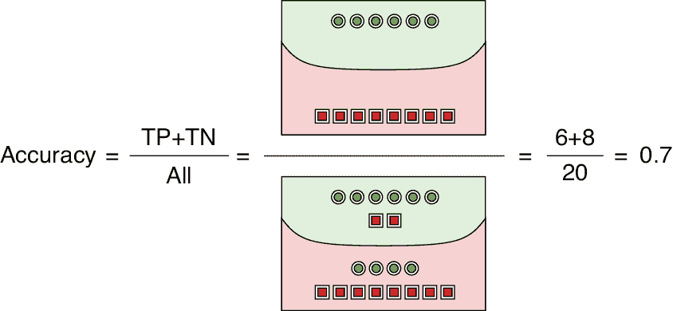

图 3-19：准确率是一个从 0 到 1 的数值，告诉我们我们的预测有多准确。

### 精度

*精度*（也叫做*正预测值*）告诉我们，在我们标记为正类的所有样本中，实际上正确标记为正类的样本所占的百分比。从数值上讲，它是 TP 与 TP + FP 的比值。换句话说，精度告诉我们在所有正类预测中，有多少是正确的。

如果精确度为 1.0，那么每一个真实为正的样本都被正确预测为正。当精确度下降时，它也意味着我们对这些预测的信心降低。例如，如果精确度为 0.8，那么我们只能有 80% 的信心，认为任何标记为正的样本是正确的。图 3-20 以图形化的方式展示了这一概念。

图 3-20：精确度的值是实际为正的正样本的总数，除以我们标记为正的样本总数。

当精确度小于 1.0 时，意味着我们错误地将一些样本标记为正。以之前的医疗案例为例，在我们假设的疾病中，精确度小于 1.0 意味着我们会进行一些不必要的手术。精确度的一个重要特性是，它并不告诉我们是否找到了所有的正样本，也就是说，它不关心那些真实为正的样本是否被完全找出。精确度只关注被标记为正的样本。

### 召回率

我们的第三个衡量指标是*召回率*（也叫*敏感性*、*命中率*或*真正率*）。它告诉我们正确预测为正的样本占所有真实为正样本的百分比。也就是说，它告诉我们我们正确预测的正样本所占的百分比。

当召回率为 1.0 时，意味着我们正确预测了每个正事件。召回率越低，错过的正事件就越多。图 3-21 以图形化的方式展示了这一概念。

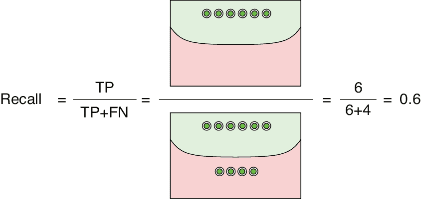

图 3-21：召回率的值是正确标记为正的样本的总数，除以应该标记为正的样本总数。

当召回率小于 1.0 时，意味着我们错过了一些正答案。在我们的医疗案例中，这意味着我们会误诊一些患有 MP 的人没有得病。结果是我们不会对这些人进行手术，即使他们已经感染且处于危险之中。

### 精确度-召回率权衡

当我们将数据分类为两类，且无法消除假阳性和假阴性时，精确度与召回率之间存在权衡：当一个增加时，另一个就会下降。这是因为，当我们减少假阳性的数量（因此增加精确度）时，必然会增加假阴性的数量（从而降低召回率），反之亦然。让我们看看这是如何发生的。

图 3-22 显示了 20 个数据点。它们最初位于最左侧时是负样本（红色方块），随着我们向右移动，逐渐变为正样本（绿色圆圈）。我们会在某个位置垂直画一条边界线，预测它左侧的所有数据为负，右侧的所有数据为正。我们希望所有的红色方块都被预测为负，所有的绿色圆圈都被预测为正。由于它们是混合在一起的，因此没有一条边界线能够完美地分开这两组数据。

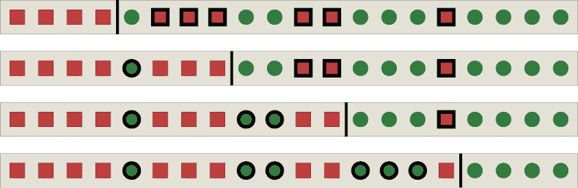

图 3-22：当我们将边界线向右移动，从上到下时，我们减少了假阳性（带有粗边框的红色方块）的数量，但增加了假阴性（带有粗边框的绿色圆圈）的数量。

在图 3-22 的顶行中，边界线靠近最左端。所有的绿色圆圈都被正确标记为正样本，但许多红色方块是假阳性（用粗线条显示）。随着我们将边界线向右移动到下方的行，我们减少了假阳性的数量，但增加了假阴性的数量，因为现在我们预测更多的绿色圆圈为负样本。

假设我们将数据集的大小增加到 5000 个元素。数据将类似于图 3-22，因此每个数据项的正样本概率由其距离最左侧的距离决定。图 3-23 最左侧的图显示了我们将决策边界从最左端移动到最右端时，真实正例和真实负例的数量。中间图显示了假阳性和假阴性的数量，最右侧的图则显示了最终的准确率。

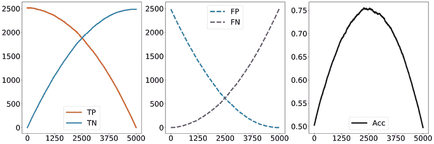

图 3-23：左图：我们移动边界时，真实正例和真实负例的数量。中图：假阳性和假阴性的数量。右图：准确率。

要计算精度和召回率，我们会将图 3-24 左侧图中的 TP 和 FP，以及中间图中的 TP 和 FN 收集在一起。右侧图显示了将这些对与 TP 结合后的结果，并根据之前的定义计算每个边界位置的精度和召回率。

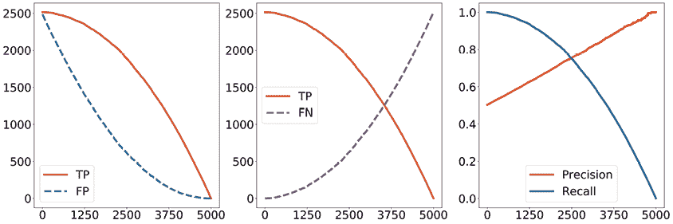

图 3-24：随着边界从最左端向最右端移动，TP 和 FP，TP 和 FN，以及精度和召回率。

请注意，随着精度的提高，我们的召回率会降低，反之亦然。这就是精度-召回率的权衡。

在这个例子中，精度呈直线变化，而召回率则呈曲线变化。为了理解其中的原因，考虑图 3-24 左侧曲线的 TP+FP 总和将是从左上到右下的对角线，而中间部分的 TP+FN 总和将是一个水平线。将 TP 曲线除以这两条方向不同的线，便得到了精度和召回率曲线的不同形状。

对于其他类型的数据集，这些曲线看起来会不同，但精度和召回率之间的权衡将保持不变：精度越好，召回率越差，反之亦然。

### 误导性度量

准确率是一个常见的度量标准，但在机器学习中，精度和召回率出现得更多，因为它们有助于表征分类器的性能并与其他分类器进行比较。但是，如果单独考虑精度和召回率，它们可能会具有误导性，因为极端条件可能会给我们带来这两个度量的高值，而总体性能却很差。

这些误导性的结果可能来自许多来源。也许最常见且最难发现的是，当我们对计算机应该为我们做什么不够小心时。例如，我们的组织可能希望我们创建一个具有极高精度或召回率的分类器。听起来可能很理想，但让我们来看看为什么这可能是一个错误。

要看清问题，可以考虑如果我们要求达到*完美精度*和*完美召回率*这两个极端，可能会发生什么。我们将设计糟糕的边界曲线来展示这些问题，但请记住，这些问题可能自然地出现在一个被要求达到完美精度或召回率的算法中。

创建一条具有完美精度的边界曲线的一种方法是，查看所有样本，找出我们最确定的正例。然后我们画出这条曲线，使得我们选择的点是唯一的正样本，其他所有的都是负样本。图 3-25 展示了这个想法。

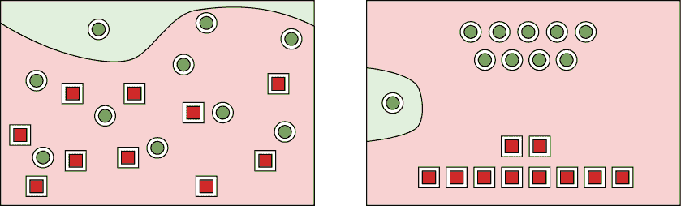

图 3-25：左图：这条边界曲线给了我们完美的精度得分。右图：左图的示意版本。

这如何给我们完美的精度呢？记住，精度是正确正例的数量（这里只有 1 个）除以所有被标记为正例的点的总数（同样，只有 1 个）。所以我们得到的比值是 1/1，或者 1，这是一个完美的分数。但准确率和召回率都非常糟糕，因为我们也创建了大量的假负例，正如图 3-26 所示。

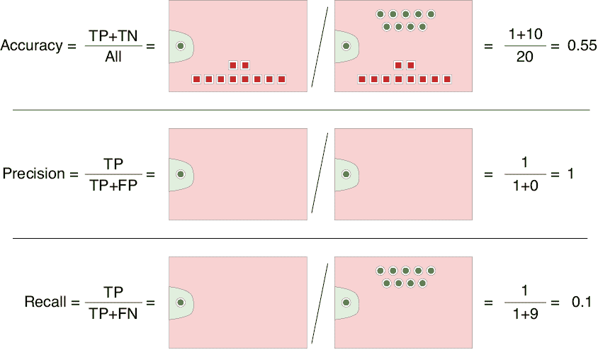

图 3-26：这些图形都共享相同的边界曲线，该曲线将一个绿色圆圈标记为正例，其他所有的都标记为负例。

让我们用召回率做一个类似的操作。创建一条具有完美召回率的边界曲线甚至更容易。我们所要做的就是将所有样本都标记为正例。图 3-27 展示了这个想法。

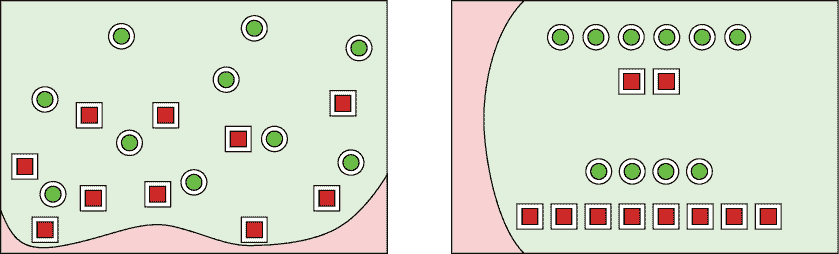

图 3-27：左图：这条边界曲线给了我们完美的召回率得分。右图：左图的示意版本。

我们从中得到了完美的召回率，因为召回率是正确标记的真实点的数量（这里是所有 10 个）除以真实点的总数（同样是 10）。所以 10/10 等于 1，或者召回率的完美分数。但当然，准确度和精确度都很差，因为每个负样本现在都是假阳性，正如 图 3-28 所示。

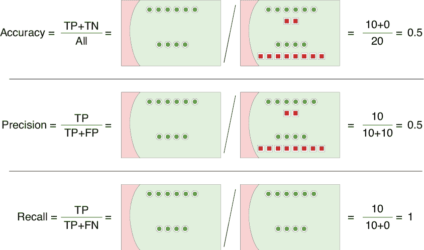

图 3-28：所有这些图形共享相同的边界曲线。通过这条曲线，所有点都被预测为正类。我们获得了完美的召回率，因为每个正类点都被正确标记。不幸的是，准确度和精确度都得到了很低的分数。

图 3-26 和 3-28 的教训是，要求完美的精确度或完美的召回率不太可能带来我们真正想要的结果，即完美的正确性。我们希望准确度、精确度和召回率都接近 1，但如果不小心，我们可能会通过选择一个极端的解决方案来获得其中一个度量的高分，而这种解决方案在任何其他方式下查看结果时表现较差。

### f1 分数

同时考虑精确度和召回率是有意义的，但它们可以通过一些数学方法结合成一个单一的度量，称为 *f1 分数*。这是一种特殊类型的“平均数”，叫做 *调和均值*。它使我们能够查看一个结合了精确度和召回率的单一数字（公式稍后出现在 图 3-30 和 图 3-32 的最后几行）。

图 3-29 直观地展示了 f1 分数。

一般来说，当精确度或召回率较低时，f1 分数会较低，当两者都接近 1 时，f1 分数也会接近 1。

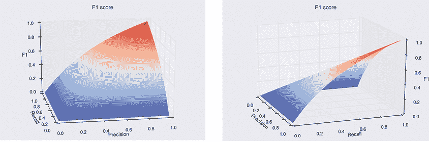

图 3-29：当精确度或召回率为 0 时，f1 分数为 0，当两者都为 1 时，f1 分数为 1。在两者之间，随着精确度和召回率的增加，f1 分数逐渐上升。

当一个系统表现良好时，有时人们会引用 f1 分数，作为展示精确度和召回率都很高的一种简便方式。

### 关于这些术语

*准确度*、*精确度* 和 *召回率* 这些术语可能看起来与它们所衡量的内容并不明显相关。让我们建立这些联系，这有助于我们记住这些术语的含义。

*准确度* 告诉我们我们正确预测的样本百分比。如果我们完全正确地预测了每个标签，准确度将为 1。当错误的百分比增加时，准确度会下降到接近 0。为了描述我们的错误，我们需要了解假阳性和假阴性的比率。这就是精确度和召回率的作用所在。

*精确度*揭示了我们假正例的百分比，或者说我们错误预测为正类的样本数量。所以这衡量了我们正类预测的特异性或精度。精确度的值越大，我们对正类预测准确性的信心就越强。在我们的医学例子中，如果我们的测试具有高精度，那么正向诊断很可能意味着那个人确实患有 MP。但精确度并不能告诉我们有多少感染者被错误地诊断为健康。

*召回率*揭示了我们假负例的百分比。如果我们将我们的系统视为仅从一组数据中寻找或召回正类样本，那么它告诉我们我们做得如何。召回率越好，我们就越有信心自己正确地检索到了所有正类样本。在我们的医学例子中，如果我们的测试具有高召回率，那么我们可以确信自己已经识别出所有患有 MP 的人。但召回率并不能告诉我们有多少健康人被错误地识别为患有 MP。

### 其他度量

我们已经看到了准确率、召回率、精确度和 f1 的度量。在概率和机器学习的讨论中，有很多其他术语有时也会被使用（维基百科 2020）。虽然我们在本书中不会遇到这些术语中的大部分，但我们在这里总结它们，提供一个方便的参考，集中了所有定义。

图 3-30 提供了这个总结。不要费心去记忆任何不熟悉的术语及其含义。这个表格的目的是提供一个方便的地方，在需要时查找这些内容。

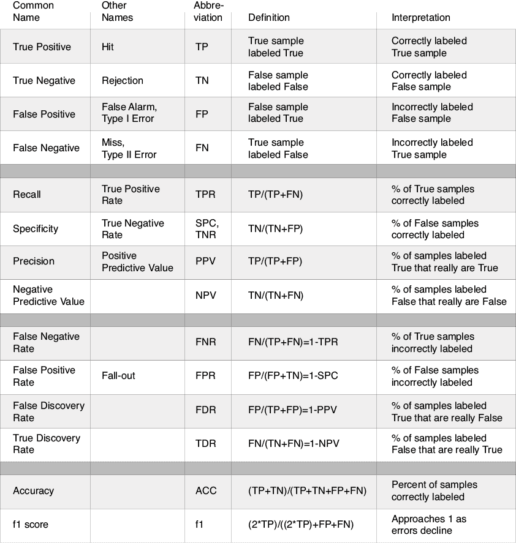

图 3-30：来自混淆矩阵的常见置信度术语

这个表格的信息量很大。我们提供了一个替代方案，通过图示展示这些术语，使用来自图 3-14 的样本分布，这里重复呈现为图 3-31。

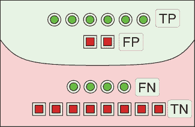

图 3-31：图 3-14 中的数据，标记了四个类别：真正例、假正例、假负例和真负例

从上到下阅读，我们有六个正类点被正确标记（TP = 6），两个负类点被错误标记（FP = 2），四个正类点被错误标记（FN = 4），以及八个负类点被正确标记（TN = 8）。

有了这些要点，我们可以通过将这四个数字或它们的图示以不同的方式组合起来，来说明图 3-30 中的度量。图 3-32 展示了我们如何仅使用相关数据片段来计算这些度量。

## 正确构造混淆矩阵

从统计度量的角度理解一个测试（或分类器）可能会很困难。信息量大，要保持条理清晰并组织好可能是一个挑战。接受这一挑战很重要，因为大多数现实世界的测试（各个领域的测试）都是不完美的，许多机器学习系统也是如此。一般来说，它们需要从统计性能的角度来理解。

混淆矩阵是一个简单但强大的工具，能够简化并总结我们的理解。但我们必须小心构建和解释它，否则很容易得出错误结论。为了总结本章内容，让我们更深入地看看如何正确构建和解释混淆矩阵。

我们的计划是回到假设的麻疹疫情，给我们的混淆矩阵附上一些数字，并提出一些关于我们快速但不准确的实地测试质量的问题。回想一下，我们之前说过，我们会用慢速且昂贵，但完全准确的实验室测试来测量一个城镇的每个人（这将给我们提供*真相*），同时也用更快、更便宜且不完美的实地测试（这将给我们提供*预测*）。

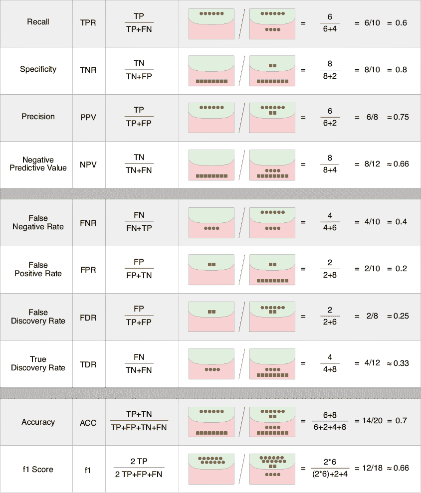

图 3-32：我们使用图 3-29 的数据，将统计测量以可视化形式展示，并结合图 3-30 的数据。

假设这些测量结果显示，实地测试具有较高的真实阳性率：我们发现，99% 的情况下，麻疹患者被正确诊断。由于真实阳性率（TP）为 0.99，假阴性率（FN），即所有我们没有正确诊断的麻疹患者，便是 1 – 0.99 = 0.01。

对于那些*没有*感染麻疹的人，测试表现稍差。我们假设真实的阴性率（TN）为 0.98，即在 100 次预测没有感染的情况下，有 98 次预测是准确的。但这意味着假阳性（FP）率为 1 – 0.98 = 0.02，因此每 100 个没有麻疹的人中，会有 2 个被错误诊断为阳性。

假设我们刚刚听说一个新城镇（人口 10,000）的麻疹疫情爆发。从经验来看，考虑到已经过去的时间，我们预计有 1% 的人群已经被感染*。这是关键信息*。我们并不是盲目地测试人群，我们*已经知道*，一个人感染麻疹的几率只有 1/100。为了正确理解我们的实地测试结果，包含这些信息至关重要。

所以我们收拾好装备，以最快的速度赶往市区。

没有时间将我们的结果送往大型而缓慢的实验室，所以我们让大家来市政厅参加我们的实地测试。假设某人测试结果为阳性。他们应该怎么办？他们感染麻疹的可能性有多大？假设测试结果为阴性。那么这些人应该怎么办？他们*没有*感染麻疹的可能性有多大？

我们可以通过构建混淆矩阵来回答这些问题。如果我们直接进入，就可能通过将上面的值填入相应的框中来构建混淆矩阵，就像在 图 3-33 中那样。但这*不是*正确的方法！这个矩阵是不完整的，将导致我们得出错误的答案。

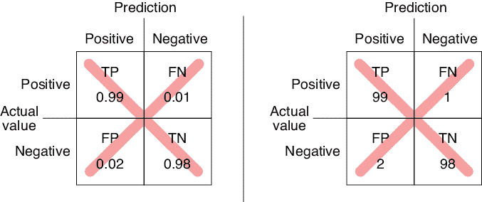

图 3-33：这不是我们想要的混淆矩阵。左：使用我们测得的值的矩阵。右：将每个值乘以 100，显示为百分比。

问题在于我们忽略了一个关键的信息：现在只有 1% 的镇上居民会感染 MP。图表 图 3-33 没有包括这一信息，因此它没有告诉我们我们需要知道的内容。

在 图 3-34 中，我们通过考虑镇上 10,000 人的情况，并利用我们对感染率和测试性能的了解，来计算出正确的矩阵。

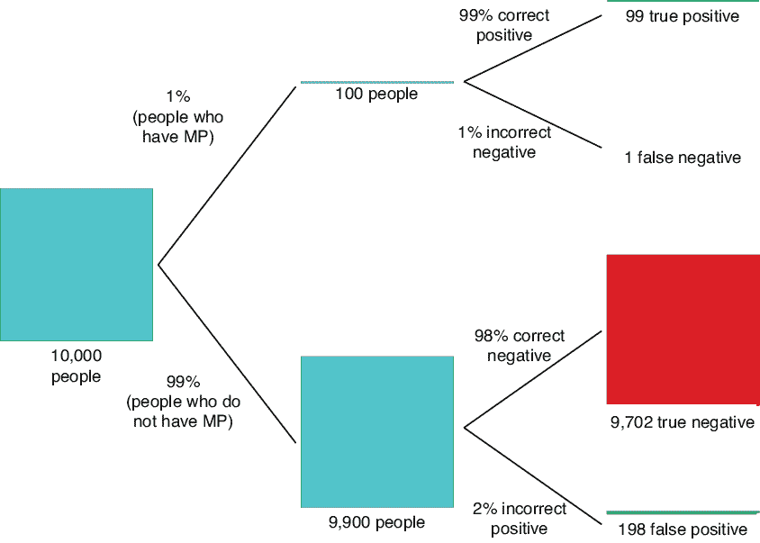

图 3-34：根据我们的感染率和测试预期的群体分布

图 3-34 是正确过程的核心部分，让我们一起走一遍。我们从镇上的 10,000 人开始。我们最基本的起始信息是，根据以前的经验，我们已经知道 100 个人中就有 1 个人，或者说 1% 的人口会感染 MP。这个信息显示在上方路径中，我们显示了 10,000 中的 1%，即 100 人感染了 MP。我们的测试将正确地显示其中 99 个人为阳性，仅有 1 个人为阴性。回到我们最初的总人口，沿下方路径我们跟踪那 99% 的人，即 9,900 人，他们没有感染。我们的测试将正确地识别 98% 的人，即 9,702 个人为阴性。剩下的 2%（198 人）将获得错误的阳性结果。

图 3-34 告诉我们应当使用的值来填充混淆矩阵，因为它们融入了我们对 1% 感染率的知识。从我们的 10,000 次测试中，我们预期（平均而言）会有 99 个真正阳性、1 个假阴性、9,702 个真正阴性和 198 个假阳性。这些值给我们提供了 图 3-35 中的正确混淆矩阵。

图 3-35：我们的 MP 测试的正确混淆矩阵，结合了我们对 1% 感染率的知识

与 图 3-33 相比，TN 率变化非常大！TN 值从 98 变为 9,702\. 假阳性（FP）值也发生了巨大的变化，从 2 变为 198\. 这是很重要的：198 名健康人将收到显示他们感染的结果。

现在我们有了正确的矩阵，我们准备回答我们的问题。假设某人得到了阳性测试结果。那么他们真正患有 MP 的概率是多少？用统计学的术语来说，就是给定测试显示为阳性，某人患有 MP 的条件概率是什么？更简单地说，返回的阳性结果中有多少比例是真阳性？这正是精确度衡量的内容。在这种情况下，精确度为 99 / (99 + 198)，即 0.33，或者 33%。

等一下，似乎有什么地方不对。我们的测试有 99% 的概率正确诊断 MP，但在 2/3 的情况下，当它给出阳性结果时，那个病人*并没有*患有该病。我们的大部分阳性结果都是错误的！

这确实看起来很奇怪。

这就是我们为什么要通过这个例子的原因。理解概率可能是很棘手的。这里我们有一个 99% 正确诊断 MP 的测试，听起来相当不错。然而，大多数我们的阳性诊断是错误的。

这个令人惊讶的结果出现是因为尽管错过感染者的概率很小，但被测试的健康人数量巨大。因此，我们得到了大量这些罕见的错误阳性诊断，并且它们迅速累积。结果是，如果某人得到阳性结果，我们*不应该*立即进行手术。我们应该将此结果解读为信号，提示我们进行更昂贵且更准确的测试。

让我们使用我们的区域图来查看这些数字。我们需要扭曲图 3-36 中区域的大小，以便制作一个我们能够解读的图表。

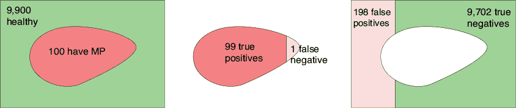

图 3-36：左侧：该人群包含 100 个患有 MP 的人，以及 9,900 个没有患病的人。中间和右侧：我们的测试结果。图形的大小不按比例。

我们之前看到，精确度告诉我们，被诊断为阳性的人真正患有 MP 的概率。这在图 3-37 的最左侧进行了说明。我们可以看到，现场测试错误地将没有 MP 的人标记为阳性，导致精确度为 0.33。这告诉我们应该对阳性结果保持怀疑，因为 1 – 0.33 ≈ 0.66，或者 66% 的阳性结果是错误的。

如果某人得到了阴性结果，情况如何？他们真的是清楚的吗？这就是正确阴性与总阴性数之比，即 TN / (TN + FN)，这就是图 3-29 所定义的*负预测值*。在这种情况下，它是 9,702 / (9,702 + 1)，大约为 0.999，或 99.9%。所以，如果某人得到了阴性结果，那么他们的测试结果错误的概率只有大约 1/10,000，他们确实患有 MP。我们可以告诉他们这一点，让他们决定是否需要更慢、更昂贵的测试。

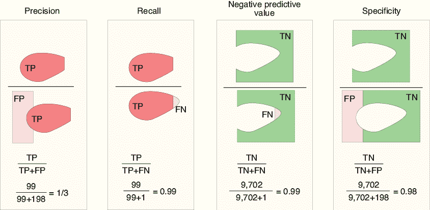

图 3-37：描述我们测试 MP 的四个统计数据，基于图 3-36 的结果。精准度：我们的阳性诊断中有多少百分比是准确的？召回率：我们找到所有阳性的百分比是多少？阴性预测值：我们的阴性诊断中有多少百分比是准确的？特异性：我们找到所有阴性的百分比是多少？如之前所述，区域大小并不按比例绘制。

我们发现，阳性结果意味着某人实际上确实患有 MP 的概率只有大约 33%。另一方面，阴性结果有 99.9%的可能性确实是阴性。

图 3-37 展示了其他几个测量值。召回率告诉我们被正确诊断为阳性的人群百分比。由于我们只漏掉了 100 人中的一个，因此该值为 99%。特异性告诉我们被正确诊断为阴性的人群百分比。由于我们错误地给出了 198 个阴性诊断，因此该结果略低于 1\。

总结来说，在这个城镇中，1%感染率的 1 万名居民中，我们的测试只会漏掉 1 例 MP。但我们将得到近 200 个错误的阳性诊断（即假阳性），这可能会不当地吓到和担心人们。有些人甚至可能会立刻进行手术，而不是等待更慢的测试。在我们希望正确找到每一个患有 MP 的人时，我们的测试可能在告知人们他们感染了病毒时过于激进。

如前所述，如果我们想要做一个永远不会漏掉任何患有 MP 的人的测试，我们可以简单地将每个人都标记为阳性，但那样并没有意义。在现实情况下，面对不完美的系统，目标是平衡假阴性和假阳性的比例，以便达到我们的目的，同时考虑到这些错误。

我们的 MP 示例是虚构的，但现实世界充满了人们基于错误的混淆矩阵或构造不当的问题做出重要决策的情况。那些决策中有些与真实且非常严重的健康问题相关。

例如，许多女性因其外科医生误解了乳腺检查的概率并给出了错误的建议，导致她们接受了不必要的乳房切除术（Levitin 2016）。推荐某人接受不必要的手术是一个危险的错误。男性也因没有必要的原因进行了手术，因为许多人根据医生误解了使用升高的 PSA 水平作为前列腺癌证据的统计学，得到了错误的建议（Kirby 2011）。

概率和统计学可能是微妙的。我们必须慢慢来，仔细思考，并确保我们正确地解读数据。

现在我们知道，听到某个测试“99%准确”或“正确识别了 99%的阳性病例”时，我们不应轻易被误导。在我们这个只有 1%人群被感染的小镇上，使用一个令人印象深刻的 99%真正阳性率的测试，任何被诊断为阳性的人很可能*并没有*真正患病。

这个道理是，任何情况下的统计声明，从广告到科学，都需要仔细审视并放入上下文中。通常，像“精确度”和“准确度”这样的术语被随意或口语化地使用，最好是使它们难以解读。即使这些术语在技术意义上使用，单纯的准确度和相关指标的声明也很容易引起误导，并可能导致错误的决策。

在涉及概率时，不要仅凭直觉。到处都有意想不到的惊讶和反直觉的结果。慢慢来，收集所有数据，仔细思考。

## 总结

我们在这一章中学到了很多！我们涵盖了一些概率中的最重要的概念。我们看到了一个术语，用来表示某个事件 A 发生的可能性，P(A)；或者在某个事件 B 已经发生的条件下，事件 A 发生的可能性，P(A|B)；又或者是事件 A 和 B 同时发生的可能性，P(A,B)。

然后我们看了一些性能指标，帮助我们表征一个测试在正确识别数据集中的正负样本方面的能力。我们看到，我们可以使用这些指标来帮助我们解释任何决策过程的结果。我们将这些术语组织成一个混淆矩阵，这有助于我们理解所有这些信息。

我们看到了统计数据可能会引起误导。如果我们不小心，我们可能会创建出一些测试（或分类器），它们根据一组度量看起来做得很好，但在其他方面却很糟糕。重要的是要慢慢来，考虑所有数据，仔细思考，并且在处理概率时小心使用语言。

在第四章中，我们将把这些概念应用到一种广泛用于机器学习中的推理方法。这将为我们提供另一个工具，帮助我们在设计学习算法时，能够有效地完成我们期望的任务。
