# 第四章：贝叶斯法则

在第三章中，我们讨论了一些基于概率的性能度量。随着我们对概率及其在机器学习中的应用深入了解，我们发现关于如何处理这个问题，有两种根本不同的思维流派。

学校中最常教授的方法称为*频率主义方法*。另一种方法叫做*贝叶斯方法*，它以托马斯·贝叶斯命名，贝叶斯在 1700 年代首次提出了这一思想。尽管它不如频率主义方法广为人知，贝叶斯方法在机器学习中却非常流行。其原因有很多，但最重要的一点是，它为我们提供了一种明确识别并利用我们对所测量系统的预期的方式。

本章我们首先探讨频率主义和贝叶斯方法之间的差异。然后我们讨论贝叶斯概率的基础知识，涵盖足够的内容，以帮助我们理解基于贝叶斯思想的机器学习论文和文档。我们将重点介绍贝叶斯法则，也称为贝叶斯定理，它是贝叶斯统计的基石。即使是这条单一的法则，也是一个重要的主题，因此我们只会以最宽泛的方式讨论它（Kruschke 2014）。本章最后我们会再次比较贝叶斯方法和频率主义方法。

## 频率主义与贝叶斯概率

在数学中，几乎总是有不止一种思考问题甚至整个领域的方式。有时方法之间的差异微妙，而有时差异则非常显著。概率论无疑属于后者。概率有至少两种不同的哲学方法，每种方法都有其优点和缺点。频率主义方法与贝叶斯方法之间的差异有深刻的哲学根源，常常通过所使用的数学和逻辑中的细微差别来表现，这些数学和逻辑构成了它们各自的概率理论（VanderPlas 2014）。这使得在不深入大量细节的情况下讨论它们之间的差异变得困难。尽管这两种方法差异如此之大，但精确描述这两种概率方法之间的区别的挑战被称为“特别棘手”（Genovese 2004）。

我们在这里的做法是跳过复杂的论证，而是用一般性的术语描述这两种方法，这样我们就能感知它们在目标和过程上的不同，而无需深入细节。这有助于为我们接下来讨论贝叶斯法则奠定概念基础，贝叶斯法则是贝叶斯方法的核心。

### 频率主义方法

一般来说，*频率学派*的人是不信任任何特定的测量或观察，认为它仅仅是对一个真实、潜在值的近似。例如，如果我们是频率学派的支持者，想要知道一座山的高度，我们会假设每次测量的结果可能都比真实值稍大或稍小。这种态度的核心信念是，真实答案已经存在，任务是找到它。也就是说，这座山有一个精确、明确的高度，如果我们足够努力并进行足够的观察，我们就能发现这个值。

为了找到这个真实的值，我们结合大量的观察结果。尽管我们认为每次测量可能并不完全准确，但我们也期望每次测量都能接近真实值。如果我们进行大量测量，我们就会说出现频率最高的值是最*可能*的。对最常见值的关注正是频率学派名称的来源。通过结合大量测量结果，我们可以找到真实值，其中出现最频繁的值对结果影响最大（在某些情况下，我们可以直接取所有测量值的平均值）。

当在学校首次讨论概率时，通常会介绍频率学派的方法，因为它易于描述，且往往与常识相符。

### 贝叶斯方法

用同样的广泛概括，*贝叶斯学派*的人相信每次观察都是对*某种东西*的准确测量，尽管每次测量的对象可能略有不同。贝叶斯学派的态度是，没有“真实”值等待着被发现。在回到我们山的例子时，贝叶斯学派认为山的真实高度是一个没有意义的概念。相反，每次测量的高度都描述了从地面某个点到山顶附近某个点的距离，但每次这两个点都不完全相同。因此，尽管每次测量的结果不同，但每次测量都是对我们可以称之为山的高度的某种准确测量。每次细心的测量都和其他测量一样真实——并没有一个单一的、确定的值等待我们去发现。

相反，山的高度只有一个可能范围，每个范围都有一个概率。随着我们进行更多的观察，这个可能范围通常会变得更加狭窄，但永远不会收敛到一个单一的数值。我们永远无法以一个数值来表示山的高度，只能表示为一个范围，每个值都有其对应的概率。

### 频率学派 vs. 贝叶斯学派

这两种概率方法引发了一个有趣的社会现象。一些从事概率学的严肃人士认为，只有频率派的方法才有意义，而贝叶斯方法是一个无用的干扰。另一些严肃的人则恰恰持相反意见。还有许多人在这两种方法中持有较为温和但仍然强烈的观点，认为哪种方法应该被视为思考概率的正确方式。当然，也有很多人认为两种方法都提供了有用的工具，适用于不同的情境。当我们处理真实数据时，我们如何思考概率可以大大影响我们能够提出和回答的问题（Stark 和 Freedman 2016）。

贝叶斯方法的一个关键特点是我们在开始测量之前明确识别我们的期望。在我们的山脉示例中，我们会提前说明我们预计山的高度。一些频率派对此提出异议，认为你不应该带着预设的期望或偏见进入实验。贝叶斯派则回应说，偏见是不可避免的，因为它已经融入了每个实验的设计中，影响着我们选择测量的内容以及方式。他们认为最好明确地陈述这些期望，以便进行检验和辩论。频率派不同意并提出反论点，贝叶斯派再提出反驳，辩论持续进行。

让我们通过抛硬币并问它是否公平，即正反面出现的次数大致相同，还是它有偏向，某一面更频繁地出现，来观察这两种技术的实际应用。首先，我们来看频率派是如何解决这个问题的，然后我们将看看贝叶斯派是如何处理的。

## 频率派抛硬币

人们常常用抛硬币作为讨论概率的例子（Cthaeh 2016a；Cthaeh 2016b）。抛硬币之所以受欢迎，是因为它对每个人来说都很熟悉，并且每次抛掷只有两个可能的结果：正面或反面（我们忽略像硬币立在一边这样的特殊情况）。只有两个结果使得数学足够简单，我们常常可以手工计算出结果。尽管我们在这里不会做太复杂的数学运算，抛硬币仍然是一个很好的方式来展示潜在的概念，所以我们将其作为我们的示例。

我们说一个*公平*的硬币是指平均来说，它正面朝上的次数占一半，反面朝上的次数占另一半。一个不公平的硬币我们称之为*作弊*、*加权*或*不公平*的硬币。为了描述一个作弊的硬币，我们会提到它正面朝上的倾向，或者它的*偏见*。一个偏见为 0.1 的硬币大约有 10%的几率正面朝上，而偏见为 0.8 则意味着我们预计硬币 80%的几率是正面朝上。如果一个硬币的偏见为 0.5，它正反面朝上的几率大致相同，那么它与一个公平的硬币是无法区分的。实际上，我们可能会说一个偏见为 0.5，或者 1/2 的硬币就是公平硬币的定义。

所以，通过进行大量测量（翻转）并将它们的结果（正面或反面）结合起来，我们可以希望找到正确的答案（硬币的偏差）。图 4-1 展示了频率学派在寻找三种不同硬币偏差时的做法，每行表示一种硬币。

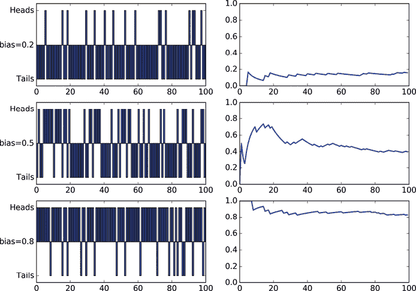

图 4-1：顶排：偏差为 0.2 的硬币。中排：偏差为 0.5 的硬币。底排：偏差为 0.8 的硬币。

在图 4-1 的每一行左侧，我们展示了该硬币连续翻转 100 次的结果。在右侧，我们展示了频率学派在每次翻转后的硬币偏差估计。这是通过将我们迄今为止找到的正面次数除以翻转的总次数来得出的。像往常一样，频率学派认为每一次测量（这里是硬币是否正面朝上）都只是对真相的一次小小近似。通过将所有这些近似（这里是简单的运行平均值）结合起来，我们可以收敛到表示硬币偏差的“真实”值。

## 贝叶斯硬币翻转

让我们考虑一下如何通过贝叶斯观点估算硬币的偏差。为此，我们将使用一个稍微复杂的情境，来突出展示贝叶斯如何提问并回答问题。

### 一个激励性示例

假设我们有一个朋友，她是一个深海海洋考古学家。她最近的发现是一个古老的沉船，其中有一件宝物是一个标记板和一袋看起来一模一样的两枚硬币。她认为这些硬币曾被用于一种赌博游戏，并且她和她的同事们甚至重建了部分规则。

关键因素是，两个看起来相同的硬币中，只有一个是公平的。另一个硬币是做过手脚的，它出现正面朝上的几率是三分之二（也就是说，它的偏差是 2/3）。1/2 和 2/3 的偏差差距并不大，但足以构建一个游戏。这个做手脚的硬币被巧妙地制造，以至于我们无法通过观察它们，甚至通过拿起硬币随便摸一摸，来分辨哪一个是哪个。游戏的内容是玩家翻转这些硬币，并尝试找出哪一枚硬币是哪一枚，同时过程中会涉及各种形式的诈唬和下注。游戏结束时，玩家通过将两枚硬币竖着旋转来辨别哪一枚是做手脚的，哪一枚是公平的。由于偏心的硬币重量不均，它比公平的硬币更早掉落。

我们的考古学家朋友希望进一步探索这个游戏，但她需要知道硬币的真实身份。她请求我们帮助理清楚。她给了我们两个信封，分别标注为“公平”和“做手脚”，我们的任务是把每一枚硬币放进适当的信封里。我们可以使用旋转测试来判断哪一枚是哪个，但让我们改用概率的方法，这样我们就可以有机会体验这种思维方式。

让我们从选择一个硬币开始，投掷一次，看看它是正面还是反面，然后看看我们能从这个信息中做出什么。第一步是选择一个硬币。由于我们不能通过观察区分两个硬币，我们有 50%的概率选择到公平硬币，另外 50%的概率选择到作弊硬币。这个选择引出了我们的大问题：*我们选择的是公平硬币吗？* 一旦我们知道手中的硬币是哪一枚，我们就可以将其放入相应的信封中，并将另一个硬币放入另一个信封里。让我们将问题重新表述为概率的问题：*我们选择公平硬币的概率是多少？* 如果我们能确定自己拿到的是公平硬币，或者确定自己拿到的不是，我们就能知道所有需要知道的事情。

所以，我们有了问题，也有了硬币。让我们投掷吧。正面！概率推理的一个伟大之处在于，仅凭这一次投掷，我们就已经能够就我们手中的硬币做出有效且量化的判断。

### 描述硬币的概率

为了绘制接下来讨论中涉及的各种概率，让我们回顾一下第三章中的概率图。假设我们有一面方形的墙，我们要向墙上投掷飞镖，每次飞镖落在墙上的每个点的概率是相等的。我们可以将墙的不同区域涂上不同的颜色，表示不同的结果。例如，如果某个结果的发生概率是 75%，而另一个结果的概率是 25%，我们可以将三分之四的墙面涂成蓝色，其余四分之一涂成粉色。如果我们投掷 100 次飞镖，预计大约 75 次会落在蓝色区域，剩下的会落在粉色区域。

我们的第一步是选择一个硬币。由于我们无法分辨两枚硬币，选择公平硬币的概率是 50:50。为了表示这一点，我们可以想象将墙面分成两个相等的区域。我们将公平区域涂成亚麻色（类似米色），将作弊区域涂成红色，如图 4-2 所示。当我们向墙面投掷飞镖时，飞镖落在公平区域的概率是 50:50，代表选择公平硬币的概率。

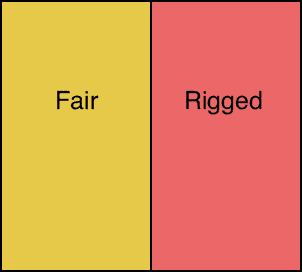

图 4-2：当我们随机选择两个硬币中的一个时，这就相当于向一面被涂成两个相等区域的墙投掷飞镖，一个区域代表公平硬币，一个区域代表作弊硬币。

让我们更有信息地涂色墙面，告诉我们第一次投掷时，正面或反面出现的概率有多大。我们知道公平硬币正面或反面的概率是 50:50，因此我们可以将公平区域分成两个相等的部分，一个表示正面，一个表示反面，如图 4-3 所示。

在图 4-3 中，我们还将作弊面分开。因为我们从朋友那里知道，作弊硬币出现正面的概率是三分之二，所以我们将三分之二的区域分配给正面，三分之一分配给反面。图 4-3 总结了我们对系统的所有了解。它告诉我们选择任一硬币的概率（对应于黄色或红色区域），以及在每种情况下出现正面或反面的概率（根据正面和反面区域的相对大小）。

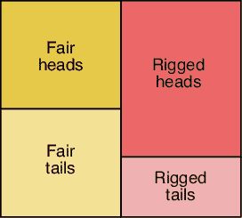

图 4-3：我们可以根据我们已经知道的信息，将墙上的公平和作弊区域分成正面和反面区域，以了解它们在翻动时出现的可能性。

如果我们向像图 4-3 那样涂漆的墙壁投掷飞镖，我们的飞镖会落在与某个硬币和正面或反面相对应的区域。但由于我们已经翻过硬币并观察到正面，所以我们知道我们落在了公平正面或作弊正面区域。

记住我们的问题：我们选择公平硬币的概率是多少？我们可以通过使用得到正面这个信息来进一步明确这个问题。稍后我们会看到，提问的最佳方式是以一个模板的形式，询问：“在（某事 1）为真，给定（某事 2）为真时，（某事 1）为真的概率是多少？”在这种情况下，这个问题变成了：“我们看到正面后，选择公平硬币的概率是多少？”

我们可以用图示表示这一点。它是公平正面区域的面积与所有可能给我们正面的总面积之比，后者是公平正面和作弊正面面积之和。图 4-4 显示了这个比率。

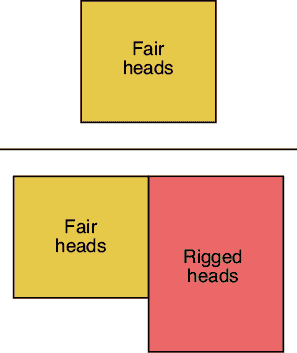

图 4-4：如果硬币正面朝上，公平硬币的概率有多大？它是公平硬币给我们正面的区域大小与所有给我们正面的区域总面积的比值。

让我们稍微思考一下这张图。由于作弊正面区域比公平正面区域大，这使得我们的“正面”结果更可能来自于落在作弊区域。换句话说，现在我们已经看到硬币正面朝上，稍微更可能是作弊硬币，就像飞镖投掷到图 4-3 中那样，飞镖更可能落在作弊正面区域而不是公平正面区域。

后面我们将讨论“某件事可能发生的方式”，或“某件事可能发生的所有方式”。这意味着如果我们正在寻找某个属性为真的情况，我们需要考虑所有能导致该结果的可能事件。在这种情况下，图 4-4 的下半部分是我们得到正面的所有方式的总和。换句话说，我们可以通过公平硬币或作弊硬币得到正面，所以表示“得到正面所有方式”意味着将这两种可能性结合起来。

### 将投币表达为概率

让我们用概率术语重新表述图 4-4。得到公平硬币*并且*得到正面的概率是 P(H,F)（或等价地 P(F,H)）。得到作弊硬币*并且*得到正面的概率是 P(H,R)。

现在我们可以将图 4-4 中的面积比率解释为一个概率陈述。该图显示了我们的硬币是公平硬币的概率，前提是我们知道它正面朝上。这就是 P(F|H)，代表“在观察到正面后，我们有公平硬币的概率”。换句话说，这个条件概率就是我们问题的答案。

我们可以将这一切汇总到图 4-5 中。

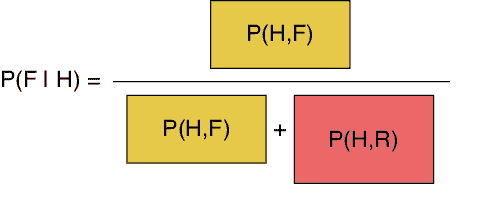

图 4-5：将图 4-4 转化为概率语言

我们能否将数字代入这个图表并得出实际的概率？当然可以，在这种情况下我们可以，因为这个情形被设计得很简单。但通常情况下，我们无法知道这些联合概率，它们也不会容易找出。

不用担心。图 4-5 右侧的所有框都是联合概率，我们在第三章中看到，我们可以用两种不同且等价的方式来表示任何联合概率，每种方式都涉及一个简单的概率和一个条件概率。这些术语通常更容易为我们赋予数字。这两种方法在此作为图 4-6 和图 4-7 重复出现。

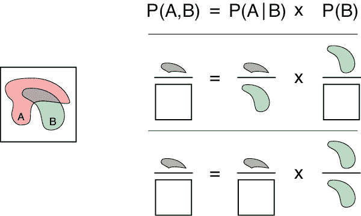

图 4-6：我们可以将两个事件 A 和 B 的联合概率表示为条件概率 P(A|B)乘以 B 的概率，即 P(B)。

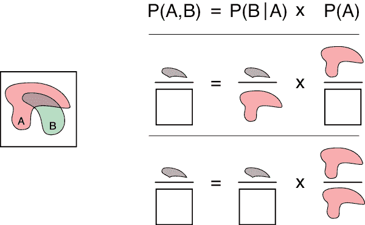

图 4-7：我们可以将两个事件 A 和 B 的联合概率表示为条件概率 P(B|A)乘以 A 的概率，即 P(A)。

让我们在图 4-5 中写出 P(F|H)的表达式，不带有彩色框，然后将 P(H,F)替换为图 4-7 中的表达式，后者告诉我们，我们可以通过将从公平硬币得到正面的机会 P(H|F)与我们一开始就拥有公平硬币的概率 P(F)相乘，来计算 P(H,F)，即正面朝上*并且*使用公平硬币的联合概率。这个变化如图 4-8 所示。

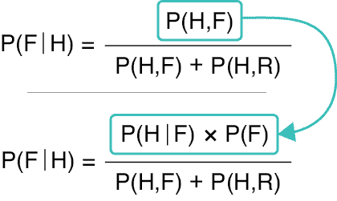

图 4-8：我们在图 4-5 中的比率代表 P(F|H)，即在正面朝上的情况下，我们拥有公平硬币的概率。

对另外两个联合概率做同样的处理，替换它们为扩展版本（其中第一个值就是 P(H,F)）。图 4-9 展示了结果。

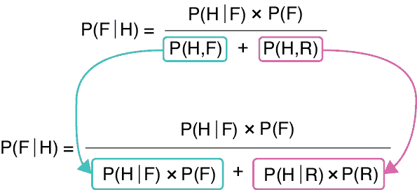

图 4-9：我们也可以将图 4-8 中另外两个联合概率替换为它们的扩展版本。

由于我们通常可以为这个扩展版本中的所有符号表达式找到数字，因此这是一种有用的方式来计算 P(F|H)。

让我们用这个表达式来找出我们刚刚抛掷的是公平硬币的概率。我们需要为图 4-9 中的每个项分配一个数字。P(F) 是我们开始时选择公平硬币的概率。我们已经知道 P(F)=1/2。P(R) 是我们开始时选择不公平硬币的概率，也为 1/2。P(H|F) 是在选择公平硬币的情况下得到正面的概率。按定义，它是 1/2。P(H|R) 是从不公平硬币得到正面的概率。根据我们考古学家朋友的说法，它是 2/3。

现在我们已经有了所有需要的数字，可以计算出在我们刚刚抛掷硬币并得到正面时，硬币是公平的概率。图 4-10 展示了将这些数字代入并完成计算步骤（遵循数学惯例，我们先进行乘法运算，再进行加法运算——这让我们可以省略一些干扰性的括号）。

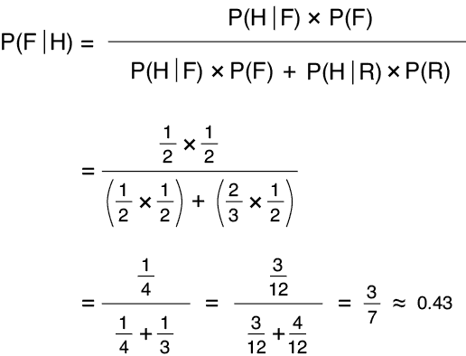

图 4-10：计算在我们刚刚看到正面时，硬币是公平的概率

结果是 3/7 或大约 0.43。这有点令人惊讶。它告诉我们，*仅仅一次抛掷硬币*后，我们就已经可以通过一种有原则的方式说出，公平硬币的概率只有 43%，因此不公平硬币的概率为 57%。这是一种 14% 的差异，仅凭一次抛掷！

顺便提一下，频率主义者在仅仅一次抛掷后是绝不会敢于判断硬币是否公平的，而这种贝叶斯方法已经用具体的概率描述了硬币的情况。

回到我们第一次抛掷的情况，假设这次我们得到了反面。那么我们现在想要找出 P(F|T)，即在看到反面时，硬币是公平的概率。回忆一下，偏差是得到正面的概率，因此得到反面的概率是 1 – 偏差。对于公平的硬币，它得到反面的概率，或 P(T|F)，是 (1 – (1/2)) = 1/2。对于不公平的硬币，我们从朋友那里得知，偏差是 2/3，因此 P(T|R) 是 (1 – (2/3)) = 1/3。选择公平和不公平硬币的概率，分别由 P(F) 和 P(R) 给出，都是 1/2，就像之前一样。我们将这些值代入，找出 P(F|T)，即在得到反面时，我们选择了公平硬币的概率。图 4-11 展示了步骤。P(F|T) 的表达式与 P(F|H) 类似，只不过 H 和 T 交换了位置。

这是一个更加戏剧性的结果，它告诉我们，得到反面意味着我们正在抛掷公平硬币的概率为 60%（因此抛掷不公平硬币的概率为 40%）。这仅仅通过一次抛掷就大大提升了我们的信心！请注意，结果并不是对称的。如果我们得到正面，公平硬币的概率是 43%，但如果我们得到反面，公平硬币的概率是 60%。

我们已经看到，通过一次抛硬币可以获得很多信息，但即使是 60%的概率也远未确定。进行更多的抛硬币实验给了我们机会去找出更精确的概率，稍后在本章中我们将学习如何做到这一点。

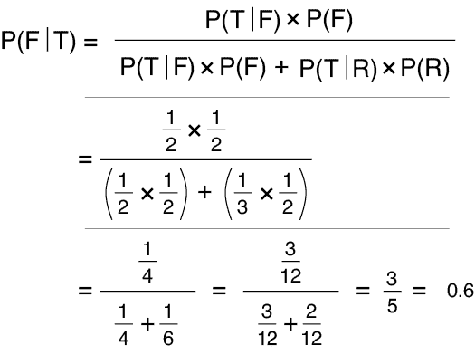

图 4-11：如果我们抛硬币时得到了反面呢？

### 贝叶斯法则

让我们找另一种写 P(F|H)的方式。在图 4-5、图 4-8 和图 4-9 中，我们看到了几种不同的方式来表示给定看到正面后我们挑选到公平硬币的概率。

让我们回到图 4-8 中的版本（在图 4-12 顶部重复出现）。注意，比例的底部部分 P(H,F) + P(H,R)结合了我们可能获得正面的所有方式的概率（毕竟，正面必须来自公平硬币或作弊硬币）。如果我们处理的是例如 20 枚硬币，那么我们必须写出 20 个联合概率的和，这将使得表达式非常复杂。我们通常使用快捷方式，将这些联合概率简写为 P(H)，即“得到正面的概率”。这隐含着所有可能获得正面的方式的和。如果我们有 20 枚不同的硬币，这将是每一枚硬币给我们正面的概率之和。图 4-12 展示了这种简化的符号。

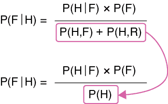

图 4-12：来自图 4-8 的最后一行，但我们已将比例底部的部分替换为符号 P(H)

图 4-13 单独展示了这个最新的版本。这就是我们在本章前面提到的著名的*贝叶斯法则*或*贝叶斯定理*。这里我们采用了数学家的约定，将两个并排的值相乘。

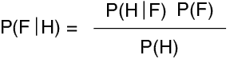

图 4-13：贝叶斯法则，或者通常书写的贝叶斯定理

用文字表达，我们想要找的是 P(F|H)，即在我们刚刚抛硬币并看到正面时，硬币是公平的概率。为了确定这个，我们结合了三条信息。首先是 P(H|F)，即如果我们确实有一枚公平的硬币，它出现正面的概率。我们将这个概率与 P(F)相乘，后者是我们拥有公平硬币的概率。正如我们所看到的，这个乘法只是评估 P(H,F)的一种更便捷方式，P(H,F)是我们硬币公平*且*正面朝上的概率。最后，我们将所有结果除以 P(H)，即硬币出现正面的概率，*考虑到公平硬币和作弊硬币的情况*。这就是我们使用*任一*硬币时，得到正面的可能性。

贝叶斯定理通常以图 4-13 的形式写出，因为它将事情分解成我们可以方便测量的部分（字母通常会根据讨论的内容进行更改）。我们只需用相应的数值替换每个术语，条件概率就会出来，表示在获得正面朝上的情况下，我们选中了公平硬币。记住，P(H)代表联合概率的总和，正如我们在图 4-12 中所看到的。

这就是为什么我们对贝叶斯定理提出的问题需要以条件概率的形式呈现：*在（某个事件 2）为真的情况下，（某个事件 1）为真的概率是多少？*因为贝叶斯定理正是提供了这种形式的答案。如果我们无法将问题以这种形式表达，那么贝叶斯定理就不是回答该问题的合适工具。

### 贝叶斯定理讨论

贝叶斯定理可能很难记住，因为有很多字母漂浮在周围，每个字母都必须放在正确的位置。但好在我们可以随时轻松地完美地重新推导出定理。

让我们以两种形式写出 F 和 H 的联合概率（即 P(F,H)和 P(H,F)）。我们知道这两者是相同的：拥有一枚公平硬币并且正面朝上的概率。将它们替换为展开版本，如在图 4-8 中所做的，得到图 4-14 中的第二行。

要得到贝叶斯定理，只需将每一边除以 P(H)，如第三行所示。结果就是最后一行，这就是贝叶斯定理。如果我们需要它而忘记了该如何推导，这是一种方便的方法。

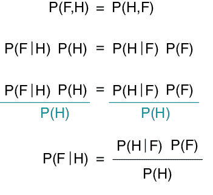

图 4-14：如果我们忘记贝叶斯定理，如何重新推导，或者快速展示它为什么成立。

贝叶斯定理中的四个术语都有一个约定俗成的名称，总结见图 4-15。

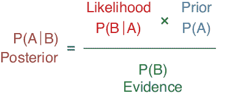

图 4-15：贝叶斯定理中的四个术语及其名称。

在图 4-15 中，我们使用了传统的字母 A 和 B，它们代表任何类型的事件和观测。通过这些字母，P(A)是我们对是否拥有公平硬币的初步估计。因为它是我们在抛硬币之前用于“我们选择了公平硬币”的概率，所以我们称 P(A)为*先验概率*，或简称*先验*。

P(B)告诉我们得到我们所得到结果的概率，在本例中即硬币正面朝上的概率。我们称 P(B)为*证据*。这个词可能会令人误解，因为有时它指的是类似犯罪现场的指纹。在我们的上下文中，*证据*是事件 B 通过*任何方式*发生的概率。记住，证据是我们可能选择的每一枚硬币朝正面出现的概率之和。

条件概率 P(B|A)告诉我们在假设我们有一枚公平硬币的情况下，获得正面朝上的概率。我们称 P(B|A)为*似然*。

最终，贝叶斯定理的结果告诉我们，在观察到正面时，选择公正硬币的概率。因为 P(A|B)是计算结束时得到的结果，所以它被称为*后验概率*，简称*后验*。

在本章早些时候，我们提到贝叶斯方法的一个优点是它使我们能够明确识别我们的先入为主的观点和预期。现在我们可以看到，我们通过选择先验 P(A)来实现这一点。一般来说，我们知道从实验设置中获得的似然性 P(B|A)和证据 P(B)，但我们必须猜测先验 P(A)。如果我们只进行一次实验，这可能会成为问题，因为如果我们的先验估计是错误的，那么后验也会是错误的。稍后我们将看到，如果我们能进行多次实验（比如多次掷硬币），那么我们可以在每次掷硬币后使用贝叶斯定理来细化我们的初始先验，从而得到一个越来越好的 P(A)描述，这将使我们得到更准确的结果，即我们真正关心的后验 P(B|A)。

在我们的小硬币测试示例中，我们很容易得出了先验的值，但在更复杂的情况下，选择一个合适的先验可能会更加复杂。有时，这取决于经验、数据、知识，甚至仅仅是关于先验应该是什么的直觉。由于我们的选择中有一些主观性或个人性，所以独自选择先验被称为*主观贝叶斯*。另一方面，有时我们可以使用规则或算法来为我们选择先验。如果这样做，那就叫做*自动贝叶斯*（Genovese 2004）。

## 贝叶斯定理与混淆矩阵

在第三章中，我们探讨了使用混淆矩阵来帮助我们正确理解测试结果。让我们再次看看这个概念，不过这次使用贝叶斯定理。

与其创建一些人为的、做作的例子，不如使用一些现实且日常的情境。你是星舰*忒修斯*的舰长，正在执行一项深空任务，目标是寻找可以开采原材料的岩石类无人行星。你刚刚发现了一颗有潜力的岩石行星。开采它将会很棒，但你的命令是永远不能开采有生命的行星。那么，大问题就是：这颗行星上有生命吗？

根据你的经验，这些岩石星球上的大部分生命只是一些细菌或蘑菇，但生命就是生命。按照协议，你派出探测器进行调查。探测器着陆并报告“没有生命”。

因为没有探测器是完美的，我们现在必须问这样一个问题：“在探测器什么都没检测到的情况下，星球含有生命的概率是多少？”这个问题非常适合使用贝叶斯规则。一个条件（我们称之为 L）是“生命存在”，其中正值意味着星球上有生命，负值意味着星球上没有生命（这样我们可以开始开采）。另一个条件（我们称之为 D）是“检测到生命”，其中正值表示探测器检测到生命，负值表示没有检测到。

我们真正想避免的情况是，在一个有生命的星球上进行开采。这是一个假阴性：探测器报告为阴性，但其实不该这样。这将是非常糟糕的，因为我们不想干扰，更不想破坏任何形式的生命。假阳性则不那么令人担忧。假阳性是那些荒芜的星球，但探测器认为它发现了生命迹象。唯一的缺点是我们没有开采一个本可以开采的星球。虽然有经济损失，但仅此而已。

建造我们探测器的科学家也有这些相同的担忧，所以他们努力减少假阴性的发生。他们也试图减少假阳性，但那并不像假阴性那么关键。

实际上，一些有生命的星球可能并不是所有地方都有生命，因此探测器可能降落在一个有生命的星球的无生命区域，并且检测不到任何东西。为了简化起见，我们不考虑这种情况，假设所有的错误结果（即遗漏了本应存在的生命，或者说存在生命时却表示没有生命）都由探测器引起，而不是星球本身。

他们派出去的探测器性能如图 4-16 所示。为了得到这些数据，他们将探测器送到了 1,000 个我们希望开采的已知类型星球，其中 101 个已知含有生命。这些数值变成了我们的先验：每 1,000 颗星球中，我们预计有 101 颗含有生命。

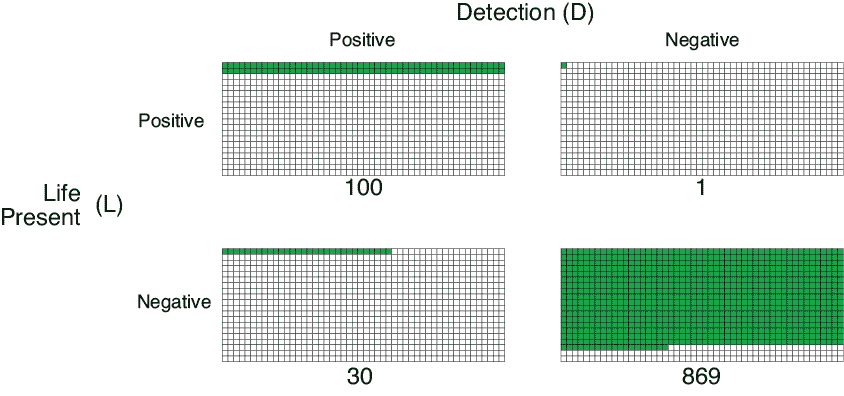

图 4-16：我们探测器的性能

探测器正确地报告它发现了生命（即真正的阳性）100 次，出现在 1,000 次中。换句话说，在 101 个有生命的星球中，探测器只错过了 1 次生命迹象（假阴性）。

在 899 个空星球中，探测器正确地报告没有生命（真正的阴性）869 次。最后，它错误地报告在一个荒芜星球上发现生命（假阳性）30 次。总的来说，这些结果还不错，因为它们偏向于保护生命。

使用字母 D 表示“检测到生命”（探测器的结果），字母 L 表示“生命存在”（实际情况），我们可以在图 4-17 的混淆矩阵中总结这些结果。对于边际概率，我们写 not-D 表示探测器结果为“未检测到生命”（即探测器表示没有生命），写 not-L 表示“无生命存在”（即这个星球上真的没有生命）。

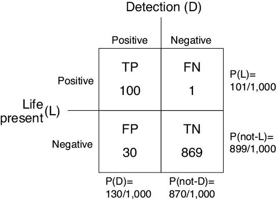

图 4-17：总结图 4-16 的混淆矩阵，展示了我们生命探测探测器的表现。四个边际概率显示在右侧和底部的边缘。

图 4-18 汇总了四个边际概率，以及我们将使用的两个条件概率。

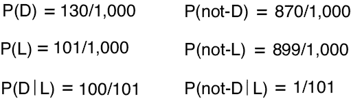

图 4-18：根据图 4-17 中的数据，汇总了四个边际概率和两个条件概率。

为了计算 P(D|L)，即探测器报告发现生命的概率，假设行星上确实*存在*生命，我们找到了探测器发现生命的次数（100 次），并将其除以发现生命的行星数量（101 颗）。也就是说，我们得到了 TP / (TP + FN)，在第三章中我们看到这被称为*召回率*。100/101 的值约为 0.99。

为了计算 P(not-D|L)，我们反向进行了计算。它在 101 颗行星中错过了一次发现生命的机会。我们得到了 FN / (TP + FN)，在第三章中我们看到这被称为*假阴性率*。结果是 1/101，约为 0.01。 （为了更深入了解探测器的行为，我们还可以使用第三章中的定义来计算探测器的准确率为 969/1000，即 0.969，精确度为 100/130，约为 0.77。）

现在我们可以回答最初的问题了。假设我们的探测器表示没有生命，实际上有生命的概率是 P(L|not-D)。利用贝叶斯定理，我们将前一段或图 4-18 中的数据代入公式，得到了图 4-19。

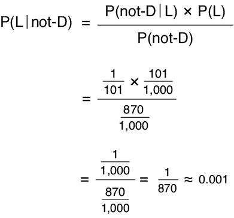

图 4-19：计算在探测器报告未检测到生命的情况下，行星上有生命的概率。

这令人放心。在探测器表示没有生命的情况下，行星上确实有生命的概率大约是千分之一。这已经相当有信心了，但如果我们想更有把握，我们可以发射更多的探测器。稍后我们将看到，每增加一个探测器，如何进一步增强我们对于是否有生命的信心。

让我们换个角度，假设探测器返回了一个积极的报告，告诉我们它*确实*探测到了生命。那对我们来说是一个财务损失，因此我们需要确认这是否正确。那么，我们能有多大的信心，认为那颗行星上真的有生命呢？为了找出这个答案，我们再次使用贝叶斯定理，但这次我们要计算 P(L|D)，即在探测器检测到生命的情况下，行星上有生命的概率。让我们通过图 4-20 中的数据来计算。

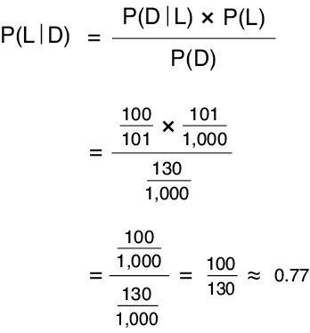

图 4-20：计算在探测器报告发现生命迹象的情况下，行星上有生命的概率。

哇。如果探测器说它发现了生命，那么仅凭这一颗探测器，我们可以有约 77%的信心相信真的有生命。这远远没有从负面报告中得到的信心高，但那是因为这个探测器的设计使得它报告假阳性的概率大于假阴性。由于我们总是希望在保护生命方面有所保留，总的来说这些结果是好的。

正如我们之前提到的，我们可以发送更多的探测器来增加对结果的信心，但无论如何，我们永远也无法达到绝对的确定性。在某个时刻，无论是第一个探测器、还是第 10 个，或第 10,000 个探测器，我们都需要做出是否开采行星的判断。

现在我们来看看发送更多探测器如何帮助我们提高信心。

## 重复贝叶斯规则

在前面的章节中，我们看到如何使用贝叶斯规则来回答类似*“在（某个事情 2）为真时，（某个事情 1）为真”的概率是多少？* 这样的问题。我们把这个问题当作一个一次性事件来处理，输入我们已知的系统信息，得到一个概率值。

一次事件或测量的结果并不足以得出结论。让我们回到我们之前的硬币游戏。回想一下，一个硬币是公平的，另一个硬币被改装成了正面朝上的概率大于 50%。我们从两个硬币中随机选择一个，抛了它，发现它是正面朝上，然后我们就得出了一个概率，认为我们选择的是公平的硬币。就这样结束了。

但我们可以继续推进。在本节中，让我们将贝叶斯规则放入循环的核心，每一条新数据都会给我们一个新的后验概率，然后我们将这个后验概率作为下一次观测的先验概率。随着时间的推移，如果数据是一致的，先验概率应当逐渐逼近我们所寻找的基本概率。

这里是基本的直觉，在我们进入细节之前。我们通常知道似然性 P(B|A)和证据 P(B)，这些是通过我们的实验设置得出的，因此它们是已知的。但我们很少知道先验概率 P(A)。我们需要为此值做出一个估计，因此我们会考虑这个问题并做出最佳猜测。由于这就完成了贝叶斯规则所需的所有值，我们可以将它们代入并得到后验概率 P(A|B)。

现在进入有趣的部分。后验概率告诉我们，在事件 B 发生的情况下，A 的概率是多少，但*我们知道事件 B 发生了*。无论是硬币正面朝上，还是探测器发现行星上有生命，我们都知道 B 发生了，因为我们选择了计算 P(A|B)，而不是计算 B 未发生时 A 的概率。既然我们知道 B*已经*发生，那么 P(A|B)就是 P(A)。

让我们用另一个例子来表达这一点，以便更好地理解。假设事件 B 是“今天很暖和”，事件 A 是“人们穿着凉鞋”。假设今天很暖和。那么，“人们穿着凉鞋，假设今天很暖和的情况下”的概率就等同于“人们穿着凉鞋”，因为我们已经观察到今天很暖和。

换句话说，后验 P(A|B)变成了 P(A)，也就是我们的先验！这就是关键的洞察。当我们知道 B 发生了时，贝叶斯规则的输出给了我们 P(A)的新估计。因此，贝叶斯规则为我们提供了一种基于实验结果来改变和改进我们对系统的期望或信念的方法。

总结一下，我们猜测 P(A)。然后我们进行实验。关键是，我们根据是否观察到事件 B，选择计算 P(A|B)或 P(A|not-B)，正如在图 4-19 和 4-20 中所看到的那样。选择评估贝叶斯规则的哪个版本是使整个循环运作的魔力。我们选择 P(A|B)或 P(A|not-B)，这取决于我们实际观察到的结果，这会将新信息引入我们的过程中。这些新信息帮助我们细化我们对所学习系统的理解。因此，在做出这个选择后，我们将数据代入贝叶斯规则的适当形式，并得出一个后验概率。这成为新的先验。凭借这个新的 P(A)，我们再次进行实验，再次使用贝叶斯规则，根据 B 是否发生来计算 P(A|B)或 P(A|not-B)，并再次通过使用该结果作为下一次实验的新的 P(A)或先验来更新我们的期望，依此类推。随着时间的推移，我们对 A 的概率或 P(A)的信念或期望将从一个猜测逐渐精炼为一个实验支持的值。

让我们将这个描述包装成一个循环，从猜测先验 P(A)开始，然后通过进行更多实验来精炼。

### 后验-先验循环

在图 4-15 中，我们给贝叶斯规则的各个项命名。这些不是唯一的命名方式。我们也将贝叶斯规则中的事件（我们称之为 A 和 B）用假设和观察的术语来表示（有时缩写为 Hyp 和 Obs）。我们的*假设*陈述了我们想要发现其真相的某件事（例如，“我们有一枚公平的硬币”）。*观察*是实验结果（例如，“我们得到了正面”）。图 4-21 展示了带有这些标签的贝叶斯规则。

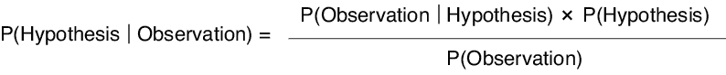

图 4-21：用描述性标签表示贝叶斯规则中的 A 和 B

在我们的抛硬币示例中，我们的假设是“我们选择了公平的硬币”。我们进行了实验并得到了一个观察结果，即“硬币正面朝上”。我们将先验概率 P(Hyp)与给定该假设的观察的似然概率 P(Obs|Hyp)结合，得到观察和假设同时为真的联合概率。然后，我们通过证据 P(Obs)进行缩放，即观察结果可能通过任何手段发生的概率。最终结果是后验概率 P(Hyp|Obs)，它告诉我们在观察到的情况下，假设为真的概率。

如约所说，让我们将这个过程封装在一个循环中。我们计算后验概率，然后（因为我们知道观察已经发生）可以将其作为先验，重复实验。结果是一个新的后验，我们可以将其作为下次的先验，依此类推。每次循环，我们的先验在描述系统时会变得更加准确，因为每次实验的结果都会被纳入。

这个循环的示意图见图 4-22。

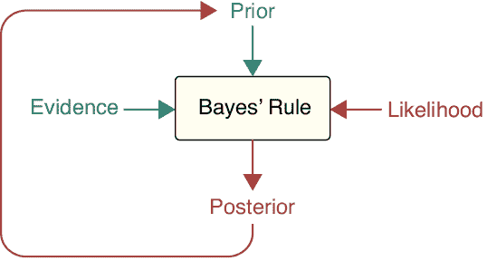

图 4-22：每当我们有新的观察结果时，我们将证据、观察的可能性和先验结合起来，计算后验概率。然后，这个后验概率将在评估新的观察结果时作为先验。

总结一下，我们从先验开始。这来自分析、经验、数据、算法或仅仅是猜测。然后我们进行实验（或进行观察）并启动循环。我们将证据、观察的可能性和先验结合起来，选择贝叶斯规则的两种形式之一，用它来计算后验概率。这个后验概率成为我们新的先验。现在，当另一个观察结果到来时，我们再次进入循环，使用我们的新先验。

这个想法是，在每次循环中，我们的先验会改进，从最初的猜测逐渐接近一系列高度可能的答案。先验之所以改进，是因为每次循环时，先验都包含了最新的观察结果，以及所有先前的观察结果。

让我们通过掷硬币的例子来看一下这个循环是如何运作的。

### 贝叶斯循环的实际应用

记得我们的考古学家朋友和她的双硬币问题吗？让我们将它概括一下，这样我们就可以尝试一些变化，探索如何使用图 4-22 中显示的贝叶斯规则循环来回答问题。

与其只有一个装有公平硬币和有偏硬币的袋子，不如假设她找到了许多这样的袋子，其中没有两个有偏硬币的偏差是相同的。每个袋子上标明了其有偏硬币的偏差（偏差通常用小写希腊字母θ [theta]表示）。

她认为，在玩家开始游戏之前，他们会达成协议，决定他们希望有偏硬币的偏差有多大。然后他们会选择相应的袋子，按常规操作，挑选出两枚硬币中的一枚，然后押注选中了哪一枚硬币。

像他们一样，我们首先选择一个袋子，然后从袋子里挑选一枚硬币。接着，我们将确定选中公平硬币的概率。我们可以通过多次掷硬币、记录正反面结果，并观察贝叶斯规则如何处理每次掷硬币的观察结果（即每次翻转后的结果），来使用贝叶斯规则的重复形式。

假设我们进行 30 次抛硬币实验。即便数据量这么小，我们也可能会看到一些不寻常的事件。例如，我们可能使用的是公平的硬币，但结果却是 25 次正面和 5 次反面。这虽然不太可能，但也是有可能的。更可能的是我们用的是一个偏向某一面的伪造硬币。让我们看看贝叶斯定理如何帮助我们根据多次抛掷来判断我们拿的是哪一枚硬币。

我们从选择一个袋子开始，里面有一枚公平硬币和一枚偏置为 0.2 的伪造硬币，这意味着我们期望它每 10 次抛掷中出现 2 次正面。假设我们将这枚硬币抛掷 30 次，其中只有 20%（即 6 次）是正面，其他 24 次都是反面。我们是拥有公平硬币，还是伪造硬币呢？因为从公平硬币的 30 次抛掷中，我们预期会得到 15 次正面，而伪造硬币则预期只有 6 次正面，所以 6 次正面似乎是我们拥有伪造硬币的一个有力证据。

图 4-23 显示了贝叶斯定理在每次抛掷后的结果。如之前所示，公平硬币的概率用亚麻色（或米色）表示，而伪造硬币的概率用红色表示。这两种概率总和为 1。

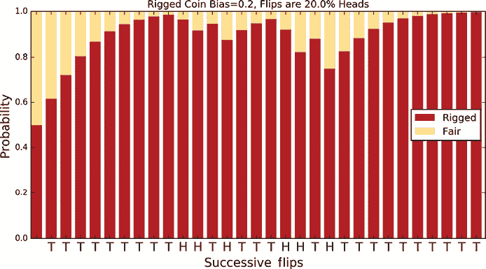

图 4-23：随着每次抛掷，公平硬币的概率用亚麻色（米色）表示。每根柱子下方的字母是导致该柱子的观察结果。

要理解这个图表传达的信息，首先看一下底部的字母。这些字母是“H”或“T”，表示该次抛掷的结果。在这种情况下，我们有 24 次反面，偶尔会有 6 次正面。接下来，考虑这些柱子，从左边开始。最左边的列显示我们在还没有进行任何抛掷之前认为我们拥有的硬币类型，因此概率都是 0.5。毕竟，选择任一枚硬币的机会是相等的，我们还没有抛掷硬币来获得任何数据。右边的柱子显示了贝叶斯定理的后验概率，观察到第一次抛掷为反面（T）后。因为公平硬币抛出反面的概率是 0.5，而伪造硬币抛出反面的概率是 0.8，所以抛出反面表明我们更可能拥有伪造硬币。继续往右看，大约 80%的抛掷结果是反面。这是我们从伪造硬币中预期的结果，因此它的概率迅速接近 1。注意，当我们连续出现几个正面时，伪造硬币的概率大约会下降到三分之二的位置，但随着每次新的反面抛掷，概率又会上升。

每个条形图中的浅色或米色块的高度表示 P(F)的值，即我们选择公正硬币的概率。在每次抛掷后，我们使用贝叶斯法则计算 P(F|H)或 P(F|T)，以适应我们观察到的结果。这成为 P(F)的新值，即我们认为自己拥有公正硬币的概率。我们利用这个值计算下一次抛掷后的后验概率。如前所述，这个选择是使整个循环运作的关键步骤。在每次实验后，我们选择返回 P(F|H)或 P(F|T)的贝叶斯法则版本，取决于我们观察到的结果。这个选择使我们能够使用后验概率作为新的先验概率，因为它反映了实际发生的情况。

接近实验结束时，我们得到公正硬币的概率几乎是 0。它永远不会完全为 0，因为我们永远不能绝对确定这不是一枚具有极其不寻常抛掷模式的公正硬币，因此这个选项始终至少有一丝概率。

在这个例子中，我们得到的数据清楚地显示我们拥有作弊硬币。我们继续保留这枚硬币并进行另一轮实验。假设下一轮我们得到的正面更少，也许总共只有三次，这使得作弊硬币的可能性更强。将此数据带入循环得到的结果见图 4-24。

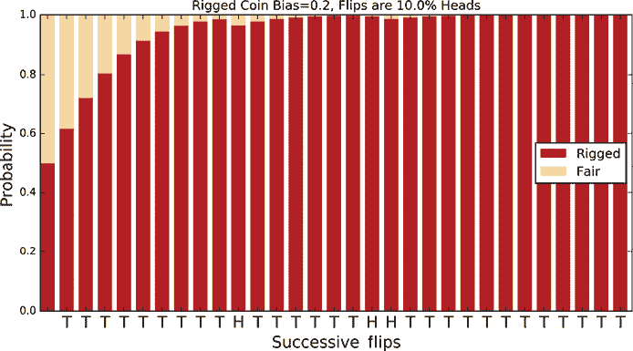

图 4-24：我们使用同一枚偏置为 0.2 的硬币，但这次我们在 30 次抛掷中恰好只得到了三次正面。

经过仅仅四次抛掷后，我们对自己拥有作弊硬币的信心达到了 90%。经过 30 次抛掷后，公正硬币的概率再次几乎为 0，但从未完全为 0。

假设我们再进行一次 30 次抛硬币的实验，这次我们恰好得到了 24 次正面。这两枚硬币的结果都与之不太匹配。我们预计公正硬币会得到 15 次正面，而作弊硬币则预计只有 6 次正面。仅从这两种选择来看，公正硬币似乎更有可能。图 4-25 展示了我们使用贝叶斯法则的结果。

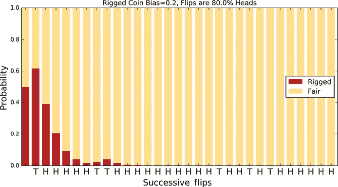

图 4-25：我们使用同一枚偏置为 0.2 的硬币，但这次我们在 30 次抛掷中恰好得到了 24 次正面。

即使公正硬币应该大约一半的时间是正面，作弊硬币的正面概率只有 20%。这些正面结果对于任何一枚硬币来说都是不太可能的，但对于作弊硬币来说，它们的可能性要*更*低，这增强了我们对拥有公正硬币的信心。

我们已经看到了这枚硬币的三种不同抛掷结果，从几乎全是反面到几乎全是正面。让我们通过抛掷 10 枚具有不同偏置的硬币来概括这些结果。我们为每枚硬币创造 10 种不同的抛掷模式，每种模式有不同的正反面比例。我们可以对每种硬币的每种模式使用贝叶斯法则，创建 100 种情景。结果见图 4-26，每个单元格都是一个小条形图，类似于图 4-23 到图 4-25 中的条形图。

让我们从左下角开始。在这个位置，我们的水平坐标值（标记为“作弊硬币偏差”）大约是 0.05。这意味着我们预计这枚硬币出现正面的概率约为 1/20。我们的垂直坐标值（标记为“翻转序列偏差”）也大约是 0.05。这意味着我们将创建一个人工的观察序列，像之前那样，每次观察到正面的概率为 1/20。在这种情况下，我们为该单元格创建的 30 次观察序列中的正面数量与我们期望从作弊硬币中得到的正面数量相匹配，因此我们对硬币作弊的信心（用红色表示）迅速增加。

让我们向上移动三个单元格。由于我们没有在水平方向上移动，我们的水平坐标值仍然是 0.05，所以我们抛掷的硬币应该有 1/20 的概率出现正面。但现在垂直坐标大约是 0.35，所以我们看到的是一个正面出现频率明显更高的模式。面对这些正面，似乎我们得到的硬币翻转序列是来自一枚公平硬币的可能性更大，而不是来自一枚*非常*不公平硬币的异常序列。随着翻转次数的增加，我们对硬币公平性的信心也在增强。

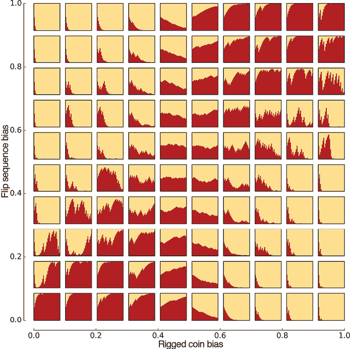

图 4-26：抛掷硬币 30 次，并使用贝叶斯规则的重复应用来判断我们正在翻转的是哪一枚硬币。每个方格报告我们对一次 30 次随机翻转的结果。每一行使用相同的正反面序列。

每个单元格可以以相同的方式理解。我们构造一个包含 30 次正反面的模式，其中正面出现的相对比例由垂直位置决定，我们要判断这个模式更可能来自一枚公平硬币，还是来自一枚其正面概率由水平位置决定的硬币。

在网格的中间部分，两个值都接近 0.5 时，几乎无法分辨。作弊硬币出现正面的频率几乎与公平硬币相同，正反面模式大致平分，所以我们可能正在翻转任一枚硬币。两者的概率都接近 0.5。然而，当我们制作正面较少的模式（图形下部）或正面较多的模式（图形上部）时，我们可以判断该模式是否与具有较低正面概率（左侧）或较高正面概率（右侧）的作弊硬币匹配。

一系列 30 次翻转是很有启发性的，但我们仍然可能遇到一些不寻常的结果（比如从一枚公平硬币中得到 25 次正面）。如果我们将每个图表中的翻转次数增加到 1,000 次，就像在图 4-27 中那样，这种不寻常的序列变得更少，模式也变得更清晰。

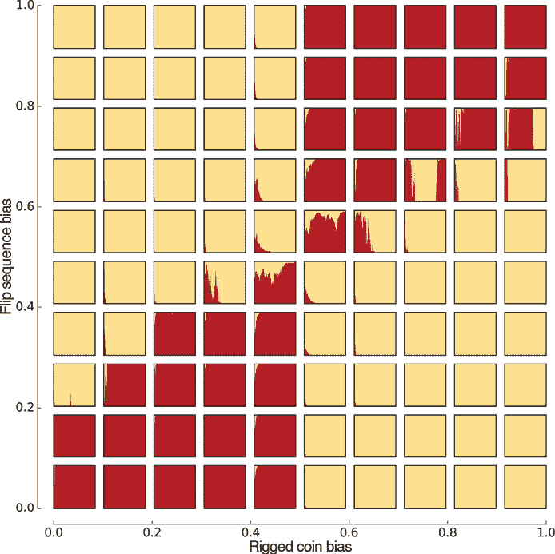

图 4-27：这个图表与图 4-26 的设置相同，但现在我们每枚硬币翻转 1,000 次。

在左下角和右上角，硬币翻转的模式与做手脚的硬币的偏差更为吻合，而贝叶斯定理将“我们选的是公平硬币”的先验推向 0。在左上角和右下角，翻转的模式更符合公平硬币的特点，先验则向 1 靠拢。

图 4-26 和图 4-27 的普遍结论是，我们做的观察越多，我们对假设是否正确的确定性就越强。每次观察都会增加或减少我们的信心。当观察结果与我们的先验（“我们有公平的硬币”）一致时，我们对这个先验的信心就会增加。当观察结果与先验相矛盾时，我们的信心就会下降，而由于在这种情况下只有一个其他选择（“我们有做手脚的硬币”），那个假设的概率就会增加。即使我们只有少量的观察结果，我们通常也能很早就获得很大的信心。

## 多重假设

我们已经看过如何利用贝叶斯定理通过将假设与观察结果结合起来（或许是反复地）来改进假设。但是没有什么限制我们只能测试一个单一的假设。实际上，我们一直在做多个假设。就在上一节中，我们明确看到了“这个硬币是公平的”和“这个硬币被做了手脚”这两个假设是同时更新的。由于我们知道这两个概率之和必须为 1，因此知道其中一个就能推知另一个，所以我们只需跟踪其中一个即可。

但是如果我们愿意的话，我们也可以明确地计算出两个概率。我们只需要使用两个贝叶斯定理的副本。假设一次翻转结果是正面。然后我们可以独立地计算出拥有公平硬币的条件概率 P(F|H)和拥有做手脚硬币的条件概率 P(R|H)。这在图 4-28 中展示了。

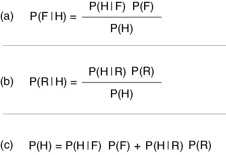

图 4-28：计算两个假设的概率。线（c）明确展示了如何在两种情况下计算 P(H)。

从图 4-28 中我们可以看到，公平硬币和做手脚硬币的概率只是硬币翻转为正面的两种方式的比例。如果我们想同时跟踪多个假设，我们可以使用多个贝叶斯定理副本，每次有新的观察结果时都更新它们。

我们可以利用这个能力再次帮助我们的考古学家朋友。她刚刚发现了一个箱子，里面有一款新游戏的零件，再次地，游戏使用袋子来存放成对的硬币。像之前一样，袋子里的做过手脚的硬币有不同的偏差。因为一个偏差极大的硬币（即正面出现的概率远大于反面，或者反之）会更容易被发现，她认为可能存在不同水平的玩家，从新手到老手。新手会玩一些偏差较大的硬币，但随着玩家技能的提高，他们会转向偏差越来越接近 0.5 的做过手脚的硬币。这些硬币更难被察觉，从而导致更长的游戏时间和更有风险、更加复杂的投注。

由于我们的朋友想了解她的发现，所以她将所有硬币倒入一个大箱子里，并要求我们找出每个硬币的偏差。暂时假设只有五个可能的偏差值——0、0.25、0.5、0.75 和 1（回想一下，偏差为 0.5 对应的是公平的硬币）——因此我们将创建五个假设。我们将它们编号为 0 到 4，分别对应不同的偏差值。假设 0 表示：“这是偏差为 0 的硬币”，假设 1 表示：“这是偏差为 0.25 的硬币”，以此类推，直到假设 4，它表示：“这是偏差为 1 的硬币。”

现在我们将从箱子中随机挑选一枚硬币，反复投掷，并尝试确定哪个假设最有可能。为了开始，我们需要为每个假设做一个先验估计。记住，每次循环时这些先验会被更新，因此我们只需要一个好的初始猜测。因为我们对选中的硬币一无所知，假设每个硬币被选中的概率是相同的，所以所有五个先验值都有 1/5 的概率是正确的，或者 1 / 5 = 0.2。

注意，如果我们想的话，可能会做得更复杂。每对硬币中都有一个是公平的，一个是做过手脚的。假设我们有 16 枚硬币。如果是这种情况，那么我们有 8 枚公平的硬币和 8 枚做过手脚的硬币（每个偏差值允许两个）。那么，选择一个公平硬币的概率是 8 / 16 = 0.5，而选择每个做过手脚的硬币的概率是 2 / 16 = 0.125。这可能是一个更好的先验，因为它利用了我们已知的更多信息。从一开始就使用一个更好的先验意味着我们的循环会更快地集中在高概率的解上。但贝叶斯方法的其中一个优点是，我们几乎可以从任何一个接近的先验开始，最终都能得到相同的结果。为了简便起见，我们使用第一个先验，即每个假设的值为 0.2。

唯一需要我们指定的是每个硬币的似然性。但我们已经知道这些，因为它们*就是*偏差。也就是说，如果硬币的偏差为 0.2，那么它正面朝上的概率就是 0.2。因此，反面朝上的概率就是 1 − 0.2 = 0.8。

假设 0，表示“我们有一枚偏向 0.0 的硬币”，其得到正面朝上的可能性为 0，反面朝上的可能性为 1。假设 1，表示“我们有一枚偏向 0.2 的硬币”，其得到正面朝上的可能性为 0.2（即 20%），得到反面朝上的可能性为 0.8（即 80%）。我们的可能性在图 4-29 中进行了绘制。

由于硬币本身在我们抛掷并收集观察结果时并不会改变，因此其可能性也不会变化。每次在获得新的观察结果后，我们都会重复使用这些相同的可能性来评估贝叶斯定理。

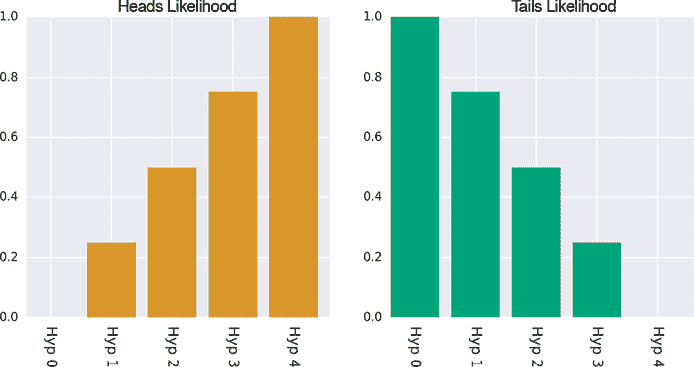

图 4-29：我们五个假设的正面或反面朝上的可能性

我们的目标是反复抛硬币，观察五个先验如何随着时间的推移而变化。为了展示每次抛硬币时发生的情况，我们将五个先验值用红色表示，五个后验值用蓝色表示。在图 4-30 中，我们展示了第一次抛硬币的结果，假设结果是正面朝上。五个红色的条形图代表每个假设的先验值，都是 0.2。由于硬币出现了正面朝上，我们将每个先验值与图 4-29 左侧对应的可能性相乘，得出新的可能性。然后，除以所有五个正面朝上的概率之和，得到后验值，即贝叶斯定理的输出，展示在蓝色条形图中。

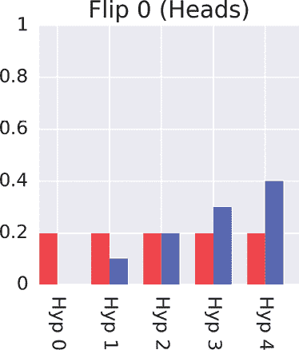

图 4-30：我们正在测试五个假设，假设我们的硬币偏向分别为 0、0.25、0.5、0.75 和 1.0。每个假设的先验值都从 0.2（红色）开始。在抛掷一次硬币后，假设正面朝上，我们计算出后验值（蓝色）。

在图 4-30 中，每对条形图表示一个假设的先验值和后验值。很明显，我们已经排除了假设 0，因为它表示硬币永远不会出现正面，而我们刚才得到的是正面。表示这枚硬币总是正面朝上的假设是迄今为止最强的，因为我们刚刚得到了正面朝上的结果。

现在，我们进行一系列的抛硬币实验。我们将使用包含 30% 正面朝上的 100 次抛掷结果。也就是说，这些结果相当于一枚偏向 0.3 的硬币。虽然我们五个假设都不完全匹配这个偏向，但假设 1 最为接近，表示一枚偏向 0.25 的硬币。让我们看看贝叶斯定理如何表现。图 4-31 展示了前 10 次抛掷的结果，在顶部两行中显示，然后在底部一行中跳跃更大。

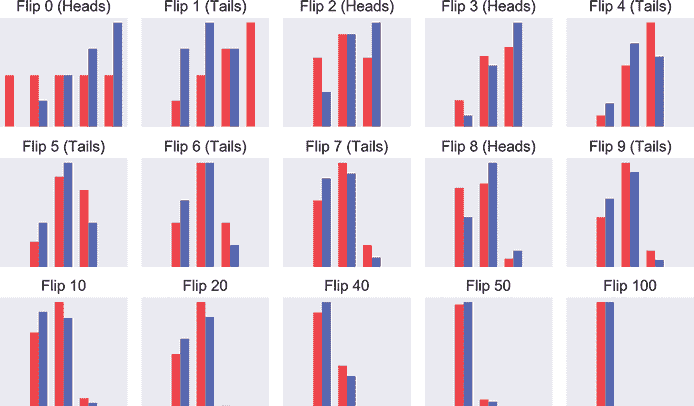

图 4-31：我们的先验（红色）和后验（蓝色）在一系列由偏向 0.3 的硬币生成的抛掷结果中如何变化。每个图形顶部显示的是刚刚评估过的抛掷次数。

如前两行所示，每次抛硬币后的后验分布（蓝色）成为下一次抛硬币的先验分布（红色）。我们还可以看到，在第一次抛硬币（正面朝上）后，最左边的假设 0 的可能性降为 0，因为该假设认为硬币永远不会出现正面。然后在第二次抛硬币时，恰好是反面朝上，假设 4 的可能性降为 0，因为它对应的是一个总是正面朝上的硬币。这样，剩下的只有三个假设。

我们可以看到剩下的三个选项如何随着每次抛硬币的结果调整其概率。随着更多的抛硬币进行，正面朝上的次数越来越接近 30%，假设 1 占据主导地位。当抛硬币次数达到 100 次时，系统基本上决定假设 1 是最优选择，这意味着我们的硬币更可能有 0.25 的偏差，而不是其他的选择。

如果我们能测试 5 个假设，我们就能测试 500 个。图 4-32 展示了 500 个假设，每个假设对应一个从 0 到 1 均匀分布的偏差。我们增加了第四行，显示更多的抛硬币结果。我们在这些图表中去除了竖直的条形，以便更清晰地看到所有 500 个假设的值。

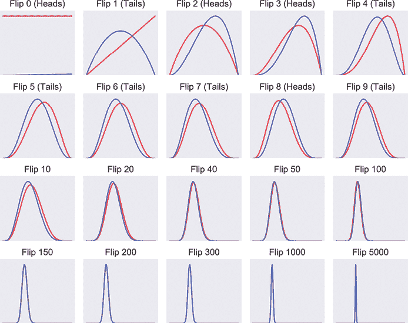

图 4-32：与图 4-31 相同的情况，但现在我们正在评估 500 个同时进行的假设，每个假设基于一个稍有偏差的硬币。

在这个图（以及接下来的图中），我们重新使用了在图 4-31 中使用的相同的抛硬币结果。正如我们预期的那样，获胜的假设是预测偏差约为 0.3 的那个假设。但这里发生了另一件有趣的事情：后验分布呈现出高斯分布的形态。回忆一下第二章中提到的，高斯曲线就是著名的钟形曲线，除了对称的峰值外几乎是平坦的。这是贝叶斯规则的数学演变中先验分布的典型特征。统计学和概率论中，数据中常常出现高斯曲线，这只是其中许多地方之一。

如我们在章节开始时所说，贝叶斯推理并不是集中于一个正确答案。相反，它逐渐将更多的概率赋予一个较小范围的答案。其思路是，这个范围内的任何值都有可能是我们所寻找的答案。

如果贝叶斯规则似乎演化成先验呈现高斯形状，那如果我们*从一开始*就用形成高斯的先验，结果会怎样？我们就这样做，但为了增加系统的难度，我们将先验的峰值均值（也就是它的中心）设置在大约 0.8 处。这意味着我们认为我们测试的硬币最有可能偏向 0.8。这个值远离我们序列中设定的 0.3。描述我们硬币的 0.3 的概率一开始仅为 0.004，所以通过我们的先验，我们断定这枚硬币偏向 0.3 的概率只有 0.4%，即每千次中有 4 次。那么，系统如何应对一个如此错误的先验呢？正确答案的概率仅有这么微小的机会？

图 4-33 展示了结果。

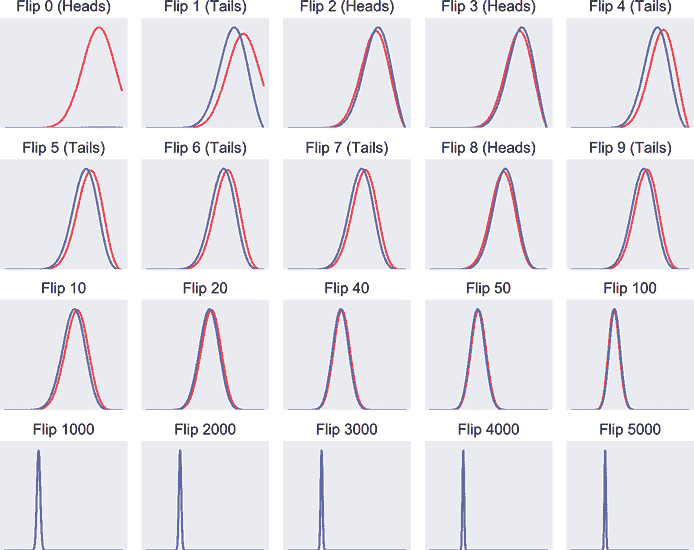

图 4-33：这张图与图 4-32 的设置相同，只是现在我们从一个以 0.8 为中心的高斯峰值形式的先验开始。

很好。即使我们的先验选择得不理想，系统还是锁定了正确的偏差值 0.3。虽然花了点时间，但它最终得到了正确答案。

在图 4-34 中，我们展示了图 4-33 中的先验，在评估前 3,000 次抛掷的过程中，经过 10 步的演化，这些先验被重叠展示，而不是按顺序排列。

请注意，我们一开始用的是均值为 0.8 的广泛先验，但随着更多抛掷的进行和观察的积累，先验的均值逐渐向 0.3 移动。峰值的宽度也变窄了，这告诉我们系统正在判断离均值远的偏差值不太可能。每条曲线所对应的抛掷次数是手动选择的，以确保曲线之间的间距大致相等。请注意，随着系统的信心增长，产生了一个狭窄的先验，曲线变化变得更慢。换句话说，结果越确定，我们就需要更多的观察才能对后验做出重大改变。

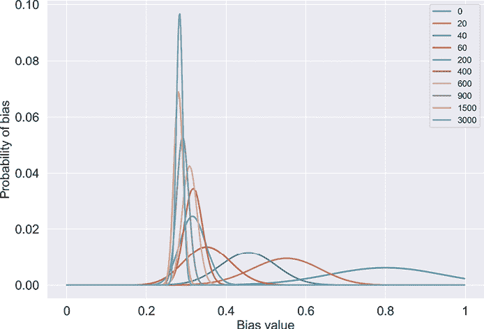

图 4-34：来自图 4-33 的前 3,000 次抛掷的后验快照，重叠在一起。不同的颜色显示了已经经过了多少次抛掷，具体情况可以参考右上角的图例。我们可以看到，系统越来越多地将权重集中在接近 0.3 的先验上，同时减少其他地方的概率。高度变化是为了保持每条曲线下的面积为 1.0。

我们不打算深入细节，但通过一些数学运算，我们可以将可能的偏差数量（因此也包括假设数量）推向逻辑极限，将值的列表替换为连续曲线，就像图 4-34 所示那样。这样做的好处是，我们可以精确到任意程度，找到任何值的偏差，而不仅仅是列表中最接近的那个。

## 总结

概率领域中有两大派系：频率派和贝叶斯派。频率派认为我们选择测量的任何事物都有一个准确的或真实的值。因此，每次测量只是对该值的近似。贝叶斯派则认为没有单一的真实值，只有一系列可能的值，每个值都有其对应的概率。每次测量都是某种事物的准确度量，但可能并非我们想要测量的内容。

本章的大部分内容都在讨论贝叶斯方法。贝叶斯概率在深度学习中非常流行，因为它非常适合我们面临的各种问题和我们想要回答的各类问题。贝叶斯概率的语言出现在许多深度学习系统的论文、书籍和文档中。其核心思想是为我们提供一套描述测量的工具，而不是通过寻找一个单一的真实数值，而是通过找到该测量的可能值范围，每个值都有其对应的概率。

例如，如果一个深度学习系统帮助某人编写短信并提供下一个单词的快捷方式，它通常会显示几个高概率的猜测，而不是一个单一的最佳下一个单词。

在下一章中，我们将探讨曲线和表面的某些特性，借此我们可以理解我们的学习系统可能犯的错误类型（以及如何纠正这些错误）。
