# 第五章：曲线和表面

在机器学习中，我们经常处理各种类型的曲线和表面。这些对象的两个最重要的性质分别被称为*导数*和*梯度*。它们描述了曲线或表面的形状，从而决定了我们应该朝哪个方向移动，以便向上爬升或向下滑动。这些思想是深度学习系统如何工作的核心。了解导数和梯度对于理解反向传播（第十四章的主题）至关重要，因此了解如何构建和训练成功的网络。

如常，我们将跳过方程式，转而专注于构建对这两个术语描述的直观理解。关于我们在这里讨论的内容，您可以在大多数现代多变量微积分书籍中找到数学深度和严谨性，并且许多在线网站也有更加易懂的形式（Apostol 1991；Berkey 1992；3Blue 2020）。

## 函数的性质

如前所述，在机器学习中，我们经常处理各种类型的曲线。最常见的这些是数学*函数*的图形。我们通常从输入和输出的角度来看待函数。当我们处理二维（2D）曲线时，输入通过选择图表中的一个位置来表示。输出是该点正上方曲线的值。在这种情况下，我们提供一个数字作为输入，并得到一个数字作为输出。

当我们有两个输入时，我们进入了三维世界。在这里，我们的函数是一个表面，像在风中飘动的薄纸。我们的输入是位于薄纸下方地面上的一个点，输出是该点正上方的薄纸的高度。在这种情况下，我们提供两个数字作为输入（用于标识地面上的一个点），并再次得到一个单一的输出。

这些思想可以被推广，使得函数能够接受任意数量的输入值，这些值也叫做*参数*，并且可以提供多个输出值，有时称为*返回值*，或者简称*返回*。我们可以把函数看作一个将输入转换为输出的机器：一个或多个数字进入，且一个或多个数字出来。只要我们没有故意引入随机性，系统就是*确定性的*：每次我们给一个特定的函数相同的输入时，都会得到相同的输出。

在本书中，我们将通过几种方式使用曲线和表面。其中最重要的一种，也是本章的重点，是确定如何沿着它们移动以得到更大或更小的输出。我们用于这一过程的技术要求我们的函数满足一些条件。我们将通过曲线来说明这些条件，但这些思想同样适用于表面和更复杂的形状。

我们希望我们的曲线是*连续的*，这意味着我们可以用一笔画出它们，且永远不需要将笔从页面上抬起。我们还希望我们的曲线是*光滑的*，这样它们就没有尖角（称为*尖点*）。图 5-1 展示了一条具有这些禁止特征的曲线。

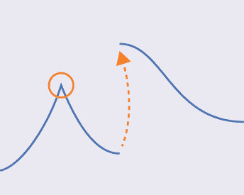

图 5-1：圆圈围住了一个尖点，虚线箭头表示不连续性，或跳跃。

我们还希望我们的曲线是*单值的*。在二维中，这意味着对于页面上的每一个水平位置，如果我们在该点画一条垂直线，这条线只与曲线交于一个点，因此该水平位置只对应一个值。换句话说，如果我们从左到右（或从右到左）跟随曲线，它永远不会自我反转。违反这一条件的曲线在图 5-2 中有所展示。

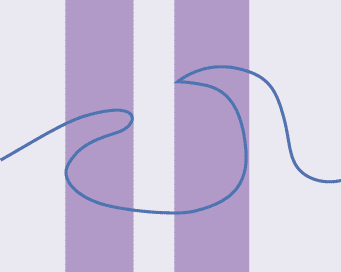

图 5-2：在紫色区域内，曲线在垂直方向上有多个值。

从现在开始，假设我们的所有曲线都满足这些规则（即它们是平滑的、连续的，并且是单值的）。这是一个安全的假设，因为我们通常会故意选择具有这些特性的曲线。

## 导数

曲线的一个最重要的方面叫做*导数*。导数告诉我们很多关于曲线在任何一点形状的信息。在本节中，我们将探讨一些核心思想，它们引导我们到导数的概念。

### 最大值和最小值

深度学习训练的一个关键部分是最小化系统的误差。我们通常通过将误差想象成一条曲线，然后寻找该曲线的最小值来实现这一目标。

更一般的问题是，在曲线的整个长度上找到曲线的最小值或最大值，如图 5-3 所示。如果这些是整个曲线的最大值和最小值（而不仅仅是我们偶然查看的部分），我们称这些点为*全局最小值*和*全局最大值*。

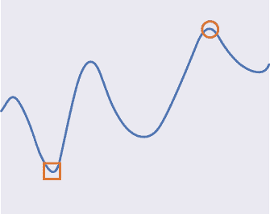

图 5-3：曲线的全局最大值（棕色圆圈）和全局最小值（橙色方块）

有时我们只关心这些最大值和最小值，但有时我们也希望知道*这些点*在曲线上的具体位置。找到这些值有时可能很困难。例如，如果曲线在两个方向上都无限延伸，我们如何确定找到的确实是最小值或最大值？或者如果曲线重复，如在图 5-4 中所示，应该选择哪些高（或低）点作为*全局最大值*或*最小值*的位置？

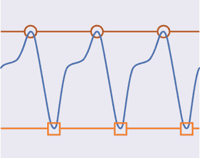

图 5-4：当曲线无限重复时，我们可以有无限多个点可以用作最大值（棕色圆圈）或最小值（橙色方块）的位置。

为了解决这些问题，让我们考虑给定点附近的最大值和最小值。为了描述这一点，我们可以进行以下的小小思维实验。从曲线上的某个点开始，向左移动，直到曲线改变方向。如果值随着我们向左移动而增加，我们就继续移动，直到它们开始减少为止。若值在向左移动时开始减少，我们也继续移动，直到它们开始增加为止。我们再次进行同样的思维实验，这次从同一个点出发，但我们向右移动。这会给我们带来三个有趣的点：我们的起始点，以及向左和向右移动时停下来的两个点。

这三点中的最小值是我们起始点的*局部最小值*，而这三点中的最大值是我们起始点的*局部最大值*。图 5-5 展示了这一概念。

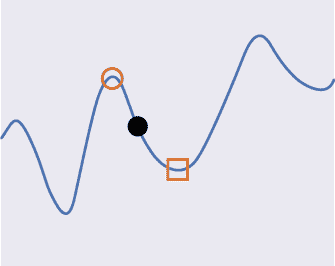

图 5-5：对于黑色的点，棕色圆圈和橙色方框分别表示该点的局部最大值和最小值。

在图 5-5 中，我们向左移动直到得到一个点，并用圆圈标记它，然后向右移动直到到达一个用方框标记的点。局部最大值是这三点中的最大值，在这种情况下是棕色圆圈的中心。局部最小值是这三点中的最小值，在这种情况下是橙色方框的中心。

如果曲线无限逼近正无穷或负无穷，情况就会变得更复杂。在本书中，我们总是假设我们可以为任何曲线上的任意点找到局部最小值和最大值。

请注意，对于任何给定的曲线，只有一个全局最大值和一个全局最小值，但对于任何给定的曲线或表面，可能会有多个局部最大值和最小值（有时称为*最大值*和*最小值*），因为它们取决于我们所考虑的点。图 5-6 直观地展示了这一概念。

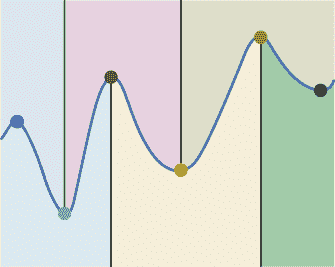

图 5-6：这些局部最大值和最小值的影响通过其对应的彩色区域来展示。

### 切线

我们通向导数的下一步涉及一个叫做*切线*的概念。为了说明这个概念，我们在图 5-7 中标出了一个二维曲线。

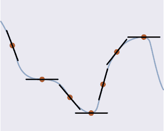

图 5-7：曲线上的一些点被标记为点。每个这些点的切线以黑色画出。

在曲线的每个点上，我们可以画一条线，其斜率由该点的曲线形状决定。这就是切线。我们可以把它想象成一条在该点仅仅与曲线接触的线。如果我们想象自己沿着曲线移动，切线就能告诉我们我们正在朝哪里看（就像如果我们有后脑眼睛一样，它也能告诉我们该朝哪里看）。切线对我们很有用，因为它在每个局部最大值和局部最小值处都是水平的。找到曲线的最大值和最小值的一种方法是找到曲线上切线水平的点（如图 5-7 所示，切线在曲线水平平坦处也是水平的，但我们暂时忽略这一点）。

这是找到切线的一种方法。让我们选择一个点，称之为*目标点*。我们可以沿着曲线向目标点的左侧和右侧各移动相等的距离，在那里画出两个点，并画一条连接这两个点的直线，如图 5-8 所示。

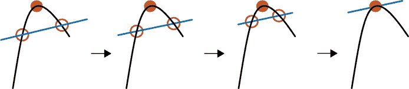

图 5-8：为了找到给定点的切线，我们可以在曲线上选取距离该点相等的两个点，并画一条连接这两个点的直线。

现在，让我们以相同的速度将这两点拉向目标点，确保它们始终位于曲线上。在它们合并的最后一刻，穿过它们的直线就是切线。我们说这条线是*切线*，意思是它只是轻轻地接触了曲线。它是描述曲线在该点的最佳直线。古希腊人称切线为*吻线*。

我们可以测量在图 5-8 中构造的切线的*斜率*。斜率就是一个数字，它告诉我们这条线与水平线之间的夹角。水平线的斜率为 0。若我们逆时针旋转这条线，斜率会变得越来越大。如果我们顺时针旋转这条线，斜率则会变得越来越小。当一条线变得完全垂直时，它的斜率被认为是无穷大。

现在我们来到了导数！它只是斜率的另一种叫法。曲线上的每个点都有自己的导数，因为每个点的切线都有自己的斜率。

图 5-9 显示了为什么我们之前制定了要求曲线连续、光滑和单值的规则。这些规则确保了我们始终能够找到切线，从而找到每个点的导数。

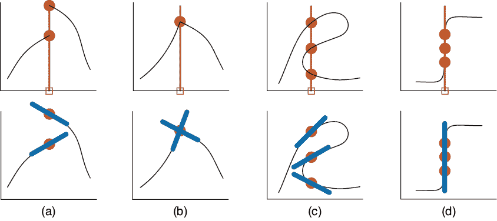

图 5-9：上排：有问题的曲线。下排：求导时的问题，以蓝色显示。

在图 5-9(a)中，曲线是不连续的，因此两个不同的曲线端点在我们选择的点（用方框标出）上有不同的导数。问题在于我们不知道该选择哪个导数，因此我们通过不允许存在不连续性来避免这个问题。在图 5-9(b)中，曲线不光滑，因此当我们从左侧和右侧到达拐点时，坡度是不同的。同样，我们不知道该选择哪个坡度，所以我们不会处理有拐点的曲线。在图 5-9(c)中，曲线不是单值的。曲线上有多个点可以选择，每个点都有自己的导数，再次，我们不知道该选择哪一个。图 5-9(d)显示了如果曲线变得完全垂直，这也违反了我们的单值规则。更糟糕的是，切线是完全垂直的，这意味着它的坡度是无限的。处理无限值会让简单的算法变得复杂和混乱。因此，我们回避了这个问题，就像回避其他问题一样，我们声明不会使用可能变得垂直的曲线，从而我们永远不需要担心无限导数。通过要求我们的曲线是连续的、光滑的和单值的，我们可以确保它们永远不会产生这种情况。

我们之前说过，曲线是函数的图形表示：我们提供一个输入值，通常沿着水平的 X 轴，然后向上（或向下）查找，以找到该 x 值对应的曲线上的 y 值。这个 y 值就是函数的输出，如图 5-10 所示。

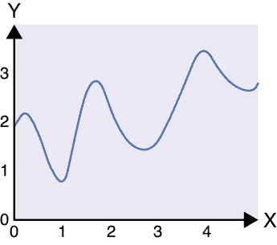

图 5-10：二维曲线。随着我们向右移动，x 值增大，y 值随着我们向上移动而增大。

当我们从某一点向右移动（也就是 x 增大时），我们可以问曲线是否给出了增大的 y 值、减小的 y 值，还是 y 值没有变化。如果随着 x 增大 y 增大，我们说切线有*正坡度*。如果随着 x 增大 y 减小，我们说切线有*负坡度*。坡度越极端（也就是越接近垂直），它就越正或越负。这只是以另一种方式说明坡度角度相对于水平线的关系。图 5-11 展示了这个概念。

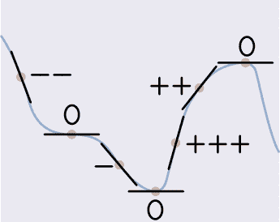

图 5-11：标记图 5-7 中切线的坡度，是否为正坡度（+）、负坡度（–）或平坦（0）

注意到在图 5-11 中有些点并不是山丘或山谷，但它们的坡度仍然是 0。我们只会在山丘的顶部、山谷的底部和像这样的高原上找到坡度为 0 的点。

### 使用导数寻找最小值和最大值

让我们看看如何使用导数来驱动一个算法，找出某一点的局部最小值或最大值。

给定曲线上的一个点，我们首先找到它的导数。如果我们想沿着曲线移动，以使 y 值增大，我们就沿着导数符号的方向移动。也就是说，如果导数是正的，那么沿 X 轴正方向（即向右移动）会带我们到更大的值。同样，如果导数是负的，那么为了找到更小的 y 值，我们就向左移动。图 5-12 展示了这个概念。

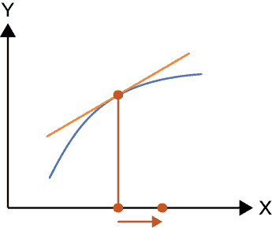

图 5-12：某一点的导数告诉我们该朝哪个方向移动，以找到曲线的更大或更小值。

我们可以把两种情况归纳起来，说为了找到某一点附近的局部最大值，我们首先找到该点的导数，然后沿 X 轴朝着导数符号的方向迈出小步。接着我们在该点找到导数并再迈出一步。我们重复这一过程，直到达到导数为 0 的点。图 5-13 展示了从最右边的点开始的这一过程。

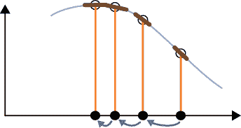

图 5-13：使用导数找到某一点的局部最大值

在我们的起始点，即最右边，我们得到一个相对较大的负导数，因此我们向左走大一步。第二次导数稍小（也就是说，斜率依然为负，但小了一些），因此我们向左走较小的一步。第三步，较小的一步，把我们带到了局部最大值处，在这里切线是水平的，因此导数为 0。为了使这个算法更实际，我们需要解决一些细节问题，例如步长的大小和如何避免超过最大值，但现在我们只关注概念上的理解。

要找到局部最小值，我们做相同的操作，但我们沿着 X 轴朝着导数符号的*相反*方向移动，如图 5-14 所示。在这里，我们从最左边的点开始，发现它的导数为负值，因此我们继续向右移动，直到找到导数为 0 的点。

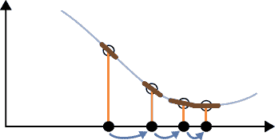

图 5-14：使用导数找到某一点的局部最小值

寻找局部最大值和最小值是机器学习中常用的核心数值技术，它依赖于我们能够在我们跟踪的每个曲线点上找到导数。我们选择平滑性、连续性和单值性这三个曲线条件，特别是为了确保我们在曲线上的每个点都能找到一个唯一的有限导数，这意味着我们可以依赖这种跟踪曲线的技术来找到局部最小值和最大值。

在机器学习中，我们的大多数曲线在大多数时候遵循这些规则。如果我们碰巧使用的曲线不遵循这些规则，并且无法计算某一点的切线或导数，通常（虽然不总是）有数学技术可以自动解决这个问题，使我们能够继续进行。

我们之前提到，当曲线平坦时，导数也为 0。这可能会让我们的算法误认为找到了一个极大值或极小值。在第十五章中，我们将看到一种叫做*动量*的技巧，可以帮助我们避免这种误判，继续寻找真正的极大值或极小值。

## 梯度

*梯度*是导数在三维、四维或*任意*维度空间中的推广。通过梯度，我们可以在这些更高维的空间中找到表面的最小值和最大值。让我们来看一下它是如何工作的。

### 水、重力与梯度

想象我们身处一个大房间中，房顶上方悬挂着一张波动的织物，它上下起伏，没有任何褶皱或撕裂，如图 5-15 所示。

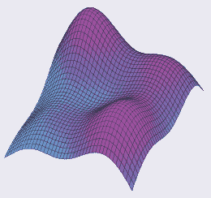

图 5-15：没有褶皱或撕裂的光滑织物

这块织物的表面自然满足我们之前对曲线的要求：它是平滑且连续的，因为它是单一的织物片，且它是单值的，因为织物不会像海浪那样翻卷自己。换句话说，从下面的任何一个点来看，织物上方只有一片表面，我们可以测量它相对于地面的高度。

现在假设我们能在某一时刻将织物冻结。如果我们爬到织物上并在上面走动，感觉就像是在一片山脉、平台和山谷的地形中徒步。

假设织物足够密实，水无法通过它。当我们站在某个位置时，往我们的脚下倾倒一些水。水自然会流向低处。事实上，水会沿着最快速的方式向下流动，因为它受到重力的拉力。在每一个点上，它实际上会搜索周围的邻域，并沿着最能让它快速向下流动的方向前进，如图 5-16 所示。

图 5-16：左图：水滴落在表面。右图：一滴水在它的局部邻域（黄色）中探索多个点，以找到最下坡的那个点。

在所有的移动方式中，水总是沿着最陡峭的路线流向低处。水流所遵循的方向称为*最大下降方向*。相反的方向，即我们尽可能快地向上爬升的方向，称为*最大上升方向*。

最大上升方向与梯度相同。如果我们想要下降，就沿着*梯度的负方向*，或称为*负梯度*。一位试图尽可能快速到达最高山顶的登山者会沿着梯度行进。而一股尽可能快速流下的溪水则沿着负梯度流动。

现在我们知道了最大上升方向，我们也可以找到它的*大小*，或者说强度、大小。那就是我们上坡的速度。如果我们在一个平缓的坡度上，升高的速度是一个小数字。如果我们在爬陡坡，它就是一个更大的数字。

### 使用梯度寻找最大值和最小值

我们可以利用梯度在三维空间（3D）中找到局部最大值，就像我们在二维空间（2D）中使用导数一样。换句话说，如果我们处在一个地形上，想要爬到周围的最高峰，我们只需要跟随梯度，始终朝着与我们脚下的点相关的梯度方向前进。

如果我们想要下降到周围的最低点，我们可以沿着负梯度前进，始终朝着与每个脚下点的梯度方向完全相反的方向走。基本上，我们就像一滴水，沿着最快的路径向下流。图 5-17 展示了这个一步步的过程。

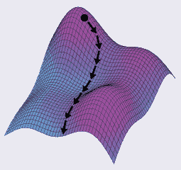

图 5-17：为了下坡，我们可以反复找到负梯度，并朝着那个方向迈出小步。

假设我们站在一座山的顶部，就像图 5-18 中所示。这是一个局部最大值（也许是全局最大值）。在这里，没有上坡的方向。如果我们放大看山顶，发现附近的表面是平的。因为没有上升的空间，我们的最大上升速度是 0，梯度的大小也是 0。根本没有梯度！我们有时说梯度已经*消失*，或者我们有一个*零梯度*。

图 5-18：在山顶的最顶部，没有上坡。左：山丘。右：我们位于山顶的地方。

当梯度消失时，就像在山顶一样，负梯度也会消失。

如果我们处于一个碗形的山谷底部，就像图 5-19 所示，这就是局部最小值（也许是全局最小值）。

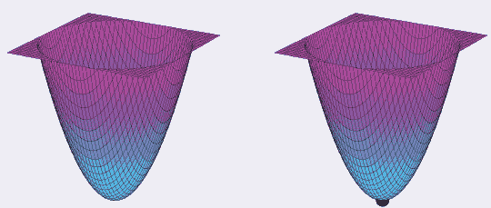

图 5-19：在碗的最底部，我们的每一步都是上坡。左：一个碗。右：碗底的一个点。

在碗的最底部，每个方向似乎都是上坡。但如果我们放大看，会发现碗底是平的。再次，梯度已经消失。

如果我们不在山顶或山谷里，或者不在坡面上，而是处于一个平坦的平原或*高原*上，就像图 5-20 所示，情况会怎样呢？

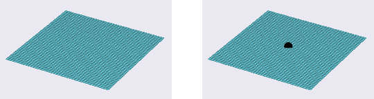

图 5-20：一个平坦的表面、平原或高原。左：高原。右：平原上的一个点，基本上位于平面上。这个点没有梯度。

就像在山顶一样，没有地方可以上坡或下坡。当我们在高原上时，我们再次没有任何梯度。

### 马鞍点

到目前为止，我们看到了局部的最小值、最大值和平台区域，就像我们在二维中看到的那样。但在三维空间中，出现了一种全新的特征。在一个方向上，我们处于山谷的底部，而在另一个方向上，我们则处于山顶。在这个点的局部邻域中，表面看起来像是马术骑手使用的鞍形。显然，这种形状被称为*鞍形*。一个示例鞍形如图 5-21 所示。

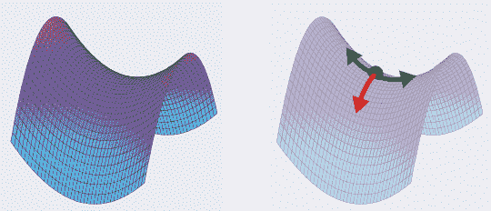

图 5-21：鞍形在一个方向上向上，另一个方向上向下。左：一个鞍形。右：鞍形上的一个点。

如果我们处在鞍形的中间，如图 5-21 所示，那就像是同时处于山顶和山谷。就像那些地方一样，当地的邻域看起来像一个平台，因此没有梯度。但如果我们在某个方向上稍微移动一下，就会发现有一点曲率，然后梯度重新出现，告诉我们从这个点开始的最大上升方向。

当我们训练一个深度学习算法时，我们通常希望找到最小的误差。把误差看作一个表面时，最理想的情况是我们能够找到一个碗底。但如果我们发现自己处在山顶、鞍形点或者平台上时，我们就说我们*被卡住*了。我们知道自己没有在最小值处，但梯度消失了，所以我们不知道该往哪个方向走才能下坡。

幸运的是，现代算法提供了多种自动化技术来帮助我们脱困。但有时它们会失败，除非我们能做出重大改变，比如提供额外的训练数据，否则我们的算法会停滞不前，无法移动到表面更低的值。从实际角度来看，这意味着算法会停止学习，输出不再改进。

我们稍后会看到，我们可以通过测量误差来观察学习进度。如果误差在我们的结果尚不可接受之前停止改善，我们可以稍微改变算法，使它在学习时走一条不同的路径，避开那个零梯度的特定位置。

## 总结

在本章中，我们探讨了一些寻找曲线最小值和最大值的方法。当我们训练一个深度学习系统时，我们会调整它以最小化系统的整体误差。如果我们把误差看作是一个多维空间中的表面，那么我们就是在寻找这个表面上的最小值。为了找到这个最小误差，我们找到最陡峭的下坡方向，这个方向由负梯度给出。然后我们会改变网络，使得误差朝着这个方向移动。从本质上讲，梯度告诉我们如何改变网络，以便减少系统的整体误差。

在后续的章节中，我们将看到如何在实际中运用这个想法，来教我们的深度学习系统在工作中变得越来越优秀。

现在，让我们转向一些信息论的内容，这将帮助我们更好地理解错误的本质以及如何解读它们。
