# 第六章：信息理论

在本章中，我们将探讨*信息理论*的基础知识。这是一个相对较新的研究领域，于 1948 年通过一篇开创性的论文向世界介绍，为现代计算机、卫星、手机和互联网等技术奠定了基础（Shannon 1948）。原始理论的目标是找到最有效的方式来电子化传递信息。但该理论的思想深刻、广泛且深远。它为我们提供了测量我们了解某事物的程度的工具，通过将信息转换为我们可以研究和操作的数字形式。

信息理论中的术语和概念构成了深度学习的基石。例如，信息理论提供的度量方法在评估深度网络的性能时非常有用。在本章中，我们将快速浏览信息理论的一些基本概念，同时避免使用抽象的数学符号。

我们从单词*information*（信息）开始，这是一个既有日常意义，又有专业科学意义的词。在这种情况下，这两种意义有很多概念上的重叠，但日常意义广泛且开放，容易受到个人理解的影响，而科学意义则是精确的，并且通过数学定义的。我们从逐步构建信息的科学定义开始，最终我们将上升到一个重要的度量标准，允许我们比较两个概率分布。

## 惊讶与语境

当我们收到任何形式的通信时，某些东西从一个地方移动到另一个地方，无论是电脉冲、一些光子，还是某人的声音。广义地说，我们可以说一个*发送者*通过某种方式将某种信息传递给*接收者*。接下来，我们将介绍一些更专业的词汇。

### 理解惊讶

在本章中，我们有时使用*惊讶*一词来表示发送者的通信对接收者来说有多么出乎意料。惊讶并不是一个正式术语。事实上，本章的目标之一是为惊讶找到更正式的名称，并附上具体的含义和度量标准。

假设我们是接收者，收到一条消息。我们想描述收到这条信息后我们有多惊讶。能够这样描述很有用，因为正如我们所看到的，惊讶越大，传递的信息量就越大。

假设我们收到了一条来自未知号码的意外短信。我们打开短信，第一句话是“Thanks”（谢谢）。我们有多惊讶呢？肯定至少有些惊讶，因为到目前为止，我们不知道这条短信是来自谁，也不知道它的内容是什么。不过，收到感谢我们的短信确实是有可能的，所以这并不是什么闻所未闻的事。

我们来设定一个假想的、完全主观的惊讶量表，其中 0 表示完全预期的事件，100 表示完全出乎意料的事件，就像在图 6-1 中所示。

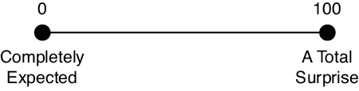

图 6-1：惊讶度量表，表示从 0 到 100 的值

在这个量表上，"Thanks"（谢谢）出现在一条意外的文本消息开头时，可能排在 20 的位置。现在假设我们消息的第一个词不是"Thanks"，而是"Hippopotamus"（河马）。除非我们在处理这些动物或与它们有其他关联，否则这可能是消息中的一个相当令人惊讶的词。我们将这个词的惊讶度定为 80，正如图 6-2 所示。

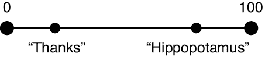

图 6-2：将消息放置在我们的惊讶度量表上

尽管"hippopotamus"（河马）可能在消息开头给人一种很大的惊讶感，但在后续的语境中它可能就不那么令人惊讶了。区别就在于语境。

### 拆解语境

对于我们的目的来说，我们可以将*语境*视为信息的环境。由于我们关注的是每条消息的意义，而不是它的传递方式，语境代表了发送者和接收者之间的共享知识，正是这些知识赋予了消息意义。

当信息是一段语言时，这种共享知识必须包括所使用的词汇，因为像 Kxnfq rnggw 这样的消息是没有意义的。我们可以将这种共享知识扩展到包括语法、表情符号和缩写的当前解释、共享的文化影响等等。这一切都被称为*全球语境*。它是我们在接收任何信息之前就已经带入的普遍知识。就像在第四章讨论的贝叶斯定理一样，部分全球语境被捕捉到我们的*先验*中，因为这就是我们表示对环境的理解以及我们期望从中学到什么的方式。

与全球语境相对的是*局部语境*。那是由消息本身的元素构成的环境。在一条文本消息中，任何给定单词的局部语境就是该消息中的其他单词。

假设我们第一次阅读这条消息，因此每个单词的局部语境仅由它前面的单词构成。我们可以利用语境来判断惊讶感。如果"Hippopotamus"是我们消息中的第一个词，那么此时没有局部语境，只有全球语境。如果我们不经常接触河马，这个词可能非常令人惊讶。但是，如果消息的开头是"Let's go down to the river area at the zoo and maybe see a big gray"（让我们去动物园的河边，或许能看到一只大灰色的动物），那么在这个语境下，"hippopotamus"（河马）就不再令人惊讶了。

我们可以通过为特定单词分配一个惊讶值，来描述在全球语境中该单词所携带的惊讶感，正如我们在图 6-1 中所做的那样。假设我们为字典中的每个单词分配一个惊讶值（这是一项繁琐的工作，但肯定是可行的）。如果我们将这些数字缩放，使它们的总和为 1，就创建了一个概率质量函数（或 pmf），正如我们在第二章中讨论的那样。这意味着我们可以从这个 pmf 中抽取一个随机变量来得到一个单词，其中最令人惊讶的单词比那些不太令人惊讶的单词更常出现。一种更常见的方法是建立一个 pmf 来表示单词的常见程度，这大致是惊讶感的对立面。在这种设置下，我们预计会更频繁地抽到那些不太令人惊讶或更常见的单词，而不是那些不常见的单词。

我们将在本章后面使用这个思想，设计一种高效的方案来传输信息的内容。

## 测量信息

在本章中，我们将谈论很多关于*比特*的内容。在日常语言中，比特通常被认为是一个小的数据包，通常被标记为 0 或 1。例如，当我们谈论“每秒比特数”的网络速度时，我们可能会把比特想象成河流中漂流的叶子，并在它们经过时进行计数。

这是一个方便的概念，但从技术角度来说，比特并不是像树叶一样的物体，而是像加仑或克那样的单位。也就是说，它不是一种物质，而是一种衡量我们所拥有的物质多少的方式。比特是一个容器，刚好能够存储我们当前认为的基本、不可分割的最小信息单元。

从这种方式谈论比特作为单位在技术上是正确的，但这并不方便。大多数时候，我们可以不加澄清地使用通俗的说法，就像我们说“我的网速是每秒 8,000 比特”而不是“我的网连接每秒能够传输 8,000 比特的信息”。我们在本书的大部分内容中将使用更通俗的语言，但了解技术定义是值得的，因为它确实会出现在一些论文和文档中，而在那些地方区分开来是很重要的。

我们可以通过一个公式来衡量文本信息的量，这个公式告诉我们需要多少比特来表示该信息。我们不会深入探讨数学内容，但会描述其中的原理。这个公式有两个输入。第一个是信息的文本内容。第二个是描述信息中每个单词所包含的惊讶感的概率质量函数（在本章中，我们将其称为*概率分布*）。当我们将信息的文本内容和概率分布结合起来时，就可以得出一个数字，告诉我们这条信息所携带的比特数。

该公式的设计是为了使它为每个单词（或者更一般地，每个*事件*）所生成的值具备四个关键属性。我们将在一个我们在办公室工作而不是在河流上的情境中说明每一个属性。

1.  可能发生的事件信息量较少。订书机的信息量较少。

1.  不太可能发生的事件包含更多信息。鳄鱼包含更多信息。

1.  可能发生的事件比不太可能发生的事件包含的信息更少。订书机传递的信息比鳄鱼少。

1.  最后，两个*不相关*事件的总信息量是它们各自信息值的和。

前三个属性将单个对象与其信息相关联。这个组中的特例是属性 4，所以我们需要更仔细地看一下它。

在正常的对话中，两个连续的词完全不相关是很少见的。但假设有人要求我们给出一个“金桔水仙花”。这些词几乎完全不相关，因此属性 4 说明我们可以通过将每个词独立传递的信息相加来找到该短语的信息。

在正常的对话中，引导到某个给定单词的词汇通常会缩小它可能是什么的范围。如果有人说：“今天我吃了一个大...”，那么接下来的“三明治”和“比萨”这类词比“浴缸”或“帆船”产生的惊讶感要少。当某些词被预期时，它们比没有预期时产生的惊讶感要少。相比之下，假设我们正在传送一个设备的序列号，它本质上是一个任意的字母序列，可能还包含数字，比如“C02NV91EFY14”。如果这些字符之间真的没有关联，那么通过加上每个字符所带来的惊讶感，我们就能得到整个序列号所代表的信息。

通过将两个不相关词汇的惊讶感合并为它们各自惊讶值的和，我们从衡量每个词汇中的惊讶感或信息，转向衡量它们组合中的惊讶感。我们可以这样不断将词汇组合成越来越大的组，直到我们考虑完整个信息。虽然我们没有涉及数学，但我们已经得出了*信息*的正式定义：它是一个通过公式生成的数字，该公式使用一个或多个事件（如单词）和一个概率分布，来描述每个事件对我们来说有多么令人惊讶。通过这两个输入，算法为每个事件提供一个数字，并确保这些数字满足我们刚才列出的四个属性。我们称每个单词的数字为其*熵*，它告诉我们传递该单词需要多少比特。

## 自适应编码

每个事件所携带的信息量受我们公式中所使用的概率函数大小的影响。换句话说，我们可能传递的词汇数量会影响每个词所携带的信息量。

假设我们要将一本书的内容从一个地方传送到另一个地方。我们可以列出书中所有独特的单词，然后为每个单词分配一个编号，可能从“the”对应 0，接着是“and”对应 1，依此类推。然后，如果接收方也有这份单词列表，我们可以仅通过发送每个单词的编号来传送这本书，从书中的第一个单词开始。Dr. Seuss 的《Green Eggs and Ham》这本书只有 50 个不同的单词（Seuss 1960）。为了表示 0 到 49 之间的一个数字，每个单词我们需要 6 位信息。相比之下，Robert Louis Stevenson 的《Treasure Island》这本书包含约 10,700 个独特的单词（Stevenson 1883）。我们必须为每个单词使用 14 位来唯一标识书中的每个单词。

尽管我们可以使用一个包含所有英语单词的大型单词列表来发送这些书籍，但更高效的做法是根据每本书的独特词汇量来定制我们的列表，仅包括我们实际需要的单词。换句话说，我们可以通过*调整*信息传输的方式，使其更符合传递的内容，从而提高效率。

让我们基于这个想法进一步探讨。

### 说摩尔斯电码

一个很好的适应性例子是摩尔斯电码。在摩尔斯电码中，每个字母字符都有一个由点和划线组成的模式，点和划线之间由空格分隔，如图 6-3 所示。

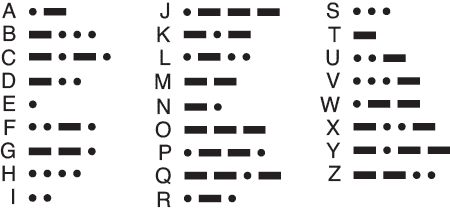

图 6-3：摩尔斯电码中的每个字符都有一个与之相关的点、划线和空格的模式。

摩尔斯电码通常通过使用电报键来发送，电报键用于启用或禁用清晰音调的传输。一个点是一个短促的音符。我们按下电报键发送一个点的时间长度由一个单位来表示，这个单位称为*dit*。一个划线持续三个 dit 的时间。符号之间留一个 dit 的静默，字母之间留三个 dit 的静默，单词之间留七个 dit 的静默。当然，这些是理想的标准。实际上，许多人可以辨认出每个朋友和同事个人的节奏，这种节奏叫做*fist*（Longden 1987）。

摩尔斯电码包含三种符号：点、划线和点大小的空格。假设我们要用摩尔斯电码发送“nice dog”这条信息。图 6-4 显示了短音（点）、长音（划线）和点大小空格的序列。

图 6-4：摩尔斯电码的三种符号：点（实心圆）、划线（实心方块）和静默空格（空心圆）。

我们通常严格地用点和划来讨论摩尔斯电码，这些被称为*符号*。分配给任何字母的符号集就是该字母的*模式*。发送信息所需的时间取决于组成信息内容的字母所分配的具体模式。例如，尽管字母 Q 和 H 都有四个符号，但发送 Q 需要 13 个点（每个 3 个划的 3 个点，1 个点，和每个 3 个空格的 1 个点），而发送字母 H 只需要 7 个点（4 个点，和每个 3 个空格的 1 个点）。

让我们比较不同字符的模式。当我们查看图 6-3 时，我们可能不清楚这些不同模式分配背后是否有任何原则。但一个美丽的思想正在等待被揭示。图 6-5 显示了 26 个罗马字母的列表，按它们在英语中的典型使用频率排序（Wikipedia 2020）。最常用的字母 E 排在列表的最前面。

图 6-5：按在英语中使用频率排序的罗马字母

现在回头看看图 6-3 中的模式。最常见的字母 E 只是一个点。下一个最常见的字母 T 只是一个划。这是唯一两个只有一个符号的模式，因此我们继续往下看两个符号。字母 A 是一个点后跟一个划。接下来是 O，它打破了这个模式，因为它太长：三个划。稍后再回来讨论。返回我们的列表，字母 I 是两个点，字母 N 是一个划和一个点。最后的两个字母模式是 M，由两个划组成，但它在我们到达的位置上已经很远了。为什么 O 太长而 M 太短？摩尔斯电码几乎遵循我们的字母频率表，但还不完全是。

解释从塞缪尔·摩尔斯开始，他在原始代码中仅定义了数字 0 到 9 的模式。字母和标点符号是由阿尔弗雷德·维尔添加到代码中的，他大约在 1844 年设计了这些模式（Bellizzi 11）。维尔没有一个简单的方法来查找字母的出现频率，但根据维尔的助手威廉·巴克斯特的说法，他知道自己应该遵循这些频率。巴克斯特说，

> 他的总体计划是采用最简单和最短的组合来表示最常出现的英语字母，将其余的字母分配给较不常见的字母。例如，他在调查后发现字母 e 的出现频率远高于其他字母，因此他为其分配了最短的符号，一个点（•）。另一方面，j 的出现频率较低，用划-点-划-点（– • – •）表示（Pope 1887）^(1)

Vail 认为，他可以通过访问新泽西州莫里斯敦的本地报社来估算英文文本中的字母频率表，当时他们仍在手动排版。那时，排版工人是逐个字母地构建页面。对于每个字母，他们会选择一个合适的*铅字*，即一根金属条的一端上压印有字母，然后将其放入一个大托盘中。Vail 推测，最常用的字符会有最多的铅字，因此他数了每个字母托盘中的铅字数量。这些流行度计数成为了他估算英语字母频率的替代指标（McEwen 1997）。尽管这个样本很小，他还是做得相当好，尽管存在一些不准确的地方，比如他显然认为 M 比 O 更常见。

为了查看我们的频率图（和摩尔斯电码）与一些实际文本的对比，图 6-6 展示了**《宝岛》**中各个字母的频率（史蒂文森 1883）。在这张图中，我们只统计了字母，并在计数前将它们转换为小写字母。我们还排除了数字、空格和标点符号。

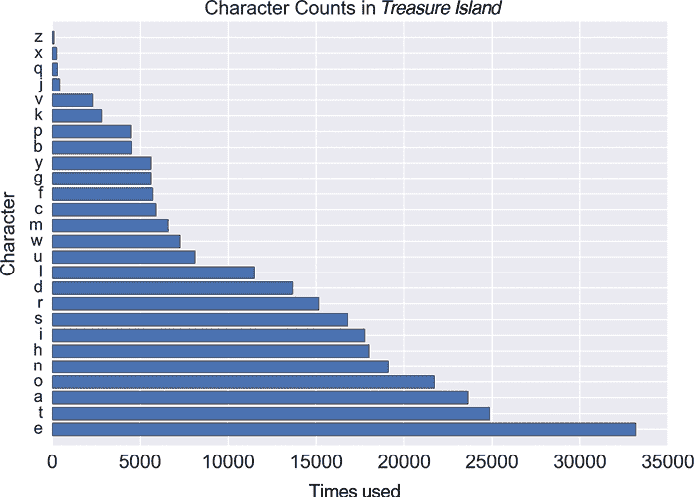

图 6-6：每个字母在**罗伯特·路易斯·史蒂文森**的《**宝岛**》中出现的次数。大写字母被当作小写字母计算。

图 6-6 中的字符顺序与图 6-5 中的字母频率图不完全匹配，但差距不大。图 6-6 看起来像是从 A 到 Z 字母的概率分布。为了使其成为一个*实际的*概率分布，我们必须对其进行缩放，使得所有条目的总和为 1。结果显示在图 6-7 中。

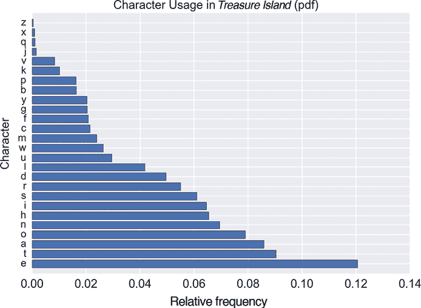

图 6-7：**《宝岛》**中字符的概率分布函数(pdf)

现在让我们利用字母的概率分布，来提高通过摩尔斯电码发送**《宝岛》**的效率。

### 自定义摩尔斯电码

为了激励我们改进通过摩尔斯电码发送**《宝岛》**的方式，首先让我们退后一步，开始思考一个假设的摩尔斯电码版本，在这个版本中，Vail 先生并没有下到报社去。而是，假设他想为每个字符分配相同数量的点和划符号。使用四个符号，他只能标记 16 个字符，但使用五个符号，他可以标记 32 个字符。

图 6-8 展示了我们如何任意地为每个字符分配这样的五符号模式。为了简化起见，我们通过使用不同的音调来表示两个符号，使得每个点和划的时间都相同。所以每个点（这里显示为黑色圆点）是一个持续一拍的高音，而每个划（显示为红色方块）是一个持续一拍的低音。结果是，每个字符需要发送九拍的时间（五拍用于点和划，现在分别是高音和低音，四拍是它们之间的间隔）。这是一个*定长编码*的例子，也叫做*固定长度编码*。

在图 6-8 中，我们没有为空格创建字符，这与原始的莫尔斯电码保持一致，因为它假定我们可以通过查看信息来判断空格的位置。遵循这一精神，我们将在接下来的讨论中忽略空格字符。

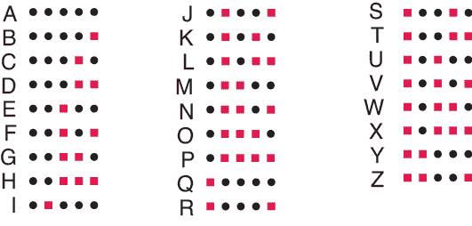

图 6-8：为每个字符分配五个符号得到固定长度编码。黑色圆圈表示高音调；红色方块表示低音调。它们的持续时间都是一个点。

《金银岛》文本中的前两个单词是名称“斯奎尔·特雷劳尼”。由于我们这种双音调版本的莫尔斯电码中的每个字符都需要 9 个点，因此这个包含 15 个字母的短语（记住我们忽略了空格）需要 9 × 15 = 135 个点的时间来发送。再加上字母之间的 14 个停顿，这些停顿需要 3 × 14 = 42 个比特，我们发现固定长度的信息需要 135 + 42 = 177 个点的时间，如图 6-9 所示。

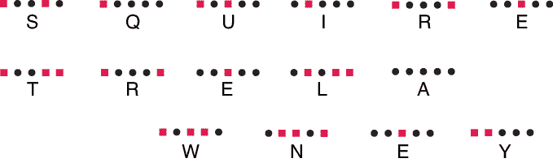

图 6-9：使用我们固定长度编码的《金银岛》前两个单词

现在将此与实际的莫尔斯电码进行比较，后者大多数情况下，常见字母所需的符号比不常见字母少。图 6-10 展示了这一点。我们将继续使用不同音调的点和划线发送信息，每个音调的持续时间为一个点。

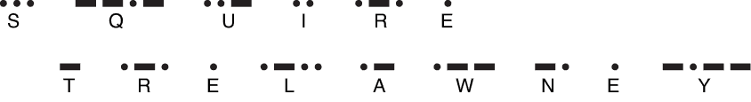

图 6-10：使用莫尔斯电码的《金银岛》前两个单词

如果我们计算出这些元素（记住现在点和划每个只需一个点），我们会发现图 6-10 版本只需要 101 个点，大约是固定长度编码时间的一半（101 / 177 ≈ 0.57）。这种节省来自于我们将编码调整为适应所发送的内容。我们将任何通过将短模式与高概率事件匹配来提高效率的编码称为*可变比特率编码*，或更简单地说，*自适应编码*。即便在这个简单的例子中，我们的自适应编码几乎是固定长度编码的两倍高效，几乎将通信时间减半。

让我们来看一下整个《金银岛》文本，它包含约 338,000 个字符（不包括空格、标点符号等）。自适应编码只需约固定长度编码所需时间的 42%。我们可以在不到非自适应编码时间的一半内发送这本书。

如果我们不使用标准的莫尔斯电码（莫尔斯电码通常适用于英语书写），而是将符号的分布调整为更接近我们发送的特定书籍文本中符号的实际百分比，我们的效率会更高。当然，我们必须与接收方共享我们的聪明编码，但如果我们正在发送一条长信息，那额外的沟通成本相比信息本身几乎可以忽略不计。让我们走出这一步，想象一个专门为《金银岛》定制的莫尔斯电码，它完全适应《金银岛》的内容。我们应该预期能够节省更多时间。

让我们用概率的语言重新表述这个问题。自适应编码为概率分布中的每个值创建一个模式。具有最高概率的值将获得尽可能最短的编码。然后，我们按从最高概率到最低概率的顺序逐个处理这些值，为每个值分配始终尽可能短的模式，并且不重复。这意味着每个新模式的长度至少和分配给前一个值的模式相同，或者更长。这正是费尔先生在 1844 年所做的，他根据当地报纸排字工的字母数量为指导。

现在，我们可以查看任何想要传达的信息，识别每个字符，并将其与告诉我们该字符最初出现概率的概率分布进行比较。这告诉我们每个字符承载的信息量，以比特为单位。得益于我们描述计算信息的公式中的第四个属性，表示消息所需的总比特数（暂时忽略上下文），正好是每个字符所需的比特数之和。

我们也可以在发送消息之前进行这个过程。这告诉我们我们即将传达给接收者的具体信息量。

## 熵

我们已经讨论过*惊讶*，它指的是那些我们没有预料到的事情。一个相关的概念是*不确定性*，它指的是那些我们知道所有可能发生的事情，但不确定哪一个会实际发生的时刻。例如，当我们掷一个公正的六面骰子时，我们知道六个面出现的概率是相等的，但直到我们掷出并查看时，我们才不确定哪个面会朝上。这种不确定性的一个更正式的术语是*熵*。

我们可以为结果的不确定性或熵赋予一个数值。这个数值通常取决于可能的结果数量。例如，抛硬币只有 2 种结果，而掷一个六面骰子有 6 种结果，从字母表中挑选一个字母则有 26 种结果。这三种结果的不确定性，或它们的熵，是一个数值，它的大小依次增加，从硬币到骰子，再到字母表，因为每种情况中的结果数量在增加。这使得每个具体结果的不可预测性增大。

在这三个例子中，每个结果的概率是相同的（硬币每一面是 1/2，骰子的每一面是 1/6，字母表中的每个字母是 1/26）。但如果结果的概率不同呢？计算熵的公式明确考虑了这些不同的概率。本质上，它考虑了分布中的所有可能结果，并为描述在我们从分布中抽样时实际产生哪个结果的不确定性赋予了一个数值。

事实证明，特定事件发生的不确定性与用一个完全适应的编码发送消息所需的比特数相同。从概念上讲，一条文本消息是从词汇表中抽取的一组单词，这与多次掷骰子的值没有什么不同。我们使用术语*熵*来表示这两种情况：事件的不确定性，或者传递该事件所需的比特数（从而消除不确定性）。

熵在机器学习中非常有用，因为它允许我们比较两个概率分布。这是学习中的关键步骤。例如，考虑一个分类器。我们可能有一张图片，我们手动判定它有 80%的可能性是狗，但有 10%的可能性是狼，3%的可能性是狐狸，还有其他一些动物的较小概率。我们希望系统的预测与这些标签相匹配。换句话说，我们希望比较我们的手动分布与系统的预测分布，并利用任何差异来改进我们的系统。我们可以发明许多比较分布的方法，但在理论和实践中最有效的方法是基于熵的。让我们从求一个单一分布的熵开始，逐步建立起这种比较方法。

考虑由单词组成的分布。如果我们的分布中只有一个单词，那么当我们从分布中抽取单词时就没有不确定性，因此熵为 0。如果有很多单词，但它们的概率都是 0，除了一个单词的概率是 1，那么仍然没有不确定性，所以熵再次为 0。当所有单词的概率相同，我们就有了最大的 uncertainty，因为没有任何选择比其他选择更可能。在这种情况下，我们的不确定性或熵达到了最大值。虽然可以方便地说最大熵应该是 1 或 100，但实际值是通过公式计算的。我们所知道的是，其他任何概率分布都不会给我们更大的熵。

在接下来的部分，我们将看到如何将熵应用于分布对的比较。

## 交叉熵

在训练深度学习系统时，我们通常希望有一个度量标准，告诉我们两个概率分布在多大程度上相同或不同。我们通常使用的值是一种叫做*交叉熵*的量，它也只是一个数字。回想一下，熵告诉我们，使用一个完美匹配消息的编码需要多少位。交叉熵则告诉我们，如果我们使用某种其他的、不太完美的编码，我们需要多少位。通常情况下，交叉熵比完美编码所需的位数要大（如果替代编码恰好与理想编码一样高效，则交叉熵的最小值为 0）。交叉熵是一个让我们数值化比较两个概率分布的测量工具。相同的分布具有 0 的交叉熵，而越来越不同的分布对的交叉熵值则会越来越大。

为了理解这个概念，让我们看两本小说，并为每本小说建立一个基于单词的自适应编码。虽然我们的目标是比较概率分布，而且我们现在讨论的是编码，但在概念上很容易来回切换。回想一下，通过构造，较小的编码对应于概率较高的单词，而较大的编码对应于概率较低的单词。

### 两种自适应编码

马克·吐温的小说《金银岛》和《哈克贝里·费恩历险记》几乎在同一时期用英语写成（斯蒂文森 1883 年；吐温 1885 年）。《金银岛》的词汇量更大，使用了大约 10,700 个独特的单词，而《哈克贝里·费恩历险记》则用了大约 7,400 个独特的单词。当然，这两本书使用的单词集完全不同，但也有很多重叠。让我们来看一下《金银岛》中最流行的 25 个单词，如图 6-11 所示。在计算单词时，我们首先将所有的大写字母转换为小写字母。因此，单字母代词“I”在图表中显示为小写字母“i”。

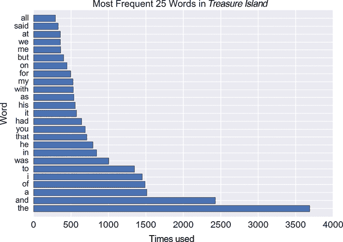

图 6-11：按出现频率排序的《金银岛》中最流行的 25 个单词

让我们将这些与《哈克贝里·费恩历险记》中最流行的 25 个单词进行比较，如图 6-12 所示。

也许并不令人惊讶，两本书中最流行的十二个单词几乎完全相同（尽管顺序不同），但随后就开始有所不同。

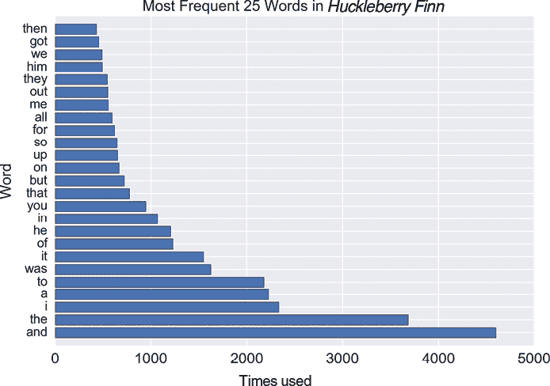

图 6-12：按出现频率排序的《哈克贝里·费恩历险记》中最流行的 25 个单词

假设我们想要逐字逐句地传输这两本书的文本。我们可以查阅英语词典，为每个单词分配一个编号，顺序为 1、2、3，依此类推。但我们从之前的摩尔斯电码示例中知道，通过使用一个适应传输内容的代码，我们可以更高效地传递信息。我们来创建这种类型的代码，单词出现得越频繁，其代码编号就越小。因此，像“the”和“and”这样的高频词可以用短代码传输，而稀有词则有更长的代码，需要传送更多的比特（在*金银岛*中大约有 2,780 个单词只出现了一次；在*哈克贝利·费恩*中大约有 2,280 个单词只出现了一次）。

两本书的词汇大部分是重合的，但每本书也有一些在另一册中没有出现的单词。例如，“yonder”这个词在*哈克贝利·费恩*中出现了 20 次，但在*金银岛*中一次也没有出现。而“schooner”这个词在*金银岛*中出现了 28 次，但在*哈克贝利·费恩*中完全找不到。

因为我们希望能够使用任意一种代码传输任何一本书，所以我们需要统一它们的词汇表。对于*哈克贝利·费恩*中在*金银岛*中没有出现的每个单词，当我们制作*金银岛*的代码时，我们会加入该单词的一次实例。我们对*哈克贝利·费恩*也做同样的事情。例如，在制作*金银岛*的代码时，我们会将“yonder”这一单词加到书的末尾，这样如果我们想要使用这个代码传输*哈克贝利·费恩*，就可以使用。

让我们从*金银岛*中的单词开始。我们将为这本书制作一个自适应代码，从为“and”分配一个小代码开始，逐渐增加代码长度，直到为像“wretchedness”这样仅出现一次的词分配较大的代码。现在，我们可以使用该代码传输整本书，相较于其他任何代码，这样可以节省时间。

现在我们将对*哈克贝利·费恩*进行相同的操作，并为这段文本创建一个专门的代码，给常见的词分配最短的代码，将像“危险”（令人震惊，但是真的：“危险”这个词在*哈克贝利·费恩*中只出现过一次！）这样的生僻词留给较大的代码。现在，*哈克贝利·费恩*的代码让我们比任何其他代码更快速地传输这本书的内容。

请注意，这两种代码是不同的。我们可以预期会有这种差异，因为两本书的词汇量不同，且涉及的主题也有显著差异。

### 使用这些代码

现在我们有了两种代码，每种代码都可以传输任意一本书。*金银岛*的代码针对每个单词在*金银岛*中的出现次数进行了调整，而*哈克贝利·费恩*的代码则针对*哈克贝利·费恩*进行了调整。

*压缩比*告诉我们使用自适应编码与固定长度编码相比，节省了多少数据。如果压缩比正好为 1，那么我们的自适应编码使用的位数与非自适应编码完全相同。如果压缩比为 0.75，那么自适应编码仅使用非自适应编码所需位数的 3/4。压缩比越小，节省的位数就越多（一些作者定义这个比率时，数字的顺序正好相反，所以压缩比越大，压缩效果越好）。

让我们尝试逐词发送这两本书。图 6-13 的顶部条形图显示了我们使用为《**哈克贝里·芬**》构建的代码发送这本书时得到的压缩比。我们使用了一种叫做*霍夫曼编码*的自适应编码，但对于大多数自适应编码，结果都会类似（霍夫曼 1952；费里尔 2020）。

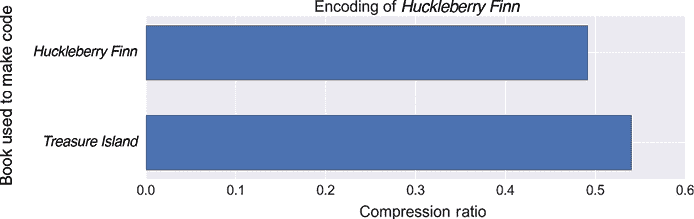

图 6-13：上图：使用为《**哈克贝里·芬**》构建的代码发送《**哈克贝里·芬**》的压缩比。下图：使用为《**宝岛**》构建的代码发送《**哈克贝里·芬**》的压缩比。

这非常棒。自适应编码的压缩比略低于 0.5，这意味着使用这种编码发送《**哈克贝里·芬**》所需的位数将不到固定长度编码的一半。如果我们使用为《**宝岛**》构建的代码来发送《**哈克贝里·芬**》，我们可以预期压缩效果不会那么好，因为该代码中的数字与我们正在编码的词频不匹配。图 6-13 的下方显示了这一结果，压缩比大约为 0.54。这仍然非常不错，但不如前者高效。

让我们换个角度，看看使用为《**宝岛**》构建的代码和为《**哈克贝里·芬**》构建的代码分别有什么效果。结果见图 6-14。

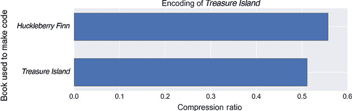

图 6-14：上图：使用为《**哈克贝里·芬**》构建的代码发送《**宝岛**》的压缩比。下图：使用为《**宝岛**》构建的代码发送《**宝岛**》的压缩比。

这一次我们发现，《**宝岛**》的压缩效果比《**哈克贝里·芬**》更好，这很有道理，因为我们使用了与其词汇使用相匹配的代码。一般来说，发送任何信息的最快方法是使用专门为该信息内容构建的编码。没有其他代码能做得更好，大多数代码会做得更差。

我们已经看到，使用《**宝岛**》代码来发送《**哈克贝里·芬**》的压缩效果较差。换句话说，使用不适合该信息的编码来发送这本书需要更多的位数。这是因为每个代码都是基于其对应的概率分布，而这些分布是不同的。

我们用来衡量两个概率分布之间差异的量是*交叉熵*。

注意，情况并非对称的。如果我们想用《*金银岛*》中的文字通过《哈克贝里·费恩》代码发送，交叉熵将与用《金银岛》代码发送《哈克贝里·费恩》时不同。我们有时会说交叉熵函数在其参数上是*不对称的*，意味着它们的顺序很重要。

一种概念化这种情况的方式是将我们的概率分布空间想象成海洋，海流在不同地方朝不同方向流动。从某个 A 点游到 B 点所需的努力，时而需要与海流抗争，时而被海流带着走，通常与从 B 点游到 A 点的努力不同。在这个比喻中，交叉熵是衡量工作的量，而不是两点之间的实际距离。但随着 A 和 B 之间的距离变得更近，游泳所需的工作量在任一方向上都会减少。

### 交叉熵在实践中

让我们来看一下交叉熵的实际应用。我们将像训练一个照片分类器时一样使用它，比较两个概率分布。第一个是我们手动创建的标签，用来描述照片中的内容。第二个是系统在我们展示给它照片时计算出的概率集。我们的目标是训练系统，使其输出与我们的标签匹配。为了做到这一点，我们需要知道系统出错的地方，并给出一个衡量错误大小的数字。这就是通过比较标签和预测得到的交叉熵。交叉熵越大，误差就越大。

在图 6-15 中，我们展示了一个虚拟分类器的输出，预测了一张狗的照片的概率。在大多数实际情况下，所有标签值都会是 0，只有狗的条目是 1。在这里，我们为六个标签分配了任意的概率，以更好地展示系统如何尝试匹配标签分布（我们可以想象这张照片模糊不清，因此我们自己也不确定它显示的是哪种动物）。

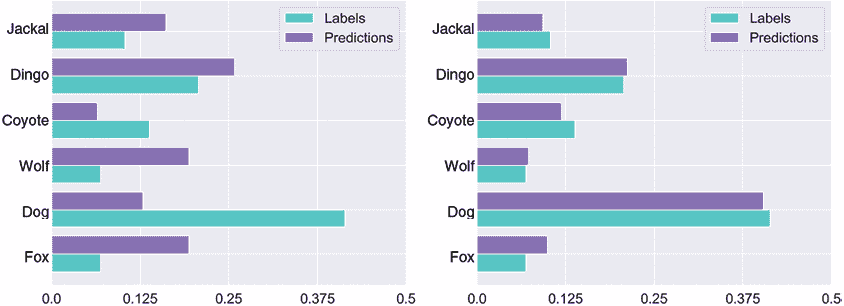

图 6-15：分类一张狗的照片。左：训练开始时。右：经过大量训练后。当匹配更好时，交叉熵更低。

左侧的图像来自训练开始时。系统的预测与我们的手动标签匹配得相当差。如果我们将这些数字带入交叉熵公式，我们得到大约 1.9 的交叉熵。在右侧，我们看到经过一些训练后的结果。现在这两个分布更为接近，交叉熵降到了大约 1.6。

大多数深度学习库提供了内置的例程，可以在一步中为我们计算交叉熵。在图 6-15 中，我们有六个类别。当只有两个类别时，我们可以使用专门为这种情况设计的例程。它通常被称为*二元交叉熵*函数。

## 库尔巴克-莱布勒散度

交叉熵是比较两个分布的一个很好的度量。通过最小化交叉熵，我们可以减少分类器输出与我们的标签之间的误差，从而提高系统性能。

我们可以通过再增加一步，概念上让事情变得稍微简单一点。让我们再次把词汇分布看作是编码。回想一下，熵告诉我们，在使用完美、调优的编码时，发送一条消息需要多少比特。而交叉熵则告诉我们，使用不完美的编码时，发送该消息需要多少比特。如果我们从交叉熵中减去熵，我们就得到了不完美编码所需的额外比特数。我们能够让这个数字尽可能小，就意味着我们需要的额外比特数越少，相应的概率分布就越相同。

不完美编码所需的额外比特数（即熵的增加）有许多令人畏惧的名称。最常见的名称是 *Kullback–Leibler 散度*，简称 *KL 散度*，这个名字来源于提出计算该值公式的科学家。较少见的名称还包括 *判别信息*、*信息散度*、*有向散度*、*相对熵* 和 *KLIC*（即 *Kullback–Leibler 信息准则*）。

像交叉熵一样，KL 散度是非对称的：参数的顺序很重要。用 Huckleberry Finn 编码发送 *Treasure Island* 的 KL 散度记作 KL(Treasure Island||Huckleberry Finn)。中间的两个竖线可以看作是一个分隔符，类似于我们更常见的逗号。我们可以将其理解为“使用…编码发送”的意思。如果我们通过数学计算，这个值大约是 0.287。我们可以把它理解为告诉我们，因为我们使用了错误的编码，所以每个词大约“多付出”了 0.3 个额外比特（Kurt 2017）。用 *Treasure Island* 编码发送 *Huckleberry Finn* 的 KL 散度，记作 KL(Huckleberry Finn||Treasure Island)，则要高得多，大约是 0.5。

KL 散度告诉我们，为了使用不完美的编码发送消息，我们需要多少额外的比特。另一种理解方式是，KL 散度描述了我们需要多少更多的信息，将我们的不完美适配的编码转换为完美编码。我们可以将其想象为贝叶斯规则的一步，在这一步中，我们从一个近似的先验（不完美编码）转换为一个更好的后验（适配的编码）。在这种情况下，KL 散度告诉我们从理想化的贝叶斯规则步骤中，我们学到了多少东西（Thomas 2017）。

我们可以通过最小化 KL 散度或交叉熵来训练系统，选择哪个更方便都可以。KL 散度具有良好的数学性质，并且出现在许多数学和算法讨论中，甚至在深度学习文档中也会涉及。但是在实践中，计算交叉熵几乎总是更快的。由于最小化任意一个都能改善系统的效果，因此我们通常在技术讨论中看到 KL 散度，而在深度学习程序中看到交叉熵。

## 总结

在本章中，我们探讨了一些信息理论的基本思想，以及如何利用这些思想来训练深度学习系统。我们通过将代码转换为概率分布来在机器学习中运用这些思想。这意味着我们将代码中最小的代码元素视为最频繁的元素，而随着数字的增大，频率则会下降。从这个角度解读，我们可以通过比较分类器对输入产生的预测概率列表与我们手动分配的概率列表，来计算交叉熵。我们在训练中的目标是尽可能使这两个分布相似，我们也可以将其表述为尽量最小化交叉熵。

这标志着本书的第一部分结束。我们已经涵盖了一些具有深远价值的基本概念，这些概念远超深度学习的范畴。统计学、概率论、贝叶斯定理、曲线和信息理论都能帮助我们理解各种各样的问题，甚至是日常生活中遇到的事物。它们能帮助我们改善对世界中发生事件的推理，从而帮助我们理解过去并为未来做准备。

拥有了这些基本原理后，我们将转向机器学习的基本工具。
