# 第七章：分类

机器学习的一个重要应用是观察一组输入，将每个输入与一组可能的类（或类别）进行比较，并将每个输入分配给其最可能的类。这个过程称为*分类*或*类别化*，我们说它是由*分类器*执行的。我们可以使用类来处理各种任务，比如识别某人通过手机说出的词语，照片中可见的动物，或者水果是否成熟。

在本章中，我们将探讨分类背后的基本思想。我们在这里不考虑具体的分类算法，因为这些内容会在第十一章详细讨论。我们现在的目标只是熟悉这些原理。我们还将讨论*聚类*，它是一种自动将没有标签的样本分组的方式。最后，我们将探讨如何在四维及更高维度的空间中，我们的直觉往往会受到干扰，导致在训练深度学习系统时出现潜在问题。在超过三维的空间中，事物可能会以出乎意料且令人惊讶的方式运作。

## 二维二元分类

分类是一个庞大的话题。让我们从一个高层次的概述开始，然后再深入探讨一些具体细节。

一种流行的训练分类器的方法是使用*监督学习*。我们首先收集一组*样本*，或者说我们想要分类的数据。这些数据被称为*训练集*。我们还准备一份*类别*列表，或者说分类标签，例如照片中可能出现的动物，或者应该分配给音频样本的音乐类型。最后，我们手动考虑训练集中的每个示例，并确定应该将其分配到哪个类别。这就是该样本的*标签*。

然后，我们将每个样本逐一提供给计算机，但不告诉它标签。计算机处理样本，并得出它认为应分配的类别的*预测*。现在，我们将计算机的预测与我们的标签进行比较。如果分类器的预测与我们的标签不匹配，我们会稍微调整分类器，使其在再次看到此样本时更有可能预测出正确的类别。我们称这个过程为*训练*，并说系统正在*学习*。我们会反复进行这一过程，通常是用成千上万甚至数百万个样本，一次又一次地重复。我们的目标是逐步改进算法，直到它的预测与我们的标签匹配的频率足够高，以至于我们认为它准备好投入实际应用，我们期望它能够正确分类之前从未见过的新样本。到那时，我们会用新数据测试它，看看它的效果如何，以及它是否准备好用于实际应用。

让我们更仔细地看看这个过程。

为了开始，让我们假设我们的输入数据仅属于两个不同的类别。仅使用两个类别简化了我们对分类的讨论，而不会遗漏任何关键点。因为每个输入只有两种可能的标签（或类别），我们称之为*二分类*。

另一种简化方法是使用二维（2D）数据，因此每个输入样本由恰好两个数字表示。这恰到好处地既有趣又简单，因为我们可以将每个样本显示为平面上的一个点。在实际操作中，这意味着我们有一堆点，或称为小圆点，显示在页面上。我们可以使用颜色和形状编码来显示每个样本的标签和计算机的预测。我们的目标是开发一个算法，能够准确地预测每个标签。当它做到了这一点，我们就可以将该算法应用于没有标签的新数据，并依赖它告诉我们哪些输入属于哪个类别。

我们称这个为*二维二分类系统*，其中“二维”指的是数据点的两个维度，而“二分类”指的是两个类别。

我们将要看的第一组技术统称为*边界方法*。这些方法背后的思想是，我们可以查看绘制在平面上的输入样本，并找到一条将空间划分开来的线或曲线，使得所有带有一种标签的样本都位于曲线（或边界）的一侧，而所有带有另一标签的样本都位于另一侧。我们将看到，一些边界在预测未来数据时比其他边界更有效。

让我们通过鸡蛋来具体化这个问题。假设我们是农场主，拥有大量下蛋的母鸡。这些鸡蛋可能已经受精并正在孵化小鸡，或者没有受精。假设如果我们仔细测量每个蛋的一些特征（例如它的重量和长度），就可以判断它是否受精。（这完全是虚构的，因为蛋并不是这么工作的！但我们假装它们是。）我们将重量和长度这两个*特征*结合起来形成一个*样本*。然后我们将样本交给分类器，它会将其归类为“受精”或“未受精”。

因为我们用于训练的每个蛋都需要一个标签，或者一个已知的正确答案，我们使用一种叫做*打光法*的技术来判断蛋是否受精（内布拉斯加州 2017）。擅长打光法的人被称为*candler*。打光法涉及将蛋在强光源前举起。最初，打光员使用蜡烛，但现在他们使用任何强光源。通过解释蛋内内容物在蛋壳上投射出的模糊暗影，熟练的打光员能够判断蛋是否受精。我们的目标是让分类器给出与熟练打光员确定的标签相同的结果。

总结一下，我们希望我们的*分类器*（计算机）能够考虑每个*样本*（鸡蛋），并利用其*特征*（重量和长度）做出*预测*（受精或未受精）。让我们从一批*训练数据*开始，这些数据给出了某些鸡蛋的重量和长度。我们可以在一个网格上绘制这些数据，将重量作为一个轴，长度作为另一个轴。图 7-1 展示了我们的初始数据。受精的鸡蛋用红色圆圈表示，未受精的鸡蛋用蓝色方框表示。通过这些数据，我们可以在两个鸡蛋群体之间画一条直线。直线一侧的所有鸡蛋都是受精的，另一侧的则是未受精的。

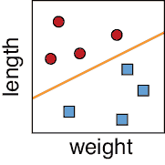

图 7-1：鸡蛋分类。红色圆圈表示受精的，蓝色方块表示未受精的。每个鸡蛋被绘制为一个点，依据其重量和长度的两个维度。橙色线将两类分开。

我们的分类器完成了！当我们得到新的鸡蛋（没有已知标签时），只需要查看它们被绘制时位于哪一边。位于受精一侧的鸡蛋被归类为“受精”，位于未受精一侧的鸡蛋被归类为“未受精”。图 7-2 展示了这个概念。

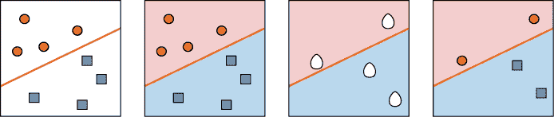

图 7-2：鸡蛋分类。左：边界。第二个从左：显示由边界划分的两个区域或域。第三个从左：四个新的样本待分类。最右边：新样本被分配的类别。

假设这几季都进展顺利，然后我们购买了一大批新种类的鸡。为了防止它们的鸡蛋和我们之前的不同，我们手动检查了来自两种鸡的新鸡蛋，并记录是否受精，然后像之前一样绘制结果。图 7-3 展示了我们的新数据。

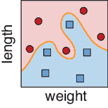

图 7-3：当我们将一些新的鸡种加入到我们的鸡群中时，仅根据重量和长度来判断鸡蛋是否受精可能会变得更加复杂。

这两个群体仍然很清晰可分，这很棒，但现在它们是通过一条弯曲的曲线而不是直线来分开的。这没问题，因为我们可以像之前一样使用这条曲线。当我们有额外的鸡蛋需要分类时，每个鸡蛋会被放置在这个图表上。如果它位于红色区域，就预测为受精；如果它位于蓝色区域，就预测为未受精。当我们能够这样清晰地将事物区分开时，我们称将平面划分成的区域为*决策区域*，它们之间的线或曲线称为*决策边界*。

假设消息传开了，人们都喜欢我们农场的鸡蛋，于是第二年我们又买了一批第三种品种的鸡。像之前一样，我们手动检查了一些鸡蛋并绘制了数据，这次得到的图表如图 7-4 所示。

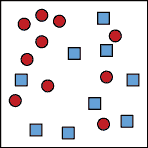

图 7-4：我们新购买的鸡使得区分受精蛋和未受精蛋变得更加困难。

我们仍然有一个主要是红色的区域和一个主要是蓝色的区域，但我们没有明确的办法来绘制一条线或曲线将它们分开。让我们采取一种更通用的方法，而不是以绝对确定性预测单一类别，而是为每个可能的类别分配一个*概率*。

图 7-5 使用颜色来表示我们网格中一个点属于某个特定类别的概率。对于每个点，如果它是亮红色的，那么我们非常确定该蛋已被受精，而红色的强度逐渐减弱对应着受精概率的降低。对于未受精的蛋，蓝色的区域具有相同的解释。

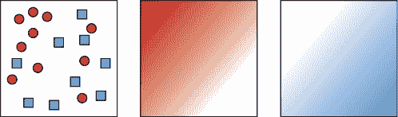

图 7-5：根据最左侧显示的重叠结果，我们可以为每个点分配一个受精的概率，如中央所示，亮红色表示该蛋更可能被受精。最右侧的图像显示了该蛋未受精的概率。

一个落在深红色区域的蛋很可能是受精的，而落在深蓝色区域的蛋很可能是未受精的。在其他地方，正确的类别并不那么明确。我们的处理方式取决于农场的政策。我们可以利用第三章中的准确率、精确率和召回率的概念来制定这个政策，并告诉我们应该绘制什么样的曲线来分隔这些类别。例如，假设“受精”对应“正例”。如果我们想非常确定地捕捉到所有受精蛋并且不介意一些假阳性，我们可以像 图 7-6 中的中心一样绘制边界。

另一方面，如果我们想找出所有未受精的蛋，并且不介意假阴性，我们可以像 图 7-6 右侧那样绘制边界。

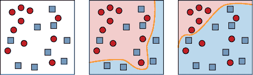

图 7-6：根据最左侧的结果，我们可以选择中央所示的策略，接受一些假阳性（未受精的蛋被分类为受精）。或者我们可以选择正确分类所有未受精的蛋，采用最右侧的策略。

当决策区域具有明显的边界且不重叠时，如 图 7-6 中的中央和右侧图像，每个样本的概率很容易计算：样本所在的类别是确定的，概率为 1，其他类别的概率为 0。但在更常见的情况下，当区域模糊或重叠时，如 图 7-5 中所示，两个类别可能都有非零概率。

在实际操作中，最终我们总是需要将概率转化为一个决策：这个蛋是受精的还是未受精的？我们的最终决策受到计算机预测的影响，但最终我们还需要考虑人为因素以及这个决策对我们的意义。

## 2D 多类别分类

我们的蛋卖得很好，但有个问题。我们只是在区分受精蛋和未受精蛋。随着我们对蛋了解更多，我们发现未受精蛋有两种不同的形成方式。未受精蛋如果从未受精，就叫做*蛋黄蛋*。这些蛋适合食用。我们可以卖给其他农民的受精蛋叫做*优胜蛋*。但在一些受精蛋中，胚胎由于某些原因停止了生长并死亡。这样的蛋叫做*退出蛋*（Arcuri 2016）。我们不想卖退出蛋，因为它们可能会突然爆裂并传播有害细菌。我们希望能够识别退出蛋并将其处理掉。

现在我们有了三类蛋：优胜蛋（可用的受精蛋）、蛋黄蛋（安全的未受精蛋）和退出蛋（不安全的受精蛋）。和之前一样，假设我们仅凭蛋的重量和长度就能区分这三种蛋。图 7-7 展示了一组测量过的蛋，以及我们通过照蛋（照明）手动分配给它们的类别。

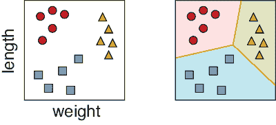

图 7-7：左：三类蛋。红色圆圈表示受精蛋。蓝色方块表示未受精但可食用的蛋黄蛋。黄色三角形表示我们想从孵化器中移除的退出蛋。右：每个类别可能的边界和区域。

将新输入分配到这三类中的一种任务叫做*多类分类*。当我们有多个类别时，我们再次找到与不同类别相关的区域之间的边界。当一个训练好的多类分类器被发布到世界上并接收到一个新样本时，它会确定该样本属于哪个区域，然后将该样本分配给该区域对应的类别。

在我们的例子中，我们可能会向每个样本添加更多的特征（或维度），例如蛋的颜色、平均周长和蛋被下的时间。这将使我们每个蛋拥有五个数字。五维空间是一个难以理解的地方，我们显然不能画出有用的图像。但我们可以通过类比来推理我们可以想象的情况。在二维空间中，我们的数据点倾向于在各自的位置上聚集，这使我们能够在它们之间画出边界线（或曲线）。在更高维度中，大多数情况下也是如此（我们将在本章末尾进一步讨论这个想法）。就像我们把二维的正方形分割成几个小的二维形状，每个形状代表一个不同的类别，我们也可以把五维空间分割成多个更小的五维形状。这些五维区域也定义了不同的类别。

数学原理不关心我们有多少个维度，我们基于这些数学原理构建的算法也不在乎。这并不是说我们作为人类不在乎，因为通常情况下，维度数越多，算法的运行时间和内存消耗也会相应增加。我们将在本章末尾回到处理高维数据时涉及的一些问题。

## 多分类分类

二分类器通常比多分类器更简单、更快速。但在实际应用中，大多数数据都有多个类别。幸运的是，我们可以通过构建多个二分类器并结合它们的结果来生成一个多分类的答案，而无需构建一个复杂的多分类器。让我们看看两种流行的方法来实现这一技术。

### 一对其余

我们的第一种技术有几个名字：*一对多*（*OvR*）、*一对所有*（*OvA*）、*一对其余*（*OAA*）或*二元相关性*方法。假设我们有五个类别的数据，分别用字母 A 到 E 命名。我们不是构建一个复杂的分类器来分配这五个标签，而是构建五个更简单的二分类器，并分别命名为 A 到 E，表示每个分类器专注于的类别。分类器 A 告诉我们一个给定数据是否属于类别 A。由于它是一个二分类器，它有一个决策边界，将空间划分为两个区域：类别 A 和其他类别。我们现在可以理解“一对其余”这个名称的来源了。在这个分类器中，类别 A 是“一个”，类别 B 到 E 是“其余”。

我们的第二个分类器，命名为分类器 B，是另一个二分类器。它告诉我们一个样本是否属于类别 B。以此类推，分类器 C 告诉我们一个样本是否属于类别 C，而分类器 D 和 E 则分别对类别 D 和 E 执行相同的操作。图 7-8 总结了这个概念。在这里，我们使用了一种算法，它在为每个分类器构建边界时考虑了所有数据。

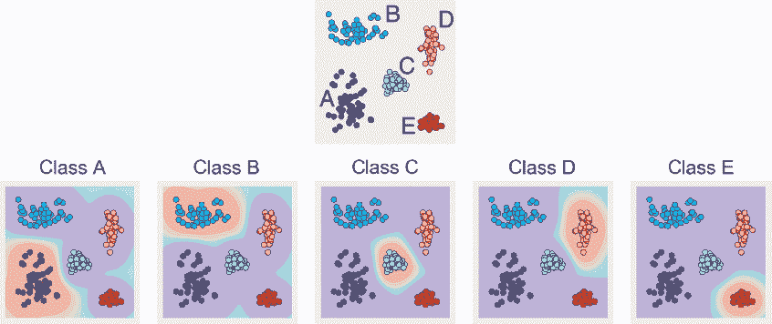

图 7-8：一对多分类。上排：来自五个不同类别的样本。下排：五个不同二分类器的决策区域。从紫色到粉色的颜色显示了该点属于某类别的概率逐渐增加。

请注意，二维空间中的某些位置可能属于多个类别。例如，右上角的点来自类别 A、B 和 D，且它们的概率非零。

为了对一个样本进行分类，我们依次通过我们的五个二分类器，得到该点属于每个类别的概率。然后，我们找到概率最大的类别，这就是该点被分配到的类别。图 7-9 展示了这一过程的实际操作。

图 7-9：使用一对其余方法对样本进行分类。新样本是黑色的点。

在图 7-9 中，前四个分类器的返回概率都较低。类别 E 的分类器为该点分配了比其他分类器更大的概率，因此该点被预测为来自类别 E。

这种方法的吸引力在于它的概念简单且速度较快。缺点是我们需要训练五个分类器，而不是仅仅一个，并且随后我们必须对每一个输入样本进行五次分类，才能找出它属于哪个类别。当类别数较多且边界复杂时，运行大量二元分类器所需的时间会积累起来。另一方面，我们可以将所有五个分类器并行运行，因此如果我们有合适的设备，所有分类器的运行时间将与其中任何一个分类器的运行时间相同。对于任何应用，我们需要根据时间、预算和硬件限制来平衡这些权衡。

### 一对一

我们的第二种方法是使用二元分类器处理多类别问题，称为*一对一*（*OvO*），它使用的二元分类器数量比一对多（OvR）还要多。一般来说，方法的核心思想是查看数据中每一对类别，并为这两类建立一个分类器。由于随着类别数的增加，可能的配对数迅速增加，因此这种方法中的分类器数量也会随着类别数的增加而迅速增长。为了让事情更容易管理，这次我们只考虑四个类别，如图 7-10 所示。

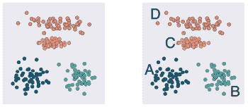

图 7-10：左侧：展示 OvO 分类的四个类别点。右侧：各簇的名称。

我们从一个二元分类器开始，该分类器仅使用来自类别 A 和 B 的数据进行训练。为了训练这个分类器，我们仅仅排除掉所有未标记为 A 或 B 的样本，就好像它们根本不存在一样。这个分类器找到一个边界，将类别 A 和 B 分开。现在，每次我们将一个新样本输入到这个分类器时，它会告诉我们该样本属于类别 A 还是 B。由于这是该分类器唯一可以选择的两个选项，因此它会将数据集中每个点都分类为 A 或 B，即使它其实不是这两个中的任何一个。我们很快就会明白为什么这样做是可以的。

接下来，我们建立一个仅使用类别 A 和 C 的数据进行训练的分类器，另一个则用于类别 A 和 D。图 7-11 的顶部行以图形方式展示了这一过程。接着，我们继续进行所有其他配对，构建仅使用类别 B 和 C 以及 B 和 D 的数据进行训练的二元分类器，正如图 7-11 第二行所示。最后，我们到达类别 C 和 D 的配对，这一过程展示在图 7-11 的底行。最终的结果是我们有了六个二元分类器，每个分类器告诉我们数据最可能属于哪个特定的类别。

为了对一个新示例进行分类，我们需要将其传入所有六个分类器，然后选择出现次数最多的标签。换句话说，每个分类器都会投票选出两个类中的一个，最终我们将出现最多票数的类别作为该样本的预测类。图 7-12 展示了 OvO 方法的实际应用。

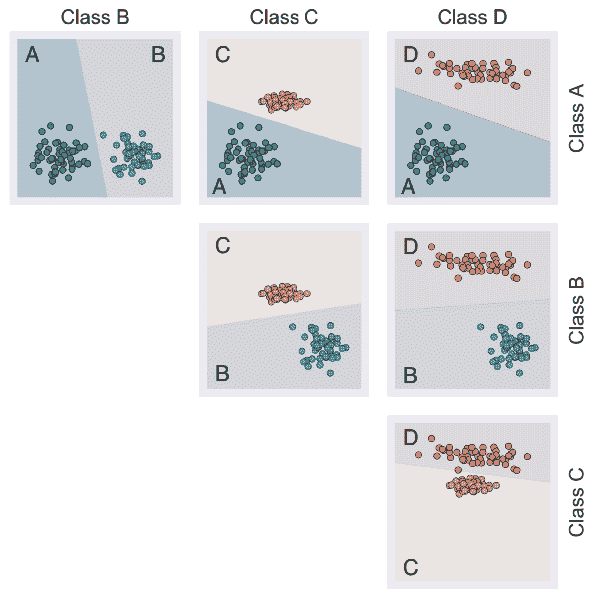

图 7-11：构建用于执行 OvO 分类的六个二元分类器，分类四个类。顶部行：从左到右，分别是 A 和 B、A 和 C、A 和 D 的二元分类器。第二行：从左到右，分别是 B 和 C、B 和 D 的二元分类器。底部行：C 和 D 类的二元分类器。

在这个例子中，A 类得到了三票，B 类得到了四票，C 类得到了两票，而 D 类没有得到任何票数。最终的赢家是 A 类，因此它是该样本的预测类别。

One-versus-one 方法通常需要比 one-versus-rest 方法更多的分类器，但有时它更具吸引力，因为它可以提供关于样本如何在每一对可能的类别之间进行评估的更清晰理解。这可以使得系统更具透明性，或者在我们想了解系统如何得出最终答案时具有更好的可解释性。当多个类别之间存在大量混杂的重叠时，One-versus-one 方法能够帮助我们人类更容易理解最终结果。

这种清晰性的代价是巨大的。One-versus-one 方法需要的分类器数量随着类别数量的增加而迅速增长。我们已经看到，当类别数量为 4 时，我们需要 6 个分类器。更进一步，图 7-13 展示了随着类别数量增加，所需的二元分类器数量增长的速度有多快。对于 5 类，我们需要 10 个分类器，20 类时需要 190 个，30 类时需要 435 个分类器！当类别数量超过 46 时，我们需要超过 1,000 个分类器。

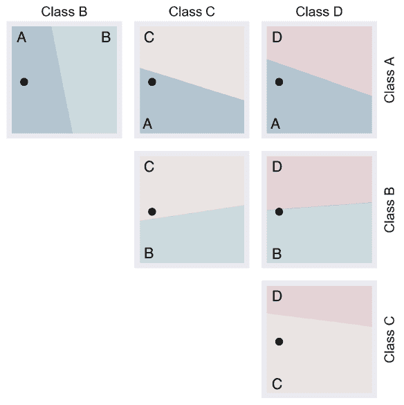

图 7-12：OvO 方法的实际应用，分类一个显示为黑点的新样本。顶部行：从左到右，投票结果为 A、A 和 A。第二行：从左到右，投票结果为 C 和 B。底部行：投票结果为 C 类。

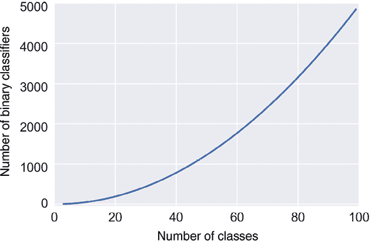

图 7-13：随着类别数量的增加，我们需要的 OvO 二元分类器数量增长得非常快。

每个二元分类器都需要进行训练，之后我们需要将每个新样本传入每个分类器，这将消耗大量的计算机内存和时间。某些情况下，使用一个单一、复杂的多类分类器会更高效。

## 聚类

我们已经看到，一种对新样本进行分类的方法是将空间划分为不同的区域，然后测试每个点与每个区域的关系。另一种方法是将训练集数据本身分成*簇*，或者相似的块。假设我们的数据有相关的标签，我们如何利用这些标签来进行聚类？

在图 7-14 的左图中，我们有五个不同标签的数据，通过颜色显示。对于这些分离得很好的组，我们只需画出每组点的曲线，就能形成簇，如中间的图所示。如果我们将这些曲线向外延伸，直到它们互相交汇，让网格中的每个点都根据它最接近的簇被上色，我们就可以覆盖整个平面，如右图所示。

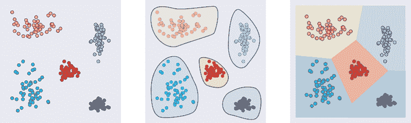

图 7-14：聚簇增长。左图：开始时的数据，包含五个类别。中图：识别出五个组。右图：将这些组向外扩展，直到每个点都被分配到一个类别。

这种方法要求我们的输入数据有标签。如果我们没有标签呢？如果我们能以某种方式自动将未标记的数据分成簇，我们仍然可以应用我们刚才描述的技术。

记住，涉及无标签数据的问题属于我们称之为 *无监督学习* 的学习类型。

当我们使用算法自动从未标记的数据中推导出簇时，我们必须告诉它我们希望它找到多少个簇。这个“簇的数量”值通常用字母 *k* 来表示（这是一个任意的字母，并没有特别的含义）。我们说 *k* 是一个 *超参数*，即我们在训练系统之前选择的一个值。我们选择的 *k* 值告诉算法应该构建多少个区域（即，将我们的数据分成多少个类）。由于该算法使用点群的几何均值或平均值来构建簇，因此该算法被称为 *k-均值聚类*。

选择 *k* 值的自由是一个祝福也是一个诅咒。拥有这一选择的好处是，如果我们事先知道应该有多少个簇，我们可以直接告诉算法，算法就会产生我们想要的结果。请记住，计算机并不知道我们认为簇的边界应该在哪里，因此尽管它将数据分成了 *k* 个部分，但这些部分可能不是我们预期的样子。但是，如果我们的数据已经很好地分开了，样本聚集在一起且之间有较大的空隙，我们通常会得到我们期望的结果。簇的边界越模糊或重叠，事情就越有可能让我们感到意外。

提前指定 *k* 的缺点是我们可能不知道多少个簇最能描述我们的数据。如果我们选择的簇太少，那么我们就无法将数据分成最有用的不同类别。但是，如果我们选择的簇太多，那么我们最终可能会把相似的数据分到不同的类别中。

要查看这个过程，考虑一下图 7-15 中的数据。这里有 200 个未标记的点，故意将它们聚集成五组。

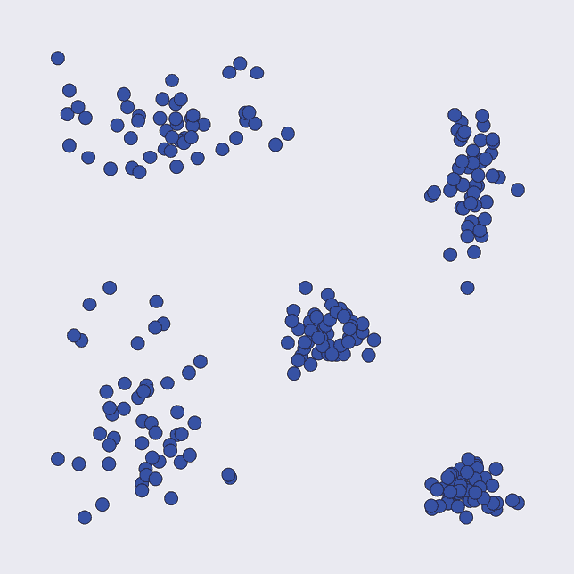

图 7-15：一组 200 个未标记的点。它们似乎在视觉上被分成了五组。

图 7-16 展示了*k*-均值聚类如何为不同的*k*值划分这组点。记住，我们在算法开始工作之前会提供*k*值作为参数。

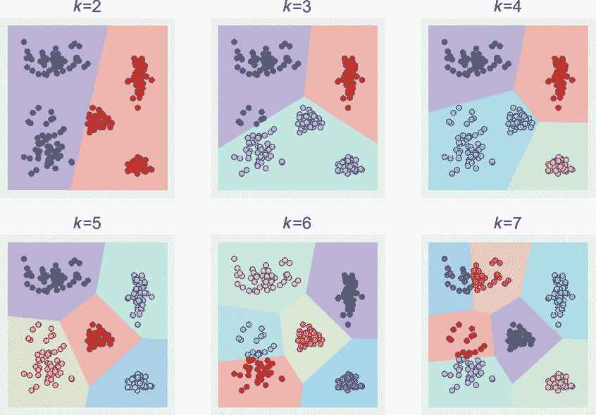

图 7-16：自动对图 7-15 中的数据进行聚类，*k*值从 2 到 7

不足为奇的是，*k* = 5 在这组数据上表现得最好，但我们使用的是一个简单的示例，边界容易辨识。在更复杂的数据中，尤其是当数据维度超过两三个时，我们几乎不可能轻松地在事前识别出最有用的聚类数。

但并非一切都失去希望。一种常见的选择是多次训练我们的聚类模型，每次使用不同的*k*值。通过衡量结果的质量，这种*超参数调优*让我们能够自动搜索一个合适的*k*值，评估每个选择的预测结果，并报告表现最好的*k*值。当然，缺点是，这需要计算资源和时间。这就是为什么在聚类之前使用某种可视化工具来*预览*数据如此有用。如果我们能够立刻选出最佳的*k*值，或者甚至给出一个可能值的范围，就能节省评估那些无法提供良好结果的*k*值的时间和精力。

## 维度灾难

我们一直在使用具有两个特征的数据示例，因为二维数据很容易在页面上绘制。但实际上，我们的数据可以有任意数量的特征或维度。似乎特征越多，我们的分类器效果越好。因为更多的特征意味着分类器可以使用更多的信息来找到数据中的边界（或聚类），这似乎是合乎逻辑的。

这在某种程度上是正确的。超过这个点后，向数据中添加更多特征实际上会让情况变得*更糟*。在我们的鸡蛋分类示例中，我们可以为每个样本添加更多的特征，例如蛋下的温度、母鸡的年龄、巢中同时有的其他鸡蛋数量、湿度等。但正如我们将看到的，添加更多特征通常会使得系统更难，而不是更容易，准确地分类输入。

这个反直觉的观点出现得如此频繁，以至于它有了一个特别的名字：*维度灾难*（Bellman 1957）。这个词在不同领域有不同的含义。在这里我们使用它指的是机器学习中的含义（Hughes 1968）。让我们来看看这个“灾难”是如何产生的，以及它告诉我们关于训练的哪些信息。

### 维度与密度

形象地理解维度灾难的一种方法是思考分类器如何找到边界曲线或边界面。如果只有少数几个点，分类器可以发明大量的曲线或面来划分数据。为了选择一个在未来数据中表现最好的边界，我们需要更多的训练样本。这样分类器就可以选择出最能分离这些更密集样本的边界。图 7-17 直观地展示了这一思路。

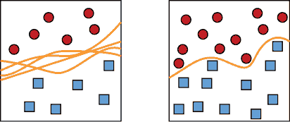

图 7-17：为了找到最佳的边界曲线，我们需要样本的良好密度。左图：我们有很少的样本，因此可以构建许多不同的边界曲线。右图：通过更高密度的样本，我们可以找到一条好的边界曲线。

如图 7-17 所示，找到一条好的曲线需要密集的点集。但关键的洞察是：当我们为样本添加维度（或特征）时，为了在样本空间中保持合理的密度，我们所需的样本数量会爆炸性增加。如果我们跟不上这种需求，分类器会尽力而为，但它没有足够的信息来绘制出好的边界。它就像图 7-17 左侧的情况，正在猜测最佳的边界，而这可能会导致未来数据上的结果不佳。

让我们通过鸡蛋的例子来看一下密度丧失的问题。为了简化问题，我们假设所有可能测量的鸡蛋特征（如体积、长度等）都位于 0 到 1 的范围内。首先，我们用一个包含 10 个样本的数据集，每个样本有一个特征（鸡蛋的重量）。由于每个鸡蛋有一个维度描述，我们可以将它绘制在一个从 0 到 1 的单维线段上。为了查看我们的样本是否覆盖了线段的每一部分，我们将线段划分成几个部分，或者叫做区间，看看每个区间内有多少个样本。区间只是一个帮助我们估算密度的概念工具。图 7-18 显示了一个数据集如何分布在区间[0,1]上，且该区间被划分为 5 个区间。

图 7-18：我们的 10 个数据点每个都有一个维度。

选择 10 个样本和 5 个区间并没有什么特别之处。我们之所以选择它们，是因为这样画图更方便。如果我们选择 300 个鸡蛋或 1700 个区间，我们讨论的核心内容不会发生变化。

我们空间的*密度*是样本数除以箱子数。这为我们提供了一种粗略的方式来衡量我们的数据在多大程度上填充了可能值的空间。换句话说，我们是否有足够的示例来学习大多数输入值？如果我们有太多空的箱子，问题就开始显现出来。在这种情况下，密度是 10 / 5 = 2，这告诉我们每个箱子（平均）有 2 个样本。通过查看图 7-18，我们可以看到这是每个箱子中样本数的一个相当不错的估计。在一维数据中，密度为 2 让我们能够找到一个好的边界。

现在让我们将每个蛋的重量也包含进描述中。由于我们现在有了两个维度，我们可以将图 7-18 中的线段向上拉，形成一个二维正方形，如图 7-19 所示。

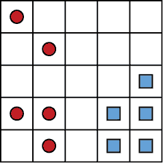

图 7-19：我们的 10 个样本现在每个都由两个测量值或维度来描述。

像之前一样，将每个边分成 5 个部分，我们得到了 25 个箱子在正方形内部。但我们仍然只有 10 个样本。这意味着大多数区域将没有数据。现在的密度是 10 / (5 × 5) = 10 / 25 = 0.4，远低于一维数据时的密度 2。因此，我们可以绘制许多不同的边界曲线来划分图 7-19 中的数据。

现在让我们添加第三个维度，比如蛋被产下时的温度（缩放到 0 到 1 之间的值）。为了表示这个第三个维度，我们将正方形推回页面，形成一个 3D 立方体，如图 7-20 所示。

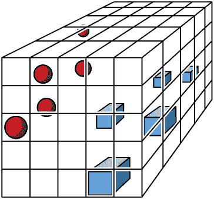

图 7-20：现在我们的 10 个数据点由三个测量值表示，因此我们将它们绘制在 3D 空间中。

通过将每个轴分成 5 个部分，我们现在有了 125 个小立方体，但我们仍然只有 10 个样本。我们的密度已下降到 10 / (5 × 5 × 5) = 10 / 125 = 0.08。换句话说，平均每个单元格包含 0.08 个样本。我们的密度从 2 降到了 0.4，再降到 0.08。不管数据位于 3D 空间的哪个位置，绝大部分空间都是空的。

任何将这个 3D 数据分成两部分并设置边界面的分类器，都必须做出一个大猜测。问题不在于分隔数据困难，而在于太容易了。并不清楚如何最好地分隔数据，使我们的系统能够*泛化*，即正确分类我们未来得到的点。分类器将不得不将许多空的框分类为属于某一类，但它没有足够的信息以系统化的方式做到这一点。

换句话说，谁知道我们的系统部署后，新样本会最终到达哪里？目前，没人知道。图 7-21 显示了一个边界面猜测，但正如我们在图 7-17 中看到的那样，我们可以通过两个样本集之间的大开放空间拟合各种平面和弯曲的面。它们中的大多数可能不会很好地进行泛化。也许这个面离红色小球太近了，或者也许它离得还不够近，或者也许它应该是一个弯曲的表面而不是平面。

当我们用这个边界面预测新数据的类别时，期望的低质量并不是分类器的错。这个平面是一个完全合适的边界面，考虑到分类器可用的数据。问题在于，由于样本的密度如此低，分类器根本没有足够的信息来做好工作。随着每增加一个维度，密度像石头一样急剧下降，随着我们添加更多特征，密度继续暴跌。

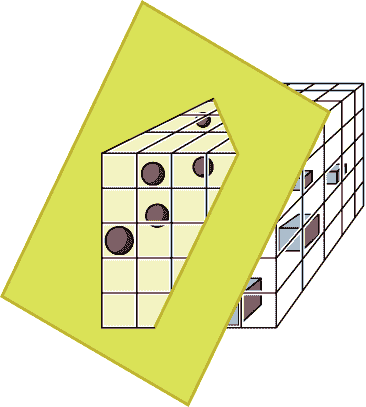

图 7-21：通过我们的立方体传递一个边界面，分隔红色和蓝色的样本

在三维以上的空间中很难画出图形，但我们可以计算它们的密度。图 7-22 显示了随着维度数增加，我们的 10 个样本的空间密度变化图。每条曲线对应每个轴上不同的箱数。请注意，随着维度的增加，不管我们使用多少箱，密度都会下降到 0。

如果我们有更少的箱数，我们有更大的机会填满每个箱子，但很快，箱数的增加就变得无关紧要。随着维度数的增加，我们的密度总是趋向于 0。这意味着我们的分类器最终会在猜测边界应该在哪里。将更多特征与我们的蛋数据结合起来会在一段时间内改善分类器，因为边界能更好地跟随数据的位置。但最终，我们需要大量的数据来满足这些新特征所要求的密度需求。

有一些特殊情况，新特征所造成的密度缺失不会引发问题。如果我们的新特征是冗余的，那么现有的边界已经足够好，无需更改。或者如果理想的边界很简单，比如一个平面，那么增加维度的数量不会改变该边界的形状。但在一般情况下，新特征会为我们的边界增加精细化和细节。因为为适应这些特征而增加的新维度导致密度下降到接近 0，这使得边界变得更难以找到，因此计算机会本质上在猜测它的形状和位置。

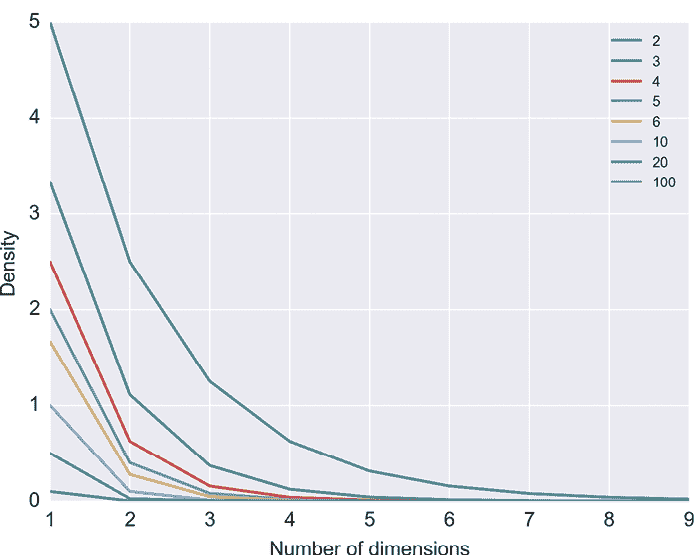

图 7-22：这是随着维度数增加，固定数量样本的点密度如何下降的示意图。每一条彩色曲线显示了沿每个轴的不同数量的箱数。

维度灾难是一个严重的问题，它可能让所有的分类尝试都变得徒劳无功。毕竟，没有一个好的边界，分类器就无法做好分类。挽救局面的是*非均匀性的祝福*（Domingos 2012），我们更倾向于将其称为*结构的祝福*。这个术语描述了这样一个观察结果：在实际情况中，即使在非常高维的空间中，我们通常测量的特征也不会在样本的空间中均匀分布。也就是说，它们不会均匀分布在我们所看到的线、平面和立方体中，或者我们无法绘制的这些形状的高维版本中。相反，它们通常会聚集在小区域内，或者分布在更简单、更低维的表面上（例如一张起伏的纸面或一条曲线）。这意味着我们的训练数据和所有未来数据通常会落在相同的区域中。这些区域将是密集的，而其余大部分空间将是空的。这是个好消息，因为它表明，无论我们如何在那些大空区域中绘制边界面，都没关系，因为那里不会有数据出现。我们希望并通常能发现的，正是样本实际落入的地方的良好密度。

让我们看看这种结构化的实际应用。在我们展示的图 7-20 中，我们可能会发现每个类别的样本都位于同一水平面上，而不是在立方体中大致均匀地分布。这意味着，任何大致水平的边界面，分割这些群体的可能也能很好地适应新数据，只要这些新值也倾向于落在这些水平面上。图 7-23 展示了这个想法。

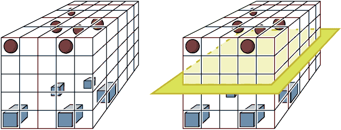

图 7-23：实际上，我们的数据在样本空间中通常有一些结构。左：每组样本大多位于立方体的同一水平切片中。右：一条边界面穿过了两组点之间。

图 7-23 中的大部分立方体是空的，因此密度较低，但我们关心的部分具有较高的密度，因此我们可以找到一个合理的边界。尽管维度灾难注定使得我们在整体空间中拥有低密度，即使有大量数据，但结构的祝福告诉我们，我们通常会在需要的地方获得合理的高密度。在图 7-23 的右侧，我们展示了一个穿过立方体中部的边界面。这可以完成分离类别的任务，但由于它们聚集得如此紧密，并且它们之间的空间是空的，几乎任何分割这些群体的边界面都可能在泛化时表现良好。

请注意，维度灾难和维度优势都是经验观察，而不是我们可以始终依赖的硬性事实。因此，这个重要实际问题的最佳解决方案通常是尽可能多地填充样本空间，获取尽可能多的数据。在第十章中，我们将看到一些方法来减少数据中的特征数，如果它似乎导致不好的边界。

维度灾难是机器学习系统在训练时需要大量数据的原因之一。如果样本具有许多特征（或维度），我们需要大量的样本才能获得足够的密度，从而做出准确的分类预测。

假设我们想要足够的点数来获得特定的密度，比如 0.1 或 0.5。随着维度的增加，我们需要多少点呢？图 7-24 显示了所需点数迅速激增的情况。

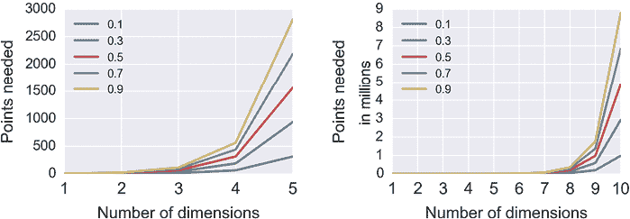

图 7-24：为了实现不同密度所需的点数，假设我们在每个轴上有五个划分

一般来说，如果维度较低，并且我们有大量的点，那么我们很可能已经有足够的密度，使得分类器可以找到一个有很大可能性能够很好地推广到新数据的表面。句子中的*低*和*大量*的具体值取决于我们使用的算法以及数据的特点。没有固定的规则来预测这些值；我们通常会做一个猜测，看看得到的性能如何，然后进行调整。一般来说，在训练数据方面，更多确实意味着更多。尽可能获取所有你道德上可以获得的数据。

### 高维空间的奇异性

由于现实世界中的数据样本通常具有许多特征，我们经常在具有多个维度的空间中工作。我们之前看到，如果数据具有局部结构，我们通常没问题：我们对大空旷区域边界的无知不会对我们产生负面影响，因为没有输入数据会落入那里。但如果我们的数据没有结构或没有聚类呢？

很容易看图像，比如图 7-19 和 7-20，凭直觉指导我们设计学习系统，认为多维空间就像我们习惯的空间，只是更大而已。但事实并非如此！对于高维空间的特征，有一个技术术语：*奇怪*。事物的发展往往出乎我们意料。让我们看两个关于高维几何奇异性的警示故事，以训练我们的直觉，避免从我们熟悉的低维空间跳跃到泛化的结论。这将帮助我们在设计学习系统时保持警觉。

#### 一个球体在立方体中的体积

一个著名的高维空间怪异性例子涉及一个球体在立方体中的体积（Spruyt 2014）。设置很简单：取一个球体并放入一个立方体中，然后测量球体占据了立方体多少空间。让我们先在一维、二维和三维中做这个。然后我们继续向更高维度推进，跟踪随着维度增加，球体占据立方体的百分比。

图 7-25 帮助我们了解 1D、2D 和 3D 的情况。

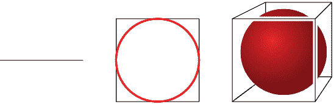

图 7-25：立方体中的球体。左：一个 1D 的“立方体”是一个线段，而“球体”完全覆盖了它。中：一个 2D 的“立方体”是一个正方形，而“球体”是一个触及边缘的圆形。右：一个 3D 的立方体包围着一个球体，球体接触到每个面的中心。

在一维中，我们的“立方体”只是一个线段，而球体是一个覆盖整个线段的线段。球体内容与“立方体”内容的比率是 1:1。在二维中，我们的“立方体”是一个正方形，而球体是一个圆，正好触及四条边的中心。圆的面积与盒子面积的比大约是 0.8。在三维中，我们的立方体是一个正常的 3D 立方体，球体正好适应其中，接触到六个面的中心。球体体积与立方体体积的比约为 0.5。

球体相对于包围它的盒子所占的空间正在下降。如果我们进行数学计算，并计算更高维度下球体的体积与其立方体的体积（它们被称为 *超球体* 和 *超立方体*），我们得到的结果如 图 7-26 所示。

图 7-26：不同维度下，最大球体在盒子中所占的体积比例

超球体所占的体积逐渐接近 0。到了 10 维时，我们能放入它包围盒中的最大球体几乎不占据盒子的体积！

这与我们在 3D 世界中的经验大相径庭。如果我们取一个超立方体（具有多个维度），并将其中能容纳的最大超球体（具有相同数量的维度）放入其中，那个超球体的体积几乎为 0\。

这没有什么技巧，也没有出错。当我们计算数学时，结果就是这样。我们在前三个维度中看到了这个模式，但我们无法真正画出其余的维度，所以很难想象这到底是怎么发生的。但它确实是这样发生的，因为更高的维度很奇怪。

#### 将超球体装入超立方体

为了确保我们的直觉正确无误，让我们再来看一个来自将超球体装入超立方体的奇特结果。假设我们要运输一些特别精美的橙子，并确保它们在运输过程中不受任何损坏。每个橙子的形状接近球形，因此我们决定将它们装入立方体盒子中，并用充气气球进行保护。我们在盒子的每个角落放一个气球，使得每个气球都触碰到橙子和盒子的侧面。这些气球和橙子都是完美的球体。那么，我们能将一个多大的橙子放入给定尺寸的立方体盒子中呢？

我们想要回答这个问题，对于任何维度的立方体（以及气球和橙子），让我们从二维开始。我们的盒子是一个大小为 4×4 的二维正方形，四个气球是半径为 1 的圆形，放置在四个角落，如图 7-27 所示。

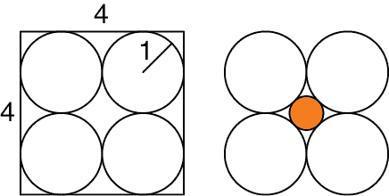

图 7-27：将一个圆形二维橙子装入一个方形盒子中，盒子的四个角落被圆形气球包围。左图：四个气球的半径均为 1，因此它们可以完美地装入一个边长为 4 的方形盒子中。右图：橙子被放置在气球之间。

我们在这个二维图中的橙子也是一个圆形。在图 7-27 中，我们展示了能够放入的最大橙子。通过一点几何学推算，我们得知这个橙子圆的半径大约是 0.4。

现在让我们转到三维空间，因此我们有一个立方体（每边仍然是 4 单位）。我们现在可以将八个半径为 1 的球形气球放入立方体的角落，如图 7-28 所示。与往常一样，橙子被放入气球之间的中央空间。

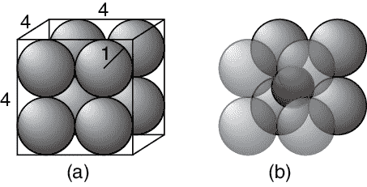

图 7-28：将一个球形橙子装入一个立方体盒子中，盒子的每个角落都被球形气球包围。左图：盒子的尺寸为 4×4×4，八个气球的半径均为 1。右图：橙子坐落在气球的中央。

另一个几何问题（这次是三维的）告诉我们，这个橙子的半径大约是 0.7。这比二维情况下的橙子半径要大，因为在三维空间中，橙子可以在球体之间的中央空隙中获得更多的空间。

让我们将这个情景扩展到四维、五维、六维甚至更多维度，在这些维度中我们有超立方体、超球体和*超橙子*。对于任何维度，我们的超立方体每一边的长度总是 4，超立方体的每个角落都有一个半径为 1 的超球体气球。

我们可以写出一个公式，告诉我们在任何维度下，能装入此情景中的最大超橙子的半径（Numberphile 2017）。图 7-29 绘制了不同维度下的半径。

我们可以从图 7-29 看出，在四维空间中，我们能够运输的最大超橙子的半径恰好是 1。这意味着它和周围的超气球一样大。这很难想象，但情况会更奇怪。

图 7-29 同样告诉我们，在九维空间中，超橙子的半径为 2，因此其直径为 4。这意味着超橙子的大小与盒子本身一样，就像图 7-25 中的三维球体一样。尽管它被 512 个半径为 1 的超球体包围，而这些超球体位于这个 9D 超立方体的 512 个角落，但超橙子的大小和盒子相同。那么，这些气球是如何保护任何东西的呢？

但事情变得更疯狂了。在 10 维及更高维度时，超橙子的半径*大于* 2。超橙子现在*比*原本要保护它的超立方体还要*大*。它似乎超出了立方体的边界，尽管我们构建它时是为了让它既能适应盒子，也能适应每个角落的保护气球。对于我们这些有三维大脑的人来说，很难想象 10 维（或更多）的空间，但方程式是成立的：橙子同时位于盒子内部，并且延伸出了盒子之外。

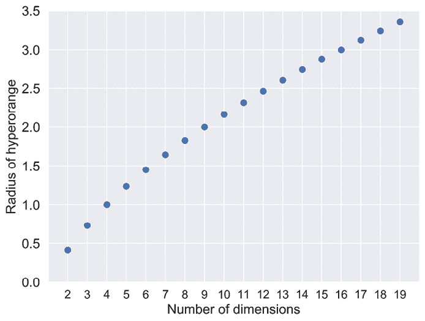

图 7-29：在一个边长为 4 的超立方体中，超橙子的半径为 2，周围有半径为 1 的超球体，每个角落都有一个。

这里的教训是，当我们进入多维空间时，我们的直觉可能会失效（Aggarwal 2001）。这一点很重要，因为我们经常处理具有几十个或几百个特征的数据。

每当我们处理具有超过三个特征的数据时，我们就进入了高维空间的世界，我们不应通过类比来推理，尤其是依据我们在二维和三维空间中的经验。我们需要睁大眼睛，依赖数学和逻辑，而不是直觉和类比。

实际上，这意味着在处理多维数据时，我们需要密切关注深度学习系统在训练过程中的表现，并时刻警惕它出现异常的行为。《第十章》中的技术可以减少我们数据中的特征数量，这可能会有所帮助。在本书中，我们将看到其他改善系统的方式，无论是因为高维度的奇异性还是其他原因导致系统学习不佳。

## 总结

在本章中，我们探讨了分类的机制。我们看到，分类器可以将数据空间划分为由边界分隔的领域。新的数据通过识别它落入哪个领域来进行分类。这些领域可能是模糊的，表示概率，因此分类器的结果是每个类别的概率。我们还探讨了聚类算法。最后，我们发现，当我们在超过三维的空间中工作时，我们的直觉往往会出错。事物经常不会按我们预期的方式运行。这些高维空间很奇异，充满了惊喜。我们了解到，在处理多维数据时，我们应该谨慎行事，并在系统学习的过程中进行监控。我们永远不应依赖基于我们在 3D 经验的猜测！

在下一章，我们将探讨如何高效地训练一个学习系统，即使我们没有大量数据。
