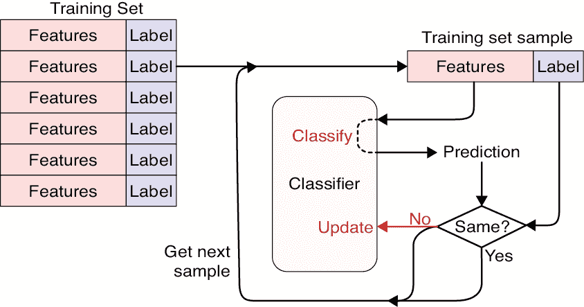
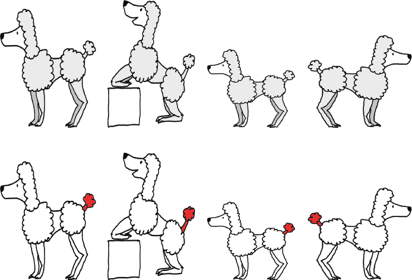
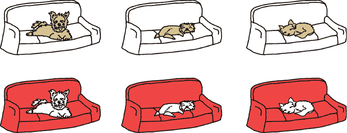
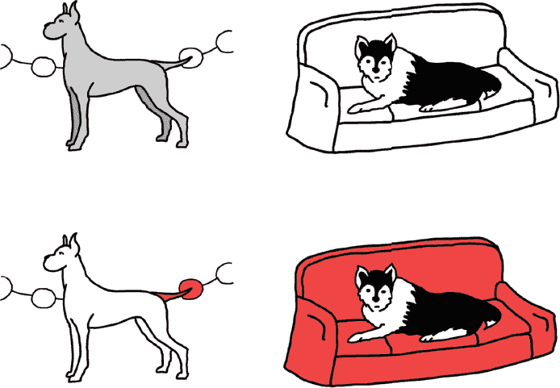
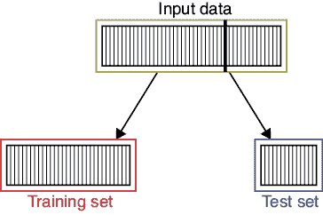
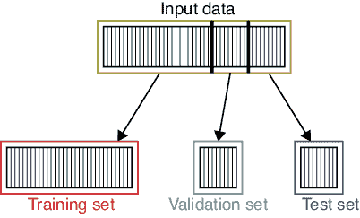
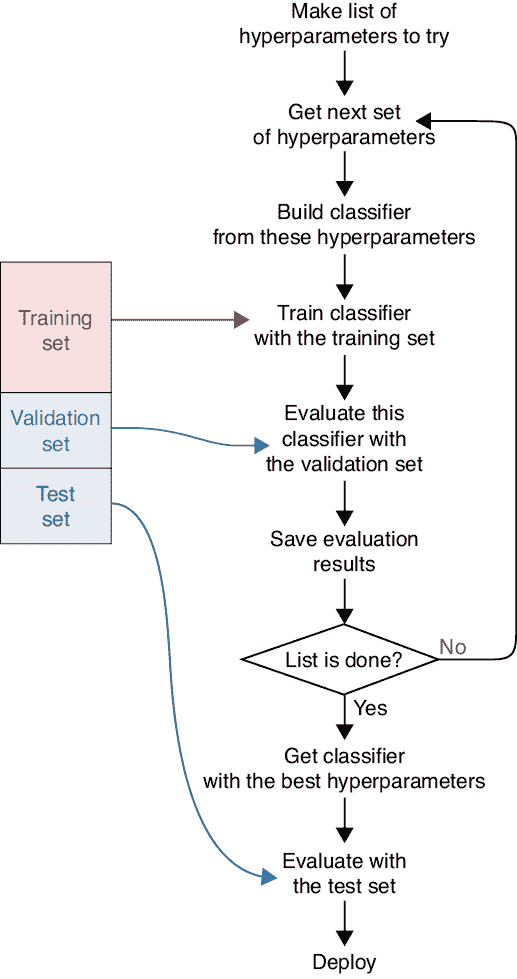
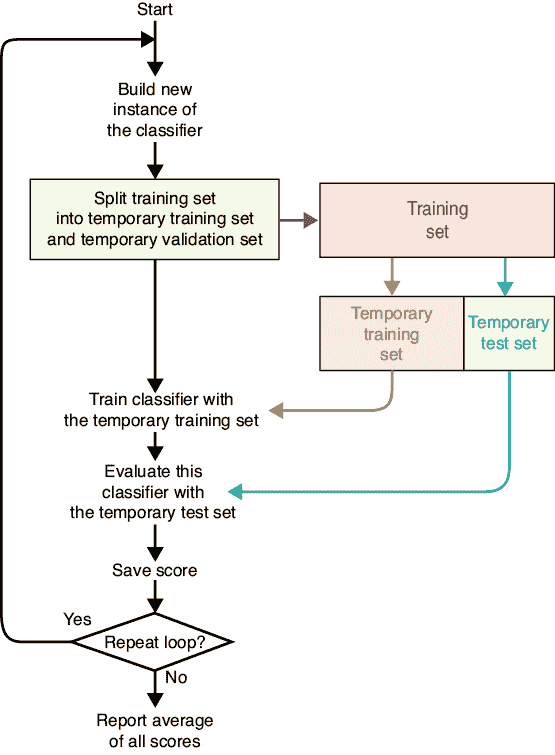
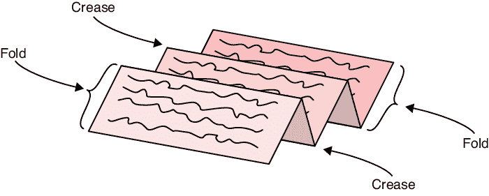
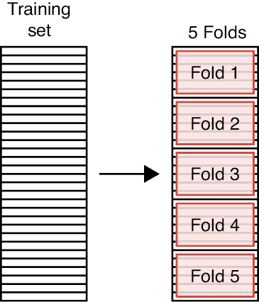

# 第八章：训练与测试

在这一章中，我们将讨论*训练*，即将一个已用默认或随机值初始化的系统，逐渐改进，以便它能够针对我们想要理解的数据进行调整。训练完成后，我们可以估计系统在评估新数据时的表现，即它如何处理之前未见过的数据，这一过程称为*测试*。

我们使用一个监督分类器来说明这一章中的概念，通过标注数据来教它。我们讨论的大部分技术都是通用的，可以应用于几乎所有类型的学习器。

## 训练

当我们使用监督学习训练一个分类器时，每个样本都有一个与之相关的标签，用来描述我们手动分配给它的类别。所有我们要学习的样本以及它们的标签集合被称为*训练集*。我们将把训练集中的每个样本逐一呈现给分类器。对于每个样本，我们提供样本的特征并要求系统预测它的类别。

如果预测正确（即与我们分配的标签一致），我们就进入下一个样本。如果预测错误，我们将分类器的输出和正确的标签反馈给分类器。通过我们将在后续章节中看到的算法，我们修改分类器的内部参数，使其更有可能在再次看到该样本时预测正确的标签。

图 8-1 直观地展示了这个概念。我们使用分类器得到一个预测，并将其与标签进行比较。如果它们不一致，我们会更新分类器。然后我们继续下一个样本。

图 8-1：训练分类器的框图

当我们的训练过程一次处理一个样本时，分类器的内部变量会逐渐调整到能够更好地预测标签的值。每当我们遍历整个训练集一次，我们就说我们训练了一个*周期*。通常，我们会让系统经历多个周期，让系统多次看到每个样本。通常情况下，我们会继续训练，直到系统不再学习并且在训练数据上的表现有所改善，但如果时间耗尽，或者遇到我们在本章及第九章后面讨论的问题时，我们可能会停止训练。

现在让我们看看如何衡量分类器预测正确标签的准确性。

## 测试性能

我们从一个参数初始化为随机数的系统开始。然后，我们通过训练数据中的样本来教它。一旦系统被*发布*，或*部署*到现实世界，它将遇到新的*现实世界数据*（或*部署数据*、*发布数据*、*用户数据*）。我们希望在系统发布之前，能够知道它在现实世界数据上的表现如何。我们可能不需要完美的准确性，但通常希望系统达到或超过我们心中的某个质量标准。在系统发布之前，我们如何估计其预测质量呢？

我们需要系统在训练数据上表现得很好，但如果仅仅根据这些数据来评估系统的准确性，通常会误导我们。这是实践中的一个重要原则，所以让我们更详细地看一下。

假设我们打算使用我们的监督分类器来处理狗的图片。对于每一张图片，它将分配一个标签来识别狗的品种。我们的目标是将系统放到网上，让人们可以将自己狗的图片拖到浏览器上，然后得到该狗的品种，或者一个笼统的“混合品种”。

为了训练我们的系统，让我们收集 1,000 张不同纯种狗的照片，每张照片都由专家标注。通过使用图 8-1，我们可以将所有 1,000 张图片展示给系统，然后反复展示这些图片，一遍又一遍，每一个周期接一个周期。在这样做时，我们通常会打乱每个周期中的图片顺序，确保它们不会总是按照相同的顺序出现。如果我们的系统设计得好，它会逐渐开始产生越来越准确的结果，直到它可能在 99%的训练图片中正确识别出狗的品种。

这并*不*意味着我们的系统在我们把它放到网上时会有 99%的准确率。问题在于，系统可能在利用训练数据中微妙的关系，而这些关系在一般的数据中并不成立。例如，假设我们的贵宾犬图片像图 8-2 这样。

当我们组建训练集时，我们没有注意到所有的贵宾犬尾巴末端都有一个小的球形，而其他狗都没有。但系统注意到了。数据中的这个小特征为系统提供了一种轻松分类贵宾犬的方法：系统不需要查看狗腿的大小、鼻子的形状等特征，而只需检查尾巴末端的小球。使用这个规则，它将正确分类所有我们的贵宾犬训练图片。我们有时会说系统做到了我们要求的事（“识别贵宾犬”），但没有做我们想要的事（“根据图片中大部分特征判断是否是贵宾犬”）。我们常说系统学会了*作弊*，尽管这可能不公平。它学会了一个捷径，给我们带来了我们所要求的结果。

图 8-2：用于识别狗狗品种的训练数据。上排：我们的输入贵宾犬图片。下排：我们的系统学习到的将图片识别为贵宾犬的特征，用红色标出。

另一个例子是，假设我们训练数据中所有约克夏犬（或 Yorkies）的图片都是在狗狗坐在沙发上时拍摄的，如图 8-3 所示。我们之前没有注意到这一点，也没有注意到另一个重要事实：其他所有图片中都没有沙发。系统可能会学到，如果图像中有沙发，它就能立即将这张图像分类为约克夏犬的图片。这条规则对于我们的训练数据来说是完全有效的。

图 8-3：上排：三只约克夏犬坐在沙发上。下排：我们的系统已经学会识别沙发，并用红色标出。

假设我们将系统部署后，有人提交了一张大丹犬站在一串大白球装饰前的照片，或者他们的西伯利亚哈士奇坐在沙发上的照片，如图 8-4 所示。我们的系统看到了大丹犬尾巴末端的白色球，告诉我们那是一只贵宾犬，并看到了沙发，忽略了狗，报告说那只哈士奇是约克夏犬。

图 8-4：上排：一只大丹犬站在一串白色球形装饰品前面，一只西伯利亚哈士奇躺在沙发上。下排：系统看到了大丹犬尾巴末端的白色球，告诉我们那是贵宾犬，并注意到沙发，将躺在沙发上的狗分类为约克夏犬。

这不仅仅是一个理论问题。有一个著名的例子描述了 1960 年代的一次会议，会上一个演讲者展示了一个早期的机器学习系统（Muehlhauser 2011）。数据的具体细节不清楚，但似乎他们有一些树丛中有伪装坦克的照片，以及没有坦克的树丛照片。演讲者声称该系统能够毫无失败地识别出带有坦克的图像。对于那个时代来说，这将是一项令人难以置信的壮举。

在演讲结束时，一位观众站起来指出，带有坦克的照片都是在阳光明媚的日子拍摄的，而没有坦克的照片则是在阴天拍摄的。看起来系统只是区分了明亮的天空和阴暗的天空，因此那些令人印象深刻（且准确）的结果其实与坦克毫无关系。

这就是为什么仅仅查看训练数据上的表现不足以预测在现实世界中的表现。系统可能会学到一些训练数据中的奇怪特征，并将其作为规则来使用，结果却被没有这些特征的新数据所破坏。这种现象在正式上称为*过拟合*，但我们通常称其为*作弊*。我们将在第九章更详细地讨论过拟合问题。

我们已经看到，我们需要一种除了训练集上的性能之外的度量方式来预测我们部署系统后它的表现。如果有一种算法或公式可以拿我们的训练好的分类器并告诉我们它有多好，那该有多好，但事实并没有。我们无法知道系统的表现如何，除非通过尝试并观察。就像自然科学家必须通过实验来了解现实世界中的实际情况一样，我们也必须通过实验来看看我们的系统表现如何。

### 测试数据

到目前为止，任何人发现的最佳方法是给系统提供新的、看不见的数据，看看它的表现如何，这样我们就能知道系统在新数据上的表现。没有捷径可以走这种实验验证。

我们将这一组看不见的数据点或样本称为*测试数据*或*测试集*。像训练数据一样，我们希望测试数据能够代表我们系统发布后将要遇到的数据。典型的过程是使用训练数据训练系统，直到系统表现达到我们认为的最佳水平。然后我们在测试数据上进行评估，这能告诉我们系统在现实世界中的表现如何。

如果系统在测试数据上的表现不够好，我们需要改进它。由于在更多数据上训练几乎总是提高性能的好方法，通常收集更多数据并重新训练是一个不错的主意。获取更多数据的另一个好处是可以使我们的训练集更加多样化。例如，我们可能会发现除贵宾犬以外的其他犬种尾巴上有小球，或者可能会发现除约克夏犬以外的其他犬种在沙发上。这样我们的分类器就必须找到其他方法来识别这些狗，我们也能避免由于过拟合而犯错。

训练和测试过程中的*基本*规则是*我们永远不能从测试数据中学习*。尽管将测试数据放入训练集，让系统有更多的示例来学习是很诱人的，但这么做会破坏测试数据作为衡量系统准确性的客观工具的价值。从测试数据中学习的问题在于它变成了训练集的一部分。这意味着我们又回到了最初的状态：系统很容易专注于测试数据中的独特特征。如果我们随后使用测试数据来看分类器的表现，它可能会正确预测每个样本的标签，但可能是在作弊。如果我们从测试数据中学习，它就失去了作为衡量系统在新数据上表现的特殊和宝贵的质量。

出于这个原因，我们在开始训练之前就将测试数据从训练数据中拆分出来，并将其保留下来。我们只有在训练结束后才会回到测试数据，然后只使用一次来评估系统的质量。如果系统在测试集上的表现不够好，我们不能只是继续训练然后再进行测试。可以将测试集看作是课堂上的期末考试题目：一旦被看到，它们就不能再使用。如果系统在测试数据上的表现不好，我们必须从头开始，使用一个初始化为随机值的系统。然后，我们可以使用更多的数据或训练更长的时间。当训练完成后，我们可以再次使用测试集，因为这个新训练的系统之前从未接触过它。如果它再次表现不够好，我们必须重新开始训练。

这点很重要，值得重复：我们绝不能在训练完成之前以任何方式让系统接触到测试数据。

无意中从测试数据中学习的问题有一个专门的名称：*数据泄漏*，也叫做*数据污染*或*污染数据*。我们必须时刻警惕这个问题，因为随着我们的训练过程和分类器变得越来越复杂，数据泄漏可能会以不同（且难以察觉）的伪装悄然进入。通过执行*数据卫生*可以避免数据泄漏：始终确保测试数据被单独保存，并且只有在训练完成后才使用一次。

我们通常通过将原始数据集拆分为两个部分来创建测试数据：训练集和测试集。我们通常将约 75%的样本分配给训练集。样本通常是随机选择的，但更复杂的算法可以尝试确保每个集合都能较好地近似完整的输入数据。大多数机器学习库都提供了可以为我们执行这一拆分过程的功能。

图 8-5 展示了这一思想。

图 8-5：将输入示例拆分为训练集和测试集。通常的拆分比例为 75:25 或 70:30。

### 验证数据

在到目前为止的讨论中，我们训练了系统一段时间，然后停止并使用测试集评估其性能。如果性能不够好，我们就重新开始训练。

这个策略没有问题，唯一的问题是它是一种工作效率较慢的方法。在实际操作中，我们通常希望在进行过程中对系统的性能进行大致估计，这样当我们认为系统能够在测试集上达到我们想要的性能时，就可以停止训练。

为了做出这个估计，我们将输入数据分为三个数据集，而不是之前看到的两个数据集。我们将这个新数据集称为*验证数据*，或*验证集*。验证数据是另一块数据，它旨在成为我们在部署系统时将遇到的现实世界数据的良好代理。我们通常通过将大约 60% 的原始数据分配给训练集，20% 分配给验证集，剩余的 20% 分配给测试集来生成这三个数据集。图 8-6 展示了这一思路。

图 8-6：将我们的输入数据分为训练集、验证集和测试集

我们的新过程是训练系统一个周期，遍历整个训练集，然后通过要求它对验证集进行预测来估计其性能。我们在每个周期后都这样做，因此我们在重复使用验证集。这会导致数据泄漏，但我们只使用验证数据进行非正式的估计。我们使用系统在验证集上的表现来大致了解它随着时间的推移学习得怎么样。当我们认为系统表现足够好以进行部署时，我们使用一次性测试集来获得可靠的性能估计。

当我们使用自动化搜索技术尝试不同的超参数值时，验证集也非常有用。回想一下，超参数是我们在运行系统之前设置的变量，用来控制系统的操作方式，例如在出错后应更新多少内部值，或者我们分类器的复杂度应该有多大。对于每一个变化，我们在训练集上进行训练，并在验证集上评估系统的表现。正如我们所提到的，我们并不从验证集中学习，但我们确实会反复使用它。来自验证集的结果仅仅是我们系统表现的估计，这样我们就可以决定何时停止训练。当我们认为系统的表现足够好时，我们会拿出测试集，并仅使用一次，以获得系统准确性的可靠估计。

这为我们提供了一种方便的方式，可以反复尝试不同的超参数，然后根据它们在验证集上的表现选择最佳的参数。

这种尝试不同超参数集的方法是基于运行一个循环的。现在让我们看看这个循环的简化版本。

为了运行我们的循环，我们选择一组超参数，训练系统，然后用验证集评估其性能。这可以估计用这些超参数训练的系统在预测新数据时的表现。接下来，我们将该系统搁置一旁，创建一个新的系统，像往常一样初始化为随机值。我们应用下一组超参数，进行训练，并使用验证集评估这个系统的表现。我们一次次地重复这个过程，每次使用不同的超参数集。当所有超参数集都运行完毕后，我们选择那个表现最准确的系统，通过它运行测试集，并发现它的预测究竟有多准确。

图 8-7 以图形方式展示了整个过程。

图 8-7：当我们尝试不同的超参数集时，我们使用验证集。请注意，我们仍然保留一个单独的测试集，只有在部署前才使用它。

当循环结束时，我们可能会倾向于使用验证数据的结果作为系统的最终评估。毕竟，分类器并没有从那些数据中学习，因为它只是用来测试的。看起来我们可以省去制作一个单独的测试集的麻烦，然后将它运行在系统上，以获得性能估计。

但那样做相当于在使用泄漏数据，这会扭曲我们的结论。数据泄漏的来源有些狡猾和微妙，就像许多数据污染问题一样。问题在于，尽管分类器没有从验证数据中学习，我们的整个训练和评估系统却学到了，因为它用了这些数据来选择最佳的超参数。换句话说，即使分类器没有明确从验证数据中学习，这些数据也影响了我们选择分类器的过程。我们选择了在验证数据上表现最好的分类器，因此我们*已经知道*它会在验证数据上表现得很好。换句话说，我们对分类器在验证数据上表现的了解“泄漏”到了我们的选择过程中。

如果这看起来有点微妙或棘手，那是因为确实如此。这类问题很容易被忽视或漏掉，这也是为什么我们必须警惕数据污染。否则，我们就有可能错误地认为系统比实际情况更好，从而部署一个不适合预期用途的系统。要想准确估计我们的系统在从未见过的新数据上的表现，没有捷径可走：我们需要在从未见过的新数据上进行测试。这就是为什么我们总是将测试集留到最后使用的原因。

## 交叉验证

在上一节中，我们将几乎一半的训练数据预留出来用于验证和测试。这对于数据量非常大的时候是没问题的。但如果我们的样本集很小，而且我们无法获得更多数据呢？也许我们在处理的是新地平线号探测器 2015 年飞掠冥王星时拍摄的冥王星及其卫星的照片，我们希望构建一个分类器，可以安装在未来的航天器上，以识别它们所观察的地形。我们的数据集是有限的，并且不会变大：近期不会有新的冥王星近距离照片出现。我们所拥有的每一张图片都是宝贵的，我们希望从每张照片中学到尽可能多的东西。如果将一些图片预留出来，仅仅为了确定我们的分类器效果，那将是一个巨大的代价。

如果我们愿意接受系统性能的估计，而不是可靠的衡量标准，那么我们就不必专门预留一个测试集。我们实际上可以在每一份输入数据上进行训练，并仍然预测我们在新数据上的表现。问题是，我们只会得到系统准确性的估计，因此它不会像使用真实测试集那样可靠，但当样本非常珍贵时，这种权衡可能是值得的。

完成这个任务的技术叫做*交叉验证*或*旋转验证*。有多种类型的交叉验证算法，但它们都有相同的基本结构（Schneider 1997）。我们将查看一种不需要我们创建专门测试集的版本。

核心思想是我们可以运行一个循环，反复从头训练相同的系统并进行测试。每次循环时，我们将整个输入数据分成一次性的训练集和一次性的验证集。关键在于每次循环时，我们都会以不同的方式构建这些数据集。这使我们能够使用所有的数据进行训练（尽管，正如我们将看到的，并不是同时使用所有数据）。

我们首先构建一个全新的分类器实例。我们将输入数据分成一个临时的训练集和临时的验证集。我们在临时训练集上训练系统，并使用临时测试集进行评估。这将给我们一个分类器性能的得分。接下来，我们再次进行循环，但这一次，我们将训练数据分成不同的临时训练集和测试集。当我们完成每次循环的迭代后，所有得分的平均值将作为我们对分类器整体性能的估计。

交叉验证的视觉摘要显示在图 8-8 中。

图 8-8：使用交叉验证来评估我们系统的性能

通过使用交叉验证，我们可以用所有的训练数据来训练（尽管每次循环中并不是所有数据都会参与训练），同时我们依然能够从留出的测试集获得系统质量的客观测量。这个算法没有数据泄漏的问题，因为每次通过循环时，我们都会创建一个新的分类器，而该分类器的临时测试集包含的是与*该特定*分类器全新且未见过的数据，因此可以公平地使用它来评估该分类器的性能。这种技术的缺点是，我们对系统准确性的最终估计不像从留出的测试集中得到的估计那么可靠。

有多种不同的算法可以用来构建临时的训练集和验证集。让我们来看一下一个流行的方法。

## k-折交叉验证

也许最流行的构建交叉验证临时数据集的方法叫做*k-fold 交叉验证*。这里的字母*k*不是某个单词的首字母，而是表示一个整数（例如，我们可能会运行“2-fold 交叉验证”或“5-fold 交叉验证”）。通常，*k*的值是我们希望在图 8-8 中循环的次数。

该算法在交叉验证循环开始之前就已经启动。我们将训练数据分割成一系列等大小的组。每个样本仅被放入一个组中，所有组的大小相同（当然，如果不能将输入数据分成完全相等的部分，我们允许最后一个组稍微小一点）。

如果这些组分别被称为“组”或“等大小的块”，那会很好，但描述这个概念的词是*fold*。这个词在这里的使用是为了表示页面上*折痕*（或末端）之间的部分。为了更好地理解这个概念，可以想象将训练集中的所有样本写在一张长纸上，然后将其折叠成固定数量的等份。每次我们折叠纸张时，就形成一个折痕，而折痕之间的部分称为 fold。图 8-9 展示了这个概念。

图 8-9：为*k*-fold 交叉验证创建 folds。这里有四个折痕和五个 fold。

让我们从训练数据中构建等大小的 fold。我们可以将图 8-9 展开，创建出图 8-10 中更典型的五个 fold 的图像。

图 8-10：将我们的训练集拆分为五个大小相等的 fold，分别命名为 Fold 1 到 Fold 5

让我们使用这五个 fold 来看看循环是如何进行的。在第一次循环中，我们将 fold 2 到 fold 5 中的样本作为临时训练集，而将 fold 1 中的样本作为临时测试集。也就是说，我们使用 fold 2 到 fold 5 中的样本来训练分类器，然后用 fold 1 中的样本来评估它。

下一次循环时，从一个初始化为随机数的新分类器开始，我们使用第 1、3、4 和 5 折的样本作为临时训练集，使用第 2 折的样本作为临时测试集。我们照常用这两组数据进行训练和测试，并继续使用其余的折叠。图 8-11 直观地展示了这一过程。

图 8-11：在每次循环中，我们选择一个折叠进行测试（蓝色），其余的折叠（红色）用于训练。如果我们循环超过五次，我们将重复这一模式。

我们可以选择重复循环任意多次，只需重复折叠选择的周期（或者混合数据，使得每次集合的内容不同）。

在一个可选的最终步骤中，我们可以使用所有数据来训练一个新的分类器。这意味着我们无法得到其性能的估计。但如果我们仔细观察训练过程，并留意过拟合（将在下一章讨论），我们通常可以假设，使用所有数据训练的系统至少和我们从交叉验证中得到的最差表现一样好（并且我们希望它会稍微好一点）。

这使得交叉验证在数据有限时成为一个很好的选择。我们确实需要重复多次训练-测试周期，并且我们的最终性能度量只是一个估计，这两者都是缺点，但我们可以利用所有数据进行训练，最大化地提取输入集中的每一点信息，并将其用来提高分类器的表现。

我们讨论了带分类器的*k*折交叉验证，但该算法可以广泛应用于几乎任何类型的学习器。

## 总结

本章主要讲解了训练深度学习系统，并判断它是否足够好以进行部署。我们聚焦于分类器，但这种思路对任何此类系统都适用。我们看到我们将数据分为两部分：训练集和测试集。我们了解了过拟合和数据泄露的问题，并且还看到了如何使用验证集来大致了解系统在每个训练周期后的学习效果。最后，我们介绍了交叉验证，这是一种通常用于小数据集的技术，用于估计系统的性能。

在下一章，我们将更详细地探讨过拟合和欠拟合问题。
