# 第九章：过拟合与欠拟合

无论是人还是计算机，从有限的例子中学习一个主题的通用规则都是一个艰难的挑战。如果我们不够重视例子中的细节，我们的规则将过于笼统，以至于在处理新数据时用处不大。另一方面，如果我们过于关注例子中的细节，我们的规则就会过于具体，同样在评估新数据时效果不好。

这些现象分别被称为*欠拟合*和*过拟合*。其中更为常见且令人头疼的问题是过拟合，如果不加以控制，它可能会导致我们得到一个几乎无用的系统。我们通过被统称为*正则化*的技术来控制过拟合并加以遏制。

本章我们将探讨过拟合和欠拟合的原因，以及如何应对这些问题。最后，我们将通过使用贝叶斯方法将一条直线拟合到一组数据点上来总结本章内容。

## 寻找合适的匹配

当我们的系统从训练数据中学习得非常好，但在面对新数据时表现不佳时，我们称之为*过拟合*。当它没有从训练数据中学得足够好，在面对新数据时表现糟糕时，我们称之为*欠拟合*。由于过拟合通常是一个更难解决的问题，我们将首先讨论它。

### 过拟合

让我们通过一个比喻来讨论过拟合。假设我们被邀请参加一个大型的户外婚礼，而我们几乎不认识任何人。在整个下午的时间里，我们在聚会的客人中游走，进行介绍和寒暄。我们决定努力记住每个人的名字，因此每次遇到某人时，我们都会在他们的外貌和名字之间建立某种心理联想（Foer 2012；Proctor 1978）。我们遇到的其中一位叫沃尔特，他有着一副大海象胡须。我们将沃尔特想象成一只海象，并试图让这个形象在脑海中留下深刻印象。之后，我们遇到一位叫艾琳的人，我们注意到她戴着美丽的绿松石耳环。我们将她的耳环想象成一个在某个方向上被缩短的形状，所以*耳环*变成了*艾琳*。我们对每一个遇到的人都做类似的心理联想，当我们再次与一些同样的人相遇时，我们轻松地记住了他们的名字。系统运作得非常好。

那天晚上在接待会上，我们遇到了很多新的人。某个时刻，我们碰到了一位留着大海象胡子的男士。我们笑着说：“又见面了，沃尔特！”结果他露出了困惑的表情。原来这是鲍勃，我们以前从未见过他。类似的事情可能反复发生。我们可能被介绍给一个佩戴美丽耳环的人，但她是苏珊，而不是艾琳。问题在于我们的心理图像误导了我们。并不是我们没有正确地记住这些人的名字，因为我们记住了。只是我们以一种仅适用于原始小组中的人的方式来记住名字，当我们遇到更多的人时，无法做到泛化。

要将某人的外貌与他们的名字联系起来，我们需要在这两个概念之间建立某种联系。这个联系越牢固，我们就越能在新的环境中识别这个人，即使他们戴了帽子、眼镜或其他改变外貌的东西。以我们的婚礼为例，我们通过将人们的名字与某个独特的特征相联系来记住他们的名字。问题是，当我们在接待会上遇到另一个拥有相同特征的人时，我们无法判断他是新认识的人。

在婚前派对上，我们认为自己表现得很好，因为当我们用训练数据（婚礼上人的名字）评估自己的表现时，大部分结果都正确。如果我们关注成功的次数，我们会说自己达到了很高的*训练准确度*。但如果我们转而关注失败的次数，我们会说自己有较低的*训练误差*（或*训练损失*）。但是当我们去了接待会并需要评估新数据（我们遇到的其他人的名字）时，我们的*泛化准确度*很低，或者换句话说，我们的*泛化误差*（或*泛化损失*）很高。

我们在第八章中看到了同样问题的一个例子，当时我们错误地将沙发上的一只哈士奇识别为约克夏犬，因为我们仅使用沙发作为识别它品种的唯一线索。

我们在人和狗身上的错误都源于过拟合。换句话说，我们学会了如何分类眼前的数据，但我们只是使用了数据中的具体细节，而不是学习能够适用于新数据的一般规则。

机器学习系统非常擅长过拟合。有时我们会说它们擅长*作弊*。如果输入数据中有某种特征可以帮助系统得到正确的结果，它就会找到并利用这个特征，就像我们在第八章中的故事，系统本应解决在树木照片中找到伪装坦克的难题，但很可能选择了简单的方式，通过注意天空是晴天还是阴天来解决问题。

我们可以采取两种措施来控制过拟合。首先，我们可以在规则过于具体时停止学习过程。其次，通过使用*正则化*方法，我们可以通过鼓励系统尽可能长时间地学习一般规则来推迟过拟合的发生。稍后我们将分别讨论这两种方法。

### 欠拟合

过拟合的对立面是欠拟合。与过拟合不同，过拟合是由于使用了过于精确的规则，欠拟合描述的是当我们的规则过于模糊或通用时的情况。在婚礼聚会上，我们可能会通过创建一个规则来欠拟合：“穿裤子的人叫沃尔特”。虽然这对于某一特定数据是准确的，但这个规则并不能很好地推广！

与过拟合相比，欠拟合在实际中通常不是一个大问题。我们通常可以通过使用更多的训练数据来解决欠拟合问题。通过更多的示例，系统可以为每一条数据找到更好的理解规则。

## 检测和解决过拟合

我们怎么知道何时开始过拟合数据呢？假设我们使用验证集在每个训练周期后估计系统的泛化误差（像往常一样，当我们完成训练时，我们使用一次性测试集来获得更可靠的泛化误差）。系统对验证数据产生的误差称为*验证误差*。它是系统部署时将产生的误差的估计，这称为*泛化误差*。当验证误差趋于平稳或开始变得更糟，而训练误差在改善时，我们就出现了过拟合。这是我们停止学习的信号。图 9-1 形象地展示了这一点。

图 9-1：训练误差和验证误差在训练初期都稳步下降，但在某个节点之后，验证误差开始上升，而训练误差继续下降，标志着过拟合的发生。

在图 9-1 中，请注意，随着我们进入过拟合区域，训练误差继续下降，而验证误差开始上升。这是因为我们仍然在从训练数据中学习，但现在我们学到的是特定于该数据的信息，而不是一般规则。正是验证集上的表现让我们看到了这一点，因为我们的验证误差（估算我们的泛化误差）在变得更糟。我们这样训练的时间越长，系统在部署时的表现就会越差。

让我们看看这个实际应用。假设某家商店的店主订阅了一项背景音乐服务。该公司提供了多种不同节奏的音乐流，并且提供了一个控制器，允许店主随时选择音乐的节奏。她并非每天早上设定好节奏后就不再理会，而是发现自己在一天中频繁调整节奏，这变成了一项令人分心的琐事。于是，她聘请了我们为她建立一个系统，自动根据她的需求调整一天中的音乐。

第一步是收集数据。第二天早上，我们坐在控制器前观察。每次她调整节奏时，我们记录下时间和新的设置。我们收集的数据如图 9-2 所示。

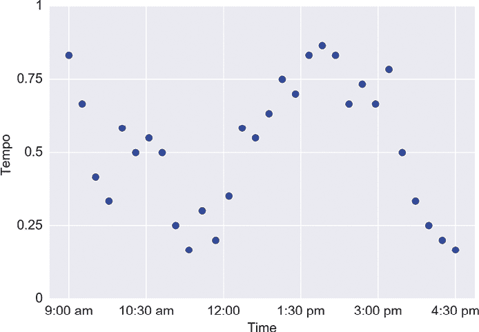

图 9-2：我们记录的数据展示了店主在一天中每次调整节奏时所选择的节奏。

那天晚上，我们回到实验室，将曲线拟合到数据中，如图 9-3 所示。

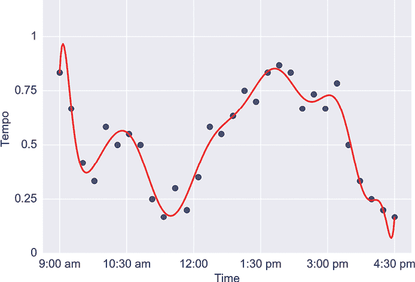

图 9-3：一条适合图 9-2 数据的曲线

这条曲线非常弯曲，但我们可能会推测它是一个好的解决方案，因为它很好地匹配了她记录的选择。第二天早上，我们编程让系统按照这个模式进行。到下午中时，店主抱怨音乐的节奏变化得太频繁且太剧烈，分散了顾客的注意力。

这条曲线过度拟合了数据，因为它过于精确地匹配了观察到的数值。我们测量数据的那天，她的选择是基于当天播放的特定歌曲。由于服务并不是每天在同一时间播放相同的歌曲，我们不希望如此紧密地重现那一天的观测数据。通过适应每一个波动和曲线，我们过分关注了训练数据中的个性化特征。

如果我们能再观察她的选择几天，并利用所有这些数据制定一个更通用的计划，那就太好了，但她不希望我们再次占用她店里的空间。我们拥有的数据就是我们能得到的全部。我们希望制定一个变化较小的计划，所以第二天晚上我们减少了与数据匹配的精确度。我们的目标是做出一个不像之前那样波动太大的计划，得到如图 9-4 所示的平滑曲线。

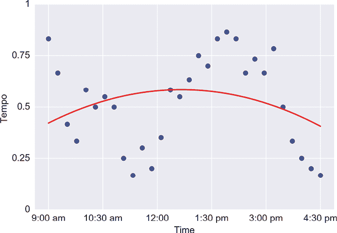

图 9-4：用于匹配我们节奏数据的平滑曲线

我们第二天发现，客户仍然不满意，因为这条曲线太粗糙，忽略了重要的特征，比如她早上希望使用较慢的节奏，下午则希望使用更有活力的歌曲。这条曲线未能很好地拟合数据。

我们想要的是一个不试图精确匹配所有数据，而是能够很好地把握总体趋势的解决方案。我们希望这个解决方案既不会过于精确，也不会过于松散，而是“恰到好处”。第二天，我们根据图 9-5 中的曲线设置了系统。

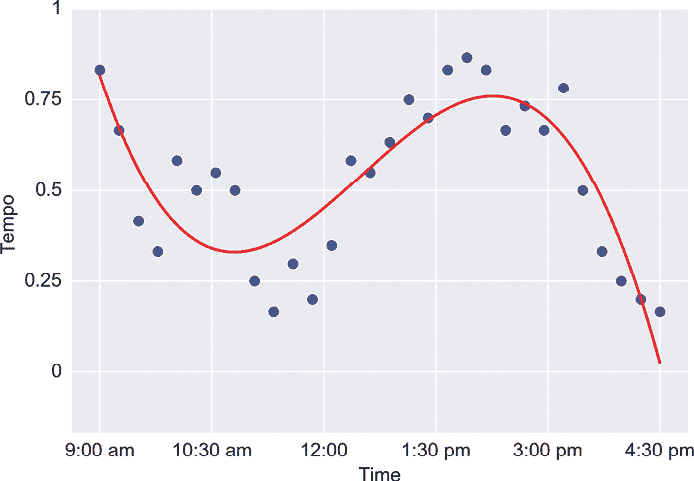

图 9-5：一条足够匹配我们的节奏数据的曲线，但又不至于过度匹配

我们的客户对这条曲线和它选择的歌曲节奏感到满意。我们在欠拟合和过拟合之间找到了一个很好的折衷。在这个例子中，找到最佳曲线是个人品味的问题，但稍后我们将看到一些算法方法，帮助我们找到欠拟合和过拟合之间的最佳平衡点。

图 9-6 展示了另一个过拟合的例子，这次是在对二维（2D）点进行分类时出现的。

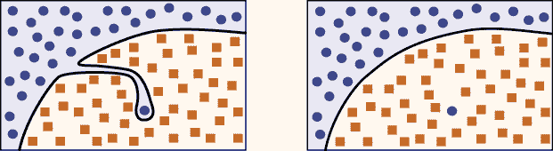

图 9-6：一个可能的过拟合情况。（灵感来源于 Bullinaria 2015。）

在图 9-6 的左侧，我们看到一个圆形点位于正方形区域的深处，导致了一个复杂的边界曲线。我们称这种孤立的点为*异常点*，并且自然会对它保持怀疑态度。也许这是由于测量或记录错误造成的，或者这只是一个非常不寻常但完全有效的数据点。获取更多的数据可以帮助我们更好地理解这种异常现象的情况，但如果我们只有这一组数据，我们需要决定如何处理它。通过绘制边界来适应这个数据点，我们有可能错误地将一些未来的数据点归类为蓝色圆形，尽管它们实际上位于棕色正方形区域内部，因为它们落在了这个奇怪的边界曲线的蓝色一侧。也许更好的做法是选择图 9-6 右侧的简单曲线，并接受这个点为一个错误。

现在我们已经看到了过拟合的样子，让我们看看如何防止它的发生。

### 早期停止

一般来说，当我们开始训练模型时，通常是欠拟合的。模型还没有看到足够的例子来弄清楚如何正确处理它们，因此它的规则是广泛和模糊的。

随着训练的进行，模型不断调整边界，训练误差和验证误差通常都会下降。为了方便讨论，我们在这里重复图 9-1，作为图 9-7。

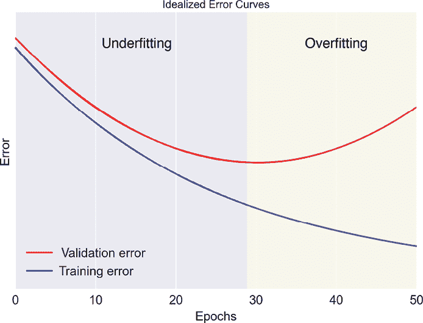

图 9-7：为了方便起见，重复图 9-1

在某个时刻，我们会发现，虽然训练误差持续下降，但验证误差开始上升（可能首先会保持平稳一段时间）。现在我们进入了过拟合阶段。训练误差在下降，因为我们越来越多地正确地处理了细节。但我们现在过度调整了结果，以适应训练数据，导致泛化误差（或其估计值——验证误差）上升。

从这个分析中，我们可以得出一个好的指导原则：*当我们开始过拟合时，停止训练*。也就是说，当我们在图 9-7 中达到大约 28 个 epoch，并且发现验证误差开始上升，而训练误差仍在下降时，我们应该停止训练。这种在验证误差开始上升时结束训练的技巧叫做*提前停止*，因为我们在训练误差尚未降到零时就停止了训练过程。把这个想法称为*最后时刻停止*可能更有帮助，因为我们尽可能地训练，直到找到没有过拟合的最佳数据表示，然后才停止训练。

实际上，我们的误差测量通常不像图 9-7 中的理想曲线那样平滑。它们往往会有噪声，甚至可能在短时间内出现“错误”的变化方向，因此很难找到完全正确的停止时机。大多数用于提前停止的库函数都提供了几个变量，允许我们让它们隐式地平滑这些误差曲线，以便在验证误差真正上升时能检测到，而不是仅仅经历短暂的增加。

### 正则化

我们总是希望尽可能从训练数据中提取信息，直到接近过拟合为止。提前停止在验证误差开始上升时结束学习，但如果有办法延迟这一现象，让我们可以训练更久，并继续降低训练误差和验证误差呢？

类比来说，考虑在烤箱里烤火鸡。如果我们只是将火鸡放在一个锅里，并用高温烹饪，它的外部最终会烧焦。但假设我们想要把火鸡烤得更久，而又不想让它烧焦。一个方法是将其包裹在铝箔中。铝箔延缓了烧焦的发生，使我们可以烤得更久。

延迟过拟合发生的技术统称为*正则化方法*，或简称*正则化*。请记住，计算机并不知道它正在过拟合。当我们要求它从训练数据中学习时，它会尽可能地从数据中学习。它并不知道何时从“对输入数据的良好理解”跨越到“对这个特定输入数据的过度特定理解”，所以管理这个问题完全由我们来处理。

一种常见的正则化方法，或者说延迟过拟合开始的方法，是限制分类器所使用的参数的值。从概念上讲，为什么这种方法能够延迟过拟合的核心理由是，通过将所有参数的值保持在较小的数字范围内，我们防止了任何一个参数占主导地位（Domke 2008）。这使得分类器不容易依赖于特殊的、狭窄的特征。

为了理解这一点，回想一下我们记住人名的例子。当我们记住了沃尔特这个名字时，他有一副海象胡子，这个信息主导了我们记住的所有其他信息。我们还可以从他的外貌中学到其他的事实，比如他是个男性，身高接近六英尺，长着灰色的长发，有着大大的微笑和低沉的声音，穿着一件深红色的衬衫，扣子是棕色的，等等。但相反，我们专注于他的胡子，忽略了其他所有有用的线索。后来，当我们看到另一个拥有海象胡子的完全不同的人时，那一特征主导了其他所有特征，我们把那个人误认为是沃尔特。

如果我们强制要求我们注意到的所有特征都在大致相同的范围内，那么“有海象胡子”就不会有机会主导，其他特征在我们记住新人的名字时仍然会发挥作用。正则化技术确保没有任何一个参数，或者一小组参数，能够主导其他所有参数。

请注意，我们并不是试图将所有参数设置为*相同*的值，这样会使它们变得毫无用处。我们只是想确保它们都在大致相同的范围内。将参数推到较小的值可以让我们学习更长时间，并在发生过拟合之前从训练数据中提取更多信息。

应用正则化的最佳量因学习器和数据集的不同而有所变化，因此我们通常需要尝试几个值，看看哪一个最有效。我们通过一个超参数来指定应用的正则化量，传统上这个超参数写作小写希腊字母λ（lambda），不过有时也使用其他字母。通常来说，较大的λ值意味着更多的正则化。

保持参数值较小通常意味着分类器的边界曲线不会像它本来可能那样复杂和波动。我们可以使用正则化参数λ来选择我们希望边界有多复杂。较高的值给我们平滑的边界，而较低的值让边界更加精确地拟合它所看的数据。

在后面的章节中，我们将处理具有多层处理结构的学习架构。这些系统可以使用额外的、专门的正则化技术，如*dropout*、*batchnorm*、*layer norm*和*weight regularization*，这些技术有助于控制这些类型架构的过拟合。所有这些方法的设计目的是防止网络的任何元素主导最终结果。

## 偏差与方差

统计术语*偏差*和*方差*与欠拟合和过拟合密切相关，通常在讨论这些话题时会涉及到。我们可以说，偏差衡量的是一个系统持续学习错误事物的倾向，而方差衡量的是它学习无关细节的倾向（Domingos 2015）。另一种理解方式是，大量的偏差意味着系统偏向于某种特定的结果，而大量的方差意味着系统返回的答案过于针对特定数据。

我们将通过讨论二维曲线的方式来图解这两个概念。这些曲线可能是回归问题的解，就像我们之前的任务一样：为商店的背景音乐设定节奏，随时间变化。或者这些曲线可能是平面上两个区域之间的边界曲线，如分类问题中的情况。偏差和方差的概念并不限于任何特定类型的算法或二维数据。但我们将坚持使用二维曲线，因为我们可以画出并解读它们。让我们专注于找到一个合适的拟合曲线，来描述如何通过偏差和方差的概念来说明我们的算法行为。

### 匹配基础数据

假设我们的一个大气研究员朋友来向我们寻求帮助。她在几个月内每天同一时间，在一座山顶的某个位置测量了风速。她测量的数据见图 9-8。

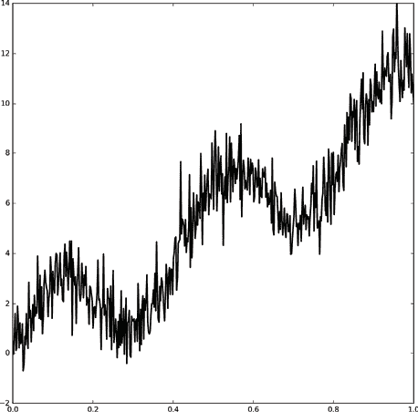

图 9-8：大气科学家测量的风速随时间变化的数据。在这些数据中，有一条明显的基础曲线，但也有很多噪音（基础曲线灵感来自 Macskassy 2008）。

她认为她所测得的数据是一个*理想化曲线*和*噪音*的总和，理想化曲线每年都保持不变，而噪音则解释了日常波动的不可预测性。她测得的数据被称为*噪声曲线*，因为它是理想化曲线和噪音的叠加。图 9-9 展示了理想化曲线和噪音，二者叠加在一起形成图 9-8 中的数据。

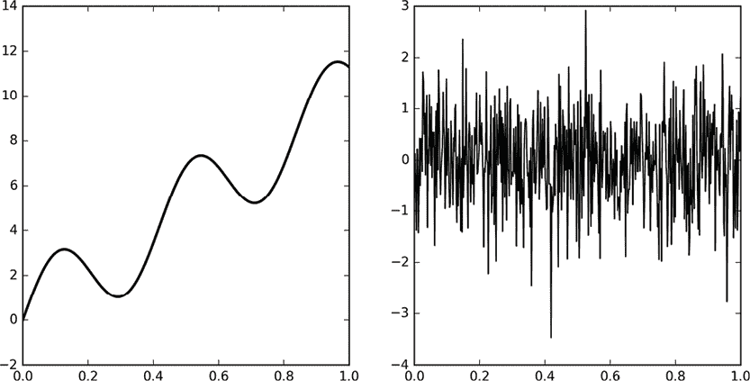

图 9-9：将图 9-8 中的数据分成两部分。左侧：我们要寻找的基础“理想化”曲线。右侧：大自然添加到理想化曲线上的噪音，导致我们得到噪声的、测量的数据。请注意，这两个图的垂直尺度不同。

我们的大气研究员认为她有一个很好的模型来描述噪声（也许它遵循我们在第二章中看到的均匀分布或高斯分布）。但是她对噪声的描述是统计性的，因此她不能用它来修正她的日常测量。换句话说，如果她知道图 9-9 右侧噪声的确切值，她可以将其从图 9-8 中的测量值中减去，从而获得她的目标，即图 9-9 左侧的干净曲线。但她不知道这些噪声值。她有一个统计模型，可以生成很多像图 9-9 右侧那样的曲线，但她没有与她的数据对应的具体值。

这里有一种清理噪声数据的方法。我们可以回到图 9-8 中的噪声数据，并尝试将一条平滑曲线拟合到它上面（Bishop 2006）。通过选择曲线的复杂性，使其足够曲折以跟随数据，但又不至于曲折到精确匹配每个点，我们希望能得到一个相当好的匹配，反映曲线的大致形状，这是找到潜在平滑曲线的一个良好起点。

有很多方法可以将平滑曲线拟合到噪声数据上。图 9-10 展示了其中一条这样的曲线。右端的小波动是我们使用的曲线的典型特征，它在数据集的边缘附近往往会有一些波动。

看起来还不错。但我们能做得更好吗？

让我们将偏差和方差的概念应用于寻找理想曲线的问题。这个想法源于我们在第二章讨论的自助法（bootstrapping）方法，但我们实际上不会使用自助法技巧。

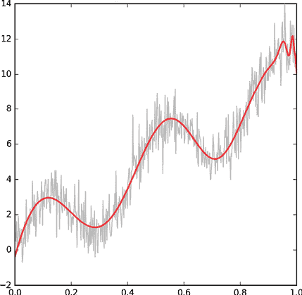

图 9-10：使用曲线拟合算法拟合我们的噪声数据

让我们制作原始噪声数据的 50 个版本，但每个版本仅包含 30 个随机选取的点，且不重复选择。这些缩小的数据集的前五个版本显示在图 9-11 中。

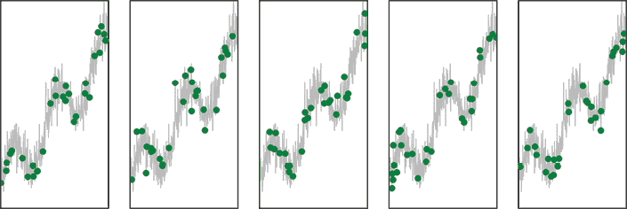

图 9-11：我们原始噪声数据的 50 个小版本中的五个。每个版本由从原始数据中随机选择的 30 个样本组成，且不重复选择。这些是前五个版本，所选点显示为绿色点，原始的噪声数据为灰色，以供参考。

让我们尝试用简单的曲线和复杂的曲线来匹配这些数据点集，并根据偏差和方差来比较结果。

### 高偏差，低方差

我们首先用简单的平滑曲线来拟合数据。由于我们提前选择了这些特征，我们预计所有的拟合曲线看起来都会差不多。拟合我们在图 9-11 中五个数据集的曲线如图 9-12 所示。

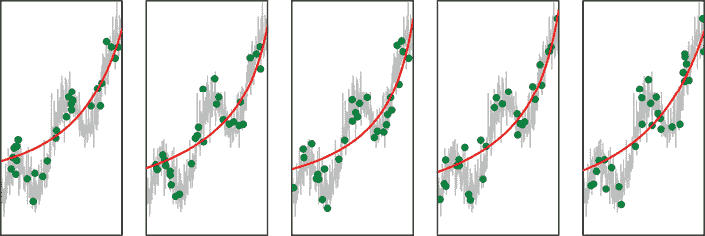

图 9-12：将简单曲线拟合到我们在图 9-11 中的前五个数据点集

如预期，这些曲线都非常简单且相似。由于这些曲线彼此非常相似，我们说这组曲线表现出*高偏差*。这里的*偏差*指的是对简单形状的预定偏好。因为这些曲线非常简单，所以每条曲线都缺乏通过多个点的灵活性，最多只能经过其中的一些点。

*方差*指的是曲线之间的差异或变化程度。为了查看这些高偏差曲线的方差，我们可以将所有 50 条曲线叠加在一起，如图 9-13 所示。

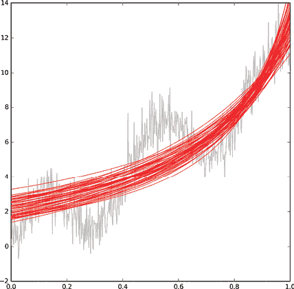

图 9-13：所有 50 个 30 点样本的曲线，叠加在一起

如预期，曲线非常相似。我们说它们展示了低方差。

总结来说，这组曲线具有高偏差，因为它们的形状差不多，而且具有低方差，因为个别曲线不受数据的太多影响。

### 低偏差，高方差

现在，让我们尝试减少曲线需要简单的约束条件。这使我们能够拟合复杂的曲线，使每条曲线更接近其绿色点。图 9-14 展示了这些曲线应用于我们前五组数据的情况。与图 9-12 相比，这些曲线更加弯曲，拥有多个山峰和谷底。尽管它们仍然不会直接经过太多点，但它们比之前更接近这些点。

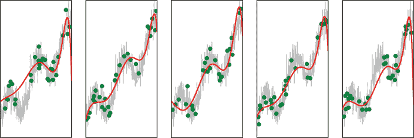

图 9-14：我们从噪声数据的前五组点生成的复杂曲线

由于这些曲线的形状更复杂且更灵活，它们比任何初始假设更受数据的影响。因为我们对曲线形状施加的约束更少，所以我们说这组曲线具有*低偏差*。另一方面，这些曲线彼此差异很大。我们可以通过将所有 50 条曲线叠加在一起来看出这一点，如图 9-15 所示。由于曲线在开始和结束时剧烈偏离，因此我们还展示了覆盖这些大幅波动的扩展垂直坐标轴。

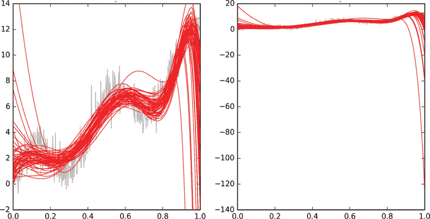

图 9-15：拟合到我们 50 组数据的复杂曲线。右侧的图显示了曲线的整个垂直尺度。

这些曲线并不完全遵循相同的形状，因此它们具有低偏差。此外，它们彼此之间差异很大，每条曲线都受到其数据的强烈影响，因此这组曲线具有*高方差*。

### 比较曲线

让我们回顾一下迄今为止的曲线拟合实验。

我们的气象学家要求我们提供一条符合她数据中理想化曲线的曲线。我们从她原始的噪声数据中随机提取了 50 个小点集。当我们为这些点集拟合简单光滑的曲线时，曲线始终未能准确匹配大多数数据点。这组曲线具有高偏差，或者说是对特定结果（光滑且简单）的偏向。曲线受它们要匹配的数据影响较小，因此这组曲线具有低方差。

另一方面，当我们为这些点集拟合复杂且波动的曲线时，曲线能够适应数据，并且与大多数点更接近。由于它们更受数据的影响，而非对特定形状的偏向，这组曲线具有低偏差。但曲线的适应性意味着它们彼此之间差异很大。换句话说，这组曲线具有高方差。

所以，第一个集合具有高偏差和低方差，而第二个集合具有低偏差和高方差。

理想情况下，我们希望得到具有低偏差（这样我们不会对其可能的形状加上先入为主的想法）和低方差（这样我们不同的曲线都能大致匹配原始噪声数据）的曲线。不幸的是，在大多数实际情况中，随着其中一个指标的下降，另一个指标会上升。这意味着我们需要找到每种特定情况的最佳*偏差-方差权衡*。我们稍后会回到这个问题。

请注意，偏差和方差是*一系列*曲线或曲线集合的属性。讨论单一曲线的偏差和方差是没有意义的。偏差和方差在机器学习讨论中常常用来描述模型或算法的复杂性或能力。

现在我们可以看到，偏差和方差如何帮助我们描述欠拟合和过拟合。在训练开始时，系统试图找到表示训练数据的正确方式，它会生成一般规则，或者说是欠拟合。如果这些规则是数据类之间的边界，它们呈曲线形状。如果我们在多个相似但不同的数据集上进行训练，我们会看到形状简单且相似的曲线。也就是说，它们具有高偏差和低方差。

在训练的后期，每个数据集的曲线变得更加复杂。它们的形状没有太多的前提条件，因此具有较低的偏差，并且可以与训练数据紧密匹配，因此具有较高的方差。当我们让系统训练得过长时，高方差的曲线开始过度跟随输入数据，导致过拟合。

图 9-16 展示了偏差和方差的权衡关系图。

图 9-16：最上排：我们希望匹配的四条曲线。中排：使用高偏差和低方差的曲线。底排：使用低偏差和高方差的曲线。底部两行最右侧的图像显示了四条曲线的叠加。

在中排，高偏差给我们带来简单的曲线（可以避免过拟合），但它们的低方差意味着它们不能很好地匹配数据。在底排，低偏差让曲线更好地匹配数据，但它们的高方差意味着曲线可能过度匹配（从而有过拟合的风险）。

一般来说，偏差和方差没有谁天生优于谁，因此我们不应该总是试图找到例如最低偏差或方差的解决方案。在某些应用中，高偏差或高方差可能是可以接受的。例如，如果我们知道我们的训练集完全代表了所有未来的数据，那么我们不在乎方差，而是追求最低的偏差，因为完美匹配训练集正是我们所需要的。另一方面，如果我们知道我们的训练集并不能很好地代表未来的数据（但这是我们目前最好的选择），我们可能不关心偏差，因为匹配这个糟糕的数据集并不重要，但我们希望得到最低的方差，以便在未来数据上至少能做出一些合理的预测。

一般来说，我们需要在这两个度量之间找到合适的平衡，使其最好地服务于特定项目的目标，考虑到我们正在使用的具体算法和数据。

## 使用贝叶斯法则拟合直线

偏差和方差是描述一组曲线如何拟合数据的有用方式。回顾我们在第四章讨论的频率主义和贝叶斯哲学，我们可以说偏差和方差本质上是频率主义的概念。这是因为偏差和方差的概念依赖于从数据源中提取多个值。我们不依赖于任何单一曲线，而是通过对所有曲线进行平均，来找到每条曲线所逼近的“真实”答案。这些观点非常适合频率主义方法。

相比之下，贝叶斯方法拟合数据的方式主张，结果只能用概率的方式来描述。我们列出所有我们认为可能的匹配数据的方式，并为每种方式附加一个概率。随着我们收集更多的数据，我们逐渐淘汰一些描述，从而使剩余的描述变得更加可能，但我们永远无法得到一个唯一的、绝对的答案。

让我们在实际操作中看看这个方法。我们的讨论基于《模式识别与机器学习》（Bishop 2006）中的一个可视化图示。我们将使用贝叶斯定理来找到对我们在图 9-8 中看到的带噪声大气数据的良好近似。我们并不打算为数据拟合一条复杂的曲线，而是限制自己使用直线。这仅仅是因为这样做可以让我们用二维图形和图表展示所有内容。事实上，我们坚持使用*大部分水平*的直线。再说一次，这只是为了方便绘制不需要高维度的漂亮图示。

使用贝叶斯定理进行曲线拟合的方法可以使用复杂的曲线、空间中的平面，甚至具有数百个维度的形状。我们仅使用*大部分水平*的直线，只因为这种选择让图示保持简单。

我们将同时处理多行，因此找到一种紧凑的方式来表示不同组的线条而不需要绘制它们所有的内容会非常有帮助。

诀窍是用两个数字来描述每条直线。第一个数字告诉我们直线与水平线的倾斜程度，这样可以得到任何方向的直线。第二个数字告诉我们该如何上下移动直线。

第一个数字是*斜率*。水平线的斜率为 0。当直线顺时针旋转时，如图 9-17 所示，斜率增加。当直线逆时针旋转时，斜率减少。

当直线完全对角时，斜率为 1 或–1。当它旋转到更陡峭的角度时，斜率迅速增加，直到对于完全垂直的直线达到无穷大。我们可以采取措施来避免这个问题，但这只会让讨论变得更复杂。因此，为了简化起见，我们将只关注斜率在–2 到 2 之间的直线，这些直线位于图 9-17 中的绿色区域。

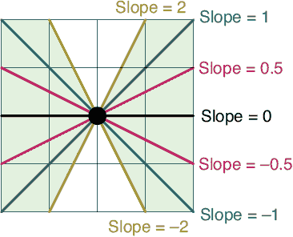

图 9-17：水平线的斜率为 0。当直线逆时针旋转时，斜率增加。当直线顺时针旋转时，斜率减少。我们只会使用斜率位于浅绿色区域的直线。

描述一条直线的第二个数字是*Y 轴截距*。它只是将整条直线上下平移。这个数字告诉我们当 X 为零时直线的值。换句话说，它是直线与 Y 轴交点的值。图 9-18 展示了这一概念。为了简化起见，我们将重点关注 Y 截距在[–2, 2]范围内的直线，这些直线在图 9-18 中被绿色标出。

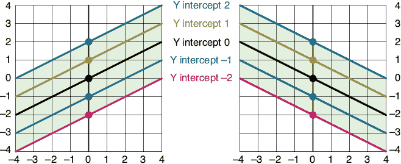

图 9-18：Y 截距告诉我们直线与 Y 轴交点时的 Y 值，无论其斜率如何。我们将只使用 Y 截距在–2 到 2 之间的直线。

给定任意一条直线，我们可以测量其方向以得到斜率的值，并观察它与 Y 轴的交点以得到 Y 截距的值。这就是描述直线所需的所有信息。我们可以将其显示为一个新二维网格中的点，其中坐标轴标记为*斜率*和*Y 截距*。我们将此称为*SI*图，表示斜率-截距。普通的图将是一个 XY 图。我们还可以说，SI 图绘制的是*SI 空间*中的直线，而 XY 图则显示的是*XY 空间*（也叫*笛卡尔空间*）中的直线。

图 9-19 显示了 XY 和 SI 图中的几条线。

数学家称这两种看待同一事物的方式为*对偶表示*，这样的事物还有很多可以讨论的地方。我们只会讨论与使用贝叶斯定理拟合直线相关的内容。

图 9-19：左：XY 空间中的三条直线。右：每条直线作为一个点绘制在 SI 空间中。

当我们在 SI 空间中将一组点沿一条直线排列时，发生了一些有趣的事情。当我们在 XY 空间中绘制它们的对应直线时，它们都会在同一个 XY 点交汇。图 9-20 展示了这一现象。这在任何时候，如果我们的 SI 点位于一条直线上时，都是成立的。

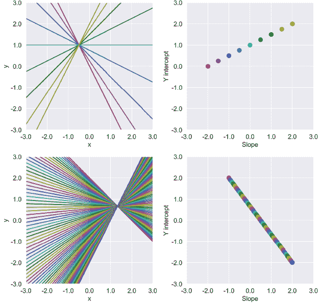

图 9-20：在 SI 空间中沿直线放置数据点的两个示例。它们对应的直线将在 XY 空间中的单一点交汇。

当我们寻找最适合数据的最佳直线时，我们知道它可能无法通过所有数据点。但我们希望它尽可能接近。因此，我们不在 SI 空间中放置数据点，而是给每一条可能的直线分配一个从 0 到 1 的概率，表示它成为我们所需直线的可能性。图 9-21 展示了这个概念（在图 9-21 及随后的图中，我们根据需要放大概率值，以便更容易阅读）。

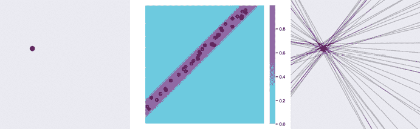

图 9-21：左：XY 空间中的一个点。中：SI 图中的每个点都分配一个从 0 到 1 的概率（从蓝到紫），告诉我们该直线与点的接近程度。我们展示了一些代表性的直线，使用黑点表示。右：中间图中的黑点作为它们在 XY 空间中的直线绘制。注意，它们都通过我们原始的红点，或者接近它。

现在让我们回到我们要解决的问题：为一个带噪声的数据集找到最佳的直线近似。我们从 SI 空间中的一个任意、宽泛的高斯凸起作为先验开始，如图 9-22 左上角所示。这意味着任何一条直线都可能是我们的答案，但处于亮紫色区域的直线最为可能。我们根据这些点的概率选择了几个点，并将它们绘制在右上角。我们得到了很多非常不同的直线，这确认了我们在选择直线时非常模糊的先验。

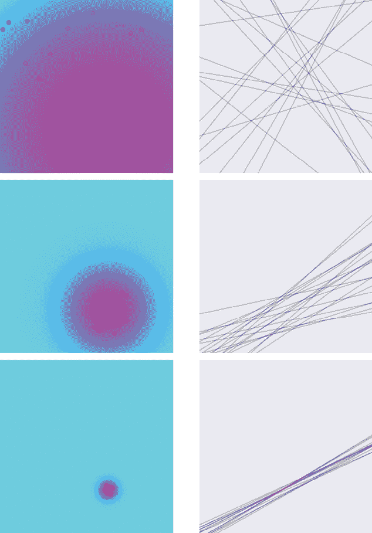

图 9-22：左上：在 SI 空间中的先验，以及从该概率分布中选择的一些点。右上：这些点在 XY 空间中绘制为直线。第二行和第三行：与第一行类似，但先验变得更小。

我们可以在图 9-22 中看到，随着先验变得更小，我们得到的直线选择变得更加精细。因此，我们希望贝叶斯法则能够跟随这种变化，给我们一个较小的后验（或先验），从而得到一小组能够拟合我们数据的直线。

现在我们准备好使用贝叶斯法则来匹配我们的数据了！图 9-23 展示了这一过程。

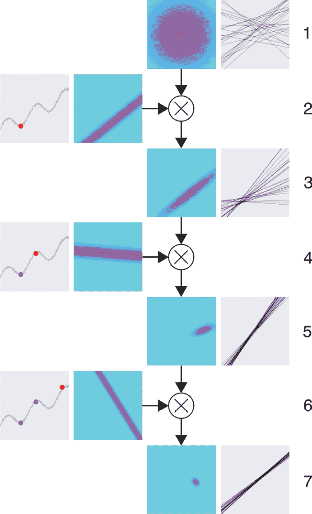

图 9-23：使用贝叶斯法则拟合我们的数据的直线（图形灵感来自 Bishop 2006）

让我们逐行查看图 9-23 中发生的情况。在第 1 行中，我们展示了我们的先验，或者说是我们对将拟合我们数据的直线分布的初步猜测。我们任意选择了一个中心在中间的高斯分布。这个先验意味着我们猜测我们的数据最可能被一条水平的直线拟合，其 Y 截距为 0，即它就是 X 轴本身。但高斯分布延伸到边缘（它在图中任何地方都没有完全达到 0），因此我们考虑的任何直线都是可能的。我们可以查看数据并选择一个更好的初始先验，但这个先验简单，而且因为它对每一条我们考虑作为候选的直线都有一定的概率，所以它是一个可以接受的起点。

第 1 行右侧的图像显示了从该先验中随机选取的 20 条直线，其中更有可能的直线被选中的概率更高。

第 2 行左侧的图像显示了我们的噪声数据集，以及随机选取的一个点，标记为红色。所有通过（或接近）该点的直线的似然图显示在其右侧。现在我们应用贝叶斯法则，将第 1 行中的先验与第 2 行中的似然相乘。

结果是第 3 行左侧的图像。这是后验，或者说是将先验中的每个点（我们认为该直线有多可能）与新点的似然（每条直线与该数据点拟合的可能性）相乘的结果。我们没有展示贝叶斯法则中除以证据的步骤，因为我们正在缩放图片以覆盖整个颜色范围，所以这实际上是后验的一个缩放版本。为了简化，我们还是称之为后验。

注意，第 3 行的后验是一个新的二维分布，由一个新的“云”表示。在其右侧，我们看到从该分布中随机绘制的另外 20 条直线。我们可以看到图像顶部的一个大空白区域，这在第 1 行中并不存在。系统从贝叶斯法则的这一单步学习到，没有任何穿过该空白区域的直线能够与我们看到的数据匹配。第 3 行的后验成为下一步数据点的新的先验。

在第 4 行，我们从输入中选择一个新的数据点，再次显示为红色。其右侧是该点对应的直线的似然性。在第 5 行，我们再次应用贝叶斯定理，并将我们的先验（来自第 3 行的后验）与第 4 行的似然性相乘，以得到新的后验。注意，后验的大小变小了，这告诉我们，适合两个点的直线集合比仅适合第一个点的集合要小。右侧显示了从这个分布中绘制的直线。注意它们如何聚集在与我们刚刚学习的两个点相似的方向上。

我们再次使用第 6 行中的新点和似然性进行处理，并在第 7 行得到新的后验和一组新的直线。来自该后验的直线非常相似，趋势似乎正趋向于与我们的数据良好拟合。通过使用越来越多的点，我们得到了一个越来越有限的可能直线范围。

从这个例子中，我们可以看出贝叶斯定理在训练学习系统中的重要性。可以把我们的训练数据看作曲线上的点，把不断演变的先验看作系统的输出。当我们向系统提供更多的样本（在这种情况下是点）时，系统能够自我调整，以提供我们所期望的响应。

看着图 9-21 右下角的这些直线，可能会让人想将偏差和方差的概念应用于它们，但那并不是贝叶斯思维方式。在贝叶斯框架中，这些不是一组近似某个真实答案的直线，我们也不能通过使用各种形式的平均来发现这个真实答案。相反，贝叶斯认为所有这些直线都是准确和正确的，只是具有不同的概率。计算从这个集合中绘制出的直线的偏差和方差是可能的，但在贝叶斯意义上并没有实际意义。

频率派方法和贝叶斯方法都允许我们将直线（或曲线）拟合到数据上。它们采用了非常不同的态度和机制，给我们提供了两种不同的方式来找到问题的好答案。

## 摘要

在这一章中，我们探讨了学习系统无法进行良好泛化的几种方式。当学习系统由于曲线与数据不匹配而表现不佳时，我们称之为欠拟合。当学习系统在新数据上表现不佳，但在训练数据上表现出色时，我们称之为过拟合：系统已经学会了训练数据中的许多独特之处和特殊性。我们看到如何通过观察训练和验证的表现并使用正则化方法来防止过拟合。我们在本章的结尾讨论了偏差和方差与过拟合的关系，并通过贝叶斯定理看到了如何为噪声数据拟合一条直线。

在下一章中，我们将探讨数据以及如何为我们的学习系统正确地准备数据。
