# 第十章：数据准备

机器学习算法的效果只能与它们所训练的数据一样好。在现实世界中，我们的数据可能来自噪声传感器、带有漏洞的计算机程序，甚至是纸质记录的不完整或不准确的转录。我们始终需要查看我们的数据，并在使用之前修复任何问题。

为了完成这项任务，已经开发了一系列丰富的方法。它们被称为*数据准备*技术或*数据清洗*技术。其目的是在从数据中学习之前对数据进行处理，以便我们的学习系统能够最有效地使用这些数据。

我们还需要确保数据本身适合机器学习，这可能意味着需要调整它，例如通过对数字进行缩放，或将类别合并。此工作至关重要，因为数据的具体结构方式以及它所涵盖的数值范围，可能会对算法从中提取的信息产生强烈影响。

本章的目标是看看我们如何调整所给的数据，在不改变其含义的情况下，获得最有效和高效的学习过程。我们从确认数据已清洗并准备好进行训练的技术开始。接着，我们将考虑检查数据本身的方法，并确保我们已经将其整理成最适合机器学习的形式。这可能包括做一些简单的事情，比如将字符串替换为数字，或采取更有趣的操作，如对数据进行缩放。最后，我们看看如何减少训练数据的大小。这可以让我们的算法运行和学习得更快。

## 基本数据清洗

让我们首先考虑一些简单的方法，确保我们的数据已经清洗干净。其基本思想是确保我们开始使用的数据没有空白、错误条目或其他错误。

如果我们的数据是文本形式的，那么我们需要确保没有印刷错误、拼写错误、嵌入的不可打印字符或其他类似的破损。例如，如果我们有一组动物照片，并且有一个文本文件描述这些照片，而我们的系统区分大小写，那么我们需要确保每只长颈鹿都标注为 giraffe，而不是 girafe 或 Giraffe，我们还要避免其他拼写错误或变体，如 beautiful giraffe 或 giraffe-extra tall。每次提到长颈鹿时，都需要使用相同的字符串。

我们还应该寻找其他常识性的事项。我们要去除训练数据中的任何重复项，因为它们会扭曲我们对所用数据的理解。如果我们不小心将某一数据项重复多次，我们的学习器会将其视为多个不同的样本，它们恰好具有相同的值，因此该样本可能会产生比应有的更大影响。

我们还需要确保没有任何拼写错误，比如漏掉小数点导致我们指定了 1,000 而不是 1.000，或者在数字前放了两个减号而不是一个。在一些手工编写的数据库中，发现空白或问号的情况并不罕见，表示人们没有数据可输入。一些计算机生成的数据库可能会包含像`NaN`（不是一个数字）这样的代码，这是一个占位符，表示计算机本来想输出一个数字，但没有有效的数字可显示。更麻烦的是，有时候当人们在填写数值字段时缺少数据时，他们会输入类似 0 或–1 的值。我们必须在开始从数据中学习之前找到并修复所有这些问题。

我们还需要确保数据的格式能够被我们提供的计算软件正确解读。例如，我们可以使用一种称为*科学计数法*的格式来表示非常大或非常小的数字。问题在于，这种表示法没有一个正式的格式。不同的程序使用略有不同的方式来输出这种格式，而其他读取这些数据的程序（比如我们在深度学习中经常使用的库函数）可能会误解它们无法预料的格式。例如，在科学计数法中，值 0.007 通常会被表示为`7e-3`或`7E-3`。当我们提供`7e-3`作为输入时，程序可能会将其解释为（7 × *e*）– 3，其中*e*是欧拉常数，值约为 2.7。结果是计算机认为`7e-3`意味着我们要求它先将 7 和*e*的值相乘，然后减去 3，得出大约 16，而不是 0.007。我们需要捕捉到这些问题，以确保我们的程序能正确解读它们的输入。

我们还需要查找缺失的数据。如果一个样本缺失了一个或多个特征的数据，我们可能能够手动或通过算法填补这些空缺，但有时候直接删除这个样本可能更好。这是一个主观的决策，通常需要根据具体情况逐个判断。

最后，我们需要识别出任何与其他数据明显不同的部分。这些*异常值*可能只是一些拼写错误，比如漏掉了小数点。也有可能是人为错误，比如错误的复制粘贴，或者某人忘记从电子表格中删除一条记录。当我们不确定某个异常值是有效数据还是某种错误时，我们必须运用我们的判断力来决定是否保留它，或者手动将其删除。这是一个主观的决策，完全依赖于我们的数据代表什么，我们对其的理解程度，以及我们想如何处理它。

虽然这些步骤看起来可能很简单，但在实践中，根据我们的数据的大小和复杂性以及我们首次获取时的混乱程度，执行起来可能是一项重大工作。有许多工具可帮助我们清理数据。有些是独立的，而其他的内置在机器学习库中。商业服务也会收费清理数据。

记住这句经典的计算格言非常有用：*垃圾进，垃圾出*。换句话说，我们的结果只能和我们的起始数据一样好，所以从最好的可用数据开始非常重要，这意味着我们必须努力使其尽可能清洁。

现在我们已经处理了基本的细枝末节，让我们把注意力转向使数据适合学习。

## 一致性的重要性

准备学习的数字意味着对它们应用*变换*，而不改变我们关心的它们之间的关系。我们在本章后面涵盖了几种这样的变换，例如，我们可能将所有数字缩放到给定范围内或者消除一些多余的数据，这样学习者的工作就少了。当我们做这些事情时，我们必须始终遵守一个重要原则：任何时候我们以某种方式修改我们的训练数据，*我们也必须以同样的方式修改所有未来的数据*。

让我们看看为什么这么重要。当我们对训练数据进行任何更改时，我们通常修改或组合值的方式，旨在提高计算机的学习效率或准确性。图 10-1 用视觉方式展示了这个想法。

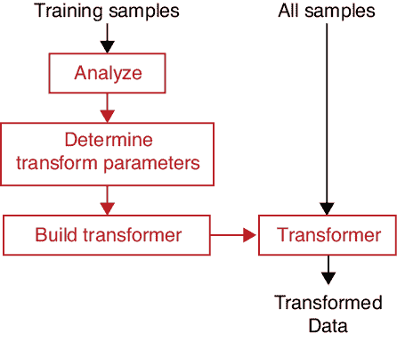

图 10-1：用于训练和评估预处理流程的流程图

正如图所示，我们通常通过查看整个训练集来确定所需的所有变换。我们将数据转换为训练我们的学习者，并且在我们释放系统到世界之后，我们也使用相同的转换来处理所有新数据。关键点在于，我们必须为我们的算法提供的所有新数据应用*相同的*修改，只要我们的系统在使用中。这一步绝不能被忽略。

我们需要在机器学习中再次强调，每当我们评估数据时，我们都需要重新使用相同的转换方式。让我们首先用一个视觉示例来以一种一般的方式看待这个问题。

假设我们想教一个分类器如何区分牛的图片和斑马的图片。我们可以收集大量两种动物的照片作为训练数据。最明显区分这两种动物图片的是它们不同的黑白斑纹。为了确保我们的学习者关注这些元素，我们可能决定裁剪每张照片以隔离动物的皮毛，然后用这些孤立的纹理块来训练。学习者只看到这些裁剪过的照片。图 10-2 展示了几个样本。

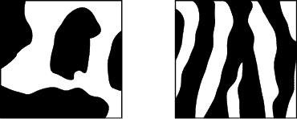

图 10-2：左：一块牛的纹理。右：一块斑马的纹理。

假设我们已经训练并部署了我们的系统，但我们忘记告知用户这一图像预处理步骤——将每张图片裁剪到仅保留纹理的部分。如果没有了解这个关键信息，典型的用户可能会提供完整的牛和斑马照片，像图 10-3 中那样，并要求系统识别每张图片中的动物。

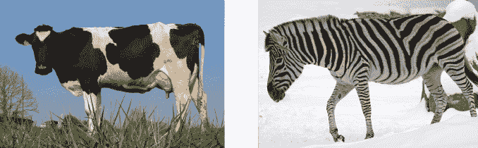

图 10-3：左：一张牛的照片。右：一张斑马的照片。如果我们在图 10-2 中训练我们的系统，系统可能会被照片中的额外细节误导。

人类可以从这些照片中识别出皮肤纹理模式。另一方面，计算机可能会被腿部、头部、地面和其他细节误导，从而降低其提供良好结果的能力。图 10-2 中的准备数据和图 10-3 中的未准备数据之间的差异可能会导致系统在训练数据上表现出色，但在实际应用中给出糟糕的结果。为了避免这种情况，所有新数据（如图 10-3 中的数据）必须裁剪成与图 10-2 中的训练数据完全相同的输入。

忘记以与我们转换训练数据相同的方式转换新数据是一个容易犯的错误，但通常会导致我们的算法表现不佳，有时甚至变得毫无用处。记住这个规则：我们首先确定如何修改训练数据，然后修改它，接着我们*记住我们是如何修改它的*。每当我们处理更多数据时，必须首先*以与训练数据相同的方式修改这些数据*。我们稍后会回到这个想法，看看它是如何在实践中使用的。

## 数据类型

典型的数据库包含不同类型的数据：浮动小数、字符串、整数（用于类别标识）等。我们会根据不同的数据类型采用不同的处理方式，因此区分这些数据并为每种类型命名是很有用的。最常见的命名系统是基于数据是否可以排序的标准。尽管我们在深度学习中很少显式进行排序，但这个命名系统仍然很方便并被广泛使用。

回想一下，每个样本是一组值的列表，每个值被称为*特征*。每个样本中的特征可以是两种基本类型之一：*数值型*或*类别型*。

数值数据就是一个数字，可以是浮动小数或整数。我们也称之为*定量*数据。数值数据或定量数据可以通过其值进行排序。

类别数据指的是其他类型的数据，通常它是描述标签的字符串，比如牛或斑马。这两种类别数据分别对应可自然排序的数据和不可排序的数据。

*有序*数据是具有已知顺序的分类数据（因此得名），因此我们可以对其进行排序。字符串可以按字母顺序排序，也可以按含义排序。例如，我们可以将彩虹的颜色视为有序数据，因为它们在彩虹中有一个自然的排序，从红色到橙色，再到紫色。为了按彩虹顺序排序颜色名称，我们需要使用一个理解彩虹颜色顺序的程序。另一个有序数据的例子是描述一个人不同年龄段的字符串，如婴儿、青少年和老年人。这些字符串也有一个自然的顺序，因此我们也可以对它们进行排序，再次通过某种自定义的程序。

*名义*数据是没有自然顺序的分类数据。例如，桌面物品列表，如回形针、订书机和削笔刀，并没有自然的排序，衣物图片的集合，比如袜子、衬衫、手套和圆顶礼帽，也没有自然顺序。我们可以通过定义一个顺序并遵循它，将名义数据转化为有序数据。例如，我们可以声明衣物的顺序应该从头到脚，因此我们之前的例子中的顺序应为圆顶礼帽、衬衫、手套和袜子，从而将这些图片转化为有序数据。我们为名义数据创建的顺序不必有特别的逻辑，只要它被定义并且始终如一地使用即可。

机器学习算法需要数字作为输入，因此我们在学习之前将字符串数据（和任何其他非数字数据）转化为数字。以字符串为例，我们可以列出所有训练数据中的字符串，并为每个字符串分配一个唯一的数字，从 0 开始。许多库提供了内置的程序来创建并应用这种转换。

## 一位编码（One-Hot Encoding）

有时，将整数转化为列表是有用的。例如，我们可能有一个有 10 个类别的分类器，其中类别 3 可能是烤面包机，类别 7 可能是圆珠笔，依此类推。当我们手动为这些物体之一的照片分配标签时，我们查阅这个列表并给它正确的数字。当系统做出预测时，它会返回一个包含 10 个数字的列表。每个数字代表系统认为输入属于相应类别的置信度。

这意味着我们将标签（一个整数）与分类器的输出（一个列表）进行比较。当我们构建分类器时，将列表与列表进行比较是有意义的，因此我们需要一种方法将标签转化为列表。

这很容易做到。我们标签的列表形式就是我们从输出中想要的列表。假设我们正在标注一个烤面包机的图片。我们希望系统的输出是一个包含十个值的列表，其中第 3 类的槽位为 1，表示我们完全确定这是一个烤面包机，而其他所有槽位都是 0，表示我们完全确定图像不是其他任何东西。所以，我们的标签的列表形式就是这个：十个数字，全部为 0，除了第 3 个槽位为 1。

将像 3 或 7 这样的标签转换为这种列表的过程称为*独热编码*，即列表中只有一个条目是“热的”或已标记的。这个列表本身有时被称为*虚拟变量*。当我们在训练过程中向系统提供类别标签时，通常提供的是这个独热编码列表或虚拟变量，而不是单一的整数。

让我们看看实际应用中的情况。图 10-4(a) 显示了 1903 年原版 Crayola Crayons 盒子中的八种颜色（Crayola 2016）。假设这些颜色在我们的数据中以字符串形式出现。我们提供给系统的独热标签显示在最右列。

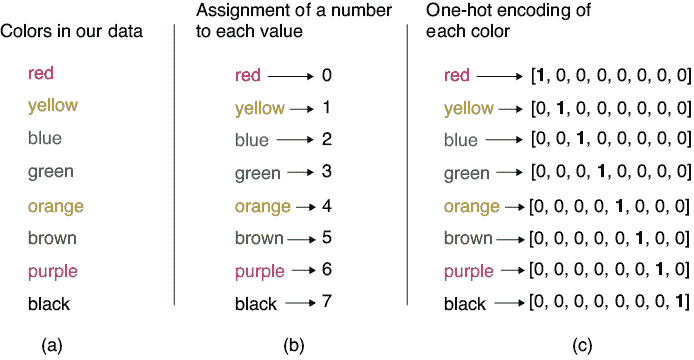

图 10-4：1903 年原始八种 Crayola 颜色的独热编码。（a）原始的八个字符串。（b）每个字符串都分配一个从 0 到 7 的值。（c）每次该字符串出现在我们的数据中时，我们将其替换为一个包含八个数字的列表，所有数字为 0，除了对应该字符串值的位置为 1。

到目前为止，我们已经将数据从一种形式转换成了另一种形式。现在，让我们来看一些实际上改变我们数据值的变换。

## 标准化和规范化

我们经常处理特征跨越不同数值范围的样本。例如，假设我们收集了关于一群非洲草原象的数据。我们的数据用四个值描述每只大象：

1.  年龄（小时）（0, 420,000）

1.  重量（吨）（0, 7）

1.  尾巴长度（厘米）（120, 155）

1.  相对于历史平均年龄的年龄，单位小时（−210,000, 210,000）

这些是显著不同的数字范围。一般来说，由于我们使用的算法是数值型的，较大的数字可能比较小的数字对学习程序的影响更大。特征 4 中的值不仅很大，而且还可能是负数。

为了获得最佳的学习效果，我们希望所有数据在某种程度上具有可比性，或者大致适合相同的数字范围。

### 规范化

转换数据的一个常见第一步是对每个特征进行*归一化*。在日常生活中，*normal*这个词通常意味着“典型的”，但在不同领域它也有专门的技术含义。在这个上下文中，我们使用的是统计学上的含义。我们说，当我们将数据缩放到某个特定范围时，数据就被*归一化*了。归一化的最常见范围是[−1,1]和[0,1]，具体取决于数据及其含义（例如，谈论负的苹果或年龄就没有意义）。每个机器学习库都提供了执行此操作的常规方法，但我们必须记得调用它。

图 10-5 展示了我们将用于演示的二维数据集。我们选择了吉他形状，因为它有助于我们看到数据点在移动时发生的变化。我们还添加了颜色，仅仅作为视觉辅助工具，帮助我们看到数据点的移动。颜色没有其他意义。

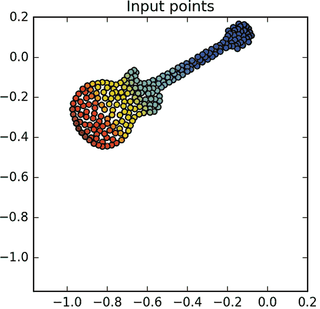

图 10-5：由 232 个数据点构成的吉他形状

通常，这些数据点是测量结果，例如某些人的年龄和体重，或者一首歌的节奏和音量。为了保持通用性，我们将这两个特征称为 x 和 y。

图 10-6 显示了将我们吉他形状数据中的每个特征归一化到范围[−1,1]后的结果。

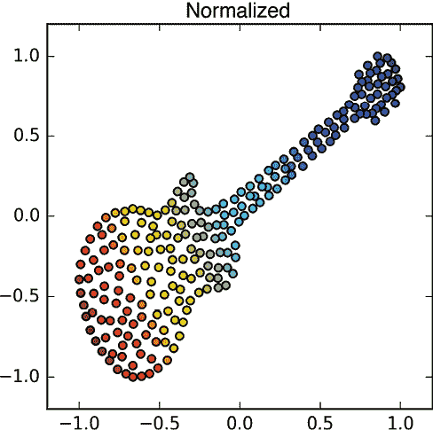

图 10-6：对图 10-5 中的数据进行归一化处理后，数据范围被调整到[−1,1]。形状的倾斜是由于在 y 轴方向上拉伸较多，而 x 轴方向的拉伸较少。

在图 10-6 中，x 值的范围从−1 到 1 进行缩放，而 y 值则独立地从−1 到 1 进行缩放。通过这种操作得到的吉他形状稍微发生了倾斜，因为它在垂直方向上被拉伸得比水平方向更长。每当起始数据的不同维度跨越不同范围时，就会发生这种情况。在我们的例子中，x 数据最初的范围大约是[–1, 0]，而 y 数据的范围大约是[–0.5, 0.2]。当我们调整这些值时，我们必须比 x 值更大地拉伸 y 值，导致了在图 10-6 中看到的倾斜。

### 标准化

另一个常见操作是对每个特征进行*标准化*。这是一个两步过程。首先，我们为每个特征的所有数据添加（或减去）一个固定值，使得每个特征的均值为 0（这个步骤也叫做*均值归一化*或*均值减法*）。在我们的二维数据中，这会将整个数据集左右和上下移动，使得均值恰好位于(0,0)的位置。然后，我们不是将每个特征归一化或缩放到−1 到 1 之间，而是将其缩放到标准差为 1（这个步骤也叫做*方差归一化*）。回想第二章，这意味着该特征中大约 68%的值位于−1 到 1 的范围内。

在我们的二维示例中，x 值会被水平拉伸或压缩，直到大约 68%的数据在 X 轴的−1 和 1 之间，然后 y 值会被垂直拉伸或压缩，直到 Y 轴上也满足相同的条件。这必然意味着点会落在每个轴的[−1,1]范围之外，因此我们的结果与归一化所得到的不同。图 10-7 展示了标准化应用于我们在图 10-5 中的原始数据。

图 10-7：标准化后图 10-5 的数据

在这里我们再次看到，当原始形状不符合正态分布时，像标准化这样的转换可能会扭曲或以其他方式改变原始数据的形状。大多数库提供了一个函数，可以一次性对我们的所有特征进行归一化或标准化处理。这使得满足某些要求输入数据归一化或标准化的算法变得更加方便。

### 记住转换

归一化和标准化过程都由参数控制，这些参数告诉它们如何执行任务。大多数库函数会分析数据以找到这些参数，然后利用它们来应用转换。由于使用相同操作转换未来数据至关重要，这些库调用总是提供一种方法来保存这些参数，以便我们以后可以再次应用相同的转换。

换句话说，当我们稍后收到一批新数据以进行评估时，无论是为了评估系统的准确性，还是为了在实际应用中做出预测，我们*不会*分析这些数据以寻找新的归一化或标准化转换。相反，我们会应用为训练数据确定的相同归一化或标准化步骤。

这一过程的结果是，新转换后的数据几乎从未真正归一化或标准化。也就是说，数据的范围不会在两个轴上都在[−1,1]之间，或者它的平均值不会在(0,0)处，并且其 68%的数据不会在每个轴上的[−1,1]范围内。这没关系。重要的是我们使用了相同的转换。如果新数据没有完全归一化或标准化，那也无妨。

## 转换类型

一些转换是*单变量*的，这意味着它们一次只处理一个特征，每个特征彼此独立（该名称来源于将*uni*（表示“一个”）与*variate*（表示“变量”或“特征”）结合）。其他的则是*多变量*的，意味着它们同时处理多个特征。

让我们考虑一下标准化。这通常作为一个单变量变换器来实现，它将每个特征当作一个独立的数据集来处理。也就是说，如果它是将二维点缩放到[0,1]范围，它会首先将所有的 x 值缩放到这个范围，然后独立地将所有的 y 值缩放到这个范围。两个特征集之间没有任何交互，因此 X 轴如何被缩放与 y 值无关，反之亦然。图 10-8 直观地展示了这一理想情况，展示了对具有三个特征的数据应用的标准化过程。

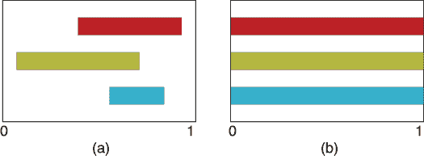

图 10-8：当我们应用单变量变换时，每个特征是独立地变换的。在这里，我们将三个特征标准化到[0,1]的范围内。(a) 三个特征的起始范围。(b) 每个特征的范围独立地被移动和拉伸到[0,1]的范围内。

相比之下，多变量算法同时考虑多个特征，并将它们作为一个整体来处理。这个过程的最极端（也是最常见）版本是同时处理所有特征。如果我们以多变量方式缩放这三根彩条，我们将它们作为一个整体进行移动和拉伸，直到它们共同覆盖[0,1]的范围，正如图 10-9 所示。

我们可以采用单变量或多变量方式进行多种变换。我们根据数据和应用场景来选择。例如，当我们缩放 x 和 y 样本时，单变量版本在图 10-6 中是合理的，因为它们本质上是独立的。但假设我们的特征是不同时间、不同日期的温度测量值呢？我们可能希望将所有特征一起缩放，这样作为一个整体，它们就覆盖了我们所使用的温度范围。

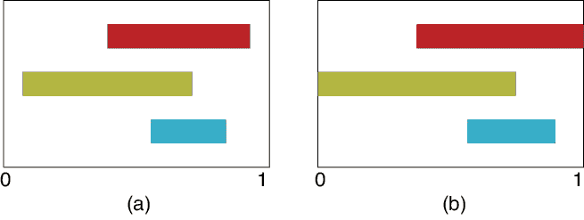

图 10-9：当我们应用多变量变换时，我们同时处理多个特征。在这里，我们再次将范围标准化到[0,1]。(a) 三个特征的起始范围。(b) 条形图作为一个整体被移动和拉伸，使得它们的最小值和最大值共同覆盖[0,1]的范围。

### 切片处理

给定一个数据集，我们需要思考如何选择我们要转换的数据。根据我们是否按样本、按特征或按元素提取数据，通常有三种方法。这些方法分别称为*样本级*、*特征级*和*元素级*处理。

让我们按这个顺序来看看它们。为了讨论的方便，假设我们数据集中的每个样本都是一组数字列表。我们可以将整个数据集安排成一个二维网格，其中每一行包含一个样本，每一行中的每个元素是一个特征。图 10-10 展示了这种设置。

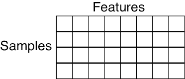

图 10-10：我们接下来讨论的数据集是一个二维网格。每一行是一个样本，包含多个特征，这些特征构成了列。

### 样本级处理

样本逐一处理方法适用于所有特征都是同一事物的不同方面的情况。例如，假设我们的输入数据包含一些音频片段，例如某人通过手机讲话。那么每个样本中的特征就是音频在连续时刻的振幅，如图 10-11 所示。

如果我们想将这些数据缩放到[0,1]范围内，那么按单个样本缩放所有特征是有意义的，这样最响亮的部分就设为 1，最安静的部分设为 0。因此，我们一次处理一个样本，独立于其他样本。

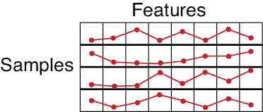

图 10-11：每个样本由一段短音频波形的测量数据组成。每个特征给出了该时刻声音的音量的瞬时测量值。

### 按特征处理

按特征处理方法适用于我们的样本代表本质上不同的事物。

假设我们每天晚上都进行各种天气测量，记录温度、降水量、风速和湿度。这为每个样本提供了四个特征，如图 10-12 所示。

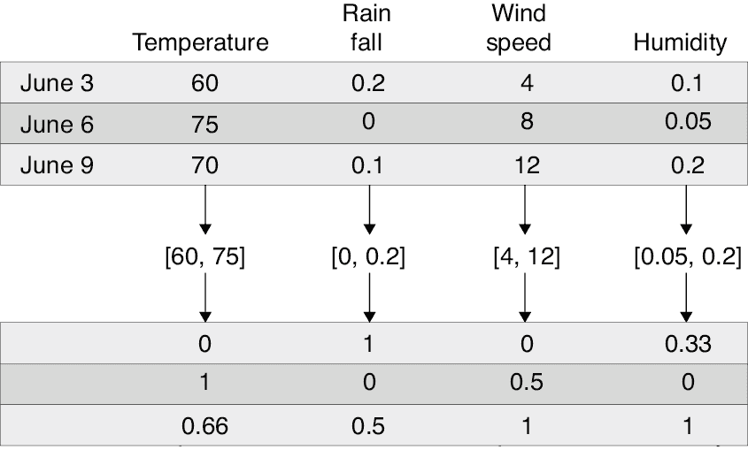

图 10-12：当我们按特征处理数据时，我们独立分析每一列。前三行：原始数据。中间一行：范围。底部一行：缩放后的数据。

按样本逐一缩放这些数据没有意义，因为单位和测量方式不兼容。我们不能在同等条件下比较风速和湿度。但我们可以将所有湿度值一起分析，温度、降水量和湿度的所有值也可以以同样的方式处理。换句话说，我们依次修改每个特征。

当我们按特征处理数据时，每一列特征值有时被称为*纤维*。

### 元素逐一处理

元素逐一处理方法将图 10-10 网格中的每个元素视为独立实体，并对网格中的每个元素独立应用相同的变换。例如，当我们的所有数据代表相同类型的事物，但我们想改变其单位时，这种方法很有用。例如，假设每个样本对应一个有八个成员的家庭，并包含这八个人的身高。我们的测量团队报告了他们的身高（单位为英寸），但我们想要将其转换为毫米。

我们只需要将网格中的每个条目乘以 25.4，将英寸转换为毫米。无论我们是沿着行还是列进行操作都没有关系，因为每个元素都以相同的方式处理。

我们在处理图像时经常这样做。图像数据通常每个像素的值在[0,255]范围内。我们通常应用元素逐一缩放操作，将整个输入图像的每个像素值除以 255，得到的结果是一个 0 到 1 之间的数据。

大多数库允许我们使用这些解释中的任何一种应用变换。

## 逆变换

我们一直在研究可以应用于数据的不同转换。但是，有时我们希望撤销或*反转*这些步骤，这样我们就可以更容易地将结果与原始数据进行比较。

例如，假设我们为一个有一条主要高速公路的城市交通部门工作。我们的城市位于北方，所以温度常常降到冰点以下。城市管理者注意到，交通密度似乎与温度有关，最冷的日子里更多的人待在家里。为了规划道路施工和其他建设，管理者希望了解他们可以根据温度预测每天早晨高峰时段的车辆数量。由于需要一些时间来测量和处理数据，我们决定每晚午夜测量一次温度，然后预测第二天早晨 7 点到 8 点之间路上的车辆数量。我们将在冬季中期开始使用系统，因此我们预期温度会在冰点以上和以下（0°C）波动。

几个月来，我们每晚午夜测量温度，并在第二天早晨 7 点到 8 点之间统计通过特定路标的总车辆数。原始数据如图 10-13 所示。

我们希望将这些数据提供给一个机器学习系统，该系统将学习温度与交通密度之间的关系。部署后，我们输入一个样本，包含一个特征，描述温度（以度数表示），然后返回一个实数，告诉我们预测的路上车辆数量。

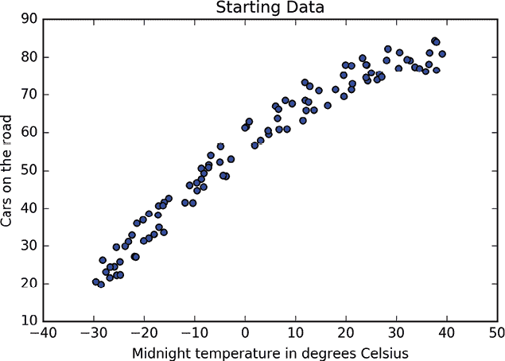

图 10-13：每个午夜我们测量一次温度，然后在第二天早晨 7 点到 8 点之间测量路上的车辆数量。

假设我们使用的回归算法在输入数据缩放到[0,1]范围内时效果最好。我们可以像图 10-14 那样，在两个坐标轴上将数据归一化到[0,1]范围。

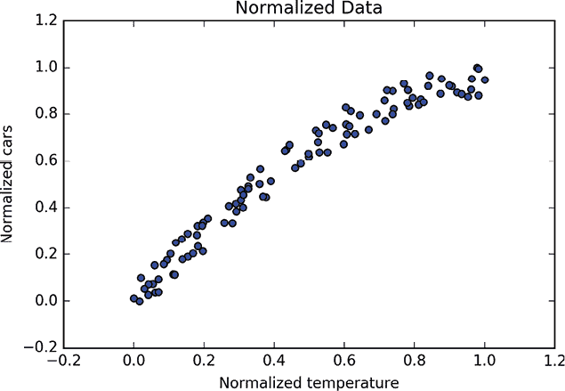

图 10-14：将两个范围都归一化到[0,1]使数据更适合训练。

这看起来就像是图 10-13，只是现在我们的两个尺度（和数据）都从 0 到 1。

我们强调记住这种转换的重要性，这样我们才能将其应用于未来的数据。我们将分三步来介绍这些机制。为了方便，我们采用面向对象的哲学，其中我们的转换由对象执行，而对象会记住它们自己的参数。

我们的三步中的第一步是为每个坐标轴创建一个转换器对象。这个对象能够执行这种转换（也叫做*映射*）。

其次，让我们将输入数据提供给该对象进行分析。它找到最小值和最大值，并利用它们创建转换，将我们的输入数据移位并缩放到[0,1]范围内。我们将温度数据提供给第一个转换器，将车辆计数数据提供给第二个转换器。

到目前为止，我们只创建了转换器，但还没有应用它们。我们的数据没有发生任何变化。

图 10-15 展示了这个过程。

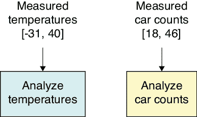

图 10-15：构建转换对象。左侧：温度数据输入到一个转换对象中，表示为一个蓝色矩形。右侧：我们还为汽车计数构建了一个黄色的转换器。

第三步是将我们的数据再次交给转换对象，这次我们告诉它们应用它们已经计算出的转换。结果是一个新的数据集，已经转换到[0,1]的范围内。图 10-16 展示了这个过程。

现在我们准备好进行学习了。我们将转换后的数据提供给学习算法，让它分析输入与输出之间的关系，如图 10-17 所示。

假设我们已经训练好了系统，并且它能很好地根据温度数据预测汽车数量。

第二天，我们将系统部署到城市管理者的网页上。在第一个晚上，值班经理测得午夜时温度为−10°摄氏度。她打开我们的应用程序，找到温度输入框，输入−10 并点击“大型预测交通”按钮。

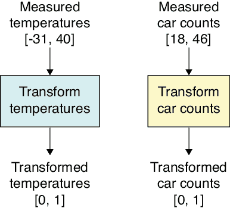

图 10-16：每个特征都被我们之前计算出的转换所修改。转换后的输出进入我们的学习系统。

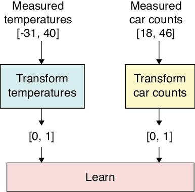

图 10-17：从我们转换后的特征和目标中学习的示意图

哎呀，出现了问题。我们不能直接将−10 输入到我们训练过的系统中，因为正如图 10-17 所示，它期望输入的是一个范围在 0 到 1 之间的数字。我们需要以某种方式对数据进行转换。唯一合理的做法是应用我们在训练系统时对温度所做的相同转换。例如，如果在原始数据集中−10 变成了 0.29，那么如果今晚的温度是−10，我们应该输入 0.29，而不是−10\。

这时我们就能看到将转换保存为对象的价值。我们可以简单地告诉这个对象，使用它在训练数据上应用的相同转换，现在将其应用到这组新的数据上。如果−10 在训练中变成了 0.29，那么任何新的−10 输入，在部署时也会变成 0.29。

假设我们正确地将温度 0.29 提供给系统，它输出的交通密度是 0.32\。这对应于通过我们对汽车转换所得到的某个汽车数量的值。但是这个值是在 0 和 1 之间，因为这是我们训练时代表汽车数量的数据的范围。我们如何撤销这个转换，把它转换回汽车数量呢？

在任何机器学习库中，每个转换对象都有一个*逆向*例程，用来撤销其转换，提供一个*逆向转换*。在这种情况下，它会反转之前应用的标准化转换。如果该对象将 39 辆车转换为标准化值 0.32，那么逆向转换会将标准化值 0.32 转回为 39 辆车。这就是我们打印给城市经理的值。图 10-18 展示了这些步骤。

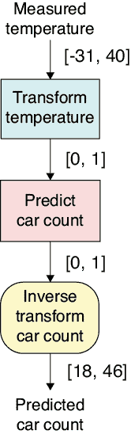

图 10-18：当我们将新的温度输入系统时，我们使用我们为温度数据计算的转换，将其转换为一个 0 到 1 之间的数字。出来的值接着会通过我们为汽车数据计算的逆向转换，将其从缩放的数字转换为汽车的数量。

这里可能出现的一个问题是，如果我们获得了超出原始输入范围的新样本。假设我们在某个夜晚测得了一个令人吃惊的低温 −50° 摄氏度，这个温度远低于我们原始数据中的最小值。结果是，经过转换后的值是一个负数，超出了我们的[0,1]范围。如果我们遇到一个非常热的夜晚，测得一个正温度，经过转换后得到的值将大于 1，这同样超出了[0,1]范围。

两种情况都是可以的。我们希望将输入缩放到[0,1]范围内，是为了让训练尽可能高效，并且控制数值问题。一旦系统训练完毕，我们可以给它任何我们想要的输入，它会计算出相应的输出。当然，我们仍然需要注意我们的数据。如果系统预测明天的车数为负数，我们是不能基于这个数字来制定计划的。

## 交叉验证中的信息泄漏

我们已经看到如何从训练集构建转换，然后保持这个转换，并将其不变地应用于所有附加数据。如果我们不仔细遵循这个策略，就可能会发生*信息泄漏*，即本不应包含在转换中的信息意外地渗入（或泄漏）到转换中，从而影响转换。这意味着我们没有按照预期的方式转换数据。更糟糕的是，这种泄漏可能导致系统在评估我们的测试数据时获得不公平的优势，从而给我们一个虚高的准确度衡量值。我们可能会得出系统足够好，可以部署的结论，结果却会在实际使用时表现得更差。

信息泄漏是一个具有挑战性的问题，因为它的许多原因可能是微妙的。举个例子，让我们看看信息泄漏是如何影响交叉验证过程的，这一点我们在第八章讨论过。现代库提供了方便的例程，提供快速且正确的交叉验证实现，因此我们不必自己编写代码来实现它。但我们还是来看看底层的实现。我们将看到一个看似合理的方法是如何导致信息泄漏的，然后我们将看看如何修复它。看到实际操作中的这些情况将帮助我们更好地预防、发现和修复我们自己系统和算法中的信息泄漏。

回顾一下在交叉验证中，我们将初始训练集中的一个折叠（或部分）留出作为临时验证集。然后我们建立一个新的学习器，并用其余数据进行训练。当训练完成后，我们使用保存的折叠作为验证集来评估学习器。这意味着每次进入循环时，我们都有一个新的训练集（即去除了选定折叠样本的初始数据）。如果我们要对数据进行转换，我们需要仅基于作为该学习器训练集的数据来构建转换。然后，我们将这个转换应用到当前的训练集，并将*相同的转换*应用到当前的验证集。需要记住的关键点是，因为在交叉验证中我们每次通过循环都会创建一个新的训练集和验证集，所以我们每次通过循环时也需要构建一个新的转换。

让我们看看如果我们做错了会发生什么。图 10-19 显示了我们开始的样本集在左侧。它们被分析以生成一个转换（由红圈表示），然后通过转换例程（标记为 T）应用该转换。为了展示变化，我们将转换后的样本标为红色，像转换一样。

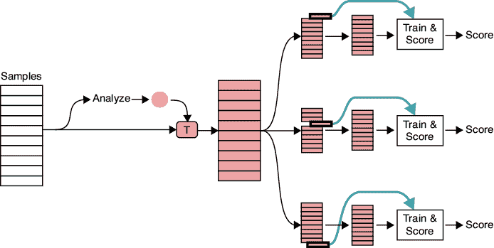

图 10-19：一种*错误*的交叉验证方法：基于所有原始训练数据构建一个转换

然后我们进入交叉验证过程。这里循环是“展开”的，因此我们展示了多个训练会话的实例，每个实例与不同的折叠相关联。每次进入循环时，我们移除一个折叠，使用剩余的样本进行训练，然后用验证折叠进行测试并创建得分。

这里的问题是，当我们分析输入数据以构建转换时，我们将每个折叠中的数据都包含在了分析中。为了看看为什么这是一个问题，让我们更仔细地观察一下在一个更简单、更具体的场景中发生了什么。

假设我们想要应用的转换是将训练集中的所有特征按组缩放到 0 到 1 的范围内。也就是说，我们将进行逐样本的多变量标准化。假设在第一个折叠中，最小和最大特征值分别为 0.01 和 0.99。在其他折叠中，最大和最小值位于较小的范围内。图 10-20 展示了每个折叠中数据的范围。我们将分析所有折叠中的数据，并从中构建我们的转换。

在图 10-20 中，左侧显示了我们的数据集被分成五个折叠。在每个框内，我们展示了该折叠的值范围，左侧为 0，右侧为 1。顶部的折叠包含从 0.01 到 0.99 的特征。其他折叠中的值位于此范围内。当我们将所有折叠的数据作为一个整体进行分析时，第一个折叠的范围占主导地位，因此我们只会稍微拉伸整个数据集。

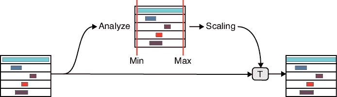

图 10-20：一种*错误*的数据转换方式是在循环之前一次性转换所有数据。

现在，让我们继续进行交叉验证循环。我们的输入数据是图 10-20 右侧的五个转换后的折叠数据堆叠。首先，我们提取第一个折叠并将其放置一旁；然后我们可以使用剩余的数据进行训练和验证。但我们在这里犯了一个错误，因为*我们的训练数据转换受到了验证数据的影响*。这违反了我们的基本原则，即仅使用训练数据中的值来创建转换。然而，我们在计算转换时使用了现在作为验证数据的部分数据。我们称之为信息*泄露*，因为验证数据的内容进入了不该存在的转换参数中。

正确的构建训练数据转换的方法是，从样本中移除验证数据，然后从剩余数据中构建转换，再将该转换应用于训练数据和验证数据。图 10-21 直观地展示了这一过程。

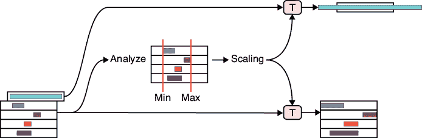

图 10-21：交叉验证时正确的数据转换方式是，首先移除折叠样本，然后从剩余数据中计算转换。

现在我们可以将该转换应用于训练集和验证数据。请注意，这里验证数据最终超出了[0,1]范围，这没有问题，因为这些数据确实比训练集更为极端。

为了修正我们的交叉验证过程，我们需要在循环中使用这一方案，并为每个训练集计算新的转换。图 10-22 展示了正确的处理方法。

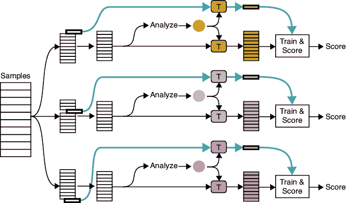

图 10-22：交叉验证的正确方法

对于我们想要作为验证集的每一个折叠，我们会分析移除该折叠的起始样本，然后将得到的变换应用到训练集和验证集。不同的颜色表明每次循环时，我们构建并应用的是不同的变换。

我们在交叉验证的背景下讨论了信息泄漏，因为它是这个棘手话题的一个很好的例子。幸运的是，现代库中的交叉验证程序都能正确处理，所以我们在使用库的例程时不必担心这个问题。但这并不意味着我们在编写自己代码时就可以不管信息泄漏。信息泄漏往往很微妙，它可能以意想不到的方式潜入我们的程序。我们在构建和应用变换时，始终要仔细考虑可能的信息泄漏源，这一点非常重要。

## 缩小数据集

我们一直在研究如何调整数据中的数字，以及如何选择进入每个变换的数字。现在，让我们来看一种不同的变换方式，这种方式不仅仅是操作数据，而是实际压缩数据。我们将字面上创建一个比原始训练集更小的新数据集，通常是通过删除或合并每个样本中的特征。

这有两个好处：提高训练时的速度和准确性。可以推理出，训练时我们处理的数据越少，训练的速度就越快。提到速度，我们是指在给定的时间内，我们能够完成更多的学习，从而使得系统更为准确。

让我们来看几种缩小数据集的方法。

### 特征选择

如果我们在数据中收集了冗余、不相关或其他无用的特征，那么我们应该将它们剔除，以免浪费时间。这一过程叫做*特征选择*，有时也叫做*特征筛选*。

让我们考虑一个例子，其中一些数据实际上是多余的。假设我们正在手动标注大象的图像，输入它们的大小、物种以及其他特征到数据库中。不知为何，大家记不清楚，我们还设有一个字段用于记录头的数量。大象只有一个头，所以这个字段的值将始终是 1。因此，这个数据不仅没用，还会拖慢我们的速度。我们应该从数据中删除这个字段。

我们可以将这个想法推广到去除那些*几乎*无用的特征，这些特征贡献很小，或者根本没有对得到正确答案做出太大贡献。继续以我们收集的大象图像为例。我们为每只大象记录了身高、体重、最后已知的纬度和经度、象鼻长度、耳朵大小等等。但对于这个（假设的）物种，象鼻长度和耳朵大小可能是高度相关的。如果是这样，我们可以删除（或*筛选掉*）其中一个特征，依然可以获得它们各自代表的信息的好处。

许多库提供了可以估算从数据库中删除每个字段的影响的工具。我们可以利用这些信息来指导我们简化数据库，加速学习，同时不牺牲我们愿意放弃的准确性。因为删除特征是一个转换过程，因此从训练集中删除的任何特征，也必须从未来的所有数据中删除。

### 维度减少

降低数据集大小的另一种方法是组合特征，使一个特征能够完成两个或更多特征的工作。这被称为*维度减少*，其中*维度*指的是特征的数量。

这里的直觉是，我们的数据中某些特征可能密切相关，但并不完全冗余。如果关系很强，我们可能能够将这两个特征合并成一个新的特征。一个日常的例子是*身体质量指数（BMI）*。它是一个结合了身高和体重的单一数值。一些健康测量可以仅通过 BMI 来计算。例如，帮助人们决定是否需要减肥的图表，可以通过年龄和 BMI 便捷地索引（CDC 2017）。

让我们来看一个工具，它可以自动确定如何选择和组合特征，以对我们的结果影响最小。

## 主成分分析

*主成分分析（PCA）*是一种用于减少数据维度的数学技术。让我们通过观察它对吉他数据的处理，直观地了解 PCA。

图 10-23 再次展示了我们起始的吉他数据。如前所述，点的颜色只是为了在后续图形中跟踪它们，数据操作时不会有其他意义。

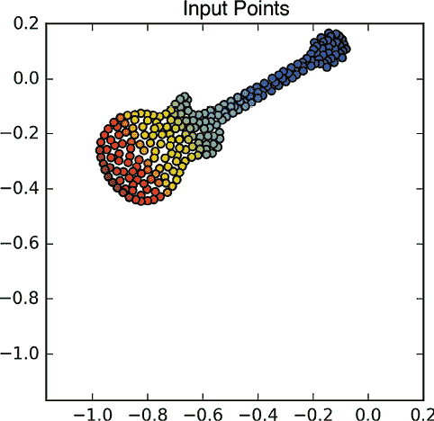

图 10-23：我们讨论 PCA 的起始数据

我们的目标是将这二维数据压缩成一维数据。也就是说，我们将每一组成对的 x 和 y 值合并成一个新的数值，正如 BMI 是一个结合了身高和体重的单一数值。

让我们从标准化数据开始。图 10-24 展示了这个过程，设定每个维度的均值为 0，标准差为 1，正如我们之前看到的那样。

我们已经知道我们要将这二维数据减少到一维。在实际应用之前，先让我们通过一个关键步骤缺失的过程来感受这个概念，然后再把这个步骤加回去。

要开始，我们在 X 轴上画一条水平线。我们将这条线称为*投影线*。然后我们将*投影*或移动每个数据点到它在投影线上的最近位置。由于我们的线是水平的，我们只需上下移动数据点，找到它们在投影线上的最近点。

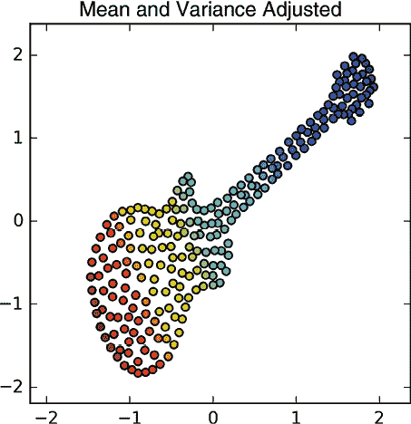

图 10-24：标准化后的输入数据

将图 10-24 中的数据投影到水平投影线上的结果如图 10-25 所示。

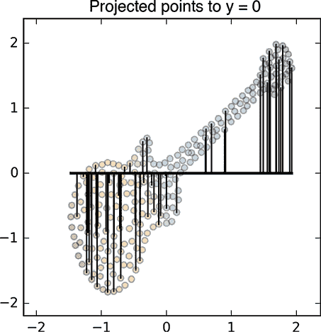

图 10-25：我们通过将吉他数据集的每个数据点移动到其最近的投影直线点上来进行投影。为了清晰起见，我们只展示了大约 25% 的点的移动路径。

所有点处理后的结果如图 10-26 所示。

图 10-26：在所有点移动到投影直线后的图 10-25 结果。每个点现在仅通过其 x 坐标进行描述，形成了一维数据集。

这就是我们所追求的一维数据集，因为这些点仅通过其 x 值不同（y 值始终为 0，因此无关紧要）。但这并不是一个好的特征组合方法，因为我们所做的只是丢弃了 y 值。这就像通过仅使用体重而忽略身高来计算 BMI。

为了改进这种情况，我们可以加入我们之前跳过的步骤。我们不再使用水平投影线，而是旋转该线，直到它通过最大方差的方向。可以将其视为在投影后具有最大点范围的那条线。任何实现 PCA 的库函数都会自动为我们找到这条线。图 10-27 展示了我们的吉他数据的这一线。

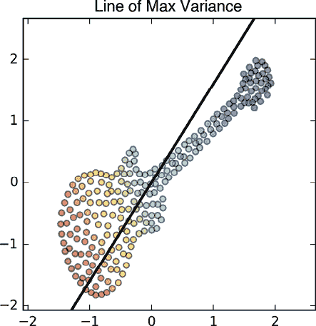

图 10-27：粗黑线是通过原始数据的最大方差线。这就是我们的投影线。

现在我们继续像之前一样操作。我们将每个点投影到这条投影线上，方法是将其移动到与线最近的点。像之前一样，我们通过垂直于这条线的方向移动，直到与它相交。图 10-28 展示了这一过程。

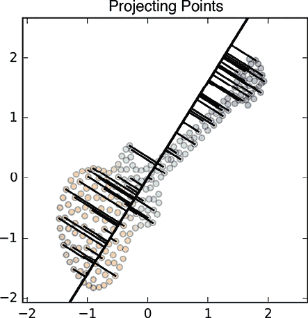

图 10-28：我们通过将吉他数据投影到投影线上的每个点，移动每个点到线上的最近点来进行投影。为了清晰起见，我们只展示了大约 25% 的点的移动路径。

投影后的点如图 10-29 所示。注意，它们都位于我们在图 10-27 中找到的最大方差直线上。

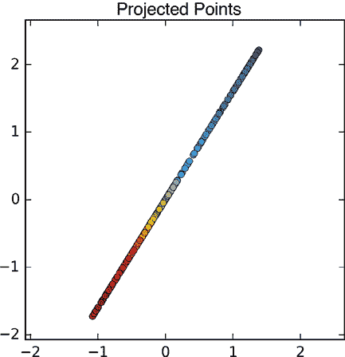

图 10-29：吉他数据集的各点投影到最大方差直线上

为了方便，我们可以将这条点线旋转到与 X 轴平行的位置，如图 10-30 所示。现在，y 坐标不再重要，我们得到了包含每个点的原始 x 和 y 值信息的一维数据。

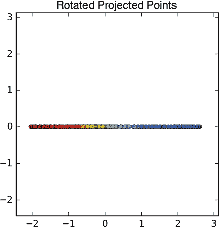

图 10-30：将图 10-29 中的点旋转到水平位置

尽管图 10-30 中的直线与图 10-26 中的点大致相似，但它们是不同的，因为这些点在 X 轴上的分布不同。换句话说，它们的数值不同，因为它们是通过投影到一条倾斜的直线，而不是水平直线计算出来的。图 10-31 展示了这两种投影的对比。PCA 的结果不仅更长，而且点的分布也有所不同。

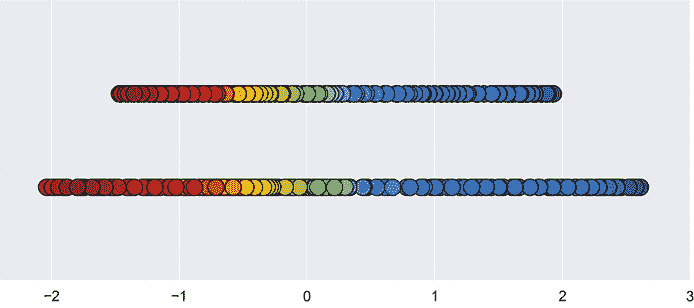

图 10-31：比较通过投影到 y = 0 的图 10-26（顶部）和 PCA 算法的图 10-30（底部）所创建的点

我们刚才讨论的所有步骤，在调用机器学习库的 PCA 函数时都会自动执行。

通过这个投影步骤创建的一维数据的美妙之处在于，每个点的单一值（其 x 值）是它最初的二维数据的组合。我们将数据集的维度减少了一个维度，但我们尽可能保留了最多的信息。现在，我们的学习算法只需要处理一个特征而不是两个，因此它们的运行速度会更快。当然，我们丢弃了一些信息，因此准确性可能会受到影响。有效使用 PCA 的关键是选择可以组合的维度，同时仍保持项目的性能目标。

如果我们有三维数据，可以想象将一个平面放置在样本云的中央，并将数据投影到该平面上。库的任务是找到该平面的最佳朝向。这样，我们的数据就从三维变成了二维。如果我们想进一步降维到一维，可以想象将数据投影到通过点云的直线上。在实际应用中，我们可以在任何维度数的问题中使用这种技术，并将数据的维度减少十个或更多。

这种算法的关键问题包括：我们应该压缩多少维度？应该组合哪些维度？它们应如何组合？我们通常使用字母*k*来表示 PCA 处理后剩余的维度数。因此，在我们的吉他示例中，*k*为 1。我们可以把*k*称为算法的一个参数，尽管通常我们将其称为整个学习系统的超参数。正如我们所看到的，字母*k*在机器学习中的许多不同算法中都有使用，这是不幸的；因此，在看到*k*时，我们必须注意上下文。

压缩得太少意味着我们的训练和评估步骤将低效，但压缩得太多则意味着我们有可能丢失应当保留的重要信息。为了选择超参数*k*的最佳值，我们通常会尝试几个不同的值，看它们的效果如何，然后选择效果最好的一项。我们可以利用许多库提供的*超参数搜索*技术来自动化这一过程。

一如既往，无论我们使用什么 PCA 变换来压缩训练数据，都必须以相同的方式应用于所有未来的数据。

### 简单图像的 PCA

图像是重要且特殊的数据类型。让我们对一组简单的图像应用 PCA。

图 10-32 显示了一组六张图像，可能来自一个包含数万个此类图像的大型数据集。如果这些灰度图像的每一张边长为 1,000 像素，每张图像包含 1,000 × 1,000，或 100 万个像素。是否有比使用每张图像 100 万个数字的表示方法更好的方式？

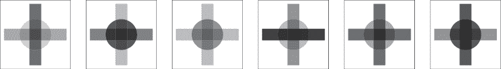

图 10-32：我们希望表示的六张图像

让我们从观察图 10-32 中的每张图像可以通过按不同的比例缩放图 10-33 中的三张图像并将它们相加来重新创建开始。

图 10-33：我们可以通过以不同的比例缩放这三张图像并将结果相加，来创建图 10-32 中的所有六张图像。

例如，我们可以通过将圆形的 20%、竖直框的 70%和水平框的 40%相加来重建图 10-32 中的第一张图像。我们通常将这些缩放因子称为*权重*。图 10-34 显示了六张起始图像的权重。

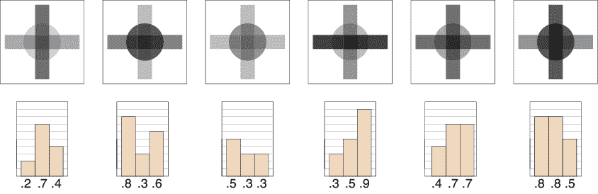

图 10-34：当按比例缩放图 10-33 中的三张图像以恢复图 10-32 中的图像时，使用的权重。

图 10-35 展示了通过缩放和组合这些成分来恢复第一张原始图像的过程。

一般来说，我们可以用三种成分图像的权重来表示任何此类图像，这些权重能够产生最佳匹配。为了重建任何输入图像，我们需要这三张简单图像（每张 100 万个值）以及该特定图像的三个数字。如果我们有 1,000 张图像，存储每张图像将需要总计 1,000 兆字节。但使用这种压缩形式，我们只需要总共 3.001 兆字节。

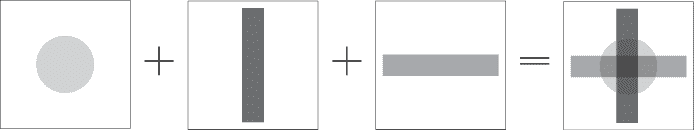

图 10-35：通过缩放图 10-33 中的图像来恢复图 10-32 中的第一张图像。

对于这些简单的图像，找到三个几何形状作为成分是很容易的。但当我们处理更现实的图像时，这通常是不可能的。

好消息是，我们可以使用前面讨论的投影技术。我们可以通过投影一组图像来生成一张新图像，而不是像之前那样将一组点投影到一条线上，生成一个新的点集。这是一个比我们在吉他点上操作时更抽象的过程，但概念是相同的。让我们通过跳过细节，专注于结果，来感受一下 PCA 如何处理图像。

再次考虑图 10-32 中的六个起始图像。请记住，这些是灰度图像，而非矢量图。现在让我们要求 PCA 找到一张灰度图像，它最接近代表所有图像的方式，就像我们的对角线最接近代表吉他中的所有点一样。然后，我们可以将每个起始图像表示为该图像的一个加权和，适当缩放后再加上剩余部分。图 10-36 展示了这一过程。

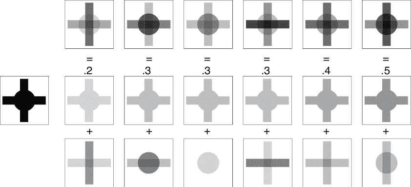

图 10-36：对图 10-32 中的图像运行 PCA

来自 10-32 的起始图像显示在图 10-36 顶部。

现在我们要求 PCA 找到与图 10-28 中的那条线相对应的图像。也就是说，找到一张从某种意义上讲，能够捕捉所有输入内容的图像。假设它找到了图 10-36 左侧的图片，显示的是两条条形图和一个圆圈，全部是黑色并叠加在一起。我们将其称为*共享图像*，这不是一个正式术语，但在这里很有用。

现在，让我们将图 10-36 顶部的每个图像表示为共享图像的缩放版与其他图像的组合。为此，我们找到每个输入图像中最亮的像素，并将共享图像缩放到该亮度。这个缩放因子显示在中间行的公共图像副本顶部，在这些副本中，公共图像的强度被按该因子缩放。如果我们将每个缩放过的公共图像从上方的源图像中减去，我们就得到了它们的差异。我们可以将其写为“源图像 - 公共图像 = 差异”，或者等价地，“源图像 = 公共图像 + 差异”，如图所示。

然后我们可以再次运行 PCA，这次对图 10-36 的底部一行进行处理。同样，它将这些六个图像进行投影，生成一个新的图像，该图像最能匹配所有图像。和之前一样，我们可以将每张图片表示为共享部分的一个缩放版加上剩余部分。图 10-37 展示了这一思想。在这个示例中，我们假设 PCA 生成了一个包含两个重叠矩形的图像作为最佳匹配图像。

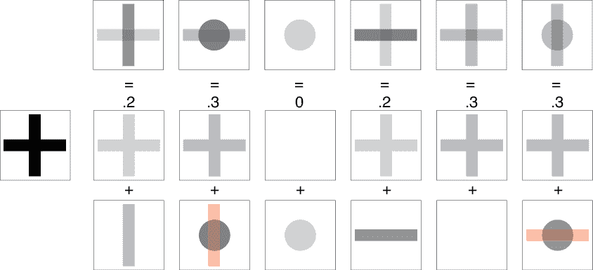

图 10-37：对图 10-36 底部一行运行 PCA

在底部行的两张图像中发生了一些有趣的事情。我们来看一下从左数的第二列。我们想要匹配的顶部图像是一个圆形和一个水平框，但我们试图用一对缩放后的交叉框来匹配它。为了匹配顶部图像，我们需要添加一些圆形的部分，但要减去我们刚刚引入的竖直框。这意味着将底部图像中相应的数据设置为负值。这些是完全有效的数据，尽管如果我们直接显示这张图像时需要小心。如果我们通过将下面的两张图像加起来来重建顶部图像，底部行红色区域的负值将抵消中间行竖直框的正值，因此这些图像的和与顶部的圆形和水平框相匹配。右侧列中的水平框也适用相同的推理。

图 10-38 总结了我们到目前为止看到的两步。

我们这里只进行了两步，但我们可以重复这个过程几十次甚至上百次。

为了表示每个起始图像，我们只需要一组公共图像以及我们分配给每个图像的权重。由于这些公共图像是所有图像共享的，我们可以将它们视为共享资源。然后，每个图像都可以通过对这个共享资源的引用以及应用于公共图像的权重列表来完全描述。

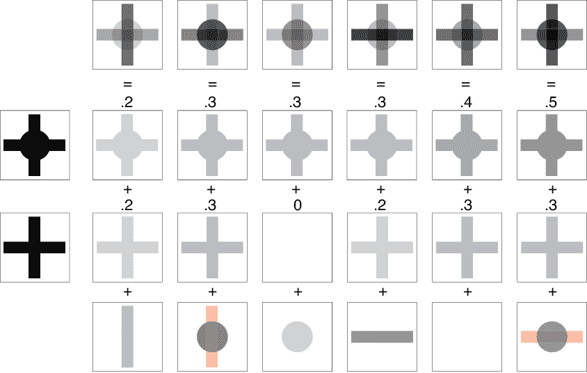

图 10-38：将每个起始图像（第一行）表示为两个缩放后的分量图像（第二行和第三行）的和，再加上剩下的部分（底部行）

每个公共图像都称为*分量*，我们在每个步骤中创建的那个是*主分量*（因为它是所有可能分量中最优的，就像图 10-28 中的线是最优的那样）。我们通过分析输入图像来找到这些主分量。因此，这个方法被称为*主成分分析*。

我们包含的分量越多，每个重建的图像与其原始图像的匹配度就越高。我们通常的目标是产生足够的分量，使得每个重建的图像都能保留其原始图像的所有关键特征。

在本讨论中，大多数权重是正数，但我们也看到了一些应该被减去而不是加上的分量图像，因此它们产生了负值的权重。这样，最终的像素在所有分量相加后，会得到期望的值。

仅使用两个分量图像我们做得如何？图 10-39 显示了原始的六个图像和我们通过将图 10-38 中间两行的和来重建的图像。

匹配结果并不完美，但它们是一个不错的起点，特别是在只有两个主成分的情况下。因此，我们有一个包含两张图像的公共池（每张图像需要 100 万个数字），然后每张图像本身只用两个数字来描述。这个方案的美妙之处在于，我们的算法不需要看到这些公共图像。我们只需要它们来找到描述每个输入图像的权重（如果需要，还可以重建图像）。就学习算法而言，每张图像仅由两个数字描述。这意味着我们的算法消耗更少的内存，运行得更快。

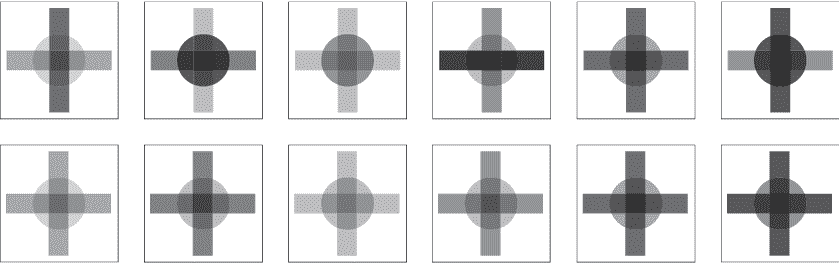

图 10-39：我们的六张起始图像（上），以及从图 10-35c 重建的图像（下）

我们在这个例子中跳过了一个步骤：通常在使用 PCA 时，我们首先会对所有图像进行标准化。这一点将在我们的下一个例子中介绍。

### 真实图像的 PCA

上一节中的图像是为了简化而设计的。现在我们将对真实图片应用 PCA。

让我们从图 10-40 中展示的六张哈士奇图片开始。为了便于观察处理过程，这些图像的尺寸仅为 45 × 64 像素。它们是手动对齐的，以确保每张图像中的眼睛和鼻子大致位于相同的位置。这样，每张图像中的每个像素都有很大的机会代表狗的相同部位，就像其他图像中的相应像素一样。例如，位于中心下方的像素很可能属于鼻子，靠近上角的像素很可能属于耳朵，等等。

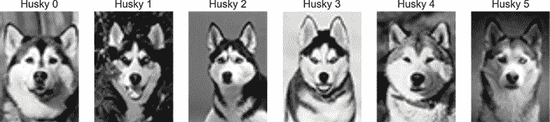

图 10-40：我们的起始哈士奇图像集

六只狗的数据库并不算大量的训练数据，因此让我们通过*数据增强*的方式来扩大我们的数据库，这是*放大*或*扩展*数据集的常见策略。在这种情况下，我们将反复随机遍历我们的六张图像。每次遍历时，我们会选择一张图像，制作一份副本，随机地将其在水平和垂直方向上分别平移最多 10%的距离，旋转最多五度，顺时针或逆时针，并可能将其左右翻转。然后，我们将该变换后的图像添加到我们的训练集。图 10-41 显示了我们第一次和第二次遍历六只狗图像后的结果。我们使用这种创建变体的技术，构建了一个包含 4,000 张狗图像的训练集。

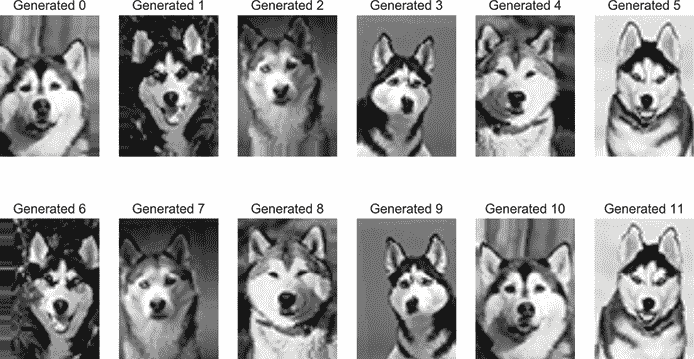

图 10-41：每一行展示了通过平移、旋转和可能的水平翻转所生成的新图像集。

由于我们希望对这些图像进行 PCA 处理，我们的第一步是对它们进行标准化。这意味着我们会分析在 4,000 张图像中每个像素的位置，并调整这些图像的集合，使其具有零均值和单位方差（Turk 和 Pentland 1991）。我们生成的六只狗的标准化版本见图 10-42。

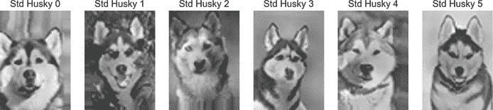

图 10-42：标准化后的六只哈士奇

由于 12 张图像适合放在一个图中，让我们首先随便要求 PCA 找出 12 张图像，这些图像在加上适当的权重后，能够最好地重建输入图像。PCA 找到的每个投影（或成分）在技术上被称为*特征向量*，来自德语词“*eigen*”意为“自身”（或大致“自我”），以及“*vector*”是这种数学对象的名称。当我们创建特定类型的事物的特征向量时，通常会通过将前缀“eigen”与我们正在处理的对象结合，来创造一个有趣的名称。因此，图 10-43 展示了我们的 12 个*特征狗*。

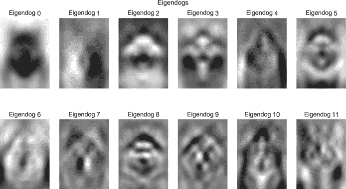

图 10-43：PCA 生成的 12 个特征狗。

看这些特征狗告诉我们很多关于 PCA 如何分析我们的图像的信息。第一个特征狗是一个大模糊区域，颜色较深，恰好是大多数狗出现在图像中的地方。这是唯一一张最接近近似每个输入图像的图像。第二个特征狗在第一个特征狗的基础上进行了改进，捕捉到一些左右阴影的差异。

接下来的特征狗提供了更多的细节，依此类推，通过所有 12 个特征狗来实现。因此，第一个特征狗捕捉到了最广泛、最常见的特征，而每增加一个特征狗，就能让我们恢复更多的细节。

PCA 不仅能够创建图 10-43 中的特征狗，还能接收任何图片作为输入，并告诉我们应该对每个特征狗图像应用多少权重，这样当加权图像加在一起时，我们能得到最接近输入图像的最佳近似。

让我们通过将这 12 个特征狗与它们对应的权重结合起来，看看我们能多好地恢复原始图像。图 10-44 展示了 PCA 为每个输入图像找到的权重。我们通过将图 10-43 中的每个特征狗图像按其对应权重缩放，然后将结果加在一起，来创建重建的狗图像。

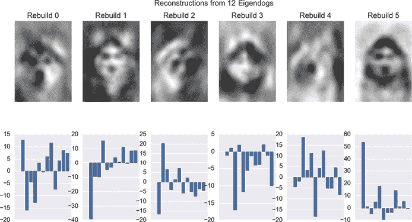

图 10-44：通过 12 个特征狗的集合重建我们的原始输入。顶部：重建的狗图像。底部：应用于图 10-43 中特征狗的权重，以构建上面直接显示的图像。请注意，底部一行的垂直尺度并不完全相同。

图 10-44 中的恢复图像不太好。我们要求 PCA 用仅仅 12 张图片表示我们训练集中的所有 4000 张图像。它尽力了，但这些结果还是相当模糊。不过，它们似乎走在了正确的轨道上。

让我们尝试使用 100 个特征狗。前 12 个特征狗图像看起来和图 10-43 中的一样，但接下来它们变得更复杂和细致。我们用 100 个特征狗重建我们前 6 个狗的结果如图 10-45 所示。

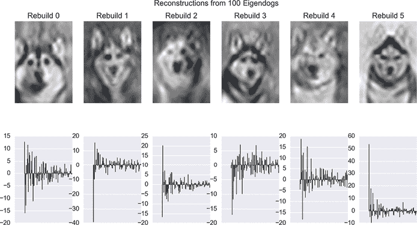

图 10-45：通过 100 个特征狗的集合重建我们的原始输入。

好一点了！它们开始像狗了。但似乎 100 个特征狗还是不够。

让我们将特征狗的数量增加到 500，再试一次。图 10-46 展示了结果。

图 10-46：从一组 500 个特征狗重建我们的原始输入

这些看起来非常不错。它们都能轻松识别为图 10-42 中的 6 种标准化狗。它们并不完美，但考虑到我们正在将 500 张共享图像的不同数量加在一起，我们在匹配原始图像方面做得很不错。这些前 6 张图像没有什么特别的地方。如果我们查看数据库中任何一张 4,000 张图像，它们看起来都一样好。我们可以继续增加特征狗的数量，结果会继续改进，图像会变得更加清晰，噪点也会减少。

在每个权重图中，获得最多权重的特征狗图像通常是开始的那些，它们捕捉了大的结构。随着我们向下滚动列表，每个新的特征狗通常被赋予的权重比前一个稍微少一些，因此它对最终结果的贡献较小。

PCA 的价值并不在于我们能生成与初始图像集完全相同的图像，而在于我们可以利用特征狗的表示来减少深度学习系统需要处理的数据量。这一点在图 10-47 中得到了说明。我们的输入狗集进入 PCA，PCA 生成一组特征狗。然后，我们想要分类的每只狗再次进入 PCA，PCA 给出该图像的权重。这些权重值最终进入分类器。

如我们之前提到的，我们可以选择仅使用每张图像的 100 个或 500 个权重来训练我们的分类器，而不是使用每张图像的所有像素。分类器从未看到过包含百万个像素的完整图像。它甚至从未见过特征狗。它只得到每张图像的权重列表，这些权重数据是它在训练期间用于分析和预测的。当我们想要分类一张新图像时，我们只提供它的权重，计算机会返回一个类别。这可以节省大量的计算，这意味着节省了时间，并可能提高最终结果的质量。

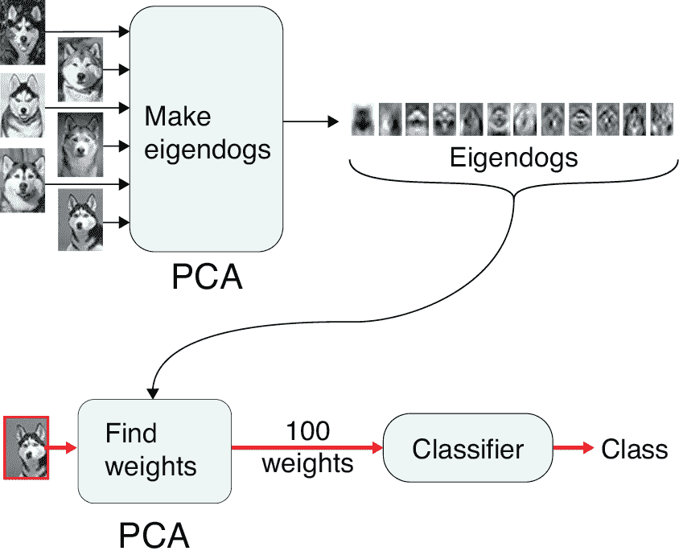

图 10-47：在第一行中，我们首先使用 PCA 构建一组特征狗，然后在第二行中，我们为分类器的每个输入找到权重，分类器仅使用这些权重来找到输入的类别。

总结来说，我们提供给分类器的数据不是每一张输入图像，而是它的权重。然后，分类器根据这些权重来推断它所看到的是什么品种的狗。通常，我们只需要几百个权重，就能表示拥有成千上万、甚至数百万个特征的输入样本。

## 总结

在本章中，我们讨论了数据准备的方法。我们看到，在对数据进行任何处理之前，检查数据并确保其清洁是非常重要的。一旦数据干净，我们可以通过多种方式对其进行转换，以更好地适应我们的学习算法。这些转换仅基于训练数据构建。需要记住的是，我们对训练数据应用的任何转换，必须同样应用于每个额外的样本，无论是验证数据、测试数据，还是来自真实用户的部署数据。

在下一章，我们将深入探讨分类器，并调查一些最重要的算法。
