# 第十一章：分类器

在本章中，我们介绍了四种重要的分类算法，基于我们在第七章中涵盖的分类基础知识。我们通常使用这些算法来帮助我们研究和理解数据。在某些情况下，我们甚至可以根据这些算法构建最终的分类系统。在其他情况下，我们可以利用这些方法获得的理解来设计深度学习分类器，如后续章节中所讨论的那样。

我们通常会使用二维数据并且通常只有两个类别来说明我们的分类器，因为这样便于绘制和理解，但现代分类器能够处理任意维度（或特征）和大量类别的数据。现代库使我们可以用少量代码将这些算法应用于我们自己的数据。

## 分类器的类型

在深入探讨具体算法之前，我们先将分类器的世界分为两种主要方法：*参数方法*和*非参数方法*。

在参数方法中，我们通常认为算法以对其处理的数据的预先设定描述开始，然后搜索该描述的最佳参数以使其适配。例如，如果我们认为我们的数据符合正态分布，我们可以寻找最适合它的均值和标准差。

在非参数方法中，我们让数据引导我们，在分析数据后，我们才尝试找到某种方式来表示它。例如，我们可能会查看所有数据，试图找到一个边界，将其分成两个或多个类别。

实际上，这两种方法更像是概念性的，而不是严格的。例如，我们可以认为仅仅选择一种特定类型的学习算法就意味着我们在对数据做出假设。而我们也可以认为我们总是在通过处理数据来学习数据本身。但这些是有用的概括，我们将用它们来组织我们的讨论。

让我们从两个非参数分类器开始。

## k-最近邻

我们从一种非参数算法开始，叫做*k-最近邻*，或称*kNN*。像往常一样，字母*k*代表的不是一个词，而是一个数字。我们可以选择任何大于或等于 1 的整数。因为在算法运行之前设置了这个值，所以它是一个超参数。

在第七章中，我们看到了一个叫做*k-均值聚类*的算法。尽管名字相似，但该算法和*k*-最近邻是不同的技术。一个关键的区别是，*k*-均值聚类从未标记的数据中学习，而 kNN 则处理带标签的数据。换句话说，*k*-均值聚类和 kNN 分别属于无监督学习和监督学习。

kNN 训练速度很快，因为它所做的就是将每个传入的样本复制到数据库中。真正有趣的部分发生在训练完成后，当一个新样本到来需要分类时。kNN 分类新样本的核心思想是几何上的，这一点在图 11-1 中得到了很好的展示。

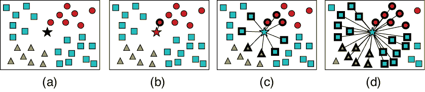

图 11-1：为了找到新样本（以星号表示）的类别，我们寻找其*k*个邻居中最常见的类别。

在图 11-1(a)中，我们有一个样本点（一个星号），它位于代表三类（圆形、方形和三角形）的其他样本之间。为了确定新样本的类别，我们查看*k*个最近的样本（或*邻居*），并统计它们的类别。类别最多的那个类将成为新样本的类别。我们通过一条线连接每个*k*个最近样本，来显示在不同*k*值下考虑的样本。在图 11-1(b)中，我们将*k*设置为 1，这意味着我们希望使用最近样本的类别。在这种情况下，它是一个红色的圆形，因此新样本被分类为圆形。在图 11-1(c)中，我们将*k*设置为 9，因此我们查看 9 个最近的点。在这里，我们找到 3 个圆形，4 个方形和 2 个三角形。因为方形的数量多于其他类别，所以星号被分类为方形。在图 11-1(d)中，我们将*k*设置为 25。现在我们有 6 个圆形，13 个方形和 6 个三角形，因此星号再次被分类为方形。

总结来说，kNN 接受一个新的样本进行评估，并提供一个*k*值。然后，它会找到与新样本最近的*k*个样本，并将新样本分配给在找到的*k*个样本中，代表性最多的类别。处理平局和特殊情况的方式有很多种，但这就是基本思想。

请注意，kNN 算法不会在各个点群体之间创建明确的边界。这里没有样本所属区域或区域的概念。我们称 kNN 为*按需*或*懒惰*算法，因为它在学习阶段不会对样本进行任何处理。学习时，kNN 只是将样本存储在其内部内存中，然后结束。

kNN 之所以具有吸引力，是因为它简单，并且训练速度通常非常快。另一方面，kNN 可能需要大量内存，因为（在其基本形式下）它保存所有输入样本。使用大量内存可能会导致算法变慢。另一个问题是，新的数据点的分类通常很慢（与我们接下来看到的其他算法相比），这是由于寻找邻居的成本。每次我们想要对一个新数据进行分类时，都必须找到它的*k*个最近邻，这需要一定的计算。当然，有许多方法可以增强算法以加快这一过程，但它仍然是一个相对较慢的分类方法。对于分类速度至关重要的应用，例如实时系统和网站，kNN 每次产生答案所需的时间可能会使其无法使用。

这种技术的另一个问题是，它依赖于附近有大量邻居（毕竟，如果最近的邻居都非常远，那么它们就无法为我们尝试分类的其他相似样本提供很好的代理）。这意味着我们需要大量的训练数据。如果我们有很多特征（也就是我们的数据有很多维度），那么 kNN 很快就会遭遇维度灾难，这在第七章中我们已经讨论过。随着空间的维度增加，如果我们没有显著增加训练样本的数量，那么任何局部邻域中的样本数都会减少，这使得 kNN 很难得到一个好的邻近点集合。

让我们来测试一下 kNN。在图 11-2 中，我们展示了一个“微笑”数据集，该数据集属于两类。在此图以及接下来类似的图中，数据由点组成。由于点难以观察，我们在每个点周围绘制一个实心圆圈作为视觉辅助。

图 11-2：一个二维点的微笑数据集。共有两类，蓝色和橙色。

使用不同*k*值的 kNN 给出了图 11-3 中的结果。

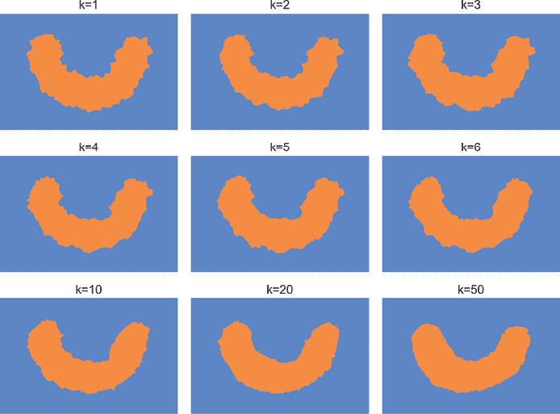

图 11-3：使用不同*k*值的 kNN 对图 11-2 中的点进行分类

尽管 kNN 不会生成明确的分类边界，但我们可以看到，当*k*较小时，我们只与少数邻居进行比较时，空间被分割成一些具有相当粗糙边界的区域。随着*k*增大，我们使用更多的邻居时，那些边界会变得平滑，因为我们对新样本周围的环境有了更全面的了解。

为了让事情变得更有趣，我们向数据中添加一些噪声，这样边界就不容易找到。图 11-4 展示了图 11-2 的一个噪声版本。

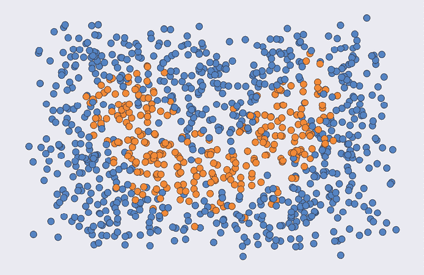

图 11-4：来自图 11-2 的噪声版本的微笑数据集

不同*k*值的结果显示在图 11-5 中。

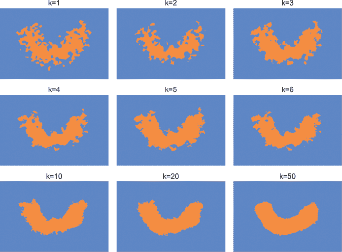

图 11-5：使用 kNN 和 图 11-4 将类别分配给平面中的点

我们可以看到，在存在噪声的情况下，较小的 *k* 值会导致边界不规则。在这个例子中，我们需要将 *k* 增加到 50 才能看到相对平滑的边界。还需要注意的是，随着 *k* 增加，微笑形状会收缩，因为较多的背景点侵蚀了边缘。

由于 kNN 并没有明确表示类别之间的边界，它可以处理任何类型的边界或任何类别的分布。为了说明这一点，我们可以在微笑上添加一些眼睛，创建三个不相连的相同类别的数据集。生成的带噪声数据见 图 11-6。

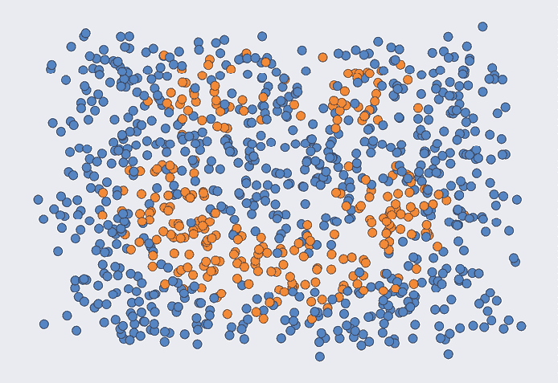

图 11-6：带噪声的数据集，包含一个微笑和两只眼睛

不同 *k* 值的结果分类见 图 11-7。

在这个例子中，约 20 的 *k* 值看起来最好。过小的 *k* 值可能导致边缘不规则和结果噪声，但过大的 *k* 值可能会开始侵蚀特征。像往常一样，找到最佳的超参数对于任何给定数据集而言，都是通过反复实验来完成的。我们可以使用交叉验证来自动评分每个结果的质量，这在维度很多的情况下特别有用。

kNN 是一个很棒的非参数算法：它容易理解和编程，而且当数据集不太大时，训练非常快速，分类新数据也不会太慢。但当数据集变大时，kNN 就不那么吸引人了：内存需求增加，因为每个样本都会被保留，分类变得更慢，因为搜索变得更慢。这些问题是大多数非参数算法共有的。

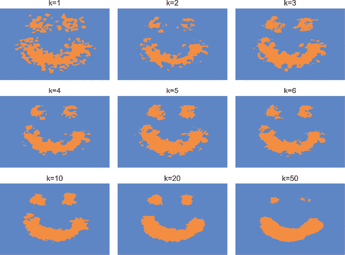

图 11-7：kNN 不会在样本簇之间创建边界，因此即使一个类别被拆分成几个部分，它也能正常工作。

## 决策树

让我们考虑另一种非参数分类方法，称为 *决策树*。该算法从样本集中的点构建一个数据结构，然后用这个结构来分类新点。让我们首先看看这个结构，然后再看看如何构建它。

### 树的介绍

我们可以通过一个熟悉的娱乐游戏“20 个问题”来说明决策树的基本思想。在这个游戏中，一名玩家（选择者）想一个特定的目标物体，通常是一个人、地方或事物。另一名玩家（猜测者）接着问一系列是/否问题。如果猜测者能在 20 个问题内正确识别目标物体，他们就获胜。这个游戏经久不衰的原因之一是，它很有趣，通过如此少量的简单问题就能把庞大的可能对象范围缩小到一个特定实例（或许令人惊讶的是，20 个是/否问题我们只能区分出超过一百万个不同的目标）。

我们可以像图 11-8 那样以图形形式绘制一个典型的 20 个问题游戏。

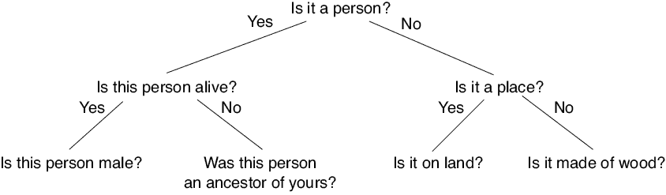

图 11-8：用于玩 20 个问题的树形图。请注意，每次决策后都有两个选择，一个是“是”，另一个是“否”。

我们称像图 11-8 这样的结构为*树*，因为它看起来像一棵倒立的树。这种树有许多相关的术语，值得了解。我们说，树中的每个分裂点是一个*节点*，连接节点的每一条线是*链接*、*边*或*分支*。沿着树的类比，位于顶部的节点是*根节点*，位于底部的节点是*叶节点*，或称*终端节点*。位于根节点和叶节点之间的节点称为*内部节点*或*决策节点*。

如果一棵树具有完美对称的形状，我们称这棵树为*平衡*的，否则它就是*不平衡*的。实际上，几乎所有树在创建时都是不平衡的，但我们可以运行算法使它们更接近平衡，如果某个特定应用偏好这种情况的话。我们还可以说，每个节点都有一个*深度*，它是一个数字，表示到达根节点所需通过的最小节点数。根节点的深度为 0，紧接在其下方的节点深度为 1，以此类推。

图 11-9 显示了一个带有这些标签的树形图。

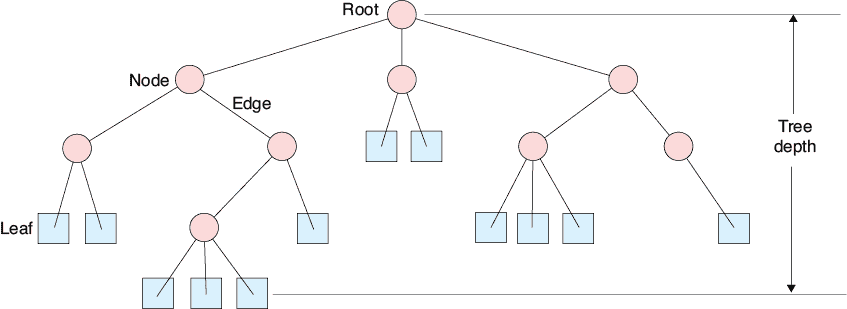

图 11-9：树的一些术语

通常也使用与家族树相关的术语，尽管这些抽象的树形结构不需要两个节点结合来产生子节点。每个节点（根节点除外）都有一个位于其上方的节点。我们称这个节点为该节点的*父节点*。紧接在父节点下方的节点是其*子节点*。我们有时会区分*直接子节点*（直接与父节点相连的节点）和*远程子节点*（与父节点处于相同深度，但通过一系列其他节点连接到父节点的节点）。如果我们将注意力集中在一个特定的节点上，那么该节点及其所有子节点一起称为*子树*。共享相同父节点的节点称为*兄弟节点*。

图 11-10 以图形方式展示了这些概念的一部分。

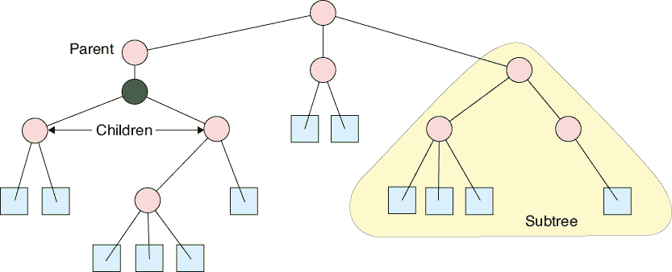

图 11-10：使用树的熟悉术语。绿色节点的父节点在其上方，而其子节点在下方。

记住这些词汇后，让我们回到我们的 20 个问题游戏。

### 使用决策树

在图 11-8 中展示的 20 问题树的一个有趣特点是它是*二叉*的；每个父节点恰好有两个子节点：一个代表“是”，一个代表“否”。二叉树是某些算法特别容易处理的一种树结构。如果某些节点有超过两个子节点，我们称整个树为*灌木状*。如果需要，我们总是可以将一个灌木状的树转换为二叉树。一个尝试猜测某人生日月份的灌木状树示例显示在图 11-11 的左侧，右侧则是相应的二叉树。因为我们可以轻松地在两者之间转换，所以通常会根据讨论的需要，绘制最清晰简洁的树形。

我们可以使用树来分类数据。当树用于这种方式时，称为*决策树*。这种方法的全称是*分类变量决策树*。这是为了区分我们在使用决策树处理连续变量时的情况，如回归问题。那种情况下的决策树被称为*连续变量决策树*。

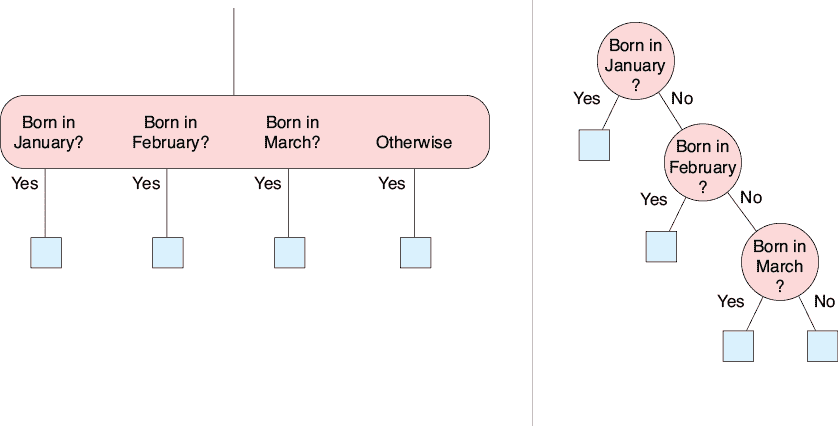

图 11-11：将一个灌木状树（左）转换为二叉树（右）

在这里，我们继续使用分类版本。为了简化，从现在开始，我们只将其称为决策树，或者简称为树。一个用于将输入分类到不同类别的树的示例如图 11-12 所示。

在图 11-12 中，我们从一个包含不同类别样本的根节点开始，这些样本通过形状（和颜色）来区分。为了构建树，我们在每个节点将样本分成两组，使用某种测试方式，得到一个决策。例如，在根节点应用的测试可能是：“这个形状是矩形吗？”左子节点的测试可能是：“这个形状比宽度高吗？”我们很快就会看到如何提出这些测试。这个示例的目标是不断拆分每个节点，直到只剩下属于一个类别的样本为止。此时，我们声明该节点为叶子节点，并停止拆分。在图 11-12 中，我们已将起始数据分成了五个类别。记住我们在每个节点应用的测试非常重要。现在，当一个新样本到来时，我们可以从根节点开始，应用根节点的测试，然后是相应子节点的测试，依此类推。最终，当我们到达一个叶子节点时，就确定了该样本的类别。

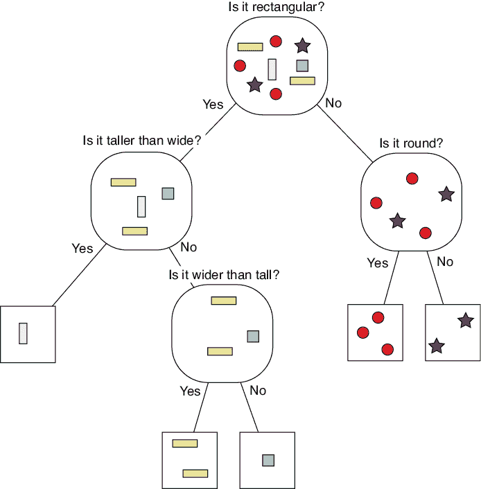

图 11-12：一个分类决策树。每个类别都有不同的形状和颜色。

决策树并不是一开始就完全构建好的。相反，我们根据训练集中的样本来构建树。当我们在训练过程中到达一个叶节点时，我们会测试新的训练样本是否与该叶节点中所有其他样本属于同一类别。如果是，我们将该样本添加到叶节点中，并完成操作。否则，我们基于一些特征制定决策标准，这些特征能帮助我们区分这个样本和节点中的其他样本。然后我们使用这个测试来拆分节点。我们制定的测试会与节点一起保存，至少创建两个子节点，并将每个样本分配到相应的子节点，就像在图 11-13 中所示。

当我们完成训练后，评估新样本变得很容易。我们只需从根节点开始，沿着每个节点根据该节点的测试结果，结合样本的特征，沿着合适的分支向下遍历。当我们到达叶节点时，我们报告该样本属于该叶节点中的对象类别。

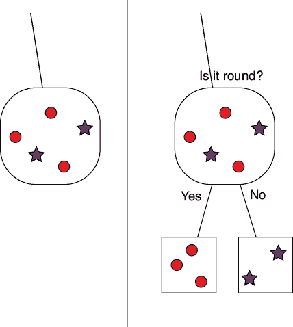

图 11-13：通过对节点内容应用测试来拆分节点

这是一个理想化的过程。在实际应用中，我们的测试可能并不完美，如果出于效率或内存考虑，我们选择不再拆分某些叶节点，那么这些叶节点中可能包含不同类别的对象的混合。例如，如果我们到达一个节点，该节点包含 80%来自 A 类和 20%来自 B 类的样本，我们可能会报告新样本有 80%的概率属于 A 类，20%的概率属于 B 类。如果我们只能报告一个类别，我们可能会报告 A 类占 80%的概率，而 B 类占 20%。

这种决策树的构建过程一次只处理一个样本。在这个技术的最简单版本中，我们不会一次性考虑整个训练集并尝试找到最小的或最平衡的树来对样本进行分类。相反，我们一次只考虑一个样本，并根据需要拆分树中的节点来处理该样本。然后我们对下一个样本进行相同的操作，以此类推，实时做出决策，而不关心任何还未出现的其他数据。这使得训练更加高效。

这个算法只根据它以前见过的数据和当前考虑的数据做出决策。它不会基于之前所见的内容为未来做出计划或策略。我们称这种算法为*贪婪*算法，因为它专注于最大化其即时的短期收益。

决策树有时在实践中优于其他分类器，因为它们的结果是*可解释的*。当算法为一个样本分配类别时，我们无需解开复杂的数学或算法过程。相反，我们可以通过识别每个决策过程来完全解释最终结果。这在现实生活中也可能非常重要。

例如，假设我们向银行申请贷款，但被拒绝。当我们询问原因时，银行可以展示在整个过程中所做的每一个测试。我们称之为算法的*透明性*。需要注意的是，这并不意味着它们是公平或合理的。银行可能制定了一些对某些社会群体有偏见的测试，或者依赖于看似无关的标准。仅仅因为他们可以解释为什么做出选择，并不意味着这一过程或结果是令人满意的。立法者尤其偏好那些强制执行透明性的法律，这些法律容易证明，而公平则更加难以实现。透明性是一个可取的特性，但它并不意味着一个系统的行为是我们期望的那样。

决策树可能会做出糟糕的决策，因为它们特别容易出现过拟合。让我们看看为什么。

### 过拟合树

让我们通过考虑几个示例，开始讨论在构建树的过程中如何出现过拟合。

图 11-14 中的数据展示了一个干净分离的两类数据集。一个大致遵循这种几何结构的数据集通常被称为*两个月亮数据集*，可能是因为这些半圆形状让人联想到新月。

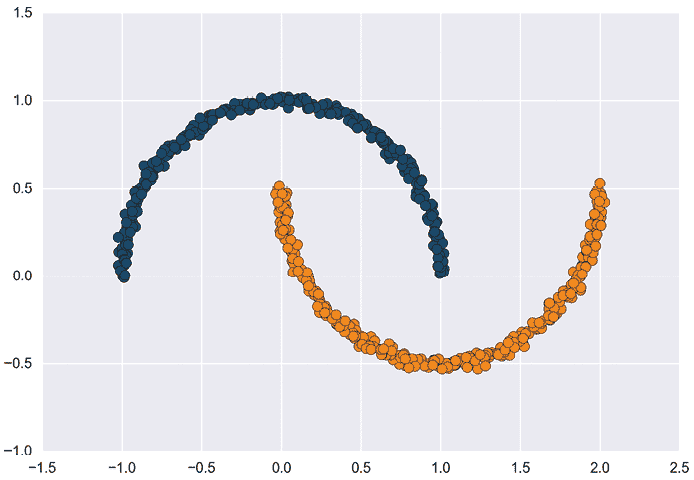

图 11-14：我们构建决策树的 600 个起始数据点，排列成两个半月形结构。这些二维数据点代表了两个类别，蓝色和橙色。

构建树的每一步可能涉及拆分一个叶子节点，从而将其替换为一个节点和两个叶子节点，导致树中一个内部节点和一个叶子节点的净增加。我们通常通过树中叶子节点的数量来衡量树的大小。

图 11-15 显示了为这些数据构建决策树的过程。

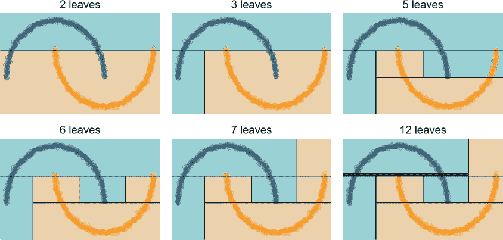

图 11-15：为 图 11-14 中的数据构建决策树。请注意，树是如何从大块区域开始，并逐步将它们细化为更小、更精确的区域。

在此图中，我们在每个图像上绘制了数据集，仅供参考。在这个示例中，每个节点对应一个盒子。我们在这里没有显示，但树的起始部分仅由一个根节点组成，对应一个覆盖整个区域的蓝色盒子。然后，训练过程接收到一个靠近橙色曲线顶部的橙色点。这不属于蓝色类别，因此我们通过水平切割将根节点分成两个盒子，如左上方所示。接下来的点是一个靠近蓝色曲线左侧的蓝色点。这落入了橙色盒子，因此我们通过垂直切割将其分成两个盒子，如所示，最终得到了三个叶子节点。其余部分显示了随着更多样本到来，树形逐渐演变的过程。

请注意，当树形随着更多训练数据的到来而生长时，区域是如何逐渐细化的。

这棵树只需要 12 个叶子就能正确分类每个训练样本。图 11-16 中同时展示了最终树和原始数据。该树完美地拟合了数据。

注意这两个水平的细长矩形。它们将两个橙色样本包围在弧线左侧的顶部，并设法穿插在蓝色点之间（回想一下，样本是每个圆圈中心的点）。这是过拟合，因为尽管它们几乎完全位于蓝色区域内，但任何落入这些矩形的未来点都会被分类为橙色。

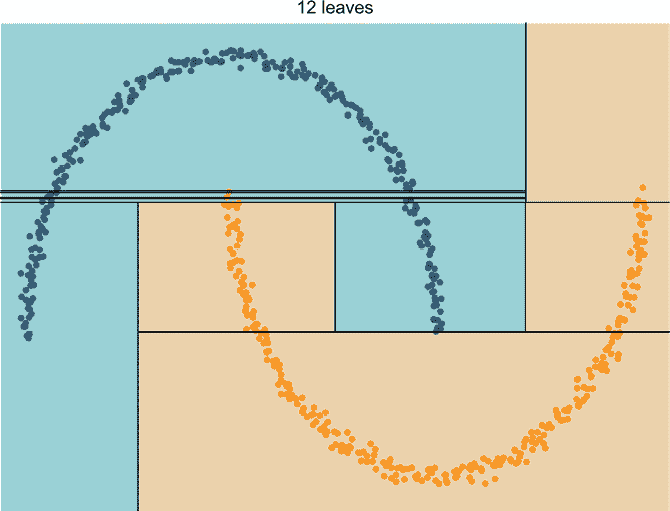

图 11-16：我们的最终决策树，包含 12 个叶子

由于决策树对每个输入样本都非常敏感，它们有一种强烈的过拟合倾向。实际上，决策树几乎总是会过拟合，因为每个训练样本都可能影响树的形状。要验证这一点，请看看 图 11-17。在这里，我们对 图 11-16 使用相同的算法进行了两次运行，但每次我们都使用了不同的、随机选择的 70% 输入数据。

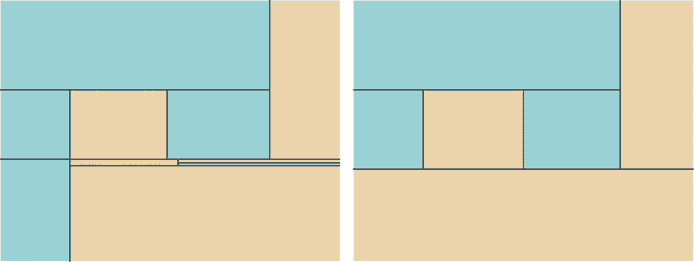

图 11-17：决策树对其输入非常敏感。（左）我们从 图 11-14 随机选择了 70% 的样本并拟合了一棵树。（右）同样的过程，但对于从原始样本中随机选择的 70% 样本。

这两棵决策树相似，但显然不是完全相同。当数据不容易分离时，决策树过拟合的倾向会更加明显。现在我们来看一个这样的例子。

图 11-18 展示了另一对弯月形状的样本，但这次我们在样本分配类别后加入了大量噪声。两个类别不再有清晰的边界。

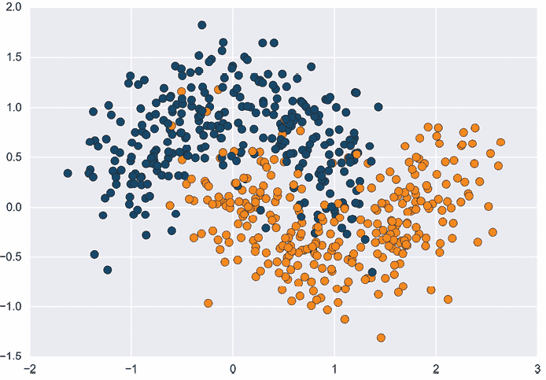

图 11-18：构建决策树的 600 个噪声样本集

将树拟合到这些数据从大区域开始，但随着算法不断拆分节点来适应噪声数据，它很快变成了一组复杂的微小矩形框。图 11-19 显示了结果。在这种情况下，树需要 100 个叶子来正确分类这些点。

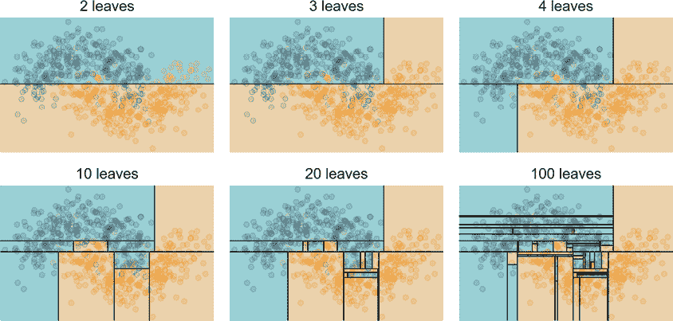

图 11-19：构建决策树的过程。注意第二行使用了大量的叶子。

图 11-20 展示了最终树和原始数据的特写。

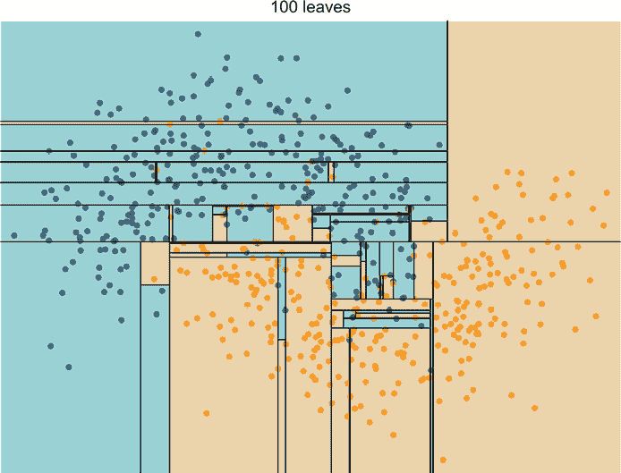

图 11-20：我们的噪声数据拟合了一棵包含 100 个叶子的树。注意，多少小矩形被用来捕捉偶尔的样本。

这里有很多过拟合。尽管我们预计右下角的大部分样本应该是橙色，而左上角的大部分样本应该是蓝色，但这棵树根据这个特定的数据集划出了许多例外。未来落入这些小矩形框的样本可能会被错误分类。

让我们重复构建树的过程，使用不同的、随机选择的 70%数据，在图 11-18 中展示。结果见图 11-21。

图 11-21：使用图 11-18 中不同 70%的样本集构建的几棵树

这些树有相似之处，但它们差异显著，许多小部分仅用于分类少量样本。这就是过拟合的表现。

尽管这看起来对于决策树方法来说可能不太理想，但在第十二章中我们将看到，通过将多个简单的决策树结合成一个群体，或称为*集成*，我们可以创建出稳健、高效的分类器，从而减少过拟合的影响。

还有一些其他方法可以控制过拟合。

如我们在图 11-15 和图 11-19 中看到的，树的生长初期通常会生成较大、较为通用的形状。只有当树变得非常深时，才会出现那些典型的过拟合现象——小的盒子。减少过拟合的一个常见策略是*限制深度*：我们在树构建过程中简单地限制树的深度。如果一个节点离根节点超过了设定的步数，我们就将其直接声明为叶子节点，不再进行分裂。另一种策略是设置最小样本要求，确保我们在分裂一个节点时，该节点至少包含一定数量的样本，无论这些样本有多么混杂。

另一种减少过拟合的方法是在树构建完成后，通过一种叫做*剪枝*的过程来减小树的大小。其原理是通过移除或*修剪*叶子节点来实现。我们检查每个叶子节点，并判断如果移除该叶子节点，树的总误差会发生什么变化。如果误差仍在可接受范围内，我们就直接移除该叶子节点。如果移除一个节点的所有子节点，那么该节点就会变成一个叶子节点，并成为进一步剪枝的候选对象。剪枝树可以使树变得更浅，这还带来了一个额外的好处，那就是在对新数据进行分类时，它的速度也会更快。

限制深度、设置每个节点的最小样本要求以及剪枝，都能简化树的结构，但由于它们是以不同的方式实现的，因此通常会给出不同的结果。

### 节点分裂

在我们离开决策树之前，简要回顾一下节点分裂过程，因为许多机器学习库提供了不同的分裂算法供我们选择。当考虑一个节点时，有两个问题需要问：首先，是否需要分裂？其次，我们应该如何分裂它？我们按顺序来讨论这两个问题。

当我们问一个节点是否需要拆分时，通常会考虑节点中所有样本属于同一类别的程度。我们用一个叫做该节点*纯度*的数字来描述节点内容的均匀性。如果所有样本都属于同一类别，则该节点是完全纯净的。我们拥有其他类别样本的数量越多，纯度的值就越小。为了测试节点是否需要拆分，我们可以将纯度与阈值进行比较。如果节点的纯度过于*不纯*，即纯度低于阈值，则我们进行拆分。

现在我们可以看一下如何拆分节点。如果我们的样本具有多个特征，我们可以设计许多不同的拆分测试。我们可以只测试一个特征的值，忽略其他特征。我们可以查看特征组，并基于它们的一些聚合值进行测试。我们可以自由地根据不同特征在每个节点上选择完全不同的测试方法。这为我们提供了大量可能的测试方案。

图 11-22 展示了一个包含不同大小和颜色的圆圈的混合节点。让我们尝试将所有红色物体放入一个子节点，将所有蓝色物体放入另一个子节点。当我们仅查看数据时（通常是处理任何新数据库时的最佳第一步），似乎红色圆圈是最大的。让我们尝试使用基于圆圈半径的测试。图中展示了使用三个不同半径值进行拆分的结果。

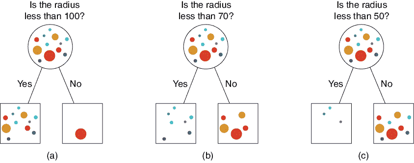

图 11-22：根据圆圈的半径值拆分节点

在这个例子中，半径值为 70 的拆分产生了最纯净的结果，所有蓝色物体都在一个子节点中，所有红色物体都在另一个子节点中。如果我们使用这个测试来拆分该节点，我们将记住我们使用的特征（半径）以及要测试的值（70）。

由于我们可能基于样本的任何特征使用测试来拆分节点，因此我们需要某种方式来评估结果，以便选择最佳的测试方法。让我们来看看两种常见的结果测试方法。

回想一下第六章中提到的*熵*，它是复杂性的度量，或者说传达某些信息所需的比特数。*信息增益（IG）*度量通过比较节点的熵与每个候选测试所生成子节点的熵来使用这一概念。

为了评估一个测试，IG 将通过该测试生成的所有新子节点的熵加在一起，并将结果与父节点的熵进行比较。一个单元格越纯净，它的熵就越低，因此如果一个测试使得单元格变得纯净，则它们的熵总和会小于父节点的熵。经过不同的拆分测试后，我们选择那个能带来最大熵减少（或最大信息增益）的拆分方法。

另一种评估分裂测试流行的方法是 *基尼不纯度*。该技术使用的数学方法旨在最小化错误分类样本的概率。例如，假设某个叶子节点包含 10 个 A 类样本和 90 个 B 类样本。如果一个新样本进入该叶子节点，并且我们报告它属于 B 类，那么我们错误的概率为 10%。基尼不纯度衡量每个叶子节点中多个候选分裂值的错误情况。然后，它选择错误分类机会最小的分裂。

一些库提供了其他用于评估潜在分裂质量的度量。像许多其他选择一样，我们通常会尝试几种选项，并选择最适合我们正在处理的特定数据的那个。

## 支持向量机

让我们考虑第一个参数化算法：*支持向量机*（或 *SVM*）。我们将使用二维数据并仅用两个类别进行说明（VanderPlas 2016），但像大多数机器学习算法一样，这些思想很容易应用于具有任意维度和类别的数据。

### 基本算法

让我们从两个点簇开始，每个簇对应两个类别，如图 11-23 所示。

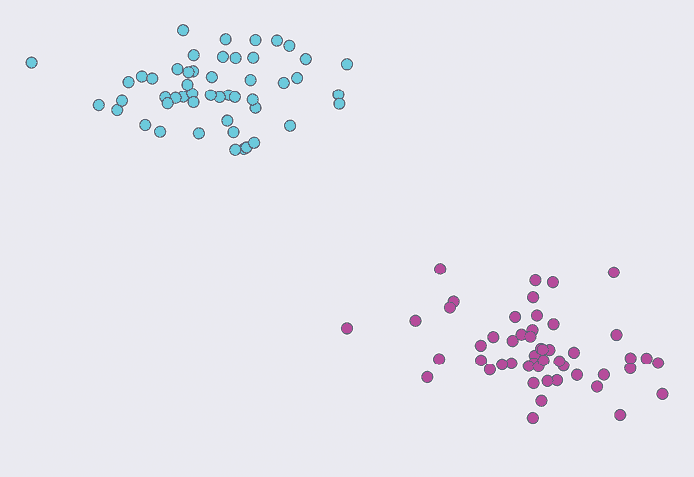

图 11-23：我们的起始数据集由两个二维样本簇组成。

我们希望找到这两个簇之间的边界。为了简化问题，假设我们使用一条直线。但应该选择哪一条呢？有许多条直线可以分开这两个组。图 11-24 显示了三条候选线。

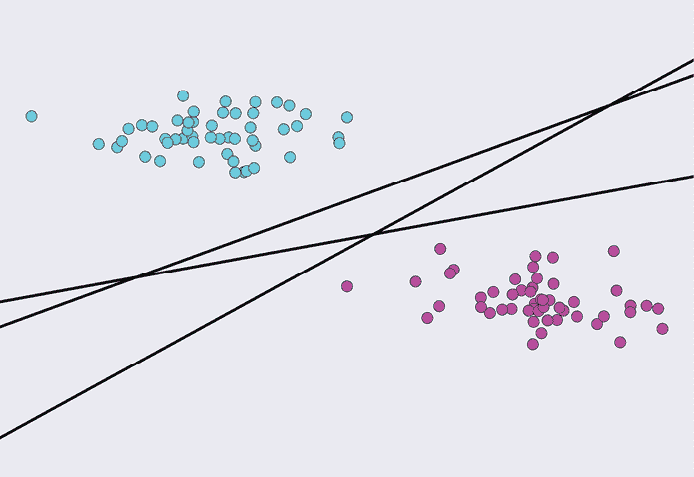

图 11-24：可以分隔我们两个样本簇的三条无限多的线之一。

我们应该选择哪一条线？一种思考方法是想象可能会有新的数据进来。一般来说，我们希望将任何新样本分类为与其最接近的样本所属的类别。

为了评估任何给定的边界线如何实现这一目标，让我们找出它到任一类别最近样本的距离。我们可以利用这个距离在这条线周围画一个对称的边界。图 11-25 展示了几条不同线的想法。

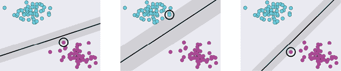

图 11-25：我们可以通过找到该线与最近数据点之间的距离，为每条线分配一个质量值。

在图 11-25 中，我们在最接近该线的样本周围画了一个圆圈。在最左侧的图中，许多新点会被错误地归类为左上簇的一部分，而它们实际上更接近右下簇。在最右侧的图中，情况相同。在中间，线条明显更好，但它现在略微偏向右下簇。由于我们希望每个新点都被分配到它最接近的样本的类别，因此我们希望我们的线能够恰好穿过两个簇的中间。

寻找这条线的算法叫做*支持向量机*，或*SVM*（Steinwart 2008）。SVM 找到的线是离两个簇中所有点最远的线。在这种情况下，*支持*可以理解为“最近”，*向量*是“样本”的同义词，而*机器*是“算法”的同义词。因此，我们可以将 SVM 描述为“最近样本算法”。

SVM 计算出的图 11-23 中我们两个簇的最佳线，如图 11-26 所示。

让我们看看 SVM 是如何找到这条线的。

在图 11-26 中，圈起来的样本是最近的样本，或称为*支持向量*。算法的第一步是定位这些圈中的点。一旦找到这些点，算法接着找到图形中心附近的实线。在所有分开这两个点集的线中，这条线离每个集中的每个样本最远，因为它与其支持向量的距离最大。图 11-26 中的虚线，就像圈住支持向量的圆圈一样，是视觉辅助工具，帮助我们看到 SVM 找到的实线是如何尽可能远离所有样本的。实线到穿过支持向量的虚线之间的距离被称为*间隔*。我们可以重新表述这个概念，SVM 算法找到的是具有最大间隔的那条线。

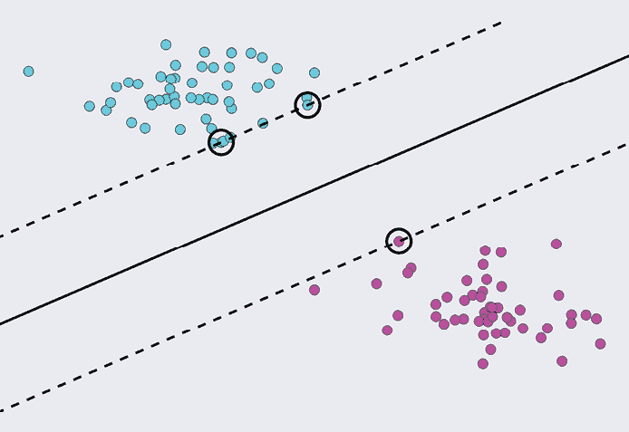

图 11-26：SVM 算法找到的线，与所有样本的距离最大。

如果数据存在噪声，且数据块重叠，如图 11-27 所示，该怎么办？现在我们无法创建一个被空白区域包围的线。什么样的线是穿过这些重叠样本集的最佳选择呢？

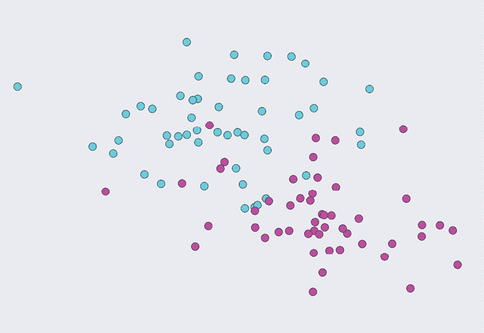

图 11-27：一个数据集，其中数据块发生重叠

SVM 算法让我们可以控制一个名为*C*的参数。这个参数控制算法在允许点进入边界之间的区域时的严格程度。*C*值越大，算法对线周围的空白区域要求越严格。*C*值越小，更多的点可以出现在线周围的区域。我们通常需要通过反复试验来搜索最佳的*C*值。在实际操作中，这通常意味着尝试多个值，并通过交叉验证来评估它们。

图 11-28 显示了我们重叠数据的*C*值为 100,000 时的情况。

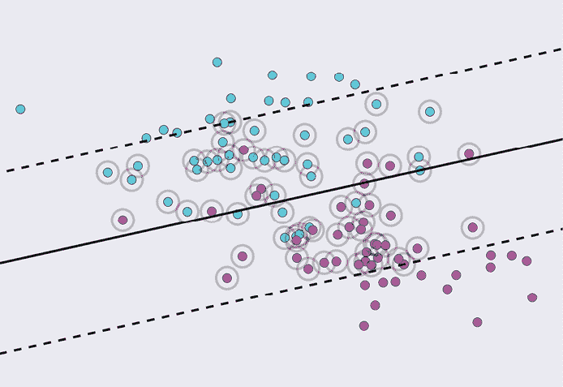

图 11-28：*C*值告诉 SVM 对线周围区域内可以进入的点的敏感程度。这里，*C*为 100,000。

让我们将*C*的值大幅降至 0.01。图 11-29 显示，较小的*C*值让更少的点进入线周围的区域。

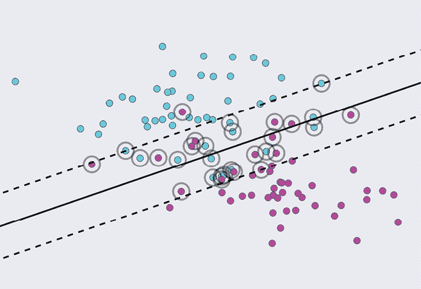

图 11-29：将*C*降低到 0.01，能让比图 11-28 中更少的点进入。

图 11-28 和图 11-29 中的直线是不同的。我们更倾向于选择哪条线，取决于我们对分类器的需求。如果我们认为最佳的边界来自于点重叠区域附近的细节，我们希望选择较小的*C*值，这样我们只关注那些接近边界的点。如果我们认为两组点的整体形状更能描述该边界，我们希望选择较大的*C*值，以便包括更多距离较远的点。

### SVM 核技巧

参数化算法的限制在于它能够找到的形状。例如，SVM 只能找到*线性*形状，比如直线和平面。如果我们有无法通过这种形状明显分开的数据，可能会觉得 SVM 并不适用。但有一个巧妙的技巧，能够让我们在最初看似只有曲线才能分开的地方，使用线性边界。

假设我们有图 11-30 中的数据，其中一个类别的样本形成一个块状区域，另一类别的样本围绕着它形成一个环。我们无法通过画一条直线将这两组数据分开。

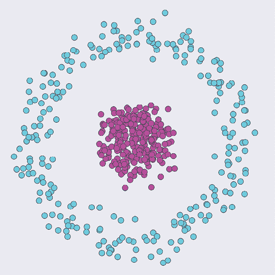

图 11-30：两个类别的数据集

这里就涉及到巧妙的部分。假设我们通过提升每个点的高度，按照该点距离方形区域中心的距离添加一个新的维度。图 11-31 展示了这个概念。

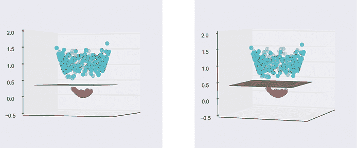

图 11-31：如果我们将图 11-30 中的每个点按照其距离粉色区域中心的距离向上推移一定的量，我们将得到两个不同的点云，并且我们可以用一个平面将它们分开。

正如我们在图 11-31 中看到的那样，我们现在可以在这两组数据之间画一条平面（直线的二维版本）。事实上，我们可以像之前一样使用支持向量和边界的概念来找到这个平面。图 11-32 突出显示了两组点之间平面的支持向量。

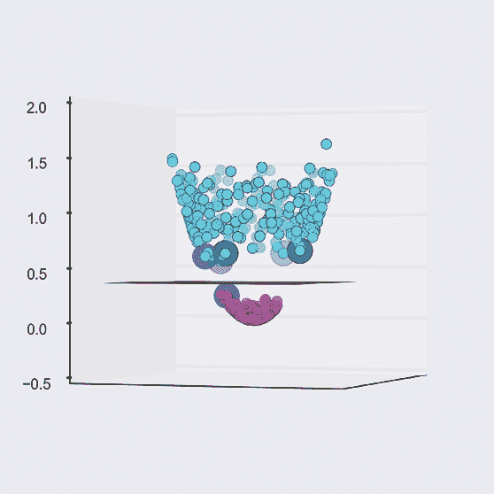

图 11-32：平面的支持向量

现在，所有在平面上方的点都可以归为一类，所有在平面下方的点则归为另一类。

如果我们在原始的二维图中突出显示从图 11-32 找到的支持向量，我们得到图 11-33。

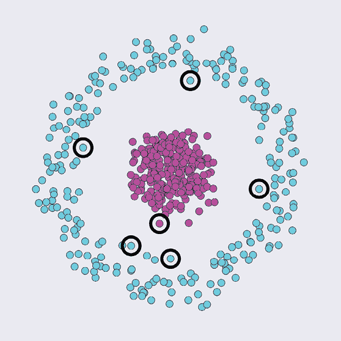

图 11-33：从上方观察图 11-32

如果我们包括由平面创建的边界，我们得到图 11-34。

在这种情况下，我们通过观察数据并设计一个合适的三维转换方法，成功找到了分离数据的正确方式。但是，当数据具有很多维度时，我们可能无法很好地可视化数据，甚至无法猜测一个合适的转换方法。幸运的是，我们不需要手动寻找这些转换。

找到一个好的变换方法的一种方式是尝试大量的变换，然后选择效果最好的一个。由于所需的计算量，这种方法往往过于缓慢，不具备实用性，但幸运的是，我们可以通过巧妙的方式加速这一过程。这个想法集中在一种叫做*核*的数学概念上，它是 SVM 算法的核心。数学家们有时会用*技巧*这个词来形容一个特别巧妙或简洁的想法。在这种情况下，重写 SVM 数学公式被称为*核技巧*（Bishop 2006）。核技巧使得算法可以在不实际变换数据点的情况下计算变换后点之间的距离，这是一个巨大的效率提升。所有主要库都会自动使用核技巧，因此我们甚至不需要特别请求它（Raschka 2015）。

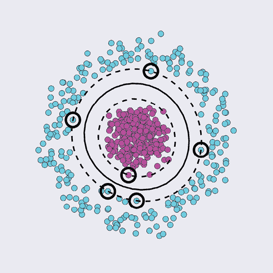

图 11-34：来自图 11-30 的数据，带有支持向量、显示边界的虚线以及由平面所创建的边界

## 朴素贝叶斯

让我们来看一个参数化分类器，这种分类器通常在我们需要快速得到结果时使用，即使这些结果不是最准确的。

这个分类器之所以快速，是因为它首先对数据做出假设。它基于贝叶斯定理，我们在第四章中已经讲过这个定理。

回想一下，贝叶斯定理是从*先验*开始的，或者说是对结果可能是什么的预先设想。通常，当我们使用贝叶斯定理时，我们通过评估新的证据来精化先验，创建一个*后验*，然后这个后验就成了我们的新先验。那么，如果我们提前就决定好先验，然后看看它会带我们走向何方呢？

*朴素贝叶斯*分类器采用了这种方法。之所以叫做*朴素*，是因为我们在先验中做出的假设并不是基于数据的内容。也就是说，我们对数据做出了一个未经信息验证的假设，或者说是一个“朴素”的假设。我们只是假设数据有某种结构。如果我们的假设是正确的，那就很好，我们能得到不错的结果。如果数据和这个假设不太匹配，结果就会变差。朴素贝叶斯之所以受欢迎，是因为这个假设经常是正确的，或者至少接近正确，因此值得一试。有趣的是，我们从来不检查我们的假设是否成立。我们只是继续前进，好像我们确信无疑一样。

在朴素贝叶斯的一个常见形式中，我们假设每个样本的特征都遵循高斯分布。回想第二章中的内容，这就是著名的钟形曲线：一种平滑对称的形状，中央有一个峰值。这就是我们的先验。当我们查看所有样本中的某个特定特征时，我们只是尽可能地将其与高斯曲线进行匹配。

如果我们的特征确实遵循高斯分布，那么这个假设会产生良好的拟合效果。朴素贝叶斯的一个优点是，这个假设似乎比我们预期的要有效得多。

让我们看看它是如何工作的，从满足先验假设的数据开始。图 11-35 展示了一个通过从两个高斯分布中抽样生成的数据集。

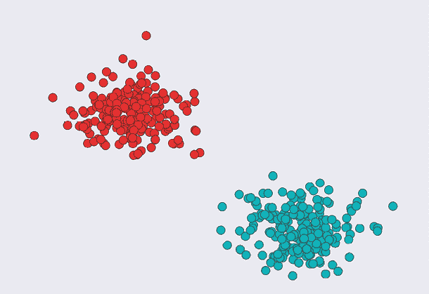

图 11-35：用于朴素贝叶斯训练的一组二维数据。共有两个类别：红色和蓝色。

当我们将这些数据输入到朴素贝叶斯分类器时，它假设每组特征来自一个高斯分布。也就是说，它假设红色点的 x 坐标符合高斯分布，红色点的 y 坐标也符合高斯分布。它对蓝色点的 x 和 y 特征做同样的假设。然后，它尝试为这些数据拟合出最佳的四个高斯分布，生成两个二维的高山。结果如图 11-36 所示。

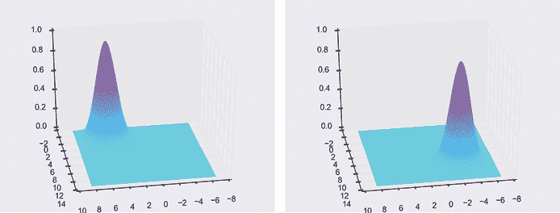

图 11-36：朴素贝叶斯为每个类别的 x 和 y 特征拟合高斯分布。左：红色类别的高斯分布。右：蓝色类别的高斯分布。

如果我们将高斯分布的“斑点”和数据点重叠，并从上方直接观察，如图 11-37 所示，我们可以看到它们形成了非常接近的匹配。这个结果并不令人意外，因为我们生成数据时使用的分布正是朴素贝叶斯分类器所期望的分布。

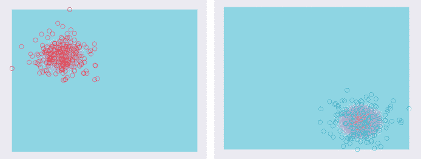

图 11-37：我们整个训练集与图 11-36 中的高斯分布重叠

为了看看分类器在实际中的表现如何，让我们将训练数据拆分，随机选择 70% 的点作为训练集，其余作为测试集。我们用这个新的训练集进行训练，然后将测试集绘制在高斯分布上，得到图 11-38。

在图 11-38 中，我们将所有被分类为第一类的点绘制在左侧，所有第二类的点绘制在右侧，并保持它们原来的颜色。我们可以看到所有的测试样本都被正确分类。

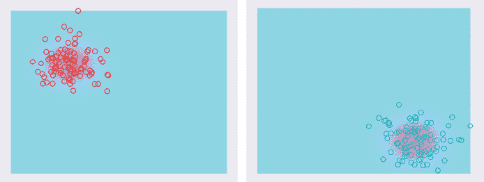

图 11-38：使用我们起始数据的 70% 进行训练后的测试数据

现在，让我们尝试一个不满足所有样本特征遵循高斯分布先验假设的例子。图 11-39 显示了我们新的起始数据，包含两个噪声弯月形的数据。

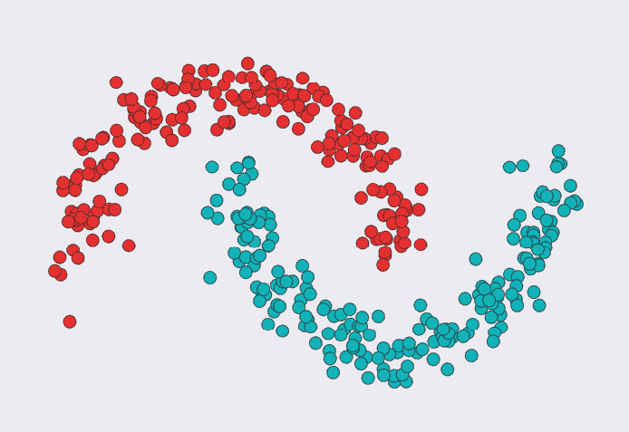

图 11-39：一些噪声弯月形数据

当我们将这些样本输入到朴素贝叶斯分类器时，它假设（和往常一样）红色 x 值、红色 y 值、蓝色 x 值和蓝色 y 值都来自高斯分布。它找到它能找到的最佳高斯分布，如图 11-40 所示。

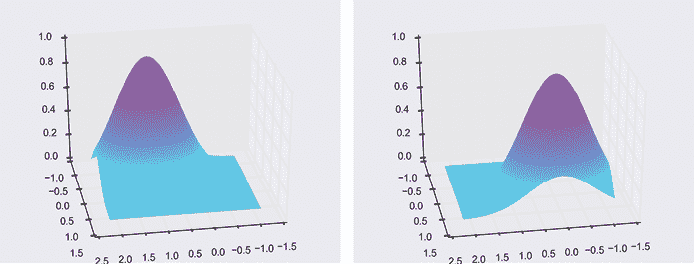

图 11-40：将高斯分布拟合到图 11-39 中的弯月形数据

当然，这些高斯分布与我们的数据并不匹配，因为它们不满足假设。将数据覆盖在图 11-41 中的高斯分布上，可以看到匹配并不糟糕，但也相差甚远。

图 11-41：我们的训练数据来自图 11-39，并叠加在图 11-40 的高斯分布上

和之前一样，接下来我们将新月形的数据分为训练集和测试集，在 70%的数据上进行训练，并查看预测结果。在图 11-42 的左侧图像中，我们可以看到所有分配给红色类别的点。正如我们所希望的那样，这些大多数是红色点，但来自左上方红色新月的一些点没有被分类为红色，来自右下方蓝色新月的一些点被错误地分类为红色，因为它们来自这个高斯分布的值高于来自另一个的值。

在图 11-42 的右侧，我们可以看到另一种高斯分布的相反情况。换句话说，我们正确分类了许多点，但也在每个类别中都出现了误分类。

我们不应对误分类感到太惊讶，因为我们的数据并没有遵循朴素贝叶斯先验假设。令人惊讶的是分类器的表现如此出色。一般来说，朴素贝叶斯在各种数据上通常表现良好。这可能是因为许多现实世界的数据来源于可以很好地用高斯分布描述的过程。

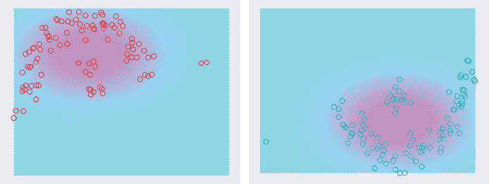

图 11-42：我们在图 11-39 的数据上训练的朴素贝叶斯分类器的测试数据预测结果

由于朴素贝叶斯非常快速，因此我们通常在试图了解数据时应用它。如果它表现出色，我们可能不需要再考虑更复杂的算法。

## 分类器比较

本章中我们介绍了四种流行的分类算法。大多数机器学习库都提供了这些算法以及许多其他算法。简要地说，让我们看看这四种分类器的优缺点，从非参数算法开始。

kNN 方法非常灵活。它不显式地表示边界，因此可以处理训练数据中由类别样本形成的任何复杂结构。它的训练速度很快，因为通常只是保存每个训练样本。另一方面，预测速度较慢，因为算法必须为我们要分类的每个样本搜索最近的邻居（虽然有很多提高搜索效率的方法，但仍然需要时间）。并且因为它保存了每个训练样本，算法可能会消耗大量内存。如果训练集的大小超过了可用内存，操作系统通常需要开始将数据保存在硬盘（或其他外部存储）上，这可能会显著减慢算法的速度。

决策树训练速度快，在做出预测时也很快。它们可以处理类之间的奇怪边界，尽管这可能需要更深的树。由于它们容易过拟合，决策树有一个巨大的缺点（不过正如我们所提到的，我们稍后会通过使用多个小树来解决这个问题，所以并非全是坏消息）。决策树在实践中非常有吸引力，因为它们容易解释。有时候即使结果不如其他分类器，人们仍然会使用决策树，因为它们的决策是透明的，或者说容易理解。需要注意的是，这并不意味着选择是公平或正确的，仅仅是它们对人类来说是可以理解的。

支持向量机是参数化算法，可以快速做出预测。一旦训练好，它们不需要太多内存，因为它们只存储样本区域之间的边界。而且它们可以使用核技巧来找到看起来比直线（以及平面、甚至更高维度的平面）复杂得多的分类边界。另一方面，训练时间随着训练集大小的增加而增长。结果的质量对参数*C*非常敏感，*C*指定了允许多少样本靠近边界。我们可以使用交叉验证来尝试不同的*C*值并选出最佳的。

朴素贝叶斯训练迅速，预测也很快，而且它的结果也不难解释（尽管比起决策树或 kNN 结果来说，稍显抽象）。该方法没有需要调整的参数。如果我们处理的类分布较为分离，那么朴素贝叶斯的先验通常能产生很好的结果。当我们的数据呈高斯分布时，该算法效果尤其好。当数据有许多特征时，它也能很好地工作，因为这类数据的类别通常以能发挥朴素贝叶斯优势的方式分离（VanderPlas 2016）。在实践中，我们通常会在了解数据集的初期尝试朴素贝叶斯，因为它训练和预测速度快，能让我们对数据的结构有一个初步的感觉。如果预测质量较差，我们可以转向更昂贵的分类器（即需要更多时间或内存的分类器）。

我们在这里看到的算法在实践中经常被使用，尤其是在我们初步了解数据时，因为它们通常很容易应用和可视化。

## 总结

在这一章中，我们介绍了两种类型的分类器。当一个分类器没有预设的数据结构假设时，我们称之为非参数化。*k-*最近邻算法属于这一类，它根据样本最常见的邻居来为样本分配类别。决策树也是非参数化的，它根据从训练数据中学习到的一系列决策来分配类别。

另一方面，参数化分类器对数据的结构有一个先入为主的假设。一个基本的支持向量机寻找线性形状，如直线或平面，将训练数据按类别分开。朴素贝叶斯分类器假设数据具有固定的分布，通常是高斯分布，然后尽力将该分布拟合到数据的每个特征上。

在下一章中，我们将看到如何将多个分类器结合起来，产生比单个组件更强大的集成分类器。
