# 第十二章：集成体

任何人都可能犯错误，算法也是如此。有时候，我们可能非常确信我们的算法给出了正确的答案，但由于各种原因，我们可能还是会有一些疑虑。我们如何增加对计算机告诉我们的结果的信任呢？

这并不是一个新问题。1960 年代和 70 年代的阿波罗航天器在指令舱中使用了一种类型的计算机，该指令舱绕月球飞行，而在登月舱中则使用了另一种类型的计算机。计算机在几乎每一个操作中都起着至关重要的作用，因此宇航员必须能够信任它们的输出。这些计算机采用集成电路，而集成电路在当时相对较新。宇航员把他们的生命交给了这些软件和硬件，但始终存在疑虑。他们如何防范可能导致任务失败甚至致命的错误或故障呢？

这些计算机的设计者通过冗余来解决这个问题：每块电路板都被复制了，不止一次，而是两次，共产生了三份副本。三套系统始终保持同步运行，这种技术称为*三模冗余*。这些计算机接受相同的输入并计算出各自独立的结果。集体的输出由多数投票决定（Ceruzzi 2015）。这样，如果其中任何一个系统发生故障，正确的答案仍然能够出现。

我们可以在机器学习中采用并扩展这个思路。就像阿波罗工程师一样，我们可以创建多个学习器，并同时使用它们。在机器学习中，类似的学习器群体被称为*集成体*。就像阿波罗计算机一样，集成体的输出是其成员中最受欢迎的结果。但与阿波罗的相同软件和硬件不同，我们使每个学习器具有独特性，通常通过在略有不同的数据上进行训练。这样，一个学习器所犯的错误不太可能以完全相同的方式被其他学习器重复。这种方式下，多数投票帮助我们排除错误的决策。

在第十一章中，我们看到决策树容易对训练数据过拟合，这会导致系统部署后出现错误。在本章中，我们将看到如何将多棵决策树结合成一个集成体。最终结果是一种算法，它继承了决策树的简单性和透明性，但大大减少了它们的问题。我们首先简要讨论一下集成体如何确定最终结果。

## 投票

对计算机和人类来说，做决策都很困难。在一些人类社会中，我们通过汇聚许多人的意见来处理个体在决策上的不完美。法律由参议院通过，财务决策由董事会做出，个人领导人通过民众投票选举产生。这些情况中的思维方式是，如果我们使用多个独立选民的共识，而不是依赖单一个体的判断，就可以避免那些仅属于某一个人的判断错误。尽管这并不能保证做出正确的决策，但它有时能帮助避免由任何一个人的特异性、偏见或错误判断引发的问题。

机器也有偏见。当我们使用学习算法做决策时，它们的预测是基于它们所训练的数据。如果这些数据包含了偏见、遗漏、代表性不足、过度代表或任何其他形式的系统性错误，这些错误也会被“烙印”在学习者中。这在现实世界中可能产生深远的影响。例如，当我们使用机器学习来评估房贷或商业贷款、决定大学录取、或预筛选求职者时，训练数据中的任何不公平或偏见都会导致系统决策中出现类似的不公平和偏见，过去的错误决策会在现在被重复，并且传播到未来。

减少这些问题影响的一种方法是创建多个使用不同数据集训练的学习者。例如，我们可以用来自不同来源的不同训练集来训练每个系统。由于这种数据在实践中往往难以获得，通常我们会使用从一个公共训练数据池中抽取的不同子集进行训练。

当我们在这些不同的数据集上训练了一堆学习者时，我们通常会让每个学习者评估每一个新的输入。然后，我们让学习者投票以决定最终结果。

实现这一点的典型方式是使用*多数投票*（RangeVoting.org 2020）。简单来说，每个学习者对其预测投下一个票，获得最多票数的预测就是获胜者（如果出现平局，计算机可以随机选择其中一个平局项，或者再进行一轮投票）。尽管多数投票并不完美，并且存在一些有用的替代方法，但它简单、快速，通常能在机器学习中产生可接受的结果（NCSL 2020）。

一种流行的多数投票变体是*加权多数投票*。在这种投票中，每一票都有一个特定的*权重*，即一个数字，表示该票对结果的影响力。另一种变体是要求每个选民表明他们对自己决策的*信心*，因此更有信心的选民可以比那些不太确定的选民对结果产生更大影响。

在这些术语确定之后，我们现在来深入探讨如何创建一个决策树的集成。

## 决策树集成

一种建立决策树优势同时减少其缺点的好方法是将它们组合成集成。为了让接下来的讨论更具体，我们集中讨论使用决策树进行分类。

让我们看看三种常见的决策树集成技术，它们能够显著超越各自的单一组件。

### Bagging

被称为*bagging*的集成技术是*bootstrap aggregating*的合成词。正如名字所示，这种技术基于我们在第二章中看到的引导法思想。在那里，我们看到了如何使用引导法来估计某些统计度量的质量，通过评估从起始数据中抽取的小子集。在这里，我们再次创建许多由训练集构建的小集合，但这次我们将使用它们来训练一组决策树。

从我们原始的训练集样本开始，我们可以通过从原始数据中抽取样本来构建多个新的集合，或*引导集*，并使用有放回的抽样。这意味着可能会多次抽到同一样本。图 12-1 展示了这个概念。请记住，每个样本都有其指定的类别（通过颜色显示），所以我们可以用它进行训练。

在图 12-1 的中心，我们有一组由八个样本组成的初始集合，这些样本属于五个类别。通过从这个集合中选择样本，我们可以创建许多新的集合，在本例中，每个集合包含四个样本。这是 bagging 的第一步。由于我们是有放回地抽样，因此任何给定的样本可能会出现多次。

现在让我们为每个引导集创建一棵决策树，并用该数据进行训练。我们将这些树的集合称为*集成*。

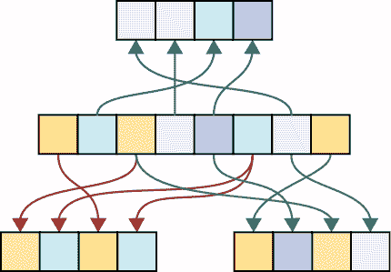

图 12-1：从一组样本（中间）创建三个引导集（上面和下面）

当训练完成，我们正在评估一个新样本时，我们将其交给集成中的所有决策树。每棵树都会产生一个类别预测。我们将预测的类别视为在多数选举中的投票，从而产生一个赢家或平局。假设我们有一个只有五棵树的小型集成。图 12-2 展示了在部署后评估新样本的过程，将其分配给四个字母类中的一个。

图 12-2：使用集成来预测一个样本的类别

看一下图的左侧。最上面，一个未知类别的新样本到达我们的集成。这个样本会被交给我们每一棵决策树（显示为三角形），每棵树都会产生一个预测类别，标记为 A 到 D。由于每棵树都是在不同的引导集上训练的，因此它与其他树有所不同。在图的右侧，我们使用这些预测类别进行多数投票选举。在这个例子中，最流行的类别是 B。这个类别获胜，因此成为集成的输出。

我们只需要指定两个参数来创建这个集成模型：每个自助采样（bootstrap）中应该使用多少样本，以及我们想要构建多少棵树。分析显示，增加更多的分类器会使集成的预测效果更好，但在某个点之后，增加更多的分类器只会让速度变慢，结果不再改善。这被称为*集成构建中的收益递减法则*。一个好的经验法则是使用与数据类别数量大致相同的分类器数量（Bonab 2016），尽管我们可以使用交叉验证来搜索给定数据集的最佳树木数量。

在讨论袋装方法之前，让我们考虑一些建立在基本思想之上的技术。每种技术的核心思想是在训练过程中为我们的树增加额外的随机性。

### 随机森林

正如我们在第十一章看到的，当需要将决策树的一个节点分裂成两个时，我们可以选择任何特征（或特征集）来创建测试，将元素引导到一个子节点或另一个子节点。如果我们选择基于单一特征进行分裂，那么我们需要选择想要使用的特征以及该特征的测试值。为了比较不同的测试，我们可以使用第十一章中提到的度量方法，如信息增益或基尼不纯度。

在构建决策树时，我们通常通过考虑每个特征来寻找最佳测试。但我们也可以使用一种叫做*特征袋装*的技术。在寻找节点的最佳测试之前，我们首先选择该节点样本的特征的一个随机子集，采用无放回选择。现在我们准备好只根据这些特征来寻找最佳测试。我们甚至不考虑基于我们忽略的特征进行的分裂。

后来，当我们决定再次分裂一个节点时，我们再次选择一个全新的特征子集，并仅使用这些特征来确定新的分裂。这个思想在图 12-3 中有所展示。

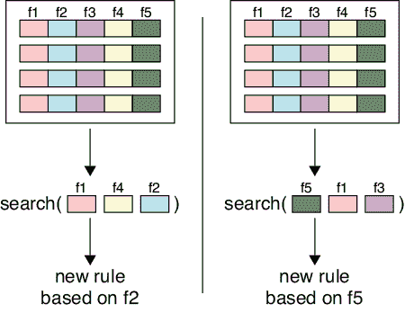

图 12-3：通过特征袋装方法确定在分裂节点时使用哪个特征（f1 到 f5），该方法展示了两个节点，每个节点有五个样本

在图 12-3 的左侧，我们从五个可用特征中随机选择三个特征，并在这些特征上搜索最佳特征以进行分裂。在右侧，我们再次选择三种不同的随机特征集，从而获得不同的测试。这里的思路是，通过随机选择少数特征，我们可以避免在每棵训练的树中对该节点做出相同的选择，从而增加决策的多样性。

当我们以这种方式构建集成时，我们称结果为*随机森林*。名字中的*随机*部分指的是我们在每个节点上随机选择特征，而*森林*一词则指的是生成的决策树集合。

为了创建一个随机森林，我们需要提供与袋装法相同的两个参数：每个自助采样的大小和要构建的树的数量。我们还必须指定在每个节点考虑哪些特征的比例。我们可以将其表示为节点中特征数量的百分比。或者，许多库提供了各种算法，能够为我们自动选择该百分比。

### 极端随机树

让我们来看一下构建集成树时，第二种随机化构建树的方法。通常，当我们分割一个节点时，我们会考虑它包含的每个特征（或者如果我们在构建随机森林，则考虑它们的随机子集），并找到最能将该节点样本分成两个子节点的特征值。正如我们之前提到的，我们通过信息增益等度量来比较不同的可能测试。

我们可以不去找每个特征的最佳切分点，而是基于节点中已有的值随机选择切分点。这一变化的结果是一个叫做*极端随机树*（*Extra Trees*）的集成方法。

虽然看起来这注定会给我们的决策树带来更差的结果，但请记住，决策树容易过拟合。通过这种随机选择切分点的方法，我们可以在牺牲一些准确度的同时，减少过拟合。

## 提升法

我们刚刚讨论的技巧都是特定于决策树的。现在，让我们来看一种适用于任何类型学习器的集成构建方法。这种方法叫做*提升法*（Schapire 2012）。

提升法是一种流行的算法，因为它让我们可以将大量小而快速、不太准确的学习器结合成一个准确的学习器。为了让讨论更加具体，我们继续使用决策树作为例子学习器。为了简化问题，我们专注于二元分类器，这种分类器将每个样本分配到两个类别中的一个。我们将从一些几乎没有用的分类器开始，构建我们的集成。为了启动这个过程，让我们先从一个完全无用的分类器开始进行思考实验，然后稍微改进它。

假设有一个数据集，其中样本来自两个类别。再假设有一个完全随机的二元分类器。无论样本的特征如何，分类器都会任意地将样本分配到这两个类别中的一个。如果训练集中的样本均匀分布，我们有 50:50 的概率正确标记任何一个样本。我们称之为*随机标记*，因为得到正确答案的概率完全取决于运气。

假设我们可以稍微调整我们的二元分类器，使它比随机预测稍微好一点。例如，图 12-4 展示了一个由两个类别组成的数据集，一个与随机预测一样的二元分类器，以及一个稍微比随机预测好一点的二元分类器。

图 12-4(b)中的学习器与随机分类器没有区别，两个类别中的一半都被错误分类。这是一个无用的分类器。部分（c）中的学习器比部分（b）中的分类器稍微好一些，因为边界线的轻微倾斜使得它的表现比无用的分类器稍微好一些。

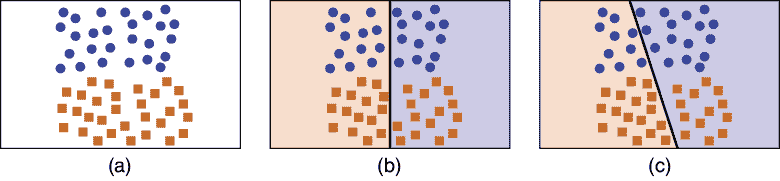

图 12-4：（a）我们的训练数据。（b）一个随机分类器。（c）一个糟糕的，但不完全随机的分类器。

我们把图 12-4(c)中的分类器称为*弱学习器*。在这种情况下，弱学习器是指任何即使只有一点点准确性的分类器。也就是说，它在超过 50% 的时间里分配正确的类别，尽管可能只是稍微超过。提升的魅力在于，我们可以将这个弱学习器作为一个集成的一部分，从而产生非常好的结果。

事实上，即使一个弱二元分类器的表现比随机情况还要*差*，它对我们来说依然非常有用。这是因为我们只有两类。如果一个分类器的表现低于随机水平（即它分配错误类别的频率高于正确类别），我们可以通过交换输出的类别，使它的表现变得比随机情况还要好，而不是更差。结论是，只要一个二元分类器不是完全随机的，我们就能够利用它。

弱分类器很容易构造。或许最常见的弱分类器是一个深度仅为 1 的决策树。也就是说，整个树由一个根节点和它的两个子节点组成。这个极小的决策树通常被称为*决策树桩*。因为它几乎总是比随机分配类别要做得好，所以它是弱分类器的一个典型例子。它小，快，而且比随机分类稍微好一些。

与弱学习器相对的是*强学习器*，它大多数时候都能正确地标记类别。学习器越强，它正确分类的百分比就越高。

提升算法的核心思想是将多个弱分类器组合成一个集成分类器，从而表现得像一个强分类器。请注意，我们的弱分类器条件只是一个最低标准。尽管我们可以组合许多强分类器，但使用弱分类器更为常见，因为它们通常更快。

让我们通过一个例子来看一下提升算法是如何工作的。图 12-5 展示了一组属于两种不同类别的训练样本。

那么，哪些可能是适合这种数据的优秀分类器呢？一个快速且简单的分类器只需在二维数据集上画一条直线。我们可以看到，任何直线都无法分开这些数据，因为圆形样本在三侧围绕着方形样本。

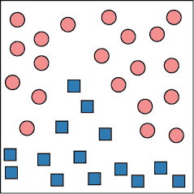

图 12-5：我们将通过提升算法分类的样本集合

尽管没有一条直线可以分开这些数据，但我们将看到，多个直线是可以做到的，因此我们将使用直线作为我们的弱分类器。图 12-6 展示了一个这样的分类器的边界线。我们将使用 A 作为分类器和它所定义的边界线的名称。

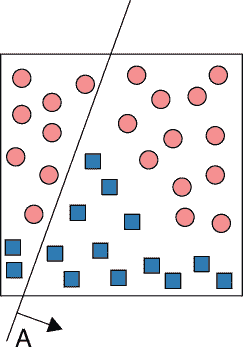

图 12-6：将一条名为 A 的直线放入我们的样本中，切割开两个大的聚类。

在这个分类器中，箭头指向的 A 侧的所有内容被分类为正方形，另一侧的所有内容被分类为圆形。使用我们在第三章中定义的准确度度量，我们发现这个学习者的准确度为 (TP + TN) / (TP + TN + FP + FN) = (12 + 8) / (12 + 8 + 12 + 2) = 20 / 34，约为 59%。这是一个弱学习者的不错例子：它比随机猜测（50%）要好，但也好不了多少。

为了使用提升方法，我们需要添加更多的直线（即额外的弱学习者），以便最终每个由直线形成的区域都包含单一类别的样本。添加了另外两条这样的直线分类器后，我们得到了图 12-7。

直线 B 的准确度约为 73%。直线 C 非常糟糕，准确度仅约为 12%。但正如我们之前所提到的，这没关系，因为如果我们仅仅交换 C 所分配的标签（即，只需将箭头指向另一方向），它的准确度约为 88%！

图 12-7 中的三条直线或边界共同创建了七个不重叠的区域。图中还显示，每个区域只包含一个类别的样本。通过观察这些区域，我们可以看到只通过三个分类器的输出就能确定一个样本的类别。

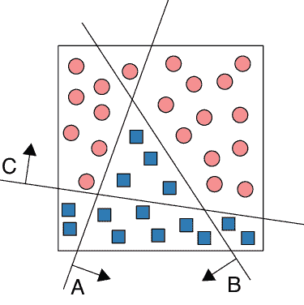

图 12-7：在图 12-6 中添加了两条直线

让我们将这三条边界线一起画出来。我们将用学习者的名称标记每个区域。结果如图 12-8 所示。

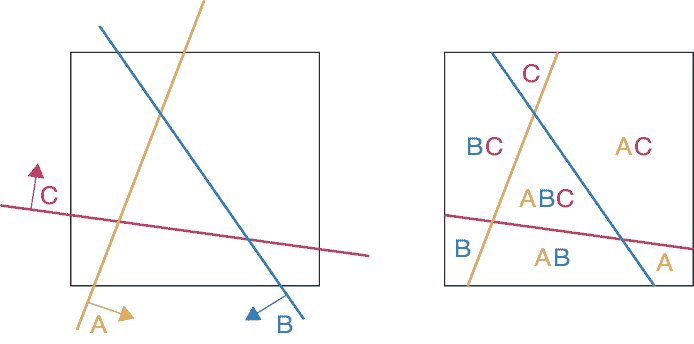

图 12-8：左侧展示了名为 A、B 和 C 的三条直线。右侧，每个区域都标记有使该区域位于各自直线正面侧的学习者的名称。

当我们的分类器接收到一个新样本时，通常它们每个都会返回一个类别。相反，让我们设置它们，当样本位于分类器边界的正面时返回 1（即图 12-8 中箭头指向的那一侧），否则返回 0。

现在我们可以在每个单元格中加总来自三个学习者的所有贡献。

例如，考虑图 12-8 中标记为 C 的区域。它位于学习器 C 的正侧，因此得分为 1。它位于 A 和 B 的负侧，因此 A 和 B 都贡献 0，因此三者输出的总和为 1。底部标记为 AB 的区域，A 和 B 各贡献 1，C 贡献 0，总和为 2。这些得分与其他区域一起显示在图 12-9 中。

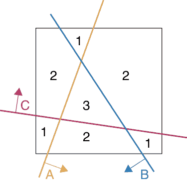

图 12-9：每个区域的合成得分。图 12-8 中的每个字母为该区域带来 1 分。

我们几乎已经创建好了新的分类器。接下来有两个步骤。首先，我们将每个分类器输出中我们随意分配的 1 替换为一个更有用的值。其次，我们找到一个阈值，将每个区域的总值转换为一个类别。

回想一下我们之前在本章中讨论的加权多数投票。如果某个区域位于某条线的正侧，那么该线正在为该区域投票。我们可以为每个分类器分配一个投票权重，而不仅仅是从每个分类器那里加上 1。例如，如果分类器 A、B 和 C 的投票权重分别为 2、3 和-4，而一个点位于 A 和 C 的正侧，但不在 B 的正侧，那么 A 贡献 2，B 贡献 0（因为该点位于 B 线的负侧），C 贡献-4，总和为 2 + 0 + -4 = -2。

每个分类器的投票权重是由提升算法为我们计算的。我们不打算详细讨论这些机制，而是通过可视化一组特定的权重结果来观察它们对数据集的影响。

在图 12-10 中，我们展示了每个学习器的得分所影响的区域。深色区域获得该学习器的值，而浅色区域则没有（因此浅色区域内的学习器值为 0）。在这里，我们为 A、B 和 C 使用了权重 1.0、1.5 和-2。回想一下，C 线指向的是“错误”的方向。给 C 的权重赋负值的效果是颠倒了分类器 C 的决策。

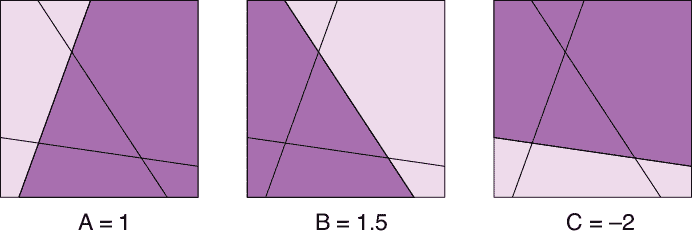

图 12-10：我们为每个被每个学习器分类为正的区域分配一个数值。每条线的深色区域会得到与该线相关联的权重。

所有这些得分的总和显示在图 12-11 中。蓝色区域的总和为正，红色区域的总和为负。这些正好对应于我们数据集中圆形和方形的分布。任何位于正区域的样本都是方形的，任何位于负区域的样本都是圆形的。

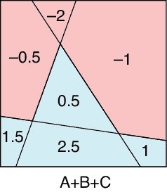

图 12-11：汇总图 12-10 中的得分

当一个样本到来时，我们将其发送到每个分类器（即，我们将其与相应的线进行测试）。对于每个分类器，如果该分类器认为样本位于其线的正侧，我们就将其投票权重贡献给一个累加和。在加总所有分类器的输出后，我们确定样本是正类还是负类，这样我们就能知道样本属于哪个类别。我们已经正确地对数据进行了分类！

让我们看一个新的例子。图 12-12 展示了一组新的数据。

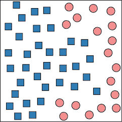

图 12-12：我们希望使用提升法分类的一组数据

对于这个数据，我们尝试使用四个学习器。图 12-13 展示了一个提升算法可能会找到的四个弱学习器，用于对该数据进行划分。

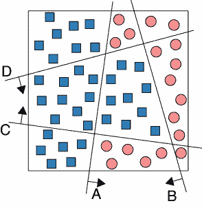

图 12-13：四条线让我们能够对图 12-12 的数据进行分类

如前所述，算法还会为这些学习器分配权重。我们通过为学习器 A、B、C 和 D 分别赋予权重 −8、2、3 和 4 来展示结果。图 12-14 展示了哪些区域的总体得分增加了这些权重。浅色区域隐式地接收到 0 的值。

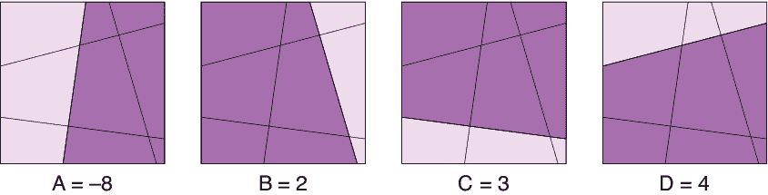

图 12-14：与每个学习器对应的区域

图 12-15 展示了每个区域贡献的总和。同样，正总和或负总和区分了这两种类型的区域。我们已经找到了一个方法，通过组合四个弱学习器来正确分类图 12-13 中的点。

提升的美妙之处在于，它将简单且快速但效果差的分类器，通过为它们找到权重，转化为一个单一的强大分类器。

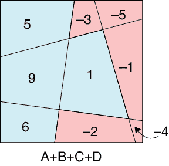

图 12-15：来自图 12-14 的每个区域得分的总和。正区域用蓝色显示，它们正确地对图 12-13 中的点进行了分类。

我们需要提供的唯一超参数是我们想要多少个分类器。在提升法中，像在袋装法中一样，一个好的经验法则是从与类别数量大致相等的分类器开始（Bonab 2016）。这意味着我们之前的例子使用了三个或四个分类器来分类两个类别，因此起步时较高。但正如在许多机器学习任务中一样，最佳值是通过试验和错误找到的。

提升法首次出现是在一个名为*Adaboost*的算法中（Freund 1997；Schapire 2013）。尽管它可以与任何学习算法配合使用，但提升法在决策树中尤为流行。事实上，它在我们之前提到的决策树桩上表现得非常好（这些树只有一个根节点和两个直接子节点）。我们可以把我们在图 12-7 和 12-13 中使用的线看作决策树桩，因为它们只有一个测试：样本是否在箭头指向的线的正侧？还是不在？

值得注意的是，boosting 并不是提高所有分类算法的万灵药。boosting 的理论仅适用于二分类问题，如我们之前的示例所示（Fumera 2008；Kak 2016）。这也是为什么 boosting 在决策树分类器中如此流行和成功的部分原因。

## 总结

集成方法是多种多样的学习器的集合。基本思路是，我们收集多个类型相似但训练数据不同的学习器，让它们一起评估输入。然后，让它们投票决定各自认为的类别，获得最多票数的类别将作为该输入的最终分类。其背后的思考是，个别学习器的错误会被其他学习器达成一致的分类结果“投票”消除。

Boosting 是一种将多个弱学习器组合成一个强学习器的方式。

本讨论总结了我们关于机器学习技术的讨论。从第十三章开始，我们将讨论深度学习算法背后的神经网络。我们会看到，我们在这里介绍的方法对深度学习有帮助，因为它们帮助我们理解数据，并做出最佳的算法和网络选择，以处理这些数据，并产生对我们有用的结果。
