# 第十三章：神经网络

深度学习算法基于建立一个连接的计算单元网络。这些网络的基本单元是一个小型计算捆绑体，称为*人工神经元*，尽管它通常简称为*神经元*。人工神经元的灵感来自于人类神经元，神经元是构成我们大脑和中枢神经系统的神经细胞，主要负责我们的认知能力。

本章中，我们将展示人工神经元的样子，并讨论如何将它们安排成网络。接着，我们将它们分组为层，从而形成深度学习网络。我们还会探讨如何配置这些人工神经元的输出，以便它们产生最有用的结果。

## 真实神经元

在生物学中，*神经元*一词适用于分布在人类身体各处的多种复杂细胞。这些细胞都具有相似的结构和行为，但它们被专门化以执行许多不同的任务。神经元是复杂的生物体，利用化学、物理、电学、时间、接近性等多种方式来执行其行为并相互通信（Julien 2011；Khanna 2018；Lodish 等人 2000；Purves 等人 2001）。图 13-1 显示了神经元的一个高度简化的示意图。

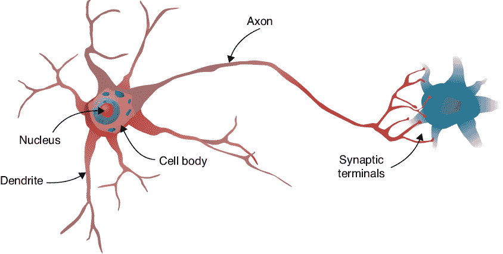

图 13-1：一个高度简化的生物神经元示意图（红色），标出了几个主要结构。该神经元的输出信号传递给另一个神经元（蓝色），后者仅部分显示（改编自 Wikipedia 2020b）。

神经元是信息处理机器。信息的一种类型是通过名为*神经递质*的化学物质传递，这些化学物质暂时*结合*或附着在神经元上的*受体位点*（Goldberg 2015）。让我们概述一下接下来会发生什么。

结合到受体位点的化学物质会导致电信号进入神经元的主体。每个信号可能是正电或负电。在短时间内到达神经元主体的所有电信号会被加在一起，然后与*阈值*进行比较。如果总和超过该阈值，就会沿着轴突发送一个新信号到神经元的另一部分，导致一定量的神经递质释放到环境中。这些分子随后会与其他神经元结合，过程重复进行。

以这种方式，信息在大脑和中枢神经系统中通过神经元的密集连接网络传播并被修改。如果两个神经元之间足够接近，以至于一个可以接收到另一个释放的神经递质，我们就说这些神经元是*连接*的，即使它们可能并没有实际接触。有一些证据表明，神经元之间的特定连接模式对认知和身份的形成至关重要，甚至和神经元本身一样重要（Sporns、Tononi 和 Kötter 2005；Seung 2013）。一个个体神经元连接的地图被称为*连接组*。连接组和指纹或虹膜图案一样独特。

尽管真实的神经元及其周围环境极其复杂和微妙，但这里描述的基本机制却具有一种迷人的优雅。对此，一些科学家尝试通过创建大量简化的神经元及其环境，使用硬件或软件来模仿或复制大脑，希望能出现有趣的行为（Furber 2012；Timmer 2014）。到目前为止，这还没有产生大多数人认为是智能的结果。

但是，我们可以以特定的方式连接简化的神经元，从而在广泛的问题上产生显著的结果。这些结构将是本章和本书其余部分的重点。

## 人工神经元

我们在机器学习中使用的“神经元”受真实神经元的启发，就像木偶画是受人类身体启发一样。它们有相似之处，但仅仅是最一般的层面。几乎所有的细节在这个过程中都丢失了，最终我们得到的更多的是对原始对象的提醒，而不是一个简化的复制品。

这导致了一些混淆，特别是在大众媒体中，“神经网络”有时被用作“电子大脑”的同义词，从而只需一步之遥就能联想到通用智能、意识、情感，甚至可能是世界统治和消灭人类生命。实际上，我们使用的神经元与真实神经元的抽象和简化程度如此之大，以至于许多人更愿意将它们称为更通用的*单元*。但无论好坏，*神经元*这个词、*神经网络*这个短语以及所有相关的语言显然将会存在，因此我们在本书中也使用它们。

### 感知机

人工神经元的历史可以追溯到 1943 年，当时发表了一篇论文，呈现了神经元基本功能的一个大幅简化的数学抽象形式，并描述了如何将该对象的多个实例连接成一个*网络*或*网*。这篇论文的重要贡献在于，它从数学上证明了这样的网络可以实现任何在数学逻辑语言中表达的想法（McCulloch 和 Pitts 1943）。由于数学逻辑是机器计算的基础，这意味着神经元可以执行数学运算。这是一个重大突破，因为它为数学、逻辑、计算机学和神经生物学这几个领域搭建了桥梁。

在此基础上，1957 年提出了感知器作为神经元的简化数学模型（Rosenblatt 1962）。图 13-2 是一个具有四个输入的单个感知器的框图。

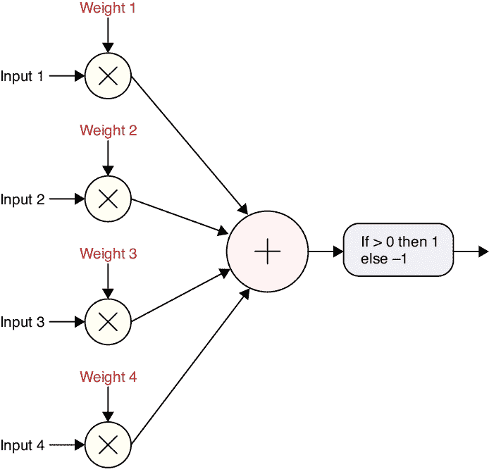

图 13-2：一个四输入感知器

每个输入到感知器的数据都由一个浮动的浮点数表示。每个输入都会乘以一个对应的浮动浮点数，称为*权重*。这些乘积的结果都会加在一起。最后，我们将结果与一个阈值进行比较。如果求和结果大于 0，感知器输出 +1，否则输出 −1（在某些版本中，输出为 1 和 0，而不是 +1 和 −1）。

尽管感知器是一个大幅简化的真实神经元版本，但它已经证明是深度学习系统的一个出色构建块。

感知器的历史是机器学习文化中的一个有趣部分，我们来看看其中的几个关键事件；更完整的版本可以在线找到（Estebon 1997；Wikipedia 2020a）。

在感知器原理通过软件验证后，1958 年康奈尔大学建造了一个基于感知器的计算机。它是一个大小如冰箱的线圈板架，名为 Mark I Perceptron（Wikipedia 2020c）。该设备被设计用来处理图像，使用一个 400 个光电池的网格，能够以 20×20 像素的分辨率对图像进行数字化（当时还没有“*像素*”这个词）。施加在感知器每个输入上的权重是通过转动一个控制电气元件——电位计的旋钮来设置的。为了自动化学习过程，电动机被连接到电位计上，这样设备就可以通过自转旋钮调整权重，从而改变其计算，进而改变其输出。理论上保证，使用正确的数据，系统能够学习将两类不同的输入分开，这些输入能够通过一条直线来划分。

不幸的是，并不是很多有趣的问题涉及被一条直线分隔的数据集，而且将这一技术推广到更复杂的数据排列中也证明很困难。在几年的停滞不前之后，一本书证明了原始感知机技术在理论上存在局限性（Minsky 和 Papert 1969）。它显示出进展停滞并不是因为缺乏想象力，而是感知机结构中固有的理论限制。大多数有趣的问题，甚至一些非常简单的问题，都证明超出了感知机的解决能力。

这一结果似乎标志着许多人对感知机的看法的结束，并形成了一个流行的共识：感知机方法是一条死胡同。热情、兴趣和资金都枯竭，大多数人将他们的研究方向转向了其他问题。这个时期大约从 1970 年代到 1990 年代，被称为*人工智能寒冬*。

尽管普遍的解释认为感知机的书籍已经为感知机的研究关上了大门，但事实上，它只显示了到那时为止感知机使用的局限性。有些人认为放弃整个想法是过度反应，或许通过不同的方式应用感知机仍然可以是一种有用的工具。这一观点最终在十几年后结出了果实，当时研究人员将感知机组合成更大的结构，并展示了如何训练它们（Rumelhart, Hinton, 和 Williams 1986）。这些组合轻松超越了任何单一单元的局限性。随后一系列论文显示，通过精心安排多个感知机，并增加一些小的改动，可以解决复杂且有趣的问题。

这一发现重新激发了人们对该领域的兴趣，很快感知机的研究再次成为热门话题，产生了一系列有趣的成果，这些成果最终发展成我们今天使用的深度学习系统。感知机仍然是许多现代深度学习系统的核心组成部分。

### 现代人工神经元

我们在现代神经网络中使用的神经元仅在原始感知机的基础上稍作了推广。这里有两个变化：一个发生在输入端，另一个发生在输出端。这些修改后的结构仍然有时被称为感知机，但通常不会产生混淆，因为新的版本几乎专门使用。更常见的是，它们被称为*神经元*。让我们来看看这两个变化。

对图 13-2 中感知机的第一个改动是为每个神经元提供一个额外的输入，我们称之为*偏置*。这是一个不来自前一个神经元输出的数值。相反，它是直接加到所有加权输入总和中的数值。每个神经元都有自己的偏置。图 13-3 展示了我们原始的感知机，但包括了偏置项。

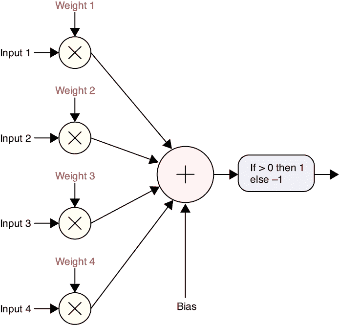

图 13-3：图 13-2 中的感知器，但现在加入了偏置项。

我们对图 13-2 中的感知器进行了第二次修改，修改发生在输出部分。该图中的感知器将总和与阈值 0 进行比较，然后输出−1 或 1（或 0 或 1）。我们通过用一个数学函数替换测试步骤来进行概括，该函数将总和（包括偏置）作为输入，并返回一个新的浮动点值作为输出。由于真实神经元的输出被称为其*激活*，因此我们将这个计算人工神经元输出的函数称为*激活函数*。在图 13-2 中显示的小测试是一个激活函数，但现在已经很少使用了。稍后在本章中，我们将回顾一些在实践中证明既受欢迎又实用的激活函数。

## 绘制神经元

让我们定义一个大多数人工神经元图示所使用的约定。在图 13-3 中，我们显式地显示了权重，并且还包括了乘法步骤，以展示权重是如何乘以输入的。这在页面上占据了大量空间。当我们绘制包含大量神经元的图时，所有这些细节会使得图形显得拥挤和密集。因此，在几乎所有的神经网络图示中，权重及其乘法步骤都是隐含的。

这一点非常重要，需要重复强调：在神经网络图示中，权重及其乘法步骤不会被绘制出来。相反，我们应该知道它们存在并在心里将其包含在图示中。如果我们显示权重，通常会标注从输入到权重的线。图 13-4 展示了图 13-3 这种风格的绘制方式。

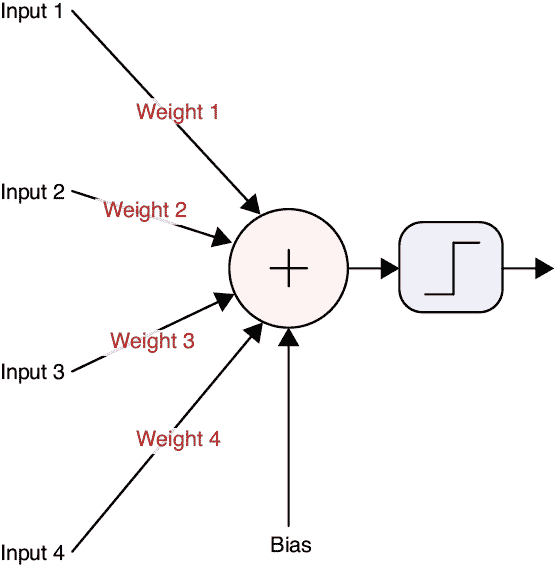

图 13-4：神经元通常会在箭头上标出权重。

在图 13-4 中，我们还将末尾的阈值测试改为一个小图形。这是一个名为*阶跃*的函数的图示，目的是给我们一个视觉提示，任何激活函数都可以放在这个位置。基本上，一个数字进入这个阶跃，新的数字输出，具体由我们为此任务选择的函数决定。

我们通常会再次简化问题。这一次，我们通过假装偏置是其中一个输入来省略它。这不仅使得图示更简洁，同时也让数学更简单，而在这种情况下，也能导致更高效的算法。这个简化方法被称为*偏置技巧*（"技巧"这个词来源于数学，通常用于形容一些巧妙的简化问题的方法）。我们并不改变偏置的值，而是将偏置的值固定为 1，并在与其他输入求和之前，改变应用到它的权重。图 13-5 展示了这一标签的变化。虽然偏置项的值始终为 1，且只有它的权重会发生变化，但我们通常忽略这一区分，仅讨论偏置的值。

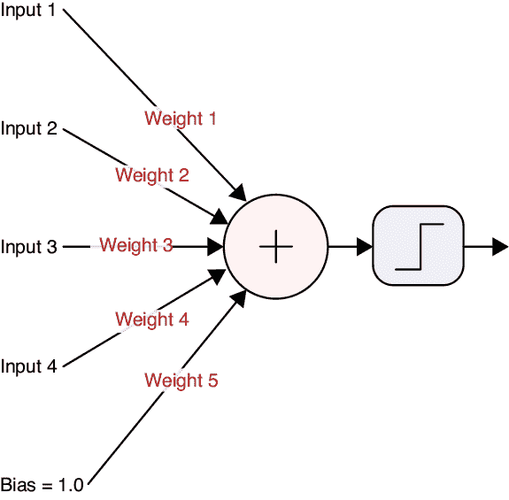

图 13-5：偏置技巧的实际应用。与图 13-4 中显式显示偏置项不同，我们假装偏置是另一个输入，并为其赋予自己的权重。

我们希望我们的人工神经元图示尽可能简洁，因为当我们开始构建网络时，我们会同时展示大量的神经元，因此大多数图示都会进行两个额外的简化步骤。首先，它们完全不显示偏置。我们应该记得偏置是包含在内的（以及它的权重），但它不会显示出来。其次，权重通常也会被省略，就像在图 13-6 中那样。这有点遗憾，因为权重是我们在神经元中最重要的部分。之所以如此，是因为它们是我们在训练过程中唯一能够改变的部分。尽管在大多数图示中没有显示出来，但它们非常关键，我们再次强调这一核心观点：*即使我们没有显式地显示权重，权重始终存在。*

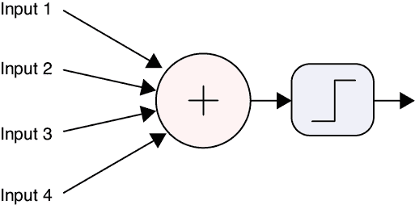

图 13-6：典型的人工神经元图示。虽然偏置项和权重未显示，但它们显然是存在的。

像真实神经元一样，人工神经元可以被连接成网络，其中每个输入来自另一个神经元的输出。当我们将神经元连接成网络时，我们画上“连接线”将一个神经元的输出连接到一个或多个其他神经元的输入。图 13-7 直观地展示了这一概念。

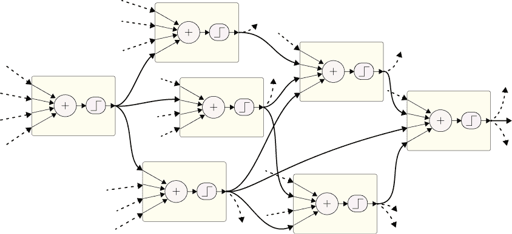

图 13-7：一个更大人工神经元网络的一部分。每个神经元的输入来自其他神经元的输出。虚线表示与该小群体之外的连接。

这就是*神经网络*。通常，像图 13-7 这样的网络的目标是产生一个或多个输出值。稍后我们将看到如何以有意义的方式解读输出的数字。

即使我们已经说过通常不绘制权重，但在讨论中，有时提到单个权重是有用的。让我们来看一下一个常见的权重命名约定。图 13-8 显示了六个神经元。为了方便，我们用字母标记了每个神经元。每个权重对应的是一个特定神经元的输出在传递到另一个神经元时的变化。图中每一条连接线表示这种联系。为了命名一个权重，我们将输出神经元的名字和输入神经元的名字组合起来。例如，乘以 A 的输出并由 D 使用的权重叫做 AD。

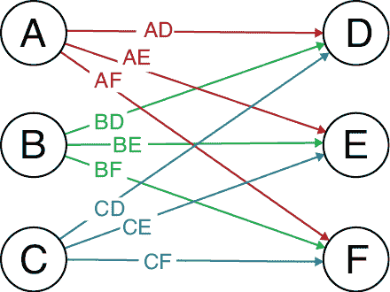

图 13-8：权重是通过组合输出神经元和输入神经元的名称来命名的。

从结构的角度来看，无论我们将权重绘制在每个神经元内部，还是绘制在传递值到神经元的电线之上，其实并没有区别。如果为了便于讨论，某些作者可能会选择其中一种方式，但如果需要，我们也可以选择另一种视角。

在图 13-8 中，我们将从神经元 A 到神经元 D 的权重命名为 AD。有些作者会将其反过来写成 DA，因为这种方式更直接地对应我们通常写方程的方式。在查看类似的图示时，花一点时间确认使用的顺序总是值得的。

## 前馈网络

图 13-7 展示了一个没有明显结构的神经网络。深度学习的一个关键特点是我们将神经元排列成*层*。通常，每一层的神经元仅从上一层获取输入，并且只将输出传递给下一层，且神经元之间不与同一层的其他神经元进行通信（当然，像往常一样，这些规则也有例外）。

这种组织方式允许我们分阶段地处理数据，每一层的神经元都基于前一阶段完成的工作来进行处理。通过类比，可以考虑一栋有多层的办公楼。任何一层的人只会从楼下那一层的人那里获得工作，并且只将工作交给楼上那一层的人。在这个类比中，每一层就是一个层级，楼层上的人就是该层的神经元。

我们说这种类型的结构处理数据是*分层的*。有一些证据表明，人类大脑在处理某些任务时是分层组织的，包括处理感官数据如视觉和听觉（Meunier 等，2009；Serre，2014）。但在这里，我们的计算机模型和真实生物学的关系更多的是灵感上的借鉴，而不是模仿。

很难相信，将神经元连接成一系列层次能够产生有用的东西。正如我们之前看到的，一个单一的人工神经元几乎做不了什么。它接受一堆数字输入，对其加权，求和，然后通过一个小函数传递结果。这个过程能够识别出一条将几堆数据分开的直线，仅此而已。但如果我们将成千上万的这些小单元组合成层，并使用一些巧妙的想法来训练它们，那么它们在一起工作时就能识别语音、识别人脸，甚至在逻辑和技能游戏中击败人类。

关键在于组织。随着时间的推移，人们开发了多种方式来组织神经元的层级，形成了常见的层次结构。最常见的网络结构将神经元排列成仅允许信息朝一个方向流动的方式。我们称这种结构为*前馈网络*，因为数据是向前流动的，较早的神经元将值传递给较晚的神经元。设计深度学习系统的艺术在于选择合适的层级顺序和超参数，以构建基本架构。为了为任何给定的应用构建一个有用的架构，我们需要理解神经元之间是如何相互关联的。接下来，让我们看看神经元集合是如何进行通信的，以及如何在学习开始之前设置初始权重。

## 神经网络图

我们通常将神经网络表示为*图*。图的研究非常广泛，以至于它被认为是一个独立的数学领域，叫做*图论*（Trudeau 1994）。在这里，我们将坚持图的基本概念，因为这就是我们组织神经网络所需的全部内容。尽管我们知道通常会处理层级，但让我们先从一些一般性的图开始，例如在图 13-9 中所示的那些。

一个图由*节点*（也叫*顶点*或*元素*）组成，这里用圆圈表示。在本书中，节点通常是神经元，并且在整本书中，我们偶尔会将像这样的网络中的一个或多个神经元称为节点。节点之间通过箭头连接，箭头被称为*边*（也叫*弧*、*电缆*，或者简单地叫*线*）。当图中的信息流方向一致时，箭头的箭头头通常省略，这通常是从左到右或从下到上的方向。信息沿着边缘流动，将一个节点的输出传递给其他节点的输入。由于每条边上的信息流动仅有一个方向，我们有时将这种图称为*有向图*。

一般来说，我们是通过将数据放入输入节点或节点群开始的，然后它通过边缘流动，访问那些在其中被转换或改变的节点，直到它到达输出节点或节点群。一旦数据离开一个节点，就再也不会返回到那个节点。换句话说，信息只会向前流动，并且没有环路或*循环*。这种图形就像一个小工厂。原材料从一端进入，经过机器的处理和组合，最终在另一端产生一个或多个成品。

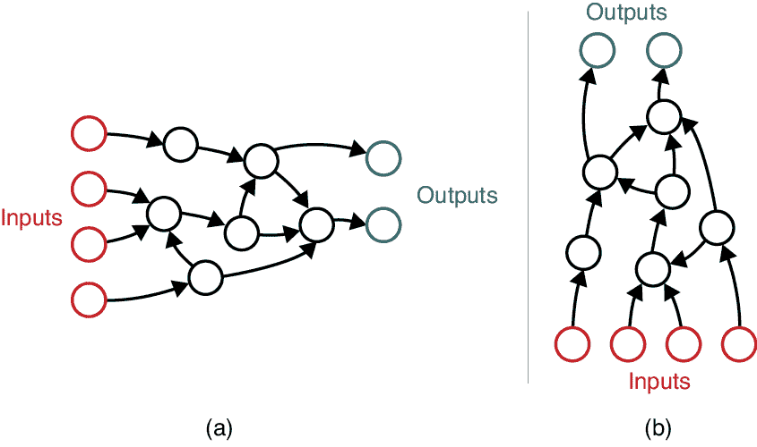

图 13-9：两个作为图形绘制的神经网络。数据沿着边缘从节点流向节点，跟随箭头。当边缘没有标注箭头时，数据通常是从左到右或从下到上流动的。（a）主要是从左到右的流动。（b）主要是从下到上的流动。

我们说在图 13-9(a)中，靠近输入的节点是*在*靠近输出的节点之前的，后者在它之后。在图 13-9(b)中，我们会说，靠近输入的节点是*在*靠近输出的节点*下方*，后者*在*它的上方。有时即使图形是从左到右绘制的，这种下/上的说法也会使用，这可能会造成困惑。可以将*下方*理解为“离输入更近”，*上方*理解为“离输出更近”。

我们有时也会说，如果数据从一个节点流向另一个节点（假设它从 A 流向 B），那么节点 A 是 B 的*祖先*或*父节点*，而节点 B 是 A 的*后代*或*子节点*。

神经网络中的一个常见规则是没有环路。这意味着从一个节点出来的数据永远不能回到该节点，无论它走的路径有多么曲折。此类图形的正式名称是*有向无环图*（或*DAG*，发音与“drag”押韵）。这里的*有向*意味着边缘有箭头（如我们之前提到的，箭头可能只是隐含的）。*无环*意味着没有*循环*或环路。像往常一样，规则也有例外，但它们很少见。当我们在第十九章讨论循环神经网络（RNNs）时，我们将看到一个这样的例外。

DAG 在许多领域都很受欢迎，包括机器学习，因为它们比包含环路的任意图形更容易理解、分析和设计。包括环路可能会引入*反馈*，即一个节点的输出被返回到它的输入。任何将活麦克风移得太靠近扬声器的人都知道反馈如何迅速失控。DAG 的无环特性自然避免了反馈问题，这让我们避免了处理这个复杂问题。

回想一下，数据仅从输入流向输出的图或网络被称为 *前馈*。在第十四章中，我们将看到训练神经网络的关键步骤之一是暂时反转箭头，将一种特定类型的信息从输出节点传回输入节点。尽管数据的正常流动仍然是前馈的，但当我们将数据反向推送时，通常我们称其为 *反馈*、*反向流动* 或 *反向前馈* 算法。我们将“反馈”这个词保留给图中的环路，环路可以使一个节点将其自身的输出作为输入。正如我们所说的，我们通常避免在神经网络中使用反馈。

解读像图 13-9 中的图表通常意味着想象信息沿着边缘流动，从一个节点流向下一个节点。但这个图像只有在我们做出一些常规假设的前提下才有意义。现在让我们来看看这些假设。

尽管我们在描述数据如何在图中流动时经常使用“流动”这个词的各种形式，但这与水流通过管道不同。水流通过管道是一个 *连续* 的过程：水分子在每一时刻都会通过管道流动。我们所使用的图（以及它们代表的神经网络）是 *离散* 的：信息是逐块到达的，就像文本消息一样。

回想一下图 13-5，我们可以通过在每条边上放置一个权重（而不是在神经元内部）来绘制神经网络。我们将这种风格的网络称为 *加权图*。正如我们在图 13-6 中看到的，我们很少显式地绘制权重，但它们是隐含的。无论如何，在任何神经网络图中，即使没有显式显示权重，我们也应该理解，每条边上都有一个唯一的权重，并且当一个值沿着这条边从一个神经元传到另一个神经元时，该值会被权重乘以。

## 初始化权重

教授神经网络涉及逐步改进权重。这个过程从我们为权重分配初始值开始。我们应该如何选择这些起始值？事实证明，在实践中，初始化权重的方式可能会对我们网络学习的速度产生很大的影响。

研究人员已经开发出了一些理论，提出了选择权重初始值的有效方法，且已被证明最有用的各种算法都以描述这些算法的论文中主要作者的名字命名。*LeCun Uniform*、*Glorot Uniform*（或 *Xavier Uniform*）和 *He Uniform* 算法都是基于从均匀分布中选择初始值（LeCun 等，1998；Glorot 和 Bengio，2010；He 等，2015）。可能并不令人惊讶的是，命名相似的 *LeCun Normal*、*Glorot Normal*（或 *Xavier Normal*）和 *He Normal* 初始化方法则是从正态分布中选择它们的值。

我们不需要深入了解这些算法背后的数学原理。幸运的是，现代深度学习库提供了这些方案及其变种。通常，库默认使用的技术已经很好地工作，因此我们很少需要显式地选择如何初始化权重。

## 深度网络

在组织神经元的多种方式中，将它们放置在一系列层中已被证明既灵活又极具威力。通常，一个层内的神经元彼此之间不直接连接。它们的输入来自前一层，输出则传递给下一层。

实际上，*深度学习*这个术语正来源于这种结构。如果我们将许多层并排绘制，我们可能会称这个网络为“宽”。如果它们是垂直排列的，而我们站在底部向上看，我们可能会称之为“高”。如果我们站在顶部往下看，我们可能会称之为“深”。这就是*深度学习*的全部含义：一个由一系列层构成的网络，我们通常会将其垂直绘制。

将神经元按层组织的结果是，我们可以分层次地分析数据。早期的层处理原始输入数据，而每个后续的层能够利用前一层神经元的信息来处理更大块的数据。例如，考虑一张照片，第一层通常查看单个像素。下一层查看像素的组合，再下一层查看那些组合的组合，依此类推。早期的层可能会注意到某些像素比其他像素更暗，而后来的层可能会注意到一簇像素像一个眼睛，甚至更远的层可能会注意到形状的集合，从而揭示整个图像展示了一只老虎。

图 13-10 展示了一个使用三层的深度学习架构示例。

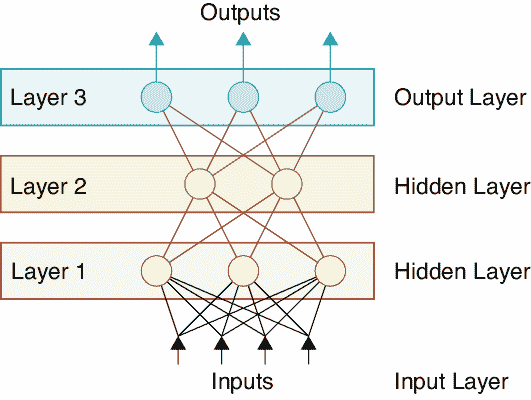

图 13-10：深度学习网络

当我们将层垂直绘制时，如同在图 13-10 中那样，输入几乎总是绘制在底部，而我们收集结果的输出则几乎总是绘制在顶部。

在图 13-10 中，所有三个层都包含神经元。在实际系统中，我们通常会使用许多其他类型的层，通常将这些层归类为*支撑层*。在后续章节中，我们将看到许多这样的层。当我们计算一个网络中的层数时，通常不会计算这些支撑层。图 13-10 会被描述为一个由三层构成的深度网络。

最顶层包含神经元的层（在图 13-10 中的第 3 层）被称为*输出层*。

我们可能会认为图 13-10 中的第 1 层应该被称为*输入层*，但事实并非如此。在术语上的一个小巧妙用法中，*输入层*是指网络的底部，即图 13-10 中标为“输入”的部分。在这个“层”中并没有进行任何处理。它只是存放输入值的内存。输入层是一个支持层的例子，因为它没有神经元，因此在计算网络层数时不会被包括在内。我们计算的层数被称为网络的*深度*。

如果我们想象站在图 13-10 的顶部往下看，我们只能看到输出层。如果我们想象站在底部往上看，我们只能看到输入层。介于两者之间的层对我们来说是不可见的。每一层输入和输出之间的层被称为*隐藏层*。

有时堆叠图是从左到右绘制的，如图 13-11 所示。

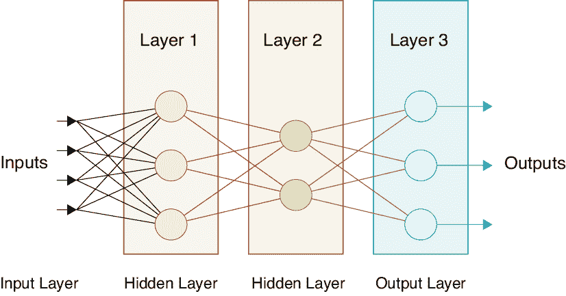

图 13-11：图 13-10 的相同深度网络，但数据从左到右流动。

即使以这种方式绘制，我们仍然使用指代垂直方向的术语。作者可能会说第二层“在”第一层“上方”，而且“在”第三层“下方”。无论图示如何绘制，只要我们将“上方”或“更高”理解为接近输出层的层，将“下方”或“更低”理解为接近输入层的层，我们总能保持清晰。

## 全连接层

*全连接层*（也称为*FC*、*线性层*或*密集层*）是一组神经元，每个神经元都接收来自上一层*每个*神经元的输入。例如，如果在一个密集层中有三个神经元，而前一层有四个神经元，那么密集层中的每个神经元都有四个输入，每个来自前一层的神经元，总共有 3 × 4 = 12 个连接，每个连接都有一个相关的权重。

图 13-12(a)展示了一个有三个神经元的全连接层图示，它位于一个有四个神经元的层之后。

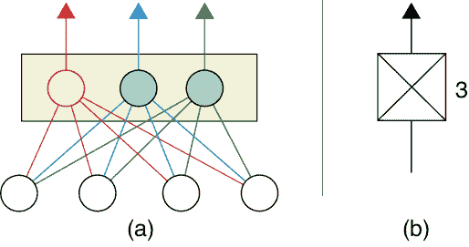

图 13-12：全连接层。(a) 彩色神经元组成了全连接层。这一层中的每个神经元都接收来自前一层每个神经元的输入。(b) 我们为全连接层设计的简化符号。

图 13-12(b)展示了我们将用于全连接层的简化符号。这个符号的思想是，两个神经元位于符号的顶部和底部，垂直和对角线表示它们之间的四个连接。在符号旁边，我们标识出该层中有多少个神经元，就像这里的数字 3 一样。当它与层的激活函数相关时，我们也会在这里标识。如果一个层只由密集层组成，它有时被称为*全连接网络*，或者回溯到早期的术语，称为*多层感知机*（*MLP*）。

在后面的章节中，我们将看到许多其他类型的层，它们帮助我们以有用的方式组织神经元。例如，*卷积层*和*池化层*已被证明对于图像处理任务非常有用，我们将给予它们很多关注。

## 张量

我们已经看到，深度学习系统是由一系列层构成的。尽管任何神经元的输出是一个单一的数字，但我们通常想要一次性讨论整个层的输出。表征这一组输出数字的关键概念是其形状。让我们看看这意味着什么。

如果某一层包含一个神经元，那么该层的输出就是一个单一的数字。我们可以将其描述为一个包含一个元素的数组或列表。从数学上讲，我们可以称其为*零维数组*。数组的维度数量告诉我们需要多少个索引来识别一个元素。由于单个数字不需要索引，因此该数组是零维的。

如果该层有多个神经元，那么我们可以将它们的集合输出描述为一个包含所有值的列表。由于我们需要一个索引来识别该列表中特定的输出值，因此这是一个一维（1D）数组。图 13-13(a)展示了包含 12 个元素的这种数组。

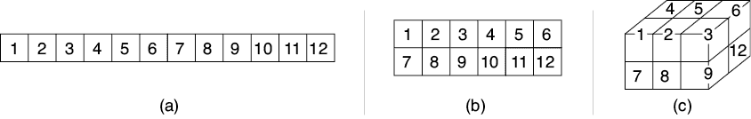

图 13-13：三个张量，每个包含 12 个元素。(a) 一维张量是一个列表。(b) 二维张量是一个网格。(c) 三维张量是一个体积。在所有情况下，以及更高维度的情况中，都没有空洞，元素也没有突出于块之外。

我们经常将数据组织成其他类似盒子的形状。例如，如果系统的输入是黑白图像，它可以表示为二维数组，如图 13-13(b)所示，按 x 和 y 位置进行索引。如果是彩色图像，则可以表示为三维数组，按 x 位置、y 位置和颜色通道进行索引。图 13-13(c)展示了一个三维形状。

我们经常将一维形状称为*数组*、*列表*或*向量*。要描述二维形状，我们通常使用*网格*或*矩阵*这两个术语，而我们可以将三维形状描述为*体积*或*块*。我们经常使用更高维的数组。为了避免创建大量新的术语，我们使用一个术语来表示任何以盒子形状排列的、具有任意维度的数字集合：*张量*（发音：ten′-sir）。

张量只是一个具有给定维度和每个维度大小的数字块。它没有空洞，也没有部分突出。*张量*这个术语在某些数学和物理学领域有更复杂的含义，但在机器学习中，我们用这个词来表示一个组织成多维块的数字集合。综合来看，维度的数量和每个维度的大小提供了张量的*形状*。

我们通常称网络的*输入张量*（指所有输入值）和*输出张量*（指所有输出值）。内部（或隐藏）层的输出没有特定名称，因此我们通常会说类似“第 3 层产生的张量”来指代从第 3 层神经元输出的多维数组。

## 防止网络坍缩

之前我们承诺要回到激活函数的问题。现在让我们来看一下它们。

每个激活函数，尽管是整体结构中的一个小部分，但对于成功的神经网络至关重要。如果没有激活函数，网络中的神经元会结合或*坍缩*成一个等效的单一神经元。正如我们之前看到的，一个神经元的计算能力非常有限。

让我们来看一下没有激活函数的网络是如何坍缩的。图 13-14 展示了一个包含两个输入（A 和 B）和五个神经元（E 到 G）的简单网络，共三层。每个神经元接收来自前一层每个神经元的输入，每个连接都有一个权重，总共有十个权重，如红色所示。

图 13-14：一个包含两个输入、五个神经元和十个权重的小网络

假设暂时这些神经元没有激活函数。那么我们可以将每个神经元的输出写成其输入的加权和，如图 13-15 所示。在这个图中，我们采用了数学惯例，在可能的情况下省略乘号，因此 2A 代表 2 × A。

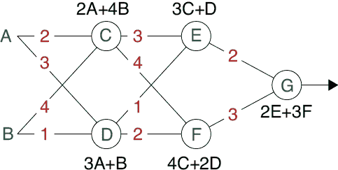

图 13-15：每个神经元都标出了其输出的值。

C 和 D 的输出仅依赖于 A 和 B。同样，E 和 F 的输出仅依赖于 C 和 D 的输出，这意味着它们最终也仅依赖于 A 和 B。G 的情况也是如此。如果我们从 G 的表达式开始，代入 E 和 F 的值，再代入 C 和 D 的值，我们得到一个关于 A 和 B 的大表达式。经过简化后，我们发现 G 的输出是 78A + 86B。我们可以将其写成一个带有两个新权重的单一神经元，如图 13-16 所示。

G 在图 13-16 中的输出与 G 在图 13-14 中的输出完全相同。我们的整个网络已经坍缩成了一个单一的神经元！

无论我们的神经网络多么庞大或复杂，如果它没有激活函数，那么它始终等同于一个单一的神经元。如果我们希望网络能做的事情超过一个神经元的能力，这可不是好消息。

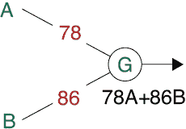

图 13-16：该网络的输出与图 13-14 中的输出完全相同。

在数学语言中，我们说我们的全连接网络崩溃了，因为它只使用了加法和乘法，这些操作属于*线性函数*。线性函数可以像我们刚才看到的那样组合，但*非线性函数*从根本上不同，并且不会以这种方式组合。通过设计激活函数使用*非线性*操作，我们可以防止这种崩溃。我们有时将激活函数称为*非线性*。

激活函数有很多不同的类型，每种函数都会产生不同的结果。一般来说，这种多样性存在是因为在某些情况下，一些函数可能会遇到数值问题，使得训练速度变慢，甚至完全停止。如果发生这种情况，我们可以替换成一种避免这个问题的激活函数（当然，这种替代函数也有自己的弱点）。

实际上，我们通常只使用少数几种激活函数。当阅读文献并查看其他人的网络时，我们有时会看到一些较少见的激活函数。让我们先调查一下大多数主要库通常提供的函数，然后汇集最常用的函数。

## 激活函数

*激活函数*（有时也叫做*传递函数*，或*非线性*）接受一个浮动点数作为输入，并返回一个新的浮动点数作为输出。我们可以通过画图来定义这些函数，而不需要任何方程或代码。横坐标（X 轴）是输入值，纵坐标（Y 轴）是输出值。要找到任意输入的输出，我们只需要沿 X 轴找到输入位置，然后直接向上移动，直到碰到曲线。那就是输出值。

理论上，我们可以为网络中的每个神经元应用不同的激活函数，但实际上，我们通常会为每一层中的所有神经元分配相同的激活函数。

### 直线函数

让我们首先看看由一条或多条直线组成的激活函数。图 13-17 展示了一些仅由直线组成的“曲线”。

我们来看一下图 13-17 中的最左边的例子。如果我们在 X 轴上选择任何一点，并垂直向上直到碰到这条线，那么该交点在 Y 轴上的值与 X 轴上的值相同。这个曲线的输出值，或 y 值，总是与输入值，或 x 值相同。我们称之为*恒等函数*。

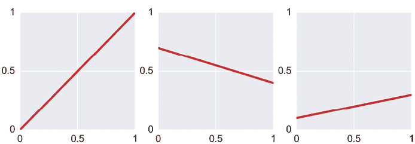

图 13-17：直线函数。最左边的函数叫做恒等函数。

图 13-17 中的其他曲线也是直线，但它们的斜率不同。我们称任何仅由一条直线组成的曲线为*线性函数*，或者更稍微令人困惑的是，称其为*线性曲线*。

这些激活函数并不会阻止网络崩溃。当激活函数是一条直线时，数学上它只是做了乘法和加法，这意味着它是一个线性函数，网络就会崩溃。这些直线激活函数通常只会出现在两种特定的情况下。

第一个应用是在网络的输出神经元上。由于输出后没有神经元，因此不存在崩溃的风险。图 13-18 的顶部展示了这个思想。

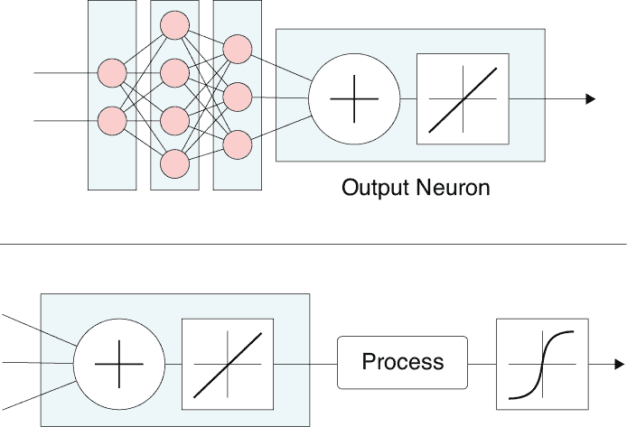

图 13-18：使用恒等函数作为激活函数。顶部：输出神经元上的恒等函数。底部：使用恒等函数在求和步骤和非线性激活函数之间插入一个处理步骤。

使用直线激活函数的第二种情况是，当我们想在神经元的求和步骤和其激活函数之间插入一些处理时。在这种情况下，我们对神经元应用恒等函数，执行处理步骤，然后再执行非线性激活函数，正如图 13-18 底部所示。

由于我们通常希望使用非线性激活函数，因此我们需要摆脱单一的直线。以下所有的激活函数都是非线性的，并能防止网络崩溃。

### 阶梯函数

我们不想要一条直线，但也不能随便选任何曲线。我们的曲线需要是单值的。正如我们在第五章讨论的那样，这意味着如果我们从 X 轴上的任何一个 x 值向上看，那么上方只有一个 y 值。线性函数的一个简单变种是从一条直线开始，然后将其分成几段。它们甚至不需要连接。在第五章的语言中，这意味着它们不需要是连续的。

图 13-19 展示了这种方法的一个例子。我们称之为*阶梯函数*。在这个例子中，如果输入值从 0 到不到 0.2，它的输出值为 0；如果输入值从 0.2 到不到 0.4，输出值则为 0.2，以此类推。这些突变并不违反我们的规则，即每个输入 x 值对应一个 y 输出值。

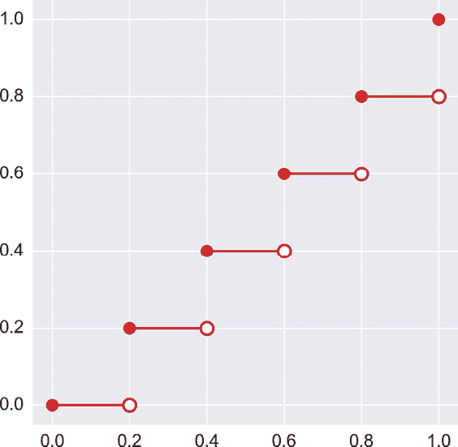

图 13-19：这条曲线由多条直线组成。实心圆告诉我们该点的 y 值是有效的，而空心圆则表示该点没有曲线。

最简单的阶梯函数只有一个步骤。这是一个常见的特例，因此它有了自己的名称：*阶跃函数*。图 13-2 中的原始感知器使用阶跃函数作为其激活函数。阶跃函数通常画成图 13-20(a)的样子。它在某个*阈值*之前有一个值，之后则有另一个值。

不同的人对输入恰好等于阈值时的情况有不同的偏好。在图 13-20(a)中，我们展示了阈值处的值是阶跃右侧的值，如实心点所示。

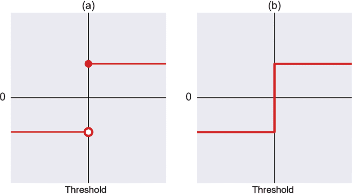

图 13-20：阶跃函数有两个固定值，分别位于阈值 x 的左右两侧。

作者们通常对输入值恰好处于过渡区时的情况比较随意，并且绘制如图 13-20(b)所示的图形，强调函数的“阶跃”性质。这是一种模糊的画法，因为我们不知道当输入恰好处于阈值时所使用的值是什么，但这是一种常见的绘图方式（通常我们不在乎阈值处使用的是哪个值，所以可以选择我们喜欢的任何值）。

一些流行的步骤函数版本有各自的名称。*单位阶跃*在阈值左侧的值为 0，右侧的值为 1。图 13-21 展示了这个函数。

如果单位阶跃的阈值为 0，我们称之为更具体的名称 *Heaviside 步骤函数*，如图 13-21 所示。

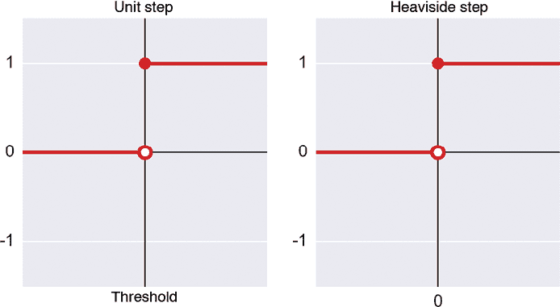

图 13-21：左：单位阶跃函数在阈值左侧的值为 0，右侧的值为 1。右：Heaviside 步骤函数是一种单位阶跃函数，其阈值为 0。

最后，如果我们有一个 Heaviside 步骤函数（即阈值为 0），但是左侧的值是 −1 而不是 0，我们将其称为*符号函数*，如图 13-22 所示。符号函数的一个常见变体是当输入值恰好为 0 时，输出值也为 0。两种变体通常都被称为“符号函数”，因此，当差异重要时，值得留意以确认指的是哪一种。

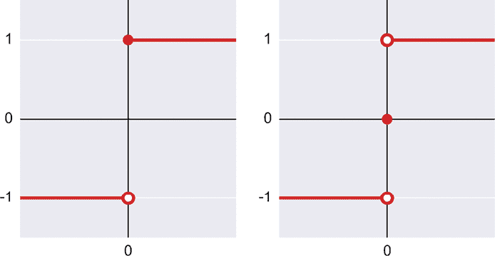

图 13-22：符号函数的两种版本。左：小于 0 的值输出 −1，其他值输出 1。右：与左图相同，唯一不同的是输入值恰好为 0 时，输出值为 0。

### 分段线性函数

如果一个函数由多个部分组成，每部分都是一条直线，那么我们称之为 *分段线性*。只要这些部分加在一起不形成一条直线，它仍然是一个非线性函数。

可能最流行的激活函数是一种分段线性函数，称为*整流器*，或*整流线性单元*，缩写为 *ReLU*（请注意，字母 e 是小写的）。这个名字来自于一种叫做整流器的电子元件，它可以防止负电压从电路的一部分传递到另一部分（Kuphaldt 2017）。当电压变为负值时，物理整流器将其限制为 0，我们的整流线性单元对输入的数字执行相同的操作。

ReLU 的图形如图 13-23 所示。它由两条直线组成，但由于有了折点或弯曲，这并不是一个线性函数。如果输入小于 0，则输出为 0。否则，输出与输入相同。

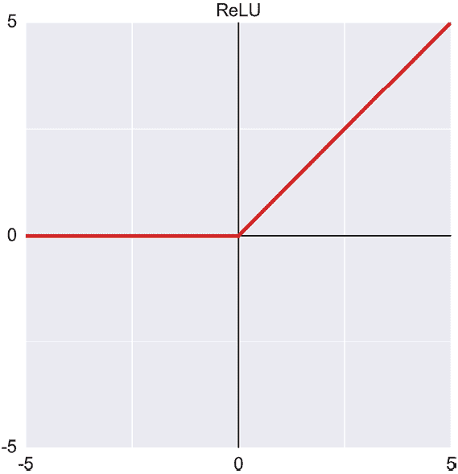

图 13-23：ReLU，或称整流线性单元。它对所有负输入输出 0，其他情况输出与输入相同。

ReLU 激活函数之所以受欢迎，是因为它是将非线性引入人工神经元末端的一种简单而快速的方式。但也存在潜在的问题。正如我们在第十四章中将看到的那样，如果输入的变化没有导致输出的变化，网络就会停止学习。而且 ReLU 对于每个负值的输出都是 0。如果我们的输入从比如 –3 变化到 –2，那么 ReLU 的输出仍然是 0。解决这个问题促使了后续 ReLU 变体的开发。

尽管存在这个问题，ReLU（或者接下来我们会看到的泄漏 ReLU）在实践中通常表现良好，而且人们在构建新网络时通常将其作为默认选择，特别是在全连接层中。除了这些激活函数在实践中表现良好的事实外，还有很好的数学理由希望使用 ReLU（Limmer 和 Stanczak 2017），尽管我们在这里不会深入探讨。

*泄漏 ReLU* 改变了对负值的响应。它不会对任何负值输出 0，而是输出输入值，按 10 倍缩小。图 13-24 显示了该函数。

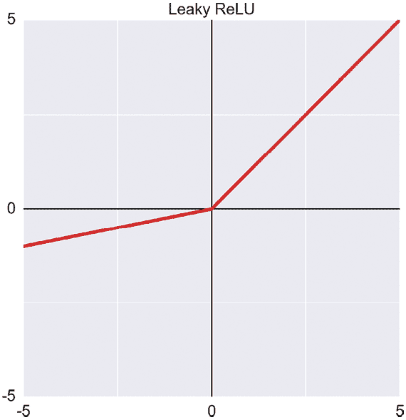

图 13-24：泄漏 ReLU 类似于 ReLU，但当 x 为负时，它会返回一个缩小的 x 值。

当然，没必要总是将负值缩小 10 倍。*参数化 ReLU* 允许我们选择负值缩放的比例，如图 13-25 所示。

使用参数化 ReLU 时，关键是永远不要选择 1.0 的比例，因为那样我们会失去“折点”，函数会变成直线，应用此函数的神经元会与其后立即跟随的神经元发生崩溃。

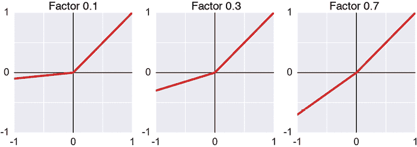

图 13-25：参数化 ReLU 类似于泄漏 ReLU，但可以指定对于小于 0 的 x 值的斜率。

基本 ReLU 的另一种变体是*偏移 ReLU*，它只是将弯点向下和向左移动。图 13-26 展示了一个示例。

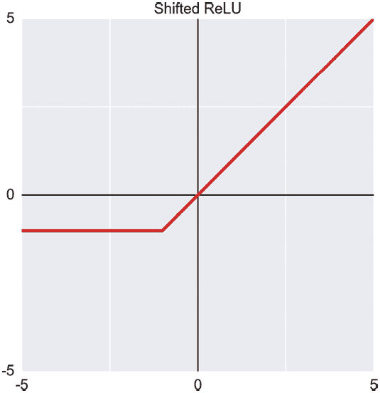

图 13-26：偏移 ReLU 将 ReLU 函数中的弯点向下和向左移动。

我们可以通过一种叫做*maxout*的激活函数（Goodfellow 等人 2013）来概括各种 ReLU 变体。Maxout 允许我们定义一组直线。在每个点，函数的输出是所有直线在该点的最大值。图 13-27 展示了只有两条线的 maxout，形成一个 ReLU，以及另外两个示例，它们使用更多的线条创建更复杂的形状。

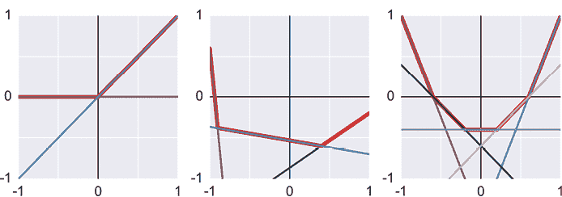

图 13-27：maxout 函数让我们能够通过多条直线构建函数。重的红线是 maxout 在每一组直线上的输出。

基本 ReLU 的另一种变体是在输入前加上一个小的随机值，然后再通过标准的 ReLU 进行处理。这个函数叫做*noisy ReLU*。

### 平滑函数

正如我们将在第十四章看到的，训练神经网络的一个关键步骤是计算神经元输出的导数，而这必然涉及到它们的激活函数。

我们在上一节看到的激活函数（除了线性函数）通过使用多条直线来创造它们的非线性特征，这些直线中至少有一条存在拐角。数学上，在一对直线之间的拐角处没有导数，因此该函数不是线性的。

如果这些拐角妨碍了导数的计算，而导数是训练神经网络所必需的，那么像 ReLU 这样的函数为什么还会有用，甚至如此流行呢？事实证明，标准的数学工具可以巧妙地处理像 ReLU 中的尖角这样的部分，并且仍然能够计算出导数（Oppenheim 和 Nawab 1996）。这些技巧并不是对所有函数都适用，但我们之前看到的函数的开发原则之一就是它们允许使用这些方法。

使用多条直线然后修补问题的替代方案是使用天生在每个地方都有导数的平滑函数。也就是说，它们在所有地方都是平滑的。让我们来看几个流行的平滑激活函数。

*softplus*函数仅仅是对 ReLU 进行了平滑处理，如图 13-28 所示。

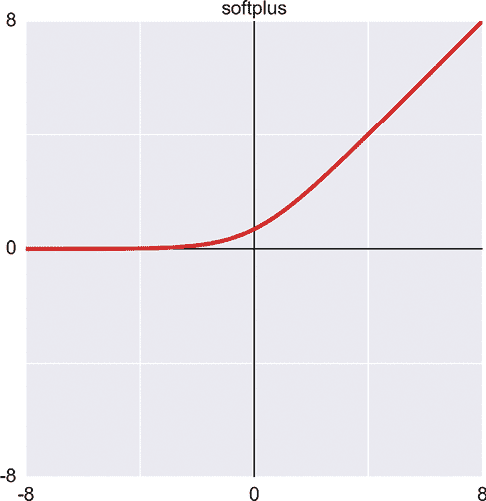

图 13-28：softplus 函数是 ReLU 的平滑版本。

我们也可以平滑化偏移的 ReLU。这被称为*指数型 ReLU*，或*ELU*（Clevert, Unterthiner, 和 Hochreiter 2016）。它在图 13-29 中展示。

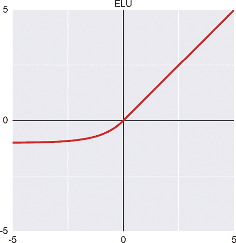

图 13-29：指数型 ReLU，或 ELU

平滑 ReLU 的另一种方法叫做*swish*（Ramachandran, Zoph, 和 Le 2017）。图 13-30 展示了它的样子。实际上，它是一个 ReLU，但在 0 点左侧有一个小的平滑波动，然后逐渐变平。

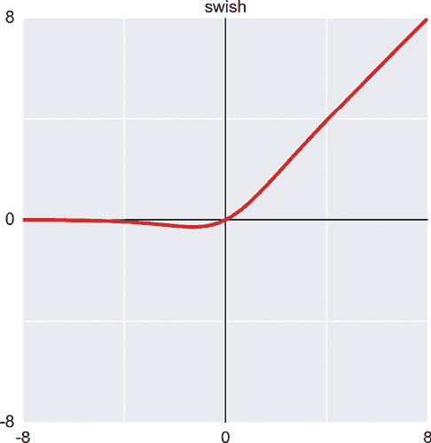

图 13-30：swish 激活函数

另一种流行的平滑激活函数是*sigmoid*，也称为*logistic 函数*或*logistic 曲线*。这是 Heaviside 阶跃函数的平滑版本。*sigmoid*这个名字来源于该曲线与 S 形状的相似，而其他名称则指代其数学解释。图 13-31 展示了这个函数。

与 Sigmoid 密切相关的另一个数学函数叫做*双曲正切*。它与 Sigmoid 非常相似，唯一的区别是负值被映射到−1，而不是 0。这个名字来自于它在三角学中的曲线起源。因为它名字较长，所以通常简写为*tanh*。这在图 13-32 中展示了出来。

我们说 Sigmoid 和 tanh 函数都会将它们的整个输入范围从负无穷到正无穷压缩到一个小范围的输出值。Sigmoid 将所有输入压缩到[0, 1]范围，而 tanh 将它们压缩到[−1, 1]。

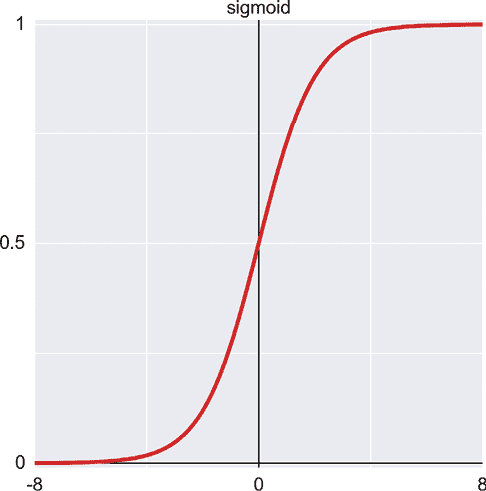

图 13-31：S 型 Sigmoid 函数也叫做逻辑函数或逻辑曲线。对于非常负的输入，它的值为 0，对于非常正的输入，它的值为 1。对于大约在−6 到 6 之间的输入，它平滑地在两者之间过渡。

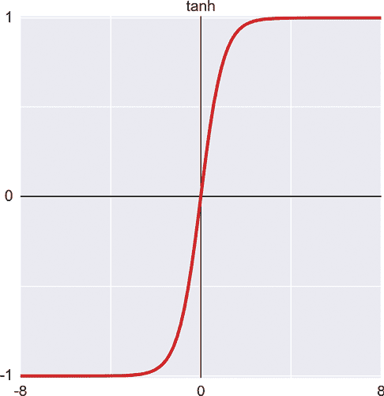

图 13-32：双曲正切函数，写作 tanh，像图 13-31 中的 Sigmoid 一样呈 S 形。主要的区别在于，它对非常负的输入返回−1，并且过渡区略微狭窄。

这两者在图 13-33 中并排显示。

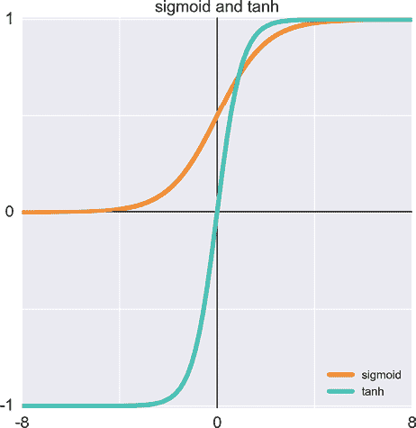

图 13-33：Sigmoid 函数（橙色）和 tanh 函数（青色），两者在范围−8 到 8 之间的图像。

另一个平滑的激活函数使用正弦波，如图 13-34 所示（Sitzmann 2020）。它像 tanh 一样将输出压缩到[–1, 1]范围，但对于远离 0 的输入，它不会饱和（或停止变化）。

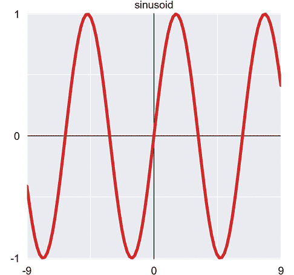

图 13-34：正弦波激活函数

### 激活函数画廊

图 13-35 总结了我们讨论过的激活函数。

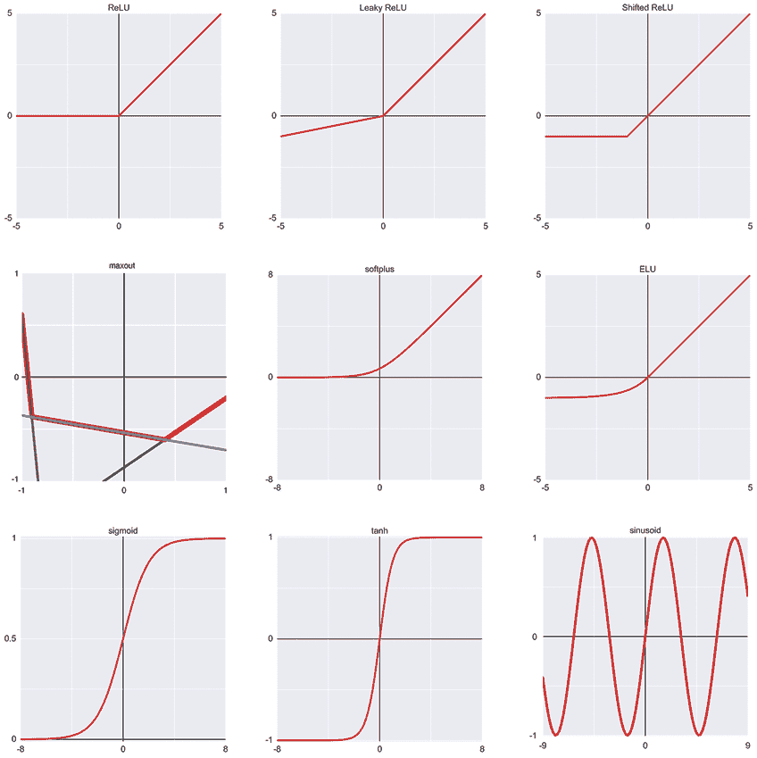

图 13-35：流行激活函数的画廊

### 比较激活函数

ReLU 曾是最流行的激活函数，但近年来，leaky ReLU 的受欢迎程度逐渐上升。这是实践的结果：使用 leaky ReLU 的网络通常学习得更快。

原因在于 ReLU 存在一个问题，我们之前提到过。当 ReLU 的输入为负时，它的输出为 0。如果输入是一个大的负数，那么即使改变它一个很小的量，输入仍然是负数，ReLU 的输出仍然是 0。这意味着导数也是 0。正如我们将在第十四章看到的，当一个神经元的导数为零时，不仅它自己停止学习，而且它前面的神经元也更有可能停止学习。因为一个输出永远不变化的神经元不再参与学习，所以我们有时会使用比较极端的说法，称这个神经元*死亡*。leaky ReLU 因其输出对于每一个负输入都不相同，导数不为 0，因此不会“死亡”，而且越来越受到欢迎。正弦波函数几乎在每个地方都有非零的导数（除了每个波的顶部和底部）。

在 ReLU 和 leaky ReLU 之后，sigmoid 和 tanh 可能是最受欢迎的函数。它们的吸引力在于它们平滑，且输出范围被限定在[0, 1]或[–1, 1]之间。经验表明，当网络中流动的所有值都处于有限范围时，网络的学习效率最高。

没有确凿的理论可以告诉我们在特定网络的特定层中，哪种激活函数最有效。我们通常从那些在其他类似网络中有效的选择开始，然后如果学习过程过于缓慢，我们会尝试替代方案。

一些经验法则为我们提供了许多情况下的良好起点。一般来说，我们通常对隐藏层的大多数神经元，特别是全连接层应用 ReLU 或 leaky ReLU。对于回归网络，我们通常对最后一层不使用激活函数（如果必须使用一个，我们使用线性激活函数，这等同于没有激活函数），因为我们关心的是特定的输出值。当我们进行二分类时，只有一个输出值。在这种情况下，我们通常会应用 sigmoid 函数，将输出清晰地推向某一类别。对于具有多个类别的分类网络，我们几乎总是使用一种略有不同的激活函数，我们接下来将讨论它。

## Softmax

有一种操作我们通常只应用于分类神经网络的输出神经元，而且即便如此，只有在输出神经元有两个或更多时才使用。它不是我们通常所说的激活函数，因为它同时接受*所有*输出神经元的输出作为输入。它将这些输出一起处理，然后为每个神经元生成一个新的输出值。尽管它不完全是一个激活函数，但它在概念上与激活函数非常相似，因此值得在此讨论中提及。

这个技术称为*softmax*。softmax 的目的是将分类网络输出的原始数字转化为类别概率。

需要注意的是，softmax 取代了我们通常会应用于这些输出神经元的任何激活函数。也就是说，我们不给它们应用激活函数（或者等效地，应用线性函数），然后将这些输出传递给 softmax。

这一过程的机制涉及网络如何计算其预测的数学原理，因此我们不会在这里深入探讨这些细节。一般来说，如图 13-36 所示：*分数*输入，*概率*输出。

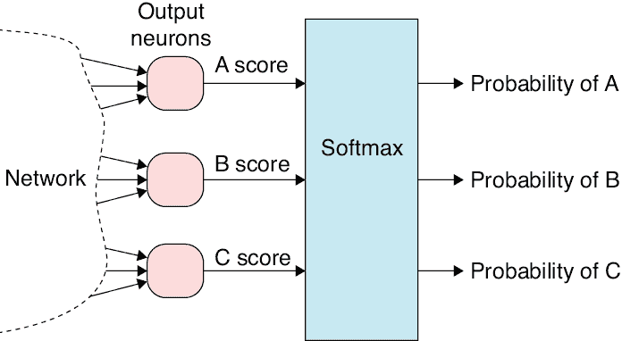

图 13-36：softmax 函数同时修改所有网络输出。结果是将分数转化为概率。

每个输出神经元呈现一个值或分数，表示网络认为输入属于该类别的程度。在图 13-36 中，我们假设数据中有三个类别，分别命名为 A、B 和 C，因此每个输出神经元给出一个该类别的分数。分数越大，系统越确定输入属于该类别。

如果某个类别的分数比其他类别大，意味着网络认为该类别更有可能。这是有用的。但是这些分数并没有设计成以其他方便的方式进行比较。例如，如果 A 的分数是 B 的两倍，这并不意味着 A 的概率是 B 的两倍，它只是意味着 A 更有可能。因为像“概率是两倍”的比较非常有用，我们使用 softmax 将输出的分数转化为概率。现在，如果 A 的 softmax 输出是 B 的两倍，那么 A 的概率确实是 B 的两倍。这种看待网络输出的方式非常有用，因此我们几乎总是在分类网络的最后使用 softmax。

我们希望作为概率处理的任何一组数字必须满足两个条件：所有值都在 0 和 1 之间，并且它们的总和为 1。如果我们只是独立地修改每个网络输出，我们无法知道其他值，因此不能确保它们的总和符合任何特定要求。当我们将所有输出传递给 softmax 时，它可以同时调整所有值，使其总和为 1。

让我们来看一下 softmax 的实际应用。请参见图 13-37 的左上角图表。

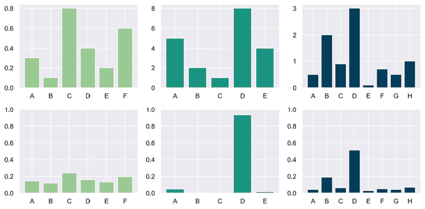

图 13-37：softmax 函数同时修改所有网络输出。结果是将分数转化为概率。上排：分类器的分数。下排：将上排分数通过 softmax 处理后的结果。请注意，上排图表使用了不同的纵坐标刻度。

图 13-37 的左上方显示了一个具有六个输出神经元的分类器的输出，我们将这些输出标记为 A 到 F。在这个示例中，这六个值都位于 0 和 1 之间。从这个图中，我们可以看到 B 类的值是 0.1，而 C 类的值是 0.8。如我们所讨论的那样，得出输入属于 C 类的可能性是 B 类的 8 倍是错误的，因为这些是得分而不是概率。我们可以说 C 类比 B 类更可能，但任何更细致的比较需要一些数学计算。为了有意义地比较这些输出，我们可以应用 Softmax 来进行计算，并将它们转换为概率。

我们在左下图中展示了 Softmax 的输出。这些是输入属于六个类中的每一个的概率。值得注意的是，大的值，如 C 和 F，被大幅度缩小，而小的值，如 B，几乎没有缩小。这是得分在 0 到 1 之间转换为概率时的自然结果。但是，条形图的排序仍然与得分时一样（C 最大，其次是 F，再是 D，依此类推）。从 Softmax 生成的概率图中，我们可以看到 C 类的概率大约是 0.25，而 B 类的概率大约是 0.15。我们可以得出结论，输入属于 C 类的可能性是 B 类的 1.5 倍多一点。

图 13-37 的中间和右侧列显示了另两个假设的网络和输入的输出，分别是在应用 Softmax 前后的结果。这三个示例显示了 Softmax 的输出取决于输入是否都小于 1。图 13-37 中的输入范围，从左到右依次是[0, 0.8]、[0, 8]和[0, 3]。Softmax 始终保留输入的排序（也就是说，如果我们按从大到小排序输入，输出的排序也会相似）。但是当一些输入值大于 1 时，最大的值往往更突出。我们说 Softmax *放大*了具有最大值的输出的影响。有时我们也说 Softmax *压缩*了其他值，使得最大值更加明显地主导了其他值。

图 13-37 显示了输入范围在 Softmax 输出中产生了很大差异。Softmax 还表现出有趣的行为，取决于输入值是否都小于 1、都大于 1 或混合在一起。

在图 13-37 的最左侧，所有的输入值都小于 1，位于范围[0, 0.8]内。

在中间的列中，输入值都大于 1，位于范围[0, 8]内。注意到在输出中，D 的值（对应 8）明显主导了其他所有值。Softmax 放大了输出之间的差异，使得更容易将 D 选为最大值。

在图 13-37 的最右端，我们有一些小于 1 和大于 1 的数值，范围为[0, 3]。这里，夸张效应介于左列（所有输入都小于 1）和中间列（所有输入都大于 1）之间。

然而，在所有情况下，softmax 都会返回一个概率值，每个值都介于 0 和 1 之间，并且总和为 1。输入的顺序始终被保留，因此从最大到最小输入的顺序也对应于从最大到最小的输出。

## 概述

真实的生物神经元是复杂的神经细胞，通过一种极其复杂的化学、电气和机械过程来处理信息。尽管计算机版本和其生物学原型之间存在巨大的差距，它们依然启发了我们创造出一种简单的计算方式——人工神经元。人工神经元将每个输入值与相应的权重相乘，求和结果，然后通过激活函数处理。我们可以将人工神经元组合成网络。通常，这些网络是有向无环图（DAG）：它们是有向的（信息仅沿一个方向流动），它们是无环的（没有神经元会将自己的输出作为输入），而且它们是图形的（神经元之间是相互连接的）。输入数据从一端进入，网络的结果出现在另一端。

我们看到，如果在构建网络时不小心，整个网络可能会崩溃成一个单一的神经元。我们通过使用激活函数来防止这种情况，激活函数是一个小函数，它接收每个神经元的输出并将其转换为一个新的数字。这些函数是非线性的，这意味着它们不能仅通过加法和乘法等操作来描述。正是这种非线性使得网络不等同于单一神经元。我们通过查看一些更常见的激活函数，以及 softmax 如何将神经网络输出的数字转化为类别概率，来结束本章。

未经过训练的深度学习系统与已经训练好并准备部署的系统之间唯一的区别在于权重的数值。训练或学习的目标是找到一组权重值，使得网络的输出尽可能正确地适应尽可能多的样本。由于权重一开始是随机数值，我们需要一些有原则的方法来找到这些新的、有用的数值。在第十四章和第十五章中，我们将通过查看两个关键算法来了解神经网络是如何学习的，这些算法逐步改进初始权重，将网络的输出转变为准确且有用的结果。
