# 第十四章：反向传播

正如我们所见，神经网络只是由一组神经元组成，每个神经元进行自己的小计算，然后将结果传递给其他神经元。我们如何训练这样一个系统，让它产生我们想要的结果呢？我们又如何高效地完成这项任务？

答案是*反向传播*，简称*backprop*。没有反向传播，今天深度学习的广泛应用是不可能的，因为我们无法在合理的时间内训练大型网络。每个现代深度学习库都提供了稳定高效的反向传播实现。尽管大多数人永远不会实现反向传播，但理解这个算法很重要，因为深度学习中有很多内容都依赖于它。

大多数反向传播的介绍都以数学形式呈现，作为一系列方程和相关讨论（Fullér 2010）。和往常一样，我们这里跳过数学内容，专注于概念。章节的中间部分是本书中讨论反向传播核心的最详细部分。第一次阅读时，你可能想轻松读一下，以便大致了解发生了什么以及各部分是如何结合的。然后，如果你愿意，可以返回来慢慢阅读，跟随每一个步骤。

## 训练的高级概述

神经网络通过最小化错误来学习。这个过程从一个被称为*成本*、*损失*或*惩罚*的数值开始，用来衡量每一个错误。在训练过程中，网络减少成本，输出结果会越来越接近我们想要的目标。

### 惩罚错误

假设我们有一个分类器，可以将每个输入识别为五个类别中的一个，类别编号为 1 到 5。具有最大值的类别是网络对每个输入类别的预测。我们的分类器是全新的，尚未训练，因此所有的权重都有小的随机值。图 14-1 展示了网络对其第一个输入样本的分类。

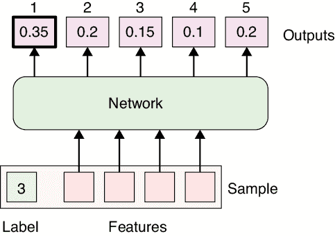

图 14-1：一个神经网络处理一个样本并将其分配到类别 1。我们希望它被分配到类别 3。

在这个例子中，网络认为该样本属于类别 1，因为最大输出 0.35 来自输出 1（假设我们在网络的最后有一个 softmax 层，所以输出加起来等于 1）。不幸的是，样本被标记为属于类别 3。我们本不应期待正确答案。网络可能有成千上万，甚至数百万个权重，而它们目前都只有初始的随机值。因此，输出也只是随机值。如果网络预测了该样本为类别 3，那也只是纯粹的运气。

当预测与该样本的标签不匹配时，我们可以得出一个单一的数字，告诉我们这个答案错得有多远。例如，如果类别 3 几乎得到了最大得分，我们就说网络相较于将类别 3 赋予最小得分时，会更正确（或者更不错误）。我们称这个描述标签与预测之间不匹配的数字为*误差分数*，或*误差*，有时也叫*惩罚*，或*损失*（如果*损失*这个词似乎是“误差”的一个奇怪同义词，可以考虑将其看作描述由于错误答案“丧失”的信息量）。

*误差（或损失）是一个浮动的数值，它可以取任何值，尽管我们通常会设置使其始终为正数。误差越大，说明网络对于该输入的标签预测越“错误”。零误差意味着网络正确预测了样本的标签。在一个理想的世界里，我们希望将每个训练样本的误差降到零。实际上，我们通常会尽可能接近零。*

虽然在本章中我们主要关注减少特定样本（或样本组）的误差，但我们的总体目标是最小化整个训练集的总误差，通常这只是各个个体误差的总和。

我们选择确定误差的方式赋予了我们极大的灵活性来引导网络的学习过程。然而，这种思维方式看起来可能有些逆向，因为误差告诉网络应该*不做*什么。这就像雕刻的大名鼎鼎的引语：要雕刻一头大象，你只需从一块石头开始，剔除所有不看起来像大象的部分（引言调查员，2020 年）。

在我们的例子中，我们从一个初始化的网络开始，然后利用误差项去消除我们不希望的行为。换句话说，我们并不是在教网络找出正确的答案。相反，我们通过赋予错误答案一个正的误差值来惩罚它们。网络减少总体误差的唯一方法就是避免错误答案，因此它学会了这样做。这是一个强大的理念：为了获得我们想要的行为，我们惩罚我们不希望的行为。

如果我们想要同时惩罚多个因素，我们会为每个因素计算一个*值*，或者*项*，然后将它们加起来得到总误差。例如，我们可能希望我们的分类器预测正确的类别*并*赋予它一个得分，且这个得分至少是下一个最接近类别得分的两倍。我们可以计算代表这两个愿望的数值，并将它们的和作为我们的误差项。网络唯一降低误差到零（或者尽可能接近零）的方式是改变其权重，以实现这两个目标。

一个常见的误差项来源于观察到，当网络中的权重都处于一个小范围内时，学习效率通常是最高的，比如[–1, 1]。为了强制实现这一点，我们可以加入一个误差项，当权重偏离这个范围太远时，它会产生较大的值。这叫做*正则化*。为了最小化误差，网络会学会保持权重较小。

所有这些都引出了一个自然的问题，那就是网络是如何实现最小化误差的目标的。这就是本章的重点。

为了简化问题，我们将使用一个仅包含一个项的误差度量，惩罚网络的预测与标签之间的不匹配。在本章的其余部分，所有的内容在误差项更多时的表现是相同的。我们为网络教学设计的第一个算法只是一个思想实验，因为在今天的计算机上它会非常缓慢。但这个实验产生的思想为我们在本章后面讨论的更高效的技术奠定了概念基础。

### 一种缓慢的学习方式

让我们继续使用一个通过监督学习训练的分类器作为例子。我们将给网络一个样本，并将系统的预测与样本的标签进行比较。如果网络预测正确并且预测了正确的标签，我们就不做任何改变，直接进入下一个样本（正如俗话所说：“如果它没坏，就不要修理”[Seung 2005]）。但如果某个特定样本的结果是错误的，我们将尝试改进。

让我们用一种简单的方法来进行改进。我们将从整个网络中随机选择一个权重，并*冻结*其他所有值，使它们无法改变。我们已经知道与该权重当前值相关的误差，所以我们创建一个以零为中心的小随机值，称之为*m*，将其加到该权重上，并重新评估相同的样本。这对一个权重的改变会通过整个网络产生连锁反应，因为每个依赖于该神经元输出进行计算的神经元也会发生变化。结果是一个新的预测集，因此该样本的误差也会发生变化。

如果新的误差小于之前的误差，那么我们就改进了，保持这个变化。如果结果没有变好，那么我们需要撤销这个变化。现在我们随机选择另一个权重，按另一个随机值修改它，重新评估网络，看看是否要保持这个变化，再选择另一个权重，修改它，依此类推，一遍又一遍。

我们可以继续微调权重，直到结果改进到某个程度，或者我们决定已经尝试了足够多的次数，或者我们出于其他任何原因决定停止。此时，我们选择下一个样本，再次调整许多权重。当我们用完训练集中的所有样本后，我们就再次遍历这些样本（可能顺序不同），一遍又一遍。这个想法是，每一次小的改进都会让我们更接近一个能够准确预测每个样本标签的网络。

使用这个技术，我们预计网络会慢慢改进，尽管过程中可能会有挫折。例如，后来的样本可能会导致某些变化，破坏我们刚刚为早期样本所做的改进。

如果有足够的时间和资源，我们预计网络最终会改进到能够尽可能好地预测每个样本的程度。那句话中的关键词是*最终*。就像“水最终会沸腾”或“仙女座星系最终会与我们的银河系碰撞”一样（NASA 2012）。虽然这些概念是对的，但这个技术显然不切实际。现代网络可能有数百万个权重。用这个算法去寻找所有权重的最佳值根本不现实。

本章其余部分的目标是将这个粗略的想法重新结构化为一个更为实用的算法。

在我们继续之前，值得注意的是，由于我们专注于权重调整，我们实际上通过第十三章中看到的偏置技巧自动调整了每个神经元偏置的影响。这意味着我们不需要考虑偏置项，这使得一切变得更简单。

现在让我们考虑如何改进我们极其缓慢的权重变化算法。

### 梯度下降

上一节的算法改进了我们的网络，但速度极其缓慢。一个效率低下的主要原因是我们对权重的调整有一半是错误的方向：我们应该减去的值却加了上去，反之亦然。这就是为什么当误差增大时，我们不得不撤销更改的原因。另一个问题是我们一个个地调整每个权重，这需要评估大量的样本。让我们解决这些问题。

如果我们事先知道每个权重应朝正方向还是负方向微调，我们就可以将训练速度加倍。我们可以通过该权重的误差梯度精确获得这些信息。回想一下我们在第五章中接触到的梯度，它告诉我们随着每个参数的变化，表面高度如何变化。让我们将这个概念缩小到当前的情况。

和之前一样，我们将冻结整个网络，除了一个权重。如果我们将该权重的值绘制在横轴上，我们可以将该权重的网络误差在纵轴上绘制出来。这些误差合在一起，形成一条曲线，称为*误差曲线*。在这种情况下，我们可以通过找到该权重上方误差曲线的斜率来找到该权重处误差的梯度（或导数）。

如果该权重上方的梯度是正的（即，线条向右移动时上升），那么增大该权重的值（向右移动）会导致误差增加。类似地，对我们更有用的是，减小该权重的值（向左移动）会导致误差减少。如果误差的斜率是负的，情况则相反。

图 14-2 展示了两个示例。

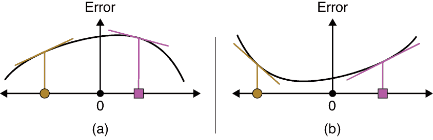

图 14-2：梯度告诉我们，如果我们增大或减小某个权重，误差（黑色曲线）会发生什么变化，对于两条不同的误差曲线。每个图展示了两个权重处的梯度。

每个权重在网络中的误差曲线都是不同的，因为每个权重对最终误差的影响不同。但是，如果我们能找到某个特定权重的梯度，我们就解决了是否需要增加或减少该权重以减少误差的问题。如果我们能找到所有权重的梯度，我们可以一次性调整它们，而不是一个一个地调整。如果我们能同时调整每个权重，使用它自己特定的梯度来告诉我们是增大还是减小，那么我们就有了一种有效的改进网络的方法。

这正是我们所做的。因为我们使用梯度来移动每个权重，以产生误差曲线上的更低值，所以我们称该算法为*梯度下降*。

在深入讨论梯度下降之前，注意到该算法假设，在我们评估一个错误的样本后，独立且同时调整所有权重会导致误差减少，不仅是对该样本，而且是对整个训练集，并且在网络发布后，所有看到的数据也会受益。这是一个大胆的假设，因为我们已经注意到，改变一个权重可能会通过网络的其余部分引起涟漪效应。改变一个神经元的输出会改变所有使用该值的神经元的输入和输出，从而改变它们的梯度。如果我们运气不好，一些原本有正梯度的权重可能会变成负梯度，反之亦然。这意味着如果我们坚持使用我们计算出来的梯度，改变这些权重会让误差变大，而不是变小。为了控制这个问题，我们通常会对每个权重进行小幅调整，希望这些错误不会淹没我们的改进。

## 入门

让我们通过两步调整网络的权重来减少整体误差。在第一步中，称为*反向传播*或*反传*，我们访问每个神经元，在那里计算并存储一个与网络误差相关的数值。一旦我们为每个神经元获得这个值，我们就用它来更新进入该神经元的每个权重。第二步称为*更新* *步骤*，或*优化步骤*。它通常不被视为反向传播的一部分，但有时人们会随便将这两个步骤合并在一起，称整个过程为反向传播。本章专注于第一步，第十五章专注于优化。

在本讨论中，我们将忽略激活函数。激活函数的非线性特性对神经网络的正常工作至关重要，但这种特性引入了许多与理解反向传播本质无关的细节。尽管为了更清晰的讨论而进行简化，但在任何反向传播的实现中，激活函数肯定是被考虑在内的。

进行此简化后，我们可以得出一个重要的观察：当我们网络中的任何神经元输出发生变化时，最终的输出误差也会按比例发生变化。

让我们来分析一下。我们在神经网络中只关心两种类型的值：权重（我们可以随意设置和更改）和神经元输出（这些是自动计算的，超出了我们直接控制的范围）。除了第一层之外，每个神经元的输入值都是前一个神经元的输出与该输出经过的边的权重的乘积。每个神经元的输出只是所有这些加权输入的总和。如果没有激活函数，每个神经元输出的变化与其输入或这些输入的权重的变化成比例。如果输入本身保持不变，神经元输出变化（从而影响最终误差）唯一的方式是输入上的权重发生变化。

想象一下，我们正在查看一个刚刚发生输出变化的神经元。网络的误差会因此发生什么变化呢？没有激活函数时，网络中的唯一操作是乘法和加法。如果我们写下数学公式（我们这里不写），结果表明，最终误差的变化总是与神经元输出的变化成比例。

任何神经元输出变化与最终误差变化之间的关系就是神经元的变化乘以一个数值。这个数值有各种名称，但最流行的是小写希腊字母*δ*（德尔塔），有时也使用大写版本Δ。数学家们常用德尔塔字符表示某种“变化”，因此这是一个自然（虽然简洁）的名称选择。

每个神经元都有一个与之相关的 delta，或称*δ*，这是通过使用当前样本评估当前网络得到的结果。这是一个实数，可能很大或很小，正数或负数。假设网络的输入没有变化，且其余网络被冻结，如果一个神经元的输出发生了特定的变化，我们可以将这个变化乘以神经元的 delta，看看整个网络的输出将如何变化。

为了说明这个概念，我们暂时只关注一个神经元的输出。我们在其输出值产生之前，添加一些任意的数字。图 14-3 图示了这一概念，其中我们使用字母*m*（代表“修改”）表示这个额外的值。

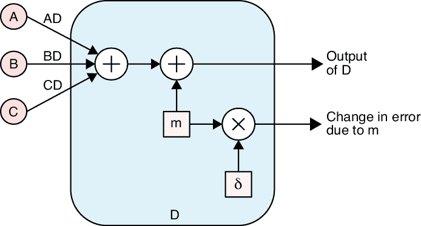

图 14-3：计算由于神经元输出变化导致的网络最终误差变化

因为输出会发生*m*的变化，我们知道最终误差的变化是*m*乘以神经元的*δ*。

在图 14-3 中，我们通过将值*m*直接放入神经元来改变输出。或者，我们可以通过改变输入中的一个值来引起输出的变化。让我们改变来自其他神经元的输入值。与图 14-3 中的逻辑相同，这在图 14-4 中也有展示。如果我们愿意，也可以将*m*添加到来自神经元 A 或 C 的输入值；关键是 D 的输出发生了*m*的变化。由于我们仍然只是通过*m*改变输出，我们通过将其与图 14-3 中相同的*δ*值相乘来找到最终误差的变化。

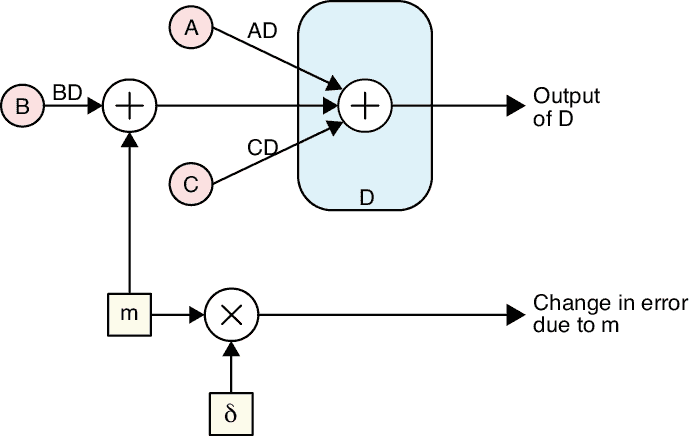

图 14-4：是图 14-3 的变体，我们在 B 的输出中添加了*m*（在乘以权重 BD 之后）。

图 14-3 和图 14-4 说明了网络最终输出的变化可以通过任何神经元输出或网络中的任何权重的变化来预测。

我们可以利用与每个神经元相关的 delta，来告诉我们每个输入权重应该朝着正向还是负向调整。

让我们通过一个例子来说明。

现在是时候进入细节了。基本的概念是，误差会为每个权重提供一个梯度，然后我们可以使用这个梯度稍微调整每个权重，以减少整体误差。这个过程的机制并不复杂，但有一些新的概念、新的术语和很多细节需要理清。如果这部分内容让你觉得信息量太大，你可以在第一次阅读时略过这一部分（例如，跳过“在更大网络中的反向传播”部分），之后再回来深入理解这个过程。

## 小型神经网络的反向传播

为了更好地理解反向传播，我们将使用一个小型网络，将 2D 点分类为两类，我们称之为类 1 和类 2。如果这些点可以通过一条直线分开，那么我们只需一个神经元就能完成这个任务，但我们还是使用一个小网络，因为它让我们能看到一般的原理。让我们从查看网络并给每个我们关心的部分加上标签开始。这将使后续的讨论更加简洁易懂。图 14-5 显示了我们的这个小网络，并为它的八个权重命名。为了简化，我们省略了神经元 C 和 D 之后的常规 softmax 步骤。

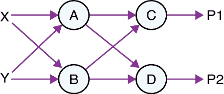

图 14-5：一个简单的四神经元神经网络

最后，我们想要引用每个神经元的输出和 delta 值。为此，我们通过将神经元的名称与我们想要引用的值结合，来创建简短的两字母名称。所以*Ao*和*Bo*是神经元 A 和 B 的输出名称，而*Aδ*和*Bδ*是这两个神经元的 delta 值。

图 14-6 显示了这些值与它们的神经元一起存储。

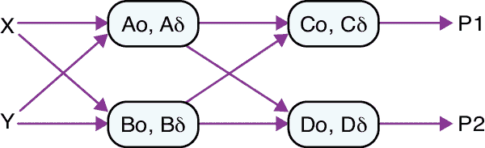

图 14-6：我们简单的网络，每个神经元的输出和 delta 值

我们可以观察当神经元输出发生变化时，如何导致误差的变化。假设神经元 A 的输出因变化而变化的量为*m*，则将其标记为*Am*，网络的最终误差为*E*，而导致的误差变化为*Em*。

现在我们可以更精确地描述当神经元输出发生变化时，误差会发生什么变化。如果神经元 A 的输出发生变化*Am*，那么将该变化与*Aδ*相乘得到误差的变化。即，变化*Em*由*Am* × *Aδ*给出。我们认为*Aδ*的作用是将神经元 A 输出的变化进行乘法操作或缩放，从而得到对应的误差变化。图 14-7 展示了我们在本章中用于可视化神经元输出的变化如何通过其 delta 值进行缩放，以产生对误差的变化的示意图。

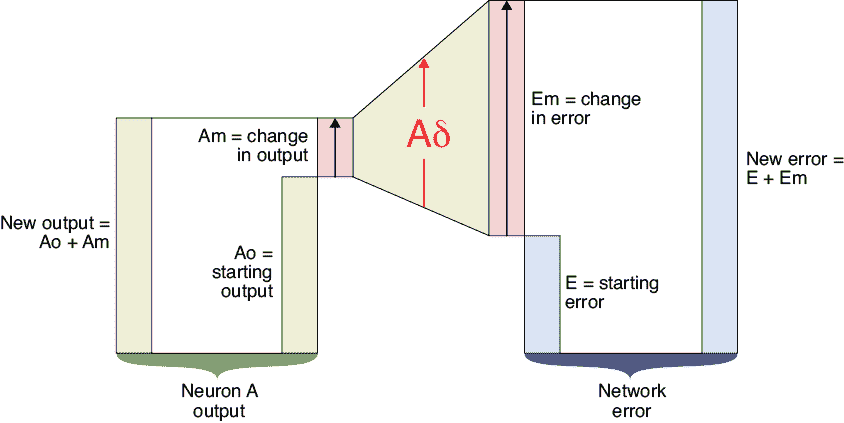

图 14-7：我们的示意图，用于可视化神经元输出的变化如何改变网络的误差

在图 14-7 的左侧，我们从神经元 A 开始。我们看到 A 的初始输出，或称*Ao*，输出变化*Am*，以及其新的输出*Ao* + *Am*。框内的箭头表示*Am*的变化是正向的。这个变化与*Aδ*相乘得到*Em*，即误差的变化。我们用楔形图示来表示这个操作，说明*Am*的放大过程。将*Em*加到之前的误差值*E*上，就得到了新的误差值*E* + *Em*。在这种情况下，*Am*和*Aδ*都是正的，因此误差变化*Am* × *Aδ*也是正的，导致误差增加。当*Am*或*Aδ*中的任意一个（但不是两个）为负时，误差会减小。

现在我们已经标记了所有内容，终于可以开始查看反向传播算法了。

### 找到输出神经元的增量

反向传播的核心就是找到每个神经元的增量值。为此，我们首先找到网络末端的误差梯度，然后将这些梯度反向传播，即向网络的起始位置移动。因此，我们从末端开始：输出层。

#### 计算网络误差

我们小型网络中的神经元 C 和 D 的输出给出了输入属于类 1 或类 2 的概率。在理想情况下，一个属于类 1 的样本将产生*P1* = 1.0 和*P2* = 0.0 的值，这意味着系统确信它属于类 1，同时确信它不属于类 2。如果系统的不确定性稍大，我们可能会得到*P1* = 0.8 和*P2* = 0.2，告诉我们样本更可能属于类 1。

我们想要得到一个单一的数字来表示网络的误差。为此，我们将*P1*和*P2*的值与该样本的标签进行比较。最简单的比较方式是，如果标签采用了独热编码，如我们在第十章中所看到的那样。回想一下，独热编码将零列表示为类别数的长度，只有对应正确类别的位置上是 1。在我们的案例中，我们只有两个类别，因此类 1 的样本标签为(1, 0)，类 2 的样本标签为(0, 1)。有时这种标签形式也称为*目标*。

让我们将预测值*P1*和*P2*也放入一个列表中：(*P1*, *P2*)。现在我们可以直接比较这两个列表。我们几乎总是使用交叉熵来进行此比较，如第六章中所讨论的那样。图 14-8 展示了这一思想。

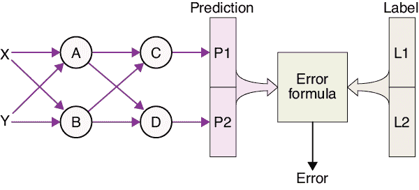

图 14-8：从样本中找出误差

每个深度学习库都提供了一个内置的交叉熵函数，帮助我们计算分类器中的误差，如本例所示。除了计算网络的误差外，函数还提供了梯度，告诉我们如果增加四个输入中的任何一个，误差将如何变化。

使用误差梯度，我们可以查看输出层中每个神经元的值，并确定是否希望该值变得更正或更负。稍后，我们会将每个神经元朝着使误差减少的方向进行调整。

#### 绘制我们的误差

让我们来看一条误差曲线。我们还将绘制与网络中某一特定输出或权重相关的梯度。记住，这只是该点的误差的斜率。

让我们看看误差如何随着预测值*P1*的变化而变化，参见图 14-9。假设*P1*的值为-1。

在图 14-9 中，我们用橙色圆点标记了*P1* = −1 的值，并且用绿色线条在该*P1*值上方的曲线上绘制了导数。这个导数（或梯度）告诉我们，如果我们使*P1*变得更正（即从−1 向右移动），网络中的误差将减少。

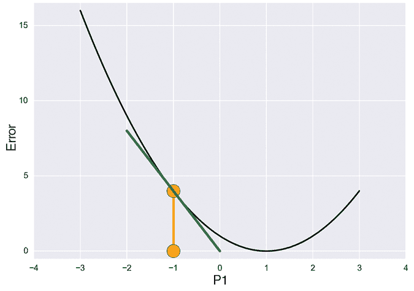

图 14-9：误差如何依赖于*P1*的不同值

如果我们知道代表误差的黑色曲线，我们就不需要梯度了，因为我们只需找到曲线的最小值。不幸的是，数学并没有给我们黑色曲线（我们在这里仅为参考绘制它）。但幸运的是，数学提供了足够的信息，使我们能够在任何位置找到曲线的导数。

图 14-9 中的导数告诉我们，如果我们稍微增加或减少*P1*，误差会发生什么变化。在我们改变*P1*之后，我们可以在新的位置找到导数并重复操作。导数或梯度能够准确预测每次改变*P1*后的新误差，只要我们保持每次变化较小。变化越大，预测的准确性就越差。

我们可以在图 14-9 中看到这一特点。假设我们将*P1*从−1 向右移动一个单位。根据导数，我们现在预计误差为 0。然而在*P1* = 0 时，误差（黑色曲线的值）实际上约为 1。我们把*P1*移动得太远了。为了确保图形清晰且易于阅读，我们有时会做出较大的移动，但实际上，我们改变权重时通常是小幅度的。

让我们用导数来预测由于*P1*变化而导致的误差数值变化。图 14-9 中绿色线的斜率是多少？左端大约在(−2, 8)，右端大约在(0, 0)。因此，这条线每向右移动一个单位，下降大约四个单位，斜率为−4/1，即−4。如果*P1*变化了 0.5（即从−1 变化到−0.5），我们预测误差将下降 0.5 × −4 = −2。

记住我们的目标是找到*Cδ*。我们刚刚做到了！在这个讨论中，*P1*只是*Co*，神经元 C 输出的另一种名称。我们发现当 P1 = –1 时，*Co*（或*P1*）变化 1 会导致误差变化−4。正如我们所讨论的，在*P1*发生如此大的变化后，我们不应该对这个预测过于自信。但对于小幅度的移动，比例是正确的。例如，如果我们将*P1*增加 0.01，那么我们预计误差会变化−4 × 0.01 = −0.04，对于如此小的*P1*变化，预测的误差变化应该非常准确。如果我们将*P1*增加 0.02，那么我们预计误差会变化−4 × 0.02 = −0.08。

相同的思路也适用于减少*P1*的值，或者将其向左移动。如果*P1*从−1 变化到−1.1，我们预计误差会变化−0.1 × −4 = 0.4，因此误差将增加 0.4。

我们发现，对于*Co*的任何变化量，我们可以通过将*Co*乘以−4 来预测误差的变化。这正是我们一直在寻找的！*Cδ*的值是−4。请注意，一旦*P1*的值因任何原因发生变化，误差曲线也会发生变化，*Cδ*的值必须重新计算。

我们刚刚找到了第一个增量值，它告诉我们如果 C 的输出发生变化，误差将变化多少。这只是误差函数在*P1*（或*Co*）处的导数。图 14-10 通过我们的误差图形象地展示了这一切。

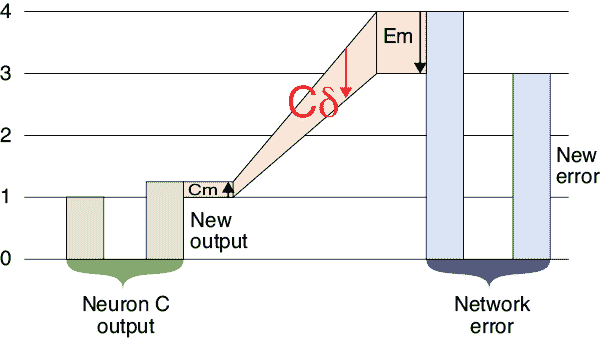

图 14-10：我们的误差图，展示了神经元 C 输出的小幅增加 Cm 引起的误差变化。

原始输出是图 14-10 最左边的绿色条形。我们假设由于其中一个输入权重的变化，C 的输出增加了一个量*Cm*。这通过乘以*Cδ*来放大，得到误差的变化量*Em*。即，*Em* = *Cm* × *Cδ*。这里*Cm*的值大约是 1/4（*Cm*框中的上箭头告诉我们变化是正的），而*Cδ*的值是−4（该框中的箭头告诉我们值是负的）。因此，*Em* = −4 × 1/4 = −1。新的误差值在最右侧，是前一个误差加上*Em*，即 4 + (−1) = 3。

请记住，在这个阶段，我们还没有对这个增量值做任何处理。我们现在的目标只是找出我们神经元的增量。稍后我们将使用它们来改变权重。

#### 寻找 Dδ

让我们对*P2*重复整个过程，以得到*Dδ*的值，或者神经元 D 的增量。

让我们从* Cδ*的回顾开始。在图 14-11 的左侧，我们展示了*P1*的误差曲线。由于将所有其他权重调整到更好的值，*P1*的误差曲线现在有一个约为 2 的最小值。

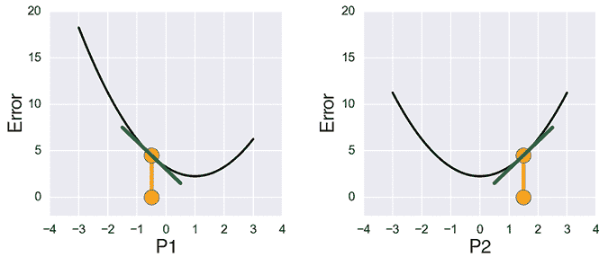

图 14-11：左侧：不同*P1*值的误差；右侧：不同*P2*值的误差。

如果我们使用新的*P1*值和误差曲线，似乎*P1*的约 0.5 的变化将导致误差变化约−1.5，因此*Cδ*大约是−1.5 / 0.5 = −3。如果不改变*P1*，如果我们改变*P2*呢？

看一下图 14-11 右侧的图表。约−0.5 的变化（这次向左移动，朝着碗的最小值）会导致误差变化约−1.25，因此*Dδ*大约是 1.25 / −0.5 = 2.5。这里的正值告诉我们，移动*P2*到右侧会导致误差上升，所以我们希望将*P2*向左移动。

这里有一些有趣的事情值得观察。首先，尽管这两条曲线都是碗状的，但碗底的位置在不同的权重值上。其次，因为*P1*和*P2*的当前值位于各自碗底的对立面，它们的导数符号相反（一个为正，另一个为负）。

最重要的观察是，我们目前无法将误差降至 0。在这个例子中，曲线的最低点约为 2。这是因为每条曲线仅考虑变化一个值，而另一个值保持不变。因此，即使*P1*达到了 1 的值，它的曲线达到了最小值，结果仍然会有误差，因为*P2*没有达到理想值 0，反之亦然。这意味着，如果我们只改变这两个值中的一个，我们无法将误差降至 0。得到 0 的误差是理想的，但更一般地说，我们的目标是逐步调整每个权重，直到将误差降到尽可能小的值。对于某些网络来说，我们可能永远无法达到 0 的误差。

请注意，即使我们能够将误差降至 0，我们也可能不希望这样做。正如我们在第九章中看到的，当网络过拟合时，训练误差会继续下降，但它处理新数据的能力却变得更差。我们真正希望的是尽可能地将误差最小化，而不发生过拟合。在日常讨论中，我们通常说我们希望将误差降至零，理解是最好在有些误差的情况下停止训练，而不是继续训练并发生过拟合。

我们稍后将看到，只要我们采取非常小的步伐，就可以同时改进网络中的所有权重。然后，我们需要重新评估误差，找到新的曲线，再计算新的导数和 delta 值，然后再进行调整。与每次样本后采取多次步骤不同，我们通常只调整一次权重，然后评估另一个样本，再次调整权重，如此循环。

#### 测量误差

我们之前提到过，我们通常通过交叉熵计算分类器的误差。为了本次讨论，我们使用一个更简单的公式，使得每个输出神经元的 delta 值容易计算。这个误差度量被称为*二次代价函数*，或者*均方误差 (MSE)*（Nielsen 2015）。像往常一样，我们不会深入探讨这个方程的数学原理。我们选择它是因为它让我们能够通过神经元的值与相应标签值之间的差来计算输出神经元的 delta 值（Seung 2005）。图 14-12 直观地展示了这一思想。

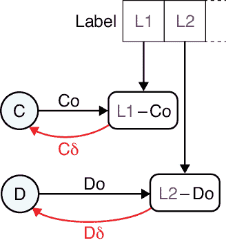

图 14-12：当我们使用二次代价函数时，任何输出神经元的 delta 值仅为标签中的值减去该神经元的输出值。如图中红色部分所示，我们将该 delta 值与其神经元一起保存。

记住，*Co*和*P1*是同一个值的两个名字，*Do*和*P2*也是如此。

让我们考虑*Co*（或*P1*），当第一个标签为 1 时。如果*Co* = 1，那么*Cδ*的值为 1 – *Co* = 0，因此*Co*的任何变化都会乘以 0，导致输出误差不发生变化。

现在假设*Co* = 2。那么它们的差值是*Cδ* = 1 – *Co* = −1，告诉我们改变*Co*会导致误差变化相同的量，但符号相反。如果*Co*更大，比如*Co* = 5，那么 1 – *Co* = −4，这意味着任何对*Co*的变化都会使误差的变化被放大一个-4 倍。我们使用了较大的数字是为了方便，但请记住，导数只准确预测在我们进行非常小的步长时会发生什么。

同样的思路也适用于神经元 D 及其输出*Do*（或*P2*）。

我们现在已经完成了反向传播的第一步：我们找到了输出层所有神经元的δ值。从图 14-12 中我们知道，输出神经元的δ值取决于标签中的值和神经元的输出。当我们改变输入该神经元的权重值时，它的δ值也会发生变化。δ值是一个临时值，它会随着每次网络或其输入的变化而变化。这也是我们每次只对每个样本调整一次权重的原因。由于每次更新后我们必须重新计算所有的δ值，不如先评估一个新的样本，并利用它提供的额外信息。

记住，我们的大目标是找到权重的变化。当我们知道一层中所有神经元的δ值时，就可以更新所有输入该层的权重。让我们来看一下如何操作。

### 使用δ值来改变权重

我们已经知道如何为输出层的每个神经元找到δ值。我们知道，神经元输出的变化必须来自输入的变化，而输入的变化又可以来自前一个神经元输出的变化，或者是连接该输出和当前神经元的权重变化。让我们来看看这些情况。

为了方便起见，我们假设一个神经元的输出或一个权重的变化值为 1。图 14-13 显示了权重 AC 每变化 1，神经元 A 的输出与神经元 C 的输出相乘后，网络中的误差会发生相应的变化，变化值为*Ao* × *Cδ*。将该值减去后，误差会发生变化，变化值为*–Ao* × *Cδ*。因此，如果我们想通过从网络误差中减去*Ao* × *Cδ*来减少网络的误差，我们可以通过将权重 AC 的值减少 1 来实现这一点。

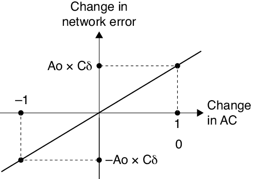

图 14-13：当*AC*变化 1 时，网络误差变化*Ao* × *Cδ*。

我们可以通过为我们的图示添加一个额外的约定来形象化地总结这一过程。我们一直将神经元的输出画成从圆形右侧出来的箭头。现在，让我们将δ值画成从圆形左侧出来的箭头，如图 14-14 所示。

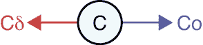

图 14-14：神经元 C 有一个输出*Co*，画成指向右的箭头，并且有一个δ值*Cδ*，画成指向左的箭头。

使用这个约定，找到更新后的权重*AC*值或*AC – (Ao* × *Cδ*)*的整个过程在图 14-15 中做了总结。像这样在图中显示减法是困难的，因为如果我们有一个“减号”节点，并且有两条输入箭头，那么不清楚哪个值从另一个值中被减去（也就是说，如果输入是*x*和*y*，我们是计算*x* − *y* 还是 *y* − *x*?）。为了避免这个问题，我们通过先计算*Ao* × *Cδ*，将其乘以−1，然后将结果加到*AC*上，来计算*AC* − (*Ao* × *Cδ*)。

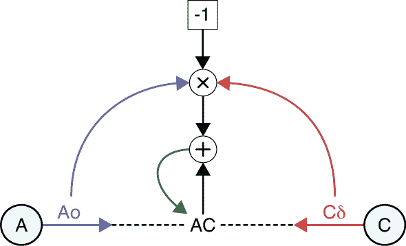

图 14-15：将权重 AC 的值更新为新值*AC –*（*Ao* *×* *Cδ**）*

让我们一起分析一下这个图。我们从神经元 A 的输出*Ao*和输出神经元 C 的增量*Cδ*开始，然后将它们相乘（在图的顶部）。我们想从当前的*AC*值中减去这个结果。为了在图中清楚地表示这一点，我们将乘积乘以−1，然后将其加到权重*AC*上。绿色箭头表示更新步骤，在这一过程中，结果成为*AC*的新值。

图 14-15 是一个大新闻！我们已经找到了如何改变进入输出神经元的权重，以减少网络的误差。我们可以将这一方法应用于进入输出神经元的所有四个权重（即*AC*，*BC*，*AD*和*BD*）。通过改进它的四个权重，我们已经稍微训练了一下我们的神经网络。

继续关注输出层，如果我们将输出神经元 C 和 D 的权重都改变，从每个神经元那里减少 1 的误差，我们预计误差会下降−2。我们可以预测到这一点，因为同一层的神经元不依赖彼此的输出。由于 C 和 D 都位于输出层，C 不依赖*Do*，D 也不依赖*Co*。它们确实依赖于前一层神经元的输出，但现在我们只关注改变 C 和 D 的权重所带来的影响。

我们知道如何调整进入输出层的边缘权重，这很棒，但其他所有权重怎么办呢？我们接下来的目标是计算所有前一层神经元的增量。一旦我们为网络中的每个神经元都计算出增量，就可以使用图 14-15 来调整网络中的每个权重，以减少误差。

这将引出反向传播的神奇技巧：我们可以利用一层的神经元增量来找到其前一层的神经元增量。让我们看看是怎么做到的。

### 其他神经元增量

现在我们有了输出神经元的增量值，我们可以用它们来计算输出层前一层神经元的增量。在我们的简单模型中，这一层是包含神经元 A 和 B 的隐藏层。现在我们暂时专注于神经元 A 及其与神经元 C 的连接。

如果*Ao*，即 A 的输出，因某种原因发生变化，会发生什么呢？假设它增加了*Am*。图 14-16 通过使用*AC*和*Cδ*的任意值，跟踪这一系列操作。

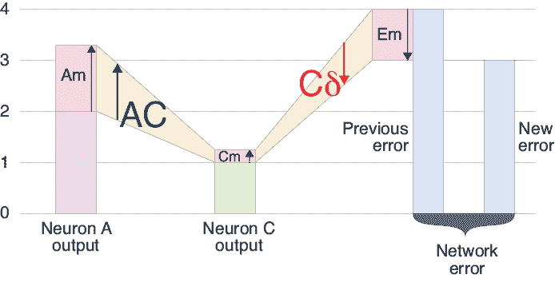

图 14-16：如果我们改变神经元 A 的输出，结果如何

如果我们从左到右读取图 14-16 中的图表，A 的变化（表示为*Am*）乘以权重*AC*，然后加到神经元 C 累积的值上。这使得 C 的输出增加了*Cm*。正如我们所知道的，C 的这一变化可以乘以*Cδ*来找到网络误差的变化。

所以现在我们有了从神经元 A 到神经元 C，再到误差的操作链。链条的第一步表明，如果我们将*Ao*（即*Am*）的变化乘以权重*AC*，得到*Am* × *AC*，我们就得到了*Cm*，C 的输出变化。我们之前知道，如果将*Cm*乘以*Cδ*，得到*Cm* × *Cδ*，就能得到误差的变化。

所以，将这些全部合并，我们发现由于 A 的输出变化*Am*而引起的误差变化为*Am* × *AC* × *Cδ*。我们刚刚找到了 A 的 delta！它就是*Aδ* = *AC* × *Cδ*。

图 14-17 直观地展示了这一点。

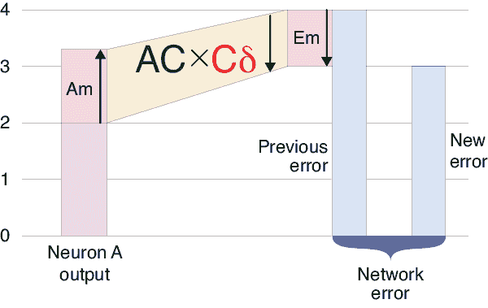

图 14-17：我们可以将图 14-16 中的操作合并成一个更简洁的图。

这真是令人惊讶。神经元 C 消失了。它在图 14-17 中简直不见了。我们所需要的只是它的 delta，*Cδ*，通过它我们可以找到*Aδ*，A 的 delta。现在我们知道了*Aδ*，就可以更新所有输入到神经元 A 的权重，然后……等等，稍等一下。

我们实际上还没有得到*Aδ*。我们只得到了它的一部分。

在本讨论开始时，我们说过我们将关注神经元 A 和 C，这没问题。但如果现在我们回想一下图 14-8 中的其余网络，我们可以看到神经元 D 也使用了 A 的输出。如果*Ao*由于*Am*的变化而发生变化，那么 D 的输出也会变化，这也会影响误差。

要找到由于神经元 D 的变化引起的误差变化，我们可以重复我们刚才的分析，只需要将神经元 C 替换为神经元 D。如果*Ao*发生了*Am*的变化，其他不变，D 引起的误差变化由*AD* × *Dδ*给出。

图 14-18 同时展示了 A 的这两个输出。这个图的设置与我们之前看到的同类图稍有不同。在这里，A 的变化对由于 C 变化引起的误差的影响通过从图表中心向右的路径展示。A 的变化对由于 D 变化引起的误差的影响则通过从图表中心向左的路径展示。

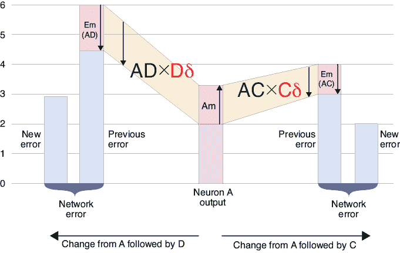

图 14-18：神经元 A 的输出被神经元 C 和神经元 D 共同使用。

图 14-18 展示了对误差的两个独立变化。由于神经元 C 和 D 互不影响，它们对误差的作用是独立的。为了找到误差的总变化，我们只需将这两者的变化相加。图 14-19 展示了通过神经元 C 和神经元 D 的误差变化结果。

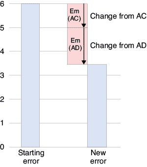

图 14-19：当神经元 A 的输出同时被神经元 C 和神经元 D 使用时，误差的变化相加。

现在我们已经处理了从 A 到输出的所有路径，我们终于可以写出*Aδ*的值了。由于误差是累加的，就像在图 14-19 中一样，我们只需加总那些影响*Am*的因子。如果我们将其写出来，就是*Aδ* = (*AC* × *Cδ*) + (*AD* × *Dδ*)。

现在我们已经找到了神经元 A 的增量值，我们可以对神经元 B 重复这个过程，找到它的增量。

我们刚刚做的其实远比仅仅找到神经元 A 和 B 的增量要好得多。我们已经学会了如何获取*任何*神经网络中每个神经元的增量值，无论它有多少层或多少个神经元！因为我们所做的所有工作仅仅涉及一个神经元、所有在下一层中使用它的值作为输入的神经元的增量值，以及连接它们的权重。仅凭这些值，我们就能找到神经元变化对网络误差的影响，即使输出层可能相隔数十层之远。

为了更直观地总结这一点，让我们扩展一下我们画输出和增量箭头的惯例，加入权重，如图 14-20 所示。假设一个连接上的权重乘以向右移动的输出值，或者乘以向左移动的增量值，这取决于我们考虑的步骤。

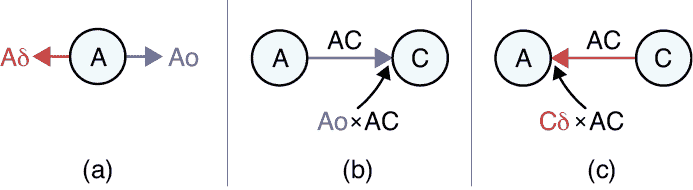

图 14-20：绘制与神经元 A 相关的值。(a) 输出*Ao*是从神经元右侧出来的箭头，而增量*Aδ*是从左侧出来的箭头。(b) *Ao*在传递到 C 的过程中被*AC*乘以。(c) *Cδ*在传递到 A 的过程中被*AC*乘以。

这里有一种理解图 14-20 的方式。神经元 A 和 C 之间有一条连接，连接上有一个权重。如果箭头指向右边，那么权重会乘以*A0*，也就是 A 的输出值，传递到神经元 C。如果箭头指向左边，那么权重会乘以*Cδ*，也就是 C 的增量值，传递到神经元 A。

当我们评估一个样本时，我们使用从左到右的前馈流动方式，其中来自神经元 A 到神经元 C 的输出值通过一个权重为*AC*的连接传递。结果是，值*Ao* × *AC*到达神经元 C，并与其他传入值相加，如图 14-20(b)所示。

当我们稍后想计算 *Aδ* 时，我们从右向左跟踪流动。然后，离开神经元 C 的增量通过一个带有权重 *AC* 的连接传递。结果是，值 *Cδ* × *AC* 到达神经元 A，并与其他输入值一起加总，如图 14-20(c)所示。

现在，我们可以总结一下对一个样本输入的处理过程，以及计算一个任意神经元（命名为 H）增量的过程（记住，我们忽略了激活函数），如图 14-21 所示。

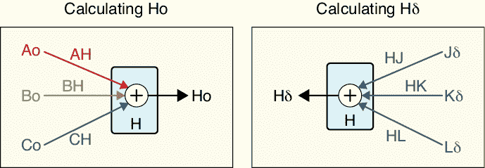

图 14-21：左图：为了计算 *Ho*，我们将每个前一神经元的输出按连接的权重进行缩放，并将结果加总。右图：为了计算 *Hδ*，我们将每个后续神经元的增量按连接的权重进行缩放，并将结果加总。和往常一样，我们忽略了激活函数。

这一点令人感到对称和愉悦。它还揭示了一个重要的实际结果：计算增量（delta）通常和计算输出值一样高效。即使输入连接的数量和输出连接的数量不同，涉及的工作量在两个方向上仍然接近。

请注意，图 14-21 并不要求神经元 H 做任何特殊的事情，除了它需要从邻接层接收输入，这些输入通过带有权重和增量的连接传递过来。我们可以应用图 14-21 的左半部分，并在前一层的输出可用时立即计算神经元 H 的输出。我们可以应用图 14-21 的右半部分，并在下一层的增量可用时立即计算神经元 H 的增量。

*Hδ* 对后续神经元增量的依赖，解释了为何我们必须将输出层的神经元视为特殊情况：因为没有“下一层”的增量可供使用。

在整个讨论中，我们省略了激活函数。事实上，我们可以将它们纳入到图 14-21 中，而不改变基本方法。尽管这个过程在概念上非常直接，但其机制涉及很多细节，所以我们在这里不会深入探讨。

这一过程是为网络中每个神经元寻找增量的核心部分，它是反向传播算法的关键。让我们来了解一下反向传播在一个更大网络中的工作方式。

## 更大的网络中的反向传播

在上一节中，我们看到了反向传播算法，它允许我们计算出网络中每个神经元的增量。由于这个计算依赖于后续神经元的增量，并且输出神经元没有这些增量，且输出神经元的变化直接由损失函数驱动，因此我们将输出神经元视为特殊情况。一旦找到了任何一层（包括输出层）中所有神经元的增量，我们就可以向后逐层（朝着输入层方向）推进，找到该层所有神经元的增量。然后我们再次向后推进，计算所有增量，再次向后推进，依此类推，直到我们到达输入层。一旦我们为每个神经元找到了增量，就可以调整进入该神经元的权重值，从而训练我们的网络。

让我们通过反向传播的过程，逐步找到稍大网络中所有神经元的增量。

在图 14-22 中，我们展示了一个具有四层的网络。仍然有两个输入和两个输出，但现在我们有三个隐藏层，分别包含两个、四个和三个神经元。

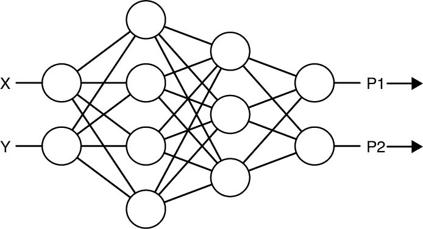

图 14-22：一个新的分类器网络，具有两个输入、两个输出和三个隐藏层

我们通过评估一个样本来开始。我们将其 X 和 Y 特征的值提供给输入，最终网络会产生输出预测值*P1*和*P2*。

现在我们可以通过找到第一个输出神经元的误差，开始进行反向传播，如图 14-23 的上部所示。

我们任意从上面的神经元开始，它给出了我们标记为*P1*的预测值（即样本属于类别 1 的概率）。根据*P1*和*P2*的值以及标签，我们可以计算出网络输出中的误差。假设网络没有完美预测这个样本，那么误差值就大于零。

利用误差、标签和*P1*与*P2*的值，我们可以计算出该神经元的增量值。如果我们使用的是二次代价函数，这个增量只是标签值减去神经元的值，就像我们在图 14-12 中看到的那样。但如果我们使用其他函数，计算可能会更复杂，所以我们将讨论一般情况。

我们保存这个增量与其对应的神经元，然后对输出层中的所有其他神经元重复此过程（此处只有一个神经元），如图 14-23 的下部所示。这样就完成了输出层，因为我们现在为输出层中的每个神经元都找到了增量。

到此为止，我们可以开始调整输入层到输出层的权重，但通常我们会先找到所有神经元的增量，然后再调整所有的权重。让我们按照这个典型的顺序来操作。

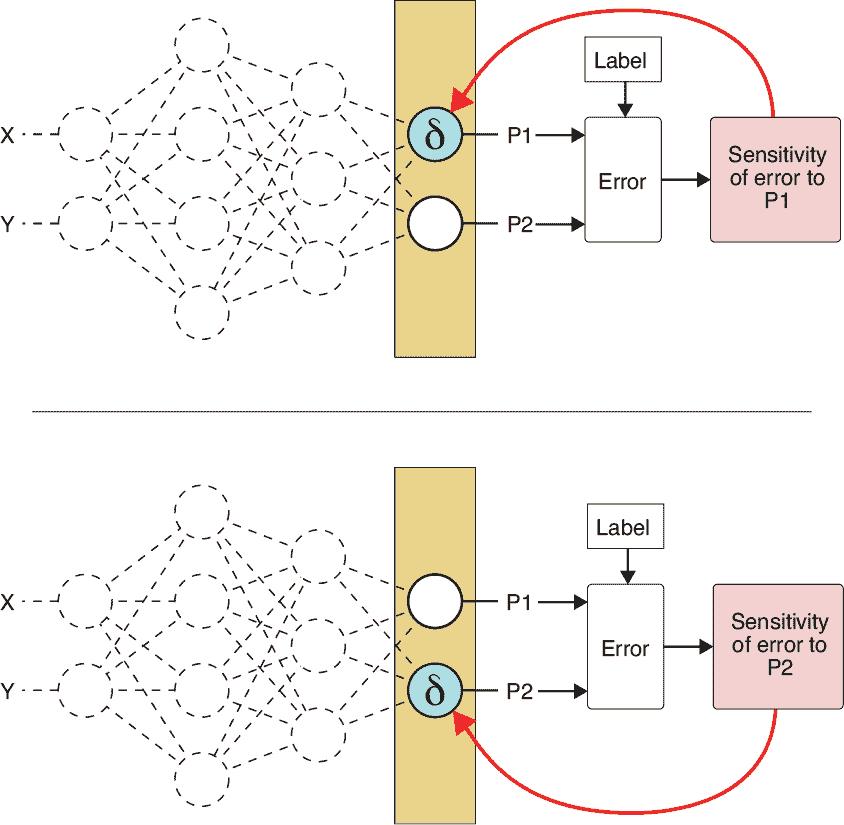

图 14-23：总结为两个输出神经元计算增量的步骤

我们退后一步到第三隐藏层（有三个神经元）。让我们考虑如何计算这三个神经元中最上面一个的增量，如图 14-24 的左侧图所示。

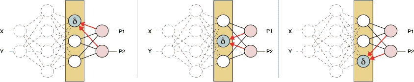

图 14-24：使用反向传播计算倒数第二层神经元的增量

为了找到这个神经元的增量，我们按照图 14-18 中的步骤计算个别贡献，然后按照图 14-19 中的步骤将它们加在一起，得到该神经元的增量。

现在我们逐层处理，应用相同的过程到每个神经元。当我们完成这一层的所有神经元后，我们退后一步，开始处理前一层的四个神经元。这就是过程真正变得美妙的地方。为了找到这一层中每个神经元的增量，我们只需要该神经元的输出所连接的每个神经元的权重，以及这些神经元的增量，这些我们刚刚计算出来。

其他层就不相关了。我们现在不再关心输出层。

图 14-25 展示了如何计算第二隐藏层四个神经元的增量。

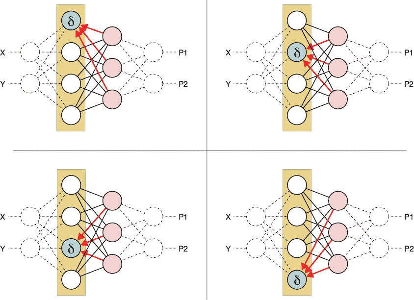

图 14-25：使用反向传播计算第二隐藏层的增量值

当四个神经元的增量都被分配完后，该层就完成了，我们再退后一步。现在我们来到第一隐藏层，这一层有两个神经元。每个神经元都与下一层的四个神经元相连。我们关心的只是下一层的增量和连接两层的权重。对于每个神经元，我们找到所有消费该神经元输出的神经元的增量，将这些增量与权重相乘，并将结果加总，如图 14-26 所示。

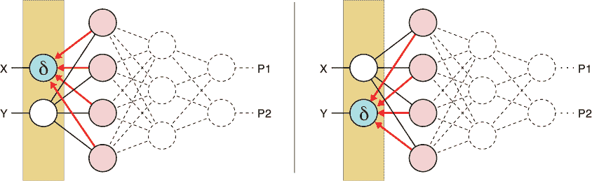

图 14-26：使用反向传播计算第一隐藏层的增量（delta）

当图 14-26 完成后，我们就找到了网络中每个神经元的增量。

现在让我们调整权重。我们可以遍历神经元之间的连接，并使用我们在图 14-15 中看到的技术来更新每个权重，使其达到新的、更好的值。

图 14-23 到图 14-26 展示了为什么这个算法叫做*反向传播*。我们把任何一层的增量信息*传播*，即一层一层地将其*向后*移动，并在这个过程中进行修改。正如我们所见，计算每个增量值的速度非常快。即使我们将激活函数步骤加进去，计算成本也不会增加太多。

当我们使用并行硬件如 GPU 时，反向传播变得非常高效，因为我们可以利用 GPU 同时为整个层计算所有的 delta 和权重。这种并行化带来的巨大效率提升是反向传播使得巨大的神经网络学习变得可行的关键原因。

现在我们已经得到了所有的 delta，并且可以更新权重了。这就是训练神经网络的核心过程。

然而，在我们结束讨论之前，让我们回到该如何调整每个权重的问题。

## 学习率

正如我们提到的，在单步中改变权重过多通常是麻烦的根源。导数只在输入值的变化非常小的情况下准确预测曲线的形状。如果我们改变权重过多，我们可能会跳过错误的最小值，甚至可能会导致错误增加。

另一方面，如果我们将权重的调整幅度设置得太小，我们可能只能看到极少的学习进展，这会让我们花费比实际需要更多的时间来学习。然而，这种低效率通常比一个总是过度反应的系统要好。

实际上，我们通过一个超参数叫做*学习率*来控制每次更新时权重的变化量，通常用小写希腊字母*η*（eta）表示。这个数字介于 0 和 1 之间，它告诉权重在更新时应使用每个神经元新计算出的变化量的多少。

当我们将学习率设置为 0 时，权重完全不会发生变化。我们的系统永远不会改变，也永远不会学习。如果我们将学习率设置为 1，系统会对权重进行大幅度的变化，可能会导致错误增加，而不是减少。如果这种情况频繁发生，网络可能会不断地过度调整，然后进行补偿，导致权重一直在波动，无法稳定在最佳值。因此，我们通常将学习率设置在这两个极端值之间。实际上，我们通常将其设置为稍微大于 0。

图 14-27 展示了学习率的应用。我们从图 14-15 开始，插入一个额外的步骤，在将−(*Ao* × *Cδ*)加回*AC*之前，先通过*η*缩放它的值。

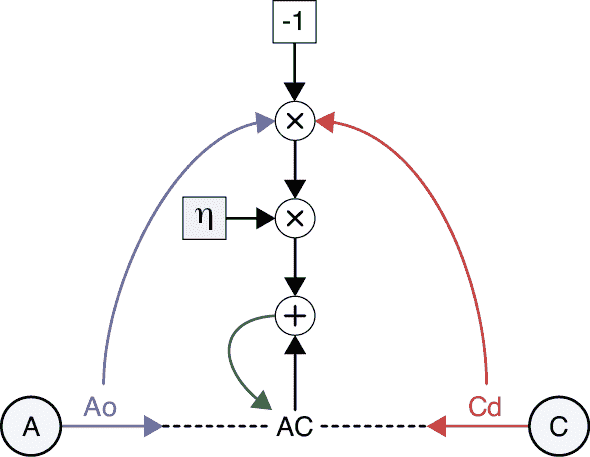

图 14-27：学习率帮助我们控制网络学习的速度，通过控制每次更新时权重变化的幅度来实现。

学习率的最佳值取决于我们构建的特定网络和我们正在训练的数据。找到一个合适的学习率对网络的学习至关重要。一旦系统开始学习，改变学习率的值可能会影响学习的快慢。通常我们需要通过反复试验来寻找最合适的*η*值。幸运的是，一些算法可以自动搜索适合的学习率初始值，而其他算法则在学习过程中对学习率进行微调。作为一个通用的经验法则，如果其他选择没有特别指示学习率，我们通常会从 0.001 左右的值开始训练网络，观察其学习效果。然后我们根据情况调整这个值，再次训练，反复进行，寻找学习最有效的学习率。我们将在第十五章更详细地讨论如何控制学习率的技术。

让我们看看学习率的选择如何影响反向传播的性能，从而影响学习效果。

### 构建二分类器

让我们构建一个分类器，找出两个月牙形区域之间的边界。我们将使用大约 1,500 个训练数据点，如图 14-28 所示。

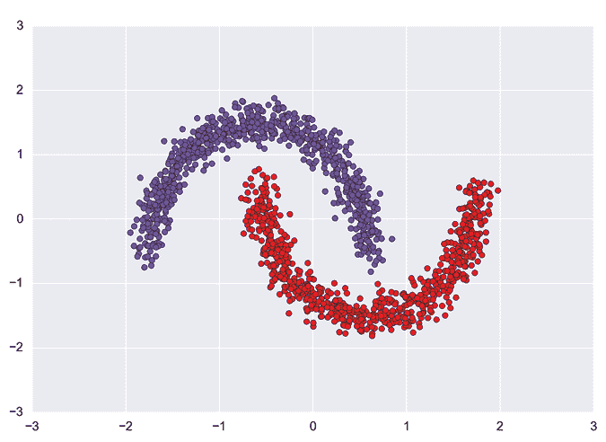

图 14-28：约 1,500 个点被分配到两个类别

因为我们只有两个类别，所以只需要一个二分类器。这使我们可以跳过标签的独热编码和处理多个输出，转而只使用一个输出神经元。如果输出接近 0，说明输入属于一个类别；如果输出接近 1，说明输入属于另一个类别。

我们的分类器只有两层隐藏层，每层包含四个神经元。这些都是我们为了讨论而做出的基本任意选择，足够复杂以满足我们的讨论需求。如图 14-29 所示，两层之间是全连接的。

这个网络对隐藏层的神经元使用 ReLU 激活函数，对输出神经元使用 sigmoid 激活函数。

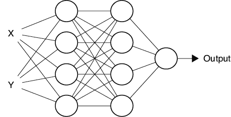

图 14-29：我们的二分类器，具有两个输入、每个隐藏层四个神经元和一个输出神经元

我们的网络中有多少个权重？每个输入有四个权重，然后在两层之间有四乘四个权重，再加上四个连接到输出神经元的权重。总数是(2 × 4) + (4 × 4) + 4 = 28。每个神经元还具有一个偏置项，所以我们的网络共有 28 + 9 = 37 个权重。所有权重都初始化为小的随机数。我们的目标是通过反向传播调整这 37 个权重，使最终神经元的输出始终与该样本的标签匹配。

正如我们之前讨论的那样，我们评估一个样本，计算误差，如果误差不为零，我们通过反向传播计算增量，然后使用学习率更新权重。然后我们继续处理下一个样本。请注意，如果误差为 0，我们就不做任何更改，因为网络已经给出了我们想要的答案。每次处理完训练集中的所有样本后，我们就说完成了一个*训练周期*。

成功运行反向传播依赖于对权重做出小的变化。这有两个原因。第一个，我们已经讨论过，是因为梯度仅在我们评估的点附近是准确的。如果我们走得太远，可能会发现自己在增加误差，而不是减少误差。

第二个小步前进的原因是，网络开始部分的权重变化会导致后续层中神经元的输出发生变化，从而改变它们的增量。为了防止一切变成相互冲突的混乱，我们只对权重做小的调整。

但是，“小”是什么意思？对于每个网络和数据集，我们必须进行实验来找出答案。正如我们之前看到的，步长的大小由学习率或 eta（*η*）控制。这个值越大，每个权重朝着新值移动的步伐就越大。

### 选择学习率

让我们从一个不寻常的大学习率 0.5 开始。图 14-30 展示了我们网络为测试数据计算的边界，每个类别使用不同的背景颜色。

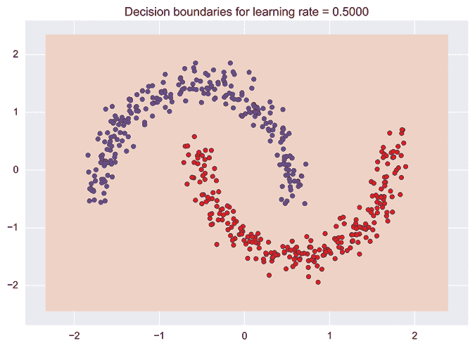

图 14-30：学习率为 0.5 时，我们的网络计算的边界

这太糟糕了：似乎根本没有任何边界！所有的点都被分配到一个类别，显示为浅橙色背景。如果我们查看每个训练周期后的准确率和误差（或损失），我们会得到图 14-31 的图形。

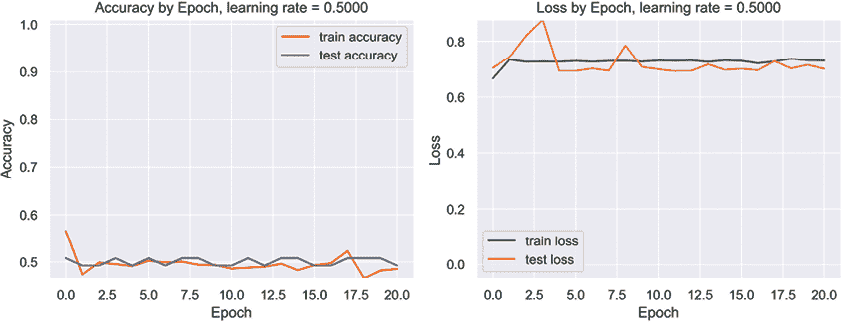

图 14-31：学习率为 0.5 时，我们的半月数据的准确率和损失

情况看起来很糟糕。正如我们预期的那样，准确率大约为 0.5，这意味着有一半的点被错误分类了。这是有道理的，因为红色和蓝色点大致平均分布。如果我们将它们都分配到一个类别，就像我们现在做的那样，那么一半的分配将是错误的。损失或误差开始时很高，并且没有下降。如果我们让网络运行几百个周期，它将继续这样运行，永远不会有所改善。

权重在做什么？图 14-32 展示了训练过程中所有 37 个权重的值。

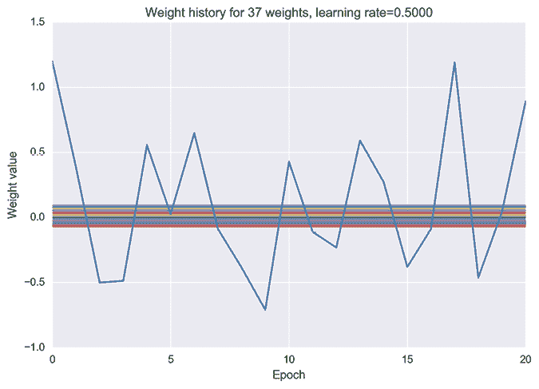

图 14-32：使用学习率为 0.5 时，我们网络的权重。一个权重不断变化并超出目标，而其他权重的变化太小，无法在图表上显示出来。

图表中由一个权重主导，它跳跃得很厉害。这个权重是连接到输出神经元的权重之一，试图调整输出以匹配标签。这个权重先上升，然后下降，然后再次上升，几乎每次都跳得太远，然后过度修正，再过度修正，如此反复。其他神经元也在变化，但变化幅度太小，在图中看不出来。

这些结果令人失望，但并不令人震惊，因为学习率 0.5 是*较大的*。这就是为什么图 14-32 中的权重会发生剧烈波动的原因。

让我们将训练率减少一个数量级，设为一个更合理（尽管仍然较大）的值 0.05。我们将保持网络和数据的其他一切不变，甚至重新使用相同的伪随机数序列来初始化权重。新的边界如图 14-33 所示。

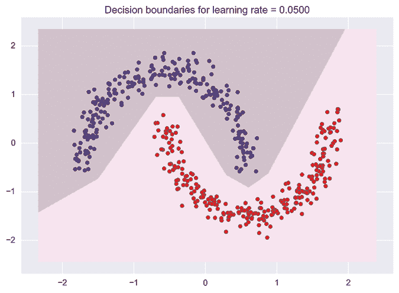

图 14-33：使用学习率为 0.05 时的决策边界

这要好得多！查看图 14-34 中的图表可以发现，在大约 16 个周期后，我们已经在训练集和测试集上都达到了 100%的准确率。使用更小的学习率给我们带来了巨大的改进。

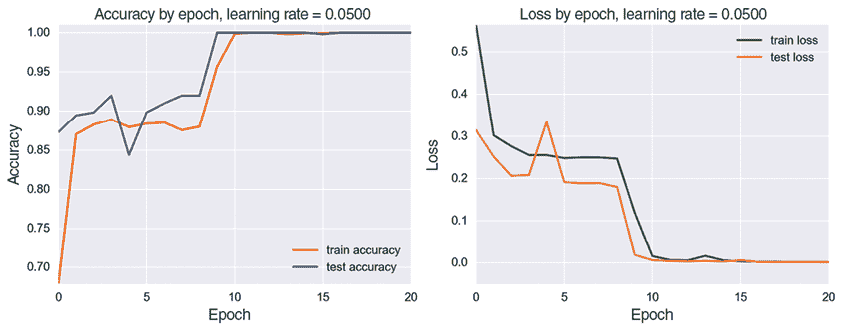

图 14-34：使用学习率为 0.05 时网络的准确率和损失

这向我们展示了为每个新的网络和数据组合调整学习率的重要性。如果一个网络无法学习，我们有时可以通过简单地降低学习率来改善情况。

现在权重在做什么？图 14-35 展示了它们的变化历史。

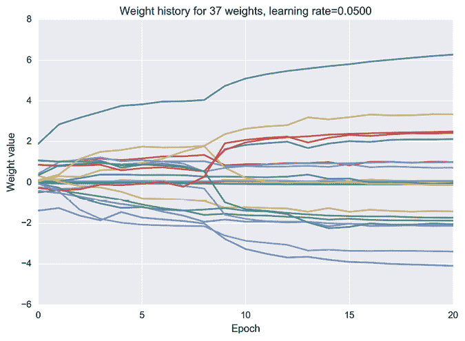

图 14-35：使用学习率为 0.05 时网络权重的变化

总体而言，这要好得多，因为许多权重正在变化。它们变得相当大，而这本身可能会抑制或减缓学习。我们通常希望权重在一个较小的范围内，通常是[–1, 1]。我们将在第十五章讨论正则化时看到一些控制权重值的方法。

图 14-33 和图 14-34 是成功的象征。我们的网络已经学会了完美地分类数据，并且只用了 16 个周期，速度很快（事实上，图表显示它只用了 10 个周期）。在一台没有 GPU 支持的 2014 年末款 iMac 上，整个 16 个周期的训练过程不到 10 秒钟。

### 一个更小的学习率

如果我们将学习率降低到 0.01 会怎样？现在权重变化得更慢了。这会带来更好的结果吗？

图 14-36 展示了这些微小步骤所产生的决策边界。这个边界看起来比图 14-33 中的边界更简单，但两个边界都完美地分开了各自的集合。

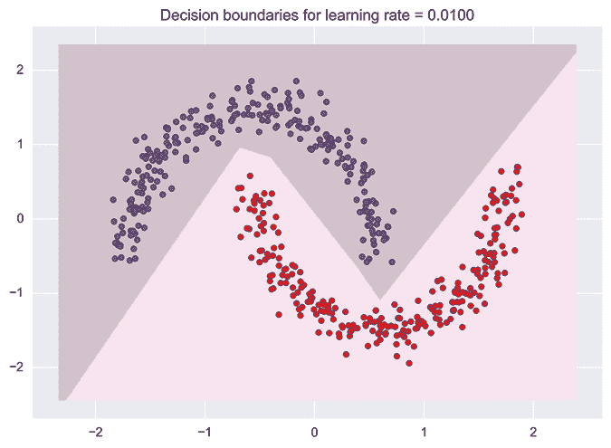

图 14-36：学习率为 0.01 时的决策边界

图 14-37 展示了我们的准确度和损失图。由于我们的学习率非常慢，网络大约需要 170 个周期才能达到 100% 的准确度，而不是像在图 14-35 中那样仅需 16 个周期。

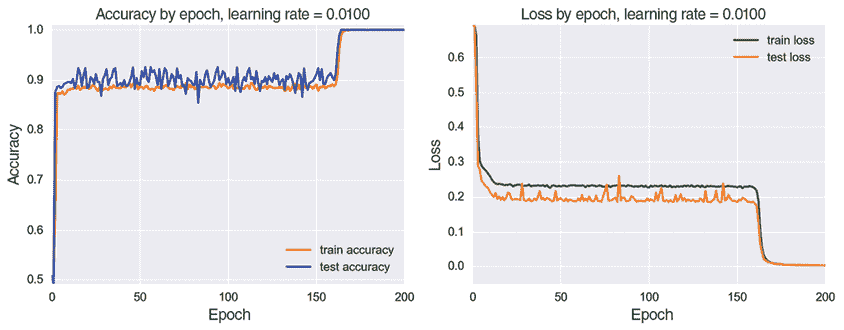

图 14-37：使用学习率 0.01 时我们网络的准确度和学习率

这些图展示了一种有趣的学习行为。经过最初的跃升后，训练和测试准确度都达到了约 90%，并在那里形成了平台。同时，损失也达到了平台状态。然后，大约在第 170 个周期左右，情况再次迅速改善，准确度攀升至 100%，错误降至零。

这种交替改善和平台区的模式并不罕见，我们甚至可以在图 14-34 中看到在第 3 到第 8 个周期之间的一个平台。这个平台是因为权重处于误差面上几乎平坦的区域，导致梯度接近零，因此它们的更新非常小。

尽管我们的权重可能陷入了局部最小值，但它们更常见的是停滞在鞍点的平坦区域，就像我们在第五章中看到的那样（Dauphin 等，2014）。有时，某些权重需要很长时间才能进入梯度足够大的区域，从而获得足够的推动力。当一个权重开始变化时，通常可以看到其他权重也开始变化，这是因为该权重的变化对网络其他部分产生了级联效应。

权重的值随时间变化几乎遵循相同的模式，如图 14-38 所示。值得注意的是，在我们的训练过程中，至少部分权重并非处于平坦或平台区，而是有变化的，尽管这些变化较慢。系统在不断改进，但进展非常缓慢，直到大约第 170 个训练周期，性能图中的变化才变得明显。

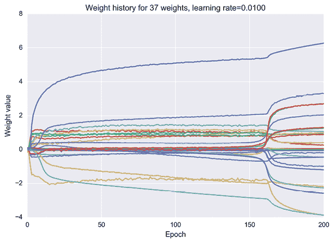

图 14-38：使用学习率 0.01 时我们权重的变化历史

那么，降低学习率到 0.01 是否有好处呢？在这种情况下，并没有太大帮助。即使是 0.05，分类结果在训练数据和测试数据上已经非常完美。对于这个网络和这个数据，较小的学习率只是意味着网络学习的时间更长。这项调查向我们展示了网络对学习率选择的敏感性。我们需要找到一个既不太大也不太小，而是恰到好处的值（Pyle 1918）。

我们通常在开发几乎每个深度学习网络时都会进行这类学习率的实验。我们需要找到一个在特定网络和数据上表现最好的值。幸运的是，在第十五章中，我们将看到一些算法，可以通过复杂的方式自动调整学习率。

## 总结

本章讲解了反向传播。我们看到，我们可以预测网络的误差如何随着每个权重的变化而变化。如果我们能确定每个权重应该增加还是减少，我们就能减少误差。

为了找出如何调整每个权重，我们从给每个神经元分配一个 delta 值开始。这个值告诉我们权重值变化和最终误差变化之间的关系。这使我们能够确定如何调整每个权重，以减少误差。

这些 delta 的计算从最后一层开始，逐层向前传播。因为计算每个神经元的 delta 所需的梯度信息是逐层向后传播的，所以我们得名*反向传播*。反向传播可以在 GPU 上实现，在那里我们可以同时为多个神经元进行计算。

需要记住的是，反向传播是传播误差的梯度，梯度是告诉我们当权重变化时，误差如何变化的信息。一些作者随意地将反向传播称为传播误差，但这是一种误导性的简化。我们传播的是梯度，它告诉我们如何调整权重，以改善网络的输出。

现在我们知道每个权重是应该增加还是减少，我们需要决定实际的调整幅度。这正是我们将在下一章中解决的问题。
