# 第十五章：优化器

训练神经网络通常是一个耗时的过程。任何能够加速这一过程的方法，都是我们工具箱中的一个受欢迎的补充。本章介绍了一类旨在通过提高梯度下降效率来加速学习的工具。其目标是让梯度下降运行得更快，并避免一些可能导致其陷入困境的问题。这些工具还自动化了寻找最佳学习率的部分工作，包括能够随着时间推移自动调整学习率的算法。这些算法统称为*优化器*。每个优化器都有其优缺点，因此熟悉它们是值得的，这样我们在训练神经网络时才能做出明智的选择。

让我们先画一些图，帮助我们可视化误差以及它在学习过程中如何变化。这些图将帮助我们为接下来要介绍的算法建立一些直觉。

## 误差作为二维曲线

将系统中的误差从几何学的角度进行思考，通常会非常有帮助。我们经常将误差绘制为二维曲线。

为了熟悉这种二维误差，我们考虑将表示为线上的点的两个类别样本进行划分的任务。负值处的点属于一个类别，零及以上的点属于另一个类别，如图 15-1 所示。

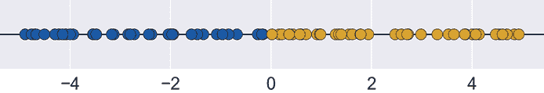

图 15-1：线上的两个类别的点。位于 0 左侧的点属于类别 0，显示为蓝色，其他点属于类别 1，显示为米色。

让我们为这些样本构建一个分类器。在这个例子中，边界只由一个数字构成。所有位于该数字左侧的样本都被分配到类别 0，所有位于右侧的样本都被分配到类别 1。如果我们想象将这个划分点沿着线移动，我们可以统计被误分类的样本数量，并将其作为我们的误差。我们可以将结果总结为一个图表，其中 X 轴展示了每个潜在的分割点，而与该点相关的误差则作为一个点绘制在其上。图 15-2 展示了这一结果。

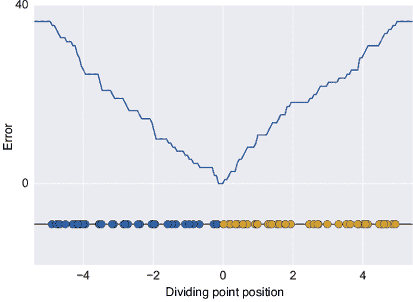

图 15-2：绘制简单分类器的误差函数

我们可以将图 15-2 中的误差曲线平滑化，如图 15-3 所示。

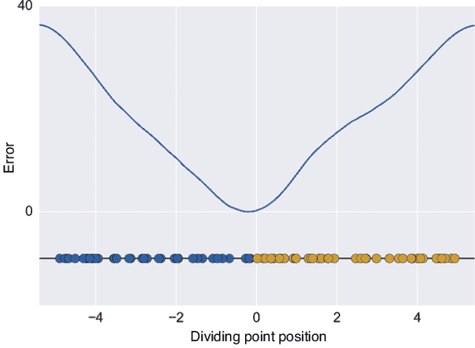

图 15-3：平滑后的图 15-2 版本

对于这组特定的随机数据，我们看到当我们处于 0 或者稍微偏左时，误差为 0。这告诉我们，无论从哪里开始，我们都希望最后将分隔线放在 0 的左侧。

我们的目标是找到一种方法，定位任何误差曲线的最小值。当我们能够做到这一点时，我们就可以将这一技术应用于神经网络的所有权重，从而减少整个网络的误差。

## 调整学习率

当我们使用梯度下降法来训练系统时，关键参数是学习率，通常用希腊字母 *η*（eta）表示。它通常的取值范围是 0.01 到 0.0001。较大的值会导致更快的学习，但也可能会直接跳过深谷而错过它们。较小的 *η* 值（接近 0，但始终为正数）会导致学习较慢，并能够找到较窄的谷底，但也可能会停滞在较浅的谷底，即使附近存在更深的谷底。图 15-4 通过图形方式回顾了这些现象。

许多优化器共享一个重要的理念，即通过在学习过程中逐渐调整学习率来提高学习效果。这个思路类似于使用金属探测器在海滩上寻找埋藏的金属物品。我们开始时大步走过海滩，但当探测器响起时，我们会逐步缩小步伐，以精确定位金属物品的位置。以此类推，在学习过程的早期，我们通常会在误差曲线中大步前进，寻找谷底。随着时间的推移，我们希望找到了这个谷底，此时我们可以逐渐减小步伐，朝着最低点前进。

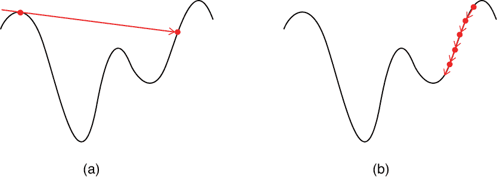

图 15-4：学习率 *η* 的影响。 (a) 当 *η* 太大时，我们可能会跳过一个深谷而错过它。 (b) 当 *η* 太小时，我们可能会慢慢下降到局部最小值，从而错过更深的谷底。

我们可以用一个简单的误差曲线来说明我们的优化器，该曲线包含一个孤立的谷底，其形状为负高斯分布，如图 15-5 所示。

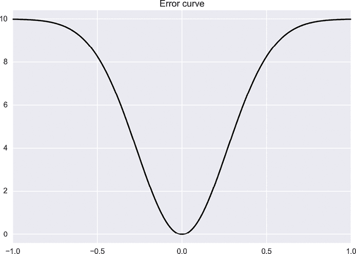

图 15-5：我们查看优化器时的误差曲线

该误差曲线的一些梯度在图 15-6 中展示（实际上我们展示的是负梯度）。

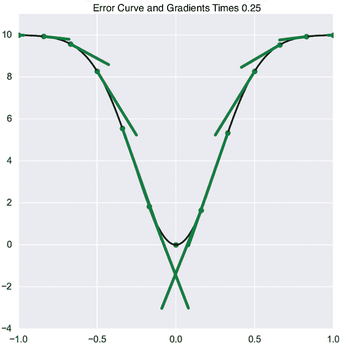

图 15-6：我们的误差曲线及其在某些位置的负梯度（缩小了 0.25 倍）

图 15-6 中的梯度已被缩小至实际长度的 25%，以便清晰显示。我们可以看到，对于这条曲线，输入值小于 0 时梯度为负，输入值大于 0 时梯度为正。当输入为 0 时，我们处在碗底，所以此时梯度为 0，表示为一个点。

### 常量大小的更新

让我们通过观察使用常量学习率时会发生什么，来开始研究学习率的影响。换句话说，我们始终使用一个固定的 *η* 值来调整梯度，该值在整个训练过程中保持不变。

图 15-7 展示了使用固定 *η* 进行更新的基本步骤。

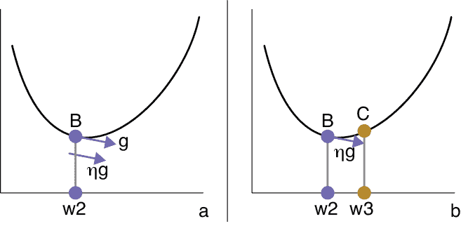

图 15-7：寻找基本梯度下降的步长

假设我们正在查看神经网络中的一个特定权重。假设该权重初始值为 w1，我们更新了一次它，现在它的值变为 w2，如图 15-7(a)所示。其对应的误差是误差曲线上直接位于其上方的点，标记为 B。我们希望再次更新该权重，得到一个新的、更好的值，称为 w3。

为了更新权重，我们找到误差面上 B 点的梯度，表示为箭头*g*。我们通过学习率*η*来缩放该梯度，得到一个新箭头，标记为*ηg*。因为*η*介于 0 和 1 之间，*ηg*是一个与*g*方向相同但大小要么相同要么更小的新箭头。

在图 15-7 中，我们显示的梯度箭头*g*实际上是梯度的*相反*方向，或负梯度。正梯度和负梯度沿同一条线指向相反的方向，因此当正负梯度的选择能够从上下文中理解时，人们通常直接称之为*梯度*。我们将在本章中遵循这一约定。

为了找到 w3，即权重的新值，我们将缩放后的梯度加到 w2 上。用图示表示，这意味着我们将箭头*ηg*的尾部放置在 B 点，如图 15-7(b)所示。该箭头尖端的水平位置就是权重的新值 w3，而它的值，直接位于其上方的误差面上，标记为 C。在这种情况下，我们走得有点太远，导致误差略微增加。

让我们通过一个具有单一谷底的误差曲线来看这个技巧的实际应用。图 15-8 展示了左上角的起始点。这里的梯度很小，所以我们向右移动了一小步。此时新点的误差比我们开始时的误差稍微小一些。

对于这些图示，我们选择了*η* = 1/8，即 0.125。这是一个非常大的*η*值，通常在恒定步长的梯度下降法中，我们常使用 1/100 或更小的值。我们选择这个较大的值是因为它能使图示更清晰。较小的值也能以类似的方式工作，只是速度更慢。我们没有在这些图表的坐标轴上显示数值，以避免视觉上的混乱，因为我们更关注发生的现象，而不是具体的数字。

图 15-8：使用恒定学习率的学习过程

我们并不是通过整个梯度移动到第一个点，而是只移动了梯度长度的 1/8。这一移动使我们到达了曲线的一个更陡峭部分，那里梯度较大，因此下一个更新会移动得更远。每一步学习都会用一种新的颜色显示，我们用这种颜色绘制上一个位置的梯度，然后是新点。

我们在图 15-9 中展示了六步的特写，从图 15-8 中的第一步开始。我们还显示了每个点的误差。

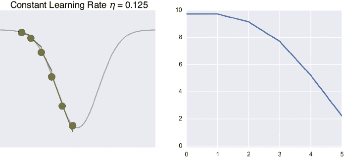

图 15-9：左：接近图 15-8 中的最终图像。右：与这六个点相关的误差。

这个过程会最终到达碗底并将误差降至 0 吗？图 15-10 展示了该过程的前 15 步。

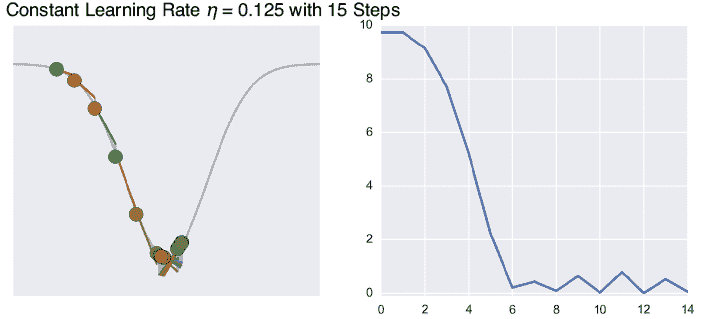

图 15-10：左：使用恒定学习率的前 15 步。右：这些 15 个点的误差。

我们接近底部，然后沿右侧的山坡向上走。但这没关系，因为这里的梯度指向下方和左侧，所以我们又往下走进谷底，直到再次超过底部，最终出现在左侧，然后我们掉头再度超过底部，最终出现在右侧，如此反复。我们正在*在碗底反弹*。

看起来我们永远也无法到达 0。这个问题在对称的谷底特别严重，因为误差在最小值的左右两侧反复跳动。但是，当我们使用恒定学习率时，这种行为很常见。反弹现象的发生是因为我们靠近谷底时希望采取小步伐，但由于学习率是恒定的，我们采取的步伐过大。

我们可能会想，图 15-10 中的反弹问题是否是由学习率过大引起的。图 15-11 显示了对于某些较小的*η*值，前 15 步的情况。

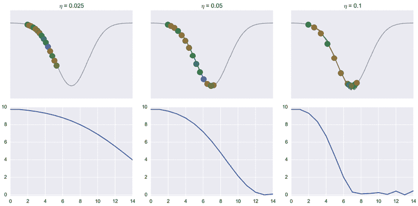

图 15-11：用小学习率进行 15 步。上排：学习率分别为 0.025（左列）、0.05（中列）和 0.1（右列）。下排：上排对应点的误差。

从图 15-11 中我们可以看到，采取较小的步伐并不能解决反弹问题，尽管反弹幅度变小了。另一方面，增加学习率会使反弹问题更加严重，正如图 15-12 所示。

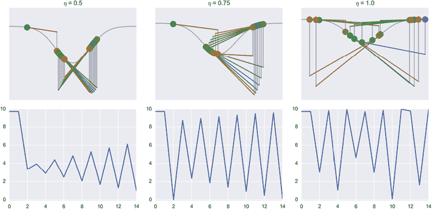

图 15-12：上排：学习率分别为 0.5（左列）、0.75（中列）和 1.0（右列）。下排：上排对应点的误差。

较大的学习率也可能导致我们跳出一个具有较低最小值的好谷底。在图 15-13 中，从绿色点出发，我们直接跳过了当前所在的谷底（并希望停留其中），进入了一个具有较大最小值的新谷底。

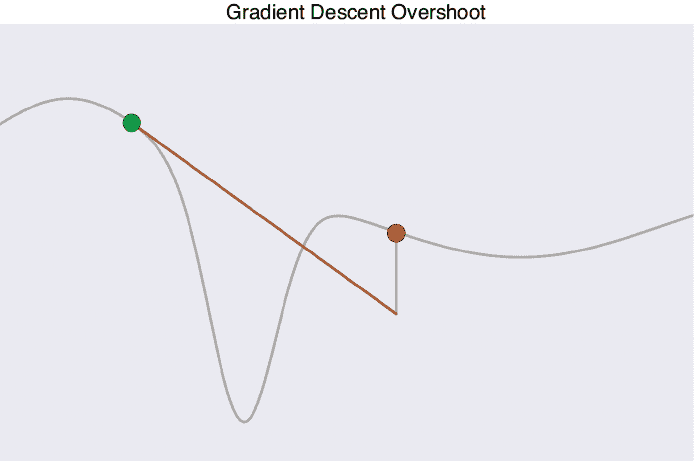

图 15-13：大步伐超过谷底，最终进入一个具有更高最小值的不同谷底。

有时像这样的较大跳跃可以帮助我们从一个较浅的山谷移动到更深的山谷，但对于如此大的学习率，我们可能会在山谷之间反复跳动，永远找不到最小值。找到一个既能以合理速度移动，又不会过度跳跃或困在底部反弹的学习率似乎是一个挑战。一个不错的替代方法是随着训练的进行逐步调整学习率。

### 随着时间变化调整学习率

我们可以在学习初期使用较大的 *η*，以避免进展缓慢，而在学习后期使用较小的 *η*，以避免在碗底部反复跳动。

一种简单的开始时较大并逐渐变小的方法是每次更新后将学习率乘以一个接近 1 的数值。我们可以使用 0.99 作为乘数，假设初始学习率为 0.1。然后在第一步之后，它将变为 0.1 × 0.99 = 0.099。在下一步，它将变为 0.099 × 0.99 = 0.09801。图 15-14 展示了当我们在多个步骤中使用不同的乘数时，*η* 会发生什么变化。

编写这些曲线方程最简单的方法是使用指数，因此这种曲线被称为 *指数衰减* 曲线。我们在每一步乘以的值称为 *衰减参数*。这个值通常是一个接近 1 的数值。

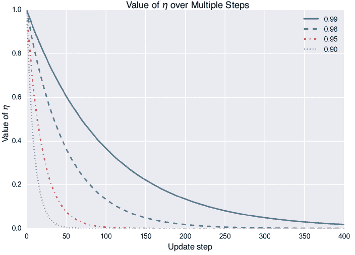

图 15-14：从学习率 *η* = 1 开始，各种曲线显示了在每次更新后，学习率如何在乘以给定的值后下降。

让我们将这种学习率逐渐减少的方法应用于梯度下降中的误差曲线。我们再次从学习率 1/8 开始。为了使衰减参数的效果更加明显，我们将它设置为不寻常的低值 0.8。这意味着每一步将只有前一步的 80%。图 15-15 展示了前 15 步的结果。

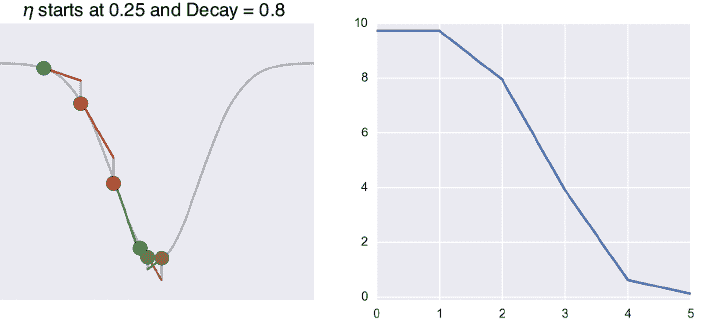

图 15-15：使用递减学习率的前 15 步

让我们将这个与使用常数步长时的“反弹”结果进行比较。图 15-16 展示了常数步长和递减步长的结果对比，进行 15 步更新。

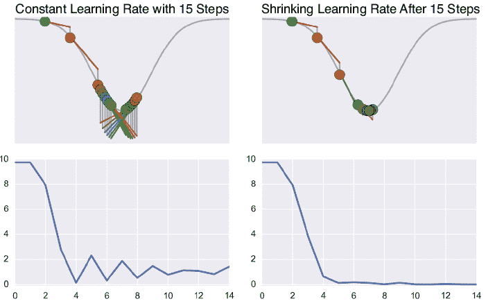

图 15-16：左侧是图 15-10 中的常数步长，右侧是图 15-15 中的递减步长。注意到递减学习率帮助我们有效地在山谷的最小值处稳定下来。

递减步长成功地帮助我们稳定地达到碗底并保持在那里。

### 衰减计划

衰减技术很有吸引力，但它带来了一些新挑战。首先，我们需要选择一个衰减参数的值。其次，我们可能不想在每次更新后都应用衰减。为了解决这些问题，我们可以尝试其他一些减少学习率的策略。

改变学习率随时间的任何方法称为*衰减计划*（Bengio 2012）。

衰减计划通常以时期来表达，而不是样本。我们在训练集中的所有样本上进行训练，然后考虑在再次训练所有样本之前改变学习率。

最简单的衰减计划是在每个时期后始终应用学习率衰减，正如我们刚刚看到的那样。 图 15-17(a) 显示了这个计划。

另一种常见的调度方法是暂时不施加任何衰减，这样我们的权重有机会摆脱它们的起始随机值，并进入可能接近找到最小值的某种状态。然后我们应用我们选择的任何计划。 图 15-17(b) 显示了这种*延迟指数衰减*方法，将图 15-17(a)的指数衰减调度推迟了几个时期。

另一个选择是仅偶尔应用衰减。 图 15-17(c) 中显示的*间隔衰减*方法，也称为*固定步长衰减*，在每隔固定数量的时期后减少学习率，例如每 4 个或 10 个时期。 这样我们就不会过快地变得太小。

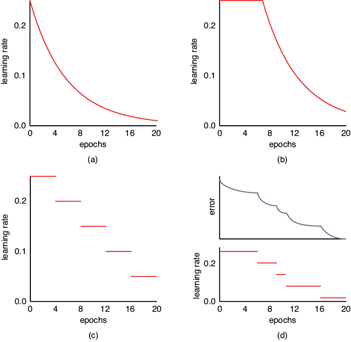

图 15-17：随时间减小学习率的衰减计划。（a）指数衰减，在每个时期后减少学习率。（b）延迟指数衰减。（c）间隔衰减，在每个固定数量的时期后减少学习率（这里是 4 个）。 （d）基于错误的衰减，在误差停止下降时减少学习率。

另一个选项是监视网络的误差。只要误差在下降，我们就坚持使用现有的学习率。当网络停止学习时，我们应用衰减，以便它可以采取较小的步骤，希望能够进入错误景观的更深处。这种*基于误差的衰减*显示在图 15-17(d)中。

我们可以很容易地设计出许多替代方案，例如仅在误差减少一定量或百分比时应用衰减，或者仅通过减去一个小值而不是乘以接近 1 的数来更新学习率（只要我们在某个正值停止—如果学习率降至 0，系统将停止学习，如果学习率变为负数，系统将增加错误，而不是减少错误）。

如果我们愿意，甚至可以随着时间的推移增加学习率。*强力驱动*方法会查看每个训练周期后总损失的变化（Orr 1999a; Orr 1999b）。如果误差在下降，我们就*增加*学习率一点，比如从 1%增加到 5%。其思路是，如果一切进展顺利，且误差在下降，我们就可以采取大步伐。但如果误差上升得超过一点，我们就大幅降低学习率，将其减半。这样，我们可以立即停止任何增幅，以免它们把我们带离之前下降的误差。

学习率调度的缺点是我们必须提前选择它们的参数（Darken, Chang, 和 Moody 1992）。我们将这些参数视为*超参数*，就像学习率本身一样。大多数深度学习库提供了自动搜索值范围的例程，帮助我们找到一个或多个超参数的最佳值。

一般来说，调整学习率的简单策略通常效果很好，而且大多数机器学习库让我们可以轻松选择其中之一（Karpathy 2016）。

大多数机器学习系统都具备某种形式的学习率衰减。我们希望在早期阶段快速学习，大步走过整个数据景观，寻找能找到的最低点。然后我们减少学习率，使得我们能够逐渐采取更小的步伐，最终停留在我们找到的山谷的最低处。

自然会有人想知道是否有一种方法，可以控制学习率，而不依赖于我们在训练开始前设置的调度。我们一定能以某种方式检测到我们接近最小值、处于一个盆地中，或在四处跳动，并自动调整学习率以作出响应。

更有趣的问题是，或许我们并不希望对所有权重应用相同的学习率调整。能够调整更新，让每个权重以最适合它的学习速率进行学习，应该是件不错的事。

让我们看看一些针对梯度下降的变体，来解决这些问题。

## 更新策略

在接下来的章节中，我们将比较三种不同方式来增强梯度下降的表现。在这些例子中，我们使用一个小的，但真实的二分类问题。

图 15-18 展示了我们熟悉的两个模糊的新月形数据集。这些点的类别通过颜色显示。300 个样本是我们本章其余部分的参考数据。

为了比较不同的网络，我们需要训练它们直到误差达到最小值，或者似乎不再改善。我们可以通过绘制每个训练周期后的误差图表来展示训练结果。由于算法之间的差异，这些图表中的周期数变化范围较大。

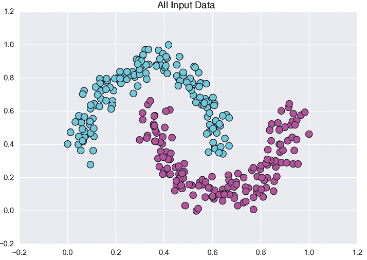

图 15-18：我们在本章其余部分使用的数据。这 300 个点分为两个类别，每个类别 150 个点。

为了对我们的数据点进行分类，我们将使用一个具有三个全连接隐藏层（分别有 12、13 和 13 个节点）以及一个包含 2 个节点的输出层的神经网络，这样可以给出每个类别的概率。我们将在每个隐藏层使用 ReLU 激活函数，并在最后使用 softmax 函数。输出层概率较大的类别将作为我们的网络预测结果。为了保持一致性，当我们需要一个固定的学习率时，我们使用*η* = 0.01。该网络在图 15-19 中展示。

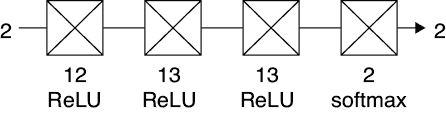

图 15-19：我们包含四个全连接层的网络

### 批量梯度下降

我们首先更新每个周期（epoch）中的权重一次，在评估完所有样本之后。这就是*批量梯度下降*（也叫做*周期梯度下降*）。在这种方法中，我们将整个训练集输入到系统中，累积所有的误差。然后我们使用所有样本的合成信息，更新所有权重一次。

图 15-20 展示了使用批量梯度下降进行典型训练时的误差。

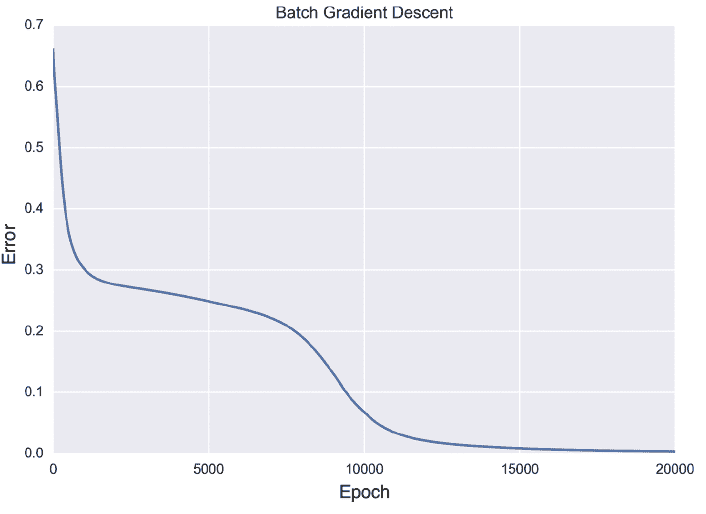

图 15-20：使用批量梯度下降的训练运行误差

整体特征令人放心。一开始，误差大幅下降，表明网络正在开始进入误差面上的一个陡峭区域。随后曲线变得平缓。此时的误差面可能是一个几乎平坦的浅鞍点区域，或者是一个几乎是平台的区域，只是稍微有点倾斜，因为误差虽然逐渐变小，但仍在继续下降。最终，算法找到另一个陡峭的区域，并将误差一直降到 0。

批量梯度下降看起来非常平滑，但要将这个网络和数据的误差降到接近 0，需要大约 20,000 个周期，这可能需要很长时间。让我们通过放大前 400 个周期，仔细看看从一个周期到下一个周期发生了什么，具体内容见图 15-21。

看起来批量梯度下降的过程确实非常平滑。这是有道理的，因为它在每次更新时都使用了所有样本的误差。

批量梯度下降通常会产生平滑的误差曲线，但在实际应用中存在一些问题。如果我们的样本超过了计算机内存的容量，那么*分页*（即从较慢的存储介质中读取数据）成本会变得相当高，从而使训练过程变得非常缓慢。在处理包含数百万样本的庞大数据集时，这可能是一个问题。因为从较慢的内存（甚至硬盘）中一次次读取样本可能会耗费大量时间。解决这个问题有办法，但通常需要做很多工作。

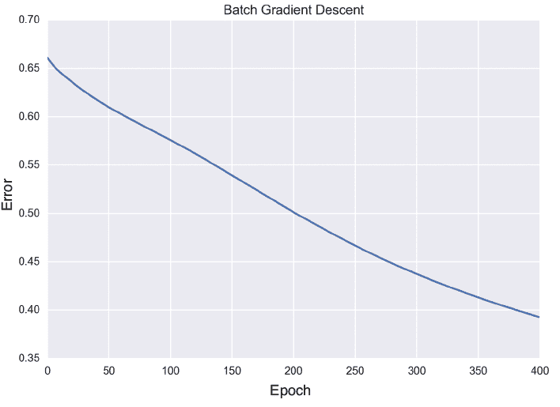

图 15-21：在图 15-20 中展示的批量梯度下降前 400 个周期的特写

与此相关的内存问题是，我们必须保留所有样本并使其随时可用，以便每个周期都能循环使用它们。我们有时会说批量梯度下降是一个*离线算法*，意味着它严格依赖于其存储和可访问的信息。我们可以想象将计算机与所有网络断开连接，它仍然可以从所有训练数据中继续学习。

### 随机梯度下降

让我们转向另一个极端，每个样本处理后就更新一次权重。这就是所谓的*随机梯度下降*，或更常见的简称*SGD*。回想一下，*随机*一词大致相当于*随机*，它的使用是因为我们将训练样本以随机顺序呈现给网络，因此无法预测权重如何从一个样本变到下一个样本。

由于我们每处理一个样本就更新一次权重，我们的数据集有 300 个样本，这就意味着每个周期内我们需要更新 300 次权重。这会导致误差剧烈波动，因为每个样本都会推动权重发生一次变化，接着又会发生反向变化。由于我们仅按每个周期绘制误差，我们看不到这种小范围的波动。但我们仍然能看到每个周期之间存在较大的变化。

图 15-22 展示了我们使用 SGD 从该数据中学习的网络误差。

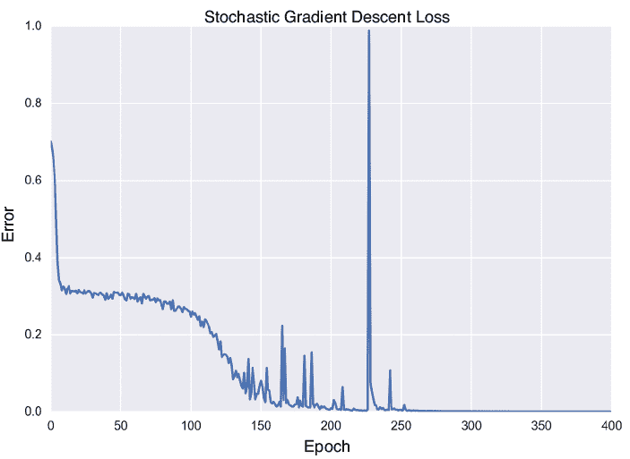

图 15-22：随机梯度下降，或 SGD

这张图与图 15-20 中批量梯度下降的图形大致相同，这是有道理的，因为两个训练过程使用了相同的网络和数据。

在大约第 225 个周期时，出现了一个巨大的峰值，显示了 SGD 的不确定性。样本的顺序以及网络权重更新的方式导致了误差从接近 0 飙升至接近 1。换句话说，网络从几乎正确分类每个样本，到几乎错误地分类每个样本，再到恢复正确（尽管这个恢复花了几个周期，正如峰值右侧的小曲线所示）。如果我们在学习过程中观察误差，可能会在这个峰值时倾向于停止训练。如果我们使用自动算法来观察误差，它也可能在这里停止。然而，就在这个峰值之后的几个周期内，系统已经恢复过来，我们又回到了接近 0 的误差。这个算法的确展现了“*随机*”这一特性。

从图中我们可以看到，SGD 在仅仅 400 个周期内就将误差降到了接近 0。之后我们切掉了图 15-22，因为从那时起曲线一直保持在 0。与此相比，图 15-20 中的批量梯度下降大约需要 20,000 个周期。这种相较于批量梯度下降的效率提升是典型的（Ruder 2017）。

但是让我们做一个公平的比较。每个算法更新权重的次数是多少？批量梯度下降在每个批次之后更新权重，所以 20,000 个时期意味着它进行了 20,000 次更新。SGD 在每一个样本后都进行更新。因此，在 400 个时期中，它执行了 300 × 400 = 120,000 次更新，是批量梯度下降的六倍。关键在于，实际等待结果的时间并不完全由时期数决定，因为每个时期所需的时间可能会有很大差异。

我们称 SGD 为*在线算法*，因为它不需要样本存储，也不需要样本在每个时期之间保持一致。它只处理每个到达的样本，并立即更新网络。

SGD 产生的结果噪声较大，正如我们在图 15-22 中看到的那样。这既是优点也是缺点。其优点是 SGD 可以在寻找最小值的过程中，从误差面的一一区域跳跃到另一一区域。但缺点是，SGD 可能会越过一个深度最小值，然后花费时间在一个误差更大的谷底中徘徊。随着时间的推移，降低学习率确实有助于解决跳跃问题，但进展通常仍然是噪声较大的。

误差曲线中的噪声可能是一个问题，因为它使得我们很难判断系统何时正在学习，何时开始过拟合。我们可以观察多个时期的滑动窗口，但我们可能直到很久以后才知道自己已经越过了最小误差。

### 小批量梯度下降

我们可以在批量梯度下降（每个时期更新一次）和随机梯度下降（每个样本后更新一次）这两种极端之间找到一个不错的折衷。这个折衷方法称为*小批量梯度下降*，有时也叫*小批量 SGD*。在这里，我们在评估了一定数量的样本后更新权重。这个数量通常远小于批量大小（即训练集中的样本数）。我们称这个较小的数量为*小批量大小*，从训练集中抽取的这些样本组成了一个*小批量*。

小批量的大小通常是 2 的幂，介于大约 32 到 256 之间，通常选择这个大小是为了充分利用我们 GPU 的并行计算能力（如果我们有 GPU 的话）。但这只是出于效率考虑。实际上，我们可以选择任何我们喜欢的小批量大小。

图 15-23 显示了使用 32 个样本的小批量的结果。

这确实是两种算法的一个很好的结合。曲线平滑，像批量梯度下降一样，但并不是完美的。它大约在 5,000 个时期后下降到 0，介于 SGD 需要的 400 个时期和批量梯度下降的 20,000 之间。图 15-24 展示了前 400 步的详细情况。

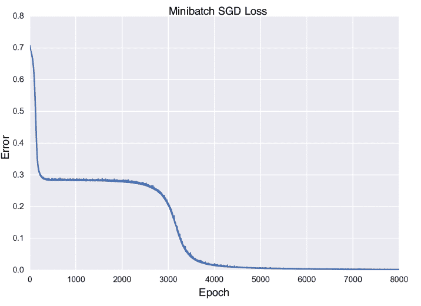

图 15-23：小批量梯度下降

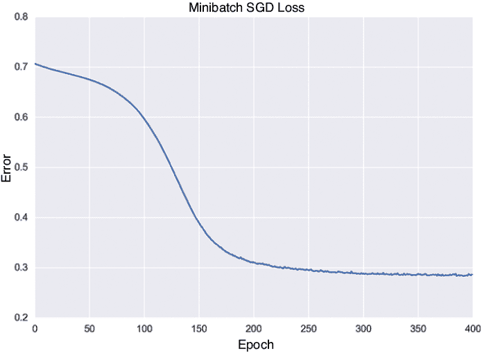

图 15-24：显示图 15-23 的前 400 次训练周期的特写，展示了训练初期的深度下降

mini-batch SGD 进行了多少次更新？我们有 300 个样本，且使用了 32 的 mini-batch 大小，因此每个 epoch 有 10 个 mini-batch。（理想情况下，我们希望 mini-batches 能精确地划分输入数据的大小，但在实际中，我们无法控制数据集的大小，这通常导致最后一个 mini-batch 是不完整的。）所以，每个 epoch 更新 10 次，乘以 5,000 次 epoch，总共是 50,000 次更新。这也恰好位于批量梯度下降的 20,000 次更新和 SGD 的 120,000 次更新之间。

Mini-batch 梯度下降比 SGD 更少噪声，这使它在跟踪误差时具有吸引力。该算法通过使用 GPU 并行计算来利用巨大的效率提升，能够在 mini-batch 中评估所有样本。它比批量梯度下降更快，并且在实践中比 SGD 更具吸引力。

因为这些原因，mini-batch SGD 在实践中非常流行，而“普通”SGD 和批量梯度下降则相对较少使用。事实上，在文献中，当提到 *SGD* 这个术语，甚至是 *梯度下降* 时，通常理解为作者指的是 mini-batch SGD（Ruder 2017）。为了让事情变得更复杂，*batch* 这个术语通常用来代替 *mini-batch*。由于基于 epoch 的梯度下降如今使用得非常少，关于批量梯度下降和批次的引用几乎总是指 mini-batch 梯度下降和 mini-batches。

## 梯度下降变体

Mini-batch 梯度下降是一个重要的算法，但它并不完美。让我们回顾一下 mini-batch 梯度下降的一些挑战，以及解决这些问题的一些方法。按照惯例，从这里开始我们将 mini-batch 梯度下降称为 SGD。（本节的结构灵感来自 Ruder 2017。）

我们面临的第一个挑战是指定我们希望使用的学习率 *η* 的值，这通常是一个难以提前确定的问题。如我们所见，过小的学习率可能导致学习时间过长，且陷入浅层局部最小值，而过大的学习率则可能导致我们越过深层局部最小值，然后在找到最小值后在其中反复跳动。如果我们通过使用衰减计划来改变 *η* 来避免这个问题，我们仍然需要选择 *η* 的初始值，以及计划的超参数。

我们还需要选择 mini-batch 的大小。这通常不是问题，因为我们通常选择与我们的 GPU 或其他硬件结构最匹配的计算值。

让我们考虑一些改进。现在，我们是通过一个统一的更新速率来更新所有权重。我们可以为系统中的每个权重找到一个独特的学习速率，这样我们不仅是在朝最佳方向移动它，还在以最佳的幅度进行移动。我们将在接下来的页面中看到这方面的例子。

另一个改进是基于这样一个认识：有时当误差面形成鞍点时，表面在所有方向上可能都很浅，所以在局部范围内，它几乎是一个（但不完全是）平原。这会让我们的进展变得非常缓慢。研究表明，深度学习系统的误差面中往往有很多鞍点（Dauphin 等，2014）。如果有办法在这些情况下不再被卡住，或者更好的是，避免在一开始就陷入这种困境，那就太好了。同样，平原也应该避免：我们希望避免进入那些梯度下降到 0 的平坦区域，当然，除非是我们要寻找的最小值。

让我们来看看一些解决这些问题的梯度下降变种。

### 动量

让我们同时考虑两个权重。我们可以在 XY 平面上绘制它们的值，并在它们上方展示通过这些权重值训练系统所产生的误差。让我们把误差面看作是一片地形。现在我们可以将最小化误差的任务想象成跟随一滴水，寻找最低点的过程。

图 15-25 重复了第五章中的一张图，展示了这种思考训练过程的方式。

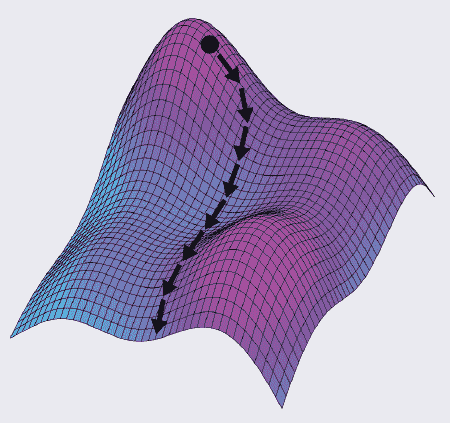

图 15-25：一滴水沿误差面滚动。这是第五章中的一张重复图。

我们可以将水替换为一个小球，想象它沿着误差面滚动。我们知道从物理世界的角度来看，一个真正的球沿着山坡滚动时，会有一些*惯性*，它描述了物体对其运动变化的抵抗力。如果它沿某个方向以一定速度滚动，除非有外力干扰，否则它会继续保持该方向的运动。

一个相关的概念是小球的*动量*，从物理角度来看，这个概念稍微抽象一些。虽然它们是不同的概念，但有时深度学习的讨论中会随意地将惯性称为动量，而我们接下来要看的算法也使用了这一术语。

这个概念使得图 15-25 中的小球在从山顶滚下来并经过图中间的鞍点后，能够继续沿着平台移动。如果小球的运动仅仅由梯度决定，那么当它到达图中间的平原时，它会停下（或者如果它接近平原，小球会慢慢停止）。但小球的动量（或更准确地说，是惯性）让它继续滚动。

假设我们靠近 图 15-26 左侧。随着我们沿着山坡向下滚动，我们在约 -0.5 处到达平台期。

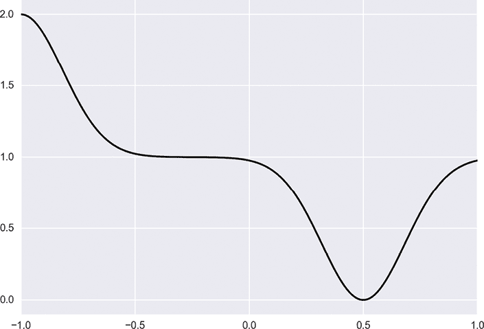

图 15-26：带有平台期的错误曲线，介于山峰和山谷之间

使用常规梯度下降时，我们会在平台期停止，因为梯度为零，如 图 15-27 左图所示。但如果我们加入一些动量，如右图所示，球体会继续滚动一段时间。虽然它会逐渐减慢，但如果幸运的话，它会继续滚动足够远，找到下一个山谷。

*动量梯度下降*（Qian 1999）技术基于这个思想。对于每一步，一旦我们计算出每个权重的变化量，我们会在其中加入上一阶段的少量变化。如果在某一步的变化为 0，或者接近 0，但在上一阶段我们有较大的变化，我们就会利用之前的动量，帮助我们继续前进，跨越平台期。

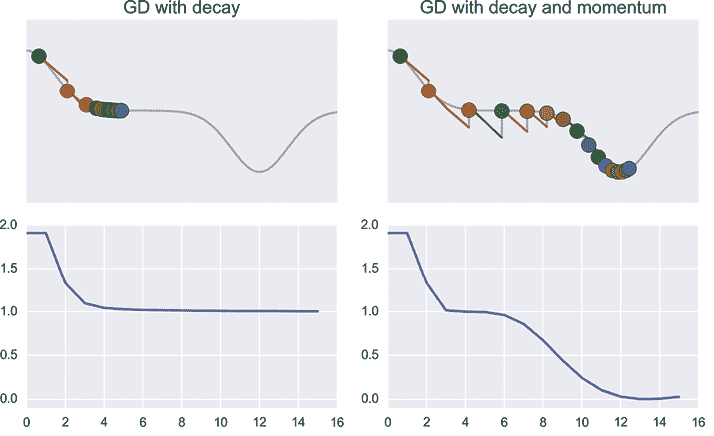

图 15-27：在 图 15-26 错误曲线上的梯度下降。左：带衰减的梯度下降。右：带衰减和动量的梯度下降。

图 15-28 直观地展示了这一概念。

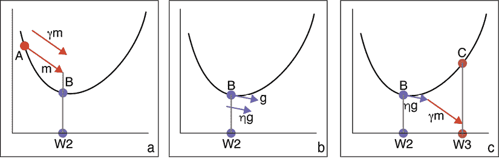

图 15-28：带动量的梯度下降步长的寻找

假设某个权重的误差为 A。我们将该权重更新为值 w2，并且误差为 B。现在，我们想找到下一个权重值 w3，它将有误差 C。为了找到 C，我们需要找出对点 A 所做的变化。也就是说，我们需要找到施加在 A 上的先前变化。这就是动量，用 *m* 表示，如 图 15-28(a) 所示。

我们将动量 *m* 乘以一个缩放因子，通常用小写希腊字母 *γ*（gamma）表示。有时这被称为 *动量缩放因子*，其值介于 0 到 1 之间。将 *m* 乘以这个值后，我们得到一个新的箭头 *γm*，它的方向与 *m* 相同，但长度相同或更短。然后，我们像之前一样，在 B 点找到缩放后的梯度 *ηg*，如 图 15-28(b) 所示。现在，我们得到了所有需要的信息。我们将缩放后的动量 *γm* 和缩放后的梯度 *ηg* 相加到 B 上，图示化地表现为将 *γm* 的尾部放置在 *ηg* 的头部，如 图 15-28(c) 所示。

让我们应用这个规则，看看权重和误差如何随时间变化。图 15-29 展示了我们之前的对称山谷，以及训练的连续步骤。在这个图中，我们同时使用了指数衰减计划和动量。这就像我们在 图 15-15 中的序列一样，但现在每个步骤施加的变化还包括动量，或者说是上一阶段变化的缩放版本。我们可以通过观察从每个点出发的两条线（一个是梯度，另一个是动量）来看到这一点。然后，这个总和就成为了新的变化。

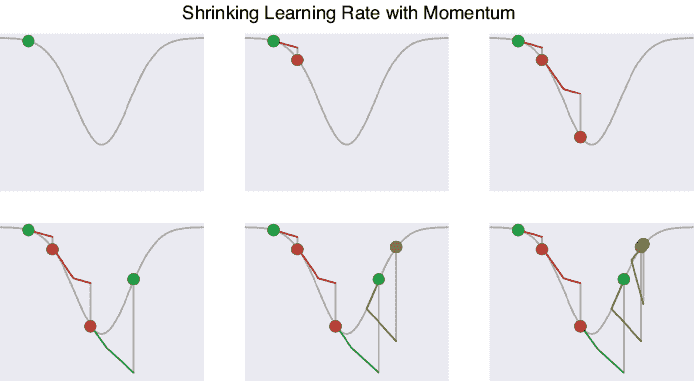

图 15-29：同时使用指数衰减学习率和动量进行学习

在每一步中，我们首先找到梯度，并按当前的学习率*η*进行缩放，像以前一样。然后我们找到上一步的变化，按*γ*进行缩放，将这两项变化加到当前权重的位置。这个组合给出了这一步的变化。

图 15-30 展示了网格中第六步的特写，并给出了沿途每个点的误差。

这里发生了一件有趣的事：当球滚到山谷的右侧时，尽管梯度指向下方，它依然继续往上滚。这正是我们对一个真实的球的预期。我们可以看到它逐渐减速，然后最终重新滚下坡，超过了底部，但超过的程度比之前少，然后又减速并重新滚下，依此类推。

图 15-30：图 15-29 中的最后一步，以及每个点的误差

如果我们使用过多的动量，球可能会直接飞到另一边，完全离开了碗的范围；但如果我们使用过少的动量，球可能无法越过沿途遇到的平坦区。图 15-31 展示了我们从图 15-26 中得到的误差曲线。这里我们通过反复试验找到一个*γ*值来调整动量，以使我们的球能够越过平坦区，但仍然能够顺利停留在碗底的最小值处。

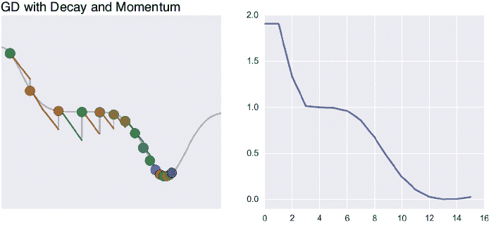

图 15-31：使用足够的动量跨越平坦区，但又不至于使球无法顺利地停在最小值的底部

找到合适的动量是另一个任务，在这方面我们需要利用经验和直觉，并结合反复试验，来帮助我们理解特定网络和数据的行为。我们也可以通过超参数搜索算法来寻找这个值。

将这些内容综合起来，我们找到梯度，用当前的学习率*η*对其进行缩放，加入按*γ*缩放的上一步变化，这就给出了我们的位置。如果我们将*γ*设为 0，那么就不加入上一步的任何变化，这就是“普通”（或称“原始”）的梯度下降。如果将*γ*设为 1，那么就会加入上一步的全部变化。通常我们使用大约 0.9 的值。在图 15-29 和图 15-31 中，我们将γ设为 0.7 以更好地说明这一过程。

图 15-32 展示了使用学习率衰减和动量进行 15 步学习的结果。球从左侧开始，滚下来，然后沿右侧滚得很远，再次滚下来并沿左侧滚上，依此类推，每次爬升的高度逐渐减少。

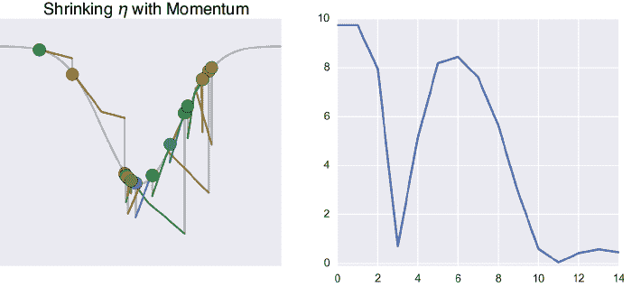

图 15-32：使用动量和衰减学习率的 15 步学习

动量帮助我们跨越平坦的平原并逃离鞍点的浅处。它还有一个额外的好处：帮助我们迅速下坡，即使学习率较小，我们也能提高效率。

图 15-33 显示了在我们由图 15-18 构成的两弯月数据集上训练时的误差。

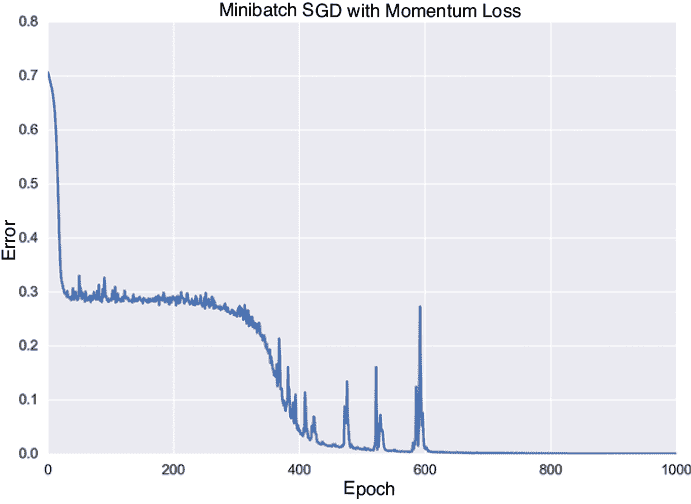

图 15-33：使用带动量的迷你批量梯度下降训练我们的两弯月数据集的误差曲线。我们在 600 多个周期内就达到了零误差。

在这里，我们使用带有动量的迷你批量梯度下降（或 SGD）。与图 15-23 中的迷你批量曲线相比，它的噪声更大，因为动量有时会将我们推过目标位置，导致误差出现尖峰。使用仅迷你批量 SGD 时，图 15-23 中的误差需要大约 5,000 个周期才能达到接近零的误差。而使用动量，我们在 600 多个周期内就能达到目标。不错吧！

动量显然帮助我们更快地学习，这是一个好事。但是动量带来了一个新问题：选择动量值*γ*。正如我们所提到的，我们可以通过经验和直觉来选择这个值，或者使用超参数搜索来寻找给我们最佳结果的值。

### Nesterov 动量

动量让我们能够从过去获取信息来帮助训练。现在让我们从未来获取信息。关键思想是，不仅仅使用我们当前所在位置的梯度，还使用我们预计将要到达位置的梯度。然后，我们可以利用一些“来自未来的梯度”来帮助我们。

因为我们无法真正预测未来，我们估算下一步的位置，并在那里使用梯度。这样做的思路是，如果误差面比较平滑，并且我们的估计相当准确，那么在我们估计的下一位置上找到的梯度与如果我们仅使用标准梯度下降（无论是否有动量）移动时实际到达的位置的梯度是接近的。

为什么使用来自未来的梯度有用呢？假设我们正从山谷的一侧滚下来，接近底部。在下一步中，我们越过了底部，最终到达了另一侧的墙上。正如我们之前看到的，动量会带着我们沿着墙上几步，随着动量的减弱逐渐减慢，直到我们转过身来重新下降。但如果我们能够预测到自己将会在远侧，我们就可以在现在的计算中包含那时的梯度。因此，来自未来的推力让我们不再像之前那样向右上方移动过远，而是使我们移动的距离稍微小一点，这样我们就不会过度越过底部，最终接近山谷的底部。

换句话说，如果我们下一步的移动方向与上一步相同，我们现在就采取更大的步伐。如果下一步的移动会使我们后退，我们则采取更小的步伐。

让我们将其分解为几个步骤，以免混淆估计和现实。图 15-34 展示了这一过程。

如之前所述，我们假设从位置 A 开始，经过最近的更新后，最终到达位置 B，如图 15-34(a)所示。与动量类似，我们找到作用在 A 点的变化使我们到达 B（箭头 *m*），然后我们将其缩放为*γ*。

现在进入新的部分，从图 15-34(b)开始。我们不再直接在 B 点找到梯度，而是首先将缩放后的动量加到 B 点，以得到“预测”误差 P。这是我们对下一步后将在误差面上最终位置的预测。如图 15-34(c)所示，我们在 P 点找到梯度 *g*，并按常规缩放得到 *ηg*。然后，我们通过将缩放后的动量 *γm* 和缩放后的梯度 *ηg* 加到 B 点，找到新的点 C，如图 15-34(d)所示。

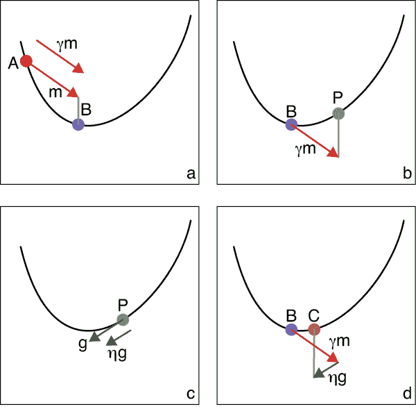

图 15-34：带有 Nesterov 动量的梯度下降

请注意，我们根本没有使用 B 点的梯度。我们只是将到达 B 点的动量缩放版本和我们预测点 P 的梯度缩放版本结合起来。

还要注意，图 15-34(d)中的点 C 比我们用常规动量时会到达的点 P 更接近碗底。通过向未来看，我们发现自己将位于山谷的另一侧，从而能够利用指向左侧的梯度，防止我们滚得太远，翻到另一侧。

为了向开发此方法的研究人员致敬，它被称为*Nesterov 动量*，或*Nesterov 加速梯度*（Nesterov 1983）。它本质上是我们之前看到的动量技术的升级版。虽然我们仍然需要为*γ*选择一个值，但无需选择新的参数。这是一个很好的例子，展示了一个算法如何在不需要我们额外工作的情况下提高性能。

图 15-35 显示了 Nesterov 动量运行 15 步的结果。

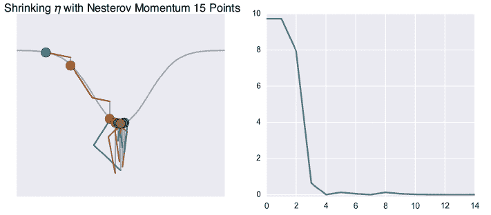

图 15-35：运行 Nesterov 动量 15 步。它大约在七步内找到山谷底部，并保持在那里。

图 15-36 显示了使用 Nesterov 动量的标准测试案例的误差曲线。该图使用与图 15-33 中仅使用动量的结果相同的模型和参数，但其噪声较少，效率更高，在大约 425 个 epoch 时误差降到 0，而常规动量仅需要大约 600 个 epoch。

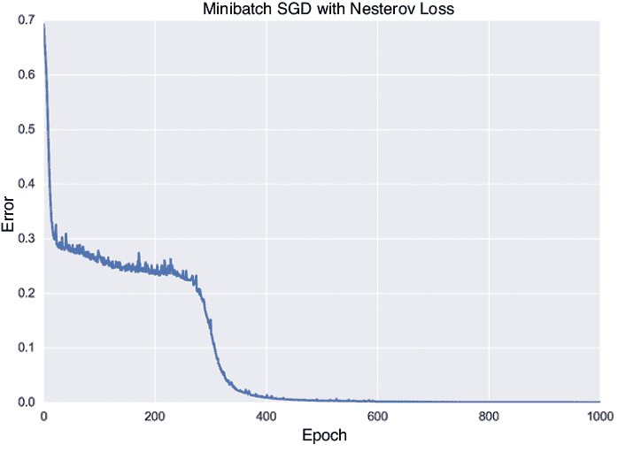

图 15-36：使用 Nesterov 动量的迷你批次 SGD 的误差。系统在约 600 个 epoch 时达到零误差。图表显示了 1,000 个 epoch。

每当我们使用动量时，都值得考虑使用 Nesterov 动量。它不需要我们提供额外的参数，但通常能更快地学习并且噪声更小。

### Adagrad

我们已经看到两种动量方法，它们帮助我们突破平台期并减少过度波动。我们在更新神经网络中所有权重时使用相同的学习率。在本章早些时候，我们提到过使用一个针对每个权重量身定制的学习率 *η* 的想法。

一些相关算法使用了这个思想。它们的名字都以 *Ada* 开头，代表“自适应（adaptive）”。

让我们从一个名为 *Adagrad* 的算法开始，它是 *自适应梯度学习*（Duchi、Hazan 和 Singer 2011）的缩写。顾名思义，该算法会根据每个权重自适应地调整梯度的大小。换句话说，Adagrad 给了我们一种按权重逐个进行学习率衰减的方法。对于每个权重，Adagrad 会使用该更新步骤中的梯度，将其平方并加入该权重的累加和中。然后，梯度会被这个累加和衍生出的值除，以得到用于更新的值。

由于每个步骤的梯度在加入之前都会被平方，因此加入累加和的值始终是正数。因此，这个运行累加和会随着时间的推移变得越来越大。为了防止它失控，我们将每次变化除以这个逐渐增大的累加和，从而使每个权重的变化随着时间推移变得越来越小。

这听起来很像学习率衰减。随着时间的推移，权重的变化变得越来越小。这里的不同之处在于，学习的减速是基于每个权重的历史独特地计算的。

由于 Adagrad 实际上是自动为每个权重计算学习率，因此我们用来启动的学习率不像早期算法那样重要。这是一个巨大的好处，因为它解放了我们调节错误率的任务。我们通常将学习率 *η* 设置为像 0.01 这样的小值，然后让 Adagrad 从那里开始处理。

图 15-37 显示了 Adagrad 在我们测试数据上的表现。

它与我们其他曲线的总体形状相同，但需要很长时间才能接近 0。由于梯度的累加和随时间增大，最终我们会发现将每个新梯度除以与该累加和相关的值，会得到接近 0 的梯度。越来越小的更新是 Adagrad 错误曲线下降如此缓慢的原因，因为它试图消除最后剩余的误差。

我们可以通过不太复杂的工作来解决这个问题。

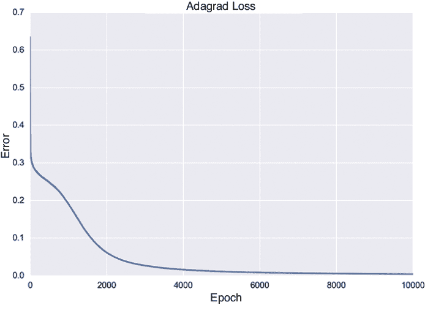

图 15-37：Adagrad 在我们测试设置中的表现

### Adadelta 和 RMSprop

Adagrad 的问题在于我们应用于每个权重的梯度在更新步骤中不断变得越来越小。这是因为运行的累加和一直在增大。

不同于从训练开始时就将所有平方梯度求和，我们假设保持这些梯度的*衰减和*。我们可以将其视为每个权重的最新梯度的一个运行列表。每次更新权重时，我们会将新梯度添加到列表的末尾，并删除列表开头的最旧的一个。为了找到用来除以新梯度的值，我们将列表中的所有值相加，但首先将它们乘以一个与其在列表中的位置相关的数值。最近的值会乘以较大的数值，而最旧的值会乘以非常小的数值。通过这种方式，我们的累加和主要由最近的梯度决定，尽管它也会受到较老梯度的较小影响（Ruder 2017）。

这样，梯度的累加和（以及我们用来除以新梯度的值）可以根据我们最近应用的梯度而上下波动。

这个算法被称为*Adadelta*（Zeiler 2012）。这个名字来源于“adaptive”（自适应），类似于 Adagrad，而*delta*指的是希腊字母*δ*（delta），数学家通常用它来表示变化。这个算法自适应地根据每个梯度的加权累加和来改变每一步更新权重的量。

由于 Adadelta 会单独调整每个权重的学习率，任何在陡峭斜坡上的权重会减慢更新速度，避免过快变化，而当该权重处于较平坦的部分时，它将允许较大的步长更新。

与 Adagrad 一样，我们通常将学习率设置为大约 0.01 的值，然后让算法从那时起进行调整。

图 15-38 展示了在我们的测试设置上使用 Adadelta 的结果。

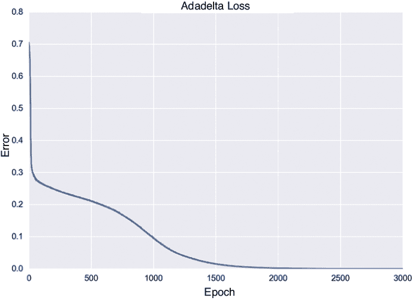

图 15-38：在我们的测试数据上使用 Adadelta 训练的结果

与图 15-37 中 Adagrad 的表现相比，这种方法表现更好。它平滑且在大约 2500 个 epoch 时达到 0，远远早于 Adagrad 的 8000 个 epoch。

Adadelta 的缺点是需要另一个参数，这个参数也叫做 gamma（*γ*）。它大致与动量算法中使用的*γ*参数相关，但它们足够不同，因此最好将它们视为两个不同的概念，恰好有相同的名称。这里的*γ*值告诉我们如何随着时间的推移缩小历史梯度列表中的梯度。较大的*γ*值“记住”较远的历史值，而较小的*γ*值则只关注最近的梯度。通常我们将这个*γ*设置为大约 0.9。

实际上，Adadelta 中还有另一个参数，希腊字母*ε*（epsilon）表示。这个细节用于保持计算的数值稳定性。大多数库会将其设置为一个由程序员精心选择的默认值，以使系统尽可能地正常工作，因此除非有特定需求，否则不应更改此值。

与 Adadelta 非常相似的算法，但使用了稍微不同的数学方法，叫做*RMSprop*（Hinton、Srivastava 和 Swersky 2015）。这个名字来源于它使用了均方根操作，通常缩写为 RMS，用来确定加入（或*传播*，因此名称中有“prop”）到梯度中的调整量。

RMSprop 和 Adadelta 大约在同一时间被发明，并且工作方式相似。RMSprop 也使用一个参数来控制它“记住”多少信息，这个参数也被命名为*γ*。同样，好的起始值大约是 0.9。

### Adam

之前的算法共享一个思想，即为每个权重保存一个平方梯度的列表。然后它们通过将这个列表中的值加起来（可能在缩放之后）来创建一个缩放因子。每次更新步骤中的梯度都被这个总数除以。Adagrad 在构建缩放因子时给列表中的所有元素相等的权重，而 Adadelta 和 RMSprop 则认为较旧的元素不那么重要，因此它们对总体总数的贡献较小。

在将梯度放入列表之前对其平方在数学上是有用的，但当我们对一个数字进行平方时，结果总是正数。这意味着我们无法知道列表中的梯度是正还是负，而这是一个很有用的信息。为了避免丢失这些信息，我们可以保持一个不对梯度进行平方的第二个列表。然后我们可以利用这两个列表来推导出我们的缩放因子。

这就是一种名为*自适应矩估计*的算法方法，或更常见的叫法是*Adam*（Kingma 和 Ba 2015）。

图 15-39 展示了 Adam 的表现。

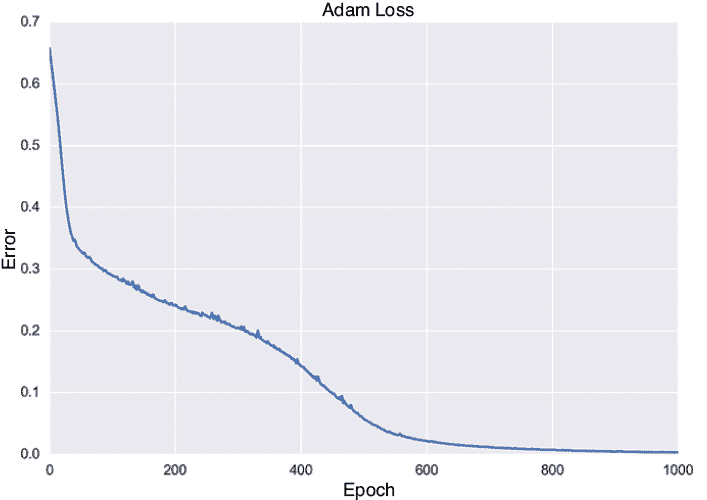

图 15-39：Adam 算法在我们的测试集上的表现

输出表现很好，只有略微的噪声，在大约 900 个训练周期时达到了接近 0 的误差，远远快于 Adagrad 或 Adadelta。缺点是 Adam 有两个参数，我们必须在学习开始时设置。参数是以希腊字母*β*（贝塔）命名的，分别称为“beta 1”和“beta 2”，写作*β*1 和*β*2。Adam 论文的作者建议将*β*1 设置为 0.9，将*β*2 设置为 0.999，这些值确实通常表现良好。

## 选择优化器

这并不是所有已提出并研究过的优化器的完整列表。还有许多其他优化器，并且新优化器不断出现，每个优化器都有其优缺点。我们的目标是提供一些最流行技术的概述，并理解它们是如何加速的。

图 15-40 总结了我们关于使用 Nesterov 动量的 SGD 和三个自适应算法（Adagrad、Adadelta 和 Adam）的两个月亮实验结果。

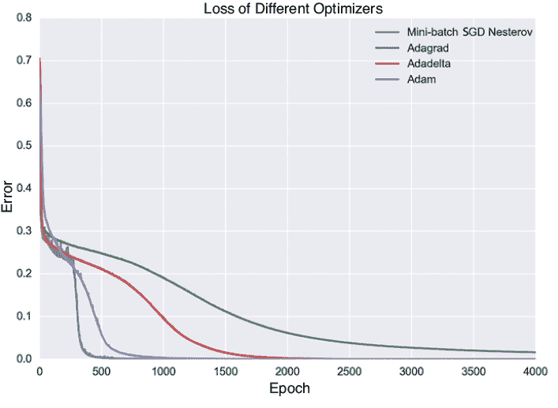

图 15-40：四种刚才介绍的算法在时间轴上的损失或误差。这张图只显示了前 4,000 个训练周期。

在这个简单的测试案例中，带有 Nesterov 动量的迷你批量 SGD 显然是最优选择，Adam 紧随其后。在更复杂的情况下，自适应算法通常表现更好。

在各种数据集和网络上，我们讨论的最后三种自适应算法（Adadelta、RMSprop 和 Adam）通常表现非常相似（Ruder 2017）。研究发现，在某些情况下，Adam 的表现略优于其他算法，因此通常是一个不错的起点（Kingma 和 Ba 2015）。

为什么会有这么多优化器？难道不应该找到最佳的一个并一直使用它吗？事实证明，不仅我们不知道什么是“最佳”优化器，而且也不可能有一个适用于所有情况的最佳优化器*。* 无论我们提出哪个优化器作为“最佳”，我们都可以证明，总是有可能找到某种情况，其中另一个优化器会表现更好。这个结果以其充满色彩的名字著称，即*无免费午餐定理*（Wolpert 1996；Wolpert 和 Macready 1997）。这保证了没有任何优化器会永远优于其他优化器。

请注意，“无免费午餐定理”并不意味着所有优化器是相同的。正如我们在本章的测试中所看到的，不同的优化器确实有不同的表现。该定理只告诉我们，没有一个优化器会*永远*优于其他优化器。

尽管没有一个优化器适用于所有可能的训练情况，但我们可以为任何特定的网络和数据组合找到最佳的优化器。大多数深度学习库提供了自动化搜索的例程，可以尝试多个优化器，并为每个优化器运行多个参数选择。无论我们是自己选择优化器及其参数，还是通过搜索的结果得到它们，我们都需要记住，最佳选择可能会因网络和数据集的不同而有所不同。一旦我们对网络或数据集做出重大更改，就应考虑检查是否有更好的优化器能提供更高效的训练。作为一个实际指南，许多人开始时使用 Adam，并采用其默认参数。

## 正则化

无论我们选择什么优化器，我们的网络都可能会遭遇过拟合。正如我们在第九章中讨论的，过拟合是训练过长时间的自然结果。问题在于，网络学得太好，以至于它只适应训练数据，并且在新数据发布后表现不佳。

延迟过拟合出现的技术称为*正则化*方法。它们允许我们在过拟合对性能影响过大之前进行更多轮次的训练，这意味着我们的网络有更多的训练时间来提高其性能。

### Dropout

一种流行的正则化方法叫做 *dropout*。它通常以 *dropout 层* 的形式应用于深度网络（Srivastava 等人，2014）。dropout 层被称为 *附加层* 或 *补充层*，因为它本身不进行任何计算。我们称之为层，并将其绘制为层，因为在概念上这样方便，并且让我们可以在网络图中包括 dropout。但我们并不认为它是一个真正的层（无论是隐藏层还是其他层），在描述一个特定网络由多少层组成时，我们也不将其计算在内。

Dropout 是一个占位符，用来告诉网络在前一层运行一个算法。它仅在训练期间启用。当网络部署时，dropout 层会被禁用或移除。

dropout 层的作用是暂时断开前一层中一些神经元的连接。我们给它一个参数，描述应该影响的神经元的百分比，在每个批次开始时，它会随机选择前一层中该百分比的神经元，并暂时断开它们的输入和输出连接。由于这些神经元被断开，它们不会参与任何前向计算，也不包含在反向传播中，并且进入它们的权重不会被优化器更新。当批次完成并且其他权重已经更新时，选择的神经元及其所有连接会被恢复。

在下一个批次开始时，该层再次选择一组新的随机神经元并暂时移除它们，重复这个过程直到每个训练周期结束。图 15-41 以图形方式展示了这个概念。

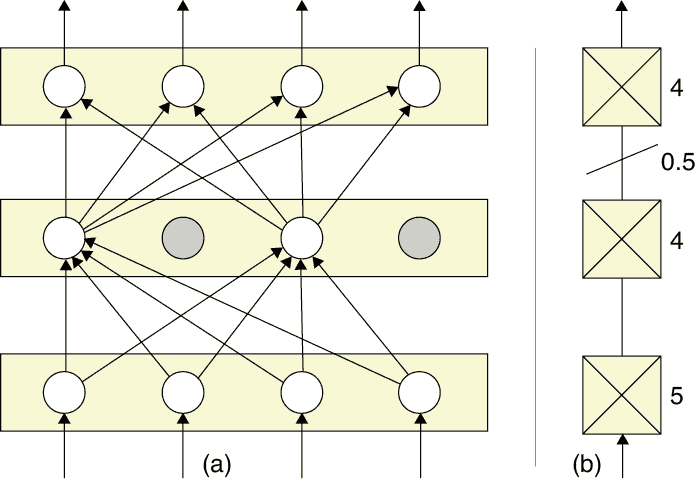

图 15-41：Dropout。 (a) 在评估批次之前，中间层（灰色）中的 50% 的四个神经元被选中断开连接。 (b) 我们对单个 dropout 层的示意图是一个对角斜线。右侧表示选择断开连接的神经元比例。由于 dropout 应用在前一层，因此在这个例子中，我们将它应用于三个全连接层中的中间层。

Dropout 通过防止神经元过度专注和主导，延缓了过拟合的发生。假设在一个图像分类系统中，一个神经元高度专门化于检测猫眼。这对于识别猫脸的图片很有用，但对于系统可能需要分类的其他所有照片来说就没什么用。如果网络中的所有神经元都专注于训练数据中仅仅一两种特征，那么它们在该数据上可能表现得非常好，因为它们能够发现它们训练时专门定位的特征。但整体系统在遇到缺少这些特征的新数据时，表现就会很差。

Dropout 帮助我们避免这种专门化。当一个神经元被断开时，其余的神经元必须进行调整以弥补空缺。因此，被断开的神经元可以自由执行更具普遍性任务，我们也就延迟了过拟合的发生。Dropout 通过在所有神经元中分散学习，帮助我们推迟过拟合。

### Batchnorm

另一种正则化技术叫做*批量归一化*，通常简称为*batchnorm*（Ioffe 和 Szegedy 2015）。与 dropout 类似，batchnorm 可以作为没有神经元的层来实现。不同于 dropout，batchnorm 实际上会执行一些计算，尽管我们不需要指定任何参数。

Batchnorm 修改了从某一层输出的值。这个可能看起来有些奇怪，因为训练的主要目的是让神经元产生输出值，从而取得好的结果。我们为什么要修改这些输出呢？

回想一下，我们的许多激活函数，如 leaky ReLU 和 tanh，在接近 0 时效果最强。为了从这些函数中获得最大的收益，我们需要输入到它们的数字处于一个围绕 0 的小范围内。这正是 batchnorm 通过对所有层输出进行缩放和平移所做的。因为 batchnorm 将神经元输出移到接近 0 的小范围内，所以我们更不容易看到某个神经元学习到一个特定的细节并产生一个巨大的输出，从而压倒了其他神经元，进而延迟了过拟合的出现。Batchnorm 会在整个小批量的过程中，按这种方式对从前一层输出的所有值进行缩放和平移。它与网络中的权重一起学习这些缩放和平移的参数，使其取到最有用的值。

我们在激活函数之前应用 batchnorm，以便修改后的值能落在激活函数最受影响的区域。在实践中，这意味着我们不在输入 batchnorm 的神经元上使用激活函数（或者如果必须指定一个函数，那就是线性激活函数，它没有任何效果）。这些值进入 batchnorm 后，再被送入我们想要应用的激活函数。

该过程在图 15-42 中进行了说明。我们用来表示像 batchnorm 这样的正则化步骤的图标是一个黑色圆盘位于圆形内部，表示圆内的值被转换到一个更小的区域。在后续章节中，我们将看到其他类似的正则化步骤，我们会使用相同的图标。文本（或附近的标签）会标明应用的是哪种正则化方法。

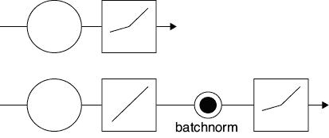

图 15-42：应用一个 batchnorm 层。顶部：一个神经元后面接着 leaky ReLU 激活函数。底部：同一个神经元加上 batchnorm。激活函数被替换成线性函数，接着是 batchnorm（用一个黑色圆盘表示）和 leaky ReLU。

像 dropout 一样，batchnorm 推迟了过拟合的发生，使我们能够训练更长时间。

## 总结

优化是调整权重的过程，以便让我们的网络进行学习。核心思想从每个权重的梯度开始。我们沿着这个梯度前进，引导我们到达误差表面上的低点，因此称为梯度下降。这个过程中的最重要值是学习率。一种常见的技术是根据衰减计划随着时间的推移减少学习率。

我们讨论了几种高效的优化技术。我们可以在每个周期后调整权重（批量梯度下降），在每个样本后调整权重（随机梯度下降，或 SGD），或者在小批量样本后调整权重（小批量梯度下降或小批量 SGD）。目前，小批量梯度下降是最常用的技术，业内的惯例是简单地将其称为 SGD。我们可以通过使用动量来提高每种梯度下降的效率。我们还可以通过使用像 Adam 这样的算法，根据时间为每个权重计算一个自适应学习率，从而改善学习。最后，为了防止过拟合，我们可以使用像 dropout 或 batchnorm 这样的正则化技术。

由全连接层构成的深度网络能够做一些令人惊叹的事情。但如果我们通过不同的方式构建神经元层并添加一些支持计算，它们的能力会显著提升。在接下来的几章中，我们将探讨这些新层以及它们如何用于分类、预测，甚至生成图像、声音等。
