# 第十六章：卷积神经网络

本章主要介绍一种深度学习技术，叫做*卷积*。卷积的应用之一是它已成为分类、处理和生成图像的标准方法。卷积在深度学习中易于使用，因为它可以很方便地封装在一个*卷积层*（也叫*卷积神经层*）中。在本章中，我们将探讨卷积背后的关键思想以及我们在实际操作中使用的相关技术。我们将看到如何排列一系列这些操作，创建一个操作层次结构，将一系列简单的操作转化为强大的工具。

为了保持具体性，本章我们将卷积的讨论集中在图像处理上。使用卷积的模型在这个领域取得了惊人的成功。例如，它们在基本分类任务中表现优异，如判断一张图片是豹子还是猎豹，或者是行星还是大理石。我们可以识别照片中的人物（Sun, Wang, and Tang 2014）；检测并分类不同类型的皮肤癌（Esteva et al. 2017）；修复图像损坏，如灰尘、划痕和模糊（Mao, Shen, and Yang 2016）；并从照片中分类人的年龄和性别（Levi and Hassner 2015）。基于卷积的网络在许多其他应用中也很有用，例如自然语言处理（Britz 2015），我们可以分析句子的结构（Kalchbrenner, Grefenstette, and Blunsom 2014）或将句子分类到不同类别中（Kim 2014）。

## 引入卷积

在深度学习中，图像是三维张量，具有高度、宽度和*通道数*，即每个像素的值。灰度图像每个像素只有一个值，因此只有一个通道。以 RGB 存储的彩色图像有三个通道（分别对应红色、绿色和蓝色的值）。有时人们使用*深度*或*光纤大小*来指代张量中的通道数。不幸的是，*深度*也用来指代深度网络中的层数，而*光纤大小*并没有广泛应用。为了避免混淆，我们总是将图像（三维张量的相关内容）的三个维度称为高度、宽度和通道数。按照我们的深度学习术语，每个提供给网络处理的图像都是一个样本。图像中的每个像素都是一个特征。

当一个张量通过一系列卷积层时，它通常会在宽度、高度和通道数上发生变化。如果一个张量恰好有 1 个或 3 个通道，我们可以将其视为一张图像。但如果一个张量有 14 个或 512 个通道，最好就不再将其看作图像了。这意味着我们不应该将张量的单个元素称为*像素*，因为这是一个以图像为中心的术语。相反，我们称它们为*元素*。图 16-1 直观地展示了这些术语。

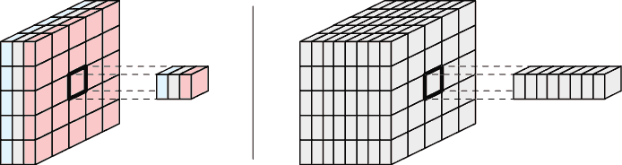

图 16-1：左侧：当我们的张量具有一个或三个通道时，我们可以说它是由像素构成的。右侧：对于具有任意数量通道的张量，我们称每个通道的切片为一个元素。

在卷积层起核心作用的网络通常被称为*卷积神经网络*，*convnet*，或*CNN*。有时人们也会说*CNN 网络*（这就是“冗余首字母缩略症综合症”[Memmott 2015]的一个例子）。

### 检测黄色

为了开始讨论卷积，让我们考虑处理彩色图像。每个像素包含三个数字：分别表示红色、绿色和蓝色。假设我们想创建一个灰度输出，它的高度和宽度与我们的彩色图像相同，但每个像素的白色量与其输入像素中的黄色量对应。

为了简化起见，假设我们的 RGB 值是从 0 到 1 的数字。那么一个纯黄色的像素具有红色和绿色的值为 1，蓝色的值为 0。当红色和绿色的值减少，或者蓝色的值增加时，像素的颜色将偏离黄色。

我们希望将每个输入像素的 RGB 值合并为一个从 0 到 1 的单一数字，表示“黄色度”，这是输出像素的值。图 16-2 展示了实现这一目标的一种方式。

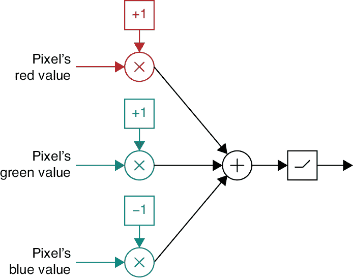

图 16-2：将我们的黄色检测器表示为一个简单的神经元

这看起来很熟悉。它与人工神经元的结构相同。当我们将图 16-2 解释为一个神经元时，+1、+1 和−1 是三个权重，与颜色值相关的数字是三个输入。图 16-3 显示了如何将这个神经元应用于图像中的任何像素。

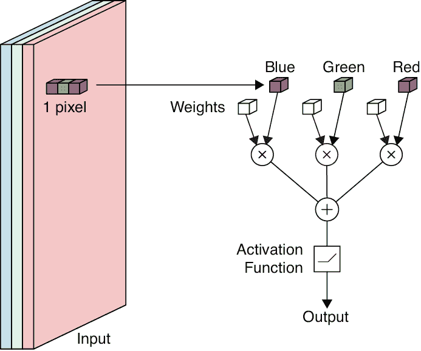

图 16-3：将图 16-2 中的神经元应用于图像中的一个像素

我们可以将这个操作应用于输入中的每个像素，为每个像素创建一个单独的输出值。结果是一个新的张量，宽度和高度与输入相同，但只有一个通道，如图 16-4 所示。

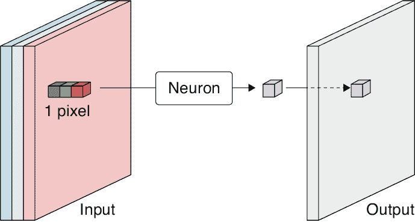

图 16-4：将图 16-3 中的神经元应用于输入中的每个像素，产生一个宽度和高度相同但只有一个通道的输出张量。

我们通常设想将神经元应用于左上角的像素，然后一次向右移动，直到到达行的末尾，然后对下一行重复这个过程，直到到达右下角的像素。我们说我们正在对输入进行*扫描*，或*扫描*输入。

图 16-5 显示了此过程在一只黄色青蛙图像上的结果。正如我们预期的那样，输入像素中黄色的含量越多，输出中对应的白色也越多。我们说神经元正在*识别*或*检测*输入中的黄色。

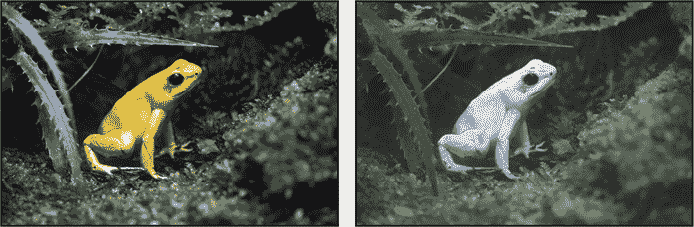

图 16-5：我们的黄色检测操作的应用。右侧的图像根据左侧图像中对应源像素的黄色程度，从黑到白变化。

当然，黄色并没有什么特别之处。我们可以构建一个小神经元来检测任何颜色。当我们以这种方式使用神经元时，我们通常说它在对输入进行*过滤*。在这种情况下，权重有时被统称为*过滤值*，或者简称*过滤器*。继承自其数学根源的语言，权重也被称为*过滤核*，或简称*核*。通常也会把整个神经元称作过滤器。是否将*过滤器*一词指代神经元，或者特指其权重，通常可以从上下文中得知。

这种将过滤器扫过输入图像的操作对应于一种数学操作，称为*卷积*（Oppenheim 和 Nawab 1996）。我们说图 16-5 的右侧是对彩色图像和黄色检测过滤器进行卷积的结果。我们还可以说我们将图像与过滤器*卷积*。有时我们将这些术语合并，称一个过滤器（无论是整个神经元，还是仅其权重）为*卷积过滤器*。

### 权重共享

在上一节中，我们设想了将我们的神经元扫过输入图像，在每个像素上执行完全相同的操作。如果我们想加速这一过程，可以创建一个巨大的相同神经元网格，并同时应用于所有像素。换句话说，我们并行处理这些像素。

在这种方法中，每个神经元具有相同的权重。我们不需要在每个神经元的独立内存中重复相同的权重，而是可以想象这些权重存储在某个共享的内存中，如图 16-6 所示。我们说神经元是*共享权重*的。

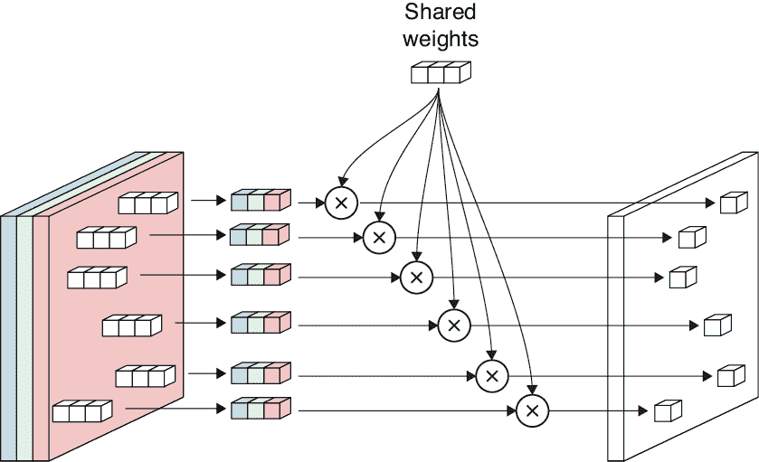

图 16-6：我们可以将我们的神经元同时应用于输入中的每个像素。每个神经元使用相同的权重，这些权重存储在共享内存中。

这使我们能够节省内存。在我们的黄色检测器示例中，共享权重还使得更换我们要检测的颜色变得容易。我们无需改变成千上万个神经元（或更多）的权重，只需更改共享内存中的那一组权重。

我们实际上可以在 GPU 上实现这个方案，GPU 能够同时执行许多相同的操作序列。共享权重使我们能够节省宝贵的 GPU 内存，从而将其释放用于其他用途。

### 更大的过滤器

到目前为止，我们一直在将神经元扫过图像（或使用共享权重并行应用它），一次处理一个像素，仅使用该像素的值作为输入。在许多情况下，查看我们正在处理的像素周围的像素也是有用的。通常我们会考虑一个像素的八个直接*邻居*。也就是说，我们使用一个以该像素为中心的三乘三的小框中的值。

图 16-7 展示了我们可以通过这种方式使用三乘三数字块进行的三种不同操作：模糊处理、检测水平边缘和检测垂直边缘。

为了计算每个图像，我们将权重块依次放置在每个像素上，并将其下方的九个值与相应的权重相乘。然后将结果加起来，并将它们的和作为该像素的输出值。让我们看看如何用神经元来实现这个过程。

图 16-7：通过将三乘三数字模板在图像上移动来处理灰度图像中的青蛙（见图 16-5）。从左到右，我们对图像进行模糊处理，找到水平边缘，并找到垂直边缘。

为了简化起见，我们暂时保持灰度输入。我们可以将图 16-7 中的数字块视为权重或滤波器核。在这种情况下，我们有一个九个权重的网格，将其放置在九个像素值的网格上。每个像素值都与其相应的权重相乘，结果相加并通过激活函数，我们就得到了输出。图 16-8 展示了这个概念。

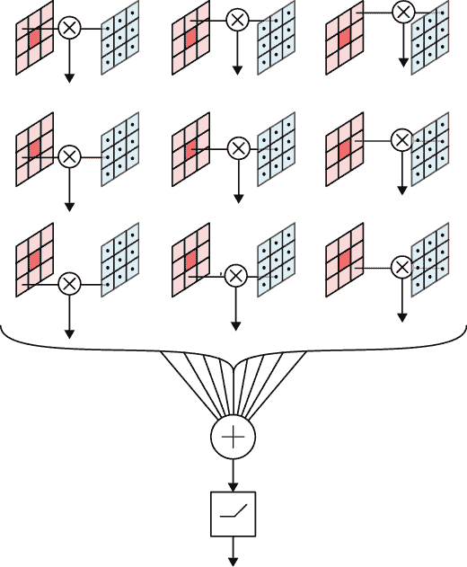

图 16-8：使用三乘三滤波器（蓝色）处理灰度输入（红色）

这张图展示了如何处理单个像素（显示为深红色）。我们将滤波器集中在目标像素上，并将输入中的每个九个值与其相应的滤波器值相乘。我们将这九个结果相加，并将总和通过激活函数。

在这个方案中，构成神经元输入的像素形状被称为该神经元的*局部感受野*，或者更简单地称为它的*足迹*。在图 16-8 中，神经元的足迹是一个正方形，边长为三个像素。在我们的黄色探测器中，足迹是一个单独的像素。当滤波器的足迹大于单个像素时，我们有时会通过称之为*空间滤波器*来强调这一特性。

请注意，图 16-8 中的神经元就像其他任何神经元一样。它接收九个数字作为输入，将每个数字与相应的权重相乘，将结果加在一起，并通过激活函数传递这个数字。它并不在乎这九个数字来自输入的一个正方形区域，甚至不在乎它们来自于一张图像。

我们通过与图像进行卷积来应用这个三乘三滤波器，就像之前一样，依次将其扫描过每个像素。对于每个输入像素，我们想象将三乘三的权重网格放置在该像素上，应用神经元并创建一个单一的输出值，如图 16-9 所示。我们称我们正在将滤波器集中在其上的像素为*锚点*（或*参考点*或*零点*）。

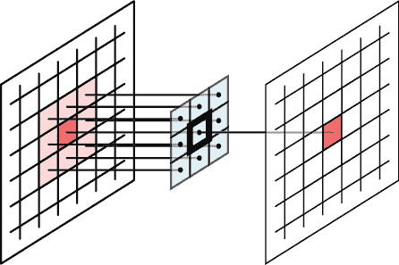

图 16-9：将三乘三滤波器（中心）应用于灰度图像（左），生成新的单通道图像（右）

我们可以设计任何大小和形状的滤波器。实际上，小尺寸的滤波器最为常见，因为它们比大尺寸的滤波器更快速地进行计算。我们通常使用每边像素数为奇数的小方块（通常是 1 到 9 之间）。这样的方块使我们能够将锚点放在滤波器中心，这样可以保持对称，且更易于理解。

让我们把这个理论应用到实践中。图 16-10 显示了将一个七乘七的输入图像与一个三乘三的滤波器进行卷积的结果。请注意，如果我们将滤波器置于输入图像的角落或边缘，滤波器的覆盖区域会超出输入图像，神经元将需要一些不存在的输入值。我们稍后会处理这个问题。现在，我们先限制讨论那些滤波器完全覆盖图像位置的情况。这样，输出图像的大小就是五乘五。

我们通过观察空间滤波器来引出讨论，这些滤波器可以实现像模糊图像或检测边缘这样的功能。那么，这些功能为什么对深度学习有用呢？为了回答这个问题，让我们更仔细地看一下滤波器。

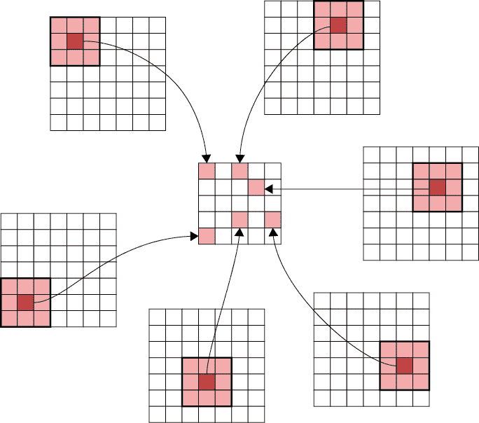

图 16-10：为了将滤波器与图像进行卷积，我们将滤波器在图像上移动，并在每个位置应用它。我们在这个图中略去了角落和边缘。

### 滤波器与特征

一些研究蟾蜍的生物学家认为，动物视觉系统中的某些细胞对特定类型的视觉模式敏感（Ewert 等，1985 年）。这个理论认为，蟾蜍在寻找与它喜欢吃的生物相关的特定形状，以及这些动物所做的某些动作。人们曾认为，蟾蜍的眼睛会吸收所有照射到它们的光，将这些信息传送到大脑，然后由大脑从结果中筛选寻找食物。而新的假设认为，眼睛中的细胞在这个检测过程中会自行完成一些早期步骤（如寻找边缘），只有当它们“认为”看到的是猎物时，才会发射信号并将信息传递给大脑。

该理论已扩展到人类视觉系统，进而提出了一个令人惊讶的假设：某些单一的神经元被精确地调节，只对特定人的图片作出反应。导致这一建议的最初研究展示了 87 张不同的图像，其中包括人类、动物和地标。在一位志愿者身上，他们发现了一个只在志愿者看到女演员詹妮弗·安妮斯顿的照片时才会激活的神经元（Quiroga 2005 年）。更有趣的是，这个神经元只会在安妮斯顿单独出现时激活，而在她与其他人（包括著名演员）合影时并不激活。

我们的神经元是精确的模式匹配设备这一观点并未得到普遍接受，但我们这里并不是在进行真正的神经科学和生物学研究。我们只是寻找灵感。而让神经元执行检测工作的这一想法，似乎是一个相当棒的灵感。

与卷积的关联在于，我们可以使用滤波器来模拟蟾蜍眼睛中的细胞。我们的滤波器同样能够挑选出特定的模式，并将其发现传递给后续滤波器，后者寻找更大的模式。我们在这个过程中使用的一些术语，回响了我们之前见过的术语。具体来说，我们一直在使用*特征*这个词来指代样本中的一个值。但在这个上下文中，*特征*一词也指输入中的一个特定结构，滤波器试图检测到它，比如边缘、羽毛或鳞片皮肤。我们说一个滤波器在*寻找*条纹特征、眼镜或跑车。延续这一用法，滤波器本身有时被称为*特征检测器*。当特征检测器扫描完整个输入后，我们称其输出为*特征图*（此处的*图*一词来源于数学语言）。特征图告诉我们，逐像素地，图像中该像素周围的内容与滤波器所寻找的匹配程度。

让我们看看特征检测是如何工作的。在图 16-11 中，我们展示了使用滤波器在二值图像中找到短的、孤立的垂直白色条纹的过程。

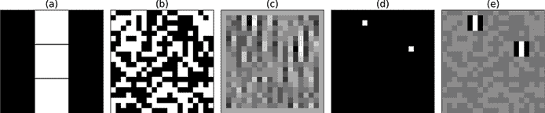

图 16-11：使用卷积进行二维模式匹配。（a）滤波器。（b）输入。（c）特征图，已缩放至[0, 1]以便显示。（d）特征图中值为 3 的条目。（e）（d）中白色像素周围的（b）邻域。

图 16-11(a) 显示了一个三乘三的滤波器，值为−1（黑色）和 1（白色）。图 16-11(b) 显示了一个噪声输入图像，仅包含黑白像素。图 16-11(c) 显示了将滤波器应用于输入图像中每个像素的结果（外部边框除外）。这里的值从−6 到+3，我们将其缩放至[0, 1]以便显示。图像中值越大，滤波器与像素（及其邻域）之间的匹配度越好。值为+3 表示该像素与滤波器完美匹配。

图 16-11(d) 显示了图 16-11(c)的阈值版本，其中值为+3 的像素显示为白色，其他所有像素为黑色。最后，图 16-11(e) 显示了图 16-11(b)的噪声图像，并突出显示了图 16-11(d)中白色像素周围的三乘三像素网格。我们可以看到，滤波器找到了图像中与滤波器模式匹配的那些位置。

让我们看看为什么这样有效。在图 16-12 的顶部行中，我们展示了滤波器和图像的三乘三块区域，以及逐像素的结果。

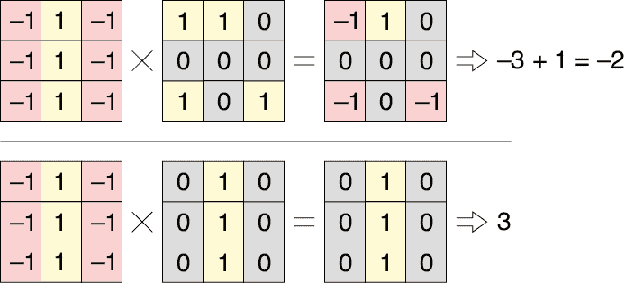

图 16-12：将滤波器应用于两个图像片段。从左到右，每一行显示滤波器、输入和结果。最后一个数字是右侧三乘三网格的总和。

考虑顶部行中间显示的像素。黑色像素（这里显示为灰色），值为 0，不对输出产生影响。白色像素（这里显示为浅黄色），值为 1，根据滤波器的值乘以 1 或-1。在顶部行的像素中，只有一个白色像素（顶部中央）与滤波器中的 1 匹配。这给出了结果 1 × 1 = 1。其他三个白色像素与-1 匹配，给出了三个结果-1 × 1 = -1。将这些加在一起，我们得到-3 + 1 = -2。

在下方这一行中，我们的图像与滤波器匹配。滤波器上三个权重为 1 的部分正好位于白色像素上，输入图像中没有其他白色像素。结果是一个 3 的分数，表示完全匹配。

图 16-13 展示了另一个滤波器，这次是寻找对角线。让我们在同一图像上运行它。这个由三个白色像素组成的对角线被黑色像素包围，它在两个地方出现。

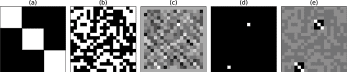

图 16-13：另一个滤波器及其在随机图像上的结果。(a) 滤波器。(b) 输入。(c) 特征图。(d) 特征图中值为 3 的条目。(e) (d)中白色像素周围的邻域。

通过在图像上滑动滤波器并计算每个像素的输出值，我们可以寻找许多不同的简单模式。实际上，我们的滤波器和像素值都是实数（而不仅仅是 0 和 1），因此我们可以制作出更复杂的模式，找到更复杂的特征（Snavely 2013）。

如果我们将一组滤波器的输出传递给另一组滤波器，我们可以寻找模式中的模式。如果我们将第二组输出传递给第三组滤波器，我们可以寻找模式中的模式中的模式。这个过程让我们能够从一组边缘开始，构建一组形状，如椭圆和矩形，最终匹配某个特定物体的模式，如吉他或自行车。

通过这种方式应用连续的滤波器组，再结合我们很快将讨论的另一种技术——*池化*，极大地扩展了我们能够检测的模式种类。原因在于，滤波器以*层级*方式工作，其中每个滤波器的模式都是前一个滤波器找到的模式的组合。这样的层级结构让我们能够寻找复杂度较高的特征，如朋友的面孔、篮球的纹理，或是孔雀羽毛末端的眼睛。

如果我们必须手动计算这些滤波器，图像分类将变得不切实际。在一连串八个滤波器中，如何确定合适的权重来告诉我们一张图片是小猫还是飞机？我们又该如何去解决这个问题呢？我们又怎么知道何时找到了最好的滤波器？在第一章中，我们讨论了专家系统，人们曾试图通过手动进行这种特征工程。对于简单问题来说，这是一个艰巨的任务，且复杂性增长非常迅速，真正有趣的问题，比如区分猫和飞机，似乎完全无法解决。

卷积神经网络（CNN）的美妙之处在于，它们实现了专家系统的目标，但我们无需手动计算滤波器的值。我们在前几章中看到的学习过程，包括测量误差、反向传播梯度以及改进权重，教会了 CNN 自行找到所需的滤波器。学习过程修改了每个滤波器的核心（即每个神经元中的权重），直到网络产生符合我们目标的结果。换句话说，训练过程调节滤波器中的值，直到它们找到能够帮助网络为图像中的物体分类的特征。这一过程可以在数百个甚至数千个滤波器中同时发生。

这看起来像是魔法。系统从随机数开始，学习需要寻找的模式，以区分钢琴、杏子和大象，然后学习如何将数字放入滤波器内核，以便找到这些模式。

这一过程在某些情况下能够接近完成，实属不易。它在广泛的应用中经常产生高度准确的结果，这是深度学习领域的伟大发现之一。

### 填充

之前，我们承诺会回到卷积滤波器位于输入张量的角落或边缘时会发生什么问题。现在让我们来看一下。

假设我们想对一个 10x10 的输入应用一个 5x5 的滤波器。如果我们位于张量的中间位置，如图 16-14 所示，那么我们的工作就很简单。我们从输入中提取出 25 个值，并将它们应用到卷积滤波器上。

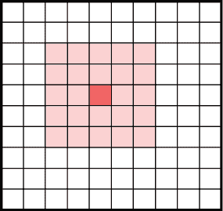

图 16-14：一个位于张量中部的 5x5 滤波器。鲜红色的像素是锚点，而较浅的像素组成了感受野。

但是如果我们位于边缘上，或者接近边缘，如图 16-15 所示，会怎么样呢？

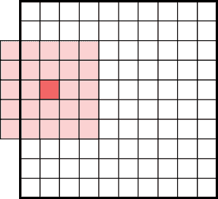

图 16-15：在边缘附近，滤波器的感受野可能会超出输入的边界。我们该如何处理这些缺失的元素呢？

滤波器的足迹悬挂在输入的边缘。那里没有输入元素。那我们如何计算滤波器的输出值，当它缺少一些输入时呢？

我们有几种选择。一种是禁止这种情况，只能将足迹放置在完全位于输入图像内部的位置。结果是输出的高度和宽度会变小。图 16-16 展示了这一想法。

尽管简单，但这是一个糟糕的解决方案。我们曾说过，我们通常会依次应用多个滤波器。如果每次都牺牲一个或多个元素环，那么我们在每一步通过网络时都会丧失信息。

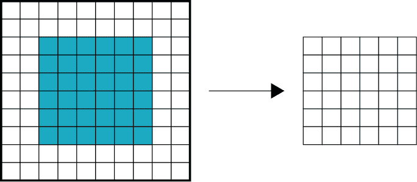

图 16-16：我们可以通过不让滤波器跑到那么远来避免“掉出边缘”问题。使用 5x5 的滤波器时，我们只能将滤波器集中在这里标记为蓝色的元素上，将 10x10 的输入图像缩小为 6x6 的输出图像。

一个流行的替代方法是使用一种称为*填充*的技术，这可以让我们创建一个与输入具有相同宽度和高度的输出图像。其思想是，在输入的外侧添加一个额外元素的边框，如图 16-17 所示。所有这些元素都有相同的值。如果我们在所有新元素中放置零，这种技术被称为*零填充*。在实践中，我们几乎总是使用零，因此人们通常将零填充称为填充，理解为如果他们打算使用零以外的任何值，他们会明确说明。

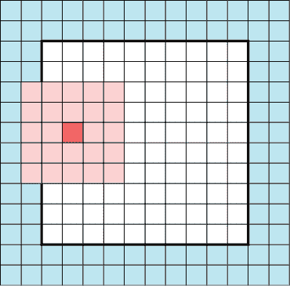

图 16-17：解决“掉出边缘”问题的更好方法是添加填充或额外的元素（浅蓝色），围绕输入的边界。

边界的厚度取决于滤波器的大小。我们通常只使用足够的填充，以便滤波器可以集中在输入的每个元素上。如果我们不希望从两侧丢失信息，每个滤波器都需要对其输入进行填充。

大多数深度学习库会自动计算所需的填充量，以确保我们的输出与输入具有相同的宽度和高度，并将其作为默认设置应用。

## 多维卷积

到目前为止，在本章中，我们主要考虑的是只有一个通道颜色信息的灰度图像。我们知道，大多数彩色图像有三个通道，表示每个像素的红、绿、蓝分量。让我们看看如何处理这些图像。一旦我们能够处理具有三个通道的图像，就能处理任何通道数的张量。

为了处理具有多个通道的输入，我们的滤波器（其足迹可以是任何形状）需要具有相同数量的通道。这是因为输入中的每个值都需要在滤波器中有一个相应的值。对于 RGB 图像，一个滤波器需要三个通道。因此，一个三乘三的滤波器需要三个通道，共 27 个数字，如图 16-18 所示。

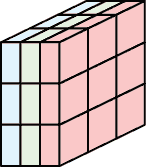

图 16-18：一个具有三行三列足迹的三通道滤波器。我们已经对数值进行了着色，以显示它们将与哪个输入通道的数值相乘。

为了将这个卷积核应用于三通道的彩色图像，我们像之前一样进行操作，但现在我们以块（或三维张量）的形式来思考。

让我们以图 16-18 中的滤波器为例，它有一个三乘三的覆盖面积和三个通道，并用它来处理一个具有三个颜色通道的 RGB 图像。对于每个输入像素，我们像之前一样将滤波器的覆盖面积放置在该像素上，并将图像中的每个 27 个数值与滤波器中的 27 个数值相匹配，如图 16-19 所示。

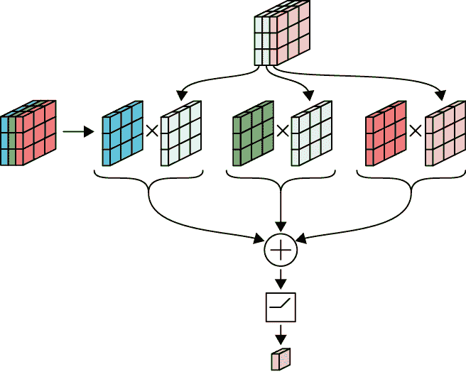

图 16-19：使用三乘三乘三的卷积核对 RGB 图像进行卷积。我们可以想象，每个通道都被其在滤波器中的对应通道滤波。

在图 16-19 中，我们的输入有三个通道，所以我们的滤波器也有三个通道。可以帮助理解的是，可以将红色、绿色和蓝色通道分别与滤波器中对应的通道进行滤波，如图 16-19 所示。在实际操作中，我们将输入和滤波器视为三乘三乘三的块，每个 27 个输入值与其对应的滤波器值相乘。

这个概念可以推广到任意数量的通道。为了确保每个输入值都有一个对应的滤波器值，我们可以将这个必要的特性表述为一个规则：每个滤波器必须具有与其滤波的张量相同数量的通道。

## 多个滤波器

我们一直在一次应用一个滤波器，但在实际中这种情况很少见。通常我们将十个或上百个滤波器捆绑成一个*卷积层*，并同时（且独立地）将它们应用到该层的输入。

为了看清整体情况，假设我们得到了一张黑白图像，我们想要在像素中寻找几个低级特征，例如垂直条纹、水平条纹、孤立的点和加号。我们可以为每个特征创建一个滤波器，并独立地将每个滤波器应用到输入上。每个滤波器会产生一个包含一个通道的输出图像。将四个输出合并后，我们得到一个包含四个通道的张量。图 16-20 展示了这个概念。

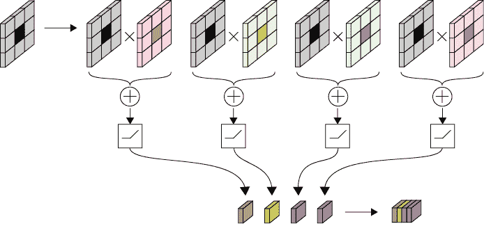

图 16-20：我们可以将多个滤波器（以彩色显示）应用于相同的输入（以灰色显示）。每个滤波器在输出中创建自己的通道。然后它们被合并，形成一个包含四个通道的输出张量的单个元素。

现在，我们有一个包含四个通道的输出张量，而不是一个具有一个通道的灰度图像或一个具有三个通道的彩色图像。如果我们使用了七个滤波器，那么输出将是一个具有七个通道的新图像。这里需要注意的关键是，输出张量有一个通道对应每个应用的滤波器。

一般来说，我们的滤波器可以具有任何覆盖面积，我们可以将任意数量的滤波器应用于任何输入图像。图 16-21 展示了这个概念。

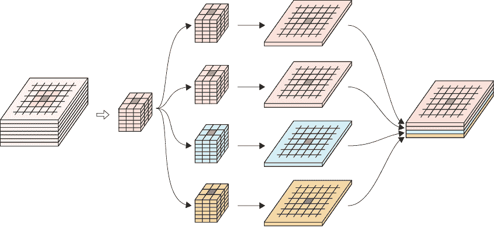

图 16-21：当我们将过滤器与输入进行卷积时，每个过滤器的通道数必须与输入的通道数相同。输出张量的通道数与过滤器的数量相同。

最左边的输入张量有七个通道。我们应用四个不同的过滤器，每个过滤器的尺寸是 3x3，因此每个过滤器的张量大小是 3x3x7。每个过滤器的输出是一个单通道的特征图。输出张量是通过堆叠这四个特征图得到的，因此它有四个通道。

虽然原则上我们应用的每个过滤器可以有不同的尺寸，但实际上，我们几乎总是为任何给定的卷积层使用相同的过滤器尺寸。例如，在图 16-21 中，所有的过滤器的尺寸都是 3x3。

让我们把上一节和这一节中的两个数值规则汇总起来。首先，卷积层中的每个过滤器必须与该层的输入张量具有相同的通道数。其次，卷积层的输出张量将具有与该层中过滤器数量相等的通道数。

## 卷积层

让我们更仔细地看看卷积层的机制。卷积层实际上是将多个过滤器组合在一起。它们独立地应用于输入张量，如图 16-21 所示，然后它们的输出被组合起来，生成一个新的输出张量。输入在这个过程中没有发生变化。

当我们在代码中创建一个卷积层时，我们通常会告诉库我们需要多少个过滤器、它们的尺寸应该是多少，以及其他可选的细节，比如是否使用填充以及我们希望使用什么激活函数——其余的由库来处理。最重要的是，训练过程中会改善每个过滤器的核值，使过滤器学习到能够产生最佳结果的值。

当我们绘制深度学习模型的图示时，通常会标注卷积层使用了多少个过滤器、它们的尺寸以及它们的激活函数。由于在输入的周围常常使用相同的填充，我们通常只提供一个值，而不是两个，默认它适用于宽度和高度。

就像全连接层中的权重一样，卷积层中过滤器的值最初是随机的，并通过训练得到改善。同样，像全连接层一样，如果我们在选择这些随机初始值时小心一些，训练通常会更快。大多数库提供多种初始化方法。一般来说，内置的默认值通常能很好地工作，我们很少需要明确选择初始化算法。

如果我们确实想选择一种方法，He 算法是一个不错的首选（He et al. 2015; Karpathy 2016）。如果该方法不可用，或者在特定情况下效果不好，Glorot 算法是一个不错的第二选择（Glorot 和 Bengio 2010）。

让我们来看几种有自己名字的特殊卷积类型。

### 一维卷积

一个有趣的特殊情况是对输入进行滤波的过程，称为*1D 卷积*。在这里，我们像往常一样对输入进行扫描，但只沿高度或宽度方向，而不在另一个方向上进行扫描（Snavely 2013）。当处理文本时，这是一种常见的技术，文本可以表示为一个网格，每个元素包含一个字母，行包含完整的单词（或固定数量的字母）（Britz 2015）。

基本思路见图 16-22。

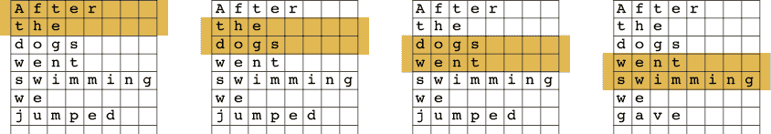

图 16-22：1D 卷积示例。滤波器只向下移动。

在这里，我们创建了一个宽度与输入相同且高度为两行的滤波器。滤波器的第一次应用处理前两行的所有内容。然后，我们将滤波器向下移动，处理接下来的两行。我们不会水平移动滤波器。*1D 卷积* 这个名字来源于这种单一方向或维度的移动方式。

和往常一样，我们可以让多个滤波器在网格上滑动。我们可以对任何维度的输入张量执行 1D 卷积，只要滤波器本身仅在一个维度上移动。1D 卷积没有其他特别之处：它只是一个仅在一个方向上移动的滤波器。这个技巧有自己的名字，目的是强调滤波器的有限移动性。

1D 卷积的名称几乎与另一种完全不同的技术名称相同。让我们现在来看看这个技术。

### 1×1 卷积

有时我们希望在张量通过网络时减少通道的数量。通常这是因为我们认为某些通道包含冗余信息。这并不罕见。例如，假设我们有一个分类器，它识别照片中的主导物体。分类器可能有十几个滤波器，用于寻找不同种类的眼睛：人类眼睛、猫眼、鱼眼等等。如果我们的分类器最终会将所有生物合并成一个名为“生物”的类别，那么就没有必要关心我们发现的是哪种眼睛。只要知道输入图像中的某个区域有眼睛就足够了。

假设我们有一个层，其中包含检测 12 种不同类型眼睛的滤波器。那么该层的输出张量将至少有 12 个通道，每个滤波器一个通道。如果我们只关心是否找到眼睛，那么将这个张量通过合并或压缩这 12 个通道为一个表示每个位置是否有眼睛的通道会很有用。

这不需要任何新东西。我们希望一次处理一个输入元素，因此我们创建了一个尺寸为 1x1 的滤波器，正如我们在图 16-6 中看到的那样。我们确保滤波器的数量至少比输入通道数少 11 个。结果是一个与输入相同宽度和高度的张量，但多个眼睛通道被压缩成一个通道。

我们不需要做任何明确的操作来实现这一点。网络会学习滤波器的权重，使得网络能够为每个输入生成正确的输出。如果这意味着将所有通道组合在一起用于眼部识别，那么网络就会学会这样做。

图 16-23 展示了如何使用这些滤波器将一个拥有 300 个通道的张量压缩成一个宽度和高度相同，但只有 175 个通道的新张量。

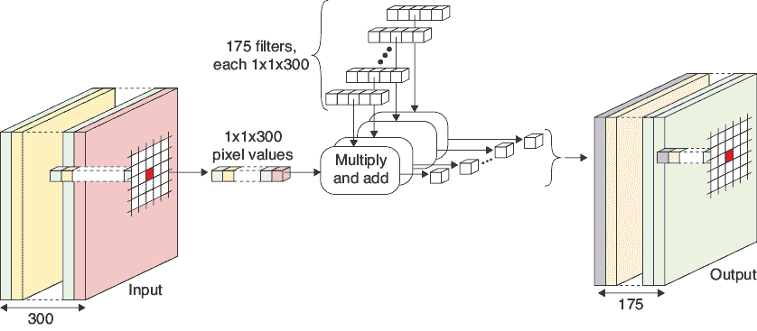

图 16-23：应用 1×1 卷积进行特征降维

使用一对一滤波器的技术已经有了自己的名称。我们称之为应用*一对一滤波器*，通常写作*1×1 滤波器*，并使用它执行*1×1 卷积*（Lin, Chen, 和 Yan 2014）。

在第十章中，我们讨论了预处理输入数据的价值，以节省处理时间和内存。与其在数据进入系统之前一次性进行这种处理，不如让 1×1 卷积在网络内部动态地应用数据压缩和重构。如果我们的网络产生了可以压缩或完全移除的信息，那么 1×1 卷积可以找到这些数据并进行压缩或移除。我们可以在任何地方做到这一点，甚至在网络的中间。

当通道之间存在相关性时，1×1 卷积特别有效（Canziani, Paszke, 和 Culurciello 2016; Culurciello 2017）。这意味着前面层的滤波器已经生成了相互同步的结果，因此当一个通道值上升时，我们可以预测其他通道的上升或下降幅度。相关性越强，我们就越可能去除一些通道而几乎不丧失任何信息。1×1 滤波器非常适合这项工作。

*1×1 卷积*这个术语与我们在上一节中讨论的*1D 卷积*非常相似。但这些术语指的是完全不同的技术。当遇到这些术语时，值得花一点时间确保我们有正确的理解。

## 改变输出大小

我们刚刚看到如何通过使用 1×1 卷积改变张量中的通道数。我们还可以改变宽度和高度，这对于至少两个原因非常有用。第一个是，如果我们能使流经网络的数据变得更小，我们就可以使用更简单的网络，从而节省时间、计算资源和能源。第二个是，减少宽度和高度可以使某些操作，如分类，更高效，甚至更加准确。我们来看看为什么会这样。

### 池化

在前面的章节中，我们将每个滤波器应用于一个像素或一块像素区域。如果基础像素与滤波器的值匹配，滤波器就能找到它所寻找的特征。但是如果特征的某些元素稍微偏离了正确的位置呢？那么滤波器就无法匹配。如果图案中一个或多个部分存在，但稍微错位，滤波器就无法找到匹配的地方。如果我们不解决这个问题，那将是一个真正的麻烦。例如，假设我们在一页文本中寻找一个大写字母 T。由于印刷过程中发生了轻微的机械故障，一列像素被向下错位了一个像素。

我们仍然希望找到字母 T。这个情况在图 16-24 中有说明。

图 16-24：从左到右：一个五乘五的滤波器正在寻找字母 T，一个印刷错误的 T，滤波器覆盖在图像上方，以及滤波器的结果值。该滤波器无法报告找到字母 T 的匹配。

我们从一个五乘五的滤波器开始，寻找位于中心的 T 字形。我们使用蓝色表示 1，黄色表示 0 来进行说明。

我们将这个称为“完美滤波器”，稍后它的名称会更清晰。在其右侧是我们将要检查的印刷错误文本，标记为“完美图像”。再往右，我们将滤波器叠加到图像上。最右侧是结果。只有当滤波器和输入都是蓝色时，输出才会是蓝色。由于滤波器的右上角元素没有找到它预期的蓝色像素，因此整个滤波器报告了没有匹配，或者是一个较弱的匹配。

如果滤波器的右上角元素能够环顾四周并注意到它正下方的蓝色像素，它就能够匹配输入。实现这一点的一种方法是让每个滤波器元素“看到”更多的输入。最方便的数学方法是让滤波器稍微模糊一些。

在图 16-25 的上排中，我们选取了滤波器的一个元素并使其模糊。如果滤波器在这个更大、更模糊的区域中找到了蓝色像素，它就会报告找到了蓝色。如果我们对滤波器中的所有条目都进行这样的操作，就会创建一个“模糊滤波器”。由于这个扩展的范围，右上角的蓝色滤波器元素现在覆盖了两个蓝色像素，并且由于其他蓝色元素也覆盖了蓝色像素，滤波器现在报告了一个匹配。

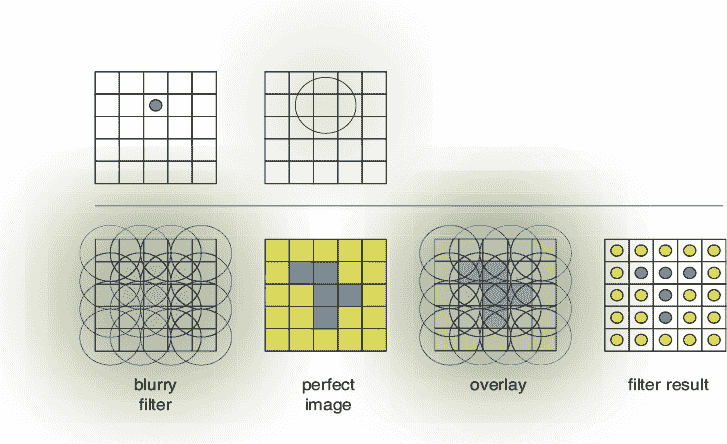

图 16-25：上排：将一个滤波器元素替换为更大、更模糊的版本。下排：将模糊应用于每个滤波器元素，从而得到一个模糊滤波器。将其应用于图像时，可以匹配到印刷错误的 T 字形。

不幸的是，我们不能像这样模糊滤波器。如果我们通过模糊滤波器来修改它们的值，我们的训练过程将会出错，因为我们会改变那些我们试图学习的值。但是没有什么能阻止我们模糊输入！如果输入是图片，这一点尤其容易理解，但我们也可以模糊任何张量。所以，与其对完美的输入应用模糊滤波器，不如颠倒过来，对模糊的输入应用完美的滤波器。

图 16-26 的顶行显示了一个来自印刷错误 T 的单个像素，以及该像素在模糊处理后的版本。在我们将这种模糊应用到所有像素后，我们可以对这个模糊的图像应用完美的滤波器。现在，滤波器中的每个蓝色点下方都可以看到蓝色。成功了！

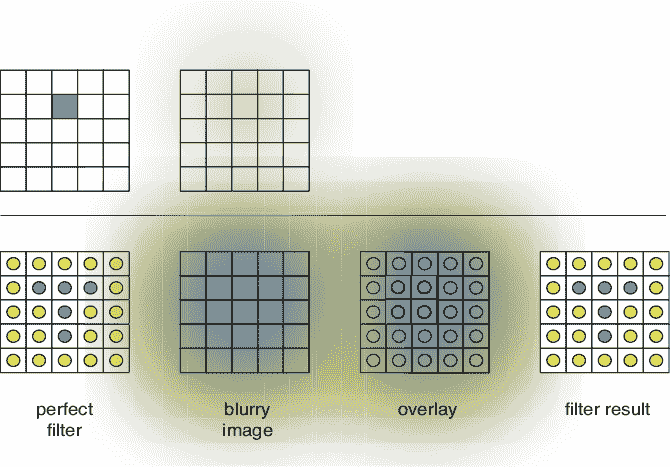

图 16-26：顶行：对输入中的一个像素进行模糊处理的效果。底行：我们将完美的滤波器应用于模糊版本的图像。这与印刷错误的 T 相匹配。

以此为灵感，我们可以提出一种模糊张量的技术。我们将这种方法称为*池化*，或者*下采样*。让我们通过一个具有单通道的小张量来看池化如何在数值上运作。假设我们从一个宽度和高度为四的张量开始，如图 16-27(a)所示。

图 16-27：池化，或下采样，一个张量。(a) 我们的输入张量。(b) 将(a)划分为 2x2 块。(c) 平均池化的结果。(d) 最大池化的结果。(e) 我们的池化层图标。

让我们将这个张量的宽度和高度划分为 2x2 块，如图 16-27(b)所示。要模糊输入张量，请回顾图 16-7。我们看到，通过与一个内容全为 1 的滤波器进行卷积，图像变得模糊。这样的滤波器称为*低通滤波器*，或者更具体地说，称为*框滤波器*。

要对张量应用框滤波器，我们可以使用一个 2x2 的滤波器，其中每个权重都是 1。应用这个滤波器仅仅意味着将每个 2x2 块中的四个数字相加。因为我们不希望数字无限增长，我们将结果除以 4，以得到该块的平均值。由于这个平均值现在代表整个块，我们只需保存它一次。我们对其他三个块也做相同的处理。结果是一个大小为 2x2 的新张量，如图 16-27(c)所示。这种技术称为*平均池化*。

这个方法有一个变体：我们不计算平均值，而是直接使用每个块中的最大值。这称为*最大池化*（或更常见的，简称为*max pooling*），如图 16-27(d)所示。通常我们将这些池化操作视为由一个小的辅助层执行。在图 16-27(e)中，我们展示了这样的*池化层*的图标。经验表明，使用最大池化的网络学习速度比使用平均池化的网络更快，因此当人们提到池化而没有其他限定时，他们通常指的是最大池化。

池化的强大之处在于我们连续应用多个卷积层时。就像在滤波器和模糊输入的情况一样，如果第一个滤波器的值不在预期的位置，池化帮助第二层的滤波器仍然能够找到它们。例如，假设我们有两个连续的层，第二层的滤波器正在寻找第一层的强匹配，直接位于约一半值的匹配之上（也许这是某种动物的颜色特征）。在图 16-27(a)中的原始四乘四张量没有符合该模式的内容。存在一个 20 对 2，但 2 并不是 20 的一半。而且有一个 6 对 3，但 6 不是一个非常强的输出。所以第二层的滤波器会找不到它想要的匹配。那太遗憾了，因为确实有一个 20，接近位于 9 上方，这正是滤波器想要找到的匹配。问题是 20 和 9 不是完全垂直的邻居。

但是，最大池化版本中有 20 在 9 之上。池化操作正在向第二层传达，在右上角的两乘二块中有一个强匹配 20，并且在 20 正下方的块中有一个匹配 9。这就是我们想要的模式，滤波器会告诉我们它找到了一个匹配。

我们讨论了单通道的池化。当我们的张量具有多个通道时，我们会对每个通道应用相同的过程。图 16-28 展示了这个概念。

我们从一个高度和宽度为 6，通道数为 1 的输入张量开始，并用零环进行填充。卷积层应用三个滤波器，每个滤波器产生一个六乘六的特征图。卷积层的输出是一个尺寸为六乘六乘三的张量。然后，池化层在概念上考虑该张量的每个通道，并对其应用最大池化操作，将每个特征图缩小为三乘三。这些特征图随后像之前一样组合，生成一个宽度和高度为 3、具有三个通道的输出张量。

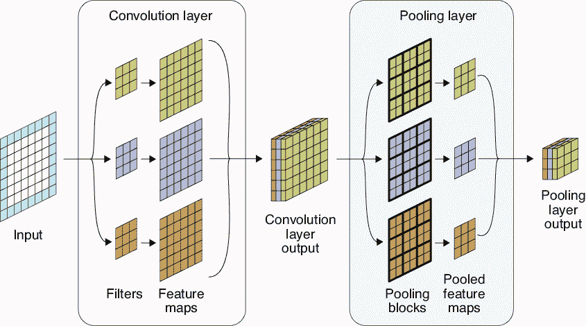

图 16-28：使用多个滤波器的池化或下采样

我们一直在使用二值图像和滤波器作为示例。这意味着，跨越单元边界的特征可能会被忽略，或者在池化后的张量中出现在错误的位置。当我们使用实值输入和滤波核时，这个问题会大大减少。

池化是一种强大的操作，它使得滤波器不再要求其输入位置必须完全正确。数学家称这种位置变化为*平移*或*偏移*，如果某个操作对某种变化不敏感，就称其为对该操作*不变*。结合这些，我们有时会说池化使我们的卷积操作具备*平移不变性*，或*偏移不变性*（Zhang 2019）。

池化操作还具有一个额外的好处，就是减少了通过网络流动的张量的大小，这减少了内存需求和执行时间。

### 跨步

我们已经看到池化在卷积网络中的重要性。尽管池化层很常见，但我们可以通过将池化步骤直接集成到卷积过程中来节省时间。这个结合操作比两个独立的层更快。通过这两种过程得到的张量通常包含不同的值，但经验表明，快速的结合操作通常能产生与慢速的顺序操作一样有用的结果。

如我们所见，在卷积过程中，我们可以假设滤器从输入图像的左上角像素开始（假设我们有填充）。滤器产生一个输出，然后向右移动一步，产生另一个输出，再向右移动一步，依此类推，直到到达该行的右边缘。然后它向下一行移动，返回到左侧，过程重复进行。

但我们不必每次都按单步移动。假设我们在扫过滤器时，向右移动或*跨步*超过一个像素，或者向下移动超过一个像素，那么我们的输出将会比输入更小。我们通常只有在每个维度的步长大于一时，才会使用*跨步*（以及相关的*跨步操作*）这个词。

为了可视化跨步操作，让我们看看滤器从左上角开始的移动过程。当滤器从左到右移动时，它会生成一系列输出，这些输出会依次排列在输出中，同样是从左到右。当滤器向下移动时，新的输出会放置在输出的新一行单元格中。

现在假设我们不是每次水平移动滤器一个元素，而是每次向右移动三个元素。也许每次垂直移动时，我们会向下移动两行，而不是一行。我们仍然为每个输出增长一个元素。这个概念如图 16-29 所示。

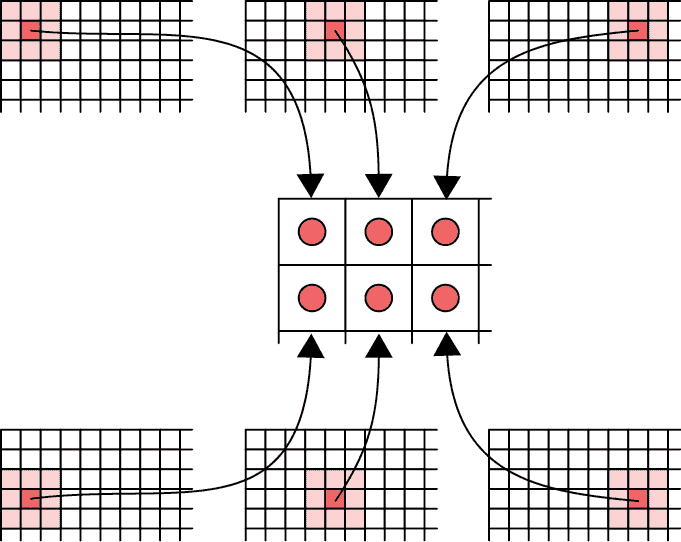

图 16-29：我们的输入扫描在移动时可以跳过输入元素。这里我们在每个水平步长上移动三个元素，每个垂直步长上移动两个元素。

在图 16-29 中，我们在水平方向上使用了步幅三，在垂直方向上使用了步幅二。更常见的是我们会为两个轴指定一个单一的步幅值。在两个轴上都使用步幅二可以看作是每隔一个像素进行评估，无论是水平还是垂直。这将导致输出的尺寸是输入尺寸的一半，这意味着输出的尺寸与先使用步幅为一然后进行二乘二块池化操作后的尺寸相同。图 16-30 显示了滤波器在输入中对于不同步幅对的位置。

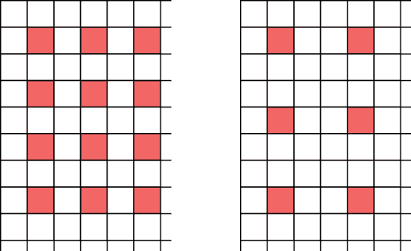

图 16-30：步幅示例。（a）在两个方向上使用步幅二意味着将滤波器集中在每隔一个像素的位置，既在水平方向也在垂直方向。（b）在两个方向上使用步幅三意味着将滤波器集中在每隔三个像素的位置。

当我们每一步移动一个元素时，一个三乘三的滤波器会多次处理相同的输入元素。当我们使用较大的步幅时，我们的滤波器仍然可以多次处理某些元素，如图 16-31 所示。

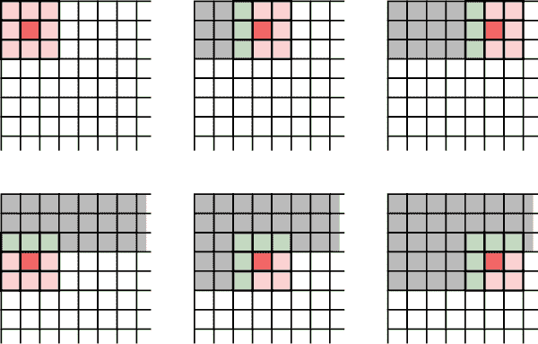

图 16-31：这个三乘三的滤波器在每个维度上以步幅为二进行移动，从左到右，从上到下读取。灰色的元素表示已经处理过的部分。绿色的元素是那些已经在之前的评估中被滤波器使用过，但这次会再次使用的部分。

重复使用一个输入值没有问题，但如果我们想节省时间，可能希望尽量减少计算量。这时，我们可以使用步幅来防止任何输入元素被重复使用。例如，如果我们在图像上移动一个三乘三的滤波器，我们可能会在两个方向上都使用步幅为三，这样就不会有任何像素被重复使用，正如图 16-32 所示。

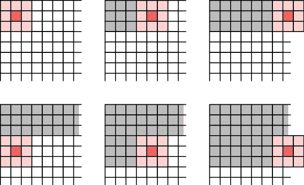

图 16-32：与图 16-31 类似，只是现在我们在每个维度上都使用了步幅三。每个输入元素都只处理一次。

图 16-32 中的步幅操作生成的输出张量在高度和宽度上分别为输入张量高度和宽度的三分之一。考虑到在图 16-32 中，我们通过仅进行六次滤波器评估就处理了一个九乘六的输入元素块。通过这种方式，我们创建了一个三乘二的输出块，且没有明确的池化操作。如果我们不进行步幅操作然后再进行池化，我们需要更多的滤波器评估来覆盖相同的区域，之后还需要在滤波器的输出上执行池化操作。

与没有步幅的卷积加池化操作相比，步幅卷积有两个原因更快。首先，我们评估滤波器的次数更少，其次，我们没有一个明确的池化步骤需要计算。像填充一样，步幅可以（并且通常会）应用于任何卷积层，而不仅仅是第一个卷积层。

从步长学习到的滤波器通常与从没有步长的卷积后接池化学习到的滤波器不同。这意味着我们不能直接将训练好的网络中的卷积和池化对替换为步长卷积（或反之），然后期望它们仍然能正常工作。如果我们想改变网络的架构，就必须重新训练它。

大多数时候，使用步长卷积进行训练会给我们带来与卷积加池化相似的最终结果，而且所需时间更短。但有时，对于特定的数据集和架构，较慢的组合方法反而效果更好。

### 转置卷积

我们已经看到如何通过池化或步长来减小输入的大小，或者说*下采样*它。我们也可以增加输入的大小，或者说*上采样*它。与下采样一样，当我们上采样一个张量时，我们增加它的宽度和高度，但不会改变通道数。

与下采样一样，我们可以通过单独的层进行上采样，或者将其构建到卷积层中。一个独立的上采样层通常只是将输入张量的值重复我们要求的次数。例如，如果我们在宽度和高度上都将张量上采样两倍，每个输入元素就变成一个小的 2x2 正方形。图 16-33 展示了这一概念。

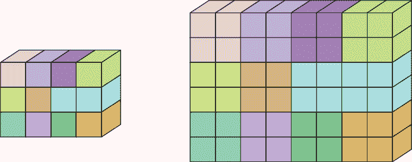

图 16-33：在每个方向上将张量上采样两倍。左图：输入张量。这个张量的每个元素都在垂直和水平方向上重复了两次。右图：输出张量。通道数不变。

我们已经看到，可以通过使用步长将下采样与卷积结合起来。我们也可以将上采样与卷积结合。这个结合步骤称为*转置卷积*、*分数步长*、*膨胀卷积*或*孔洞卷积*。*转置*一词来源于数学中的转置运算，我们可以用它来写出这个操作的方程式。*孔洞*（*atrous*）是法语中“带孔”的意思。稍后我们将看到这些术语的来源。需要注意的是，一些作者将上采样和卷积的结合称为*反卷积*，但最好避免使用这个术语，因为它已经被用于不同的概念（Zeiler 等人 2010）。按照当前的做法，我们将使用*转置卷积*这一术语。

让我们来看一下转置卷积是如何工作的，以扩大一个张量的尺寸（Dumoulin 和 Visin 2016）。假设我们有一个宽度和高度都是 3x3 的初始图像（记住，通道数不会改变），并且我们希望使用一个 3x3 的滤波器处理它，但希望最终得到一个 5x5 的图像。一个方法是用两圈零进行填充，如图 16-34 所示。

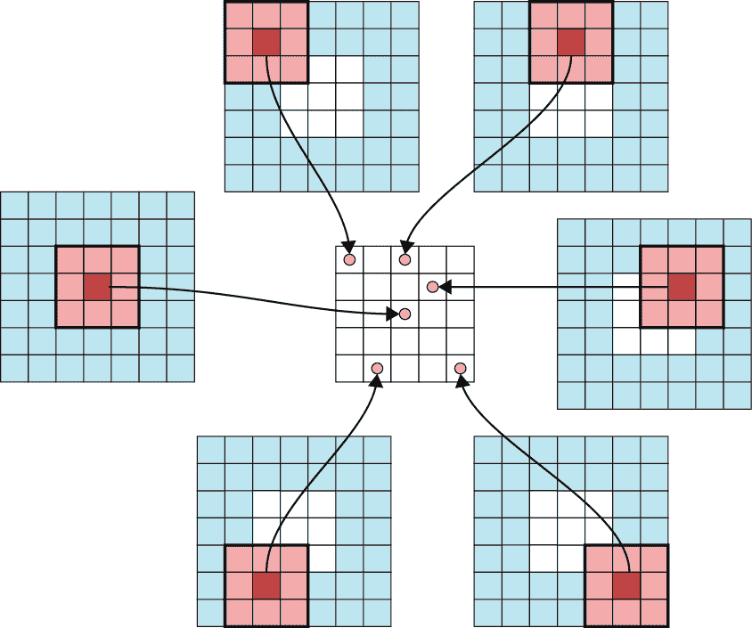

图 16-34：我们的原始三乘三输入在外部网格中以白色显示，四周用两圈零填充。三乘三滤波器现在产生一个五乘五的结果，显示在中心。

如果我们在输入中添加更多的零环，我们会得到更大的输出，但它们会在中央五乘五的核心周围产生零环。这并不是特别有用。

另一种放大输入的方法是在卷积之前通过在输入元素之间和周围插入填充来扩展它。让我们试一下这个方法。我们在起始的三乘三图像中的每个元素之间插入一行一列零，并且像之前一样在外围用两圈零进行填充。结果是，我们的三乘三输入现在变成了九乘九，尽管其中有很多条目是零。当我们用三乘三的滤波器扫描这个网格时，我们得到一个七乘七的输出，如图 16-35 所示。

我们的原始三乘三图像显示在外部网格中，白色像素表示。我们在每个像素之间插入了一行和一列零（蓝色），然后用两圈零将整个图像包围。当我们将三乘三的滤波器（红色）与这个网格进行卷积时，我们得到了一个七乘七的结果，显示在中心。

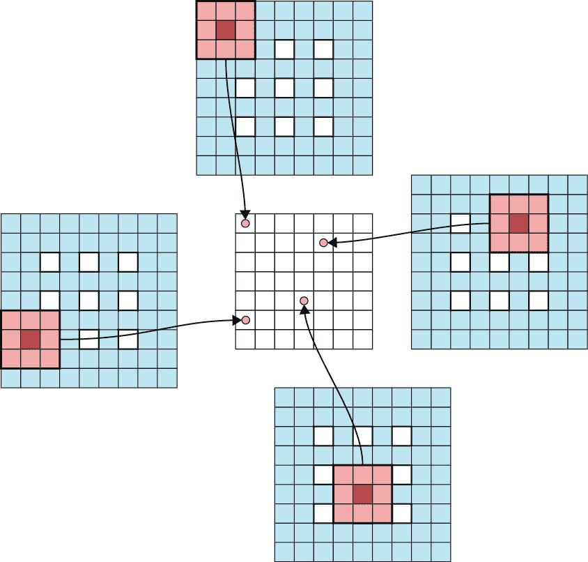

图 16-35：转置卷积，将一个三乘三的滤波器卷积到七乘七的结果中

图 16-35 显示了 *atrous*（法语意思是“带孔”）*卷积* 和 *扩张卷积* 这一命名的来源。通过在每个原始输入元素之间插入另一个行列，我们可以使输出变得更大，如 图 16-36 所示。现在我们的三乘三输入变成了十一乘十一的输入，输出则变成九乘九。

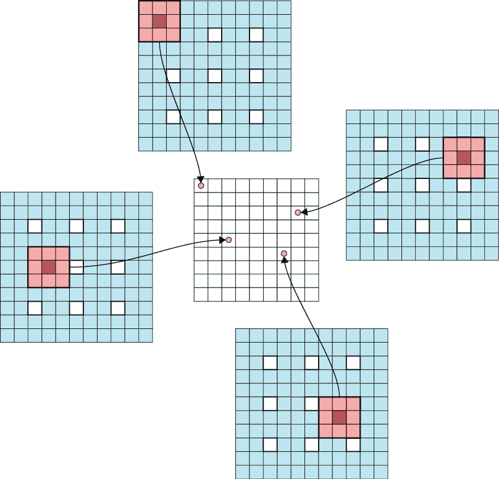

图 16-36：与图 16-35 相同的设置，只不过现在我们在原始输入像素之间插入了两行两列，产生了中心的九乘九结果

如果没有在输出中产生零的行列，我们无法再进一步推展这一技术。零的两行或两列限制是由于我们的滤波器具有三乘三的占地面积。如果滤波器是五乘五的，我们就可以使用最多四行或列的零。插入零的技术可能会在输出张量中产生一些类似棋盘的伪影。但库函数通常可以通过仔细处理卷积和上采样来避免这些问题（Odena、Dumoulin 和 Olah 2018；Aitken 等人 2017）。

反卷积与步幅之间存在联系。通过一些想象，我们可以将图 16-36 中的反卷积过程描述为每个维度上使用三分之一的步幅。我们并不是说我们字面上移动三分之一的元素，而是指我们需要在 11×11 的网格中走三步，才能相当于在原始 3×3 的输入中走一步。这种视角解释了为什么这种方法有时被称为*分数步幅*。

就像步幅结合卷积与下采样（或池化）步骤一样，反卷积（或分数步幅）结合了卷积与上采样步骤。这带来了更快的执行时间，这总是令人愉快的。一个问题是我们可以增加输入尺寸的限制。在实践中，我们通常将输入维度加倍，并使用三乘三的滤波器，反卷积支持这种组合而不会在输出中引入多余的零。

与步幅一样，反卷积的输出与上采样加标准卷积的输出不同，因此，如果我们得到一个使用上采样加卷积的训练网络，我们不能仅仅将这两层替换为一个反卷积层并使用相同的滤波器。

反卷积因其效率更高且与结果相似（Springenberg 等，2015），而比上采样加卷积更为常见。

我们已经涵盖了很多基本工具，从不同类型的卷积到填充和改变输出大小。在下一节中，我们将把这些工具结合起来，创建一个完整但简单的卷积网络。

## 滤波器的层次结构

许多真实的视觉系统似乎是*层次化的*（Serre 2014）。从广义上讲，许多生物学家认为视觉系统的处理是在一系列层次中进行的，每一层都比前一层处理更高层次的抽象。

本章中我们已经从生物学中汲取了灵感，现在我们可以再次这样做。

让我们回到讨论蟾蜍视觉系统的话题。接收光的第一层细胞可能在寻找“虫子颜色的斑点”，下一层可能在寻找“来自前一层的斑点组合，形成类似虫子的形状”，接下来的层次可能在寻找“前一层形成的虫子形状组合，看起来像是有翅膀的胸部”，依此类推，直到最上层，它在寻找“苍蝇”（这些特征完全是虚构的，只是为了说明这个想法）。

这种方法在概念上很不错，因为它让我们能够按照图像特征的层次结构和寻找这些特征的滤波器来构建对图像的分析。它在实现上也很有优势，因为这是分析图像的一种灵活且高效的方式。

### 简化假设

为了说明层次结构的使用，让我们用卷积网络来解决一个识别问题。为了将讨论重点放在概念上，我们将使用一些简化。这些简化并不会改变我们要展示的原理；它们只是让图像更容易绘制和解读。

首先，我们将自己限制在二进制图像上：只有黑白，没有灰色阴影（虽然为了清晰起见，我们分别用米色和绿色表示 0 和 1）。在实际应用中，我们输入图像中的每个通道通常是一个范围在 [0, 255] 之间的整数，或者更常见的是一个范围在 [0, 1] 之间的实数。

其次，我们的滤波器也是二进制的，并且寻找输入中的精确匹配。在实际的网络中，我们的滤波器使用实数，并且它们将输入与不同程度的匹配，输出为不同的实数。

第三，我们手动创建所有的滤波器。换句话说，我们自己做特征工程。当我们讨论专家系统时，我们提到它们的最大问题是需要人工构建特征，而我们现在就是在做这件事！不过，这只是为了本次讨论。实际上，我们的滤波器值是通过训练学习得来的。由于我们目前不关注训练步骤，所以我们将使用手工制作的滤波器（我们可以将其视为通过训练得到的滤波器）。

第四，我们不会使用填充。这也是为了保持简单。

最后，我们的示例使用的是只有 12 像素边长的小输入图像。这个大小足以展示这些概念，但又足够小，可以让我们在页面上清晰地绘制所有内容。

在这些简化措施到位后，我们准备好开始了。

### 查找面具图

假设我们在一个博物馆工作，博物馆收到了大量的艺术品，我们的任务是将其整理好。我们的其中一项任务是找到所有与图 16-37 中的简单掩码相近的网格化面具画作。

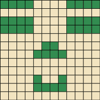

图 16-37：在一个 12x12 网格上的简单二进制掩码

假设我们得到了中间的这个新掩码，如图 16-37 所示。我们将其称为*候选图*。我们想要确定它是否大致与原始掩码“相同”，即我们称之为*参考图*。我们可以将这两个掩码叠加在一起，看看它们是否匹配，如图 16-38 右侧所示。

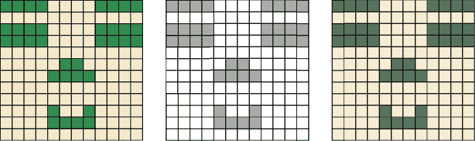

图 16-38：测试相似性。左边是我们的原始掩码或参考图。中间是一个新的掩码或候选图。为了检查它们是否接近，我们可以将它们叠加在右边。

在这种情况下，它是一个完美匹配，很容易检测出来。但是如果一个候选图与参考图略有不同，像图 16-39 所示呢？这里其中一只眼睛向下移动了一个像素。

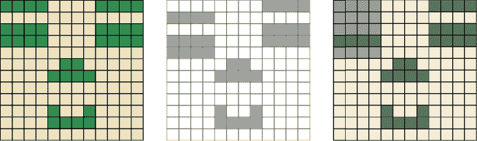

图 16-39：与图 16-38 类似，只不过候选者的左眼向下移动了一个像素。覆盖图现在不完美。

假设我们仍然希望接受这个候选者，因为它具有与参考面具相同的所有特征，并且这些特征大部分都在正确的位置。但覆盖图显示它们并不完全相同，因此简单的逐像素比较无法完成任务。

在这个简单的例子中，我们可以想出很多方法来检测相似的匹配，但让我们使用卷积来确定像图 16-39 中的候选者是否“像”参考面具。如前所述，我们将手动设计我们的滤波器。为了描述我们的层次结构，最简单的方法是从最后一步卷积开始，倒推到第一步。

让我们从描述参考面具开始。然后，我们可以判断候选者是否具有相同的特征。假设我们的参考面具的特征是：每个上角都有一只眼睛，鼻子在中间，嘴巴在鼻子下方。这个描述适用于我们在图 16-38 和图 16-39 中看到的所有面具。

我们可以用一个三乘三的滤波器来形式化这个描述，如图 16-40 左上角的网格所示。这将是我们最后几个滤波器之一：如果我们通过一系列卷积运算处理一个候选者，最终得到一个三乘三的张量（稍后我们将看到如何得到这个张量），那么如果这个张量与这个滤波器匹配，我们就找到了一个成功的匹配和一个可接受的候选者。带有×的单元格表示“不关心”。例如，假设候选者的一个面颊上有一个纹身，落在鼻子右侧的×区域内。这不会影响我们的判断，因此我们明确表示不关心该单元格中的内容。

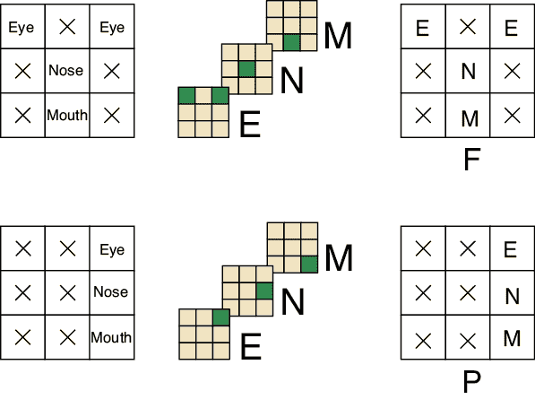

图 16-40：面具识别的滤波器。上下行：寻找正面或侧面的面具。左列：特征化参考面具。中间：左侧网格所描述的张量的爆炸版。右侧：滤波器的 X 光视图（见正文）。

由于我们的滤波器只包含 1（绿色）和 0（米色）这两种值，我们无法直接做出像图 16-40 左上方示意图那样的滤波器。相反，由于它需要寻找三种不同类型的特征，我们需要将其重新绘制为一个具有三通道的滤波器，并将其应用于具有三通道的输入张量。一个输入通道告诉我们眼睛在输入中的所有位置，下一个告诉我们鼻子的所有位置，最后一个告诉我们嘴巴的所有位置。因此，我们的左上方示意图对应一个三乘三乘三的张量，如上中图所示，我们已将通道错开，以便可以分别读取每个通道。

我们画出了错开的版本，因为如果我们将该张量画成一个实心块，我们将无法看到 N（鼻子）和 M（嘴巴）通道上的大部分值。错开的版本很有用，但在我们开始比较张量的后续讨论时会变得非常复杂。相反，让我们画出张量的“X 射线视图”，如右上角所示。我们假设我们正在透视张量的各个通道，并在每个单元格中标记所有在该单元格中有 1 的通道名称。

由于这个过滤器用于寻找面向前方的面具，我们将其标记为 F。为了有趣，我们还可以制作一个寻找侧面面具的过滤器，我们称之为 P。我们不会查看任何由 P 匹配的候选图像，但我们在这里包括它，是为了展示这一过程的普遍性。接下来的层将在图 16-40 中的过滤器之前操作，它们将告诉我们在哪里找到了眼睛、鼻子和嘴巴。我们利用这些信息，在图 16-40 中通过使用不同的过滤器来识别这些面部特征的不同排列。

### 寻找眼睛、鼻子和嘴巴

让我们看看如何将一个 12×12 的候选图像转换为图 16-40 过滤器所要求的 3×3 网格。我们可以通过一系列卷积操作来实现，每个卷积后跟随一个池化步骤。由于图 16-40 中的过滤器是用来匹配眼睛、鼻子和嘴巴的，我们知道，在这些过滤器之前的卷积层必须产生这些特征。所以，让我们设计用于搜索这些特征的过滤器。

在图 16-41 中，我们展示了三个过滤器，每个过滤器的尺寸为 4×4。它们分别标记为 E4、N4 和 M4。它们分别用于检测眼睛、鼻子和嘴巴。稍后，为什么每个名字后面加上“4”的原因将会变得清晰。

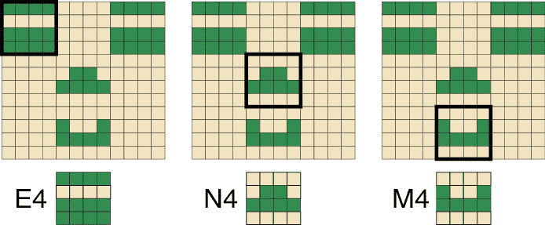

图 16-41：三个用于检测眼睛、鼻子和嘴巴的过滤器

我们可以直接开始，将这三个过滤器应用于任何候选图像。由于图像的尺寸为 12×12，且我们不进行填充，输出的尺寸将为 10×10。如果我们将这些输出池化为 3×3，我们就可以将图 16-40 中的过滤器应用于图 16-41 中过滤器的输出，从而确定该候选图像是否是面向前方的面具、侧面的面具，或者都不是。

但应用 4×4 的过滤器需要大量的计算。更糟糕的是，如果我们想要寻找另一个特征（比如眨眼），我们必须构建另一个 4×4 的过滤器，并将其应用于整个图像。我们可以通过在此之前引入另一层卷积，使我们的系统更加灵活，同时也更快。

我们的 E4、N4 和 M4 滤波器在 图 16-41 中可以由哪些特征组成？如果我们将每个 4x4 滤波器看作是由 2x2 块组成的网格，那么我们只需要四种 2x2 块就可以组成所有三个滤波器。图 16-42 的顶行显示了这四个小块，下面的行则展示了它们如何组合成我们的眼睛、鼻子和嘴巴滤波器。我们分别将它们命名为 T、Q、L 和 R，代表上方、四分之一、左下角和右下角。

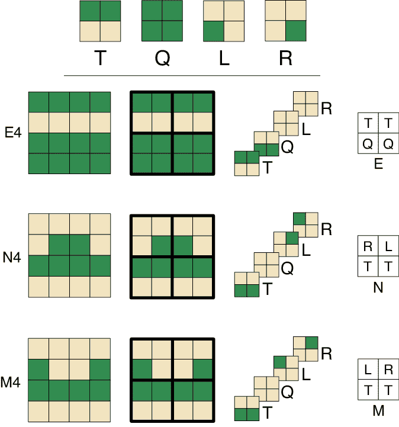

图 16-42：顶行：2x2 滤波器 T、Q、L 和 R。第二行，从左到右：滤波器 E4，将其分解为四个小块及其张量形式。最右边显示了 2x2x4 滤波器 E 的 X 射线视图。第三和第四行：滤波器 N4 和 M4。

从眼睛滤波器 E4 开始，我们将 4x4 滤波器分解为四个 2x2 块。E4 行中的第三个图显示了我们期望作为输入的四个通道，每个通道分别对应 T、Q、L 和 R，绘制为一个单一的张量，其中我们错开了通道。为了更方便地绘制该张量，我们使用了在 图 16-40 中看到的 X 射线约定。这样我们就得到了一个新的滤波器，大小为 2x2x4。这就是我们真正想用来检测眼睛的滤波器，所以我们去掉了“4”，直接称其为 E。

N 和 M 滤波器是通过从 T、Q、L 和 R 进行细分和组装的相同过程创建的。

现在想象将小的 T、Q、L 和 R 滤波器应用于候选图像。它们在寻找像素的模式。接着，E、N 和 M 滤波器寻找 T、Q、L 和 R 模式的特定排列。然后 F 和 P 滤波器寻找 E、N 和 M 模式的特定排列。因此，我们有一系列卷积层，每个输出都作为下一层的输入。图 16-43 以图形方式展示了这一过程。

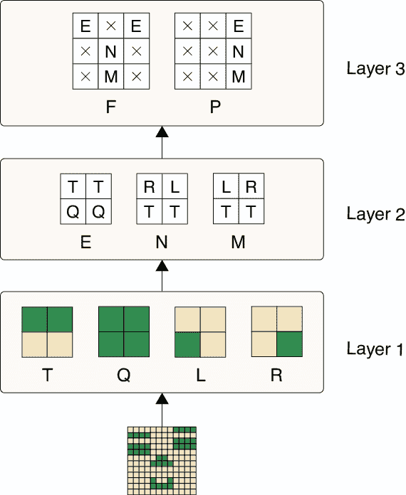

图 16-43：使用三层卷积分析输入候选图像

现在我们已经有了滤波器，可以从底部开始处理输入。在此过程中，我们将看到应该放置池化层的位置。

### 应用我们的滤波器

让我们从 图 16-43 的底部开始，应用第一层的滤波器。 图 16-44 显示了将 T 滤波器应用于 12x12 候选图像的结果。由于 T 是 2x2 的，它没有中心，因此我们将其锚点任意放置在左上角。因为我们没有填充，且滤波器为 2x2，所以输出将是 11x11。在 图 16-44 中，T 找到完全匹配的每个位置都标记为浅绿色；否则，标记为粉红色。我们将此输出称为 T 图。

现在我们想确保，即使 T 匹配的位置与参考掩码中的位置不完全相符，E、N 和 M 滤波器依然能够成功找到 T 匹配。正如我们在上一节中所看到的，使滤波器对输入中的小位移具有鲁棒性的方法是使用池化。让我们使用最常见的池化形式：二乘二块的最大池化。

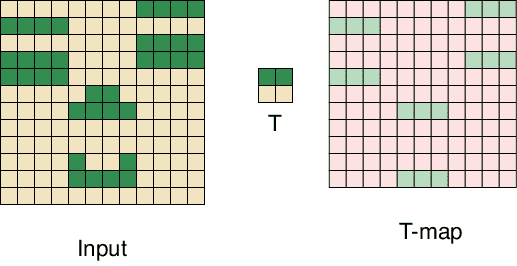

图 16-44：将 12 乘 12 的输入图像与 2 乘 2 的 T 滤波器进行卷积，产生 11 乘 11 的输出，或称为特征图，我们称之为 T 图。

图 16-45 显示了对 T 图进行最大池化的应用。对于每个二乘二的块，如果该块中至少有一个绿色值，则输出为绿色（回想一下，绿色元素的值为 1，红色元素的值为 0）。当池化块落在输入的右侧和底部时，我们只需忽略缺失的条目，并对实际存在的值进行池化。我们将池化的结果称为 T-pool 张量。

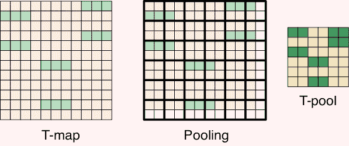

图 16-45：对 T 图应用二乘二最大池化，生成 T-pool 张量。绿色代表 1，粉色代表 0。

T-pool 的左上角元素告诉我们，当 T 滤波器放置在输入图像的左上角任意四个像素上时，是否匹配。在这种情况下，它确实匹配，因此该元素被标记为绿色（即，赋值为 1）。

让我们对其他三个第一层滤波器（Q、L 和 R）重复这个过程。结果显示在 图 16-46 的左侧部分。

四个滤波器 T、Q、L 和 R 一起生成一个包含四个特征图的结果，每个特征图在池化后为六乘六。回想一下 图 16-40，E、N 和 M 滤波器期望输入一个四通道的张量。为了将这些单独的输出合并成一个张量，我们可以像 图 16-46 中间那样将它们堆叠起来。和往常一样，我们随后使用 X 射线视图的约定将其绘制为二维网格。这为我们提供了一个四通道的张量，正是第二层所期望的输入。

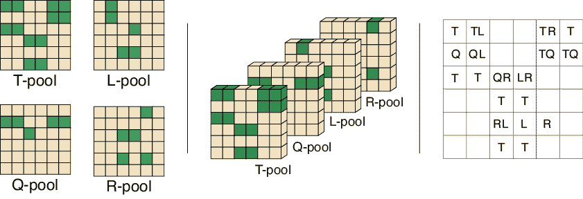

图 16-46：左：对候选图像应用所有四个第一层滤波器并池化后的结果。中：将输出堆叠成一个单一张量。右：以 X 射线视图绘制六乘六乘四的张量。

现在我们可以转到第二层的滤波器。我们从 E 滤波器开始，见 图 16-47。

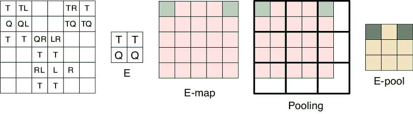

图 16-47：应用 E 滤波器。如同之前，从左到右，我们依次看到输入张量、E 滤波器（都以 X 射线视图显示）、应用该滤波器的结果、池化网格和池化后的结果。

图 16-47 展示了我们的输入张量（第一层的输出）和 E 滤波器，都是 X 光视图。在它们的右侧，我们可以看到应用 E 滤波器后的 E 图，接着是对 E 图应用 2x2 池化操作的过程，最后是 E 池特征图。我们已经可以看到，池化过程使得下一个滤波器能够匹配眼睛的位置，即使一个眼睛并没有出现在参考掩膜中的原始位置。

我们可以对 N 和 M 滤波器应用相同的处理过程，生成第二层的输出张量，如图 16-48 所示。

现在我们有一个三乘三的张量，包含三个通道，正好适合我们在图 16-40 中为 F 和 P 创建的滤波器。我们准备好进入下一层，即第三层。

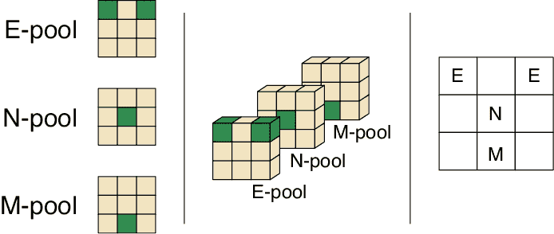

图 16-48：计算 E、N 和 M 滤波器的输出，然后将它们堆叠成一个具有三个通道的张量

最后一步很简单：我们只需将 F 和 P 滤波器应用到整个输入上，因为它们的尺寸相同（也就是说，不需要对图像进行滤波器扫描）。结果是一个形状为一乘一乘二的张量。如果这个张量中第一通道的元素是绿色，那么 F 匹配，候选图像应该被接受为与我们的参考图像匹配。如果是米色，那么候选图像不匹配。

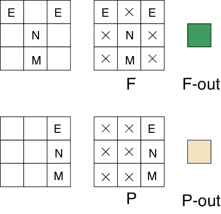

图 16-49：将 F 和 P 滤波器应用于第二层的输出张量。在这一层中，每个滤波器与输入的大小相同，因此该层生成的输出张量的大小为一乘一乘二。

完成了！我们使用了三层卷积来将候选图像与参考图像进行比较，判断它们是否相似或不相似。我们发现，候选图像中一个眼睛下移了一个像素，但仍足够接近参考图像，因此我们应该接受它。

我们通过创建一个层级结构来解决这个问题，而不仅仅是一个卷积序列。每一层卷积都使用了前一层的结果。第一层寻找像素中的模式，第二层寻找这些模式的模式，而第三层则寻找更大的模式，代表着正面或侧面的脸部。池化使得网络能够识别出一个候选图像，即使其中一个重要的像素块稍微发生了偏移。

图 16-50 展示了我们的整个网络。由于只有卷积层包含神经元，因此我们称之为*全卷积网络*。

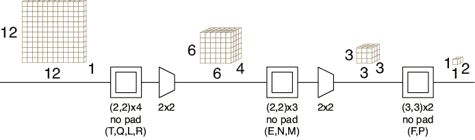

图 16-50：我们的全卷积网络用于评估掩膜。我们还展示了输入、输出和中间张量。带有嵌套框的图标表示卷积层，梯形图标表示池化层。

在图 16-50 中，带有框中框图标表示卷积层，梯形图标表示池化层。

如果我们想要匹配更多类型的面部特征，只需在最终层添加更多的过滤器。这样，我们就可以匹配任何我们想要的眼睛、鼻子和嘴巴的模式，且几乎没有额外的成本。通过减少网络中张量的大小，池化操作减少了我们需要进行的计算量。这意味着，使用池化的网络不仅比没有池化的版本更加稳健，还消耗更少的内存并且运行更快。

有一种感觉是，当我们逐步向上工作时，我们的过滤器变得越来越强大。例如，我们的眼睛过滤器 E 处理的是一个 4×4 的区域，尽管它本身只有 2×2，因为它的每个张量元素都是由一个 2×2 的卷积产生的。通过这种方式，层次结构中更高层次的过滤器能够寻找大型和复杂的特征，即使它们只使用小的（因此更快的）过滤器。

更高层次的网络能够以多种方式组合低层次的结果。假设我们要在照片中分类不同种类的鸟类。低层的过滤器可能会寻找羽毛或喙，而高层的过滤器则能够结合不同类型的羽毛或喙来识别不同种类的鸟类，所有这些都在一次通过照片的过程中完成。我们有时会说，使用卷积和池化技术来分析输入是应用了一个*层次化的尺度*。

## 总结

本章讲述的内容完全是关于卷积的：即将一个过滤器或内核（也就是一组权重的神经元）应用到输入数据上的方法。每次我们将过滤器应用到输入时，会生成一个单一的输出值。过滤器可能只使用一个输入元素来进行计算，也可能有一个更大的区域并使用多个输入元素的值。如果一个过滤器的大小大于 1×1，那么在输入的某些位置，过滤器会“溢出”到边缘，这时会需要没有的数据。如果我们不将过滤器放置在这些地方，输出的宽度或高度（或者两者）会比输入的小。为了避免这种情况，我们通常通过在输入周围加上一圈零来进行填充，使得过滤器可以覆盖每个输入元素。

我们可以将许多过滤器打包成一个卷积层。在这样的层中，通常每个过滤器都有相同的大小和激活函数。每个过滤器会生成一个通道。该层的输出会有每个过滤器对应的通道。

如果我们想改变张量的宽度和高度，我们可以进行降采样（减少一个或两个维度）或升采样（增加一个或两个维度）。为了降采样，我们可以使用池化层，它会在输入块中找到平均值或最大值。为了升采样，我们可以使用升采样层，它会复制输入元素。以上任一技术都可以与卷积步骤结合使用。为了降采样，我们使用步幅，其中滤波器会在水平方向、垂直方向或两者上移动超过一个步骤。为了升采样，我们使用分数步幅或转置卷积，在此过程中我们在输入元素之间插入零行和/或零列。

我们看到，通过在一系列层中应用卷积并进行降采样，我们能够创建一个在不同尺度上工作的滤波器层次结构。这也意味着该系统具备平移不变性，即使模式的位置不完全符合预期，它仍能找到所需的模式。

在下一章中，我们将检查实际的卷积神经网络，并查看它们的滤波器，以了解它们是如何完成工作的。
