# 第十七章：实际中的卷积神经网络（ConvNets）

在上一章中，我们讨论了卷积，并且通过一个简化的卷积网络（convnet）示例做了总结。

本章中，我们将介绍两个用于图像分类的实际卷积神经网络。第一个用于识别灰度手写数字，第二个用于识别彩色照片中占主导地位的物体，从 1,000 个不同类别中进行选择。

## 手写数字分类

手写数字分类是机器学习中的一个著名问题（LeCun 等，1989），这要感谢一个免费提供的数据集，称为 MNIST（发音为 em´-nist）。它包含 60,000 个手绘数字，从 0 到 9，每个数字都是白色的灰度图像，背景是 28 x 28 的黑色，标签标识数字。图像是由人口普查员和学生收集的。我们的任务是识别每张图像中的数字。

我们将使用一个为此任务设计的简单卷积神经网络（convnet），它包含在 Keras 机器学习库中（Chollet 2017）。图 17-1 展示了我们示意图中的架构以及传统的框和标签形式。

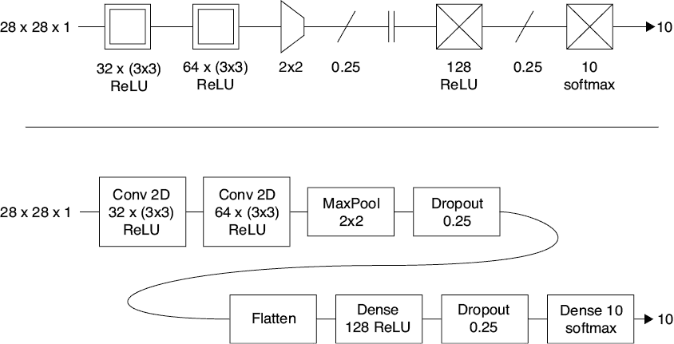

图 17-1：用于分类 MNIST 数字的卷积神经网络。输入图像是 28 x 28 x 1 的通道。两个卷积层后跟池化、丢弃法、扁平化，然后是一个密集层（或全连接层），另一个丢弃法层，最后是一个包含 10 个输出的密集层，后跟 softmax。上图：我们的示意图。下图：传统的框和标签形式。

网络的输入是 MNIST 图像，作为形状为 28 x 28 x 1 的 3D 张量提供（1 表示单一的灰度通道）。尽管在最后有两个全连接层，以及各种辅助层（如丢弃法、扁平化和池化），但我们仍然称其为卷积神经网络（convnet），因为卷积层主导了分类工作。第一个卷积层使用 32 个大小为 3 x 3 的滤波器对输入进行操作。每个滤波器的输出都经过 ReLU 激活函数处理后才离开该层。

由于未指定步幅，滤波器将在每个方向上移动一个元素。我们也没有应用任何填充。正如我们在图 16-10 中看到的，这意味着每次卷积后我们会丢失一圈元素。这样做在本例中是可以接受的，因为所有 MNIST 图像应该在数字周围有一个四个黑色像素的边框（并非所有图像都有这个边框，但大多数都有）。

第一层的输入张量是 28x28x1，因此第一卷积层中的每个滤波器深度为一个通道。由于我们有 32 个滤波器，并且输入没有填充，且滤波器的尺寸为 3x3，第一个卷积层的输出为 26x26x32。第二个卷积层包含 64 个滤波器，尺寸为 3x3。系统知道输入有 32 个通道（因为上一层有 32 个滤波器），因此每个滤波器创建为一个形状为 3x3x32 的张量。由于我们仍然没有使用填充，输入的外围再次丢失一圈，生成的输出张量是 24x24x64。

我们本可以使用步幅（striding）来减少输出的大小，但在这里我们使用了一个显式的最大池化层，池化块的大小为 2x2。这意味着，对于输入中每个不重叠的 2x2 块，层输出一个值，该值包含该块中的最大值。因此，这一层的输出是一个 12x12x64 的张量（池化层不会改变通道的数量）。

接下来，我们介绍一个 dropout 层，用斜线表示。正如我们在第十五章中看到的，dropout 层本身并不执行任何处理。相反，它指示系统对最近的包含神经元的前置层应用 dropout。dropout 前最近的层是池化层，但池化层没有神经元。当我们继续向后工作时，发现一个卷积层，它确实包含神经元。在训练过程中，dropout 算法会应用到这个卷积层（请记住，dropout 仅在训练期间应用，其他时候会被忽略）。在每个训练的周期前，卷积层中四分之一的神经元会被暂时禁用。这有助于防止过拟合。根据惯例，我们通常将 dropout 视为一个层，即使它不执行任何计算。请注意，由于 dropout 层会向后查找最近的具有神经元的层，我们本可以将其放置在池化层的左侧，网络的行为不会改变。根据惯例，当我们在卷积后进行池化时，我们通常将这两个层放在一起。

现在我们离开网络的卷积部分，为输出做准备。我们通常会在分类卷积神经网络的末端找到这些步骤，或者类似的步骤。第二个卷积层的输出是一个 3D 张量，但我们希望将其输入到一个全连接层，该层期望接收一个列表（或 1D 张量）。一个*flatten*层，如图所示，将任何维度的输入张量重组织成一个 1D 张量，通过将所有元素按顺序放在一起。这个列表从张量的第一行开始。我们取出第一个元素，并将它的 64 个值放在列表的开头。然后我们移到第二个元素，并将它的 64 个值放在列表的末尾。我们继续对每个元素执行此操作，然后对下一行重复此过程，以此类推。图 17-2 展示了这个过程。在这个重排过程中，张量中的值不会丢失。

图 17-2：flatten 层的作用。顶部：输入张量。中间：将每个通道转换为一个列表。底部：将这些列表一个接一个地放在一起，形成一个大的列表。

返回到图 17-1，flatten 层生成一个 12 × 12 × 64 = 9,216 个数字的列表。这个列表进入一个包含 128 个神经元的全连接层。这个层受到 dropout 的影响，在训练的每个批次开始时，四分之一的神经元会被暂时断开。

该层的 128 个输出进入一个最终的全连接层，该层有 10 个神经元。这一层的 10 个输出进入一个 softmax 步骤，将它们转换为概率。最后一层输出的 10 个数字给出了网络对输入图像属于 0 到 9 这 10 个可能类别的概率预测。

我们使用标准的 MNIST 训练数据训练了该网络 12 个周期。其在训练集和验证集上的准确率如图 17-3 所示。

曲线显示我们在训练和验证数据集上都达到了约 99%的准确率。由于曲线没有发散，我们成功避免了过拟合。

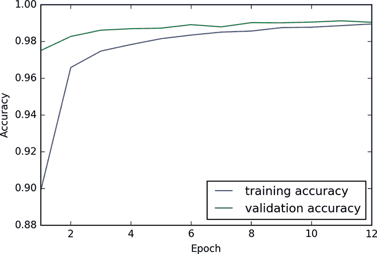

图 17-3：我们在图 17-2 中的卷积神经网络的训练表现。我们训练了 12 个周期，由于训练和验证曲线没有发散，我们成功避免了过拟合，并且在两个数据集上达到了约 99%的准确率。

让我们来看一些预测。图 17-4 显示了来自 MNIST 验证集的一些图像，标记了网络给出的最大概率对应的数字。在这个小的例子集中，网络做得非常完美。

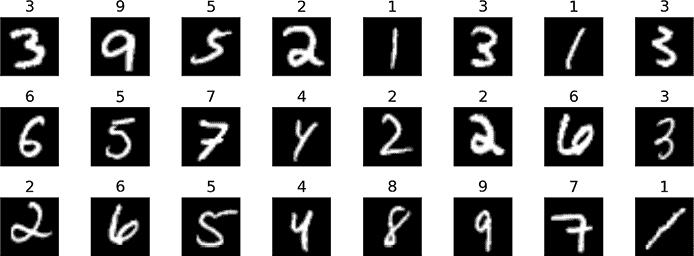

图 17-4：这些是从 MNIST 验证集随机选择的 24 张图像。每张图像都标注了网络的输出，显示了具有最高概率的数字。网络正确地分类了这 24 个数字。

仅仅两个卷积层就赋予了这个系统足够的能力，达到了 99%的准确率。

## VGG16

让我们来看看一个更大、更强大的卷积神经网络，叫做*VGG16*。它被训练用来分析彩色照片，并通过为 1,000 个不同类别分配概率来识别每张照片中的主要物体。

VGG16 是在一个著名的数据集上训练的，该数据集曾作为比赛的一部分使用。ILSVRC2014 竞赛是 2014 年的一个公开挑战赛，目标是构建一个神经网络，用于分类提供的图像数据库中的照片（Russakovsky 等，2015）。ILSVRC 是 ImageNet 大型视觉识别挑战赛（ImageNet Large Scale Visual Recognition Challenge）的缩写，因此这个图像数据库通常被称为 ImageNet 数据库。ImageNet 照片数据库可以在网上自由获取，至今仍被广泛用于训练和测试新的网络（更新、更大的 ImageNet 版本也可以使用[Fei-Fei 等，2020]）。

原始的 ImageNet 数据库包含 120 万张图像，每张图像都手动标注了 1,000 个标签中的一个，描述照片中最突出的物体。挑战赛实际上包括了多个子挑战，每个子挑战都有自己的获胜者（ImageNet 2020）。其中一个分类任务的获胜者是 VGG16（Simonyan 和 Zisserman，2014）。VGG 是 Visual Geometry Group 的缩写，他们开发了这个系统。16 指的是该网络的 16 个计算层（还有一些辅助层，如 dropout 和 flatten，它们不进行计算）。

VGG16 在赢得比赛时打破了准确率的记录，尽管几年已经过去，但它依然流行。这主要是因为它在图像分类上仍然表现非常好（即使与更新、更复杂的系统相比），并且它具有简单的结构，易于修改和实验。作者已经发布了所有的权重，并说明了他们如何预处理训练数据。更棒的是，每个深度学习库都使得我们能够在自己的代码中轻松创建一个完全训练好的 VGG16 实例。由于这些优点，VGG16 通常成为涉及图像分类的项目的起点。

让我们来看一下 VGG16 的架构。大部分工作由一系列卷积层完成。辅助层沿途出现，最后会出现一些 flatten 层和全连接层，正如在图 17-1 中所示。

在将任何数据输入到我们的模型之前，我们必须以与作者处理训练数据相同的方式预处理数据。这涉及到确保每个通道通过从所有像素中减去特定值进行调整（Simonyan 和 Zisserman 2014）。为了更好地讨论网络中流动的张量形状，假设每张输入图片的高度和宽度为 224，以匹配网络训练时使用的 Imagenet 数据的维度，并且其颜色已正确预处理。完成这些步骤后，我们就可以将图像输入到网络中。

我们将 VGG16 架构呈现为六组层的系列。这些组是严格概念性的，仅仅是将相关层聚集在一起进行讨论的一种方式。前几组具有相同的结构：两层或三层卷积，后跟一个池化层。

第 1 组如图 17-5 所示。

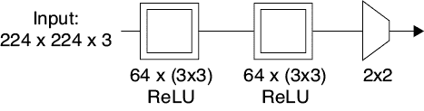

图 17-5：VGG16 的第 1 组。我们使用 64 个大小为 3x3 的滤波器对输入张量进行卷积。然后，我们使用 64 个新的滤波器再次进行卷积。最后，我们使用最大池化将输出张量的高度和宽度减半。

卷积层对其输入应用了零填充，因此不会丢失宽度或高度。最大池化步骤使用大小为 2x2 的不重叠块。

VGG16 中的所有卷积层都使用默认的 ReLU 激活函数。

我们已经看到，池化对于帮助我们的滤波器识别即使被位移的模式是多么有用。出于与第十六章中匹配掩模时相同的原因，我们在这里也应用了池化。

图 17-5 中的组输出的是一个尺寸为 112x112x64 的张量。112 的数值来自于输入的 224x224 尺寸经过减半后的结果，而 64 来自于第二个卷积层中的 64 个滤波器。

第 2 组与第一组类似，只不过现在我们在每个卷积层中应用 128 个滤波器。图 17-6 展示了各层。该组的输出尺寸为 56x56x128。

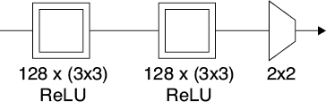

图 17-6：VGG16 的第 2 组就像图 17-5 中的第一个块，只不过我们在每个卷积层中使用 128 个滤波器，而不是 64 个。

第 3 组继续每个卷积层中滤波器数量翻倍的模式，但它将卷积步骤重复三次，而不是两次。图 17-7 展示了第 3 组。最大池化步骤后的张量尺寸为 28x28x256。

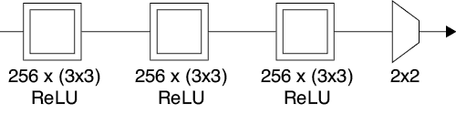

图 17-7：VGG16 的第 3 组再次将滤波器的数量翻倍，达到 256 个，并且将卷积步骤重复三次，而不是像之前那样重复两次。

网络的第 4 组和第 5 组是相同的。每组由三次 512 个滤波器的卷积操作组成，后跟一个最大池化层。这些层的结构见于图 17-8。来自第 4 组的张量尺寸为 28 x 28 x 512，第 5 组最大池化层后的张量尺寸为 14 x 14 x 512。

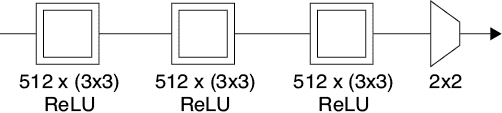

图 17-8：VGG16 的第 4 组和第 5 组是相同的。每组包含三个卷积层，后跟一个 2x2 的最大池化层。

这结束了网络的卷积部分，现在进入总结部分。与我们在图 17-1 中看到的 MNIST 分类器相同，我们首先将来自第 5 组的张量展平。然后将其通过两个拥有 4,096 个神经元的全连接层，每个使用 ReLU，并且都经过 50% 设置的 dropout。最后，输出进入一个拥有 1,000 个神经元的全连接层。结果送入 softmax，产生 1,000 个概率值，分别对应 VGG16 被训练识别的每个类别。这些最终步骤，典型于这种风格的分类网络，见于图 17-9。

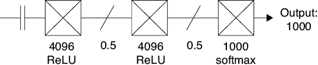

图 17-9：VGG16 的最终处理步骤。我们将图像展平，然后通过两个使用 ReLU 的全连接层，接着是 dropout，再通过一个带有 softmax 的全连接层。

图 17-10 展示了整个架构。

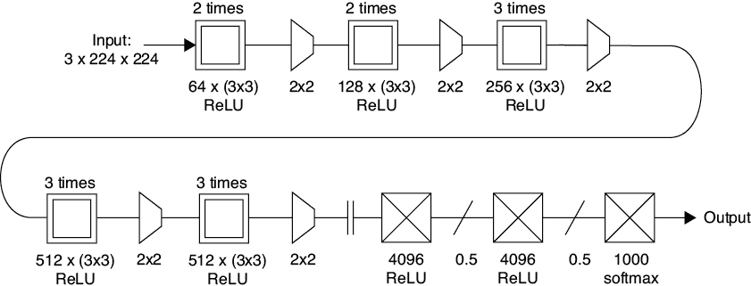

图 17-10：VGG16 架构汇总

该网络效果非常好。图 17-11 展示了四张使用手机相机在西雅图拍摄的图片。

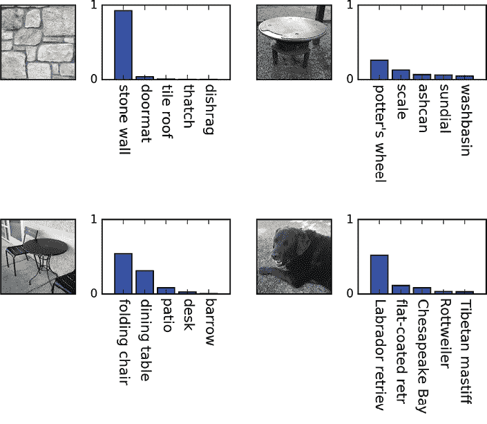

图 17-11：四张在晴天时在西雅图拍摄的照片。图 17-10 中的卷积网络很好地识别了每张图像。

该卷积网络从未见过这些图像，但它处理得非常好。即使是右上角那个模糊的圆形物体，也被分配了合理的标签。

让我们通过查看 VGG16 的滤波器，来更仔细地了解其内部工作原理。

## 滤波器可视化，第一部分

VGG16 在分类中的成功归功于它的卷积层所学习到的滤波器。尽管很想看一下滤波器，并了解它们学到了什么，但滤波器本身是由大量数字组成的块，难以解读。我们不需要试图直接理解这些数字块，而是可以通过创建触发它们的图像来间接可视化滤波器。换句话说，一旦选择了一个要可视化的滤波器，我们可以找到一张图像，使该滤波器输出其最大值。那张图像向我们展示了这个滤波器在寻找什么。

我们可以通过一点基于梯度下降的小技巧来实现这一点，梯度下降算法是我们在第十四章中作为反向传播的一部分看到的。我们将梯度下降颠倒过来，创建梯度*上升*，用于沿着梯度上升并增加系统的误差。请记住，在第十四章的训练过程中，我们使用系统的误差创建梯度，通过反向传播将其向网络推送，从而使我们能够改变权重以减少该误差。对于滤波器可视化，我们将忽略网络的输出及其误差。我们唯一关心的输出是特定滤波器（或神经元）生成的特征图。我们知道，当滤波器看到它正在寻找的信息时，它会产生一个大的输出，因此，如果我们将该滤波器对给定输入图像的所有输出值相加起来，就可以知道该图像中滤波器所寻找的信息有多少。我们可以使用特征图中所有值的总和来替代网络的误差。

图 17-12 展示了这个概念。

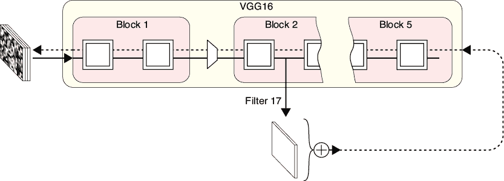

图 17-12：可视化滤波器。特征图中所有值的总和作为网络的误差。

我们使用 VGG16，但在此可视化过程中，我们跳过最后卷积层之后的所有层。我们输入一个随机数网格，并提取我们要可视化的滤波器的滤波器图。这成为我们的误差。现在来到棘手的部分：我们使用这个误差来计算梯度，但我们根本不调整权重。网络本身和所有权重都是*冻结*的。我们只是不断计算梯度并将其推回，直到达到输入层，该层保存输入图像的像素值。到达这一层的梯度告诉我们如何更改这些像素值以减少我们知道的滤波器输出的误差。因为我们希望尽可能地激活神经元，所以我们希望“误差”尽可能大，因此我们改变像素值以增加而不是减少这个误差。这使得图片比之前更多地激活我们选择的神经元。

反复进行此操作后，我们将调整我们最初的随机像素值，使它们使滤波器输出尽可能大的值。当我们查看经过这种方式修改后的输入时，我们会看到一幅图片，使得该神经元产生巨大的输出，因此图片展示了滤波器正在寻找的内容（或至少给了我们一个大致的想法）（Zeiler 和 Fergus 2013）。我们将在第二十三章再次使用这个可视化过程，当我们看深度梦境算法时。

由于我们在输入图像中从随机值开始，每次运行此算法时都会得到不同的最终图像。但我们制作的每幅图像大致相似，因为它们都是基于最大化同一滤波器输出而生成的。

接下来我们看看使用这种方法生成的图像。图 17-13 展示了 VGG16 第一个块或组中的第二个卷积层的 64 个滤波器生成的图像（我们用标签`block1_conv2`表示这一层，其他层也有类似的名称）。在图 17-13 及之后的类似图像中，我们增强了色彩饱和度，使得结果更容易解读。

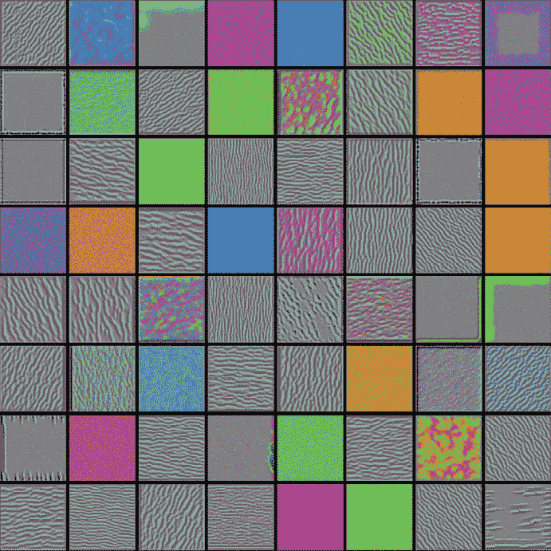

图 17-13：VGG16 中`block1_conv2`层的每 64 个滤波器产生最大响应的图像

看起来很多这些层正在寻找不同方向的边缘。有些值太微妙，难以让我们轻易解读。

接下来我们来看第 3 块，观察该块第一个卷积层的前 64 个滤波器。图 17-14 展示了最能激发这些滤波器的图像。

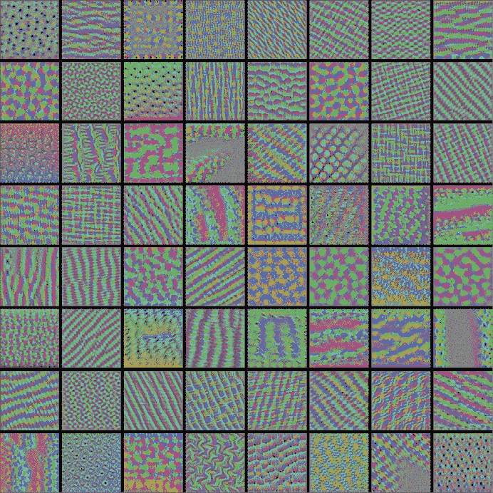

图 17-14：VGG16 中`block3_conv1`层的前 64 个滤波器产生最大响应的图像

现在开始有趣了！正如我们预期的那样，这里的滤波器正在寻找更复杂的纹理，结合了之前层所发现的简单模式。接着我们继续，看看第 4 块的第一个卷积层中的前 64 个滤波器，如图 17-15 所示。

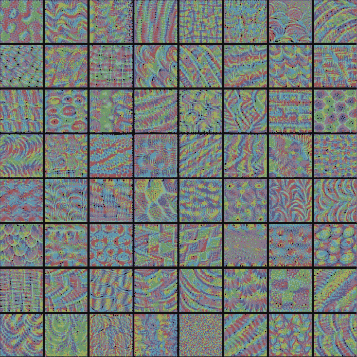

图 17-15：VGG16 中`block4_conv1`层的前 64 个滤波器产生最大响应的图像

这些是对 VGG16 学习过程的迷人一瞥。我们可以看到它在分类图像中的物体时发现的一些有用结构。这些滤波器似乎在寻找包含多种不同类型流动和交织纹理的模式，就像我们在动物和我们周围世界的其他表面上看到的那样。

我们在这里真正看到了卷积层级的价值。每一层卷积都在寻找前一层输出中的模式，帮助我们从低级别的细节（如条纹和边缘）逐渐过渡到复杂且丰富的几何结构。

为了好玩，我们来看一下其中几个滤波器的特写。图 17-16 展示了从前几层选取的九种模式的更大视图。

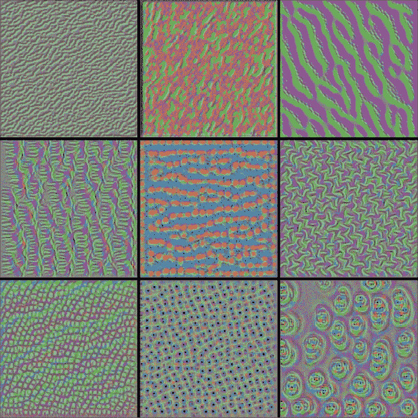

图 17-16：VGG16 前几层中触发最大滤波器响应的一些手动选取图像的特写

图 17-17 展示了触发最后几层滤波器产生强烈响应的模式。

这些模式令人兴奋而美丽。它们也有一种有机的感觉，可能是因为 ImageNet 数据库包含了许多动物的图像。

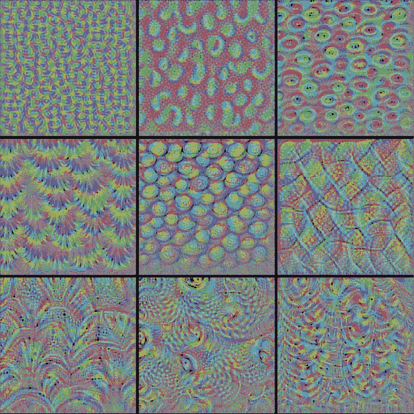

图 17-17：VGG16 最后几层中触发最大滤波器响应的一些手动选取图像的特写

## 可视化滤波器，第二部分

另一种可视化过滤器的方法是通过 VGG16 运行图像，查看该过滤器生成的特征图。也就是说，我们将图像输入 VGG16 并让其通过网络，但像之前一样，我们忽略网络的输出。相反，我们提取我们感兴趣的过滤器的特征图，并将其像图像一样绘制出来。这是可能的，因为每个特征图总是只有一个通道，因此我们可以将其绘制为灰度图。

让我们试试看。图 17-18 展示了我们的输入图像，一只雄鸭。这是我们本节所有可视化的起始图像。

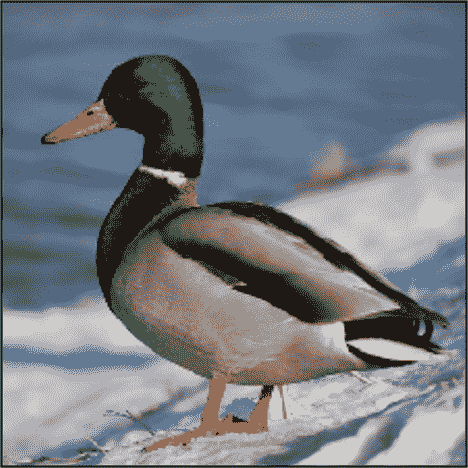

图 17-18 我们用来可视化过滤器输出的雄鸭图像

为了更好地理解，图 17-19 展示了网络第一层卷积层中第一个过滤器的响应。由于过滤器的输出只有一个通道，我们可以用灰度图来表示它。我们选择使用从黑色到红色再到黄色的热图来展示。

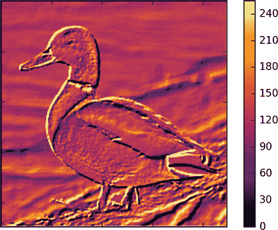

图 17-19：VGG16 中`block1_conv1`层第 0 个过滤器对图 17-18 中雄鸭图像的响应

这个过滤器在寻找边缘。考虑一下右下角的尾部。一个上面浅色下面深色的边缘会产生很大的输出，而另一个方向的边缘则输出非常低。变化较小的区域产生较小的输出，而颜色恒定的区域输出中等。

图 17-20 展示了第一个卷积层中前 32 个过滤器的响应。

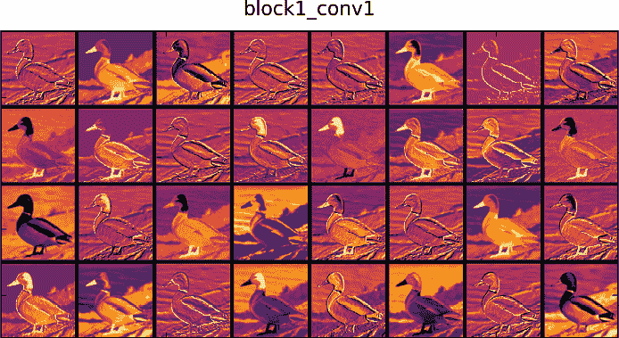

图 17-20：VGG 卷积层`block1_conv1`中前 32 个过滤器的响应

这些过滤器中的很多似乎在寻找边缘，但也有些似乎在寻找图像的特定特征。我们来看一下从这层 64 个过滤器中手动选出的 8 个过滤器的特写，见图 17-21。

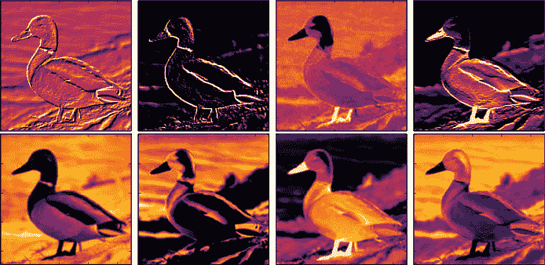

图 17-21：VGG16 第一个卷积层`block1_conv1`中八个手动选择的过滤器响应特写

顶排中的第三张图似乎在寻找鸭子的脚，或者它可能只对明亮的橙色物体感兴趣。底排最左边的图像看起来像是在寻找鸭子背后的波浪和沙滩，而其右边的图像似乎最强烈地响应蓝色波浪。通过对其他输入进行更多实验，我们可以更准确地确认这些解释，但看到我们从一张图像中能猜测出这么多内容，确实很有趣。

让我们进一步深入网络，进入第三个卷积层块。这里的输出比第一个块的输出小了四倍，因为它们已经通过了两层池化层。我们预计它们正在寻找特征的聚类。图 17-22 展示了第三块中第一个卷积层的响应。

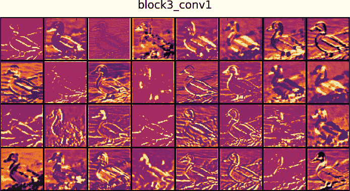

图 17-22：VGG 卷积层`block3_conv1`中前 32 个滤波器的响应

很有趣的是，很多边缘检测似乎仍在进行中。这表明，强边缘对于 VGG16 来说是一个重要的线索，它在尝试识别图像内容时，即便是在第三组卷积中，边缘依然发挥着作用。但其他许多区域也在变亮。

让我们跳到最后一个块。图 17-23 展示了第五块卷积层中第一个卷积层的前 32 个滤波器的响应。

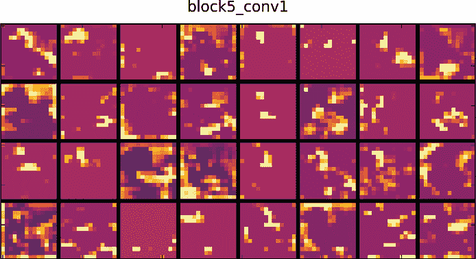

图 17-23：VGG 卷积层`block5_conv1`中前 32 个滤波器的响应

正如我们所预期的，这些图像变得更小，因为它们经过了两层池化层，每层都会将大小缩小一半。此时，鸭子几乎看不见，因为系统正在结合前面层的特征。一些滤波器几乎没有响应。它们可能负责寻找在鸭子图像中没有出现的高层次特征。

在第二十三章，我们将探讨一些利用卷积神经网络（convnet）滤波器响应的创意应用。

## 对抗样本

尽管 VGG16 在预测许多图像的正确标签时表现非常好，我们仍然可以通过一些微小到人眼无法察觉的方式修改图像，进而欺骗分类器，使其分配错误的标签。事实上，这个过程可以干扰任何基于卷积的分类器的结果。

欺骗卷积神经网络的技巧是创建一个被称为*对抗样本*的新图像。这个图像是通过在原始图像上添加*对抗扰动*（或更简单地说，*扰动*）来创建的。扰动是另一张图像，大小与我们要分类的图像相同，通常具有非常小的值。如果我们将扰动加到原始图像中，变化通常非常小，以至于大多数人无法察觉任何不同，哪怕是在最细微的细节上。但是，如果我们让 VGG16 去分类这个扰动后的图像，它会给出错误的答案。有时，我们可以找到一个单一的扰动，使得每张图像在输入到特定分类器时都会产生错误的结果，这种扰动我们称之为*通用扰动*（Moosavi-Dezfooli 等，2016 年）。

让我们看看这个过程的实际表现。在图 17-24 的左侧，我们看到一张老虎的图像。图像中的所有像素值都在 0 到 255 之间。系统正确地将其分类为老虎，置信度约为 80%，对于相关动物如虎猫和美洲豹的置信度较小。

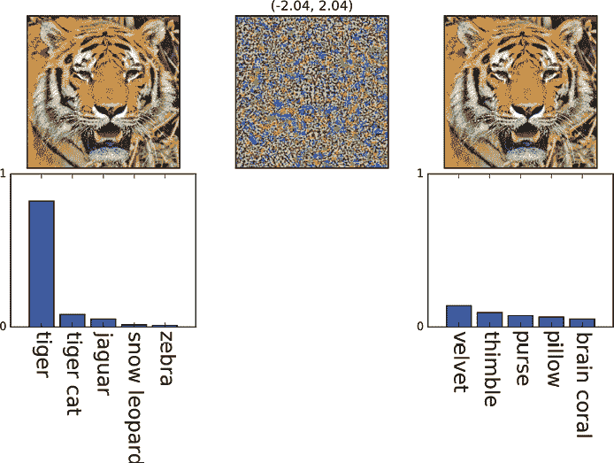

图 17-24：对图像的对抗性攻击。左侧：输入图像及 VGG16 的前五个分类结果。中间：对抗性图像，其中像素值的范围大约为 [–2, 2]，但此处为了便于观察，已将其缩放到 [0, 255] 范围。右侧：将图像与原始（未缩放）对抗性图像相加后的结果，以及新的前五个分类结果。

在 图 17-24 中间，我们展示了一张通过旨在寻找对抗样本的算法计算得出的图像。图像中的所有值大约都在 [–2, 2] 范围内，但为了便于观察，我们将这些值缩放到了 [0, 255] 范围。在 图 17-23 的右上角，我们展示了将老虎和对抗样本相加后的结果，因此原始老虎的每个像素都被改变了一个 [–2, 2] 范围内的值。对我们来说，老虎似乎没有变化，连细小的胡须看起来也没有改变。在该图像下方是 VGG16 对这张新图像的前五个预测结果。系统给出的预测完全不同，其中没有任何一个接近正确的类别。除了低概率的脑珊瑚类，系统甚至认为这张图像不是动物。

图 17-24 中的扰动图像可能对我们眼睛看起来是随机的，但其实并非如此。这张图像是专门计算出来的，目的是扰乱 VGG16 对老虎图像的预测。

计算对抗性图像有很多不同的方法（Rauber、Brendel 和 Bethge 2018）。这些方法为给定图像创建的扰动值的范围可能会有显著差异，因此为了找到最小的扰动，通常值得尝试几种不同的方法，这些方法也被称为 *攻击*。我们可以计算对抗样本以实现不同的目标（Rauber 和 Brendel 2017b）。例如，我们可以要求产生一个扰动，简单地使输入被错误分类。另一种选择是要求产生一个扰动，使得输入被分类为特定的目标类别。为了生成 图 17-24，我们使用了一种旨在使分类器的前七个预测结果不太可能出现的算法。也就是说，它接收起始图像和分类器的前七个预测结果，并生成一个对抗样本。当我们将对抗样本与输入图像相加，并交给分类器时，分类器的新前七个预测中不包含任何先前的前七个预测。

我们必须小心构建对抗扰动，这表明它们正在利用我们卷积神经网络中的某些微妙之处。

我们可能会找到构建抗攻击的卷积神经网络（convnets）的方法，但卷积神经网络可能本质上容易受到这些微妙图像操作的影响（Gilmer 等，2018）。对抗样本的存在表明，卷积神经网络仍然充满未知，我们不应将其视为万无一失的。关于卷积神经网络内部发生了什么，仍有许多值得探索的内容。

## 总结

在这一章中，我们看了几个实际的卷积神经网络：一个小型的用于分类手写 MNIST 数字的网络和一个较大的 VGG16 网络，用于分类照片。尽管我们的 MNIST 网络相当小，但它能够以约 99%的准确率对数字进行分类。

我们查看了 VGG16 的结构，接着看了两种不同类型的其滤波器可视化。我们发现该网络中的滤波器首先寻找简单的结构，如边缘，然后逐渐构建出复杂且美丽的有机图案。

最后，我们看到作为图像分类器使用的卷积神经网络容易受到欺骗，通过微小的像素值调整，这些调整对人类观察者是难以察觉的。

在下一章中，我们将探讨如何构建能够将输入压缩成更小表示的网络，然后再将其扩展以生成接近原始输入的结果。
