# 第十八章：自编码器

本章介绍了一种特定类型的学习架构，叫做*自编码器*。可以把标准的自编码器看作是一种压缩输入的机制，这样它占用更少的磁盘空间，并能更快地进行传输，就像 MP3 编码器压缩音乐，或者 JPG 编码器压缩图像一样。自编码器得名于它通过训练*自动*学习如何最佳地*编码*或表示输入数据的理念。实际上，我们通常使用自编码器来完成两种任务：从数据集中去除噪声和减少数据集的维度。

我们将从研究如何在保留我们关心的信息的同时压缩数据开始。掌握了这些信息后，我们将查看一个小型自编码器。我们将使用它来了解基本概念，并讨论这些系统如何工作，以及它们如何通过数据表示让我们能够以有意义的方式操作数据。接下来，我们将构建一个更大的自编码器，进一步深入研究其数据表示。我们会发现，编码后的数据具有出乎意料的自然结构。这使得我们能够将自编码器的第二部分作为一个独立的*生成器*使用。我们可以为生成器输入随机数据，然后得到看起来像训练数据的新数据，但实际上是完全新的数据。

然后，我们通过包含卷积层来扩展网络的功能，使我们能够直接处理图像和其他二维数据。我们将训练一个基于卷积的自编码器来*去噪*颗粒状图像，从而恢复干净的输入。我们在本章结束时将讨论*变分* *自编码器*，它能够创建一个更为整齐的编码数据表示。这使得将自编码器的第二部分作为生成器使用变得更加容易，因为我们能够更好地控制它将生成何种数据。

## 编码简介

压缩文件在计算中非常有用。许多人听着以 MP3 格式保存的音乐，这种格式能够大幅压缩音频文件，同时仍然保持与原音接近的音质（维基百科 2020b）。我们常常使用 JPG 格式查看图像，这种格式能够将图像文件压缩到原始大小的 20 倍，同时仍然看起来与原图接近（维基百科 2020a）。在这两种情况下，压缩后的文件只是原始文件的近似值。我们压缩文件越多（即保存的信息越少），就越容易检测到原始文件和压缩版本之间的差异。

我们将压缩数据或减少存储数据所需内存的行为称为*编码*。编码器是日常计算机使用的一部分。我们说 MP3 和 JPG 都会接受*输入*并*编码*它；然后我们*解码*或*解压*这个版本，*恢复*或*重建*原始的某个版本。一般来说，压缩文件越小，恢复后的版本与原始版本的匹配度越差。

MP3 和 JPG 的编码器完全不同，但它们都是*有损编码*的例子。让我们来看一下这是什么意思。

### 无损与有损编码

在之前的章节中，我们使用*损失*一词作为错误的同义词，因此我们网络的误差函数也被称为其损失函数。在这一节中，我们使用这个词时有稍微不同的含义，指的是压缩后再解压时数据的退化程度。原始数据与解压后数据之间的差距越大，损失就越大。

损失的概念，或者输入的退化，和将输入变小的概念是不同的。例如，在第六章中，我们看到了如何使用摩尔斯电码传递信息。字母到摩尔斯电码符号的转换没有损失，因为我们可以从摩尔斯版本精确地重建原始信息。我们说将我们的信息转换或编码成摩尔斯电码是*无损*转换。我们只是改变了格式，就像改变一本书的字体或字体颜色一样。

为了看出损失是如何发生的，假设我们正在山中露营。在附近的山上，我们的朋友 Sara 正在庆祝她的生日。我们没有收音机或电话，但两组人都有镜子，我们发现可以通过反射阳光来进行摩尔斯电码通信。假设我们想发送消息：“HAPPY BIRTHDAY SARA BEST WISHES FROM DIANA”（为简便起见，我们省略了标点符号）。如果算上空格，这有 42 个字符。那是很多镜子摆动。于是我们决定省略元音，只发送“HPP BRTHD SR BST WSHS FRM DN”。这只有 28 个字母，所以我们可以在完整消息的三分之二的时间内发送它。

我们的新消息通过这种方式被压缩，丢失了一些信息（元音）。我们说这是一种*有损*的压缩方法。

我们不能简单地说丢失一些信息是否可以接受。若发生损失，我们能容忍的损失量取决于消息及其上下文。例如，假设我们的朋友 Sara 和她的朋友 Suri 正在露营，而且恰好她们是同一天生日。在这种情况下，“HPP BRTHD SR”就有歧义，因为她们无法知道我们在称呼谁。

测试一个转换是否有损或无损的简单方法是考虑它是否可以被*反转*，或者倒回去，以恢复原始数据。在标准的摩尔斯电码中，我们可以将字母转化为点划模式，然后再转换回字母，在这个过程中没有丢失任何信息。但是，当我们删除了消息中的元音字母时，这些字母就永远丢失了。我们通常可以猜测它们，但我们只是猜测，可能会猜错。去除元音字母会生成一个不可逆的压缩版本。

MP3 和 JPG 都是有损数据压缩系统。事实上，它们的有损程度非常高。但这两种压缩标准都是经过精心设计的，旨在丢弃“正确”的信息，以便在大多数日常情况下，我们无法分辨压缩版本和原始版本的差异。

这是通过仔细研究每种数据类型的特性以及它们是如何被感知的实现的。例如，MP3 标准不仅基于声音的一般特性，还基于音乐和人类听觉系统的特性。同样，JPG 算法不仅专注于图像中数据的结构，还依赖于描述人类视觉系统的科学。

在一个完美但不可能的世界里，压缩文件非常小，而且解压后的版本与其原始文件完全匹配。在现实世界中，我们为了文件大小而牺牲了*保真度*，即解压图像的准确性。一般来说，文件越大，解压后的文件与原始文件越匹配。这在信息理论上是有道理的：较小的文件比较大的文件包含的信息少。当原始文件存在冗余时，我们可以利用这一点，通过无损压缩来生成更小的文件（例如，当我们使用 ZIP 格式压缩文本文件时）。但一般而言，压缩通常意味着某种丢失。

有损压缩算法的设计师们努力工作，选择性地丢弃那些对我们来说在特定文件类型中最不重要的信息。通常，“什么重要”这个问题是一个争议问题，这也导致了多种不同的有损编码器（例如 FLAC 和 AAC 用于音频，JPEG 和 JPEG 2000 用于图像）。

## 表示的融合

在本章后面，我们将找到多个输入的数值表示，然后*融合*这些数据，以创建具有每个输入特征的新数据。数据融合有两种常见方法。我们可以将第一种方法描述为*内容融合*。这就是将两组数据的内容相互融合。例如，将牛和斑马的图像进行内容融合，就会得到类似图 18-1 的效果。

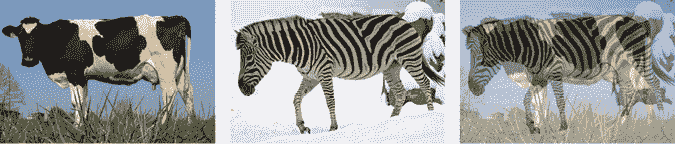

图 18-1：混合牛和斑马的图像内容。将每张图像缩放 50%，然后将结果加在一起，我们得到的是两张图像的叠加，而不是一个半牛半斑马的单一动物。

结果是两个图像的组合，而不是一个介于牛和斑马之间的混合动物。要得到一个混合动物，我们将使用第二种方法，称为*参数混合*，或*表示混合*。在这里，我们使用描述我们感兴趣事物的参数。通过混合两组参数，根据参数的性质和我们用来创建对象的算法，我们可以创建出混合了事物固有特征的结果。

例如，假设我们有两个圆形，每个圆形由一个中心、半径和颜色来描述，如图 18-2 所示。

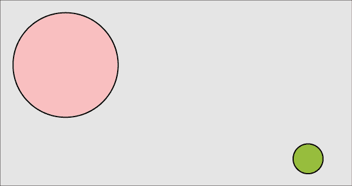

图 18-2：我们想要混合的两个圆

如果我们混合这些参数（即，我们将表示圆形中心的 x 分量的两个值相互混合，将 y 的两个值相互混合，同样地，半径和颜色也如此），那么我们得到一个介于两个圆之间的圆形，如图 18-3 所示。

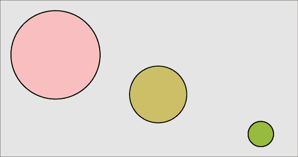

图 18-3：对两个圆进行参数混合意味着混合它们的参数（中心、半径和颜色）。

这种方法对于未压缩的对象效果很好。但如果我们尝试对压缩过的对象进行混合，通常无法得到合理的中间结果。问题在于，压缩后的形式可能与我们需要用来有意义地混合对象的内部结构相去甚远。例如，假设我们将“cherry”和“orange”这两个词的声音作为我们的对象进行混合。我们可以通过让两个人同时说出这两个词来混合这些声音，创造出图 18-1 中牛和斑马的音频版本。

我们可以将这些声音转化为书面语言看作是一种压缩方式。如果说出“cherry”这个词需要半秒钟，那么如果我们使用 MP3 格式，并选择流行的 128 Kbps 压缩设置，我们大约需要 8,000 字节（AudioMountain 2020）。如果我们使用 Unicode UTF-32 标准（每个字母需要 4 个字节），书面形式只需要 24 个字节，这比 8,000 小得多。由于字母来自字母表，且字母表有固定的顺序，我们可以通过在字母表中混合字母来混合这些表示形式。这种方法对字母不起作用，但让我们按照这个过程走下去，因为稍后某种形式的这个方法将对我们有用。

“cherry”和“orange”这两个词的首字母分别是 C 和 O。在字母表中，这两个字母所跨越的区域是 CDEFGHIJKLMNO。正中间是字母 I，因此 I 是我们混合的首字母。当第一个字母在字母表中的位置晚于第二个字母时，如 E 到 A，我们会倒数计算。当跨度中的字母数量是偶数时，我们选择较早的字母。如图 18-4 所示，这种混合方式给我们带来了 IMCPMO 这个字母序列。

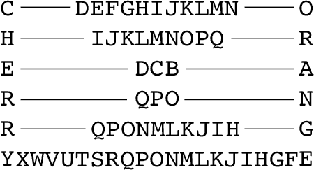

图 18-4：通过找到字母表中每个字母的中点来混合书写的“cherry”和“orange”这两个词

我们想要的是一种压缩后，当解压时，声音听起来像是*樱桃*和*橙子*的声音混合在一起。大声说出*imcpmo*这个词显然无法达到这个目标。更重要的是，它只是一个没有任何意义的字母串，既不代表任何水果，也不代表英语中的任何单词。

在这种情况下，混合压缩后的表示并不能给我们带来类似混合物体的效果。我们将看到，自编码器，尤其是本章末尾提到的变分自编码器的一个显著特点是，它们确实允许我们混合压缩版本，并且（在一定程度上）恢复出混合后的原始数据版本。

## 最简单的自编码器

我们可以构建一个深度学习系统来为我们想要的数据找出压缩方案。关键思想是在网络中创建一个地方，在这个地方，整个数据集必须用比输入数字少的数字来表示。毕竟，这就是压缩的核心。

例如，假设我们的输入由动物的灰度图像组成，分辨率为 100×100。每张图片有 100 × 100 = 10,000 个像素，所以我们的输入层有 10,000 个数字。假设我们随意选择，想要用仅仅 20 个数字来表示这些图像的最佳方式。

一种实现方式是构建一个如图 18-5 所示的网络。它只有一层！

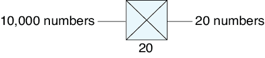

图 18-5：我们的第一个编码器是一个单一的密集层，或者说全连接层，将 10,000 个数字转换为 20 个数字。

我们的输入是 10,000 个元素，进入一个只有 20 个神经元的全连接层。对于任何给定的输入，这些神经元的输出就是我们压缩后的图像版本。换句话说，通过这一层，我们构建了一个编码器。

现在的真正难题是，能够从这 20 个数字中恢复出原始的 10,000 个像素值，或者至少恢复接近它们的值。为此，我们在编码器后面加上一个解码器，如图 18-6 所示。在这种情况下，我们只需创建一个包含 10,000 个神经元的全连接层，每个神经元对应一个输出像素。

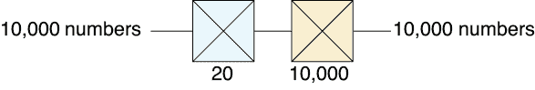

图 18-6：一个编码器（蓝色）将我们的 10,000 个输入转换为 20 个变量，然后一个解码器（米色）将它们转换回 10,000 个值。

因为数据量最开始是 10,000 个元素，中间是 20 个，最后又是 10,000 个，所以我们说我们已经创建了一个*瓶颈*。图 18-7 展示了这一理念。

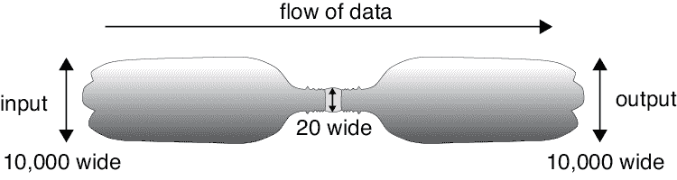

图 18-7：我们说像图 18-6 所示的网络中间部分是瓶颈，因为它的形状像一个瓶子，顶部狭窄，像瓶颈。

现在我们可以开始训练我们的系统。每个输入图像也是输出目标。这个小型自编码器试图找到最佳方法，将输入压缩成仅有 20 个数字，然后再将其解压缩回原始目标，即输入本身。瓶颈处的压缩表示被称为*编码*，或*潜在变量*（*潜在*意味着这些值本质上存在于输入数据中，只是等待我们去发现它们）。通常我们通过深度网络中间的一个小层来构建瓶颈，正如在图 18-6 中所示。这个层通常被称为*潜在层*或*瓶颈层*。这个层上神经元的输出就是潜在变量。这个想法是，这些值以某种方式表示了图像。

这个网络没有类别标签（像分类器那样）或目标（像回归模型那样）。除了我们希望它进行压缩然后解压缩的输入外，系统没有其他信息。我们说自编码器是*半监督学习*的一个例子。它某种程度上是监督学习，因为我们给系统提供了明确的目标数据（输出应该与输入相同），而它又某种程度上不是监督学习，因为我们没有任何手动确定的标签或目标来标注输入。

让我们训练我们的小型自编码器，使用图 18-6 中的老虎图像，看看它的表现如何。我们会反复输入这张老虎图像，鼓励系统输出一张完整的老虎图像，尽管在瓶颈部分压缩到了仅仅 20 个数字。损失函数比较原始老虎图像的像素与自编码器输出的像素，并计算差异，因此像素差异越大，损失也越大。我们训练到它不再改进为止。图 18-8 显示了结果。右侧显示的每个误差值是原始像素值减去对应的输出像素值（像素已缩放到[0,1]的范围内）。

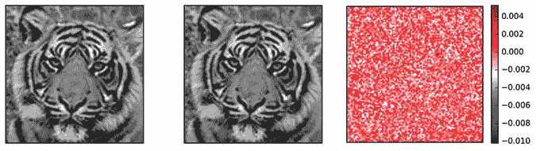

图 18-8：训练我们的小型自编码器（见图 18-6）来处理老虎图像。左侧：原始输入的老虎图像。中间：输出图像。右侧：原始与输出老虎图像之间的逐像素差异（像素值范围为[0,1]）。自编码器似乎做得非常好，尽管瓶颈部分只有 20 个数字。

这太棒了！我们的系统将由 10,000 个像素值组成的图像压缩成了 20 个数字，现在它似乎又恢复了整张图像，甚至细致到那些细长、飘逸的胡须。任何像素的最大误差大约是 100 分之一。看起来我们找到了一个非常棒的压缩方法！

但是等一下。这不合理。没有办法仅凭 20 个数字重建那张老虎图像，除非做些“偷偷摸摸”的事情。在这种情况下，这种“偷偷摸摸”的事情就是网络完全过拟合并记住了图像。它简单地将所有 10,000 个输出神经元设置为接收这 20 个输入数字，并重建原始的 10,000 个输入值。更直白地说，网络仅仅记住了老虎。我们实际上并没有压缩任何东西。每个 10,000 个输入都传递到瓶颈层的 20 个神经元中，需要 20 × 10,000 = 200,000 个权重，然后这 20 个瓶颈结果都传递到输出层的 10,000 个神经元中，需要另外 200,000 个权重，这样就生成了老虎图像。我们基本上找到了一种方法，只使用 400,000 个数字就能存储 10,000 个数字。耶？

实际上，很多数字是无关紧要的。记住，每个神经元都有一个偏置，它与输入的加权值一起相加。输出神经元主要依赖它们的偏置值，而不是输入值。为了测试这一点，图 18-9 展示了给自编码器输入一张楼梯的图片的结果。它压缩和解压楼梯的表现并不差。相反，它主要忽略了楼梯，给我们返回了记住的老虎。输出图像并不完全是输入的老虎，如最右边的图像所示，但如果我们只看输出，几乎看不出楼梯的任何痕迹。

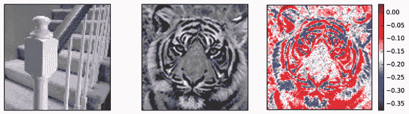

图 18-9：左：我们展示了一个仅针对老虎训练的小型自编码器，并输入了一张楼梯图像。中：输出是老虎！右：输出图像与原始老虎之间的差异。

图 18-9 右侧的误差条显示，我们的误差远大于图 18-8 中的误差，但老虎看起来仍然与原始图像相似。

让我们对“网络主要依赖偏置值”这一观点进行真正的压力测试。我们可以给自编码器输入一张到处都是零的图像。这样它就没有输入值可供处理，只有偏置值参与输出。图 18-10 展示了结果。

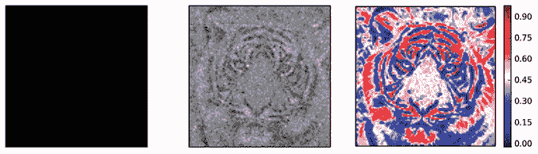

图 18-10：当我们给我们的小型自编码器输入一张纯黑的图像时，它使用偏置值给我们返回一张低质量但可识别的老虎图像。左：黑色输入。中：输出。右：输出与原始老虎之间的差异。注意，差异的范围从 0 到几乎 1，不同于图 18-9，其中差异的范围从大约 −0.4 到 0。

无论我们给这个网络什么输入，我们总是会得到某种版本的老虎作为输出。自编码器已经训练自己每次都生成老虎。

这个自编码器的真正考验是教它一堆图片，并观察它压缩这些图片的效果。让我们用一组 25 张照片再试一次，见图 18-11。

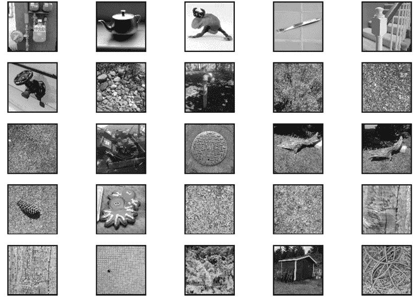

图 18-11：除了老虎，我们还使用了这 25 张照片来训练我们的微型自编码器。在训练过程中，每张图片都旋转了 90 度、180 度和 270 度。

我们通过不仅训练每张图像，还训练每张图像分别旋转 90 度、180 度和 270 度来扩展数据库。我们的训练集包括老虎（及其三种旋转版本）和图 18-11 中的 100 张带有旋转的图片，共计 104 张图像。

现在，系统必须记住如何用仅 20 个数字来表示这 104 张图片，结果它做得并不好也不奇怪。图 18-12 展示了当我们要求它压缩和解压老虎图像时，这个自编码器的表现。

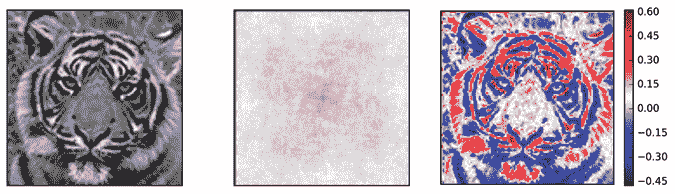

图 18-12：我们用图 18-6 中的自编码器训练了图 18-11 中的 100 张图片（每张图片及其旋转版本），以及老虎的四种旋转。通过这个训练，我们给了它左边的老虎图片，它生成了中间的输出。

现在，由于系统不能作弊，结果完全不像老虎，一切都变得有道理了。我们可以看到，结果中有一些四向旋转对称性，这是由于我们训练了旋转过的输入图像版本。通过增加瓶颈层（或潜在层）中的神经元数量，我们可以做得更好。但由于我们希望尽可能压缩输入，增加瓶颈的值应作为最后的手段。我们更愿意尽可能少地使用值来完成最佳的工作。

让我们尝试通过考虑比目前使用的两个全连接层更复杂的架构来提高性能。

## 更好的自编码器

在本节中，我们将探索多种自编码器架构。为了进行比较，我们将使用第十七章中看到的 MNIST 数据库。回顾一下，这是一个大型的免费数据库，包含从 0 到 9 的手绘灰度数字，分辨率为 28×28 像素。图 18-13 展示了一些来自 MNIST 数据集的典型数字图像。

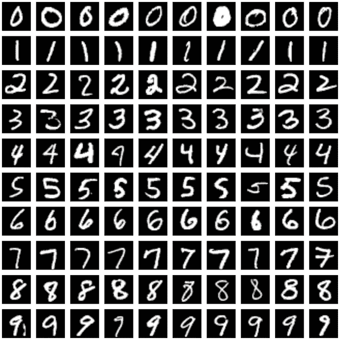

图 18-13：MNIST 数据集中的手写数字样本

要在这些数据上运行我们的简单自编码器，我们需要改变图 18-6 中输入和输出的大小以适应 MNIST 数据。每张图像有 28 × 28 = 784 个像素。因此，我们的输入和输出层现在需要 784 个元素，而不是 10,000 个。让我们在将图像输入网络之前，将二维图像展平为一个大的列表，并将瓶颈保持在 20 个潜在变量。图 18-14 显示了新的自编码器。在这个图示以及接下来的图示中，我们不会绘制开始时的展平层，或结束时的重塑层，这些层“还原”了展平操作，将 784 个数字重新转化为 28×28 的网格。

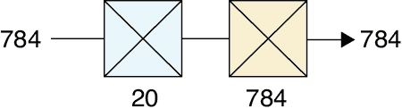

图 18-14：我们的两层自编码器用于 MNIST 数据

让我们训练 50 个周期（也就是说，我们将 60,000 个训练样本跑 50 遍）。一些结果显示在图 18-15 中。

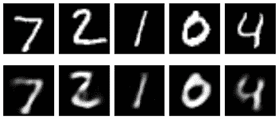

图 18-15：通过我们训练过的自编码器（见图 18-14）处理 MNIST 数据集中的五个数字，使用 20 个潜在变量。上排：五个输入数据。下排：重构后的图像。

图 18-15 相当惊人。我们的两层网络学会了如何将每个 784 像素的输入压缩成仅 20 个数字，然后再把它扩展回 784 个像素。生成的数字虽然模糊，但仍然可以识别。

让我们尝试将潜在变量的数量减少到 10 个。我们预期结果会变得更糟。图 18-16 显示了情况确实更糟。

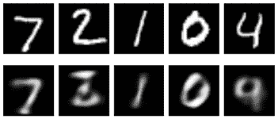

图 18-16：上排：原始的 MNIST 图像。下排：使用 10 个潜在变量的自编码器输出。

结果变得相当糟糕。数字 2 似乎变成了一个咬了一口的 3，而数字 4 似乎变成了 9。不过，这就是我们将这些图像压缩到 10 个数字时的结果。这远不足以让系统有效地表示输入。

这个教训是，我们的自编码器需要有足够的计算能力（也就是说，足够的神经元和权重）来弄清楚如何编码数据，同时需要足够的潜在变量来找到输入的有用压缩表示。

让我们看看更深的模型表现如何。我们可以使用任何类型的层来构建编码器和解码器。根据我们的数据，我们可以构建有很多层的深度自编码器，也可以构建只有少数层的浅层自编码器。现在，我们继续使用全连接层，但添加更多层来创建一个更深的自编码器。我们将从几层逐渐变小的隐藏层构建编码器阶段，直到达到瓶颈，然后再从几层逐渐变大的隐藏层构建解码器，直到它们的大小与输入相同。

图 18-17 展示了这种方法，现在我们有了三层编码和三层解码。

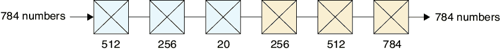

图 18-17：一个由全连接（或密集）层构建的深度自动编码器。蓝色图标：一个三层编码器。米色图标：一个三层解码器。

我们通常构建这些全连接层，使它们的神经元数目按 2 的倍数减少（然后再增加），就像在 512 和 256 之间切换一样。这个选择通常效果很好，但没有强制要求。

让我们像训练其他模型一样，训练这个自动编码器，训练 50 个 epoch。图 18-18 展示了结果。

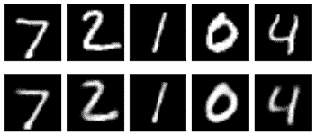

图 18-18：我们深度自动编码器对图 18-17 的预测。上排：来自 MNIST 测试集的图像。下排：当我们向训练好的自动编码器提供测试数字时输出的结果。

结果稍微有些模糊，但与原图匹配得非常明确。将这些结果与图 18-15 进行对比，后者也使用了 20 个潜在变量，这些图像更清晰。通过提供额外的计算能力来寻找这些变量（在编码器中），以及在将它们转回图像时提供额外的计算能力（在解码器中），我们从 20 个潜在变量中获得了更好的结果。

## 探索自动编码器

让我们更仔细地看看图 18-17 中自动编码器网络生成的结果。

### 更深入地观察潜在变量

我们已经看到潜在变量是输入的压缩形式，但我们还没有看过潜在变量本身。图 18-19 展示了网络在图 18-17 中为我们的五张测试图像生成的 20 个潜在变量的图表，以及解码器从中构建的图像。

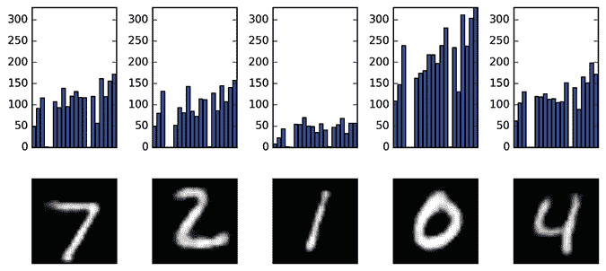

图 18-19：上排：网络在图 18-17 中为我们的五张图像生成的 20 个潜在变量。下排：从上述潜在变量解压出来的图像。

在图 18-19 中显示的潜在变量是典型的，因为潜在变量很少与它们所产生的输入数据有明显的关联。网络找到了自己专有的、高度压缩的形式来表示输入，而这种形式通常对我们来说毫无意义。例如，我们可以看到图中有几个一致的空洞（位于第 4、5 和 14 个位置），但从这一组图像中看不出为什么这些输入的值为 0（或接近 0）。查看更多数据肯定会有所帮助，但通常来说，解释的问题仍然存在。

潜在变量的神秘性是可以接受的，因为我们很少关心直接解释这些值。稍后，我们会通过混合和平均潜在值来玩这些变量，但我们并不关心这些数字代表什么。它们只是网络在训练过程中创建的一个私人代码，让它能够尽可能好地压缩和解压每个输入。

### 参数空间

尽管我们通常不关心潜在变量中的数值，但了解相似和不同输入所产生的潜在变量仍然是有用的。例如，如果我们输入两张几乎相同的七的图像，图像是否会被分配到几乎相同的潜在变量？或者它们可能会相隔非常远？

为了回答这些问题，让我们继续使用图 18-17 中的简单深度自编码器。但我们将编码器的最后一层从一个包含 20 个神经元的全连接层缩减为仅仅两个神经元，这样我们就只有两个潜在变量了。这样做的目的是，我们可以将这两个变量作为（x，y）对绘制在页面上。当然，如果我们仅用两个潜在变量生成图像，这些图像将会非常模糊，但这个练习是值得的，因为它让我们能够看到这些简单潜在变量的结构。

在图 18-20 中，我们对 10,000 个 MNIST 图像进行了编码，找出了每个图像的两个潜在变量，然后将它们作为点进行绘制。每个点根据其所属图像的标签进行了颜色编码。我们称像图 18-20 这样的图像是*潜在变量空间*的可视化，或者更简单地说是*潜在空间*。

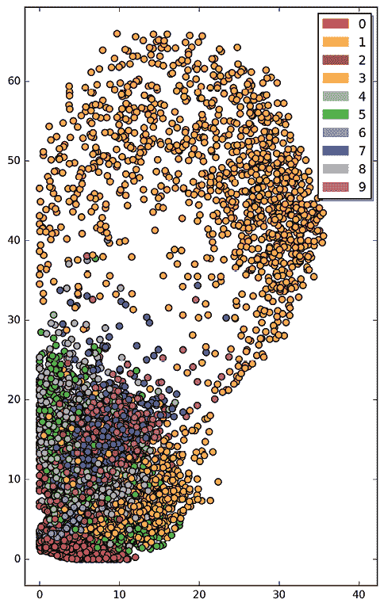

图 18-20：在只使用两个潜在变量训练深度自编码器后，我们展示了每个 10,000 个 MNIST 图像分配的潜在变量。

这里有很多结构！潜在变量并不是完全随机地被赋予数值。相反，相似的图像被分配了相似的潜在变量。1、3 和 0 似乎落在它们各自的区域里。许多其他数字似乎在图的左下方被打乱，分配了相似的值。图 18-21 展示了该区域的特写视图。

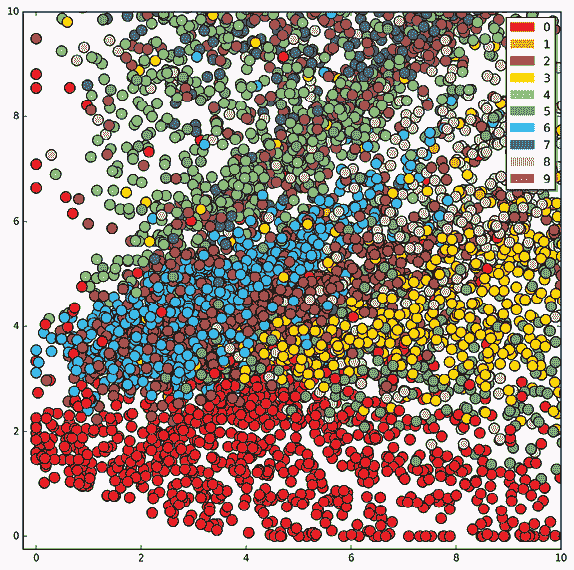

图 18-21：是图 18-20 左下角的特写图。

它并不是完全杂乱的。0 的区域有自己的带状区，而其他数字虽然有些混杂，但我们可以看到它们似乎都落入了明确的区域。

尽管我们预期这些图像会模糊，但我们还是用这些二维潜在值生成图像。从图 18-20 中我们可以看到，第一个潜在变量（我们在 X 轴上绘制的）取值范围从 0 到大约 40，第二个潜在变量（我们在 Y 轴上绘制的）取值范围从 0 到接近 70。

让我们按照图 18-22 中的方法，制作一个解码图像的方形网格。我们可以制作一个沿每个轴从 0 到 55 的框（Y 轴略短，但 X 轴略长）。然后我们可以选择这个网格内的（x，y）点，将这两个数输入解码器，生成一张图片。然后我们可以将这张图片绘制在对应网格的（x，y）位置。我们发现，在每个轴上取 23 个步骤生成的图像既密集又不会过于拥挤。

图 18-23 显示了结果。

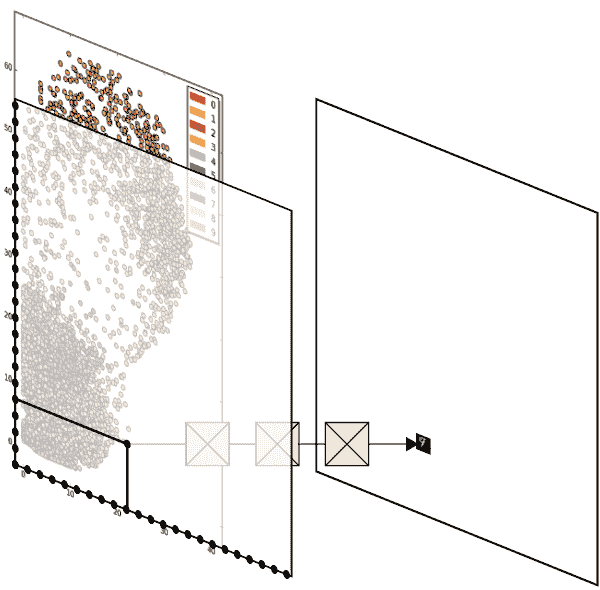

图 18-22：通过解码来自图 18-20（以及稍微超出）中的(x,y)对来生成图像网格。左侧，我们选择一个位于大约(22,8)的(x,y)对。然后，我们将这两个数字传递给解码器，创建右侧的微小输出图像。

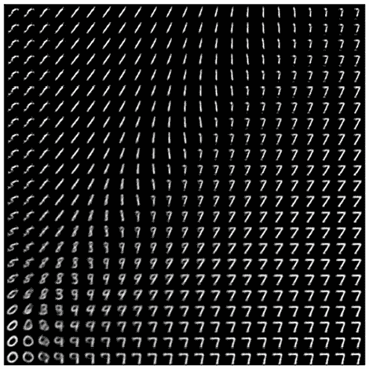

图 18-23：从图 18-22 中的潜在变量范围生成的图像

正如预期的那样，1 的喷洒位于顶部。令人惊讶的是，7 占据了右侧的主导地位。像以前一样，让我们在图 18-24 中看一下左下角的图像的特写。

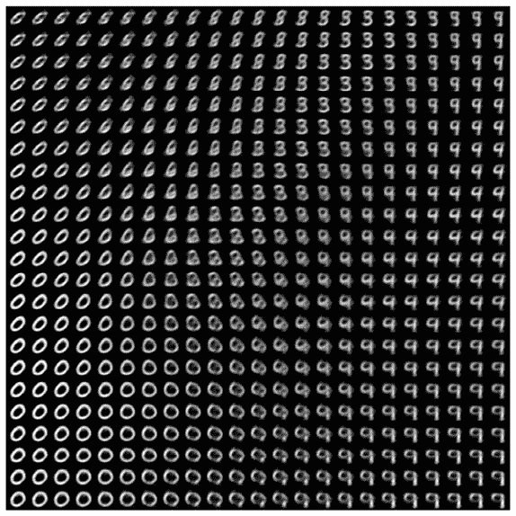

图 18-24：从图 18-23 中的潜在变量特写范围生成的图像

数字经常模糊，而且它们没有落入清晰的区域。这不仅仅是因为我们使用了一个非常简单的编码器，而是因为我们将输入编码为仅两个潜在变量。使用更多的潜在变量时，事物变得更加分离和独特，但我们无法画出这些高维空间的简单图像。尽管如此，这仍然向我们展示了，即使是将潜在变量压缩到仅两个变量的极限，系统也以某种方式将这些值分配，形成了相似数字的聚类。

让我们更仔细地观察这个空间。图 18-25 显示了通过沿着四条线从图中提取(x,y)值并将其输入解码器生成的图像。

这证实了编码器将相似的潜在变量分配给相似的图像，并似乎构建了不同图像的簇，每种图像的变化都位于自己的区域。这是非常强的结构。随着我们将潜在变量的数量从这个极小的值（仅为两个）增加，编码器继续生成聚类区域，但它们变得更加清晰，重叠较少。

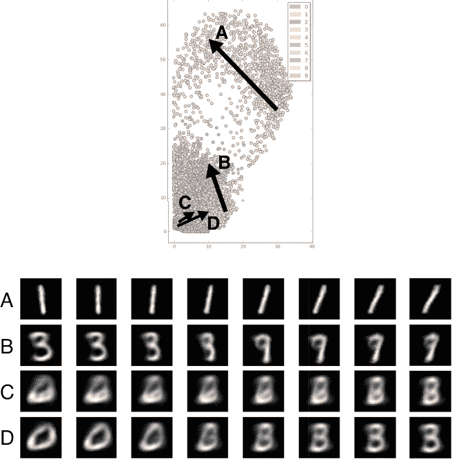

图 18-25：对于每个箭头，我们从起点到终点进行了八个等间距的步骤，生成了八个(x,y)对。这些对的解码图像显示在相应的行中。

### 混合潜在变量

现在我们已经看到了潜在变量中固有的结构，我们可以加以利用。特别是，让我们将一些潜在变量对混合在一起，看看是否能得到一张中间图像。换句话说，让我们对图像进行参数化混合，正如我们之前讨论的那样，其中潜在变量就是参数。

实际上，我们在图 18-25 中已经做了这个操作，通过将箭头一端到另一端的两个潜在变量混合。但在这里，我们使用的是只有两个潜在变量的自动编码器，因此它无法很好地表示图像，结果大多模糊。让我们使用更多的潜在变量，这样我们就能更好地理解这种混合或*插值*在更复杂模型中的表现。

让我们回到我们深度自编码器的六层版本，如图 18-17 所示，它有 20 个潜在变量。我们可以挑选出一对图像，找出每个图像的潜在变量，然后简单地平均每对潜在变量。也就是说，我们有一组包含 20 个数字的列表，表示第一张图像的潜在变量，和另一组 20 个数字的列表，表示第二张图像的潜在变量。我们将每个列表中的第一个数字合成，然后是第二个数字，以此类推，直到我们得到一个新的 20 个数字的列表。这就是我们传递给解码器的新潜在变量集合，解码器将生成一张图像。

图 18-26 展示了通过这种方式合成的五对图像。

正如我们所预期的那样，系统并不仅仅是将图像进行内容混合（就像我们在图 18-1 中对牛和斑马所做的那样）。相反，自编码器正在生成具有两个输入特征的中间图像。

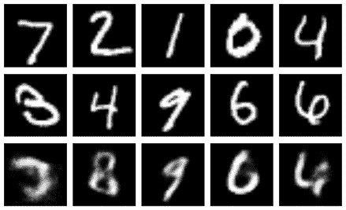

图 18-26：在我们的深度自编码器中混合潜在变量的示例。第一行：来自 MNIST 数据集的五张图像。第二行：另外五张图像。第三行：通过直接平均上面两张图像的潜在变量，然后解码得到的图像。

这些结果并不荒谬。例如，在第二列，2 和 4 之间的混合看起来像是一个部分的 8。这是有道理的。图 18-23 告诉我们，数字 2、4 和 8 在只有 2 个潜在变量的图中相距很近，因此它们在具有 20 个潜在变量的 20 维图中仍然可能靠得很近。

让我们更仔细地看看这种潜在变量的混合。图 18-27 展示了三个新的数字对，并且通过六个等间距的插值步骤进行混合。

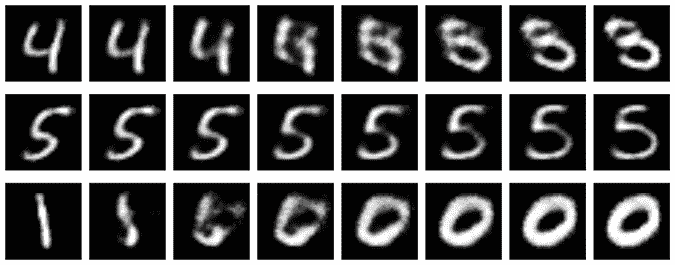

图 18-27：混合潜在变量。对于每一行，我们在最左侧和最右侧的潜在变量集之间进行混合。

每一行的最左边和最右边是来自 MNIST 数据的图像。我们为每个端点找到了 20 个潜在变量，创建了六个均匀间隔的潜在变量混合体，然后将这些混合的潜在变量传递给解码器。系统试图从一幅图像转换到另一幅，但它并没有生成非常合理的中间数字。即使是在中间行中从 5 转换到 5，过渡值几乎在两者之间分裂成两个独立的部分，然后才重新合并。顶部和底部行中靠近中间的一些混合图像根本不像任何数字。尽管两端可以识别，但这些混合图像迅速崩溃。自编码器中的潜在参数混合平滑地将图像从一个数字转换为另一个，但过渡图像只是奇怪的形状，而不是某种混合的数字。我们已经看到，这有时是因为经过密集区域，其中相似的潜在变量编码了不同的数字。一个更大的问题是概念上的。这些例子可能甚至不算错，因为如果我们能制造出一个部分为 0、部分为 1 的数字，它应该是什么样子还不清楚。也许 0 应该变得更瘦？也许 1 应该卷成一个圆圈？所以尽管这些混合图像不像数字，但它们是合理的结果。

这些插值的潜在值可能会落入潜在空间中的区域，这些区域没有附近的数据。换句话说，我们要求解码器从没有任何邻近数据的潜在变量值中重建图像。解码器正在生成*某种东西*，而且这个输出具有附近区域的一些特性，但解码器本质上是在猜测。

### 从新输入进行预测

让我们尝试使用在 MNIST 数据上训练的深度自编码器来压缩然后解压我们的老虎图像。我们将把老虎图像缩小到 28×28 像素，以匹配网络的输入大小，因此它看起来会非常模糊。

这只老虎是网络从未见过的，所以它完全没有能力处理这些数据。它尝试在图像中“看”一个数字并生成相应的输出。图 18-28 展示了结果。

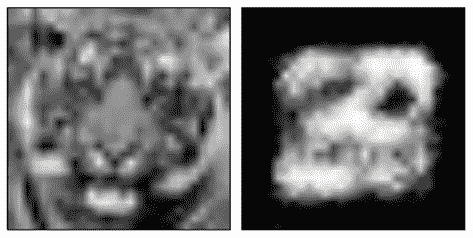

图 18-28：使用我们训练在 MNIST 手写数字数据集上的 20 个潜在变量的深度自编码器，编码然后解码我们老虎图像的 28×28 版本，见图 18-8

看起来算法尝试找出一个位置，将几个不同的数字组合起来。中间的污点与老虎并不匹配，但也没有理由它应该匹配。

使用从数字中学到的信息来压缩和解压缩一只老虎，就像试图用削笔器的零件来建造一把吉他一样。即使我们尽最大努力，结果也不太可能是把好吉他。自编码器只能有意义地编码和解码它所训练过的数据类型，因为它只为潜在变量创建了表示该数据的意义。当我们用完全不同的东西来“惊讶”它时，它尽力而为，但效果不会很好。

基本的自编码器概念有几个变种。由于我们处理的是图像数据，而卷积是处理此类数据的自然方法，所以让我们使用卷积层来构建一个自编码器。

## 卷积自编码器

我们之前提到过，编码和解码阶段可以包含我们想要的任何类型的层。由于我们的示例使用的是图像数据，让我们使用卷积层。换句话说，我们来构建一个*卷积自编码器*。

我们将设计一个编码器，使用多个卷积层逐步缩小原始 28 × 28 MNIST 图像，直到它变成 7 × 7。我们所有的卷积都会使用 3 × 3 的滤波器，并且会进行零填充。如图 18-29 所示，我们从一个包含 16 个滤波器的卷积层开始，然后跟一个 2 × 2 单元的最大池化层，得到一个形状为 14 × 14 × 16 的张量（我们本可以在卷积时使用步幅，但为了清晰起见，这里将步骤分开）。然后我们应用另一个卷积层，这次使用 8 个滤波器，并跟随一个池化层，生成一个形状为 7 × 7 × 8 的张量。最终的编码器层使用三个滤波器，生成一个形状为 7 × 7 × 3 的张量作为瓶颈。这样，我们的瓶颈用 7 × 7 × 3 = 147 个潜在变量表示了 768 个输入。

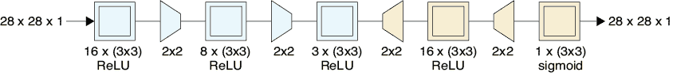

图 18-29：我们卷积自编码器的架构。在编码阶段（蓝色），我们有三层卷积层。前两层每层后面跟一个池化层，因此到第三层卷积层结束时，我们得到了一个形状为 7 × 7 × 3 的中间张量。解码器（米色）使用卷积和上采样将瓶颈张量恢复为 28 × 28 × 1 的输出。

我们的解码器反向执行这个过程。第一个上采样层生成一个形状为 14 × 14 × 3 的张量。接下来的卷积和上采样给我们一个形状为 28 × 28 × 16 的张量，最后的卷积产生一个形状为 28 × 28 × 1 的张量。如前所述，我们省略了开始时的扁平化步骤和结束时的重塑步骤。

由于我们有 147 个潜在变量，加上卷积层的强大功能，我们应该期望比之前仅有 20 个潜在变量的自编码器得到更好的结果。我们像之前一样训练了这个网络 50 个周期。在那个时候，模型仍在改进，但为了与之前的模型进行比较，我们在 50 个周期时停止了训练。

图 18-30 展示了来自测试集的五个例子，以及它们经过我们的卷积自编码器处理后解压的版本。

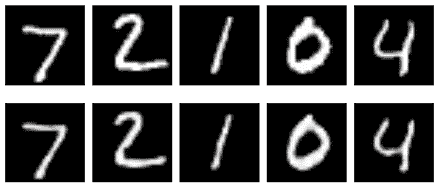

图 18-30：顶部行：来自 MNIST 测试集的五个元素。底部行：通过我们的卷积自编码器生成的图像，输入为上面一行的图像。

这些结果相当不错。图像并不完全相同，但非常接近。

只是为了好玩，尝试给解码器输入纯噪声。由于我们的潜在变量是一个 7×7×3 的张量，因此我们的噪声值需要是一个形状相同的 3D 体积。我们不打算画出这些数字块，而是只展示这个块的最上面一层 7×7 切片。图 18-31 展示了结果。

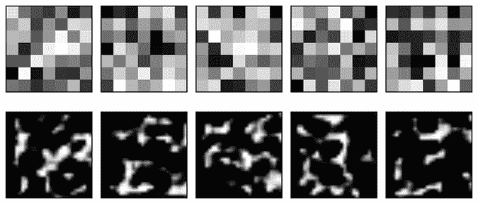

图 18-31：通过将随机值输入到我们的卷积神经网络解码阶段生成的图像

这只产生了随机的斑点图像，对于随机输入来说，这是一个合理的输出。

### 混合潜在变量

让我们在卷积自编码器中混合潜在变量，看看效果如何。图 18-32 展示了我们的网格，使用的图像与图 18-26 中的相同。我们找到顶部两行每张图像的潜在变量，将它们等量混合，然后解码插值变量，生成底部行。

结果有些模糊，尽管某些图像看起来像是上面几行图像的混合。然而，我们不应该太惊讶，因为我们并不清楚比如说，7 和 3 之间的数字应该是什么样子。

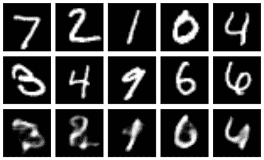

图 18-32：在卷积自编码器中混合潜在变量。顶部两行：来自 MNIST 数据集的样本。底部行：每张图像潜在变量等量混合后的结果。

让我们来看一下之前在图 18-27 中使用的三种混合方式的多个步骤。结果如图 18-33 所示。

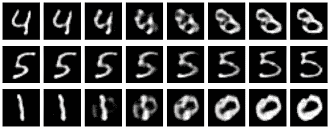

图 18-33：将两张 MNIST 测试图像的潜在变量进行混合，然后解码

每行的左右两端是通过编码和解码 MNIST 图像生成的图像。中间部分是通过混合它们的潜在变量并解码得到的结果。这看起来比我们的简单自编码器好不了多少。所以，仅仅因为我们有更多的潜在变量，当我们尝试用那些与系统训练样本差异较大的输入进行重建时，依然会遇到问题。例如，在顶部一行中，我们并没有训练任何在某种意义上“介于”4 和 3 之间的输入图像，因此系统没有关于如何从代表这种情况的潜在值生成图像的有用信息。

### 从新输入中进行预测

让我们通过给卷积神经网络输入低分辨率的老虎图像，重复我们这个完全不公平的测试。结果如图 18-34 所示。

如果我们眯起眼睛看，它看起来像是眼睛周围、嘴巴两侧和鼻子周围的主要暗区被保留下来了。也许吧。或者这也可能只是想象。

和我们之前用全连接层构建的自动编码器一样，我们的卷积自动编码器试图在数字的潜在空间中找到某个地方的老虎。我们不应该期待它做得很好。

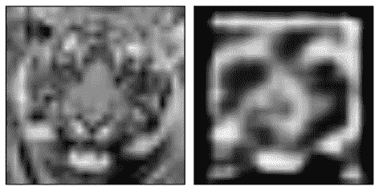

图 18-34：我们应用于卷积自动编码器的低分辨率老虎图像，以及结果。看起来不像老虎。

## 去噪

自动编码器的一个流行用途是去除样本中的噪声。一种特别有趣的应用是去除计算机生成图像中有时会出现的斑点（Bako et al. 2017; Chaitanya 2017）。这些明亮和暗淡的点，看起来像静态噪声或雪花，通常是在我们快速生成图像时出现的，未对所有结果进行细化。

让我们看看如何使用自动编码器去除图像中的亮点和暗点。我们将再次使用 MNIST 数据集，但这次，我们会在图像中添加一些随机噪声。在每个像素点，我们从均值为 0 的高斯分布中选择一个值，因此我们得到正值和负值，将它们加进来，然后将结果值截断到 0 到 1 的范围内。图 18-35 展示了应用了这种随机噪声的一些 MNIST 训练图像。

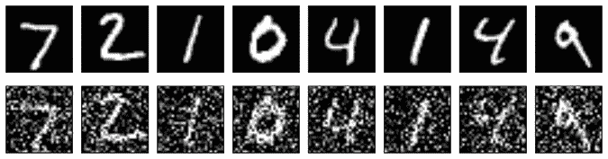

图 18-35：上：MNIST 训练数字。下：相同的数字，但加了随机噪声。

我们的目标是将训练过的自动编码器输入图 18-35 底部行的带噪数字版本，让它返回清理后的版本，就像图 18-35 顶部行中的数字一样。我们的希望是潜在变量不会编码噪声，所以我们只会得到数字。

我们将使用与图 18-29 中相同的总体结构的自动编码器，尽管它有不同数量的滤波器（Chollet 2017）。图 18-36 显示了架构。

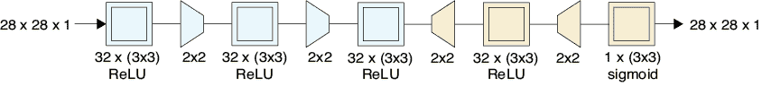

图 18-36：去噪自动编码器

为了训练我们的自动编码器，我们将给它带噪的图像输入和它们相应的干净、无噪声的版本作为我们希望它生成的目标。我们将使用所有 60,000 张图像进行 100 轮训练。

在图 18-35 解码步骤的最后（也就是第三个卷积之后），张量的大小为 7 x 7 x 32，共计 1,568 个数字。所以这个模型中的“瓶颈”是输入大小的两倍。如果我们的目标是压缩，这将是糟糕的，但在这里我们是要去除噪声，所以最小化潜在变量的数量并不是特别关注的问题。

它表现如何？图 18-37 展示了一些噪声输入和自动编码器的输出。它很好地清理了像素，给我们带来了很棒的结果。

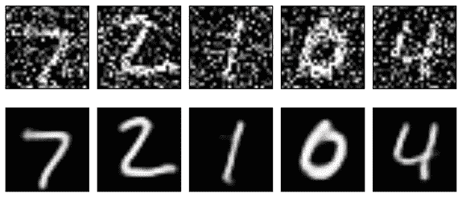

图 18-37：上排：添加噪声的数字。下排：通过我们模型（见图 18-36）去噪后的相同数字。

在第十六章中，我们讨论了显式的上采样和下采样层正在逐渐被淘汰，取而代之的是步幅和转置卷积。让我们遵循这一趋势，简化图 18-36 中的模型，得到图 18-38，该模型现在仅由五个卷积层组成。前两个卷积层使用步幅代替显式的下采样层，最后两个层使用重复代替显式的上采样层。请记住，我们假设在每个卷积层中都使用了零填充。

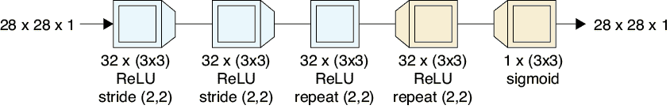

图 18-38：图 18-36 的自编码器，但在卷积层中使用了下采样和上采样，如卷积图标附带的楔形所示

图 18-39 显示了结果。

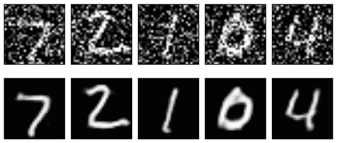

图 18-39：我们去噪模型的结果，图 18-38 所示

输出非常接近，尽管存在一些小的差异（例如，看看 0 的左下角）。第一个模型，图 18-36，具有显式的上采样和下采样层，在 2014 年底的 iMac 上每个训练周期大约需要 300 秒，并且没有 GPU 支持。较简单的模型，图 18-38，每个训练周期只需约 200 秒，因此节省了大约三分之一的训练时间。

需要更小心的问题陈述、测试和结果审查，以决定这些模型中的任何一个是否比另一个在此任务中产生更好的结果。

## 变分自编码器

到目前为止，我们看到的自编码器都试图找到最有效的方式来压缩输入，以便之后能够重新创建它。*变分自编码器（VAE）*与这些网络具有相同的基本架构，但在聚集潜在变量和填充潜在空间方面做得更好。

变分自编码器（VAE）与我们之前的自编码器有所不同，因为它们具有一些不可预测性。我们之前的自编码器是确定性的。也就是说，给定相同的输入，它们总是产生相同的潜在变量，而这些潜在变量总是会产生相同的输出。但 VAE 在编码阶段使用了概率思想（即随机数）；如果我们多次将相同的输入通过系统，得到的输出每次都会略有不同。我们称 VAE 为*非确定性*的。

在我们讨论 VAE 时，为了具体化，我们继续以图像（和像素）为例进行讨论，但和我们其他的机器学习算法一样，VAE 可以应用于任何类型的数据：声音、天气、电影偏好，或任何我们可以用数字表示的东西。

### 潜在变量的分布

在我们之前的自编码器中，我们没有对潜在变量的结构施加任何条件。在图 18-20 中，我们看到一个全连接编码器似乎自然地将潜在变量分组，形成从共同起点 (0,0) 向右上方辐射的团块。这种结构并不是设计目标，而是由我们构建的网络的性质自然而然产生的。图 18-38 中的卷积网络在我们将瓶颈减少到两个潜在变量时，产生了类似的结果，如图 18-40 所示。

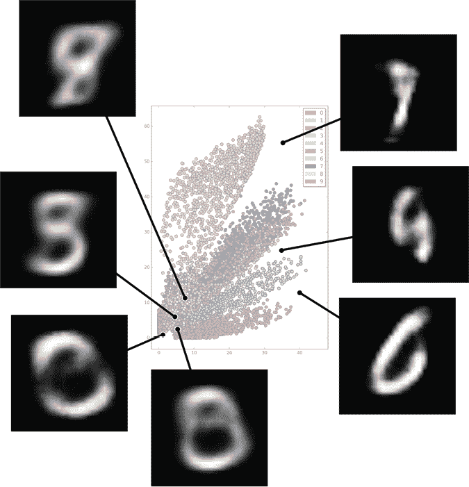

图 18-40：由图 18-38 中的卷积自编码器产生的潜在变量，瓶颈部分包含两个潜在变量。这些样本来源于密集混合和稀疏区域。

图 18-40 显示了从密集和稀疏区域中选择的潜在变量生成的解码图像。

在图 18-22 中，我们看到可以选择任意一对潜在变量，并通过解码器将这些值运行生成图像。图 18-40 显示了，如果我们选择密集区域或空白区域的点，我们通常得到的图像并不像数字。如果我们能找到一种方法，使得任何一对输入总是（或几乎总是）生成一个好看的数字，那将是很棒的。

理想情况下，最好是每个数字都有自己的区域，区域之间不重叠，也没有大的空白区域。对于填补空白区域，我们无能为力，因为那些地方是我们没有输入数据的地方。但我们可以尝试将混合区域拆开，使每个数字占据潜在空间的独立区域。

让我们看看变分自编码器是如何很好地实现这些目标的。

### 变分自编码器结构

正如许多好主意一样，VAE（变分自编码器）至少被两个不同的团队同时但独立地发明（Kingma 和 Welling 2014；Rezende, Mohamed 和 Wierstra 2014）。要详细理解这一技术，需要通过一些数学推导（Dürr 2016），因此我们将采用一种近似的概念性方法。因为我们的目的是捕捉方法的要点，而不是其精确的机制，所以我们将跳过一些细节，略过其他内容。

我们的目标是创建一个生成器，能够接受随机的潜在变量并生成新的输出，这些输出应该合理地类似于那些具有相似潜在值的输入。回想一下，潜在变量的分布是在训练过程中由编码器和解码器共同创建的。在这个过程中，除了确保潜在变量能够重建输入外，我们还希望潜在变量遵循三个特性。

首先，所有潜在变量应该集中在潜在空间的一个区域，以便我们知道随机值的范围应该是多少。其次，由相似输入（即显示相同数字的图像）生成的潜在变量应该聚集在一起。第三，我们希望最小化潜在空间中的空白区域。

为了满足这些标准，我们可以使用一个更复杂的误差项，当系统生成不符合规则的潜在样本时，给予惩罚。由于学习的整个目的是最小化误差，系统将学会如何创建结构符合我们要求的潜在值。架构和误差项是协同设计的。让我们看看这个误差项是什么样的。

#### 聚类潜在变量

首先，我们来处理将所有潜在变量集中在一个地方的想法。我们可以通过强加一个规则或约束来实现这一点，并将其构建到误差项中。

我们的约束是，每个潜在变量的值在绘制时，接近形成单位高斯分布。回想一下第二章，高斯分布是著名的钟形曲线，如图 18-41 所示。

图 18-41：高斯曲线

当我们将两个高斯分布彼此垂直放置时，我们得到一个位于平面上的凸起，如图 18-42 所示。

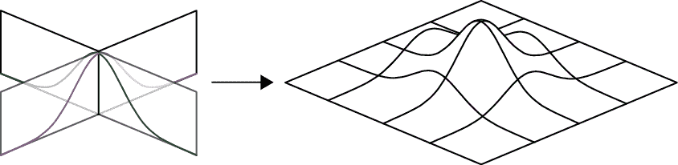

图 18-42：在 3D 空间中，我们可以将两个高斯分布放置在垂直方向上。它们一起形成了一个位于平面上的凸起。

图 18-42 展示了二维分布的三维可视化。我们可以通过在 Z 轴上加入另一个高斯分布来创建一个实际的三维分布。如果我们把结果的凸起看作密度，那么这个三维高斯分布就像一朵蒲公英的花絮，中心密集，但向外扩展时变得更加稀疏。

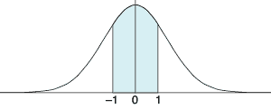

图 18-43：一个高斯分布由其均值（即其中心位置）和标准差（即对称的距离，约 68%的面积包含在此范围内）来描述。这里的均值为 0，标准差为 1。

类比地，我们可以想象一个任意维度的高斯分布，只需要假设每个维度的密度沿其轴线遵循高斯曲线。这就是我们在这里做的。我们告诉 VAE 学习潜在变量的值，使得当我们查看大量训练样本的潜在变量并统计每个值出现的次数时，每个变量的计数形成类似高斯分布的分布，其均值（或中心）为 0，标准差（即其扩展范围）为 1，如图 18-43 所示。回想一下第二章，这意味着大约 68%的潜在变量值位于−1 到 1 之间。

当我们完成训练后，我们知道我们的潜在变量将按照这种模式分布。如果我们选择新的值并将其输入解码器，并且从这个分布中选择这些值（我们更有可能选择靠近中心和分布主要部分的值，而不是选择边缘的值），那么我们很可能生成与训练集中学到的值相近的潜在变量集，从而生成与训练集相似的输出。这也自然地将样本保持在同一区域，因为它们都试图匹配以 0 为中心的高斯分布。

如图 18-43 所示，将潜在变量落在单位高斯分布内是一个理想状态，但我们很少能做到这一点。变量与高斯分布的匹配度和系统在重建输入时的准确度之间存在权衡（Frans 2016）。系统在训练过程中自动学习这种权衡，努力保持潜在变量的高斯形态，同时也能很好地重建输入。

#### 将数字聚集在一起

我们的下一个目标是让所有相同数字的图像的潜在值聚集在一起。为此，让我们使用一个巧妙的技巧，涉及一些随机性。这有点微妙。

假设我们*已经实现了这个目标*，让我们从一个特定的角度来看这个结果，这将告诉我们如何真正实现它。例如，我们假设每个图像的潜在变量集（例如数字 2 的图像）与所有其他数字 2 图像的潜在变量集相近。不过，我们可以做得更好。一些 2 在左下角有一个环。因此，除了将所有 2 聚集在一起外，我们还可以将所有有环的 2 聚在一起，将所有没有环的 2 聚在一起，而这两个聚集区域之间的区域则由那些大致有环的 2 的潜在变量填充，正如在图 18-44 所示。

现在让我们把这个想法推向极限。无论每个标记为 2 的图像的形状、风格、线条粗细、倾斜度等如何，我们都会为这些图像分配潜在变量，这些变量与其他标记为 2 的图像相近，而这些图像呈现相似的形状和风格。我们可以用一个循环将所有标记为 2 的图像聚集在一起，再将那些没有标记为 2 的图像分开，将所有用直线绘制的图像和所有用曲线绘制的图像、所有线条粗的图像和所有线条细的图像、所有高的 2 等聚在一起。这就是使用大量潜在变量的主要价值：它们让我们能够将这些特征的所有不同组合聚集在一起，而这在二维空间中是无法做到的。在一个区域，我们有细直线的无环 2，另一个区域则有粗曲线的无环 2，以此类推，涵盖了每一种组合。

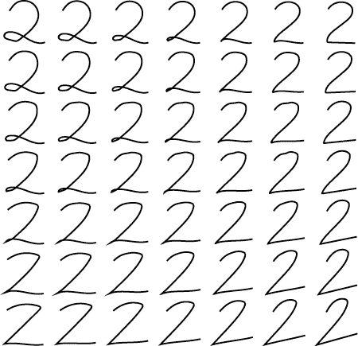

图 18-44：一个 2 的网格被组织成使得相邻的 2 看起来相似。我们希望这些 2 的潜在变量大致遵循这样的结构。

如果我们必须自己识别所有这些特征，这种方案就不太实用了。但 VAE 不仅学习不同的特征，还会在学习过程中自动为我们创建所有不同的分组。像往常一样，我们只需输入图像，系统就会完成其余的工作。

这个“接近度”标准是在潜在空间中衡量的，其中每个潜在变量都有一个维度。在二维空间中，每组潜在变量在平面上形成一个点，它们之间的距离（或“接近度”）是连接它们的直线的长度。我们可以将这个概念推广到任意维度，因此即使每组潜在变量有 30 或甚至 300 个值，我们也可以始终找到它们之间的距离：我们只需测量连接它们的直线长度。

我们希望系统将相似的输入聚集在一起。但请记住，我们也希望每个潜在变量形成高斯分布。这两个标准可能会发生冲突。通过引入一些随机性，我们可以告诉系统“通常”将相似的输入潜在变量聚集在一起，并“通常”沿高斯曲线分布这些变量。让我们看看随机性如何让这一目标得以实现。

#### 引入随机性

假设我们的系统输入的是数字 2 的图像，并且像往常一样，编码器为其找到潜在变量。在将这些潜在变量传递给解码器生成输出图像之前，让我们在每个潜在变量上添加一点随机性，并将这些修改后的值传递给解码器，如图 18-45 所示。

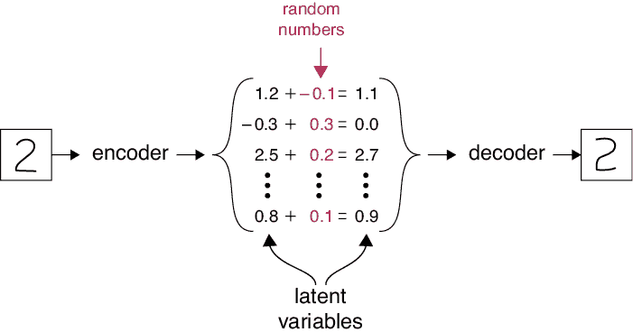

图 18-45：向编码器输出添加随机性的一个方法是，在将每个潜在变量传递给解码器之前，向其添加一个随机值。

因为我们假设相同风格的所有示例都被聚集在一起，所以我们从扰动后的潜在变量生成的输出图像将与输入图像相似（但有所不同），因此，衡量图像之间差异的误差也会较低。然后，我们只需通过向同一组潜在值添加不同的小随机数，就可以生成许多类似于输入 2 的新 2。

一旦聚类完成，这就是它的工作原理。为了首先完成聚类，我们只需在训练过程中，当这个扰动后的输出与输入差距较大时，给予网络一个大的误差分数。因为系统希望最小化误差，它会学习到与输入原始潜在值接近的潜在值应该生成接近输入图像的图像。结果，相似输入的潜在值会聚集在一起，正如我们所期望的那样。

但我们刚才走了一条在实践中不能继续的捷径。如果我们像在图 18-45 中那样直接加上随机数，我们就无法使用第十四章中看到的反向传播算法来训练模型。问题出在反向传播需要计算网络中流动的梯度，但像图 18-45 这样的操作的数学方法无法让我们以需要的方式计算梯度。如果没有反向传播，我们整个学习过程就会像消失在一阵烟雾中一样。

变分自编码器（VAE）采用了一种巧妙的想法来解决这个问题，它将添加随机值的过程替换为一个相似的概念，完成相似的工作，但让我们可以计算梯度。这是一种小小的数学替代方法，使得反向传播算法可以再次起作用。这被称为*重参数化技巧*。（正如我们之前看到的，数学家们有时会用*技巧*这个词来赞扬一个聪明的想法。）

了解这个技巧很有价值，因为在阅读变分自编码器（VAE）相关内容时，通常会遇到这个技巧（还有其他数学技巧涉及其中，但我们不会深入探讨）。这个技巧是这样的：我们不再像在图 18-45 中那样直接为每个潜在变量从空中选取一个随机数并加进去，而是从概率分布中抽取一个随机变量。这个值现在成为我们的潜在变量（Doersch 2016）。换句话说，我们不是从一个潜在值开始，再加上一个随机偏移来创建一个新的潜在值，而是利用潜在值来控制一个随机数生成过程，那个过程的结果就是新的潜在值。

回顾第二章，概率分布可以为我们提供随机数，其中一些数值比其他数值更可能出现。在这种情况下，我们使用高斯分布。这意味着，当我们请求一个随机值时，我们最有可能得到一个靠近“峰值”高的位置的数值，而我们越远离“峰值”的中心，得到这些数值的可能性就越小。

由于每个高斯分布需要一个中心（均值）和一个扩展（标准差），编码器为每个潜在变量生成这对数值。如果我们的系统有八个潜在变量，那么编码器将生成八对数值：每个潜在变量对应一个高斯分布的中心和扩展。一旦得到了这些数值，对于每一对值，我们从它们定义的分布中选择一个随机数，这个值就是我们随后提供给解码器的潜在变量值。换句话说，我们为每个潜在变量创建一个新的值，这个值与原来的非常接近，但内含一定的随机性。扰动过程的重构使我们能够将反向传播应用于网络。

图 18-46 展示了这个想法。

我们的自动编码器结构，如图 18-46 所示，要求网络在计算潜在值后进行*分裂*。分裂是我们深度学习架构中新采用的技术：它仅仅是对一个张量进行复制，并将两个副本发送到两个不同的后续层。在分裂之后，我们使用一层来计算高斯分布的中心，另一层计算其扩展。我们从这个高斯分布中进行采样，得到我们的新潜在值。

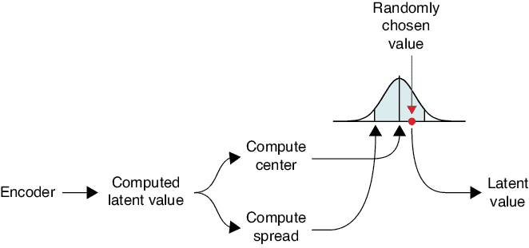

图 18-46：我们使用计算得到的潜在值来获得高斯波峰的中心和扩展。我们从这个波峰中选择一个数字，这个数字成为我们的新潜在值。

为了应用我们在图 18-46 中的采样思想，我们为每个潜在变量创建一个高斯分布并进行采样。然后，我们将所有的新潜在值输入到一个*合并*或*组合*层中，该层只是简单地将所有输入依次放在一起形成一个单一的列表（实际上，我们通常将采样和合并步骤合并成一个层）。图 18-47 展示了如何处理一个具有三个值的潜在向量。

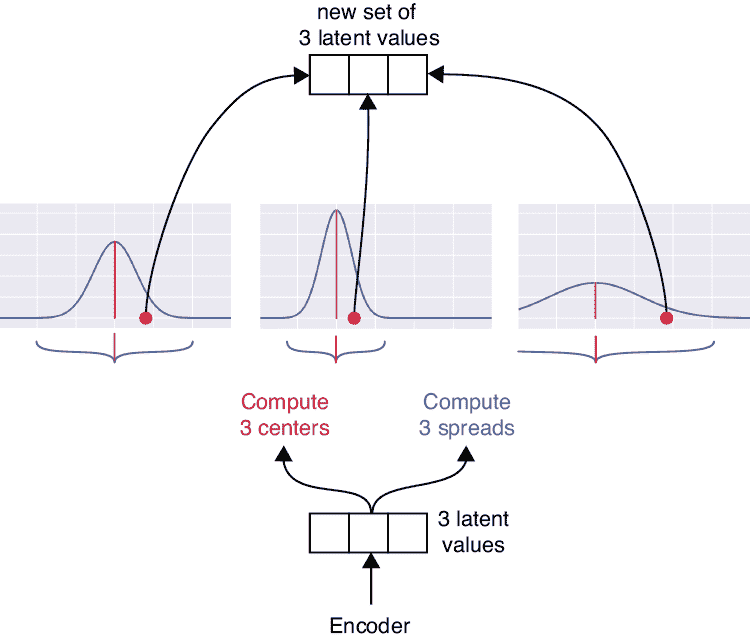

图 18-47：展示了具有三个潜在变量的 VAE 的分裂与合并采样步骤

在图 18-47 中，编码器以三个潜在变量结束，对于每一个，我们都会计算一个中心和扩展。这三个不同的高斯波峰随后会被随机采样，所选的值会被合并或组合，形成为该输入计算出的最终潜在变量。这些变量是编码器部分的输出。

在学习过程中，网络会学习每个高斯分布的中心和扩展应该是什么。

这个操作就是我们之前所说的，每次将一个样本输入经过训练的 VAE（也就是说，学习完成后），我们得到的结果都会略有不同。编码器在分裂之前是确定性的。但之后，系统从每个潜在变量的高斯分布中随机选择一个值，而这些值每次都会不同。

## 探索 VAE

图 18-48 展示了一个完全连接的 VAE 的架构。它就像我们从完全连接的层构建的深度自动编码器（参见图 18-17），但有两个变化（我们选择完全连接的层而不是卷积层，以简化模型）。

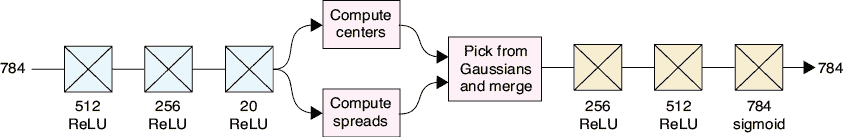

图 18-48：我们用于 MNIST 数据的 VAE 架构。共有 20 个潜在值。

第一个变化是现在我们在编码器的末端采用了分裂-选择-合并过程。第二个变化是我们使用了新的损失函数，或误差函数。

我们会给新的损失函数分配的另一个任务是测量编码和解码阶段完全连接层之间的相似性。毕竟，无论编码阶段做了什么，我们希望解码阶段能将其还原。

测量这个的最佳方式是使用我们在第六章看到的 Kullback-Leibler（或 KL）散度。回想一下，这度量了使用不同于最优编码的编码方式压缩信息时的误差。在这种情况下，我们认为最优编码器是解码器的反向操作，反之亦然。总的来说，随着网络试图减小误差，它也在减少编码器和解码器之间的差异，使它们越来越接近彼此镜像（Altosaar 2020）。

### 处理 MNIST 样本

让我们看看这个 VAE 对我们的一些 MNIST 样本会输出什么。图 18-49 展示了结果。

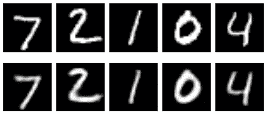

图 18-49: 我们的 VAE 对 图 18-48 的预测。顶行：输入的 MNIST 数据。底行：变分自编码器的输出。

这些匹配得相当不错并不奇怪。我们的网络使用了大量的计算资源来生成这些图像！但是正如我们从其架构中看到的，VAE 每次看到相同图像时都会产生不同的输出。让我们拿出这组测试集中的两个图像，并将其通过 VAE 运行八次。结果见图 18-50。

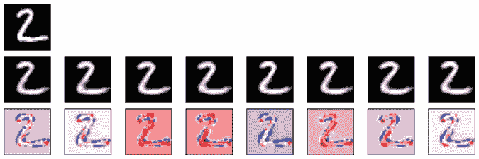

图 18-50: VAE 每次看到相同输入时都会产生不同的结果。顶行：输入图像。中行：VAE 处理输入八次后的输出。底行：输入和每个输出之间的逐像素差异。红色越深表示正差异越大，蓝色越深表示负差异越大。

这八个 VAE 结果彼此相似，但我们可以看到明显的差异。

让我们回到图 18-49 中的八个图像，但向从编码器输出的潜在变量中添加额外的噪声。也就是说，在解码器阶段之前，我们向潜在变量中添加了一些噪声。这为我们提供了一个很好的测试，来查看训练图像在潜在空间中是如何紧密聚集的。

让我们尝试向每个潜在变量的值中添加最多 10%的随机值。图 18-51 展示了在潜在变量中加入这种适量噪声后的结果。

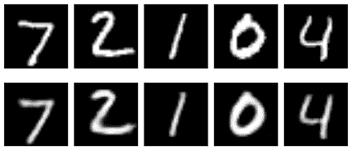

图 18-51: 向从 VAE 编码器输出的潜在变量中添加 10% 的噪声。顶行：来自 MNIST 的输入图像。底行：向编码器输出的潜在变量添加噪声后的解码器输出。

添加噪声似乎并不会显著改变图像。这很好，因为这告诉我们这些噪声值仍然“接近”原始输入。让我们增加噪声，加入一个随机值，最大为潜在变量值的 30%。图 18-52 展示了结果。

图 18-52: 对潜在变量进行最多 30% 的扰动。顶行：MNIST 输入图像。底行：来自 VAE 解码器的结果。

即使有很多噪声，这些图像仍然看起来像数字。例如，7 的变化很大，但它变成了一个弯曲的 7，而不是一个随机的斑点。

让我们尝试混合我们数字的参数，看看效果如何。图 18-53 显示了我们之前看到的五对数字的等比例混合结果。

图 18-53：VAE 中的潜在变量混合。顶部和中间的行：MNIST 输入图像。底部行：每个图像的潜在变量的等比例混合，解码后的结果。

这里有趣的地方在于，这些图像大致看起来像数字（最左边的图像在作为数字的表现上最差，但它仍然是一个一致的形状）。这是因为潜在空间中没有那么多空白区域，所以中间值不太可能落入远离其他数据的区域（从而产生一个奇怪的、非数字的图像）。

让我们看一些线性混合。图 18-54 显示了我们之前见过的三对数字的中间步骤。

图 18-54：VAE 中潜在变量的线性插值。每行的最左边和最右边的图像是 VAE 对一个 MNIST 样本的输出。中间的图像是混合潜在变量的解码版本。

这个 5 看起来很不错，正从一个版本移动到另一个版本的 5 空间中。顶部和底部的行有很多不是数字的图像。它们可能正在通过潜在空间中的空白区域，但正如我们之前提到的，并不清楚这些在任何意义上是错误的。毕竟，一个介于四和三之间的图像应该是什么样子呢？

让我们为了好玩将老虎图像输入系统。记住，这是一个完全不公平的操作，我们不应该期望得到任何有意义的结果。图 18-55 显示了结果。

图 18-55：将我们低分辨率的老虎图像输入 VAE 模型

VAE 创建了一些具有一致结构的东西，但它与数字不像。

### 使用两个潜在变量

为了与其他自编码器进行对比，我们使用了仅有两个潜在变量的 VAE 进行训练（而不是我们一直在使用的 20 个），并在图 18-56 中绘制了它们。

图 18-56：我们训练的 VAE 模型中，使用两个潜在变量对 10,000 个 MNIST 图像的潜在变量位置进行展示。

这是一个很好的结果。潜在变量试图保持的高斯峰值的标准差在这里由一个黑色圆圈表示，并且似乎分布得相当好。各种数字通常被很好地聚集在一起。中间有些混乱，但请记住，这张图像仅使用了两个潜在变量。有趣的是，2 似乎形成了两个簇。为了了解发生了什么，让我们创建一个对应于我们两个潜在变量的图像网格，使用 图 18-22 中显示的公式，但使用 图 18-56 中的潜在变量。让我们将网格上每个点的 x 和 y 值输入到解码器中，假设它们是潜在变量。我们的范围是每个轴从 −3 到 3，就像 图 18-56 中的圆圈一样。结果是 图 18-57。

图 18-57：VAE 输出，将 x 和 y 坐标作为两个潜在变量处理。每个轴的范围从 −3 到 3。

没有环的 2 紧密地聚集在中下部，而带环的 2 则聚集在中左部。系统认为这些数字差异如此之大，以至于它们不需要靠近彼此。

浏览这张图像，我们可以看到数字是如何紧密聚集在一起的。这比我们在 图 18-23 中看到的结构更有组织，也更加均匀。在一些地方，图像有些模糊，但即使只有两个潜在变量，大部分图像看起来仍像数字。

### 生成新的输入

在 图 18-58 中，我们已经将 VAE 的解码器部分隔离出来，作为生成器使用。暂时，我们将继续使用一个版本，其中将 20 个潜在值减少到仅 2 个。

图 18-58：我们的 VAE 解码器阶段

由于我们只有两个潜在变量，我们从以 (0,0) 为中心，半径为 3 的圆内随机选择了 80 对随机 (x, y) 值，输入到解码器中，并将生成的图像汇集在一起，形成 图 18-59。

图 18-59：VAE 解码器在输入两个随机潜在变量时生成的图像

大部分图像看起来相当不错。有些图像不太清晰，但总体上，大多数图像都是可辨识的数字。许多模糊的形状似乎来自于 8 和 1 之间的边界，导致了狭窄且纤细的 8。

这些数字大多是模糊的，因为我们仅使用了两个潜在变量。让我们通过训练并使用一个具有更多潜在变量的更深层 VAE 来使结果更加清晰。图 18-60 展示了我们的新 VAE。这个架构基于 *Caffe* 机器学习库中的 MLP 自编码器（Jia 和 Shelhamer 2020；Donahue 2015）。(回忆一下，MLP 代表多层感知器，即一个完全由全连接层构成的网络。)

图 18-60：更深层 VAE 的架构

我们使用 50 个潜在变量训练了该系统 25 个周期，然后生成了另一个随机图像网格。与之前一样，我们仅使用了解码器阶段，见图 18-61。

图 18-61：我们仅使用深层 VAE 的解码器阶段，通过输入 50 个随机数来生成新图像。

结果见图 18-62。

图 18-62：当提供随机潜在变量时，我们更大的 VAE 生成的图像

这些图像的边缘比图 18-59 中的图像明显更清晰。在大多数情况下，我们已经从完全随机的潜在变量中生成了完全可识别且合理的数字，尽管像往常一样，还是会出现一些不太像数字的奇怪图像。这些图像可能来自数字之间的空白区域，或者不同数字相邻的区域，导致形状出现奇怪的混合。

一旦我们的 VAE 训练完成，如果我们想生成更多类似数字的数据，我们可以忽略编码器并保存解码器。现在它成为了一个生成器，我们可以用它来创建任意多的新数字图像。如果我们将 VAE 训练在拖拉机、鸣禽或河流的图像上，我们也可以生成更多这些类型的图像。

## 总结

在本章中，我们看到自编码器如何学会使用潜在变量表示一组输入。通常这些潜在变量的数量比输入值的数量要少，因此我们说自编码器通过强制数据通过瓶颈来压缩输入。由于在过程中有一些信息丢失，这是一种有损压缩。

通过将我们自己选择的潜在值直接输入训练好的自编码器的后半部分，我们可以将这组层视为生成器，能够生成新的输出数据，类似于输入，但完全是全新的。

自编码器可以使用多种层结构来构建。在本章中，我们看到了使用全连接层和卷积层构建的网络示例。我们观察了由训练过的全连接层自编码器生成的 2D 潜在变量结构，发现它具有出乎意料的组织性和结构性。从这些潜在变量的一个密集区域选择新的潜在变量对并传递给生成器，通常会生成模糊的输出（因为我们只有两个潜在变量值），但大致像输入数据。然后我们看了卷积自编码器，主要（或完全）由卷积层构成。

我们发现可以混合潜在变量，本质上是在端点之间创建一系列中间潜在变量。我们在瓶颈中使用的潜在变量越多，这些插值输出看起来就越好。接着，我们发现可以训练自编码器去噪输入，只需告诉它生成噪声输入的干净值。最后，我们研究了变分自编码器，它能够更好地聚集相似的输入，并填充潜在空间的区域，但代价是引入了某种随机化过程。

自编码器常用于去噪和简化数据集，但人们已经找到了创造性的方法，将其用于许多不同的任务，例如创作音乐和修改输入数据，以帮助网络更好、更快地学习（Raffel 2019）。
