# 第十九章：递归神经网络

在本书的大多数内容中，我们将每个样本视为一个孤立的实体，与任何其他样本无关。这对于像照片这样的东西是有道理的。如果我们在对一张图像进行分类并决定它是一只猫，那之前或之后的图像是狗、松鼠还是飞机都无关紧要。图像彼此独立。但如果图像是电影中的一帧，那么将其放在其他图像的上下文中进行观察就变得有帮助。例如，我们可以追踪那些可能暂时被遮挡的物体。

当我们处理多个顺序重要的样本时，我们称之为*序列*。任何人类语言中单词的流动都是一种重要的序列类型，并且将是本章的重点。

能够理解和处理序列的算法还有一个额外的好处：它们通常能够*生成*，或创造，新的序列。经过训练的系统可以生成故事（Deutsch 2016a）或电视剧本（Deutsch 2016b），爱尔兰民间舞曲（Sturm 2015b），复调旋律（LISA Lab 2018），以及复杂的歌曲（Johnson 2015；O’Brien 和 Román 2017）。我们可以为流行音乐（Krishan 2016）、民谣音乐（Sturm 2015a）、说唱（Barrat 2018）或乡村音乐（Moocarme 2020）创作歌词。我们可以将语音转换为文本（Geitgey 2016；Graves、Mohamed 和 Hinton 2013），并为图像和视频写字幕（Karpathy 和 Li 2013；Mao 等，2015）。

在本章中，我们将介绍一种基于记住每个元素特征的序列处理方法。我们所构建的模型被称为递归神经网络（RNN）。

当我们处理序列时，每个输入元素称为*token*。一个 token 代表一个单词、一个单词的片段、一项测量，或任何其他可以用数字表示的东西。在本章中，我们使用语言作为最常见的数据来源，并专注于整个单词，因此我们将*word*和*token*互换使用。

## 语言的应用

研究自然语言的整体领域称为*自然语言理解*，或*NLU*。今天的大多数算法并不关心它们所处理的语言的实际理解。相反，它们从数据中提取统计信息，并以这些统计信息为基础进行诸如回答问题或生成文本等任务。这些技术通常被称为*自然语言处理*，或*NLP*。

在第十六章和第十七章中，我们看到卷积神经网络（CNN）可以识别照片中的物体，而无需真正理解照片的内容。它们只处理像素的统计数据。同样，NLP 系统并不理解它们所处理的语言。相反，它们为单词分配数字，并找到这些数字之间有用的统计关系。

从根本上说，这些系统并不知道语言的存在，或它们操作的对象具有语义含义。像往常一样，系统使用统计学来生成我们在特定情境下认为可接受的输出，甚至没有一点理解它在做什么或这些输出对人类意味着什么。

### 常见的自然语言处理任务

自然语言算法的应用通常被称为*任务*。以下是一些流行的任务：

1.  **情感分析：** 给定带有观点的文本，如电影评论，判断整体情感是积极的还是消极的。

1.  **翻译：** 将文本转换成另一种语言。

1.  **回答问题：** 回答关于文本的问题，比如谁是英雄，或者发生了什么行动。

1.  **总结或改写：** 提供文本的简短概述，强调主要观点。

1.  **生成新文本：** 给定一些起始文本，编写更多似乎与其相关的文本。

1.  **逻辑流：** 如果一个句子首先提出一个前提，接下来的句子根据该前提提出一个结论，判断结论是否从前提中合乎逻辑地得出。

在本章及下一章中，我们主要关注两个任务：翻译和文本生成。其他任务与这两者有许多相似之处（Rajpurkar, Jia, and Liang 2018; Roberts, Raffel, and Shazeer, 2020）。特别是，逻辑流的处理非常困难，需要借助人机合作（Full Fact 2020）。

翻译至少需要我们提供要翻译的文本，以及源语言和目标语言。我们可能还希望了解一些上下文信息，以帮助我们理解习语和其他随时间或地点变化的语言特征。

文本生成通常从一个*种子*或*提示*开始。算法将其作为文本的起点，并从那里构建。通常，它一次生成一个词。给定一个提示，它会预测下一个词。该词被添加到提示的末尾，系统使用新的、更长的提示来预测下一个词。我们可以无限重复这个过程来生成一个句子、文章或书籍。我们称这种技术为*自回归*，因为我们通过自动将之前的输出连接在一起并将其作为输入来预测或回归序列中的下一个词。自回归系统被称为*自回归器*。更一般地说，按算法创建文本被称为*自然语言生成*，或*NLG*。

翻译和文本生成都使用了一个叫做*语言模型*的概念。这是一种计算方法，它将一系列单词作为输入，并告诉我们该序列形成一个完整句子的可能性有多大。请注意，它并不会告诉我们该句子是否写得特别好，甚至是否有意义或是否真实。通常，我们会将训练好的神经网络本身称为语言模型（Jurafsky 2020）。

### 将文本转化为数字

为了构建可以帮助我们进行翻译和文本生成的系统，我们必须首先将文本转化为计算机可用的形式。像往常一样，我们将一切转化为数字。这里有两种常见的方法来做到这一点。

第一种方法是*基于字符的*，我们为文本中可能出现的所有符号编号。人类语言中最广泛的书写字符表叫做 Unicode。最新版本 Unicode 13.0.0 包含 154 种人类书写语言，识别了 143,859 个不同的字符（Unicode Consortium 2020）。我们可以为这些书写系统中的每个符号分配一个从 0 到大约 144,000 的唯一编号。在本章中，我们保持简洁，展示一些使用 89 个最常见的英语字符的文本生成示例。

第二种方法是*基于词语的*，我们为文本中可能出现的所有单词编号。统计世界上所有语言中的所有单词将是一项艰巨的任务。在本书中，我们坚持使用英语，但即便如此，我们也没有明确统计过单词的数量。大多数现代英语词典大约有 300,000 个词条（Dictionary.com 2020）。试想，逐字翻阅词典并为每个条目分配一个从 0 开始的唯一编号。这些单词及其对应的数字便构成了我们的*词汇表*。本章中的大多数示例都采用基于词语的方法。

现在我们可以为任何句子创建一个计算机友好的数字表示。我们可以通过将这组数字传递给一个经过训练的自回归网络来生成更多的文本。网络预测下一个词的数字，然后将这个词附加到作为输入的词汇上，网络接着预测下一个词，这个词再次附加到输入的词汇中，依此类推。为了让我们看到与之对应的文本，我们可以将每个数字转回其对应的单词。在接下来的讨论中，我们将这些数字转换过程视为理所当然，并将输入和输出表示为单词，而不是数字。稍后我们将看到，虽然单个数字是可行的，但有一种更丰富的方式来表示单词，包含它们的上下文以及它们在句子中的使用方式。

### 微调与下游网络

训练一个系统时，通常会先在一个通用数据库上进行训练，然后再进行专业化。例如，我们可以将一个通用的图像分类器增强为一个能够识别叶子形状并告诉我们它们来自哪种树的分类器。这个过程被称为*迁移学习*。在分类器中使用时，通常涉及冻结现有的网络，在分类部分的末尾添加一些新的层，并训练这些新层。这样，新层就可以利用现有网络从每个图像中提取到的所有信息。

在自然语言处理（NLP）中，我们说一个从通用数据库中学习的系统是*预训练的*。然后，当我们想学习一种新的专业语言时，比如法律、诗歌或工程领域的语言，我们会用新的数据对网络进行*微调*。与迁移学习不同，当我们进行微调时，通常会修改系统中的所有权重。

如果我们不想重新训练系统，我们可以创建第二个模型，接受语言系统的输出并将其转换为对我们更有用的内容，这与迁移学习的精神相近。这里语言模型被冻结，其输出被传递给新模型。我们将这个第二个模型称为*下游网络*，它执行*下游任务*。一些语言模型旨在创建其输入文本的丰富、密集的摘要，从而可以用于推动各种下游任务。

微调和下游训练这两种方法是有用的概念区分，但在实践中，许多系统将两种技术结合使用。

## 完全连接预测

正如我们所讨论的，我们将语言视为一系列数字。为了更好地理解如何处理这种序列，让我们暂时放下语言，专注于数字。我们将构建一个微型网络，该网络学习从序列中获取一些数字，并生成下一个数字。我们将以最简单的方式来做：一个完全连接的层，只有五个神经元，接着是一个完全连接的层，只有一个神经元，如图 19-1 所示。我们将在第一层使用一个斜率为 0.1 的泄漏 ReLU 激活函数，在输出层不使用激活函数。

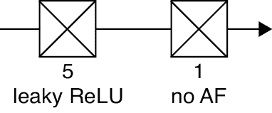

图 19-1：用于序列预测的微型网络

### 测试我们的网络

为了尝试这个微型网络，让我们使用一个合成数据集，该数据集是通过将一堆正弦波相加生成的。前 500 个样本如图 19-2 所示。

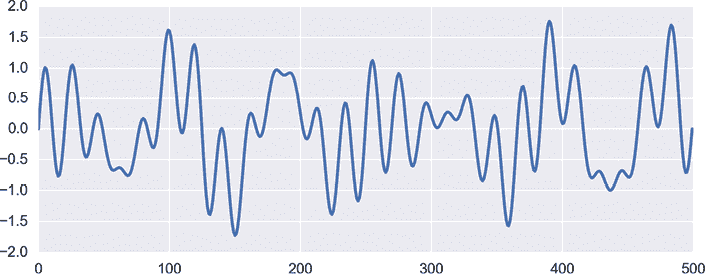

图 19-2：合成训练数据

为了训练我们的系统，我们将从数据集中取出前五个值，并让我们的微型网络生成第六个值。然后，我们将取出数据集中的第 2 到第 6 个值，并让它预测第七个值。我们说我们使用*滑动窗口*来选择每一组输入，如图 19-3 所示。

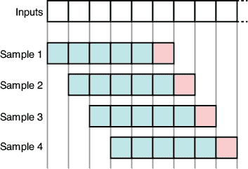

图 19-3：使用滑动窗口从训练数据的 5 元素序列中创建训练样本，蓝色表示训练样本。我们希望为每个样本预测的值用红色表示。

从我们开始的 500 个值中，我们可以以这种方式生成 495 个样本。我们用这些样本训练了我们的微型网络 50 个时期。当我们再次运行训练数据并请求预测时，我们得到图 19-4 左侧的结果，图中显示了原始训练数据（蓝色）和预测值（橙色）。还不错！

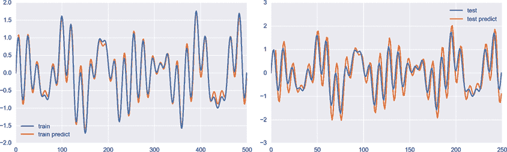

图 19-4：左侧：训练数据和预测结果。右侧：测试数据和预测结果。

现在，让我们在后续曲线的 250 个测试数据点上运行这个模型。数据和预测结果显示在图 19-4 的右侧。虽然预测结果并不完美，但考虑到我们的网络非常小，预测已经相当不错。

然而，这些数据比较简单，因为它们变化平缓。让我们尝试一个更现实的数据集，数据来源于 1749 到 2018 年间每月记录的太阳黑子平均数量（Kaggle 2020）。图 19-5 显示了使用与图 19-4 相同排列方式的输入和输出。数据中的波峰波谷对应于大约 11 年的太阳周期。虽然它并没有完全达到数据的极端值，但我们的小型回归模型似乎能很好地跟踪数据的整体波动。

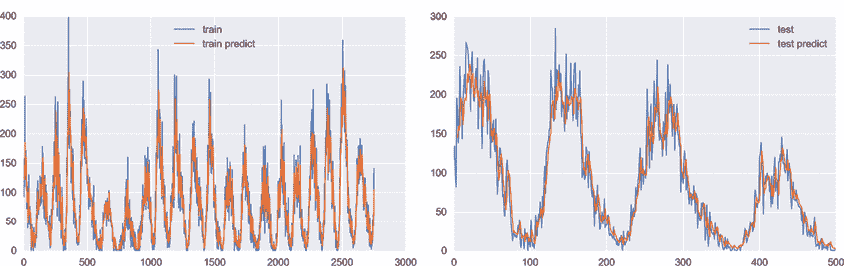

图 19-5：左侧：训练太阳黑子数据和预测结果。右侧：测试数据和预测结果。

不幸的是，这个小型网络无法生成令人愉快的小说。为了理解原因，让我们将数据改为编号的单词。我们将使用查尔斯·狄更斯小说《双城记》（Dickens 1859）的前六章作为文本。为了便于处理，我们去除了所有标点符号并将所有内容转换为小写字母。

由于我们将按单词级别工作，我们需要为每个将要使用的单词分配一个编号。为整个词典编号显得过于繁琐，并且会错过文本中的所有人名和地名。相反，让我们从书本本身建立词汇表。我们将为书中的第一个单词分配编号 0，然后逐个单词向前推进。每次遇到一个之前未见过的单词时，我们就为它分配下一个可用的编号。这部分小说包含 17,267 个单词，但只有 3,458 个独特的单词，所以我们的单词编号从 0 到 3,457。

现在，由于小说中的每个单词都有了编号，我们将数据库分为训练集和测试集。在训练数据的末尾，我们只看到了大约 3,000 个独特的单词。为了避免网络预测它没有训练过的单词编号，我们移除了测试集中任何包含超过此值的单词编号（或目标）的所有序列。也就是说，测试数据只包含使用训练数据中已出现的单词的序列。

我们重复了前面的实验，向图 19-1 中的小网络输入了五个连续的单词编号窗口，从输出中收集了它对下一个单词的预测。我们让它训练了 50 个 epoch，但误差很快停止改进，并且早期停止在 8 个 epoch 后结束了训练，给出了图 19-6 中的结果。正如我们在左侧的训练数据中看到的，随着我们深入到书中，单词编号逐渐增加。橙色线条是系统根据每组五个输入预测的单词编号。

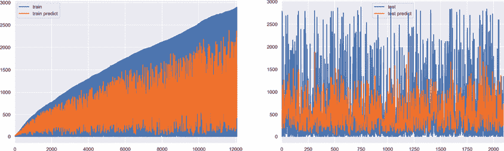

图 19-6：左：来自《**双城记**》前六章大约 12,000 个单词的训练和预测。右：大约 2,000 个更多单词的测试数据和预测。

结果一点也不好。预测结果显然与训练数据或测试数据都不匹配。从图 19-7 中的特写可以更容易地看到测试数据和预测的结构。

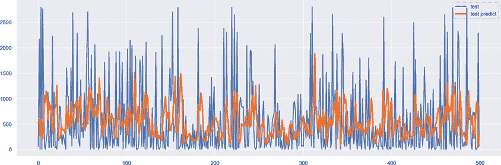

图 19-7：来自图 19-6 的 500 个测试数据和预测结果的特写

预测结果似乎模糊地跟随目标，但它们完全偏离了。

### 为什么我们的网络失败了

让我们把图 19-7 中的数字转回成单词。以下是一个典型的摘录：

> pricked hollows mud crosses argument ripples loud want joints upon harness followed side three intensely atop fired wrote pretence

这不算是伟大的文学作品，即使我们加上了标点符号。这里有不少问题。首先，这个小网络显然没有足够的能力来完成这项任务。我们可能需要更多的神经元，也许需要更多的层，才能接近可读的文本。

即使是更大的全连接网络也会在这项任务上遇到困难，因为它们无法捕捉文本的结构，也就是所谓的*语义*。语言的结构与我们之前看到的曲线和太阳黑子数据有本质的不同。考虑这个五个单词的字符串：Just yesterday, I saw a。这个片段可以通过任何名词来完成。根据一项估计，英语中的名词数量至少有成千上万（McCrae 2018）。任何网络怎么可能猜出我们想要的那个名词呢？一个答案是将窗口增大，这样网络就有了更多的前置单词，可能能够做出更有根据的选择。例如，给定输入：I’ve been spending my time watching tigers very closely. Just yesterday, I saw a，大多数英语名词现在可以合理地排除为不太可能。

我们来试试这个。我们将图 19-1 中的小网络扩大，第一层有 20 个神经元。我们一次给它 20 个元素，并要求它预测第 21 个。曲线数据的结果显示在图 19-8 中。

尽管训练数据仍然相当不错，但测试结果却差得多。为了处理来自这个更大窗口的所有信息，我们需要一个更大的网络。增大窗口意味着我们需要一个更大的网络，这也意味着它需要更多的训练数据、更大的内存、更强的计算能力、更高的电力消耗和更多的训练时间。

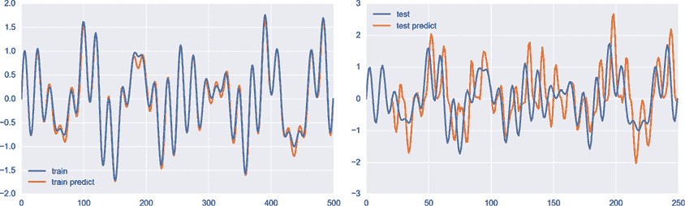

图 19-8：一个放大的网络，使用 20 个元素的窗口预测正弦波数据

但还有一个更大的问题，仅仅通过使用更大的网络是无法改善的。问题在于，即使是预测中的一个微小错误，也会导致无法理解的文本。为了看清这一点，我们可以随便查看赋值为 1,003 和 1,004 的单词。这些数字分别对应单词 keep 和 flint。这两个单词似乎完全无关，但在搜索文本时，我们会找到书的开头附近有这样一段话：he had only to shut himself up inside, keep the flint and steel sparks well off the straw。单词 the 已经出现在书中的第三个位置，所以由于 keep 和 flint 之前都没有出现，当我们对书中的单词进行编号时，keep 和 flint 被赋予了相邻的编号。

假设我们的网络在响应某些输入时，预测下一个单词为 1,003.49。我们需要将其转换为整数，以便查找相应的单词。最接近的整数是 1,003，给我们的是 keep。但如果系统预测略大的值 1,003.51，最接近的整数是 1,004，给我们的是 flint。这两个词完全不相关。这表明，即使是预测中的微小数值差异，也会产生荒谬的输出。

回顾我们在网络图中的预测，我们可以看到很多错误，这些错误在曲线和太阳黑子数据中似乎不那么严重，但对于语言数据来说会造成严重的混乱。增加计算能力可以减少这些错误，但我们对精确度的需求不会消失。

我们在图 19-1 中的小型网络隐藏了另一个缺陷：它无法跟踪输入中单词的位置。假设我们给出句子“Bob 告诉 John 他饿了”，并且我们想知道代词 he 指的是谁。答案是 Bob。但单词顺序很重要，因为如果我们改为给出句子“John 告诉 Bob 他饿了”，那么 he 就会指代 John。对准确性的需求会促使我们通过更多的全连接层来扩展网络，但当单词进入第一层时，我们就会失去它们的隐含顺序。后续的层将无法判断哪个单词对应 he。

为了解决这些问题以及许多其他问题，我们需要比全连接层和由单一数字表示的单词更复杂的东西。我们可能会尝试使用 CNN，且已经有一些关于使用 CNN 处理序列数据的研究（Chen and Wu 2017；van den Oord 等，2016），但这些工具仍在发展中。相反，让我们看看一些专门设计来处理序列的东西。

## 循环神经网络

处理语言的更好方法是构建一个明确设计来管理单词顺序的网络。这样的一种网络，本章的重点，是循环神经网络（RNN）。这种网络建立在我们之前没有探讨过的一些概念之上，因此让我们现在考虑它们，然后用它们来构建一个 RNN。

### 引入状态

RNN 利用了一个叫做*状态*的概念。这只是描述系统（如神经网络）在任何给定时刻的状态。例如，想象一下预热烤箱。在这个过程中，烤箱会经历三种独特的状态：关闭；预热中；以及达到所需温度。状态也可以包含其他信息。例如，随着烤箱加热，我们可以将三条信息打包到烤箱的状态中：它当前的状态（例如，正在预热）；它目前的温度；以及它的目标温度。因此，状态可以表示系统的当前状态，以及任何其他便于记忆的信息。

由于状态非常重要，让我们通过另一个例子来看看它的一些微妙之处。

假设你在一家冰淇淋店工作，正在学习如何制作一个简单的巧克力酱圣代。在这个故事中，你扮演的是系统的角色，而你脑海中逐步建立的配方就是你的状态。

在得到任何指示之前，你的*起始状态*或*初始状态*将是“一个空杯子”。所以，假设你有一个空杯子。你的起始状态如图 19-9 所示，在最左侧。

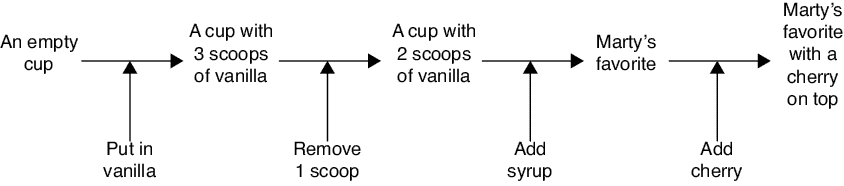

图 19-9：你在学习做甜点时，逐步变化的状态或配方

你的经理说第一步是放一些香草冰淇淋。所以，你更新了内部配方或状态为“一个空杯子，里面有三勺香草冰淇淋。”你将三勺冰淇淋放入杯中。

你的经理说这样太多了，你应该去掉一勺冰淇淋。你照做了，并将状态更新为“一个空杯子，里面有两勺香草冰淇淋。”

现在你的经理说要倒入足够的巧克力糖浆，覆盖住冰淇淋。你这么做，并将状态更新为“一个空杯子，里面有两勺香草冰淇淋，覆盖着巧克力糖浆。”但这让你想起了你的朋友 Marty，因为这是他最喜欢的甜点。所以，你通过抛弃之前的状态来简化你的状态，现在只记得“马蒂最喜欢的”。

最后，你的经理说你应该在上面放一颗樱桃。所以，你更新了你的状态为“加樱桃的 Marty 最爱”。恭喜，你的圣代完成了！

从这个故事和状态的概念中，我们有几个关键要点需要记住。

首先，你的状态不仅仅是当前情况的快照或你所获得信息的列表。它捕捉了这两者的概念，可能是压缩或修改过的形式。例如，你记得放入两勺冰激凌，而不是记得放三勺冰激凌然后再去掉一勺。

其次，在每一步接收到新信息后，你更新了状态并产生了输出。输出取决于你接收到的输入和你的内部状态，但外部观察者无法看到你的状态，因此他们可能无法理解你的输出是如何从刚收到的输入中产生的。实际上，外部观察者通常无法看到系统的内部状态。我们通过有时将系统的状态称为*隐藏状态*来强调这一点。

最后，输入的顺序很重要。这是这个例子的关键所在，它使得这个过程是一个顺序，而不仅仅是一些输入，因此它区别于我们在本章开始时提到的简单的全连接层。如果你先把巧克力放进杯子里，你会做出完全不同的甜点，而且你可能不会在状态中创造出对你朋友 Marty 的引用。

我们将每个输入称为*时间步*。当输入表示时间中的事件时，这个概念是有意义的，就像这里一样。其他序列可能没有时间成分，比如描述河流从源头到终点沿途各个点的深度的序列。特别是，句子中的单词在被大声朗读时具有时间成分，但这个概念在它们被打印出来时并不适用。尽管如此，术语*时间步*仍被广泛用来指代序列中的每个连续元素。

### 我们的图表汇总

如果我们需要处理一长串的输入，一个像图 19-9 这样的图可能会占据页面很大的空间。因此，我们通常会将它绘制成更紧凑的形式，如图 19-10。我们在这里用连字符连接这些词，以表示每个小短语应该作为一个信息块来理解。

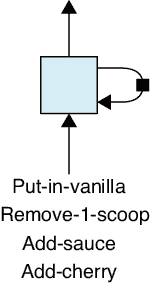

图 19-10：图 19-9 的汇总版本

右侧的循环表示了一个输入与下一个输入之间的状态。每次输入后，系统（由大而浅蓝色的框表示）会创建一个新的状态，该状态进入黑色方框。这个方框称为*延迟*，我们可以将其视为一小块记忆。当下一个输入到达时，系统会从延迟中取出状态并计算输出和新状态。新的状态再次从系统中产生，并停留在延迟中，直到下一个输入到达。延迟的目的是为了清楚地表明，在每个时间步中产生的状态不会立即以某种方式被再次使用，而是被保持直到需要处理下一个输入。

我们说图 19-9 中的图示是过程的*展开*版本。图 19-10 中的更紧凑的版本称为*卷起*或*收缩*版本。

在深度学习中，我们通过将一切打包成一个循环单元来实现管理状态和输出呈现的过程，如图 19-11 所示。*循环*一词指的是我们反复使用状态记忆，尽管它的内容通常会随着每次输入的不同而变化（注意，这与*递归*一词不同，尽管这两个词听起来相似，但意义完全不同）。单元的工作通常由多个神经网络管理。像往常一样，当我们训练包含图 19-11 作为一层的完整网络时，这些网络会学习如何执行它们的任务。

我们将看到，尽管一个单元的内部状态通常是私有的，但一些网络可以很好地利用这些信息，因此这里我们将导出的状态表示为虚线，表示它是可用的，但如果不需要可以忽略。

我们经常将一个循环单元放在单独的层上，并称之为*循环层*。以循环层为主的网络被称为*循环神经网络*，或*RNN*。这个术语也常常应用于循环层本身，有时甚至是循环单元，因为它们内部包含神经网络。正确的解释通常可以从上下文中明确得知。

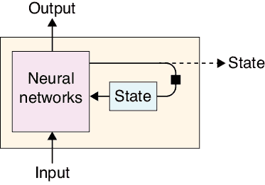

图 19-11：一个循环神经单元。如果需要，隐藏状态可以被导出到单元外部。

循环单元的内部状态以张量的形式保存。由于这个张量通常只是一个一维的数字列表，我们有时会谈到循环单元的*宽度*或*大小*，指的是状态中记忆元素的数量。如果网络中所有单元的宽度相同，我们有时会将其称为网络的宽度。

图 19-12 的左侧显示了我们用来表示循环单元的图标，这通常出现在展开的图示中。右侧则显示了当我们将单元放入一个层时的图标，为了方便，我们将其收起。在层版本中，我们不绘制单元的内部状态。

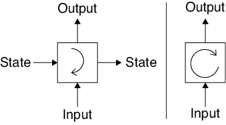

图 19-12：左：我们为递归单元设计的图标。右：我们为递归层设计的图标。

我们可以使用图 19-11 中的基本递归单元来构建一个语言模型。假设标有“神经网络”的框中包含一个小型神经网络，由我们喜欢的任何层构建。我们可以将单元喂入一系列的单词（以数字形式）。每个单词之后，单元会生成一个预测，预测下一个单词，并更新其内部状态以记住到目前为止出现的单词。为了复现本章开始时的实验，我们可以连续输入五个单词，忽略前四个单元的输出。第五个输入后的输出将是它对第六个单词的预测。如果我们正在训练，并且预测不正确，那么像往常一样，我们使用反向传播和优化来改进神经网络中权重的值，并继续训练。目标是最终这些网络能够非常擅长于解读输入并控制状态，从而能够做出良好的预测。

### 递归单元的应用

让我们看看一个递归单元如何预测五个单词序列的下一个单词。我们可以通过展开的图示来看到输入和可能的输出，如图 19-13 所示。

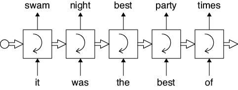

图 19-13：递归单元预测单词。图示为展开形式。预测从单元的顶部输出，而状态由水平箭头表示。

我们从一个隐藏状态已被初始化为零的单元开始，表示尚未学到任何东西。那就是最左边的空圆圈。第一个单词“it”到达，单元考虑输入和隐藏状态，并预测下一个单词“swam”。单元告诉我们，以“it”开头的句子最可能接着是“swam”这个单词，但我们忽略这个预测，因为我们只关心第五个单词后的预测。

现在进入有趣的部分。利用在训练过程中学到的信息，RNN 更新其隐藏状态，以包含它接收到单词“it”作为输入，并生成“swam”作为输出的某种表示。

现在出现第二个单词：was。单元再次根据其隐藏状态和输入进行计算，并生成新的输出预测。这里是“night”，完成了短语“it was night”。单元更新其隐藏状态，记住接收了“it”，然后是“was”，然后是预测“night”。我们再次忽略了对“night”的预测。

这个过程持续进行，直到我们提供第五个单词“of”。如果我们在训练初期，系统可能会生成像“jellyfish”这样的内容，完成句子“它是最好的 jellyfish”。但在对原始文本进行了足够的训练后，递归单元内部的网络将学会如何在隐藏状态中表示“它是最好的”这个短语的连续单词，从而使得单词“times”具有很高的概率。

### 训练递归神经网络

假设我们正在开始训练图 19-13 中的递归单元。我们给它输入五个单词，然后通过将单元的最终预测与文本中的下一个单词进行比较来计算误差。如果预测与文本不匹配，我们会像往常一样执行反向传播和优化。查看图示，我们首先在图中最右侧的单元中找到梯度，然后将梯度传播到左边的前一个单元，再将梯度传播到它前面的单元，依此类推。按顺序应用反向传播非常重要，因为这些是处理的顺序步骤。

但是我们不能对图 19-13 中的每个框进行优化，因为这些都是相同的单元！对于系统来说，这看起来就像图 19-11 的一个实例，坐落在自己的层上，而不是一些展开的、重复使用相同单元的列表。我们必须以某种方式对同一层应用反向传播，这可能会造成混乱的记录工作。为了处理这个问题，我们使用了一种特殊的反向传播变体，叫做*反向传播通过时间*（BPTT）。它处理这些细节，使我们能够在训练时字面上解释图 19-13。

BPTT（反向传播通过时间）允许我们高效地训练递归单元，但它并不能完全解决训练问题。假设在使用 BPTT 时，我们为图 19-13 中最右侧单元的某个特定权重计算了一个梯度。然后，当我们向左传播梯度时，发现前一个单元中该权重的梯度更小。这意味着，当我们一次又一次地通过同一个单元将梯度向左传播时，相同的过程会不断重复，梯度会变得越来越小。如果梯度每次减少 60％，那么在经过八个单元后，梯度将降到原来值的千分之一以下。这个过程的开始只需要梯度在向后传播时变小，这是很常见的情况。然后它不可避免地在每次向后传播时按相同比例变小。

这是一个非常糟糕的消息。回想一下，当梯度变得非常小的时候，学习进程会变慢；如果梯度变为零，学习就完全停止。这不仅对递归单元不利，因为它停止了学习，而且对其之前层的神经元也有不利影响，因为它们失去了改进的机会。整个学习过程可能在我们达到网络的最小误差之前就彻底停滞。

这一现象被称为*梯度消失*问题（Hochreiter et al. 2001；Pascanu, Mikolov 和 Bengio 2013）。如果梯度在每次反向传播时增大，类似的问题也会出现。在经过相同的八步之后，每步增长 60%的梯度到达第一个单元时已经大约大了 43 倍。这就是*梯度爆炸*问题（R2RT 2016）。这些是严重的问题，可能会阻止网络的学习。

### 长短期记忆和门控递归网络

我们可以通过一个更复杂的递归单元——*长短期记忆*（LSTM）来避免梯度消失和梯度爆炸的问题。这个名字可能让人困惑，但它指的是内部状态会频繁变化，因此可以视为短期记忆。但有时我们也可以选择将某些信息在状态中保持较长时间。将其看作是*选择性持久的短期记忆*可能更有意义。LSTM 的框图见图 19-14。

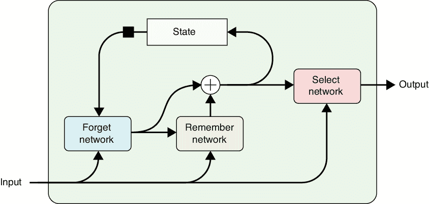

图 19-14：长短期记忆（LSTM）的框图

LSTM 使用三个内部神经网络。第一个用来移除（或忘记）不再需要的状态信息。第二个用来插入单元想要记住的新信息。第三个网络将内部状态的一个版本作为单元的输出。

约定俗成地，“忘记”一个数字意味着将其移向零，而记住一个新数字则意味着将其添加到状态记忆的适当位置。

LSTM 不需要像图 19-11 中的基本递归单元那样重复自身，因此它避免了梯度消失和梯度爆炸的问题。我们可以将这个 LSTM 单元放在一个层上，并使用常规的反向传播和优化方法训练其中的神经网络。实际的实现有许多细节在这里没有展开，但它们遵循这个一般流程（Hochreiter et al. 2001; Olah 2015）。

LSTM 已被证明是一种非常好的递归单元实现方式，因此当人们提到“RNN”时，通常指的是特别使用 LSTM 的网络。LSTM 的一个常见变体是*门控递归单元*（GRU）。在网络中尝试 LSTM 和 GRU，看看哪个在特定任务上表现更好，这并不罕见。

## 使用递归神经网络

构建一个包含递归单元的网络（无论是 LSTM、GRU 还是其他类型）很容易。我们只需在网络中添加一个递归层并像往常一样进行训练。

### 使用太阳黑子数据

让我们用太阳黑子数据来演示这个。我们将训练一个网络，该网络具有一个包含单个 LSTM 的递归层，LSTM 的隐藏状态中只有三个值，如图 19-15 所示（本书中的约定是，除非另有说明，否则递归单元是 LSTM）。让我们将其与我们旧的全连接网络的输出进行比较，该网络有五个神经元，显示在图 19-1 中。我们必须小心比较苹果和橙子，因为这些方法如此不同，但两个网络都尽可能小，并且仍能做一些有用的事情。

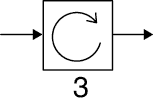

图 19-15：由单个 LSTM 组成的微型 RNN，其隐藏状态中有三个值

和之前一样，我们将使用从训练数据中提取的五个连续值进行训练。与一次性接收所有五个值的全连接层不同，RNN 在五个连续步骤中每次接收一个值。结果如图 19-16 所示。记住我们关于苹果和橙子的警告，这个小型 RNN 的结果看起来与我们全连接网络的结果非常相似，后者的结果显示在图 19-5 中（在训练过程中测量的损失值和总体误差也大致相同）。

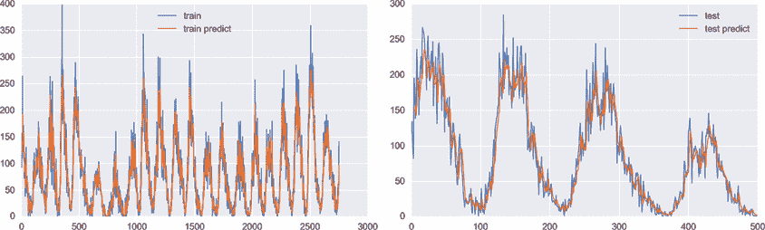

图 19-16：使用图 19-15 中的微型 RNN 预测太阳黑子数据

### 生成文本

上一次的结果令人鼓舞，所以让我们尝试下一个挑战，使用 RNN 生成文本。与之前预测下一个单词不同，这次我们将给系统一个字母序列，并要求它预测下一个字母。如前所述，这是一个更简单的任务，因为字母比单词少得多。我们将使用标准英文键盘上的 89 个符号作为我们的字符集。幸运的话，使用字符可能让我们避免使用比基于单词的方法更大的网络。

让我们在从《福尔摩斯短篇故事集》收集的字符序列上训练我们的 RNN，并要求它预测下一个字符（Doyle 1892）。

训练 RNN 需要权衡。我们可以使用更多的单元，或在每个单元中使用更多的状态，但这些都需要时间或内存。较大的网络可以让我们处理更长的窗口，这可能会导致更好的预测。另一方面，使用更少、更小的单元和较小的窗口使系统更快，这样我们就可以在给定时间内运行更多的训练样本。像往常一样，任何系统和数据的最佳选择都需要一些实验。

经过一些试验和错误后，我们最终选择了图 19-17 中的网络。这个网络肯定可以进一步改进，但它足够小，并且在本讨论中已经能很好地工作。我们的输入窗口长 40 个字符。每个 LSTM 单元包含 128 个状态记忆元素。最终的全连接层有 89 个输出，每个输出对应一个可能的符号。最后全连接层后的一个小框是我们在本章（以及第二十章）中对 softmax 激活函数的简写。因此，这个网络的输出是一个包含 89 个概率值的列表，每个值对应一个可能的字符。每次我们都会选择最有可能的字符。

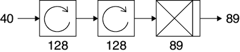

图 19-17：一个用于逐字符处理文本的小型 RNN

为了创建训练集，我们将原始源材料切分成约 50 万个重叠的 40 字符字符串，每隔三个字符开始一次。

训练完成后，我们可以通过自回归生成新的文本，每次通过将最后一个输出添加到前一个输入的末尾，并丢弃前一个输入的第一个字符来生成新的 40 字符输入（Chen 等人，2017）。我们可以根据需要重复这个过程。 图 19-18 展示了一个四字符窗口的自回归过程。

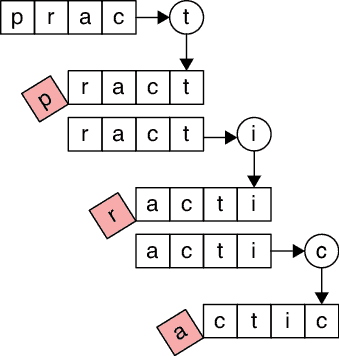

图 19-18：使用自回归逐字符生成文本

为了观察网络的进展，在每个 epoch 的训练后，我们使用当前网络生成了一些文本。我们从源材料中的一个随机位置开始，选取 40 个连续字符作为种子。自回归的一个优点是我们可以一直运行它，生成无限量的输出。以下是经过第一次 epoch 训练后的运行开始（种子以红色显示）：

> er price.” “If he waits a little longer wew fet ius ofuthe henss lollinod fo snof thasle, anwt wh alm mo gparg lests and and metd tingen, at uf tor alkibto-Panurs the titningly ad saind soot on ourne” Fy til, Min, bals’ thid the

从某种意义上说，这已经非常不错了。这些“单词”大致相当于英语单词的长度，尽管它们不是实际的单词，但它们可能是。也就是说，它们不是随机字符的组合。它们中的许多甚至可以轻松发音。而且这只是经过一次 epoch 的结果。经过 50 次 epoch，效果有了很大改善。以下是根据一个新的随机种子生成的一些输出。

> nt blood to the face, and no man could hardly question off his pockets of trainer, that name to say, yisligman, and to say I am two out of them, with a second. “I conturred these cause they not you means to know hurried at your little platter.’ “‘Why shoubing, you shout it of them,” Treating, I found this step-was another write so put.” “Excellent!” Holmes to be so lad, reached.

哇，情况好多了。这些单词大多数是真实的。标点符号也很好。甚至有些不在字典中的单词，比如 conturred 和 shoubing，看起来也像是可能存在的单词。

请记住，系统完全不知道单词是什么。它只知道字母跟随其他字母序列的概率。对于这样一个简单的网络来说，这非常了不起。通过让它运行，我们可以生成任意数量的文本。它不会变得更加连贯，但也不会变得更加不连贯。

一个更大的模型，包含更大的 LSTM、更高的数量，或者两者兼有，将以更长的训练时间为代价，给我们带来更可信的结果（Karpathy 2015）。

### 不同的架构

我们可以将递归单元（recurrent cells）整合到其他类型的网络中，从而扩展我们已经见过的一些网络类型的功能。我们还可以将多个递归单元组合起来，执行超出任何单个单元能完成的序列操作。让我们来看几个例子。

#### CNN-LSTM 网络

我们可以将 LSTM 单元与 CNN 混合，创建一种混合网络，叫做 *CNN-LSTM 网络*。这对于分类视频帧等任务非常有效。卷积层负责查找和识别物体，而紧随其后的递归层则负责跟踪物体如何从一帧移动到另一帧。

#### 深度 RNN

使用递归单元的另一种方法是将它们按顺序堆叠起来。我们称结果为 *深度 RNN*。我们只是将一层中单元的输出作为下一层单元的输入。图 19-19 展示了三层的连接方式，分别以卷起和展开的形式绘制。像往常一样，每一层的 RNN 单元都有自己的内部权重和隐藏状态。

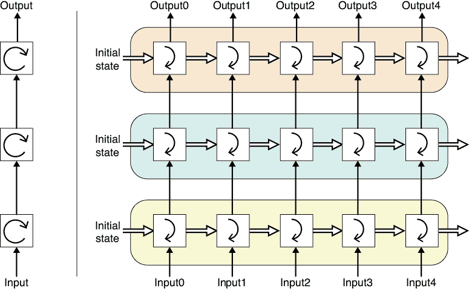

图 19-19：深度 RNN。左：使用我们图标的网络。右：未展开形式的各层。

这种架构的吸引力在于，每个 RNN 都可以针对特定任务进行专业化。例如，在图 19-19 中，第一层可能将输入句子翻译成一个抽象的、通用的语言，第二层可能重新表述它以改变语气，第三层则可能将其翻译成另一种目标语言。通过单独训练每个 LSTM，我们可以获得专业化的优势，比如能够独立更新或改进每一层。如果我们用另一个 LSTM 层替换其中一个，我们需要对整个网络进行一些额外的训练，以确保各层协同工作顺畅。

#### 双向 RNN

让我们回到翻译问题，并考虑这个问题有多么困难。拿句子“我看到了热狗火车”来说。我们至少可以找到六种不同的解释方式（目睹一只温暖的狗做锻炼、一只迷人的狗、一根香肠，或目睹一辆火车拉着这些三种东西中的每一种）。有些解释比其他的更荒谬，但它们都是有效的。当我们翻译时，应该选择哪一种呢？

另一个著名的句子是：“I saw the man on the hill in Texas with the telescope at noon on Monday”（我在星期一中午在德克萨斯州用望远镜看到山丘上的那个男人），它有 132 种不同的解释（Mooney 2019）。除了单词本身外，语调的变化也会对意思产生巨大影响。通过强调“I didn’t say he stole the money”（我没说他偷了钱）中的每个词，我们可以产生七种完全不同的意思（Bryant 2019）。语言的歧义性在 Groucho Marx 在电影*Animal Crackers*中的经典台词中得到了体现：“One morning I shot an elephant in my pajamas. How he got into my pajamas, I’ll never know”（有一天早上，我穿着睡衣射杀了一只大象。它是怎么进我的睡衣的，我永远也不知道）(Heerman 1930)。

处理所有这些复杂性的一个方法是，在翻译句子时考虑句子中的多个词，而不是一个一个词地翻译。例如，考虑这些句子：I cast my fate to the wind（我把命运交给了风），The cast on my arm is heavy（我手臂上的石膏很重），The cast of the play is all here（话剧的演员阵容都在这里）。这些句子说明了英语单词“cast”是一个同形异义词，或者说是一个具有不同含义的词。语言学家称之为*多义性*，这是许多语言的一个特征（Vicente 和 Falkum 2017）。我们的三个含有“cast”的句子分别翻译成葡萄牙语是：Eu lancei meu destino ao vento（我把命运交给了风），O gesso no meu braço é pesado（我手臂上的石膏很重），和 O elenco da peça está todo aqui（话剧的演员阵容都在这里）。其中，“cast”分别翻译成了 lancei、gesso 和 elenco（Google 2020）。在这些例子中，选择合适的葡萄牙语单词的方法是，除了了解“cast”前面的词外，还需要知道它后面的词。

如果我们在实时翻译，那么仅凭目前听到的词，我们可能无法确定使用哪个翻译。在这种情况下，我们能做的就是猜测，或者等待更多的词汇到来，然后试着赶上。但如果我们在翻译整句，比如在翻译一本书或故事时，我们已经可以访问所有的词汇。

句子中后面的词语的一种使用方式是将这些词倒序输入到我们的 RNN 中，例如：wind the to fate my cast I。但这通常不能解决问题，因为有时我们也可能需要前面的词。我们真正需要的是能够同时访问前后的词语。

我们可以通过现有的工具和一点巧妙的方法来实现这一点，即创建两个独立的 RNN。第一个按自然顺序接收词语，第二个按倒序接收词语，如图 19-20 所示。我们称之为*双向 RNN*，或*双 RNN*（Schuster 和 Paliwal 1997）。

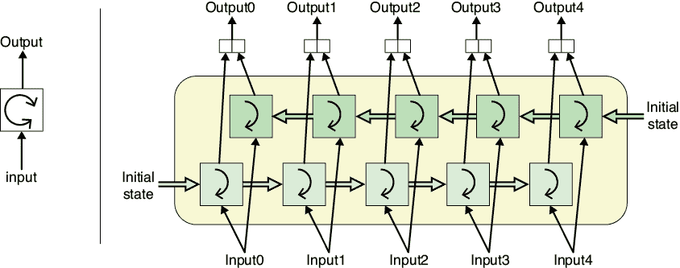

图 19-20：双向 RNN，或双 RNN。左：我们为这一层设计的图标。右：展开的双 RNN 图示。

在图 19-20 中，我们将句子同时输入到前向顺序的下部递归单元和反向顺序的上部递归单元。也就是说，我们在将输入 0 给下部单元的同时，将输入 4 给上部单元。接着我们将输入 1 给下部单元，同时将输入 3 给上部单元，依此类推。所有单词处理完成后，每个递归单元将为每个单词生成一个输出。我们只需将这些输出连接起来，这就是双向 RNN 的输出。

我们可以堆叠多个双向 RNN，形成*深度双向 RNN*。图 19-21 展示了一个包含三层双向 RNN 的网络。左侧是我们为该层绘制的示意图，右侧是每一层展开后的形式。在这个图中，我们有三层，每层包含两个独立的递归单元。

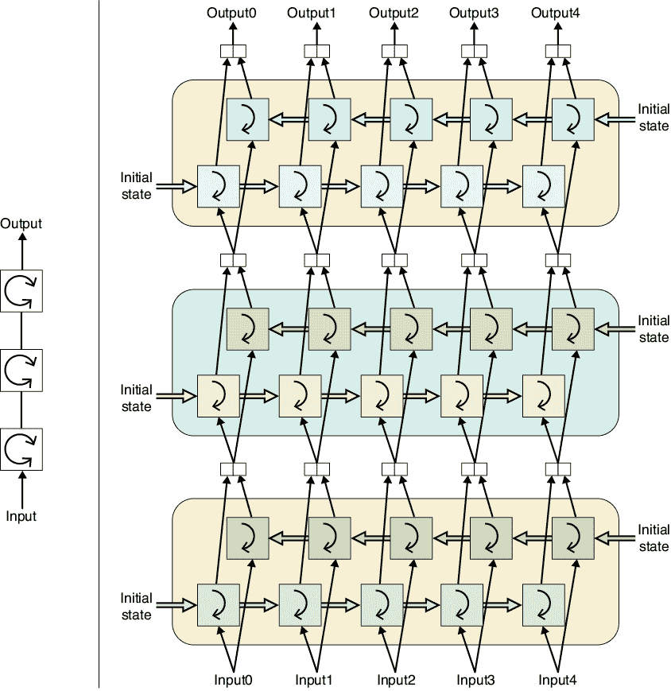

图 19-21：一个深度双向 RNN。左侧：使用我们标注的框图。右侧：一个展开的深度双向 RNN。

和之前一样，这里的一部分价值在于，每个双向 RNN 可以为不同的任务独立训练，如果我们找到（或训练）另一个表现更好的双向 RNN，可以将其替换进来。

## Seq2Seq

任何翻译系统面临的挑战之一是不同语言使用不同的词序。一个经典的例子是，在英语中，形容词通常位于名词之前，而在法语中情况则不那么简单。例如，“I love my big friendly dog”翻译成法语为“J’adore mon gros chien amical”，其中“chien”对应“dog”，但形容词“gros”和“amical”分别对应“big”和“friendly”，却位于名词的两侧。

这表明，与其一次翻译一个单词，不如翻译整句话。当输入和输出句子的长度不同的时候，这种方法显得更为合理。例如，五个单词的英文句子“My dog is eating dinner”在葡萄牙语中只需四个单词：“Meu cachorro está jantando”，而在苏格兰盖尔语中则需要六个单词：“Tha mo chù ag ithe dinnear”（Google 2020）。

因此，与其逐个词地翻译，不如将完整的序列转化为另一个完整的序列，可能长度不同。一个常用的算法，用于将一个完整序列转换为另一个序列，称为*seq2seq*（“sequence to sequence”的缩写）（Sutskever, Vinyals, 和 Le 2014）。

seq2seq 的关键思想是使用两个 RNN，我们将其视为*编码器*和*解码器*。让我们看看训练完成后系统是如何工作的。我们按常规将输入数据喂给编码器，一次输入一个单词，但我们忽略其输出。当整个输入处理完毕后，我们将编码器的最终隐藏状态交给解码器。解码器使用编码器的最终隐藏状态作为自己的初始隐藏状态，并通过自回归生成输出序列。图 19-22 展示了这一思想。

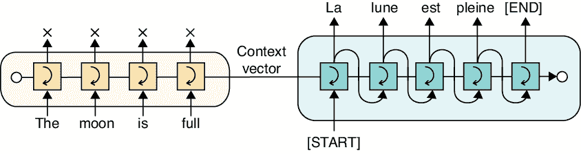

图 19-22：seq2seq 的架构。左侧是编码器，处理输入并将其隐藏状态发送给右侧的解码器，解码器生成输出。

在图 19-22 中，我们通过将每个解码器步骤的输出作为输入喂给下一个解码器，明确展示了自回归步骤。如果编码器-解码器结构看起来很熟悉，那是因为它与我们在第十八章看到的自编码器的基本结构相同。在这种用法中，我们之前称为潜在向量的部分现在被称为 *上下文向量*。

让我们更仔细地看看这两个 RNN 以及它们如何翻译一个句子。

编码器从其隐藏状态设置为某个初始值开始，比如全零。它处理第一个词，更新其隐藏状态，并计算一个输出值。我们简单地忽略输出值。我们关心的唯一事情是编码器内隐藏状态的变化。

当最后一个词被处理完后，编码器的隐藏状态将用于初始化解码器的隐藏状态。

像任何 RNN 一样，解码器需要输入。按照惯例，我们给解码器一个特殊的开始标记。这个标记可以用任何我们喜欢的方式书写，只要它明显是特殊的，并且不属于输入或输出的正常词汇。常见的惯例是将其大写并放在方括号或尖括号中，例如 `[START]`。像我们词汇表中的所有词一样，这个特殊标记也有一个独特的编号。

现在解码器有了输入，它更新其隐藏状态（最初是编码器的最终隐藏状态），并生成一个输出值。我们确实关注这个输出，因为它是我们翻译的第一个词。

现在我们使用自回归来完成其余的翻译。解码器将前一个输出词作为输入，更新其隐藏状态，并生成新的输出。这一过程会持续，直到解码器决定没有更多的词需要生成。它通过生成另一个特殊标记（例如 `[END]`）来标记这一点，然后停止。

我们训练了一个 seq2seq 模型，将英文翻译成荷兰语（Hughes 2020）。这两个 RNN 的状态中各有 1,024 个元素。训练数据包含大约 50,000 个荷兰语句子，以及它们的英文翻译（Kelly 2020）。我们使用了大约 40,000 个句子进行训练，其余的用于测试。我们训练了十个周期。在接下来的两个例子中，我们提供了一个英文句子，seq2seq 提供的荷兰语翻译，以及谷歌翻译将荷兰语翻译回英文的结果。

1.  你知道现在几点了吗

1.  您知道现在几点了吗

1.  你知道现在几点了吗

1.  我喜欢弹钢琴

1.  我喜欢弹钢琴

1.  我喜欢弹钢琴

对于如此小的网络和训练集，这些结果相当不错！另一方面，当输入变得更加复杂时，我们的小模型表现得不太好，正如这个输入输出集合所示：

1.  约翰告诉萨姆，他的老板说如果他加班，他们会给他奖金

1.  hij nodig had hij een nieuw hij te helpen

1.  他需要一个新的他帮助

seq2seq 方法有很多优点。它在概念上很简单，在许多情况下都能很好地工作，并且在现代库中实现起来很容易（Chollet 2017；Robertson 2017）。但是，seq2seq 存在一个内在的限制，即上下文向量。这只是编码器在处理完最后一个单词后的隐藏状态，因此它是固定的、有限的大小。这个向量必须包含关于句子的一切，因为它是解码器所获得的唯一信息。

如果我们给编码器一个句子，开始是“桌子有四条坚固的腿”，那么我们可以想象，合理的记忆量能够保留足够的关于序列中每个单词的信息，记得我们在谈论一张桌子，且下一个单词应该是“腿”。但是，无论我们给编码器的隐藏状态多么大，我们总是可以构造一个比它能记住的内容更长的句子。例如，假设我们的句子是：“桌子，尽管经历了所有长距离的移动，书本掉到上面，孩子们全速撞向它，作为堡垒、阶梯和门挡等多重功能，它仍然有四条坚固的腿。”下一个单词应该仍然是“腿”，但我们的隐藏状态需要变得更大，才能记住足够的信息来理解这一点。

无论我们的隐藏状态有多大，一个更长的句子总是会出现，并且需要比我们拥有的更多的记忆。这就是所谓的*长期依赖问题*（Hochreiter et al. 2001；Olah 2015）。图 19-23 展示了一个展开的 seq2seq 图，其中输入包含许多单词（Karim 2019）。一个能够记住所有这些信息的上下文向量需要很大，且每个 RNN 中必须有相应的大型神经网络来管理和控制它。

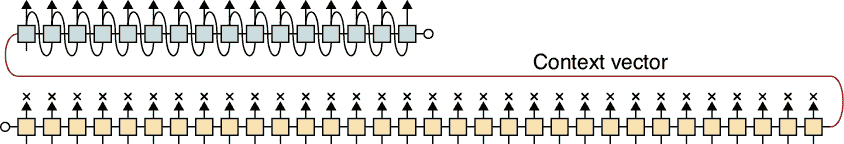

图 19-23：在将非常长的输入句子发送到解码器之前进行编码

或许依赖于单一的上下文向量来表示输入中每个有用的信息并不是最好的做法。seq2seq 架构忽略了编码器的所有隐藏状态，除了最后一个。对于长输入，这些中间的隐藏状态可能包含的信息会在我们到达句子结尾时被遗忘。

依赖单一的上下文向量并且需要一次训练一个单词，对于 RNN 架构来说是一个很大的问题。尽管它们在许多应用中非常有用，但这些都是严重的缺点。

尽管存在这些问题，RNN 仍然是处理序列的一种流行方式，尤其是当序列不太长时。

## 摘要

在这一章中，我们已经讨论了很多关于处理语言和序列的内容。我们看到我们可以用全连接层预测序列中的下一个元素，但它们存在问题，因为没有输入的记忆。我们还看到了如何使用带有局部或隐藏记忆的递归单元来保持它们在一个上下文向量中看到的一切，并随着每个输入的变化进行修改。

我们看了一些使用 RNN 的例子，然后学习了如何使用两个 RNN 构建一个名为 seq2seq 的翻译器。虽然 seq2seq 简单且能做得很好，但它有两个常见于大多数 RNN 系统的缺点。例如，该系统依赖于一个上下文向量来携带关于句子的所有信息。第二，网络需要逐个单词进行训练。

尽管存在这些问题，RNN 仍然是处理任何类型序列数据的流行且强大的工具，从语言到地震数据、歌曲歌词和病历等。

在下一章，我们将探讨另一种处理序列的方法，它避免了 RNN 的局限性。
