# 第二十章：注意力和变换器

在第十九章中，我们探讨了如何使用 RNN 处理序列数据。尽管 RNN 非常强大，但也有一些缺点。因为所有关于输入的信息都通过一个单一的状态记忆（或上下文向量）来表示，每个递归单元内部的网络需要努力将所有必要的信息压缩到有限的空间中。而且，无论我们将状态记忆做得多大，总会遇到超出记忆容量的输入，因此总有一些信息会丢失。

另一个问题是，RNN 必须一次处理一个词。这可能是一种较慢的工作方式，尤其是在处理大型数据库时。

一种替代方法基于一个叫做*注意力网络*的小型网络，这种网络没有状态记忆，可以并行训练和使用。注意力网络可以组合成更大的结构，叫做*变换器*（transformers），这些变换器能够作为语言模型执行像翻译这样的任务。变换器的构建模块可以用于其他架构，提供更强大的语言模型，包括生成器。

在本章中，我们首先介绍了一种更强大的方式来表示词汇，而不是将其作为单一数字，然后逐步构建我们的注意力机制和使用变换器模块执行多种自然语言处理任务的现代架构。

## 嵌入

在第十九章中，我们承诺将我们的词汇描述提升到不仅仅是一个数字的层次。这一变化的价值在于它让我们可以以有意义的方式操作词汇的表示。例如，我们可以找到一个与另一个词相似的词，或者我们可以将两个词融合，找到它们之间的一个词。这个概念是发展注意力机制以及后续变换器（transformer）的关键。

这种技术称为*词嵌入*（或者当我们应用于更一般的标记概念时，称为*标记嵌入*）。这个概念有点抽象，所以让我们先通过一个具体的例子来看一下这些想法。

假设你在一部电影中担任动物驯养员，而导演脾气暴躁。今天你正在拍摄一个场景，其中人类英雄被一些动物追赶。导演要求你提供一个可以在数量上满足需求的动物列表，用来拍摄一个令人害怕的追逐场面。你打电话给办公室，他们准备了这个列表，并且将这些动物安排成一张图表，水平轴代表每种成年动物的平均最高速度，垂直轴代表其平均体重，如图 20-1 所示。

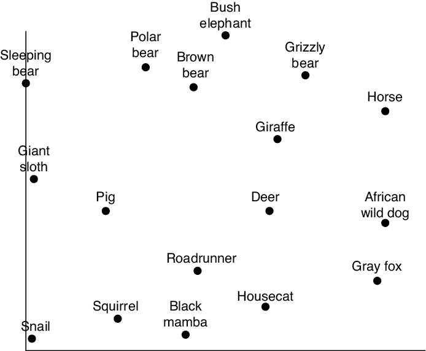

图 20-1：一组动物，按照地面速度大致水平排列，成年体重垂直排列，尽管这些轴标签没有显示（数据来源：Reisner 2020）

但是，由于打印错误，你的办公室发给你的图表缺少了轴标签，所以你手上有一张二维图表，动物们被排列在其中，但你不知道这些轴代表什么。

导演甚至没有看图表。“马，”她说，“我想要马。它们正是我想要的，完美无缺，别的都不行。”于是你带来了马，它们开始排练场景。

不幸的是，导演不满意。“不，不，不！”她说。“这些马太过敏捷和迅速，像狐狸一样。给我一些不那么像狐狸的马。”

你怎么可能满足这个要求呢？这到底是什么意思？幸运的是，你可以按照她的要求，利用图表通过组合箭头来实现。

你只需要做两件事：加箭头和减箭头。要将箭头 B 加到箭头 A 上，把 B 的尾部放到 A 的头部。新的箭头 A + B 从 A 的尾部开始，到 B 的头部结束，如图 20-2 中间所示。

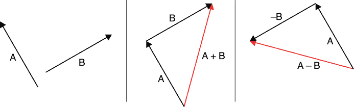

图 20-2：箭头运算。左：两个箭头。中：和 A + B。右：差 A – B。

要从 A 中减去 B，只需将 B 逆时针旋转 180 度，变成–B，然后将 A 和–B 加在一起。结果，A – B，从 A 的尾部开始，到–B 的头部结束，如图 20-2 右侧所示。

现在你可以满足导演移除马身上狐狸特征的要求。首先，从图表的左下角画一支箭头指向马，再画一支箭头指向狐狸，如图 20-3 左侧所示。

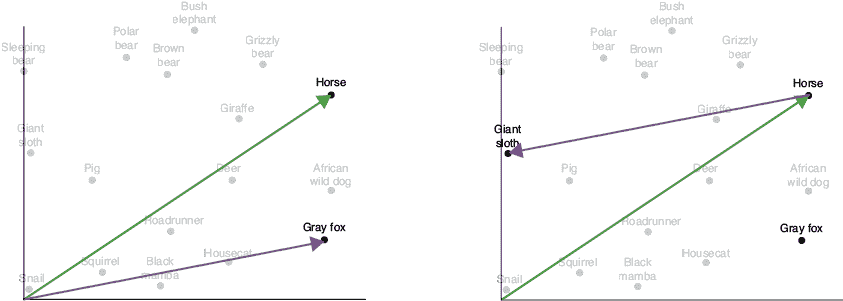

图 20-3：左：从左下角到马和狐狸的箭头。右：从马中减去狐狸得到一只巨大的树懒。

现在按照要求从马中减去狐狸，方法是将狐狸箭头从马箭头中减去。按照图 20-2 的规则，这意味着将狐狸箭头翻转并将其尾部放在马箭头的头部。我们得到图 20-3 的右侧。

一只巨大的树懒。好吧，导演想要的就是这个。我们甚至可以像做一些小算术一样写出这个：马 – 狐狸 = 巨大树懒（至少根据我们的图示来说）。

导演把她的拿铁扔到地上。“不不不！当然，树懒看起来很好，但它们几乎不动！让它们更快！给我像路跑鸟一样快的树懒！”

现在我们知道如何满足这个荒谬的要求：找到从左下角到路跑鸟的箭头，如图 20-4 左侧所示，并将其添加到指向树懒的箭头的头部，就得到了一只棕熊。也就是说，马 – 狐狸 + 路跑鸟 = 棕熊，如图 20-4 右侧所示。

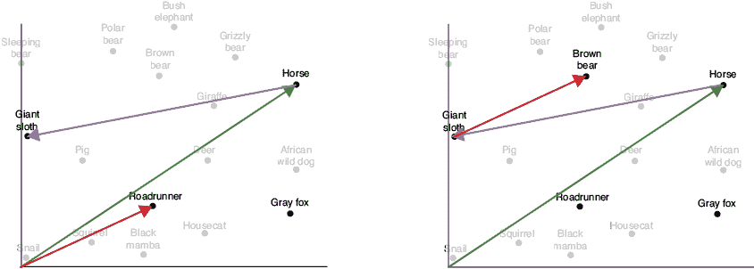

图 20-4：左：我们可以画一个指向路跑鸟的箭头。右：巨大的树懒 + 路跑鸟 = 棕熊。

你给导演提供了一组棕熊（称为*棕熊群*）。导演翻了个白眼。“终于，像马一样快，但不像狐狸那么敏捷，像路跑鸟一样迅速。这正是我最初要求的。”他们用熊拍摄了追逐场景，电影后来获得了广泛好评。

这个故事有两个关键要素。第一个是，我们图表中的动物虽然我们不知道它们的排列方式或坐标轴代表什么数据，但它们的布局非常有用。

第二个关键点是，最终我们发现其实不需要坐标轴标签。我们仅通过添加和减去指向图表中元素的箭头，就能在图表中导航。也就是说，我们没有尝试找到一匹“较慢的马”。相反，我们直接与动物本身进行操作，它们的各种属性隐式地随之而来。将狐狸的快速特性移除后，结合像马这样的大动物，我们得到了一只又大又慢的动物。

这和语言处理有什么关系呢？

### 嵌入词

为了将我们刚才看到的应用到词汇上，我们将动物替换为词语。并且，不仅仅使用两个坐标轴，我们将在一个拥有数百维的空间中放置这些词语。

我们通过一个算法来实现这一点，算法会自动确定这个空间中每个坐标轴应该代表什么，并将每个词放置在适当的位置。算法并不是为每个词分配一个单一的数字，而是为词分配一个数字列表，表示它在这个庞大空间中的坐标。

这个算法被称为*嵌入器*，我们说这个过程是*将词嵌入*到*嵌入空间*中，从而创造出*词嵌入*。

嵌入器会自动确定如何构造空间，并找出每个词的坐标，使得相似的词靠得更近。例如，如果它看到很多以“I just drank some”开头的句子，那么接下来出现的任何名词都会被理解为某种饮品，并被放置在其他饮品附近。如果它看到“I just ate a red”这样的句子，那么接下来出现的任何词都会被理解为红色且可食用的东西，并被放置在其他红色和其他可食用的物体附近。对于其他数十种甚至数百种关系，不管是显而易见的还是微妙的，情况也一样。由于空间有许多维度，并且坐标轴可以有任意复杂的含义，词汇可以同时属于许多不同的群体，基于看似不相关的特征。

这个概念既抽象又强大，所以让我们通过一些实际例子来说明它。我们尝试了一些“词汇算术”表达式，使用的是一个预训练的词嵌入，其中包含 684,754 个词，保存在一个 300 维的空间中（spaCy authors 2020）。我们的第一个测试是一个著名的例子：king – man + woman（El Boukkouri 2018）。系统返回了 queen 作为最可能的结果，这很有道理：我们可以想象，嵌入器在一个坐标轴上捕捉到了贵族的概念，在另一个坐标轴上捕捉到了性别的差异。其他测试结果也很接近，但并不完美。例如，lemon – yellow + green 返回了 ginger 作为最佳匹配，但预期的 lime 也排在第五近的词汇。类似地，trumpet – valves + slide 返回了 saxophone 作为最可能的结果，但预期的 trombone 排在了第一位的候选。

训练一个嵌入模型在一个拥有数百（甚至数千）维度的空间中的美妙之处在于，它能够比任何人更高效地利用这个空间，从而使其能够同时表示大量的关系。

我们刚刚看到的词汇算式是嵌入空间的一个有趣示范，但它也使我们能够有意义地对词汇进行操作，比如比较、缩放和加法，这些操作对于本章的算法都非常重要。

一旦我们拥有了词嵌入，将它们整合到几乎任何网络中都变得容易。我们不是为每个词分配一个单独的整数，而是分配词嵌入，它是一个数字列表。因此，系统处理的不是零维张量（单一数字），而是一维张量（数字列表）。

这巧妙地解决了我们在第十九章看到的问题，即那些与目标接近但不完全正确的预测往往给我们带来无意义的结果。现在我们能够容忍一些不精确的情况，因为相似的词汇被嵌入在彼此接近的位置。例如，我们可能会给语言模型输入短语“巨龙逼近并发出一声响亮的”，期望下一个词是 roar。算法可能会预测出一个接近 roar 的张量，但不完全相同，而给出 bellow 或 blast。我们大概率不会得到一个完全无关的词汇，如 daffodil。

图 20-5 展示了我们提供给标准词嵌入模型的六组四个相关词汇。任何两个词嵌入的相似度越高，这对词汇的得分就越高，因此它们的交集看起来越暗。图形在从左上到右下的对角线两侧对称，因为我们比较词汇的顺序并不重要。

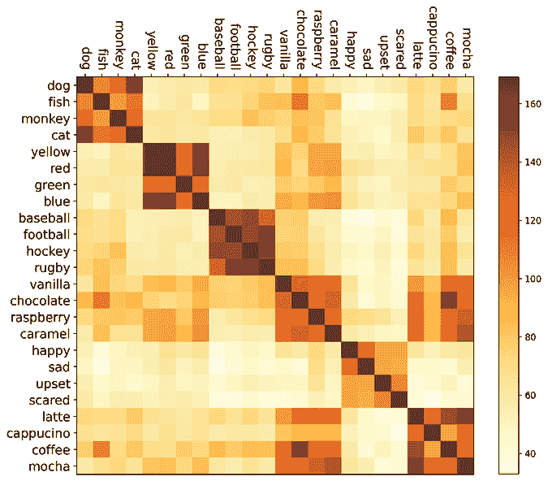

图 20-5：通过比较词嵌入的相似性来比较词对。

我们可以从图 20-5 看到，每个词与自身的匹配度最高，同时也比与不相关的词汇匹配得更强。由于我们将相关的词汇并排放置，图形显示它们的相似度为小块。然而，也有一些奇特之处。例如，为什么 fish 与 chocolate 和 coffee 的匹配度比平均值更高？又为什么 blue 与 caramel 的得分较高？这些可能是由于这个嵌入模型使用的特定训练数据所导致的伪影。

咖啡饮品和口味之间的得分相对较高，也许是因为人们会用这些口味的糖浆来调味咖啡饮品。颜色和口味之间也隐约存在一些关系。

许多预训练的词嵌入器可以免费获得，并且可以轻松下载到几乎任何库中。我们可以简单地导入它们，立即获得任何单词的向量。GLoVe（Mikolov 等，2013a；Mikolov 等，2013b）和 word2vec（Pennington、Socher 和 Manning，2014）嵌入在许多项目中得到应用。较新的 fastText（Facebook 开源，2020）项目提供了 157 种语言的嵌入向量。

我们还可以对整个句子进行嵌入，这样我们就可以整体比较句子，而不是逐词比较（Cer 等，2018）。图 20-6 展示了对 12 个句子（TensorFlow，2018）的嵌入比较。在本书中，我们将重点讨论词嵌入，而不是句子嵌入。

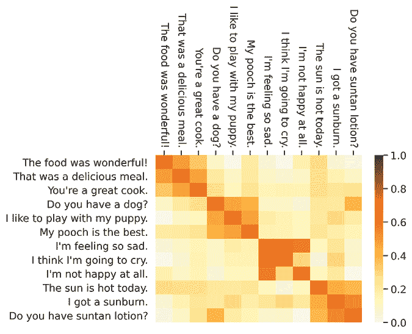

图 20-6：比较句子嵌入。分数越大，表示句子之间的相似度越高。

### ELMo

词嵌入比为单词分配单个整数要更为先进。然而，即便词嵌入功能强大，我们之前描述的创建词嵌入的方法仍然存在一个问题：细微差别。

正如我们在第十九章看到的，许多语言中有些单词的意义不同，但书写和发音是相同的。如果我们想理解这些单词，就需要区分它们的不同含义。做到这一点的一种方法是为每个单词的每个含义分配一个独特的嵌入向量。例如，cupcake 只有一个意思，因此只有一个嵌入向量。但 train 则有两个嵌入向量，一个表示名词（例如，“我坐了一次火车”），另一个表示动词（例如，“我喜欢训练狗”）。这两个意思实际上是完全不同的概念，只是恰好使用了相同的字母序列。

这类词汇面临两个挑战。首先，我们必须为每个含义创建独特的嵌入向量。其次，当这些词作为输入时，我们必须选择正确的嵌入向量。解决这些问题需要我们考虑每个单词的上下文。第一个能够大规模处理这一问题的算法叫做*Embedding from Language Models*，但它更广为人知的是其友好的缩写*ELMo*（Peters 等，2018），它的名字来自儿童电视节目《芝麻街》中的一个木偶角色 Elmo。我们说 ELMo 生成了*上下文化的词嵌入*。

ELMo 的架构类似于我们在图 19-20 中看到的一对双向 RNN，但它的结构组织方式不同。在标准的双向 RNN 中，我们将两个朝相反方向运行的 RNN 相结合。

ELMo 对这一点进行了改变。虽然它使用两个正向 RNN 网络和两个反向 RNN 网络，它们按方向分组。每个组都是一个两层深的 RNN，就像我们在图 19-21 中看到的那样。ELMo 的架构如图 20-7 所示。通常，我们使用红色配色方案绘制 ELMo 的示意图，因为《芝麻街》中的 Elmo 是一个明亮的红色角色。

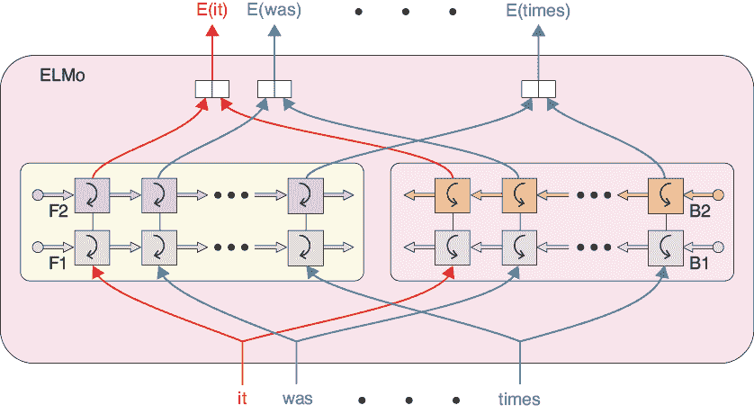

图 20-7：ELMo 展开后的结构。输入文本位于底部。每个输入元素的嵌入位于顶部。

这种架构意味着每个输入单词都会转化为两个新的张量，一个来自前向网络（标记为 F1 和 F2），考虑到前面的单词，另一个来自反向网络（标记为 B1 和 B2），考虑到后面的单词。通过将这些结果连接在一起，我们得到了一个上下文化的单词嵌入，这些嵌入受到句子中所有其他单词的影响。

训练版的 ELMo 可以在多个大小的版本中免费提供下载（Gluon 2020）。一旦我们拥有了预训练的 ELMo，它可以轻松地用于任何语言模型。我们将整个句子输入 ELMo，得到一个上下文化的单词嵌入，基于其上下文。

图 20-8 展示了四个句子使用“train”作为动词，四个句子使用“train”作为名词的情况。我们将这些句子提供给了一个在 10 亿单词的数据库上训练的标准 ELMo 模型，该模型将每个单词放入一个 1024 维的空间中（TensorFlow 2020a）。我们提取了 ELMo 在每个句子中“train”一词的嵌入，并将其与所有其他句子中“train”一词的嵌入进行比较。尽管该词在每个句子中的书写方式相同，ELMo 能够根据该词的上下文识别出正确的嵌入。

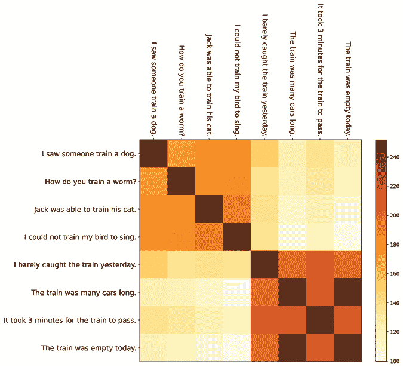

图 20-8：比较 ELMo 在不同句子中使用*train*时的嵌入。较深的颜色表示嵌入更相似。

我们通常将像 ELMo 这样的嵌入算法放置在深度学习系统中的单独层级。这通常是语言处理网络中的第一层。我们为嵌入算法设计的图标，如图 20-9 所示，旨在表示将单词的空间放入更大的嵌入空间中。

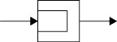

图 20-9：我们为嵌入层设计的图标

ELMo 和其他类似的算法，如*通用语言模型微调*（Universal Language Model Fine-Tuning，简称*ULMFiT*）（Howard 和 Ruder 2018），通常在通用数据库上进行训练，例如来自网页的书籍和文档。当我们需要它们来处理某些特定的下游任务时，如医学或法律应用，我们通常会用来自这些领域的额外示例对其进行微调。结果是，一组嵌入包含了这些领域的专业语言，按其在该术语中的特殊含义进行聚类。

我们将在本章稍后的系统构建中使用嵌入。这些网络将依赖于注意力机制，因此让我们现在来看一下这个机制。

## 注意力

在第十九章中，我们看到如何通过考虑句子中的所有单词来改善翻译。但当我们翻译一个特定的单词时，句子中的每个单词并不是同等重要的，甚至有些单词可能与之无关。

例如，假设我们在翻译句子“I saw a big dog eat his dinner”（我看到一只大狗吃晚餐）时。在翻译“dog”时，我们可能不关心单词“saw”，但要正确翻译代词“his”可能需要我们将其与“大狗”这两个词联系起来。

如果我们能够为输入中的每个单词找出哪些其他单词能够影响我们的翻译，那么我们就可以只关注那些单词，忽略其他单词。这将大大节省内存和计算时间。而且，如果我们能够以一种不依赖于串行处理单词的方式来实现这一点，我们甚至可以并行处理。

执行这一任务的算法叫做*注意力*或*自注意力*（Bahdanau, Cho, 和 Bengio 2016；Sutskever, Vinyals, 和 Le 2014；Cho 等人 2014）。注意力机制使我们能够将资源集中在输入中重要的部分。

现代的注意力机制通常基于一种名为*查询、键、值*（*QKV*）的技术。这些术语来自数据库领域，在这个背景下可能显得有些晦涩。因此，我们将使用一组不同的术语来描述这些概念，并最终将其与查询、键和值连接起来。

### 一个激发思考的类比

让我们从一个类比开始。假设你需要购买一些油漆，但你得到的唯一信息是颜色应该是“浅黄色带有一点深橙色”。

在镇上唯一的油漆店里，唯一在职的店员刚刚加入油漆部门，对颜色不太熟悉。你们都假设你需要将几种标准油漆混合起来以得到你想要的颜色，但你不知道该选择哪些油漆，也不知道每种油漆的用量。

店员建议你将你想要的颜色描述与每个油漆罐上的颜色名称进行比较。有些名称可能比其他名称匹配得更好。店员在一个空油漆罐上放了一个漏斗，并建议你根据每个油漆罐名称与描述的匹配度，将不同的油漆倒入漏斗中。也就是说，你将把你想要的描述“浅黄色带有一点深橙色”与每个油漆罐标签上的内容进行比较，匹配度越好，你就倒入更多这种油漆。

图 20-10 通过六个油漆罐形象地展示了这个概念。它展示了油漆罐的名称以及每个名称与所需颜色描述的匹配度。我们得到了“阳光黄色”和“橙色粉碎”的不错匹配，尽管由于与“with”一词的匹配，稍微混入了一些“午餐配青绿色”。

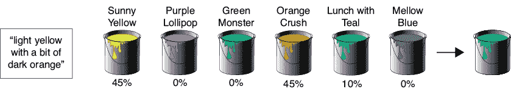

图 20-10：根据颜色描述（左），我们根据每个油漆罐名称与描述的匹配程度（中）来混合不同的油漆，最终得到结果（右）。

在这个故事中，有三件事需要关注。首先是你的*请求*：“浅黄色带有一点深橙色”。第二是每罐油漆上的*描述*，例如“阳光黄”或“温柔蓝”。第三是每罐油漆的*内容*，即罐内实际的油漆。在故事中，你将自己的请求与每罐油漆的描述进行比较，以了解它们的匹配度。匹配度越高，最终混合物中使用的该罐油漆的内容就越多。

这就是注意力机制的核心。给定一个请求，将其与每个可能项目的描述进行比较，并根据描述与请求的匹配程度，选择每个项目的一部分内容。

第一篇关于注意力机制的论文的作者将这一过程与数据库中常见的一种事务类型进行了比较。在数据库的术语中，我们通过向数据库发送*查询*来查找某个内容。在这样的过程中，数据库中的每个对象都有一个描述性的*键*，它可以与对象的实际*值*不同。请注意，这里所说的*值*指的是对象的内容，无论它是一个单一的数字，还是更复杂的东西，例如字符串或张量。

数据库系统将查询（或请求）与每个键（或描述）进行比较，并使用该得分来决定最终结果中包含多少对象的值（或内容）。因此，我们的请求、描述和内容对应于查询、键和值，或更常见的术语，QKV。

### 自注意力

图 20-11 以抽象形式展示了注意力机制的基本操作。这里有五个输入词。每个彩色框表示一个小型神经网络，该网络接收一个词的数值表示并将其转化为新的东西（通常这些网络每个只是一个单一的全连接层）。在这个例子中，词“dog”是我们想要翻译的词。所以，一个神经网络（红色）将“dog”的张量转换为一个新的张量，代表查询 Q。正如图中所示，另外两个小型神经网络将“dinner”的张量翻译成新的张量，分别对应其键 K（来自蓝色网络）和其值 V（来自绿色网络）。

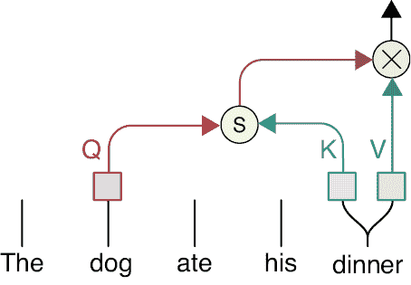

图 20-11：使用*dog*作为查询来确定单词*dinner*相关性的注意力核心步骤。每个框代表一个小型神经网络，它将输入转化为查询、键或值。

实际操作中，我们将“dog”的查询与句子中每个单词的键进行比较，包括“dog”本身。在这个例子中，我们只关注与“dinner”一词的比较。

我们比较查询和键，以确定它们的相似度。我们用一个小的评分函数来完成这一操作，函数表示为一个圆圈中的字母*S*。不深入讨论数学部分，这个函数比较两个张量并产生一个单一的数字。两个张量越相似，得出的数字就越大。评分函数通常设计为产生一个介于 0 和 1 之间的数字，较大的值表示更好的匹配。

我们使用评分函数的输出对表示晚餐的值的张量进行缩放。查询和键的匹配度越高，缩放步骤的输出越大，晚餐的值会更多地影响最终输出。

让我们看看当我们将这个基本步骤同时应用到输入中的所有单词时会是什么样子。我们将继续观察翻译单词 dog 的情况。总体结果是所有输入单词的单独缩放值的总和。图 20-12 展示了这种情况。

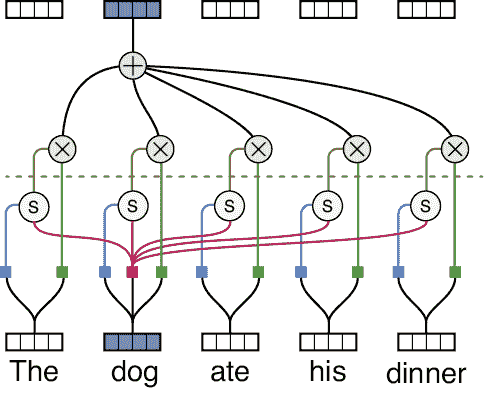

图 20-12：使用注意力机制同时确定句子中所有五个单词对单词*dog*的贡献。QKV 的空间和颜色编码与图 20-11 相匹配。图中的所有数据都朝上流动。

在图 20-12 中有几点需要注意。首先，只有三个神经网络参与——分别用于计算查询、键和值张量。我们使用相同的“输入到查询”网络（图中的红色部分）将每个输入转化为其查询，使用相同的“输入到键”网络（图中的蓝色部分）将每个输入转化为其键，使用相同的“输入到值”网络（图中的绿色部分）将每个输入转化为其值。我们只需要对每个单词应用一次这些转换。

第二，得分后和数值缩放前有一条虚线。这代表了对得分应用的 softmax 步骤，之后是一个除法操作。这两个操作可以防止得分的数值变得过大或过小。softmax 还会夸大相似项的影响。

第三，我们将所有的缩放值加起来，得到 dog 的新张量，其中包括 dog 本身的值。我们常发现每个单词与自己的得分最高。这并不是坏事，因为在这种情况下，翻译 dog 时最重要的单词确实是 dog 本身。但有时其他单词会更加重要。一些例子包括单词顺序改变、某个单词没有直接翻译且必须依赖其他单词，或者我们正在试图解析代词时。

第四个重要点是我们将图 20-12 中的处理同时应用到输入句子中的所有单词。也就是说，每个单词都被视为查询，整个过程独立地为该单词执行，如图 20-13 所示。

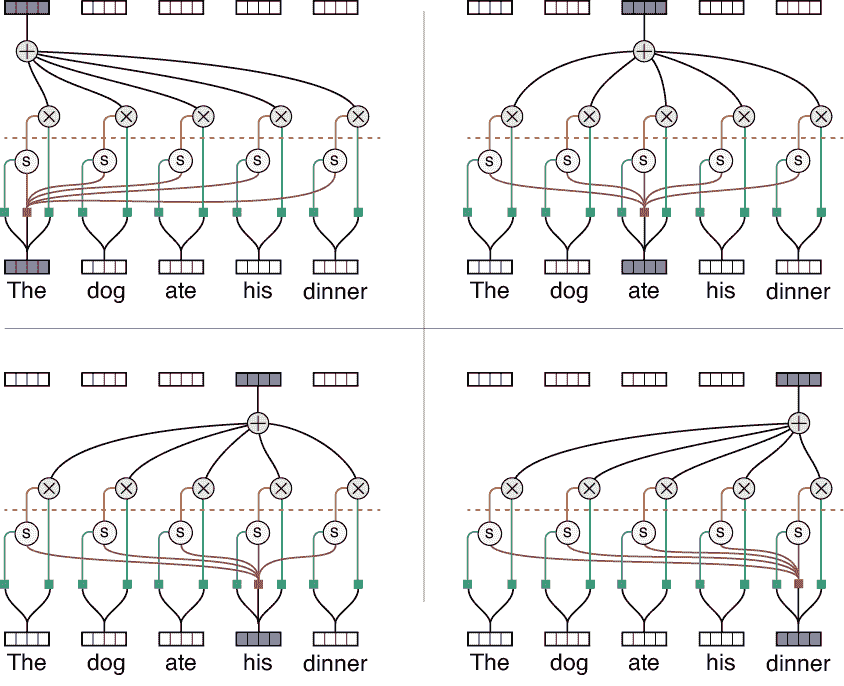

图 20-13：将注意力应用于句子中的其他四个单词

我们的第五个也是最后一个要点只是对我们一直在注意的一点进行明确的回顾：在图 20-12 和图 20-13 中的所有这些处理可以在四个步骤中并行完成，而不依赖于句子的长度。步骤 1 将输入转化为查询、键和值张量。步骤 2 对所有查询和键进行互相评分。步骤 3 使用这些评分来缩放值，步骤 4 将缩放后的值相加，生成每个输入的新输出。

这些步骤都不依赖于输入的长度，因此我们可以在与短句子相同的时间内处理长句子，只要我们拥有所需的内存和计算能力。

我们称图 20-12 和图 20-13 的过程为*自注意力*，因为注意力机制使用相同的输入集来计算所有内容：查询、键和值。也就是说，我们在找出输入应该如何关注自身。

当我们将自注意力置于深度网络中时，我们将其放入自己的*自注意力层*，通常简洁地称为*注意力层*。输入是一个数字形式的单词列表，输出也是相同的。

驱动注意力机制的引擎是评分函数和神经网络，后者将输入转化为查询、键和值。我们简要地考虑一下它们。

评分函数将查询与键进行比较，返回一个从 0 到 1 的值，两个值越相似，得分越高。因此，我们认为相似的输入需要将相似的值传入评分函数。现在我们可以看到嵌入的实际价值。回想我们在第十九章讨论的*《双城记》*，我们根据每个单词在文本中的顺序给它们分配了一个数字。这使得单词“keep”和“flint”分别得到了 1,003 和 1,004 的编号。如果我们仅仅比较这些数字，它们会得到一个很高的相似度分数。对于大多数句子，这并不是我们想要的。如果我们使用动词“keep”的查询值，我们通常希望它与“retain”、“hold”和“reserve”等同义词的键相似，而与“flint”、“preposterous”或“dinosaur”等无关单词的键完全不同。嵌入是通过它们为相似的单词（或以相似方式使用的单词）提供相似表示的方式。

对嵌入进行必要的微调是神经网络的工作，神经网络将输入的单词转化为可以在它们所使用的句子上下文中有意义地比较的表示。我们之所以有可能做到这一点，是因为单词已经嵌入到一个空间中，其中相似的单词彼此靠近。

同样，将输入转化为值的网络的任务是以一种可以有效缩放和组合这些值的方式表示这些值。将两个嵌入的单词混合会得到一个介于它们之间的单词。

### Q/KV 注意力

在图 20-12 的自注意力网络中，查询、键和值都来自相同的输入，这也就是自注意力（self-attention）这个名字的由来。

一个流行的变种使用一个源来获取查询，另一个源来获取键和值。这更接近我们的油漆店类比，我们带着查询进店，而商店有键和值。我们称这种变种为*Q/KV*网络，其中斜杠表示查询来自一个源，键和值来自另一个源。当我们将注意力加入像 seq2seq 这样的网络时，查询来自编码器，键和值来自解码器，因此有时也称为*编码器-解码器注意力*层。其结构如图 20-14 所示。

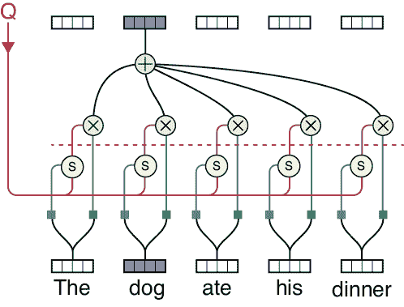

图 20-14：Q/KV 层就像自注意力（见图 20-12）一样，区别在于查询（queries）不来自输入。

### 多头注意力

注意力的想法是识别相似的词并创建它们的有用组合。但是，词可以根据许多不同的标准被认为是相似的。我们可以考虑名词是相似的，或者颜色，或者空间概念，如上和下，或者时间概念，如昨天和明天。这些中哪一个是最好的选择？

当然，没有一个最佳答案。实际上，我们通常希望同时使用多个标准来比较词语。例如，在写歌词时，我们可能希望对意义相似、最后一个音节发音相似、音节数相同并且重音模式相同的词对赋予高分。而在写关于体育的文章时，我们可能更倾向于说，同一队伍中的球员以及扮演相同角色的球员彼此相似。

我们可以通过同时运行多个独立的注意力网络，简单地沿多个标准为词汇打分。每个网络称为一个*头*。通过独立初始化每个头，我们希望在训练过程中，每个头将学习根据对比其他层所用的标准，同时有用且不同的标准来比较输入。如果我们愿意，我们可以增加额外的处理，明确鼓励不同的头关注输入的不同方面。这个想法被称为*多头注意力*，我们可以将其应用于像图 20-12 这样的自注意力网络和像图 20-14 这样的 Q/KV 网络。

每个头都是一个独立的注意力网络。我们拥有的头越多，它们就能集中注意力的输入方面就越多。

图 20-15 展示了一个多头注意力层的示意图。如图所示，我们通常将各个头的输出组合成一个列表，并将其通过一个单一的全连接层。这使得整个多头网络的输出与其输入具有相同的形状。这种方法使得将多个多头网络串联在一起变得容易。

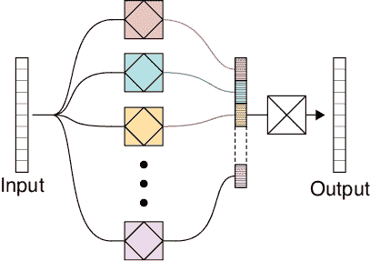

图 20-15：多头注意力层。一个带菱形的框是我们用来表示注意力层的图标。

注意力是一种通用概念，我们可以将其以不同形式应用于任何类型的深度网络。例如，在 CNN 中，我们可以缩放滤波器的输出，以强调响应输入中最相关位置的值（Liu 等人，2018；H. Zhang 等人，2019）。

### 层图标

图 20-16 展示了我们为不同类型的注意力层设计的图标。多头注意力被绘制成一个小的 3D 框，暗示着一堆注意力网络。对于 Q/KV 注意力，我们在菱形内部放置一条短线，以标识 Q 输入，并将 K 和 V 输入放置在相邻的侧面。

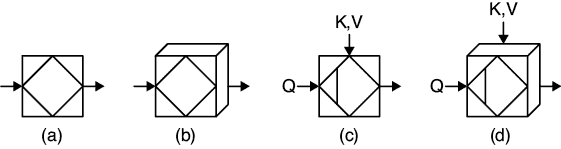

图 20-16：注意力层图标。（a）自注意力。（b）多头自注意力。（c）Q/KV 注意力。（d）多头 Q/KV 注意力。

## Transformer

现在我们有了嵌入和注意力，准备好兑现我们之前承诺的改进 RNN 的目标。

我们的目标是构建一个基于注意力网络而非 RNN 的翻译器。关键思想是，注意力层将学习如何根据词与词之间的关系将我们的输入转换为其翻译。

这种方法首次出现在一篇标题为《Attention Is All You Need》（Vaswani 等人，2017）的论文中。作者将他们基于注意力的模型称为*transformer*（这个名字不幸地有些模糊，但现在已经牢牢地成为该领域的术语）。transformer 模型效果如此优秀，以至于我们现在拥有了一类新的语言模型，它们不仅可以并行训练，而且在广泛的任务中可以超越 RNN。

Transformer 使用了我们尚未讨论的三个新概念。让我们现在来介绍它们，这样当我们真正进入 transformer 架构时，就能顺利进行。

### 跳跃连接

我们要介绍的第一个新概念被称为*残差连接*或*跳跃连接*（He 等人，2015）。其灵感来自于减少深度网络层所需的工作量。

让我们从一个类比开始。假设你正在用丙烯画颜料在画布上画一幅真实的物理肖像画。在经过数周的坐姿之后，肖像完成了，你将它送给你的模特以供审批。他们说他们喜欢这幅画，但他们后悔自己在某个手指上戴了一个特定的戒指，应该戴另一个他们更喜欢的戒指。你能改变它吗？

一种做法是邀请你的对象回到工作室，从头开始在空白画布上重新绘制一幅全新的肖像，这次是戴上了新戒指。那会需要大量时间和精力。如果他们允许的话，更快速的方法是拿出现有的肖像，悄无声息地在旧戒指上绘制新戒指。

现在考虑深度网络中的一层。一个张量进入，层对该张量进行一些处理以改变它。如果该层只需要对输入做出小的改变，或者仅仅是在某些地方改变，那么对那些不需要变化的张量部分进行处理将是浪费资源的。就像画画一样，如果该层仅计算它想做的改变，那会更加高效。然后它可以将这些改变与原始输入结合，生成输出。

这个理念在深度学习网络中表现得非常出色。它让我们可以构建更小、更快的层，甚至改善反向传播中的梯度流，从而让我们能够高效地训练由几十层甚至上百层组成的网络。

该机制在图 20-17 的左侧展示。我们像往常一样将输入张量传递到某一层，让它计算变化，然后将该层的输出添加到其输入张量中。

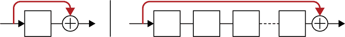

图 20-17：左侧：跳跃连接，红色标出。右侧：我们可以将跳跃连接放置在多个层之间。

图中额外的线条，传递输入到加法节点，称为*跳跃连接*，或*残差连接*，因为它在数学上的解释。

如果需要，我们可以像图 20-17 右侧那样，将跳跃连接放置在多个层之间。

跳跃连接之所以有效，是因为每一层都在尝试减少自己对最终误差的贡献，同时参与由其他所有层组成的网络。跳跃连接是网络的一部分，因此该层学会了不需要处理那些不需要变化的张量部分。这使得该层的工作变得更简单，从而能够变得更小、更快。

稍后我们将看到，变压器不仅仅因为效率和速度使用跳跃连接，更因为它们允许变压器巧妙地跟踪输入中每个元素的位置。

### Norm-Add

在通往 Transformer 的道路上，第二个要讲解的概念更像是一种概念性和符号性缩写。在 Transformer 中，我们通常对层的输出应用一个叫做*层归一化*的正则化步骤，或者称为*层规范化*，如图 20-18 左侧所示（Vaswani 等人，2017）。层归一化属于我们在第十五章看到的正则化技术的范畴，例如 dropout 和 batchnorm，它们通过控制网络中流动的值不至于过大或过小，从而帮助防止过拟合。层归一化步骤学习调整来自某一层的值，使它们逼近均值为 0，标准差为 1 的高斯分布。

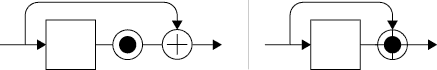

图 20-18：左侧：层归一化后跟随跳跃连接的加法步骤。右侧：归一化-加法的组合图标。这只是对左侧网络的视觉和概念性缩写。

执行层归一化在使 Transformer 工作良好时非常重要，但关于这个步骤可以放置的位置有一定的灵活性。一种常见的方法是在跳跃连接的加法步骤之前放置层归一化，如图 20-18 左侧所示。由于这两个操作总是成对出现，因此将它们组合成一个我们称之为*归一化-加法*的单一操作是非常方便的。我们为归一化-加法设计的图标是层归一化和求和图标的组合，如图 20-18 右侧所示。这只是层归一化后跟随跳跃连接加法的两个独立步骤的视觉缩写。

有人尝试过将层归一化操作放置在其他位置，例如放在层之前（Vaswani 等人，2017）或加法节点之后（TensorFlow 2020b）。这些方法在细节上有所不同，但在实践中，似乎所有这些选择都可以互相比较。我们将在这里继续使用图 20-18 中的版本。

### 位置编码

在我们开始讨论 Transformers 之前，需要讲解的第三个概念旨在解决一个问题，即当我们将 RNN 从系统中移除时：我们失去了每个单词在输入句子中的位置。这个重要信息是 RNN 结构固有的，因为单词是一个一个地输入，这使得循环单元中的隐藏状态能够记住单词到达的顺序。

但是，正如我们所看到的，注意力机制将多个单词的表示混合在一起。那么后续阶段如何知道每个单词在句子中的位置呢？

解决方案是将每个单词的位置或索引插入到单词本身的表示中。这样，在处理单词的表示时，位置信息自然会跟随其一起传递。这个过程的通用名称是*位置编码*。

一种简单的位置编码方法是将几个比特附加到每个单词的末尾，用来表示它的位置，如图 20-19 左侧所示。但在某些情况下，我们可能会遇到需要更多比特的句子，而这时我们就会遇到问题，因为我们无法为每个单词分配一个唯一的位置编号。如果我们把存储空间做得过大，就会浪费资源并使一切变得更慢。这种方法也很难实现，因为我们需要引入一些特殊的机制来处理这些比特（Thiruvengadam 2018）。

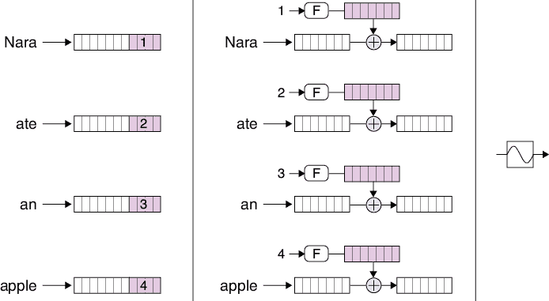

图 20-19：跟踪句子中每个单词的位置。左：将索引附加到每个单词。中：使用函数 F 将每个索引转换为向量，然后将其添加到单词的表示中。右：我们的位置嵌入层的图标。

更好的答案是使用一个数学函数，为序列中的每个位置创建一个唯一的向量。假设我们的词向量长度为 128 个元素。然后我们将每个单词的索引（它可以根据需要变得非常大）传递给这个函数，函数会返回一个新的 128 元素的向量，某种程度上描述了该位置。基本上，它将索引转换为一个唯一的值列表。我们的期望是，网络将学会将这些列表与输入中单词的位置关联起来。

与其将这个向量附加到单词的表示中，我们将两个向量相加，如图 20-19 中间所示。在这里，我们将编码中每个元素中的数字加到单词嵌入中相应位置的数字上。这种方法的吸引力在于我们不需要额外的比特或特殊的处理。这种位置编码的形式叫做*位置嵌入*，因为它类似于我们在像 ELMo 这样的算法中看到的*词嵌入*。图的右侧展示了我们为这个过程设计的图标，它用一个小的正弦波来表示，因为流行的嵌入函数选择基于正弦波（来源于 Vaswani 等，2017）。

将位置信息添加到每个单词中，而不是附加到后面，可能看起来有点奇怪，因为这改变了单词的表示。似乎位置信息也容易在注意力网络处理这些值时丢失。

事实证明，用于计算位置嵌入向量的特定函数通常只会影响单词向量一端的几个比特（Vaswani 等，2017；Kazemnejad 2019）。此外，似乎变压器模型在处理过程中学会了区分每个单词的表示和位置信息，因此它们被分别解释（TensorFlow 2019a）。

那么为什么位置嵌入在处理过程中不会完全丢失呢？毕竟，注意力通过神经网络将输入转换为 QKV 值，然后混合这些值。位置相关的信息肯定会被混乱并丢失吧。

这个问题的巧妙解决方案内建于变换器的架构中。正如我们将看到的，变换器网络将每个操作（除了最后一个）包装在跳跃连接中。嵌入信息从未丢失，因为它在每个处理阶段后都会被重新添加。图 20-20 说明了位置嵌入和规范加跳跃连接在结构上的相似性。简而言之，每一层都可以以任何方式改变其输入向量，然后位置嵌入会被重新加回，以便下层使用。

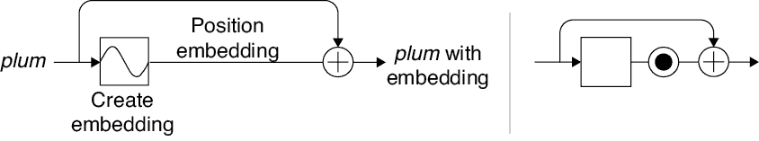

图 20-20：左图：创建位置嵌入并将其添加到单词中。右图：一个规范加操作在处理后隐式地将单词的嵌入信息添加回来。

### 组装一个变换器

现在我们已经具备了构建变换器的所有组成部分。我们将继续使用基于单词的翻译作为我们的运行示例。

需要注意的是，*变换器*这一名称指的是受原始变换器论文（Vaswani 等，2017）架构启发的各种网络。在本讨论中，我们将坚持使用一种通用版本。

我们的变换器框图如图 20-21 所示。标记为*E*和*D*的模块是由注意力层构建的重复层序列或*模块*。稍后我们会详细介绍这两种模块。大体框架是，编码器阶段（由*编码器模块*，标记为*E*构成）接受一个句子，解码器（由*解码器模块*，标记为*D*构成）接受来自编码器的信息并产生新的输出（该图的结构在某些方面类似于展开的 seq2seq 图，但这里没有递归单元）。

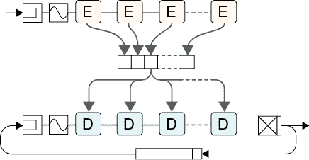

图 20-21：一个变换器的框图。输入被编码然后解码。解码器的输出被递归地反馈到其输入。虚线表示重复的元素。

编码器和解码器都从词嵌入开始，接着是位置嵌入。解码器末尾有常见的全连接层和 softmax，用于预测下一个词。解码器是自回归的，因此它将每个输出词附加到其输出列表中（见图底部的框），该列表成为生成下一个词的解码器输入。解码器包含多头 Q/KV 注意力网络，如图 20-14 所示，这些网络的键和值来自编码器块的输出，见图 20-21 中部，编码器的输出被传递到解码器块中。这说明了为什么 Q/KV 注意力也叫做编码器-解码器注意力。

让我们更仔细地看看图 20-21 中的块，从编码器块开始，见图 20-22。

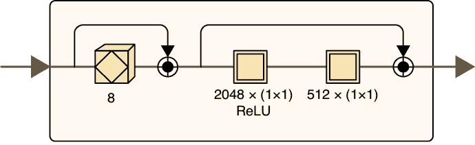

图 20-22：变压器的编码器块。第一层是自注意力。

编码器块以一层多头自注意力开始，这里展示了八个头。因为这一层应用的是自注意力，查询、键和值都来源于到达该块的单一输入集。这个多头注意力层被一个归一化加跳跃连接所包围，帮助保持数值呈高斯分布，并保留位置信息嵌入。

紧接着是两层，通常统称为*逐点前馈层*（另一个遗憾的模糊名称）。虽然原始的变压器论文将其描述为一对修改过的全连接层（Vaswani 等人，2017），我们可以更方便地将其视为两层 1×1 卷积（Chromiak 2017；Singhal 2020；A. Zhang 等人，2020）。它们学习如何调整多头注意力层的输出，以去除冗余并集中处理接下来最有价值的信息。第一层卷积使用 ReLU 激活函数，而第二层则不使用激活函数。像往常一样，这两步被包裹在归一化加跳跃连接中。

现在让我们看看解码器块，见图 20-23。

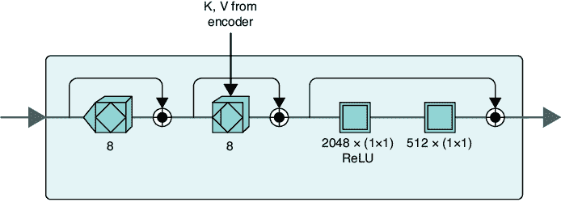

图 20-23：变压器的解码器块。请注意，第一个注意力层是自注意力，而第二个是 Q/KV 注意力。自注意力层左侧的三角形表示该层使用了掩蔽。

从高层次来看，它与编码器块非常相似，只是多了一步注意力操作。让我们逐层分析。

我们从一个多头自注意力层开始，和编码器模块一样。该层的输入是到目前为止 Transformer 输出的单词。如果我们刚开始，这句话只包含 `[START]` 标记。像任何自注意力层一样，目的在于查看所有输入单词，并确定哪些单词彼此之间关系最为紧密。像往常一样，这一过程通过一个跳跃连接与一个归一化加节点（norm-add node）包裹。训练过程中，我们在这一自注意力步骤中添加一个额外的细节，称为 *遮蔽*（masking），这一点在图 20-23 中通过一个小三角形标出，稍后我们会详细解释。

自注意力层后面是一个多头 Q/KV 注意力层。查询向量（Q）来自前一个自注意力层的输出。键（keys）和值（values）则来自所有编码器模块的连接输出。这个层同样通过一个跳跃连接与一个归一化加节点（norm-add node）包裹。该阶段使用前一个注意力网络的输出，在来自编码器的键中进行选择，并混合与这些键对应的值。最后，我们有一对 1×1 卷积，遵循与编码器模块相同的模式。

现在我们可以将各个部分组合起来了。图 20-24 展示了一个 Transformer 模型的结构。

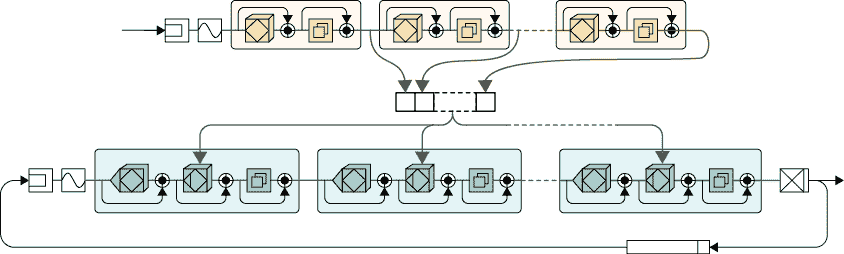

图 20-24: 完整的 Transformer。图标显示的两个叠加框代表两个连续的 1×1 卷积。虚线表示没有绘制的重复元素。

我们曾经承诺回到每个解码器模块中第一个注意力层的一个细节。正如我们提到的，Transformer 中核心的注意力机制的一个重要价值就是它允许大量并行化。无论注意力块接收五个单词还是五百个单词，它都能在相同的时间内运行。

假设我们在训练系统预测句子中的下一个单词。我们可以提供整个句子，并让它并行预测第一个单词、第二个单词、第三个单词，以此类推。

但是这里有一个问题。假设句子是 "My dog loves taking long walks"。我们可以给系统输入 "My dog loves taking long"，并让它预测第六个单词 "walks"。但因为我们是在并行训练，我们希望它能利用相同的输入同时预测每一个之前的单词。也就是说，我们还希望它能从输入 "My dog loves taking long" 中预测第五个单词 "long"。

这太简单了：单词 long 就在这里！系统会发现它只需要返回第五个单词，而这显然不同于学会如何预测它。我们希望给系统输入 "My dog loves taking long"，但在预测第五个单词时，它只应该看到 "My dog loves taking"。当我们尝试预测 long 时，我们希望将其隐藏或屏蔽。同样地，为了预测第四个单词，它应该只看到 "My dog loves"，为了预测第三个单词，它应该只看到 "My dog"，以此类推。

简而言之，我们的变换器将执行五个并行计算，每个计算预测一个不同的单词，但每个计算应该只接收它应该预测的单词之前的单词。

实现这一点的机制叫做*屏蔽*。我们在解码器模块的第一个自注意力层中增加了一个额外的步骤，屏蔽或隐藏每个预测步骤不应该看到的单词。因此，预测第一个单词的计算不会看到任何输入单词，预测第二个单词的计算只会看到 "My"，预测第三个单词的计算只会看到 "My dog"，以此类推。由于这个额外的步骤，解码器模块中的第一个注意力层有时被称为*屏蔽多头自注意力*层，这个名字有点难以说清，因此我们通常将其简称为*屏蔽注意力*层。

### 变换器的实际应用

让我们看一下变换器在执行翻译时的表现。我们训练了一个变换器，基本遵循了图 20-24 的架构，用于将葡萄牙语翻译成英语（TensorFlow 2019b）。我们使用了一个包含 50,000 个训练示例的数据集，按照今天的标准，这个数据集比较小，但足以展示这些概念，同时也足够大，可以在家用计算机上进行训练（Kelly 2020）。

我们给训练好的变换器输入了葡萄牙语问题 "você se sente da mesma maneira que eu?"，而 Google 翻译将其翻译成了英语 "do you feel the same that way I do?"。我们的系统产生的翻译是 "do you see, do you get the same way i do?"。这并不完美，但考虑到小规模的训练数据库，它已经很好地捕捉到了问题的精神。像往常一样，更多的训练数据和训练时间肯定能改进结果。

图 20-25 显示了热图，展示了每个输出单词在解码器的最终 Q/KV 注意力层中，每个注意力头对每个输入单词的关注程度。单元格越亮，表示越多的注意力被关注。请注意，一些输入单词被预处理器拆分成多个标记。

在比这个示例更大的数据集上训练，并且训练时间更长的转换器模型，能够产生与 RNN 相媲美甚至更好的结果，而且它们可以并行训练。它们不需要具有有限内部状态的递归单元，也不需要多个神经网络来学习如何控制这些状态。这些是巨大的优势，也解释了为什么转换器在许多应用中取代了 RNN。

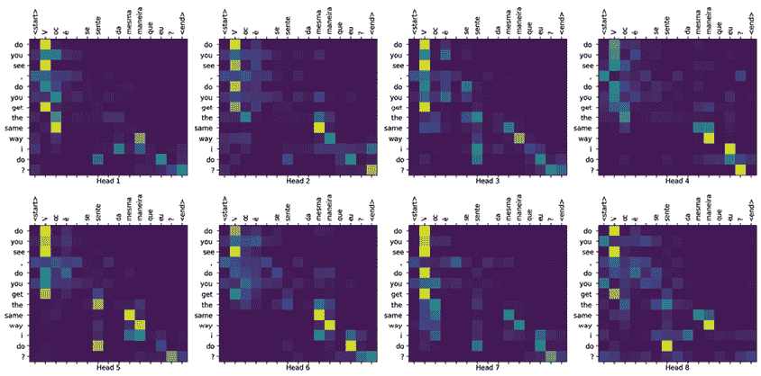

图 20-25：在将葡萄牙语句子“*Você se sente da mesma maneira que eu?*”翻译成英语时，解码器中最终 Q/KV 注意力层的八个头部的热力图

转换器的一个缺点是，随着输入大小的增加，注意力层所需的内存会急剧增加。为了减少不同情况下的这些开销，有一些方法可以调整注意力机制以及转换器（Tay 等，2020）。

## BERT 和 GPT-2

图 20-24 中的完整转换器模型由一个编码器组成，编码器的设计目的是分析输入文本并创建一系列描述它的上下文向量，接着是一个解码器，解码器使用这些信息进行自回归生成输入的翻译。

组成编码器和解码器的模块并不特定于翻译。每个模块只是一个或多个注意力层，后面跟着一对 1×1 卷积层。这些模块可以作为通用处理器，用于处理序列元素之间的关系，尤其是语言方面。让我们看看两个最近的架构，它们以超出翻译范畴的方式使用了转换器模块。

### BERT

让我们使用转换器模块来创建一个通用语言模型。它可以用于我们在第十九章开头列出的任何任务。

该系统被称为*双向编码器表示转换器*，但通常以其缩写*BERT*为人们所熟知（Devlin 等，2019）（另一个来自*芝麻街*的木偶，也是对我们之前看到的 ELMo 系统的一个点头式致敬）。BERT 的结构从一个词嵌入层和一个位置嵌入层开始，接着是多个转换器编码器模块。BERT 的基本架构如图 20-26 所示（在实际操作中，还有其他有助于训练和性能的细节，如丢弃层）。在这个图中，我们展示了多个输入和输出，以清楚地表明 BERT 正在处理整个句子。为了保持一致性和清晰性，我们只在模块内部使用单行，但并行操作仍在进行。传统上，BERT 的图示通常使用黄色配色方案，因为*芝麻街*中的 Bert 是一个黄色角色。

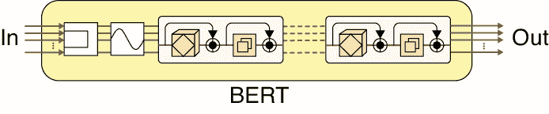

图 20-26：BERT 的基本结构。虚线表示未绘制的更多编码器模块。

原始的“大型”版本的 BERT 确实名副其实，拥有 3.4 亿个权重或参数。该系统在维基百科和超过 1 万本书籍上进行了训练（Zhu 等人 2015）。目前，原始 BERT 系统的 24 个训练版本可以免费在线获得（Devlin 等人 2020），同时，基于该方法的变化和改进也在不断增加（Rajasekharan 2019）。

BERT 经过两项任务的训练。第一项任务叫做*下一个句子预测*，或称*NSP*。在这项技术中，我们一次性给 BERT 两个句子（用一个特殊符号将它们分开），并让它判断第二个句子是否合理地跟随第一个句子。第二项任务给系统提供了一些句子，其中一些词被去掉，我们要求它填补这些空缺（语言学教育者称之为*填空任务*；Taylor 1953）。这与视觉过程中的*闭合*现象类似，描述了人类倾向于在图像中填补空白。闭合现象在图 20-27 中有所展示。

图 20-27：展示闭合原理。像这样的不完整形状通常会被人类视觉系统填补，从而形成物体。

BERT 能够在这些任务中表现良好，因为与之前看到的基于 RNN 的方法相比，BERT 的注意力层能从输入中提取更多信息。我们最初的 RNN 模型是*单向的*，从左到右读取输入。然后它们变成了*双向的*，最终发展为 ELMo，可以说是*浅层双向的*，其中*浅层*指的是每个方向上仅使用两层架构。得益于注意力机制，BERT 能够确定每个词对其他词的影响，并通过重复编码器块，它可以连续执行这一过程多次。BERT 有时被称为*深度双向的*，但将其视为*深度密集的*可能更为有用，因为它同时考虑每个词。在使用注意力时，方向的概念实际上并不适用。

让我们来体验一下 BERT。我们将从一个包含 12 个编码器块的预训练模型开始（McCormick 和 Ryan 2020）。我们将对其进行微调，以确定输入句子是否符合语法（Warstadt, Singh, 和 Bowman 2018；Warstadt, Singh, 和 Bowman 2019）。这基本上是一个分类问题，产生是/否的答案。因此，我们的下游模型应该是某种分类器。我们使用一个由单个全连接层组成的简单分类器。我们这对模型的组合展示在图 20-28 中。

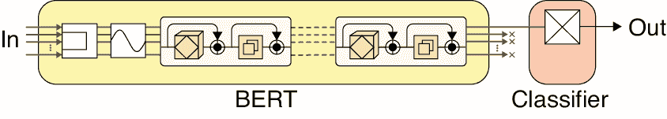

图 20-28：BERT 加上一个小型下游分类器。虚线表示存在的 10 个附加的相同编码器块，但没有绘制出来。

在四个训练周期之后，以下是测试数据的六个结果。前三个是语法正确的，后三个则不是。BERT 在六个结果中都给出了正确答案。

+   克里斯走路，帕特吃西兰花，桑迪打壁球。

+   有一只特别的狗，拯救了每个家庭。

+   苏珊吓到了她。

+   这个人承认负责。

+   猫睡得又香又毛茸茸。

+   那只香甜且毛茸茸的猫睡着了。

在约 1,000 个句子的测试集上，这个小版本的 BERT 正确预测了大约 82%的示例。某些 BERT 变体在这个任务中达到了超过 88%的正确率（Wang 等，2019；Wang 等，2020）。

让我们在另一个任务中尝试 BERT，称为*情感分析*。我们将把短片影评分类为正面或负面。数据来自一个名为*SST2*的数据库，包含近 7,000 条电影评论，每条评论都标记为正面或负面（Socher 等，2013a；Socher 等，2013b）。

对于这次运行，我们使用了一个名为 DistillBERT 的预训练 BERT 模型（Sanh 等，2020；Alammar 2019）（术语*蒸馏*通常用于当我们仔细修剪一个已训练的神经网络，使其更小更快，同时不失去太多性能时）。我们再次进行分类任务，因此可以重用图 20-28 中的模型。

下面是从测试数据中逐字摘录的六个示例（无法得知它们分别指代哪些电影）。DistillBERT 正确将前 3 条评论分类为正面，将后 3 条评论分类为负面（这些评论都是小写字母，逗号被当作独立的标记）。

+   一部美丽、娱乐性十足的两小时电影。

+   这是一部聪明且有效的电影，导演懂得如何创造并维持情绪。

+   一部彻底引人入胜、出人意料地感人的英国喜剧。

+   一旦强势的动作片惯例占据主导，电影便开始下滑。

+   一部完全意义上的僵尸电影，毫无头脑、毫无生气、漫无目的、喧闹、痛苦、令人讨厌。

+   它是那种罕见的糟糕写作、糟糕导演和糟糕表演的结合，糟糕的三重奏。

在测试集中的 1,730 条评论中，DistillBERT 正确预测了大约 82%的情感。

总结一下，基于 BERT 架构的模型的共同点在于它们使用了一系列的编码器块。它们创建了一个句子的嵌入，捕捉了足够的信息，以便下游应用能够对其进行广泛的操作。通过合适的下游模型，BERT 可以用来执行我们在第十九章开始时提到的许多自然语言处理任务。

如果我们愿意变得聪明一些，我们可以让 BERT 生成语言，但这并不容易（Mishra 2020；Mansimov 等，2020）。一个更好的解决方案是使用解码器块，接下来我们将看到这一点。

### GPT-2

我们已经看到变换器如何使用一系列解码器块来生成翻译的单词。我们也可以使用一系列解码器块来生成新的文本。

由于我们没有像完整 transformer 中的图 20-24 那样接收 KV 值的编码器阶段，我们将从每个解码器块中移除 Q/KV 多头注意力层，留下掩蔽自注意力和一对 1×1 卷积。第一个以这种方式做的系统被称为*生成预训练模型 2*，简称*GPT-2*（Radford 等人，2019 年）。其架构如图 20-29 所示。

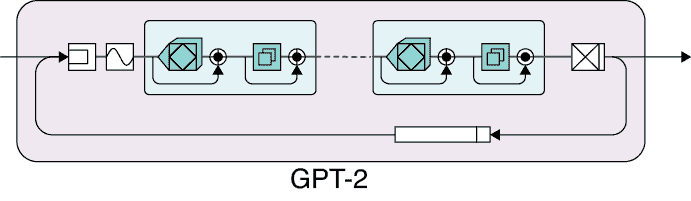

图 20-29：GPT-2 的框图，由没有 Q/KV 层的 transformer 解码器块构成。虚线表示更多重复的、相同的解码器块。请注意，由于这些是解码器块的版本，每个块中的第一个多头注意力层是一个掩蔽注意力层。

与 BERT 类似，我们从令牌嵌入开始，然后为每个输入单词添加位置嵌入。每个解码器块中的自注意力层像以前一样使用掩蔽处理，这样在计算任何给定单词的注意力时，我们只能使用该单词以及之前单词的信息。

原始的 GPT-2 模型发布了几种不同的大小版本，其中最大的版本一次处理 512 个 token，通过 48 个解码器块，每个块有 12 个头，总共有 1,542 百万个参数。也就是 1.5 *十亿*个参数。GPT-2 是在一个名为*WebText*的数据集上进行训练的，该数据集包含大约八百万个文档，总共大约 40GB 的文本（Radford 等人，2019 年）。

我们通常通过从预训练模型开始使用 GPT-2，然后通过提供一个附加数据集来微调它，过程中调整所有的权重（Alammar 2018 年）。

我们在第十九章中启动了每个文本生成器时都使用了一个种子，但那只是让它们开始运行的一种方式。一个更简单的方法是用一般的指导和提示来启动系统。这被称为*零-shot*场景，因为系统在没有任何“示例”的情况下开始工作，也就是说，它没有任何用于生成新文本的示例或模型。

例如，假设我们建立了一个系统来建议每天穿什么。一个零-shot 场景可能以指令“描述今天的服装”开始，接着是提示“今天我应该穿：” 然后生成器会继续。它没有任何示例或上下文可以使用，所以它可能会建议穿盔甲、太空服或者熊皮。

另外，我们可以提供一个或多个示例，或称为 shot。在一个 one-shot 场景中，我们可能给出指令“描述今天的服装”，接着是示例“昨天我穿了一件蓝色衬衫和黑色裤子”，然后以提示“今天我应该穿：”结尾。思路是，在提示之前提供的文本可以帮助引导系统生成我们想要的输出。在这种情况下，熊皮的可能性会小一些。

如果我们给系统两三次机会，但不再多次尝试，通常称之为*少-shot*情境（这些术语并没有明确的界限）。人们通常倾向于选择那些需要尽可能少的尝试来提供我们所需输出的生成器。

让我们看看 GPT-2 的实际应用，使用一个中等大小、预训练的 GPT-2 模型（von Platen 2020）。我们不进行微调，因此系统将仅根据其核心训练数据生成文本。我们采取零-shot 方法，除了起始提示语“今天早上我被河马的咆哮声吵醒”外，不提供任何信息。以下是一个典型的输出，逐字输出：

> 今天早上我被河马的咆哮声吵醒。我正在进行一次长时间的散步，突然看到一只巨大的河马。我非常激动。我非常激动。我非常激动。我非常激动。

此时，系统不停地重复“我非常激动”。这并不是生成器的错，而是我们的错。系统生成了符合语法的输出，这是我们训练它的目标。问题在于，尽管它强调了激动，但输出却很无聊。一个句子的结尾恰好回到了同一句话的开头，我们陷入了死循环。现有系统并不知道这样的输出是无聊或不理想的。

为了使输出更有趣，我们可以逐步削减问题，去除我们认为不理想的输出特征。我们来看两个这样的更改（Vijayakumar et al. 2018；Shao et al. 2017）。

首先，让我们去除这些重复内容。如果系统反复生成相同的词组，我们可以对其进行惩罚。这叫做*n-gram 惩罚*，因为一系列*n*个词被称为*n-gram*（Paulus, Xiong 和 Socher 2017；Klein 等人 2017）。我们对系统宽容一点，只惩罚重复的词对，或者 2-grams。

其次，与其总是选择最高概率的词语，不如选择几个词语，看看它们会引领我们走向哪里。也就是说，对于每个词，我们将生成更多的后续词。当我们沿着多个路径走了一段时间后，我们会对每条路径进行评分，以确定哪一条路径的生成概率最高。我们将该分支的第一个词作为预测词，并抛弃该分支的其他部分以及其他所有分支。然后，我们为下一个词重复这一过程，依此类推。这叫做*束搜索*（Russell 和 Norvig 2009）。这样我们应该能够得到更长的、连贯的句子。而且我们不再总是选择概率最高的词，而是从几个最有可能的词中进行选择，依据它们的概率，这将有助于使输出更加不可预测。这被称为增加词语选择过程的*温度*（温度为零时对应总是选择最可能的词）。

做出这两个更改后，让我们再次尝试使用相同的起始句子生成文本。以下是一个逐字的结果：

> 今天早晨，我被一只河马的吼声吵醒。“天啊，”我说，“真对不起。我不是故意伤害你的。我只是说，我不知道该如何应对它。你明白我的意思吗？我不会让你伤害我，好吗？你是我的朋友，我非常爱你。我想让你知道，你在这件事上并不孤单。我们已经在一起很久了，所以这不是我们能做什么的事，但我忍不住为你感到难过，因为我知道，你再也不会孤单地和我在一起了。”

哇，真是了不起。我们本可以通过使用更多的处理技术来继续改善输出（Welleck 等人 2020），但这已经相当不错了，尤其是考虑到我们使用的是精简版的 GPT-2 模型。

为了对比，我们回顾一下第十九章中的同一篇《福尔摩斯探案》。我们从一个小型、预训练的 GPT-2 开始，针对这些故事进行了微调（Woolf 2019），然后给出了提示：“我请福尔摩斯解释。”

我们使用了稍微温暖的温度，因此每次运行算法时，得到的结果都不同。这只是其中之一，我们随意在几段后将其截断。

> 我请福尔摩斯解释。
> 
> “其实很简单，”他说。“简短的回答当然是，法律不适用于这些事项，案件应完全由皇家检察机关和警方自行裁量。但长的回答是，案件显然不在我们手中，警方有很大的权力来防止它发生。”
> 
> “你还记得，华生，就是在今天，年轻人拉蒂默先生拿起了那把他用来烙印我的长型左轮手枪。这把左轮手枪可能是世界上最著名的武器。你记得，华生，我当时说过，与其恐惧它，不如不知道它。现在，我们已经听到了，而且我们不能让自己陷入困境。事情已经复杂到一定程度，而且不必用这种方式来评论事实。那个不知道的人，实际上并不是对自己构成危险。让我们来看看知道的人。”

这些结果是语法正确的，甚至可以自我指涉。将这个输出与我们从基于字符的 RNN 自回归中得到的输出进行比较。

GPT-2 可以很好地完成许多其他任务，例如运行完形填空测试、预测短语中下一个单词（在该单词前至少 50 个词的地方出现了关键信息）、回答文本问题、总结文档，以及进行语言之间的翻译。

### 生成器讨论

GPT-2 表明，如果我们每次处理 512 个标记，通过 48 层解码器，其中每层有 12 个注意力头，总共有 15 亿个参数，我们可以生成相当不错的文本。如果我们将一切规模化呢？也就是说，我们不会修改基本架构，只是增加更多的每一部分。

这是 GPT-2 继任者的计划，名为（惊讶）*GPT-3*。GPT-3 的框架图通常类似于 GPT-2 的图 20-29（除了某些效率改进之外）。只是各方面的规模更大。大得多。GPT-3 一次处理 2,048 个标记，使用 96 个解码器层，每个层有 96 个注意力头，总共有 1750 亿个参数（Brown 等，2020 年）。1750 亿。训练这个庞然大物估计需要 355 个 GPU 年，费用约为 460 万美元（Alammar，2018 年）。

GPT-3 的训练数据集叫做*Common Crawl*数据集（Common Crawl，2020 年）。它最初包含来自书籍和网络的大约 1 万亿个单词。去除重复和清理数据库后，数据集仍包含约 4200 亿个单词（Raffel 等，2020 年）。

GPT-3 能够生成许多不同类型的数据。它曾作为一种 beta 测试阶段向公众开放，但现在已成为一款商业产品（Scott，2020 年）。在 beta 测试期间，人们将 GPT-3 用于许多应用，如编写网页布局的代码、编写实际的计算机程序、参加虚拟求职面试、将法律文本重写为通俗语言、编写类似法律语言的新文本，当然，还包括创作小说和诗歌等创意类写作（Huston，2020 年）。

所有这些强大功能是一个复杂的组合。微调这样一个系统需要巨大的资源，而且随着系统规模的增大，微调变得越来越困难，因为这需要找到原始数据中没有的特定任务数据。

如果更大就是更好，那么更大是不是还会更好呢？GPT-3 背后的研究人员估计，我们可以用一个拥有 1 万亿个参数并在 1 万亿个标记上训练的模型，从任何文本中提取我们需要知道的所有信息（至少从 NLP 任务的角度来看）（Kaplan 等，2020 年）。这些数字是粗略预测，可能偏差较大，但有趣的是，或许会有一个时刻，解码器层堆叠（以及一些支持机制）可以从一段文本中提取出我们所需的几乎所有信息。我们很可能很快就能知道答案，因为其他拥有巨大资源的大公司肯定会推出他们自己的庞大 NLP 系统，基于他们自己的庞大数据库进行训练。训练这些庞大系统是只有大公司和富有企业才能参与的游戏。

轻松一点，我们可以在线玩一个由 GPT-3 实现的互动文字冒险游戏（Walton，2020 年）。该系统经过多种类型的训练，从奇幻、赛博朋克到间谍故事等。也许玩这个系统最有趣的方式是将 AI 当作即兴表演的伙伴，赞同并扩展系统抛给我们的任何内容。让 AI 设定节奏，随它走。

生成的文本通常在短时间内表现良好，但当我们仔细查看时，它的表现如何呢？最近的一项研究要求多种语言生成器，包括 GPT-3，执行 57 个任务，任务的主题涵盖了从法律和历史等人文学科到经济学和心理学等社会科学，再到物理学和数学等 STEM 学科（Hendrycks et al. 2020）。大多数输出从未接近人类表现。这些系统在道德和法律等重要社会问题上表现尤为糟糕。

这不应该让人感到惊讶。这些系统只是根据单词彼此搭配的概率生成单词。从实际和根本的意义上讲，它们根本不知道自己在说什么。

尽管它们非常强大，但像我们在这里看到的文本生成器并没有常识。更糟糕的是，它们盲目重复了从性别、种族、社会、政治、年龄和其他偏见中继承下来的刻板印象和偏见。文本生成器对准确性、公平、善良或诚实一无所知。它们不知道自己是在陈述事实，还是在编造东西。它们只是生成遵循训练数据统计规律的单词，并延续其中的每一个偏见和局限。

### 数据中毒

我们在第十七章看到，敌对攻击可以欺骗卷积神经网络生成错误的结果。自然语言处理算法也容易受到有意攻击，这种攻击被称为*数据中毒*。

数据中毒的背后思想是通过某种方式操纵 NLP 系统的训练数据，使得系统产生一种期望的、不准确的结果，可能是持续的，或者仅仅是在出现某个触发词或短语时。例如，可以在训练数据中插入句子或短语，暗示草莓是由水泥做成的。如果这些新加入的内容未被发现，那么如果系统稍后被用来为超市或建筑承包商生成库存订单，可能会发现他们的库存数据一直并且神秘地错误。

这尤其令人担忧，因为正如我们所见，NLP 系统通常是在包含数百万或数十亿个单词的大型数据库上进行训练的，因此没有人会仔细审查数据库中可能误导的短语。即使一个或更多的人仔细阅读整个训练集，这些中毒的文本也可以被设计成不明确提及其目标，使得它们几乎无法被检测到，且其效果不可预测。

回到我们之前的例子，这样的短语可以让系统相信草莓是由水泥做成的，而根本不涉及水果或建筑材料。这被称为*隐蔽数据中毒*，它可能非常难以检测和防止（Wallace et al. 2020）。

另一种攻击方式是通过看似无害的方式改变训练数据。假设我们在使用一个将新闻标题分类到不同类别的系统。任何给定的标题都可以被微妙地重写，以便显而易见的意思不变，但故事会被错误地分类。例如，原本的标题“土耳其已被列入欧盟成员国名单”将被正确分类为“世界”类。但如果编辑将其改写成主动语态——“欧盟将土耳其列入全面成员国候选名单”——这将被错误分类为“商业”（Xu, Ramirez, 和 Veeramachaneni 2020）。

数据污染特别恶劣，原因有几个。首先，它可以由与构建或训练 NLP 模型的组织没有任何联系的人完成。由于大量的训练数据通常来自公共来源，比如互联网，污染者只需要在一个公共博客或其他可能被抓取并使用的位置发布有操控性的短语。其次，数据污染可以在任何特定系统使用之前，甚至在系统构思之前，就提前完成。

目前无法得知有多少训练数据已经被污染，并且仅仅在等待激活，就像《孟乔理候选人》（Frankenheimer 1962）中的沉睡特工一样。最后，与对卷积神经网络（CNN）的对抗攻击不同，数据污染是从内部削弱 NLP 系统，使其影响成为训练模型的固有部分。

当一个受损的系统被用来做出重要决策时，比如评估学校录取作文、解读医疗笔记、监控社交媒体中的欺诈与操控，或是搜索法律记录，那么数据污染就可能导致错误，改变人们的生活轨迹。在任何 NLP 系统被用于这类敏感应用之前，除了检查其是否存在偏见和历史偏见外，我们还必须对其进行数据污染分析，并且只有当它明确无偏或未受污染时，才能认证为安全。不幸的是，目前还没有有效的强健检测或认证这些问题的方法。

## 摘要

本章开始时我们讨论了词嵌入，它为每个词分配一个高维空间中的向量，表示其使用方式。我们看到，ELMo 能够基于内容捕捉多个含义。

我们讨论了注意力机制，它使我们能够同时在输入中找到看似相关的词，并构建描述这些词的向量版本的组合。

然后我们看了 Transformer 模型，它完全舍弃了递归单元，取而代之的是多个注意力网络。这个变化使得我们能够并行训练，具有巨大的实际价值。

最后，我们看到了如何使用多个 Transformer 编码块来构建 BERT，一个高质量的编码系统，和如何使用多个解码块来构建 GPT-2，一个高质量的文本生成器。

在下一章，我们将把注意力转向强化学习，它通过评估神经网络的猜测来训练它们，而不是期望它们预测一个单一的正确答案。
