# 第二十一章：强化学习

训练机器学习系统有很多方法。当我们有一组带标签的样本时，可以使用监督学习来教计算机预测每个样本的正确标签。当我们无法提供任何反馈时，可以使用无监督学习，让计算机尽力而为。但有时候我们介于这两者之间。也许我们对希望系统学习的内容有*一些*了解，但并不像有标签的样本那样明确。也许我们所知道的只是如何区分一个更好的解决方案和一个更差的解决方案。

例如，我们可能试图教一种新型的人形机器人如何用两条腿走路。我们并不确切知道它应该如何保持平衡和移动，但我们知道我们希望它站立起来而不是摔倒。如果机器人尝试趴在地上滑行，或者单腿跳跃，我们可以告诉它那不是正确的做法。如果它两条腿都放在地上，然后用它们前进，我们可以告诉它这条路是对的，并鼓励它继续探索这类行为。奖励我们认定为进步的策略被称为*强化学习*（*RL*）（Sutton 和 Baro 2018）。这个术语描述了一种通用的学习方法，而非具体的算法。

本章我们将介绍这一广阔领域的一些基本概念。核心思想是，强化学习将模拟的世界分解为一个采取行动的实体和响应这些行动的其他世界。为了更具体地说明，我们将使用强化学习来学习如何玩一个简单的单人游戏，然后深入探讨这种技术的细节。我们将从一个有缺陷的简单算法开始，并将其升级为能够高效学习的更好版本。

## 基本概念

假设你正在和朋友下跳棋，轮到你了。此时，你可以移动你的一枚棋子，朋友需要等待。在强化学习中，我们说你是*行动者*或*智能体*，因为你有选择行动的权利。宇宙中的其他一切——棋盘、棋子、规则，甚至你的朋友——都被归为*环境*。这些角色并非固定不变。当轮到你朋友走棋时，他们就是智能体，而其他的一切——棋盘、棋子、规则，甚至你——现在都成了环境的一部分。

当演员或代理选择一个行动时，他们会改变环境。在我们的跳棋游戏中，你是代理，所以你会移动你的棋子，也许还会移除对手的一些棋子。结果是，世界发生了变化。在强化学习中，代理的每一个行动之后，都会得到一条*反馈*，也叫*奖励*，它告诉他们“行动”有多“好”，这个评估可以依据我们喜欢的任何标准。反馈或奖励通常只是一个单一的数字。由于我们在创建这个世界，反馈可以代表任何我们想要的意义。例如，在一局跳棋游戏中，一步能赢得比赛的走法会被分配一个巨大的正向奖励，而一部导致失败的走法会被分配一个巨大的负向奖励。在两者之间，越是能够带来胜利的走法，奖励越大。

通过反复试验，代理能够发现不同情境下哪些行动比其他行动更好，从而随着经验的积累，逐渐做出更好的选择。这种方法对于我们并不总是知道最佳行动的情况特别有效。例如，考虑一下在一座高楼繁忙的办公大楼中安排电梯的问题。即便只是弄清楚空车应该去哪里也是个难题。电梯车厢应该总是返回到一楼吗？是否应该让一些车停在楼顶？还是应该停在楼层之间，分布均匀？也许这些策略应该随时间变化，在清晨和午饭后，电梯车应停在一楼，等待从街上来的人员，但在下午晚些时候，车应停得更高一点，准备帮助人们下楼，回家。如何安排一座特定大楼的电梯并没有明显的答案。一切都取决于大楼的平均交通模式（而这个模式本身可能依赖于时间、季节或天气）。

这是强化学习的理想问题。电梯的控制系统可以尝试一种指引空车的策略，然后利用来自环境的反馈（例如等待电梯的人数、他们的平均等待时间、电梯车厢的密度等）来帮助调整该策略，以便在我们衡量的指标上尽可能表现得更好。

强化学习可以帮助我们解决那些我们不知道最佳结果的问题。我们可能没有像游戏的胜利条件那样明确的衡量标准，而只有更好或更差的结果。这是一个关键点：我们可能无法找到任何客观一致的“正确”或“最佳”答案。相反，我们是在根据我们所拥有的信息，并通过我们所衡量的任何标准，尝试找到我们能得到的最佳答案。在某些情况下，我们甚至可能不知道自己在过程中做得如何。例如，在一场复杂的游戏中，我们可能无法判断自己是领先还是落后，直到在我们赢或输的惊讶时刻。对于这些情况，我们只能根据最终任务完成时的结果来评估我们的行为。

强化学习提供了一种很好的方式来建模不确定性。在简单的基于规则的游戏中，我们原则上可以评估任何棋盘并选择最佳的移动，假设另一个玩家总是做出相同的动作。但在现实世界中，其他玩家会做出让我们感到惊讶的举动。而且，当我们处理现实世界时，比如有些天比其他天更多人需要电梯，我们需要有能够在面对惊讶时仍然表现良好的策略。强化学习可能是应对这类情况的好选择。

让我们通过一个具体的例子更详细地了解强化学习。

## 学习一款新游戏

让我们通过使用强化学习来教程序如何玩*井字游戏*（也叫*圈叉*，或*X 与 O*）的步骤来了解。游戏中，玩家交替在一个三乘三的网格中放置 X 或 O，第一个在一行（任何方向）中放置三个相同符号的人获胜。在图 21-1 的示例中，我们玩 O，我们的计算机学习者玩 X。

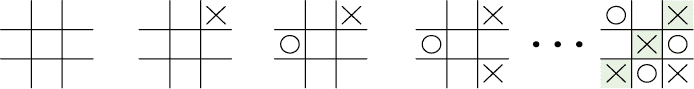

图 21-1：一局井字游戏，从左到右阅读。X 先走。

在这个场景中，我们正在训练的程序是代理。它正在与环境进行对抗，环境可能由另一个了解游戏及如何玩的程序模拟。代理不知道游戏规则、如何获胜或失败，甚至不知道如何进行移动。但我们的代理并不会完全一无所知。在每次代理轮到行动时，环境会给它两个重要的信息：当前的棋盘和可用的动作列表。这个过程在图 21-2 的步骤 1 和步骤 2 中有所展示。

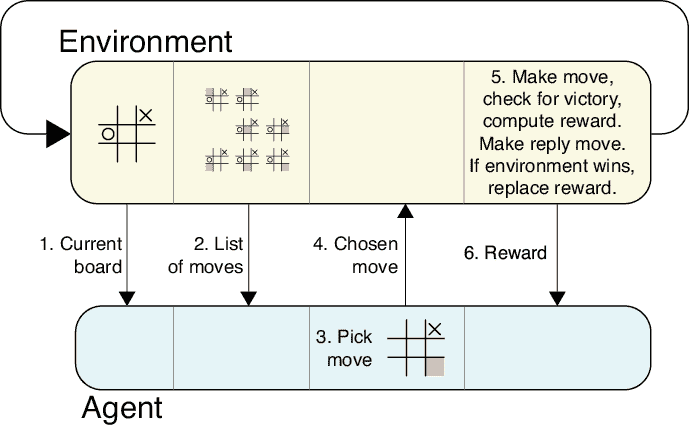

图 21-2：井字游戏中玩家与环境之间的基本信息交换循环

在第 3 步中，代理基于任何喜欢的方法选择一个动作。例如，它可以随机选择，或者查询在线资源，或者使用它对之前游戏的记忆。在强化学习中，挑战的一部分是设计一个能够充分利用我们为其提供的资源的代理。

一旦代理选择了一个动作，它将在第 4 步中将其传达给环境。然后，环境按照第 5 步进行，首先通过在选择的单元格中放置一个 X 来实际执行该动作。接着，环境检查代理是否赢得了比赛。如果是，它会给出一个较大的奖励。否则，它会根据该动作对代理的好处来计算奖励。现在，环境模拟另一个玩家，进行自己的回合。如果环境赢了，它会将奖励设置为一个非常低的数值。如果游戏因环境或代理的动作结束，我们称该奖励为*最终奖励*或*终极奖励*。在第 6 步中，环境将奖励（有时称为*奖励信号*）发送给代理，这样代理就可以学习它选择的动作有多好。如果没有人获胜，我们将返回到循环的开始，代理将再次进行一次回合。

在某些情况下，我们并不直接给代理提供可用的动作列表。这可能是因为可供选择的动作太多，或者它们有太多的变化。此时我们可能会给代理一些指导，或者甚至不提供任何指导。

按照这个程序，代理在开始学习时可能会做出无用或糟糕的动作，但通过下面的技术，我们希望代理能够逐渐学会找到好的动作。为了讨论的方便，我们将简化问题，假设代理提供了一个可供选择的动作列表。

## 强化学习的结构

让我们将井字游戏的例子重新组织和概括成一个更抽象的描述。这将使我们能够涵盖超出轮流游戏的情形。我们将事情组织成三个步骤，接下来我们将逐一讨论这些步骤。

在我们开始之前，先介绍一些术语。在训练开始时，我们将环境置于*初始状态*。在棋盘游戏中，这相当于为新游戏的开始进行布置。在我们的电梯示例中，这可能是将所有电梯轿厢放置在底楼。一个完整的训练周期（例如从开始到结束的游戏）称为*一个回合*。我们通常期望在许多回合中训练代理。

### 步骤 1：代理选择一个动作

我们从图 21-3 开始。

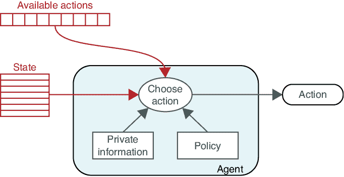

图 21-3：环境向代理提供当前的世界状态以及一系列可选择的动作。代理选择一个动作并将其传达给环境。

记住，环境是所有代理动作发生的世界。环境通过一组数字来完全描述，这些数字统称为*环境状态*，*状态变量*，或简单地称为*状态*。这可能是一个简短的列表，也可能是一个非常长的列表，具体取决于环境的复杂性。在棋盘游戏的情况下，状态通常由所有棋子在棋盘上的位置以及每个玩家持有的任何游戏资产（如游戏币、能量增强、隐藏卡牌等）组成。

然后，智能体从可用的动作中选择一个。我们常常将智能体拟人化，谈论它如何“希望”达成某个结果，比如赢得一场游戏或调度电梯使得没人需要等太长时间。在基本的强化学习中，智能体处于空闲状态，直到环境告诉它该采取行动。然后，智能体使用一种叫做*策略*的算法，以及智能体可能访问的任何*私有信息*（包括它从先前的回合中学到的知识）来选择一个动作。

我们通常将智能体的私有信息视为一个数据库。它可能包含可能策略的描述，或者记录在先前状态中采取的动作以及得到的奖励的某种历史记录。与此相对，策略是一个通常由一组参数控制的算法。这些参数通常会随着智能体的游戏进行而变化，在此过程中智能体会搜索更好的动作选择策略。

我们通常不认为智能体执行其动作。相反，选择的动作会被报告给环境，由环境负责执行该动作。这是因为环境负责状态的管理。回到我们的电梯示例，如果智能体指示一辆电梯从 13 楼移动到 8 楼，智能体并不会更新状态来将电梯置于 8 楼。途中可能会出问题，比如机械故障导致电梯卡住。智能体只是告诉环境它想做什么，环境会尽力去实现这一目标，同时保持状态，使其始终反映当前的情况。在我们的井字游戏中，状态包含了棋盘上当前 X 和 O 标记的分布情况。

### 第 2 步：环境响应

图 21-4 显示了我们强化学习概述的第 2 步。

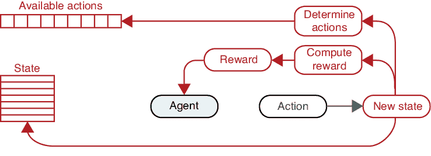

图 21-4：我们强化学习过程的第 2 步。此步骤从计算新状态（最右侧）开始。

在这一过程中，环境处理智能体的动作，生成一个新状态，并处理这一变化所带来的信息。环境将其新状态保存在状态变量中，以便在智能体下一次选择动作时，状态能够反映新的环境。环境还使用其新状态来确定下一步可以供智能体选择的动作。前一个状态和可用的动作完全被它们的新版本所替代。最后，环境提供一个奖励信号，告诉智能体它上次选择的动作有多“好”。“好”的含义完全取决于整个系统在做什么。在游戏中，好的动作是那些能带来更强位置或甚至胜利的动作。在电梯调度系统中，好的动作可能是那些能最小化等待时间的动作。

### 第 3 步：智能体更新自身

图 21-5 展示了强化学习概述中的步骤 3。

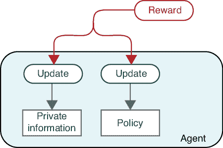

图 21-5：强化学习过程中步骤 3，智能体根据奖励更新自身

在这一步骤中，智能体利用奖励值更新其私有信息和策略参数，这样下次遇到相同情境时，能够建立在从此次选择中学到的东西上。步骤 3 完成后，智能体可能会安静地等待，直到环境告诉它再次行动的时机。或者它可以立即开始为下一步行动进行规划。这对于某些实时系统特别有用，因为奖励通常在新状态的完整计算之前就已经产生。

智能体通常不会只是将每一个奖励存入其私有信息中，而是会以某种方式处理这些奖励，从中提取尽可能多的价值。这甚至可能涉及改变其他行动的值。例如，如果我们刚刚赢得了一场游戏并获得了终极奖励，我们可能希望将一些奖励分配到导致我们胜利的每一步行动上。

强化学习的目标是在这种情境下帮助智能体从反馈中学习，选择带来最佳奖励的行动。无论是赢得游戏、调度电梯、设计疫苗还是操作机器人，我们都希望创建一个能够*从经验中学习*的智能体，使其能够尽可能有效地操控环境，带来积极的奖励。

### 回到大局观

现在我们已经了解了整体方法，让我们来看一些大局观的问题。当智能体更新其策略时，它可能能够访问整个状态的所有参数，或者只访问其中的一部分。如果智能体能够看到整个状态，我们称它为具有*完全可观察性*，否则它只有*有限可观察性*（或*部分可观察性*）。我们可能给智能体仅限的可观察性，其中一个原因是某些参数可能计算成本非常高，而我们不确定它们是否相关。因此，我们限制智能体访问这些参数，以观察这样做是否会影响智能体的表现。如果不包含这些参数不会造成任何伤害，我们可以从此以后完全忽略它们，节省计算精力。或者我们可以仅在看似必要时计算这些参数并使其可见。部分可观察性的另一个例子是我们正在教系统玩一款扑克牌游戏。我们不会向正在学习的系统揭示对手手中有哪些牌。

一旦我们开始考虑如何利用反馈来训练代理，就会发现自己面临两个有趣的问题。首先，当我们获得最终奖励时（例如赢得或输掉一场游戏），我们希望将这一奖励分配给我们沿途做出的每一个决策。假设我们正在玩一场游戏，并做出了一个获胜的决策。这个最终的决策会得到很好的反馈，但中间的步骤同样至关重要，我们应该记住它们也促成了胜利。这样，如果我们再次看到这些中间的棋盘，我们更有可能选择那个能够带来胜利的决策。以这种方式分配最终奖励的问题叫做*信用分配问题*。同样地，如果我们输了，我们也希望让那些导致失败的步骤承担一些责任，这样我们就不太可能再次选择它们。

其次，假设在某一时刻，代理看到了一种它曾经见过的情境（比如一个游戏棋盘），并且在之前尝试过一个获得相对较好分数的动作。但它还没有尝试过其他可能的动作。它应该选择那个已知回报的安全动作，还是冒险尝试一个可能会失败或者带来更大成功的新动作？我们需要在每次选择动作时做出决定，是要冒险探索未知的行动，看看它能带我们去哪里，还是选择我们已经尝试过的安全行动，*利用*我们已经学到的东西。这就是*探索还是利用困境*。设计强化学习系统的一部分任务就是思考我们如何平衡已知与未知、保证与风险之间的问题。

### 理解奖励

为了使代理表现得尽可能好，它应该受到一个策略的引导，使代理选择那些能带来最高奖励的行为。理解奖励的性质，并学会明智地使用奖励，是非常值得投入的时间。让我们深入探讨一下。

我们可以区分两类奖励：*即时奖励*和*长期奖励*。即时奖励是我们迄今为止关注的重点。环境在执行一个动作后，立即将这些奖励反馈给代理，就像我们在图 21-2 中看到的那样。长期奖励则更为广泛，指的是我们的整体目标，比如赢得一场游戏。

我们希望在考虑每次游戏或回合中的所有其他奖励的背景下，理解每个即时奖励。奖励的解释方式有很多种，不同的方式会让它们对我们产生不同的意义。让我们来看一种流行的方法，称为*折扣未来奖励（DFR）*。这是一种解决信用分配问题的方法，或者说，确保所有带领我们走向成功的行为都能共享最终的胜利。

为了理解 DFR（动态未来奖励）是如何工作的，我们需要稍微拆解一下奖励过程。假设我们是一个在玩游戏的代理。游戏结束后，我们可以将我们在这局游戏中获得的所有奖励按顺序列出，并记录下为这些奖励所做的操作。将所有奖励加起来，我们就得到了这局游戏的*总奖励*，如图 21-6 所示。

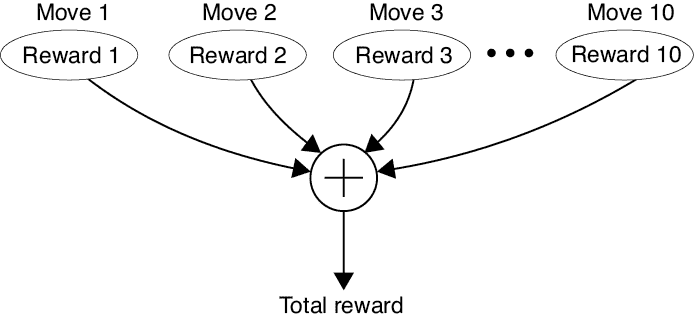

图 21-6：与任何回合相关的总奖励是从回合的第一步到最后一步所获得的所有奖励的总和。

我们可以将这个列表中的任意一部分加起来，例如前五个条目，或最后八个条目。让我们从第五个操作开始，将从此处到游戏结束的所有奖励加起来，如图 21-7 所示。

图 21-7 展示了与游戏第五个操作相关的*总未来奖励*（TFR）。它是第五个操作及其之后所有操作所带来的总奖励的一部分。

游戏的第一次操作是特别的，因为它的总未来奖励与游戏的总奖励相同。由于我们至今所获得的奖励总是零或正数，每个后续操作的 TFR 都等于或小于前一个操作的 TFR。

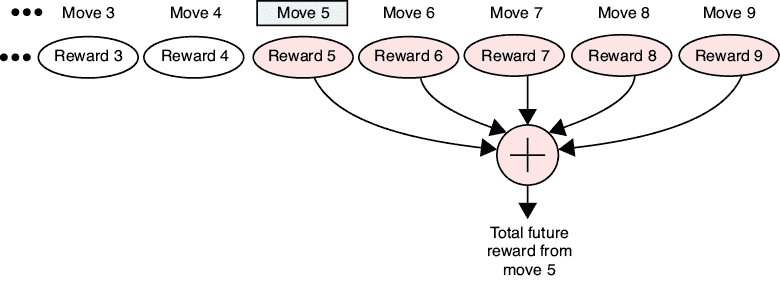

图 21-7：任何操作的总未来奖励是该操作奖励与该操作之后所有其他操作奖励的总和，直到本局结束。

总未来奖励是一个很好的描述，说明了某一特定操作对我们刚完成的游戏的贡献，但它并不是预测该操作在未来游戏中可能有多大作用的最佳方式，即使它们从完全相同的操作序列开始。这是因为现实环境是不可预测的。如果我们在玩一款多人游戏，我们不能确定其他玩家（或玩家们）在下一局中是否会像上一局那样行动。如果他们做出了不同的操作，那么这可能会改变游戏的轨迹，从而也会改变我们所获得的奖励，甚至可能改变我们是赢还是输。即使我们在玩单人游戏，我们也可能是在用一副洗过的扑克牌玩，或者是在玩带有伪随机数的电脑游戏，因此即使我们按以前相同的方式玩，我们也不能确定未来会发生什么。

立即奖励更加可靠。我们可以想象两种类型的立即奖励。第一种奖励告诉我们刚才所做操作的质量，*在*环境做出回应之前。例如，在我们的井字棋游戏中，如果代理在某个格子里放置了一个 X，他们可以在环境回应之前，得到一个*即时奖励*，这个奖励描述了玩家如何为未来的胜利做准备。这种奖励是完全可预测的。如果我们再次面对相同的环境并做出相同的操作，我们会得到相同的奖励。

第二类奖励告诉我们在环境响应之后我们刚刚做出的动作的质量，因此奖励可能会受到环境动作的影响。这种类型的奖励，我们可以称之为*结果奖励*，它不像即时奖励那样可预测，因为每次我们做出动作时，环境的响应可能会不同。

让我们来比较这两者。假设我们正在训练一个由智能体驱动的机器人如何使用遥控器打开设备。它可能会拿起遥控器，按下电源按钮，然后将遥控器放回，重复做同样的事情 100 次，获得高奖励。但在这个过程中，电池一直在消耗，所以第 101 次机器人重复这个过程时，设备无法打开。如果智能体得到的是按下按钮时的即时奖励，也就是在环境响应*之前*计算并返回的奖励，智能体将获得大量奖励，因为它做对了事情。另一方面，结果奖励是在环境响应*之后*计算并返回的，将会很低，甚至为 0，因为设备未能打开。

从现在开始，当我们提到即时奖励时，我们将使用结果奖励。

当某件事连续 100 次有效，但第 101 次失败时，那就是一个*惊讶*。

处理惊讶的情况非常重要，因为大多数环境都是不可预测的。一般来说，我们采取的每个行动都是为了带来一个结果。因此，即使我们不能确定会发生什么，等待看到这个结果也是理解我们行动是否是一个好选择的重要部分。

我们说真实的环境因为其中的不确定因素是*随机的*。相比之下，一个完全可预测的环境（比如完全基于逻辑的游戏）是*确定性的*。不确定性（或者*随机性*）的程度可以有所不同。如果不确定性低（即环境大致上是确定性的），那么我们可能会相当有信心地认为我们刚刚获得的奖励很可能在未来的游戏中重复，或者几乎如此。在不确定性非常高的情况下（也就是说，在一个主要是随机的环境中），我们必须假设，如果我们重复相同的动作，任何关于未来奖励的预测都应被视为仅仅是估算。

我们通过*折扣因子*来量化对环境随机性或不确定性的估计。这个数值介于 0 和 1 之间，通常用小写的希腊字母*γ*（gamma）表示。我们选择的*γ*值代表我们对环境可重复性的信心。如果我们认为环境接近于确定性的，并且每次给定动作都能获得相似的奖励，我们会将*γ*设置为接近 1 的值。如果我们认为环境是混乱且不可预测的，我们会将*γ*设置为接近 0 的值。

我们需要以一种有原则的方式将意外的惊喜考虑到我们已经学习到的奖励中。实现这一点的一种方法是创建一个修改版的总未来奖励，考虑到我们对游戏是否会以相同方式继续进行的信心。我们通常会将高的修改版 TFR 值附加在我们有信心的动作上，而将较低的值附加在其他动作上。

我们可以使用折扣因子来创建一个称为折扣未来奖励（DFR）的总未来奖励版本。与为 TFR 加总所有动作之后的奖励不同，我们从即时奖励开始，然后通过将后续奖励分别乘以*γ*，将其逐步折扣。未来一步的奖励乘以*γ*一次，接下来的奖励乘以*γ*两次，依此类推。这考虑了我们对未来奖励的可靠性逐渐降低的事实。此技术在图 21-8 中有图示说明。

请注意，在图 21-8 中，每个后续的值都比前一个值多乘以一次*γ*。这些增加的乘法可能会对每个奖励对总和的贡献量产生显著影响。

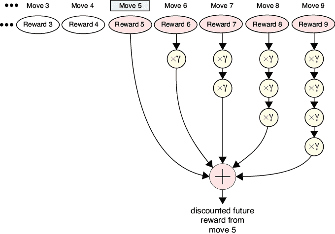

图 21-8：通过将即时奖励、下一个奖励乘以*γ*、下一个奖励再乘以*γ*两次，以此类推，来得到 DFR。

让我们看看这个实际应用。我们可以考虑在一局游戏中的开局动作所获得的奖励和折扣后的未来奖励，使用不同的*γ*值。图 21-9 展示了一个假想游戏中 10 步的即时奖励。

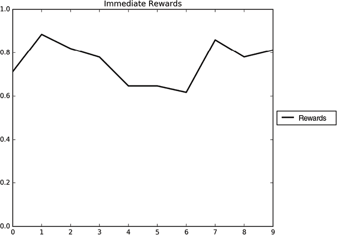

图 21-9：一个有 10 步的游戏的即时奖励。游戏结束时没有明确的赢家。

对这些奖励应用不同的未来折扣，参照图 21-8，我们得到了图 21-10 中的曲线。请注意，随着折扣因子*γ*的减小，奖励很快就会降到 0。这意味着我们对未来的预测不再那么确定。

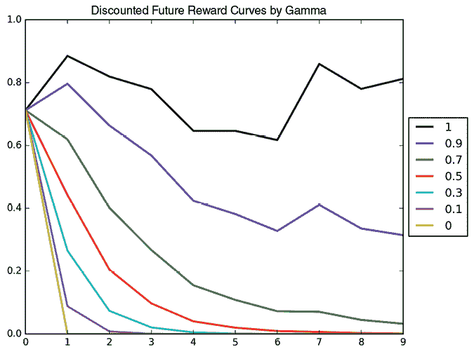

图 21-10：在不同的*γ*值下，折扣后的图 21-9 奖励。

如果我们将图 21-10 中每条曲线的值加起来，我们就得到了在不同*γ*值下，第一步动作的折扣未来奖励。这些 DFR 在图 21-11 中显示了出来。请注意，随着我们认为未来变得越来越不可预测（也就是*γ*变小），DFR 也变得更小，因为我们对获得这些未来奖励的信心降低了。

当*γ*接近 1 时，未来的奖励几乎没有被削减，所以折扣未来奖励（DFR）接近总未来奖励（TFR）。换句话说，我们是在说，做出这个动作所获得的总奖励很可能与我们如果再次做这个动作所获得的总奖励相似。

但是当*γ*的值接近 0 时，未来的奖励被大幅缩小到几乎不重要的地步，最终我们只剩下即时奖励。换句话说，我们表示对游戏是否会继续像这次一样进行信心很小，因此我们能确定的唯一奖励就是即时奖励。

在许多强化学习场景中，我们通常会选择一个大约为 0.8 或 0.9 的*γ*值来开始，然后随着对系统的随机性和代理学习效果的了解，逐步调整该值。

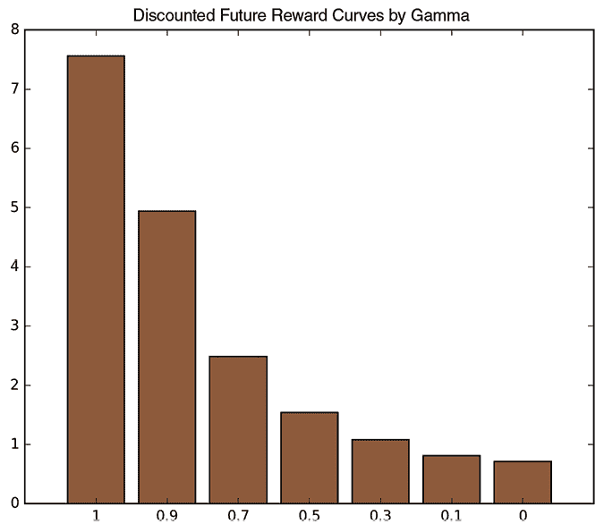

图 21-11：来自图 21-10 的 DFR，适用于不同的*γ*值

到目前为止，我们讨论的都是一些原则和思路，但我们仍然没有一个具体的算法来指导代理在选择行动时的决策。为了制定这样的算法，我们从描述环境开始。

## Flippers

在接下来的部分，我们将探讨学习游戏的实际算法。为了让我们将重点放在算法上而非游戏本身，让我们将井字游戏简化为一个新的单人游戏，我们称之为*Flippers*。

我们在一个三乘三的方格网格上玩 Flippers 游戏。每个格子中都有一个围绕杠杆转动的小瓦片，正如图 21-12 所示。

每个瓦片的一面是空白的，而另一面则有一个点。在每一步操作中，玩家推动一个瓦片使其翻转。如果该面显示的是点，点会消失，反之亦然。

游戏开始时，瓦片处于随机状态。胜利的条件是恰好有三个蓝点显示，并且这些点排列成竖直列或水平行，其他所有瓦片显示为空白。这可能不是有史以来最具智力挑战的游戏，但它将帮助我们澄清算法的逻辑。

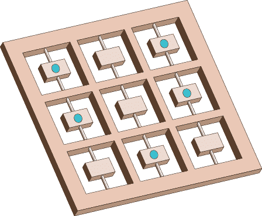

图 21-12：Flippers 游戏的棋盘。每个瓦片一面是空白的，另一面有一个点。游戏中的一步操作包括翻转（或旋转）一个瓦片。

从随机棋盘开始，我们希望在最少的翻转次数内获得胜利。由于对角线不算作胜利条件，因此有六种不同的棋盘配置满足我们胜利的条件：三种水平行和三种竖直列。

图 21-13 展示了一个示例游戏，并附上了表示操作的符号。我们从左到右读取游戏。每个棋盘（除了最后一个）都展示了该步的起始配置，并且有一个格子被用红色高亮标出。这个格子就是将要被翻转的格子。

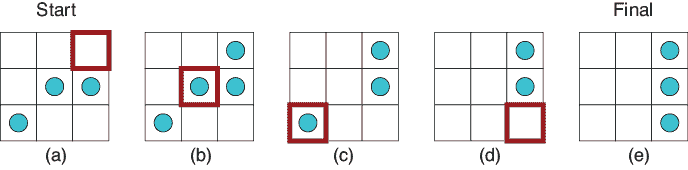

图 21-13：玩 Flippers 游戏。（a）初始棋盘，显示三个点。红色方块表示我们这一步要翻转的瓦片。（b）结果棋盘与（a）相似，但右上角的瓦片已经从空白变为点。我们这一步的操作是翻转中央的瓦片。（c）到（e）展示了游戏进行中的后续步骤。棋盘（e）是一个获胜的棋盘。

现在我们有了一个可以玩的游戏，我们可以看看如何利用强化学习来赢得它。

## L-学习

让我们构建一个完整的 Flippers 学习系统。虽然我们将在下一节中大大改进这个算法，但这个初步版本的表现会差到我们称它为*L-学习*，其中 L 代表“糟糕的”。请注意，L-学习是我们发明的一个垫脚石，目的是帮助我们达到更好的结果，而不是文献中出现的实用算法。毕竟，它很糟糕。

### 基础知识

为了简化问题，我们将使用一个非常简单的奖励系统。在 Flippers 中，我们每走一步都会得到一个即时奖励 0，除了最后一步赢得游戏的那一步。因为 Flippers 是一个非常简单的游戏，每一局都能获胜。为了证明这一点，我们可以从任何一个起始棋盘开始，将所有显示点的瓷砖翻转，这样就没有点显示出来。然后，我们可以翻转任意一行或一列中的三块瓷砖，就算获胜了。因此，任何游戏最多不应超过 12 步。

我们的目标不仅仅是获胜，而是在最少的步数内获胜。最终的胜利动作会获得一个奖励，这个奖励取决于游戏的时长。如果只需要一步就能获胜，奖励是 1。如果需要更多的步骤，这个最终奖励会随着所用步数的增加而迅速下降。这个曲线的具体公式并不重要，重要的是它下降得很快，并且一直在变小。图 21-14 展示了最终奖励与游戏时长的曲线图。

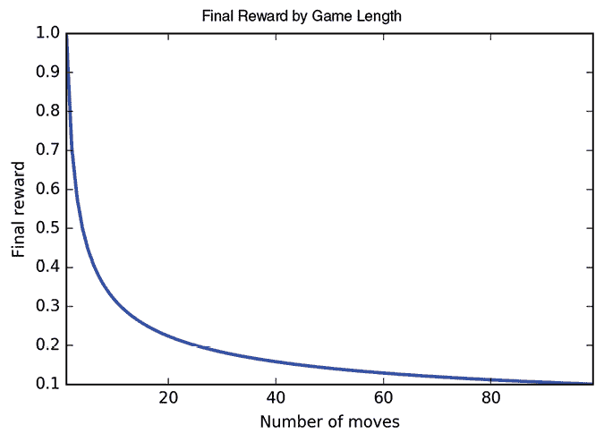

图 21-14：Flippers 中胜利的奖励从一步获胜的 1 开始，但随着获胜所需步数的增加，奖励迅速下降。

我们系统的核心是一个数字网格，我们称之为*L 表*。L 表的每一行代表棋盘的一个状态。每一列代表我们在该棋盘状态下可以采取的九个动作之一。表中每个单元格的内容是一个数字，我们称之为*L 值*。图 21-15 展示了这一点的示意图。

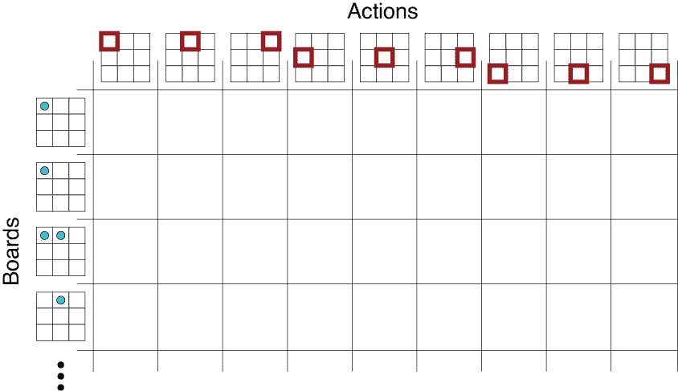

图 21-15：L 表包含 512 种可能的 Flipper 棋盘上空白和点的模式，每一行代表一种模式，每一列代表 9 种可能的动作之一。

这个表很大，但并不算太大。棋盘只有 512 种可能的配置，因此我们需要 512 行。每行有 9 列，总共有 512 × 9 = 4,608 个单元格。我们将使用 L 表来帮助我们选择在每种棋盘状态下最有奖励的行动。为了实现这一点，我们将在表中的每个单元格里填写一个分数：一个基于经验的数字，告诉我们对应的动作有多好。

我们将值保存在 L 表中，以便在学习如何评估动作时使用，并在游戏进行时通过读取这些值来指导我们的动作选择。在开始为 L 表分配值之前，我们首先将每个单元格初始化为 0。随着游戏的进行，我们会记录所有我们所采取的动作。当游戏结束时，我们将回顾整个游戏中我们所做的所有动作，并为每个动作确定一个值。然后，我们将这个值与该动作所在单元格中已有的值结合，产生该动作的新值（我们稍后会详细介绍这一过程）。我们将旧值和新值结合的方式称为*更新规则*。

在游戏进行过程中（无论是在学习阶段还是后来的真实游戏中），我们通过查看该步开始时棋盘的对应行来选择一个动作。我们使用策略来告诉我们在该行中选择哪个动作。

让我们把这些步骤具体化。首先，在每局游戏（或情节）结束后，我们需要确定分配给每个我们所采取的动作的分数。我们使用之前讨论过的总未来奖励，或者 TFR。回想一下，TFR 来源于将所有动作及其奖励排列起来，然后将该动作之后的所有奖励加总起来。

在游戏进行过程中，每一步都获得一个即时的奖励 0，但最终一步会根据游戏的长度获得正向奖励：游戏越短，奖励越大。这意味着我们沿途所采取的每个动作的 TFR 与最终的奖励相同。

第二，我们选择一个简单的更新规则，即在每局游戏结束后，我们为每个单元格计算的 TFR 会直接替换该单元格之前的内容。换句话说，这局游戏中每个动作的 TFR 将成为该单元格的新值，该单元格位于我们采取该动作时所看的棋盘行和我们选择的动作所在的列的交点。

这个简单的更新规则有助于让我们熟悉 L 学习系统的工作方式。但由于它没有将我们的新经验与之前学到的内容结合起来，因此这个规则是该算法表现不佳的一个重要原因。

现在我们在 L 表中有了值，我们需要一个策略来告诉我们在面对某个棋盘配置时应选择哪个动作。假设我们选择对应于行中最大 L 值的动作。如果多个单元格有相同的最大值，我们将随机选择一个。图 21-16 以图形化方式展示了这一过程。

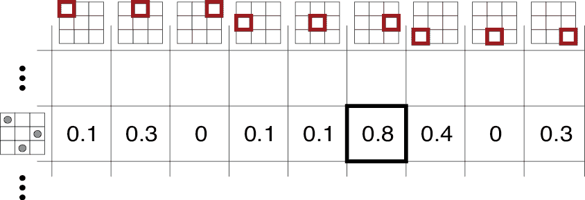

图 21-16：策略步骤包括选择一个动作以应对棋盘上的局面。

在图 21-16 中，我们看到 L 表格的一行，列出了我们可以对最左边的棋盘状态做出的可能动作。每列都保存了在该棋盘状态下采取该动作时最近计算出的 TFR（即时奖励）。请注意，有两列的值为 0，因为我们还没有尝试这些动作。在 L 学习中，我们选择最大的值。在这里，这意味着我们翻转中心右侧的棋盘格。

### L 学习算法

现在我们已经有了进行 L 学习所需的所有步骤。让我们将它们组合成一个功能性但不太完善的强化学习算法。我们从一个包含 512×9 表格并填充零的私有记忆开始，这个表格代表 L 表格。

在第一局游戏的第一步中，代理看到一个棋盘。它在 L 表格中找到该棋盘对应的行，并扫描该行中的九个条目，选择得分最高的动作。因为这些值都是零，所以它会随机选择一个。这种情况会持续一段时间，因为代理会看到很多它以前从未见过的棋盘。棋盘翻转后，代理会考虑新的棋盘，选择新的动作，依此类推，直到它最终赢得游戏（即使所有动作完全随机选择，计算机最终也会产生一个获胜的棋盘）。

当游戏结束时，代理希望将最终奖励分配给所有帮助它赢得胜利的动作。为此，在游戏进行过程中，系统需要保持一个按顺序排列的列表，记录每一步它所执行的动作。

我们稍后会发现，如果每个条目不仅保存选择的动作，还保存更多信息，这个列表会更有用。预见到这一需求，我们假设在每一步之后，代理会保留一个小的组合，包含起始棋盘、代理所采取的动作、收到的即时奖励以及该动作所导致的结果棋盘。图 21-17 展示了这一过程。代理将这些组合保存在一个列表中，游戏开始时该列表为空，每一步后列表都会增加一个组合。

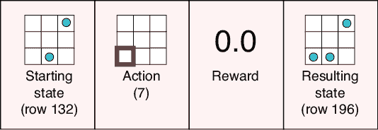

图 21-17：每次我们采取一个动作时，我们都会将一个包含四个值的组合追加到不断增长的组合列表的末尾：起始状态、我们选择的动作、我们收到的奖励以及环境在采取该动作后返回给我们的最终状态。

如图 21-17 所示，我们可以将这个组合保存为一个包含四个数字的列表：起始状态的行号、动作的列号、奖励的值和结果状态的行号。

为了进行第一次移动，我们查看 L 表格中对应起始棋盘的行，并查看该行中的九个数字。我们的策略通常是选择该行中最大的值，但有时也会为了探索而选择其他值。如果所有值都相同（就像我们刚开始时的情况），我们会随机选择一个。

环境为我们翻转那个方块，可能让一个点出现或消失。然后，环境给我们回馈一个奖励以及新的棋盘。我们会把这个动作打包成一个小的集合：我们开始时的棋盘、我们刚刚采取的动作、我们获得的奖励以及因此产生的新状态。我们把这个集合加入到我们动作列表的末尾。

因为我们是单人游戏，环境不会主动采取任何动作。一旦它给我们反馈了，它就会告诉我们采取新动作。因此，我们再次查看当前棋盘，在 L-table 中找到它对应的行，选择该行中最大的单元格，并将其报告为我们的动作。我们会得到一个奖励和一个新状态，并将描述这个动作的四个项目作为一个新集合添加到我们的列表中。

这一过程会一直持续到游戏结束。在最后的反馈中，我们会得到唯一的非零奖励。它是基于我们在游戏中所进行的移动次数的最终奖励，正如我们在图 21-14 中看到的那样，这个奖励会迅速递减。通过这个最终的非零奖励，我们知道游戏结束了，接下来是时候从我们的经验中学习了。

我们从查看我们的动作列表中的集合开始。从概念上讲，我们排列出我们的棋盘状态和相应的动作，以及它们的奖励，如图 21-18 所示。我们逐一查看每个动作，并通过将所有后续奖励相加来找到它的 TFR。在图 21-18 中，计算并不特别有趣，因为除了最后一个奖励，所有即时奖励都是零。但值得注意的是，随着后续步骤的发展，我们将会遇到非零的即时奖励。

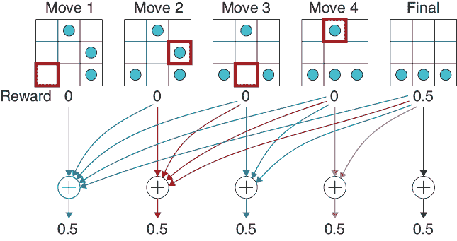

图 21-18：为每个动作找到 TFR。我们将每个动作的即时奖励（直接显示在其下方）与所有后续动作的即时奖励相加。在我们的游戏中，除了最后的奖励，所有即时奖励都是零，因此这些和都是相同的。

然后，我们使用简单的更新规则以及我们所做的动作列表，并将每个动作的 TFR 值放入 L-table 中对应该棋盘的单元格，如图 21-19 所示。

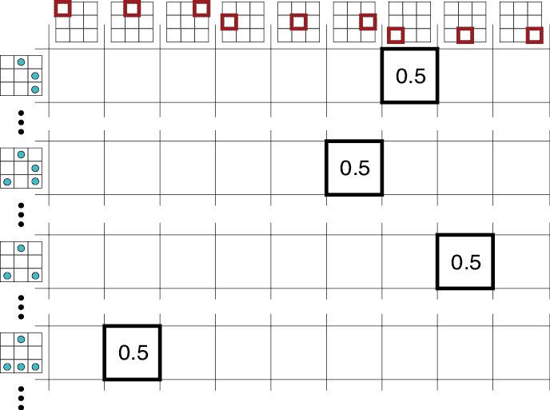

图 21-19：使用每个动作的最新 TFR 值来更新我们的 L-table。我们找到对应我们在执行每个动作时所看到棋盘的行，以及对应我们所采取动作的列。新的 TFR 值会替换掉之前单元格中的任何值。

如果我们想要学习更多，我们会回到流程的起始点并开始一个新游戏。当我们完成后，我们为每个我们执行的动作计算一个 TFR 值，并将其存储在相应的单元格中（覆盖之前的值）。请注意，我们在每次游戏后不会重置 L-table，因此，随着我们玩更多的回合，TFR 会逐渐填满整个表格。

当训练结束，开始实际游戏时，我们使用 L 表来选择动作。也就是说，在每次行动时，我们会呈现一个棋盘，我们查找该行，选择该行中 L 值最大的列，并选择对应的动作。

### 测试我们的算法

让我们看看我们的系统表现如何。我们先进行 3,000 局 Flippers 游戏，从头到尾进行，这样 L 表就可以得到充分填充。图 21-20 显示了在 3,000 局训练后从头到尾玩的 Flippers 游戏。这不是一个很理想的结果。其实有一个简单的两步解法，任何人都能轻松发现：翻转左中间的单元格，然后是左上角的单元格（或者反过来）。然而，我们的算法似乎在随机地游走，直到最终在六步之后偶然找到了解决方案。

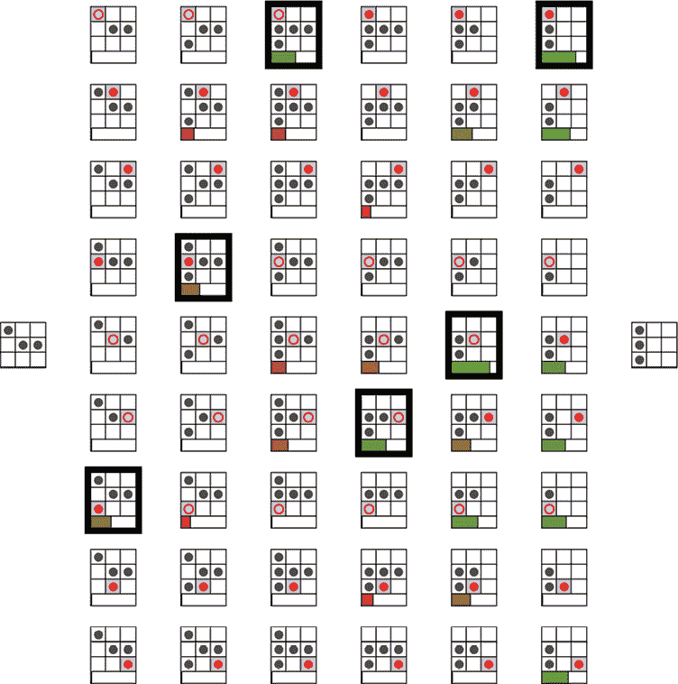

图 21-20：使用 L 表算法经过 3,000 局训练后玩 Flippers 游戏。游戏从左到右阅读。

图 21-20 所示的排列将 L 表的行排列为列，以便更好地适应页面。每一列代表一个棋盘配置（或状态）。每行显示了九个可能的动作，红色高亮显示。粗黑边框表示代理从该列表中选择的动作，导致其右侧列的新棋盘。阴影单元格表示已执行的动作。如果该动作导致出现一个点，则该动作显示为实心红点。如果该动作导致点消失，则显示为红色轮廓点。每个棋盘下方的彩条显示了该棋盘的 L 值，值越大，条形越绿，表示通过折扣未来奖励计算出的 L 值越大。

右侧的棋盘比左侧的棋盘具有更大的 L 值。这是因为这些棋盘有时是游戏随机选择的起始棋盘。如果我们选择了一个好的动作并立即获胜，或者在少数几步内获胜，最终的奖励会很大。

回到这个游戏，从最左边的位置开始，算法的第一步是翻转左下角的单元格，引入一个新点。从这个结果开始，算法接着翻转最左列中间的方块，再次引入一个点。从这个位置，它又翻转了左上角的方块，移除了原本存在的点。游戏以这种方式继续，直到找到解决方案。

我们预计算法会随着更多的训练而改进，结果确实如此。图 21-21 显示了将训练时间延长到 6,000 局后，与图 21-20 相同的游戏。

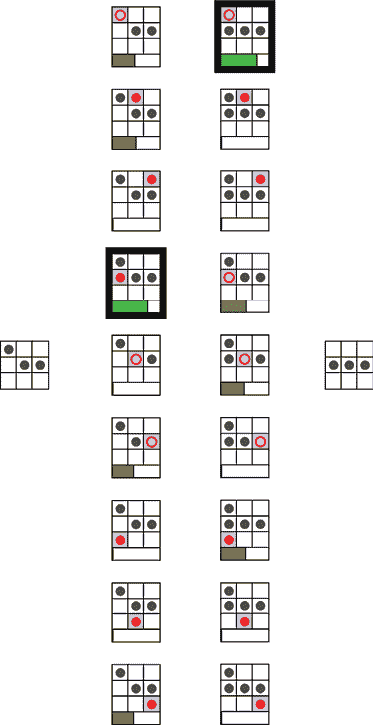

图 21-21：在 6,000 局训练后与图 21-20 相同的游戏

这非常好。算法找到了简单的答案，并直接采取了这个行动。

看起来我们创建了一个很棒的学习和游戏算法。那么为什么我们要给它贴上“L”（差劲）的标签呢？它似乎运作得相当不错。

只要环境保持完全可预测，其实是*没问题*的。记得在本章之前，我们讨论过不可预测的环境。实际上，大多数环境都是不可预测的。基于逻辑的单人游戏，例如我们一直在研究的 Flippers 游戏，是少数完全确定性的活动之一。如果我们的目标是只玩单人游戏，并且这些游戏在完全确定的环境中进行，我们能够完美地执行每一个预定的动作，并且环境每次都作出相同的反应，那么这个算法其实并不糟糕。但是这种确定性的游戏和环境是很少的。例如，一旦有第二个玩家，便会产生不确定性，游戏变得不可预测。在任何环境不完全确定的情况下，L 学习算法都会陷入困境。

让我们来看看原因，然后我们将看到如何解决这个问题。

### 处理不可预测性

因为在电脑上玩 Flippers 时我们没有对手，所以我们拥有一个完全确定性的系统。每次我们做出一个动作，我们都能保证得到相同的结果。但在现实世界中，即便是单人活动也可能发生不可预测的事件。视频游戏会给我们带来随机的惊喜，割草机可能撞到一块石头并跳到一边，或者互联网连接可能会卡顿，导致我们错过在拍卖中做出获胜的出价。

由于处理不可预测性非常重要，让我们在 Flippers 中引入一些人工随机性，看看我们的 L 学习算法如何响应。我们对随机性的模型表现为一辆大卡车，它不时经过我们的游戏区域，震动我们的棋盘。有时，这足以导致一个或多个随机的棋盘格自发翻转。当然，我们仍然希望能够在面对这样的惊讶时玩得愉快并赢得比赛，但我们的 L 学习系统在这种事件面前束手无策。

正是我们的策略和更新规则的结合引发了问题。记得在我们开始学习之前，每一行都是从零开始的。当一场训练游戏最终获胜时，每个动作都根据游戏的时长获得相同的分数，正如我们在图 21-19 中看到的那样。当我们继续进行训练游戏时，下次当我们遇到那个棋盘时，我们会选择具有最大值的单元格。

假设我们正在进行一场训练游戏。我们看到一个曾经作为起始棋盘获得的棋盘，并且我们在两步之内就赢得了它。那两步的 L 表格值得到了很高的分数，所以我们选择得分较高的动作，准备在下一次翻转时获胜。但是就在我们第一次行动后，那辆大卡车咆哮着驶过，震动了我们的棋盘并翻转了一个棋盘格。从这个棋盘开始向前玩，我们最终需要更多的步骤才能获胜。这意味着，如果卡车没有经过，最终从这个动作中得到的 TFR 会更高。

这是问题所在：那个较小的值覆盖了每个导致这场长时间游戏的格子的先前值。换句话说，正因为那次事件，我们所采取的每个行动的 L 值都被降低了。特别是，那一开始就导致胜利的绝佳起手，现在得分很低。当我们在以后的游戏中再次遇到这个棋盘时，可能会发现另一个格子的值比原来那个进行绝佳走法的格子还要大。结果是，这个偶然事件导致我们不再执行到目前为止找到的最佳行动。我们“忘记”了这一步曾经是绝佳走法，因为一次随机事件让它变成了一个糟糕的选择。这个低分使得我们不太可能再选择这一步。

让我们看看这个问题是如何发生的。图 21-22 显示了一个没有不可预测事件的例子。我们从顶部开始，棋盘上有三个点，我们发现该行中最大的值是 0.6，对应于翻转中心格子。我们执行这个操作，假设下一步也选得不错，我们将在两步内获胜，如中间行所示。0.7 的奖励替代了我们第一步时的 0.6，巩固了这一走法作为最好的选择。一切都很顺利。

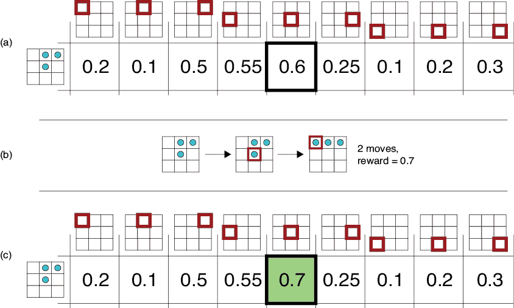

图 21-22：当没有意外事件时，我们的算法表现良好。（a）起始棋盘的 L 表格行。（b）游戏顺利进行，并在两步内获胜。（c）0.7 的值覆盖了所有导致这一成功的表格条目的先前值。

在图 21-23 中，我们介绍了我们的隆隆卡车。就在我们翻转中心瓷砖后，卡车震动了棋盘，右下角的瓷砖被翻转了。这将我们带上了一条全新的道路。假设算法在再进行四步之后最终获得了胜利。总共五步，奖励 0.44 被放置在每个导致成功的格子中。

这真糟糕。只需一笔，我们就“忘记”了我们的最佳走法。在这个例子中，另外两个行动现在得分更高。下次我们遇到这个棋盘时，会选择得分为 0.55 的格子，这样就不能像之前那样让我们一步之内获胜。换句话说，我们的最佳走法现在被遗忘了，我们将永远做出更差的选择。

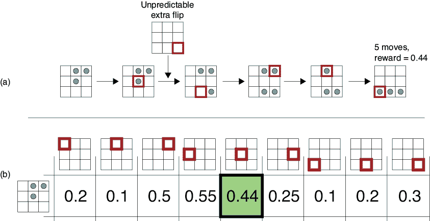

图 21-23：（a）当卡车经过时，它翻转了右下角的格子，导致游戏需要五步才能获胜。（b）新的奖励 0.44 覆盖了之前的 0.6 值。这个格子不再是该行中得分最高的格子。

回想一下，我们曾说过，在训练过程中，我们会偶尔随机选择行中的一个单元格，以探索可能发生的情况。因此，某天我们可能会做出新的选择，或者卡车再次轰隆而过，帮助我们记住这个单元格，但可能很久才会发生一次。直到卡车经过并再次设置正确这个动作时，其他地方可能已经出错。L-table 几乎总是比应有的状态差，因此，平均而言，使用 L-学习的游戏会更长，奖励也较低。一个意外使我们忘记了如何好好玩这个棋盘。

这就是我们称这个算法为糟糕的原因。

但并非一切都丧失了。我们之所以查看这个算法，是因为其较差的版本可以被改进。大部分算法本身没有问题。我们只需要修复它在面对不可预测性时的缺陷。从现在开始，我们假设在玩 Flippers 时，可能会有一辆大卡车突然驶过，造成不确定性，偶尔会翻动一个随机的方块。在接下来的章节中，我们将看到如何优雅地处理这种不可预测事件，并改进学习算法，使其更有效。

## Q-学习

不费太大力气，我们可以将 L-学习升级为一个如今广泛使用的更有效的算法，称为*Q-学习*（Q 代表质量）（Watkins 1989；Eden、Knittel 和 van Uffelen 2020）。Q-学习看起来和 L-学习很像，但自然地，它用 Q-值填充 Q-table。最大的改进是，Q-学习在随机或不可预测的环境中表现良好。

为了从 L-学习转向 Q-学习，我们进行三个升级：我们改进了 Q-table 单元格中新值的计算方式，如何更新现有值，以及我们选择动作的策略。

Q-table 算法基于两个重要原则。首先，我们*期望*结果中存在不确定性，因此从一开始就将其考虑在内。第二，我们在过程中逐步计算新的 Q-table 值，而不是等到最终的奖励。这第二个想法使我们能够处理那些持续很长时间的游戏（或过程），甚至可能永远无法得出结论的情况（如电梯调度）。通过逐步更新，我们能够在即使没有最终奖励的情况下，开发出有用的 Q-table 值。

为了让这个工作有效，我们还需要升级上一节中环境的超简单奖励过程。环境不再总是除最后一步外奖励零，而是会根据每次采取的行动立即返回估计每个动作质量的奖励。

### Q-值与更新

Q-值是一种近似未来总奖励的方法，即使我们不知道事情最终会如何发展。要找出 Q-值，我们将即时奖励与所有未来可能的奖励加在一起。到目前为止，这不过是总未来奖励的定义。变化在于，现在我们通过使用下一个状态的奖励来寻找未来的奖励。

在图 21-17 中，我们为每个动作保存了四个信息：起始状态、我们选择的动作、我们获得的奖励和该动作带来的新状态。我们保存了这个新状态，以便现在使用它，并用它来计算其余的未来奖励。

关键的见解是注意到我们的下一步从那个新状态开始，并且通过遵循我们的策略，我们总是会选择 Q 值最大的动作。如果那个单元格的 Q 值是*该*动作的总未来奖励，那么将那个单元格的值与我们即时的奖励相加就能得到当前单元格的总未来奖励。这是可行的，因为我们的策略保证了我们始终为任意给定的棋盘状态选择 Q 值最大的单元格。

如果下一个状态中的多个单元格共享最大值，那么当我们到达那里时，选择哪个单元格并不重要。现在我们关心的只是来自下一个动作的总未来奖励。

图 21-24 直观地展示了这个概念。请注意，我们在此步骤中计算的值并不是最终的 Q 值，但它几乎接近。

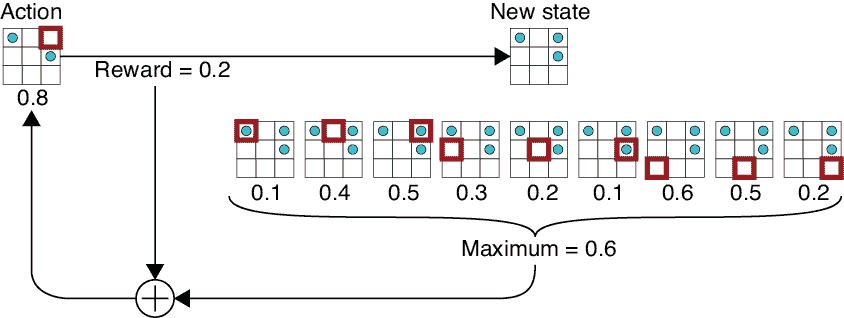

图 21-24：计算单元格新 Q 值的过程的一部分。新值是两个其他值的和。第一个值是采取与该单元格对应的动作所得到的即时奖励，这里是 0.2。第二个值是属于新状态的所有动作中 Q 值最大的，这里是 0.6。

缺失的步骤是 Q 学习如何考虑随机性。我们不会使用下一个动作单元格的值，而是使用该单元格的折扣值。请回忆，这意味着我们将其乘以我们的折扣因子，一个介于 0 到 1 之间的数值，通常写作*γ*（伽马）。如前所述，*γ*的值越小，我们就越不确定未来不可预测的事件不会改变这个值。图 21-25 展示了这一概念。

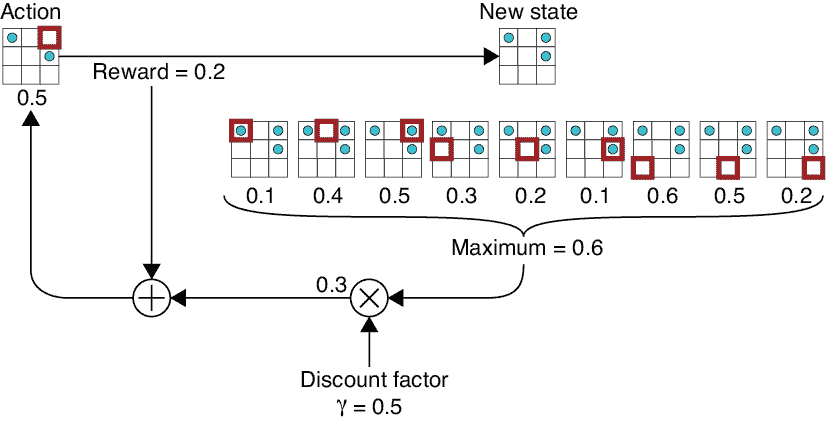

图 21-25：为了找到 Q 值，我们修改了图 21-24，加入了折扣因子γ，该因子根据我们对未来不可预测事件的信心来减少未来奖励。

请注意，图 21-8 中显示的折扣未来奖励中的多个乘法操作是由这个方案自动处理的。第一次乘法在此显式地包含在内。对于之后的状态的乘法，会在评估下一个状态的 Q 值时考虑。

现在我们已经计算出了一个新值，如何更新当前的值呢？在 L-learning 中我们看到，面对不确定性时，单纯地用新值替换当前值并不是一个好选择。但我们仍然需要以某种方式更新单元格的 Q 值，否则我们永远无法改进。

解决这个难题的 Q-learning 方法是将新单元格的值更新为旧值和新值的混合。混合的程度由我们指定的一个参数决定。也就是说，混合由一个介于 0 和 1 之间的数字控制，通常写作小写希腊字母*α*（alpha）。在*α* = 0 的极端值下，单元格中的值完全不变。在另一个极端值*α* = 1 时，新的值完全替代旧的值，就像在 L-learning 中一样。介于 0 和 1 之间的*α*值会混合这两个值，如图 21-26 所示。

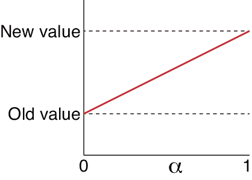

图 21-26：*α*的值让我们能够平滑地从旧值（当*α* = 0 时）过渡到新值（当*α* = 1 时），或者是介于两者之间的任何值。

参数*α*被称为*学习率*，它由我们来设置。遗憾的是，这是反向传播更新步骤中也使用的同一个术语，但通常上下文会使我们明确指的是哪种“学习率”。

在实际操作中，我们通常会将*α*设置为接近 1 的值，例如 0.9 甚至 0.99。接近 1 的这些值使得新值在单元格中占主导地位。例如，当*α* = 0.9 时，存储在单元格中的新值为旧值的 10%，和新值的 90%。但是即使是 0.99 的值与 1 也有很大不同，因为即使记住旧值的 1%，也足以带来差异。

使用我们的*α*值，我们让系统通过一些训练，看看它的表现如何。然后我们可以根据观察到的结果调整这个值，再次尝试，重复这个过程，直到找到看起来最有效的*α*值。我们通常会自动化这个搜索过程，这样就不需要我们自己手动调整了。

这里面有一个显而易见的问题，那就是整个论证是基于在下一状态中就拥有正确的 Q 值，尽管我们还没有到达那个状态。那么，这些 Q 值是从哪里来的呢？如果我们已经有了正确的 Q 值，为什么还要做这些呢？

这些问题很有道理，我们将在了解了新的策略规则后再来讨论。

### Q-Learning 策略

回想一下，策略规则告诉我们在给定环境状态时选择哪个动作。在学习时，我们使用这个策略，之后在实际游戏中也使用它。我们在 L-learning 中使用的策略是通常选择当前棋盘对应的表格行中具有最高 L 值的动作。这是有道理的，因为我们已经学到这是能够带来最高奖励的动作。但这个策略并没有明确解决探索与利用的困境。在一个不可预测的环境中，某个动作带来的最佳奖励有时可能并不是最好的奖励，而完全没有尝试过的动作，如果我们给它们一个机会，可能会带来更好的结果。

但是，我们并不希望每次都随机选择动作，因为我们确实希望偏向那些我们知道会带来高回报的动作。我们只是希望不是每次都这样做。Q 学习选择了一条中间道路。我们不是总是选择得分最高的动作，而是*几乎*总是选择得分最高的动作。其余的时间我们会选择其他的动作之一。让我们来看两种常见的策略来实现这一点。

我们将要查看的第一个方法叫做*epsilon-greedy*（或*epsilon-soft*）（这些名称来源于希腊小写字母*ε*，epsilon，因此有时也会出现*ε*-greedy 和*ε*-soft）。这两种算法几乎相同。我们从 0 到 1 之间选择一个*ε*值，通常这个值很小，接近 0，比如 0.01 或更小。

每当我们处于某一行并准备选择一个动作时，我们从系统请求一个 0 到 1 之间的随机数，这个数来自均匀分布。如果随机数大于*ε*，那么我们像平常一样选择得分最高的 Q 值对应的动作。但在那种偶尔的情况下，如果随机数小于*ε*，我们会从该行的所有其他动作中随机选择一个。在这种方式下，我们通常会选择最有前景的动作，但偶尔也会选择其他动作，看看它会带我们走向哪里。图 21-27 以图形方式展示了这一思想。

我们要查看的另一种策略叫做*softmax*。这与我们在第十三章中讨论的 softmax 层的工作方式相似。当我们对一行的 Q 值应用 softmax 时，它们会以一种复杂的方式进行转换，使得它们的总和为 1。这让我们能够将结果值视为一个离散的概率分布，然后根据这些概率随机选择其中一个值。

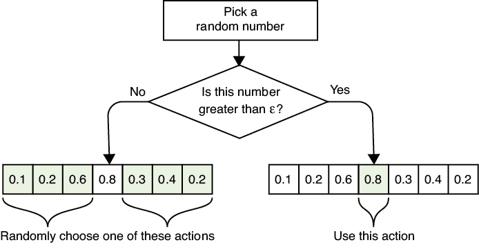

图 21-27：epsilon-greedy 策略

这样，我们通常会选择得分最高的动作。偶尔，我们会选择得分第二高的动作。更少的时候，我们会选择得分第三高的动作，依此类推。图 21-28 展示了这一思想。

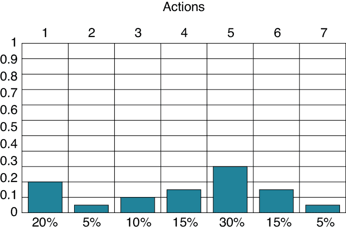

图 21-28：softmax 策略暂时缩放行中的所有动作，使它们的总和为 1。

这种方案的一个吸引人的特点是，选择每个动作的概率始终反映了与给定状态相关的所有动作的最新 Q 值。因此，随着值的变化，选择动作的概率也会变化。

softmax 进行的特定计算有时会导致系统未能稳定在一组良好的 Q 值上。一个替代方法是*mellowmax*策略，它使用稍有不同的数学（Asadi 和 Littman 2017 年）。

### 将所有内容结合起来

我们可以用几句话和一个图示来总结 Q 学习的策略和更新规则。用语言描述时，当需要执行一步时，我们使用当前的状态来找到 Q 表中的相应行。然后我们根据策略（epsilon-greedy 或 softmax）从该行中选择一个动作。我们执行这个动作，得到一个奖励和一个新状态。现在，我们希望更新我们的 Q 值，以反映从奖励中学到的东西。我们查看新状态下的 Q 值，并选择其中最大的一个。我们根据环境的不可预测性对其进行折扣，然后将其加到我们刚得到的即时奖励上，并将该新值与当前的 Q 值进行混合，生成我们刚采取的动作的新 Q 值，并将其保存。

图 21-29 总结了这个过程。

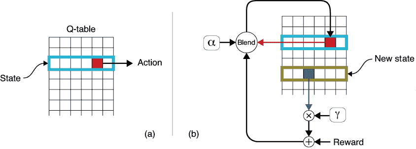

图 21-29：Q 学习策略和更新过程。（a）选择一个动作。（b）为该动作找到新的 Q 值。

当我们开始执行一个动作时，如图 21-29(a)所示，我们查看当前状态对应的 Q 表行，并用我们的策略来选择一个动作，这里用红色表示。这个动作会传达给环境，环境会做出回应，给出奖励和新状态。如图 21-29(b)所示，我们找到新状态对应的 Q 表行，并选择其中最大的奖励（假设我们到达新状态时会选择最大的动作，虽然我们知道这并不总是如此。我们很快会回到这个问题）。我们通过将该奖励乘以*γ*来对其进行折扣，然后将其加到我们此时的即时奖励中，从而得到原来选择的动作的新值。我们用*α*将旧值和新值混合，这个新值就被放入 Q 表中原来动作的单元格里。

策略参数*ε*、学习率*α*和折扣因子*γ*的最佳值必须通过反复试验来找到。这些因素与我们执行的任务的具体性质、环境的特性以及我们使用的数据密切相关。经验和直觉通常能为我们提供良好的起点，但没有什么能比传统的试错法更能找到任何特定学习系统的最佳值。

### 居于眼前的大象

之前我们承诺会回到一个问题，那就是我们需要准确的 Q 值来评估更新规则，但这些值本身是通过更新规则计算出来的，而更新规则使用的是后续的值，依此类推。每一步似乎都依赖于下一步的数据。我们怎么能使用那些尚未创建的数据呢？

这是解决该问题的简单美丽答案：我们忽略它。令人难以置信的是，我们可以将 Q 表初始化为全零，然后开始学习。刚开始时，由于 Q 表中没有任何信息帮助系统选择一个单元格，它的行动会显得非常混乱。系统会随机选择一个单元格并执行该操作。结果状态下的所有动作也都是零，因此更新规则无论我们使用什么值的*α*和*γ*，都会使该单元格的得分保持为零。

我们的系统进行的游戏看起来混乱且愚蠢，做出糟糕的选择，错失明显的好动作。但最终，系统偶然发现了胜利。这个胜利会得到一个正数的奖励，这个奖励会更新导致胜利的动作的 Q 值。稍后，某个导致我们执行该动作的动作会融入一些巨大的奖励，因为 Q 学习的步骤会预见到下一个状态。这个波动效应会继续缓慢地向后影响系统，因为新的游戏进入到那些曾经导致胜利的状态。

请注意，信息并没有真正地向后移动。每场游戏从头到尾进行，每次更新都在每一步后立即进行。信息看似向后移动，是因为 Q 学习涉及在评估更新规则时向前看一步。下一步的得分能够影响当前步骤的得分。

在某个时刻，感谢我们的策略，有时尝试新的动作，每个动作最终都会通向胜利的路径，这些值也会影响到越来越早的动作。最终，Q 表会填充上准确预测每个动作奖励的值。进一步的游戏只会提高这些值的准确性。这个过程被称为*收敛*。我们说 Q 学习算法*收敛*了。

我们可以从数学上证明 Q 学习是收敛的（Melo 2020）。这种证明保证了 Q 表会逐渐变得更好。但我们无法说出这个过程需要多长时间。表格越大，环境越不可预测，训练过程所需的时间也越长。收敛的速度还取决于系统试图学习的任务的性质、提供的反馈，当然，还有我们为策略变量*ε*、学习率*α*和折扣因子*γ*选择的值。像往常一样，没有什么能代替通过反复试验来学习任何特定系统的独特性。

请注意，Q 学习算法很好地解决了我们之前讨论的两个问题。奖励分配问题要求我们确保引导胜利的动作得到奖励，即使环境没有提供这个奖励。更新规则的性质解决了这个问题，将成功动作的奖励从导致胜利的最终步骤反向传播，直到第一步。算法还通过使用 epsilon-greedy 或 softmax 策略解决了探索或利用的困境。它们都偏好选择那些已被证明成功的动作（利用），但有时也会尝试其他动作，看看可能的结果是什么（探索）。

### Q 学习法在行动中

让我们让 Q 学习法发挥作用，看看它是否能在不可预测的环境中学会如何玩《翻转者》游戏。衡量算法表现的一种方式是让训练过的模型进行大量随机游戏，并看看它们需要多长时间。算法在找到好的动作并消除坏动作方面做得越好，每局游戏在胜利前所需的步数就越少。

最长的良好游戏是从九个格子都显示点开始的。然后，我们需要翻转六个格子才能获胜。所以，我们希望看到我们的算法每局游戏都能在六步或更少的步骤内获胜。

为了查看训练对算法的影响，我们来看一下不同训练量下大量游戏长度的图表。我们的图表显示了在一个具有相当程度不可预测性的环境中，从每种可能的 512 种点和空格的起始模式开始的游戏结果。我们为每个起始棋盘玩了 10 局游戏，总共进行了 5120 局游戏。我们会中断任何超过 100 步的游戏。

我们将*α*设置为 0.95，因此每个格子在更新时只保留 5%的旧值。这样，我们不会完全失去之前学到的东西，但我们期望新的值比旧的值更好，因为它们将基于改进后的 Q 表值来选择下一步行动。为了选择动作，我们采用了一个相对较高*ε*值为 0.1 的 epsilon-greedy 策略，鼓励算法每 10 次中有 1 次去尝试新的动作。

我们通过模拟每次移动后有 1/10 的概率随机卡车经过，每次翻转一个随机的瓦片，引入了很多不可预测性。为了解决这个问题，我们将折扣因子*γ*设置为 0.2。这个较低的值意味着我们只对未来的走势有 20%的确定性，因为这些随机事件的影响。我们将这个值设置得比我们知道卡车引入的噪声水平（10%）还要高，因为我们预计大多数经过良好操作的游戏只有三到四步长，因此它们出现随机事件的概率低于十步或更多步的游戏。

这些 *α*、*γ* 和 *ε* 的值基本上是基于经验的猜测。特别是，*γ* 的选择是基于我们对随机事件发生频率的了解，而这种情况我们通常无法提前知道。在实际情况中，我们会通过实验调整参数，以找到最适合此游戏和噪音量的设置。

图 21-30 显示了在仅训练 300 场游戏后的游戏时长。算法已经找到了很多快速获胜的方法。

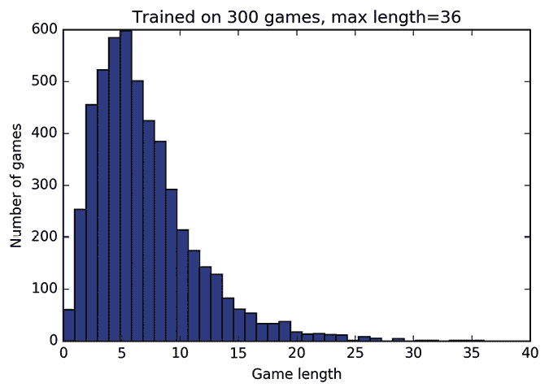

图 21-30：使用经过 300 场游戏训练的 Q 表，在 0 到 40 步之间获胜所需的游戏数量（我们对每个 512 种起始局面进行了 10 次游戏）

“瞬间获胜”位于第一列，对应于零步。这些游戏的起始局面已经有三个点，排列成垂直列或水平行。由于有六种可能的获胜局面，我们对所有可能的局面进行了 10 次游戏，因此我们从一个获胜局面开始了 60 次游戏。

由于 图 21-30 中没有一场游戏达到了我们的 100 步限制，我们可以看到算法从未陷入长期循环。循环可能只是两个状态永远交替，或者是一串长的状态，它最终会回到自身。Flippers 中是有可能出现循环的，而且基本的 Q-learning 算法并没有明确防止系统进入循环。

我们可以说系统“发现”了循环无法获胜，因此不会带来任何奖励，所以它学会了避免循环。如果某个时候它确实回到了先前访问过的状态，无论是通过做出那个动作，还是通过随机引入的翻转，*ε* 的相对较高值意味着它有很大的机会最终选择一个新的动作，从而进入一个新的方向。

让我们将训练游戏的数量提高到 3,000，如 图 21-31 所示。

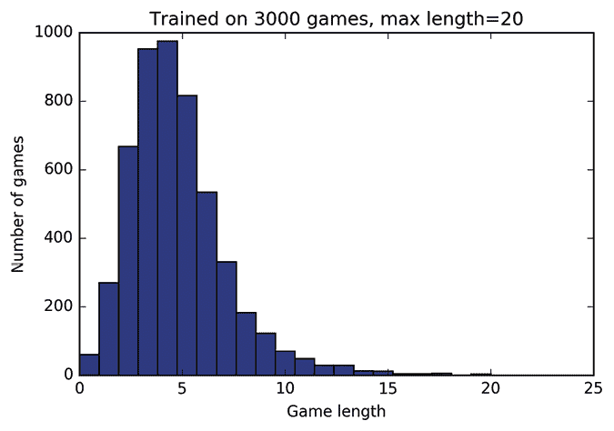

图 21-31：根据训练 3,000 场游戏的 Q 表，进行 5,120 场游戏后，不同长度的游戏数量

该算法已经学到了很多东西。现在最久的游戏仅需 20 步，大多数游戏在 10 步内就能获胜。可以看到，四步和五步周围的集群更密集，效果相当不错。

让我们看看在这 3,000 轮训练后进行的一场典型游戏。图 21-32 显示了这场从左到右进行的游戏。该算法用了八步才赢得了比赛。

图 21-32 的结果并不令人鼓舞。仅从起始局面看，我们就能看到至少四种不同的方式在四步内赢得游戏。例如，可以先翻转左下角的方块，然后翻转中间和最右列的三个点。但我们的算法似乎在随机翻动方块。它最终偶然找到了解法，但这绝对不是一个优雅的结果。

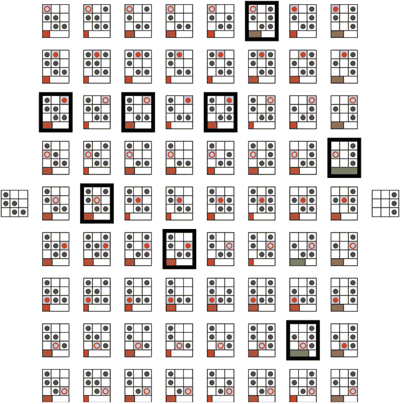

图 21-32：在训练了 3,000 轮 Q-learning 后，进行 Flippers 游戏

如果我们对算法进行更多的训练回合，我们预计其表现会有所改善。经过额外 3,000 次训练回合（总共 6,000 次），并查看需要不同步数的游戏数量，我们得到了图 21-33 的结果。

与我们在图 21-31 中的结果相比，经过 3,000 场训练后，最久的游戏从 20 步减少到 18 步，且只有 3 步和 4 步的短游戏变得更加频繁。

这张图表表明算法正在学习，但它在实际玩游戏时表现如何？事实上，算法的能力已经有了巨大的飞跃。

图 21-34 显示了与图 21-32 相同的游戏，这个游戏最初需要八步才能获胜。现在它只需要四步，这是这个棋盘上最少的步数（虽然有不止一种方法可以实现）。

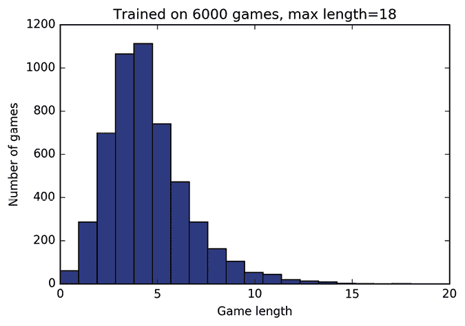

图 21-33：在训练了 6,000 次游戏的 Q 表之后，我们的 5,120 场游戏中，获胜所需的步数分布。

Q-learning 在这种高度不可预测的学习环境中表现出色，在每进行 10% 的动作后，瓦片会随机翻转。它成功应对了这种不可预测性，并且在仅进行 6,000 次训练的情况下，为大多数游戏找到了理想的解决方案。

## SARSA

Q-learning 表现出色，但它存在一个缺陷，可能会降低其所依赖的 Q 值的准确性。这就是我们在讨论图 21-29 时提到的问题，我们注意到，尽管并不一定是采取的行动，仍然根据最可能的下一步行动的得分来预测未来的奖励。换句话说，更新规则*假设*我们在下一步会选择得分最高的动作，它基于这个假设计算新的 Q 值。这一假设并非不合理，因为我们的 epsilon-greedy 和 softmax 策略通常会选择最有奖励的动作。但当这些策略选择其他动作时，这个假设就不成立了。

当我们的策略选择了更新规则中没有使用的其他动作时，计算将使用错误的数据，最终导致我们计算该动作的新值时准确性降低。幸运的是，我们可以解决这个问题。

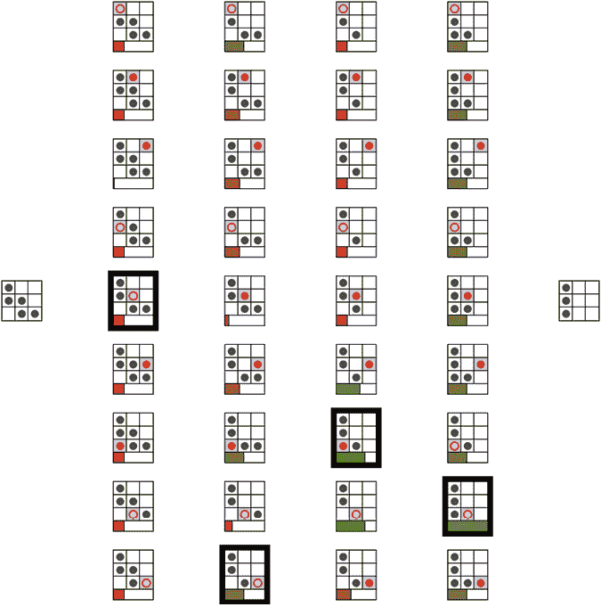

图 21-34：通过更多训练回合，Q-learning 更高效地解决了图 21-32 中的游戏

### 算法

如果能保留 Q 学习的所有优点，同时避免犯错，通过使用最高得分的下一个动作的 Q 值来计算某个动作的 Q 值，而实际上我们可能并不会在下一个动作中选择那个动作，那该多好啊。我们可以通过稍微修改 Q 学习，创建一个新算法，称为*SARSA*（Rummery 和 Niranjan 1994）。这是“状态-动作-奖励-状态-动作”的缩写。我们从图 21-17 开始，已经涵盖了“SARS”部分，即我们保存了初始状态（S）、动作（A）、奖励（R）和结果状态（S）。这里新增的是末尾的额外动作“A”。

SARSA 通过使用我们的策略（而不是仅仅选择得分最高的那个）来选择下一个状态中的正确单元，并*记住*我们选择的动作（这就是末尾的额外“A”）。然后，当我们需要做出新的动作时，我们选择之前计算并保存的动作。

换句话说，我们已经将应用我们选择动作策略的时间推迟了。我们不是在动作开始时选择我们的动作，而是在前一个动作中选择，并记住我们的选择。这使得我们在构建新的 Q 值时，能够使用我们实际将会使用的动作的值。

这两项改变（推迟动作选择步骤和记住我们选择的动作）是 SARSA 与 Q 学习的区别所在，但它们可以显著提高学习速度。

让我们来看一下使用 SARSA 的三个连续动作。第一个动作如图 21-35 所示。由于这是第一次动作，我们使用我们的策略为此动作选择一个动作，如图 21-35(a)所示。这是唯一一次这么做。选择完我们的动作后，我们使用策略为第二步选择动作。我们从环境中获得奖励，并更新我们刚刚选择的动作的 Q 值，如图 21-35(b)所示。

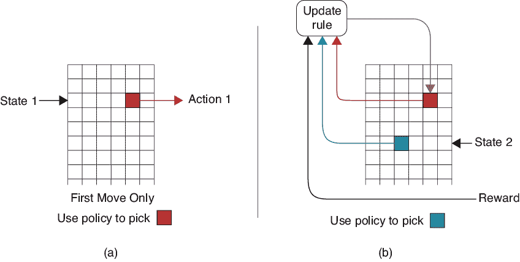

图 21-35：在游戏的第一步中使用 SARSA。（a）我们使用策略选择当前动作。（b）我们也使用策略选择下一个动作，并使用该下一个动作的 Q 值来更新当前 Q 值。

第二个动作如图 21-36 所示。现在我们使用上次为自己选择的动作，然后选择在第三个动作中使用的动作。

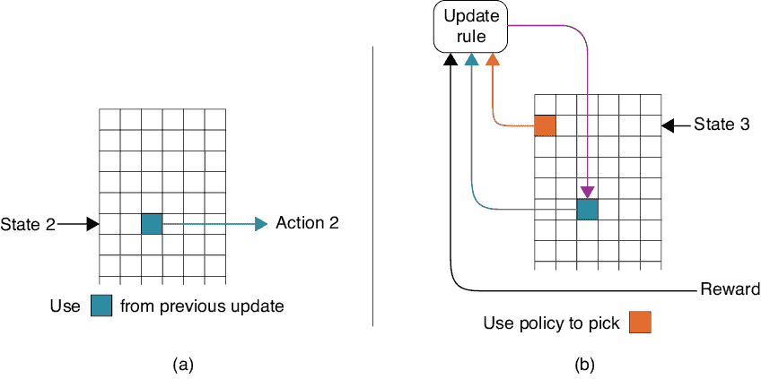

图 21-36：使用 SARSA 的第二步动作。（a）我们执行上次为自己选择的动作。（b）我们选择下一个动作，并利用其 Q 值来更新当前动作的 Q 值。

第三个动作如图 21-37 所示。在这里，我们再次选择之前确定的动作，并为下一个第四个动作计算出相应的动作。

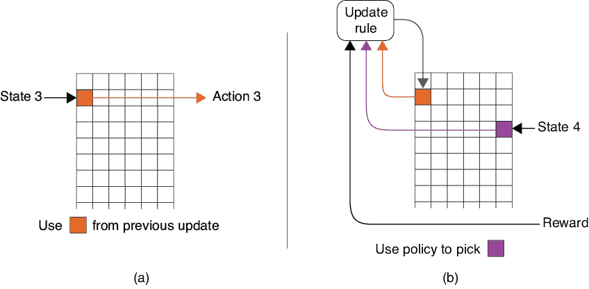

图 21-37：使用 SARSA 的第三步。（a）我们采取了第二步时确定的动作。（b）我们为第四步选择一个动作，并利用其 Q 值来改善当前动作的 Q 值。

值得高兴的是，我们可以证明 SARSA 也会收敛。像以前一样，我们不能保证它需要多久，但通常它比 Q 学习更早产生良好的结果，并且很快改善这些结果。

### SARSA 的应用

让我们来看看 SARSA 在 Flippers 游戏中的表现，采用与 Q 学习相同的方法。图 21-38 显示了我们在使用 SARSA 进行 3000 次训练后，5120 局游戏所需的步数。在此图和接下来的图中，我们继续使用与 Q 学习图中相同的参数：学习率*α*为 0.95，每步后引入 0.1 的随机翻转，折扣因子*γ*为 0.2，并采用 epsilon 贪心策略，*ε*设为 0.1。

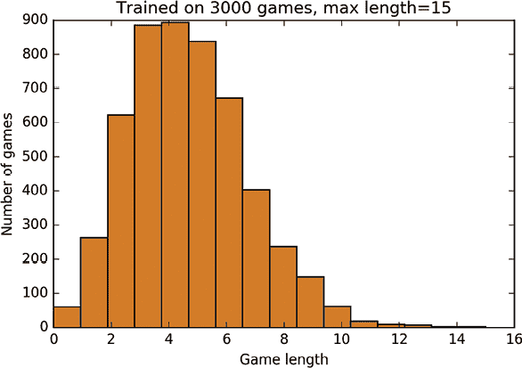

图 21-38：使用 SARSA 在训练 3000 局后，5120 局游戏的步数。注意只有少数游戏需要超过 6 步。

这看起来不错，大多数值聚集在 4 左右。最长的游戏仅为 15 步，很少有超过 8 步的游戏。

让我们来看一个典型的游戏。图 21-39 显示了从左到右的游戏过程。该算法需要七步才能获胜。虽然不算差，但我们知道它可以更快地解决。

一如既往，更多的训练应当带来更好的表现。像之前一样，让我们将训练次数增加到 6000 次。

图 21-40 显示了我们在进行 6000 次训练后，5120 局游戏的步数。

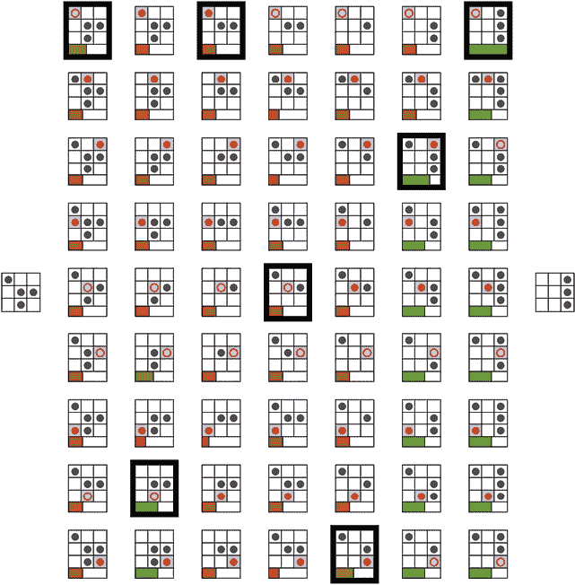

图 21-39：在 SARSA 进行 3000 次训练后玩 Flippers 游戏

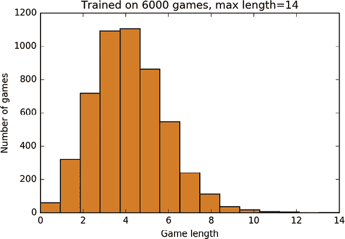

图 21-40：使用 SARSA 在训练 6000 局后，我们的 5120 局游戏的步数。注意大多数游戏的步数变得更短，且没有游戏陷入循环。

最长的游戏从 15 步减少到 14 步，这个变化不算大，但长度为 3 和 4 步的短游戏数量现在更加明显。需要超过 6 步的游戏并不多。

图 21-41 显示了与图 21-39 相同的游戏，该游戏需要 7 步获胜。现在只需 3 步，这是该棋盘的最小步数（尽管同样的，3 步也有不止一种获胜方法）。

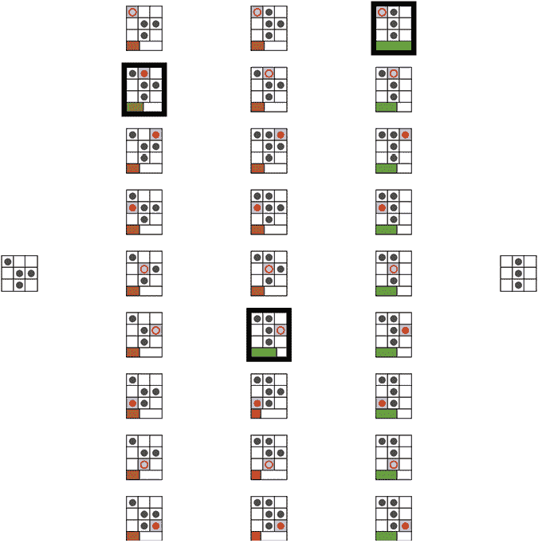

图 21-41：与图 21-39 相同的游戏，经过 3000 次训练后

### 比较 Q 学习与 SARSA

让我们来比较 Q 学习与 SARSA 算法。图 21-42 显示了经过 6000 局训练后，Q 学习和 SARSA 的 5120 种可能游戏的步数。这些结果与之前的图略有不同，因为它们是通过新一轮的算法运行生成的，因此随机事件有所不同。

它们大致相当，但 Q 学习产生了一些游戏，其时长超过了 SARSA 的最大时长 12 步。

图 21-42：在 6,000 场训练游戏后比较 Q 学习和 SARSA 的游戏时长。SARSA 的最长游戏是 11 步，而 Q 学习则有高达 18 步的情况。

更多的训练是有帮助的。我们将训练长度增加了 10 倍，每个训练进行了 60,000 场游戏。结果如图 21-43 所示。

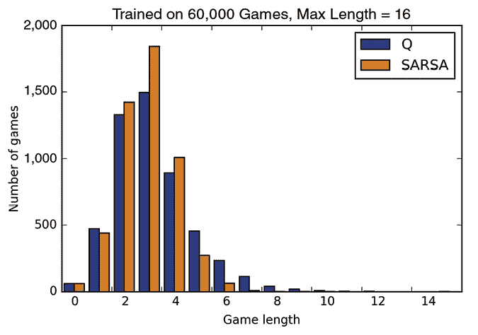

图 21-43：与图 21-42 相同的训练场景，但这次我们进行了 60,000 场训练游戏

在这个训练阶段，SARSA 在 Flippers 上表现非常出色，几乎所有的游戏都在 6 步或更少内完成（很少有游戏需要 7 步）。Q 学习总体上稍微差一些，某些游戏需要多达 16 步才能解决，但它也大部分集中在 4 步以内。

另一种比较 Q 学习和 SARSA 在这个简单游戏中的方法是绘制经过逐渐延长的训练后的平均游戏时长。这可以让我们了解它们在学习如何赢得游戏方面的有效性。图 21-44 展示了我们 Flippers 游戏的结果。

图 21-44：从 1 到 100,000 场训练游戏（以 1,000 场为增量）的平均游戏时长

这里的趋势很容易看出来。两种算法都迅速下降，然后趋于平稳，但在经历了一段噪声较大的起步后，SARSA 的表现始终更好，最终每场游戏节省了近半步（也就是说，一般每两场游戏少走一步）。当我们达到 100,000 场训练游戏时，似乎两种算法的表现都停止了改善。看起来每个算法的 Q 表已经稳定下来，随着时间的推移，因环境的随机波动而略微变化。

所以，尽管 Q 学习和 SARSA 都能在学习玩 Flippers 时表现得很出色，但 SARSA 的游戏通常会更短。

## 全貌

让我们退后一步，回顾一下强化学习的全貌。

这里有一个环境和一个智能体。环境向智能体提供两组数字（状态变量和可用动作）。利用其策略，智能体会考虑这两组列表，以及它保存的任何私人信息，从中选择一个动作，并将其返回给环境。作为回应，环境会返回一个数字（奖励）和两组新的列表。

将列表解释为棋盘和动作是很棒的，因为这让我们能够将 Q-learning 看作是学习如何玩游戏。但代理并不知道它正在玩一个游戏，也不知道有规则，或者实际上对任何事情知之甚少。它只知道两个数字列表传入，它从其中一个列表中选一个值，然后返回一个奖励值。这个小过程能做出许多有趣的事情，令人惊讶。但如果我们能够找到一种方法来描述我们的环境，以及在这个环境中采取的行动，使用数字集合表示，并且我们能找到一种粗略的方式来区分好的行动和坏的行动，那么这个算法就能学习如何执行高质量的行动。

这在我们简单的 Flippers 游戏中是有效的，但所有这些 Q-table 内容在实际操作中有多实用呢？在 Flippers 中，有九个方格，每个方格可以有一个点或者没有，因此游戏需要一个包含 512 行和 9 列的 Q-table，即 4,608 个单元格。在井字游戏中，有九个方格，每个方格可以有三种符号之一：空白、X 或 O。这个游戏的 Q-table 需要 20,000 行和 9 列，即 180,000 个单元格。

这很大，但对于现代计算机来说并不算荒谬大。但如果我们想玩一个稍微有挑战性的游戏呢？假设我们不是在 3×3 的棋盘上玩井字游戏，而是在 4×4 的棋盘上玩。这样的棋盘数量略超过 4300 万个，所以我们的表格将需要 4300 万行和 9 列，或者稍低于 3.9 亿个单元格。即使是对于现代计算机来说，这也开始变得非常庞大。我们再稍微增加一点，假设我们在 5×5 的棋盘上玩井字游戏。这个似乎并不荒唐。然而，这个棋盘有接近 850 *十亿* 种状态。如果我们再稍微大胆一点，在 13×13 的棋盘上玩，我们会发现状态数量超过了可见宇宙中原子数量（Villanueva 2009）。实际上，这大约是一个*十亿*个可见宇宙中的原子数量。

存储这个游戏的表格并不是现实可行的，但想要这么做是完全合理的。更为合理的情况是，我们可能想玩围棋。围棋的标准棋盘是一个 19×19 的交叉点网格，每个交叉点可以为空、黑子或白子。这就像我们的井字游戏棋盘，但大得无法想象。我们需要一个行标签需要 173 位数字的表格。这样的数字不仅完全不实际，简直是无法理解的。

然而，这正是 Deep Mind 团队用来构建 AlphaGo 的基本策略，AlphaGo famously 击败了世界冠军人类玩家（DeepMind 2020）。他们通过将强化学习与深度学习相结合来实现这一目标。这种*深度强化学习*方法的一个关键见解是消除 Q-table 的显式存储。我们可以将这个表格看作是一个函数，它以棋盘状态为输入，返回一个动作编号和 Q 值作为输出。正如我们所见，神经网络在预测这种事情上非常擅长。

我们可以构建一个深度学习系统，接受棋盘输入，并预测如果我们继续保持棋盘存在，每一步的 Q 值。通过足够的训练，这个网络可以变得足够准确，以至于我们可以放弃 Q 表格，单纯使用网络。训练这样的系统可能是具有挑战性的，但是可以做到的，且效果非常好（Mnih et al. 2013；Matiisen 2015）。深度强化学习已被应用于视频游戏、机器人学，甚至医疗保健等领域（François-Lavet et al. 2018）。它还是 AlphaZero 背后的核心算法，AlphaZero 无疑是有史以来围棋的最佳玩家（Silver et al. 2017；Hassabis and Silver 2017；Craven and Page 2018）。

强化学习相较于监督学习的一个优势在于，它不需要手动标注的数据库，而人工标注通常是一个既费时又昂贵的过程。另一方面，它要求我们设计一个奖励生成算法，引导代理朝着期望的行为前进。在复杂的情况下，这可能是一个难以解决的问题。

这必然是一个关于一个大主题的高层次概述。更多关于强化学习的信息可以在专门的参考资料中找到（François-Lavet et al. 2018；Sutton and Baro 2018）。

## 总结

在本章中，我们介绍了强化学习（RL）的一些基本概念。我们看到，强化学习的基本思想是将世界分为一个行动的**代理**和一个包含其他一切的**环境**。代理被赋予一系列选项，并根据一个策略选择其中一个。环境执行该动作，并产生后续效果（这可能包括在游戏中做出回合动作，或进行模拟或现实世界中的操作），然后返回一个奖励，描述代理所选动作的质量。通常，奖励描述了代理在某种程度上改善环境的成功程度。

我们将这些思想应用于单人游戏《Flippers》，使用一种简单的算法将奖励记录在表格中，并使用一个简单的策略在可能的情况下选择具有最高奖励的动作。我们看到，这种方法并不能很好地应对现实世界的不可预测性，因此我们将其改进为具有更好更新规则和学习策略的 Q 学习算法。

接着，我们通过预先选择下一个动作再次改进了该方法，得出了 SARSA 算法。这个算法学会了更好地玩《Flippers》。

实际上，很多算法都属于强化学习范畴，并且新的算法不断涌现。它是一个充满活力的研究与开发领域。

在下一章中，我们将探讨一种强大的方法，用于训练生成器，可以生成图像、视频、音频、文本及其他类型的数据，生成的数据与训练集中的数据难以区分。
