# 第二十二章：生成对抗网络

生成数据是令人兴奋的。它让我们能够创作出新的画作、歌曲和雕塑，这些作品与它们的输入数据相似。在第十八章中，我们看到如何使用自动编码器生成与训练数据相似的新数据。在这一章中，我们将探索一种完全不同的数据生成方法。我们研究的系统类型称为*生成对抗网络*，简称*GAN*。它基于一种巧妙的策略，通过让两个不同的深度网络相互对抗，目标是让一个网络创造出新的样本，这些样本不是来自训练数据，但足够像训练数据，以至于另一个网络无法分辨。

GAN 方法实际上是一种训练生成新数据的网络的技术。训练后的生成器就像任何其他神经网络一样，而我们用来训练它的方法已经不再重要了。但该领域的语言通常将使用 GAN 方法训练的生成器本身称为 GAN。虽然这种命名方式有点奇怪，因为它是根据网络学习如何完成任务的方式来命名的，而不是根据它的实际功能，但我们就是这么做的。因此，我们使用 GAN 技术来训练生成器，这个生成器通常被称为生成器，但也经常被称为 GAN。

让我们从讨论 GAN 方法开始，首先看看一个由两个人组成的小组如何通过互相帮助学习伪造钞票。然后，我们可以将这两个人替换成神经网络。其中一个网络变得越来越擅长识别伪钞，另一个则变得越来越擅长制作伪钞。当训练过程结束时，伪造者能够制作出任意数量的新钞票，并且判别器无法可靠地区分伪钞和真钞。这一过程适用于任何类型的数据，从狗的图片到某人说话的声音。

我们将看到如何构建、训练并使用这两个网络来合成新数据，使用不同类型的层。章节最后，我们会讨论在训练和使用这些网络生成数据时需要注意的问题。

## 伪造钞票

介绍生成对抗网络（GAN）通常通过类比伪造操作来进行。我们将展示一种变体的典型介绍方式，以更好地揭示关键思想。

故事开始于两位共谋者，Glenn 和 Dawn。Glenn 的名字以 G 开头，因为他扮演的是*生成器*的角色，在这种情况下是伪造新钞票。Dawn 的名字以 D 开头，因为她扮演的是*判别器*的角色，负责判断某张钞票是否真实，或者是 Glenn 伪造的。Glenn 和 Dawn 都会随着时间的推移不断改进，从而推动彼此的改进。

作为伪钞制造者，Glenn 整天坐在后面的房间里，仔细制作金属版并印刷假币。Dawn 是质量控制的一部分。她的工作是将一堆混合的真钞与 Glenn 的伪钞一起检查，分辨哪个是真哪个是假。伪钞在他们国家的刑罚是终身监禁，所以他们都非常有动力制造出没人能分辨的钞票。假设他们国家的货币叫做 Solar，他们想要伪造 10,000 Solar 钞票。

需要注意的一点是，所有的 10,000 Solar 钞票都不相同。至少，每一张钞票都有一个独特的序列号。但真正的钞票也会被刮伤、折叠、涂画、撕裂、弄脏，或者以其他方式被处理过。由于崭新的钞票显眼，Glenn 和 Dawn 希望制造出看起来和流通中的其他旧钞票一模一样的货币，这样它才能融入其中，不引人注意。就像真正的钞票一样，每一张伪造钞票也应该看起来独特。

在实际情况下，Glenn 和 Dawn 肯定会从一大堆真钞开始，仔细查看每一个细节，尽可能地学习所有信息。但我们只把他们的操作作为一个隐喻，因此我们会设置一些限制，使这个情况更符合本章讨论的算法。首先，我们简化一下，假设我们只关心钞票的一面。其次，我们不会给 Glenn 和 Dawn 每人一堆钞票让他们在开始之前研究。事实上，假设 Dawn 和 Glenn 都不知道真正的 10,000 Solar 钞票长什么样。显然，这会让事情变得*更加*困难。稍后我们会对此做出解释。唯一给他们的东西是 Glenn：一大堆空白矩形纸张，形状和大小与 10,000 Solar 钞票相匹配。

他们各自遵循着日常的例行公事。每天早上，Glenn 坐下来，利用他目前拥有的所有信息制作一些伪钞。一开始，他什么都不知道，所以他可能只是随便在纸上涂抹不同颜色的墨水。或者也许他画一些面孔或数字。他基本上就是随便画一些东西。与此同时，Dawn 去银行取出一堆真钞，轻轻地在每一张背面用铅笔写下*Real*字样。然后，当 Glenn 做完时，她收集起当天的伪钞，并在每张背面轻轻写下*Fake*字样。接着，她将这两堆钞票混合在一起。图 22-1 展示了这一过程。

图 22-1：Dawn 从银行拿到真钞，拿到 Glenn 的伪钞后，把它们混合在一起（中间的堆），然后分成真钞和假钞。

现在，Dawn 开始她的主要工作。她逐一检查这些钞票，不看背面，将每一张钞票分类为真或假。假设她问自己：“这张钞票是真的吗？”我们称“是”的回答为对这张钞票的*正面*回应，称“不是”的回答为对这张钞票的*负面*回应。

Dawn 小心地将她的起始堆栈分成两堆：真钞和假钞。由于每张钞票都可以是真或假，因此有四种可能的情况，如图 22-2 所示。

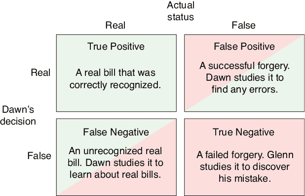

图 22-2：当 Dawn 检查一张钞票时，它可能是真的也可能是假的，而她可能会判断它是真的或假的。这给我们带来了四种组合。

当 Dawn 看一张钞票时，如果它是真的，她也判断它是真的，那么她的“正面”决策是准确的，我们就有了真正的正例（TP）。如果钞票是真的，但她的判断是“负面”（她认为它是假的），那么就是假阴性（FN）。如果钞票是假的，但她认为它是真的，那就是假阳性（FP）。最后，如果它是假的，她正确地识别它为假，那么就是真正的负例（TN）。在除了真正的正例之外的所有情况下，Dawn 或 Glenn 都会利用这个例子来改进他们的工作。

### 从经验中学习

我们已经提到，Dawn 和 Glenn 只是分别代表神经网络 *判别器* 和 *生成器* 的人类替身。

判别器是一个分类器。它将每个输入分为两类之一：真或假。当预测错误时，那个网络的误差函数值很大。然后，我们按照常规方式用反向传播和优化训练判别器，这样下次该分类就更有可能是正确的。

生成器的工作则完全不同。它根本看不见训练数据。相反，我们给它一个随机输入（比如几百个数字的列表），它从中产生一个输出。这就是它所做的所有工作。如果判别器认为该输出是真的（即来自训练集），那么生成器就得到了这个伪造物并且不需要改进。但如果判别器认为输出是假的（即来自生成器或是合成的），那么生成器会收到一个误差信号，我们使用反向传播和优化来让它避免产生类似被判别器识别为假的结果。每次运行生成器时，我们都会给它新的随机起始值。生成器面临的任务非常艰巨：将这小小的数字列表转化为一个能够欺骗判别器的输出。例如，预期的输出可能是一首听起来像巴赫所写的歌、一段听起来像人的讲话、一张看起来像人的脸，或者一张价值 10,000 Solars 的旧钞票。

我们怎么训练这样的系统呢？生成器从未看到它试图模仿的数据，因此它无法从中学习。它只知道何时做错。

出人意料的有效方法是通过试错法。我们一开始，如前所述，使用一个完全未经训练的生成器和鉴别器。当我们给鉴别器一些数据时，它基本上只是将每一项数据分配给一个随机类别。与此同时，生成器也在随机生成输出。它们都在摸索，本质上输出的是毫无意义的结果。

然而，鉴别器会慢慢开始学习，因为我们为它提供了正确的标签来标注它分类的数据。随着鉴别器的表现逐渐提高，生成器尝试不同的输出变体，直到某个变体能通过鉴别器的检测（即，鉴别器认为它是来自真实数据，而非生成器的输出）。生成器将这个输出视为它迄今为止的最佳作品。然后，鉴别器进一步提高，生成器也随之进步。随着时间的推移，每个网络中的微小改进会累积，直到鉴别器对真实数据和生成数据之间的差异非常敏感，而生成器也非常擅长尽量缩小这些差异。

### 与神经网络的结合

图 22-2 展示了在 Dawn 为每张钞票做出决定后可能出现的四种情况。让我们更仔细地看看如何训练鉴别器和生成器，使它们互相推动对方改进。请注意，本讨论旨在讲解这些概念，因此我们将逐个样本地进行阐述。实际上，我们通常会以更复杂但更高效的方式实现这些想法（例如，通过批量训练，而不是逐个样本地训练）。

让我们更仔细地看看图 22-2 中四种可能情况的流程图形式。

从真正的正例开始，鉴别器正确地报告输入的真实钞票图像确实是一张真实的钞票。由于这正是我们希望鉴别器在这种情况下执行的操作，因此无需进行学习。图 22-3 通过图形方式展示了这个过程。

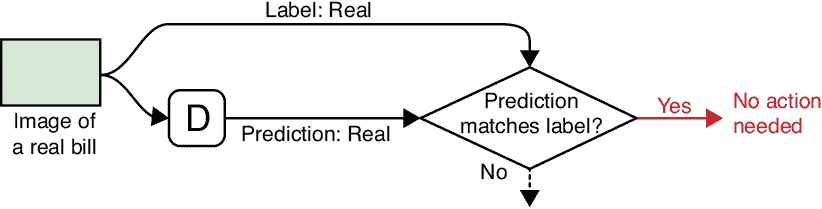

图 22-3：在真正的正例（TP）情况下，鉴别器（D）接收到一张真实的钞票并正确预测它为真实钞票。结果不需要进行任何操作。

接下来是错误的负例，当鉴别器错误地将真实钞票判断为假钞时。此时，鉴别器需要更多地学习真实钞票的特征，以避免重复此错误。图 22-4 展示了这种情况。

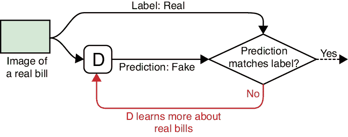

图 22-4：当钞票为真但鉴别器判断为假时，我们会得到一个错误的负例（FN）。鉴别器需要更多地学习真实钞票的特征，以避免重复此错误。

假阳性情况发生在判别器被生成器欺骗，错误地判断伪造的钞票为真实的情况下。在这种情况下，判别器需要更加仔细地检查钞票，找出任何错误或不准确的地方，以免再次被欺骗。图 22-5 展示了这个过程。

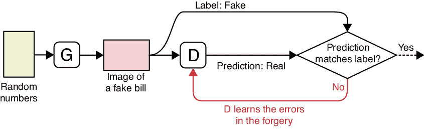

图 22-5：在假阳性（FP）情况下，判别器接收到生成器的伪钞，但将其误判为真实钞票。为了迫使生成器变得更好，判别器从自己的错误中学习，以防止这张伪钞再次通过。

最后，真实负例的情况是当判别器正确识别出伪钞时。在这种情况下，如图 22-6 所示，生成器需要学习如何改进其输出。

请注意，在这四种可能性中，其中一种（TP）对任何网络都没有影响，另外两种（FN 和 FP）促使判别器提高识别真实和伪钞的能力，而只有一种（TN）促使生成器学习并避免重复错误。

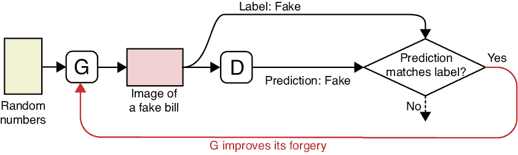

图 22-6：在真实负例（TN）场景中，我们给判别器一张来自生成器的伪钞，判别器正确地将其识别为伪钞。在这种情况下，生成器意识到其输出不够好，必须提高其伪造技能。

### 一次学习回合

现在让我们将上一节的反馈回路汇总成判别器和生成器的单一训练步骤。一般来说，我们会反复执行这四个步骤。在每个步骤中，我们给判别器提供一张真实的或伪造的钞票，然后根据其反应，遵循我们刚才看到的四个流程图之一。

首先我们训练判别器，然后是生成器，再然后是判别器，最后是生成器。这个过程的目的是测试在每种情况下，哪个网络需要学习。真实负例的情况，即生成器学习的情形，会重复两次，原因稍后会解释。图 22-7 总结了这四个步骤。

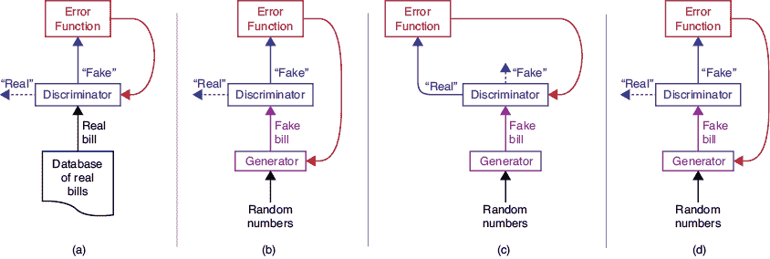

图 22-7：学习回合的四个步骤

首先，在部分 (a) 中，我们尝试从假阴性中学习。我们给判别器一张来自真实钞票数据集的随机钞票。如果它错误地将其归类为伪钞，我们会告诉判别器从这个错误中学习。

第二，在部分 (b) 中，我们寻找真实负例。我们给生成器一些随机数字，生成一张伪钞，并交给判别器。如果判别器识别出伪造行为，我们会告诉生成器，生成器尝试学习如何制作更好的伪钞。

第三，在部分 (c) 中，我们寻找假阳性。我们给生成器一组新的随机值，让它生成一张新的伪钞，然后交给判别器。如果判别器被欺骗并认为钞票是真的，那么判别器将从这个错误中学习。

最后，在第（d）部分，我们重复第二步中的真正负样本测试。我们为生成器提供新的随机数，生成一张新的伪钞，如果判别器识破了伪钞，生成器就会学习。

重复生成器学习步骤两次的原因是，实践表明，在许多情况下，最有效的学习计划是以大致相同的速率更新这两个网络。因为判别器从两种类型的错误中学习，而生成器只从一种错误中学习，所以我们将生成器的学习机会加倍，从而使两个网络能够大致以相同的速度进行学习。

通过这个过程，判别器在识别真钞和发现伪钞错误方面变得越来越好，而生成器则相应地在如何制造无法被识破的伪钞方面变得越来越擅长。这对网络一起构成了一个完整的 GAN。我们可以将这两个网络想象成一场“学习之战”（Geitgey 2017）。随着判别器在识别伪钞方面变得越来越精准，生成器必须相应地变得更好，才能通过判别器的检测，这反过来又促使判别器在发现伪造时变得更强，生成器则变得更擅长制造伪钞，依此类推。

最终目标是让判别器达到最佳状态，对真实数据的每个方面都有深入广泛的了解，同时生成器依然能成功地欺骗判别器。这告诉我们，尽管伪钞与真实样本不同，但它们在统计上与真实样本无法区分，这正是我们一直以来的目标。

### 为什么是对抗性？

*生成对抗网络（GAN）* 这个名称，在前述描述的背景下可能显得有些奇怪。我们刚刚描述的两个网络似乎是合作的，而非敌对的。选择*对抗性*一词，来自于以稍微不同的方式看待问题。我们可以将 Dawn 想象成一名与警方合作的侦探，而 Glenn 则是独自行动。为了使这个比喻成立，我们还必须假设 Glenn 能通过某种方式得知哪些伪造的钞票被识破（也许他在 Dawn 的办公室有一个同谋，能够将这些信息转发给他）。

如果我们将伪造者和侦探视为对立的两方，那么它们确实是敌对的。这也是原始论文中对生成对抗网络（GANs）主题的表述方式（Goodfellow 等人，2014）。这种对抗性视角并不会改变我们如何设置或训练网络，但它提供了不同的思考方式（Goodfellow 2016）。

*对抗性*一词来源于一种叫做*博弈论*的数学分支（Watson 2013），在这种理论中，我们将判别器和生成器视为在一场欺骗与识别的博弈中的对手。

博弈论的研究领域致力于研究竞争者如何最大化他们的优势（Chen, Lu, 和 Vekhter 2016； Myers 2002）。我们在 GAN 训练中的目标是使每个网络达到其最高能力，尽管其他网络能够抵挡它。博弈论学者称这一状态为*Nash 均衡*（Goodfellow 2016）。

现在我们已经知道了训练的基本技巧，接下来我们看看如何实际构建一个鉴别器和一个生成器。

## 实现 GAN

当我们谈论 GAN 时，我们讨论的是三个不同的网络：鉴别器、生成器以及生成器和鉴别器的组合。我们在图 22-7 中看到了这两种结构。在（a）部分只有鉴别器，在（b）到（d）部分则是生成器和鉴别器结合的结构。正如我们稍后将看到的那样，当训练完成后，我们要生成新数据时，会丢弃鉴别器，仅使用生成器。

通常可以从上下文中明确知道正在讨论的是哪一个网络。如前所述，当提到 GAN 时，通常指的是训练后的生成器，在它经过对抗过程的训练之后。GAN 这个词在该领域使用非常灵活。它既可以指我们刚才描述的训练方法，也可以指训练过程中使用的生成器-鉴别器组合网络，或者指训练后我们得到的独立生成器。通常人们会说他们将“训练一个 GAN”，意思是他们将使用 GAN 方法来训练一个生成器，随后这个生成器本身可能会被称作 GAN。听起来可能有些困惑，但通常从上下文中可以清晰地理解正确的解释。

够多的背景知识了！让我们开始构建和训练一个 GAN。

### 鉴别器

鉴别器是三种模型中最简单的，如图 22-8 所示。它以一个样本作为输入，输出一个单一值，表示网络对输入是来自训练集而非伪造尝试的置信度。

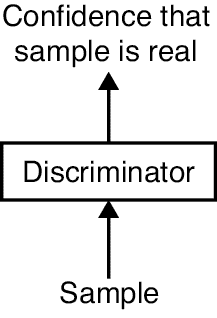

图 22-8：鉴别器的框图

对于我们如何制作鉴别器并没有其他限制。它可以是浅层的或深层的，并且可以使用任何类型的层：全连接层、卷积层、递归层、转换器等等。在我们伪钞制作的例子中，输入是钞票的图像，输出是一个实数，反映网络的判断。值为 1 意味着鉴别器确定输入是一个真实的钞票，值为 0 意味着鉴别器确定它是伪钞。值为 0.5 意味着鉴别器无法判断。

### 生成器

生成器接受一堆随机数作为输入。生成器的输出是一个合成样本。其框图见图 22-9。

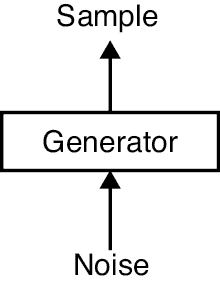

图 22-9：生成器的框图

与判别器一样，生成器的构建没有任何约束。它可以是浅层的或深层的，使用我们喜欢的任何类型的层。

在我们伪造货币的例子中，输出将是一个图像。

图 22-9 中生成器的损失函数本身是无关紧要的，在某些实现中，我们甚至从未定义过一个。正如我们在下一节中将看到的那样，我们通过将生成器与判别器连接起来训练生成器，因此生成器从组合网络的损失函数中学习。

一旦我们的 GAN 完全训练好，我们通常会丢弃判别器，只保留生成器。毕竟，判别器的目的是训练生成器，以便我们可以用它来生成新数据。当生成器与判别器断开连接时，我们可以使用生成器无限制地生成新数据，供我们随意使用。

现在我们有了生成器和判别器的框图，我们可以更仔细地查看实际的训练过程。在那之后，我们将查看两个网络的实现。然后我们将训练它们，看看它们的表现如何。

### 训练 GAN

现在让我们来看一下如何训练我们的 GAN。我们将扩展图 22-7 中学习轮次的四个步骤，展示更新应用的位置。

我们的第一步是寻找假阴性，所以我们将真实的钞票输入到判别器中，如图 22-10 所示。在这一步，我们完全不涉及生成器。此时，误差函数的设计是，如果判别器错误地将真实钞票分类为假币，它会受到惩罚。如果发生这种情况，误差将驱动通过判别器的反向传播步骤，更新其权重，使其更擅长识别真实钞票。

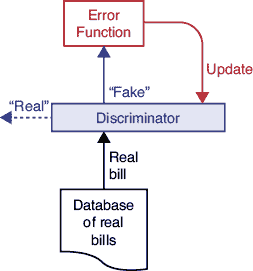

图 22-10：在假阴性步骤中，判别器连接到一个误差函数，如果它将真实钞票错误地分类为假币，就会受到惩罚。

第二步是寻找真实的负样本。在这一步，我们将生成器的输出直接连接到判别器的输入，形成一个大模型。我们从输入随机数到生成器开始，如图 22-11 所示。生成器的输出是伪钞，然后将其输入到判别器中。误差函数的设计是，如果这个伪钞被正确识别为假币，则它的值较大，意味着生成器被抓到制造伪钞。

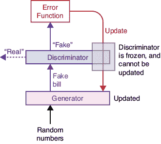

图 22-11：在真实负样本步骤中，随机数输入到生成器，生成一个伪钞。如果判别器将其标记为假币，我们就通过判别器推送梯度，但只更新生成器。

在图 22-11 中，我们将判别器的更新步骤灰显处理，然而标记为“更新”的箭头显然还是通过了判别器。这里发生的事情是，我们的“更新”箭头同时包含了反向传播和优化。回想一下，反向传播计算每个权重的梯度，但并不会实际改变任何东西。真正更新权重的是优化步骤，它基于梯度来更新权重。在图 22-11 中，我们希望对生成器进行优化，这意味着我们需要找到它的梯度。但由于反向传播是从网络的末端计算到起始端的，找到生成器的梯度的唯一方法是首先计算判别器的梯度。尽管我们在两个网络中都计算了梯度，但我们只会改变生成器中的权重。我们说判别器是*冻结*的，意味着它的权重不会被改变，即使我们计算了它们的梯度。这确保了在任何给定时刻，我们只训练生成器或只训练判别器。

改进生成器的权重可以让它更好地欺骗判别器。

现在我们寻找假阳性。我们生成一个假钞，并在判别器将其分类为真实时惩罚它，如图 22-12 所示。

图 22-12：在假阳性步骤中，我们给判别器一个假钞。如果它将其分类为真实钞票，那么我们更新判别器，使其更好地识别假钞。

最后，我们重复图 22-11 中的真实负例步骤，这样每轮训练中，判别器和生成器都有两次更新的机会。

## GANs 实战

够了，理论！让我们构建一个 GAN 系统并训练它。我们选择一个非常简单的例子，这样我们可以在 2D 中绘制出有意义的过程插图。

让我们把训练集中的所有样本想象成一个点云，位于某个抽象的空间中。毕竟，每个样本最终都是一个数字列表，我们可以将这些数字视为空间中的坐标，空间的维度与数字的数量相同。我们的“真实”样本集合将是属于一个二维云的点，该云具有高斯分布。回想一下第二章，高斯曲线在中心有一个大的峰值，因此我们期望大多数点位于峰值附近，随着向外扩展，点的数量会逐渐减少。每个样本都是该分布中的一个点。让我们将二维云的中心定在(5,5)，并赋予其标准差为 1。图 22-13 展示了这个分布。

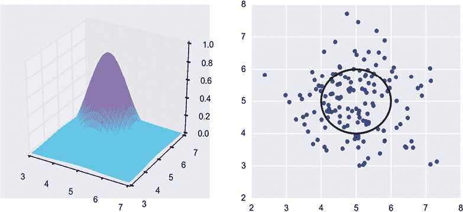

图 22-13：我们的起始分布是一个以(5,5)为中心、标准差为 1 的高斯峰。左图：3D 中的云。右图：一个圆圈显示二维中一个标准差位置的云，以及从这个分布中随机抽取的一些代表性点。

我们的生成器将尝试学习如何将其给定的随机数转化为看似属于此分布的点。目标是做到如此之好，以至于判别器无法分辨真实点和生成器生成的合成点。换句话说，我们希望生成器接受随机数并生成可能来自我们原始高斯分布中心（5,5）附近的随机点的输出。

仅给定一个点，如图 22-14 所示，判别器很难确定它是否是从我们的高斯分布中提取的真实样本，还是生成器创建的合成样本。

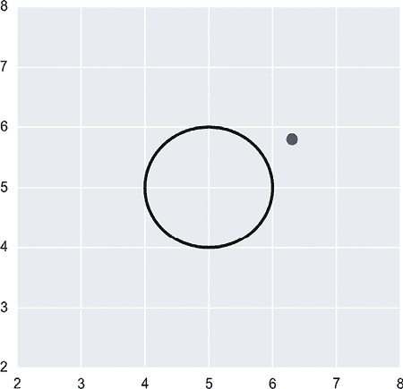

图 22-14：我们有一个单一的样本，我们想要判断它是否是从高斯分布中提取的。

我们可以通过使用第十五章中的一个老朋友：小批量（或通常称为批量）来简化判别器的任务。与其每次只运行一个样本，我们可以一次运行大量样本，通常是 32 到 128 之间的 2 的幂。给定一大堆点，判定它们是否来自我们的高斯云就容易多了。图 22-15 展示了生成器可能生成的几组点。我们希望判别器能轻松意识到这些点不太可能来自我们原始的分布。

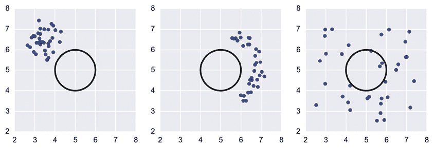

图 22-15：一些不太可能是从我们的起始高斯分布中随机挑选的结果的点集

我们希望我们的生成器生成的点更像图 22-13 右侧的那些点，而不是图 22-15 中的任何点。我们还希望判别器能够将图 22-15 中的点集分类为假样本，因为这些点不太可能来自原始的高斯数据。

### 构建判别器和生成器

让我们为这个问题构建判别器和生成器网络。由于我们的原始分布（二维高斯分布）非常简单，我们的网络也可以相应地简单。

不过，在深入讨论具体的机制之前，先提醒一下。GANs 以其不稳定和敏感著称。它们 notoriously 很难训练（Achlioptas 等人，2018）。生成器或判别器的架构中轻微的变化，甚至某些超参数（如学习率或丢弃率）的微小调整，都可能将一个几乎无用的 GAN 转变为一个明星模型，反之亦然。更糟糕的是，我们不仅要训练一个网络，而是两个，并且还需要让它们协同工作，因此需要搜索和微调的超参数选择数量可能会变得让人不堪重负（Bojanowski 等人，2019）。因此，在我们开发一个 GAN 时，至关重要的是使用我们想要学习的特定数据进行实验，并尽快找到一个好的设计和合适的超参数。这通常意味着我们需要通过一些小的实验来尝试训练数据中的小片段，同时寻找合适的网络和超参数。

在接下来的讨论中，我们跳过了许多失败的尝试和表现不佳的模型。相反，我们将直接讨论我们发现对这个数据集有效的模型。通过进一步的更改，或者可能只是对一些细节进行小的调整，我们有可能显著提高我们展示的架构（即使它们能更快、更准确地学习）。

我们从一个简单的生成器开始，如图 22-16 所示。

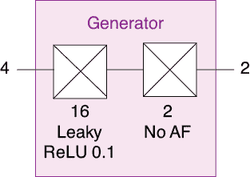

图 22-16：一个简单的生成器。它输入四个随机数并计算一个（x，y）对。

模型输入四个随机值，这些值是从 0 到 1 的范围内均匀选择的。我们从一个包含 16 个神经元的完全连接层开始，并使用带泄漏的 ReLU 激活（回想一下第十三章，带泄漏的 ReLU 像普通的 ReLU 一样，但对于负值，它不是返回 0，而是将其缩放为一个小数，这里是 0.1）。

接下来是另一个完全连接的层，只有两个神经元，并且没有激活函数。这就是生成器的全部。生成的两个值是一个点的 x 和 y 坐标。

这两层只有 18 个神经元和 54 个权重，它们要完成的任务其实相当复杂。我们希望它们学会如何将一组四个均匀分布的随机数转换为一个二维点，这个点本应是从一个均值为（5,5），标准差为 1 的高斯分布中抽取出来的，但我们什么都不告诉它关于这个目标的信息。我们只在它生成的一小批点与我们想要的目标不匹配时告知它，然后让神经元自己去弄明白它哪里出了问题，以及如何纠正。

我们的判别器见图 22-17。

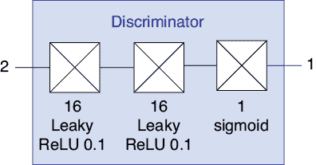

图 22-17：一个简单的判别器。它输入一个（x，y）点并告诉我们它是真的还是假的。

这从两个与生成器开始部分相同的层开始。每一层都是一个包含 16 个神经元的全连接层，并使用泄漏 ReLU 激活函数。最后是一个包含 1 个神经元并带有 sigmoid 激活函数的全连接层。输出是一个单一的数字，表示网络对输入是否来自与训练数据相同数据集的信心。

最后，我们将生成器和判别器组合在一起，形成组合模型，有时被称为*生成器-判别器*。图 22-18 展示了这种组合。

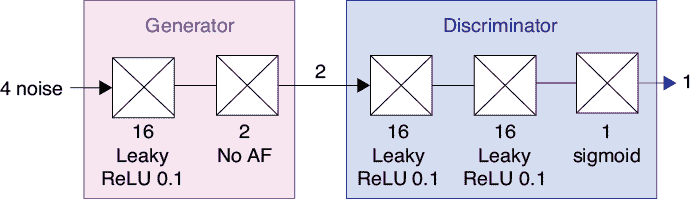

图 22-18：将生成器和判别器组合在一起。

由于生成器在其输出中呈现一个(*x*,*y*)对，判别器在其输入中接收一个(*x*,*y*)对，因此这两个网络完全匹配。生成器的输入是一组四个随机数，而判别器的输出告诉我们生成器创建的点是否来自训练集的分布。

需要注意的是，图 22-18 中标记为“生成器”和“判别器”的模型并不是图 22-16 和图 22-17 中的模型的副本，而实际上它们是*完全相同的模型*，只是一个接一个地连接在一起，组成了一个大模型。换句话说，只有一个生成器模型和一个判别器模型。当我们构建图 22-18 中的组合模型时，我们只是将这两个现有模型链接在一起。现代深度学习库允许我们通过共享组件构建多个模型，正是为了这种应用。使用这些不同配置中的相同模型是有意义的，因为组合模型需要使用生成器和判别器的最新版本。

### 训练我们的网络

当我们使用图 22-18 中的组合模型训练生成器时，*我们不希望同时训练判别器*。我们在图 22-11 中看到过这种情况，当时我们在更新步骤中将判别器灰显。我们需要通过判别器进行反向传播，因为它是网络的一部分，并帮助为生成器创建梯度，但我们只会对生成器中的权重应用更新步骤。

请记住，我们希望交替训练判别器和生成器。如果我们对图 22-18 中的整个网络应用反向传播，那么我们会同时更新判别器和生成器中的权重。因为我们希望以大致相同的速率训练这两个模型，并且我们知道我们将单独训练判别器（因为它也需要在真实数据上进行训练），所以我们希望告诉我们的库只更新生成器中的权重*而不是*判别器。

控制是否更新某一层权重的机制是与库相关的，但通常来说，它们使用像*冻结*、*锁定*或*禁用*这样的术语来防止在特定层上进行更新。然后，当我们训练判别器时，如果我们希望这些层能够学习，就可以*解冻*、*解锁*或*启用*更新。

总结训练过程时，我们从训练集中的一个小批量点开始。然后，我们按照图 22-7 中的四阶段过程，交替训练判别器和生成器。

### 测试我们的网络

让我们来看一些结果。为了训练我们的 GAN，我们通过从起始的高斯分布中随机抽取 10,000 个点来创建训练集。然后，我们使用 32 个点的小批量训练网络。将所有 10,000 个点通过系统处理一次就是一轮训练。

第 1 到第 13 轮的结果见于图 22-19。

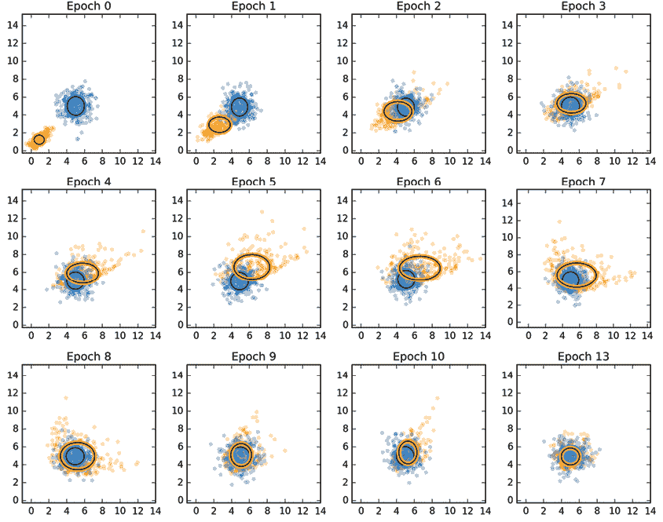

图 22-19：我们简单的 GAN 在运行中。蓝色点是原始数据集，橙色点是生成器产生的。图表的阅读顺序是从左到右，从上到下。第 0 轮指的是训练的第一轮结果。

我们的初始高斯分布通过蓝色点表示，并且有一个蓝色圆圈显示其均值和标准差。GAN 学习到的分布用橙色表示，并且有一个椭圆显示生成的小批量点的中心和标准差。图表展示了从 0 到 10 轮训练后的结果，以及第 13 轮的结果。为了保持图表的清晰，我们在每个图表中只显示原始数据和生成数据的随机子集。

我们可以看到，在一轮训练后，GAN 生成的点在西南-东北方向形成了一条模糊的线，大致集中在(1,1)附近。随着每一轮训练，它们越来越接近原始数据的中心和形状。在第 4 轮左右，生成的样本超出了中心，并且变得越来越椭圆，而不是圆形。但它们最终回到并纠正了这两种特性，到第 13 轮时，匹配效果非常好。

图 22-20 展示了判别器和生成器的损失曲线。

图 22-20：我们的 GAN 损失值。它们似乎趋于并保持在一个略高于理想值 0.5 的位置。

理想情况下，判别器的损失值应该在大约 0.5 处平稳，这意味着它永远不能确定输入是来自真实数据集还是由生成器生成的。在这个小示例中，它非常接近 0.5。

## DCGANs

我们之前提到过，我们可以使用任何架构来构建判别器和生成器。到目前为止，我们的简单模型由密集层组成，能够很好地处理我们的二维小型数据集。但如果我们想处理图像，那么我们可能更倾向于使用卷积层，因为正如我们在第十六章所看到的，卷积层非常适合处理图像。由多个卷积层构建的 GAN 被称为*DCGAN*，代表*深度卷积生成对抗网络*。

让我们在之前章节中使用过的 MNIST 数据上训练一个 DCGAN。我们将使用 Gildenblat（2020）提出的模型。生成器和判别器见图 22-21。

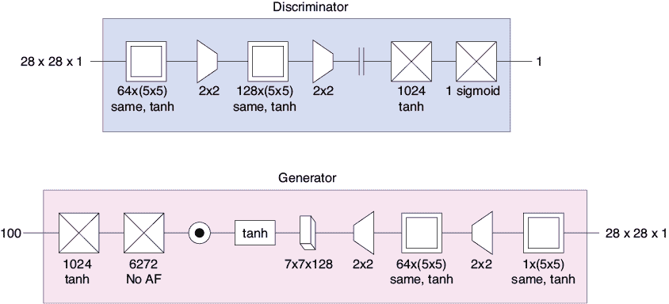

图 22-21：上：用于 MNIST 的 DCGAN 判别器。下：生成器。

在这个网络中，我们在判别器中使用了显式的下采样（或池化）层，在生成器中使用了上采样（或扩展）层，而不是将它们作为卷积步骤的一部分，因为这就是网络最初提出的方式。生成器中带有圆点的圆形是一个批标准化层，它有助于防止过拟合。tanh 激活函数后的那个小 3D 方框是一个*重塑*层，它将从第二个全连接层输出的 1D 张量转换为 3D 张量，以便进行后续的上采样和卷积层处理。我们使用标准的二元交叉熵损失函数和设置了学习率为 0.0005、动量为 0.9 的 Nesterov SGD 优化器进行训练。

生成器中的第二个密集层使用了 6,272 个神经元。这个数字看起来可能有些神秘，但它使得生成器和判别器能够处理相等数量的数据。判别器中第二个下采样层的输出形状是 7 × 7 × 128，即 6,272 个元素。通过给生成器中的第二个全连接层提供 6,272 个值，我们可以为其第一个上采样层提供一个相同形状的张量。换句话说，判别器的卷积阶段结束时是一个形状为 7 × 7 × 128 的张量，因此我们为生成器的卷积阶段开始提供一个形状为 7 × 7 × 128 的张量。

判别器和生成器遵循大致相同的步骤，但顺序相反。

经过一个训练周期后，生成器的结果相当难以理解，这也是我们预期的结果。图 22-22 展示了它们的样子。

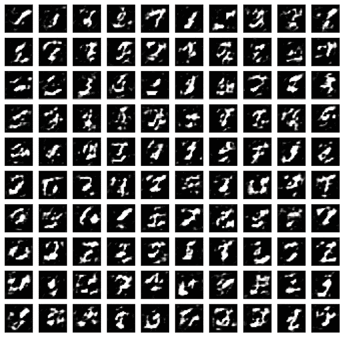

图 22-22：训练一个周期后生成器的斑点图

经过 100 个训练周期后，生成器产生了图 22-23 中的结果。我们本可以训练更久，因为判别器仍然有时能够识别出生成器的输出，但这里是一个很好的停止点，因为它展示了生成器的进展。

当我们退后一步考虑这个过程时，这是一个令人吃惊的结果。请记住，生成器从未见过数据集。它完全不知道 MNIST 数据是什么样子。它所做的仅仅是生成 3D 张量的实数，然后收到反馈，告诉它这些张量中的值有多好或多差。随着时间的推移，它生成了看起来像数字的张量。不知怎么的，生成器设法找到了将随机数转化为可识别数字的方法。真是太神奇了。虽然有些错误，但大多数数字都是容易辨认的。

这就总结了我们对 GAN 的基础讨论。

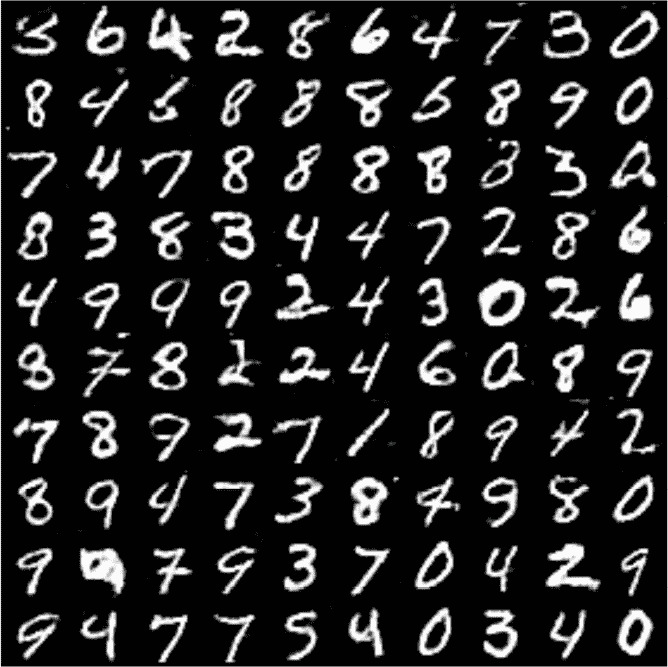

图 22-23：经过 100 次迭代训练后，深度卷积 GAN 在 图 22-21 上的输出结果，使用的是 MNIST 数据集

在继续之前，值得回顾一些实践建议。我们之前提到过，GAN 对其特定架构和训练变量非常敏感。一篇著名的论文研究了 DCGAN，发现了一些经验法则，似乎能带来不错的结果（Radford、Metz 和 Chintala 2016）。像往常一样，实验是成功的关键。小的改变往往决定了一个 GAN 是学习高效，还是学习缓慢，甚至根本不学习。

## 挑战

也许在实践中使用 GAN 的最大挑战是它们对结构和超参数的敏感性。进行一场猫捉老鼠的游戏要求双方始终保持密切匹配。如果判别器或生成器的性能比另一个提高得太快，另一个就永远追赶不上。如前所述，找到这些值的正确组合对于从 GAN 中获得良好的表现至关重要，但找到这种组合可能具有挑战性（Arjovsky 和 Bottou 2017；Achlioptas 等 2017）。通常建议遵循前面给出的一些经验法则，作为训练新 DCGAN 时的良好起点。

GAN 的一个理论问题是，我们目前没有证明它们会 *收敛*。回想一下我们在第十三章提到的单层感知机，它找出了两个线性可分数据集之间的分割线。我们可以 *证明*，只要有足够的训练时间，感知机总会找到这个分割线。但对于 GAN，这样的证明是不存在的。我们能说的只是，许多人已经找到了至少能让部分 GAN 正常训练的方法，但除此之外并没有保证。

### 使用大样本

当我们尝试训练生成器生成大图像（如 1000×1000 像素）时，GAN 的基本结构可能会遇到问题。计算问题在于，面对如此大量的数据，判别器很容易将生成的假图像与真实图像区分开。试图同时修复所有这些像素可能导致误差梯度，使得生成器的输出几乎随机地变化，而不是朝着与输入匹配的方向前进（Karras 等，2018）。除此之外，还有一个实际问题，那就是找到足够的计算能力、内存和时间来处理大量的大样本。回想一下，每个像素都是一个特征，因此每张边长为 1000 像素的图像有一百万个特征（如果是彩色照片则有三百万个）。

因为我们希望最终的高分辨率图像能够经得起审查，所以我们需要使用一个大型的训练集。处理这些巨型图像的大量数据所需的时间会很快累积。即使是快速的硬件，也可能无法在我们有限的时间内完成任务。

构建大图像的实用方法被称为*渐进式 GAN*（*ProGAN*）（Karras 等，2018）。要开始使用这种技术，首先将训练集中的图像调整为各种较小的尺寸，例如一边 512 像素，然后是 128 像素，接着是 64 像素，依此类推，直到 4 像素一边。然后构建一个小型的生成器和判别器，每个网络只有几层卷积。使用 4×4 像素的图像训练这些小型网络。当它们表现得很好时，向每个网络的末端添加几层卷积，并逐渐融入它们的贡献，直到网络能够很好地处理 8×8 像素的图像。然后再向每个网络的末端添加更多的卷积层，并用 16×16 像素的图像训练它们，依此类推。

这样，生成器和判别器能够在它们的训练过程中不断进步。这意味着，当我们逐渐训练到 1024 像素一边的全尺寸图像时，我们已经有一个能够很好地生成和判别 512 像素一边图像的 GAN。我们不需要在大图像上进行太多额外的训练，直到系统也能很好地处理它们。与从一开始就只使用全尺寸图像进行训练相比，这个过程所需的时间要少得多。

### 模式崩溃

GAN 有一种有趣的方式，可以利用我们训练中的漏洞。记住，我们希望生成器能够学会欺骗判别器。它可能会以几乎对我们没有用的方式成功地完成这一任务。

假设我们试图训练我们的 GAN 生成猫的图片。假设生成器设法创建一张被鉴别器接受为真实的猫图像。然后一个狡猾的生成器可以每次只是产生那张图像。无论我们使用什么样的噪声输入值，我们总是得到那张图片。鉴别器告诉我们，它收到的每张图片都可能是真实的，所以生成器已经完成了它的目标并停止学习。

这是神经网络找到的另一个为我们提供我们要求的但不一定是我们想要的狡猾解决方案的例子。生成器确实完成了我们要求的事情，因为它将随机数转化为鉴别器无法区分的全新样本。问题在于生成器生成的每个样本都是相同的。这是一种非常狡猾的成功。

这种反复产生一个成功输出的问题称为*模态崩溃*（请注意，第一个词是*模态*，发音为“mode′-ull”，指的是一种模式或工作方式，并非“模型”）。如果生成器陷入只有一个样本（在这种情况下是一张猫的图片）的模式，这种情况被描述为*完全模态崩溃*。更常见的情况是系统产生相同的少数几个输出或它们的轻微变化。这种情况称为*部分模态崩溃*。

图 22-24 显示了我们的 DCGAN 经过三个训练周期使用一些选择不当的超参数后的运行情况。很明显，系统正在向一个模式崩溃的方向崩溃，输出一些类型 1 的情况比其他任何情况都多。

有一些方案可以解决这个问题。也许最好的建议是从使用数据的小批次开始，就像我们之前做的那样。然后我们可以扩展鉴别器的损失函数，加入一些额外的项来衡量在该小批次中产生的输出的多样性。如果输出落入几个组，其中它们全部相同或几乎相同，鉴别器可以对结果分配较大的错误。生成器因此多样化，因为这个动作减少了错误（Arjovsky, Chintala 和 Bottou 2017 年）。

### 使用生成数据进行训练

GANs 最常见的用途是训练一个欺骗鉴别器的生成器。然后我们丢弃鉴别器，留下一个能够创建尽可能多新数据的生成器，所有这些数据看起来都来自原始数据集。因此，我们可以创建无限数量的新猫图像、帆船图像、口头短语或木火的烟雾喷发。

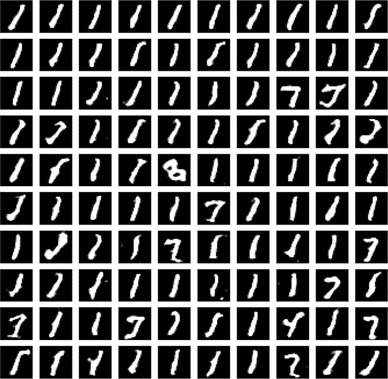

图 22-24：在仅经过三次训练周期后，这个 DCGAN 显示出明显的模态崩溃迹象。

使用生成的或合成的数据来训练另一个神经网络可能会很有诱惑力。毕竟，庞大的数据集正是我们训练神经网络所需要的。然而，这是一种非常危险的做法，因为我们训练的生成器很少是完美的。一个问题是，很难制作出足够健壮的判别器，以察觉生成器输出中的每一个细节。生成器的输出可能总是以某种方式轻微失真，而判别器未能注意到，或者它只赋予了一个非常低的惩罚。另一个问题是，生成器的输出可能是不完整的。正如我们在模式崩塌的例子中所看到的，生成器的结果可能无法涵盖所有输入的范围。例如，当被要求生成某位艺术家风格的新画作时，生成器可能总是生成风景画、肖像画或静物画，即使该艺术家的作品涵盖了更广泛的主题。

完全捕捉可能出现的每个问题是非常困难的。尽管我们尽力构建一个完美的生成器，它总是能找到另一种巧妙的方式来满足我们期望的标准（由判别器表达），同时生成的数据并不如我们所希望的那样多样化或逼真。另一个问题是，我们的标准本身往往并不像我们想象的那样清晰或广泛。

简而言之，生成器的输出可能包含错误和偏见，这些错误和偏见可能会绕过判别器。如果我们用这些数据训练一个新的系统，它将继承这些错误和偏见，而我们可能完全没有意识到这些问题。这些差异可能是微妙的，但它们仍然可以在实际中影响结果。这可能会导致一种危险的局面，我们认为自己已经训练了一个强健的神经网络，能够做出重要的决策，却没有意识到它存在盲点和偏见。当我们将训练过的网络应用于关键的安全或医疗领域，或在社会场合（如招聘面试、学校招生或银行贷款授予）中使用时，可能会因为我们未意识到的持续性错误而做出严重有缺陷或不公平的决策。数据库中的偏见、错误、偏见、错误判断以及其他常见问题，成为生成器创建新数据的内在基础。结果是一个自我延续、自我实现，但却错误的系统。我们可以用一个简单的信条来总结这一点：*偏见输入，偏见输出*。

简而言之，使用优秀数据训练神经网络仍然可能产生有缺陷的结果。用有缺陷的数据训练网络则可能产生更加严重的缺陷。一般来说，通常应该抵制使用合成数据或生成数据来训练网络的诱惑。

## 总结

在本章中，我们看到如何将生成对抗网络（GAN）构建为两个较小的部分。生成器学习如何创建与给定数据集中的数据相似的新数据，而判别器学习如何将生成器的输出与给定数据集中的真实数据区分开来。它们在训练过程中相互学习，提升各自的技能。当训练成功完成时，判别器无法可靠地区分合成数据和真实数据。此时，我们通常会丢弃判别器，使用生成器进行任何需要生成大量新数据的应用。

我们看到，训练是交替进行的步骤，以便生成器和判别器大致以相同的速度学习。然后，我们构建了一个简单的 GAN，使用全连接层学习如何在二维空间中生成数据点，接着构建了一个卷积 GAN，学习如何从 MNIST 数据集中生成新的图像数据。

由于 GAN 的训练通常非常困难，我们讨论了一些卷积 GAN 的经验法则，这些法则通常能帮助我们顺利开始。我们看到，通过在训练过程中逐步增加大小，我们可以生成较大的输出；同时，我们还看到，使用小批量数据可以避免模式崩溃现象，在这种情况下，生成器总是生成相同的输出（或少数几个输出）。

最后，我们简要讨论了使用合成数据进行训练的风险。
