# 第二十三章：创意应用

我们已经到了本书的最后。在我们结束之前，让我们放松一下，玩得开心一点。在这一章中，我们将探讨一些使用神经网络创造艺术的创意方式。我们将介绍两个基于图像的应用：*深度梦境*，它将图像转化为狂野的迷幻艺术，和*神经风格迁移*，它允许我们将照片转化为看起来像是不同艺术家风格的画作。在最后，我们简要介绍一下*文本生成*，并使用深度学习生成更多本书内容。

## 深度梦境

在深度梦境中，我们使用了一些发明出来的概念，这些概念最初是为了帮助我们可视化卷积网络中的滤波器，但我们用它们来创造艺术。最终的结果是，我们修改图像以激活不同的滤波器，使得图像爆发出迷幻的图案。

### 刺激滤波器

在第十七章中，我们创建了卷积神经网络中滤波器的图像或可视化。深度梦境和风格迁移都建立在这种可视化技术的基础上，因此让我们更仔细地看一下。我们可以通过再次使用 VGG16 来具体说明，就像在第十七章中那样（Simonyan 和 Zisserman 2020），尽管我们也可以替换为任何卷积神经网络图像分类器。我们唯一感兴趣的是卷积阶段，因此尽管我们会使用第十七章中描述的整个网络，但本章中的图示只显示卷积层和池化层，如图 23-1 所示。

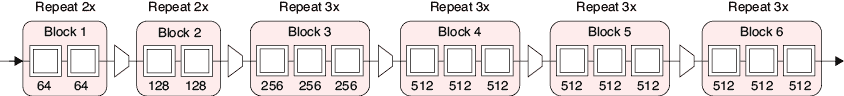

图 23-1：VGG16 的简化示意图，仅显示卷积层和池化层

我们省略了 VGG16 的最后几个阶段，因为它们的作用是帮助网络预测输出的正确类别。在这个应用中，我们不关心网络的输出。我们唯一感兴趣的是将一张图片输入网络，以便卷积层中的滤波器对其输入进行评估。我们的目标是修改一张初始图片，使其尽可能激活某些选择的层。例如，如果中间的几个像素变得更暗，那可能会让寻找眼睛的滤波器稍微有些反应。我们的目标是修改这些像素，使它们激活那个滤波器越来越强烈，也就是说，它们看起来越来越像眼睛。

我们不需要任何新工具来完成这个。我们只需选择我们想要最大化的滤波器输出。我们可以选择一个滤波器，或者从网络的不同部分选择多个滤波器。我们选择使用哪些滤波器完全是个人的和艺术性的。通常，我们会四处尝试，测试不同的滤波器，直到看到我们的输入图像以我们喜欢的方式发生变化。

让我们来看一下步骤。假设我们从三个不同的层中各选一个滤波器，如图 23-2 所示。我们首先向网络提供一张图片，网络会对其进行处理。

我们从我们选择的第一个滤波器中提取特征图，将其所有值加起来，并通过乘以我们选择的权重来确定这个总和的影响力。尽管我们使用了“*权重*”这个词，但这并不是网络内部的权重。它只是一个我们用来控制每个滤波器在深度梦境过程中的影响的值。我们将其他选择的滤波器加总并加权。现在，我们将这些结果加起来。这给了我们一个单一的数字，告诉我们我们选择的滤波器对输入图像的响应强度，且该强度是根据我们希望赋予每一层滤波器的影响力来加权的。我们称这个数字为*多滤波器损失*，或者*多层损失*。

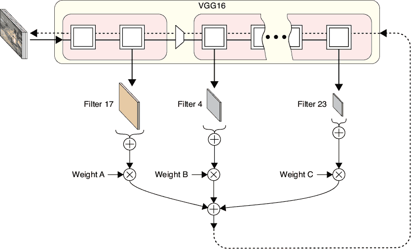

图 23-2：深度梦境算法使用由多层构建的损失

现在进入棘手的部分：多滤波器损失变成了网络的“误差”。在前几章中，我们使用误差来驱动反向传播，计算网络所有权重的梯度，从最后一层开始，逐步向后推导到第一层。然后，我们使用这些梯度来修改网络的权重，以最小化误差。但在这里，我们不是这样做的。相反，我们希望误差（滤波器响应）尽可能大。而我们不想通过改变网络来实现这一点，因为我们并没有训练它。我们将*冻结*网络，使其权重无法改变。相反，我们将修改像素本身的颜色。

所以，从这个误差开始，我们像往常一样使用反向传播来找到网络中所有权重的梯度，但当我们到达第一个隐藏层时，我们再向后退一步，来到输入层，这里包含了像素本身。然后，我们像往常一样使用反向传播来找到像素的梯度。毕竟，改变输入像素会导致网络计算的值发生变化，从而导致我们的误差发生变化。就像我们可以使用反向传播来学习如何改变网络的权重以减少误差，在典型的训练设置中一样，我们也可以使用相同的反向传播算法来找出如何改变像素值以增加这个误差。

现在，像往常一样，我们应用优化步骤。由于我们没有进行训练，网络是被冻结的，我们不会触及网络的权重。但我们确实使用像素的梯度来修改它们的颜色值，以便它们*最大化*误差，或者更强烈地激发我们选择的滤波器。

结果是，像素的颜色会稍微改变，以使滤波器响应更强，从而产生更大的误差，我们使用这个误差来找到像素的新梯度，使它们更强烈地激发滤波器，如此循环往复，每次我们重复这个循环，图像都会发生越来越大的变化。

由于这是一个艺术过程，我们通常在每次更新后（或者每几次更新后）查看输出，并在看到自己喜欢的结果时停止。

### 运行深度梦境

让我们让这个算法发挥作用，以图 23-3 中的青蛙为起点。

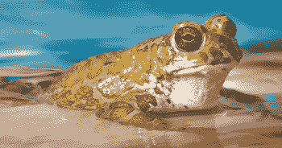

图 23-3：一只平静且深思的青蛙

图 23-4 显示了使用我们通过反复试验选择的一些滤镜（及其权重）从青蛙图像中生成的一些“梦想”。

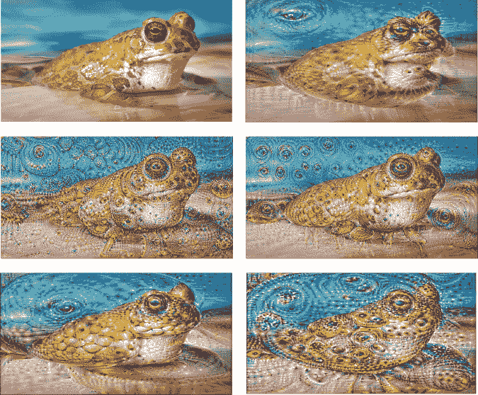

图 23-4：从起始青蛙图像（左上角）开始的一些深度梦想结果

在图 23-4 中，我们看到很多眼睛，因为我们选择的部分滤镜响应了眼睛。如果我们选择了响应马和鞋子的滤镜，那么我们就会期望看到图像中出现大量的马和鞋子。

图 23-5 显示了从一张狗的图像开始的结果。图像的变化主要体现在更细腻的纹理，因为这张狗的图像每边大约有 1000 像素，是网络训练时使用的图像的四倍多。右下角的图像使用了缩放到与网络训练数据相同大小（224 x 224 像素）的狗图像版本。

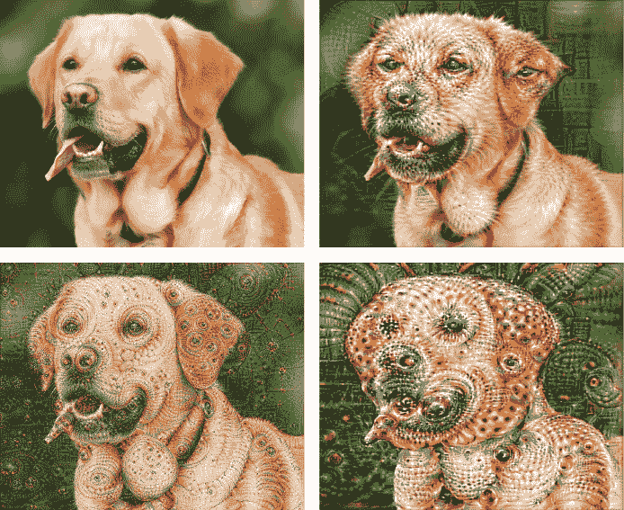

图 23-5：关于狗的深度梦想

这种技术的原始名称是 *启示主义*（Mordvintsev, Olah, 和 Tyka 2015），以电影 *盗梦空间*（Inception）为灵感，但它现在更常被称为 *深度梦想*。这个名字是一个富有诗意的暗示，表明网络正在“梦想”原始图像，我们得到的图像展示了网络的梦想去了哪里。深度梦想之所以流行，不仅因为它创造了奇异的图像，还因为使用现代深度学习库实现它并不困难（Bonaccorso 2020）。

这个基本算法的许多变种已被探索过（Tyka 2015），但它们只是略微触及了表面。我们可以设想一些方案，自动确定层上的权重，甚至对每层的单个滤镜应用权重。我们可以在叠加激活图之前对其进行“掩膜”，以忽略某些区域（如背景），或者我们可以对像素更新进行掩膜，这样原始图像中的某些像素在响应某一层的输出时完全不改变，而是在响应另一组层的输出时发生较大变化。我们甚至可以对输入图像的不同区域应用不同的层和权重组合。深度梦想艺术创作的方法仍有很大的探索空间。

没有“正确”或“最佳”的深度梦想方法。这是一种创造性的练习，我们根据自己的审美、直觉或天马行空的猜测来寻找让我们感兴趣的图像。很难预测任何特定的网络、层和权重组合会产生什么效果，因此这个过程奖励耐心和大量的实验。

## 神经风格迁移

我们可以使用深度梦境技术的一个变种来做一些了不起的事情：将一种艺术家的风格转移到另一张图像上。这个过程被称为*神经风格迁移*。

### 表示风格

各种文化常常庆祝艺术家独特的视觉风格。我们将重点讨论画作。那么，是什么特征定义了一幅画的风格呢？这是一个大问题，因为“风格”可以包括一个人的世界观，这种世界观会影响他们在主题、构图、材料和工具等方面的选择。让我们仅专注于视觉外观。即使这样限制范围，精确地定义画作的“风格”仍然很困难，但我们或许可以说，它指的是如何使用颜色和形状来创造形式，以及这些形式在画布上分布和类型的方式（Art Story Foundation 2020；Wikipedia 2020）。

与其试图完善这个描述，不如看看我们是否能找到一个大致相符的东西，同时又能在深度卷积网络的层和过滤器的框架内进行形式化。

本节的目标是获取我们想要修改的图片，称为*基础图像*，以及我们希望匹配其风格的第二张图片，称为*风格参考图像*。例如，我们的青蛙可以是基础图像，任何一幅画作都可以是风格参考图像。我们希望使用这两者来创建一张新图像，称为*生成图像*，它将基础图像的内容以风格参考图像的风格进行表达。

为了开始，我们将做出一个看似无根据的断言。我们说，图像（例如画作）的风格可以通过观察它产生的层激活来进行表征，并找到大致以相同方式激活的层对。这个想法来源于 2015 年发表的一篇开创性论文（Gatys, Ecker, 和 Bethge 2015）。不深入细节，过程从将风格参考图像输入深度卷积网络开始。与深度梦境一样，我们忽略它的输出，而专注于卷积过滤器。

给定层中的所有激活图具有相同的大小，因此我们可以很容易地将它们进行比较。让我们从层中的第一个激活图开始（即，第一个滤波器的输出）。我们可以将其与第二个滤波器产生的激活图进行比较，并为这对激活图打分。如果这两个图非常相似（即，滤波器在相同位置触发），我们就为这一对分配一个高分；如果这两个图非常不同，我们就为这一对打低分。然后，我们将第一个图与第三个图进行比较，并计算它们的分数，接着将第一个图与第四个图进行比较，计算它们的分数，依此类推。然后，我们可以从第二个图开始，将其与层中的其他所有图进行比较。我们可以将这些结果组织成一个网格，每一侧的格子数与该层的滤波器数量相等。网格中的每个单元格的值告诉我们那一对层的分数。这个网格叫做*Gram 矩阵*。我们将为每一层制作一个这样的 Gram 矩阵。

现在我们可以更正式地重新陈述我们的风格概念：一张图像的风格是由所有层的 Gram 矩阵表示的。也就是说，每种风格都会产生自己特定形式的 Gram 矩阵。

让我们看看这个说法是否成立。图 23-6 展示了巴勃罗·毕加索 1907 年的一幅著名自画像。这里有大量的风格元素，例如大块的颜色和浓重的黑线。让我们将其通过 VGG16 并保存每一层的 Gram 矩阵。我们称这些为*风格矩阵*，并将它们保存为该图像的风格表示。

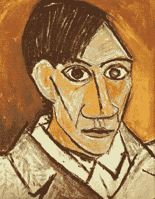

图 23-6：1907 年巴勃罗·毕加索的自画像

如果 Gram 矩阵代表风格，那么我们可以用它们来修改一张随机噪声的初始图像。我们将噪声输入图像通过网络并计算其 Gram 矩阵，我们称之为*图像矩阵*。如果风格矩阵确实以某种方式代表了毕加索图像的风格，那么如果我们能够改变噪声图像中像素的颜色，使得最终图像矩阵接近风格矩阵，那么这张噪声图像就应该呈现出这幅画的风格。

让我们就这么做。我们将噪声通过网络，计算每一层的图像矩阵，并将其与我们为该层保存的风格矩阵进行比较。我们将这两个矩阵之间的差异加总起来，差异越大，结果就越大。然后，我们将所有层的差异加在一起，这就是我们网络的误差。像深度梦境一样，我们使用这个误差来计算整个网络的梯度，包括起始的像素，但我们只修改像素的颜色。与深度梦境不同，我们现在的目标是最小化误差，从而改变像素的颜色，使其生成的 Gram 矩阵与风格参考的 Gram 矩阵相似。

图 23-7 显示了这个过程的结果。对于这个可视化，我们计算了每一层的误差，即所有层的矩阵差异的总和，直到包括该层为止。

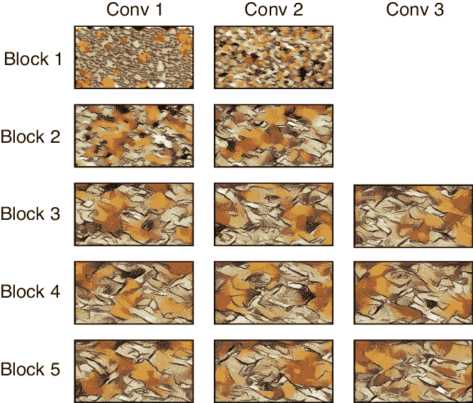

图 23-7：使噪声匹配 VGG16 中的 Gram 矩阵的结果

这非常值得注意。到达 Block 3 中的三个卷积层时，我们生成的抽象图像与我们原始的风格参考在图 23-6 中非常相似。颜色的斑块展示了颜色的渐变变化。不同颜色区域之间有暗线，甚至可以看到画笔的纹理。

Gram 矩阵确实捕捉到了毕加索画作的风格。但为什么呢？令人失望的答案是没有人真正知道（Li 等，2017）。我们有不同的方式来表达 Gram 矩阵所测量的数学内容，但这并没有帮助我们理解为什么这项技术能够捕捉到我们所说的“风格”这一难以捉摸的概念。神经风格迁移的原始论文（Gatys、Ecker 和 Bethge 2015）以及后续的较为详细的论文（Gatys、Ecker 和 Bethge 2016）都没有解释作者是如何想到这个想法的，或为何它如此有效。

### 表示内容

在深度梦境（deep dreaming）中，我们从一张图像开始，通过改变其像素来操控它。如果我们在神经风格迁移中做同样的事情，从图像而非噪声开始，图像很快就会丢失。最小化 Gram 矩阵之间差异的效果会对输入图像产生巨大变化，使其朝我们想要的风格靠拢，但在这个过程中丧失了图像的内容。

解决这个问题的一种方法是依然从噪声开始，因为它非常有效（如图 23-7 所示），但通过添加第二个误差项来保留原始图像的本质。除了施加惩罚输入与风格参考匹配不良的*风格损失*（通过 Gram 矩阵的差异来衡量），我们还施加了惩罚输入与基图像（我们希望进行风格化的图片）差异过大的*内容损失*。通过从噪声开始并将这两个误差项加在一起（通常有不同的权重），我们使噪声中的像素发生变化，从而使它们同时更接近我们想要修改的图片的颜色和我们希望呈现的风格。

收集内容损失非常简单。我们拿到基图像，比如图 23-3 中的青蛙，并将其输入到网络中。然后我们保存每个滤波器的激活图。此后，每次我们将新图像输入到网络时，内容损失就是该输入的滤波器响应与我们从基图像中获得的响应之间的差异。毕竟，如果所有滤波器对输入的响应与起始图像相同，那么输入就是起始图像（或非常接近它）。

### 风格和内容的结合

总结一下，我们将风格参考输入到网络中，并在每一层之后保存每对滤波器的 Gram 矩阵。接下来，我们找到一个希望风格化的基础图像，将其输入网络，并保存每个滤波器生成的特征图。

使用这些保存的数据，我们可以创建一个风格化版本的图像。我们从噪声开始，并将其输入到网络中。整个过程的框图如图 23-8 所示。

让我们从内容损失开始。在最左侧的浅蓝色圆角矩形中，我们收集来自第一卷积层滤波器的特征图，并计算这些特征图与我们从基础图像（例如青蛙）中保存的特征图之间的差异。我们对第二卷积层的特征图也进行相同的处理。我们可以对所有层进行这种操作，但对于本图和后续示例，我们在第二层后停止（这是另一种个人选择，基于实验指导）。我们将所有这些差异或内容损失加在一起，并通过某个值对其总和进行缩放，以便控制图像内容对我们最终在输入图像的颜色上所做变化的影响程度。

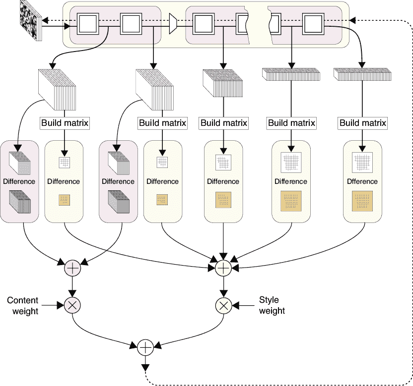

图 23-8：神经风格迁移的框图

现在我们处理风格问题。对于每一层，在浅黄色的圆角矩形中，我们计算 Gram 矩阵，告诉我们每个滤波器的输出与其他滤波器输出之间的对应关系。然后，我们将这些矩阵与我们之前保存的风格矩阵进行比较。我们将所有这些差异加起来，得到风格损失，并通过某个值对其进行缩放，以便控制风格对我们修改像素颜色时的影响程度。

内容损失和风格损失的总和就是我们的误差。与深度梦想一样，我们计算整个网络的梯度，并一直反向传播到像素。再次强调，我们保持网络中的权重不变。与深度梦想不同的是，我们修改像素值以*最小化*这个总误差，因为我们希望输入与我们之前保存的内容和风格信息相匹配。结果是，原始噪声会慢慢变化，使其既更像原始图像，又具有风格的滤波器关系。

与深度梦想相似，使用现代深度学习库实现神经风格迁移是直接的（Chollet 2017；Majumdar 2020）。

### 运行风格迁移

让我们看看这个方法在实践中效果如何。我们再次使用 VGG16 作为我们的网络，并按照图 23-8 中总结的过程进行。

图 23-9 展示了九张每张都有独特风格的图像。这些是我们的风格参考。

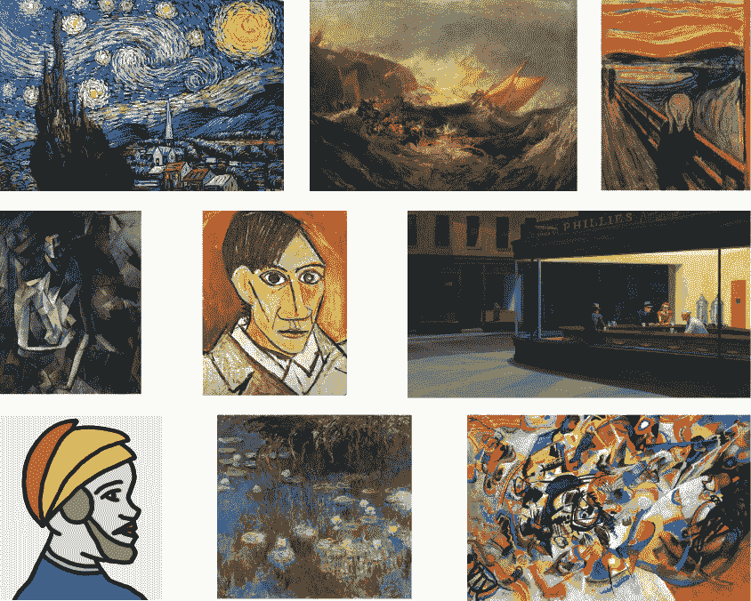

图 23-9：九张不同风格的图像，它们作为我们的风格参考。从左到右，从上到下，它们分别是**《星夜》**，由文森特·梵高绘制，**《米诺陶斯的沉船》**，由 J. M. W. 塔纳绘制，**《呐喊》**，由爱德华·蒙克绘制，**《坐姿女性裸体》**，由巴勃罗·毕加索绘制，**《1907 年自画像》**，由巴勃罗·毕加索绘制，**《夜鹰》**，由爱德华·霍普绘制，**《克罗奇中士》**，由作者绘制，**《睡莲：黄色与丁香》**，由克劳德·莫奈绘制，以及**《构成 VII》**，由瓦西里·康定斯基绘制。

让我们将这些风格应用到我们老朋友——青蛙身上。图 23-10 展示了结果。

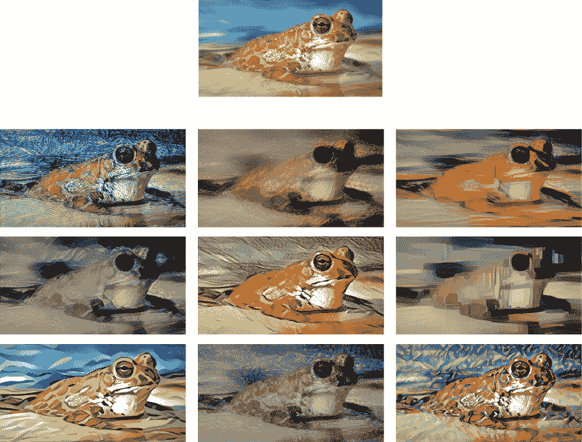

图 23-10：将图 23-9 中的九种风格应用到青蛙的照片上（顶部）

哇，这效果真棒。这些图像值得仔细观察，因为它们有很多细节。乍一看，我们可以看到每种风格参考的色彩调色板已经被转移到了青蛙照片中。但注意纹理和边缘，以及色块的形状。这些图像不仅仅是颜色变化的青蛙，或是两张图像的叠加或混合。相反，这些是不同风格下青蛙的高质量详细图像。为了更清晰地看到这一点，图 23-11 展示了每只青蛙的相同放大区域。

这些图像有显著不同，而且每一张都与其所基于的风格相匹配。

让我们看另一个例子。图 23-12 展示了将我们的风格应用到一张城镇照片上。

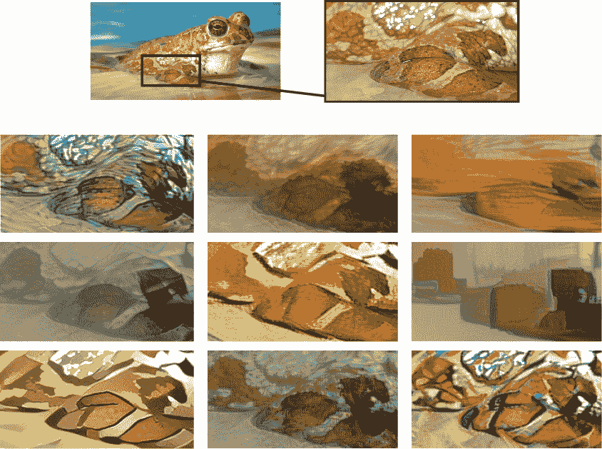

图 23-11：图 23-10 中九只风格化青蛙的详细信息

当我们记得这些图像最初都是从随机噪声开始时，它们显得尤为引人注目。对于每一张图像，我们将内容损失的权重设为 0.025，风格损失的权重设为 1，因此风格对像素变化的影响是内容的 40 倍。在这些示例中，少量的内容产生了很大的效果。

如图 23-10 至 23-12 所示，神经风格迁移的基本算法产生了出色的结果。这项技术在许多方面得到了扩展和修改，以提高算法的灵活性、它产生的结果类型，以及艺术家可以应用的控制范围，以创造他们想要的效果（Jing et al. 2018）。它甚至已被应用于视频和完全包围观众的球形图像（Ruder, Dosovitskiy, and Brox 2018）。

与深度梦境类似，神经风格迁移是一个通用算法，允许进行大量的变化和探索。肯定还有许多有趣且美丽的艺术效果等待被发现。

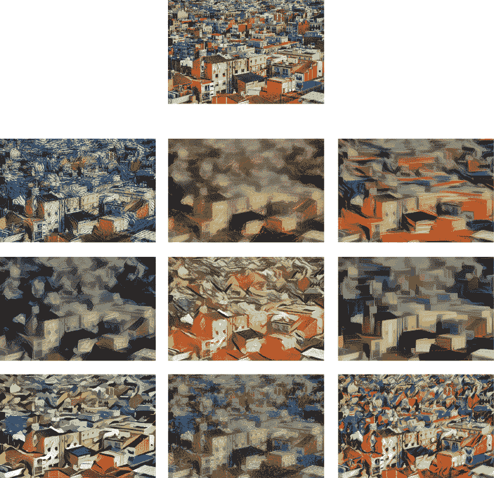

图 23-12：将图 23-9 中的九种风格应用到一张俯视的城镇照片（顶部）

## 生成更多本书内容

为了好玩，我们将本书第一版的文本（这一节除外）通过一个 RNN 进行了处理，该 RNN 按字生成新文本，如第十九章所讨论的。完整的文本大约包含 427,000 个单词，来自大约 10,300 个单词的词汇表。为了学习这些文本，我们使用了一个由两层 LSTM 组成的网络，每层 128 个单元。

该算法通过自回归地生成输出，根据它到目前为止生成的文本找到下一个最可能的单词，然后是下一个最可能的单词，再然后是下一个，以此类推，直到我们停止它。以这种方式生成文本就像是玩一个游戏，通过不断选择手机在你打字时建议的三到四个单词中的一个，来创建信息（Lowensohn 2014）。

这是在 250 次迭代后从输出中手动选择的一些句子。它们原封不动地包括在此，其中包括标点符号。

+   所有红圈中的样本的响应共享两个数字，就像最后一步的底部，当它们的数字会影响输入与其类别的关系时。

+   梯度取决于损失，它们是墙上的一些小像素。

+   让我们看看这个三段论中不同狗的代码。

令人惊讶的是，这些几乎是有意义的！

整个句子很有趣，但一些最具娱乐性和诗意的片段出现在训练开始不久，当时系统只生成片段。以下是仅经过 10 个周期后手动选择的一些摘录，再次按照它们生成的原样呈现：

+   一组应用，我们+信息。

+   假设我们只有参数化。

+   通常的怪异（我们比那更应该使用它们的方式上）。

这些大多是无序的，但从这些合成短语中，我们可以提炼出一个事实：这本书的主要目标之一肯定是“+信息”。

循环神经网络（RNN）很棒，但基于转换器的生成器更好。我们对本书当前版本（除了这一节）使用了一个中等大小的 GPT-2 生成器进行微调。以下是一些精选的输出片段，挑选它们是因为它们的创意范围（第二组似乎是图表标题）。

+   这是被誉为人工神经元女王的神经网络。她的名字是 Christine，这一点毫不奇怪，但这确实能充分说明该领域的现状。

+   我们可以将这些版本链接在一起，形成一个分类器的单一张量，它本质上是一个“惊喜盒子”。

+   让我们使用一个小工具，采取捷径，使我们能够即时进行单词预测，即使我们不是在线或离线时合适的人。

+   在这个视图中，范围内的 1 是完美的整数，而范围内的 0 是一个超现实的数字字符串。我们在第六章采用的方法是将所有的 0 视为不完整，将所有的 1 视为不完整，因为我们仍然对我们正在评估的系统有一些信息。

+   图 10-7：一组没有标签的负图像。

+   图 10-10：一个深度学习系统学习如何从数据集中创建和移除车牌。

## 总结

本章开始时，我们研究了深度梦境技术，这是一种通过操控图像来激发网络中的特定滤镜，创造出狂野、迷幻图像的方法。接着，我们探讨了神经风格迁移技术。利用这项技术，我们逐渐将随机噪声输入转变为既像输入图像，又像风格参考图像的形式，比如各种画家的作品。最后，我们使用了一个小型的 RNN 和一个 Transformer 来从本书的手稿中生成新的文本。生成看似熟悉或合理的新文本是件有趣的事！

## 最后的思考

本书只涉及了深度学习的基本概念。这个领域正在以惊人的速度发展。每年新的突破似乎都打破了对计算机能够识别、分析、预测和合成的所有预期。

仅仅跟上新工作的步伐就可能是一份全职工作。保持对新进展的关注的一个方法是访问一个名为 arXiv（读作“archive”）的网站，网址是[`arxiv.org/`](https://arxiv.org/)，更具体地说，是访问机器学习板块：[`arxiv.org/list/cs.LG/recent`](https://arxiv.org/list/cs.LG/recent)*。这个网站发布新论文的预印本，在论文正式出现在期刊和会议之前。但即使是关注 arXiv，也可能让人感到信息量过大，因此，许多人使用 arXiv Sanity Preserver 网站（[`www.arxiv-sanity.com`](http://www.arxiv-sanity.com)）和 Semantic Sanity 项目（[`s2-sanity.apps.allenai.org/cold-start`](https://s2-sanity.apps.allenai.org/cold-start)）。这两个网站帮助过滤文库，只展示涉及特定关键词和思想的论文。

本书重点介绍了深度学习的技术背景。需要记住的是，当我们以可能影响人的方式使用这些系统时，我们需要考虑的远不止算法本身（O'Neil 2016）。由于深度学习系统的高效性，它们被广泛且迅速地部署，通常缺乏监管或对其对社会影响的考虑。

深度学习系统如今被广泛应用于影响或决定工作录用、学校录取、监禁判决、个人和商业贷款，甚至是医学检测的解读。深度学习系统控制着人们在新闻和社交媒体中的信息流，选择展示的内容不是为了建立一个健康且信息丰富的社会，而是为了增加提供这些信息流的组织的利润（Orlowski 2020）。在“智能音响”和“智能显示器”中（这些设备也配有麦克风和摄像头），深度学习系统不断监听和监视人们在家中的活动，有时将捕捉到的数据发送到远程服务器进行分析。过去，文化上曾经害怕这种持续的监视，但现在人们愿意为这些设备付费，并将它们放置在以前属于私人空间的地方，如家中和卧室里。深度学习被用于在学校中挑出可能有问题的孩子，评估在边境检查时回答问题的人的诚实性，并通过识别面部特征来识别抗议活动和其他集会中的个体。这些算法所犯的错误可能从令人烦恼到彻底改变人生。即使结果不完全错误，这些系统也越来越多地做出深远的决定，影响着我们的公共和私人生活。

深度学习系统的效果取决于其训练和算法的质量，一次又一次，我们发现训练数据中的偏见、成见和明显错误被算法继承并加以强化。此类系统远远无法达到我们在与人类和其他生物打交道时所期待的准确性和公平性。我们的算法完全缺乏同情心和怜悯心。它们没有对特殊情况的理解，也无法理解它们的决策可能带来的喜悦或痛苦。它们无法理解爱、善良、恐惧、希望、感恩、悲伤、慷慨、智慧，或我们彼此之间所珍视的其他品质。它们无法崇拜、哭泣、微笑、悲痛、庆祝或后悔。

深度学习为我们个人和社会提供了巨大的希望。但任何工具都可以被当作武器使用，利益仅仅归工具的拥有者，而对受影响的人则带来不利。机器学习系统往往是有效隐形的，因此任何系统性的错误可能会长期未被发现。即使问题被揭露，追究受益于这些系统的组织的责任也需要巨大的社会和政治行动，甚至更大的努力才能带来改变。

机器学习系统的另一个危险在于它们对大量训练数据的贪婪需求。这为那些专门收集、整理和出售曾经私密的个人信息的组织创造了市场，这些信息涉及个人的友谊和家庭关系，以及他们喜欢去哪里和什么时候旅行，喜欢吃什么食物，正在服用什么药物，以及他们的 DNA 揭示了什么。这些数据可以用来骚扰、威胁、恐吓甚至伤害个人。

对大量数据的需求也意味着，随着一个组织的规模变大（且通常责任感变弱），它能收集的数据就越多，其算法也就越强大，决策的影响力也随之增加，这意味着它们可以收集更多的数据，从而在反馈循环中巩固组织的权力。这样系统中的每一个不完美都会被放大，并且由于其规模庞大，负面影响可能完全被运营这些系统的人忽视。通常，唯一能够与这些组织竞争的将是其他同样规模的组织，它们提供的系统包含着自己的巨大数据库，内含着各自的偏见和错误，最终导致我们今天所熟悉的偏见巨头之间的对抗。在没有强有力和严格执行的控制和监管的情况下，这种持续和日益集中的权力在自由社会中是一股危险的力量。不幸的是，今天这样的控制几乎无法看到。

深度学习已经产生了能够让任何人的外貌——从娱乐圈人士到政治家——都可以被用来制作出看似真实的图片、音频和视频，仿佛那个被操控的人说或做了任何操控软件的人所希望的事情。社会已经开始依赖录制的音频、照片和视频来执行合同、调解冲突、赞美或羞辱公众人物、影响选举，以及作为法庭证据。这个时代即将结束，我们将回到一个没有可靠照片、录音和视频的时代，那时流言、记忆和观点将取代客观的历史记录。如果没有可靠的音频和视觉证据来记录某人实际说了什么或做了什么，那么在场中最响亮、最富有或最有说服力的声音将决定公共舆论、选举和法庭中的许多结果，因为客观事实将越来越难以被找到或信任。

深度学习是一个令人着迷的领域，我们才刚刚开始理解它将如何影响我们的文化和社会。学习算法无疑会继续扩展其范围和影响力。它们有机会通过帮助人们更幸福、使社会更加公平和支持性强、创造更健康和多样化的个人、社会、政治和物理环境，带来巨大的好处。即使这些可能会削减企业利润或政府控制，我们仍然应该努力追求这些积极的成果。

我们应当记住，像使用我们所有工具一样，深度学习也应该用来激发人类的最佳潜力，让世界变得对每个人来说更加美好。
