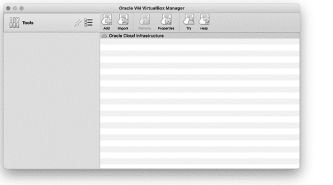

# 前言


每天，DevOps 工程师都沉浸在基于云的趋势和技术中。与此同时，工程领域的其他人也被期望熟悉 DevOps，并跟上它的发展步伐。原因很简单：DevOps 是软件开发不可或缺的一部分。然而，你可能没有时间既做本职工作，又跟上 DevOps 不断变化的局面——幸运的是，你不需要这样做。只需了解 DevOps 的基础概念、术语和策略，你就能走得更远。

另一方面，当需要交付代码时，你不能只是把头埋在沙子里，希望别人来处理。编写配置文件、强制实施可观测性、设置持续集成/持续交付（CI/CD）管道已经成为软件开发中的常态。因此，你需要精通代码和基础设施。

如果你是软件工程师、开发人员或系统管理员，本书将教你 DevOps、可靠性和现代应用堆栈的概念、命令和技术，为你打下坚实的基础。但请注意，这只是 DevOps 的介绍，而非权威指南。我选择将知识的火 hose 轻轻开着，专注于以下几个基础概念：

1.  基础设施即代码

1.  配置管理

1.  安全

1.  容器化与编排

1.  交付

1.  监控与告警

1.  故障排除

还有许多其他优秀的书籍可以深入探讨 DevOps 的概念和文化。我鼓励你去阅读它们，了解更多。但如果你只想从基础开始，《*DevOps for the Desperate*》这本书就能满足你的需求。

## DevOps 的现状如何？

在过去几年里，DevOps 中出现了不同的趋势。重点放在微服务、容器编排（Kubernetes）、自动化代码交付（CI/CD）和可观测性（详细的日志记录、追踪、监控和告警）上。这些话题对 DevOps 社区来说并不陌生，但由于大家都已经“吃下红药丸”，进入了云计算和容器化的世界，这些话题正在获得更多关注。

自动化和测试“代码到客户”的体验仍然是 DevOps 中最重要的部分之一，并且随着后期采用者的追赶，这一趋势将持续下去。随着工程生态系统的成熟，越来越多的 DevOps 工作正在向技术栈的更高层次发展。换句话说，DevOps 工程师越来越依赖工具和流程，以便软件工程师能够自助地交付代码。因此，与功能团队共享 DevOps 实践和技术对交付标准化和可预测的软件至关重要。

这里有几个新兴趋势值得简要提及。第一个是安全性。DevSecOps 正在成为构建过程中的一个必要部分，而不是发布后的附加思考。另一个趋势是利用机器学习进行数据驱动的决策，例如警报。机器学习的洞察力在启发式方面非常有用，并将在未来发挥更大的作用。

## 谁应该阅读本书？

本书旨在帮助软件工程师在现代应用栈中感到得心应手并茁壮成长。因此，它提供了关于 DevOps 任务的适量入门信息。这并不是说它对已成型的 DevOps 工程师毫无帮助。恰恰相反，它提供了许多关于容器化、监控和故障排除的有用信息。如果您是 DevOps 工程师或小型企业的软件工程师，您甚至可以使用本书帮助您创建整个应用栈，从本地开发到生产。

所以，如果您是一个软件开发人员，想了解有关 DevOps 的知识，本书适合您。如果您有兴趣成为一名通才，本书适合您。如果我付钱给您读这本书——嗯，那么这本书绝对适合您。

## 本书的组织结构

本书分为三个部分，如下所示：

### 第一部分：基础设施即代码、配置管理、安全性和管理

第一部分介绍了基础设施即代码（IaC）和配置管理（CM）的概念，这对于构建具有可重复、版本化和可预测状态的系统至关重要。我们还将探索基于主机和基于用户的安全性。

1.  第一章：设置虚拟机 本章讨论了 IaC 和 CM 的概念。接着介绍了两种技术，Vagrant 和 Ansible，您将使用它们来创建和配置 Ubuntu 虚拟机。

1.  第二章：使用 Ansible 管理密码、用户和组 本章探讨了如何使用 CM 进行用户和组创建，以限制文件和目录的访问权限。还解释了如何使用 CM 强制执行复杂密码。

1.  第三章：使用 Ansible 配置 SSH 本章展示了如何设置公钥和双因素身份验证，从而使未经授权的用户更难访问您的主机和敏感数据。

1.  第四章：使用 sudo 控制用户命令 本章向您展示了如何创建一个安全策略，委派特定用户和组的命令访问权限。控制用户和组在主机上的命令访问权限可以帮助您避免不必要的暴露给攻击者。至少，它可以防止您拥有配置不当的操作系统。

1.  第五章：自动化和测试基于主机的防火墙 本章描述了如何创建和测试一个最小的防火墙，它将阻止所有不需要的访问，同时允许批准的流量。通过限制端口暴露，您可以减少主机和应用程序可能遭遇的外部漏洞。

### 第二部分：容器化和部署现代应用

第二部分介绍了容器化、编排和交付的概念。它还探讨了一些构成现代栈的组件。

1.  第六章：使用 Docker 容器化应用 本章介绍了容器和容器化，并展示了如何创建一个示例容器化应用。理解容器及如何将其用于本地开发和生产环境是你能与任何现代应用栈协作的关键。

1.  第七章：使用 Kubernetes 进行编排 本章介绍了容器编排，并探讨了如何使用 Kubernetes 和 minikube 等技术在本地集群上部署应用。它还展示了如何设置本地开发环境的示例。

1.  第八章：部署代码 本章讨论了持续集成和持续部署（CI/CD）的概念。它还探讨了一些核心技术，如 Skaffold，帮助你在本地 Kubernetes 集群上创建管道。构建有效的 CI/CD 管道后，你将能够很好地理解如何构建、测试和部署软件。

### 第三部分：可观测性与故障排除

最后，第三部分介绍了监控、告警和故障排除的概念。它讨论了应用和主机的度量收集与可视化，还讨论了一些常见的主机和应用问题，以及你可以使用的工具来诊断它们。

1.  第九章：可观测性 本章介绍了监控和告警堆栈的概念，并探讨了构成该堆栈的技术（Prometheus、Alertmanager 和 Grafana）。你将学习如何检测系统状态，并在出现问题时进行告警。

1.  第十章：故障排除主机 最后一章讨论了主机上常见的问题和错误，以及你可以使用的一些工具来排查它们。能够分析主机上的问题将帮助你在危机时刻找到解决方案，并帮助你理解自己代码和应用中的性能问题。

## 你需要的工具

为了探索本书中的 DevOps 概念，你将安装一些工具以及适用于 x86 硬件的免费虚拟化技术 VirtualBox，这样你就可以在本地主机上运行其他操作系统。不幸的是，某些操作系统和 CPU（如 Windows 和 Apple Silicon）上，某些所需工具无法原生运行。使用 Linux 或基于 Intel 的 Mac 作为主机是最直接的选择。以下是针对每种操作系统的概述：

**Linux**

1.  如果你使用的是 Linux 主机，所有示例和示范应用都可以直接使用。由于你将安装 VirtualBox，你需要运行一个桌面版的 Linux，而不是无头服务器。

**基于 Intel 的 Mac**

1.  如果你使用的是基于 Intel 的 Mac，像在 Linux 上一样，所有的示例和应用程序都无需任何修改即可运行。使用 Brew 包管理器 ([`brew.sh`](https://brew.sh)) 安装软件。

**Windows**

1.  如果你使用的是 Windows 主机，在本书中安装所有工具和应用程序可能会遇到一些挑战。例如，你将使用 Ansible 来探索配置管理，但在 Windows 上没有简单的方法安装 Ansible。作为解决方法，你可以使用 Ubuntu 虚拟机作为起点。我建议使用 Hyper-V 创建虚拟机，因为它是 Windows 的原生功能。你需要 Windows 10 或 11 专业版才能使用 Hyper-V。有关如何在 Hyper-V 上创建 Ubuntu 虚拟机的说明，请参阅 Ubuntu Wiki ([`wiki.ubuntu.com/Hyper-V`](https://wiki.ubuntu.com/Hyper-V))。

    你还需要启用嵌套虚拟化，因为你将在 Hyper-V 的 Ubuntu 虚拟机内安装 VirtualBox。要启用此功能，请在管理员 PowerShell 终端中输入以下命令：

    ```
    `Set-VMProcessor -VMName` `VMName` `-ExposeVirtualizationExtensions $true`
    ```

    当 Ubuntu 虚拟机停止时，你需要运行此命令，否则它会失败。将 `VMName` 替换为你刚刚创建的 Ubuntu 虚拟机的名称。

    在你的虚拟机启动并运行后，你需要使用 [`www.virtualbox.org/wiki/Linux_Downloads`](https://www.virtualbox.org/wiki/Linux_Downloads) 上列出的 Ubuntu 版本安装 VirtualBox。完成安装后，你就可以在新创建的虚拟机内运行本书的示例。

    对于旧版本的 Windows，你可以使用 VirtualBox（是的，VirtualBox 在 VirtualBox 内）或 VMware ([`www.vmware.com/products/workstation-player.html`](https://www.vmware.com/products/workstation-player.html)) 来创建 Ubuntu 虚拟机。这些选项的具体说明超出了本书的范围。

**苹果硅**

1.  如果你使用的是苹果硅计算机作为主机，VirtualBox 不是一个可行的选项。苹果硅的 CPU 基于 ARM 架构，而 VirtualBox 仅支持 x86。相反，你需要使用像 Parallels ([`parallels.com`](https://parallels.com))、VMware Fusion ([`vmware.com`](https://vmware.com)) 或 Qemu ([`www.qemu.org`](https://www.qemu.org)) 这样的虚拟化技术来创建一个基于 ARM 的虚拟机。前两种选择是付费软件，可能提供更好的用户体验。Qemu 是免费的开源软件，且需要一些额外的配置步骤。访问配套的 GitHub 仓库 ([`github.com/bradleyd/devops_for_the_desperate/tree/main/apple-silicon/`](https://github.com/bradleyd/devops_for_the_desperate/tree/main/apple-silicon/)) 获取有关如何在你的苹果硅 Mac 上设置合适实验环境的详细说明。

为了获得最佳体验，主机应至少有 8GB 内存和 20GB 可用磁盘空间；如果你内存或磁盘空间较少，体验可能会有所不同。本书还假设你对 Linux 和命令行有基本的了解。你应该熟悉 Bash 并能够自如地编辑文件。

### 下载和安装 VirtualBox

从 [`www.virtualbox.org/wiki/Downloads/`](https://www.virtualbox.org/wiki/Downloads/) 下载安装程序。选择最新版本并下载适合你操作系统的版本。如前所述，Windows 用户如果使用 Hyper-V，将安装适用于 Ubuntu Linux 的 VirtualBox。对于 Intel 架构的 Mac，请点击 OS 主机链接并下载安装程序。对于 Linux，你猜对了——点击 Linux 发行版链接以找到适合你发行版的下载。VirtualBox 网站提供了针对不同操作系统的详细安装说明，地址为 [`www.virtualbox.org/manual/`](https://www.virtualbox.org/manual/)。

从你安装 VirtualBox 的位置启动它，以验证是否正常运行。如果一切正常，你应该会看到一个启动屏幕（见图 1）。



图 1：macOS 上的 VirtualBox 启动屏幕（根据你的主机操作系统，它的外观会有所不同）

如果你决定使用操作系统的包管理器来安装 VirtualBox，请确保你安装的是最新版本，因为旧版本可能与本书中的示例有所不同。

### 配套仓库

由于这是一本面向绝望者的书，我擅自创建了 IaC 文件、Kubernetes 清单、示例应用程序以及其他一些有助于你跟随书中内容的资源。我已经将所有示例和源代码放入 Git 仓库，地址是 [`github.com/bradleyd/devops_for_the_desperate.git`](https://github.com/bradleyd/devops_for_the_desperate.git)。为了跟随章节和示例，你需要克隆本书的仓库。你的操作系统默认应该已安装 Git，但如果没有，可以访问 [`git-scm.com/downloads`](https://git-scm.com/downloads)，获取如何为你的操作系统下载和安装 Git 的信息。

在终端中输入以下命令以克隆配套仓库：

```
$ **git clone https://github.com/bradleyd/devops_for_the_desperate.git**
```

随意将该仓库克隆到你喜欢的任何位置。如果你需要更多帮助，我在 *README* 文件中也添加了一些信息。我们将在本书的过程中多次访问这个仓库。

### 编辑器

在本书中，你需要编辑和查看文件以完成任务。例如，在一些 Ansible 文件中，我已经将部分内容注释掉，你需要取消注释，或者你需要填写一些缺失的信息。

我建议使用你熟悉的任何编辑器。你无需任何特殊插件或依赖来跟随本书的内容。然而，如果你仔细寻找，我相信你一定能找到语法插件来帮助编辑不同类型的文件，比如 Ansible 和 Vagrant 清单文件。我使用 Vim 作为编辑器，但你可以随意替换成你喜欢的编辑器。

现在，所有背景知识都已介绍完毕，你已经准备好开始了！在第一章，我们将深入探讨如何设置本地虚拟机。
