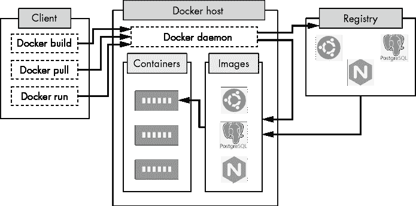

# 第六章：使用 Docker 容器化应用程序


*容器*是基于容器镜像的运行实例。使用容器为您提供了一种可预测且隔离的方式来创建和运行代码。它允许您将应用程序及其依赖项打包成一个便于分发和运行的可移植工件。微服务架构和持续集成/持续开发流水线广泛使用容器，如果您是软件工程师或 DevOps 工程师，使用容器很可能已经改变了您交付和编写软件的方式。

在本章中，您将学习如何安装 Docker 引擎和`docker`客户端命令行工具。您还将快速了解 Dockerfile、容器镜像和容器的基础知识。您将结合这些知识以及一些基本的 Docker 命令，将我在本书存储库中提供的样例应用程序*telnet-server*容器化（[`github.com/bradleyd/devops_for_the_desperate/`](https://github.com/bradleyd/devops_for_the_desperate/)）。通过本章的学习，您将对如何使用 Docker 将任何应用程序容器化以及这样做的好处有深入的理解。

## Docker 的高层视角

单词*Docker*已经成为容器运动的代名词。这是因为 Docker 的易用性，微服务架构的兴起，以及解决“在我的机器上可运行”的悖论的需要。容器的概念已经存在了相当长的时间，然而，存在许多容器框架。但自从 Docker 在 2013 年 3 月发布了第一个开源版本以来，该行业已经采纳了 Docker 框架作为事实上的标准。Docker 的第一个稳定版本（1.0）发布于 2014 年，自那时以来，新版本已包含了许多改进。

Docker 框架由一个 Docker 守护程序（服务器）、一个`docker`命令行客户端以及本书范围之外的其他工具组成。Docker 利用 Linux 内核特性来构建和运行容器。这些组件结合在一起使得 Docker 能够发挥其魔力：*操作系统级虚拟化*，将操作系统分割成看起来像是独立隔离的服务器，如图 6-1 所示。因此，当您需要在有限的硬件上运行大量应用程序时，容器非常有效。


图 6-1：操作系统级虚拟化

### 使用 Docker 入门

首先，你需要创建一个 *Dockerfile*，描述如何从应用程序构建 *容器镜像*。容器镜像由不同的层组成，这些层包含了你的应用程序、依赖关系以及应用程序运行所需的其他内容。容器镜像可以通过一个叫做 *镜像库* 的服务进行分发和提供。Docker 提供了最受欢迎的镜像库：[`hub.docker.com/`](https://hub.docker.com/)。在这里，你几乎可以找到任何你需要的镜像，例如 Ubuntu 或 PostgreSQL 数据库。使用简单的 `docker pull` `<image-name>` 命令，你可以在几秒钟内下载并使用一个镜像。容器是基于容器镜像运行的应用实例。图 6-2 显示了 Docker 各个部分是如何协同工作的。在本章中，你将主要使用 `docker` 客户端。



图 6-2：Docker 框架

### Dockerfile 指令

Dockerfile 包含了指导 Docker 服务器如何将应用程序转化为容器镜像的指令。每条指令代表一个特定的任务，并在容器镜像内创建一个新的层。以下列表包含了最常见的指令：

1.  `FROM` 指定从哪个父镜像或基础镜像构建新的镜像（必须是文件中的第一个命令）

1.  `COPY` 将当前目录（Dockerfile 所在的目录）中的文件添加到镜像文件系统中的目标位置

1.  `RUN` 在镜像内执行命令

1.  `ADD` 将新的文件或目录从源位置或 URL 复制到镜像文件系统中的目标位置

1.  `ENTRYPOINT` 使容器像可执行文件一样运行（你可以把它当作任何在主机上接受参数的 Linux 命令行应用程序）

1.  `CMD` 提供容器的默认命令或默认参数（可以与 `ENTRYPOINT` 配合使用）

请参考 Dockerfile 文档：[`docs.docker.com/engine/reference/builder/`](https://docs.docker.com/engine/reference/builder/) 以获取指令和配置详情。

### 容器镜像和层

你构建的 Dockerfile 会创建一个容器镜像。这个镜像由不同的层组成，这些层包含了你的应用程序、依赖关系以及应用程序运行所需的其他内容。这些层就像是应用程序状态的时间快照，因此将 Dockerfile 与源代码一起保存在版本控制中，可以让你在每次应用程序代码更改时更容易构建新的容器镜像。

各个层就像乐高积木一样紧密结合。每一层，或称为中间镜像，都是在执行 Dockerfile 中的每一条指令时创建的。例如，每次使用 `RUN` 指令时，都会根据该指令的结果创建一个新的中间层。每个层（镜像）都会分配一个唯一的哈希值，并且所有层默认都会被缓存。这意味着你可以与其他镜像共享层，因此如果某个层没有发生变化，你就无需重新从头构建它。此外，缓存是你的好朋友，因为它可以减少构建镜像所需的时间和空间。

Docker 可以将这些层叠加在一起，因为它使用了*联合文件系统（UFS）*，允许多个文件系统结合起来，创建出看似单一的文件系统。最上面的层是*容器层*，在你运行容器镜像时会添加这个层。它是唯一一个可以被写入的层。所有后续的层都是只读的，这是有意为之的。如果你在容器层做了任何文件或系统更改，然后删除运行中的容器，这些更改将会消失。底层的只读镜像会保持不变。这就是为什么容器在软件工程师中如此受欢迎：镜像是不可变的工件，可以在任何 Docker 主机上运行，并表现出相同的行为。

### 容器

Docker 容器是容器镜像的一个运行实例。在计算机编程术语中，可以将容器镜像视为一个*类*，而容器则是该类的*实例*。当容器启动时，容器层会被创建。这个可写层是所有更改（例如写入、删除和修改现有文件）发生的地方。

### 命名空间和控制组

容器还通过一些边界和有限视图将自己与 Linux 主机的其他部分隔离开来，这些被称为*命名空间*和*控制组*。它们是内核特性，限制了容器在主机上可以看到和使用的内容。它们还使操作系统级虚拟化成为现实。命名空间限制了容器的全局系统资源。如果没有命名空间，容器可能会自由地访问整个系统。想象一下，如果一个容器能够看到另一个容器中的进程。那个调皮的容器可能会杀死进程、删除用户，或卸载另一个容器中的目录。当你凌晨 2 点接到故障电话时，试着追踪这个问题！

常见的内核命名空间包括以下内容：

1.  进程 ID（`PID`）隔离进程 ID

1.  网络（`net`）隔离网络接口栈

1.  UTS 隔离主机名和域名

1.  挂载（`mnt`）隔离挂载点

1.  IPC 隔离 SysV 样式的进程间通信

1.  用户隔离用户和组 ID

然而，单独使用这些命名空间是不够的。你还需要控制容器使用的内存、CPU 和其他物理资源。这里就需要使用 cgroups。Cgroups 管理并衡量容器可以使用的资源。它们允许你为进程设置资源限制和优先级。Docker 通过 cgroups 设置的最常见资源是内存、CPU、磁盘 I/O 和网络。Cgroups 使得你可以防止容器占用主机的所有资源。

需要记住的主要要点是，命名空间限制了你可以看到的内容，而 cgroups 限制了你可以使用的内容。如果没有这些功能，容器将既不安全也不实用。

## 安装和测试 Docker

为了将一个示例应用程序容器化，你将首先借助*minikube*安装 Docker，它是一个包含 Docker 引擎并提供 Kubernetes 集群的应用（你将在下一章中使用该集群）。接下来，你将安装`docker`客户端，以便能够与 Docker 服务器进行通信。然后，你将配置环境，以便能够找到新的 Docker 服务器。最后，你将测试客户端连接性。

### 使用 Minikube 安装 Docker 引擎

要安装 minikube，请根据你的操作系统参考[`minikube.sigs.k8s.io/`](https://minikube.sigs.k8s.io/)上的说明。如果你不是在 Linux 主机上，minikube 需要虚拟机管理器来安装 Docker。使用 VirtualBox 即可。

默认情况下，minikube 会根据它将要创建的虚拟机进行内存分配的最佳猜测。它还将 CPU 数量设置为 2 个，磁盘空间设置为 20GB。对于本书的目的，这些默认设置应该是合适的。

要使用资源默认值和 VirtualBox 作为虚拟机管理器启动 minikube，请在终端中输入以下命令：

```
$ **minikube start --driver=virtualbox** 
 `--snip--`
 Done! kubectl is now configured to use "minikube"
```

`Done!`消息表示 minikube 启动成功。如果 minikube 启动失败，你应该检查输出中的错误信息。

### 安装 Docker 客户端并设置 Docker 环境变量

要安装`docker`客户端，请根据你的操作系统参考[`docs.docker.com/engine/install/binaries/`](https://docs.docker.com/engine/install/binaries/)上的说明。确保只下载并安装客户端二进制文件。你将使用 minikube 设置一些本地环境变量，包括 Docker 主机的 IP 地址和 Docker 主机 TLS 证书的路径，这些都是连接所需的。Bash 的`eval`命令会在你的终端中加载这些环境变量。

在终端中，输入以下命令来设置你的 Docker 环境变量：

```
$ **eval $(minikube -p minikube docker-env)**
```

如果命令成功执行，它应该没有任何输出。Docker 主机的环境变量应该已经在当前终端会话中导出。

当你关闭这个终端窗口时，环境变量将会丢失，每次想要与 Docker 服务器交互时，你都需要重新运行这个命令。为了避免这个不便，可以将该命令添加到你的 Shell 配置文件底部，比如*~/.bashrc*或*~/.zshrc*，这样每次打开终端窗口或标签页时，都会执行该命令。这样，你就不会看到`Is the docker daemon running?`的错误。

### 测试 Docker 客户端连接性

你应该测试`docker`客户端是否能与运行在 minikube 虚拟机中的 Docker 服务器通信。在你设置了环境变量的同一个终端中，输入以下命令来检查 Docker 版本：

```
$ **docker version**
```

如果连接成功，输出应该显示你的客户端和服务器版本。

## 容器化示例应用程序

我创建了一个名为*telnet-server*的示例应用程序，你可以用它来构建一个 Docker 容器。它是一个简单的 telnet 服务器，模仿了 1980 年代人们使用的公告板系统（BBS）。该应用程序使用 Go 编程语言编写，具有操作系统的可移植性和小巧的占用空间。你将使用一个包含 Go 及所有必要依赖项的 Alpine Linux 容器镜像。

要容器化一个应用程序，你需要源代码或二进制文件来运行容器内的程序，以及一个 Dockerfile 来构建容器镜像。示例应用程序的源代码和 Dockerfile 可以在本书的伴随仓库中找到，地址是[`github.com/bradleyd/devops_for_the_desperate/`](https://github.com/bradleyd/devops_for_the_desperate/ )，位于*telnet-server/*文件夹下。

### 分析示例的 telnet-server Dockerfile

这个示例 Dockerfile 是一个*多阶段* *构建*，包括两个独立的阶段：*build*和*final*。多阶段构建让你能够在一个 Dockerfile 中管理复杂的构建过程，同时提供了一种保持容器镜像小巧且安全的良好模式。在构建阶段，Dockerfile 指令会编译包含所有依赖的示例应用程序。在最终阶段，Dockerfile 指令会将构建产物（在这个例子中是编译后的示例应用程序）从构建阶段复制过来。最终的容器镜像会更小，因为它不包含构建阶段中的所有依赖或源代码。欲了解更多关于多阶段构建的信息，请访问[`docs.docker.com/develop/develop-images/multistage-build/`](https://docs.docker.com/develop/develop-images/multistage-build/)。

导航到*telnet-server/*目录并打开 Dockerfile，文件内容应如下所示：

```
# Build stage
FROM golang:alpine AS build-env 
ADD . /
RUN cd / && go build -o telnet-server

# Final stage
FROM alpine:latest AS final
WORKDIR /app
ENV TELNET_PORT 2323
ENV METRIC_PORT 9000
COPY –from=build-env /telnet-server /app/
ENTRYPOINT [″./telnet-server″]
```

文件通过`FROM`指令开始构建阶段，拉取`golang:alpine`父镜像。这个镜像来自 Docker Hub，它是一个预先构建的 Alpine Linux 镜像，专门用于 Go 语言的开发。该镜像阶段命名为`build-env`，使用`AS`关键字。这个名称引用稍后将在最终阶段再次使用。

`ADD`指令将当前本地*telnet-server/*目录中的所有 Go 源代码复制到镜像文件系统中的根目录（`/`）位置。

下一个`RUN`指令执行 shell 命令，导航到镜像文件系统中的根目录，并使用`go build`命令构建名为 telnet-server 的 Go 二进制文件。

最终阶段以`FROM`指令开始，重新拉取一个 Alpine Linux 镜像（`alpine:latest`）作为最终阶段的父镜像。不过，这次 Alpine Linux 镜像是应用程序运行的最小镜像，不包含任何依赖项。

`WORKDIR`指令设置应用程序的工作目录，在此示例中为*/app*。之后的任何`CMD`、`RUN`、`COPY`或`ENTRYPOINT`指令都将在该工作目录的上下文中执行。

两个`ENV`指令在容器镜像中设置环境变量，供应用程序使用：它们将 telnet 服务器设置为端口 `2323`，并将度量服务器端口设置为 `9000`。（稍后将详细讨论这些端口。）

`COPY`指令将 telnet-server 的 Golang 二进制文件从 `build-env` 阶段复制，并将其放置在最终阶段 Alpine 镜像中的工作*app/*目录中。

最后的`ENTRYPOINT`指令在容器启动时调用 telnet-server 二进制文件来执行示例应用程序。你将使用`ENTRYPOINT`而不是`CMD`，因为该应用程序在后续章节的容器测试中需要传递额外的标志。如果你需要覆盖容器中的默认命令，可以将`ENTRYPOINT`与`CMD`指令互换。有关`CMD`与`ENTRYPOINT`的更多信息，请参见 Dockerfile 参考文档：[`docs.docker.com/engine/reference/builder/`](https://docs.docker.com/engine/reference/builder/)。

### 构建容器镜像

接下来，你将使用刚才审阅的 Dockerfile 构建示例 telnet-server 应用程序的容器镜像。导航到*telnet-server/*目录并输入以下内容，将镜像名称和 Dockerfile 位置传递给 Docker：

```
$ **docker build -t dftd/telnet-server:v1** .
```

`-t`标志设置镜像的名称和（可选）标签，点（`.`）参数设置 Dockerfile 的当前位置。*dftd/telnet-server:v1* URI 由三部分组成：注册表主机名（*dftd*）、镜像名称和标签。注册表是本地的 minikube，而不是在线的，因此你可以随意设置基本名称。（如果是远程注册表，你会使用类似 *registry.example.com* 的名称。）镜像名称位于正斜杠（`/`）和冒号（`:`）之间，设置为示例应用程序的名称，*telnet-server*。*v1* 镜像标签紧随冒号之后。

标签允许你识别每个镜像构建，并指示其中的变化。使用 Git 提交哈希作为标签是一种常见做法，因为每个哈希都是唯一的，可以标记镜像的源代码版本。如果你省略标签，Docker 会使用最新的词作为默认标签。

运行命令后，你应该看到类似这样的输出：

```
Sending build context to Docker daemon     13MB
Step 1/9 : FROM golang:alpine AS build-env
 ---> 6f9d081b1170
Step 2/9 : ADD . /
 ---> 3146d8206747
Step 3/9 : RUN cd / && go build -o telnet-server
 ---> Running in 3e05a0704b36
go: downloading github.com/prometheus/client_golang v1.6.0
go: downloading github.com/prometheus/common v0.9.1
go: downloading github.com/prometheus/client_model v0.2.0
go: downloading github.com/beorn7/perks v1.0.1
go: downloading github.com/cespare/xxhash/v2 v2.1.1
go: downloading github.com/golang/protobuf v1.4.0
go: downloading github.com/prometheus/procfs v0.0.11
go: downloading github.com/matttproud/golang_protobuf_extensions
  v1.0.1 1 # Build stage
go: downloading google.golang.org/protobuf v1.21.0
go: downloading golang.org/x/sys v0.0.0-20200420163511-1957bb5e6d1f
Removing intermediate container 3e05a0704b36
 ---> 96631440ea5d
Step 4/9 : FROM alpine:latest AS final
 ---> c059bfaa849c
Step 5/9 : WORKDIR /app
 ---> Running in ddc5b73b1712
Removing intermediate container ddc5b73b1712
 ---> 022bcbba3b94
Step 6/9 : ENV TELNET_PORT 2323
 ---> Running in 21bd3d15f50c
Removing intermediate container 21bd3d15f50c
 ---> 30d0284cade4
Step 7/9 : ENV METRIC_PORT 9000
 ---> Running in 8f1fc01b04d5
Removing intermediate container 8f1fc01b04d5
 ---> adfd026e1c27
Step 8/9 : COPY --from=build-env /telnet-server /app/
 ---> fd933cd32a94
Step 9/9 : ENTRYPOINT ["./telnet-server"]
 ---> Running in 5d8542e950dc
Removing intermediate container 5d8542e950dc
 ---> f796da88ab94
**Successfully built f796da88ab94**
**Successfully tagged dftd/telnet-server:v1** 
```

每个指令都会被记录，允许你按顺序跟踪构建过程。在构建结束时，应该列出镜像 ID（`f796da88ab94`），随后会有一条说明，表示镜像成功标记为 *dftf/telnet-server:v1*。你看到的镜像 ID 会不同。

如果你的 `docker build` 没有成功，你需要解决输出中的任何错误，因为接下来你将基于这个镜像进行构建。常见错误包括 `RUN` 执行中的拼写错误和使用 `COPY` 指令时缺少文件。

### 验证 Docker 镜像

接下来，验证 minikube 内的 Docker 仓库是否存储了 telnet-server 镜像。（如前所述，仓库是存储并提供容器镜像的服务器。）

在终端中输入以下命令来列出 Docker 的 telnet-server 镜像：

```
$ **docker image ls dftd/telnet-server:v1**
REPOSITORY                  TAG        IMAGE ID         CREATED          SIZE
dftf/telnet-server          v1         f796da88ab94     1 minute ago     16.8MB
```

注意，最终的 telnet-server 镜像只有 16.8MB。最终阶段的 Alpine Linux 基础镜像在添加 telnet-server 应用之前大约为 5MB。

### 运行容器

下一步是从你刚刚构建的镜像创建并运行 `telnet-server` 容器。通过输入以下命令来完成：

```
$ **docker run -p 2323:2323 -d --name telnet-server dftd/telnet-server:v1**
9b4b719216a1664feb096ba5a67c54907268db781a28d08596e44d388c9e9632
```

`-p`（端口）标志暴露了容器外部的端口 `2323`。（telnet-server 应用需要开放端口 `2323`。）冒号（`:`）左侧是主机端口，右侧是容器端口。如果你有另一个应用程序正在监听相同端口，并且需要为主机更改端口，同时保持容器端口不变，这很有用。`-d`（分离）标志将在后台启动容器。如果你没有提供 `-d` 标志，容器将在启动它的终端前台运行。`--name` 标志将容器名称设置为 `telnet-server`。默认情况下，如果你没有设置，Docker 会为容器随机分配名称。最后一个参数是构建步骤中的镜像名称，包含路径和标签。

容器现在在后台运行并准备接受流量。这个 `docker run` 命令成功执行，因为它返回了*容器 ID*（一长串数字和字母，对于你来说会不同），且没有出现错误。

输入以下命令验证容器是否实际正在运行：

```
$ **docker container ls -f name=telnet-server**
```

可选的筛选标志（`-f`）将输出限制为你指定的容器。如果省略筛选标志，运行该命令将列出主机上所有正在运行的容器。

如果容器正在运行，输出应该如下所示：

```
CONTAINER ID  IMAGE         COMMAND       ...   PORTS                    NAMES
9b4b719216a1  dftd/...      "./telnet-.." ...   0.0.0.0:2323->2323/tcp   telnet-server
```

`CONTAINER ID`列匹配先前`docker run`命令接收到的 ID 的前 12 位数字。`IMAGE`列包含构建容器镜像时给定的镜像 ID。`PORTS`列显示端口`2323`在每个接口（0.0.0.0）上公开，并将流量映射到容器内部的端口`2323`。方向箭头(`->`)表示流量流向。最后，`NAMES`列显示之前从`run`命令设置的 telnet-server 名称。

现在，在终端中输入以下内容停止容器：

```
$ **docker container stop telnet-server**
telnet-server
```

容器名称应该被返回，让您知道 Docker 守护程序认为容器已停止。要重新启动容器，将 `stop` 与 `start` 交换，并且您应该再次看到容器名称返回。

Docker 不会检查应用程序在启动后是否保持运行状态。只要容器能够启动并且不会立即出错，输入 `docker start` 或 `docker run` 将返回容器名称，就像一切正常一样。这可能会产生误导。您应该执行健康检查并监视应用程序，以验证其实际运行情况（我们将在未来的章节中探讨这些主题）。

## 其他 Docker 客户端命令

让我们看看在处理容器时需要使用的几个常见 Docker 命令。

### exec

`exec`命令允许您在容器内部运行命令或与容器交互，就像您登录到终端会话中一样。例如，如果您正在容器中调试应用程序并希望验证是否正确设置了环境变量，您可以在终端中运行以下命令输出所有环境变量：

```
$ **docker exec telnet-server env**  
TELNET_PORT=2323
HOSTNAME=c8f66b93424a
SHLVL=1
HOME=/root
TERM=xterm
PATH=/usr/local/sbin:/usr/local/bin:/usr/sbin:/usr/bin:/sbin:/bin
PWD=/app
METRIC_PORT=9000
```

`env`命令在容器内部使用操作系统的默认 shell 执行。执行完毕后，输出将发送回终端。

`exec`命令还允许您访问正在运行的容器以进行故障排除或运行命令。您需要传递交互标志(`-i`)和伪 TTY 标志(`-t`)，以及 shell 命令(`/bin/sh`)来执行此操作。交互标志保持 STDIN 打开，因此您可以在容器层内输入命令。伪 TTY 标志模拟终端，与交互标志结合使用时，模拟在容器内部进行实时终端会话。除了 Linux 外，其他操作系统将使用不同的 shell，最常见的是 */bin/sh* 和 */bin/bash*。Alpine Linux 默认使用 */bin/sh* 作为其默认 shell。

在终端中输入以下内容以获取容器内部的 shell：

```
$ **docker exec -it telnet-server /bin/sh** 
/app # ls
telnet-server
/app #
```

发出 `ls` 命令以显示您已构建的容器内部。 （您先前将工作目录设置为 *app/* 并将 telnet-server 二进制文件放在其中。）输入 `exit` 命令并按 Enter 键以离开容器并返回本地终端。

### rm

`rm`命令删除已停止的容器。例如，一旦 telnet-server 容器停止，输入以下内容在终端中删除它：

```
$ **docker container rm telnet-server**
telnet-server
```

删除的容器名称应该被返回。您可以使用`-f`（强制）标志来删除正在运行的容器，但最好先停止它。

### inspect

`inspect` `docker`命令返回有关某些 Docker 对象的低级信息。默认情况下，输出是 JSON 格式的。根据 Docker 对象的不同，结果可能很冗长。

要检查 telnet-server 容器，请在终端中输入以下内容：

```
$ **docker inspect telnet-server**
[
    {
        "Id": "c8f66b93424a3dac33415941e357ae9eb30567a3d64d4b5e87776701ad8274c5",
        "Created": "2022-02-16T03:35:44.777190911Z",
        "Path": "./telnet-server",
        "Args": [],
        "State": { 1
            "Status": "running",
            "Running": true,
            "Paused": false,
            "Restarting": false,
            "OOMKilled": false,
 "Dead": false,
            "Pid": 19794,
            "ExitCode": 0,
            "Error": "",
            "StartedAt": "2022-02-16T03:35:45.230788473Z",
            "FinishedAt": "0001-01-01T00:00:00Z"
        },
`--snip--`
        "NetworkSettings": { 2
            "Bridge": "",
            "HairpinMode": false,
            "LinkLocalIPv6Address": "",
            "LinkLocalIPv6PrefixLen": 0,
            "Ports": {
                "2323/tcp": [
                    {
                        "HostIp": "0.0.0.0",
                        "HostPort": "2323"
                    }
                ]
            },
            "Gateway": "172.17.0.1",
            "GlobalIPv6Address": "",
            "GlobalIPv6PrefixLen": 0,
            "IPAddress": "172.17.0.5",
            "IPPrefixLen": 16,
            "IPv6Gateway": "",
         "MacAddress": "02:42:ac:11:00:05",
`--snip--`
```

`State`部分 1 包含有关运行中的容器的数据，如`Status`和`StartedAt`日期。`NetworkSettings`部分 2 提供像`Ports`和`IPAddress`这样的信息，这些在排除容器问题时非常有用。

### history

`history`命令显示容器镜像的历史，对于查看镜像层的数量和大小很有用。

要查看 telnet-server 镜像的层，请在终端中输入以下内容：

```
$ **docker history dftd/telnet-server:v1**
IMAGE           CREATED       CREATED BY                                    SIZE    COMMENT
cb5a2baff085    20 hours ago  /bin/sh -c #(nop) ENTRYPOINT ["./telnet-ser...  0B
a826cfe49c09    20 hours ago  /bin/sh -c #(nop) COPY file:47e9acb5fa56759e... 13MB
a9a45301f95b    5 days ago    /bin/sh -c #(nop) ENV METRIC_PORT=9000          0B
001a12a073c2    5 days ago    /bin/sh -c #(nop) ENV TELNET_PORT=2323          0B
379892a150e3    6 days ago    /bin/sh -c #(nop) WORKDIR /app                  0B
f70734b6a266    3 weeks ago   /bin/sh -c #(nop) CMD ["/bin/sh"]               0B
<missing>       3 weeks ago   /bin/sh -c #(nop) ADD file:b91adb67b670d3a6f... 5.61MB
```

输出（已编辑）显示了启动每个层的指令，如`COPY`和`ADD`。它还显示了各层的年龄和大小。

### stats

`stats`命令显示容器正在使用的资源的实时更新。它从 cgroups 收集这些信息，行为类似于 Linux 的`top`命令。如果您有一个管理多个容器的主机，并希望查看哪个容器占用资源，使用`stats`命令。一旦运行`stats`命令，它会将您带入一个每隔几秒更新一次的页面。由于这在书中无法展示，我们将传递`--no-stream`标志以拍摄资源快照并立即退出。

输入以下命令以显示 telnet-server 容器的资源使用情况：

```
$ **docker stats --no-stream telnet-server**
CONTAINER ID  NAME           CPU %  MEM USAGE / LIMIT  MEM %   NET I/O  BLOCK I/O   PIDS
c8f66b93424a  telnet-server  0.00%  2.145MiB/5.678GiB  0.04%   0B / 0B  0B / 0B      7
```

这个 telnet-server 容器几乎没有使用 CPU、磁盘或网络 I/O，只有 2MiB 的内存。您可以轻松地在单个服务器的云环境中运行数百个这样的容器。

访问[`docs.docker.com/engine/reference/commandline/cli/`](https://docs.docker.com/engine/reference/commandline/cli/)以探索所有`docker`命令行客户端的命令和标志。

## 测试容器

为了确定您容器化的示例应用程序是否实际运行，您将连接到端口`2323`上的 telnet-server 并运行一些基本命令。然后，您将查看容器日志，以验证应用程序是否正常工作。

然而，在执行这些步骤之前，您需要为您的操作系统安装一个`telnet`客户端，以便与 telnet-server 通信。如果您使用的是 macOS，只需在终端中输入`brew install telnet`。如果您使用的是 Ubuntu，请以特权用户身份在终端中输入`apt install telnet`。

### 连接到 Telnet-Server

要连接到服务器，向 telnet 传递服务器的主机名或 IP 地址以及要连接的端口。由于 Docker 服务器运行在虚拟机（minikube）内部，因此您需要使用 minikube 暴露给本地主机的 IP 地址。

在终端中输入以下内容以获取 IP 地址：

```
$ **minikube ip**
192.168.99.103
```

我的 minikube IP 地址是 192.168.99.103；您的可能不同。

要连接到容器内运行的 telnet-server，使用 IP 地址（192.168.99.103）和端口（`2323`）传递给`telnet`命令：

```
$ **telnet 192.168.99.103 2323**
Trying 192.168.99.103...
Connected to 192.168.99.103.
Escape character is '^]'.

____________ ___________
|  _  \  ___|_   _|  _  \
| | | | |_    | | | | | |
| | | |  _|   | | | | | |
| |/ /| |     | | | |/ /
|___/ \_|     \_/ |___/

>
```

成功了！DFTD 的 ASCII 文本横幅应该会以它的全貌欢迎你。你现在已经连接到了 telnet-server 应用程序。提示符（`>`）是你可以输入命令的地方。首先，你只能输入`date`、`help`、`yell`和`quit`命令。你可以使用这些命令的首字母作为快捷方式，且你输入的任何命令都会被记录。

在仍然连接到 telnet-server 的情况下，输入以下命令以打印当前的日期和时间：

```
>**d**
Tue May 10 22:55:13 +0000 UTC 2022.
```

太好了！当前的日期和时间应该会显示出来。根据你的年龄，这可能会唤起你对波特率和高频尖叫声的回忆。

输入以下命令退出 telnet-server 会话：

```
>**q**
Good Bye!
Connection closed by foreign host.
```

你应该能看到 telnet-server 会话会很友好地向你告别。现代互联网，我看你能做什么！

你可以在*telnet-server/telnet/server.go*文件中添加新命令或更改响应。如果这样做，别忘了使用你在本章之前学到的命令来构建、停止并替换镜像和容器。

### 从容器获取日志

Docker 提供了一种简单的方法来获取正在运行的容器的日志。这对于故障排除和取证非常重要。

要查看 telnet-server 的所有日志（日志输出到 STDOUT），在终端中输入以下命令：

```
 $ **docker logs telnet-server**
telnet-server: 2022/01/04 19:38:22 telnet-server listening on [::]:2323
telnet-server: 2022/01/04 19:38:22 Metrics endpoint listening on :9000
telnet-server: 2022/01/04 19:38:32 [IP=192.168.99.1] New session
telnet-server: 2022/01/04 19:38:43 [IP=192.168.99.1] Requested command: d
telnet-server: 2022/01/04 19:38:44 [IP=192.168.99.1] User quit session
```

输出的前两行是启动消息，显示服务器正在运行并监听特定的端口。（我们将在第九章讨论监控应用时探讨度量服务器。）第四行日志来自你在 telnet 会话中输入`d`命令来打印当前日期和时间。第五行日志显示你输入`q`命令退出测试 telnet 会话的时刻。

## 总结

如果你是软件工程师或 DevOps 工程师，你需要对当今基础设施中的容器有深入的理解。在本章中，你探索了 Docker 如何通过操作系统级别的虚拟化使容器成为可能。你研究了 Dockerfile 如何工作以创建容器镜像的层，并将这一知识应用于使用多阶段构建构建一个示例容器镜像。最后，你启动了一个由提供的 telnet-server 镜像创建的容器，测试它是否正常工作，并检查了其日志。在下一章中，你将把你在这里构建的 telnet-server 镜像运行在 Kubernetes 集群中。
