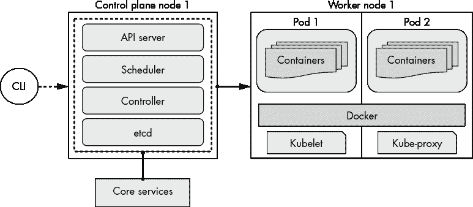
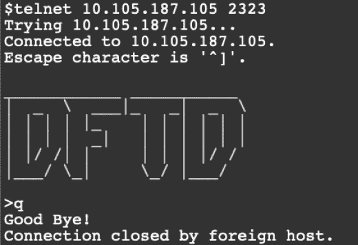

# 7

使用 Kubernetes 进行编排


容器使得应用程序变得便捷和一致，但它只是现代应用程序堆栈中的一部分。试想需要管理成千上万的容器，分布在不同的主机、网络端口和共享卷上。如果某个容器停止了怎么办？如何应对负载的扩展？如何强制容器在不同主机上运行以提高可用性？容器*编排*解决了所有这些问题以及更多问题。*Kubernetes*，或称*K8s*，是许多公司用来管理容器的开源编排系统。Kubernetes 自带一些有用的模式（如网络、基于角色的访问控制和版本化的 API），但它的目的是作为一个基础框架，在此基础上构建你独特的基础设施和工具。Kubernetes 是容器编排的标准。你可以将它视为你的基础设施中的一个低级组件，就像 Linux 一样。

在本章中，你将学习一些基本的 Kubernetes 资源和与容器编排相关的概念。为了实践编排，你将使用`kubectl`命令行客户端，在你的 Kubernetes 集群中部署第六章中的 telnet-server 容器镜像。

## 从 30,000 英尺的高度看 Kubernetes

Kubernetes（在希腊语中意为*舵手*）是由 Google 的 Borg 和 Omega 系统演变而来。它于 2014 年开源，并自那时起获得了广泛的社区支持和多次增强。

一个 Kubernetes 集群由一个或多个控制平面节点和一个或多个工作节点组成。*节点*可以是任何类型的计算资源，从云虚拟机到裸金属服务器，再到树莓派。*控制平面节点*处理像 Kubernetes API 调用、集群状态以及容器调度等任务。核心服务（如 API、etcd 和调度器）运行在控制平面上。*工作节点*运行由控制平面调度的容器和资源。更多细节见图 7-1。



图 7-1：Kubernetes 集群的基本构建模块

网络和调度是你在编排容器时遇到的最复杂的问题。在容器网络配置时，你必须考虑所有需要的端口和访问权限。容器可以在集群内外相互通信。这发生在微服务的内部通信中，或者在运行面向公众的 Web 服务器时。当调度容器时，你必须考虑当前系统资源和任何特殊的部署策略。你可以针对特定的用例调整工作节点，例如高连接数，然后创建规则以确保需要该功能的应用程序最终会部署到该特定工作节点。这被称为*节点亲和性*。作为一个容器编排器，你还需要限制用户认证和授权。你可以使用像基于角色的访问控制这样的方式，它允许容器在安全和受控的方式下运行。这些方法仅代表了你需要的复杂“胶水”和“布线”的一小部分。成功部署和管理容器需要一个完整的框架。

## Kubernetes 工作负载资源

*资源*是封装状态和意图的一种对象类型。为了让这个概念更清晰一点，我们可以用汽车做一个类比。如果运行在 Kubernetes 上的工作负载是一辆车，那么资源就描述了车的各个部分。例如，你可以设置你的车有两个座位和四个车门。你不需要了解如何制造座位或车门，你只需要知道 Kubernetes 会维持这两个部件的数量（不多也不少）。Kubernetes 资源在一个叫做*manifest*的文件中定义。在本章中，我们将交替使用*资源*和*对象*这两个术语。

让我们来看看现代应用栈中最常用的 Kubernetes 资源。

### Pods

*Pods*是 Kubernetes 中最小的构建模块，它们构成了你与容器进行各种操作的基础。一个 Pod 由一个或多个共享网络和存储资源的容器组成。每个容器都可以连接到其他容器，所有容器可以通过挂载的卷共享一个目录。你不会直接部署 Pods；相反，它们会被集成到像 ReplicaSet 这样的更高层抽象中。

### ReplicaSet

*ReplicaSet*资源用于维护固定数量的相同 Pods。如果一个 Pod 被终止或删除，ReplicaSet 会创建另一个 Pod 来替代它。如果你需要创建自定义的编排行为，才会使用 ReplicaSet。通常，你应该选择 Deployment 来管理你的应用。

### Deployments

*Deployment* 是一种资源，用于管理 Pods 和 ReplicaSets。它是管理应用程序时最常用的资源。Deployment 的主要任务是维持其清单中配置的状态。例如，你可以定义 Pods 的数量（在这种情况下称为 *replicas*）以及部署新 Pods 的策略。Deployment 资源控制 Pod 的生命周期——从创建、更新、扩展到删除。如果需要，你还可以回滚到早期版本的 Deployment。当你的应用程序需要长期运行且具备容错能力时，Deployment 应该是你的首选。

### StatefulSets

*StatefulSet* 是用于管理有状态应用程序（如 PostgreSQL、ElasticSearch 和 etcd）的一种资源。类似于 Deployment，它可以管理清单中定义的 Pods 的状态。但它还增加了管理唯一 Pod 名称、Pod 创建和终止顺序等功能。StatefulSet 中的每个 Pod 都有自己的状态和绑定的数据。如果你要将有状态应用程序添加到集群中，选择 StatefulSet 而不是 Deployment。

### Services

*Services* 允许你将运行在 Pod 或一组 Pods 中的应用程序暴露到 Kubernetes 集群内部或互联网上。你可以选择以下基本 Service 类型：

1.  `ClusterIP` 是创建 Service 时的默认类型。它会分配一个内部可路由的 IP 地址，并将连接代理到一个或多个 Pods。你只能从 Kubernetes 集群内部访问 `ClusterIP`。

1.  `Headless` 不会创建单一的 Service IP 地址，也不会进行负载均衡。

1.  `NodePort` 通过节点的 IP 地址和端口来暴露 Service。

1.  `LoadBalancer` 将 Service 暴露到外部。它可以通过使用云服务提供商的组件，如 AWS 的 Elastic Load Balancing (ELB)，或者使用裸金属解决方案，如 MetalLB，来实现这一点。

1.  `ExternalName` 将一个 Service 映射到 `externalName` 字段中的内容，并创建一个其值的 `CNAME` 记录。

你将最常使用 `ClusterIP` 和 `LoadBalancer`。请注意，只有 `LoadBalancer` 和 `NodePort` 类型的 Service 才能将 Service 暴露到 Kubernetes 集群外部。

### Volumes

*Volume* 本质上是一个目录或文件，Pod 中的所有容器都可以访问，但有一些限制。Volumes 提供了一种容器之间共享和存储数据的方式。如果 Pod 中的一个容器被杀死，Volume 和其数据将存活；如果整个 Pod 被杀死，Volume 及其内容将被移除。因此，如果你需要的存储与 Pod 的生命周期无关，请为你的应用程序使用 *Persistent Volume (PV)*。PV 是集群中的一种资源，就像节点一样。Pods 可以使用 PV 资源，但 PV 不会随着 Pod 的终止而结束。如果你的 Kubernetes 集群运行在 AWS 上，你可以使用 *Amazon Elastic Block Storage (Amazon EBS)* 作为你的 PV，这使得 Pod 故障更容易恢复。

### Secrets

*秘密*是一个方便的资源，用于安全可靠地与 Pods 共享敏感信息（如密码、令牌、SSH 密钥和 API 密钥）。你可以通过环境变量或作为 Pod 内的卷挂载来访问秘密。秘密存储在 Kubernetes 节点的内存文件系统中，直到 Pod 请求它们。当 Pod 不使用时，它们会保存在内存中，而不是磁盘上的文件中。然而，要小心，因为秘密清单要求数据以 Base64 编码的形式存储，这并不是一种加密形式。

使用秘密，敏感信息与应用程序分开存储。这是因为这类信息在持续集成/持续部署过程中比存储在资源中时更容易暴露。你仍然需要通过使用 RBAC 来保护你的秘密清单，限制对 Secrets API 的广泛访问。你还可以将敏感数据加密存储在秘密中，并通过其他过程在 Pod 挂载或需要时解密它。另一个选项是在将其添加到版本控制之前先在本地加密清单。无论选择哪种方法，确保你有一个安全的计划来存储 Secrets 中的敏感信息。

### 配置映射

*配置映射*允许你将非敏感的配置文件挂载到容器内。Pod 中的容器可以通过环境变量、命令行参数，或作为卷挂载中的文件访问配置映射。如果你的应用有配置文件，将其放入配置映射清单提供了两个主要的好处。首先，你可以更新或部署新的清单文件，而不需要重新部署整个应用。其次，如果你的应用程序监控配置文件的变化，那么当配置文件更新时，应用程序将能够重新加载配置，而不必重启。

### 命名空间

*命名空间*资源允许你将一个 Kubernetes 集群划分为多个较小的虚拟集群。当设置了命名空间时，它提供了资源的逻辑分离，尽管这些资源可以位于相同的节点上。如果在创建资源时没有指定命名空间，它将继承巧妙地命名为*default*的命名空间。如果你的团队有很多用户，并且项目分布广泛，你可能会将这些团队或应用分割到不同的命名空间中。这样可以轻松地对这些资源应用安全权限或其他约束。

## 部署示例 telnet-server 应用

为了开始探索 Kubernetes，你将创建一个 Deployment 和两个 telnet-server 应用的服务。我选择了 Deployment 来为你的应用提供容错性。这两个服务将暴露 telnet-server 应用的端口和应用的指标端口。在本节结束时，你将拥有一个 Kubernetes Deployment，其中包含两个运行 telnet-server 应用的 Pod（副本），并且可以从本地主机访问。

### 与 Kubernetes 的交互

在你部署你的 telnet-server 应用程序之前，你需要确保可以连接到你的 Kubernetes 集群。与集群交互的最直接方式是使用`kubectl`命令行工具，你可以通过两种方式获得它。第一种方式是从[`kubernetes.io/docs/tasks/tools/install-kubectl/`](https://kubernetes.io/docs/tasks/tools/install-kubectl/)下载适合你操作系统的独立二进制文件。第二种方式，就是你将在这里使用的方式，即利用 minikube 内置的`kubectl`支持。每当你第一次调用`minikube kubectl`命令时（如果还没有安装），minikube 会为你下载`kubectl`二进制文件。

使用`minikube kubectl`时，大多数命令需要在`minikube kubectl`和子命令之间加上双短横线（`--`）。然而，独立版本的`kubectl`则不需要命令之间的短横线。如果你已经安装了`kubectl`，或者希望使用独立版本，只需去掉接下来所有示例中的`minikube`前缀和双短横线。

让我们从一个简单的命令开始，这样 minikube 就可以下载`kubectl`二进制文件并测试集群的访问。使用`cluster-info`子命令来验证集群是否已启动并正常运行：

```
$ **minikube kubectl cluster-info**
Kubernetes master is running at https://192.168.99.109:8443
`--snip--`
```

你应该能看到类似的输出，表明你能够连接到 Kubernetes 集群。如果与集群的通信有问题，你可能会看到类似 `"The control plane node must be running for this command"` 的错误。如果发生这种情况，输入`minikube status`命令，确保 minikube 仍然正常运行。

### 查看清单

现在你已经可以访问集群，查看提供的部署（Deployment）和服务（Services）清单。Kubernetes 清单是用于描述应用程序和服务期望状态的文件。它们管理诸如部署（Deployments）、Pod 和 Secrets 等资源。这些文件可以是 JSON 格式或 YAML 格式；我们在本书中使用 YAML 格式，纯粹是出于个人喜好。清单文件应当放在源代码管理下。你通常会发现这些文件与它们描述的应用程序共同存放。

我已提供清单文件来创建 telnet-server 部署和两个服务。这些文件位于仓库 [`github.com/bradleyd/devops_for_the_desperate/`](https://github.com/bradleyd/devops_for_the_desperate/) 中。导航到 *telnet-server/* 目录，并列出 *kubernetes/* 子目录中的文件。你应该能找到两个文件。第一个文件，*deployment.yaml*，创建了一个包含两个 telnet-server 容器镜像 Pod 的 Kubernetes 部署。第二个文件，*service.yaml*，创建了两个独立的服务。第一个服务创建了一个 `LoadBalancer`，这样你就可以从 Kubernetes 集群外部连接到 telnet-server。另一个服务创建了一个 `ClusterIP`，它暴露了集群内部的度量端点。不要担心本章中的度量端口——我们将在第九章讨论监控和度量时使用它。

这些清单文件可能相当冗长，所以我们将重点关注每个文件包含的基本结构。为了描述一个复杂对象，你需要多个字段、子字段和数值来定义资源的行为。由于这个原因，从头开始编写清单可能会很困难。在所有这些字段和数值中，有一部分必需字段称为 *顶级字段*。这些字段在所有清单文件中都是通用的。理解顶级字段使得记住和解析清单文件变得更容易。四个顶级字段如下：

1.  `apiVersion` 这是一个 Kubernetes API 版本和组，例如 apps/v1。Kubernetes 使用版本化的 API 和组来提供不同版本的功能和资源支持。

1.  `kind` 这是你想要创建的资源类型，例如 Deployment。

1.  `metadata` 这是你设置诸如名称、注解和标签之类内容的地方。

1.  `spec` 这是你设置资源（类型）所需行为的地方。

这些顶级字段中的每一个都包含多个子字段。子字段包含诸如名称、副本数量、模板和容器镜像等信息。例如，`metadata` 包含 `name` 和 `labels` 子字段。每个 Kubernetes 资源的字段格式可能有所不同。我不会描述每个字段，但我会经常使用 `labels` 子字段。*标签*为用户提供了一种方式，可以通过可识别的键值对标记资源。例如，你可以为所有处于 `生产环境` 中的资源添加标签。

```
`--snip--`
metadata: 
  labels:
    environment: production
`--snip--`
```

你可以使用这些 `labels` 来缩小搜索结果并将类似的应用程序分组在一起，比如前端网站和其后端数据库对应的应用。稍后，当你调用 `minikube kubectl` 命令时，你会使用 `labels`。

列出清单文件中所有不同的字段结构会占用大量空间。相反，你可以在两个不同的地方探索文档。Kubernetes 文档在[`kubernetes.io/docs/concepts/overview/working-with-objects/`](https://kubernetes.io/docs/concepts/overview/working-with-objects/)中描述了所有资源并提供了示例。第二个探索的地方，是我最喜欢的，`kubectl`的`explain`子命令。`explain`子命令描述了与每个资源类型相关的字段。你可以在查找嵌套字段时使用点（`.`）符号作为字段分隔符。例如，要了解更多关于部署的`metadata` `labels`子字段的信息，可以在终端输入以下内容：

```
$ **minikube kubectl -- explain deployment.metadata.labels**
KIND:     Deployment
VERSION:  apps/v1

FIELD:    labels <map[string]string>

DESCRIPTION:
     Map of string keys and values that can be used to organize and categorize
     (scope and select) objects. May match selectors of replication
     controllers and services. More info:
     http://kubernetes.io/docs/user-guide/labels
```

请注意，示例首先搜索资源类型，然后是其顶级字段，再然后是子字段。

#### 检查 telnet-server 部署

现在你已经了解了清单文件的构建块，让我们将所学应用到 telnet-server 部署的清单中。我将*deployment.yaml*文件拆分为几个部分，以便更容易解析。文件顶部的第一部分包含了`apiVersion`、`kind`和`metadata`字段：

```
apiVersion: apps/v1
kind: Deployment
metadata:	
  name: telnet-server
  labels:
    app: telnet-server
`--snip--`
```

类型（`kind`）是`Deployment`，使用 Kubernetes API 组`apps`和 API 版本`v1`。在`metadata`字段下，部署的`name`设置为`telnet-server`，`labels`设置为`app: telnet-server`。你将在稍后查找 telnet-server 部署时使用这个标签。

文件的下一部分包含父级`spec`字段，它描述了部署的行为和规范。`spec`字段包含许多子字段和数值：

```
`--snip--`
spec:
  replicas: 2
  selector:
    matchLabels:
      app: telnet-server
  strategy:
    type: RollingUpdate
    rollingUpdate:
      maxSurge: 1
      maxUnavailable: 0
`--snip--`
```

首先，`spec`描述了部署的`replicas`数量；它被设置为`2`，以反映你希望运行的 Pods 数量。在`selector`字段内，`matchLabels`定位此部署将影响的 Pods。在`matchLabels`中使用的键值必须与 Pod 的模板标签匹配（稍后会详细讲解）。

`strategy`字段描述了在滚动更新过程中如何用新 Pods 替换当前正在运行的 Pods。这个示例使用了`RollingUpdate`，它会一次替换一个 Pod。这是部署的默认策略。另一种策略选项，`Recreate`，会在创建新 Pods 之前先终止当前正在运行的 Pods。

`maxSurge` 和 `maxUnavailable` 键控制创建和终止 Pods 的数量。在这里，它被设置为在滚动更新期间启动一个额外的 Pod，这会暂时使 Pod 数量达到 `replicas` + 1（在此例中为三）。一旦新的 Pod 启动并运行后，一个旧的 Pod 会被终止。然后，这个过程会重复，直到所有新的 Pods 都在运行，旧的 Pods 被终止。这些设置将确保在 Deployment 期间始终有一个 Pod 来处理流量。有关策略的更多信息，请参见 [`kubernetes.io/docs/concepts/workloads/controllers/deployment/#strategy/`](https://kubernetes.io/docs/concepts/workloads/controllers/deployment/#strategy/)。

`spec` 部分的下一部分是 `template` 字段。这个字段（以及它的子字段）描述了这个 Deployment 将要创建的 Pods。此部分中的主要子字段是 `metadata` 和 `spec`：

```
`--snip--`
template:
    metadata:
      labels:
        app: telnet-server
    spec:
      containers:
      - image: **dftd/telnet-server:v1**
        imagePullPolicy: IfNotPresent
        name: telnet-server
        resources:
          requests:
            cpu: 1m
            memory: 1Mi
          limits:
 cpu: 500m
            memory: 100Mi
        ports:
        - containerPort: **2323**
          name: telnet
        - containerPort: **9000**
          name: metrics
```

在这里，`app: telnet-server` 键值对被添加到 Deployment 中每个 Pod 上，使用的是 `template` 下的 `labels` 子字段以及 `metadata`。`app: telnet-server` 标签与你在 `spec` 的 `selector:` 字段中之前使用的键值匹配。（你稍后在查找 Pods 时会再次使用这个标签。）

`containers` 字段设置了 Pod 中第一个容器的容器镜像。在这个例子中，它被设置为你在第六章中构建的 *dftd/telnet-server:v1* 镜像。这个容器的 `name` 是 `telnet-server`，就像在 Deployment 中一样。使用相同的 `name` 并不是必需的；`name` 可以是任何你选择的字符串，只要它在 Pod 中的容器之间是唯一的。

`containers` 下的下一个子字段是 `resources`，它控制容器的 CPU 和内存。你可以为每个容器单独定义 `requests` 和 `limits`。`requests` 用于 Kubernetes 调度（编排）和整体应用健康。如果一个容器启动时至少需要 2GB 内存和一个 CPU，你肯定不希望 Kubernetes 将该 Pod（容器）调度到内存只有 1GB 或没有可用 CPU 的节点上。`requests` 是应用程序所需的最小资源。另一方面，`limits` 控制容器在节点上可使用的最大 CPU 和内存。你不希望一个容器占满节点的所有内存或 CPU，而让其他容器无法获得资源。在这个例子中，`CPU` 限制被设置为 `500m`（millicpu），即半个 CPU。这个单位也可以用小数表示，如 0.5。在 Kubernetes 中，一个 CPU 等于一个 CPU 核心。`memory` 限制被设置为 `100Mi`，即 104,857,600 字节。在 Kubernetes 中，`memory` 是以字节为单位表示的，但你也可以使用更常见的单位，如 M、Mi、G 和 Gi。当这些 `limits` 被设置后，如果 telnet-server 容器使用超过 `100Mi` 的 `memory`，Kubernetes 会终止它。然而，如果超出了 `CPU` 限制（`500m`），Kubernetes 并不会直接终止容器。它会限制该容器的 CPU 请求时间。有关 Kubernetes 如何量化资源的更多信息，请参见 [`kubernetes.io/docs/concepts/configuration/manage-resources-containers/`](https://kubernetes.io/docs/concepts/configuration/manage-resources-containers/)。

容器的 `ports` 字段设置了你希望暴露的端口。在这个例子中，暴露了端口 `2323`（`telnet`）和 `9000`（`metrics`）。这些端口定义仅供参考，不影响容器是否能接收流量。它们只是让用户和 Kubernetes 知道容器预计会监听哪些端口。

#### 检查 telnet-server 服务

下一个需要检查的清单是 `Service` 资源。*service.yaml* 文件创建了两个独立的 Services：一个暴露 telnet-server，另一个暴露应用程序的度量指标。我们这里只查看 `telnet` Service 和一些具体字段，因为 `metric` Service 与其几乎相同：

```
apiVersion: v1
kind: Service
metadata:
  labels:
    app: telnet-server
  name: telnet-server
spec:
  ports:
  - port: 2323
    name: telnet
    protocol: TCP
    targetPort: 2323
  selector:
    app: telnet-server
  type: LoadBalancer
`--snip--`
```

在 `kind` 字段中设置了一个 `Service` 资源，这与前面展示的 Deployment 清单不同。Service 的 `name` 可以是任何名称，但必须在 Kubernetes 命名空间内唯一。为了方便使用，我保持了 `names` 与其他资源一致。我还使用了相同的 `app: telnet-server` 标签，以使查找更加统一和简单。

`ports` 字段告诉 `Service` 应该暴露哪个端口，并如何将其连接到 Pods。它暴露端口 `2323`（`telnet`），并将所有流量转发到 Pod 上的端口 `2323`。

就像部署的`selector`字段一样，`Service`也使用`selector`字段来查找要转发流量的 Pod。此示例使用熟悉的 Pod 标签`app: telnet-server`作为`selector`的匹配条件，这意味着所有带有`app: telnet-server`标签的 Pod 将接收来自该`Service`的流量。如果有多个 Pod，就像在部署中一样，流量将以轮询方式发送到所有 Pod。由于`telnet-server`应用程序的目标是将其暴露在集群外部，因此它被设置为`LoadBalancer`。

### 创建部署和服务

现在是创建部署和服务的时候了。要将示例应用程序转化为 Kubernetes 部署，你需要使用`minikube` `kubectl`命令行工具以及你刚刚查看过的清单文件([`github.com/bradleyd/devops_for_the_desperate/`](https://github.com/bradleyd/devops_for_the_desperate/))。

要创建和更新资源，你可以将`minikube` `kubectl`命令传递两个子命令：`create`和`apply`。`create`子命令是*命令式*的，这意味着它会根据清单文件重新创建资源。如果资源已存在，它还会抛出错误。`apply`子命令是*声明式*的，这意味着如果资源不存在，它将创建资源，如果资源已存在，则更新它。对于这个场景，你将使用`apply`命令并带上`-f`标志，指示`kubectl`对*kubernetes/*目录中的所有文件执行操作。`-f`标志也可以接受文件名代替目录。

在*telnet-server/*目录内，输入以下命令来创建`Deployment`和两个`Services`：

```
$ **minikube** **kubectl -- apply -f kubernetes/**
deployment.apps/telnet-server created
service/telnet-server-metrics created
service/telnet-server created
```

输出应显示所有三个资源已被`创建`。如果在此命令中出现错误，请务必调查错误的原因。你可能看到的常见错误通常是由于 YAML 文件中的语法错误或拼写错误导致的。

### 查看部署和服务

一旦创建了`telnet-server`部署和服务，你需要了解如何找到它们。Kubernetes 提供了多种查看对象状态的方法。最简单的方法是使用`minikube kubectl -- get <``resource``> <``name``>`命令。

你可以通过获取部署状态来开始，首先按名称获取部署状态，然后再查看服务。输入以下命令获取`telnet-server`的`Deployment`状态：

```
$ **minikube kubectl -- get deployments.apps telnet-server** 
NAME            READY   UP-TO-DATE   AVAILABLE   AGE
telnet-server   2/2     2            2           7s
```

输出应显示`telnet-server`部署有两个副本（Pod）在运行（`2/2 READY`），并且它们已经运行了七秒钟（`7s AGE`）。这应该与部署清单中设置的副本数相匹配。`UP-TO-DATE`和`AVAILABLE`列分别显示了为达到期望副本数（`2`）而更新的 Pod 数量，以及可供用户访问的 Pod 数量（`2`）。在这种情况下，Kubernetes 认为该部署已经启动并且完全可用。

你还可以运行`minikube kubectl get pods`命令来查找部署是否准备好接收流量。因为你可能有数百个 Pod，所以你希望通过`-l`标签过滤器标志来缩小结果范围。输入以下命令仅显示`telnet-server` Pods：

```
$ **minikube kubectl -- get pods -l app=telnet-server**
NAME                            READY   STATUS    RESTARTS   AGE
telnet-server-775769766-2bmd5   1/1     Running   0          4m34s
telnet-server-775769766-k9kx9   1/1     Running   0          4m34s
```

此命令列出所有带有`app: telnet-server`标签的 Pod；这是在*deployment.yaml*文件中的`spec.template.metadata.labels`字段下设置的相同标签。输出显示两个`telnet-server` Pod 已准备好接受流量。你可以从`READY`列看到`1/1`容器正在运行，而你的部署只有一个容器（`telnet-server`）。如果你有一个包含多个容器的 Pod，你希望运行容器的数量与总容器数相同。

现在，使用与上面相同的命令，但将`pods`资源替换为`services`来显示两个服务：

```
$ **minikube kubectl -- get services -l app=telnet-server**
NAME                    TYPE           CLUSTER-IP       EXTERNAL-IP   PORT(S)          AGE
telnet-server           LoadBalancer   10.105.187.105   <pending>     2323:30557/TCP   10m
telnet-server-metrics   ClusterIP      10.96.53.191     <none>        9000/TCP         10m 
```

由于你使用相同的标签（`app: telnet-server`）来组织应用，你可以使用`-l`标志来查找匹配项。输出显示大约 10 分钟前创建了两个服务。其中一个服务类型是`LoadBalancer`，另一个是`ClusterIP`。`LoadBalancer`用于暴露`telnet-server`应用。如果你的`EXTERNAL-IP`状态显示`<pending>`，不要担心。因为你是在 minikube 上运行，没有包含实际的`LoadBalancer`组件。

`ClusterIP`服务允许从集群内部抓取应用程序指标。在此示例中，内部应用程序可以通过使用`telnet-server-metrics`规范名称或 IP `10.96.53.191`来访问指标端点。推荐使用规范名称。

## 测试部署和服务

现在，telnet-server 的部署和服务已经在运行，你将要测试其连通性和可用性。你希望像第六章中一样，使用 telnet 客户端能够访问 telnet-server 应用。之后，你将通过杀死一个 telnet-server Pod 并观察其恢复，来测试部署的弹性。最后，你将学习如何*扩展*，即通过命令行根据负载变化增减部署的副本数。

### 访问 Telnet 服务器

你将使用`minikube tunnel`命令将你的`LoadBalancer`服务暴露到 Kubernetes 集群外部。此命令将为你提供一个 IP 地址，你可以再次使用`telnet` `client`命令进行连接。`tunnel`子命令在前台运行，因此它应该在不会关闭的终端中运行。此命令还需要*root*权限。如果你的本地机器没有*root*权限，请改用`minikube service`命令。更多详情请访问[`minikube.sigs.k8s.io/docs/commands/service/`](https://minikube.sigs.k8s.io/docs/commands/service/)。

在终端中，输入以下命令来创建到`telnet-server`服务的网络` tunnel`：

```
$ **minikube tunnel**
Password:
Status:
	machine: minikube
	pid: 42612
	route: 10.96.0.0/12 -> 192.168.99.103
	minikube: Running
	services: [telnet-server]
    errors:
		minikube: no errors
		router: no errors
		loadbalancer emulator: no errors
```

输入密码后，命令会输出一个`route`，暴露的`services`和任何出现的`errors`。确保在尝试连接到`telnet-server`时保持此命令运行。一旦`隧道`关闭，所有连接都会断开。由于没有需要报告的`errors`，此时`隧道`应该是可操作的。现在不要执行，但当你想关闭`隧道`时，按 CTRL-C 将其关闭。

现在，隧道已经建立，你需要获取`LoadBalancer`服务的新外部 IP 地址。作为快捷方式，传递服务名称到`get services` `telnet-server`（在本例中）来查看你感兴趣的服务：

```
$ **minikube kubectl -- get services telnet-server**
NAME            TYPE           CLUSTER-IP       EXTERNAL-IP      PORT(S)          AGE
telnet-server   LoadBalancer   10.105.187.105   10.105.187.105   2323:30557/TCP   15m 
```

`EXTERNAL-IP`列现在应该填充了一个 IP 地址，而不是`<pending>`。这里，`telnet-server`应用程序的 IP 地址被设置为`10.105.187.105`，外部`PORT`被设置为`2323`。你的`EXTERNAL-IP`可能与我的不同，因此请使用此列中的 IP。

在另一个没有运行隧道的终端中，再次使用`telnet client`命令（`telnet` `10.105.187.105`）并输入新的 IP 地址以访问`telnet-server`，如图 7-2 所示。

如你所见，telnet-server 响应了 ASCII 艺术 logo。按 Q 退出，因为你只是测试连接性。`隧道`命令使得使用分配的 IP 地址访问服务成为可能，就像它是一个面向公众的应用程序一样。如果这是在像 AWS 这样的云提供商上，IP 将对互联网上的任何人可访问。可以随时关闭另一个终端中的`隧道`命令，但你将在未来章节中再次使用它。



图 7-2：测试 telnet 访问 telnet-server

### 故障排除提示

如果无法像在图 7-2 中那样连接到 telnet-server，请检查 Pods 是否仍在运行，并且它们是否报告`1/1`容器是`READY`。如果`READY`列显示`0/1`，并且`STATUS`列有类似`ImagePullBackOff`或`ErrImagePull`的错误，那么 Pod 可能无法找到你在第六章中构建的 telnet-server 镜像。确保镜像已构建并且在列出 Docker 镜像时可用。

如果`READY`和`STATUS`列是正确的，下一步是确保你的服务已连接到你的 Pods。检查此连接的一种方式是使用`kubectl get endpoints`命令，它会告诉你服务是否能够找到你在服务`spec.selector`字段中指定的 Pods，该字段位于*service.yaml*文件中：

```
$ **minikube kubectl -- get endpoints -l app=telnet-server**
NAME                    ENDPOINTS                         AGE
telnet-server           172.17.0.3:2323,172.17.0.5:2323   20m
telnet-server-metrics   172.17.0.3:9000,172.17.0.5:9000   20m 
```

`ENDPOINTS` 列显示了内部 Pod 的 IP 地址和端口。由于你有两个 Pod，每个服务都会显示两个用逗号分隔的 IP 地址。如果服务无法找到 Pod，`ENDPOINTS` 列将显示 `<none>`。如果你的 `ENDPOINTS` 列显示 `<none>`，请检查服务中的 `spec.selector` 字段是否与 *deployment.yaml* 文件中的 `spec.template.metadata.labels` 字段匹配。我在示例中已将其预设为标签 `app: telnet-server`。服务和资源之间标签不匹配是常见错误；你至少会遇到一次。

### 删除 Pod

部署的另一个伟大功能是恢复。故障是不可避免的，所以要接受它！部署会让你迅速恢复并恢复到完全正常的状态。记住，部署的主要目的是保持所需数量的 Pod 处于运行状态。为了验证这一点，你将删除其中一个 `telnet-server` Pod，然后观察部署如何重新创建另一个 Pod 来替代它。首先，你需要获取一个 `telnet-server` Pod 的名称并删除它。

输入以下命令再次获取 `telnet-server` Pods：

```
$ **minikube kubectl -- get pods -l app=telnet-server**
NAME                            READY   STATUS    RESTARTS   AGE
telnet-server-775769766-2bmd5   1/1     Running   0          25m
telnet-server-775769766-k9kx9   1/1     Running   0          25m
```

删除哪个 Pod 并不重要，所以你只需选择列表中的第一个，假设是我集群中的 `telnet-server-775769766-2bmd5`。（你的 Pod 名称会不同，因为它们是自动生成的。）

现在，输入以下命令来 `delete` 选定的 Pod：

```
$ **minikube kubectl -- delete pod** `<telnet-server-775769766-2bmd5>`
pod "telnet-server-775769766-2bmd5" deleted
```

命令可能会挂起几秒钟，但当 Pod 被终止后，它最终会完成。

如果你再次列出 Pods，你会看到仍然有两个 Pod 正在运行，但现在 `telnet-server-775769766-2bmd5` 被删除，并且已经被一个新的 Pod 替代：

```
$ **minikube kubectl -- get pods -l app=telnet-server**
NAME                            READY   STATUS    RESTARTS   AGE
telnet-server-775769766-k9kx9   1/1     Running   0          25m
telnet-server-775769766-rdg5w   1/1     Running   0          1m16s
```

这个新 Pod 名为 `telnet-server-775769766-rdg5w`，已经运行了超过一分钟，当前状态为 `Running`，并已准备好接受连接。

### 扩展

假设 telnet-server 应用程序非常受 35 岁以上怀旧人群的喜爱，并取得了巨大的成功。两个 telnet-server 实例已经不足以应对增加的流量，因此你需要将副本数扩展到大于两个。你可以通过两种方式做到这一点。第一种方式是编辑 *deployment.yaml* 清单文件，并使用 `minikube apply` 命令将更改应用到集群中。第二种方式是使用 `minikube kubectl scale` 命令。我将通过 `minikube kubectl scale` 命令演示这个例子，因为你已经在本章早些时候学会了如何应用清单文件。

你将通过增加部署的副本数来扩展部署，将 Pod 的总数增加到三个。（在真实的生产环境中，你会根据一些关键指标来确定副本数，而不是随便猜测。）输入以下命令来扩展 `telnet-server` 部署：

```
$ **minikube kubectl -- scale deployment telnet-server --replicas=3**
deployment.apps/telnet-server scaled
```

`scale deployment` 命令带有一个 `--replicas` 标志，用于设置 Pod 副本的数量。输出显示 `telnet-server` 部署已经 `scaled`，但让我们来验证一下。

输入以下命令验证你的 Deployment 副本数量是否已更改：

```
$ **minikube kubectl -- get deployments.apps telnet-server**
NAME            READY   UP-TO-DATE   AVAILABLE   AGE
telnet-server   3/3     3            3           17m
```

在这里，你可以看到 `telnet-server` 的 Deployment 资源信息。Deployment 中有三个副本（3/3）处于 `READY` 状态，比之前的两个副本要多。

`scale` 命令会实时更改集群中的副本数量。这可能会带来风险。如果同事在你通过命令行调整了副本数后，立即推出新版本的 `telnet-server` 应用程序，副本状态将不匹配。原因是，当他或她运行 `minikube kubectl -- apply -f kubernetes/deployment.yaml` 命令时，Deployment 的副本数量会恢复为两个，因为这是 *deployment.yaml* 清单文件中指定的值。

### 日志

测试的最后一部分是访问 telnet-server 应用程序日志。幸运的是，Kubernetes 通过 `kubectl` `logs` 子命令使这一过程变得简单。你需要抓取所有三个 telnet-server Pods 的日志。一个方法是为每个 Pod 执行 `logs` 命令并查看结果。输入以下命令查看其中一个 Pod 的日志（记住，你的 Pod 名称与我的不同）：

```
$ **minikube kubectl -- logs** `<telnet-server-775769766-rdg5w>`
`--snip--`
```

如果你没有很多 Pods，或者你知道某个事件发生在哪个 Pod 上，这种方法没问题。如果没有，更好的选择是同时抓取所有 Pods 的日志，并标记每一行日志的来源 Pod 名称。输入以下命令抓取每个 Pod 的所有日志：

```
$ **minikube kubectl -- logs -l app=telnet-server --all-containers=true --prefix=true**
[pod/telnet-server-775769766-k9kx9/telnet-server] telnet-server: 2022/02/03 21:07:30 telnet-server listening on [::]:2323
[pod/telnet-server-775769766-k9kx9/telnet-server] telnet-server: 2022/02/03 21:07:30 Metrics endpoint listening on :9000
`--snip--`
```

这个命令使用了相当多的标志；我们来逐一解析每个标志：

+   只抓取具有此标签的 Pods：`-l app=telnet-server`

+   如果你有多个 Pods 并且想查看所有日志：`--all-containers=true`

+   每行日志都会标明其来源的 Pod 名称：`--prefix=true`

输出应该显示至少六行日志——每个 Pod 启动的两行日志（共 3 个 Pod）以及可能由于之前使用 `telnet` 命令连接时产生的其他日志。此时，日志内容不重要，关键是确保你可以访问应用程序的日志。

## 摘要

在本章中，你学习了如何在 Kubernetes 集群中运行 telnet-server 容器镜像。你通过使用 Kubernetes Deployment 资源成功地协调了你的应用程序，并通过 Kubernetes 服务将其暴露到本地主机。最后，你探索了如何使用 `minikube kubectl` 命令创建、查询和查看资源及日志。在下一章中，你将学习如何通过在 Kubernetes 内部实现一个简单的交付管道来自动化 telnet-server 的部署。
