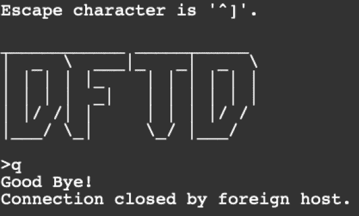

# 8

部署代码


你已经有条不紊地构建了你的基础设施，达到了这个阶段，并且你已经完成了运行应用所需的所有基础组件。你已经在 Kubernetes 集群中构建并部署了 telnet-server 应用的容器镜像。如果你想发布应用的新版本，你只需要重建容器镜像，然后重新部署 Kubernetes 清单。

然而，你的设置中存在一些明显的缺陷。首先，你没有运行任何测试来验证代码或容器镜像是否无缺陷。另外，根据你目前的设置，每次代码或配置发生变化时，你都需要手动构建容器镜像并发布部署。这种手动过程对于测试新技术是可以的，但希望你已经学到了（并且同意）这些步骤可以并且应该自动化。成功的软件工程团队通常会使用自动化发布小的代码变更，这样可以快速发现错误，并减少基础设施的复杂性。正如前面章节提到的那样，这个过程通常被称为*持续集成和持续部署（CI/CD）*，它使得代码从编辑器到利益相关者的传递更加一致和自动化。

在本章中，你将使用免费可用的工具为 telnet-server 应用构建一个简单的 CI/CD 管道。这个管道将监视 telnet-server 源代码的变更，如果有变动，它将启动一系列步骤，将这些变更部署到 Kubernetes 集群中。到本章结束时，你将拥有一个本地开发管道，它能够通过自动化构建、测试并部署你的代码到 Kubernetes 集群。

## 现代应用堆栈中的 CI/CD

持续集成和持续部署是描述代码构建、测试和交付的两种软件开发方法。CI 步骤包括代码和配置变更的测试与构建，而 CD 步骤则自动化新代码的部署（或交付）。

在持续集成（CI）阶段，软件工程师通过版本控制系统（如 Git）引入新特性或修复 bug。代码会经过一系列构建和测试，最后生成一个像容器镜像这样的产物。这个过程解决了“在我机器上能运行”这个问题，因为一切都是以相同的方式进行测试和构建，确保生成一致的产品。测试步骤通常包括单元测试、集成测试和安全扫描。单元测试和集成测试确保应用无论是独立运行还是与堆栈中的其他组件交互时，都能按预期行为运行。安全扫描通常会检查你应用软件依赖中的已知漏洞，或你所导入的基础容器镜像中是否存在漏洞。测试步骤完成后，新的产物被构建并推送到共享仓库，持续交付（CD）阶段可以访问它。

在持续交付（CD）阶段，产物从仓库中提取出来，并部署到通常是生产环境的基础设施上。持续交付可以使用不同的策略来发布代码。这些策略通常是*金丝雀发布*、*滚动发布*（在我们的案例中），或者*蓝绿部署*。有关每种策略的更多信息，请参见表 8-1。

部署策略的核心理念是最大限度地减少问题代码，防止其影响到大量用户。你将要部署的基础设施很可能是像我们的 Kubernetes 集群这样的容器编排器，但也可以是云服务提供商的虚拟机（VM）。

表 8-1：部署策略

| 金丝雀发布 | 这个策略将新代码发布给少量用户进行访问。如果金丝雀代码没有错误，则可以将新代码进一步推出，供更多用户使用。 |
| --- | --- |
| 蓝绿部署 | 在这个策略中，生产服务（蓝色）处理流量，而新服务（绿色）进行测试。如果绿色代码按预期运行，绿色服务将替换蓝色服务，所有客户请求将通过绿色服务转发。 |
| 滚动部署 | 这种策略将新代码逐个部署，与当前生产中的代码并行，直到完全发布。 |

部署成功后，监控步骤应当观察新代码，确保没有任何问题遗漏在持续集成（CI）阶段。如果检测到问题，如高延迟或错误计数增加，可以轻松地将应用回滚到一个被认为是安全的先前版本。这是像 Kubernetes 这样的容器编排器的一个伟大特性，它使得代码的前进和回滚变得非常简单。（我们稍后会测试回滚功能。）

## 设置你的流水线

在创建管道之前，您需要安装一些工具来帮助自动化代码构建、测试和交付。市场上有许多工具可以完成这些任务，但在我们的范围内，我使用了两款开源软件，它们与 Kubernetes 集成得很好。第一个工具叫做 Skaffold，它帮助 Kubernetes 本地应用程序进行持续开发。它将使设置 CI/CD 管道到本地 k8s 集群变得简单。如果尚未安装 Skaffold，请按照[`skaffold.dev/docs/install/`](https://skaffold.dev/docs/install/)上的操作指南，根据您的操作系统完成安装。

另一个工具是`container-structure-test`，这是一个命令行应用程序，用于验证容器镜像在构建后的结构。它可以通过验证特定文件是否存在来测试镜像是否构建正确，或者执行命令并验证其输出。您还可以使用它验证容器镜像是否构建了正确的元数据，例如在 Dockerfile 中设置的端口或环境变量。`container-structure-test`的安装说明可以在[`github.com/GoogleContainerTools/container-structure-test/`](https://github.com/GoogleContainerTools/container-structure-test/)找到。

### 审查 skaffold.yaml 文件

*skaffold.yaml*文件描述了如何构建、测试和部署您的应用程序。该文件应位于项目的根目录中，并保持在版本控制下。YAML 文件有许多不同的选项可供选择，但您的管道将专注于三个主要部分：`build`、`test`和`deploy`。`build`部分描述了如何构建容器镜像，`test`部分描述了执行哪些测试，`deploy`部分描述了如何将应用程序发布到 Kubernetes 集群。

*skaffold.yaml*文件位于克隆仓库中的*telnet-server/*目录下（[`github.com/bradleyd/devops_for_the_desperate/`](https://github.com/bradleyd/devops_for_the_desperate/)）。您不需要编辑或打开此文件，但应该对其基本内容和结构有一定的了解。

```
`--snip--`
kind: Config
build:
  local: {}
  artifacts:
  - image: dftd/telnet-server
test:
- image: dftd/telnet-server
  custom:
  - command: go test ./... -v
  structureTests:
  - ./container-tests/command-and-metadata-test.yaml
deploy:
  kubectl:
    manifests:
    - kubernetes/*
```

`build`部分使用默认的构建操作，即`docker build`命令，在本地创建我们的容器镜像。容器`image`名称设置为`dftd/telnet-server`。这与您在*deployment.yaml*文件中使用的镜像名称相匹配。您将会在查看`deploy`部分时明白这点为什么很重要。Skaffold 工具会使用当前的 Git 提交哈希来预先计算容器镜像标签，这是默认行为。生成的标签会自动附加到容器镜像名称，并且它会方便地设置为环境变量（`$IMAGE`），如果需要可以引用。

`test`部分允许你对应用程序和容器镜像运行任何测试。在这种情况下，你将使用我为你提供的`telnet-server`应用程序的单元测试。这些单元测试位于`custom`字段下，运行`go test`命令来执行所有的测试文件。此步骤要求安装 Go 编程语言。如果你尚未安装 Go，可以按照[`go.dev/doc/install/`](https://go.dev/doc/install/)上的说明进行安装。

下一个要运行的测试是`structureTests`。此测试检查最终的容器镜像是否存在缺陷。稍后我们将简要讲解这些容器测试。

最后，`deploy`部分使用*kubernetes/*目录中的 Kubernetes 清单文件来发布`telnet-server`部署。Skaffold 工具对正在运行的部署执行补丁操作，并用在`build`步骤中 Skaffold 生成的新容器镜像和标签（即*dftd/telnet-server:v1*）替换当前镜像。因为这些名称与标签匹配，所以可以轻松在流水线中更新为新的标签。

### 审查容器测试

一旦`telnet-server`容器镜像构建完成并且应用程序测试通过，容器测试将针对新构建的镜像运行。容器测试位于一个名为*container-tests/*的子目录下，该目录位于*telnet-server/*目录中。此目录包含一个名为*command-and-metadata-test.yaml*的测试文件。在这个文件中，我提供了一个应用程序测试，以确保二进制文件正确构建，并且还提供了一些容器镜像测试，以验证容器是否按照预期的指令构建。

你现在应该回顾结构测试。打开 YAML 文件到编辑器中，或者继续往下看：

```
`--snip--`
commandTests:
  - name: "telnet-server"
    command: "./telnet-server"
    args: ["-i"]
    expectedOutput: ["telnet port :2323\nMetrics Port: :9000"]
metadataTest:
  env:
    - key: TELNET_PORT
      value: 2323
    - key: METRIC_PORT
      value: 9000
  cmd: ["./telnet-server"]
  workdir: "/app
```

`commandTests`命令执行`telnet-server`二进制文件，并向其传递`-i`（信息）标志，以将应用程序监听的端口输出到 STDOUT。然后，命令输出将与`expectedOutput`字段中的内容进行匹配。对于成功的测试，输出应匹配`telnet port :2323\nMetrics Port: :9000`，这样你可以确保在容器`build`阶段正确编译了二进制文件。此测试确保`telnet-server`应用程序至少可以基本运行并发挥作用。

`metadataTest`检查容器镜像是否按照 Dockerfile 中的正确指令构建。元数据测试验证环境变量（`env`）、命令（`cmd`）和工作目录（`workdir`）。这些测试对于捕捉不同提交之间 Dockerfile 变更的差异非常有用。

### 模拟开发流水线

现在你已经理解了管道配置，让我们开始运行管道。你可以通过执行带有 `run` 或 `dev` 子命令的 `skaffold` 命令来启动管道。`run` 子命令是一次性执行，构建、测试和部署应用程序后会退出，不会监视任何新的代码更改。`dev` 命令执行与 `run` 相同的操作，但它会监视源文件的任何更改。一旦检测到更改，它会启动 *skaffold.yaml* 文件中描述的 `build`、`test` 和 `deploy` 步骤。对于本例，你将使用 `dev` 子命令来模拟开发管道。

在成功运行 `dev` 子命令后，它将等待并阻止任何变化的发生。默认情况下，你需要按 CTRL-C 来退出 `skaffold` `dev` 模式。然而，当你使用 CTRL-C 退出时，默认行为是清理自己，删除 Kubernetes 集群中的 telnet-server 部署和服务。由于你将在本章和本书中持续使用 telnet-server 部署，因此可以在 `dev` 命令后添加 `--cleanup=false` 标志来跳过这个行为。这样，Pod 会在你退出命令后继续运行。

要启动管道，确保你处于 *telnet-server/* 目录中，并且 Kubernetes 集群仍在运行。执行 `skaffold` 命令时，它可能会输出很多信息。为了更容易跟踪，你将根据上面提到的三个 `skaffold` 部分（`build`、`test` 和 `deploy`）来分解输出。

在终端中输入以下命令以运行 `skaffold`：

```
$ **skaffold dev --cleanup=false**
Listing files to watch...
 - dftd/telnet-server
Generating tags...
 - dftd/telnet-server -> dftd/telnet-server:4622725
Checking cache...
 - dftd/telnet-server: Not found. Building
Found [minikube] context, using local docker daemon.
Building [dftd/telnet-server]...
`--snip--`
Successfully tagged dftd/telnet-server:4622725
```

该命令执行的第一个操作是将容器标签设置为 `4622725`，然后构建 Docker 镜像。你的标签可能会有所不同，因为它基于我仓库当前的 Git 提交哈希值。

在成功构建后，`skaffold` 会触发测试部分，在这里会进行单元测试和容器基础设施测试：

```
Starting test...
Testing images...
=======================================================
====== Test file: command-and-metadata-test.yaml ======
=======================================================
=== RUN: Command Test: telnet-server
--- PASS
duration: 571.602755ms
stdout: telnet port :2323
Metrics Port: :9000

=== RUN: Metadata Test
--- PASS
duration: 0s

=======================================================
======================= RESULTS =======================
=======================================================
Passes:      2
Failures:    0
Duration:    571.602755ms
Total tests: 2

PASS
Running custom test command: "go test ./... -v"
?   	telnet-server	[no test files]
?   	telnet-server/metrics	[no test files]
=== RUN   TestServerRun
Mocked charge notification function
    TestServerRun: server_test.go:23: PASS:	Run()
--- PASS: TestServerRun (0.00s)
PASS
ok  	telnet-server/telnet	(cached)
Command finished successfully.
```

容器测试和 `telnet-server` 单元测试都通过，没有任何错误。

最后，在容器构建完成并且所有测试通过后，`skaffold` 会尝试将容器部署到 Kubernetes：

```
`--snip--`
Starting deploy...
 - deployment.apps/telnet-server created
 - service/telnet-server created
 - service/telnet-server-metrics created
Waiting for deployments to stabilize...
 - deployment/telnet-server: waiting for rollout to finish: 0 of 2 updated replicas are available...
    - pod/telnet-server-6497d64d7f-j8jq5: creating container telnet-server
    - pod/telnet-server-6497d64d7f-sx5ll: creating container telnet-server
 - deployment/telnet-server: waiting for rollout to finish: 1 of 2 updated replicas are available...
 - deployment/telnet-server is ready.
Deployments stabilized in 2.140948622s
**Press Ctrl+C to exit**
Watching for changes...
```

部署使用了我们的 Kubernetes 清单文件来部署 `telnet-server` 应用程序。对于此部署，`skaffold` 使用了刚刚构建和测试的新的容器镜像和标签（*dftd/telnet-server:4622725*）来替代当前运行的镜像（*dftd/telnet-server:v1*）。如果 `build`、`test` 和 `deploy` 步骤都成功，则不会出现任何可见错误，最后一行应该显示“`Watching for changes`”。如果任何步骤出现错误，管道将立即停止，并抛出一个 `error`，并提供一些故障发生位置的线索。如果发生错误，可以在 `skaffold dev` 命令后添加 `--verbosity debug` 标志来增加输出的详细程度。

如果容器镜像和标签已经存在，`skaffold` 将跳过 `build` 和 `test` 部分，直接进入 `deploy` 步骤。这是一个节省时间的好方法，因为如果你只是重新部署相同的容器镜像，就无需重复所有步骤。如果你的代码库中有未提交的更改，`skaffold` 会在标签末尾加上 `-dirty`（如 `4622725-dirty`）以表示还有未提交的更改。在大多数情况下，当你在本地开发时，这种情况会经常发生，因为你可能会在提交代码之前不断修改和调整。

### 做出代码更改

现在流水线已经设置好，你需要做出一个代码更改来测试工作流。我们可以尝试一个简单的操作，比如更改连接到 telnet-server 时显示的 DFTD 横幅的颜色。telnet-server 的源代码位于 *telnet-server/* 目录下。目前，横幅设置为绿色（我最喜欢的颜色）。一旦你做出代码更改并保存文件，`skaffold` 应该会识别到更改，并重新触发 `build`、`test` 和 `deploy` 步骤。

在一个与运行 `skaffold` 的终端不同的终端中，使用你喜欢的编辑器打开 *banner.go* 文件，该文件位于 *telnet/* 子目录下。不要担心代码或文件的内容，你只是要更改颜色。在第 26 行，你会看到类似下面的代码：

```
return fmt.Sprintf("%s%s%s", **colorGreen**, b, colorReset)
```

这是设置横幅颜色的那一行代码。

将字符串 `colorGreen` 替换为 `colorYellow`，这样这一行现在应该像这样：

```
return fmt.Sprintf("%s%s%s", **colorYellow**, b, colorReset)
```

更改后，保存并关闭文件。返回你运行 `skaffold dev` 命令的终端。你现在应该能看到新的活动，类似于第一次运行 `skaffold` 时的输出。所有步骤会再次被触发，因为你对 `skaffold` 监视的源代码进行了更改。最终结果应该是相同的：你将完成部署滚动，并且会有两个新的 Pod 正在运行。如果不是这样，请确保你已经保存了 *banner.go* 文件，并且 `skaffold dev` 仍在运行。

### 测试代码更改

接下来，你需要确保新代码已成功交付到 Kubernetes 集群。通过验证 DFTD 横幅的颜色是否从绿色变为黄色来确认。

在上一章中，你使用了 `minikube tunnel` 命令来访问 telnet-server 应用。如果你仍然在终端中运行该命令，可以直接跳到下面的 telnet 客户端说明。如果没有，打开另一个终端，再次运行 `minikube tunnel` 命令。

你需要再次获取 telnet-server 服务的 IP 地址才能访问它。运行以下命令获取 telnet-server 服务的 IP：

```
$ **minikube kubectl -- get services telnet-server**
NAME           TYPE           CLUSTER-IP       EXTERNAL-IP        PORT(S)       AGE
telnet-server  LoadBalancer   10.105.161.160   **10.105.161.160** 2323:30488/TCP   6m40s
```

你的 `EXTERNAL-IP` 可能与我的不同，所以请使用该列中的 IP 和端口 `2323`。

再次使用 `telnet` 客户端命令访问应用，命令如下：

```
$ **telnet 10.105.161.160 2323**
```

DFTD 横幅，如 图 8-1 所示，现在应该是黄色的。



图 8-1：Telnet 会话应该显示黄色横幅

如果它不是黄色的，请回去确保代码中颜色已正确更改，并且文件已保存。此外，你可以使用 `minikube kubectl get pods` 命令来验证是否有新的 Pods 正在运行。确保 Pods 的时间戳回到你保存 *banner.go* 文件后的短时间内。你还应该查看运行 `skaffold dev` 的终端输出，以发现任何明显的错误。

### 测试回滚

有时你需要回滚已部署的应用程序。这可能是由于多种原因，比如代码有问题，或者产品与工程之间的不匹配。假设你想回到欢迎横幅是绿色的版本，你会有两个选择。一方面，你可以做必要的代码修改，把横幅重新设置为绿色，并再次将应用程序放回 CI/CD 流水线。另一方面，你也可以将 Deployment 回滚到旧版本，那个版本的 DFTD 横幅是绿色的。我们将探讨后者选项。

如果出现问题的应用程序不会立即导致服务中断或对客户产生持续影响，那么你应该为代码做一个热修复，并通过 CI/CD 流水线跟随发布周期。但如果这个 bug（错误）在你部署代码后立刻导致了服务中断呢？你可能没有时间等待彻底的调查以及热修复通过流水线运行。但是 Kubernetes 提供了一种方法，允许你将 Deployment 和其他资源回滚到之前的版本。所以在这种情况下，你只需要回滚一个版本，回到横幅是绿色的时候。

首先，检查部署历史记录。每次你部署新的代码时，Kubernetes 会跟踪 Deployment 并保存那个时刻的资源状态。输入以下命令在终端中获取 `telnet-server` 的部署历史：

```
$ **minikube kubectl -- rollout history deployment telnet-server**
deployment.apps/telnet-server
REVISION  CHANGE-CAUSE
1         <none>
2         <none>
```

如果你在没有任何问题的情况下跟随操作，输出应该显示两个被跟踪的 Deployments。目前，`REVISION` `2` 是活动版本。注意，`CHANGE-CAUSE` 列显示 `<none>`。这是因为你没有告诉 Kubernetes 记录变更。在运行 `kubectl apply` 时使用 `--record` 标志可以让 Kubernetes 记录触发 `deploy` 的命令。对于本书来说，不必担心使用 `--record`。根据你从第七章部署清单的次数，或者你运行了多少次 `skaffold dev`，你的 `REVISION` 数字可能不同。实际的数字并不重要；你只是需要回到之前的版本。

让我们从命令行强制回滚到 `REVISION` `1`，这应该会重新应用第一次 `deploy` 时使用的清单，那时横幅是绿色的。`kubectl rollout` 命令有一个 `undo` 子命令，用于这种情况：

```
$ **minikube kubectl -- rollout undo deployment telnet-server --to-revision=1**
deployment.apps/telnet-server rolled back
```

你可以省略 `--to-revision=1` 标志，因为默认情况下是回滚到上一个版本。我在这里添加它，以防你需要回滚到不是上一个版本的修订。

几秒钟后，之前的版本应该开始运行并接受新连接。通过运行 `minikube kubectl get pods` 命令来验证这一点，以确保 Pods 是新的，并且只运行了几秒钟：

```
$ **minikube kubectl -- get pods**
NAME                             READY   STATUS    RESTARTS   AGE
telnet-server-7fb57bd65f-qc8rg   1/1     Running   0          28s
telnet-server-7fb57bd65f-wv4t9   1/1     Running   0          29s
```

这些 Pods 的名称已经改变，并且这些 Pods 仅运行了 29 秒，这是在刚刚回滚后你所期望的情况。

现在，检查横幅的颜色。确保 `minikube tunnel` 命令仍在运行，然后再次在应用程序中输入 `telnet` 命令：

```
$ **telnet 10.105.161.160 2323**
```

如果一切顺利，你的 DFTD 横幅应该再次变为绿色。

如果你再次运行 `rollout history` 命令，当前部署的版本将是 `3`，而当横幅为黄色时的前一个版本将是 `2`。

你现在知道如何在 Kubernetes 中进行紧急回滚，以从任何即时的服务中断中恢复。这项技术在你的组织关注*平均恢复时间 (MTTR**)*时特别有用，这基本上意味着从客户的角度看，服务从“宕机”到“恢复正常”所需要的时间。

## 其他 CI/CD 工具

开发管道是你基础设施中复杂的组成部分。在我努力以简单方式讲解这些内容的过程中，我可能简化了一些方面。然而，我的主要目标是向你展示如何创建一个简单的管道，在本地 Kubernetes 集群中测试和部署代码。你也可以在非本地环境中使用这种模式，比如在 AWS 或 Google 上的设置。这些过程的共同点是可移植性和使用单一文件来描述应用程序的管道。这意味着如果你的管道 YAML 文件在本地运行正常，它也应该能在远程基础设施上运行。

话虽如此，描述一些在 CI/CD 领域流行的工具可能会有所帮助。可用的工具比我能列举的还要多，但流行的工具包括 Jenkins、ArgoCD 和 GitLab CI/CD。其中，Jenkins 可能是最广泛使用的，它可以同时进行 CI 和 CD 操作，适用于虚拟机、容器以及你正在使用的任何其他工件。还有很多广泛可用的社区插件，使 Jenkins 可扩展，但它们也带来了一些安全问题。务必注意更新插件，并留意潜在的安全问题。

Jenkins 可以部署到任何基础设施，并使用任何版本控制的代码仓库。而 Argo CD 则是一个专注于`部署`阶段的 Kubernetes 部署工具。它可以开箱即用进行金丝雀发布或蓝绿部署，并且提供了一个很棒的命令行工具来管理基础设施。在 CI 阶段完成后，你可以将 Argo CD 集成到流水线中。最后，GitLab CI/CD 提供了一个功能齐全的流水线（类似于 Jenkins），它利用 GitLab 的版本控制产品来管理代码仓库。它是为 DevOps 设计的，几乎包括了在现代基础设施栈中启动并运行所需的一切。

尽管这些工具能够很好地帮助你构建流水线，但将 CI/CD 背后的理念与此领域中使用的工具分开是很重要的。事实是，每个你工作的组织可能会使用或不使用这里描述的工具或流程。重要的是方法论，而不是单个工具本身。无论使用什么工具，CI/CD 的主要目标是以小而可预测的迭代验证并交付代码，从而减少错误或缺陷的发生概率。

## 总结

本章介绍了持续集成和持续部署方法。你创建的 CI/CD 流水线使用了两个工具来`构建`、`测试`和`部署`代码。这使你能够在 Kubernetes 集群中自动化应用程序的生命周期。你还了解了 Kubernetes 中内置的回滚功能，这使得从错误的代码或配置错误的发布中快速恢复变得更加容易。

这标志着第二部分的结束，第二部分集中于容器化和编排。现在你可以在 Kubernetes 集群中构建并部署一个简单的应用程序。接下来，我们将转换话题，讨论可观测性，重点是指标、监控和告警。我们还将探讨在主机或网络上常见的故障排除场景，以及你可以用来诊断这些问题的工具。
