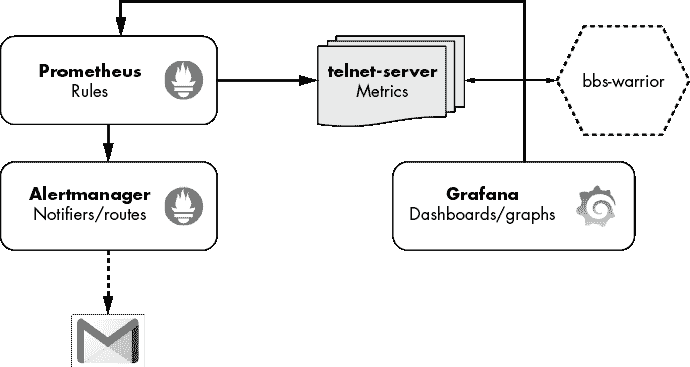
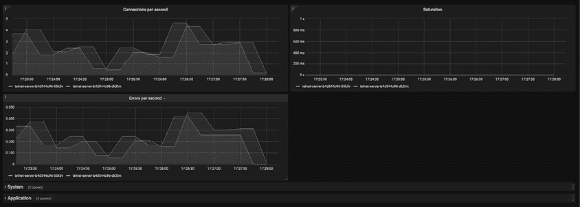
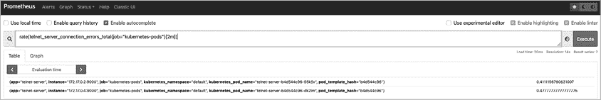
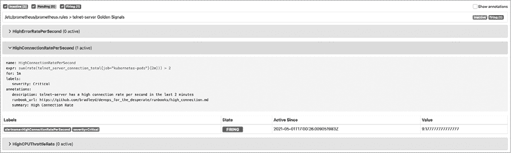

# 第九章：可观察性


*可观察性* 是系统的属性，而不是您要做的事情。这是系统被监视、跟踪和分析的能力。任何值得投入生产的应用程序都应该具备可观察性。您在观察系统时的主要目标是分辨它内部在做什么。通过分析像度量、跟踪和日志等系统输出，您可以做到这一点。*度量* 通常包括随时间变化的数据，提供关键的应用程序健康和/或性能见解。*跟踪* 跟踪请求在不同服务中的传递过程，以提供全面的视图。*日志* 提供错误或事件的历史审计轨迹，可用于故障排除。一旦收集了这些数据，您需要监视它，并在出现意外行为时通知相关人员。

并不需要分析每个应用程序或架构的度量、跟踪和日志。例如，在运行分布式微服务时，跟踪对于了解给定服务的个体状态及其与其他服务的交互至关重要。关于观察什么、如何观察以及观察多少的决定，真正取决于您处理的架构复杂性水平。由于您的应用程序和基础架构相对简单，您将通过度量、监控和警报来观察您的 telnet-server 应用程序。

在本章中，您将首先在您在第七章创建的 Kubernetes 集群内安装监控堆栈。然后，您将调查可以作为任何服务或应用程序的起点使用的常见度量模式。最后，您将配置监控堆栈，以在触发警报时发送电子邮件通知。通过本章结束时，您将对如何在 Kubernetes 内安装、监控和发送通知，为任何应用程序具有坚实的理解。

## 监控概述

*监控* 是任何涉及记录、分析和根据预定指标发出警报的操作，以了解系统当前状态的行为。为了衡量系统的状态，您需要应用程序发布指标，这些指标可以在任何时候讲述系统正在做什么的故事。通过设置指标周围的阈值，您可以创建应用程序行为的基准。例如，大多数情况下，Web 应用程序预期会响应 HTTP 200。当应用程序的基准不在您期望的范围内时，您需要通知相关人员，以便他们将应用程序恢复到正常状态。系统会发生故障，但是强大的监控和警报可以成为用户满意和轮班结束后您能安心入眠的桥梁。

一个可观察的系统应该尽最大努力回答两个主要问题：“什么？”和“为什么？”“什么？”询问在特定时间段内应用或服务的症状，而“为什么？”则是询问症状背后的原因。你通常可以通过监控症状来回答“什么？”的问题，而可以通过其他手段（如日志和追踪）来回答“为什么？”的问题。将症状与原因关联起来可能是监控和可观察性中最难的部分。这意味着，你的应用的弹性只有在应用输出的数据足够好的情况下才会表现得好。一句常用的短语来描述这个概念是“垃圾进，垃圾出”。如果从应用导出的度量数据没有针对性或与用户如何与服务交互无关，那么检测和诊断问题就会变得更加困难。因此，衡量应用的*关键路径*（即最常用的部分）比衡量每个可能的用例更为重要。

举个例子，假设你因为早上醒来感到恶心和胃部痉挛而去看医生。医生会问你一些基本问题，并测量你的体温、心率和血压。虽然你的体温稍微升高，但其他指标都在正常范围内。经过所有数据的审核后，医生会做出判断，找出你不舒服的原因。医生很可能能正确诊断你的病情（或至少能找到更多的线索来进一步追踪）。

这种医疗诊断过程与诊断应用问题的过程是相同的。你将测量症状并尝试通过诊断或假设来解释它们。如果你拥有足够相关的数据点，关联症状和原因会变得更容易。在上面的例子中，如果医生询问你最近吃了什么（这是另一个可靠的数据点），他们可能会将你的恶心和痉挛与凌晨 3 点在加油站吃寿司的不明智选择联系起来。

最后，在为您的应用设计度量和监控解决方案时，始终考虑“什么？”和“为什么？”这两个问题。避免设置那些无法为利益相关者提供价值的度量或警报。那些不断被无效警报轰炸的工程师往往会感到疲倦，最终忽视这些警报。

## 监控示例应用

你将开始监控本书示例中的 telnet-server 所发布的度量数据。telnet-server 应用有一个 HTTP 端点，可以提供关于该应用的度量信息。你感兴趣的度量数据主要集中在用户体验方面，如连接错误和流量。你的 telnet-server 应用的技术栈将包括三个主要的监控应用和一个流量模拟应用。你将使用这些应用来监控、警报和可视化由 telnet-server 部署的度量数据。

监控应用程序包括 Prometheus、Alertmanager 和 Grafana。它们在 Kubernetes 生态系统中广泛使用。*Prometheus* 是一款度量数据收集应用，使用其强大的内建查询语言查询度量数据。它还可以为这些度量设置警报。如果收集的度量超过设定的阈值，Prometheus 会将警报发送到 *Alertmanager*，后者接收 Prometheus 的警报并根据一些用户可配置的标准决定将其路由到哪里。路由通常是通知。*Grafana* 提供了一个易于使用的界面，用于创建和查看 Prometheus 提供的数据的仪表板和图表。流量模拟器 bbs-warrior 模拟了 telnet-server 应用的最终用户可能生成的流量。这可以让您测试监控系统、应用程序度量和警报。图 9-1 显示了示例堆栈的概览。



图 9-1：我们的监控堆栈概览

### 安装监控堆栈

要安装这些应用程序，您将使用提供的 Kubernetes 清单文件。监控堆栈和流量模拟器的清单文件位于仓库中（[`github.com/bradleyd/devops_for_the_desperate/`](https://github.com/bradleyd/devops_for_the_desperate/)），在*monitoring*目录下。在该目录内有四个子目录：*alertmanager*、*bbs-warrior*、*grafana*和*prometheus*。这些构成了示例监控堆栈。您将通过应用这些目录中的所有清单文件，将 Prometheus、Alertmanager 和 Grafana 安装到一个新的 Kubernetes 命名空间 `monitoring` 中。

在终端中，输入以下命令来安装监控堆栈和 bbs-warrior：

```
$ **minikube kubectl -- apply -R -f monitoring/**
namespace/monitoring created
serviceaccount/alertmanager created
configmap/alertmanager-config created
deployment.apps/alertmanager created
service/alertmanager-service created
cronjob.batch/bbs-warrior created
configmap/grafana-dashboard-pods created
configmap/grafana-dashboard-telnet-server created
configmap/grafana-dashboards created
configmap/grafana-datasources created
deployment.apps/grafana created
service/grafana-service created
clusterrolebinding.rbac.authorization.k8s.io/kube-state-metrics created
clusterrole.rbac.authorization.k8s.io/kube-state-metrics created
deployment.apps/kube-state-metrics created
serviceaccount/kube-state-metrics created
service/kube-state-metrics created
clusterrole.rbac.authorization.k8s.io/prometheus created
clusterrolebinding.rbac.authorization.k8s.io/prometheus created
configmap/prometheus-server-conf created
deployment.apps/prometheus created
service/prometheus-service created
```

输出显示您的监控堆栈和 bbs-warrior 的所有清单文件都已无错误地运行。`-R` 标志使 `kubectl` 命令递归地遍历*monitoring*目录下的所有应用程序目录及其子目录。如果没有这个标志，`kubectl` 将跳过任何嵌套的子目录，比如 *grafana/dashboards/*。Prometheus、Grafana、Alertmanager 和 bbs-warrior 应该很快就会启动并运行。

### 验证安装

如果在 Kubernetes 集群中成功安装了监控栈，你应该能在浏览器中访问 Grafana、Alertmanager 和 Prometheus 的 Web 界面。在提供的 Kubernetes 清单文件中，我已将 Prometheus、Grafana 和 Alertmanager 的 Kubernetes 服务类型设置为 `NodePort`。Kubernetes 的 *NodePort* 服务允许你连接到 Kubernetes 集群外的应用，因此你应该能够通过 minikube IP 地址和动态端口访问每个应用。你还应该能确认 bbs-warrior 流量模拟器已安装并定期运行。

#### Grafana

在终端中，输入以下命令以打开 Grafana：

```
$ **minikube -n monitoring service grafana-service**
|------------|-----------------|-------------|-----------------------------|
| NAMESPACE  |      NAME       | TARGET PORT |             URL             |
|------------|-----------------|-------------|-----------------------------|
| monitoring | grafana-service |        3000 | http://192.168.99.105:31517 |
|------------|-----------------|-------------|-----------------------------|
Opening service monitoring/grafana-service in default browser...
```

Grafana 位于 `monitoring` 命名空间中，因此此命令使用 `-n`（命名空间）标志来告诉 `minikube service` 命令服务的位置。如果省略 `-n` 标志，minikube 会报错，因为在默认命名空间中没有名为 `grafana-service` 的服务。此时，你应该能在浏览器中看到 Grafana 打开，并且加载了 telnet-server 仪表盘作为首页。如果没有看到 telnet-server 仪表盘，请检查你运行 `minikube service` 命令的终端中是否有错误。（你需要访问 Grafana 才能继续完成本章内容。）稍后我们将讨论 Grafana 仪表盘上的图表；现在，确保 Grafana 已正确安装，并且你能够在浏览器中打开它。

#### Alertmanager

在终端中，输入与打开 Grafana 相同的命令，但将服务名称替换为 `alertmanager-service`，像这样：

```
$ **minikube -n monitoring service alertmanager-service**
`--snip--`
```

现在，Alertmanager 应用应该已在浏览器中打开。此页面有几个导航链接，如 Alerts、Silences、Status 和 Help。Alerts 页面显示当前的警报及其元数据，如时间戳和警报的严重性。Silences 页面显示所有已被静音的警报。你可以为特定时间段静音或静默警报，如果某个警报持续触发，而你又不希望不断接收到通知，这时非常有用。Status 页面显示有关 Alertmanager 的信息，如版本、就绪状态和当前配置。Alertmanager 通过 *configmap.yaml* 文件在 *alertmanager/* 目录中进行配置。（你稍后将编辑该文件以启用通知。）最后，Help 页面是一个指向 Alertmanager 文档的链接。

#### Prometheus

在你的终端中，输入你刚才输入的相同命令，但将`grafana-service`替换为`prometheus-service`以打开 Prometheus：

```
$ **minikube -n monitoring service prometheus-service**
`--snip--`
```

Prometheus 应该会在你的浏览器中打开，并在页面顶部显示几个链接：Alerts、Graph、Status 和 Help。Alerts 页面显示所有已知的警报及其当前状态。Graph 页面是默认页面，允许你对度量数据库执行查询。Status 页面包含有关 Prometheus 健康状况和配置文件的信息。Prometheus，像 Alertmanager 一样，是由 *configmap.yaml* 文件控制的，位于 *prometheus* 目录中。这个文件控制 Prometheus 用于抓取度量的端点，并且包含特定度量的警报规则。（稍后我们将探讨警报规则。）Help 页面是 Prometheus 官方文档的链接。目前，你只需要确认 Prometheus 正在运行。保持 Prometheus 打开，因为接下来的部分你将需要它。

#### bbs-warrior

bbs-warrior 应用是一个 Kubernetes CronJob，每分钟运行一次，并向 telnet-server 应用创建随机数量的连接和错误。它还会向 telnet-server 发送随机数量的 BBS 命令（如 `date` 和 `help`），以模拟典型的用户活动。在你安装 bbs-warrior 后约一分钟，它应该开始生成随机流量。这个模拟应该只持续几秒钟。

为了确保 bbs-warrior 在你的 Kubernetes 集群中正确安装并处于活动状态，请在终端中输入以下命令：

```
$ **minikube kubectl -- get cronjobs.batch -l app=bbs-warrior**
NAME                   SCHEDULE      SUSPEND   ACTIVE   LAST SCHEDULE   AGE
bbs-warrior            */1 * * * *   False     0        25s             60s 
```

`-l`（标签）标志在搜索 CronJobs 时可以缩小结果范围。输出显示 CronJob 是在一分钟前安装的（在 `AGE` 列下为`60s`），并且它最后一次运行是在 `25` 秒前（在 `LAST` `SCHEDULE` 列下）。如果它正在积极运行，`ACTIVE` 列会显示为 `1` 而不是 `0`。

你现在知道 CronJob 已经运行，但你应该确保它成功完成。为此，你将列出在默认命名空间中带有标签 `bbs-warrior` 的 Pod，并在 `STATUS` 列中查找 `Completed`。在你之前使用的终端中，输入以下命令：

```
$ **minikube kubectl -- get pods -l app=bbs-warrior**
NAME                           READY   STATUS              RESTARTS   AGE
bbs-warrior-1600646880-chkbw   0/1     Completed           0          60s
```

输出显示 `bbs-warrior` CronJob 在大约 `60` 秒前成功完成。如果 CronJob 的状态不是 `Completed`，请像在第七章中那样检查 Pod 的日志以查找错误。

## 度量指标

你已经安装并验证了你的监控栈，现在，你应该专注于监控你的 telnet-server。因为你想将度量指标与用户的满意度对齐，所以你应该使用一个通用的模式来统一所有应用程序。这始终是仪表化服务时的好方法，因为允许应用程序执行其独特的度量版本会使故障排除（因此也影响值班）变得非常困难。

在这个示例中，你将探索一个常见的度量模式，叫做 *Golden* *Signals*。它提供了一组度量指标来跟踪，例如错误和流量，并为你和你的同事提供一种共同的语言，用来讨论什么样的状态是健康的。

### 黄金信号

黄金信号（这一术语最早由谷歌提出）是帮助我们理解微服务健康状况的四个指标。黄金信号包括延迟、流量、错误和饱和度。*延迟*是服务处理请求所需的时间。*流量*是应用程序接收到的请求数量。*错误*是应用程序报告的错误数量（例如，Web 服务器报告 500 错误）。*饱和度*是服务的负载情况。对于饱和度信号，你可以通过测量 CPU 使用率来判断系统还剩余多少空间，直到应用程序或主机变得缓慢或无响应。你在衡量应用程序时将经常使用这个模式。如果你遇到不知道该监控什么的情况，可以从黄金信号开始。它们将提供关于应用程序健康状况的充分信息。

*微服务*通常是一个与平台上其他服务松散耦合的应用程序。它的设计目标是仅关注你整体领域中的一两个方面。在本章中，telnet-server 应用程序将作为你衡量健康状况的微服务。

### 调整监控模式

你的应用程序可能无法完美适应像黄金信号这样的预定义监控模式。请根据你的判断决定监控哪些内容。例如，我决定在为 telnet-server 应用程序进行仪表化时不追踪延迟，尽管模式中列出了它。使用这种应用程序的用户通常不会连接后运行一个命令然后退出。你可以追踪命令的延迟，或者为每个命令工作流程添加追踪。然而，这对于这个示例应用程序来说有些过头，也超出了本书的范围。你的命令仅用于演示目的，因此关注流量、错误和饱和度信号，从用户的角度来看，会提供应用程序健康状况的总体了解。

### Telnet-server 仪表板

让我们回顾一下 Grafana 仪表板上的流量、饱和度和错误信号。在你第一次打开 Grafana 的浏览器中，telnet-server 仪表板有三个黄金信号图表，以及两个折叠的图表行，分别是“系统”和“应用程序”（见图 9-2）。你将重点关注黄金信号图表，具体如下：每秒连接数、饱和度和每秒错误数。

第一个图表，连接数（左上角），提供了流量黄金信号。在这种情况下，你测量在两分钟的时间框架内每秒接收到的连接数。每当有连接建立时，telnet-server 应用会增加一个指标计数器，这能清楚地显示有多少人连接到该应用。过多的连接可能会导致性能或可靠性问题。在这个例子中，x 轴在两个 telnet-server Pods 中急剧上升，超过 4.0 每秒连接数。你的图表可能与我的不同，因为 bbs-warrior 会随机生成流量；目标是确保图表数据正在填充。



图 9-2：telnet-server Grafana 仪表板

饱和度图（右上角）表示饱和度黄金信号。在饱和度的衡量中，你需要测量 Kubernetes 限制你的 telnet-server 容器 CPU 的时间。你在第七章中为 telnet-server 容器设置了 500 毫 CPU 的 CPU 资源限制。因此，如果 telnet-server 容器使用的 CPU 超过了最大限制，Kubernetes 会对其进行限制，这可能会导致 telnet-server 对命令或连接的响应变慢。这种限制可能会导致性能下降或服务中断。在 图 9-2 中显示的饱和度图中，两个 Pod 的 x 轴都平稳地显示在 0 微秒。如果发生 CPU 限制，图线会升高。

每秒错误数（左下角）图表对应错误黄金信号。对于这个指标，你需要跟踪在两分钟时间段内收到的每秒连接错误。这些错误会在客户端无法正确连接或连接意外中断时递增。高错误率可能表示你需要解决的代码或基础设施问题。在 图 9-2 中显示的图表中，错误每秒的错误率在两个 pod 上都急剧上升到 0.4。

本仪表板底部折叠的两行包含一些本章未涵盖的杂项图表，但你应该自行探索它们。telnet-server 仪表板的系统行包含两个图表：一个是内存使用情况，另一个是 telnet-server Pods 的 CPU 使用情况。应用行包含四个图表：总连接数、活动连接数、连接错误总数和未知命令总数。

telnet-server 仪表板位于 *grafana/dashboards/telnet-server.yaml* 文件中。该文件是一个 Kubernetes ConfigMap 资源，包含 Grafana 创建仪表板和图表所需的 JSON 配置。

### PromQL：简介

*PromQL* 是 Prometheus 应用内置的查询语言。你用它来查询和操作指标数据。可以将 PromQL 看作是 SQL 的远亲。它有一些内置函数（如 `average` 和 `sum`），可以简化数据查询，还支持条件逻辑（如 `>` 或 `=`）。我们在这里不会深入探讨这个查询语言，只会展示如何查询 telnet-server 的黄金信号指标，以填充你的图表和警报。

例如，这是你输入的查询，用于生成每秒错误数的图表：

```
**rate(telnet_server_connection_errors_total{job="kubernetes-pods"}[2m])**
```

该指标的名称是`telnet_server_connection_errors_total`。该指标用于衡量用户可能遇到的`连接错误`的总数。查询使用了 Prometheus 的 `rate()` 函数，该函数计算在指定时间间隔内每秒的连接错误平均值。你使用方括号`[2m]`限制查询获取数据的时间范围为两分钟。结果将显示你在第七章中安装的两个运行中的 telnet-server Pods。花括号（`{}`）允许你通过使用标签作为匹配项来细化查询。在这里，你指定只获取带有 `job="kubernetes-pods"` 标签的 `telnet_server_connection_errors` 指标的数据。

在 Prometheus 中创建警报规则时，你可以输入与上述相同的查询来触发警报。然而，这一次，你应该将 `rate()` 函数的结果包装在 `sum()` 函数中。你这样做是因为你希望了解两个 Pod 的总体错误率。警报规则应该如下所示：

```
**sum(rate(telnet_server_connection_errors_total{job="kubernetes-pods"}[2m]))** **> 2**
```

在查询的最后，你添加了大于符号（`>`）的条件逻辑，并指定了一个数字：`2`。这基本意味着，如果每秒的错误率大于 2，则此警报查询将评估为真。（在本章稍后部分，我们将讨论当警报规则为真时会发生什么。）

如果你想查看或调整这些指标中的任何一个，可以访问 Prometheus Web 界面中的图形页面。图 9-3 展示了正在运行的 `telnet_server_connection_errors_total` 查询。



图 9-3：在 Prometheus 的 Web 界面中运行查询

查询返回了两个 Pods 的连接错误数据。要了解更多关于 PromQL 的信息，请访问 [`prometheus.io/docs/prometheus/latest/querying/basics/`](https://prometheus.io/docs/prometheus/latest/querying/basics/)，以获取更多示例和信息*。*

## 警报

指标和图表仅构成监控解决方案的一半。当你的应用决定走下悬崖时（它肯定会），就需要有人或某些东西来监控它。如果一个 Pod 在部署中死掉，Kubernetes 会用新的 Pod 来替换它。但如果 Pod 一直重启，就需要有人处理这个问题，这就是警报和通知发挥作用的地方。

什么是一个好的告警？除了针对每个应用程序的 Golden Signals 设置告警外，你可能还需要围绕某个关键指标设置告警进行监控。当这种情况发生时，创建告警时要遵循以下几个指南：

1.  不要将阈值设置得过低。将告警阈值设置得过低可能导致告警频繁触发，然后如果你的指标波动较大，告警又会被清除。这种行为被称为 *告警波动*，它是很常见的现象。系统不应该为波动的指标每隔几分钟就发出告警，因为值班工程师在收到通知后会感到很有压力，而当他们赶到时，发现告警已经被清除。

1.  避免创建不可操作的告警。不要为无法采取措施解决的服务创建告警。我把这些告警称为 *状态告警*。没有什么比半夜被叫醒来看守一个不需要采取行动的告警更让值班工程师沮丧的了。

对于本书，我提供了三个告警，分别是 `HighErrorRatePerSecond`、`HighConnectionRatePerSecond` 和 `HighCPUThrottleRate`（稍后会详细介绍）。这些告警位于 Prometheus 配置文件（*configmap.yaml*）中的 *prometheus.rules* 部分。Prometheus 使用告警规则来决定某个指标是否处于不希望的状态。一个 *告警规则* 包含告警名称、PromQL 查询、阈值和标签等信息。对于你的示例，我违反了自己设定告警的建议，故意将阈值设置得非常低，使得 bbs-warrior 很容易触发这些告警。在学习实时指标和告警时，活生生的例子最为有效！

### 审查 Prometheus 中的 Golden Signal 告警

你可以在 Prometheus 或 Alertmanager 的 Web 界面中查看告警。不同之处在于，Alertmanager 仅显示正在触发的告警，而 Prometheus 会显示所有告警，无论它们是否正在触发。你需要查看所有告警，所以在这个示例中你将使用 Prometheus。然而，当某个告警正在触发时，你也应该访问 Alertmanager 的界面。

在最初打开 Prometheus 的浏览器中，点击左上角导航栏中的 **Alerts** 链接。你应该能看到三个提供的 telnet-server Golden Signals 告警：`HighErrorRatePerSecond`、`HighConnectionRatePerSecond` 和 `HighCPUThrottleRate`。这些告警是在你之前安装 Prometheus 时创建的。告警页面应该像 图 9-4 一样显示。



图 9-4：Prometheus 对 telnet-server 的告警

每个警报将处于三种状态之一：待处理（黄色）、非活动（绿色）或触发（红色）。在图 9-4 中，`HighConnectionRatePerSecond`警报处于触发状态。其他两个警报，`HighCPUThrottleRate`和`HighErrorRatePerSecond`，由于未被触发，处于非活动状态。由于 bbs-warrior 的随机性，你的警报页面可能与我的不同。如果你的页面没有显示任何触发状态的警报，可以等几分钟生成更多流量，然后刷新浏览器页面。在我为本章进行的所有测试中，我总是至少有一条警报过渡到触发状态。

`HighErrorRatePerSecond`警报关注每秒接收到的连接错误数量。如果两分钟窗口内连接错误的速率超过 2 次，警报将进入触发状态。在我的本地 Kubernetes 设置中，此警报当前处于非活动状态。

下一条警报，`HighConnectionRatePerSecond`，用于检测在两分钟时间框架内连接速率是否超过每秒 2 次。目前，这条警报处于触发状态。图 9-4 显示，当前我的连接速率超过每秒 9.1 次，远远超过设定的 2 的阈值。我已经在浏览器中展开了这条警报，以显示警报提供的元数据，采用键值对布局。在所有三个警报的标签部分，我设置了一个名为`severity`的标签，其值为`Critical`，这样可以更容易区分非关键警报和需要立即处理的警报。稍后，你将在 Alertmanager 中使用这个标签来路由重要的警报。注释部分包括描述、摘要和指向*运行手册*的链接，运行手册是为不熟悉的工程师提供服务的“蓝图”，解释了为何、如何以及如何做这项服务。提供这些信息对于发送警报通知至关重要，因为它能让值班人员在故障排除时了解应关注的内容。

最后一条警报，`HighCPUThrottleRate`，用于检测 CPU 饱和度是否过高。如果 CPU 在两分钟的时间窗口内被 Kubernetes 限流超过 300 微秒，系统将切换到触发状态。此警报当前处于非活动状态，但通常情况下，我建议在追踪 CPU 限流时使用至少五分钟的时间窗口。因为较小的时间窗口可能会让你更容易在短暂的工作负载峰值期间触发警报。

### 路由和通知

你已经验证了指标和警报可见并处于活动状态，现在，你应该配置 Alertmanager 以发送电子邮件通知。一旦警报处于触发状态，Prometheus 会将其发送到 Alertmanager 进行路由和通知。通知可以通过短信、推送通知或电子邮件发送。Alertmanager 将这些通知方式称为*接收器*。路由用于匹配警报并将其发送到特定的接收器。一种常见的模式是根据特定标签路由警报。警报标签在 Prometheus 的*configmap.yaml*文件中设置。稍后在启用通知时，你将使用这种模式。

提供的 Alertmanager 配置位于*alertmanager/configmap.yaml*文件中。它设置为匹配所有`severity`标签为`Critical`的警报，并将它们路由到*none 接收器*，即一个不会在警报发生时通知任何人的黑洞。这意味着，要查看警报是否被触发，你需要访问 Alertmanager 或 Prometheus 上的网页。这个设置并不理想，因为每隔几分钟刷新一次网页会变得很麻烦，所以你将把任何`severity`标签设置为`Critical`的警报路由到`email`接收器。如果你在跟着操作，这一步完全是可选的，但它向你展示了如何在 Alertmanager 中配置接收器。

#### 启用电子邮件通知

要将警报路由到`email`接收器，你需要编辑 Alertmanager 的配置。我已经在*configmap.yaml*文件中为`email`接收器和`route`块提供了一个模板。这个电子邮件示例是基于 Gmail 账户的，但你可以根据需要修改为任何电子邮件提供商。更多详情请参见[`www.prometheus.io/docs/alerting/latest/configuration/#email_config/`](https://www.prometheus.io/docs/alerting/latest/configuration/#email_config/)。

打开 Alertmanager 的*configmap.yaml*文件，用你喜欢的编辑器打开，它应该是这样的：

```
`--snip--`
    global: null
    receivers:
  1 #- name: email
    #  email_configs:
    #  - send_resolved: true
    #    to: <`GMAIL_USERNAME@gmail.com`>
    #    from: <`GMAIL_USERNAME@gmail.com`>
    #    smarthost: smtp.gmail.com:587
    #    auth_username: <`GMAIL_USERNAME@gmail.com`>
 #    auth_identity: <`GMAIL_USERNAME@gmail.com`>
    #    auth_password: <`GMAIL_PASSWORD`>
  2 - name: none
    route:
      group_by:
        - job
      group_interval: 5m
      group_wait: 10s
    3 receiver: none
      repeat_interval: 3h
      routes:
      4 - receiver: none
          match:
            severity: "Critical"
```

在这里，你有两个接收器，分别命名为`email` 1 和`none` 2。`none`接收器不会将警报发送到任何地方，但当取消注释时，`email`接收器将把警报发送到一个 Gmail 账户。取消注释`email`接收器的相关行，然后用一个你可以用于测试的电子邮件账户替换它。

配置好电子邮件设置后，将`routes`部分下的`receiver` 3 更改为`email`。这将配置 Alertmanager，在警报的`severity`标签设置为`Critical`时，将任何警报路由到`email`接收器。接收器行 4 现在应该如下所示：

```
- receiver: **email**
```

你仍然会有默认的或用于捕获所有警报的接收器 3，设置为`none`，因此任何不符合`severity`标签规则的警报都会发送到这里。保存此文件，因为你已经完成了对它的修改。

#### 应用 Alertmanager 的配置更改

接下来，你将更新 Kubernetes 集群中的 Alertmanager ConfigMap。由于本地文件包含集群中不存在的更改，请在终端中输入以下内容：

```
$ **minikube kubectl -- apply -f monitoring/alertmanager/configmap.yaml**
configmap/alertmanager-config configured
```

下一步是告诉 Kubernetes 重启 Alertmanager 部署，以便它能够获取新的配置更改。在同一个终端中，输入以下命令来重启 Alertmanager：

```
$ **minikube kubectl -- -n monitoring rollout restart deployment alertmanager**
deployment.apps/alertmanager restarted
```

Alertmanager Pod 应该会在几秒钟后重启。如果你有任何处于触发状态的警报，你应该开始在收件箱中收到邮件通知。根据 Alertmanager 和你的邮件提供商，通知可能需要一些时间才能出现。

如果你没有收到任何通知邮件，请检查几个常见问题。首先，确保*configmap.yaml*文件没有任何拼写错误或缩进问题。YAML 文件很容易对齐错误。其次，确保你输入的邮件设置符合邮件提供商的要求。查看 Alertmanager 的日志，以查找这些和其他常见问题。输入以下`kubectl`命令来查看日志中的错误：

```
$ **minikube kubectl -- -n monitoring logs -l app=alertmanager**
```

如果你需要出于某种原因禁用通知，请将路由接收器设置回`none`，修改*configmap.yaml*文件，应用清单更改，并重启。

现在你已经为 telnet-server 的黄金信号配置了警报和通知。

## 总结

指标和警报是监控应用程序的基础。它们提供了服务健康状况和性能的洞察。在本章中，你了解了黄金信号监控模式，以及如何在 Kubernetes 集群中使用 Prometheus、Alertmanager 和 Grafana 安装现代监控栈。最后，你学会了如何配置 Alertmanager 以发送关键警报的邮件通知。

在下一章，我们将转变话题，讨论在主机或网络上常见的故障排除场景，以及你可以使用的诊断工具。
