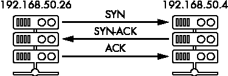

# 10

主机故障排除


工程师们花费大量时间试图弄清楚为什么某些事情不能按预期运行。仪器设备、跟踪和监控在确定主机或应用程序的健康状态方面起着重要作用，但有时仅靠可观察性还不够。有时候，你需要挽起袖子找出为什么某些事情出了问题以及如何修复它。换句话说，你将进行故障排除和调试。*故障排除* 是分析系统并排除潜在问题原因的过程。而*调试* 则是发现问题原因并可能实施修复步骤的过程。两者之间的区别微妙，实际上，你可以把调试看作是故障排除的一个子集。本章中的大部分内容都可视为故障排除。

在本章中，你将探讨 Linux 主机上常见的性能问题和可能遇到的问题。你将查看症状、可以用来诊断各种潜在问题的命令，以及故障排除后要采取的下一步措施。通过本章的学习，你将扩展你的命令行工具库和侦察技能，以解决常见问题。

## 故障排除与调试：入门指南

故障排除和调试是一门艺术，而非一门精确的科学。很少会看到一个大型霓虹灯牌上有一个指向确切问题的箭头。大多数时候，你会找到一串串面包屑，从线索到线索引导你。你可能需要在草丛中爬行，可能会在找到所需内容之前抓狂。但诊断一个破损系统可能会带来极大的满足感，找到困扰你的客户或同事的问题会让你感到惊喜。

但即使是一位艺术家也需要方法，拥有一套标准的步骤和技术，每当你调查问题时都跟随，是开始的好方法。因此，以下是在面对我们称之为主机的这些善变的野兽时要记住的一些技巧：

1.  从简单开始。在解决问题时，很容易贸然下结论并假设是最坏的情况。相反，要有方法论，建立在你所获取的知识基础之上。问题通常出在人为错误。

1.  建立心理模型。理解系统的角色及其与其他系统的交互方式将有助于你更快地进行故障排除。你会发现自己花费更少的时间担心架构问题，更多时间解决实际问题。

1.  给自己时间构建理论。你可能会想抓住找到的第一个线索，但检查一下面包屑能否引领你更远总是值得的。制定一个测试来验证你的理论。

1.  确保主机之间使用一致的工具。确保你的主机是使用相同的工具构建的。没有什么比登录到一台主机时发现它与其他主机不同更糟糕的了。工具的一致性是通过自动化构建主机的好处之一。

1.  保持记录。保持一个高层次的问题、症状和修复的记录，这样你就不会忘记关于某个问题的重要细节。你的未来的自己会感谢你的。

1.  知道什么时候寻求帮助。如果你的业务依赖于解决一个问题，但你在找不到原因时感到困惑，最好发出求救信号。经验丰富的人通常能够提供帮助，某一天，你也会将这些知识传递下去，甚至回报这份帮助。

## 情景：高负载平均值

Linux 有一个名为*负载平均值*的度量，它可以反映主机的忙碌程度。负载平均值在计算时会考虑 CPU 和 I/O 等数据。系统的负载会以 1 分钟、5 分钟和 15 分钟的平均值显示。乍一看，任何一个高值可能都会被认为是问题。但排查高负载平均值时可能会比较棘手，因为高负载并不总是意味着主机处于降级状态。一台忙碌的主机可能会有较高的负载，但仍然能够正常响应请求和命令。就像两个人体温相同，但一个人保持清醒，正常运作，另一个人则躺在床上，行动迟缓。每台主机和每种工作负载都是不同的，因此你需要首先确定你主机的正常负载范围。一个简单的经验法则是，如果负载平均值大于 CPU 核心数，那么可能有进程在等待，导致延迟或性能下降。在调查这种情况时，第一步是确定高负载，并尽量找到可能导致负载增加的进程。

### uptime

输入 `uptime` 命令以显示主机的运行时间、已登录用户的数量以及系统负载。它以 1 分钟、5 分钟和 15 分钟的平均值报告负载：

```
$ **uptime**
09:30:38 up 47 days, 31 min, 2 users, load average: 8.05, 1.01, 0.00
```

这台四核 CPU 主机已经`运行`了 `47 天` `31 分钟`，当前有 `2 个用户` 登录。1 分钟`负载平均值`是`8.05`。5 分钟`负载平均值`是`1.01`，这意味着在 1 到 5 分钟的运行期间，系统的负载正在增加。你之所以知道这一点，是因为 15 分钟的`负载平均值`是 `0.00`（那个时间没有负载）。如果这些数字相反，即 15 分钟的负载值较高，而 1 分钟的负载为零，那么你可以推断出负载的激增并不是持续发生的，而是发生在大约 15 分钟前。由于这个负载似乎在不断增加，并且已经持续攀升超过 5 分钟，同时它大于 CPU 核心数，因此可能值得调查其原因。

### top

`top`命令显示有关系统和在该主机上运行的进程的信息。它提供了诸如 CPU 占用百分比、负载平均值、内存和进程信息等详细内容。执行`top`命令可以启动一个交互式实时仪表板，显示系统信息，如图 10-1 所示。


图 10-1：在大部分空闲的主机上执行`top`命令的输出

默认情况下，`top`会根据`CPU`百分比对所有进程进行排序。第一行显示的是在给定轮询周期内使用最多`CPU`百分比的进程。显示会每 3.0 秒刷新（轮询一次），因此你需要观察`top`几轮，才能决定哪个进程或数据可能是导致高负载的原因。

以下是`top`报告中的一段，其中一个进程使用了 120%的 CPU：

```
PID  USER   ...    RES   SHR  S  %CPU  %MEM     TIME+  COMMAND
3048 root   ... 177740  5164  S 120.3   1.8 173:02.78  fail2ban-server
```

关键列是`PID`、`RES`、`%CPU`、`%MEM`和`COMMAND`。（为了可读性，其他列在此省略。）`fail2ban-server`命令（在`COMMAND`列中）使用了 120.3%的 CPU，并且消耗了大约`177,740`KB 的内存，如`RES`列所示。该进程使用了主机总内存的`1.8`%（`%MEM`）。综合来看，调查进程`3048`，查明其为何消耗如此多的 CPU 资源，是个不错的主意。

### 后续步骤

在负载平均值较高的情况下，你需要更深入地分析问题进程。也许这个应用程序配置不当、卡住了，或者在等待外部资源（如磁盘或 HTTP 请求）。也有可能是主机的规格不足以应对其使用场景。如果是云实例，也许 CPU 核心数或磁盘 IOPS 不够。另外，也要检查在此期间主机是否流量增加，这可能表示出现了间歇性的流量激增。你还可以使用`vmstat`、`strace`和`lsof`等工具，进一步了解进程与系统的交互。（你将在后续章节中详细了解这些工具。）

## 场景：高内存使用

临时的流量激增、性能问题或内存泄漏的应用程序，都可能导致内存以较高的速度被消耗。调查高内存使用的第一步是确保主机确实存在内存不足的情况。Linux 倾向于将所有内存用于缓存和缓冲区，因此可能看起来空闲内存较少。但实际上，Linux 内核可以在需要时将这些缓存内存重新分配到其他地方。`free`、`vmstat`和`ps`命令可以帮助识别使用了多少内存，以及是哪个进程可能是罪魁祸首。

### free

`free` 命令通过显示运行时的已用和可用内存，提供了一个快速的系统内存检查。传递 `-h` 和 `-m` 标志，指示 `free` 命令以人类可读的（`-h`）格式，使用 *兆二进制字节*（`-m`）为单位显示所有输出字段。在 *人类可读格式* 中，数据以类似 *兆二进制字节* 或 *吉比字节* 的单位出现，而不是字节。以下示例显示了一个内存不足的主机。输入以下命令以显示内存：

```
$ **free -hm**
           total        used        free     shared  buff/cache available
Mem:       981Mi       838Mi        95Mi      3.0Mi        47Mi      43Mi
Swap:      1.0Gi       141Mi       882Mi
```

系统总内存为 `981Mi`，其中 `838Mi` 被 `used`，`95Mi` 为 `free`。`buff/cache` 列包含从磁盘读取的数据和相关元数据的信息。这些数据被用来加速检索，如果你需要再次访问它。正因为如此，Linux 尝试使用所有的系统内存，而不是让它空闲。若系统内存不足，Linux 主机会将数据交换到磁盘中。正如你能想象的那样，使用磁盘作为内存比使用实际的 RAM 要慢得多。如果 `Swap` 的 `free` 列数值过低，系统可能会比平时更慢。在这个例子中，系统仅略微交换到磁盘（`141Mi`），这可以是正常现象。

`used` 和 `free` 列在 Linux 主机上可能会让人误解。Linux 喜欢利用系统的每一份 RAM，因此快速查看时可能看起来主机内存不足。或者，就像这个例子一样，它可能显示比实际可用的内存更多。这里，`free` 列显示 `95Mi`，但根据 `available` 列，实际上只剩下 `43Mi`。当使用 `free` 命令显示系统内存时，注意 `available` 列，它是判断系统和新进程实际可用内存的一个晴雨表。

从这个示例中看出可用内存非常少，可以安全地说，这个主机存在内存短缺。系统剩余大约 `43Mi`（从 1Gi 中）可能会导致稳定性问题，并且阻止新进程的创建。它还可能迫使 Linux 内核调用内存不足管理器（OOM），并选择一个进程进行终止，这可能会导致不可预期的行为。

### vmstat

`vmstat` 命令提供了关于进程、内存、IO、磁盘和 CPU 活动的有用信息。它可以在一段时间内报告这些数据，这是对 `free` 命令的升级，使得趋势更加容易识别。你将向 `vmstat` 命令传递两个参数：`delay`，指定每次轮询之间的时间延迟，以及 `count`，指定 `vmstat` 获取数据的次数，直到停止。对于这个示例，你将以一秒的延迟轮询五次数据。输入以下命令来轮询数据：

```
$ **vmstat 1 5**
procs ---------memory--------  --swap-- -----io---- -system- ---cpu--------
 r b   swpd   free buff  cache  si   so   bi    bo   in   cs us sy id wa st
 2 0  54392  74068 7260 117804   0   10   84   432   81  158  3  1 96  0  0
 1 0  54392  73864 7260 117852   0    0    8     0  379  104 44  0 56  0  0
 1 2  54392  71768  484  38724 104    0  496   196  469  327 41  1 57  1  0
 1 0  54392  71508  484  39768  20    0 1024     0  357   82 44  0 56  0  0
 1 0  54392  71508  484  39768   4    0    0     0  370   43 46  0 54  0  0
```

`vmstat`报告分为多个类别：`procs`、`memory`、`swap`、`io`、`system`和`cpu`。每个类别包含类似的列。数据的第一行是自上次启动以来每个统计量的平均值。由于你正在寻找内存使用高的情况，你只会关注`vmstat`输出中的`memory`和`swap`部分。

`memory`部分的`swpd`列显示使用的总交换空间；在本例中约为 54Mi（`54,392`Ki）。接下来是`free`列。根据`vmstat`，空闲内存在轮询快照中波动在 71,000Ki 到 74,000Ki 之间。这并不意味着你只有 71,000Ki 可用的内存；这是一个估算，因为可释放的缓存和缓冲区。

在`swap`部分下面有两列：`si`（交换入）和`so`（交换出）。`si`和`so`列表示你正在将内存页到磁盘和从磁盘交换内存。曾经有一段时间，你正在以约`104`KiB 每秒的速度从磁盘交换内存。如前所述，少量交换是可以接受的，但是如果空闲内存不足并且还在交换，则通常表示存在内存瓶颈。

在`procs`下的`r`和`b`列可以提供可能存在瓶颈的良好指示。`r`列是运行中（或等待运行）进程的数量。这里的高数值可能表示存在 CPU 瓶颈。`b`列是处于不可中断睡眠状态的进程数。如果`b`列中的数值较高，这可能是一个信号，表明有进程在等待资源，比如磁盘或网络 IO。

### ps

如果主机的内存使用量很高，你将要检查所有运行中的进程，找出内存使用情况。`ps`命令提供了主机上当前进程的快照。你将使用一些标志来缩小结果范围，并仅显示按最大内存排序的前 10 个主机。输入以下命令：

```
$ **ps -efly --sort=-rss | head**
S UID   PID PPID  C PRI  NI   RSS    SZ WCHAN STIME TTY TIME CMD
R root  931 930  93  80   0 890652 209077 -   05:56 ?   ...   memory-hog
S root  469   1   0 -40   - 18212 86454 -     Jan16 ?   ...  /sbin/multipathd
S root  672   1   0  80   0 10420 233460 -    Jan16 ?   ...  /usr/lib/snapd
S root  350   1   0  79  -1  7416 12919 -     Jan16 ?   ...  /lib/systemd
```

使用`-efly`和`--sort=-rss`标志显示所有进程的长格式。`RSS`（常驻集大小）列显示进程使用的非可交换物理内存量（以千字节为单位），按降序排列。你将这些结果传输到`head`命令，默认显示前 10 行。`CMD`列显示每个进程所属的命令。在这个示例中，`memory-hog`命令根据`RSS`列使用了约 890MB（`890,652`KB）的物理内存。考虑到这台主机只有 1Gi 的总内存，该应用程序正在占用所有内存。

### 下一步

你解决高内存使用问题的步骤将取决于系统和/或用户的风险因素。如果你在处理生产系统，你需要小心行事，查看日志、跟踪记录和度量数据，以确定问题何时何地开始。如果这是生产系统上的新行为，回滚`memory-hog`到先前版本是一个很好的第一步。（任何时候你能快速恢复生产环境，都是一次胜利。）一旦在生产环境中修复了问题，可以在不同环境中进行性能分析，深入挖掘线索，找出内存使用的原因和位置。

## 场景：高 iowait

如果一个主机花费过多时间等待磁盘 I/O，我们称其为*高 iowait*。衡量 iowait 的方法是检查 CPU 空闲的时间百分比，因为系统存在未完成的磁盘 I/O 请求，这些请求阻塞了进程的其他工作。显著的 iowait 通常会导致主机负载增加，可能还会导致报告的 CPU 使用率高于正常水平。换句话说，如果 CPU 在等待磁盘响应，它就没有足够的时间处理系统其他部分的请求。高 iowait 的原因可能是磁盘老化、慢速或故障。另一个原因可能是应用程序正在执行大量的磁盘读写。如果你处于虚拟化环境中，慢速的网络附加存储很可能是瓶颈所在。

所有系统都会有一定的 iowait，现代 CPU 的速度通常快于存储。然而，单独的高 iowait 并不足以表明问题。一些系统即使出现高 iowait 也能正常运行，而另一些系统则会出现明显的瓶颈迹象。目标是找出伴随高 iowait 出现的问题。正常 iowait 和高 iowait 之间没有明确的界限，因此我将高 iowait 的阈值设定为持续超过 30% 的情况。

两个命令行工具，`iostat`和`iotop`，将帮助你排查高 iowait 的主机问题。

### iostat

`iostat`命令行工具报告设备的 CPU 和 I/O 状态，因此它是帮助你确定系统是否出现 iowait 的绝佳工具。如果系统默认未安装`iostat`，可以使用包管理器安装 sysstat 包。

如前所述，拥有一定的 iowait 是正常的。你需要关注的是异常行为，因此你需要在一段时间内轮询系统，以便更好地了解问题，就像你使用`vmstat`命令时一样。在这个例子中，输入下面的命令，每秒轮询一次，持续 20 次。命令和输出应如下所示：

```
$ **iostat -xz 1 20**
`--snip--`
avg-cpu:  %user   %nice %system %iowait  %steal   %idle
           6.25    0.00   27.08   66.67    0.00    0.00

Device             r/s    rkB/s      w/s      wkB/s    %util ...
vda               0.00     0.00  1179.00  712388.00   100.00 ...
```

第一个报告 `iostat` 打印的是主机上次启动时的数据。由于这些数据与当前的故障排除场景无关，因此我在此省略了它，以及 `Device` 输出中的多个列。`-xz` 标志只显示使用扩展统计格式的活动设备。`w/s` 列显示 `vda` 设备每秒执行大量写请求（`1179.00`）。`CPU` 大约 `66.67%` 的时间都在等待未完成的磁盘请求（`%iowait`）。最后，作为该磁盘非常繁忙的进一步证据，`%util`（百分比利用率）列显示为 `100%`。

你可以得出结论，主机正遭遇持续的高 iowait，而不仅仅是间歇性的。更重要的是，你知道 iowait 发生在名为 `vda` 的设备上。从这里开始，值得尝试找到可能导致 iowait 增加的进程。你可以使用 `iotop` 命令来实现，接下来你将探索这个命令。

### iotop

`iotop` 命令以类似 `top` 的格式显示 I/O 使用情况。它不仅提供主机 I/O 的概述，还允许你深入到进程级别，定位任何可能导致大量磁盘 I/O 的进程。大多数发行版默认不包括 `iotop`，因此你需要使用包管理器来安装它。

在运行 `iotop` 时，你可能只希望限制输出显示执行 I/O 的活跃进程，使用不断轮询的批处理模式，以保持输出简洁并揭示可能的 I/O 模式。此命令需要提升的权限，因此你需要使用 `sudo` 或以特权用户身份运行它。请输入以下命令：

```
$ **sudo iotop -oPab**
Total DISK READ:        15.04 M/s | Total DISK WRITE:     446.28 M/s
Current DISK READ:      15.04 M/s | Current DISK WRITE:   321.58 M/s
    PID  PRIO  USER   DISK READ  DISK WRITE  SWAPIN    IO  COMMAND
  88576 be/4 bob      512.00 M    616.81 M  0.00 % 83.26%  heavy-io
    469 rt/4 root       0.00 B      0.00 B  0.00 %  0.00%  multipathd -d -s
  `--snip--`
```

`-oPab` 标志使得 `iotop` 仅显示执行 I/O 的进程，并以批处理模式显示累积统计信息。在这个示例中，`heavy-io` 命令的 `IO` 列显示为 `83.26%`。`PID` 列报告了进程 ID，在此情况下为 `88576`。在报告中没有其他进程使用大量 I/O，因此可以推测 `heavy-io` 进程是导致高 iowait 的原因之一。

### 下一步

在检查统计信息并找到导致高 iowait 的进程 ID 后，你可能想要探索一下这个应用程序的用途。如果你有源代码或配置文件，可以通过检查进程访问的磁盘操作或文件来寻找更多线索。另一个导致高 iowait 的原因可能是你的虚拟机托管在云服务提供商上，而你为磁盘预配置的 I/O 操作数量不足。检查磁盘指标以确认并调整数字，以补偿负载。如果一切都失败了，可以使用像 `lsof` 这样的工具检查哪些文件是打开的，使用 `strace` 跟踪进程正在进行的系统调用，或者使用 `dmesg` 查找任何硬件内核错误。（我们将在本章后面讨论 `lsof`、`strace` 和 `dmesg`。）

## 场景：主机名解析失败

传统上，当一个服务需要连接到另一个服务时，它会使用域名系统（DNS）查找 IP 地址并发送请求。*DNS 是主机 IP 地址映射的目录。它允许我们使用像 google.com 或 nostarch.com 这样的名称，而无需知道这些主机的确切 IP 地址。人类比起像 142.250.72.78 或 104.20.208.3 这样的 IP 地址，更容易记住名字。想象一下，如果你不得不通过尝试记住一个商店的经纬度坐标来找到它，而不能使用 GPS，而只是记住它在 123 Main Street，你会迷路…很多次。*

*假设在这种情况下，你有一个应用程序尝试连接到本地环境中的 Postgres 数据库。应用程序开始在日志中输出类似这样的错误：

```
psql: error: could not translate host name "db.smith.lab" to address: Temporary failure in name resolution 
```

看起来应用程序无法解析*db.smith.lab*的 DNS 记录。名称解析失败可能有多种原因。我们将探索一些工具来帮助排除这个错误。在此之前，你需要真正理解主机如何使用 DNS。

### resolv.conf

在任何 Linux 主机上，调查 DNS 问题的第一步是查看*/etc/resolv.conf*文件，该文件提供了要查询的 DNS 服务器信息以及任何特殊选项（例如超时或安全性）。以下是典型 Ubuntu 主机的*resolv.conf*文件：

```
# This file is managed by man:systemd-resolved(8). **Do not edit.**
#
# This is a dynamic resolv.conf file for connecting local clients to the
# internal DNS stub resolver of systemd-resolved. This file lists all
# configured search domains.
#
# Run "resolvectl status" to see details about the uplink DNS servers
# currently in use.
#
# Third party programs must not access this file directly, but only through 
# the symlink at /etc/resolv.conf. To manage man:resolv.conf(5) in a 
# different way, replace this symlink by a static file or a different 
# symlink.
#
# See man:systemd-resolved.service(8) for details about the supported 
# modes of operation for /etc/resolv.conf.

nameserver 127.0.0.53
options edns0 trust-ad
```

该文件包含了多个描述`systemd-resolved`的注释，最重要的是，它指出你不应编辑此文件。此文件由*systemd*提供的`systemd-resolved`服务控制，并且在主机或服务重新启动时，服务会覆盖该文件。在注释之后，从底部倒数第二行包含了`nameserver`关键字和查询 DNS 服务器的 IP 地址。在这台 Ubuntu 主机上，`nameserver`设置为`127.0.0.53`，意味着任何 DNS 请求都会发送到这个地址。如果本地`resolver`不知道查询的答案，`resolver`将把请求转发到上游的`DNS 服务器`。

通常，当你从 DHCP 服务器获取 IP 地址租约时，上游的 DNS 服务器会被设置。这些上游的 DNS 服务器可以是处理所有请求的内部服务器，也可以是互联网上使用的众多公共服务器之一。例如，Cloudflare 在 1.1.1.1 提供公共 DNS 服务器。全球范围内有许多公共 DNS 服务器可供使用。

文件中的最后一行使用`options`关键字修改了一些特定的解析器属性。在这个示例中，设置了`edns0`和`trust-ad`选项。`edns0`选项为 DNS 协议启用扩展功能。详情请参阅 RFC 2671（[`tools.ietf.org/html/rfc2671/`](https://tools.ietf.org/html/rfc2671/)）。`trust-ad`，或称为认证数据（AD）位选项，将在所有外发的 DNS 查询中包含认证数据，并在响应中保留认证数据。这将允许客户端和服务器相互验证交换内容。此选项是一个更大安全扩展集的一部分，旨在增强 DNS 的安全性。更多信息请参见[`www.dnssec.net/`](https://www.dnssec.net/)。

### resolvectl

在这个示例主机的*resolv.conf*文件中，DNS 服务器被设置为`127.0.0.53`，这是一个本地解析器，代理任何它无法识别的 DNS 请求。每个 DNS 服务器通常会有一个上游服务器，转发它无法识别的请求。由于你正在使用`systemd-resolver`，你可以使用名为`resolvectl`的工具与本地解析器进行交互。如果这个命令行工具缺失，你可以通过包管理器安装它。

你需要知道本地 DNS 解析器（`127.0.0.53`）将未知请求发送到哪里。这可能有助于你找出为什么*db.smith.lab*解析失败。要查看解析器指向的上游 DNS 服务器，可以输入以下命令：

```
$ **resolvectl dns**
Global:
`--snip--`
Link 2 (enp0s3): 10.0.2.3
```

结果显示，下游 DNS 服务器被设置为接口`enp0s3`的`10.0.2.3`，这是该主机的默认接口和路由。你的设置和接口可能不同。当该主机上的任何应用程序尝试连接到*db.smith.lab*时，它首先会向`127.0.0.53`发送 DNS 请求，询问该主机名解析为哪个 IP 地址。本地解析器首先会在本地查找答案。如果映射存在，结果会立即返回。然而，如果答案未知，解析器会将请求转发到上游 DNS 服务器`10.0.2.3`。现在，如果`10.0.2.3`的 DNS 服务器知道*db.smith.lab*的答案，它将返回响应给本地解析器，后者再向用户响应。如果它不知道答案，上游服务器会将请求转发给其上游服务器，直到到达该域名的权威服务器。

现在你已经知道了本地解析器和上游 DNS 服务器的 IP 地址，你可以查询这两个地址以寻找线索。

### dig

`dig`命令行工具查询 DNS 服务器并显示结果。当你在排查 DNS 问题或需要获取主机的 IP 地址时，它非常有用。你只需将主机名传递给`dig`，响应将提供有关查询和响应服务器的信息。

尝试查询本地解析器以获取*db.smith.lab*的 IP 地址。输入以下命令：

```
$ **dig db.smith.lab**
;  DiG 9.16.1-Ubuntu  db.smith.lab
;; global options: +cmd
;; Got answer:
;; -HEADER- opcode: QUERY, status: 1SERVFAIL, id: 35816
;; flags: qr rd ra; QUERY: 1, ANSWER: 0, AUTHORITY: 0, ADDITIONAL: 1

;; OPT PSEUDOSECTION:
; EDNS: version: 0, flags:; udp: 65494
;; **QUESTION SECTION**:
;db.smith.lab.	              IN      2A

;; Query time: 32 msec
;; **SERVER**: 3127.0.0.53#53(127.0.0.53)
`--snip--`
```

`status` 字段 1 告诉我们查询是否成功。成功的查询状态为 `NOERROR`。在这个例子中，状态设置为 `SERVFAIL`，表示无法提供答案。这是合理的，因为本地 DNS 不知道如何找到 *db.smith.lab*。`QUESTION SECTION` 显示了发送到 DNS 服务器的查询内容。在此案例中，查询是针对 *db.smith.lab* 的 A 记录 2。（*A 记录* 是一种 DNS 记录类型，用于将域名映射到 IP 地址。）`SERVER` 部分告诉我们查询是向哪个 DNS 服务器发送的。在这个例子中，查询是发送给本地解析器 (`127.0.0.53`) 3，符合预期。

为了测试你的上游服务器，你可以指示 `dig` 与特定的 DNS 服务器进行通信，而不是使用本地的。这将帮助你验证 DNS 解析是否在本地或上游出现了问题。输入以下命令：

```
$ **dig @10.0.2.3 db.smith.lab**
...
;; -HEADER- opcode: QUERY, status: SERVFAIL, id: 57409
...
;; OPT PSEUDOSECTION:
; EDNS: version: 0, flags:; udp: 4096
;; QUESTION SECTION:
;db.smith.lab.			IN	A
...
;; Query time: 32 msec
;; SERVER: 10.0.2.3#53(10.0.2.3)
;; WHEN: Sat Jun 19 18:20:23 UTC 2022
;; MSG SIZE  rcvd: 116
```

`@10.0.2.3` 参数使得 `dig` 跳过本地 DNS，直接查询上游主机。然而，结果是相同的，你依然收到了 `SERVFAIL` 状态。这意味着上游服务器无法为主机名提供答案。你知道查询的是正确的服务器，因为 `SERVER` 部分现在显示的是 `10.0.2.3`，而不是 `127.0.0.53`。

为了安全起见，你应该再进行一次查询，确保本地和上游 DNS 服务器都正常工作。首先，你可以查询一个你确定会返回响应的 DNS 记录。这将帮助你验证 DNS 是否只对 *db.smith.lab* 失效，还是所有域名都无法解析。输入以下命令查询 google.com 的 A 记录：

```
$ **dig google.com**
...
;; -HEADER- opcode: QUERY, status: NOERROR, id: 15154
...
;; QUESTION SECTION:
;google.com.			IN	A

;; ANSWER SECTION:
google.com.		300	IN	A	142.250.72.78

;; Query time: 36 msec
;; SERVER: 127.0.0.53#53(127.0.0.53)
...
```

状态是 `NOERROR`，并且你在 `ANSWER SECTION` 收到了 `142.250.72.78` 的 A 记录。这意味着 DNS 服务器可以解析其他主机名而没有错误，但出于某种原因，它不知道 *db.smith.lab* 的 A 记录。请注意，当出现错误或没有答案时，`ANSWER SECTION` 会从结果中省略。

## 下一步

如果针对某个主机名存在解析问题，而 DNS 正常工作并能够解析其他主机名，那么问题可能出在缺少将主机名映射到 IP 地址的信息的 DNS 解析器。如果你的 DNS 托管在像 Amazon Route53 这样的服务上，请确保记录没有因配置管理软件或人为错误被删除。如果你本地管理 DNS 服务器，可以查看是否存在该 A 记录。如果没有，可能是配置中存在语法错误，导致记录无法提供，或者 DNS 服务器需要重启才能读取新的记录。

## 场景：磁盘空间不足

你最终会用完磁盘空间。当这种情况发生时，你需要找出是什么占用了所有的空间。罪魁祸首可能是行为不正常的应用程序、没有限制的日志文件，或是 Docker 镜像的堆积。为了找出问题的根源，你首先需要找出哪个驱动器和文件系统空间不足。一旦确定了这些位置，你就可以在磁盘上搜索可能占用了大量空间的文件。

### df

`df` 命令显示主机上所有挂载文件系统的可用磁盘空间。它有多个选项，但 `-h` 标志（用于人类可读格式）可能是你需要的全部。要查看挂载文件系统的可用空间，请在终端中输入以下命令：

```
$ **df -h**
Filesystem     Size  Used Avail Use% Mounted on
/dev/vda1       25G   25G     0 100% /
`--snip--`
```

在这个例子中，设备 */dev/vda1* 正在使用其 `25G` 磁盘空间的 `100%`。文件系统挂载在 */*，即根目录。如果你的主机有多个挂载的磁盘，它们也会在输出中显示出来。

### find

`find` 命令用于在文件系统中查找目录和文件，你可以通过仅查找符合特定条件或某个目录的文件来过滤结果，缩小搜索范围。你还可以按文件在磁盘上的大小来定位文件。

在你的例子中，既然你知道在运行 `df` 命令后 *root* 文件系统的空间已经用完，你应该让 `find` 在此处进行搜索。你将执行 `find` 命令，搜索 *root* 文件系统，查找所有超过 `100M` 的文件。你将按大小排序，并使用 `head` 命令显示前 10 个。这可能会花费一些时间，具体取决于磁盘上文件的数量。输入以下命令：

```
$ **sudo find / -type f -size +100M -exec du -ah {} + | sort -hr | head**
`--snip--`
10G   /var/log/php7.2-fpm.log
5G    /var/lib/docker/containers/.../...a3b76-json.log 
`--snip--`
```

对于每个大于 100M 的文件，你将执行 (`-exec` 标志) `du -ah` 命令，以人类可读的格式获取文件的磁盘大小。结果按文件大小降序排列，首先显示最大文件。然后，展示前 10 个结果。

此输出显示了一个名为 *php7.2-fpm.log* 的文件，位于 */var/log* 下，大小为 `10G`。同时，一个位于 */var/lib/docker/containers* 的 Docker 容器日志占用了 `5G` 空间。这两个文件总共占用了 15GB 的磁盘空间。通常，像这样的应用程序日志应该进行轮转，而不会变得这么大。两个文件都如此庞大，应该引起你的警觉，感觉这里有些不对劲。

有了更多的线索之后，检查是否有进程正在使用 *php7.2-fpm.log* 文件，然后再提出假设。

### lsof

使用 `lsof` 命令列出主机上打开的文件。Linux 主机上的文件可以是常规文件、目录或套接字，仅举几例。你可以搜索由特定进程或特定用户拥有的文件。

你将使用 `lsof`，该命令需要提升权限，来查找写入 */var/log/php7.2-fpm.log* 文件的进程。输入以下命令：

```
$ **sudo lsof /var/log/php7.2-fpm.log**
  COMMAND   PID  USER  FD  TYPE DEVICE    SIZE/OFF  NODE  NAME
php-fpm7\. 23496  root  2w   REG  252,1  1048580000  1529  /var/log/php7.2-fpm.log
`--snip--`
```

你必须传递你感兴趣的文件的完整路径。在这种情况下，就是日志文件。`php-fpm7`命令与`PID 23496`进程拥有该日志文件。文件描述符是`2w`，这意味着文件描述符是`2`，并且文件是以写访问（`w`）模式打开的。文件的`TYPE`是`REG`（常规），表示它是一个典型的 ASCII 文本文件。

### 下一步

当你的空闲磁盘空间不足，并且你已追踪到一个占用空间的文件时，你有几个选项可以解决这个问题。由于这个日志文件当前正在使用，直接截断或删除它对`php-fpm7`进程来说是不明智的。这样做可能导致进程崩溃或完全停止写入日志。相反，你可以先查看日志输出，看看是否有任何提示性的错误，或者应用程序的日志级别是否可能被卡在`debug`。此外，这个日志文件可能与 Docker 容器日志文件较大的事实相关，也许这个进程就运行在该容器内。你也可以检查容器日志的内容，看是否有任何明显的错误。关于清理，应该确保主机已设置使用`logrotate`命令，以定期压缩和旋转日志文件。这可以防止日志文件无限增大，占用过多磁盘空间。`logrotate`的配置文件位于 Ubuntu 系统的*/etc/logrotate.d**/*目录下。

## 情景：连接被拒绝

有时候，服务会拒绝连接，但没有留下明显的原因。例如，假设你有一个内部 API，它报告了较高的错误率，并且其他使用此 API 的服务也抛出了许多错误。应用程序日志中的错误可能类似于以下内容：

```
Failed to connect to api.smith.lab port 8080: Connection refused
```

看起来用户在尝试连接到 API 服务器时遇到了`Connection refused`错误。你知道 Docker 容器是启动并运行的，否则你会收到它宕机的警报。为了排查这个问题，你将使用一些命令，帮助你识别任何与网络或配置相关的问题。

### curl

每当你需要检查一个网页服务器是否响应请求，或者只是想获取一些数据或文件时，可以使用`curl`命令。对于这个示例，你需要验证一个端点是否对所有人都不可用，而不仅仅是其他主机上存在路由问题。如果 API 服务器正常运行，它应该以`HTTP 200`状态进行响应。为了再次确认 API 服务器是否拒绝连接，你可以通过输入以下命令来使用`curl`：

```
$ **curl http://api.smith.lab:8080**
curl: (7) Failed to connect to api.smith.lab port 8080: Connection refused
```

输出显示你也遇到了`Connection refused`错误。这通常意味着主机未在你的端口上监听，或者防火墙拒绝了数据包。不论原因是什么，总之某些问题导致了你的 API 请求失败。

### ss

`ss`（套接字统计）命令用于转储主机上的套接字信息。在你的故障排除场景中，你将使用它查看主机上的任何应用程序是否已绑定（或监听）`port 8080` 上的请求。输入以下命令：

```
$ **sudo ss -l -n -p | grep 8080**
...0.0.0.0:8080 0.0.0.0:* users:(("docker-proxy",pid=1448197,fd=4))
`--snip--` 
```

`-l` 标志显示主机上的所有监听套接字。`-n` 标志指示 `ss` 不解析任何服务名称，如 HTTP 或 SSH，`-p` 标志显示正在使用该套接字的进程。为了让 `ss` 确定哪个进程拥有该套接字，需要使用 `sudo` 或提升权限。我截断了输出行的开头部分以提高可读性，但重要部分显示 `docker-proxy` 进程正在所有接口上监听端口 8080（`0.0.0.0:8080`）。接下来，您可以验证指向 *api.smith.lab* 的请求是否能够到达主机，并确认它的存在。

### tcpdump

验证主机上的网络流量的一种方法是使用 `tcpdump` 命令，该命令有许多选项，可以在一个或所有接口上捕获流量。它甚至可以将网络捕获写入文件，以便以后分析。`tcpdump` 不仅适用于排除网络故障，还可以用于安全审计。对于你的示例，你将使用它来捕获发送到 *api.smith.lab* 主机的端口 8080 的网络流量。这样你就可以知道发送到该主机的流量是否已到达目标，并且希望能为你为何收到 `Connection refused` 错误信息提供一些线索。

在运行 API 应用程序的主机上，在终端中输入以下命令。这将启动在所有接口上捕获任何指向端口 8080 的 TCP 数据包（注意，监听网络接口需要提升权限）：

```
$ **sudo tcpdump -ni any tcp port 8080**
IP 192.168.50.26.50563 > 192.168.50.4.8080: Flags [**S**], seq 3446688967, win 65535, options [mss 1460,nop,wscale 6,nop,nop,TS val 157893401 ecr 0,sackOK,eol], length 0
IP 192.168.50.4.8080 > 192.168.50.26.50563: Flags [**R.**], seq 0, ack 3446688968, win 0, length 0
IP 192.168.50.26.50563 > 192.168.50.4.8080: Flags [**S**], seq 3446688967, win 65535, options [mss 1460,nop,wscale 6,nop,nop,TS val 157893501 ecr 0,sackOK,eol], length 0
IP 192.168.50.4.8080 > 192.168.50.26.50563: Flags [**R.**], seq 0, ack 1, win 0, length 0
```

`-n` 标志确保不会尝试解析任何主机或端口名称。`-i` 标志告诉 `tcpdump` 在哪个网络接口上监听。在此情况下，指定了 `any`，表示“在所有接口上监听”。你希望捕获所有发送到端口 8080 的数据包，因为主机上可能有多个网络接口。最后的 `tcp port 8080` 参数表示你只想捕获那些包含端口 8080 的 TCP 数据包。这些数据包将包括来自客户端和服务器的内容。

让我们聚焦于有助于解决`Connection refused`错误问题的输出部分。在第一行，`IP`部分显示源 IP `192.168.50.26` 正在尝试连接到 `192.168.50.4` 的 8080 端口。`>`（大于号）表示通信的方向，即从一个 IP 到另一个 IP。设置的标志位显示发送的数据包类型。第一个包有一个`S`（同步）标志。每当客户端想要与另一主机建立连接时，它都会发送同步包。在下一个包中，主机 `192.168.50.4` 向 `192.168.50.26` 回复一个重置（`R`）包。当出现无法恢复的错误时，服务器通常会发送重置包，要求客户端立即终止连接。不为“滚出我家院子！”的重置包所阻碍，客户端再次尝试，发送另一个同步包，这导致服务器 `192.168.50.4` 又向 `192.168.50.26` 发送一个重置包。最终，`192.168.50.26` 的客户端终于明白了，并且连接被关闭。

标志位显示该连接不正常。一个正常的 TCP 连接从客户端发送一个`SYN`包开始，接着服务器发送一个`SYN-ACK`包。一旦客户端收到该包，它会返回一个`ACK`包给服务器，确认最后一个包。这被称为*三次握手*。详情请参见图 10-2。



图 10-2：TCP 三次握手

你明显看不到从服务器发送的任何其他数据包（除了重置包）。这些重置包会导致连接的客户端报告连接被拒绝。好消息是，你已经验证了连接已经成功到达服务器。坏消息是，你仍然不知道为什么会被拒绝。

### 下一步

此时，你知道服务正在监听端口 8080。你通过`ss`命令验证了这一点。根据你使用`tcpdump`进行的网络抓包，你还知道流量已经成功到达服务器。

下一步要检查的是 Docker 容器和应用程序配置。可能是`docker-proxy`存在问题，未能将流量转发到运行 API 的容器。另一种可能性是容器启动时内部端口映射错误。你知道外部端口 8080 映射是正确的，因为它正在监听连接。但有可能映射的内部端口配置错误。你可以通过查看 Docker 的系统日志中是否有代理错误，或者运行`docker ps` `<container id>` 或 `docker inspect` `<container_id>`来检查端口映射。

## 搜索日志

在几乎所有的故障排除场景中，你很可能需要查看日志。系统和应用程序日志包含了大量的信息，你可以通过命令行查看。现代 Linux 发行版使用`systemd`，它有一个名为*journal*的日志收集机制，可以从多个来源（如*syslog*、*auth.log*和*kern.log*）拉取日志事件。这让你可以在一个流中查看和搜索日志。作为一个故障排除“考古学家”，你应该知道日志的位置，以及如何查看和解析它们。

### 常见日志

大多数 Linux 主机上的系统和应用日志都存储在*/var/log*目录中。最常见的日志文件有*syslog*、*auth.log*、*kern.log*和*dmesg*，它们有助于故障排除。根据你的 Linux 发行版，日志文件的名称可能有所不同。

#### /var/log/syslog

*syslog*文件包含 Linux 操作系统的一般全局系统消息。以下是一个`systemd`的日志行示例，表示日志已经完成轮换：

```
Jun 11 00:00:03 box systemd[1]: Finished Rotate log files.
```

这一行以时间戳开始，接着是所在主机（`box`）和报告日志事件的进程（`systemd[1]`）。这一行的最后部分是文本消息。这个结构化的行格式，也叫做*syslog*，是 Linux 主机日志的默认协议。

#### /var/log/auth.log

*auth.log* 文件包含与授权和身份验证事件相关的信息。这使得它成为调查用户登录、暴力破解攻击或跟踪用户`sudo`命令的好地方。下面是一个*auth.log*消息的示例：

```
Jan 15 20:57:35 box sshd[27162]: Invalid user aiden from 192.168.1.133 port 59876
```

此消息显示了用户*aiden*通过 SSH 登录失败，来源 IP 地址是`192.168.1.133`。

#### /var/log/kern.log

*kern.log* 文件是查看 Linux 内核消息的好地方，比如硬件问题或与 Linux 内核相关的一般信息。以下日志行展示了 Linux 内存不足管理器（OOM）正在运行的情况：

```
Jan 16 19:18:47 box kernel: [2397.472979] Out of memory: Killed process 20371 (nginx) total-vm:571408kB, anon-rss:524540kB, file-rss:456kB, shmem-rss:8kB, UID:0 pgtables:1100kB oom_score_adj:1000
```

进程`20371`被`Out of memory`管理器终止，因为系统内存不足。

#### /var/log/dmesg

*dmesg*日志包含自上次启动以来主机的启动信息。这些信息可能是 USB 设备被识别，或是可能的 SYN 数据包洪水攻击。以下是来自*dmesg*的示例日志行，显示了`Network driver`被加载到内核中：

```
[1.036655] kernel: e1000: Intel(R) PRO/1000 Network Driver - version 7.3.21-k8-NAPI
```

*dmesg*日志有一个专用的命令行应用程序`dmesg`，可以实时查看内核环形缓冲区。`dmesg`命令像*dmesg*日志一样打印信息，但它还可以显示启动后的信息。你也可以用它来排除多种故障，如端口耗尽、硬件故障和内存不足（OOM）。

### 常见的 journalctl 命令

在使用`systemd`的主机上，所有这些常见日志都存储在一个名为 journal 的单一二进制流中，该流由`journald`守护进程协调管理。你可以使用`journalctl`命令行工具访问 journal。journal 是一个便捷的故障排除工具，因为你可以利用它同时查看和搜索多个日志。`journalctl`命令模仿了本书中讨论的许多其他日志命令，例如`tail`、minikube 的`minikube kubectl --logs`和`docker logs`。

假设你想查看日志，并且按最新的日志显示。输入`sudo`命令，并传递`-r`标志（反向）给`journalctl`，以按此顺序查看所有日志：

```
$ **sudo journalctl -r**
-- Logs begin at Sat 2022-02-27 23:10:19 UTC, end at Sun 2022-02-28 18:18:29 UTC. --
Feb 28 18:18:29 box sudo[73978]: pam_unix(sudo:session): session opened for user root by vagrant(uid=0)
Feb 28 18:18:10 box systemd[7265]: Startup finished in 66ms.
`--snip--`
```

该输出显示了所有服务的日志行，最新的日志优先显示。

接下来，使用`--since`标志查看某个时间段内的日志。输入以下命令：

```
$ **sudo journalctl -r --since "2 hours ago"**
-- Logs begin at Sat 2022-02-27 23:10:19 UTC, end at Sun 2022-02-28 18:27:20 UTC. --
Feb 28 18:27:20 box sudo[74471]: pam_unix(sudo:session): session opened for user root by vagrant(uid=0)
Feb 28 18:27:20 box sudo[74471]:  vagrant : TTY=pts/2 ; PWD=/home/vagrant ; USER=root ; COMMAND=/usr/bin/journalctl -r --since 2 hours ago
`--snip--`
```

该输出显示了从`2 hours ago`（2 小时前）开始直到当前时间的日志（当命令运行时）。使用`-r`标志时，最新的日志会首先显示。

你可以根据`systemd`服务名称来过滤日志。例如，要查看所有由 SSH 服务写入的日志，输入以下命令，将`-u`（unit）标志传递给`journalctl`：

```
$ **sudo journalctl -r -u ssh**
`--snip--`
Feb 27 23:17:31 ... sshd[16481]: pam_unix(sshd:session): session opened for user akira by (uid=0)
Feb 27 23:17:31 ... sshd[16481]: Accepted publickey for akira from 10.0.2.2 port 55468 ...
`--snip--`
```

输出显示了与 SSH 登录`session`相关的日志行，并按逆序排列。

你还可以显示匹配特定日志级别的日志行，例如信息或错误。通过使用像`info`、`err`、`debug`或`crit`等关键字选择优先级级别（`-p`）。以下是与上述相同的命令，但加上了`-p err`标志，仅显示来自 SSH 守护进程的错误日志：

```
$ **sudo journalctl -r -u ssh -p err**
`--snip--`
Feb 28 08:39:13 box sshd[4182]: error: maximum authentication attempts exceeded for root from 192.168.25.4 port 34622 ssh2 [preauth]
`--snip--`
```

输出显示了一个`error`日志行，指示*root*用户达到了最大失败登录尝试次数。

将日志缩小到特定时间段，或显示匹配给定日志级别的日志行非常好，但如果你想在 journal 流中找到特定的信息呢？`journalctl`中的模式匹配标志（`-g`）可以使用正则表达式匹配任何消息。以下示例搜索 SSH 日志中的`session opened`消息。输入以下命令：

```
$ **sudo journalctl -r -u ssh -g "session opened"**
`--snip--`
Jun 10 21:31:40 box sshd[2047134]: pam_unix(sshd:session): session opened for user vagrant by (uid=0)
Jun 09 16:49:10 box sshd[2008012]: pam_unix(sshd:session): session opened for user x7b7 by (uid=0)
`--snip--`
```

在这里，过滤出了两个不同用户（*vagrant*和*x7b7*）的 SSH 会话。

当你想一次查看多个日志时，`journalctl`工具非常有用，但你也会遇到那些没有被 journal 系统捕获的日志。

### 解析日志

解析日志是一个关键的故障排除技能。除了`journalctl`，你还可以使用`grep`和`awk`命令来解析和遍历日志。`grep`命令用于在文本或文件中搜索模式。`awk`命令是一种脚本语言工具，可以过滤文本，但它还有更高级的功能，比如内置的数学和时间函数。

#### grep

`grep`命令可以让你快速搜索某个模式。例如，要使用`grep`查找文件*/var/log/syslog*中所有出现的 IP 地址 10.0.2.33，输入以下命令将搜索模式和文件传递给`grep`：

```
$ **grep "10.0.2.33" /var/log/syslog**
... box postfix/smtpd[6520]: connect from unknown[10.0.2.33]
... box postfix/smtpd[6520]: disconnect from unknown[10.0.2.33] ehlo=1 auth=0/1 quit=1 commands=2/3
```

该命令返回了包含`10.0.2.33` IP 地址的 postfix 守护进程的两行日志。

要查找尝试执行`sudo`命令但没有权限的用户，可以通过`grep`在*/var/log/auth.log*中进行搜索，输入以下命令：

```
$ **grep "user NOT in sudoers" /var/log/auth.log**
Jan 31 17:37:40 box sudo: akira : user NOT in sudoers ; TTY=pts/0 ; PWD=/home/akira ; USER=root ; COMMAND=/usr/bin/cat /etc/passwd
```

搜索模式`"user NOT in sudoers``"`表示一次未授权的`sudo`尝试违规。这次搜索返回一个匹配结果，显示用户*akira*试图读取*/etc/passwd*文件的内容，但被拒绝了。

更进一步，查看*auth.log*来了解此用户在同一时间段内的其他操作会很有帮助。要获取`grep`的更多日志行，可以使用`-A`标志获取匹配行后的指定行数，或者使用`-B`标志获取匹配结果前的指定行数。你也可以使用`-C`标志同时获取匹配结果前后的行。

现在，你应该抓取`sudo`违规前的五行日志，以查看用户*akira*的其他操作。这样可以帮助你了解在该时间段内日志中的其他活动。输入以下命令：

```
$ **grep -B 5 "user NOT in sudoers" /var/log/auth.log**
Jan 31 17:37:35 box sshd[64646]: pam_unix(sshd:session): session opened for user akira by (uid=0) 1
Jan 31 17:37:35 box systemd-logind[632]: New session 169 of user akira.
Jan 31 17:37:35 box systemd: pam_unix(systemd-user:session): session opened for user akira by (uid=0)
Jan 31 17:37:38 box sudo: pam_unix(sudo:auth): Couldn't open /etc/securetty: No such file or directory
Jan 31 17:37:40 box sudo: pam_unix(sudo:auth): Couldn't open /etc/securetty: No such file or directory
Jan 31 17:37:40 box sudo: akira : user NOT in sudoers ; TTY=pts/0 ; PWD=/home/akira ; USER=root ; COMMAND=/usr/bin/cat /etc/passwd 2
```

前五行显示了用户*akira*通过 SSH 登录。登录后的五秒钟内（`17:37:35`到`17:37:40`），用户*akira*尝试读取*/etc/passwd*文件的内容。没有额外的上下文，可能很容易忽略这个操作，但通过查看用户登录后的行为，抓取匹配行周围的其他行可以提供更多的洞察。

#### awk

`awk`命令可以像`grep`一样搜索特定模式，但它也可以过滤掉任何列的信息。在这个例子中，你应该从*/var/log/nginx/access.log*中的请求中抓取所有源 IP 地址。这个日志包含了所有由 Nginx 代理的网站请求。源 IP 地址通常是日志行中的第一列，除非你修改了 Nginx 的默认日志格式。你将使用`awk`的`print`函数，并传递`$1`参数，这样它只会打印第一列。默认情况下，`awk`会按照空白字符分列。输入以下命令：

```
$ **sudo awk '{print $1}' /var/log/nginx/access.log**
127.0.0.1
192.168.1.44
```

输出仅显示了两个 IP 地址。显然，这不是一个繁忙的 Web 服务器，但输出不像之前的`grep`例子那样显示整个日志行。你可以解析文本，并使用`awk`命令显示你选择的列。日志行中的每一列都有一个唯一的列号。例如，要仅查看*access.log*中的日期时间戳（第四列），可以将`$4`传递给`print`函数。如果你想返回多列，可以将多个列号传递给`print`函数，每个列号之间用逗号分隔，像这样：`'{print $1,$4}'`。

你将使用`awk`搜索所有的 HTTP 500 响应代码，这通常位于 Nginx 的*access.log*文件中的第九列（`$9`）。输入以下命令：

```
$ **sudo awk '($9 ~ /500/)' /var/log/nginx/access.log**
10.0.2.15 - - [15/Feb/2022:19:41:46 +0000] "GET / HTTP/1.1" 500 396 "-" "Mozilla/5.0 (X11; Linux x86_64) AppleWebKit/537.36 (KHTML, like Gecko) Chrome/77.0.3865.120 Safari/537.36"
```

括号内的波浪号（`~`）是一个字段编号，它告诉`awk`只将搜索模式应用于特定的列。在这种情况下，你想在第九列中搜索任何匹配`500\`的内容。命令返回了一个结果，表示一个`GET`请求响应了 HTTP `500`。

你可以根据需要修改搜索模式。例如，如果你想搜索日志中任何未经授权的 HTTP 请求，可以将`/500/`的模式更改为`/401/`。为了进一步扩展，你可以将搜索模式从`/500/`更改为`/404/`，并添加一个要求，即所有 404 响应必须来自 HTTP POST 方法。你可以通过向`awk`中添加一个`if`条件语句块来实现这一点。要搜索符合这些标准的所有行，请在终端中输入以下内容：

```
$ **sudo awk '($9 ~ /404/) {if (/POST/) print}' /var/log/nginx/access.log**
127.0.0.1 - - [31/Jan/2022:18:16:45 +0000] "POST /login HTTP/1.1" 404 162 "-" "curl/7.68.0"
```

搜索模式与之前的类似。将第`$9`列的值匹配为数字`404`。然后通过一个`if`语句块，语句内容为：“如果第`$9`列的匹配行包含`POST`字样，则打印整个日志行。”结果显示了一个 HTTP `POST`请求访问了`/login`路径并返回了 HTTP `404`。

## 调试进程

有时候，在主机上调查问题时，你可能不会遇到很多明显的症状。健康状态看起来正常，日志中没有显示任何有趣的内容……但是总感觉有些不对劲。也许某个计划任务没有顺利执行，或者某个应用程序似乎挂起了。深入调查的一种方法是检查主机上正在运行的进程。

### strace

`strace`命令跟踪系统调用和信号，允许你附加到一个进程，并实时获得有价值的信息。你的应用程序通过系统调用请求 Linux 内核执行任务，如打开网络套接字、读写文件或创建子进程。你应该使用`strace`命令来排查看似有问题的进程，或当你需要了解一个进程在做什么时。请注意，`strace`命令需要*root*权限，因为它附加到另一个进程。

有许多系统调用可以使用，以下是一些参考：

1.  `open()` 创建或打开文件。

1.  `read()` 从文件描述符读取数据。

1.  `write()` 写入文件。

1.  `connect()` 打开连接。

1.  `futex()` 等待或唤醒线程，当条件变为真时（阻塞锁）。

现在，你应该开始追踪一个进程。以下命令附加到正在运行的进程`19419`，这是第四章中的 Greeting Web 服务器，并打印出当跟踪开始时发生的所有系统调用：

```
$ **sudo strace -s 128 -p 19419**
strace: Process 19419 attached
`--snip--`
accept4(5, {sa_family=AF_INET, sin_port=htons(64221), sin_addr=inet_addr("172.28.128.1")}, [16], SOCK_CLOEXEC) = 9
`--snip--`
recvfrom(9, "GET / HTTP/1.1\r\nHost: 172.28.128"`...`, 8192, 0, NULL, NULL) = 82 
getpeername(9, {sa_family=AF_INET, sin_port=htons(64221), sin_addr=inet_addr("172.28.128.1")}, [16]) = 0
`--snip--`
sendto(9, "HTTP/1.1 200 OK\r\nServer: gunicorn/20.0.4\r\nDate: Mon, 01 Feb 2022 22:03:12 GMT\r\nConnection: close\r\nContent-Type: text/html; chars"..., 160, 0, NULL, 0) = 160
sendto(9, "<h1 style='color:green'>Greetings!</h1>", 39, 0, NULL, 0) = 39
`--snip--`
write(1, "172.28.128.1 - - [01/Feb/2022:21"..., 88) = 88
close(9) = 0
`--snip--`
```

`-s` 标志设置 `128` 字节的消息输出大小。`-p` 标志告诉 `strace` 需要附加的 PID（在此情况下是 `19419`）。我从输出中精心挑选了一些系统调用，以便更容易理解。`accept4` 系统调用从 IP 地址 `172.28.128.1` 创建一个新的连接，并返回文件描述符 `9`。`recvfrom` 系统调用从文件描述符为 `9` 的套接字接收一个 HTTP `GET` 请求。第一个 `sendto` 系统调用将来自 Web 服务器的 HTTP 头部响应通过套接字发送回去。随后的 `sendto` 系统调用也通过套接字传输 HTTP `GET` 响应的主体。`write` 系统调用将一行看起来像是 *syslog* 的内容写入文件描述符 `1`。最后，执行 `close` 系统调用，关闭先前的套接字文件描述符 `9`，从而关闭网络连接。你已经捕获了 HTTP 客户端与 HTTP 服务器之间的 `GET` 请求事务。

现在，假设你正在尝试调查一个问题，但缺乏关于进程的上下文。你已经用尽了其他手段，比如日志浏览和指标监控。一切看起来正常，但你的应用程序仍然没有正确运行。你可以使用 `strace` 的总结标志（`-c`）来获取进程使用的系统调用的概览。它会输出正在执行的系统调用的运行计数，每个调用的时间，以及这些调用返回的任何错误。运行命令后，它会在前台暂停收集数据，直到你按下 CTRL-C，才会显示结果。你让它运行的时间越长，收集到的数据就越多。

`strace` 命令有许多标志和选项可用于跟踪。你可以使用跟踪（`-f`）标志来跟踪从父进程创建的新进程（分叉）。当你只想跟踪特定系统调用时，可以使用系统调用（`-e`）标志。如果你想要整体查看系统调用、时间和错误，则可以使用总结（`-c`）标志。最后，输出（`-o`）标志非常有用，它可以将追踪结果存储到文件中，方便后续查看和解析。

例如，输入以下命令以获取进程 ID `28485` 的摘要：

```
$ **sudo strace -p 28485 -c**
strace: Process 28485 attached
 % time     seconds  usecs/call     calls    errors syscall
------- ----------- ----------- --------- --------- ----------------
1 49.47    0.000141          14        10           sendto
  13.68    0.000039           2        17           fchmod
  10.53    0.000030           6         5           close
   7.37    0.000021           3         6           select
   7.02    0.000020           4         5           write
2  7.02    0.000020           1        11         6 openat
   2.11    0.000006           1         6           getppid
   1.75    0.000005           0        10           getpid
   0.35    0.000001           0         5           ioctl
   0.35    0.000001           0         5           recvfrom
3  0.35    0.000001           0        50           getpeername
   0.00    0.000000           0        10           getsockname
   0.00    0.000000           0        10           fcntl
------- ----------- ----------- --------- --------- ----------------
 100.00    0.000285                   150         6 total
```

`% time` 列显示每个调用在追踪捕获过程中所占的时间百分比。在这个例子中，进程将大部分追踪时间花费在了 `sendto` 系统调用上（在追踪停止之前）。`calls` 列显示系统调用被执行的次数。在这种情况下，`getpeername` 被执行得最多（50 次）。`getpeername` 调用返回通过套接字连接的对端的 IP 地址。在追踪期间，进程 `28485` 在调用 `openat` 系统调用时记录了 6 次错误。你可以使用此调用通过指定的路径名打开文件。

你应该再次运行 `strace`，专注于 `openat` 系统调用的错误。输入以下命令：

```
 $ **sudo strace -p 28485 -e openat**
`--snip--`
openat(AT_FDCWD, "/var/log/telnet-server.log", O_RDONLY) = -1 ENOENT (No such file or directory)
`--snip--`
```

输出显示进程`28485`正在尝试打开*/var/log/telnet-server.log*文件。该调用返回`-1`，这意味着文件不存在。这与前面总结中的错误输出一致。如你所见，能够深入查看正在运行的进程，并理解它在系统调用层面上做了什么，可能是非常宝贵的。

## 总结

这里描述的大部分场景反映了你在职业生涯中会遇到的问题。经验和重复将帮助你建立肌肉记忆，使你能迅速解决这些问题。我描述这些场景的目的是向你展示如何运用推理，跟踪线索找到问题的根本原因。

在本章中，你了解了有用的取证工具，如`top`、`lsof`、`tcpdump`、`iostat`和`vmstat`，这些工具将帮助你诊断症状。你还学习了如何使用`journalctl`、`grep`和`awk`等工具解析常见的日志文件。所有讨论过的工具和策略将在你下次尝试调查问题时为你提供帮助。

本部分（第三部分）已经结束，内容涉及监控和故障排除。现在，你可以监控并对任何部署到 Kubernetes 的应用程序设置警报。你还获得了故障排除的入门知识，帮助你调查在管理主机和软件时常见的问题。
