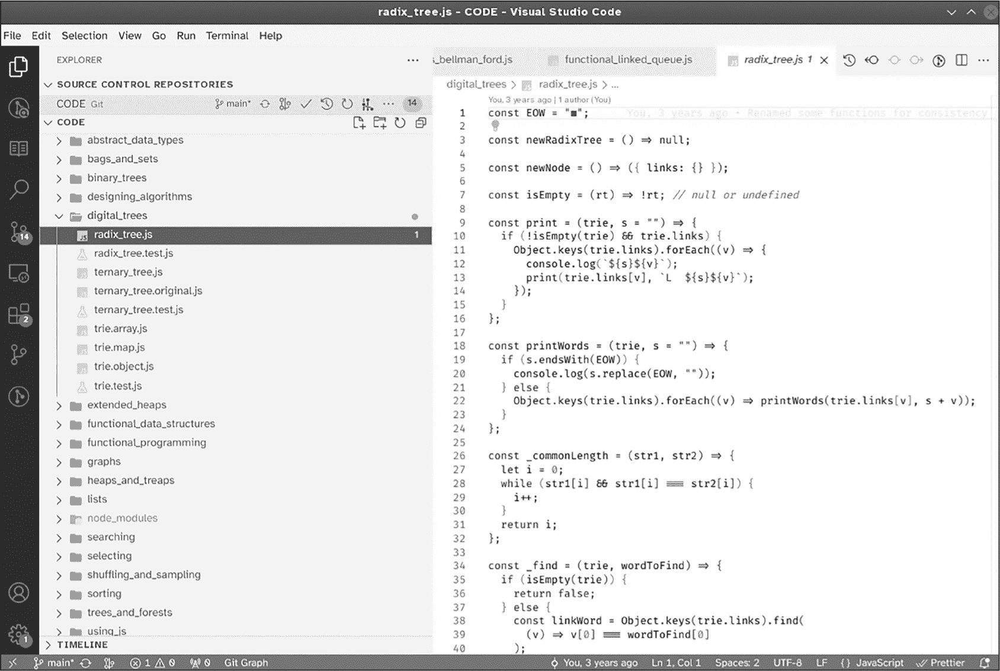
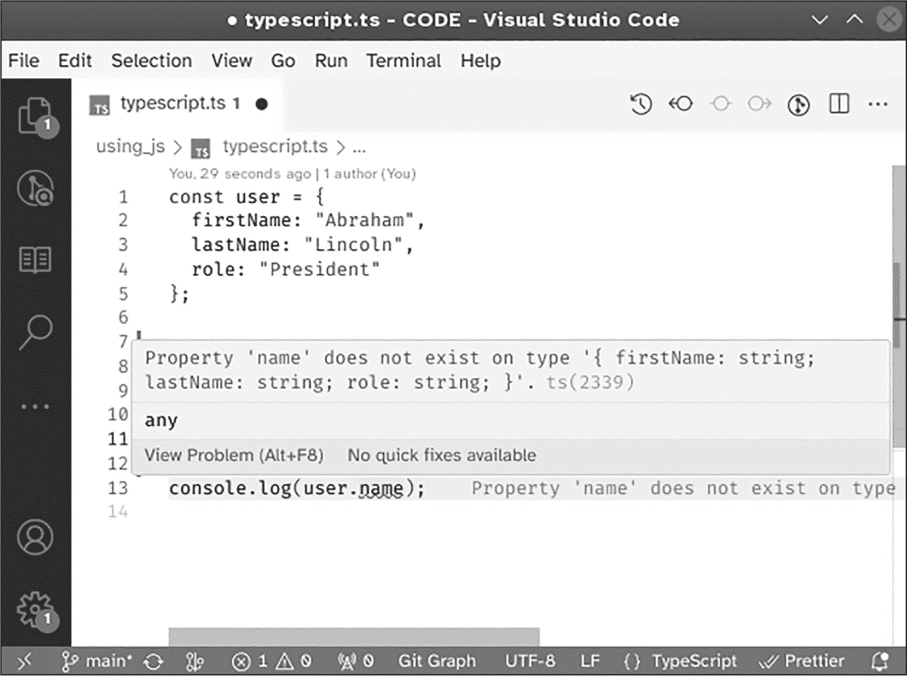
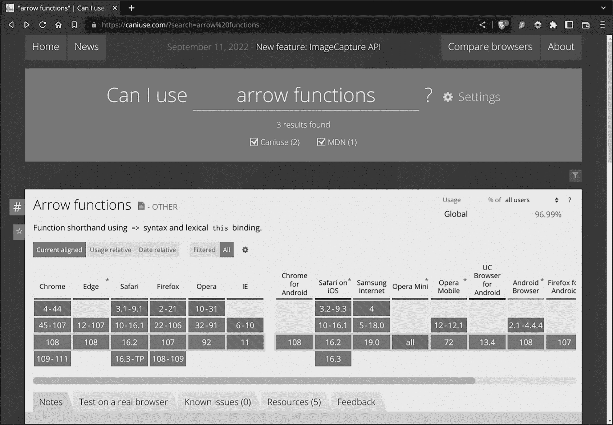

## 第一章：1 使用 JavaScript


自从 1995 年首次发布以来，JavaScript 已经发展并增加了许多重要功能。*类*的引入帮助了面向对象编程，使得你不再需要与复杂的原型打交道。*解构*和*扩展*运算符简化了对象和数组的操作，并且允许你一次管理多个赋值。*箭头函数*的引入使得你能够以更简洁、更具表现力的方式工作，增强了 JavaScript 的函数式编程能力。最后，*模块*的概念简化了代码组织，并允许你以逻辑的方式对代码进行分区和分组。本章简要探讨了这些特性

现代的语言特性帮助你编写更好、更简洁、更易理解的代码。

然而，JavaScript 语言并不是唯一发生变化的东西，本章还将介绍一些现在可用的工具，这些工具可以帮助你开发 JavaScript 代码。像 Visual Studio Code 这样的环境提供了更好的代码可读性。其他工具帮助生成文档化、格式良好的代码，而验证工具可以检测静态或与类型相关的错误。此外，许多在线工具存在，帮助解决浏览器和服务器之间的不兼容问题。

### 现代 JavaScript 特性

我们将从一些简化编码的现代 JavaScript 特性开始探索：箭头函数、类、扩展值、解构和模块。这个列表并不全面，我们将在后续章节中探讨其他特性，包括函数式编程、map/reduce 等数组方法、函数作为一等公民、递归等。我们当然无法覆盖语言的所有特性，但本书的重点是最重要的和较新的特性。

#### 箭头函数

JavaScript 提供了多种定义函数的方式，例如：

+   有名函数，这是最常见的：function alpha() {...}

+   无名函数表达式：const bravo = function () {...}

+   有名函数表达式：const charlie = function something() {...}

+   函数构造器：const delta = new Function()

+   箭头函数：const echo = () => {...}

所有这些定义的工作原理基本相同，但箭头函数——JavaScript 新的“成员”——有这些重要的区别：

+   它们即使不包含 return 语句，也可能返回一个值。

+   它们不能作为构造器或生成器使用。

+   它们不会绑定 this 值。

+   它们没有 arguments 对象或 prototype 属性。

特别是，前面列表中的第一个特性在本书中被广泛使用；能够省略 return 关键字将使代码更简短、更简洁。例如，在第十二章中，你将看到如下的函数：

```
const _getHeight = (tree) => (isEmpty(tree) ? 0 : tree.height);
```

给定一个树的参数，该函数在树为空时返回 0；否则，返回树对象的高度属性。

以下示例使用`return`，是一种等效的（但较长的）方式来编写相同的函数：

```
const _getHeight = (tree) => {
  return isEmpty(tree) ? 0 : tree.height;
};
```

较长的版本并不是必要的：简短的代码更好。

如果你使用简化版本并想要返回一个对象，你需要将其括在圆括号中。这里是第十二章中的另一个箭头函数示例：

```
const newNode = (key) => ({
  key,
  left: null,
  right: null,
  height: 1
});
```

给定一个键，该函数返回一个节点（实际上是一个对象），该节点以该键作为属性，并且左、右链接为 null，且高度属性设置为 1。

箭头函数的另一个常见特性是为缺失的参数提供默认值：

```
const print = (tree, **s = ""**) => {
  if (tree !== null) {
    console.log(s, tree.key);
    print(tree.left, `${s}  L:`);
    print(tree.right, `${s}  R:`);
  }
};
```

你将在第十二章中看到这段代码的作用，但有趣的是，如果递归函数没有提供`s`的值，它会将其初始化为空字符串。

#### 类

尽管在本书中我们不会大量使用类，但现代 JavaScript 已经远远超出了它的起点，现在，你不再需要处理原型和添加复杂代码来实现继承，而是可以轻松地实现继承。在过去，你可以使用类和子类、不同的构造函数等等，但实现继承并不容易。现在，JavaScript 类使这一切变得更加简单。（如果你想了解如何在旧式 JavaScript 中做继承，请参见*[`developer.mozilla.org/en-US/docs/Learn/JavaScript/Objects/Inheritance`](https://developer.mozilla.org/en-US/docs/Learn/JavaScript/Objects/Inheritance)*。）

看一下第十三章中的一个部分修改过的示例，展示了一个实际的类以及如何定义它：

```
❶ class Tree {
❷ _children = [];

❸ constructor(rootKey) {
    this._key = rootKey;
  }

  isEmpty() {
    return this._key === undefined;
  }

❹ get key() {
    this._throwIfEmpty();
    return this._key;
  }

❺ set key(v) {
    this._key = v;
  }
}
```

你可以定义一个简单的类，就像这里的情况❶，或者扩展一个现有的类。例如，你可以有另一个类`BinaryTree extends Tree`来基于`Tree`定义一个类。你可以在构造函数外部定义属性❷；你不必在构造函数内部定义它❸。如果需要更复杂的对象实例初始化，构造函数是可用的。

获取器❹和设置器❺是其他强大的功能。它们将对象的属性绑定到函数，这些函数在我们尝试修改或访问该属性时被调用。

本示例中未使用的其他功能是静态属性和方法；这些属性不是类实例的一部分，而是属于类本身。

> 注意

*从 ECMAScript 2022 开始，JavaScript 还包括* 私有 *属性：字段、方法、获取器、设置器等等。*

#### 扩展运算符

扩展运算符（...）允许你将数组、字符串或对象“*展开*”成单独的值，提供了一些有趣的数组和对象用法。

数组的应用如下所示：

```
const myArray = [3, 1, 4, 1, 5, 9, 2, 6];
❶ const arrayMax = Math.max(...myArray);
❷ const newArray = [...myArray];
```

输入`...myArray`与输入`3, 1, 4, 1, 5, 9, 2, 6`是一样的，所以这个例子中第一次使用`...myArray`产生了`9 ❶`，第二次则提供了一个具有与`myArray`完全相同元素的新数组 ❷。

你还可以使用展开运算符来构建对象的副本，然后可以独立地修改它：

```
const myObject = {last: "Darwin", year: 1809};
❶ const newObject = {...myObject, first: "Charles", year: 1882};
// same as: {last: "Darwin", first: "Charles", year: 1882};
```

在这种情况下，`newObject` ❶首先获得`myObject`的属性副本，然后`year`属性被覆盖。你也可以用“旧方法”通过多个单独的赋值来完成，但使用展开运算符可以让代码更简短、更清晰。

展开运算符的第三种用法是用于处理需要处理不确定数量参数的函数。早期版本的 JavaScript 使用`arguments`类数组对象来处理这种情况。`arguments`对象是“类数组的”，因为它唯一提供的数组属性是`.length`。`arguments`对象不包含数组的其他属性。

例如，你可以像这样编写你自己的 Math.max()版本：

```
const myMax = (...nums) => {
  let max = nums[0];
  for (let i = 1; i < nums.length; i++) {
    if (max < nums[i]) max = nums[i];
  }
  return max;
};
```

现在你可以像使用`Math.max()`一样使用`myMax()`，但没有必要重新发明这个函数。这个例子展示了如何模仿现有函数的功能——在这个例子中，即能够将多个参数传递给函数。

#### 解构赋值语句

*解构赋值*语句与展开运算符有关。它允许你同时为多个变量赋值，这意味着你可以将多个独立的赋值操作合并为一个，从而编写更简洁的代码。例如：

```
[first, last] = ["Abraham", "Lincoln"];
```

在这种情况下，你将`"Abraham"`赋值给第一个变量，将`"Lincoln"`赋值给最后一个变量。

你还可以混合使用解构赋值和展开运算符：

```
[first, last, . . .years] = ["Abraham", "Lincoln", 1809, 1865];
```

像前面的例子一样，将数组中的初始元素赋值给`first`和`last`，并将剩余的元素（这两个数字）赋值给`years`数组。这个组合让你能够更简洁地编写代码，用一个语句代替原本需要多个语句的情况。

此外，当左侧变量没有对应的右侧值时，你可以使用默认值：

```
let [first, last, role = "President", party] = ["Abraham", "Lincoln"];
```

在这个例子中，解构赋值语句为`role`指定了默认值，而`party`则保持未定义。

你还可以交换或旋转变量，这是本书后面常用的一种技巧。考虑以下第十四章中的代码：

```
[heap[p], heap[i]] = [heap[i], heap[p]];
```

这行代码直接交换了`heap[p]`和`heap[i]`的值，而无需使用辅助变量。你还可以像这样写`[d, e, f] = [e, f, d]`来旋转三个变量的值，同样无需更多的变量。

最后，我们经常使用的另一种模式是一次从函数返回两个或更多的值。例如，你可以编写一个函数来按顺序返回两个值：

```
const order2 = (a, b) => {
  if (a < b) {
    return [a, b];
  } else {
    return [b, a];
  }
};

let [smaller, bigger] = order2(22, 9); // smaller==9, bigger==22
```

另一种一次返回多个值的方法是使用对象。你仍然可以这样做，但返回一个数组并使用解构赋值更加简洁。

#### 模块

*模块* 允许您将代码拆分成可根据需要导入的部分，提供了一种更易于理解和维护的功能封装方式。每个模块应是相关函数和类的集合，提供一组功能。使用模块的标准做法之一是 *高内聚性*，即将相关的元素放在一起，而不相关的功能不应混合在同一个模块中。一个相关的概念叫做 *低耦合*，意味着不同模块之间的依赖关系应尽可能少。JavaScript 允许您将函数封装在模块中，从而提供结构良好的设计，具有更好的可读性和可维护性。

模块有两种格式：*CommonJS 模块*（一种较早的格式，主要用于 Node.js）和 *ECMAScript 模块*（最新的格式，通常由浏览器使用）。

##### CommonJS 模块

使用 CommonJS 模块时，请按照 第十六章 中的（简化）示例编写代码：

```
// file: radix_tree.js – in CommonJS style

❶ const EOW = "■";
const newRadixTree = () => null;
❷ const newNode = () => ({links: {}});
const isEmpty = (rt) => !rt; // null or undefined
const print = (trie, s = "") => {...}
const printWords = (trie, s = "") => {...}
const find = (trie, wordToFind) => {...}
const add = (trie, wordToAdd, dataToAdd) => {...}
const remove = (trie, wordToRemove) => {...}

❸ module.exports = {
  add,
  find,
  isEmpty,
  newRadixTree,
  print,
  printWords,
  remove
};
```

最后的 module.exports 赋值 ❸ 定义了模块外部可见的部分；任何不包含的部分 ❶ ❷ 将无法被系统的其他部分访问。这种编写代码的方式与 *黑箱* 软件概念高度一致。模块的使用者不需要了解其内部细节，从而可以实现更高的可维护性。只要模块保持相同的功能，开发者可以自由地重构或改进模块，而不会影响任何使用者。

如果您想导入模块导出的两个函数，例如，您可以使用以下代码风格，它采用解构赋值来指定您需要的内容：

```
const {newRadixTree, add} = require("radix_tree.js");
```

这使得可以通过解构赋值访问 radix_tree 模块导出的所有函数中的 newRadixTree() 和 add() 函数。如果您想向 Radix 树中添加内容，可以直接调用 add()；同样，您可以调用 newRadixTree() 来创建一棵新树。

当然，您也可以这样做：

```
const RadixTree = require("radix_tree.js");
```

若要向树中添加内容或创建新树，您必须分别调用 RadixTree.add() 和 RadixTree.newRadixTree()。这种用法虽然导致代码更长，但也让您能够访问 radix_tree 模块中的所有功能。我更喜欢采用第一种解构赋值的风格，因为它明确了我正在使用的内容，但最终选择还是由您决定。

##### ECMAScript 模块

更现代的 ECMAScript 模块定义风格也支持独立文件，但您需要将上一节中的模块重写为以下格式，而不是创建一个 module.exports 对象：

```
// file: radix_tree.js – in modern style

const EOW = "■";
❶ **export** const newRadixTree = () => null;
const newNode = () => ({links: {}});
❷ **export** const isEmpty = (rt) => !rt; // null or undefined
const print = (trie, s = "") => {...}
const printWords = (trie, s = "") => {...}
const find = (trie, wordToFind) => {...}
const add = (trie, wordToAdd, dataToAdd) => {...}
const remove = (trie, wordToRemove) => {...}

❸ export {
  add,
  find,
  print,
  printWords,
  remove
};
```

您可以在定义的地方直接导出某些内容 ❶ ❷，也可以推迟到最后 ❸ 才进行导出。两种方法都可以（我认为没有人会像我在这个例子中那样同时使用*两种*风格），但大多数人更喜欢将所有导出语句集中放在最后。最终选择还是由您决定。

> 注意

*你也可以在 Node.js 中使用 ECMAScript* 的 import *和* export *语句，但前提是你使用 .mjs 扩展名，而不是保留给 CommonJS 模块的 .js 扩展名。*

你可以通过以下方式从 ECMAScript 模块导入函数，这与 CommonJS 模块的使用方法不同，尽管最终结果是完全一样的：

```
import {newRadixTree, add} from "radix_tree.js";
```

如果你想导入所有内容，可以使用以下代码；这将让你访问一个对象，包括该模块导出的所有函数，就像之前一样：

```
import * as RadixTree from "radix_tree.js";
```

到目前为止你看到的所有导出都是*命名*导出；你可以有任意多个这样的导出，也可以有一个未命名的默认导出。在给定文件中，你不需要像之前描述的那样定义你想要导出的内容，而是包含类似这样的内容：

```
// file: my_module.js
export default something = ... // whatever you want to export
```

然后，在代码的其他部分，你可以按照以下方式导入某些内容：

```
import whatever from "my_module.js";
```

你可以将导入的内容命名为你喜欢的任何名字（虽然“whatever”并不是一个好名字），而不是使用模块创建者预定的名称。虽然这不是常见的做法，但有时当使用不同作者的模块时，会出现名称冲突。

#### 闭包和立即调用的函数表达式

闭包和立即调用的函数表达式其实并不新鲜，但理解它们在本书中的示例中会非常有用。*闭包* 是函数和它所能访问的作用域的结合。它允许你拥有私有变量，从而允许你创建类似类和模块的东西。例如，考虑以下函数：

```
function createPerson(firstN, lastN) {
  let first = firstN;
  let last = lastN;
  return {
    getFirst: function () {
      return first;
    },

    getLast: function () {
      return last;
    },

    fullName: function () {
      return first + " " + last;
    },

    setName: function (firstN, lastN) {
      first = firstN;
      last = lastN;
    }
  };
}
```

返回的值（一个对象）将能够访问函数作用域中的 first 和 last 变量。例如，考虑以下情况：

```
const me = createPerson("Federico", "Kereki");
console.log(me.getFirst()); // Federico
console.log(me.getLast());  // Kereki
console.log(me.fullName()); // Federico Kereki

me.setName("John", "Doe");
console.log(me.fullName()); // John Doe
```

这些变量在其他地方是不可访问的。如果你尝试访问 me.first 或 me.last，你将得到 undefined。这些变量在闭包中，但无法访问，因为它们作为私有值存在。

使用闭包还允许你模拟模块。为此，你需要一个*立即调用的函数表达式（IIFE）*，读作 “iffy”，它是在定义后立即执行的函数。

假设你想要一个处理税收的模块。如果不使用新模块，你可以像使用 createPerson(...) 函数一样操作：

```
const tax = (function (basicTax) {
  let vat = basicTax;
  /*
    ...many more tax-related variables
  */
  return {
    setVat: function (newVat) {
      vat = newVat;
    },
    getVat: function () {
      return vat;
    },
    addVat: function (value) {
      return value * (1 + vat / 100);
    }
    /*
      ...many more tax-related functions
    */
  };
})(6);
```

你创建一个（没有名字的）函数并立即调用它，结果就像一个模块。你可以将初始值传递给 IIFE，例如默认的增值税（VAT）为 6%。vat 变量和你可能声明的其他变量是内部的，无法直接访问。不过，提供的函数，如 addVat(...) 和你可能需要的其他函数，可以与所有内部变量一起工作。

按照以下方式使用基于 IIFE 的模块：

```
console.log(tax.getVat());    // 6: the initial default
tax.setVat(8);
console.log(tax.getVat());    // 8
console.log(tax.addVat(200)); // 216
```

模块可以提供相同的基本功能，但你会看到一些场景，其中你会想使用闭包和 IIFE——例如，在第五章中讨论的记忆化和预计算数组值的场景。

### JavaScript 开发工具

让我们把注意力转向一些工具，帮助你编写更美观的代码，检查常见缺陷等。这些工具在本书中并不会全部使用，但它们是非常有用的，通常是我每次开始一个新项目时都会安装的工具。

#### Visual Studio Code

集成开发环境（IDE）将帮助你更快速、轻松地编写代码。本书使用的是 Visual Studio Code（VSC）IDE。其他流行的 IDE 包括 Atom、Eclipse、Microsoft Visual Studio、NetBeans、Sublime 和 Webstorm，你也可以使用这些工具。

为什么要使用 IDE？尽管像 Notepad 或 vi 这样的简单文本编辑器可能已经足够，但像 VSC 这样的 IDE 提供了更多功能。使用文本编辑器时，你需要自己做更多工作，不断地在工具间切换，反复输入命令。使用 VSC（或任何 IDE）可以节省时间，让你能够以集成的方式工作，一键访问多个工具。

VSC 是开源的、免费的，并且每月更新，频繁添加新功能。你可以用它来编写 JavaScript 以及其他许多语言的代码。前端开发者使用 VSC 来进行 HTML、CSS、JSON 等的基本配置和识别（“IntelliSense”）。你还可以通过广泛的扩展目录来扩展其功能。

> 注意

*Visual Studio Code，尽管名字相似，但与微软的另一个 IDE——Visual Studio 无关。你可以在 Windows、Linux 和 macOS 上使用 Visual Studio Code，因为它是用 JavaScript 开发的，并通过 Electron 框架打包成桌面应用。*

VSC 还提供了良好的性能、集成调试、集成终端（可以启动进程或运行命令而无需离开 VSC）以及与源代码管理（通常是 Git）的集成。图 1-1 显示了我在 VSC 中的部分工作内容，包含本书的代码。



图 1-1：使用 Visual Studio Code

访问 *[`code.visualstudio.com`](https://code.visualstudio.com)* 下载适合你环境的版本，并按照安装说明进行安装。如果你喜欢尝试新功能，可以安装 Insiders 版本，享受最新特性，但要注意可能会遇到一些 bugs。对于某些 Linux 发行版，你可以通过包管理器处理安装和更新，而无需手动下载和安装。

#### Fira Code 字体

引发开发者激烈争论的一种快速方法是提到某种字体是最适合编程的字体。市面上有数十种单间距编程字体，但很少有包含 *连字* 的字体，连字是指将两个或多个字符组合在一起。JavaScript 代码是连字的理想候选者，否则你需要将常见符号（如 ≥ 或 ≠）输入为两个或三个独立的字符，这看起来就不那么美观了。

> 注意

*& 字符最初是 E 和 t 的连字，拼写为 et，表示拉丁语中的“和”。英语中另一个连字是* æ *(如* encyclopædia *或* Cæsar*)，将字母 a 和 e 结合在一起。许多其他语言也包括连字；德语将两个 s 字符组合在一起形成* ß*，如在* Fußball *(足球)中。*

Fira Code 字体 (*[`github.com/tonsky/FiraCode`](https://github.com/tonsky/FiraCode)*) 提供了许多连字，并增强了代码的显示效果。图 1-2 展示了 JavaScript 的所有可能连字。Fira Code 也包括其他语言的连字。


图 1-2：Fira Code 字体提供的众多连字样本（摘自 Fira Code 网站）

下载并安装字体后，如果你使用 Visual Studio Code，按照 *[`github.com/tonsky/FiraCode/wiki/VS-Code-Instructions`](https://github.com/tonsky/FiraCode/wiki/VS-Code-Instructions)* 上的说明将字体集成到 IDE 中。

#### Prettier 格式化

如何格式化源代码可能是另一个争论的源头。你与之合作的每个开发人员可能都会对这个问题有自己的看法，声称他们的标准最好。如果你与一个开发者团队合作，你可能会熟悉“标准如何蔓延”这幅 xkcd 漫画所展示的情况（图 1-3）。


图 1-3：“标准如何蔓延”（感谢 xkcd 提供，[`xkcd.com/927`](https://xkcd.com/927)）

Prettier 是一个“有观点”的源代码格式化工具，按照自己的一套规则和一些可以设置的参数来重新格式化代码。Prettier 的网站声明，“采用 Prettier 的最大原因是停止所有关于风格的持续争论。” 本书中的所有源代码示例都使用 Prettier 格式化。

安装 Prettier 非常简单；按照 *[`prettier.io`](https://prettier.io)* 上的说明进行操作。如果你使用 Visual Studio Code，还需要从 *[`marketplace.visualstudio.com/items?itemName=esbenp.prettier-vscode`](https://marketplace.visualstudio.com/items?itemName=esbenp.prettier-vscode)* 安装 Prettier 插件。确保调整 VSC 的设置，启用 editor.formatOnSave 选项，这样所有代码在保存时都会被重新格式化。请查阅 Prettier 网站上的文档，了解如何根据个人喜好配置 Prettier。

#### JSDoc 文档

为源代码编写文档是开发的最佳实践。JSDoc (*[`jsdoc.app`](https://jsdoc.app)*) 是一个帮助你通过聚合特定格式的注释生成代码文档的工具。如果你在函数、方法、类等前添加注释，JSDoc 将使用这些注释生成文档。我们在本书中不使用 JSDoc，因为文本已经解释了代码。然而，对于日常工作，使用 JSDoc 可以帮助开发者理解系统的各个部分。

这是一个代码片段，它从 第十四章 向堆中添加一个键，以展示 JSDoc 如何生成文档：

```
/**
 * Add a new key to a heap.
 *
 * @author F.Kereki
 * @version 1.0
 * @param {pointer} heap – Heap to which the key is added
 * @param {string} keyToAdd – Key to be added
 * @return Updated heap
 */
const add = (heap, keyToAdd) => {
  heap.push(keyToAdd);
  _bubbleUp(heap, heap.length – 1);
  return heap;
};
```

JSDoc 注释以 /** 组合符号开头，类似于常规注释格式，但多了一个星号。@author、@version、@param 和 @return 标签描述了代码的特定信息；这些名称不言自明。你还可以使用的其他标签包括 @class、@constructor、@deprecated、@exports、@property 和 @throws（或 @exception）。查看 *[`jsdoc.app/index.html`](https://jsdoc.app/index.html)* 获取完整列表。

根据 *[`github.com/jsdoc/jsdoc`](https://github.com/jsdoc/jsdoc)* 中的说明安装 JSDoc 后，我处理了这个示例文件，生成了 图 1-4 所示的结果。


图 1-4：由 JSDoc 自动生成的示例文档网页

当然，这是一个只有一个文件的简单示例。对于完整的系统，你将得到一个首页，首页上有指向每个文档页面的链接。

#### ESLint

JavaScript 存在许多滥用和误解的可能性。考虑这个简单的例子：如果你使用 == 运算符而不是 ===，你可能会发现 x==y 且 y==z，但 x!=z，无论传递法则如何（尝试 x=[]，y=0 和 z="0"）。另一个棘手的情况是，如果你不小心输入 (x=y) 而不是 (x==y)，那将是一个赋值而不是比较；这种情况不太可能是你想要的。

*Linter* 是一种分析代码并生成关于你可能使用的任何可疑或易出错特性的警告或错误信息的工具。在某些情况下，Linter 甚至可以正确地修复你的代码。你还可以将 Linter 与源代码版本控制工具结合使用。Linter 可以防止你提交未通过所有检查的代码。如果你使用 Git，请访问 *[`git-scm.com/book/en/v2/Customizing-Git-Git-Hooks`](https://git-scm.com/book/en/v2/Customizing-Git-Git-Hooks)* 阅读有关预提交钩子的内容。

ESLint 在 JavaScript 中进行代码检查非常有效。它创建于 2013 年，并且至今仍然非常活跃。访问 *[`www.npmjs.com/package/eslint`](https://www.npmjs.com/package/eslint)* 下载并安装，然后进行配置。请务必仔细阅读 *[`eslint.org/docs/rules/`](https://eslint.org/docs/rules/)* 上的规则，因为你可以设置许多不同的规则，但除非你想引发一些代码检查冲突，否则不应全部启用。

最后，不要忘记在 *[`marketplace.visualstudio.com/items?itemName=dbaeumer.vscode-eslint`](https://marketplace.visualstudio.com/items?itemName=dbaeumer.vscode-eslint)* 获取 VSC 扩展，这样你就可以看到 ESLint 检测到的任何错误。

> 注意

*使用 ESLint，* eqeqeq *规则（见* [`eslint.org/docs/rules/eqeqeq`](https://eslint.org/docs/rules/eqeqeq)*) 会检测到类型不安全的* == *运算符的问题，并且会通过替换成* === *来自动修复。此外，* no-cond-assign *规则会对意外的赋值进行警告。*

#### Flow 和 TypeScript

对于大规模编码，考虑使用 Flow 和 TypeScript，这些工具允许你为 JavaScript 添加数据类型信息。Flow 添加了描述函数输入和输出、变量等期望数据类型的注释。而 TypeScript 实际上是 JavaScript 的超集，它会被转译成 JavaScript。

图 1-5（毫不羞耻地借鉴了 TypeScript 首页上的例子）展示了你可以通过类型信息检测到的错误类型。



图 1-5：ESLint 实时捕获的 TypeScript 代码中的类型错误

在这个例子中，我尝试访问一个不存在的属性（user.name），这是根据之前代码行推导出的类型数据得出的。（注意，我使用了 ESLint，这就是为什么我能实时看到错误。）

本书中我们不会使用这两个工具，但对于涉及大量类、方法、函数、类型等的大型项目，考虑将它们加入到你的工具库中。

#### 在线功能可用性资源

如果你正在使用最新版本的 Node.js 进行服务器端开发，你可能不需要担心某些特定功能的可用性。然而，如果你在做前端开发，某些功能可能不可用，例如对 Internet Explorer 的支持。如果发生这种情况，你需要使用像 Babel 这样的工具进行转译，正如本章之前所提到的。

Kangax 网站 (*[`compat-table.github.io/compat-table/es2016plus/`](https://compat-table.github.io/compat-table/es2016plus/)*) 提供了多个平台的信息，详细说明一个功能是完全可用、部分可用，还是不可用。Kangax 列出了所有 JavaScript 语言功能，并为每个功能提供了示例。你还可以在网站上找到一张表格，展示每个不同 JavaScript 引擎所支持的功能，如浏览器和 Node.js 上的功能。一般来说，当你使用浏览器打开时，绿色的“是”框表示你可以安全使用该功能；不同颜色或文本的框表示该功能部分可用或不可用。

*Can I Use?* 网站在 *[`www.caniuse.com/`](https://www.caniuse.com/)* 上可以让你按功能进行搜索，并展示不同浏览器中可用的支持情况。例如，如果你搜索箭头函数，网站会告诉你哪些浏览器支持它，支持的日期以及全球直接访问该功能的用户百分比，且无需补丁或转译。

> 注意

*如果你对“polyfill”这一术语不太清楚，请参阅 Remy Sharp（这一概念的创造者）写的* [`remysharp.com/2010/10/08/what-is-a-polyfill`](https://remysharp.com/2010/10/08/what-is-a-polyfill) *文章。Polyfill 是一种“如果浏览器没有原生支持某个 API，就复制该 API”的方法。MDN 网站通常为新功能提供 polyfill，这对于需要处理不支持这些功能的旧版浏览器，或需要了解某些功能如何工作的情况非常有帮助。*

图 1-6 显示了箭头函数在不同浏览器中的可用性信息；通过鼠标悬停可以查看更多数据，比如该功能首次可用的时间。



图 1-6：Can I Use? 网站展示了某个功能是否在浏览器中可用。

Can I Use? 网站仅提供有关浏览器的信息；它不包括像 Node.js 这样的服务器端工具，但你可能在某些时候需要它。

### 总结

本章中，我们回顾了 JavaScript 一些新颖且重要的现代功能，包括展开运算符、解构、箭头函数、类和模块。我们还考虑了一些你可能想在开发工作中使用的额外工具，如 VSC IDE、用于更整洁屏幕显示的 Fira Code 字体、用于源代码格式化的 Prettier、用于生成文档的 JSDoc、用于检查缺陷或不良实践的 ESLint，以及用于添加数据类型检查的 Flow 或 TypeScript。最后，为了确保你不使用不可用的功能，我们介绍了两个在线资源：Kangax 和 Can I Use?，它们将帮助你避免使用未实现或仅部分实现的 JavaScript 特性。

在下一章，我们将深入探讨 JavaScript，并探索其函数式编程方面的内容，为本书其余部分的示例提供起点。
