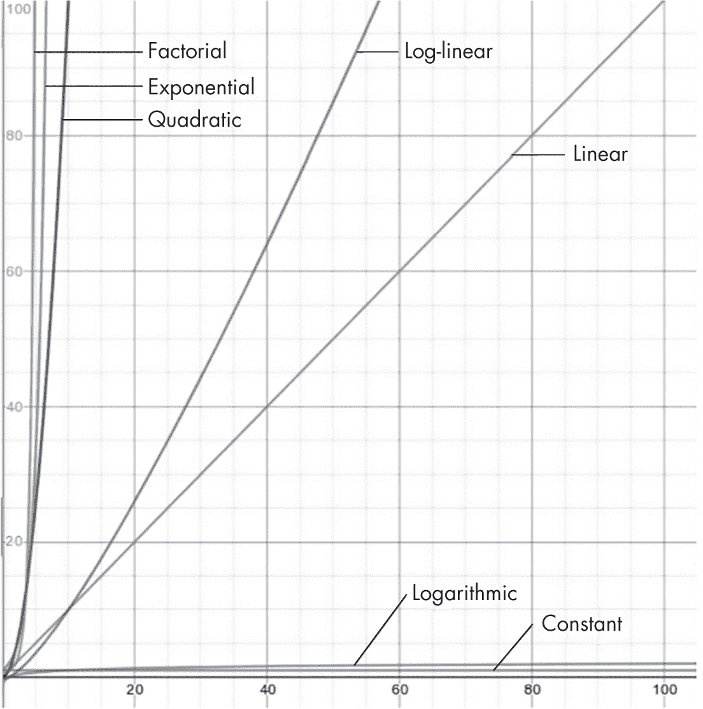
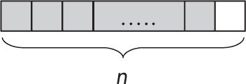
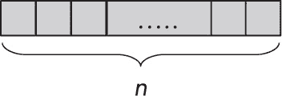
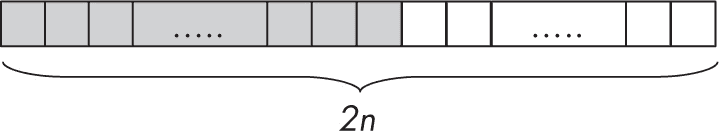

<hgroup>

## 4 分析算法

</hgroup>


在上一章中，我们讨论了抽象数据类型，在本书的后续章节中，我们将考虑更多的替代实现和算法。在面对多种实现同一抽象数据类型的方式时，需要考虑每种具体实现的效率，这就需要分析相关的算法。我们将在本章中学习这种分析的基础知识，帮助我们做出更好的决策。你应该选择什么数据结构？你应该实现什么算法？客观地了解如何分析它们的性能将得出正确的答案。

### 性能

在衡量给定算法的效率时，关键是考虑算法所需的资源（例如时间或随机存取内存 [RAM]），然后根据所需的资源量比较不同的算法。（这种方法对小问题并不适用。例如，如果你有一个只有十几个键的字典，无论它是如何结构化的，或者你应用了什么算法进行搜索，结果都会很快。）

我们总是希望最小化资源的使用（更快的处理时间，更少的内存需求），但我们无法直接将时间复杂度（速度）与空间复杂度（内存）进行比较。通常，性能更快的算法需要更大的内存，反之亦然；更小、更简单的结构可能意味着更慢的算法。（你将在本章稍后看到一个例子。）然而，如果一个算法需要的时间过长，或者需要的内存超出了可用内存，那么这些考虑就变得无关紧要了。

在本书中的所有例子中，我们会看到算法的空间复杂度相对稳定。它与输入元素的数量成正比增长，因此可能没有理由选择一个算法而不是另一个。另一方面，我们将看到时间复杂度会产生许多变化，为选择使用哪种数据结构以及实现哪种算法提供了坚实的基础。

因此，每当本书提到任何给定算法的复杂度时，它总是指时间复杂度，或者说算法在与输入数据大小相关的情况下执行其功能所花费的时间。

### 复杂度

所有数据结构总是有某些基本参数，所有算法的效率都依赖于这些参数。例如，如果你在字典中进行查找，字典中的键的数量可能会影响查找速度；更多的键意味着更多的时间。如果排序一组值，更多的值意味着排序速度会变慢；例如，对五张扑克牌进行排序可以非常快速，但对一副 52 张牌进行排序就需要更长时间。在所有情况下，我们将这个输入参数称为*n*，你会把算法的时间复杂度表示为该输入的函数；这就是*算法分析*。当该函数的值较小或至少相对于输入大小的增长较慢时，算法会更高效。

在某些情况下，算法的性能可能与数据本身直接相关；例如，排序一个几乎有序的序列可能比排序一个完全无序的随机序列要快。这意味着我们需要考虑最佳情况、最坏情况以及平均性能。如果没有特别说明，我们将关注算法复杂度的上界，因此在本书中，除非另有说明，我们将着重讨论最坏情况复杂度。

通常，我们不会尝试（或无法）获得复杂度函数的精确表达式。我们会将它与常见的数学函数进行比较，例如*n*、*n*²或*n* log *n*，并考虑算法属于哪个类别，以便在同等基础上进行比较。属于同一类别的算法不一定在速度上完全相同，但粗略来说，所有同类算法在处理更大输入时将以相同的速率增长，并保持相同的相对关系。换句话说，一个比其他算法快 10 倍的算法很可能一直保持这样的速度；它不会变成比其他同类算法快 100 倍或慢一半。

#### 复杂度符号

为了表达给定函数在其参数增长时的表现，我们使用一组被称为*渐近符号*的符号。这个符号家族包括五种不同的符号，其中最常用的是*大 O*符号。*O*代表“阶”——或者更准确地说，是德语中的*Ordnung*一词。（稍后你会看到其他四种符号。）

大*O*符号根据它们的*n*参数增长时的表现来对函数进行分组。根据我们研究的算法或数据结构的不同，*n*可以是需要排序的值的数量、要搜索的集合的大小，或者添加到树中的键的数量。在讨论性能时，具体情况会逐一说明。

用大*O*符号描述一个函数的行为意味着该函数增长的上界。简而言之，如果一个函数*f(n)*的行为是*O(g(n))*, 那意味着当*n*增长时，两个函数的增长速度成正比。（完全定义还表明，这种关系不一定适用于所有*n*值，而只适用于足够大的值。对于小的*n*值，这个关系可能不成立。）换句话说，若说一个给定算法的行为是*O(某函数)*，这就意味着在更大的*n*值下所需的时间增长趋势已经可以得出。

让我们回到五种符号（表 4-1）。

表 4-1：五种渐近符号

| 符号 | 名称 | 描述 |
| --- | --- | --- |
| f(n) = o(g(n)) | 小 o | g(n)的增长速度远远快于 f(n)；g(n)的增长速度严格大于 f(n)。 |
| f(n) = O(g(n)) | 大 O | g(n)是 f(n)的上界；g(n)的增长速度大于或等于 f(n)。 |
| f(n) = Θ(g(n)) | 大Θ | g(n)是 f(n)的上下界；g(n)和 f(n)以相同的速度增长。 |
| f(n) = Ω(g(n)) | 大Ω | g(n)是 f(n)的下界；g(n)的增长速度小于或等于 f(n)。 |
| f(n) = ω(g(n)) | 小ω | g(n)的增长速度远远慢于 f(n)；g(n)的增长速度严格小于 f(n)。 |

我们主要使用大*O*符号，其它符号是为了完整性而列出。大Θ比大*O*更精确，后者实际上是一个界限，但目标是找到一个既接近又不会与原始函数行为差异过大的界限。精确地表达任何算法的行为是相当复杂的（并且仍有许多算法的精确阶数尚未得知），因此使用阶数是合适的。例如，如果你的个人债务是几美元或几百万美元，实际的数字并不重要，知道在前一种情况下你做得很好，而在后一种情况下你陷入了严重麻烦就足够了。

> 注释

*著名计算机科学家、《计算机程序设计艺术》一书的作者、算法分析专家**唐纳德·克努斯**曾建议将大 O 表示为大欧米伽（omicron），它是另一个与大写 O 形状相同的希腊字母，但这个提议未能成功实施。详情请见* [`danluu.com/knuth-big-o.pdf`](https://danluu.com/knuth-big-o.pdf) *。*

另一种（粗略的）解释是，大 *O* 符号代表最坏情况，而大欧米伽符号代表最佳情况，或者某个算法可能需要的最短时间。从这个意义上讲，大 Θ 表示一个稳定表现的算法，因为最坏情况和最佳情况的增长速度相同。根据这种解释，小 *o* 符号表示一个更差的上限，而小欧米伽则表示一个更差的下限，即实际表现远离这两个边界，并且增长速度截然不同。

#### 复杂度类别

我们通常发现算法只涉及几个常见的复杂度顺序。表 4-2 展示了本章中会用到的顺序。

表 4-2：常见的复杂度顺序

| 顺序 | 名称 | 示例 |
| --- | --- | --- |
| O(1) | 常数级 | 访问列表中的第一个元素和弹出栈顶元素（见第十章） |
| O(log n) | 对数级 | 使用二分查找在有序数组中查找元素（见第九章）和二叉树的平均高度（见第十二章） |
| O(n) | 线性级 | 在无序数组中查找元素（见第九章）和树的中序遍历（见第十二章） |
| O(n log n) | 对数线性 | 使用堆排序排序数组和快速排序的平均行为（见第六章） |
| O(n²) | 二次方 | 使用冒泡排序排序数组和快速排序的最坏情况（见第六章） |
| O(kn) | 指数级 | 测试一个二进制公式是否是重言式（k = 2）和斐波那契数列的朴素实现（k = 1.618） |
| O(n!) | 阶乘 | 寻找最优旅行商问题解和通过随机排列排序（见第六章） |

最后两个顺序的算法非常慢，实际上你在实际中不会使用它们；它们的时间复杂度增长得太快，无法使用。

图 4-1 是一个简单的图表，展示了表 4-2 中七个函数的行为。显然，*O*(log *n*) 算法要优于 *O*(*n*²) 算法。



图 4-1：此图表（使用 Desmos 绘制，[`www.desmos.com/calculator`](https://www.desmos.com/calculator)）展示了表 4-2 中的七个函数。

图表底部的前两个顺序（常数和对数）表现得非常好。当考虑线性（从左下角到右上角的对角线）和对数线性顺序（最接近对角线的曲线）时，增长开始变得重要。下一个顺序，二次方，在 *x* = 10 时超出图表范围，值为 *x*² = 100。最后，指数和阶乘级别的增长甚至更为严重，它们的增长使得这些算法无法使用。

你可以通过回答一个简单的问题来以另一种方式看待这种行为：如果输入大小是原来的 10 倍，给定的算法会怎样？如果算法是*O*(1)，那么所需时间将保持不变，不会增长。如果是*O*(log *n*)算法，所需时间会增长，但增长量是固定的。一个*O*(*n*)算法的时间将（几乎）乘以 10，而一个*O*(*n*²)算法的时间将大约是 100 倍。一个*O*(*n* log *n*)算法则介于两者之间。差异很明显，但请注意，未来参考时，它更接近于*O*(*n*)。

上一段的结果也是为什么使用*O*(*n*)而不是*O*(9*n*)或*O*(22*n*)的原因。这三种算法之间的比率是恒定的，因此如果*n*增长，它们会以相同的速度增长。另一方面，*O*(*n*²)算法会增长得更快，它真的属于一个独立的类别。在比较类别时，常数值没有意义：即使加入某个常数因子，如果*n*足够大，*O*(*n*²)也总是比*O*(*n*)算法增长得更快（并且变得更大）。

#### 性能测量

在衡量一个算法的性能时，最佳情况性能是算法在理想条件下的表现；例如，在前一节中我们提到过进行搜索并在数组的第一个位置找到所需的元素。你不能总是假设你会得到这种最优表现，但它是用来比较其他表现的基准。

补充情况是*最坏情况*性能，意味着你尝试衡量一个算法在最慢的可能情况下的表现。例如，在本书的后面，我们将看到一些通常具有*O*(*n* log *n*)性能的算法，对于特定的输入数据顺序，可能会退化为*O*(*n*²*)性能。最坏情况分析很重要，因为你应该总是假设这种可能性会发生；它是最安全（但也是最悲观的）分析。

第三种可能性是*平均情况*性能，意味着确定一个算法在典型或随机输入下的表现。在第六章中，你将看到快速排序的平均性能是*O*(*n* log *n*)，尽管在某些情况下性能会更差。

第四种可能性是摊销时间。一些算法通常需要较短的时间来执行，但周期性地需要更多的时间。如果你只看一个单独的操作，结果可能不好，但如果你考虑在一长系列操作中的平均表现，你可能会发现，总体上，摊销时间比最坏情况要好得多，让你能够预测一系列操作的结果。

让我们考虑一个简单的示例：向固定大小的数组添加元素。如果每次你要添加一个新元素时都需要将当前数组复制到一个新的（且更长的）数组中，那么每次添加的成本将是 *O*(*n*)。然而，如果数组已满，一种替代策略是将其复制到一个新的双倍大小的数组中，腾出空位等待将来插入。

让我们看看这个策略是如何运作的。假设有一个几乎被填满的数组（灰色单元），在末尾只有一个空位（白色单元），如图 4-2 所示。



图 4-2：一个只有一个空位的数组

当添加一个新元素时（这是一个 *O*(1) 操作，具有常数时间复杂度），数组已满，但你还不需要担心（见图 4-3）。



图 4-3：现在数组已满。

然而，如果你需要添加另一个元素，但没有空位，那么你将数组复制到一个新的双倍大小的数组中，然后添加新值，如图 4-4 所示。



图 4-4：一个新的双倍大小的数组为新值和更多空间提供了位置。

在这个过程中，这是一个 *O*(*n*) 操作，你现在有 *n* 个空闲单元，可以放心，因为接下来的插入不需要复制，时间复杂度是 *O*(1)。下次数组满时，过程将会重复：一次长时间的复制，接着是许多快速的添加。通过对多个插入的成本进行平均，代价较高（不频繁）的复制操作将通过代价低廉（频繁）的简单添加操作得到补偿，从而摊销后的性能为 *O*(1)。

> 注意

*接下来的部分数学性较强，如果你愿意，可以跳过演示，只研究结果。书中的其他部分不会涉及这么多数学内容。本节的目的是让你体验完整、正式的证明是怎样的。*

#### 实际算法分析

让我们考虑一个实际的排序示例。假设你要在一个长度为 *n* 的有序数组中查找给定的键。最坏情况是线性查找，依次遍历整个数组（因为你还没学到后面书中描述的更好的算法），结果没有找到该键。在这种情况下，线性查找的时间复杂度为 *O*(*n*)，因为你必须遍历整个数组： *n* 步和 *n* 次（失败的）测试。最好的情况是在第一次尝试时就找到了你想要的键：Ω(1)。

计算平均值需要一点代数。你需要考虑所有的情况：你可能会在第一个位置、第二个位置，依此类推，一直到第 *n* 个位置，这意味着一共有 *n* 种可能性。平均而言，你必须测试 (1 + 2 + ... + *n*)/*n* 个元素。从 1 到 *n* 的数的和等于 *n*(*n* + 1)/2，所以最终的平均值是 (*n* + 1)/2。这个表达式显然与 *n* 成正比，因此该算法的平均行为确实是 *O*(*n*)。如果你必须考虑使用这个算法，你会以 *O*(*n*) 来思考，假设最坏情况；指望最好的情况是不现实的。

> 注意

*还有一种看待这个计算的方法。搜索可能在第一个元素成功，也可能一直搜索到第 *n* 个元素；平均而言，搜索步骤是 (n + 1)/2。或者，搜索可能在第二个元素或第 (n – 1) 个元素成功；同样，平均也是 (n + 1)/2。对于第三、第四和后续元素也适用相同的推理。对于每一种搜索在少数步骤内完成的情况，都有一个对应的情况将平均步骤数推高到 (n + 1)/2。由于每种情况下的平均值相同，你可以得出结论那就是最终结果。这样你就得出了相同的结果，只是少了些代数推导，但却多了一些“手势解释”。*

让我们讨论另一种搜索有序数组的方法，二分查找，你将在第九章中看到。与其从数组的开始遍历所有元素，不如从数组的*中间*开始。如果你找到了你要的元素，搜索结束。如果没有，你可以丢弃数组的一半（如果你想要的元素小于中间元素，你知道它不可能在数组的较大部分中），然后在另一部分递归地进行搜索。你通过选择新的部分的中间元素进行比较，依此类推。

考虑一个包含数字 4、9、12、22、34、56 和 60 的数组。如果你想检查 12 是否在其中，首先你会查看中间的元素：22。那不是你想要的，所以你可以丢弃数组的后半部分（34、56 和 60），因为你知道，如果 12 存在，它必须在前半部分。现在在剩下的数组 4、9 和 12 中寻找 12。首先查看其中间的元素（9），然后丢弃它和数组的前半部分（4）。搜索的最后一步查看一个只包含一个元素（12）的数组。它的中间（也是唯一）元素就是你要找的，所以搜索成功了。如果你在找 13，搜索到这里会失败，因为数组中没有剩余的部分。

为了看这个算法的表现，计算你需要测试一个元素多少次；假设数组的长度 *n* 是 2*^(k–)*¹，其中 *k* > 0，这样数组的每一半总是有一个奇数个元素。（这样做是为了简化计算；参见问题 4.9。）在一种情况下，元素在第一次尝试中就被找到。在两种情况下，关键元素在第二次尝试中被找到——即，选择的两半中的中间元素。在四种情况下，第三次尝试成功，在八种情况下，第四次尝试成功。图 4-5 显示了一个包含 15 个元素的数组的情况。


图 4-5：从包含 15 个元素的数组的中间开始

对于一个一般的数组，总比较次数是 *S* = (1 × 1 + 2 × 2 + 3 × 4 + 4 × 8 + ...+ *k* × 2*^k* ^(− 1))，你必须将其除以数组中的元素数量，才能得到平均值。要计算 *S*，可以用一个数学技巧，先写出一个更一般的公式。写 *S* = 1 × 2⁰ + 2 × 2¹ + 3 × 2² + ... + *k* × 2*^k*^(−1)，然后定义 *f*(*x*) = 1*x*⁰ + 2*x*¹ + 3*x*² + ... + *kx**^k*^(−1)；注意，S = *f*(2)。根据微积分的结果，*f*(*x*) 是 *g*(*x*) = 1 + *x + x*²*+ x*³ *+ ... + x**^k* 的导数。由于一个著名的结果指出 *g*(*x*) = (*x**^k*^(+1) – 1)/(*x* – 1)，通过求导你可以得到以下结果：

$方程$

现在，通过设置 *x* = 2，并记得 *n* = 2*^k*^(–1)，撤销你刚才做的归纳。你可以写出 *S* = (*k* + 1)(*n* + 1) – (2*n* + 1)。将其除以 *n*，你会发现平均比较次数是 (*k* – 1) + *k*/*n*。你可以写出 *k* = log *n*（取以 2 为底的对数并向上取整），因此算法的平均性能是 Θ(log *n*)。呼！最坏情况下（搜索失败）需要 *k* 次测试，因此你仍然可以说二分查找是一个 *O*(log *n*) 算法。

使用大 *O* 符号是“更安全”的，并且提供了更好的“保护”。当然，你也可以说二分查找是 *o*(*n*) 或者更糟的是 *o*(*n*²)，因为这些函数的增长速度更快，表现更差。小 *o* 和小欧米伽边界对于粗略估计是好的，但你希望能更精确，并尽可能得到更接近的边界。

大多数算法分析都涉及递推关系，如这里所示，有些研究在数学上甚至比你刚才看到的更复杂。递推关系通常有几种常见形式，如 *P*(*n*) = *aP*(*n* – 1) + *f*(*n*) 或 *Q*(*n*) = *aQ*(*n*/*b*) + *f*(*n*)，在几乎无限的可能性中。对于每种情况，有几种技巧可以帮助找到 *M*(*n*) 的表达式（特别是，“主定理”可以迅速提供 *Q*(*n*) 递推式的解，但对此可以写一本书）。

#### 时间和空间复杂度的权衡

在本章早些时候，我们提到过我们将关注时间性能，因为从存储需求的角度来看，算法通常表现良好。让我们探索一个简单的问题，看看时间和空间的权衡是如何应用的。

假设我们有一个（很长的）数字数组，并且经常需要查找从位置*i*到位置*j*（都包括在内）范围内的值的和，且*i* < *j*。（这个问题与将一长串文本拆分成对齐的行有关。）第一个解决方案只需要几个辅助变量，因此额外的内存需求是*O*(1)，但计算这些和本身需要*O*(*n*)时间：

```
const sumRange = (arr, from, to) => {
  let sum = 0;
  for (let i = from; i <= to; i++) {
    sum += arr[i];
  }
  return sum;
};
```

这个函数清晰且正确——它仅包含一个循环，计算从“from”到“to”（包括在内）之间的所有值的和——但它的性能会对过程产生负面影响，因为你会频繁调用它。对于一个将被多次调用的函数，更好的性能是更受欢迎的。

你也可以应用动态规划的概念（我们将在第五章中更详细地学习），通过表格法来工作，预先计算从位置 0 到所有其他位置的和：

```
const precomputeSums = (arr) => {
  let partial = Array(arr.length);
  partial[0] = arr[0];
  for (i=1; i<arr.length; i++) {
    partial[i] = partial[i-1] + arr[i];
  }   
}
```

有了这个部分和数组，如果你需要从元素 0 到*q*的和，你已经有了这些值，对于从元素*p* > 0 到*q*的和，只需要计算从 0 到*q*的和减去从 0 到*p*–1 的和：

```
const sumRange2 = (partial, from, to) =>
  from === 0 ? partial[to] : partial[to] – partial[from-1];
```

这个解决方案意味着需要进一步的*O*(*n*)处理来计算部分和，这只需执行一次，并且需要*O*(*n*)额外的内存，但它提供了*O*(1)的区间和，因此你可以看到权衡：使用更多内存来应用更快的算法，或者通过接受较慢的性能来节省内存。

你应该选择哪个版本？这取决于问题以及当前的性能是否可以接受，甚至可能取决于是否有足够的内存可用！

### 总结

在本章中，我们讨论了与研究算法在操作或内存需求方面表现相关的定义。我们看到几类算法，通过比较在较大输入情况下的效率，帮助决定如何实现给定问题的解决方案。在下一章，我们将换个角度，研究如何创建算法，为本书的后续内容做准备，在那里我们将考虑许多不同的数据结构以及执行它们的算法。

### 问题

本章中的问题明显不同于书中其他所有问题，因为它们更具数学性。你可以随意跳过。

**4.1  你说多快？**

一名分析师刚刚完成了一项新算法的研究，并得出结论：根据输入大小*n*，它的运行时间正好是 17*n* log *n* – 2*n*² + 48\。你对这个结果怎么看？

**4.2  奇怪的界限？**

说*n*是*O*(*n*²)有效吗？那*o*(*n*²)呢？其他的阶次呢？

**4.3  关于大** ***O*** 和Ω

如果某个函数既是 *f*(*n*) = *O*(*g*(*n*))，又是 *f*(*n*) = Ω(*g*(*n*))，你能推导出什么结论？

**4.4  传递性？**

如果 *f*(*n*) = *O*(*g*(*n*)) 且 *g*(*n*) = *O*(*h*(*n*))，那么 *f*(*n*) 和 *h*(*n*) 之间有何关系？如果不是大 *O*，而是考虑其他阶次：小 *o*、大 theta 等等，你会如何看待？

**4.5  一点反思**

看起来很明显，对于任何函数 *f*(*n*)，都有 *f*(*n*) = Θ(*f*(*n*)）。如果处理其他阶次而不是大 theta，你会怎么说？

**4.6  倒着来**

如果 *f*(*n*) = *O*(*g*(*n*))，那么 *g*(*n*) 相对于 *f*(*n*) 的阶是什么？如果 *f*(*n*) = *o*(*g*(*n*)) 呢？

**4.7  一个接一个**

假设你有一个包含两个步骤的过程：第一个步骤是一个 *O*(*n* log *n*) 的算法，第二个步骤是一个 *O*(*n*²) 的算法。那么整个过程的阶是什么？你能给出一个通用的规则吗？

**4.8  循环循环**

一个不同但相关的问题：假设你的过程包含一个 *O*(*n*) 循环，在每一步中执行一个 *O*(*n*²) 的过程。那么整个过程的阶是什么？再一次，你能提供一个通用的规则吗？

**4.9  几乎是幂次…**

在分析二分查找时，你学到了如果数组的长度是 2*^k* ^(–1)（其中 *k* > 0），那么初始数组及所有后续数组的长度都会是奇数。你能证明这一点吗？

**4.10  最美好的时代；最糟糕的时代**

如果一个算法的最优运行时间是 Ω(*f*(*n*))，而最差运行时间是 *O*(*f*(*n*))，会发生什么？
