## 5 设计算法


本章介绍了几种设计算法的技巧。我们将从递归开始，它通过将问题分解成一个或多个更简单的相同问题来解决问题。我们还将讨论*动态规划*，它通过首先解决更简单的子问题并存储这些解决方案来避免不必要的重新计算，从而解决复杂问题；以及*暴力搜索*（或*穷举*）*策略*，该策略通过系统地尝试所有可能的解决方案来找到问题的解。最后，我们将探讨*贪心算法*，该算法在每个问题的分岔点选择最佳的局部选项，期望这种方法最终能得出最优解。

解决方案。与列表中提到的其他策略不同，贪心算法并不总是能够找到最佳解。

这里探讨的策略已成功应用于与数据结构结合使用的算法开发，具体用于实现特定的抽象数据类型（ADT）。因此，专注于如何为任何给定问题设计新解决方案是值得的。本章涉及的技巧并不穷尽，但它们在我们稍后将要探讨的许多算法中都有所体现。

### 递归

递归的最简单定义大概是这样：“一个函数反复调用自己，直到它不再调用。”换句话说，当遇到一个问题时，如果它足够小，可以不需要进一步的递归调用来解决，但如果问题较大，函数会调用自己来解决更小的子问题，然后从这些子问题的解中找到原始较大问题的解。

> 注意

*为了带点计算机幽默，这里有一个词典定义：“递归：（名词）见递归。”一个常见的说法是：“为了理解递归，你必须首先理解递归。”*

正如在第二章中讨论的，递归是函数式编程中的一项关键技术。一些语言，例如 Haskell，甚至不提供常见的“循环”，而是完全依赖递归来工作。在计算机科学中，递归对于任何算法来说都是足够的，任何可以用循环完成的事情，递归也能完成。事实上，对于许多算法和定义来说，使用递归要更简单。

递归自然出现在多个领域：

**数学** 像阶乘或斐波那契数列这样的定义本质上是递归的。我们将在本章稍后探讨这两个例子。

**数据结构** 许多结构是以递归方式定义的。例如，正如你将在第十章中看到的，*列表*可以为空，也可以由一个特殊的节点组成，即列表的头部，后面跟着另一个列表；另一个来自第十三章的例子是*树*，它由一个父节点（称为*根*）组成，根节点连接着任意数量的子树。

**过程** 几种算法可以通过递归的方式逻辑表达。一个来自日常生活的例子是搜寻家中的某个物品。你首先在一个房间里寻找，如果找到了物品，你就完成了；如果没有找到，你就继续搜寻其他地方，应用相同的逻辑。如果没有地方可搜寻了，那就失败了。

递归函数总是有两种情况：可以直接解决的简单情况，不需要递归；以及复杂情况，需要使用函数本身来辅助解决。递归解决问题的关键是先假设问题已经被解决，然后使用（假设的）可用函数来编写代码。这是一个四步过程——看起来可能是循环的：

1. 假设你已经有一个解决问题的函数。

2. 找出一些可以直接解决的简单基本情况，没有任何复杂性。

3. 想出你如何通过先解决一个或多个更小的版本来解决原始问题。

4. 应用第 1 步中假设的函数来解决第 3 步中的小问题，或者如果它们足够小，像第 2 步一样解决它们。

让我们来看几个递归技术，展示如何设计清晰、易于理解的算法。

#### 分治法策略

如前所述，递归的基本思想是基于解决简单问题来解决复杂问题。你将问题*分解*成它的更小版本，然后通过解决所有这些小版本来*征服*它。通常，你会通过递归地解决“仅一个更小”的版本来解决问题，这种策略有一个专门的名称，叫做*减治法*，但它仍然是相同的思想：将原始问题减少为更小的版本。唯一的区别是，你通过先解决*一个*（更小的）版本来解决大问题。我们将首先看看一些更简单的减治法例子，然后再探讨分治法策略。

##### 计算阶乘

递归计算中最常被引用的例子可能是一个数字的阶乘，*n*!，这是一个减治法策略的例子。一个非负整数 *n* 的阶乘定义如下：当 *n* = 0 时，0! = 1；当 *n* > 0 时，*n*! = *n* × (*n* – 1)！，这是递归定义。

这个公式来自一个递归问题；即，你可以用多少种方式将 *n* 本书排成一排放在书架上？答案很简单：如果书架上没有书，就只有一种方式——空书架。然而，如果你有 *n* > 0 本书，你可以选择其中任何一本（有 *n* 种选择），把它放在书架上最左边的空位，然后将剩下的 (*n* – 1) 本书放在刚刚放好的书的右边，所有可能的排列组合就是 *n*! = *n* × (*n* – 1)!，如上所述：*n* 种选择第一本书的方式乘以 (*n* – 1)! 种排列其余书本的方式。

一个阶乘的快速实现（另见问题 5.1）如下：

```
const factorial = (n) => {
❶ if (n === 0) {
   return 1;
❷} else {
   return n * factorial(n - 1);
 }
};
```

这段代码紧密跟随定义，包含两个明确的情形：如果 *n* 为 0 ❶，返回 1；对于更大的 *n* ❷，使用递归。递归实现很难出错，因为逻辑与定义非常吻合。

##### 搜索与遍历

让我们看一些其他的递减与征服例子，涉及搜索和遍历。在第四章中，我们提到过二分搜索，它是一种搜索有序数组的方法。如果数组为空，你就没有好运了；你想要的值不在里面。如果数组不为空，检查其中间元素，如果它正是你想要的，那就成功了。如果元素不匹配且大于你想要的值，就递归地搜索数组的左半部分；否则，搜索右半部分。

另一个例子是，考虑对一副扑克牌进行排序。如果牌堆为空，你就完成了。否则，你遍历牌堆寻找最小的牌并将其移除。然后，你对剩余的牌堆进行排序，并将其放到你刚刚拿起的牌上面。

最后，我们考虑遍历待办任务列表。（这称为*遍历*列表。）如果列表为空，你就没有事情可做，任务完成。否则，你从列表中取出最上面的任务，完成它，然后递归地处理剩余的任务。

##### 考虑斐波那契数列

作为一个数学上的分治法例子，考虑斐波那契数列。该数列以 0 和 1 开始，之后每一项是前两项的和，因此数列是 0, 1, 1, 2, 3, 5, 8, 13, 21, 34, 55，依此类推。（你将在第十五章中遇到基于斐波那契的结构，这个数列的应用甚至涉及估算敏捷方法中的任务复杂度，因此它的应用范围非常广泛。）

> 注意

*对于好奇的读者，这个数列以意大利数学家皮萨的莱昂纳多（即斐波那契）命名，他也因将阿拉伯数字引入西方世界而闻名。斐波那契提出并解决了一个问题，涉及理想化的兔子种群增长，但该数列早已出现在许多其他场合，例如计数诗歌的韵律模式。*

为了递归地实现该数列，你需要给出一个合适的定义，这并不难：你可以说 F[0] = 0，F[1] = 1，且对于 *n* > 1，F[*n*] = F[*n*][–1] + F[*n*][–2]。给定这个定义，下面是代码：

```
const fibo = (n) => {
❶ if (n === 0) {
   return 0;
❷} else if (n === 1) {
   return 1;
❸} else {
   return fibo(n - 1) + fibo(n - 2);
 }
};
```

你有两个基本情形：对于 0 ❶ 和 1 ❷，以及一个递归情形 ❸ 适用于其他值。代码非常简单，不可能出错，测试也验证了这一点。然而，它存在性能缺陷，我们将在本章稍后讨论动态规划时考虑这一问题。

##### 排序与难题

本书后续将探索的许多排序方法，如归并排序或快速排序，都可以通过递归方式简洁地表达，但让我们先看另一个经典例子：汉诺塔问题。

这个谜题由法国数学家埃杜阿尔·卢卡斯（Édouard Lucas）在 19 世纪发明，包含三根柱子：第一根柱子上堆叠着一组大小递减的盘子（最大盘子在最底部，最小盘子在顶部），另外两根柱子为空。为了解决这个谜题，你需要将所有盘子从第一根柱子移动到最后一根柱子，遵循两个规则：每次只能移动最上面的盘子（不能一次移动两个或更多盘子，也不能从柱子中间的盘子开始移动），并且只有当目标柱子上的最上面盘子比你要移动的盘子大时，才能将盘子移到那个柱子（大盘子永远不能放在小盘子上面）。图 5-1 显示了初始设置；所有盘子都在最左边的柱子上，目标是将所有盘子移到最右边的柱子上。

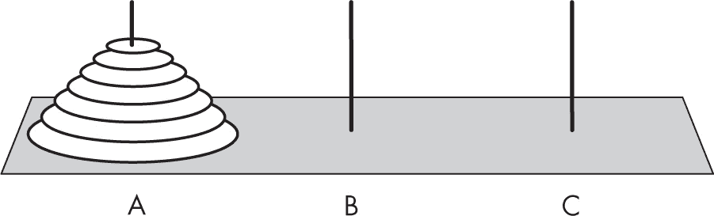

图 5-1: 汉诺塔

如何使用分治策略来解决这个问题呢？你可以假设已经有了所需的函数，例如 towers(disks, origin, extra, destination)，它将一定数量的盘子从起始柱子移动到目标柱子，并使用额外的柱子作为辅助柱子。你可以利用该函数来实现整个过程。基本情况很简单：如果没有盘子需要移动，什么都不做；否则，按照前面描述的步骤进行移动。代码可能如下所示：

```
const towers = (disks, origin, extra, destination) => {
❶ if (disks > 0) {
  ❷ towers(disks - 1, origin, destination, extra);
  ❸ console.log(`Move disk ${disks} from ${origin} to ${destination}`);
  ❹ towers(disks - 1, extra, origin, destination);
  }
};
```

首先，你测试基本情况 ❶，因为如果没有盘子需要移动，显然任务已经完成。否则，递归地将除了最底部的盘子以外的所有盘子移动到额外的柱子 ❷。清空大盘子后，将它移动到目标柱子 ❸，最后将其他盘子放到它上面 ❹。

类似 towers(4, "A", "B", "C") 这样的调用可以将四个盘子从 A 柱移动到 C 柱，产生以下输出：

```
Move disk 1 from A to B
Move disk 2 from A to C
Move disk 1 from B to C
Move disk 3 from A to B
Move disk 1 from C to A
Move disk 2 from C to B
Move disk 1 from A to B
Move disk 4 from A to C
Move disk 1 from B to C
Move disk 2 from B to A
Move disk 1 from C to A
Move disk 3 from B to C
Move disk 1 from A to B
Move disk 2 from A to C
Move disk 1 from B to C
```

使用递归来解决谜题的简化步骤是分治策略的一个明确示例。（如果你需要在没有计算机的情况下解决这个谜题，请参见问题 5.2。）

> 注

*这个谜题还有一个尾声。在原版谜题中，僧侣们必须将 64 个金盘子从一根柱子移动到另一根柱子，世界将在他们完成任务后结束。（在原版谜题中，寺庙位于印度；谁知道它是如何传播到国外并来到河内的？）对于 n 个盘子，解这个谜题需要 M(n) = 2^n – 1 次移动，所以它是一个指数阶的算法；通过注意到 M(n) = 2M(n – 1) + 1 且 M(0) = 0 可以验证这个公式。如果每秒移动一次，这个任务将需要 2⁶⁴ – 1 秒，超过 584 亿年，所以我们是安全的！*

#### 回溯技术

*回溯*是一种通常最好通过递归方式实现的解决问题技巧。当面临多个选项时，选择一个并尝试通过它找到解决方案。如果成功了，你就完成了。如果失败了，回溯到做出选择的点，选择另一个选项。如果在某个时刻没有更多的选项了，那就肯定没有解决方案。

##### 在迷宫中寻找路径

迷宫的出口（比如图 5-2 所示）是一个经典且古老的问题，你将在第十七章中再次遇到，尤其是在处理图时。这也是回溯的典型示例，所以我们在这里使用它。我们稍后会深入探讨完整的算法，这只是伪代码。

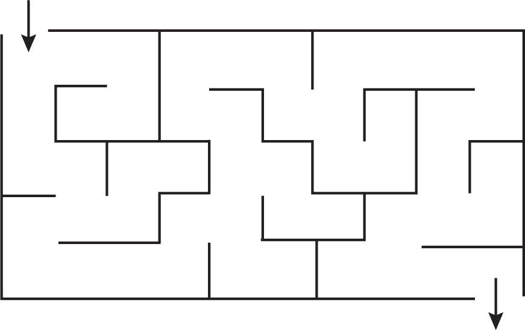

图 5-2：一个使用回溯解决的迷宫

每当你到达迷宫中的一个交叉口，那里有两个或更多的选项时，你必须选择一个，显然，你可能会选择错误的方向。方法是按照选择走下去：如果走出了迷宫，你就成功了；如果没有，你就回溯到上一个交叉口并选择另一个选项。如果没有剩下任何选项，你需要继续回溯，一次又一次，直到找到解决方案或决定没有解决方案。以下是这种递归算法的伪代码：

```
❶ solveMaze(fromCell, toCell, maze, path=[])
❷ if(fromCell === toCell) {
    return path // success!
  }
❸ mark fromCell as visited
❹ for all nextCell cells adjacent to fromCell {
  ❺ updatedPath = solveMaze(nextCell, toCell, maze, path + fromCell)
    if updatedPath is not null {
      return path
    }
  }
 // All adjacent cells were tried, and failed...
❻ return null   // failure
}
```

这个函数❶的参数包括路径的起点、终点、迷宫以及你将要走的路径。如果你到达了目标❷，你就成功了；否则❸，标记该单元格为已访问，这样以后就不会再选择它，并开始尝试所有可用的选项❹。如果路径再次出现❺，说明你已经成功。当所有选项都被排除❻时，你知道必须回溯，因为你失败了。图 5-3 显示了搜索过程中的一个中间位置。

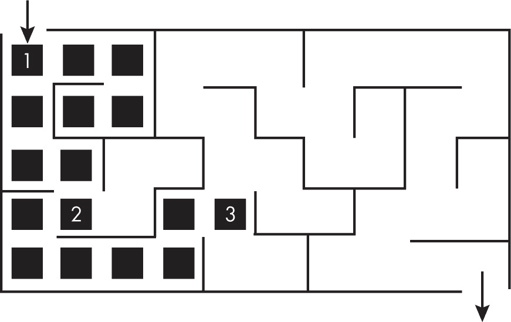

图 5-3：解决迷宫时的一个中间步骤

在位置 1 时，算法有两个可选项；它选择了左边的那个，结果失败了，然后回溯到选择另一个选项。在位置 2 时，又做了一个选择；这次选择了右边的那个，左边的尚未（还没有）考虑，所以该路径中的单元格仍未标记。当前算法处于位置 3。如果从这里找不到出口，它将回溯到位置 2，尝试尚未选择的选项。是否能快速从位置 3 找到出口，取决于算法在每个交叉点选择正确选项的“运气”，但无论如何，算法最终肯定会通过递归回溯找到一条路径（如果有的话）。

##### 解决沙滩上的方块游戏谜题

让我们将这一技巧应用于由美国拼图大师 Sam Loyd 开发的《海滩上的方块游戏》拼图，如图 5-4 所示。在这个拼图中，玩家需要将球投向玩偶，如果他们成功击倒的玩偶编号之和为 50，则获胜，奖品是一根雪茄。（参见问题 5.3，那里有一个类似的拼图，你也可以通过回溯算法解决。）

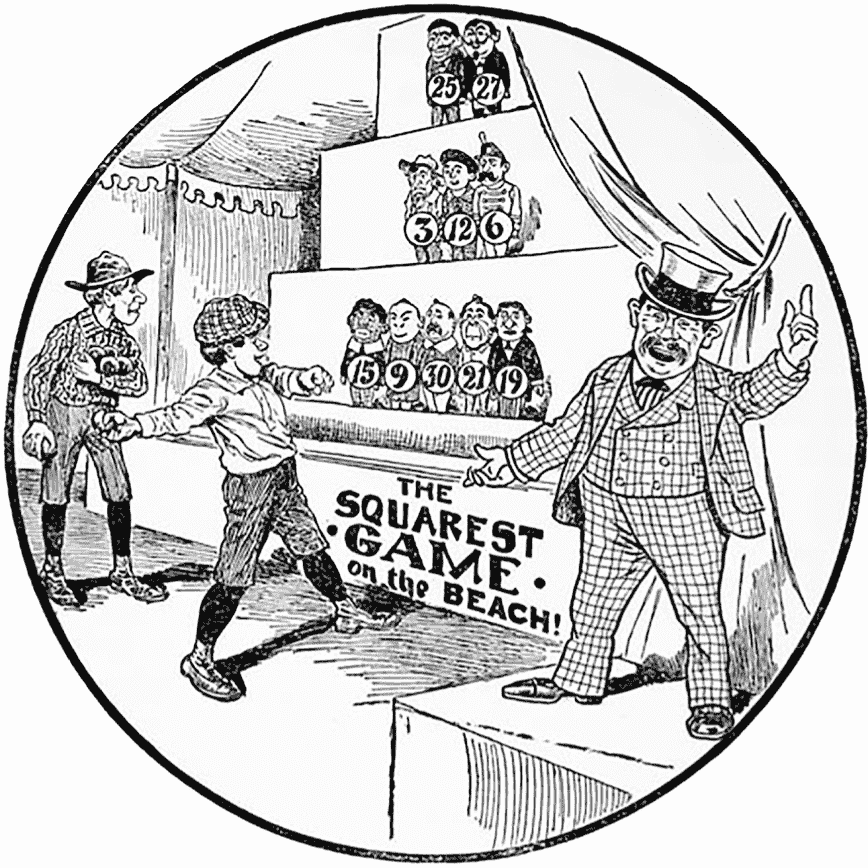

图 5-4：美国拼图大师 Sam Loyd 的《海滩上的方块游戏》拼图（公有领域）

你可以实现一个递归回溯算法，如下所示：

```
❶ const solve = (goal, standing, score = 0, dropped = []) => {
❷ if (score === goal) {
    return dropped;
❸} else if (score > goal || standing.length === 0) {
    return null;
  } else {
  ❹ const chosen = standing[0];
  ❺ const others = standing.slice(1);
  ❻ return (
      solve(goal, others, score + chosen, [...dropped, chosen]) ||
      solve(goal, others, score, dropped)
    );
  }
};
❼ console.log(solve(50, [15, 9, 30, 21, 19, 3, 12, 6, 25, 27]));
```

在函数 ❶ 中，goal 是你尝试达到的分数，standing 表示可用的选项，一个包含仍然站立的玩偶的数组。你目前获得的分数保存在 score 中，击倒的玩偶则放入 dropped 数组。如果你恰好达成目标，就完成了 ❷，并且 dropped 中保存了需要击倒的玩偶列表。如果你超出了目标，或者没有更多的玩偶可以击倒 ❸，则失败。否则，你选择一个玩偶 ❹（从代码实现的角度，选择第一个是最简单的），将其从未来的选择中移除 ❺，然后尝试解决拼图，包括最近选中的玩偶。如果失败了，你就回溯，并尝试不包括那个玩偶 ❻。要找到拼图的解 ❼，调用 solve() 函数，传入目标分数（50）和玩偶分数列表。

### 动态规划

*动态规划（DP）* 是一种通过首先解决其他（较小的）问题并存储这些结果，从而避免在需要时重新计算的技术。动态规划有两种类型：自顶向下的方式，先通过检查问题是否已经解决来判断是否处理子问题，再进行子问题的求解；和*自底向上*的方式，首先解决较小的子问题，然后逐步解决原问题。换句话说，在自顶向下的动态规划中，你试图直接解决原问题，然后递归地解决较小的问题；而在自底向上的动态规划中，你从最简单的问题开始，逐步解决更难的问题。

这个描述引出了一个问题：保存先前结果的最佳方式是什么？我们将讨论两种方法：*备忘录*，它基于函数式编程中的高阶函数，可能最适合自顶向下的动态规划；以及*表格法*，它基于数组或矩阵，通常最适合自底向上的动态规划。备忘录通常与递归实现相关，而表格法则更适用于直接的非递归解法。两者的权衡在于，表格法可能更快（因为不需要递归），但可能会解决一些并不真正需要的子问题，而备忘录则较慢（因为递归的原因），但只会计算实际需要的内容。

#### 使用自顶向下动态规划计算斐波那契数列

让我们回到本章之前讨论的斐波那契数。以下是代码：

```
const fibo = (n) => {
  if (n === 0) {
    return 0;
  } else if (n === 1) {
    return 1;
  } else {
    return fibo(n - 1) + fibo(n - 2);
  }
};
```

这是一个分治法的例子，但如前所述，该实现有一个问题，我们将通过动态规划来解决。代码清晰、简单且正确，但可能会非常慢。当你尝试更大的 *n* 值时，计算第 *n* 个斐波那契数所需的时间呈指数增长，如图 5-5 所示。发生了什么呢？

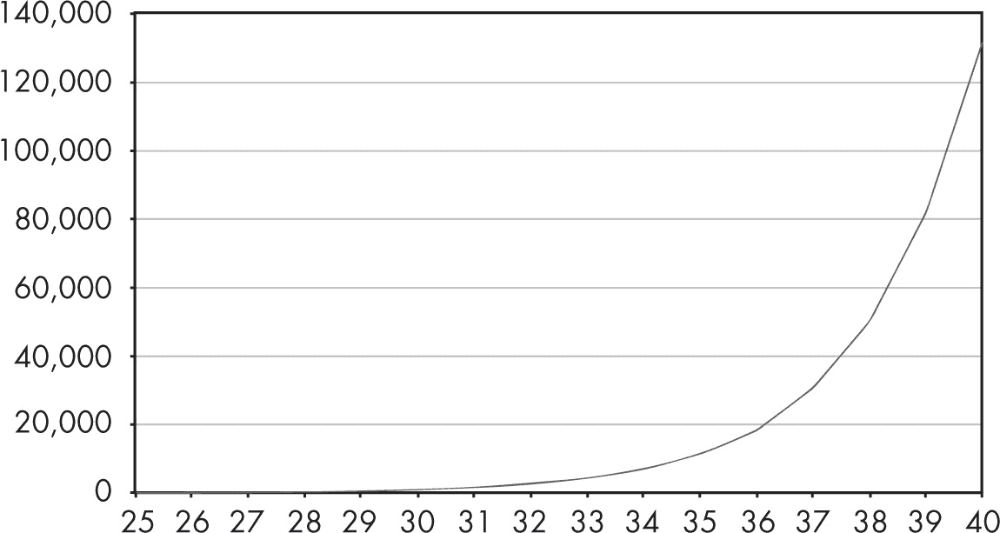

图 5-5：递归计算斐波那契数所需的加法次数呈指数增长。

为了理解这个问题，考虑计算 fibo(7) 时涉及的所有计算。图 5-6 展示了所有需要的调用。

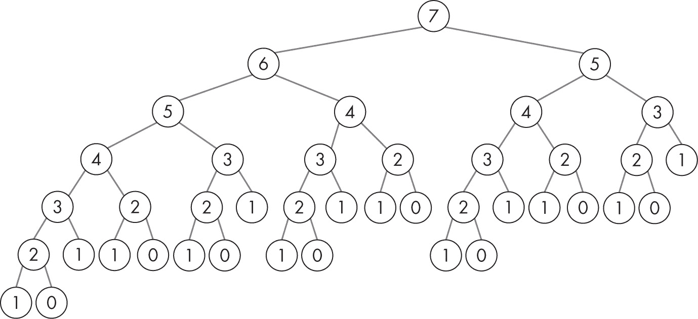

图 5-6：计算 fibo(7) 所需的调用

显然，很多调用是重复的。计算 fibo(7) 需要求和 fibo(6) 和 fibo(5)，但前者是通过 fibo(5) 加上 fibo(4) 计算得到的，所以你重复计算了 fibo(5)。图表显示，计算其他斐波那契数时还会有更多的重复；fibo(3) 或 fibo(2) 被调用多少次呢？（另见问题 5.4。）这种实现是指数级增长的，那么该如何解决这个问题呢？

*记忆化* 是一种函数式编程技巧，可以应用于任何纯函数（即没有副作用、对于相同的参数始终返回相同结果的函数，见第二章）。其思想是，当一个记忆化的函数被调用时，它首先检查内部缓存，看看计算是否已经完成。如果已完成，它直接返回缓存中的值，而不是重新进行计算。如果请求的值尚未计算，记忆化函数会执行计算，但在返回结果之前，它会将结果存储到内部缓存中，以供以后使用。

高阶函数，如 fast-memoize（来自 *[`www.npmjs.com/package/fast-memoize`](https://www.npmjs.com/package/fast-memoize)*），是公开可用的，但自己动手写一个并不难：

```
❶ const memoize = (fn) => {
  ❷ const cache = {};
  ❸ return (...args) => {
      ❹ const strX = JSON.stringify(args);
      ❺ return strX in cache
        ❻ ? cache[strX]
        ❼ : (cache[strX] = fn(...args));
    };
};
```

这个高阶函数 ❶ 接收一个函数作为参数并返回一个新的函数。它使用闭包来维护先前调用和计算值的缓存；这里你使用的是一个简单的对象 ❷，但你也可以使用集合（有关其他可能的结构，见第十一章）。返回的函数 ❸ 首先将原始 fn 函数的参数 ❹ 生成一个字符串。如果该字符串已作为键存在于缓存中 ❺，则直接从缓存中返回先前计算的值 ❻；否则，调用原始函数，存储返回的值到缓存中，并返回该值 ❼。

使用 memoize()，你可以通过简单的修改，立即加速计算，方法是包装原始函数：

```
const fibo = **memoize(**(n) => {
  ...
}**);**
```

如果你现在尝试像 fibo(100) 这样的操作，结果会立即显示。要理解为什么，你需要 fibo(99) 和 fibo(98)，但是在计算 fibo(99) 之后，fibo(98) 的值已经被计算过了，因此不会再次计算。0 到 100 之间的每一个可能的斐波那契数都会被计算，但每个数只会计算一次。通过应用动态规划技术——存储先前计算的值，算法已经变得线性，而不是指数级增长。

#### 使用自顶向下的动态规划进行换行

让我们来看一个可以通过应用自顶向下的动态规划解决的实际问题：构建一个外观整洁的网页表单。假设你希望网页能够生成多个表单，每个表单包含不同的字段集。如果表单数量是固定的，并且字段集也是预先确定的，这并不会成为问题。然而，在这种情况下，表单的数量是不可预测的，字段需要添加、删除或移动，因此你需要一个更灵活的解决方案。你需要的是一个“表单创建器”，它接受一个按给定顺序排列的字段列表，并输出一个合适的表单。例如，要生成的表单的一部分可能如下图所示：图 5-7。


图 5-7：一个示例网页表单

问题在于你想要一个对齐的右边距，但字段的宽度不一致，因此你需要拆分行并拉伸某些字段，使得一切看起来均匀。你需要在决定拆分行的位置以及每行放哪些字段时小心谨慎。

> 注意

*TeX 排版系统实现了 Knuth-Plass 算法，用来确定段落的换行位置，使其看起来更加美观。这里的问题本质上是一样的，但我们将使用动态规划（DP）来解决它。*

考虑五个字段，宽度分别为 7、2、5、3 和 6（见图 5-8）。你需要将它们安排成宽度为 10 的行。

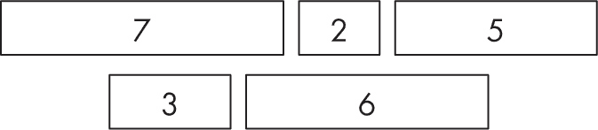

图 5-8：不同宽度的示例字段

你不能少于三行来管理，四行或更多行会导致太多的空间浪费（尽管我们稍后需要量化这一概念）。你不会像 TeX 在单词之间那样添加空白；相反，你将扩展字段本身。首先决定在每一行中留多少空白空间，然后再扩展块或分隔单词。你有三种可能的三行布局（见图 5-9、图 5-10 和图 5-11；灰色区域代表每行末尾额外添加的空白空间；你需要在同一行中的所有块之间共享这些空间）。

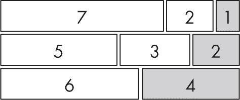

图 5-9：字段布局 1

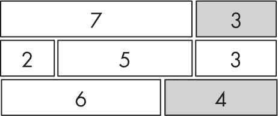

图 5-10：字段布局 2

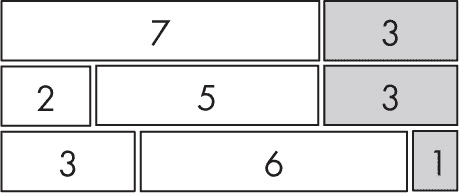

图 5-11：字段布局 3

哪种解决方案最好？假设在多行中添加较小的空白空间比在少数几行中添加较大的空白空间更好，考虑“行成本”为该行添加的空白空间的平方，总成本将是所有行成本的总和。（为了更好地理解为什么使用平方，假设你需要添加两个空格；如果把它们都放在同一行中，成本是 2² = 4，但如果将一个空格放在两行中，成本是 1² + 1² = 2，因此，在加总前平方成本实现了一个偏好较小空白的策略。）根据这个定义，布局的成本将是 1² + 2² + 4² = 21，3² + 0² + 4² = 25，和 3² + 3² + 1² = 19，因此第三个图表表示算法应该生成的设计。让我们编写代码。

考虑一组区块宽度（在这种情况下是 7、2、5、3 和 6）和要实现的最大宽度（MW）。以下逻辑适用：计算所有宽度的和*s*，如果*s*不大于 MW，成本为(MW - *s*)²。通过将列表拆分为两行或多行不能提高效果。否则，如果你有更多的字段无法在一行中放下，可以尝试以所有可能的方式将列表拆分成两个片段，然后选择产生最低成本的拆分。

以下逻辑实现了这个目标，但它省略了在一行中分配空白空间的代码，因为这部分内容只在后续需要。这个代码找到了最佳换行集合的成本及这些换行应该在哪里进行：

```
const costOfFragment = (p, q) => {
❶ const s = totalWidth(p, q);
  if (s <= MW) {
  ❷ return [(MW - s) ** 2, [q]];
  }

❸ let optimum = Infinity;
❹ let split = [];
❺ for (let r = p; r < q; r++) {
  ❻ const left = costOfFragment(p, r);
    const right = costOfFragment(r + 1, q);
  ❼ const newTry = left[0] + right[0];
  ❽ if (newTry < optimum) {
      optimum = newTry;
      split = [r, . . .right[1]];
    }
  }
❾ return [optimum, split];
};
```

该函数找出从 p 到 q（包括 q）的区块集合的最佳拆分，并返回要进行的拆分列表。假设我们有一个 totalWidth(x,y)函数，用来计算从 x 到 y 的区块宽度（稍后你将看到如何最佳实现它）。首先计算整个区块列表的宽度❶；如果它小于可用空间，则无需拆分，操作完成。按照定义计算成本并返回拆分发生在 q 位置之后❷。如果需要拆分，设置一个搜索；最优解将是最佳可能的成本❸，而拆分点则是拆分列表的位置❹。遍历所有可能的换行位置❺，并计算区块 p 到 r 和 r+1 到 q 的片段成本❻。每个拆分的成本被存储❼，如果它比之前的最优解好❽，则 r 作为新的拆分点。最终结果❾是找到的最佳成本及拆分点列表。

图 5-12 展示了这个算法如何处理你的区块列表。

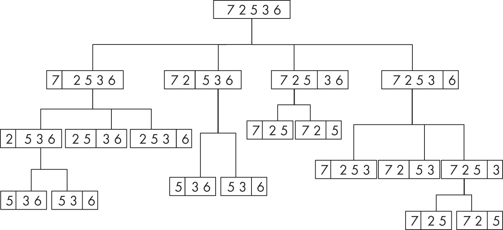

图 5-12：算法评估的所有可能拆分

计算成本，图 5-13 展示了最优解。

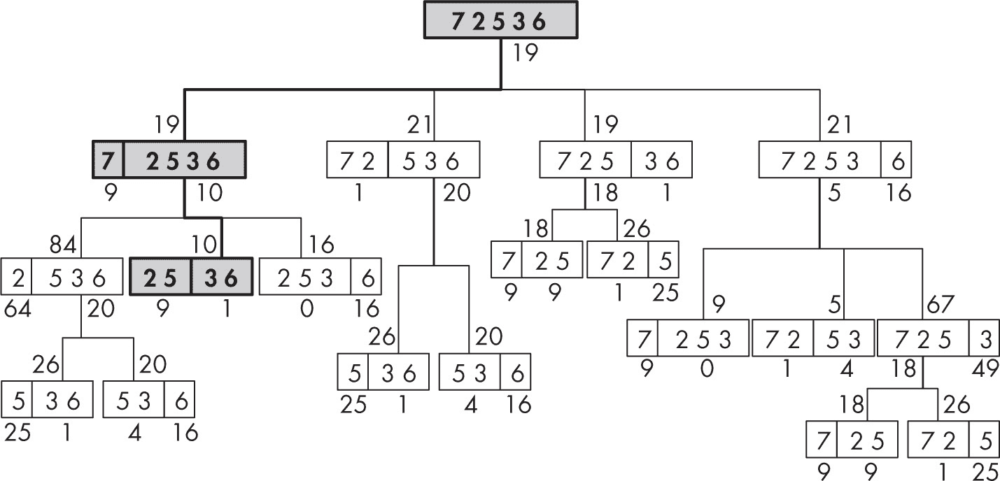

图 5-13：最优解

成本显示在每个块的下方。如果一个块被拆分为多个块，它的成本是其部分成本的总和。高亮路径显示了如何达到最佳解决方案：在第一行单独留下 7，在第二行放置 2 和 5，在最后一行放置 3 和 6，总成本为 19。运行算法将产生以下结果：

```
❶ const blocks = [7, 2, 5, 3, 6];
const costOfFragment = ...
❷ const result = costOfFragment(0, blocks.length - 1);
❸ console.log(result[0], result[1]);
// 19 [0, 2, 4]
```

你可以定义块宽度的列表 ❶，并使用 costOfFragment(...) ❷产生结果：最佳总成本是 19，你在位置 0（仅 7）、2（2 和 5）和 4（3 和 6）处分割行，正如预期的那样 ❸。

你完成了，但如果仔细查看图 5-13，你会注意到与斐波那契计算相同的问题：某些块的成本被多次计算，例如（5, 3, 6）、（2, 5, 3）和（7, 2）。你可以应用记忆化来避免这个问题，得到所需的算法：

```
const costOfFragment = **memoize(**(p, q) => {
  ...
}**);**
```

优化后的算法如何处理这个例子？图 5-14 显示了实际上需要计算的内容非常少。

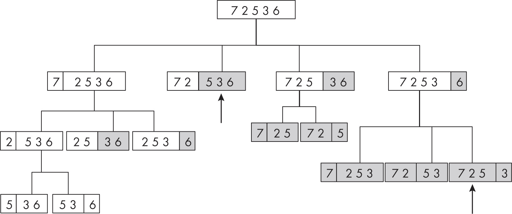

图 5-14：优化后的计算大大减少了工作量。

灰色块不需要重新计算；由于记忆化，你只需重用之前计算过的成本。在多个地方（用箭头标记）不需要递归。总体而言，算法运行得更快，但请参见问题 5.5 以获取进一步的优化。

#### 使用自底向上的动态规划计算斐波那契数列

让我们考虑从下到上的动态规划。在自顶向下的方式下，你必须等到某些较小值的计算完成后才能进行计算。例如，在第 72 页“使用自顶向下动态规划计算斐波那契数列”一节中，你不能在计算 fibo(6)和 fibo(5)之前计算 fibo(7)。使用自底向上的方法，你从最小的情况开始，一步一步向上推进。要从下到上找到斐波那契数，你按照数列的定义进行计算，从 0 和 1 开始，始终将最后两个数字相加以生成下一个数字：

```
const fibo = (n) => {
❶ if (n < 2) {
    return n;
❷} else {
    let a = 0;
    let b = 1;
 ❸ while (n > 1) {
      [a, b] = [b, a + b];
      n--;
    }
 ❹ return b;
 }
};
```

这是简单的代码：对于 0 或 1 ❶，你不需要进行计算。对于其他值 ❷，设置一个循环，初始时 a = 0，b = 1（a 和 b 代表序列中的两个最新数字），然后循环足够多次 ❸，直到 b 变成你想要的数字 ❹。

你可能会注意到，所有之前计算的数字并没有保存，确实如此，但这是因为在这个特定的案例中，你不需要它们。该算法采用自底向上的方式，通过使用前面的数字来计算后续数字；恰好为了做到这一点，你总是只需要最新的两个数字，因此不需要存储其他所有数字。

#### 使用自底向下动态规划递归求和区间

在换行算法中（参见第 74 页的“使用自上而下动态规划换行”），你需要一个 totalWidth(x, y)函数，用来将数组中从位置 x 到位置 y（包括 x 和 y）的宽度值相加。这个函数需要尽可能快，以免对算法的性能产生负面影响。最简单的版本（遍历数组并逐步累加）具有线性 *O*(*n*)性能，如果 *n* 是块的数量。然而，你可以通过一些替代实现来进行改进，这些实现不仅关注动态规划，还涉及本章中介绍的其他技术。

第一个算法，使用循环来获取和，比较简单。现在为函数增加另一个参数 arr，它是块的宽度，使其更通用并与调用者无关：

```
const totalWidth1 = (arr, from, to) => {
  let sum = 0;
  for (let i = from; i <= to; i++) {
    sum += arr[i];
  }
  return sum;
};
```

使用备忘录化优化它只需要做一个小的改动：

```
const totalWidth1 = **memoize(**(arr, from, to) => {
  ...
}**);**
```

如果（而且这是个大前提）你两次或多次使用相同的参数调用该函数，这个版本会更快。每次使用不同的参数调用它反而会使它变慢，因为需要额外的缓存工作。假设你已经计算了从 10 到 20 的区间和，现在你想要从 10 到 21 的区间和。你可以将第 21 个值加到 10 到 20 的区间和中，而不需要额外的工作。

这个概念是动态规划的关键：将问题的解决方案建立在之前较小问题的解决方案之上。要实现这一点，你需要将一个区间值的和定义为之前区间和的组合。如果你想计算数组 arr 中从位置 p 到 p 的单个元素区间和，结果就是 arr[p]。如果你想计算从位置 0 到位置 q（大于零）的值的和，首先计算从 0 到 q-1 的区间和，然后将 arr[q]加到该结果上。最后，要计算从位置 p（大于零）到位置 q（大于 p）的值的和，先计算从 0 到 q 的区间和，再减去从 0 到 p-1 的区间和。

你还可以使用备忘录化（memoization）来跟踪之前计算过的值；其逻辑如下：

```
const totalWidth2 = memoize((arr, from, to) => {
  if (from === to) {
    return arr[from];
  } else if (from === 0) {
    return totalWidth2(arr, 0, to - 1) + arr[to];
  } else {
    return totalWidth2(arr, 0, to) - totalWidth2(arr, 0, from - 1);
  }
});
```

这个函数的效果更好，工作量更少。例如，如果你请求从第 10 到第 20 的区间和，所有从 0 到 0、0 到 1、0 到 2，依此类推，直到 0 到 20 的所有和都需要被缓存。如果你接着请求第 10 到第 21 的区间和，它会尝试立即计算 0 到 21 的和（即 0 到 20 的和加上第 21 个元素），并减去已经可得的 0 到 9 的和。你依然有一个 *O*(*n*) 算法，但随着时间的推移，它变成了 *O*(1) 的过程；初始的延迟会被摊销。但你还可以做得更好。

#### 通过预计算并使用自底向上的动态规划来求和区间

看到上一节中的`totalWidth2(...)`需要计算从 0 到所有可能其他位置的范围和时，你可以使用表格法来预计算所有这些值，然后所有查询将是*O*(1)的。你可以使用内部缓存（`partial`）来存储这些值：

```
const totalWidth3 = ((tab) => {
❶ const partial = [0];
  tab.forEach((v, i) => {
  ❷ partial[i + 1] = partial[i] + v;
  });
❸ return (from, to) => partial[to + 1] – partial[from];
❹})(arr);
```

这有点棘手，因为你使用了一个闭包来处理部分数组，该闭包在立即调用函数表达式（IIFE）中初始化。预计算将`partial[k]`设置为原始数组中前* k *个元素的和，这正确地意味着`partial[0]`应等于 0 ❶。（你浪费了一个额外的数组位置，但与最终获得的快速算法相比，这并不重要。）你还使用动态规划（DP）来计算这些部分和：`partial[i+1]`是基于先前计算的`partial[i]`来计算的 ❷。你想要的函数将通过获取到最右侧元素的和（`partial[to+1]`）并减去不包括最左侧元素的和（`partial[from]`）来计算两个元素之间的总和 ❸，这样就实现了所需的*O*(1)算法。IIFE 的巧妙之处在于通过将原始宽度数组作为参数传递 ❹。（参见第 5.6 题，了解另一种实现该工作的方式。）

你已经看到两种不同的方式，通过自下而上的动态规划优化算法，最终实现*O*(1)性能。鉴于宽度计算常用于计算换行，这对你代码的性能和可用性是一次重大改变。

### 穷举搜索

穷举算法尝试通过系统地尝试所有可能的值组合来找到问题的解决方案。这种逻辑的主要问题在于组合爆炸，试验的案例数成倍增加。由此产生的算法的时间复杂度通常进入指数级或阶乘级（如第四章所讨论），这使得即使是对于适中的输入也可能无法使用。

我们将按类别查看每个问题，从最差到最糟。鉴于该类别中算法的排序，毫不奇怪，我们将在本书的其余部分避免使用这种代码。

#### 检测重言式

在逻辑上，重言式是始终为真的布尔表达式。例如，如果 X、Y 和 Z 是布尔变量，以下两个 JavaScript 表达式是重言式：

+   X 或 Y 或（非 X 且 非 Y）

+   X 或（非 X 且 Y）=== X 或 Y

+   （非 X）或（X 且 Z）或（非 Y）或（Y 且 Z）或 Z

即使是对逻辑和表达式非常熟悉的读者，也可能不立即清楚哪些表达式始终为真。

判断一个有*n*个布尔参数的函数是否为恒等式，可能需要进行 2*^n*次测试，检查每种可能的真/假值组合，验证每种情况下该函数是否输出真。或者，你可以尝试找到某个使其为假的参数组合，一旦找到这样的情况，就知道该函数不是恒等式。这样的搜索需要类似于你在海滩上解决 Squarest Game 谜题时使用的逻辑。

使用递归非常方便：如果一个有*n*个变量的函数是恒等式，将第一个变量设置为假应该也是恒等式，如果第一个变量设置为真，同样也会是恒等式。为了检查原始函数是否为恒等式，你需要测试几个少一个参数的函数，这就导致了一个简单的实现：

```
❶ const isTautology = (fn, args = []) => {
❷ if (fn.length === args.length) {
  ❸ const result = !!fn(...args);
 ❹ if (!result) {
      console.log("Failed at", . . .args);
    }
    return result;
  } else {
  ❺ return (
      isTautology(fn, [...args, false]) && isTautology(fn, [...args, true])
    );
  }
};
```

isTautology()函数接收要测试的原始函数 fn 和一个参数列表❶。后者将是你用来测试函数是否为真的值的组合。如果你有正确数量的参数❷，你将评估该函数❸，如果它返回假值❹，你会记录这个事实并返回假值，这将中断所有未来和挂起的评估。如果函数返回真，搜索将继续。如果提供的参数不足❺，你将测试该函数两次：一次添加真值，一次添加假值到参数列表中，最终所有组合都会被测试。

以下是测试之前提到的三个布尔表达式：

```
const f = (x, y) => x || y || (!x && !y);
console.log(isTautology(f)); // true

const g = (x, y) => (x || (!x && y)) === (x || y);
console.log(isTautology(g)); // true

const h = (x, y, z) => !x || (x && z) || !y || (y && z) || z;
console.log(isTautology(h)); // false: Failed at true true false
```

前两个函数实际上是恒等式，但最后一个不是。搜索列出了至少一个失败的情况，其中该函数的计算结果为假。

#### 解决密码算术谜题

*密码算术谜题*（也称为*密码算式*）是一类数学谜题，其中数字被字母替换。解答者的目标是找出每个字母代表的数字。通常，数字不能以零开头，所有字母的值必须不同，并且方程式应该翻译成一个有意义的短语。图 5-15 展示了一个早期的例子，这个谜题由英国作家、谜题专家和数学家亨利·厄尼斯特·杜德尼（Henry Ernest Dudeney）于 1924 年发明。


图 5-15：经典密码算术谜题

你可以通过仔细分析来解决这种谜题（请参见问题 5.7 中的另一个例子），但在这里你将编写一个求解器，遍历所有可能的数字组合，检查是否有可行的解。在这个例子中，考虑到有 10 个数字，你需要检查 10!（3,628,800）种组合，但有些谜题使用的是不同的数值基数，因此通常来说，这是一个 *O*(*n*!) 算法。一个类似的例子（就解决方法而言）是旅行商问题，它提供了 *n* 个城市和每对城市之间的距离；你需要找到一个最短的路线，访问每个城市仅一次，并最终返回到起始城市。这个问题的解决方法同样是 *O*(*n*!)，其算法与接下来你将看到的类似。（你还将看到一种使用贪心算法来解决该问题的不同类型的解决方案，稍后会在本章中讨论。）

我们需要什么算法？这个想法很简单：尝试从 0123456789 到 9876543210 的所有数字组合，并检查每一个是否能解开谜题。（在这个例子中，你只会使用前八个数字，但这并不会改变任何事情。）你可以设计如下的主要逻辑，假设 puzzle() 是一个用于测试组合是否合法的函数：

```
❶ const solve = (puzzle, digits = [0, 1, 2, 3, 4, 5, 6, 7, 8, 9]) => {
❷ const d = [...digits].sort();

❸ for (;;) {
  ❹ if (puzzle(...d)) {
      console.log("SOLUTION: ", . . .d);
      return true;
    }
  ❺ // Try generating the next combination of d.
    // If there are no more combinations left, return false.
  }
};
```

digits 参数 ❶ 将包含你用于此问题的数字集；尽管在这种情况下，可能的值是 0 到 9，但你也可以编写适用于其他进制的密码算术谜题的代码。制作一个 digits 集合的本地副本 ❷，以避免修改原始参数并避免副作用（如 第二章 中讨论的那样），并将其排序，以便按升序遍历所有组合。然后设置一个循环 ❸，当你找到解或者决定没有解时退出。如果当前数字组合有效 ❹，记录结果并退出；否则，生成下一个数字组合 ❺ 并继续循环，直到到达最后一个组合，这时你就知道这个问题没有解。

生成给定集合的下一个排列是一个众所周知的算法，可能是由印度数学家纳拉扬·潘迪塔（Narayana Pandita）在 14 世纪发现的。假设当前的排列存储在数组 d 中，它需要四个步骤，按顺序执行：

1. 找到最右侧的索引 p，使得 d[p] < d[p + 1]；如果没有这样的 p，说明你已经到了最后一个排列，算法结束。

2. 找到最右侧的索引 q，使得 d[p] < d[q]；d[q] 是 d[p] 右侧最小的比 d[p] 大的值。

3. 交换 d[p] 和 d[q] 的值；现在从 d[p + 1] 到 d 末尾的值将按降序排列。

4. 将 d[p + 1] 到 d 末尾的值反转。

图 5-16 显示了一个有效的例子，从排列 8403976521 开始。

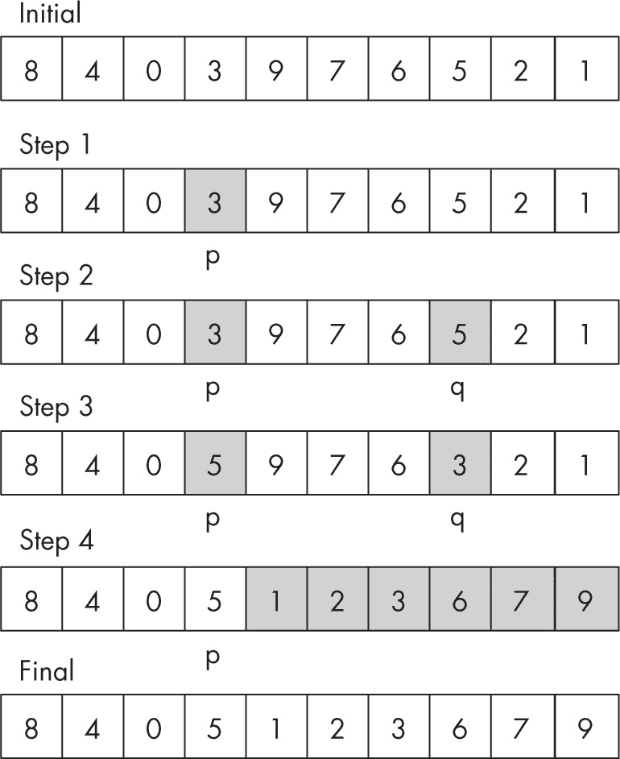

图 5-16：生成下一个排列

步骤 1 将 p 指向 3，因为 3 < 9；右侧所有其他元素（976521）是降序排列的。步骤 2 将 q 指向 5，这是 3 右侧大于它的最小值。步骤 3 交换 p 和 q 所指向的值；p 右侧的值再次按降序排列（976321）。步骤 4 通过反转 p 右侧的值来结束，使其变为升序排列（123679），你得到了下一个排列：8405123679。

使用这个逻辑，你可以通过添加生成排列的代码，看到完整版本的加密算术谜题求解器：

```
const solve = (puzzle, digits = [0, 1, 2, 3, 4, 5, 6, 7, 8, 9]) => {
  const d = [...digits].sort();

  for (;;) {
    if (puzzle(...d)) {
      console.log("SOLUTION: ", . . .d);
      return true;
    }

 **let p = d.length - 2;**
    while (p >= 0 && d[p] > d[p + 1]) {
      p--;
    }

    if (p === -1) {
      console.log("No solution found");
      return false;
    }

    **let q = d.length - 1;**
    while (d[p] > d[q]) {
      q--;
    }

    **[d[p], d[q]] = [d[q], d[p]];**

    **let l = p + 1;**
    let r = d.length - 1;
    while (l < r) {
      [d[l], d[r]] = [d[r], d[l]];
      l++;
      r--;
    }
  }
};
```

这段代码与之前相同，突出显示了排列算法的步骤 1 到步骤 4。

现在你可以编写一个函数来测试给定的值组合是否实际上是一个解：

```
❶ const sendMoreMoney = (s, e, n, d, m, o, r, y) => {
❷ if (s === 0 || m === 0) {
    return false;
❸} else {
    const SEND = Number(`${s}${e}${n}${d}`);
    const MORE = Number(`${m}${o}${r}${e}`);
    const MONEY = Number(`${m}${o}${n}${e}${y}`);
    return SEND + MORE === MONEY;
  }
};

❹ solve(sendMoreMoney);
// SOLUTION:  9 5 6 7 1 0 8 2 3 4
// 9567 + 1085=10652
```

函数被调用时，传入了所有 10 个数字❶，但你只使用前 8 个，忽略最后 2 个。如果首位数字为 0 ❷，则解无效，因此直接拒绝。如果没有前导零 ❸，则计算三个单词（SEND、MORE 和 MONEY）的值，并检查它们是否满足原始方程。给定这个函数，你只需要将其传递给 solve()函数 ❹，然后稍等片刻（很短时间）就能得到解。

### 贪心算法

最后，让我们总结一组具有相当奇特特点的算法：它们可能并不总是有效。算法的基本定义意味着它是一个明确的程序，用于解决问题或完成任务。*贪心算法*可能（也可能不会）做到这一点。

有时会使用启发式方法来描述通过应用一些任意选择而不是进行彻底搜索，从而更快速地获得一个（希望不是太糟糕的）解决方案。例如，一个国际象棋算法原则上可以通过考虑所有可能的走法、所有可能的对手反应以及所有可能的反应来找到最佳走法，但这种方法的复杂度呈指数增长，因此不可行。另一种选择是启发式方法。以国际象棋为例，避免达到最大深度，而是在几步之后停止搜索，对结果的棋盘位置进行粗略评估，并选择最佳评估的走法。这个方法并不能*保证*做出最佳走法，但至少能提供某种解决方案。

贪心算法通常应用于优化问题。你已经见过使用暴力算法尝试所有可能性的算法；贪心算法则不是这样。每当需要做出决策时，这些算法会在当时做出最佳选择。一方面，这种方法确保算法快速执行，不需要回溯。另一方面，算法不一定做出最佳选择，因为它并没有足够地考虑未来。然而，在某些条件下，正如你在接下来的章节中将会探索的，这些算法表现良好并且成功。

#### 如何找零

如何用最少的钞票和硬币找零？换句话说，假设你必须用今天的美国货币支付某个金额：$100、$50、$20、$10、$5 和$1 钞票，以及$0.25（四分之一美元）、$0.10（十分之一美元）、$0.05（镍币）和$0.01（分币）硬币。如何支付$229.60？你可以使用许多组合来达到这个金额，但使用贪心算法时，你会遵循这样一个简单规则：每一步选择尽可能多的最大面额单位，直到完成为止。

该方法从使用两张$100 钞票开始，然后是$20 钞票、一张$5 钞票、四张$1 钞票、两枚四分之一美元硬币和一枚十分之一美元硬币。没有其他解决方案涉及更少的钞票和硬币。这个贪心算法保证能够成功，但它依赖于可用的面额。在一个只有$9、$8 和$1 钞票的国家，支付$16（贪心方式）将会得到一张$9 钞票和七张$1 钞票，而不是使用仅仅两张$8 钞票。贪心算法的成功与否取决于具体情况。

#### 旅行商问题

让我们考虑一个通常需要暴力搜索但贪心算法通常能很好解决的问题。旅行商问题是这样的：想象一个销售员必须进行一次旅行，访问列表上的每个城市一次，然后返回起点。（在图论中，这称为*哈密顿回路*。）城市间的旅行距离（或费用）是已知的。如何以最短（或最便宜）的方式完成任务？

按照目前的方式，解决这个问题的算法需要测试所有可能的城市排列（就像你之前为 SEND + MORE = MONEY 谜题所做的那样）。如果城市数量增多，问题将变得无法处理，因为运行算法所需的时间会过长。

这个问题的贪心算法（虽然可能找不到最佳解，但执行迅速）将按如下方式进行：每一步访问最近的未访问城市。此方法不一定能找到最佳路径，几种启发式方法可能会发现一个更好的路径，但在某些条件下，算法能找到最优解。

#### 最小生成树

让我们通过考虑一个问题来结束我们对贪心算法的讨论，这个问题你将在第十七章中探讨。想象一下，某个有线电视公司必须为几户家庭提供服务。公司不能随便铺设电缆，必须遵循现有的道路。为了最小化总成本，它应将电缆铺设在哪里？

该问题的解决方案在技术上称为*最小生成树*，而克鲁斯卡尔算法（你将在第十七章中实现它）是一个贪心算法，能够解决这个问题，并且保证找到最优解。从选择最便宜的路段开始，直到所有房屋都连接起来，并且始终添加最便宜的不会产生回路的路段；毕竟，拥有一个封闭的电缆回路又有什么用呢？

你可以使用贪心算法解决其他与图相关的问题，因此，当尝试为特定问题编写代码时，这种技术可能也是一个有效的选择。

### 总结

在本章中，我们考虑了几种技术（递归、动态规划、暴力法和贪心算法），这些技术将帮助你独立开发算法，它们将在本书的其余部分再次出现。

在下一章，我们将探讨几个常见问题，如排序、选择、洗牌、采样和搜索——这有很多头韵，但也有很多有趣的代码，并且有充足的机会让你学习如何编写算法。

### 问题

**5.1  一阶阶乘**

factorial() 的代码完全正确，但它有七行！虽然这并不重要（一个长的正确函数比一个短的错误函数要好），但你能把它写得更紧凑一些吗？

**5.2  手动汉诺塔**

汉诺塔的递归算法对计算机来说是不错的，但对普通人类来说却不太适用。你能设计一种简单的非递归算法来解决这个难题吗？

**5.3  射箭回溯**

Sam Loyd 设计了另一个类似于你在本章早些时候解决的《沙滩上的方块游戏》的难题（见 图 5-17）。在这个难题中，你需要通过将箭矢射向目标来获得 100 分。重要的区别在于，在这个难题中，你可以多次击中一个靶环，而在另一个问题中你只能投掷一个娃娃一次。


图 5-17：Sam Loyd 的另一个经典难题，玩家必须用箭矢精确击中 100 分（公共领域）

你能修改回溯算法来处理这个变体吗？即使存在差异，你还能使用之前解决其他难题时用过的 solve() 函数来找到解吗？

**5.4  计数调用**

如果你调用 *C*(*n*)，也就是用递归实现计算第 *n* 个斐波那契数所需的调用总次数，例如你会看到 *C*(7) = 41。你能为 *C*(*n*) 给出一个递推公式并找到它的显式解吗？提示：答案将再次涉及斐波那契数。

**5.5  避免过多工作**

当考虑如何在行中排列块（在“使用自顶向下的动态规划进行行断裂”中见 第 74 页）以及考虑拆分时，你分析了它们作为（7, 2, 5）和（3, 6）或（7, 2, 5, 3）和（6）。然而，这其实并不必要，因为块 7 + 2 + 5 或 7 + 2 + 5 + 3 无法适应一行。图 5-18 显示了一个增强算法不会考虑的被划去的选项。

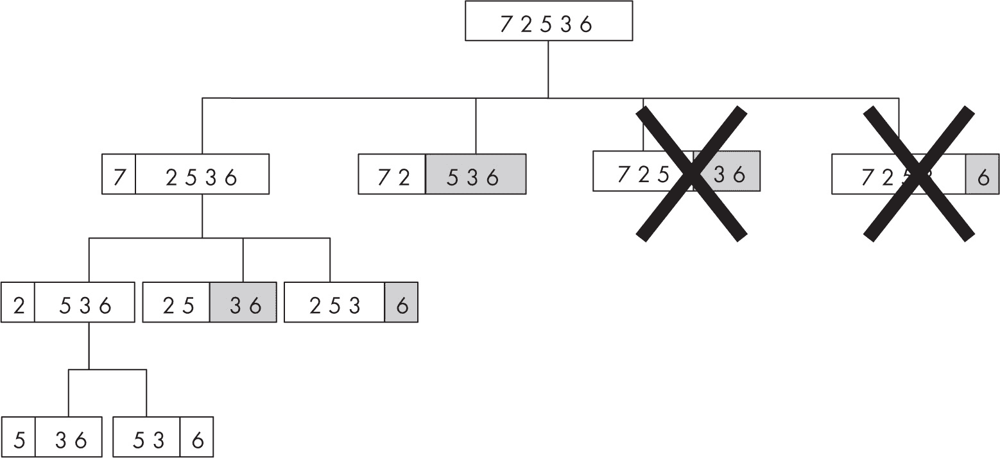

图 5-18：一种更高效的找到行断点的方法

你能将这个优化添加到代码中吗？

**5.6  简化以提高清晰度**

totalWidth3(...) 函数（在“通过自底向上的动态规划预计算求和范围”这一节中，参见第 81 页）使用了一个常见的循环来生成部分数组。你能用.reduce(...)来替代这个方法吗？

**5.7  得了痛风吗？**

图 5-19 展示了另一个著名的密码算术谜题；找到每个字母代表的含义，然后 GOUT 的值就是你的答案。你可以使用本章前面介绍的技巧来解决这个问题，或者也可以尝试直接解答。


图 5-19：一个简单的密码算术谜题，只有四个字母需要找到
