## 第六章：6 排序


在前几章中，我们讨论了与编程和算法设计相关的概念。现在，我们将开始考虑这些概念的实际应用。我们要探讨的问题是如何将一组记录排序，每个记录由一个键（字母顺序、数字或多个字段）和数据组成。

算法的输出应包括完全相同的一组记录，但经过重新排列，以使键按顺序排列。通常，你希望键按升序排列，但降序排列只需要对排序算法进行一个小改动——即反转比较操作——所以在这里不会展示。（请参见本章末的第 6.1 题。）

我们首先会考虑排序问题的总体情况，然后继续研究几种基于键比较的算法（最常见的算法），接着会看一些基于其他原理的算法。我们将考虑所有算法的性能，甚至会加入一些幽默的算法进行比较。

### 排序问题

*排序算法*本质上是一种算法，它接受包含键和值的数据记录列表，然后重新排列列表，使得键按非递减顺序排列（没有任何键小于其前一个键），输出列表是输入列表的一个排列，保留所有原始记录。忘记第二个条件很容易，但忽视它将意味着以下情况也可以被视为有效的排序函数：

```
const wrongWayToSort = (inputData) => [];
```

排序本身很重要，但它也影响其他算法的效率。例如，在第九章中，我们将看到如何利用排序数据来实现更高效的搜索操作。

对于我们的示例，我们通常假设使用可以直接通过 < 和 > 运算符进行比较的单字段键。对于更通用的情况，你可以修改算法，使用 compare(a,b) 比较函数，正如 JavaScript 的排序算法所做的那样（请参见第 95 页的“JavaScript 自带的排序方法”部分）。在本书中的代码示例中，你总是会写测试如 a>b，因此修改代码以支持通用排序只需要将该比较改为 compare(a,b)>0。（参见第 6.2 题的变体。）在第十四章中，你将通过应用 goesHigher(a,b) 函数来决定在堆中哪个元素应该更大。

#### 内部排序与外部排序

排序数据时，一个重要的考虑因素是数据是否能全部同时存储在内存中，还是数据过大必须存储在外部存储设备中。第一种情况称为*内部排序*，第二种情况称为*外部排序*。本章中的所有算法都属于第一类，但如果你需要排序的数据超过内存容量怎么办呢？

外部排序将所有输入数据分解成尽可能大的块，以适应内存，然后使用内部排序对这些块进行排序，保存到外部存储，并将已排序的块合并成最终的输出。也就是说，对于像这样的庞大排序任务，你可能更适合使用标准的系统排序工具，它可能还会优化以使用并行线程、多个中央处理单元（CPU）等。无论如何，如果你决定自己实现外部排序程序，本节中的算法涵盖了所需的内部排序，使用堆（如第十四章所示）将有助于编写高效的合并代码。

#### 自适应排序

如果排序算法能够利用输入数据中已经存在的任何顺序，那么它被称为 *自适应算法*。壳排序就是一个例子，你将在第 103 页的“通过组合排序和壳排序实现更大跳跃”部分学习到它：当数据部分排序时，算法的性能会更好。另一方面，快速排序，你将在第 105 页的“通过快速排序追求速度”部分学习到它，可以被视为反自适应算法。当数据已经有序时，它的最差表现会出现（尽管也有解决方法）。

#### 原地排序与非原地排序

排序算法的另一个考虑因素是它们是否需要额外的数据结构（因此需要额外的空间）。通常，这一要求被放宽，允许使用常量的、少于 *O*(*n*) 的额外内存——关键规则是是否需要与输入大小成比例的额外空间。我们不会考虑存储要排序的 *n* 个元素所需的 *O*(*n*) 空间。那些不需要额外空间的算法称为 *原地算法*，而那些需要更多内存的则被称为 *非原地算法* 或 *不原地算法*。这并不意味着非原地算法会返回一个新的列表；它们完全可以在原地重新排列输入列表，但它们需要额外的 *O*(*n*) 或更多的空间来完成此操作。

仔细考虑算法使用的内存量：一些递归算法，如快速排序，内部需要使用一个栈，其空间复杂度为 *O*(*log n*)，但这也被认为是原地排序。归并排序通常需要额外的空间来合并序列，因此其空间复杂度为 *O*(*n*)，因此属于非原地排序类别。

#### 在线排序与离线排序

在考虑算法时，另一个需要区分的是它们是否能够像串行流一样处理输入数据，还是所有数据必须从一开始就可用。第一类算法称为 *在线算法*，第二类则称为 *离线算法*。这个区别不仅适用于排序问题，也适用于其他问题；例如，在第八章中讨论采样时你将再次看到它。

在排序方面，在线算法会始终保持一个已排序的列表，并将新元素按顺序加入其中，而离线算法则必须等到所有元素都可用后再开始排序。尽管如此，离线算法通常具有更好的性能。在线算法不知道所有输入，因此它们必须做出可能在后续阶段被证明是次优的决策，这与贪心算法的情形相同（参见第五章）。

作为这种区别的一个例子，考虑如何排序一副扑克牌。如果你将已经排序的牌保存在手中，然后每次得到新牌时，将它插入到之前牌的合适位置，你实际上是在实现一个在线算法——实际上，这是一个*插入排序*，我们将在“扑克牌排序策略”这一节中（第 100 页）学习它。如果你等到所有牌都到齐后，再通过某种方式进行排序，那就是离线排序。

#### 排序稳定性

排序可能具有相等关键字的数据提出了一个问题：具有相等关键字的元素最终会以何种相对顺序排列？*稳定排序*算法保持与输入相同的顺序，因此，如果一个元素排在另一个元素前面且两者具有相同的关键字，在排序后的输出中，第一个元素会排在第二个元素前面。

为什么稳定性很重要？假设你想在一个 HTML 页面中显示联系人，并且希望遵循这样一个规则：加星标的联系人（收藏）应该排在前面，按字母顺序排列，接着是没有星标的联系人，同样按字母顺序排列。

为了实现所需的排序，你可以先按名字排序整个列表，然后重新排序，使加星标的联系人排在前面。图 6-1 展示了这种方法。

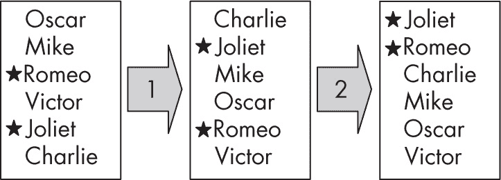

图 6-1：通过稳定排序算法按两个字段排序

第一次排序按字母顺序重排列表，第二次排序将加星标的名字排在没有星标的名字之前。如果第二次排序是稳定的，那么这种排序不会影响之前的字母顺序排序。如果是一个不稳定的排序，可能就不成立了。稳定性是朱丽叶在最终列表中排在罗密欧之前的原因。朱丽叶在按名字排序时排在罗密欧之前，而在按星标排序时，它们保持了相同的相对顺序。

你可以修改任何排序算法，强制其变为稳定的。不论排序的关键是什么，考虑使用由原始关键字后接列表中项的位置形成的新扩展关键字。通过新的扩展关键字排序这个数组时，共享相同（原始）关键字值的项将会被一起排序，但由于添加了位置，它们将保持原有的相对顺序，如图 6-2 所示。

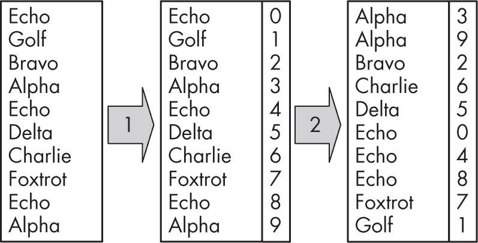

图 6-2：通过使用扩展关键字使排序变得稳定

第一步通过添加项目的位置信息作为额外的键值；第二步按姓名和位置排序。具有相同原始键值（例如示例中的 Alpha 和 Echo）的元素将保持它们之间的相对位置。最后，你可以删除添加的字段。

#### JavaScript 自带的排序方法

在 JavaScript 中排序时，不要忘记语言已经提供了一个 .sort(...) 方法，尽管本章稍后会考虑更多（可能更好的）排序算法，但在许多情况下，使用 JavaScript 自带的排序方法可能是最有效的。我们来快速回顾一下这个排序方法是如何工作的（更多信息请参见 *[`developer.mozilla.org/en-US/docs/Web/JavaScript/Reference/Global_Objects/Array/sort`](https://developer.mozilla.org/en-US/docs/Web/JavaScript/Reference/Global_Objects/Array/sort)*）。

给定一个数组，.sort(comparisonFunction) 方法使用一个可选的比较函数就地重新排序数组。（较新的 .toSorted() 方法不会就地排序，而是生成一个新的排序后的数组版本。）如果省略该函数，JavaScript 会将元素转换为字符串，然后按字典顺序排序，这可能不是你想要的：

```
const a = [22, 9, 60, 12, 4, 56];
a.sort();
console.log(a); // 12 22 4 56 60 9
```

为了支持其他排序方式，你需要提供一个函数，该函数接收两个元素 a 和 b，并返回一个负值表示 a 应该排在 b 前面，返回一个正值表示 a 应该排在 b 后面，返回零表示两个键值相等且 a 和 b 可以任意排序。你可以很容易地修正前面的例子：

```
const a = [22, 9, 60, 12, 4, 56];
a.sort(**(a, b) => a - b**);
console.log(a); // 4 9 12 22 56 60
```

你还可以实现更复杂的比较；下面的例子展示了如何按日期和姓名对对象进行排序：

```
❶ const people = [
  {d: 22, m: 9, y: 60, n: "alpha"},
  {d: 12, m: 4, y: 56, n: "bravo"},
  {d: 22, m: 3, y: 56, n: "hotel"},
  {d: 9,  m: 1, y: 60, n: "foxtrot"},
  {d: 22, m: 4, y: 56, n: "echo"},
  {d: 22, m: 3, y: 56, n: "delta"},
  {d: 22, m: 3, y: 56, n: "india"},
  {d: 14, m: 1, y: 34, n: "charlie"},
  {d: 9,  m:12, y: 40, n: "golf"}
];

const dateNameCompare = (a, b) => {
❷ if (a.y !== b.y) {
    return a.y - b.y;
❸} else if (a.m !== b.m) {
    return a.m - b.m;
❹} else if (a.d !== b.d) {
    return a.d - b.d;
❺} else if (a.n < b.n) {
 return -1;
  } else if (a.n > b.n) {
    return 1;
  } else {
 ❻ return 0;
  }
};
```

需要排序的数据❶包含日期作为三个独立的字段（d, m 和 y，分别表示日、月和年）以及姓名（n）。如果两个人来自不同的年份❷，你通过相减年份来返回正确的负值或正值。如果年份相同，你可以使用相同的逻辑来比较月份❸，如果月份也相同❹，你再用同样的方法比较日期。如果日期相同，你就比较姓名❺，由于不能直接使用数学运算来比较日期，你需要逐个字段进行实际比较。只有在所有字段都比较过且相等时，最终才返回 0❻。

如果你使用刚才写的 dateNameCompare(...) 函数对人员数组进行排序，你将得到预期的结果：

```
console.log(people.sort(dateNameCompare));

[
  {d: 14, m: 1, y: 34, n: 'charlie'},
  {d: 9,  m:12, y: 40, n: 'golf'},
  {d: 22, m: 3, y: 56, n: 'delta'},
  {d: 22, m: 3, y: 56, n: 'hotel'},
  {d: 22, m: 3, y: 56, n: 'india'},
  {d: 12, m: 4, y: 56, n: 'bravo'},
  {d: 22, m: 4, y: 56, n: 'echo'},
  {d:  9, m: 1, y: 60, n: 'foxtrot'},
  {d: 22, m: 9, y: 60, n: 'alpha'}
]
```

最后，考虑稳定性。最初，.sort(...) 方法的规范并不要求稳定性，但 ECMAScript 2019 添加了这一要求。然而，需要注意的是，如果使用的是较早的 JavaScript 引擎，你不能假定排序是稳定的，因此你可能需要求助于在 第 93 页 中描述的“排序稳定性”解决方案。另外，记住任何给定的引擎可能根本没有正确实现该标准。

#### 排序性能

如果你必须对*n*个值进行排序，你的逻辑必须能够处理这些值的所有可能的*n*!排列。那需要多少次比较呢？想想 20 个问题游戏。在这个游戏中，你必须通过最多 20 个“是”或“否”的问题来猜测一个选定的物体。如果你仔细规划你的问题，你应该能够从超过一百万（2²⁰ = 1,048,576，实际上）个可能的选项中挑选出任何一个元素。你可以将这个逻辑应用于排序*n*个元素。

如果你正在比较元素来排序一个数组，那么可以间接地推断出你在决定原始排列是什么。精心设置的问题将选项范围分成两半，所以你需要知道在*n*!可能性下需要多少个问题。这相当于在问你应该将*n*!除以 2 多少次，直到得到 1。答案是 log *n!*，以 2 为底。（或者，你可以将其看作是在问什么值的*k*使得 2^*k* > *n*!）本节将不讨论它的推导，但斯特林近似法表示*n*!以*n**^n*的速度增长，所以*n*!的对数是*O*(*n* log *n*)。

这自动意味着，任何基于比较元素的算法至少都是*O*(*n* log *n*)。没有更好的结果可以实现，但显然可能有更差的结果。考虑到这一点，在下一节中，我们将考虑几种算法，从最差到最好的表现。

但是请注意，关于这些算法“基于比较元素”的观察。如果你设法在没有进行实际比较的情况下排序一个列表，那么一切都不再确定。你会发现一些方法允许在*O*(*n*)时间内排序，而不需要将键相互比较。

### 基于比较的排序

如前所述，我们将考虑主要的排序算法，所有这些算法都依赖于相互比较值。我们将考虑的第一个算法是*O*(*n*²)，因此它们不是最优的，但我们将继续研究更好的算法，直到我们达到几种实现最佳*O*(*n* log *n*)表现的算法。

在所有情况下，你都会编写接收值数组的函数（如前所述，你无需担心键+数据对，因为这可以很容易地适应），并且你还会传递参数来指定数组的哪个部分（从， 到）应该被排序。像往常一样，你会想要排序整个数组。那些参数将具有默认值，因此如果没有提供它们，整个数组将被排序。

#### 上升和下降

我们将从回顾排序算法开始，首先介绍*冒泡排序*，它可能是最有吸引力的名字，可能是为了弥补它的较差表现。这个算法很容易实现，但你只会在数据集较小的情况下使用它。它还产生了几个变体（你将在下一节查看组合排序，它实际上引出了一个表现更好的算法）。

##### 冒泡排序

冒泡排序算法的名称来源于一个简单的概念，即较大的数字像气泡一样浮到列表的顶部。它从数组的开始位置开始，按顺序遍历数组中的所有元素，如果一个元素大于下一个元素，它就交换这两个元素（见图 6-3）。

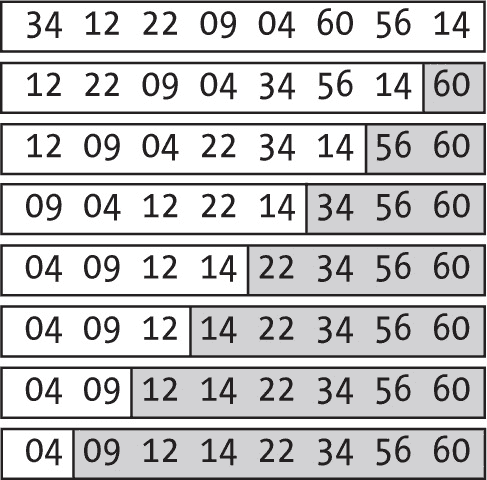

图 6-3：在冒泡排序中，每次遍历都会将一个元素移到正确的位置。

在图 6-3 的第一次遍历中，从左到右比较相邻的值，并在需要时交换它们，使得较大的值总是出现在右边。第一次遍历后，60 被移到数组的顶部。接着以相同的方式处理数组的其余部分，第二次遍历后，56 被移到倒数第二的位置，因此至少有两个元素已经到位。第三次遍历后，三个元素到位，以此类推。最后两行没有发生交换，因为之前的遍历已经将元素移到正确的位置，这种情况经常发生。

以下是该算法的逻辑：

```
❶ const bubbleSort = (arr, from = 0, to = arr.length - 1) => {
❷ for (let j = to; j > from; j--) {
  ❸ for (let i = from; i < j; i++) {
    ❹ if (arr[i] > arr[i + 1]) {
        [arr[i], arr[i + 1]] = [arr[i + 1], arr[i]];
      }
    }
  }
  return arr;
};
```

所有排序函数都具有相同的签名：一个待排序的数组（arr）和排序的限制（from，to），默认情况下是数组的极限❶。外层循环❷从右到左进行；每次遍历后，数组中位置 j 的元素将处于正确的位置。内层循环❸从左端开始遍历到外层循环 j 的位置（不包括 j）；你将每个元素与下一个元素进行比较❹，如果第二个元素较小，就交换它们。

你可以通过检查每次遍历数组时是否发生了交换，来提高大多数已排序数组的性能（这种情况并不罕见）。如果没有检测到交换，说明数组已经是有序的（见问题 6.7）。

该算法的性能是*O*(*n*²)，计算起来很简单。首先计算比较次数：第一次遍历做了(*n* – 1)次比较，第二次遍历做了(*n* – 2)次比较，第三次做(*n* – 3)次，以此类推。所有比较次数的总和就是从(*n* – 1)到 1 的所有数之和，即*n*(*n* – 1) / 2，所以是*O*(*n*²)。 ##### 下沉排序与穿梭排序

冒泡排序迅速将最大的值移到数组的末尾，但最小的值可能需要一些时间才能到达最终位置。类似地，*下沉排序*（见问题 6.6）将最小的值快速下沉到数组的开头，但相应地，最大值到达其位置的时间会更长。你可以交替进行冒泡遍历和下沉遍历，得到一个增强的算法，称为*穿梭排序*（也叫*鸡尾酒摇晃排序*或*双向*冒泡排序）。与冒泡排序相比，穿梭排序的前几次遍历如图 6-4 所示。

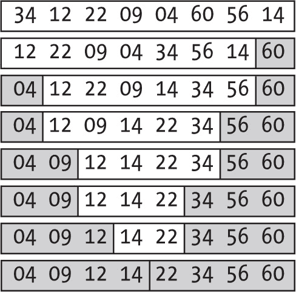

图 6-4：穿梭排序交替进行从左到右和从右到左的遍历。

从相同的元素开始，第一次遍历与冒泡排序相同，将数组中最大的值 60 移动到最右端。第二次遍历从右到左，将数组中最小的值 04 移动到最左端。第三次遍历再次从左到右，将 56 移动到其正确位置；之后，继续交替执行左到右和右到左的遍历，直到排序完成。

以下是相应的代码：

```
❶ const shuttleSort = (arr, from = 0, to = arr.length - 1) => {
❷ let f = from;
  let t = to;

❸ while (f < t) {
  ❹ for (let i = f; i <= t - 1; i++) {
      if (arr[i] > arr[i + 1]) {
        [arr[i], arr[i + 1]] = [arr[i + 1], arr[i]];
      }
    }
  ❺ t--;

  ❻ for (let i = t - 1; i >= f; i--) {
      if (arr[i] > arr[i + 1]) {
        [arr[i], arr[i + 1]] = [arr[i + 1], arr[i]];
      }
    }
 ❼ f++;
  }

  return arr;
};
```

如前所述，这个排序函数的签名始终相同：一个要排序的数组和需要排序的部分 ❶。你有两个变量 ❷，标记数组已经排序到左边和右边的程度：f（来自*from*）从左边开始，每次从右到左遍历后增加 1，而 t（来自*to*）从右边开始，每次从左到右遍历后减少 1。当这两个变量相遇 ❸ 时，排序完成。你首先执行如前所示的从左到右遍历 ❹，然后减少 t ❺，因为你已经将一个新值放到了正确的位置。之后，你执行同样的操作 ❻，但顺序是从右到左，然后增加 f ❼ 来完成。

该算法的时间复杂度仍然是 *O*(*n*²)，但实际实现通常速度是原来的两倍，甚至更快，如果你包括交换测试（参见问题 6.7）。无论如何，很容易证明它不能做得更差，因为在每次遍历中，它都会将一个数字放到最终位置，所以在将 (*n* – 1) 个数字放到它们的位置之后，排序就完成了，这与冒泡排序相同。

然而，尽管有个引人注目的名字，这种排序算法与我们在本章后面将要探讨的算法相比，还是不够优秀。

#### 扑克牌排序策略

思考如何完成简单的任务可以为开发算法提供一些提示。例如，假设你手里有几张扑克牌，想要按从低到高的顺序排列它们。你可以应用几种不同的策略，我们接下来将讨论：选择排序或插入排序。

##### 选择排序

一个简单的解决方案是寻找最小的牌并将其放置在手中最左边的位置。然后寻找下一个最小的牌并将其放在第一张之后，继续这样做，总是选择剩下的最小牌并将其放置在已经排序的牌旁边。这个过程就是 *选择排序* 算法的基础，且它添加了一个小细节：当将一张牌放到左边时，你需要与另一张牌交换位置（参见 图 6-5）。

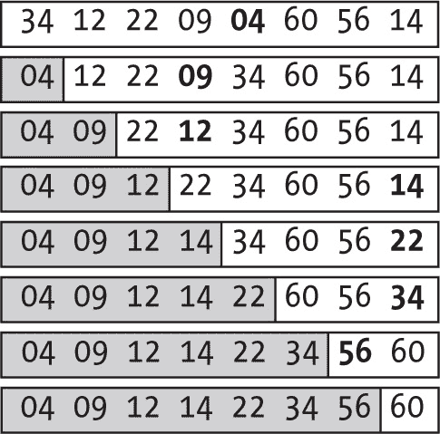

图 6-5：选择排序通过查找最小元素并交换其位置来完成排序。

在最上面的第一次遍历中，你找到最小的数字是 04，并交换将其移到数组的第一个位置。第二次遍历找到 09，并与 12 交换，现在你已经有了两个有序的数字。之后的过程保持相同，唯一的例外是在倒数第二行，在这一步中不需要交换，因为 56 已经在正确的位置。

这里是一个实现：

```
const selectionSort = (arr, from = 0, to = arr.length - 1) => {
❶ for (let i = from; i < to; i++) {
  ❷ let m = i;
  ❸ for (let j = i + 1; j <= to; j++) {
    ❹ if (arr[m] > arr[j]) {
        m = j;
      }
    }
  ❺ if (m !== i) {
      [arr[i], arr[m]] = [arr[m], arr[i]];
    }
  }

  return arr;
};
```

按照顺序❶从数组的第一个位置到最后一个位置。变量 m❷跟踪已经找到的最小值的位置。当你循环处理未排序的数字❸时，如果找到新的最小值候选者❹，就更新 m。完成这个循环后，如果最小值还没有排好位置❺，就进行交换。

这个算法的时间复杂度仍然是*O*(*n*²)。你需要查看*n*个元素来找出应该放在第一位的数；然后看*n*–1 个元素找出第二位的数，依此类推。你已经知道这个总和是*O*(*n*²)。下一节中的算法也是基于如何排序扑克牌，但它的性能稍好。

##### 插入排序

在选择排序中，我们想到了排序扑克牌，但你也可以考虑其他方法。拿起第一张牌；显然它已经是排序好的了。现在看第二张牌，要么把它放在第一张牌之前（如果它较小），要么保持它原位（如果它较大）。现在你已经有了两张排序好的牌。看第三张牌，决定它应该放在前两张牌中的哪个位置，然后将它放到那里。当你处理完手中的所有牌后，你会发现它们已经排好序了，这就是所谓的*插入排序*，因为你是通过将新牌插入到已经排序好的牌中来排序的（见图 6-6）。

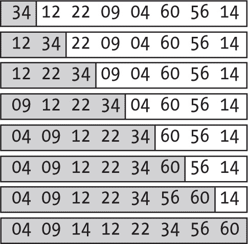

图 6-6：插入排序的工作原理就像排序扑克牌一样。

从一张已排序的牌开始，这里是数字 34。然后考虑下一个数值 12，把它放在 34 的左边，这样两张牌就排好了。接下来考虑 22，它放在 12 和 34 之间，现在三个数值已经排序好。继续这样操作，总是把下一个数放在已经排序好的牌中，直到最后一张牌。将 14 放入已排序的牌中后，整个数组就变得有序了。

以下代码实现了这个方法：

```
const insertionSort = (arr, from = 0, to = arr.length - 1) => {
❶ for (let i = from + 1; i <= to; i++) {
  ❷ for (let j = i; j > from && arr[j - 1] > arr[j]; j--) {
    ❸ [arr[j - 1], arr[j]] = [arr[j], arr[j – 1]];
    }
  }
  return arr;
};
```

设置一个循环，从数组的第二个位置开始，一直到最后❶，然后在列表没有排序好的情况下继续循环❷，通过交换将新数值放到正确的位置❸。

仔细观察，你会发现它进行了过多的交换才能把新元素放到正确的位置。

你可以快速优化代码，避免多次交换，每次循环只做一次交换：

```
const insertionSort = (arr, from = 0, to = arr.length - 1) => {
❶ for (let i = from + 1; i <= to; i++) {
  ❷ const temp = arr[i];
  ❸ let j;
    for (j = i; j > from && arr[j - 1] > temp; j--) {
      arr[j] = arr[j - 1];
    }
  ❹ arr[j] = temp;
  }
  return arr;
};
```

第一个循环❶和之前一样，但是区别在于其中的操作。你将要插入的数值从已排序的数组中取出❷，然后循环找出它应该放在哪个位置❸，并将大于它的数值往右推。最后❹，你把新值放在它的最终位置。

插入排序是一个简单的算法，这使得它在处理较小的数组时是一个不错的选择。章节后面我们将讨论它如何在混合排序算法中使用，作为理论上更方便但实际上较慢的替代方法的替代品。

#### 使用梳状排序和希尔排序进行更大的跳跃

冒泡排序及其变种不是性能最好的排序算法。然而，将元素交换使其上浮或下沉的想法并不坏，应用这种思想让元素做更大的跳跃（例如，交换更远的元素）最终会得到一个更好的算法，即*Shell 排序*。你将首先通过一个名为*梳排序*的冒泡排序变种来探索这个思想。

##### 梳排序

我们回到冒泡排序，考虑数组中的元素如何像兔子和乌龟一样移动。兔子代表位于列表前部的较大值，它们会快速通过一次次交换跳到数组末尾的正确位置。另一方面，乌龟代表位于列表后部的较小值，它们会慢慢地通过每次遍历交换移动到正确的位置。你希望兔子和乌龟都能迅速地各自移动到数组的两侧。

这个思想是进行一些交换操作的遍历，但与其将元素与下一个元素比较，不如考虑更大的间隔。因此，兔子会跳得更远，而乌龟则相应地跳得更远。你将以逐渐减小的间隔进行遍历，当间隔变为 1 时，你就应用常规的冒泡排序来完成。

逻辑如下：

```
const combSort = (arr, from = 0, to = arr.length - 1) => {
❶ const SHRINK_FACTOR = 1.3;

  let gap = to - from + 1;
  for (;;) {
  ❷ gap = Math.floor(gap / SHRINK_FACTOR);
  ❸ if (gap === 1) {
      return bubbleSort(arr, from, to);
    }
  ❹ for (let i = from; i <= to - gap; i++) {
      if (arr[i] > arr[i + gap]) {
        [arr[i], arr[i + 1]] = [arr[i + 1], arr[i]];
      }
    }
  }
};
```

通过经验确定，第一个间隔应该等于数组长度除以 1.3，即“收缩因子”❶，后续的间隔将始终是前一个间隔的 1.3 倍❷。当间隔变为 1❸时，直接应用冒泡排序，任务完成。当间隔大于 1❹时，你需要做的本质上是冒泡排序的核心逻辑，只不过不是比较相邻元素，而是比较间隔为“gap”的元素。

梳排序通常比冒泡排序表现更好，但它在最坏情况下仍然是*O*(*n*²)，而在最好情况下变成*O*(*n* log *n*)。然而，我们考虑这个思想的原因并不是这个；而是排序远距离元素的概念带来了实际的好处，你会发现 Shell 排序正是以类似梳排序的方式做到了这一点。

##### Shell 排序

要理解 Shell 排序的工作原理，假设你想对图 6-7 所示的数组进行排序。

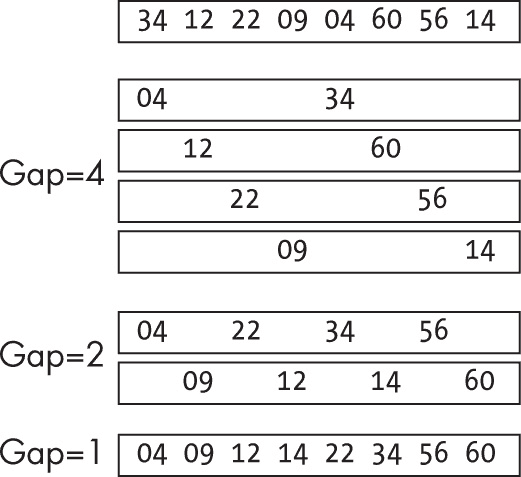

图 6-7：Shell 排序类似于插入排序，但具有更大的间隔。

在第一次遍历中，进行插入排序，但是元素之间间隔为四个位置，这样会得到一个由四个短序列组成的数组。然后将间隔大小降低为 2，重复排序。此时，数组由两个有序序列组成。最终，你会将间隔大小降到 1，到那时你就只是在进行插入排序，但由于前面的部分排序，它不会像正常算法那样进行那么多的比较或交换，这就是 Shell 排序的优势。

这是 Shell 排序的实现：

```
const shellSort = (arr, from = 0, to = arr.length - 1) => {
❶ const gaps = [1]; // Knuth, 1973
  while (gaps[0] < (to - from) / 3) {
    gaps.unshift(gaps[0] * 3 + 1);
  }

❷ gaps.forEach((gap) => {
  ❸ for (let i = from + gap; i <= to; i++) {
      const temp = arr[i];
      let j;
 ❹ for (j = i; j >= from + gap && arr[j - gap] > temp; j -= gap) {
        arr[j] = arr[j - gap];
      }
      arr[j] = temp;
    }
  });

  return arr;
};
```

首先选择要使用哪些间隔 ❶，记住最后应用的间隔必须是 1。你会在网上找到许多关于使用哪种间隔序列的建议，但本例将使用 Knuth 提出的序列（1, 4, 13, 40, 121, ...，每个数字是前一个数字的三倍再加 1），这种序列会导致一个 *O*(*n*^(1.5)) 的算法。然后，按降序顺序选择间隔 ❷，并实质上进行插入排序 ❸，不过是对间隔为该数值的元素进行排序 ❹。当间隔较大时，你排序的是较少元素的序列，但随着间隔的减小，你处理的序列会更长，而这些序列通常已经接近有序，因此插入排序表现良好。

#### 提升快速排序的速度

接下来，我们来看更快的算法，它们达到了 *O*(*n* log *n*) 的理论速度限制——尽管在最坏情况下，性能呈二次方增长！*快速排序*（也称为*分区交换排序*）由 Tony Hoare 在 1960 年代创造，是一种分治算法，具有高速度。我们首先考虑标准版本，然后讨论一些可能的改进。

##### 标准版本

快速排序是如何工作的？其基本思路是首先从待排序数组中选择一个“枢轴”元素，并根据元素是否小于或大于枢轴，将其他所有元素分布到两个子数组中。排序后的数组以较小的值为前，接着是枢轴，最后是较大的值。然后，递归地排序每个子数组，等到所有子数组都排好序，整个数组也就排序完成了（见图 6-8）。

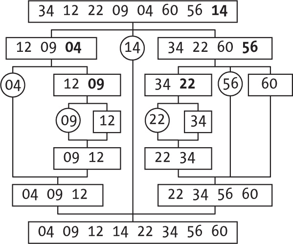

图 6-8：快速排序通过划分数组并递归地对各部分进行排序来实现。

假设我们始终选择数组中最右侧的元素作为枢轴。（这不会是一个明智的选择，正如你将看到的那样。）在这种情况下，第一个选择是 14，然后重新排列数组，使得所有小于 14 的值排在前面，接着是 14 本身，最后是所有大于 14 的值。相同的过程（选择枢轴、重新排列并递归排序）应用于每个子数组，直到整个数组排序完成。

这是该过程的直接实现：

```
const quickSort = (arr, left = 0, right = arr.length - 1) => {
❶ if (left < right) {
  ❷ const pivot = arr[right];

  ❸ let p = left;
    for (let j = left; j < right; j++) {
      if (pivot > arr[j]) {
        [arr[p], arr[j]] = [arr[j], arr[p]];
        p++;
      }
    }
  ❹ [arr[p], arr[right]] = [arr[right], arr[p]];

    // Recursively sort the two partitions
  ❺ quickSort(arr, left, p – 1);
    quickSort(arr, p + 1, right);
  }

  return arr;
};
```

首先，检查是否真的有需要排序的内容；如果左指针大于或等于右指针，说明已经完成 ❶。最右侧的元素将是枢轴 ❷。接下来，从左到右遍历数组 ❸，以类似插入排序的方式交换元素，确保较小的元素移到左边，较大的元素移到右边，枢轴最终位于位置 p ❹。手动模拟枢轴代码的执行过程是个好主意。尽管代码简短，但要正确实现它还是有点棘手的。（如果枢轴值在数组中出现多次，会发生什么？参见问题 6.10。）最后，使用递归对两个分区进行排序 ❺。

分析表明，*平均而言*，快速排序的时间复杂度是 *O*(*n* log *n*)。然而，最坏情况是很容易找到的。考虑对一个已经排序好的（升序或降序）数组进行排序。检查代码后发现，划分操作总是会以只有一个子数组的形式结束，这就等同于选择排序或冒泡排序，意味着性能会降至 *O*(*n*²)。但你可以修复这个问题。

##### 枢轴选择技巧

枢轴的选择对快速排序的性能有着重大影响。特别是，如果你总是选择数组中最大的（或最小的）元素，排序速度会受到负面影响，因此请考虑一些替代的枢轴选择技巧。

避免已排序数组问题的第一个解决方案是随机选择枢轴。选择左侧和右侧之间的一个随机位置（包括边界），如果需要，将选中的元素交换到最右侧位置，然后继续执行算法的其他部分，而不做进一步的修改：

```
❶ const iPivot = Math.floor(left + (right + 1 - left) * Math.random());
❷ if (iPivot !== right) {
  [arr[iPivot], arr[right]] = [arr[right], arr[iPivot]];
}
```

我们将在第八章中更详细地讨论随机选择，但你计算 iPivot（枢轴位置）❶的方式会从左到右（包括边界）以相等的概率选择一个值。排序算法的其余部分假设所选枢轴在数组的右侧，因此，如果选中的枢轴在其他位置❷，只需进行交换。

这个随机选择解决了几乎已排序数组的最坏情况，但仍然存在（虽然概率很低）你总是刚好选到数组中最大的或最小的值的可能性，在这种情况下，性能会受到影响。

理想的枢轴是什么？选择数组的中位数（即将数组分成两部分的值）是最优的。一条接近的规则叫做*三数中位数*：选择数组中左边、中央和右边元素的中位数：

```
const middle = Math.floor((left + right) / 2);
if (arr[left] > arr[middle]) {
  [arr[left], arr[middle]] = [arr[middle], arr[left]];
}
if (arr[left] > arr[right]) {
  [arr[left], arr[right]] = [arr[right], arr[left]];
}
if (arr[right] > arr[middle]) {
  [arr[right], arr[middle]] = [arr[middle], arr[right]];
}
```

对这个代码进行测试，使用三个值的所有可能排列，结果表明`arr[right]`总是以中间值结束。更好的是，你可以选择“第九分位数”，定义为“中位数的中位数”：将数组分成三部分，对每一部分应用三数中位数算法，然后取这三者的中位数。

通过仔细选择枢轴，你可以帮助快速排序变得更快，但你还可以进一步优化它。

##### 混合版本

快速排序很快，但所有的枢轴和递归都会影响运行时间，因此对于小数组，简单算法的组合可能实际表现得更快。你可以应用一种*混合算法*，将两种不同的方法结合使用。例如，你可能会发现，对于某个特定的数组大小阈值，插入排序表现更好，因此每当你想对一个小于该阈值的数组进行排序时，就切换到该算法：

```
**const CUTOFF = 7;**

const quickSort = (arr, left = 0, right = arr.length - 1) => {
  if (left < right) {
 **if (right - left < CUTOFF) {**
 **insertionSort(arr, left, right);**
    } else {
      //
      // quicksort as before
      //
    }
  }

  return arr;
};
```

粗体部分是你需要更改的所有内容。定义截止值，然后在排序时，如果数组足够小，应用替代排序方法。

##### 双枢轴版本

你可以将将数组分为两部分并由一个枢轴分隔的思想，扩展为由两个枢轴分隔的三部分。这个双枢轴版本通常更快。（Java 使用它作为原始数据类型的默认排序算法。）选择最左和最右的元素作为枢轴，如 图 6-9 所示。

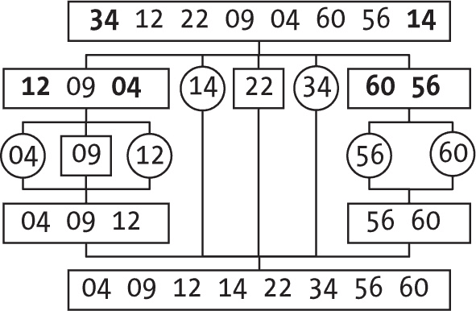

图 6-9：双枢轴排序类似于快速排序，但它将数组分成三部分而不是两部分。

从选择 34 和 14 作为枢轴开始，并重新排列数组，使得所有小于 14 的值（12、9、4）排在前面，然后是 14 本身，然后是介于 14 和 34 之间的值（只有 22），接着是 34，最后是大于 34 的值（60、56）。然后，每个子数组使用相同的方法再次排序。

该算法类似于基本的快速排序；主要区别在于枢轴的选择和分区。出于性能考虑，当要排序的数组足够小时，你将采用混合方法，并转为插入排序；例如：

```
const dualPivot = (arr, left = 0, right = arr.length - 1) => {
  if (left < right) {
    if (right - left < CUTOFF) {
      insertionSort(arr, left, right);
    } else {
      // Choose outermost elements as pivots.
    ❶ if (arr[left] > arr[right]) {
        [arr[left], arr[right]] = [arr[right], arr[left]];
      }
      const pivotLeft = arr[left];
      const pivotRight = arr[right];

      let ll = left + 1;
      let rr = right - 1;
    ❷ for (let mm = ll; mm <= rr; mm++) {
      ❸ if (pivotLeft > arr[mm]) {
          [arr[mm], arr[ll]] = [arr[ll], arr[mm]];
          ll++;
      ❹} else if (arr[mm] > pivotRight) {
          while (arr[rr] > pivotRight && mm < rr) {
            rr--;
          }
          [arr[mm], arr[rr]] = [arr[rr], arr[mm]];
          rr--;

          if (pivotLeft > arr[mm]) {
            [arr[mm], arr[ll]] = [arr[ll], arr[mm]];
            ll++;
          }
        }
      }
    ❺ ll--;
      rr++;
      [arr[left], arr[ll]] = [arr[ll], arr[left]];
      [arr[right], arr[rr]] = [arr[rr], arr[right]];

    ❻ dualPivot(arr, left, ll - 1);
      dualPivot(arr, ll + 1, rr - 1);
      dualPivot(arr, rr + 1, right);
    }
  }

  return arr;
};
```

你选择最左侧和最右侧的元素作为枢轴，但当然，你可以选择任意两个值并交换它们，使它们最终位于数组的两端，较小的值在左 ❶。（实际上，当处理几乎有序的数组时，选择两个中间元素更好。）接下来，你开始交换元素，保持以下不变式：

+   pivotLeft 位于数组的左侧。

+   从位置 left + 1 到 ll - 1，所有值都小于 pivotLeft。

+   从位置 ll 到 mm - 1，所有值严格位于 pivotLeft 和 pivotRight 之间。

+   从位置 mm 到 rr，值的状态尚未确定。

+   从位置 rr + 1 到 right - 1，所有值都大于 pivotRight。

+   pivotRight 位于数组的右侧。

你可以通过从一开始就设定 mm 为 left + 1 并让它逐步增大直到到达数组末尾 ❷，来建立这个不变式。如果 mm 处的元素小于 pivotLeft ❸，仅需要交换即可保持不变式。如果 mm 处的元素大于 pivotRight ❹，你需要做更多的工作来保持不变式，将 rr 向左移动。（记住，目标是保持不变式；这个循环确保了倒数第二个不变式。）循环完成后 ❺，交换枢轴到它们的最终位置，并应用递归对三个分区进行排序 ❻。

快速排序是一个非常好的算法，有多种变体，但它总是存在着（尽管很小）性能不佳的可能性。

#### 使用归并排序提升性能

我们将通过*归并排序*算法来结束我们的比较类排序学习，归并排序能够保证稳定的性能，但代价是需要更高的内存。归并排序基本上通过合并来完成所有排序。如果你有两个已排序的值序列，总共*n*个元素，将它们合并成一个有序序列可以通过*O*(*n*)的过程完成。归并排序的关键思想是应用递归。首先，将待排序的数组分成两半，然后递归地排序每一半，最后将两个已排序的部分合并成一个有序序列（见图 6-10）。

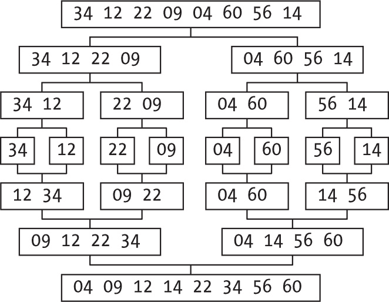

图 6-10：归并排序将数组分成两部分，对其排序，然后通过合并它们结束。

每个待排序的数组都会被分成两部分，分别排序后再合并。要排序一个 8 元素的数组，你需要先排序两个 4 元素的数组，这意味着你需要排序四个 2 元素的数组，而这又需要排序八个 1 元素的数组。排序后者非常简单（不用做任何事），而合并过程则重新构建了原数组。

这是一个递归实现：

```
const mergesort = (arr, left = 0, right = arr.length - 1) => {
❶ if (right > left) {
  ❷ const split = Math.floor((left + right) / 2);

  ❸ const arrL = mergesort(arr.slice(left, split + 1));
    const arrR = mergesort(arr.slice(split + 1, right + 1));

  ❹ let ll = 0;
    let rr = 0;
    for (let i = left; i <= right; i++) {
      if (
        ll !== arrL.length &&
        (rr === arrR.length || !arrR[ll] > arrL[rr])
      ) {
        arr[i] = arrL[ll];
        ll++;
      } else {
        arr[i] = arrR[rr];
        rr++;
      }
    }
  }

  return arr;
};
```

首先，检查是否需要排序❶，这可能包括一种混合方法，如果数组足够小，你可以采用其他方法，而不是归并排序。然后将数组分成两半❷，并递归地排序每一半❸。接下来，合并两个已排序的数组❹：ll 和 rr 将遍历每个数组，输出将放入原数组中。最后，返回排序后的数组。

归并排序具有非常好的性能（尽管执行合并时需要额外的空间），它实际上是*Tim 排序*的基础，Tim 排序是一种稳定的自适应方法，广泛应用于各种场景。Java 采用了它，JavaScript 也在 V8 引擎中应用了它，其他语言也使用它。我们不打算深入探讨其实际实现，因为这个算法比我们之前考虑的算法要长得多（GitHub 上的几个实现几乎有 1,000 行代码）。Tim 排序利用了已经有序的元素序列，通过合并较短的序列来生成更长的序列，并应用插入排序来确保序列足够长。你已经学习了构成完整 Tim 排序算法的所有部分。

> 注意

*关于基于比较的排序方法还有更多内容可以学习，但我们将在看到一些数据结构之前推迟考虑更多的算法。在第十四章中，我们将探索优先队列和堆。同样，在第十二章中，我们将学习二叉树，特别是二叉搜索树。通过将所有要排序的元素添加到这样的结构中，你可以稍后按顺序遍历它，从而产生另一种排序方法，尽管这种解决方案的性能和相对复杂性使得它并不特别吸引人。二叉搜索树更侧重于搜索；排序只是一个*副产品*。同样，像跳表这样的其他结构（我们将在第十一章中分析）也可以提供一种排序方法，但和二叉搜索树一样，排序并不是它的主要目的。*

### 无需比较的排序

在上一节中，所有的排序算法都依赖于比较键值，并利用这些信息来移动、交换或划分值。但还有其他的排序方法。例如，假设你负责客户支持并且收到许多不同原因的电子邮件。如何简化分类任务呢？你可以为每个类别使用不同的电子邮件地址，这样消息就会自动被分类到正确的处理箱中。

这个简单的解决方案展示了我们将要做的事情。基本上，你不会比较键值；相反，你将利用它们的值来确定它们在最终排序列表中的位置。这并非总是可能的，但如果你能应用这里的方法，性能将变为*O*(*n*)，这是无法超越的。毕竟，没有算法可以在不至少看一次这些值的情况下对*n*个值进行排序，而这本身就是一个*O*(*n*)的过程。在这一节中，我们将考虑几种方法，*位图排序*和*计数排序*，我们还会看看一种非常古老的排序方法，*基数排序*，它的起源与使用打孔卡片做普查工作的制表机相当。

#### 位图排序

让我们从一种性能优秀但有一些限制的排序方法开始，如果你能接受这些限制的话。我们必须做出三个假设。首先，你将只对数字进行排序（没有键+数据）。其次，你知道数字的可能范围，而且范围不是很大。（例如，如果你只知道它们是 64 位数字，那么从最低到最高的数字范围就会让你放弃尝试这个算法。）第三，这些数字不会重复；所有要排序的数字都是不同的。

考虑到这些（太多的）限制，你可以轻松地使用位图。假设你从所有位都关闭开始，每当你读取一个数字时，就将该位设置为开启。完成后，按照顺序检查这些位，每当某一位被设置时，就输出对应的数字，完成排序（见图 6-11）。

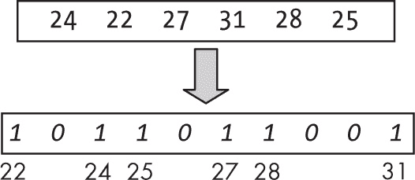

图 6-11：位图排序利用了已知要排序的值的范围。

你必须遍历所有数字，找到最小值和最大值，以定义位图的大小。之后，再次遍历这些数字，每当一个数字出现时，就设置一个标志位。在图 6-11 中，设置了与数字 22、24、25、27、28 和 31 对应的位。 (JavaScript 规定所有数组从位置 0 开始，因此你需要记住位置 0 实际上对应键 22，位置 1 对应键 23，依此类推。) 最后，遍历位图，输出那些标志位被设置的数字；这很简单。

这个算法有局限性，但它是另一个改进算法的基础。为了简单起见，这个例子将使用布尔值数组而不是位图，并编写以下代码：

```
const bitmapSort = (arr, from = 0, to = arr.length - 1) => {
❶ const copy = arr.slice(from, to + 1);
❷ const minKey = Math.min(...copy);
  const maxKey = Math.max(...copy);

❸ const bitmap = new Array(maxKey - minKey + 1).fill(false);
❹ copy.forEach((v) => {
  ❺ if (bitmap[v - minKey]) {
      throw new Error("Cannot sort... duplicate values");
  ❻} else {
      bitmap[v - minKey] = true;
    }
  });

❼ let k = from;
  bitmap.forEach((v, i) => {
  ❽ if (v) {
      arr[k] = i + minKey;
      k++;
    }
  });

  return arr;
};
```

首先，复制输入数组 ❶ 以简化下一步，即确定最小值和最大值 ❷。（这可以在一个稍微更高效的循环中完成。）然后创建一个合适长度的位图数组 ❸，但实际上你将使用常规布尔值，而不是位。你需要小心索引，因为 JavaScript 的数组总是从零开始；需要进行一些索引计算，将键与数组位置对应起来。接着遍历输入数组 ❹，检查该键是否已经出现。如果是 ❺，那就有问题。如果不是 ❻，只需标记该数字已出现。最后，遍历位图 ❼，每当找到已设置的标志 ❽ 时，输出相应的数字。

无法处理重复键是一个严重的局限，另外只处理数字也是一个限制；你需要能够对由键+数据组成的元素进行排序，就像你迄今为止所探索的所有其他算法一样。

#### 计数排序

前面的排序方法非常有效，但仅适用于有限的情况。你可以通过计算每个排序元素应该去哪里来进行改进。为此，你需要统计每个键出现的次数，然后利用这些信息决定如何将排序元素放入输出数组中（见图 6-12）。

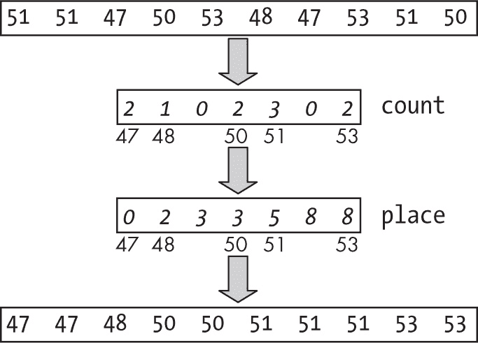

图 6-12：计数排序与位图排序有些相似，但它能够处理重复的键。

与位图排序类似，你需要找到待排序数组中的最小值和最大值，并设置一个计数器数组，所有值初始化为零。（再次提醒，位置 0 对应最小键，这里是 47；位置 1 对应 48，以此类推。）然后再次遍历数组，递增相应的计数器。得到所有计数后，你可以按照一个简单的过程确定每个键的放置位置。例如，最小键（47）的元素从输出数组的第 0 位置开始；下一个键（48）的元素在两位后的位置（因为有两个 47）开始，位于位置 2。每个新的键都会放在前一个键的右边，留下足够的空位来安置所有前面的元素。

这个算法的实现步骤如下：

```
const countingSort = (arr, from = 0, to = arr.length - 1) => {
❶ const copy = arr.slice(from, to + 1);
  const minKey = Math.min(...copy);
  const maxKey = Math.max(...copy);

❷ const count = new Array(maxKey - minKey + 1).fill(0);
❸ copy.forEach((v) => count[v – minKey]++);

❹ const place = new Array(maxKey - minKey + 1).fill(0);
❺ place.forEach((v, i) => {
    place[i] = i === 0 ? from : place[i - 1] + count[i - 1];
  });

❻ copy.forEach((v) => {
    arr[place[v - minKey]] = v;
 ❼ place[v – minKey]++;
  });

  return arr;
};
```

这个算法的前三行与位图排序相同❶，你需要创建输入数组的副本并确定最小和最大键。然后创建一个包含所有键计数的数组（初始化为零，并需要像位图排序那样的索引计算❷）。接下来遍历输入数据❸，并对每个键值递增计数。然后生成一个新数组❹来计算每个键元素的起始位置。最小键从位置 0 开始，每个键之间根据前一个键的计数相隔若干位置❺。（例如，如果前一个计数是 5，则新键与前一个键的首次出现位置相隔 5 个位置。）最后，使用位置数组开始将排序后的元素放置到正确的位置❻；每次元素被放入输出数组时，对应的位置会递增 1❼，以便下一个相同键的元素能够放置到正确的位置。

#### 基数排序

本章的最后一种排序算法可能是最古老的。它曾在使用霍勒里斯打孔卡片（参见图 6-13）进行人口普查数据汇总时使用，这发生在 IBM 成立的早期。

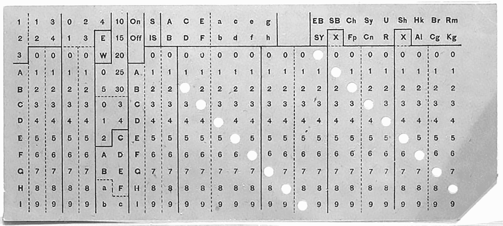

图 6-13：原始霍勒里斯卡片（公共领域）

假设你有一组无序的打孔卡片，按第 1 列到第 6 列编号，并且你想要对它们进行排序。使用*分类器*，一种根据特定列的值将卡片分到不同箱子的机器，你可以按照以下步骤进行操作：

1. 按照第 6 列将卡片分到不同的箱子中，先选择 0 的卡片，再选择 1 的卡片，依此类推，直到最后选择 9 的卡片。你已经按照第六列对卡片进行了排序，但仍然需要继续工作。

2. 重复相同的过程，但使用第 5 列。当你拿起卡片时，你会发现它们已经按两列排序（请参阅第 93 页的“排序稳定性”部分以了解原因）。

3. 按照顺序再次对第 4 列、第 3 列、第 2 列和第 1 列执行相同的过程，最终你将得到一副完全排序的卡片。

你将在第十章中更详细地探讨这个算法，当时你会研究列表，这将是你模拟箱子的方法。

### 低效排序算法

我们将以一种不太严肃的方式结束，考虑一些真正低效的算法，从差到更差。这些算法不打算用于实际应用！

#### 傻瓜排序

这个算法的名字来自于“三个傻瓜”喜剧团体，如果你熟悉他们，它的低效性会让你想起他们的荒诞行为。排序一个列表的过程从比较其第一个和最后一个元素开始，如果需要的话交换它们，以确保较大的元素位于末尾。接下来，它递归地对列表的最初三分之二部分应用傻瓜排序，然后对列表的最后三分之二部分进行排序（这样可以确保最后三分之一部分按顺序包含最大值），最后再次对列表的前两部分进行排序。所需的比较次数满足 *C*(*n*) = 3*C*(2*n* / 3) + 1，因此该算法的复杂度是 *O*(*n*^(2.71))，这使得它的表现比冒泡排序还差，但还有更糟的。

#### 慢排序

这个算法是作为笑话设计的。它不是基于分治法，而是基于“乘法与投降”。作者为发现一个比以前任何算法都更糟的算法而感到自豪。要排序一个包含两个或更多元素的数组，算法首先将其一分为二，然后使用递归分别排序每一部分。最后，它比较每一部分的最后一个元素，并将其（如有需要，进行交换）放置到原数组的末尾。完成这一操作后，算法继续排序已经提取出的最大值列表。该算法的比较次数满足 *C*(*n*) = 2*C*(*n* / 2) + *C*(*n* – 1) + 1，且其时间为 *O*(*n* ^(log) *^n*)。它甚至不是多项式时间的！

#### 排列排序

在第五章中，你已经看到如何从一个值的排列转到下一个排列，这暗示了一个更糟的排序算法：反复尝试生成元素的下一个排列，直到算法失败，因为达到了最后一个排列，然后再反转序列。对于一个随机顺序，该算法平均需要测试 *n*! / 2 个排列，这意味着它的时间至少是阶乘级别的。对于几乎任何大小，算法都因运行时间过长而无法执行。

#### 博格排序

最后的算法名字来源于 *bogus*（假的）和 *sort*（排序）这两个词的合成，它是一种概率性算法，通过概率 1 来排序输入，但没有任何关于运行时间的确定性。这个思路也与排列有关：如果待排序的列表不是有序的，它就会随机打乱元素（我们将在第八章中看到类似的算法），然后再进行测试。如果你将这种方法应用于排序一副牌，逻辑如下：如果牌没有按顺序排列，就把它们抛向空中，捡起来，再检查一次——成功的几率是 1/52!，大约是十亿亿亿亿亿亿亿亿亿亿亿的几率。并不太好！

#### 睡眠排序

最后的排序算法专为 JavaScript 设计，其运行时间取决于要排序的最大键值。它适用于数字键，其思想是：如果输入键是 *K*，则等待 *K* 秒并输出其值。经过足够的时间，所有值将按顺序输出：

```
const sleepSort = (arr) =>
  arr.forEach((v) => setTimeout(() => console.log(v), v * 1000));
```

即使这个算法看起来能够工作，使用足够大的数据集时，它可能会崩溃（因为等待超时过多）或失败。该算法会遍历列表并开始输出数字——可以想象处理一个类似于 1, 2, 2, 2, . . . , 2, 2, 0 这样的列表，当 2 的数量足够多时，初始的 1 可能会在最后一个 0 被处理之前就输出。

### 总结

在本章中，我们探索了几种具有不同性能水平的排序算法。在下一章中，我们将探讨一个类似的主题——选择问题，它类似于对数组的一部分进行排序，因为你并不关心将所有元素按正确顺序排序，而是只关心将一个元素放到最终位置，而不一定是排序整个列表。

### 问题

**6.1 强制反转**

假设你想将一组数字按降序排列，但你有一个只按升序排序且没有任何选项可更改其排序方式的排序函数。你如何管理这些数据，按你希望的方式排序？

**6.2 仅限下限**

假设你有一个布尔函数 lower(a, b)，如果 a 在排序中小于 b，则返回 true，否则返回 false。你如何利用它来判断 a 是否大于 b 的排序顺序？你又如何用它来判断两个键是否相等？

**6.3 测试排序算法**

想象你正在尝试一种你自己设计的新排序算法。你将如何测试它是否正确排序？

**6.4 缺失 ID**

假设你获得了一组六位数的 ID，但总数少于 1,000,000，因此至少有一个 ID 是缺失的。你如何找到这个缺失的 ID？

**6.5 未匹配的一个**

假设你有一个包含交易号的数组，每个数字应该在数组中出现两次，但你知道有个错误，出现了一个只出现一次的交易号。你如何检测到这个错误？

**6.6 下沉排序**

这是一种冒泡排序的变种。与从数组底部开始让较大的值冒泡到顶部不同，沉降排序从数组顶部开始，让较小的值沉到底部。在性能上，它和冒泡排序相同，但如果你只想找到数组中最小的*k*个元素，它可能会派上用场，正如你在第七章中看到的那样。你能实现沉降排序吗？

**6.7  气泡交换检查**

在每次遍历数组后，给冒泡排序添加一个测试，若没有检测到交换则提前退出。如果你处理的是几乎有序的数组，并且只有少数交换就能将所有元素放到正确位置，这个测试将加速排序过程。

**6.8  递归插入**

你能用递归的方式实现插入排序吗？

**6.9  稳定的 Shell 排序？**

Shell 排序是稳定的吗？

**6.10  荷兰国旗增强法**

荷兰国旗问题要求你对数组进行排序，数组中的元素要么是红色、白色或蓝色，排序后的顺序是所有红色元素排在前面，接着是所有白色元素，最后是所有蓝色元素，和荷兰国旗的颜色顺序一样。展示一下如何通过将待排序数组重新排列为三个部分：所有小于基准元素的元素、所有等于基准元素的元素和所有大于基准元素的元素，来提升快速排序的性能。中间的部分不需要再进行排序。

**6.11  更简单的合并？**

在归并排序中合并两个子数组时，你写了以下内容（特别注意加粗的部分）：

```
for (let i = left; i <= right; i++) {
  if (ll !== arrL.length && (rr === arrR.length || **!arrR[ll] > arrL[rr]**)) {
    ...
  } else {
    ...
  }
}
```

为什么这样写？你总是希望使用大于运算符进行比较，以便能够轻松地替换为更复杂的比较函数，但是为什么不写成`arr[rr]>arr[ll]`呢？

**6.12  尽量避免负数**

如果基数排序中有负数会发生什么？如果有非整数值会怎么样？你能解决这个问题吗？

**6.13  填满它！**

在基数排序中，假设你想用 10 个空数组来初始化桶数组，你可以这样做：

```
const buckets = Array(10).fill(0).map(() => []);
```

为什么下面的替代方法不可行？

```
const buckets = Array(10).fill([])
```

那么，这种可能性呢？

```
const buckets = Array(10).map(() => [])
```

**6.14  字母呢？**

你会如何修改基数排序，使其适用于字母字符串？
