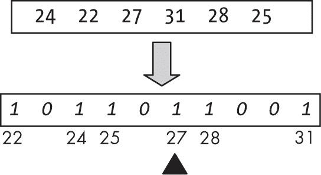
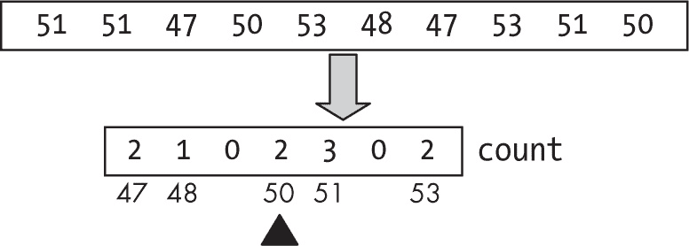
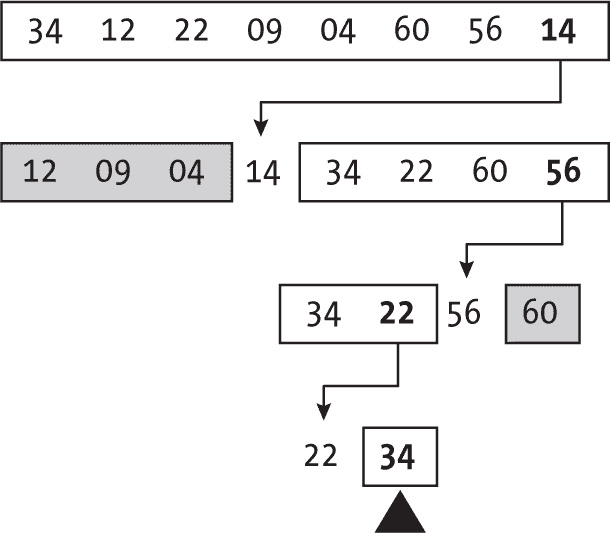
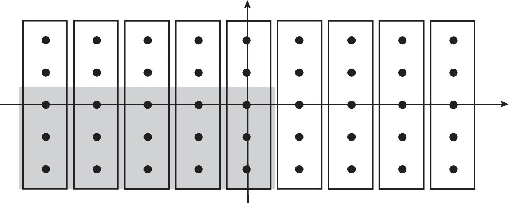
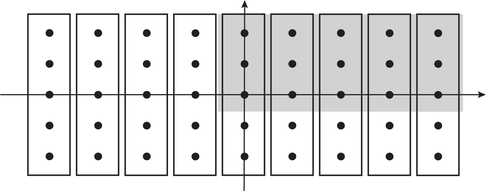
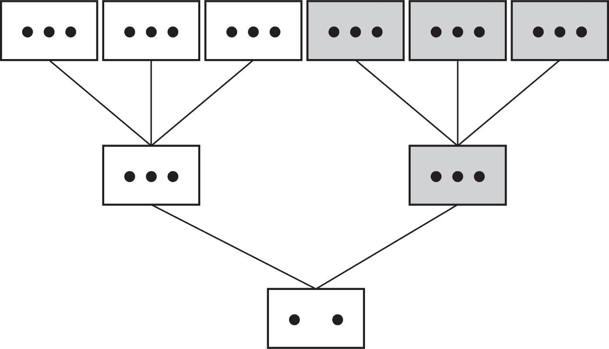

<hgroup>

## 7 选择

</hgroup>


在上一章中，我们讨论了排序问题，在这里我们将考虑一个与排序有很多相似算法的相关问题：*选择*。基本情况是，给定一个数字*k*和一个包含*n*个项的数组，我们希望找到数组中第*k*个位置的值，假如我们对数组进行了排序。但实际上我们并不需要排序数组；我们只需要知道它的第*k*个元素。与排序问题不同，JavaScript 并没有提供一个“现成”的选择解决方案，因此，如果你需要这种功能，你必须使用本章中的某些算法。

这个问题与排序的关系很简单：如果你只是对值列表进行排序（使用上一章中的任何算法），你可以快速地为所有可能的*k*值生成排序列表中的第*k*个值；你只需要查看排序数组中的第*k*个位置。如果你确实需要从同一个数组中进行多次选择，这将是一个很好的解决方案；一个 *O*(n log n) 排序，接着进行多个 *O*(1) 选择。然而，实际上并没有要求对列表进行排序，我们将尽量避免这样做。本章将探讨的选择算法比排序算法表现得更好，因为它们不需要排序所有内容。

在选择问题中，如果你请求 *k* = 1，你就是在请求列表中的最小值；*k* = *n* 请求最大值，*k* = *n*/2 请求中位数。请记住，在“实际情况”中，*k* 的范围是从 1 到 *n*，但是由于 JavaScript 的数组是从 0 开始的，*k* 的范围是从 0 到数组长度减一。

> 注意

*正式来说，如果值列表的长度是偶数，中位数的定义要求取排序数组中两个中心值的平均值，但我们并不这么做。为了让你的选择代码能够输出偶数长度数组的中位数，你需要调用选择算法两次，获取两个中心值，然后再计算它们的均值。我们只处理找到任何给定位置的值的问题。*

### 无比较的选择

就像你可以实现不需要比较的排序（意思是你永远不需要将一个键与另一个键进行比较），你也可以使用位图排序和计数排序方法的变体来快速找到列表的第*k*个值，而无需尝试部分排序数据。请记住，这些算法是有限制的；它们仅适用于数字（而不是任何类型的键+数据），并且最好是数字位于一个不太广泛的范围内。

#### 位图选择

位图排序通过读取所有数据并在位图中设置位来工作；然后，输出排序后的数字只需要遍历位图。在这里你也会做同样的事情，只不过不会输出所有数字；你只需要位图中的第*k*个值。图 7-1 展示了这个方法；假设你想要在与第六章中示例相同的数组中找到第 4 个元素。



图 7-1：位图排序的变体提供了一个快速选择算法。

首先生成位图，然后遍历位图，寻找第 4 个设置的位，在本例中对应的是 27。

代码如下：

```
❶ const bitmapSelect = (arr, k, from = 0, to = arr.length - 1) => {
❷ const copy = arr.slice(from, to + 1);
  const minKey = Math.min(...copy);
  const maxKey = Math.max(...copy);

  const bitmap = new Array(maxKey - minKey + 1).fill(false);
  copy.forEach((v) => {
    if (bitmap[v - minKey]) {
      throw new Error("Cannot select... duplicate values");
    } else {
      bitmap[v - minKey] = true;
    }
  });

❸ **for (let i = minKey, j = from; i <= maxKey; i++) {**
❹ **if (bitmap[i - minKey]) {**
❺ **if (j === k) {**
❻ **return i;**
 **}**
❼ **j++;**
 **}**
 **}**
};
```

该算法的参数与排序❶时相同，唯一增加的是*k*，即感兴趣的位置。创建位图❷的逻辑与排序时完全相同；唯一的区别出现在最终输出❸。将计数器 j 设置为数组的第一个位置，每次找到一个设置位❹时，测试 j 是否达到了所需的位置*k*❺；如果达到了，就完成了❻。否则，继续循环，计数下一个找到的数字❼。

这个算法显然是*O*(*n*)，如果不是因为之前提到的限制，它将是解决选择问题的最佳算法之一。

#### 计数选择

在与位图排序相同的情况下，在第六章中我们考虑了计数排序，如果输入中有重复数字则没有问题。然而，使用位图时，这种情况就成了一个问题。

你可以应用相同的解决方案：遍历数组，生成计数列表，然后从左到右遍历这些计数，直到找到第*k*个位置的值。

以使用第六章中的相同数字为例（参见图 7-2）；你想要找到数组中第 4 个位置的值。



图 7-2：计数排序也提供了一个简单的选择算法。

首先找到所有的计数，然后从左到右依次累加，直到累加和等于或超过 4；在这种情况下，当累积和从 3 变到 5 时，发生在值 50 处。（请记住，在输入数组中存在重复值时，可能会发生和超过*k*的情况。）

逻辑如下：

```
❶ const countingSelect = (arr, k, from = 0, to = arr.length - 1) => {
❷ const copy = arr.slice(from, to + 1);
  const minKey = Math.min(...copy);
  const maxKey = Math.max(...copy);

  const count = new Array(maxKey - minKey + 1).fill(0);
  copy.forEach((v) => count[v - minKey]++);

❸ **for (let i = minKey, j = from; i <= maxKey; i++) {**
❹ **if (count[i - minKey]) {**
❺ **j += count[i – minKey];**
❻ **if (j > k) {**
 **return i;**
 **}**
 **}**
 **}**
};
```

参数与之前❶相同，生成计数❷的所有逻辑也与第六章中的相同。变化出现在准备输出时。首先初始化一个计数器 j，位于输入数组的第一个位置❸，每次遇到非零计数❹时，更新计数器❺并检查是否通过该和达到了或超过了*k*。如果是，则返回相应的值❻；否则，继续循环。

同样，我们有一个*O*(*n*)算法，但我们希望能够处理更一般的情况，因此让我们继续讨论基于键对键比较的选择算法，这些算法在所有情况下都适用。

### 使用比较进行选择

大多数选择问题的算法都基于排序算法。我们将探讨的第一个算法基于选择排序，但我们不会对整个数组进行排序——只会排序它的前*k*个值。选择排序通过找到数组中的最小值，并将其与第一个位置的值交换；然后，它继续寻找剩余值中的最小值，并将其与第二个位置的值交换，依此类推，直到整个数组排序完成。我们将采取相同的方法，但在找到第*k*个最小值后停止：

```
❶ const sortingSelect = (arr, k, from = 0, to = arr.length - 1) => {
❷ for (let i = from; i <= k; i++) {
    let m = i;
    for (let j = i + 1; j <= to; j++) {
      if (arr[m] > arr[j]) {
        m = j;
      }
    }
    if (m !== i) {
      [arr[i], arr[m]] = [arr[m], arr[i]];
    }
  }

❸ return arr[k];
};
```

这个算法的参数与之前相同❶。我们在循环中做了一些小改动。在排序时，你遍历了整个数组，但现在在达到第*k*个位置后就会停止❷。其余的逻辑与排序算法完全相同，只是你返回的是所需的值，而不是排序后的数组❸。

该算法的性能为*O*(*kn*)，对于较小的*k*值是高效的，但如果*k*增大并且与*n*成正比时，性能会趋于差劲。（请参见问题 7.3，了解一种特殊情况。）特别地，如果你要查找数组的中间元素，那么*k* = *n* / 2，性能会变成*O*(*n*²)；这时使用其他算法会更好。

### Quickselect 系列

许多选择算法源自快速排序代码，特别是它如何根据枢轴分割数组，将值移动，使得数组的一侧包含小于枢轴的值，枢轴本身位于中间，另一侧则包含大于枢轴的值。在快速排序的情况下，数组这样分割后，算法会递归地对两个部分进行排序；而在选择算法中，你只会在其中一个部分继续搜索。有关如何查找数组第六个元素的示例，请参见图 7-3。



图 7-3：快速排序中使用的枢轴技术提供了一种选择算法。

你将使用与快速排序相同的首个枢轴方案，并选择最右边的值（14）作为枢轴。将数组围绕 14 重新分区后，枢轴将位于数组的第 4 个位置。你要查找的是第六个元素，所以继续在枢轴右侧进行搜索。在右侧，你选择 56 作为枢轴，重新分区后，56 将位于数组的第 7 个位置。这个位置超过了你需要的位置，因此继续在左侧搜索。然后你选择 22 作为枢轴。它位于第 5 个位置，你继续在右侧搜索，此时右侧只剩下一个元素，因此你可以确定 34 是数组中的第六个值。在 34 的左侧是较小的值（但不一定按顺序排列），右侧是较大的值。

如 第六章 所提到的，快速排序的平均性能是 *O*(*n* log *n*)，但在最坏情况下，它变成 *O*(*n*²)。quickselect 的平均性能已被证明是 *O*(*n*)，但如果你每次都做出不幸的基准选择，它可能会变成 *O*(*n*²)，因此我们不仅研究单一算法，而是通过改变基准选择的方式来考虑这一系列算法。

#### Quickselect

让我们从基本逻辑开始。如同 第六章 中所述，假设是可以用 < 和 > 操作符进行比较的单字段键。始终编写测试 as a > b，因此将代码适配为更通用的比较函数，只需要编写 compare(a,b) > 0，前提是提供一个 compare(x,y) 函数，如果 x 大于 y，则返回正值。

以下代码实现了 quickselect 系列算法的基本结构；基准选择部分加粗显示，我们将对该部分进行更改，以获得其他增强版本的选择函数：

```
❶ const quickSelect = (arr, k, left = 0, right = arr.length - 1) => {
  if (left < right) {
 **const pick = left + Math.floor((right + 1 - left) * Math.random());**
 **if (pick !== right) {**
 **[arr[pick], arr[right]] = [arr[right], arr[pick]];**
 **}**
 const pivot = arr[right];

    let p = left;
    for (let j = left; j < right; j++) {
      if (pivot > arr[j]) {
        [arr[p], arr[j]] = [arr[j], arr[p]];
        p++;
      }
    }
  ❷ [arr[p], arr[right]] = [arr[right], arr[p]];

  ❸ if (p === k) {
     return;
  ❹} else if (p > k) {
     return quickSelect(arr, k, left, p - 1);
  ❺} else {
     return quickSelect(arr, k, p + 1, right);
   }
 }
};
```

quickselect ❶ 的参数与选择排序以及本章中所有算法的参数相同。该算法的开始与快速排序完全相同，可以选择随机的基准值，直到如何划分数组，包括让选择的基准值位于位置 p ❷。唯一的不同之处在于后续的处理方式。如果基准值位于 *k* 位置 ❸，那么就完成了，因为那就是你需要的值。否则，使用递归来检查包含 *k* 位置的左 ❹ 或右 ❺ 部分。（实际上，你不一定需要使用递归；请参见问题 7.4。）

quickselect 会重新排序（划分）输入数组，确保 *k* 位置的元素不小于它前面的任何元素，也不大于它后面的任何元素。你可以通过编写辅助函数轻松地获取该值：

```
const qSelect = (arr, k, left = 0, right = arr.length - 1) => {
❶ quickSelect(arr, k, left, right);
❷ return arr[k];
};
```

使用 quickselect 重新划分数组 ❶，然后返回所需位置的值 ❷。（有关简单修改，请参见问题 7.5。）平均而言，这个算法的时间复杂度可以证明是线性的，但如果每次都恰巧选择最差的基准值，它将变成二次复杂度。现在考虑一些替代的基准选择策略。

#### 中位数的中位数

以前版本的 quickselect 可能会变得较慢，但你可以更好地划分数组。例如，你不希望两个可能的划分都太小，以防你必须对较大的部分进行递归处理。

你可以应用的一种策略叫做 *中位数的中位数*，其思路如下：

1. 将数组分成最多五个元素一组。

2. 找到每组的中位数。

3. 找到前一步中找到的中位数的中位数。

4. 使用该值来划分数组。

图 7-4 展示了这个概念；每个矩形是一个由底部到顶部按从小到大的顺序排列的五个值的集合（如垂直箭头所示），其中中位数位于中间。中位数本身从左到右（最低的中位数到最高的中位数）按水平箭头顺序排列。你将选择的枢轴是这些中位数集合的中位数——图中的中心值。



图 7-4：每列中的中间元素是其中位数；这些中位数从左到右排序，且中心值不小于阴影部分的值，即数组的三分之一。

在图 7-4 中，所有灰色的值（45 个中的 15 个，整个集合的三分之一）*保证*不会大于所选的枢轴。同样，所选的枢轴也*保证*不会大于数组中另外三分之一的值（见图 7-5）。



图 7-5：在与图 7-4 相同的情况下，中心值也不大于阴影部分的值，即数组的三分之一。

这意味着所选的枢轴将使数组按某种方式分割为 33/66 百分比和 50/50 百分比。最坏情况下，你将需要在一个大小为原数组三分之二的新数组中应用递归（而最好情况仅为原数组的三分之一大小），这可以证明会产生*O*(*n*)的性能。

以下代码实现了此方法（粗体部分为已更改的部分）：

```
const quickSelect = (arr, k, left = 0, right = arr.length - 1) => {
  if (left < right) {
 **let mom;**
❶ **if (right - left < 5) {**
 **mom = simpleMedian(arr, left, right);**
 **} else {**
❷ **let j = left – 1;**
 **for (let i = left; i <= right; i += 5) {**
❸ **const med = simpleMedian(arr, i, Math.min(i + 4, right));**
 **j++;**
❹ **[arr[j], arr[med]] = [arr[med], arr[j]];**
 **}**
❺ **mom = Math.floor((left + j) / 2);**
❻ **quickSelect(arr, mom, left, j);**
 **}**
❼ **[arr[right], arr[mom]] = [arr[mom], arr[right]];**

    const pivot = arr[right];

    let p = left;
    for (let j = left; j < right; j++) {
      if (pivot > arr[j]) {
        [arr[p], arr[j]] = [arr[j], arr[p]];
        p++;
      }
    }
    [arr[p], arr[right]] = [arr[right], arr[p]];

    if (p === k) {
      return;
    } else if (p > k) {
      return quickSelect(arr, k, left, p - 1);
    } else {
      return quickSelect(arr, k, p + 1, right);
    }
  }
};
```

如果数组足够短（最多五个元素）❶，你可以使用另一种算法来找到中位数的中位数（mom）。如果数组有超过五个元素❷，则考虑每次处理五个元素的集合。你先找到该集合的中位数❸，并通过交换将其移到原数组的左侧❹，这样所有中位数最终会集中在数组左侧的位置。现在你需要计算这个（较小）集合的中位数，因此计算它的位置❺，并使用递归❻来找到所需的枢轴。一旦找到枢轴，交换它与数组右侧的值❼，从那时起，接下来的逻辑与前面展示的枢轴逻辑相同。

现在完成代码。你需要一个快速的 simpleMedian(...)算法来找到最多五个元素的数组的中位数，插入排序可以完成这个任务（你也可以使用第 124 页“通过比较选择”章节中的 sortingSelect(...)代码）：

```
const simpleMedian = (arr, left, right) => {
❶ insertionSort(arr, left, right);
❷ return Math.floor((left + right) / 2);
};
```

对整个数组进行排序❶，这并不会很慢，因为插入排序在处理这样的小集合时非常迅速，然后选择排序数组的中间元素❷。

这个逻辑效果良好，且结果有保障，不同于原始的快速选择算法，它的最坏情况与平均情况不同。

#### 重复步骤

选择基准的另一种变体叫做*重复步骤*。这个算法在分区数组时看似效果不佳，但它在速度方面有优势。使用“九分法”技术选择三个元素的中位数非常迅速（如第六章所述）：首先遍历数组，从每组三个值中选择中位数，生成一个集合；然后，遍历该中位数集合，从每组三个中位数中选择中位数，生成第二个集合。图 7-6 展示了对于一个包含 18 个元素的数组如何工作。这个思路对于更大的数组是一样的，只是这里没有足够的空间展示。



图 7-6：反复应用“三个中位数”过程将原数组缩小为原始大小的九分之一。

选择三元组中位数的重复步骤将原数组缩小为原始大小的九分之一，并使递归速度非常快。（从某种意义上说，你是在选择中位数的中位数的中位数。）其实现如下：

```
const simpleMedian = (arr, left, right) => {
  insertionSort(arr, left, right);
  return Math.floor((left + right) / 2);
};

const quickSelect = (arr, k, left = 0, right = arr.length - 1) => {
  if (left < right) {
❶ **let mom;**
❷ **if (right - left < 9) {**
 **mom = simpleMedian(arr, left, right);**
 **} else {**
❸ **let j1 = left - 1;**
❹ **for (let i = left; i <= right; i += 3) {**
 **const med = simpleMedian(arr, i, Math.min(i + 2, right));**
 **j1++;**
 **[arr[j1], arr[med]] = [arr[med], arr[j1]];**
 **}**

❺ **let j2 = left - 1;**
❻ **for (let i = left; i <= j1; i += 3) {**
 **const med = simpleMedian(arr, i, Math.min(i + 2, j1));**
 **j2++;**
 **[arr[j2], arr[med]] = [arr[med], arr[j2]];**
 **}**

❼ **mom = Math.floor((left + j2) / 2);**
 **quickSelect(arr, mom, left, j2);**
 **}**
❽ **[arr[right], arr[mom]] = [arr[mom], arr[right]];**

    const pivot = arr[right];

    let p = left;
    for (let j = left; j < right; j++) {
      if (pivot > arr[j]) {
        [arr[p], arr[j]] = [arr[j], arr[p]];
        p++;
      }
    }
    [arr[p], arr[right]] = [arr[right], arr[p]];

    if (p === k) {
      return;
    } else if (p > k) {
      quickSelect(arr, k, left, p - 1);
    } else {
      quickSelect(arr, k, p + 1, right);
    }
  }
};
```

mom 变量最终位于数组中的中位数位置 ❶。如果数组元素少于九个 ❷，你不需要做任何复杂的操作；只需使用基于排序的算法找到所需的中位数。变量 j1 跟踪你已交换到数组左侧的中位数 ❸。一个简单的循环遍历数组的元素，每次处理三个元素，找到该三元组的中位数并交换到左侧 ❹。然后，你再使用新的 j2 变量 ❺ 和另一个循环 ❻ 执行相同的逻辑。经过这些循环后，从左侧到 j2 位置的元素就是中位数的中位数 ❼，接着递归地应用算法找到其中位数，并将其与右侧的元素交换 ❽，这样你就可以继续进行其余的未变的快速选择算法。

该算法也可以证明具有 *O*(*n*) 的性能，因此它是一个不错的选择。为什么在找完两轮中位数的中位数后还要使用递归呢？（请参见问题 7.6。）

到目前为止，你已经探讨了可以找到任何值的*k*th 元素的算法；本章最后明确考虑了找到数组中间元素的问题。

### 使用懒选择法找到中位数

如果你想找到中位数（记住，这里的工作定义不是统计学中使用的那种；你只是选择数组中最接近中心的元素，而不考虑数组长度是否为偶数），你显然可以使用本章中的任何一种算法，设 *k* 为输入数组长度的一半。然而，还有一些其他方法可以找到中心值，在本节中，我们将考虑一种有趣的方法，它基于随机抽样（你将在第八章中学习抽样算法）和概率计算。懒选择算法使用抽样，并且可能通过一次遍历找到正确的值，具有 *O*(*n*^(–1/4)) 的失败概率，按需反复循环直到成功。

求解大小为 *n* 的集合 *S* 的中位数的算法如下：

1. 从 *S* 中随机选择一个大小为 *n*^(3/4) 的样本 *R*。

2. 使用任意算法对 *R* 进行排序。

3. 在 *R* 中选择两个值，*d* 和 *u*，使其满足 *d* < *median* < *u*，且具有较高的概率（稍后你会看到如何做到这一点）。

4. 设 *dSize* 为 *R* 中小于 *d* 的值的个数；如果 *dSize* > *n*/2，则表示失败，必须重新尝试。

5. 设 *uSize* 为 *R* 中大于 *u* 的值的个数；如果 *uSize* > *n*/2，则必须重新尝试。

6. 设 *m* 为 *S* 中值 *x* 的集合，满足 *d* < *x* < *u*；如果计数超过 4*n*^(3/4)，则必须重新尝试。

7. 对 *m* 进行排序，并返回其 *n*/2 - *dSize* 位置的值。

该算法的性能证明高度依赖于概率论的推理，这里不再展示。关键概念是，随机选择 *R* 中的值——但不要选择太多，以确保排序 *R* 的复杂度为 *O*(*n*)——通常应该足够找到中位数的上下限（即前面列表中的 *d* 和 *u*），而且在 *d* 和 *u* 之间的值集合应该足够小，因此，排序操作的复杂度仍然保持在 *O*(*n*) 以内。该算法可能会失败，但失败的概率很低，为 *O*(*n*^–^(1/4))，也就是说在最坏的情况下，几次新的尝试应该能成功。例如，如果失败的概率是 10%（即算法有 90% 的机会第一次就成功），那么连续两次失败的概率是 1%（10% 的 10%，成功的概率为 99%），三次连续失败的概率是每 1000 次失败一次，依此类推。

实现非常简单，但包含大量的数学计算：

```
❶ const sort = require("../sorting/mergesort");

const lazySelectMedian = (arr, left = 0, right = arr.length - 1) => {
❷ const len = right - left + 1;
❸ const sR = Math.floor(len ** 0.75);
❹ const dIndex = Math.max(0, Math.floor(sR / 2 – Math.sqrt(len)));
  const uIndex = Math.min(sR - 1, Math.ceil(sR / 2 + Math.sqrt(len)));
❺ let dSize, uSize, m;
  do {
  ❻ const r = [];
    for (let i = 0; i < sR; i++) {
      r.push(arr[left + Math.floor((right - left) * Math.random())]);
    }
  ❼ sort(r);

    dSize = uSize = 0;
    m = [];
    for (let i = left; i <= right; i++) {
      if (r[dIndex] > arr[i]) {
        dSize++;
      } else if (arr[i] > r[uIndex]) {
        uSize++;
      } else {
        m.push(arr[i]);
      }
    }
❽} while (dSize > len / 2 || uSize > len / 2 || m.length > 4 * sR);

❾ sort(m);
  return m[Math.floor(len / 2) - dSize];
};
```

当需要对数组进行排序时，你使用归并排序 ❶；选择一个 *O*(*n* log *n*) 的算法很重要，因为你将用于最大为 4*n*^(3/4) 大小的数组，因此性能为 *O*(4*n*^(3/4) log 4*n*^(3/4)) < *O*(*n*)。接着，你为其余的代码定义几个变量：len 是输入数组的大小 ❷，sR 是样本的大小 ❸，dIndex 和 uIndex 是排序后 r 数组中 d 和 u 的位置 ❹，而 dSize、uSize 和 m ❺ 与本节前面列出的描述相对应。

使用“带重复的抽样”算法 ❻ 从输入数组中选择 sR 个随机值到 r 数组中；确保没有重复的值被抽取也是可行的，但逻辑会更加复杂，正如你在第八章中看到的那样。选择并排序 r ❼后，计算 dSize 和 uSize（输入数组中小于 d 或大于 u 的值的数量；注意你从未定义 d 和 u，你只是通过它们的索引引用它们）和 m（值位于 d 和 u 之间）。

最后，你需要检查结果是否如预期 ❽。如果 dSize 或 uSize 包含超过一半的输入数组，那么中位数就不在 m 中，如预期的那样；你失败了。同样，如果 m 太大，你也失败了。如果所有测试都通过，m 的大小合适，允许你对其进行排序并从中选择中位数 ❾。注意，你还要考虑比 d 小的 dSize 值，这些值位于数组 m 之前。

这个算法与本书中大多数你考虑过的算法有很大不同，因为它依赖于概率性质才能工作，但通常性能非常好，能够在很少的迭代（如果有的话）中找到中位数。

### 摘要

在本章中，你研究了几种选择算法，其中大多数与第六章中讨论的排序算法密切相关。选择问题并不像排序问题那样常见，因此 JavaScript 没有提供现成的解决方法，所以如果你需要此功能，就必须实现本章中的算法。这里介绍的大多数算法具有*O*(*n*)的性能，这是最优的，但它们的行为证明通常较为复杂，因此被省略了。

### 问题

**7.1 网球淘汰赛**

假设 111 名网球选手参加淘汰赛以决出冠军。在每一轮中，选手随机配对进行比赛，失败者淘汰，获胜者晋级下一轮。如果选手数量为奇数，则有一名选手获得直接晋级下一轮的机会。为了找出冠军，至少需要多少场比赛？你还需要进行多少额外的比赛来找出第二好的选手？（而且，不是说输给冠军的选手一定是第二好的选手。）你能为*n*个选手概括出你的答案吗？

**7.2 取五个**

“Take Five”是 Dave Brubeck 使其闻名的爵士乐作品，但在这个问题中，你需要的是取五个元素的中位数。保证能找到该中位数的最少比较次数是多少？你能提供一个合适的 medianOf5(a,b,c,d,e)函数，返回它五个参数的中位数吗？你可以通过这个方法优化一个更简单的 simpleMedian()函数！

**7.3 从上到下**

如果*k*接近*n*（输入数组的长度），你基于选择排序的算法将会有较差的二次性能，但你可以通过一个简单的技巧使其变得更好；你能看出是什么吗？

**7.4 仅仅迭代**

Quickselect 只进行一次尾递归调用，并且可以重写以避免所有递归；你能做到吗？

**7.5  不改变的选择**

如上所示，qSelect 返回所需的 *k* 值，但它有一个副作用：输入数组会被更改。你能修改 qSelect 以避免这个副作用吗？

**7.6  西西里方式**

重复步骤选择算法进行两轮选择三个数的中位数，最后使用递归找到结果数组中的中位数的中位数。实现以下变体：不使用递归，而是不断应用相同的方法（按三分分组、选择中位数，依此类推），直到结果数组的长度小于 3，然后从该小数组中选择枢轴，且不使用任何递归。
