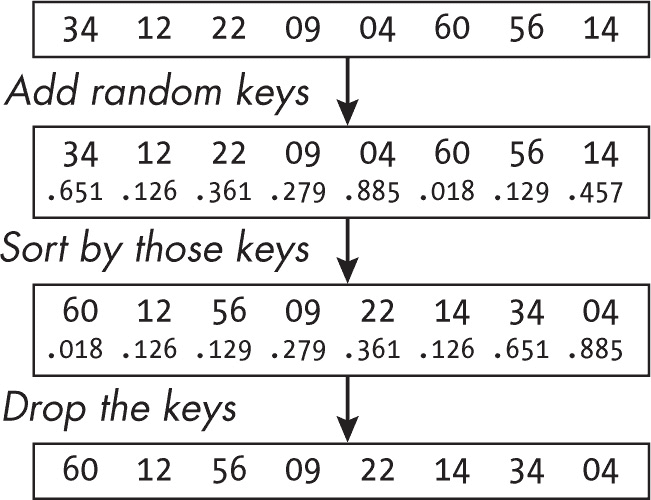
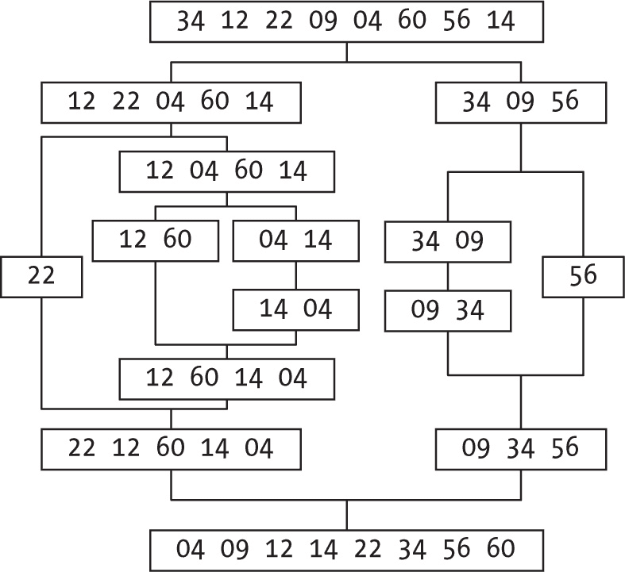
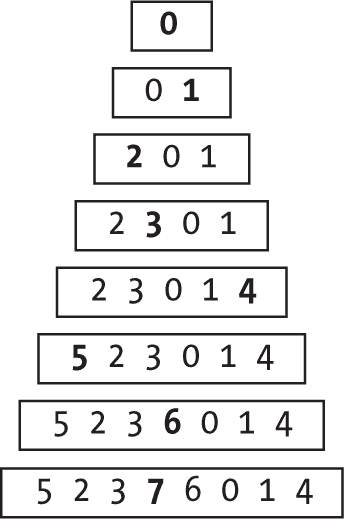
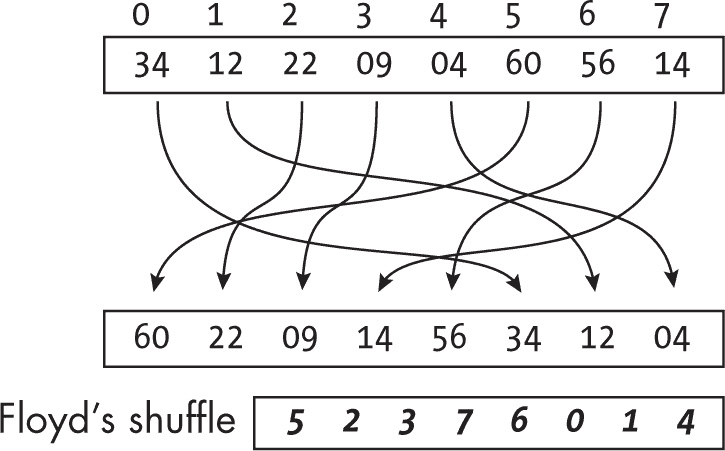
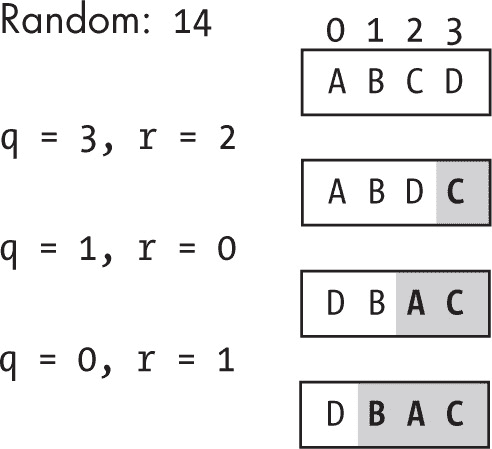
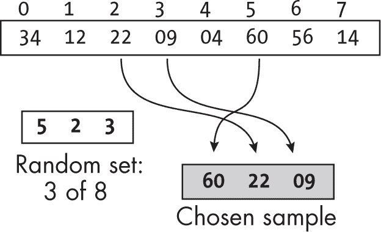
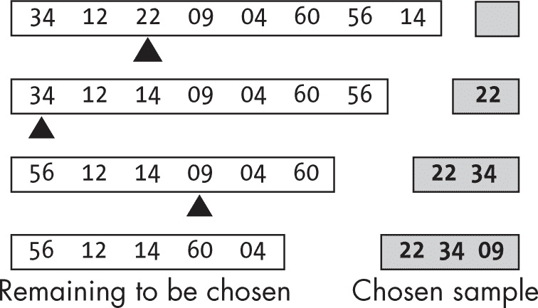
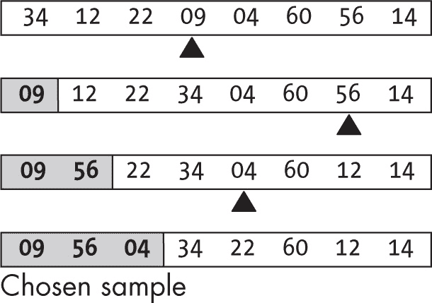
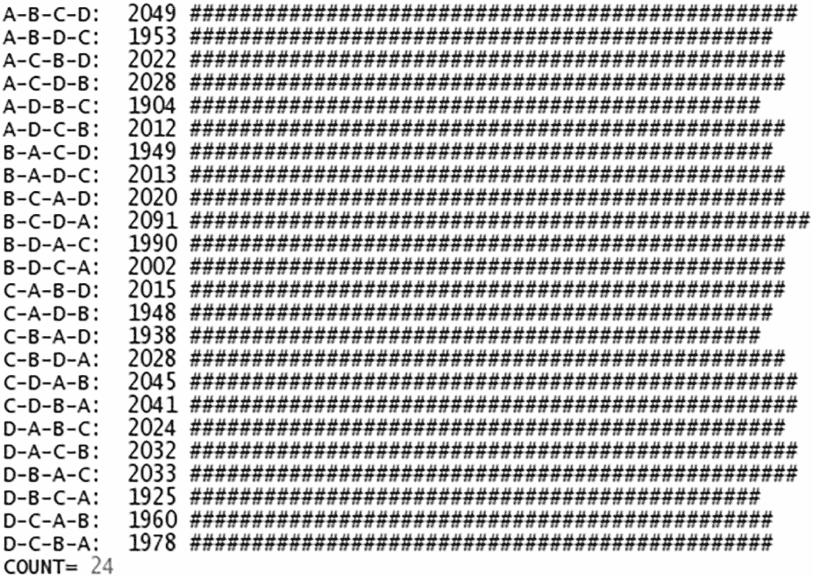

<hgroup>

## 8 洗牌与采样

</hgroup>


本章可以看作是对前两章的补充，但与其将值排序为某种顺序，你希望将它们洗牌成一个随机、无序的序列（就像扑克牌游戏一样）。与其选择一个给定位置的值，你希望随机选择一组值（就像统计抽样算法一样）。第六章和第七章围绕顺序和一致性展开，而本章则处理无序和随机性。

### 随机选择数字

首先，考虑一个你将在本章中需要使用的基本函数：在给定区间内生成一个随机数。JavaScript 已经提供了 Math.random()，它会生成一个伪随机数 *r*，使得 0 ≤ *r* < 1。（更多信息，请参见 *[`developer.mozilla.org/en-US/docs/Web/JavaScript/Reference/Global_Objects/Math/random`](https://developer.mozilla.org/en-US/docs/Web/JavaScript/Reference/Global_Objects/Math/random).*）这个函数生成的数字的分布是 *均匀的*，意味着每个值的可能性是相等的，没有任何一个值比另一个值更可能。

> 注意

*为什么它是伪随机的？这些随机数实际上是由算法生成的，生成的序列的特性大致与真正的随机数序列相似。然而，事实是这些数字是通过某个过程生成的，这自动意味着它们并不是真正的随机数；它们只是看起来像是随机的。不过，为了简单起见，在本章中我们将把生成的数字视为随机数。*

使用这个函数，你可以将结果扩展到任意给定的范围。接下来的函数将在本章其余部分派上用场：

```
const randomBit = () => Math.random() >= 0.5;
const randomNum = (a, b) => a + (b - a) * Math.random();
const randomInt = (a, b) => Math.floor(randomNum(a, b));
```

第一个函数在你想随机决定两个选项之间的选择时非常有用，就像模拟抛硬币一样。如果随机数小于 0.5（0 到 0.4999 ...），则返回 false（正面），否则返回 true（反面）（0.5 到 0.9999 ...）。给定一个从 *a* 到 *b* 的值范围（不一定是整数，但 *a* < *b*），第二个函数会生成一个随机浮动数 *r*，使得 *a* < *r* < *b*。通过注意到 (b - a)*Math.random() 大于或等于零，但严格小于 (b - a)，这可以很容易地验证。最后一个函数旨在传入整数参数，并生成一个随机整数 *r*，使得 *a* < *r* < *b*。你也可以这样写：

```
const randomInt = (a, b) => a + Math.floor((b - a) * Math.random());
```

有些人对于 randomInt(...) 感到困惑。例如，为了模拟掷骰子，他们可能会写 randomInt(1,6)，但这行不通：randomInt(1,7) 才是正确的做法。（有关这个问题的其他见解，请参见第 8.2 问题。）显然，你可以重写 randomInt(...) 以用其他方式实现，但你是按照 JavaScript 中的 array.slice(start,end) 方法来做的，该方法的参数与这些相同，表示从 start 开始，直到 end（不包括 end）为止取出元素。

有了这些基本工具，让我们来讨论洗牌和抽样问题，这两者都以某种方式基于随机数。  ### 洗牌

我们将首先考虑*洗牌*一个值的数组，以产生一个随机值序列——用数学术语来说，就是排列。这相当于在玩游戏前洗牌，每次都用不同的卡牌顺序开始。

一个重要的前提是，每个可能的排列应该具有相同的概率，这就提出了一个棘手的问题：如何确保洗牌代码正确运行？例如，在排序一个数组时，你可以检查排序后的数组是否确实按顺序排列，并且排序前后的元素相同。类似地，对于选择算法，你可以通过单独排序数组来检查它是否正确，然后检查选中的值是否正确。洗牌则更难检查。

首先，你应该（以某种方式）证明逻辑是正确的，以确保所有结果的概率相等。然而，如果你错误地实现了算法，导致有 bug，怎么办？（别问我怎么知道的。）一种经验性的建议是，使用已知的输入序列多次运行该算法，并通过统计方法测试观察到的结果是否表明其符合均匀分布；我们将这些数学方面的内容留给教科书，改为尝试一种更简单的方法（参见问题 8.1）。

#### 通过排序洗牌

我们将从基于排序的算法开始。它的性能不是最优的，但实现最简单。为了洗牌一组值，你将一个随机数与每个值关联，然后根据这个随机值对数组进行排序，最终的结果就是完全随机的洗牌（见图 8-1）。



图 8-1：通过随机分配的键对数组进行排序，生成完全随机的洗牌。

你可以使用第六章中讨论的任何算法来实现这个解决方案。我们选择最简单的方向，使用 JavaScript 自带的 .sort(...) 方法。虽然为了清晰展示，代码使用了更多行，但最终的洗牌代码是一行：

```
const sortingShuffle = (arr) =>
  arr
 ❶ .map((v) => ({val: v, key: Math.random()}))
  ❷ .sort((a, b) => a.key – b.key)
  ❸ .map((o) => o.val);
```

该代码直接对应图 8-1 中的步骤。给定一个值的数组，创建一个新数组，其中对象的原始值保存在 val 中，而一个随机值保存在 key ❶ 中。然后按这个随机键 ❷ 对数组进行排序，并生成一个只包含值的新数组 ❸。

这个算法可能是本书中最简短的一个，它能够轻松地生成一个洗牌后的值列表。然而，实现随机排序时容易出错（见问题 8.3 示例）。

这段代码的性能是 *O*(*n* log *n*)，但你可以做得更好。不过，我们首先考虑一种基于第五章和第六章中有趣的概念混合设计的方案。

#### 硬币抛掷法洗牌

让我们探索其他洗牌值集合的方法。假设你有一个分治过程，将集合分成两部分（使用模拟的硬币抛掷来决定元素的去向），递归地洗牌每部分，然后将它们合并回去。空集合或只有一个元素的集合不需要洗牌。你可以通过随机决定（同样抛硬币）哪两个元素将是首尾，来洗牌恰好包含两个元素的集合。对于包含超过两个元素的集合，应用图 8-2 所示的递归过程。



图 8-2：随机拆分数组，对每部分进行洗牌，并将结果合并，产生一种类似于归并排序的洗牌效果。

顶部的第一次拆分将数组分成了五个元素和三个元素两部分。随后步骤依次向下进行。五个元素的数组拆分成了包含一个和四个元素的数组。单个元素无需进一步洗牌，包含多个元素的数组被拆分成两部分。两部分中，一部分保持不变（12，60），另一部分则交换位置。合并后的数组创造了原始四元素数组的随机洗牌，接着与单个元素（22）合并，形成最初五个元素数组的随机洗牌。右侧数组执行类似的过程，最终结果见底部。

这是实现方法：

```
❶ const coinTossingShuffle = (arr, from = 0, to = arr.length - 1) => {
  const len = to - from + 1;
❷ if (len < 2) {
    // nothing to do
❸} else if (len === 2) {
    if (randomBit()) {
      [arr[from], arr[to]] = [arr[to], arr[from]];
    }
❹} else /* len > 2 */ {
    let ind0 = from - 1;
    let ind1 = to + 1;
    let i = from;
    while (i < ind1) {
      if (randomBit()) {
        ind1--;
        [arr[i], arr[ind1]] = [arr[ind1], arr[i]];
      } else {
        ind0++;
        i++;
      }
    }
  ❺ coinTossingShuffle(arr, from, ind0);
  ❻ coinTossingShuffle(arr, ind1, to);
  }
❼ return arr;
};
```

洗牌函数的参数将是一个数组 arr 以及其要洗牌的部分（from，to）❶。如果数组的长度小于 2 ❷，则无需做任何操作。如果数组恰好有两个元素 ❸，则通过抛硬币决定是保持原样还是交换两个元素的位置。如果数组有超过两个元素 ❹，则应用类似于快速排序中分区的逻辑：通过抛硬币决定每个值应该放在哪个位置。如果抛硬币结果为真，值将放入 ind1 到 to 区间；如果为假，则放入 from 到 ind0 区间。在将每个元素移动到它应该去的位置后（此时 ind0 和 ind1 会指向相邻的位置），使用递归来洗牌那些得到了假位（false bit）的元素❺和得到了真位（true bit）的元素❻。最后，返回已洗牌的数组❼。

这个算法可以证明具有平均*O*(*n* log *n*)性能，最坏情况下是*O*(*n*²)。 图 8-2 应该会让你想起归并排序和快速排序，这些算法的工作方式相似，因此你并没有比排序更好。

#### 线性时间洗牌

我们可以有多快的洗牌速度？洗牌的最佳可能结果是*O*(*n*)，其中你仅访问数组中的每个元素一次。前一节中的所有方法都表现较差（尽管对于较小的*n*值，它们可能非常合适），所以现在你将考虑线性时间的洗牌算法。为了更好地与我们在第六章中所做的相匹配，我们将仅对数组的一部分进行洗牌。

##### Floyd 的洗牌

罗伯特·弗洛伊德的线性时间洗牌算法有一些有趣的思想。该过程分为两个步骤：首先，它生成从 0 到*n* – 1 的随机排列数字，然后使用该生成的排列来洗牌原始数组。（你将在本章后面看到这种技术在 Floyd 的抽样算法中的应用。）首先生成排列，这类似于插入排序（见图 8-3）。



图 8-3：Floyd 的算法通过随机插入新值到之前已洗牌的值中来产生洗牌。

该算法的工作方式与手动排列扑克牌相同。你先挑出第一张牌，然后就这样。接着挑出第二张牌，将其放在前一张牌的左侧或右侧。然后挑出第三张牌，将其放在前两张牌的左侧、中间或右侧。每一张新牌都会随机地放置在之前的牌之间。

这是代码：

```
const floydShuffleN = (n) => {
❶ const result = [];
❷ for (let i = 0; i < n; i++) {
  ❸ const j = randomInt(0, i + 1);
  ❹ result.splice(j, 0, i);
  }
  return result;
};
```

对于简单的实现❶，你可以使用一个数组来存储生成的洗牌。首先从 0 开始循环 n 次❷，每次生成一个随机位置❸，将新数字插入到前面的数字中❹，可以使用非常方便的.splice(...)方法。

但是如何从这个排列得到原始数组的洗牌呢？图 8-4 展示了如何使用之前的结果完成任务。



图 8-4：使用随机排列的数字来洗牌数组。

原始数组中的每个元素都根据 floydShuffleN(...)生成的相应值移动到不同的位置。实现这些移动需要一个额外的数组。生成从 0 到*n* – 1 的洗牌数字列表后，以下是完成洗牌的代码：

```
const floydShuffle = (arr, from = 0, to = arr.length - 1) => {
❶ const sample = floydShuffleN(to - from + 1);
❷ const original = arr.slice(from, to + 1);
❸ sample.forEach((v, i) => (arr[from + i] = original[v]));
  return arr;
};
```

首先生成一个与你想要洗牌的数组部分相同大小的数字样本❶，然后取输入数组中的值❷，并根据图 8-3 所示的方法❸进行替换。

代码的执行效果取决于你为样本选择的数据结构。如这里所示，使用数组意味着插入操作 .splice(...) 的时间复杂度是 *O*(*n*)，因此整个算法的时间复杂度变为 *O*(*n*²)。你将在未来的章节中看到适合的数据结构，但 Floyd 建议使用大小为 2*n* 的哈希表，条目形成链表，以期望的平均 *O*(*n*) 性能，或者使用平衡有序树和带链接节点的结构，以确保 *O*(*n* log *n*) 性能。

##### Robson 算法

这里是生成排列的另一种方法。对于一个包含 *n* 元素的数组，有 *n*! 种可能的洗牌结果。Robson 算法的思路是随机选择一个在 0 和 *n*! – 1 之间的数字（包括 0 和*n*!），然后利用该数字生成一个排列，这样每个不同的数字都会产生不同的洗牌结果。

> 注意

*这种方法与一个叫做 Lehmer 码的数学概念相关，它是一种编码 n 个数字所有可能排列的方式，但我们在这里不深入探讨。*

如果你想洗牌一个包含四个元素的数组，以产生 24 (= 4!) 种可能的随机排列之一，你需要从 0 到 23 之间的随机数开始。然后将该数字除以 4。商会是 0 到 5 之间的数字，而余数会在 0 到 3 之间。（一个重要的细节是，商和余数的所有可能组合具有相同的概率。你能验证这一点吗？）

使用余数选择数组中的四个元素之一，将其取出并继续操作其余三个元素。考虑商：它是一个在 0 到 5 之间的随机值。

这次，除以 3。新的商会是 0 或 1，余数会是 0、1 或 2，你可以使用余数来选择剩下的三个数字中的一个。考虑商，它是 0 或 1。如果你将商除以 2，你将得到商为 0（不再需要做更多操作）。你可以使用余数（0 或 1）来选择剩下的两个数字之一，这样你就得到了你想要的洗牌结果。（当你从四个元素中选择了三个后，完整的洗牌结果就已经隐含在其中了。）图 8-5 显示了如果你选择了 14 作为随机数，算法的样子。



图 8-5：Robson 的洗牌算法也基于根据随机选择的排列转换原始数组。

从数组中的四个位置 ABCD 开始，位置从 0 到 3。在第一步，将 14 除以 4，得到商 3 和余数 2。然后交换数组中位置 2 的元素与最后一个元素，得到 ABDC。第二步，将 3（上一步的商）除以 3，得到商 1 和余数 0。然后交换位置 0 和倒数第二个位置的元素，结果为 DBAC。接着，将 1（最新的商）除以 2，得到商 0 和余数 1。你不需要交换，因为你会将位置 1 的元素与自身交换，结果仍然是 DBAC。经过三次交换，数组中的三个元素已被洗牌，第四个元素也就自然就位，过程完成。

这是逻辑：

```
const robsonShuffle = (arr, from = 0, to = arr.length - 1) => {
❶ const n = to - from + 1;
❷ let r = randomInt(0, fact(n));
❸ for (let i = n; i > 1; i--) {
  ❹ const q = r % i;
  ❺ [arr[from + i - 1], arr[from + q]] = [arr[from + q], arr[from + i – 1]];
  ❻ r = Math.floor(r / i);
  }
  return arr;
};
```

需要洗牌的元素数量是 n ❶。你使用 第五章 中开发的阶乘函数生成一个在 0 到 *n*! – 1 之间的随机数 ❷。然后从右到左循环遍历数组 ❸：计算 q ❹，用它交换元素 ❺，并找到 r 来再次循环 ❻。

该算法显然是 *O*(*n*)，因为它遵循一个单一的循环。然而，按原样，算法存在问题。你不能用于较大的数组，因为计算阶乘可能超出了 JavaScript 的可用精度（见第 8.5 问题）。幸运的是，还是有解决办法的。

##### Fisher-Yates 算法

Robson 算法的问题在于需要计算 *n*! 来获得一个随机数以继续。但如果仔细考虑，你实际上并不需要阶乘。该算法的关键在于一系列的余数，你可以通过使用随机函数来生成这些余数。第一个余数在 0 到 *n* – 1 之间，用来选择排列的初始值；第二个余数在 0 到 *n* – 2 之间，用来选择排列的第二个值，依此类推。因此，你只需要在 Robson 算法的合适时刻生成随机值，这就是 Fisher-Yates 算法。

因此，你可以编写这个替代方案来替代 Robson 的代码：

```
const fisherYatesShuffle = (arr, from = 0, to = arr.length - 1) => {
❶ for (let i = to + 1; i > from + 1; i--) {
  ❷ const j = randomInt(from, i);
  ❸ [arr[i - 1], arr[j]] = [arr[j], arr[i – 1]];
  }
  return arr;
};
```

与 Robson 的洗牌方法一样，从右到左循环 ❶，每次迭代计算一个随机数 ❷，用来决定交换哪些元素 ❸。基本上，从位置到 i 之间的任何元素都可以选择进行交换。

Fisher-Yates 算法通常被写成从左到右洗牌，基本上是同样的思路：

```
const fisherYatesShuffle2 = (arr, from = 0, to = arr.length - 1) => {
❶ for (let i = from; i < to; i++) {
  ❷ const j = randomInt(i, to + 1);
  ❸ [arr[i], arr[j]] = [arr[j], arr[i]];
  }
  return arr;
};
```

代码是相同的 ❶，只是生成的排列从左到右开始，任何位置从 i 到 ❷ 的元素都可以选择交换 ❸。这个算法非常高效，常用于洗牌。不过要小心，因为它很容易出错；见第 8.4 问题。

### 采样

抽样是统计学中经常使用的技术。基本上，从一组值（一个数组）中，你想选择一个随机的较小集合，这个较小的集合称为*样本*。抽样过程有两种：带重复抽样，允许元素被选中多次；和不带重复抽样，元素不能被选择超过一次。用数学术语来说，后一种过程叫做选择一个*组合*的元素。（在第一种情况下，即带重复的抽样，选择的元素数量可以是任何数字；而在第二种情况下，数量则受原始集合中元素数量的限制。）不用担心选择元素的顺序。

我们首先考虑带重复的抽样，对于这种方法，我们只需要几个简短、最优高效的算法，然后将大部分章节的内容用于没有重复的抽样，这需要更复杂的逻辑。

#### 带重复的抽样

带重复的抽样是一个简单的算法，你将从选择一个单一值开始。选择更大的样本只需要反复选择值即可。

##### 选择单个值

选择单个值是最简单的抽样方式，你只需要一个位于合适范围内的随机数。你可以使用 randomInt(...)函数，若要从数组中选择一个元素，以下代码可以实现：

```
const singlePick = (arr, from = 0, to = arr.length - 1) =>
  arr[randomInt(from, to + 1)];
```

要选择一个位于从位置到到位置（包括两者）的元素，你生成该范围内的随机数并返回对应的元素。

当然，如果你总是希望从整个数组中选择值（就像在本章的其余部分一样），更简单的代码就可以完成任务：

```
const singlePickAll = (arr) => arr[randomInt(0, arr.length)];
```

这等同于将 from = 0 和 to = arr.length - 1，因此这个新函数的工作方式与之相同。

##### 选择多个值（带重复）

如前所述，要从一组数据中进行多次选择（也许是模拟一系列轮盘赌转动，或者为剪刀石头布游戏创建策略，或者实现第七章中的懒选择中位数查找算法），做几次单次选择就足够了：

```
const repeatedPick = (arr, k, from = 0, to = arr.length - 1) => {
  const sample = Array(k);
❶ for (let i = 0; i < k; i++) {
  ❷ sample[i] = arr[randomInt(from, to + 1)];
  }
  return sample;
};
```

逻辑很简单：首先循环 k 次 ❶，每次随机选择一个元素 ❷。与选择单个值时一样，要从整个数组中进行选择，代码更简单，而且你还可以复用前一部分的 singlePickAll 代码：

```
const repeatedPickAll = (arr, k) => {
  const sample = Array(k);
  for (let i = 0; i < k; i++) {
    sample[i] = singlePickAll(arr);
  }
  return sample;
};
```

对于一个相关的编程挑战，参见第 8.7 题。接下来，看看没有重复的抽样，它的限制是不允许你多次选择同一个元素，并且要高效地进行。

#### 不带重复的抽样

这个过程等同于 Powerball 风格的彩票抽奖：数字从（但不返回到）一个抽签箱中被移除，保证所有被选中的数字都是不同的。

对于本节中的算法，假设你有一个包含*n*个元素的数组，你希望从中挑选出*k*个元素的组合。*k*必须小于*n*——如果*k*等于*n*，则无需任何算法，而且如果不允许重复，*k*不能大于*n*。当你希望的元素越少时，算法会越快，因此为了便于优化，你可以假设*k* >= *n*/2；事实上，如果*k* ≥ *n*/2，实际上你可以选择*n* – *k*个元素并将其丢弃。

##### 通过排序或洗牌进行抽样

第一个想法受到第 139 页“通过排序进行洗牌”部分的启发，并结合了在第七章中探讨的选择算法。你可以给所有元素分配随机键，将它们排序，然后获取具有最低*k*键的元素。你已经考虑了实现这种方法所需的所有代码，所以实际的开发留给问题 8.8 去解决。

你可以尝试的第二个想法是基于你已经知道如何生成一个集合的随机排列这一事实。鉴于此，生成样本的显而易见方法是洗牌该集合，然后取其前*k*个元素。这样也能实现，但你可以通过更高效的逻辑得到所需的样本，而不必进行洗牌（类似于你在选择算法中发现的，当你看到不需要先排序的更好的选择方法时）。你也不会看到这个过程的代码，因为它是从你已经做过的事情派生出来的。让我们转向新的算法。

##### 弗洛伊德算法

通常，你只需要从 0（包括）到*n*（不包括）之间的*k*个整数样本。罗伯特·弗洛伊德的 floydSampleKofN(...)算法生成一个包含*k*个此类数字的数组，这本身就很有趣，并将帮助你编写一个更通用的抽样算法。如果你需要从原始数组中抽样，可以使用 floydSampleKofN()生成的选定数字，如图 8-6 所示。



图 8-6：从 0 到 n – 1 的随机数字选择生成一个随机样本。

你可以使用样本的值作为索引，从原始输入数组中选择值，如图 8-6 所示。输入数组位于顶部，弗洛伊德代码生成的样本是[5, 2, 3]，最终结果用灰色标出。

这是使用（尚未展示的）floydSampleKofN()函数的代码：

```
const floydSample = (arr, k) =>
❶ floydSampleKofN(k, arr.length).map((v) => arr[v]);
```

你从*n*中生成一个*k*个值的随机组合❶，并使用这些数字作为索引，从原始输入数组中获取值。

让我们回到生成组合的部分，最后看看 floydSampleKofN()。递归版本如下，递归帮助你理解算法的工作原理：

```
❶ const floydSampleKofN = (k, n) => {
❷ if (k === 0) {
    return [];
  } else {
  ❸ const sample = floydSampleKofN(k - 1, n – 1);
  ❹ const j = randomInt(0, n);
    sample.push(sample.includes(j) ? n - 1 : j);
  ❺ return sample;
  }
};
```

你需要选择一个包含从 0 到 n - 1（包括 n - 1）之间 k 个不同值的组合 ❶。如果 k 为 0 ❷，则返回一个空样本。否则，首先使用递归选择一个包含 k - 1 个值的组合，范围是从 0 到 n - 2 ❸。然后决定要将哪个值添加到该样本中 ❹。最后 ❺，返回创建的样本。

现在，来看看如何将一个新值添加到样本中，假设从 8 个值中抽取 3 个样本，如图 8-6 所示。假设你已经从 0 到 6 的集合中选择了两个值：如果你要加入 7，来生成一个包含 3 个值的样本，应该如何操作？有一种可能性（1/8）是随机数 j 正好为 7。它不在先前的样本中，因此将被添加进去。

添加 7 的另一种方式是，如果 j 已经是样本中两个数字之一（2/8）。因此，7 最终被包含在 3 个值的样本中的概率是 1/8 + 2/8，恰好是 3/8，正是你需要的结果。你可以系统地应用这个论证，发现每个 *n* 值有 *k/n* 的概率被包含在最终样本中，因此该算法确实生成了一个正确的样本。

由于递归总是在每次循环开始时发生，你可以将代码转化为等效的迭代版本（见问题 8.9）：

```
const floydSampleKofN = (k, n) => {
❶ const sample = [];
❷ for (let i = n - k; i <= n - 1; i++) {
  ❸ const j = randomInt(0, i + 1);
  ❹ sample.push(sample.includes(j) ? i : j);
  }
❺ return sample;
};
```

首先，创建一个数组来返回选择的样本 ❶，并在最后返回它 ❺。一个循环执行 k 次 ❷。每次循环中选择一个随机数 ❸，并使用相同的逻辑（检查随机选择的数字是否已经被选择过）来决定添加什么 ❹。证明这个算法正确性的论证与递归版本相同，因此这里不再赘述。

Floyd 算法的性能关键在于如何将一个值添加到样本中并检查给定值是否已经在样本中。换句话说，它需要一个高效的集合实现。你也可以使用位图，正如在第六章和第七章中所提到的（我们暂时先不讨论这一点，稍后在第十三章中会考虑这些选项）。

##### 彩票抽奖

另一种方法是考虑实际模拟一次彩票抽奖。你选择集合中的一个随机元素，将它放到其他地方，然后一次又一次地进行，直到得到完整的样本。图 8-7 展示了这个过程。值的集合在左侧，选中的样本在右侧，三角形标记了每个阶段随机选择的元素。



图 8-7：一个模拟的彩票抽奖生成一个随机样本。

当你移除一个元素时，你将它与数组最后一个位置的元素交换，以避免必须移动整个数组，这样可以提高代码的性能。

这是一个简单的实现：

```
const lotterySample = (arr, k) => {
❶ const n = arr.length;
  const sample = Array(k);

❷ for (let i = 0; i < k; i++) {
  ❸ const j = randomInt(0, n – i);
  ❹ sample[i] = arr[j];
  ❺ arr[j] = arr[n - i – 1];
  }

❻ return sample;
};
```

首先创建一个将获取样本的数组 ❶。循环 k 次 ❷，在数组的前 n - i 个元素中生成一个随机位置 ❸，因为已经选中的元素将移到数组的末尾 ❹。将选中的元素添加到样本数组，并进行交换，这样它就不会在其他选择中再次被考虑 ❺。最后，返回生成的样本 ❻。

这个算法足够简单，并且它的*O*(*k*)性能无法再改进。毕竟，你想要一个包含 *k* 个元素的样本。然而，如果你注意到其实不需要一个单独的样本数组，你可以稍微提高一些速度。

##### Fisher-Yates 抽样

在之前的抽奖抽样算法中，每次数组的每个元素要么被选中，要么不被选中，所以你不需要两个数组，原始数组就可以。图 8-8 展示了这一思想；阴影部分的数字是被选中的元素。



图 8-8：抽奖抽样算法可以就地工作，无需额外的内存。

每次选择一个元素时，将其移动到数组的前面，这样它的所有前面元素都在样本中，其余的则是未选择的元素。这个算法是 Fisher-Yates 洗牌方法的一种变体（逻辑相同，但应用的次数较少，因为你不想随机化整个数组；只需要 k 个元素），你可以按如下方式编写代码：

```
const fisherYatesSample = (arr, k) => {
  const n = arr.length;
❶ for (let i = 0; i < k; i++) {
  ❷ const j = randomInt(i, n);
  ❸ [arr[i], arr[j]] = [arr[j], arr[i]];
  }
❹ return arr.slice(0, k);
};
```

在这个算法中，i 变量指向对应的样本元素。你循环 k 次 ❶，从尚未被选择的元素中随机选择一个位置 ❷，然后进行交换，将选中的元素从未选择的部分移到已选择部分 ❸。完成循环 ❹ 后，返回原数组的初始切片（长度为 k 的元素）。

Fisher-Yates 抽样算法也是 *O*(*k*)；唯一的区别在于样本的存储位置。

##### Knuth 的算法

Donald Knuth 的算法有一个有趣的特点，即样本中的元素保持与原数组相同的相对顺序。该算法基于概率，直接证明了它的正确性。

为了理解它是如何工作的，假设你想从八个元素中选择三个。第一个元素被选中的概率是 3/8。第二个元素是否被选中取决于第一个元素是否被选中。如果第一个被选中了，第二个被选中的概率是 2/7（因为从八个中选中了一个，剩下七个中选择两个）；如果第一个没被选中，第二个被选中的概率是 3/7（因为现在需要从剩下的七个中选择三个）。

该算法基于随机数和概率选择或跳过元素，具体如下：

```
const orderedSample = (arr, k) => {
❶ if (k === 0) {
   return [];
❷} else if (Math.random() < k / arr.length) {
   return [arr[0], . . .orderedSample(arr.slice(1), k - 1)];
❸} else {
   return [...orderedSample(arr.slice(1), k)];
 }
};
```

如果你想选择一个空样本 ❶，将返回一个空数组；这是递归的基本情况。否则，你会得到一个随机数，并与概率进行比较：如果它较小 ❷，你将包含数组中的第一个元素，并从剩下的元素中选择一个大小为 k – 1 的样本。如果它较大 ❸，你从剩下的数组中选择所有 k 个元素。

更好的实现方式避免了递归以及数组的拆解和切片，方法如下：

```
const orderedSample = (arr, k) => {
❶ const sample = [];
❷ let toSelect = k;
❸ let toConsider = arr.length;
❹ for (let i = 0; toSelect > 0; i++) {
    if (Math.random() < toSelect / toConsider) {
     ❺ sample.push(arr[i]);
      toSelect--;
    }
  ❻ toConsider--;
  }
  return sample;
};
```

如同其他算法一样，sample 是将要生成的数组 ❶。变量 toSelect ❷和 toConsider ❸将记录你还需要从未考虑的值中选择的数量。你将不断循环，直到没有更多的值可以选择 ❹。每次，你根据描述的概率方法决定是否选择或忽略一个值。如果测试结果为真 ❺，则将该值添加到样本数组中，并将待选值的数量减去 1。每次循环，我们都会减少待考虑值的数量 ❻。

你也可以用更简洁的方式写出来：

```
const orderedSample2 = (arr, k) => {
  const n = arr.length;
  const sample = [];
❶ for (let i = 0; k > 0; i++) {
  ❷ if (Math.random() < k / (n - i)) {
      sample.push(arr[i]);
    ❸ k--;
    }
  }
  return sample;
};
```

区别在于你将使用 k ❶代替 a toSelect 变量 ❸，并且你将计算仍然未见的值的数量 ❷；否则，算法是相同的。

##### 水库抽样

我们将要考虑的最终算法是由 Alan Waterman 创建的，它的有趣之处在于它可以在在线模式下工作，无需事先获取整个元素数组。本章中所有其他算法都在离线模式下工作。该代码遍历输入数据，在任何时候都保持一个合适的随机样本；它可以随时停止，并且会有一个合适的随机样本，包含到目前为止看到的元素。这个算法非常适合处理大规模数据流，在这种情况下，可能无法将所有值存储在内存中，然后应用本章中考虑的任何一个先前算法。

首先考虑一个简单的情况：从一个未知长度的序列中选择一个元素。（如果你知道序列的长度，使用 randomInt(...)将是选择一个元素的最快方式。）这个问题的解决方法如下：

+   选择序列中的第一个元素，并将其放入水库中。

+   对于序列中第*i*个元素（从第二个元素开始），以 1/*i*的概率用它来替换水库中的值。

假设序列有 1000 个元素。那么选择最后一个元素的概率是多少？显然，它是 1/1000。如果你没有选择它，当你有 999 个元素时，选择第 999 个元素的概率是多少？它将是 1/999。随着越来越多的元素被处理，选择第*i*个元素的概率始终是 1/*i*。

你可以扩展这个例子来选择*k*个元素的样本；过程非常相似：

+   选择序列中的前*k*个元素，并将它们放入水库中。

+   对于序列中第*i*个元素（在前*k*个元素之后），以*k*/*i*的概率将其添加到储存区值中，通过替换一个随机选择的储存区值。

你可以按以下方式编写代码：

```
const reservoirSample = (arr, k) => {
❶ const n = arr.length;
❷ const sample = arr.slice(0, k);

❸ for (let i = k; i < n; i++) {
  ❹ const j = randomInt(0, i + 1);
    if (j < k) {
    ❺ sample[j] = arr[i];
    }
  }
  return sample;
};
```

我们不会使用流，但对此进行修改是很直接的。在这里，要知道何时序列结束，你将使用变量 n ❶，并且样本储存区初始化为序列的前 k 个元素 ❷。你将循环遍历数据 ❸，并进行随机测试 ❹，以判断某个数字是否应该进入数组；变量 j 既用于测试，也用于随机决定替换储存区中的哪个元素 ❺。

如果你修改输入数组（使用其前*k*个位置作为储存区），算法看起来是这样的：

```
const reservoirSample2 = (arr, k) => {
  const n = arr.length;
  for (let i = k; i < n; i++) {
    const j = randomInt(0, i + 1);
    if (j < k) {
    ❶ [arr[i], arr[j]] = [arr[j], arr[i]];
    }
  }
❷ return arr.slice(0, k);
};
```

区别在于你如何将选定的值交换到储存区 ❶ 和如何返回选定的样本 ❷；除此之外，其余功能完全相同。

### 总结

在本章中，我们已经考虑了生成数组的随机排列和组合的算法，这些方法在多个领域非常有用，如游戏或统计学等。在下一章中，我们将转向另一个常见且重要的任务：高效地搜索一个值。

### 问题

**8.1  足够好的洗牌**

实现一个日志记录函数，接受一个洗牌函数作为输入并运行多次测试，统计每种可能的排列出现的次数，然后绘制直方图以可视化其结果。

图 8-9 显示了我自己测试的结果，显示四个元素的数组洗牌效果良好。



图 8-9：一个直方图，显示某个洗牌算法以相似的频率生成所有可能的结果

在 48,000 次随机尝试后，所有排列（24 = 4!）都被生成出来，结果看起来足够相似。尽管这一说法从统计学角度并不完全有效；需要进行χ²（即希腊字母“chi”）拟合优度检验才能确认这一点。

**8.2  随机投掷**

假设你需要生成一个均匀的随机三选项：不是是/否，而是高/中/低。使用 Math.random()很容易实现，如 randomNum(...)函数所示，但你能仅使用 randomBit()来做吗？类似地，你如何使用 randomBit()生成一个均匀的骰子投掷（1-6）？或者在*龙与地下城*类型的游戏中进行 1 到 20 的投掷？（最后一个问题更复杂。）

**8.3  不那么随机的洗牌**

在阅读完随机洗牌的描述后，某个程序员决定让它更简单：不再麻烦地分配随机键并按键排序，而是直接使用排序算法（此处为冒泡排序），并将键之间的比较改为使用一个随机位：

```
const naiveSortShuffle = (arr) => {
  for (let j = arr.length - 1; j > 0; j--) {
    for (let i = 0; i < j; i++) {
    ❶ if (**randomBit()**) {
        [arr[i], arr[i + 1]] = [arr[i + 1], arr[i]];
      }
    }
  }
  return arr;
};
```

逻辑类似于冒泡排序（参见第六章），但有一个变化 ❶。为什么这不是一个好的洗牌生成器？程序员哪里出错了？

**8.4  糟糕的交换洗牌**

一位开发者在实现 Fisher-Yates 洗牌代码时出错，写出了如下代码，乍看之下似乎足够好：

```
const naiveSwappingShuffle = (arr) => {
  const n = arr.length;
  for (let i = 0; i < n; i++) {
    **const j = randomInt(0, n);**
    [arr[i], arr[j]] = [arr[j], arr[i]];
  }
  return arr;
};
```

区别在于加粗的那一行。你总是从完整的数组中选择一个随机位置。这个代码有什么问题？

**8.5  罗布森的顶端？**

使用罗布森算法，最大可以洗牌的数组长度是多少？小心，这个问题的答案有点复杂。

**8.6  采样测试**

你能开发一个视觉验证采样函数的工具吗，类似于问题 8.1 中所要求的内容？

**8.7  单行重复器**

本章草稿的审阅者提到，像第 147 页“带重复选择若干值”部分所展示的 repeatedPick(...)，可以写成一行，只需一个语句。那会是什么？

**8.8  排序采样**

实现“通过排序或洗牌进行采样”部分在第 148 页中描述的算法。

**8.9  迭代，而非递归**

一个类似于以下递归函数的代码：

```
const something = (p) => (p === 0 ? BASE : other(something(p - 1), p));
```

可以等效地以迭代方式写成如下：

```
const something = (p) => {
  let result = BASE;
  for (let i = 1; i <= p; i++) {
    result = other(result, i);
  }
  return result;
};
```

解释一下为什么这个方法可行。还有，尝试将此转换应用到 第五章 的 factorial(...) 函数，并将其调整到 Floyd 的 sampleKofN(...) 算法（这会更复杂），以验证文中所示内容。

**8.10  没有限制？**

在 Knuth 的示例代码中，没有检查 i 是否超出边界；为什么不需要做这一步？

```
const orderedSample = (arr, k) => {
  const n = arr.length;
  const sample = [];
  let toSelect = k;
  let toConsider = n;
  for (**let i = 0; toSelect > 0; i++**) {
    if (Math.random() < toSelect / toConsider) {
      sample.push(arr[i]);
      toSelect--;
    }
    toConsider--;
  }
  return sample;
};
```
