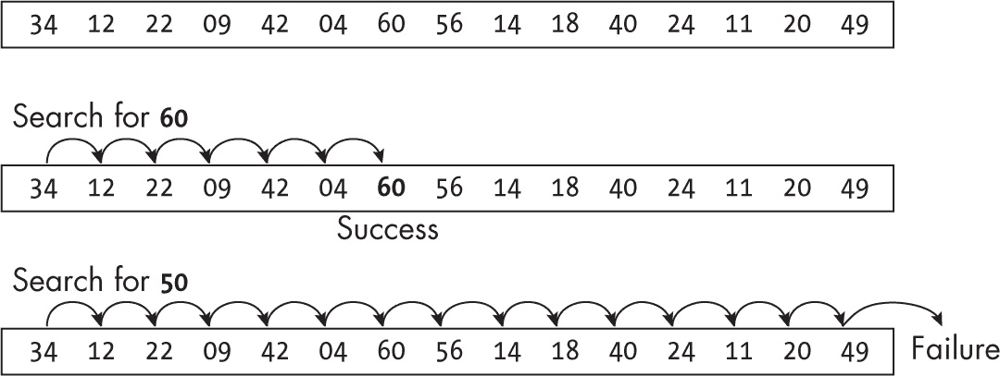
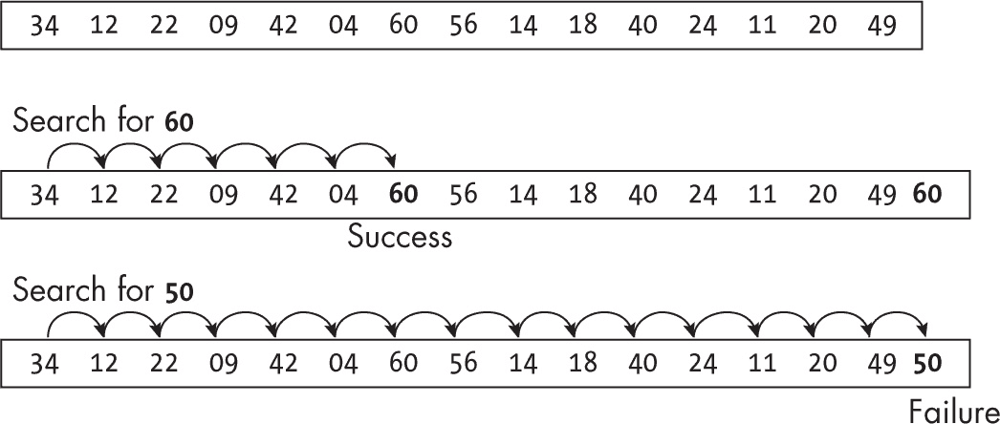
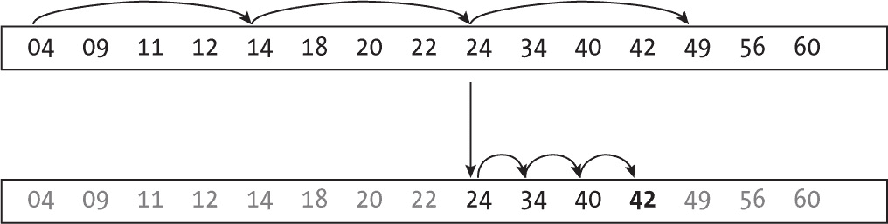
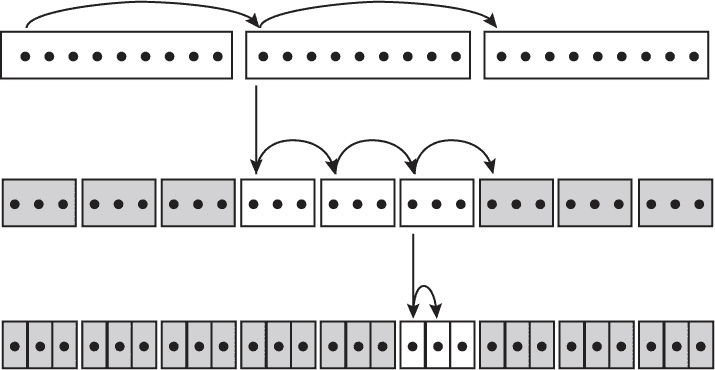
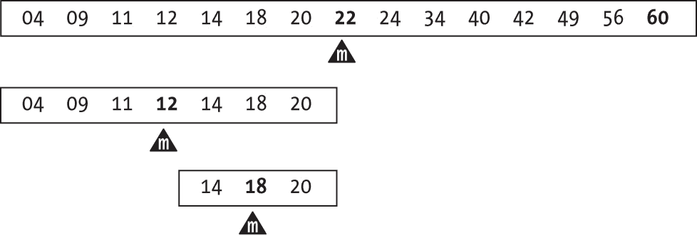
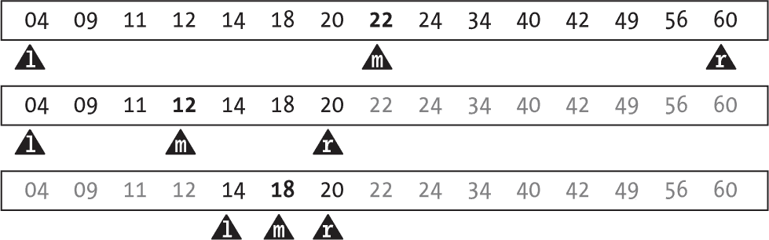
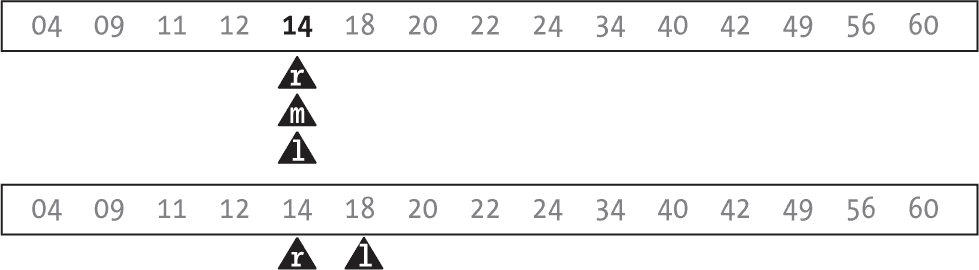
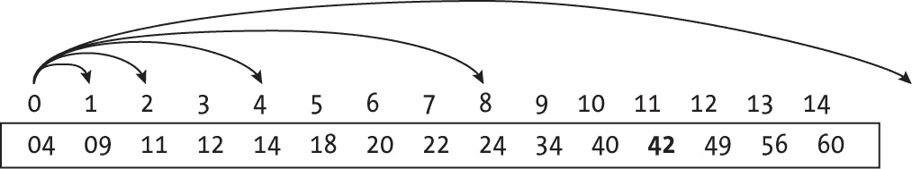
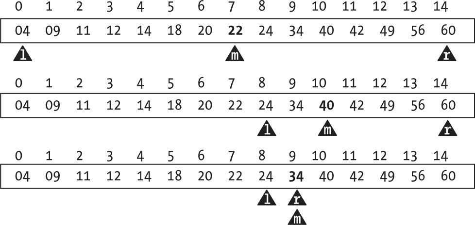
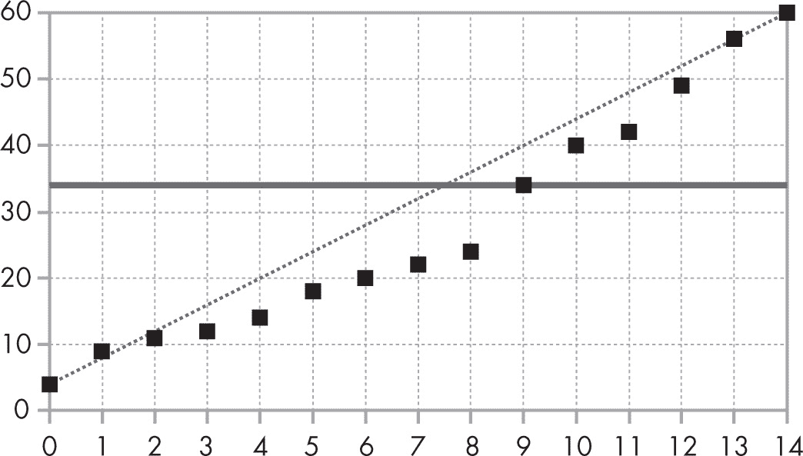

## 9 搜索


本章讨论的是一个常见问题：给定一组值，查找某个特定的键是否在这组值中。这个定义与我们将在未来章节中实现字典抽象数据类型（ADT）时所探讨的逻辑有相似之处，但我们这里只关注搜索部分，不涉及添加或删除键。此外，我们只讨论数组，其他数据结构将在未来章节中探讨。

### 搜索定义

本章中的所有情况中，待解决的问题是：给定一个数组（有序或无序，可能包含重复值）和一个键，你需要知道在数组的哪个位置可以找到该键。如果数组中没有该键，你将返回 -1，以匹配 JavaScript 的一些内置方法。

作为一个进一步的可选要求，有时你可能需要在数组中查找某个键的第一次（或最后一次）出现（如果数组中有重复的键），或者如果数组中不包含某个键，你可能希望知道它应该位于哪个位置。

重要的是要记住你是进行一次搜索还是多次搜索。如果是后者，你可以随着时间的推移摊销某些操作的成本，比如排序数据或构建其他数据结构。如果是前者，你只需要最快的搜索速度。（在后续章节中，你将探讨一些数据结构示例，帮助加快搜索速度。）

对于有序数组，有更高效的算法；我们将从无序数组开始，然后转向性能更好的算法。

### 搜索无序数组

你将考虑的第一组算法在无序数组中执行线性搜索，这是最基础的（这些也被称为顺序或串行搜索）。如果数组没有任何顺序，唯一的搜索方法就是从开始遍历整个数组。这种搜索显然比较慢，时间复杂度为 *O*(*n*)，但对于小数组来说，还是相当合理的。此外，JavaScript 本身也有用于这种搜索的方法，所以如果问题的条件允许，接下来一节中的函数可能是最好的选择。

#### JavaScript 的方法

为了查找某个键是否在数组中及其位置，JavaScript 提供了几个有趣的函数。如果你只想知道键是否存在，可以使用 array.includes(key) 方法，该方法根据键是否被找到返回 true 或 false。如果你需要知道键在数组中的位置（在本章中你将始终需要这个），那么 array.indexOf(key) 就能完成这个任务。它返回键第一次出现的位置，如果没有找到，则返回 -1。

这些方法都在 *O*(*n*) 时间内执行，并且它们从数组的开始遍历到末尾。这个性能与接下来你将考虑的线性搜索相匹配。

#### 线性搜索

线性搜索算法基本上是 JavaScript 自带的 .indexOf(...) 方法的实现。它通过遍历整个数组来检查是否找到你需要的值。

图 9-1 展示了两次搜索：一次是成功找到 60，另一次是未能找到 50。



图 9-1：线性搜索从数组开始位置开始，直到找到目标值或到达数组末尾。

该过程从头开始，直到找到目标值或到达数组末尾为止。这种算法通常在早期就教授给未来的开发者，作为循环的基本示例。以下是实现代码：

```
const linearSearch = (arr, key) => {
  const n = arr.length;
❶ for (let i = 0; i < n; i++) {
  ❷ if (arr[i] === key) {
      return i;
    }
  }
❸ return -1;
};
```

遍历数组 ❶，如果找到目标值 ❷，返回它的位置。如果循环结束仍未找到目标值 ❸，则按定义返回 -1。

这种算法在最坏情况下的性能是 *O*(*n*)，而对于成功的搜索，平均需要进行 *n*/2 次探测，因此结果仍然是 *O*(*n*)。在无序数组中，无法显著加速搜索，但一个小技巧可能稍微有点帮助：使用哨兵。

#### 带有哨兵的线性搜索

在搜索目标值之前，先将该值添加到数组末尾，这样搜索就能确保成功。图 9-2 展示了与前面相同的两次搜索：第一次成功，因为在数组末尾之前找到了 60，而第二次失败，因为只找到了添加的 50，而这个值最初并不在数组中。



图 9-2：添加哨兵后，可以在不越过数组末尾的情况下继续搜索。

你可以在不检查数组结束位置的情况下遍历数组，因为你确定最终会找到目标值。现在唯一需要考虑的是在哪里找到它：如果它出现在数组末尾，你只找到了添加的哨兵值，搜索是失败的。逻辑如下：

```
const linearSearch = (arr, key) => {
  const n = arr.length;
❶ arr[n] = key;
❷ let i = 0;
❸ while (arr[i] !== key) {
    i++;
  }
❹ arr.length = n;
❺ return i === n ? -1 : i;
};
```

先将要搜索的值添加到数组末尾 ❶。然后像之前一样从第一个位置开始搜索 ❷，直到找到目标值 ❸。你不需要检查数组的末尾，因为你知道一定会找到目标值。找到目标值后，恢复数组 ❹（只需重新赋值数组的长度即可，虽然 .pop(...) 方法可能更常用），然后根据找到目标值的位置决定返回什么 ❺。如果目标值在末尾，则是失败；如果目标值在之前的位置，则是成功。

这种算法的性能仍然是 *O*(*n*)；唯一（轻微的）优势可能来自于循环中更简单的检查，使得迭代速度更快，但不要指望这个会产生大影响。此外，如果添加哨兵导致 JavaScript 创建一个新数组并复制原数组，那么算法的速度可能会更慢。

当一切都说完后，线性搜索的提升空间非常有限，而且在无序数组中已经达到了极限。接下来你将开始在有序（排序）数组中进行搜索，针对有序数组，可以使用更优的算法。### 搜索有序数组

如果要搜索的数组是有序的，你可以应用更好的技术。例如，如果你知道数组中某个位置的值大于你要查找的关键值，你可以立即舍弃该位置之后的所有值，因为关键值不可能在这些位置。本文节中的所有非线性搜索算法（也称为*区间搜索*）都利用了数组的顺序，要么加速数组的搜索，要么舍弃其中的大部分，从而减少需要搜索的区域。

#### 跳跃搜索

前面描述的基本线性搜索可能会遍历整个数组，这使得其性能为*O*(*n*)，且无法进一步优化。然而，如果数组是有序的，你就不需要逐一遍历它。就像当有人在寻找书中的某一页时，他们不会一页一页翻，而是会一次跳过几页，靠近目标时再逐页查找。

跳跃搜索算法的思路与 Shell 排序相似（见第六章）。你首先进行大跳跃，快速接近目标位置，然后再进行小跳跃。图 9-3 展示了我们如何搜索 42，假设初始跳跃大小为 4。（我们稍后会讨论跳跃大小应该是多少。）



图 9-3：跳跃搜索通过尽可能大幅度地跳跃来加速查找过程。

在顶部，你进行线性搜索，但采用大跳跃，每次跳过四个值。你找到的第一个值是 04，太小了，所以你再次跳跃。接着你找到了 14 和 24，但它们依然太小。下一次跳跃让你到达 49，现在你知道 42（如果存在的话）在 24 之后、49 之前。然后你开始进行常规的线性搜索，短跳跃，每次推进一个位置。你检查了 34 和 40，并成功找到了 42。如果你当时在寻找 41，那么当你到达 42 时，你会判断 41 不存在并返回–1。

这个算法的预期测试次数是多少？如果步长是*s*，数组大小是*n*，你可以进行最多*n*/*s*次大跳跃，接着是*s*次小跳跃，总共是*n*/*s* + *s*次。通过一些微积分证明，当*s*为√*n*时，这是最优解，最多进行 2√*n*次测试，所以我们将使用这个值，如以下实现所示：

```
const jumpSearch = (arr, key) => {
  const n = arr.length;
❶ const s = Math.max(2, Math.floor(Math.sqrt(n)));
❷ let i = 0;
❸ while (i + s < n && key >= arr[i + s]) {
    i += s;
  }
❹ while (i + 1 < n && key >= arr[i + 1]) {
    i++;
  }
❺ return i < n && key === arr[i] ? i : -1;
};
```

首先确定长跳跃的大小 ❶，确保它至少为 2。（对于非常短的数组，跳跃大小只能为 1。）i 变量遍历数组 ❷。每次跳跃 s 个位置 ❸。如果没有越过数组的末尾且测试的数组值不大于你正在寻找的目标，则可以通过更新 i 进行跳跃。在一系列跳跃之后，i 指向的值不大于目标值，然后进入新的循环，按 1 前进 ❹。这个循环结束后 ❺，如果找到目标，则返回其位置；否则返回 -1。

代码中有两个相似的 while 循环。在其中一个情况下，你按 s 跳跃，在另一个情况下，按 1 跳跃。

考虑另一种实现方式，它提出了一种更为优化的解决方案。首先，这是代码：

```
const jumpSearch = (arr, key) => {
  const n = arr.length;
❶ let s = Math.max(2, Math.floor(Math.sqrt(n)));
  let i = 0;
❷ while (s > 0) {
  ❸ while (i + s < n && key >= arr[i + s]) {
      i += s;
    }
  ❹ s = s > 1 ? 1 : 0;
  }
❺ return i < n && key === arr[i] ? i : -1;
};
```

现在你不再为 s 使用常量 ❶，因为你会在第二个循环中更改它的值。根据 s 设置外部循环 ❷。当 s 为 0 时，循环结束。内部循环与之前相同，每次跳跃 s 个位置 ❸，但随后 s 会变为 1，进行短跳跃。完成一个循环后 ❹，减少 s。如果 s 大于 1，则按 1 跳跃；如果 s 已为 1，则结束循环，将 s 设置为 0。决定返回值 ❺ 与之前的版本相同。

你分两阶段完成了搜索：先进行长跳跃，再进行短跳跃，从而将搜索次数降低到 *O*(√*n*)。如果你有三个阶段，首先进行非常长的跳跃，然后是较长的跳跃，最后用较短的跳跃结束，会怎样呢？在每一阶段，跳跃的长度都相对上一阶段更小。（我们将在第十一章的跳表中重新审视这种跳跃逐渐减小的概念。）图 9-4 展示了在 27 个元素的数组中使用三层跳跃搜索值的工作原理。



图 9-4：三层跳跃搜索

第一次跳跃间隔为九个元素。找到目标所在的九个元素块后，开始进行每次间隔三个元素的跳跃；灰色区域表示目标无法出现在这些位置。之后，当你找出目标所在的三元素块后（这时可以将更多位置标记为灰色），最后进行单元素的跳跃。在这种情况下，平均需要进行 4.5 次测试才能找到目标，最多需要 9 次测试。

你可以这样编码：

```
const jumpSearch = (arr, key, levels = 3) => {
  const n = arr.length;
❶ const b = Math.max(2, Math.floor(arr.length ** (1 / levels)));
❷ let s = Math.floor(n / b);
❸ let i = 0;
❹ while (s > 0) {
    while (i + s < n && key >= arr[i + s]) {
      i += s;
    }
  ❺ s = Math.floor(s / b);
  }
 ❻ return i < n && key === arr[i] ? i : -1;
};
```

首先定义每个级别的块数 b ❶，并且（如同之前算法中的跳跃大小）你希望每个级别至少有两个块。然后设置初始的（最长）跳跃大小 ❷。接下来按照之前的方式按层次进行搜索：从头开始 ❸，并继续搜索直到跳跃次数变为 0 ❹。不同之处在于如何减少跳跃大小 ❺，每次使其变为原来的 b 倍小。（因为 b > 1，s 最终会变为 0，外部循环结束。）最终返回 ❻ 与其他版本的跳跃搜索相同。

可以证明，如果你选择每次跳跃的步长为 ³√*n*，这个方案的时间复杂度将为 *O*(³√*n*)，所以算法效果更佳。你可以继续添加更多的层级（当然，这只有在数组非常大的情况下才有意义），将算法的时间复杂度提高到 *O*(⁴√*n*)，然后是 *O*(⁵√*n*)，依此类推。（问题 9.3 展示了你可以走多远。）

我们已经成功将搜索算法的速度从 *O*(*n*) 提升到了 *O*(*^p*√*n*)，前提是我们在 *p* 层次上进行搜索。让我们尝试一种不同的方法，看看能否做得更好。

#### 二分查找

现在尝试应用分治法来创建一个搜索算法：给定一个要搜索的数组，检查它的中心值。如果它就是你想要的值，那就完成了。如果中心值大于你想要的值，你可以丢弃数组的右半部分，并递归地搜索左半部分。类似地，如果中心值小于你想要的值，丢弃左半部分并搜索右半部分。如果在某一时刻你需要搜索一个空数组，你就知道这个值不在其中。图 9-5 演示了该过程，其中搜索值为 18。



图 9-5：二分查找在每次迭代时都会将要搜索的数组一分为二。

在 图 9-5 中，带有 m 的三角形指向数组的中间元素。最初，中间元素是 22，所以 18（如果存在）必须位于左侧；你可以丢弃其他部分。第二行显示了你如何继续：中间元素是 12，所以你继续搜索右半部分。第三行你成功了，因为中间元素正是你想要的。你可以按如下方式编写这个方法：

```
const binarySearch = (arr, key, l = 0, r = arr.length - 1) => {
❶ if (l > r) {
    return -1;
  } else {
  ❷ const m = (l + r) >> 1;
  ❸ if (arr[m] === key) {
      return m;
  ❹} else if (arr[m] > key) {
      return binarySearch(arr, key, l, m - 1);
  ❺} else {
      return binarySearch(arr, key, m + 1, r);
    }
  }
};
```

如果在任何时候要搜索的区间为空 ❶，则表示搜索失败。如果不为空 ❷，计算区间的中间值。使用右移 >> 运算符是一种优雅且简洁的方式来实现这一点，而不是使用更常见的 Math.floor((l+r)/2)。如果中间值就是你要寻找的关键值 ❸，那么你就完成了。如果中间值大于你想要的值 ❹，则搜索数组的左半部分；否则，搜索右半部分 ❺。

由于这里的所有递归都是尾递归，你可以轻松地将这个方法转换为一个等效的迭代方法。在 图 9-6 中，l 和 r（左和右）三角形显示了你正在搜索的数组部分，而 m（三角形中点）表示该部分的中间点。再次提醒，搜索值是 18。



图 9-6：该算法的迭代版本使用两个指针（l 和 r）来跟踪你正在搜索的数组部分。

被灰色标出的值将在算法中不再考虑。根据中间值与目标值的比较结果，你更新 l 或 r，并继续循环，直到成功或失败。

如何判断搜索失败？如果你是在搜索 17，搜索过程将会像图 9-7 所示那样继续。



图 9-7：如果 l 和 r 指针变得“交叉”，可以得出搜索失败的结论。

当搜索失败时，l 和 r 指针会变得“交叉”，这意味着该值不在数组中。（缺失的值 17 应该位于 l 左边和 r 右边。）

你可以按如下方式实现该算法：

```
const binarySearch = (arr, key, l = 0, r = arr.length - 1) => {
❶ while (l <= r) {
  ❷ const m = (l + r) >> 1;
  ❸ if (arr[m] === key) {
      return m;
  ❹} else if (arr[m] > key) {
      r = m - 1;
 ❺} else {
      l = m + 1;
    }
  }
❻ return -1;
};
```

只要 l 和 r 指针没有交叉，继续搜索 ❶。你像递归二分搜索那样计算中间值 m ❷。如果中间值等于你想要的键 ❸，那就完成了。如果中间值大于你想要的值 ❹，更新右指针 r，继续在左侧部分查找；否则，更新 l 指针，改在右侧部分查找 ❺。如果循环结束仍未找到目标键 ❻，返回 -1，表示失败。

这种方法的性能如何？我们之前已经看过类似的分析，它应该让你联想到快速排序等算法。每一步都会将搜索数组的大小减半，因此二分搜索的时间复杂度是 *O*(log *n*)，这是对你之前看到的所有算法的一个很好的改进。（对于偏数学的读者，问题 9.4 会计算出实际的平均测试次数。）让我们考虑另一种显示相似性能的算法，它实际上使用了二分搜索。

#### 指数搜索

*指数搜索*（也叫做 *加倍搜索* 或 *奔腾搜索*）是两种方法的结合：首先，你需要确定在数组的哪个范围内查找目标键，然后再应用二分搜索来完成搜索。在第一步中，你需要在数组中找到一个大于你想找的键的值，然后你先测试位置 1 的值；接着是位置 2 的值；然后是位置 4、8、16 的值，依此类推，每次都加倍，直到你决定在哪里继续搜索。图 9-8 展示了该算法如何查找 42。



图 9-8：指数搜索结合了越来越长的跳跃和二分搜索。

首先，进行加倍跳跃（大小为 1、2、4 等），直到找到包含 42 的部分（如果存在的话）。（如果你在寻找 22，跳跃就会在查看位置 8 的元素后结束，例如。）找到搜索区间后，二分搜索完成剩余的查找过程。

以下是代码：

```
const exponentialSearch = (arr, key) => {
  const n = arr.length;
❶ let i = 1;
❷ while (i < n && arr[i] < key) {
  ❸ i <<= 1;
  }
❹ return binarySearch(arr, key, (i >> 1), Math.min(i, n - 1));
};
```

首先初始化跳跃系列为 1 ❶，尽管你还没有到达数组的末尾，也没有找到比你想要的关键值更大的值 ❷，但是将跳跃大小翻倍 ❸，然后再次循环。如果这行代码看起来很奇怪，你也可以写成 i = i << 1，左移运算符 <<（你已经在二分查找中使用过右移运算符）使得它等同于 i = i * 2。完成所有必要的跳跃 ❹ 后，进行二分查找，再次使用移位运算符将 i 除以 2。

这个算法的时间复杂度是多少？我们从最坏的情况开始，假设你在一个最多有 2*^p*个元素的数组中查找最后一个值。第一次循环将执行*p*次，接下来会在一个小于 2*^p*^(−1)大小的数组中进行二分查找：这也属于*O*(*p*)。由于*p*大约等于 log *n*，最坏情况下总的性能是*O*(log *n*)，但是如果目标元素更靠近数组的前面，性能会更好。实际上，如果关键值位于位置*k*，查找将是*O*(log *k*)。

#### 插值查找

当在字典中查找一个单词时，无论你多么熟练于二分查找，如果你要查找一个以字母*S*开头的单词，你会翻到字典的后半部分，但如果你要查找一个以*B*开头的单词，你会翻到书的前半部分。你可以将这个想法应用到有序数组的查找中，如果你能进行插值并估算一个给定值应该所在的位置，前提是数组中的值大致均匀分布。

但首先做一些数学运算。如果左侧位置*l*的值是*L*，右侧位置*r*的值是*R*（且*R > L*），则与值*V*对应的位置可以通过以下公式计算：*l* + (*r – l*)(*V – L*)/(*R – L*)。我们可以验证一下这个公式。如果*V*等于*L*，公式的结果是*l*，这就是正确的。类似地，如果*V*等于*R*，公式的结果是*r*，这同样是正确的。如果你在查找一个值可以转化为数字的数组，可以应用这种插值方法，更快速地找到你想要的值。

看看实际应用中的情况。图 9-9 展示了查找值 34 的过程。



图 9-9：插值查找尝试估算目标值的位置，以便更快地找到它。

首先，左侧值（位置 0）是 4，右侧值（位置 14）是 60，因此估算 34 应该在位置 7 左右。（参见图 9-10，虚线连接了最小值和最大值，它与水平线在高度 34 处的交点位于 7 和 8 之间。）由于该位置的值小于 34，移动左指针到位置 8。然后，用 8 位置的 24 和 14 位置的 60 重新估算，得出 34 应该在 10 的位置。该位置的值大于 34，因此现在将右指针移动到 9。第三次迭代成功，34 的估算位置是（并且实际位置是）9。



图 9-10：估算 42 的位置，假设 4 是数组的起始位置，60 是数组的结束位置

你可以直接实现这个方法：

```
const interpolationSearch = (arr, key) => {
❶ let l = 0;
   let r = arr.length - 1;
❷ while (l <= r) {
  ❸ const m =
      arr[l] === arr[r]
        ? l
        : Math.round(l + ((r - l) * (key - arr[l])) / (arr[r] - arr[l]));

 ❹ if (m < l || m > r) {
      return -1;
  ❺} else if (arr[m] === key) {
      return m;
  ❻} else if (arr[m] > key) {
      r = m - 1;
  ❼} else /* arr[m] < key */ {
      l = m + 1;
    }
  }

❽ return -1;
};
```

从设置变量 l 和 r 开始，将它们指向查找范围的极端位置 ❶，就像在二分查找中一样，循环 ❷ 与该算法相同。不同的是，计算 m 时不再使用 l 和 r 的中点 ❸，而是使用插值公式，但要检查极端位置的值是否相等，因为那样的话就会除以零。如果 m 超出了 l 到 r 的区间，那么你要找的值不在数组中（因为你要找的键必须小于 l 处的值或大于 r 处的值），这时返回 -1 ❹。另一方面，如果 m 在 l 和 r 之间（包括两者），就比较它的位置上的值和目标键。如果值相等，表示成功 ❺。如果值更大，向左查找 ❻，如果值更小，向右查找 ❼。如果没有找到目标键，返回 -1 ❽。

这种方法表现良好，但也有几个缺点。首先，你必须使用数字键（如示例中的情况）或可以转换为数字的键来执行插值（一个可能的方案是将字符转换为其 ASCII 或 Unicode 值）。为了能够在更通用的键上使用插值查找，需要解决这个问题。

第二个可能的缺点与算法的性能有关。与每一步都将查找范围减半的二分查找不同，插值法可能表现不佳（快速排序也有类似表现），其性能可能是 *O*(*n*)。 （一个可能的性能差的情形是，如果数组中的值呈几何级数增长，那么线性插值将无法产生好的估算；然而，这种分布实际上不太可能出现。）另一方面，如果值均匀分布，可以证明（你不会在这里看到）性能将是 *O*(log log *n*)，这是一个很大的改进。

### 总结

在本章中，我们考虑了用于查找有序或无序值数组的算法，这是一个常见的功能。这些方法的性能各异，且其中一些方法基于之前的方法，以便展示有趣的算法开发技巧。

本章结束了本书的第二部分。在第三部分，我们将开始探索数据结构，从列表开始，列表是一种重要的动态结构，具有广泛的用途。

### 问题

**9.1  正确查找？**

实现一个框架来测试给定的查找函数，并查看它是否能在数组的每个元素以及缺失元素上都正常工作。我在本章的所有代码中使用了这样的测试，并发现了一些 bug！

**9.2  JavaScript 自带的**

你能否用其他可用的数组方法实现一个替代 JavaScript 自带的 array.indexOf(...)？

**9.3  无限跳跃层次？**

在广义的跳跃搜索算法中，如果你想在无限多个级别上进行搜索，会发生什么？（提示：假设级别是无限大的，看看算法是如何表现的。）最终的算法是什么样的？

**9.4 恰好多少？**

这个问题适合数学思维较强的人。计算一次成功搜索的实际平均测试次数。假设数组的长度是 2*^n* – 1，可能会有所帮助。在这种情况下，1 个元素只需要 1 次提问，2 个元素需要 2 次提问，4 个元素需要 3 次，8 个元素需要 4 次，依此类推，直到 2*^n* ^(− 1) 个元素在 *n* 次提问中找到。

**9.5 三个顶部两个？**

受二分查找的启发，二分查找通过比较将数组分成两部分来进行搜索，你可以考虑三分查找，通过比较将数组分成三部分，这样你就可以处理更小的子数组。这与二分查找相比如何？三分查找真的有改进吗？

**9.6 二进制先行**

假设排序后的输入数组可能包含重复值，修改二分查找算法，使其返回搜索键在数组中的第一个位置。如果你想找到*最后*一个位置，应该做哪些修改？

**9.7 更快计数**

给定一个排序的输入数组和一个键，你可以通过编写类似 `count = arr.filter(x => x === key).length` 的代码来找出该键出现的次数，但这会以 *O*(*n*) 的时间复杂度运行。你能在 *O*(log *n*) 的时间复杂度内找到这个计数吗？

**9.8 旋转查找**

假设你有一个原本是排序的数组，但后来可能被旋转了：例如 [4, 9, 12, 22, 34, 56, 60] 可能变成了 [34, 56, 60, 4, 9, 12, 22]。写一个函数，确定旋转数组中最小值的位置。例如，在这个例子中，函数应该返回 3。确保你的函数也能在数组*没有*被旋转的情况下正常工作。

**9.9 特殊的第一个？**

我发现了一些指数查找的实现，特别是在开始任何循环之前，先检查数组的第一个位置是否有目标键。书中的版本需要这样做吗？
