<hgroup>

## 10 列表

</hgroup>

 |

在前面的章节中，我们探讨了执行几个通用任务的算法，本章将研究用于特定目标的数据结构，从最基本的开始：元素列表。列表非常简单，但列表背后的概念在许多其他结构中都有体现，正如你将在本书的其余部分中学到的那样。事实上，列表处于仍广泛使用的最古老语言的中心：1959 年创建的 LISP 的缩写代表“列表处理”。 |

什么是*列表*？一个简单的定义是，列表是元素（或值，或节点）的序列，这意味着列表中有第一个元素，并且每个元素（除最后一个外）后面都跟着另一个元素。另一种递归的定义是，列表要么为空（没有元素），要么由一个特定元素组成，称为列表的头部，头部后面跟着尾部——尾部又是一个列表。 |

我们将从定义列表的基本抽象数据类型（ADT）开始，并探讨如何用几种方式来实现它。（请参见表 10-1 了解所有操作。）然而，ADT 有一些更重要的变体，我们还会考虑这些变体，进而实现其他结构，如栈、队列、双端队列等。 |

表 10-1：列表的基本操作 |

| 操作 | 签名 | 描述 |
| --- | --- | --- |
| 创建 | → L | 创建一个新列表。 |
| 是否为空？ | L → 布尔值 | 判断列表是否为空。 |
| 大小 | L → 数字 | 统计列表中有多少个元素。 |
| 添加 | L × 位置 x 值 → L | 在列表的指定位置添加一个值。 |
| 移除 | L × 位置 → L | 从列表中移除某个位置的值。 |
| 在指定位置 | L × 位置 → 值 &#124; 未定义 | 给定位置，返回该位置的值。 |
| 查找 | L × 值 → 布尔值 | 给定一个值，查找它是否存在于列表中。 |

对于某些类型的列表，如栈、队列或双端队列，我们会替换表 10-2 中的某些函数（可能有不同的名称）来代替添加、移除和指定位置操作。我们还可能会删除其他一些操作，但会根据情况考虑。例如，除了可以在列表中的任何位置添加元素外，我们可能只希望限制只能在列表的前面或后面添加新元素。 |

表 10-2：列表的额外操作 |

| 操作 | 签名 | 描述 |
| --- | --- | --- |
| 在前添加 | L × 值 → L | 在列表前面添加一个新值。 |
| 在后添加 | L × 值 → L | 在列表末尾添加一个新值。 |
| 从前移除 | L → 值 &#124; 未定义 | 从列表前面移除一个值。 |
| 从后移除 | L → 值 &#124; 未定义 | 从列表末尾移除一个值。 |
| 在前 | L → 值 &#124; 未定义 | 获取列表前面的值。 |
| 获取最后一个元素 | L → 值 &#124; 未定义 | 获取列表最后一个元素的值。 |

最后，我们还可以使用列表来表示其他 ADT，例如集合或映射（参见 第十一章）。

### 基本列表

我们从最基本的列表实现开始，这可能对于许多应用来说已经足够，然后再转向动态内存版本，它能够处理更复杂的情况和结构。

#### 使用数组实现列表

由于 JavaScript 实现了*动态数组*，这些数组可以根据需要变大或变小，因此使用数组来表示列表似乎是合乎逻辑的，对于大多数应用来说，确实如此。然而，扩展数组通常需要将整个数组移到新的、更大的内存空间中，因此操作可能不会那么即时。（JavaScript 如何分配数组的内存空间其内部细节并不明确，但如果不断添加元素，JavaScript 到某个时候会用尽空间，必须为数组分配更多空间并将其移动到其他地方。）显然，对于小型短列表，您可能无法察觉到影响，但对于大型结构，它可能会变得显著。

您可以通过以下方式利用现有的 JavaScript 方法，最小化代码行数，来实现 ADT 的所有操作。`create` 被重命名为 `newList`，使其功能更加明确，`Empty?` 被重命名为 `isEmpty`，这是因为 JavaScript 的命名规则。

```
❶ const newList = () => [];

❷ const size = (list) => list.length;

❸ const isEmpty = (list) => size(list) === 0;

❹ const add = (list, position, value) => {
  list.splice(list, position, value);
  return list;
};

❺ const remove = (list, position) => {
  list.splice(list, position);
  return list;
};

❻ const at = (list, position) => list[position];

❼ const find = (list, value) => list.includes(value);
```

创建新列表 ❶ 只需生成一个空数组。列表的大小是数组的长度 ❷，要检查列表是否为空，可以测试其大小是否为 0 ❸。在给定位置添加一个元素 ❹ 完美适用于 `splice(...)` 标准方法，该方法也用于删除元素 ❺。最后，访问给定位置的元素 ❻ 是微不足道的。（JavaScript 的最新版本提供了 `.at(...)` 方法，这与这里定义的方法有所不同，因为它允许使用负索引；请参见 *[`developer.mozilla.org/en-US/docs/Web/JavaScript/Reference/Global_Objects/Array/at`](https://developer.mozilla.org/en-US/docs/Web/JavaScript/Reference/Global_Objects/Array/at)*。）最后，使用 `.includes(...)` 方法检查列表是否包含某个值 ❼。

表 10-3 显示了这些操作的性能。

表 10-3：基于数组的列表操作性能

| 操作 | 性能 |
| --- | --- |
| 创建 | O(1) |
| Empty? | O(1) |
| 大小 | O(1) |
| 添加 | O(n) |
| 删除 | O(n) |
| 获取 | O(1) |
| 查找 | O(n) |

创建新列表、检查它是否为空、获取其大小以及访问给定位置的元素都是 *O*(1) 操作。正如预期的那样，查找一个值是 *O*(*n*)，因为该操作需要遍历整个列表。另一方面，添加和移除元素是 *O*(*n*) 操作，因为它们基本上是将整个数组移到内存中的不同位置。如果您动态实现列表，这些结果会发生变化。

#### 使用动态内存实现链表

支持动态内存的语言提供了一种处理变长链表的不同方式：通过指针。你可以在另一个对象中包含对某个对象的引用，代码大致如下：

```
const first = {
  name: "George",
  next: null,
};

const second = {
  name: "John",
  next: null,
};

const third = {
  name: "Thomas",
  next: null,
};

first.next = second;
second.next = third;
```

仅通过指向第一个对象的指针，你可以列出下一个对象的名称，例如，first.next.name；然后 first.next.next.name 将列出第三个对象的名称。所有这些都是标准的 JavaScript 语法。最后一个对象的 next 属性为 null 值，表示链表中没有下一个对象。

图 10-1 使用箭头表示指针，用以圆圈结尾的线表示空指针。当然，你不局限于在一个节点中只有一个指针；你可以根据需要拥有多个指针。让我们从一个简单的案例开始：图 10-1 展示了一个包含六个元素的链表示例，其中 first 指向链表头。

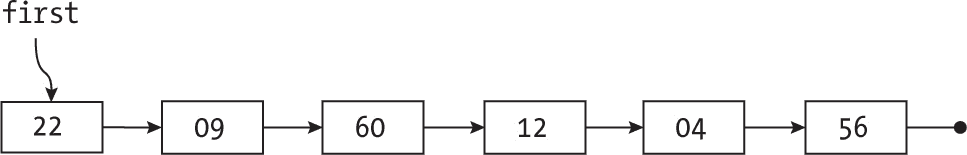

图 10-1：一个简单的链表

添加新元素需要更改指针。例如，图 10-2 展示了在 60 后添加 80。

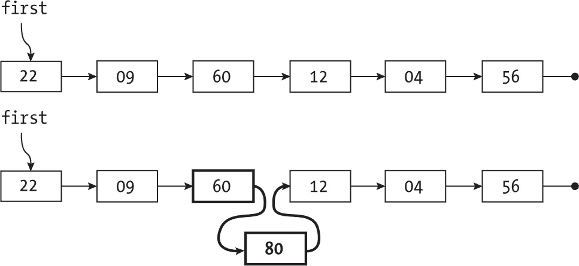

图 10-2：向链表添加新元素只需要更改一个节点中的指针。

移除一个元素时也会得到相同的结果；你只需要改变一个指针——通常是前一个元素的指针，或者如果移除的是链表头，则是头指针。在下一个示例中，我们将移除 60（见图 10-3）。

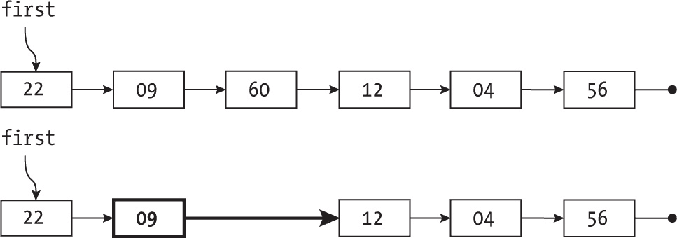

图 10-3：从链表中移除元素同样只需要改变一个指针。

添加和移除元素本身是*O*(1)操作。（当然，这假设你已经知道在哪里进行更改，并且知道其他元素指向你想要移除的元素。）让我们考虑一下所有可能操作的实现代码。

##### 创建一个链表

链表只是一个对象，它可能包含指向另一个对象的链接，依此类推。空链表是一个空指针。考虑到这一点，创建一个新的空链表非常简单，检查链表是否为空或计算链表的大小也同样简单：

```
❶ const newList = () => null;

❷ const isEmpty = (list) => list === null;

❸ const size = (list) => (isEmpty(list) ? 0 : 1 + size(list.next)); 
```

创建一个链表会产生一个最终指向链表头的空指针❶。检查链表是否为空❷意味着查看指针是否为空。最后，通过递归计算链表的大小非常简单：空链表的大小为 0，非空链表的大小为 1（即链表头）加上链表尾部的大小❸。

##### 添加一个值

要确定链表的节点，可以使用包含值（一个键或你想添加到链表的任何内容）和指向链表下一个元素的指针（ptr）作为对象：

```
const add = (list, position, value) => {
❶ if (isEmpty(list) || position === 0) {
  ❷ list = {value, next: list};
  } else {
  ❸ list.next = add(list.next, position - 1, value);
  }
❹ return list;
};
```

`add(...)`递归函数获取一个指向列表的指针以及要添加新值的位置。如果指针为 null，或者位置为零 ❶，新节点将插入到列表的开头 ❷，并指向原本是列表第一个元素的部分。否则，递归地移动到下一个节点 ❸。添加新值后，返回更新后的列表指针 ❹。

##### 移除一个值

要从列表中移除一个元素，你有两个选择：移除第一个元素（此时必须更改指向列表第一个元素的指针），或者移除列表中的其他元素（然后修改前一个节点中的指针，如前所述）。以下代码实现了这些操作：

```
const remove = (list, position) => {
  if (isEmpty(list)) {
  ❶ return list;
 } else if (position === 0) {
  ❷ return list.next;
  } else {
  ❸ list.next = remove(list.next, position – 1);
    return list;
  }
};
```

如果列表为 null，直接返回 ❶；否则，你不能做其他任何事情。如果它不是 null，并且你想要移除其头部元素，新列表将是列表的尾部 ❷。最后，如果列表不为 null，且你不想移除其头部元素，则继续移动到下一个位置再次尝试移除 ❸，但此时需要移除的位置比之前少 1。在所有情况下，返回移除后的列表指针。

##### 获取某位置的值

你可以通过考虑几个情况，以自然递归的方式获取给定位置的值。如果列表为 null，则没有值可返回，因此返回 undefined。如果列表不为空，且你请求的位置是 0，则你需要返回列表的第一个元素。如果列表不为空，而你请求的是位于列表较远位置的元素，则移动到下一个位置并递归处理。以下代码正是实现了这一点：

```
const at = (list, position) => {
❶ if (isEmpty(list)) {
   return undefined;
❷} else if (position === 0) {
   return list.value;
❸} else {
   return at(list.next, position - 1);
 }
};
```

逻辑紧密跟随三个步骤：检查是否为空列表 ❶，测试列表头部 ❷，以及使用递归向下遍历列表 ❸。

##### 搜索值

最后，你可以搜索一个列表，查看它是否包含给定的值。这个操作虽然不常见，但你仍然会进行它，以便通过这个结构积累更多经验。一般的逻辑类似于你刚才看到的 at(...)示例。假设你有一个指针`ptr`，指向列表中的一个元素。如果指针为 null，则表示该值不在列表中。否则，如果指针`ptr`指向的对象包含你想要的值，那么你就找到了。如果值不是你想要的，继续从下一个节点开始搜索。以下是递归逻辑：

```
const find = (list, value) => {
  if (isEmpty(list)) {
 ❶ return false;
  } else {
  ❷ return list.value === value || find(list.next, value);
  }
};
```

如果列表为空，❶ 返回 false。否则，如果列表头部的值是你想要的 ❷，则返回 true。如果不是你想要的值，继续搜索列表的尾部。（请注意，你通过使用 JavaScript 的||运算符，将这两个测试合并在一起。）

##### 考虑动态内存列表的性能

为了总结这部分关于动态内存列表的讨论，让我们分析它们的性能（见表 10-4）。

表 10-4：动态内存列表操作的性能

| 操作 | 性能 |
| --- | --- |
| 创建 | O(1) |
| 为空？ | O(1) |
| 大小 | O(n) |
| 添加 | O(n) |
| 移除 | O(n) |
| 在 | O(n) |
| 查找 | O(n) |

与基于数组的实现一样，创建新列表和检查它是否为空都是*O*(1)操作，但所有其他操作的时间复杂度都变成了*O*(*n*)！这一差异表明，单纯使用指针实现数组（如前所示）并不是最佳解决方案。然而，一些具有更具体操作集的列表，能更好地满足其特定需求，从而实现更好的性能。 |

### 列表的种类

对于某些任务，可能需要比上一节中探索的常见列表的基本 ADT 及其实现更专业的 ADT。具体来说，我们将考虑栈、队列、双端队列和循环列表，包括它们的特定操作和应用。 |

#### 栈

栈是一种后进先出（LIFO）数据结构，类似于实际的盘子堆：想象一下，你只能将盘子添加到堆顶，或者只能移除顶上的盘子；不允许添加或移除中间的盘子。栈的行为也是如此。你只能在栈顶进行添加和移除操作，这些操作通常称为*压栈*（push）和*弹栈*（pop）。你还需要检查栈是否为空（与常见列表一样），并查看栈顶的值。（有时弹栈操作被定义为返回更新后的栈以及栈顶的值。在这种情况下，你就不需要一个单独的操作来获取栈顶值，因为你可以弹栈，使用栈顶值后再将其压栈。） |

表 10-5 总结了你所需的操作，正如前面提到的，你这里处理的是一个较小、更具体的操作集。

表 10-5：栈的操作

| 操作 | 签名 | 描述 |
| --- | --- | --- |
| 创建 | → S | 创建一个新栈。 |
| 空吗？ | S → 布尔值 | 确定栈是否为空。 |
| 压栈 | S × 值 → S | 将一个值添加到栈顶。 |
| 弹栈 | S → S | 移除栈顶的值。 |
| 栈顶 | S → 值 | 获取栈顶的值。 |

栈在应用中被广泛使用。例如，想了解如何通过使用栈以迭代方式实现递归深度优先过程，可以查看第十三章中的第 13.3 题。栈的一个不常见应用场景是惠普计算器中的逆波兰表示法（RPN）：你将数字压入栈中，然后操作会弹出这些数字，执行所要求的计算，并将结果重新压入栈中。 |

栈还用于像 FORTH 或 WebAssembly（WASM）这样的编程语言，以及像 PostScript 这样的页面描述语言。中央处理单元（CPU）使用栈进行子例程调用和中断。如果代码正在执行并且中断到来，当前状态会被压入栈中，然后处理中断；中断处理完成后，正常执行会从栈中弹出状态并恢复执行。（显然，在处理一个中断时，可能会有新的中断。在这种情况下，第一个中断的状态也会被压入栈中，然后处理第二个中断，处理完成后，第一个中断的状态会被弹出，继续处理它。）

最后，JavaScript 本身实现了一个调用栈。每当一个函数调用自身时，就好像当前的状态和变量在开始递归调用之前被压入了栈中。当从递归调用返回时，旧的状态会从栈中弹出，执行从停止的地方恢复。

##### 数据结构

使用数组实现栈很简单，因为你可以直接使用 .pop(...) 和 .push(...)（参见问题 10.5）。使用链式内存也很简单，你将基于你为列表编写的函数来编写代码。在这个结构中，你将有一个指向第一个元素的指针，即栈顶元素，每个元素将有一个指向“下方”元素的 .next 指针。“底部”元素将有一个空指针。图 10-4 显示了它是如何工作的。

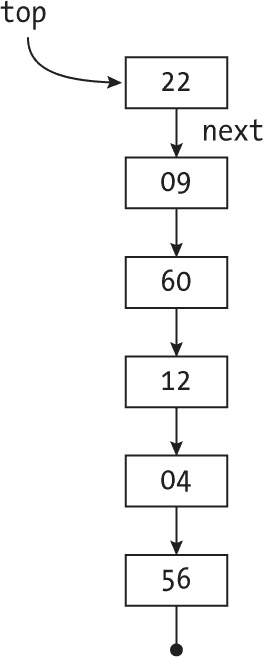

图 10-4：使用动态内存实现的栈

将新值压入非空栈只需要添加一个新对象，该对象指向原来的栈顶元素，并更改栈顶指针（参见图 10-5）。

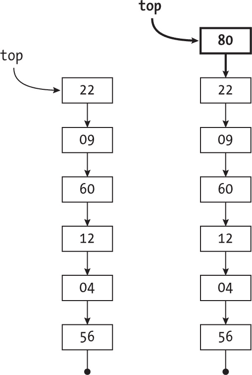

图 10-5：将新元素压入栈顶

弹出栈顶元素更简单：调整栈顶指针指向下一个元素，如图 10-6 所示。

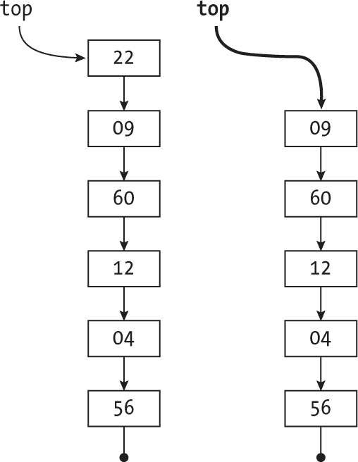

图 10-6：从栈中弹出栈顶元素

在两种情况下（压栈和弹栈），当处理空栈时，你需要对逻辑进行简单的调整。

##### 实现

栈是一种列表，因此创建栈和创建通用列表完全相同，如上一节所示；只需更改名称：

```
const newStack = () => null;
const isEmpty = (stack) => stack === null;
```

检查栈顶只需要一行代码（栈上的所有其他操作也都是一行代码）：

```
const top = (stack) => (isEmpty(stack) ? undefined : stack.value);
```

对于空栈，只需返回`undefined`；否则，栈指向栈顶元素，因此栈的值（stack.value）就是你需要的。

压入一个值意味着栈顶会有一个新元素，这个新元素指向之前的栈顶元素：

```
const push = (stack, value) => ({value, next: stack});
```

如果栈为空，这个逻辑也能正常工作。你能看出为什么吗？

最后，弹出栈顶元素也是快速的：

```
const pop = (stack) => (isEmpty(stack) ? stack : stack.next);
```

如果栈为空，直接返回栈本身。你也可以轻松修改代码，例如抛出错误。对于非空栈，只需返回栈的尾部。

##### 基于动态内存的栈性能

考虑到此栈实现的性能，结果远比常见列表更好（见表 10-6）。

表 10-6：基于动态内存的栈操作性能

| 操作 | 性能 |
| --- | --- |
| 创建 | O(1) |
| 是否为空？ | O(1) |
| 推入 | O(1) |
| 弹出 | O(1) |
| 顶端 | O(1) |

所有操作都需要常数时间，这是最优的。如果使用数组实现栈，结果*几乎*是相同的，唯一的例外是：推入新值可能需要将数组移动到内存中一个新的、更大的位置，这样推入操作就变成了*O*(*n*)操作。与实现常见的列表相比，后者大多数操作的成本较高，使用动态内存实现栈既一样好，有时甚至更好。现在再考虑其他提供类似结果的列表变体。

#### 队列

*队列*是列表的另一种变体，它是一个先进先出（FIFO）的数据结构。队列的工作方式就像一排等待某事的人。新的人从队列的后面进入（没有人可以插队），前面的人将首先离开队列。这两种操作是*进入*和*退出*（或*入队*和*出队*），它们模拟了现实中排队的情况。你还需要检查队列是否为空，并能够获取队列前端的值。表 10-7 展示了你需要的操作。

表 10-7：队列的操作

| 操作 | 签名 | 描述 |
| --- | --- | --- |
| 创建 | → Q | 创建一个新的队列。 |
| 是否为空？ | Q → 布尔值 | 判断队列是否为空。 |
| 进入 | Q × 值 → Q | 在队列的末尾添加一个值。 |
| 退出 | Q → Q | 移除队列前端的值。 |
| 前端 | Q → 值 | 获取队列前端的值。 |

一种有时使用的替代方案是，*退出*操作返回更新后的队列和从队列中移除的值，但考虑到*前端*操作，这并不是必需的。你还可以有一个*尾端*操作来访问队列末尾的值，但这并不常见。

队列通常用于那些不需要（或无法）立即处理的情况，并且应按顺序处理，例如打印队列或呼叫中心电话系统，在代表空闲之前会将你保持在等待状态。

##### 数据结构

使用数组实现队列非常简单。对于链式内存，你需要指向队列第一个和最后一个节点的指针，因此你将用一个具有 first 和 last 链接的对象来表示队列。队列中的每个元素都有一个指向下一个元素的 next 指针，如 图 10-7 所示。（下一个元素实际上位于队列的前一个位置，因此 prev 也可以是指针的名称。）

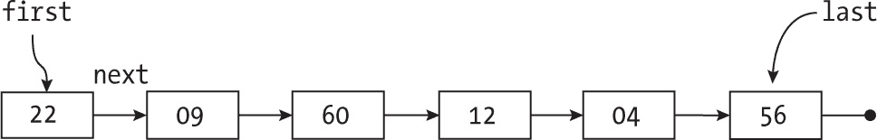

图 10-7：一个使用动态内存实现的队列

队列中的第一个元素（即下一个要退出的元素）是 22；接下来的元素是 9。队列的最后一个位置是 56。将新元素添加到队列的末尾只需要修改最后一个元素的指针和最后一个元素本身的指针（见 图 10-8）。

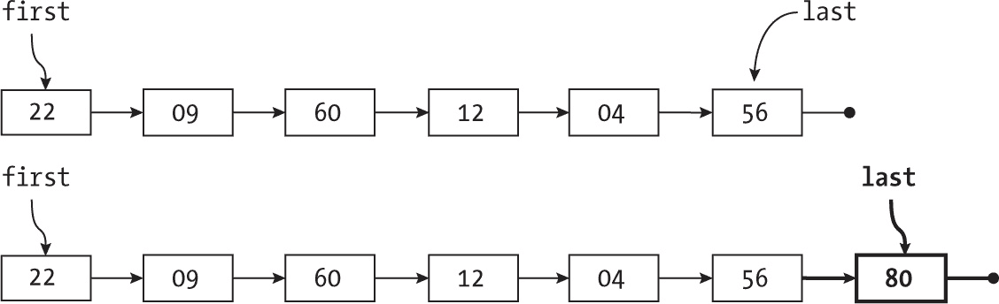

图 10-8：在队列末尾添加一个元素

添加 80 后，之前的最后一个元素 56 现在指向 80，last 指针也是如此。

从队列前端移除元素与栈的操作完全相同，如 图 10-9 所示。

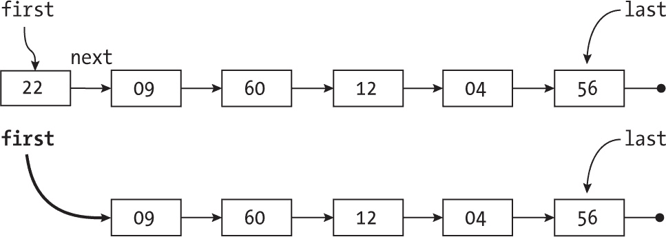

图 10-9：从队列前端移除一个元素

你只需要让第一个指针指向前一个第一个元素所指向的位置。现在我们来看如何实现这一切。

##### 实现

创建一个新的队列并检查它是否为空非常简单：

```
❶ const newQueue = () => ({first: null, last: null});

❷ const isEmpty = () => .first === null;
```

队列由一个包含两个指针 ❶ 的对象表示，初始时这两个指针为 null。如果其中一个指针为 null，便能判断队列为空 ❷；实际上，两个指针都为 null 或都不为 null。

获取队列前端（排在最前面的元素）的值很容易：

```
const front = (queue) => (isEmpty(queue) ? undefined : queue.first.value);
```

如果队列为空，返回 undefined；否则，queue.first 指向队列中的第一个元素，并返回其值。

在队列的最后位置加入元素是一个简单的操作：

```
const enter = (queue, value) => {
  if (isEmpty(queue)) {
  ❶ queue.first = queue.last = {value, next: null};
  } else {
  ❷ queue.last.next = {value, next: null};
  ❸ queue.last = queue.last.next;
  }
  return queue;
};
```

如果队列为空 ❶，则让第一个和最后一个指针指向一个新的对象，并将其指向队列中下一个节点的指针设为 null。否则，让最后一个元素指向一个新元素 ❷，然后也让 last 指针指向它 ❸。

最后，退出队列的操作与栈相同，但当队列为空时有一个特殊情况：

```
const exit = (queue) => {
❶ if (!isEmpty(queue)) {
  ❷ queue.first = queue.first.next;
  ❸ if (queue.first === null) {
      queue.last === null;
    }
  }
  return queue;
};
```

如果队列不为空 ❶，你只需要让第一个指针 ❷ 指向队列中的下一个元素；但如果队列已被清空 ❸，你还需要修正最后一个指针。

##### 基于动态内存的队列性能

由于队列和栈的相似性（唯一的区别是 pop 移除栈中的第一个元素，而 exit 移除队列中的最后一个元素），因此性能是相同的，正如 表 10-8 所示。

表 10-8：基于动态内存的队列操作性能

| 操作 | 性能 |
| --- | --- |
| 创建 | O(1) |
| 是否为空? | O(1) |
| 进入 | O(1) |
| 退出 | O(1) |
| 前端 | O(1) |

再次提醒，所有操作都需要常数时间；使用数组不如这种实现有效（参见问题 10.9）。

#### 双端队列

列表的下一个变体并没有很多应用场景（栈和队列更为常见），但其实现引入了一个有趣的概念——双向链接（前向和后向）。假设一个队列，允许从两端进入或退出。（可以想象一列火车，多个车厢可以添加到车头或车尾，但车厢只能从两端移除。）这种类型的列表被称为*双端队列*（Deque，发音类似“deck”），即“双端队列”。

表 10-9 展示了双端队列所需的操作。

表 10-9：双端队列的操作

| 操作 | 签名 | 描述 |
| --- | --- | --- |
| 创建 | → D | 创建一个新的双端队列。 |
| 空？ | D → boolean | 判断双端队列是否为空。 |
| 从前端进入 | D × value → D | 在双端队列前端添加一个值。 |
| 从后端进入 | D × value → D | 在双端队列后端添加一个值。 |
| 从前端退出 | D → D | 移除双端队列前端的值。 |
| 从后端退出 | D → D | 移除双端队列后端的值。 |
| 前端 | D → value | 获取双端队列前端的值。 |
| 后端 | D → value | 获取双端队列后端的值。 |

基本上，双端队列与队列相同，唯一的区别是你可以从两端进入或退出。同样，你还需要能够获取双端队列两端的值；对于队列，你只需要查看第一个（前端）项。

##### 数据结构

是否可以使用链式内存实现双端队列？由于现在所有操作都具有完全的对称性，你需要能够双向连接的链接。图 10-10 展示了其工作原理：如果你删除所有指向左侧的链接（或删除所有指向右侧的链接），你将剩下一个普通的队列。在这种结构中，你将再次拥有指向双端队列两端的第一个和最后一个指针，并且每个节点将拥有指向相邻节点的 next 和 prev（前一个）指针。

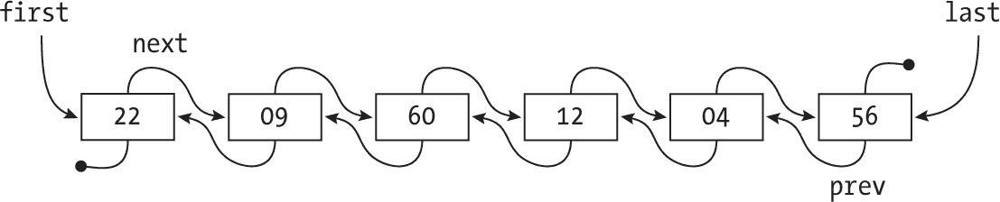

图 10-10：实现双端队列需要在每个节点上有两个指针。

由于对称性，双端队列两端的操作是完全类似的，因此我们只讨论双端队列一端的操作（见图 10-11）。

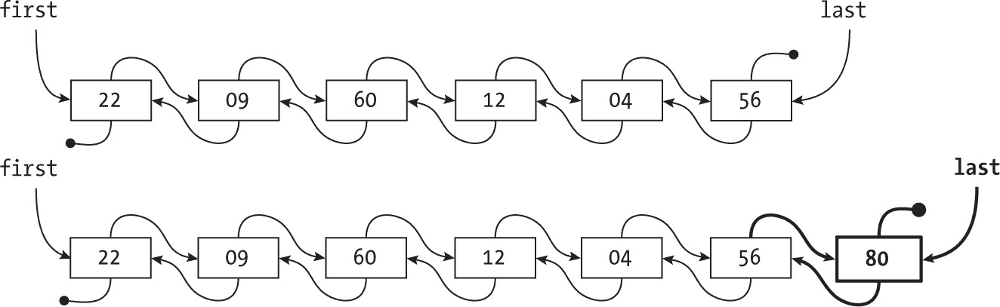

图 10-11：在双端队列的一个极端添加元素

在末尾添加一个值与队列的操作相同，不同之处在于新增的节点必须指向原先位于双端队列末尾的节点。（从另一端操作完全相同，因此我们跳过不谈。）

从双端队列末尾移除元素与图 10-11 所示相同，只是从底部向上操作；请参见图 10-12。

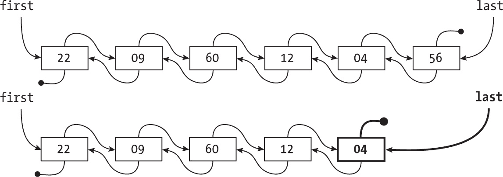

图 10-12：从双端队列的一个极端移除元素

删除后端的值时，修改相应的指针（last）和双端队列新极端的下一个指针；在另一端工作时，涉及到修改 first 和 prev 指针。

在双向链表中，删除操作很简单。如果你有指向某个元素的指针并想删除它（例如，删除图 10-13 中显示的列表中的 60），操作非常简单。

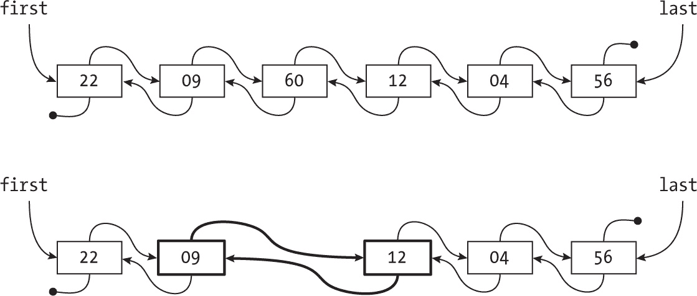

图 10-13：从双端队列中删除某个元素

关键是所有节点都有指向两个邻居的指针，因此你必须执行类似以下代码的操作，假设 ptr 指向要删除的节点：

```
ptr.prev.next = ptr.next;
ptr.next.prev = ptr.prev;
```

这种指针操作很常见，但第一次看到时可能会让人感到困惑，因此需要仔细研究。该代码适用于双端队列中间的元素。对于两端的元素，你需要进行一些小的调整，并至少调整（可能是两个）首尾元素。即使你从未使用过双端队列，双向链接的概念以及从中间提取任何元素的便利性，都是本节的关键要点。以后在本章和未来章节中，你将会使用这一概念处理循环链表。

##### 实现

创建双端队列并检查其是否为空的操作与队列完全相同，因为你有相同的首尾指针：

```
const newDeque = () => ({first: null, last: null});
const isEmpty = (deque) => deque.first === null;
```

向双端队列（deque）添加一个新元素与向队列中插入元素相同；唯一的区别是你可以在任一端添加元素，这微妙地改变了你需要修改的指针：

```
❶ const newNode = (value, prev = null, next = null) => ({value, prev, next});

const enterFront = (deque, value) => {
  if (deque.first === null) {
  ❷ deque.first = deque.last = newNode(value, null, null);
  } else {
  ❸ const newValue = newNode(value, deque.first, null);
    deque.first.next = newValue;
    deque.first = newValue;
  }
};

❹ const enterBack = (deque, value) => {
  if (deque.last === null) {
    deque.first = deque.last = newNode(value, null, null);
  } else {
    const newValue = newNode(value, null, deque.last);
    deque.last.prev = newValue;
    deque.last = newValue;
  }
};
```

你使用辅助函数创建一个新节点，并为其设置一对指针 ❶。如果双端队列为空，插入前端时需要同时修改首尾指针 ❷。否则，使用与队列相同的指针操作 ❸。从双端队列的后端插入的代码与此完全相同，且具有对称性：只需将 last 改为 first，prev 改为 next ❹。

同样，从双端队列的前端或后端删除一个元素与从队列中删除元素相同；这两种算法是对称的：

```
const removeFront = (deque) => {
❶ if (!isEmpty(deque)) {
  ❷ deque.first = deque.first.next;
 ❸ if (deque.first === null) {
      deque.last === null;
    }
  }
};

❹ const removeBack = (deque) => {
  if (!isEmpty(deque)) {
    deque.last = deque.last.prev;
    if (deque.last === null) {
      deque.first === null;
    }
  }
};
```

如果双端队列为空 ❶，则无需进行任何操作。否则，若要删除前端元素，先前进到双端队列的下一个元素 ❷，如果该元素为 null ❸，你还需要调整最后一个元素。对称的操作产生了完全相同的“删除最后一个”操作 ❹。

##### 基于动态内存的双端队列性能

双端队列本质上是一个双向队列：它的一半操作与队列完全相同，另外一半则是对称的，但代码风格相同，因此结果并不意外（见表 10-10）。

表 10-10：基于动态内存的双端队列操作性能

| 操作 | 性能 |
| --- | --- |
| 创建 | O(1) |
| 空吗？ | O(1) |
| 进入前端（或后端） | O(1) |
| 从前端（或后端）退出 | O(1) |
| 前端（或后端） | O(1) |

双端队列的所有操作与队列相同，所有操作都是 *O*(1)。

#### 循环链表

循环链表非常适用于“轮流处理”样式的任务。例如，PC 会将应用程序放入一个链表中，并循环遍历它们，最后一个完成后，处理将回到第一个（当你查看第十五章中的斐波那契堆时，你还会看到另一个例子）。与开放式链表不同，循环链表将第一个元素和最后一个元素连接在一起。这种 ADT（抽象数据类型）允许持续的处理，具有一个“当前”元素并能够循环前进到下一个元素。表 10-11 展示了我们需要的操作。

表 10-11：循环链表的操作

| 操作 | 签名 | 描述 |
| --- | --- | --- |
| 创建 | → C | 创建一个新的循环链表。 |
| 空? | C → 布尔值 | 判断循环链表是否为空。 |
| 添加 | C × 值 → C | 在当前元素之前添加一个新值并将其设为当前元素。 |
| 移除 | C → C | 移除当前值并前进。 |
| 当前 | C → 值 | 从循环链表中获取当前值。 |
| 前进 | C → C | 循环地前进到链表中的下一个值。 |

有些变种和变化是可能的。例如，你可以要求一个“回退”操作，它在与“前进”相反的方向上执行。你还可以使用“在当前元素后添加”操作，但你也可以先前进，然后使用添加操作来实现。这些变化不大，且如所示的结构非常有用。然而，你之前在双端队列中的工作会帮助你实现这个功能。

##### 数据结构

循环链表可以是单向或双向链接，但后者是最有用的版本。基本上，你只需要一个没有首尾元素的链表。相反，元素们形成一个圆圈，你将有一个指针指向当前正在处理的元素。图 10-14 展示了这样一个链表；这些节点拥有与双端队列相同的`next`和`prev`指针。

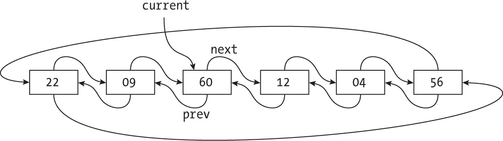

图 10-14：循环链表在每个节点都需要两个指针。

“前进到下一个”操作只需要跟随`next`链接（见图 10-15）。

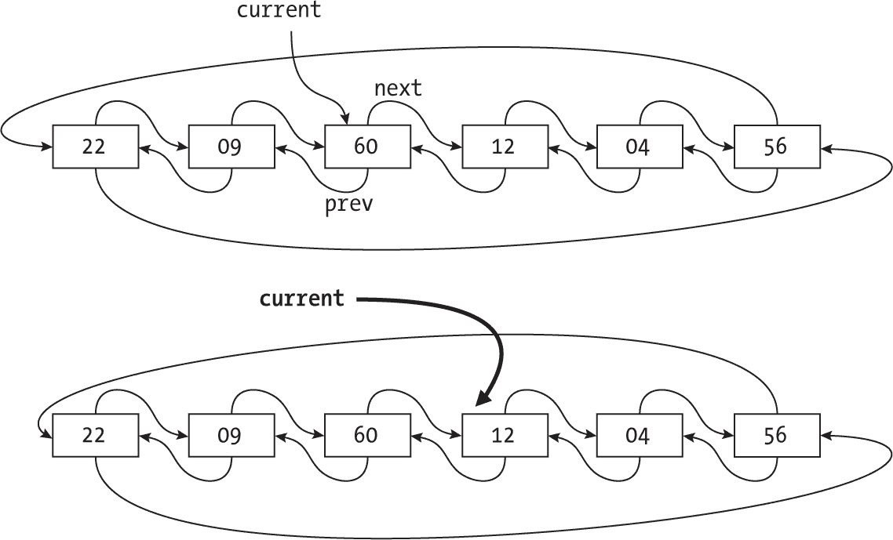

图 10-15：沿链表移动可以在两个方向上进行。

在当前元素之前添加一个新元素也是通过处理多个指针来完成的（见图 10-16）。

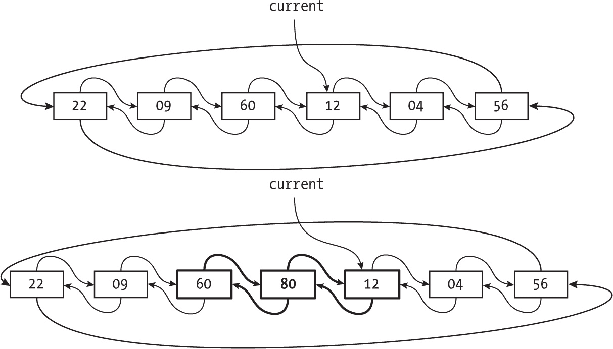

图 10-16：向循环链表添加元素是通过更改几个指针来完成的。

移除当前元素需要一些指针操作，但与双端队列类似，双向链接使得这一过程变得简单（见图 10-17）。


图 10-17：从循环链表中移除元素也只需要做几个指针的调整。

循环链表中的操作基本上需要你已经探索过的相同类型的逻辑。现在，考虑一个实际的实现。

##### 实现

创建一个循环列表与创建普通列表相同，测试该列表是否为空也一样。唯一的区别是命名：

```
const newCircularList = () => null; // current
const isEmpty = (circ) => circ === null;
```

在栈中，你有一个指向顶部元素的指针。在这里，你有一个指向列表中某个元素的指针，即当前元素。

添加一个新节点仅仅涉及更多的指针操作：

```
const add = (circ, valueToAdd) => {
  const newNode = {value: valueToAdd};
  if (isEmpty(circ)) {
  ❶ newNode.next = newNode;
    newNode.prev = newNode;
  } else {
  ❷ newNode.next = circ;
    newNode.prev = circ.prev;
    circ.prev.next = newNode;
    circ.prev = newNode;
  }
❸ return newNode;
};
```

如果列表为空，它由一个单独的节点组成❶，其 next 和 prev 链接指向自身。否则，新节点位于 circ（当前节点）和 circ.prev（前一个节点）所指向的节点之间。修复涉及的四个指针，使得新节点位于正确的位置❷。最后，返回新节点❸。

删除当前元素要简单一些：

```
const remove = (circ) => {
  if (isEmpty(circ)) {
  ❶ return circ;
  } else if (circ.next === circ) {
  ❷ return newCircularList();
  } else {
  ❸ circ.prev.next = circ.next;
    circ.next.prev = circ.prev;
    return circ.next;
  }
};
```

你需要考虑三种不同的情况。如果循环列表为空，什么也不做❶。如果列表只有一个元素（此时它的 next 和 prev 链接都指向自身），返回一个新的空列表❷。最后，如果列表不为空，则让 circ.prev 和 circ.next（即围绕当前节点的节点）互相指向❸。

最后，获取当前值并推进到下一个值都只需要一行代码：

```
❶ const current = (circ) => (isEmpty(circ) ? undefined : circ.value);
❷ const advance = (circ) => (isEmpty(circ) ? circ : circ.next);
```

空列表的当前元素只是未定义❶；否则，circ.value 给出它的值。对于非空循环列表，将当前元素推进到下一个位置只是去下一个节点❷。

##### 循环列表的性能

检查所有已实现的函数，发现没有一个需要循环或递归，因此与本章其他数据结构一样，性能是常数的（见表 10-12）。

表 10-12：循环列表操作的性能

| 操作 | 性能 |
| --- | --- |
| 创建 | O(1) |
| 空吗？ | O(1) |
| 添加 | O(1) |
| 删除 | O(1) |
| 当前 | O(1) |
| 推进 | O(1) |

当然，你可以使用数组，但某些操作的性能，比如添加新值，会受到影响，因为可能需要将整个数组移动到内存中的新位置：*O*(*n*)。

### 总结

本章我们检查了几种基于链接内存的线性结构和循环结构，你将在后续章节中有机会重用它们。链接内存是我们将要探讨的所有动态结构的关键，未来的章节中，我们将使用更复杂的结构，以提高更复杂操作的性能。

### 问题

**10.1  遍历列表**

“使用动态内存实现列表”部分中的所有示例都使用了递归编写，但它们通常是以迭代方式实现的。你能以这种方式重写它们吗？

**10.2  反向操作**

实现一个 reverse(list)算法，给定一个列表，将其反转，即第一个元素变为最后一个，第二个元素变为倒数第二个，以此类推。

**10.3  联手协作**

实现一个 append(list1, list2)函数，给定两个列表，将第二个列表追加到第一个列表后面。

**10.4  解除循环**

假设你有一个列表，它可能有或没有循环；换句话说，列表可能不会最终以空指针结束，而是有一个元素指向之前的某个元素，这样列表就形成了循环。你能写一个 `hasALoop(list)` 函数，给定一个列表判断它是否有循环吗？你的解决方案应该使用常量的额外内存；不要假设列表的长度，因为它可能非常长。

**10.5  用于栈的数组**

由于 JavaScript 提供了对数组的操作，如 .pop(...) 和 .push(...)，因此使用数组实现栈应该是相当简单的。你能写出合适的代码吗？

**10.6  栈打印**

你能写一个打印栈内容的代码，按从上到下的顺序打印吗？你能按反向顺序（从下到上）打印它吗？

**10.7  栈的高度**

假设你需要知道栈中有多少个元素。你如何实现这个功能？

**10.8  最大栈**

假设你需要一个栈来进行某些操作，但你还需要在每次压栈或弹栈后，知道栈中的最大值。你如何高效地实现这一点，而不必每次都遍历整个栈？

**10.9  排队数组**

在之前的问题中，你看到 JavaScript 提供的操作使得使用数组模拟栈变得非常简单。那么队列也是这样吗？你如何用数组模拟队列？这种实现的性能如何？

**10.10  队列长度**

编写一个函数，给定一个队列，计算其中有多少个值；换句话说，找出队列的长度。

**10.11  排序队列**

在第六章中，你使用数组实现了基数排序，但使用队列和链式内存更高效。你能根据这个调整算法吗？

**10.12  栈式队列**

假设你需要使用队列来编写某个程序，但你只有一个实现了栈的库。通过一些技巧，你可以使用一对栈来模拟队列；你能理解其中的原理吗？（你将在第十八章中进一步探讨这个策略。）

**10.13  回文检测**

你如何使用双端队列（deque）来判断一个字符串是否是回文？回文是指正着读或反着读都相同的单词，如“Hannah”或“radar”，或者忽略空格和标点符号后的“Step on no pets”或“A man, a plan, a canal: Panama。”

**10.14  循环列表**

实现一个函数来列出循环列表的所有内容；小心不要进入循环。

**10.15  连接圆圈**

假设你有两个循环列表。你如何将它们合并成一个更大的列表？为简单起见，假设这两个列表都不是空的。
