## 11 袋、集合和映射


在本章中，我们将考虑一些广泛使用的抽象数据类型（ADT）：袋、集合和映射。*袋*只是一个值的集合（无论是否重复），*集合*是一个*不同*值的集合，*映射*是由键+数据对组成的集合。我们将考虑一些实现这些 ADT 的新方法，从 JavaScript 的对象开始，然后继续讨论位图、列表和*哈希*，这是一种我们尚未探索过的新方法。

### 引入袋、集合和映射

在第三章中，我们定义了袋的抽象数据类型（ADT），并展示了表 11-1 中的集合操作。（在此上下文中使用“*集合*”一词完全符合其数学定义。）当你需要存储许多（可能重复的）值时，你需要一个袋。

表 11-1：袋的操作

| 操作 | 签名 | 描述 |
| --- | --- | --- |
| 创建 | → bag | 创建一个新袋。 |
| 空吗？ | bag → boolean | 给定一个袋，判断它是否为空。 |
| 添加 | bag × value → bag | 给定一个新值，添加到袋中。 |
| 删除 | bag × value → bag | 给定一个值，从袋中删除它。 |
| 查找 | bag × value → boolean | 给定一个值，检查它是否存在于袋中。 |

在第三章中，我们有一个额外的操作来获取袋中的最大值，但在这里不考虑这个操作，因为它不是标准操作。你也可以有一个操作来查找袋的当前大小，可能还有其他一些操作，但这些已经足够。

有时你需要一个实际的集合，因此你不想允许重复值，这种限制需要一组略有不同的操作，如表 11-2 所示。

表 11-2：集合的操作

| 操作 | 签名 | 描述 |
| --- | --- | --- |
| 创建 | → set | 创建一个新集合。 |
| 空吗？ | set → boolean | 给定一个集合，判断它是否为空。 |
| 添加 | set × value → set &#124; 错误 | 给定一个新值，添加到集合中。 |
| 删除 | set × value → set | 给定一个值，从集合中删除它。 |
| 查找 | set × value → boolean | 给定一个值，检查它是否存在于集合中。 |

所有操作都是相同的，唯一的区别是，当你尝试添加一个新值并发现它已经存在时，你会做出不同的处理。一个可能的做法是直接忽略这种情况（毕竟，如果你想将一个值包含在集合中，而该值已经存在，那一切都正常），或者你可以抛出错误或执行其他操作。你也可以事先检查要添加的值是否已经存在于集合中，但通常在添加时进行检查更高效。

最后，在某些情况下，你可能想要存储键+数据对。例如，对于一个使用国家信息的应用程序，键可能是 ISO 3166 国家代码（例如瑞士的 CH、图瓦卢的 TV 或乌拉圭的 UY），数据可能是国家名称、人口等等。实现了集合之后，实现映射就很简单。你只需要存储带有键+数据的对象，并进行更改，使得*查找*和*删除*仅使用键来工作；前者如果找到，则返回数据而不是布尔值。有关所有操作，请参见表 11-3。

表 11-3：映射的操作

| 操作 | 签名 | 描述 |
| --- | --- | --- |
| 创建 | → map | 创建一个新的映射。 |
| 是否为空？ | map → boolean | 给定一个映射，确定它是否为空。 |
| 添加 | map × (key + data) → map &#124; 错误 | 给定一个新的键+数据，将其添加到映射中。 |
| 删除 | map × key → map | 给定一个键，从映射中删除它。 |
| 查找 | map × key → data &#124; undefined | 给定一个键，检查它是否存在于映射中，如果找到，返回数据或 undefined。 |

所有这些更改都非常简单，所以我们将使用普通的袋和集合。现在让我们考虑具体的实现，从 JavaScript 自身的实现开始。

### JavaScript 的集合解决方案

你在第三章中学到了如何使用几种不同的方法实现一个袋（bag）。只需做一些更改，你就可以实现集合而不是袋；你需要做的就是在添加一个新值之前，检查它是否已经存在。在本节中，我们将考虑使用 JavaScript 实现集合的另外两种方式：使用普通对象（这不是最好的方式）和使用标准集合对象。

#### 对象作为集合

即使对象并非设计为集合（或映射），许多开发人员仍然使用普通对象作为集合。如果你可以将值作为属性（通常是字符串或转换为字符串的数字），你就可以将它们用作属性名称：

```
❶ const mySet = {};
❷ mySet.one = 1;
mySet.two = 2;
```

在普通 JavaScript 中，创建一个对象意味着分配一个空对象 ❶ 并向其中添加值 ❷。在这里，你现在有一个包含两个键的集合：one 和 two。（如果你想要一个映射，则这些键所关联的值就是数据。）

你可以使用 in 操作符测试一个键是否在对象中：

```
"two" in mySet;   // true
"three" in mySet; // false
```

最后，你可以使用 delete 来删除一个键：

```
delete mySet.two;
```

作为额外的操作，你可以使用 Object.keys(...) 获取对象的所有属性列表，甚至可以使用 for...in 对它们进行迭代。

使用普通的 JavaScript 对象显然是可行的，但你可能更想让代码更具可读性，明确表达你的意图，使用一个合适的集合，它毕竟直接代表了你想要的数据结构。

#### 集合对象

集合是让你存储唯一值的对象。创建一个新的 JavaScript 集合并添加几个值是很简单的；试着重新做一下上一节的例子：

```
❶ const mySet = new Set();
❷ mySet.add("one");
mySet.add("two");
```

通过创建一个新的 Set 类实例 ❶ 来创建集合，并使用其 .add(...) 方法 ❷ 向集合中添加值。顺便说一下，你可以链式调用，因此可以将这两个添加操作写在同一行：

```
mySet.add("one").add("two");
```

要测试某个值是否在集合中，使用 .has(...) 方法：

```
mySet.has("two");   // true
mySet.has("three"); // false
```

最后，你可以使用.delete(...)方法删除值：

```
mySet.delete("two");
```

JavaScript 的集合有一些额外有趣的方法。要删除所有值，可以使用 set.clear()。你还可以使用 .size 属性来查找集合中的元素数量。

### 位图

在某些情况下，你可以通过使用位图来实现集合（回想一下第六章中的位图排序）。如果要存储的值是具有有限范围的数字，使用布尔标志数组就足够了。

我们在这里不会看到代码，因为它直接基于你在第六章中学习的排序方法。主要思路是设置一个充满 false 值的数组，数组的索引就是值本身。要添加一个值，将其标志设置为 true；要删除它，将其标志重置为 false。最后，要测试某个值是否在集合中，检查对应的标志。没有比这更简单的方法了。

### 使用列表

我们在第十章中讨论了列表，你可以将其改编为袋子或集合。考虑三种不同的可能性：

**有序列表** 保持值按升序排列的普通列表

**跳表** 二维结构，具有快速搜索功能

**自组织列表** 适用于缓存等类似情况的有趣应用

请注意，你在第 218 页“哈希”部分中考虑的一些解决方案也会使用列表。

#### 有序列表

如第十章中所述，有序列表的概念很简单：你不会总是将值添加到列表的两端，而是将它们按顺序添加。这个做法会减慢插入速度（因为你需要找到正确的插入位置），但它使得搜索平均速度更快（当你遇到一个比目标值大的值时，可以停止搜索）。来看一下实现方法。

##### 在有序列表中查找值

搜索逻辑非常直接：从头开始，沿着链接查找，直到找到目标值或者确认该值不存在，因为你要么到达了列表的末尾，要么遇到了比目标值更大的值。图 11-1 展示了如何在有序列表中（成功地）查找值 22。


图 11-1：在列表中成功查找值（22）

这与线性查找方式相同（见第九章）。从列表的头部开始，持续查找。在这种情况下，你找到了你想要的值，因此搜索成功。如果你原本要查找的是 20，那么在这个点你就会放弃搜索。如果遇到一个比目标值更大的值，搜索就失败了。

另一种失败的可能性是查找超出了列表的末尾；请参见图 11-2，它展示了查找值 86 的过程。

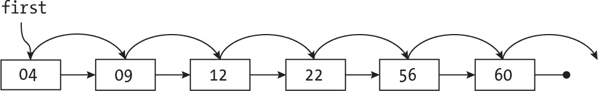

图 11-2：在列表中查找失败的值（86）

线性查找的代码如下：

```
const find = (list, valueToFind) => {
❶ if (isEmpty(list) || valueToFind < list.value) {
   return false;
❷} else if (valueToFind === list.value) {
   return true;
❸} else {
   // valueToRemove > list.value
   return find(list.next, valueToFind);
 }
};
```

如果你遇到了一个空列表——无论它是一开始就是空的，还是你遍历到它并到达了末尾（你在第十章中看到过这段代码）——你知道值不在其中。如果列表不为空，但其第一个值大于你正在寻找的值 ❶，那么值也不在其中。如果列表不为空且第一个元素与你想要的值相等 ❷，那么值就找到了。最后，如果列表不为空并且你要找的值大于列表的第一个元素 ❸，则从列表的下一个节点继续查找。

##### 向有序列表中添加新值

要添加一个新值，首先进行查找，直到找到新值应该放置的位置（也就是说，在一个较小值的节点和一个较大值的节点之间），然后更改几个指针以将新值包含到列表中。图 11-3 展示了如何将 20 添加到列表中。

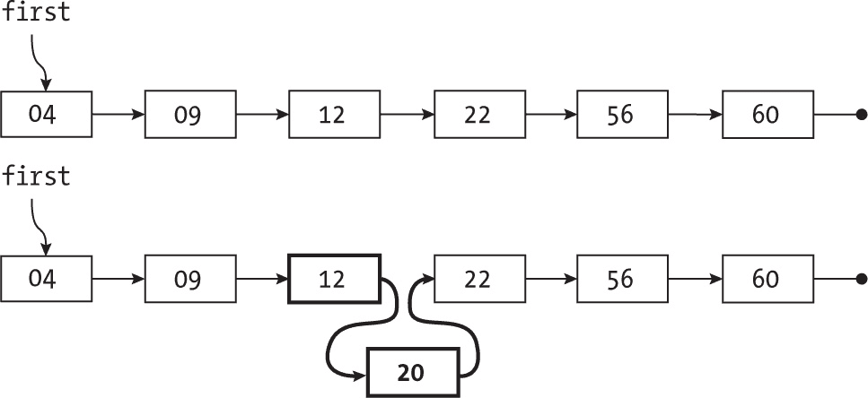

图 11-3：向有序列表中添加新值（20）

如果你想要添加一个比列表头部值小的值，你需要更改列表本身的指针。另一个边界情况是添加一个大于列表中最后一个值的值；你在遍历列表时需要小心。你可以使用递归来更轻松地实现所有这些情况：

```
const add = (list, valueToAdd) => {
❶ if (isEmpty(list) || valueToAdd < list.value) {
   list = {value: valueToAdd, next: list};
❷} else {
 ❸ list.next = add(list.next, valueToAdd);
 }
 return list;
};
```

这一逻辑与你在进行线性查找时看到的类似。如果列表为空，或者列表不为空但第一个值大于你想要添加的值 ❶，则创建一个新的节点，其值为新值，且其下一个指针指向你原来的列表。（这涵盖了将值添加到列表末尾的情况；你能理解吗？）如果你想创建一个集合，添加一个测试 ❷，因为如果你找到你想添加的值，则会抛出错误或拒绝此操作。如果你在创建一个袋子，并且要添加的值大于列表中的第一个值 ❸，则使用递归在第一个元素之后添加它。

##### 从有序列表中删除值

删除一个值的过程是找到它（你已经知道如何做），然后修改它的前一个节点的链接，使其指向下一个值，正如图 11-4 所示。

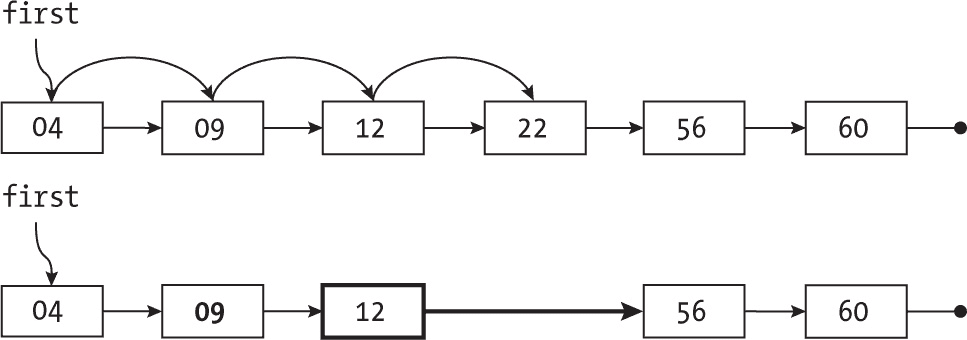

图 11-4：从有序列表中删除值（22）

如前所述，进行一次查找，如果成功，则跳过要删除的值。唯一不同的情况是当你删除列表头部时，需要修改指向列表的指针：

```
const remove = (list, valueToRemove) => {
❶ if (isEmpty(list) || valueToRemove < list.value) {
   return list;
❷} else if (valueToRemove === list.value) {
   return list.next;
❸} else {
   // valueToRemove > list.value
   list.next = remove(list.next, valueToRemove);
   return list;
 }
};
```

逻辑完全匹配搜索，逐个处理。它也是合乎逻辑的；您必须先找到该值，才能从列表中删除它。如果列表为空，或其第一个值大于要删除的值❶，则返回原列表，因为没有需要删除的内容。如果要删除的值位于列表头部❷，则返回列表的尾部，跳过要删除的值。最后，如果要删除的值大于列表头部的值❸，则递归地从列表尾部删除该值，并返回（更新后的）列表。

##### 考虑有序列表的性能

无法加速任何过程，如果列表有*n*个节点，所有功能都是*O*(*n*)。平均来说，所有操作都会访问列表的一半节点。这个实现对于小值*n*已经足够好，但对于较大的值，您需要一种能够让您更快速地遍历列表的方法——接下来的章节将展示这种方法。

#### 跳跃列表

如前所述，搜索一个列表是一个*O*(*n*)过程，因为没有办法加速，无法更快地移动。然而，您可以借鉴跳跃搜索方法（见第九章）。如果您能进行长跳跃，快速跳过许多位置，而当接近所需值时，开始进行更小的跳跃，再逐渐减小跳跃，直到最后进行逐一搜索，会发生什么呢？在本节中，我们将讨论*跳跃列表*，它通过提供更快的跳跃方式，使您能够更快速地遍历列表。

考虑如图 11-5 所示的有序列表（为了清晰起见，我没有包含箭头；所有箭头都从左到右）。

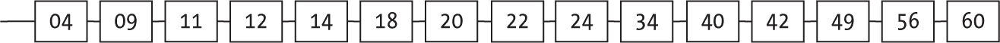

图 11-5：搜索长列表在逻辑上较慢。

如所示，您不能像跳跃搜索那样快速跳跃，但通过辅助的第二个列表，完全可以做到这一点，如图 11-6 所示（垂直线表示从上到下的指针）。

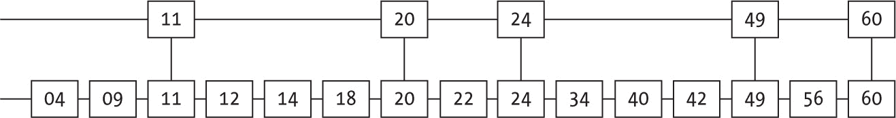

图 11-6：通过添加第二个列表加速列表搜索

如果您想查找 42，您将从最顶层的列表开始，向右移动，直到超过 42；然后您会回退并向下继续搜索（见图 11-7）。

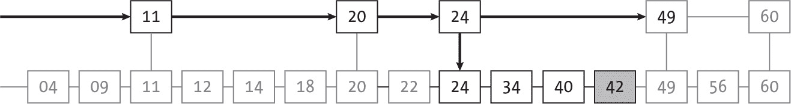

图 11-7：借助第二个列表查找值（42）

最顶层的列表仅包含底层列表中的少数几个值，它允许您进行更长的跳跃，因此搜索速度更快。当然，为了实现更快的过程，您可以拥有三个或更多层次，如图 11-8 所示。

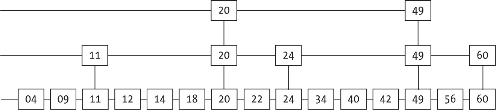

图 11-8：第三个列表有助于进一步加速搜索。

这种方法效果很好，并且提供了更好的期望性能 *O*(log *n*)。然而，实际操作中，在每个地方都有重复值的这些列表并不好。根据不同的层次，将每个值仅在一个节点中出现，并且节点有多个指针（如图 11-9 所示）会更好。（实际上，所有节点可能具有相同数量的指针，但图 11-9 仅显示了使用的指针。）

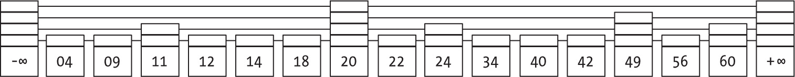

图 11-9：跳表的实际实现，每个节点有多个指针

我们将使用这种搜索方式来简化我们的工作。我们还会在列表的开始和结束添加一些哨兵节点，以简化所有逻辑。您不会遇到“在开头添加”或“在结尾添加”之类的情况，因为没有任何值可以比第一个哨兵小或比最后一个哨兵大。此外，您也不必处理空列表（至少哨兵会存在），而且您永远不会超出列表的最后一个项目。

##### 创建跳表

空列表将由一个包含两个哨兵的节点组成：一个负无穷值和一个仅有一个正无穷值的单一层。其实现如下：

```
const newSkipList = () => ({
  value: -Infinity,
  next: [{value: Infinity, next: [null]}]
});
```

您有一个只有两个值的列表：-Infinity 位于第一个，Infinity 位于最后。（这里您处理的是数值，对于字符串，您需要使用合适的低值和高值字符串。）跳表是平坦的，只有一层。（没有任何下一个数组有超过一个元素。）了解这一点后，测试跳表是否为空就稍微复杂一些：

```
const isEmpty = (sl) => sl.next[0].next[0] === null;
```

如果跳表中没有任何值，您将拥有初始配置，因此您的哨兵将位于底层。在这个数据结构中，唯一指向下一个节点的指针为 null 的是 +Infinity 哨兵；所有其他节点的指针都不是 null。

您可以通过简单地查看下一个数组的长度来判断跳表有多少层。另一个有用的函数只需返回指针数组的最后一个索引：

```
const _level = (sl) => sl.next.length - 1;
```

您需要减去 1，因为指针数组是从零开始索引的，像往常一样。

##### 在跳表中搜索一个值

您之前已经看到了搜索的基本思路，但现在请考虑它们如何在实际实现中工作。搜索从最上层开始，向右推进，除非超出要搜索的值，在这种情况下，它会向下移到下一层。如果没有更多的层次，搜索将失败。

代码并不长，但处理多个层次需要小心：

```
❶ const _find = (node, currLevel, valueToFind) => {
❷ if (currLevel < 0) {
   return false;
❸} else if (valueToFind === node.value) {
   return true;
❹} else if (valueToFind >= node.next[currLevel].value) {
   return _find(node.next[currLevel], currLevel, valueToFind);
❺} else {
   return _find(node, currLevel - 1, valueToFind);
 }
};

❻ const find = (sl, valueToFind) => _find(sl, _level(sl), valueToFind);
```

我们将使用一个辅助的递归函数进行搜索。这个函数有三个参数：一个节点（跳表中的某个位置）、它正在搜索的层级，以及要查找的值❶。如果你尝试搜索低于第 0 层❷的地方，表示搜索失败，因为你已经到了底层，无法在该层找到值。如果节点有你想要的值❸，则表示搜索成功。如果你想要的值大于或等于该层级下一个值❹，则继续前进而不改变层级。否则，如果你已经遇到一个更大的值❺，则下降到下一层级。一般搜索的实现❻是从顶层的第一个节点开始的。

##### 向跳表中添加一个值

我们还没有真正讨论如何决定哪些值放在哪些层级。我们将采用基于随机数的解决方案。显然，所有值都会处于最底层，但并不是所有值都会出现在其他层级。我们将通过“抛硬币”来决定一个新值是否上升一层；我们希望大约 50%的值能出现在下一级层级。我们会继续随机决定是否再将该值提升一层，直到抛硬币失败或者达到最大层级。在接下来的代码中，设置 MAX_LEVEL 为 32，这意味着平均每 2^(³²)个值中，只有一个会达到这么高的层级——一个非常庞大的结构！

我们将需要一个辅助函数来在某一层级及其以下所有层级中添加一个值。一个显而易见的问题是，为什么要先在更高的层级添加值，然后再在较低的层级添加？因为更高层级的列表元素较少，所以在那里插入更快。以下是代码：

```
const _add = (currNode, currLevel, newNode, newLevel) => {
❶ if (newNode.value > currNode.next[currLevel].value) {
    _add(currNode.next[currLevel], currLevel, newNode, newLevel);
  } else {
  ❷ if (currLevel <= newLevel) {
    ❸ newNode.next[currLevel] = currNode.next[currLevel];
      currNode.next[currLevel] = newNode;
    }
  ❹ if (currLevel > 0) {
    ❺ _add(currNode, currLevel - 1, newNode, newLevel);
    }
  }
};
```

如果新值大于该层级下一个值❶，你必须前进；当新值位于两个连续值之间时，你就能将其添加到列表中。如果你处于一个低于或等于最大新层级的层级❷，则添加该值并调整指针，将新值包含到列表中❸。最后，如果你还没有到达底层❹，则使用递归将该值添加到下一层❺。

使用这个函数，添加一个值的步骤如下：

```
const add = (sl, valueToAdd) => {
❶ let newLevel = 0;
  while (newLevel < MAX_LEVEL && Math.random() > 0.5) {
    newLevel++;
  }
❷ const newNode = {value: valueToAdd, next: new Array(newLevel)};

  let currLevel = _level(sl);
❸ while (newLevel >= currLevel) {
  ❹ sl.next[currLevel].next.push(null);
    sl.next.push(sl.next[currLevel]);
    currLevel++;
  }
❺ _add(sl, currLevel, newNode, newLevel);
  return sl;
};
```

首先，决定你要在哪个层级找到新节点❶。是否上升一层将取决于“抛硬币”的结果。决定好之后❷，创建一个带有该值的节点，并且创建一个包含正确数量指针的数组。如果你“上升”到了比之前更高的层级❸，跳表可能会变得更高。如果是这样的话❹，你需要为最右边的值添加新的指针。在解决了这个问题之后❺，使用辅助函数将该值添加到所有相应的列表中。

##### 从跳表中删除一个值

删除一个值需要两个步骤：首先，从它所在的所有列表中删除该值，你可以通过一个辅助函数来实现，然后可能需要使跳表“变短”，因为删除该值后，跳表可能不会像之前那样高。

下面是实际删除值的逻辑：

```
const _remove = (currNode, currLevel, valueToRemove) => {
❶ if (valueToRemove > currNode.next[currLevel].value) {
    _remove(currNode.next[currLevel], currLevel, valueToRemove);
  } else {
  ❷ if (valueToRemove === currNode.next[currLevel].value) {
    ❸ currNode.next[currLevel] = currNode.next[currLevel].next[currLevel];
    }
  ❹ if (currLevel > 0) {
      _remove(currNode, currLevel - 1, valueToRemove);
    }
  }
};
```

一直往下遍历列表❶，直到找到值应该在的位置。如果你实际上找到了它❷（用户可能要求移除一个根本不在列表中的值），修复指针❸。然后继续进行删除操作，直到到达最底层❹。

移除值是第一步，如前所述；你可能需要在之后重构多个级别：

```
const remove = (sl, valueToRemove) => {
❶ _remove(sl, _level(sl), valueToRemove);
  for (
  ❷ let level = _level(sl) – 1;
  ❸ level > 0 && sl.next[level].next[level] === null;
    level--
  ) {
  ❹ sl.next[level].next.splice(level, 1);
    sl.next.splice(level, 1);
  }
  return sl;
};
```

在移除值❶之后，从顶部❷开始逐级下降，尽管列表基本为空（只有哨兵节点）❸，你已将列表缩短❹。

##### 考虑跳表的性能

跳表的本质是概率性的，平均性能可以证明是对数级的（参见表 11-4）。

表 11-4：跳表操作的性能

| 操作 | 平均性能 | 最坏情况 |
| --- | --- | --- |
| 创建 | O(1) | O(1) |
| 添加 | O(log n) | O(n) |
| 移除 | O(log n) | O(n) |
| 查找 | O(log n) | O(n) |

结构表现不好的概率非常低（可能只有一个级别，或者大多数值分布在所有级别），但这种情况不太可能发生。

与哈希（你将在本章后面深入探讨）及其他结构类似，你可以通过重构跳表来解决性能问题；请参见问题 11.4 了解可能的思路。你也可以修改列表以允许通过位置检索值；参见问题 11.5。

#### 自组织列表

有一种特殊情况，你可以成功地使用“自动修改”的包。考虑一个具有最大容量限制的缓存。常常会出现你在短时间内需要某个元素几次，而在较长时间内完全不需要它。在这种情况下，你可以使用一个自组织列表，将最常用的元素放在列表的前面（以便更快地搜索），而将较少使用的元素放在后面（允许较慢的搜索）。

作为一个示例，想象一个映射（全球定位系统 [GPS] 风格）应用。你无法把每条街道名称都保存在内存中，但为了优化速度，你可以有一个小的街道名称缓存。在某个特定区域内旅行时，通常需要某一组街道名称，而且不太可能需要找到距离很远的街道。自组织列表的想法是始终将新值添加到前面，如果你搜索到一个值并找到了它，就把它移到前面，假设如果很快需要它，你可以通过几步操作找到它。

##### 在自组织列表中搜索值

搜索一个无序列表并不困难；你只需要一直进行下去，直到找到目标值或到达列表的末尾。你可以在第十章中看到如何进行这种搜索（参见第 180 页的“用动态内存实现列表”部分）。重要的细节是，如果找到了该元素该怎么做。将其设置为列表的头，并把它从原来的位置移除。图 11-10 展示了一个搜索 12 的示例。

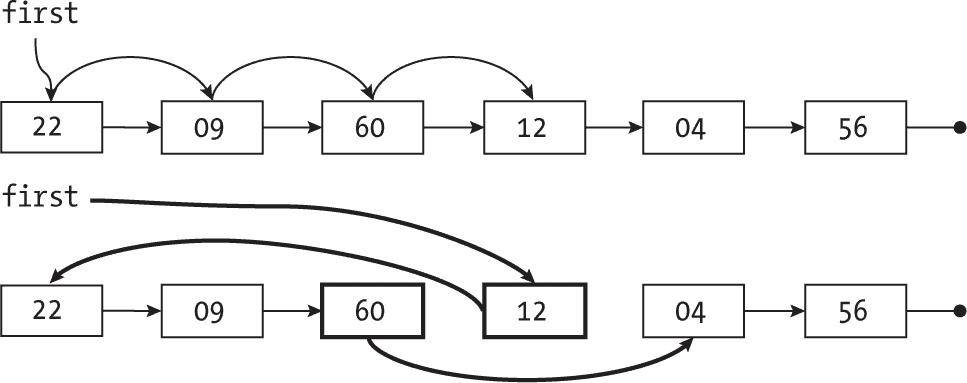

图 11-10：在自组织列表中成功搜索后，找到的节点被移动到列表的头部。

首先，进行一次搜索查找 12（这没有什么新奇的），但在找到之后会有一些变化。由于该值原本不在列表的头部，你将重新结构化列表，使 12 位于头部，并指向旧的头部。如果将来你再次需要查找它，这些搜索将非常迅速，因为该值将位于列表的头部或者非常接近头部。

代码如下：

```
const findMTF = (list, keyToFind) => {
❶ if (isEmpty(list)) {
    return [list, false];
❷} else if (list.value === keyToFind) {
    return [list, true];
  } else {
 ❸ let [prev, curr] = [list, list.next];
 ❹ while (!isEmpty(curr) && curr.value !== keyToFind) {
     [prev, curr] = [curr, curr.next];
   }

 ❺ if (isEmpty(curr)) {
     return [list, false];
 ❻} else {
     [prev.next, curr.next] = [curr.next, list];
     return [curr, true];
   }
 }
};
```

现在进行搜索时，你也在修改列表，因此你需要返回两个值：列表本身（如果找到值，可能已经更新）和一个布尔值表示搜索的结果。（太麻烦了？请参见问题 11.3。）如果列表为空 ❶，返回列表和 false，因为值显然不在其中。如果列表不为空，且你要找的值就在列表的头部 ❷，你不需要改变列表，因此直接返回它，并附带 true，表示成功。如果列表不为空，且你要找的值不在头部 ❸，设置一个循环，其中 prev 和 curr 将分别指向列表中的连续节点。该循环会在以下两种情况之一结束：你要么到达列表末尾，要么找到了你要的值 ❹。在前一种情况 ❺，返回列表和 false，就像列表为空时 ❶；如果是后一种情况 ❻，修改指针并返回当前节点作为新列表的头部，附带 true。

##### 向自组织列表中添加值

由于这些列表是无序的，你可以将值添加到任何地方，使用你之前用过的简单逻辑：

```
const add = (list, valueToAdd) => {
❶ list = {value: valueToAdd, next: list};
  return list;
};
```

将新值放到列表的顶部作为头部是非常简单的。创建一个新的节点，指向旧的列表 ❶，新列表的头部就是这个新节点。这个代码与在第十章中为栈编写的 push(...) 方法功能上是等效的。

##### 从自组织列表中删除值

我们之前看到过如何从有序列表中删除一个值。从无序列表中删除的操作与此非常相似，唯一的区别是你可能总是需要遍历到列表的末尾，因为没有办法提前停止搜索。你已经学会了如何以迭代的方式进行搜索，现在可以用递归的方式来实现：

```
const remove = (list, valueToRemove) => {
❶ if (isEmpty(list)) {
   return list;
❷} else if (valueToRemove === list.value) {
   return list.next;
 } else {
 ❸ list.next = remove(list.next, valueToRemove);
   return list;
 }
};
```

如果列表为空 ❶，直接返回，因为要删除的值不在那里。如果你要删除的值就是列表当前指向的值 ❷，返回列表的尾部（即 list.next 指向的部分）就完成了删除。最后，如果列表的头部没有你想要的值 ❸，让该节点指向删除尾部值后的结果。

##### 考虑自组织列表的性能和变种

这种结构的性能是*O*(*n*)，就像常见的列表一样，搜索时平均需要查看*n*/2 个元素。然而，在实际的集群需求中，它表现得要好得多，需要查看的元素远少于预期。这不是一种理论优势，而是完全经验和务实的优势，而且在最坏的情况下，你的表现不会更差。

还有其他类似性能的变体。“移到前面”（MTF）解决方案并不是唯一的选择。另一种可能性是“与前一个交换”，即不将找到的元素移到列表的头部，而是与它前面的元素交换，使其更接近头部。如果你多次搜索某个值，它最终会到达列表的前面；但如果这次搜索只是偶尔的，那么它将停留在原地。

另一种变体是给每个值添加引用计数，每次搜索到并找到该值时，将计数加 1，并将其移到列表的前面，使得这些值按照计数的降序排列。

### 哈希

在这一节中，我们将讨论一个不同的概念，它可能提供最快的搜索速度：*哈希*。哈希的概念与位图有一定的关系。如果要存储在集合中的值来自一个较小的范围，可以使用位图，这样可以提供*O*(1)的搜索时间，正如你所看到的那样。然而，如果值来自一个非常大的范围（例如，美国的社会保障号码，九位数字，总共有 10 亿个可能值），位图就变得不可行，因为它需要大量的空间。此外，你很可能只会处理所有可能键中的一个非常小的百分比。其基本思路是，首先使用一个*槽*数组来存储值，但随后不是像位图中那样将键用作索引，而是计算该值的哈希，并使用该哈希值作为索引。

在谈到哈希时，安布罗斯·比尔斯曾说：“这个词没有定义——没人知道哈希是什么。” 对我们来说，哈希是任何将一个值——无论是数字、字符串等——转换为一个给定范围内的数字的函数。以社会保障号码为例，要得到一个介于 000 和 999 之间的哈希值，你可以直接取后三个数字。要得到一个介于 0 和最大值*K*之间的哈希值，你可以通过将值除以*K*并取余数来实现。有很多计算哈希值的方法，但我们将使用余数函数，如下所示：

```
const hash = (ht, value) => value % ht.slots.length;
```

使用哈希来决定存储（或查找）值的位置时，我们首先计算哈希，然后去数组中对应的槽（见图 11-11）。这与我们在位图中的做法非常相似，只是那时我们使用键作为索引；在这里，我们假设可能的键的数量极其庞大，因此我们应用哈希将其缩减为一个可管理的值。

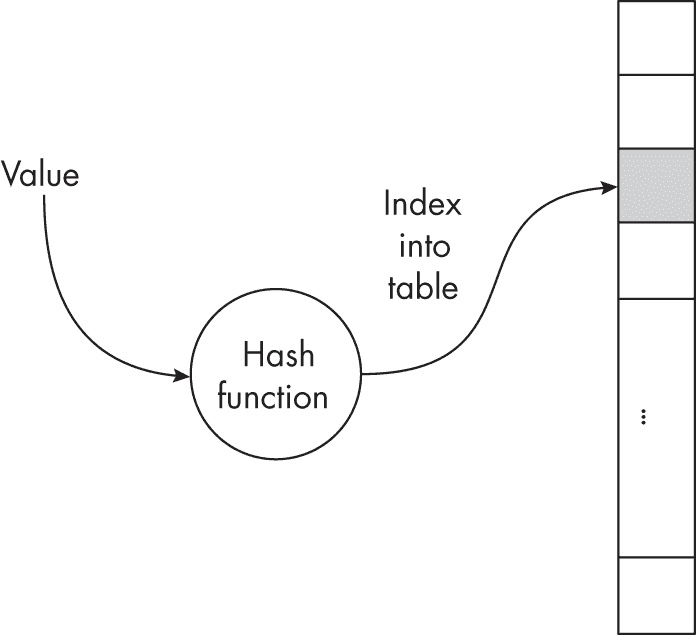

图 11-11：在哈希中，使用哈希函数决定一个值应该存储在表中的位置。

如果你想要的值占用了该槽，那么你已经找到了它。如果该槽为空，则可以确定该值不在集合中。但是如何处理那些产生相同哈希值的不同值，以便它们都放入相同的槽中呢？这种情况叫做*碰撞*，你必须指定如何解决它。（如果你认为这种情况不太可能，试着在线搜索一下“生日悖论”；你会惊讶的！）不同的哈希策略在处理碰撞的方式上有所不同。本章将讨论三种不同的策略：带链式的桶法、开放地址法和双重哈希。实现方式将是集合（bag），但我们将在本章末尾的问题中讨论如何实现集合（set）。

#### 带链式哈希

解决碰撞的第一种方法是将每个槽看作一个桶，你可以将多个值放入其中。实现这一点的最简单方法是利用你在本章之前看到的有序列表，这样大部分工作就已经为你完成了。所有进入该槽的值都被放入一个列表中，为了简便，你将使用一小组数字。图 11-12 展示了左侧的槽（槽 #3 没有占用）和右侧的列表。

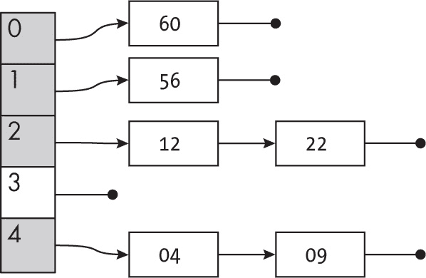

图 11-12：使用链式哈希的哈希值相同的元素会使用列表来存储。

要查找一个值，首先计算它应该在什么槽中（在这种情况下，意味着计算值除以 5 的余数，即表的长度），然后搜索相应的列表。如果该值在集合中，你应该能够在列表中找到它。考虑到你已经了解如何使用列表来实现集合或袋子，这个实现并不难，以下是详细说明。

##### 创建一个链式哈希表

为了创建一个新的哈希表以供链式使用，创建一个空数组，并将其填充为新的列表（你将使用本章之前展示的有序列表，作为复习）：

```
const newHashTable = (n = 100) => ({
  slots: new Array(n).fill(0).map(() => newList())
});
```

在其他需要额外字段的解决方案中，你是创建一个对象，而不是一个数组——例如，追踪有多少槽是已使用的或空闲的。（参见问题 11.6，了解常见的错误。）

##### 向链式哈希表中添加一个值

你可以很容易地将一个新值添加到这个哈希表中；代码如下：

```
const add = (ht, value) => {
❶ const i = hash(ht, value);
❷ ht.slots[i] = addToList(ht.slots[i], value);
  return ht;
};
```

你只需要计算新值应该放入哪个槽 ❶ ，然后将其添加到相应的列表 ❷ 。

##### 在链式哈希表中查找一个值

查找一个值也很简单：在决定值应该放在哪个槽之后，搜索相应的列表。你可以用一行代码来写查找，但下面的写法更清晰：

```
const find = (ht, value) => {
❶ const i = hash(ht, value);
❷ return findInList(ht.slots[i], value);
};
```

计算相应的槽 ❶ ，然后进行搜索 ❷ 。注意，你必须将 find(...) 方法从列表中的原名称改为 findInList(...)，以避免递归调用错误的函数。另一种可能是像 List.find(...) 这样编写。

##### 从链式哈希表中移除一个值

再次强调，由于之前开发的所有代码，删除一个值非常简单：

```
const remove = (ht, value) => {
❶ const i = hash(ht, value);
❷ ht.slots[i] = removeFromList(ht.slots[i], value);
  return ht;
};
```

和添加值时一样，首先计算正确的槽位❶，然后通过使用 removeFromList(...)方法从列表中删除该值❷，该方法也已重命名以避免冲突。

##### 考虑链式存储的性能

使用链式哈希时的最坏情况性能显然是*O*(*n*)，如果所有的值都映射到同一个槽位。如果情况没有那么极端，并且有*s*个槽位，每个链的长度大约是*n/s*，因此查找的时间复杂度是*O*(*n/s*)，实际上是*O*(*n*)，但有一个更好的预期常数。槽位越多，链就越短，性能就越好。

你可以跟踪表格中有多少值（或者各个链的长度），如果这些数字超过某个限制，你可以重新创建一个有更多槽位的表格来提高性能。我们将在接下来的章节中研究这种过程。

#### 开放地址法哈希

处理碰撞的另一种常见解决方案是：如果要使用的槽位已经被占用，尝试下一个位置（如果需要，再尝试下下一个位置，以此类推，直到表格的末尾，达到末尾后再循环回开始）直到找到一个空槽位。进行查找时，应用相同的方案：首先检查对应的哈希槽，如果槽是空的，则查找失败。如果槽被占用且是你想要的值，则查找成功；否则，继续查找下一个（按循环方式）位置并重试。你可以通过一个简单的例子来理解这个过程。首先，使用一个空的哈希表并向其中添加了 22，如图 11-13 所示。

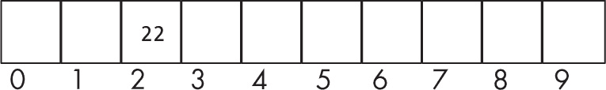

图 11-13：只有一个元素的哈希表

你可以添加 04、75、09 和 60，每个都会进入其对应的槽位，如图 11-14 所示。

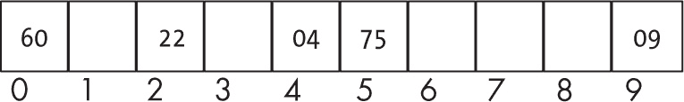

图 11-14：添加了四个元素，目前没有发生碰撞。

如果你尝试添加 12，就会出现问题，因为对应的槽位（第二个槽位）已经被占用。你必须开始向前推进，因此 12 最终会放入槽位 3，如图 11-15 所示。

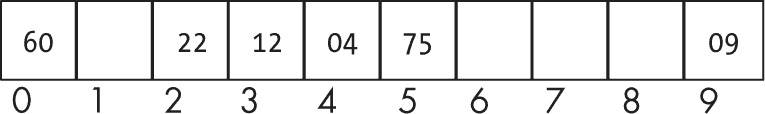

图 11-15：当你尝试将一个值（12）添加到已占用的槽位时，发生碰撞。

随着表格逐渐变满，新值更有可能远离其正确的槽位；例如，如果你添加 63，它最终会位于槽位 6，如图 11-16 所示。

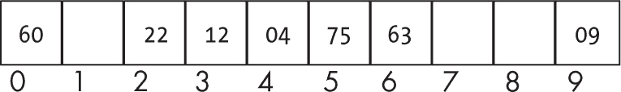

图 11-16：在一个更满的表格中，值最终会远离其对应的槽位。

当然，如定义所示，表格变满后，你将陷入死循环。*负载因子*被定义为占用槽位与总槽位的比例。一个空的哈希表负载因子为零，而完全满的哈希表负载因子为 1。这个结果是直观的，但你可以通过数学推导证明，随着负载因子的增长，插入和搜索的速度会逐渐变慢。根据经验法则，如果负载因子超过 0.75，应该迁移到更大的哈希表。

```
const load = (ht) => ht.used / ht.slots.length;
```

在进行搜索时，过程与插入完全相同。如果你要查找 63，你会从槽位 3 开始，如果槽位 3 没有该值，就继续前进直到找到它在槽位 6。如果你要查找的是 73，那么你会一直前进到槽位 7，发现该槽为空，从而得出 73 不在表中的结论。

删除操作并不是一个简单的过程。考虑删除 22，如图 11-17 所示。

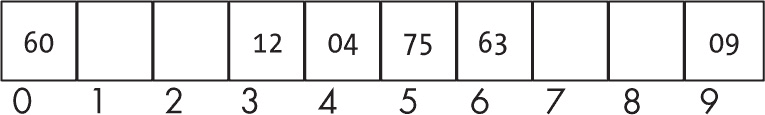

图 11-17：删除值（22）的错误方式会导致其他搜索出错。

现在，如果你想搜索 12，会发生什么呢？发现槽位 2 为空时，你会认为 12 不在表中，这样就不好了。我们必须进行懒删除。我们不会在删除值时真正清空一个槽位，而是将其标记为可用。我们会将删除的位置在添加新值时视为空闲，而在搜索时视为已占用。删除 12 会得到图 11-18 所示的结果。

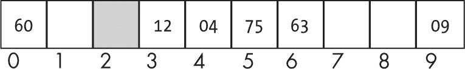

图 11-18：删除值（22）的正确方式是将槽位（#2）标记为“已使用但可用”。

对于搜索，槽位 2 被视为已占用，因此当查找 12 时，你不会停在槽位 2，而是继续向前查找。对于插入（假设稍后你想向表中添加 42），槽位 2 被视为可用，因此你可以使用它，如图 11-19 所示。


图 11-19：“已使用但可用”的槽位（#2）可以用于新的插入。

现在，既然你已经了解了哈希表如何工作以及如何处理删除的关键细节，接下来可以考虑实际的代码。

##### 创建一个开放寻址哈希表

对于开放寻址，你只需要一个表格，但你还需要跟踪有多少槽位已经使用，以便计算负载因子。为了简化编码，你将首先定义几个常量：

```
const EMPTY = undefined;
const AVAILABLE = null;
```

所有尚未使用的槽位会被赋值为 EMPTY，而曾经占用但现在由于删除原始值而变得可用的槽位将被标记为 AVAILABLE。

一个新的哈希表默认会有 100 个槽位：

```
const newHashTable = (n = 100) => ({
❶ slots: new Array(n).fill(EMPTY),
❷ used: 0
});
```

给定哈希表所需的大小（默认为 100），创建一个大小为该值的空数组，数组中的所有槽位填充为 EMPTY 值 ❶，并将已使用槽位的初始计数设置为 0 ❷。

##### 向开放寻址哈希表中添加一个值

你已经看到添加值的逻辑了，代码稍微有点长：

```
const add = (ht, value) => {
❶ let i = hash(ht, value);
❷ while (ht.slots[i] !== EMPTY && ht.slots[i] !== AVAILABLE) {
  ❸ i = (i + 1) % ht.slots.length;
  }

❹ if (ht.slots[i] === EMPTY) {
    ht.used++;
  }
  ht.slots[i] = value;
  return ht;
};
```

首先计算值应该放入哪个槽 ❶。然后开始一个线性搜索 ❷，直到找到一个 EMPTY 或 AVAILABLE 的槽；注意，使用取模操作 ❸ 会使搜索回绕到开始处。成功找到空槽后，如果该槽为空 ❹，则将已使用槽的计数加 1。如果你想知道为什么在槽是 AVAILABLE 时不这么做，你会在查看删除值时明白原因。一个重要的细节是，你假设哈希表有一些空闲空间。你将在查看开放地址哈希法的性能时看到如何处理这个问题。

实际上，你在这里实现的是一个袋（bag）。如果要实现集合（set），请参见第 11.7 题。

##### 在开放地址哈希表中查找值

如前所述，搜索过程与插入过程类似。你将进行与插入新值时相同的过程，但会跳过实际的插入操作。代码如下：

```
const find = (ht, value) => {
❶ let i = hash(ht, value);
❷ while (ht.slots[i] !== EMPTY && ht.slots[i] !== value) {
    i = (i + 1) % ht.slots.length;
  }

❸ return ht.slots[i] === value;
};
```

和插入时一样，首先决定值应该放在哪个槽 ❶，如果需要，循环 ❷ 直到你找到该值或到达一个 EMPTY 槽。根据循环结束的情况，返回 true 或 false ❸。你会忽略 AVAILABLE 槽，原因很快就会明了。

##### 从开放地址哈希表中删除值

删除值的操作强烈依赖于你如何进行搜索。关键问题在于，一旦找到要删除的值，你会将槽标记为 AVAILABLE，意味着该槽现在可以用于未来的插入，但它并不是真的空闲，因此在搜索时要把它视为已占用并继续搜索。

这是代码：

```
const remove = (ht, value) => {
❶ let i = hash(ht, value);
  while (ht.slots[i] !== EMPTY && ht.slots[i] !== value) {
    i = (i + 1) % ht.slots.length;
  }

❷ if (ht.slots[i] === value) {
    ht.slots[i] = AVAILABLE;
  }
  return ht;
};
```

第一部分 ❶ 与搜索函数中的代码相同。唯一的区别是，在循环结束后，如果搜索成功，将该槽设置为 AVAILABLE ❷。

一个重要的问题是，为什么你没有减少已使用的计数。一个边界案例展示了这个问题：假设你将 *n* 个值从 1 到 *n* 插入到一个大小为 *n* 的哈希表中，然后删除所有值，最后尝试添加任何新值。会发生什么？在检查该值是否已在表中时，会出现无限循环！负载因子考虑了所有已经或曾经被占用的槽；当负载因子过高时，你将在下一节看到该怎么办。

##### 考虑使用开放地址法进行哈希时的性能

如前所述，当负载因子接近 1 时，搜索性能会显著下降，最终变为 *O*(*n*)。最坏情况下始终是 *O*(*n*)；一个例子（当然不仅仅是这个）是如果所有的键都哈希到相同的槽。请参见 表 11-5。

表 11-5：开放地址哈希表操作的性能

| 操作 | 平均性能 | 最坏情况 |
| --- | --- | --- |
| 创建 | O(1) | O(1) |
| 添加 | O(1) | O(n) |
| 删除 | O(1) | O(n) |
| 查找 | O(1) | O(n) |

如果你保持负载因子在合理范围内，你可以期待良好的性能，但随着表中值的增加，性能会下降。对此没有解决办法，但你可以修改 add(...)逻辑，使得表格在负载过高时自动增大。你只需要将添加值的代码中最终返回 ht 的部分修改为以下内容：

```
❶ if (load(ht) > 0.75) {
  ❷ let newHT = newHashTable(ht.slots.length * 2);
  ❸ ht.slots.forEach((v) => {
    ❹ if (v !== EMPTY && v !== AVAILABLE) {
      ❺ newHT = add(newHT, v);
      }
    });
  ❻ return newHT;
  } else {
  ❼ return ht;
  }
};
```

如果负载因子超过了推荐的 0.75 阈值❶，则创建一个新的哈希表，大小翻倍❷，并逐槽遍历原表❸。你找到的每一个值❹都会被添加到新表中❺。最后，与你之前返回原表不同，你将返回新的、更大的表❻。如果负载因子是可接受的❼，你将像之前一样返回原表。关于另一种技术，请参见第 11.9 题。

这种逻辑对于接下来我们将考虑的哈希表版本也非常有用。

#### 双重哈希

你一直在应用的逻辑对碰撞的处理帮助不大。如果两个值在某个槽位发生冲突，它们也会在接下来的槽位发生冲突，依此类推。这种方案很可能会产生长时间的相邻占用槽位，从而减慢搜索和插入速度。

在这种情况下，一种有用的思路是，不总是尝试下一个槽位，而是跳过若干个槽位，并使跳跃的槽位数依赖于值，这样不同的值跳过不同数量的槽位。*双重哈希*的概念就是这样工作的：第一个哈希函数确定第一个尝试的槽位，但如果该槽位已被占用，第二个哈希函数决定跳跃的步长，而不是总是跳到下一个槽位。

如果你回到“使用开放地址法的哈希”部分中的示例（第 221 页），虽然没有发生冲突，但一切运作相同，因此在第一次插入五个值后，你将看到图 11-20 中的情况。

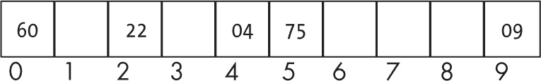

图 11-20：使用双重哈希的哈希表，目前没有发生冲突

现在你想添加 12，而第 2 号槽已经被占用。在前一节中，你使用了开放地址法，所以你尝试了第 3 号槽，如果它也被占用，你将依次尝试第 4 号槽、第 5 号槽，直到找到一个空槽。而使用双重哈希时，你将使用第二个哈希函数来决定跳跃多远。使用值对 9 取余数，再加 1，这个值保证是在 1 到 9 之间的一个数。对于值 12，步长将是 4，因此下一个尝试的位置将是第 6 号槽，如图 11-21 所示。

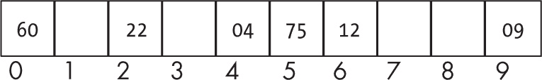

图 11-21：双重哈希使用第二个函数来处理冲突。

如果槽位#6 已被占用，你将再次按四个槽位的步长（循环地）向前移动，尝试槽位#0，然后是槽位#4，以此类推。这里有一个可能的问题。如果你想将值 130 添加到图 11-21 中的表格，结果会怎么样？第一次尝试会在槽位#0，失败。第二次尝试会在槽位#5（因为 130 的步长是 5），但也失败。第三次尝试会再次在槽位#0（因为是循环搜索），你将陷入循环。

你需要处理（并解决）这些循环问题；有两种不同的方法可以实现这一点。

##### 创建一个使用双重哈希的表

创建一个双重哈希表的过程与创建开放地址法表完全相同，因此这里不需要特别的代码。为了方便参考，再次提供所需的逻辑：

```
const EMPTY = undefined;
const AVAILABLE = null;

const newHashTable = (n = 100) => ({
  slots: new Array(n).fill(EMPTY),
  used: 0
});
```

关键的区别在于你如何添加、搜索和删除值。

##### 向使用双重哈希的表中添加一个值

你已经在本节前面看到了向双重哈希表中添加值的过程，现在我们来看看代码。你将使用两个哈希函数：第一个用来确定初始的槽位，第二个用来在搜索过程中跳过某些位置。非常重要的一点是，第二个函数必须永远返回一个非零值。

```
const hash1 = (ht, value) => value % ht.slots.length;
const hash2 = (ht, value) => 1 + (value % (ht.slots.length - 1));
```

向表中添加值的逻辑需要特别注意，以避免无限循环：

```
const add = (ht, value) => {
❶ let i = hash1(ht, value);
❷ if (ht.slots[i] !== EMPTY && ht.slots[i] !== AVAILABLE) {
  ❸ const step = hash2(ht, value);
  ❹ let i0 = i;
  ❺ while (ht.slots[i] !== EMPTY && ht.slots[i] !== AVAILABLE) {
    ❻ i = (i + step) % ht.slots.length;
    ❼ if (i === i0) {
        i = (i + 1) % ht.slots.length;
        i0 = i;
      }
    }
  }

❽ if (ht.slots[i] === EMPTY) {
    ht.used++;
  }
  ht.slots[i] = value;
  return ht;
};
```

首先使用第一个哈希函数❶来获取初始槽位。如果该槽位不为空❷，则使用第二个哈希函数❸来确定每一步跳跃的距离。你将保存初始槽位 i0❹以检测循环，然后开始寻找空槽或可用槽❺。在每次循环中，跳跃步数增加❻，如果检测到你回到了初始的 i0 位置，就只跳跃一步，并保存新的初始槽位❼。找到新值的位置后❽，逻辑与之前的哈希方法相同：更新已用槽位的计数并保存值。若负载因子较高，应该像开放地址法部分中那样重新生成表。

##### 在使用双重哈希的表中搜索一个值

搜索值的逻辑与添加新值的方式相匹配：

```
const find = (ht, value) => {
❶ let i = hash1(ht, value);
❷ const step = hash2(ht, value);
❸ let i0 = i;
❹ while (ht.slots[i] !== EMPTY && ht.slots[i] !== value) {
    i = (i + step) % ht.slots.length;
  ❺ if (i0 === i) {
      i = (i + 1) % ht.slots.length;
      i0 = i;
    }
  }

❻ return ht.slots[i] === value;
};
```

首先决定测试的初始槽位❶和跳跃的步长❷。然后保存初始位置以检测循环❸，并开始跳跃，直到找到空槽或所需的值❹；跳跃的逻辑与插入时完全相同，包括循环检测❺。最后，根据你停止搜索的位置，返回 true 或 false❻。

##### 从使用双重哈希的表中删除一个值

我在这里不会重复解释，但是要删除一个值，你需要使用与开放地址法相同的技巧。你不会将删除的值标记为 EMPTY，而是标记为 AVAILABLE。代码如下：

```
const remove = (ht, value) => {
  let i = hash1(ht, value);
  let i0 = i;
  const step = hash2(ht, value);
  while (ht.slots[i] !== EMPTY && ht.slots[i] !== value) {
    i = (i + step) % ht.slots.length;
    if (i0 === i) {
      i = (i + 1) % ht.slots.length;
      i0 = i;
    }
  }

❶ if (ht.slots[i] === value) {
    ht.slots[i] = AVAILABLE;
  }
  return ht;
};
```

代码和开放地址查找的代码完全相同，唯一不同的是在完成循环后要做什么。如果找到了值❶，将槽位标记为“可用”；如果没找到，不做任何操作。

双重哈希的逻辑运行得很好，但你可以很容易地使其更加简洁，接下来我们将看到这一点。

#### 使用质数长度的双重哈希

你在使用双重哈希操作时看到的逻辑唯一的问题是需要处理可能的循环。每当你选择的步长与表的长度有公共因子时，就会形成一个循环。例如，如果表的大小是 18，步长是 12，经过三步后你会回到原来的位置。如果你能选择一个与所有可能的步长没有公共因子的表长度，那么逻辑会更简单。有一个简单的方法可以做到这一点：如果表的长度是质数（仅能被 1 或它本身整除），就不可能有循环，因为质数与任何较小的数字都没有公共因子。而且，如果步长是 1，一切都没问题，因为在回到初始位置之前，你会遍历整个数组。

##### 创建一个使用质数长度的表

你可以像以前一样创建一个新的哈希表，只是你必须确保它的长度是质数。首先你需要检查一个数字是否是质数：

```
const isPrime = (n) => {
❶ if (n <= 3) {
   return true;
❷} else if (n % 2 === 0) {
   return false;
 }

❸ for (let d = 3, q = n; d < q; d += 2) {
   q = n / d;
 ❹ if (Math.floor(q) === q) {
     return false;
   }
 }
❺ return true;
};
```

小的数字是质数（在这里 1 也算作质数，不管数学家怎么说）❶。偶数（你在之前的 if 语句中排除了 2）不是质数❷，所以这些情况比较简单。对于其他数字，从 3 开始测试所有可能的奇数除数❸，直到找到一个精确的除法❹，或者测试的除数超过了该数字的平方根，在这种情况下，这个数字就是质数❺。

接下来你需要一个简单的函数来找到大于给定值的第一个质数，你可以通过使用 isPrime(...)函数轻松编写：

```
const findNextPrime = (n) => {
❶ while (!isPrime(n)) {
  ❷ n++;
  }
  return n;
};
```

逻辑很简单：给定一个数字，如果它不是质数❶，就加 1❷，直到数字变成质数。

现在你可以创建一个表，逻辑和之前一样，只是你要确保表的长度是质数：

```
const newHashTable = (n = 100) => ({
  slots: new Array(findNextPrime(n)).fill(EMPTY),
  used: 0
});
```

无论你得到什么大小，都可以找到下一个更大的质数，并将其作为表的长度。

##### 向使用质数长度的表中添加一个值

添加一个值时，和双重哈希代码的方式一样，只是你不需要测试循环；质数已经解决了这个问题：

```
const add = (ht, value) => {
  let i = hash1(ht, value);
  if (ht.slots[i] !== EMPTY) {
    const step = hash2(ht, value);
    while (ht.slots[i] !== EMPTY && ht.slots[i] !== AVAILABLE) {
      i = (i + step) % ht.slots.length;
    }
  }

  if (ht.slots[i] === EMPTY) {
    ht.used++;
  }
  ht.slots[i] = value;
  return ht;
};
```

你会像之前一样继续，但与 i0 相关的所有代码（你用来检测循环的）现在已经删除。

##### 在使用质数长度的双重哈希的表中查找值

查找也变得更简单：

```
const find = (ht, value) => {
  let i = hash1(ht, value);
  const step = hash2(ht, value);
  while (ht.slots[i] !== EMPTY && ht.slots[i] !== value) {
    i = (i + step) % ht.slots.length;
  }

  return ht.slots[i] === value;
};
```

再次将这段代码与常见双重哈希代码进行比较，主要的区别在于你不再需要进行任何循环检测和预防。

##### 从使用质数长度的表中删除一个值

最后，正如预期的那样，删除一个值也变得更简单：

```
const remove = (ht, value) => {
  let i = hash1(ht, value);
  const step = hash2(ht, value);
  while (ht.slots[i] !== EMPTY && ht.slots[i] !== value) {
    i = (i + step) % ht.slots.length;
  }

  if (ht.slots[i] === value) {
    ht.slots[i] = AVAILABLE;
  }
  return ht;
};
```

再次强调，代码与常规双重哈希相同，只是没有检查循环；它的代码更快、更简洁。

### 总结

在这一章中，我们考虑了几种实现袋（bags）和集合（sets）的方法，包括哈希技术，当正确应用时，它可以提供最快的搜索时间。这里讨论的结构基本上是线性的；在下一章中，我们将开始考虑非线性结构，如树，以进一步探索袋和集合的实现。

### 问题

**11.1  搜索的哨兵**

展示如何通过为有序列表添加一个最终的 +Infinity 哨兵值，使代码更简洁。

**11.2  更多的哨兵？**

为有序列表添加一个初始的 -Infinity 哨兵值是否有帮助？

**11.3  更简单的搜索？**

你能简化代码，避免在搜索自组织列表时返回两个值吗？提示：如果搜索成功，列表将不会为空，且其头部将包含搜索的值。

**11.4  重新跳过列表**

你能画出一个算法，将跳表重新结构化，以确保它是平衡的吗？

**11.5  跳到一个索引**

在之前的定义中，你只是想搜索一个值，但如果你有一个索引 *i*，并且想要获取列表中的第 *i* 个值呢？你能想到一种修改跳表的方法，以便通过索引高效地查找一个值吗？

**11.6  更简单的填充**

为什么下面的代码不能创建一个带有链式处理的哈希表？

```
const newHashTable = (n = 100) => ({
  slots: new Array(n).fill(newList())
});
```

**11.7  哈希集合**

在哈希表的插入代码中，你允许重复值，因此你做的是袋（bags）而不是集合。你能尽可能高效地修改代码，以实现集合功能吗？显然，你可以从做一个搜索开始，但如果搜索失败，你将为添加操作重新做很多工作。

**11.8  错误的座位安排**

这个问题会让你想起哈希。假设有 100 个人获得了一场演出的票。剧院有 100 个座位，每张票都分配到不同的座位。然而，出现了一个问题。第一个到达剧院的人没有注意，坐到了一个随机的座位。其他人也试图去他们的座位，如果座位已经有人坐，他们也坐到了随机的座位。那么，最后一个人（第 100 个）坐到空座位的概率是多少？

**11.9  渐进式调整大小**

做一个完整的调整大小操作（并伴随相应的时间延迟）可能不适合某些系统，因此你需要一种渐进式调整大小的解决方案。你能画出一种逐步重新哈希的方式，借助两个表（一个旧表和一个新表），但不一次性重新哈希整个旧表吗？
