## 12 二叉树


我们在之前的章节中已经考虑过线性结构，现在我们将开始处理更复杂的结构——特别是二叉树及其一些变体。（我们将在下一章探讨更一般的树。）二叉树在许多地方都有应用，包括数据压缩算法、视频游戏、加密技术、编译器等，因此它们是值得了解的结构。

一种特殊的变体——二叉搜索树，对于实现我们在上一章中探讨的袋（bag）或集合（set）非常高效。然而，由于这些树在某些情况下可能表现不佳，我们还将考虑一些变种，例如保证平衡的二叉搜索树（AVL 树）和概率平衡树（随机二叉搜索树和伸展树）。

### 什么是树？

树结构允许你表示层次化的数据结构。它们与线性结构不同，因为一个节点可以连接多个其他节点，尽管存在一些限制。组织结构图（或*组织图*）是树的典型例子，其中一个企业的一个部分可以有多个子部分，这些子部分本身也可能有子子部分，依此类推，采用递归的方式，如图 Figure 12-1 所示。

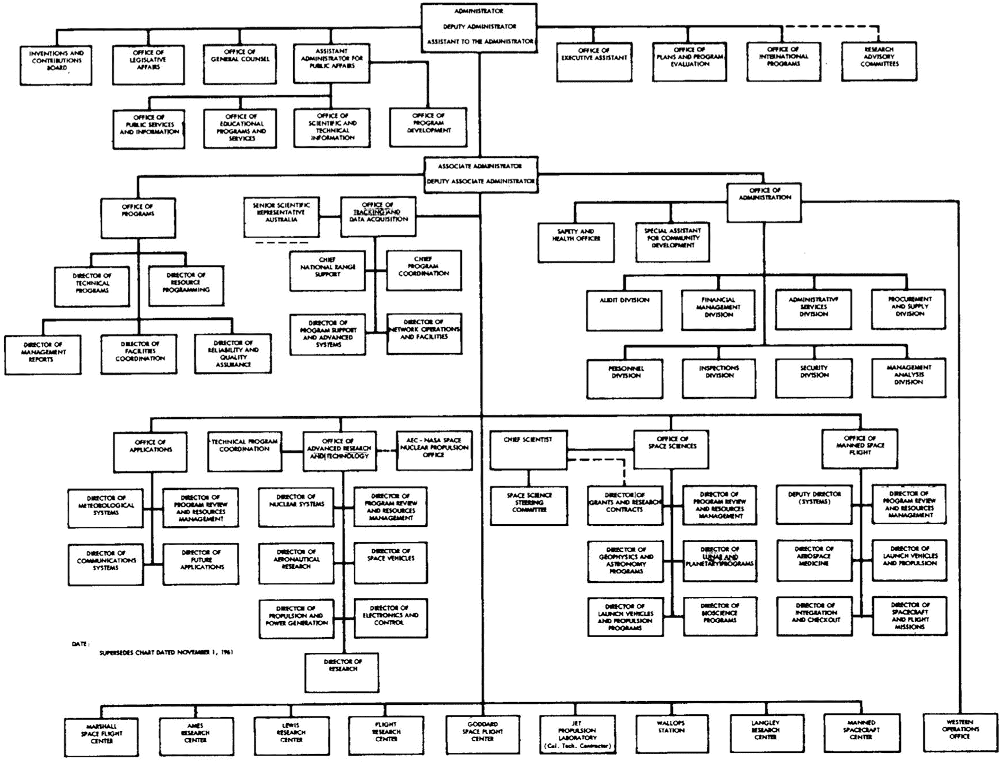

图 12-1：来自 NASA 的组织结构图，1961 年 11 月。别担心如果文字不可读；重要的是结构部分，而不是标签。（来源：[`commons.wikimedia.org/wiki/File:NASA_Organizational_Chart_November_1,_1961.jpg`](https://commons.wikimedia.org/wiki/File:NASA_Organizational_Chart_November_1,_1961.jpg)）

超文本标记语言（HTML）也具有类似树的结构。一个 HTML 元素可以包含多个其他元素，这些元素本身也可能包含进一步的元素。计算机上的目录结构也采用树形结构。一个目录下有文件和其他目录，这些目录下也有文件和更多目录，以此类推。（请参见本章末尾的第 12.2 题，那里有个例外情况。）

#### 一般树

一棵树可以为空，或者由一个节点（称为树的*根*节点）组成，该节点有若干子树，每个子树当然也可以为空。根节点是其子树的*父节点*，而那些子树的根节点是根节点的*子节点*。形成树的*节点*通过*边*或*弧*连接。既有父节点也有子节点的节点被称为*内部节点*，没有子节点的节点被称为*外部节点*，或者（更符合树的概念）称为*叶子节点*。给定一个节点，它的子节点、子节点的子节点，以此类推，统称为它的*后代*。类似地，节点的父节点、父节点的父节点，以此类推，统称为节点的*祖先*。树的根节点的*层级*为 1，它的子节点为 2 层，子节点的子节点为 3 层，依此类推。节点非空子节点的数量称为它的*度*。最后，对于任何一棵树或子树，它的*大小*是指其节点的数量，而它的*高度*是指从根节点到叶子节点的最长路径上节点的数量。

> 注

*根据之前的定义，可以得出结论：任何两个节点之间最多只有一条路径；树中不能存在任何循环或环路。另外一个属性是：给定任意两个节点，要么一个是另一个的祖先，要么它们有一个共同的祖先。*

树通常表示为根节点在上，叶子节点在下。即使这与生物学不符，我们也将遵循这种风格。一个可能的树形结构可以像图 12-2 一样（根节点在上，所有链接向下）。

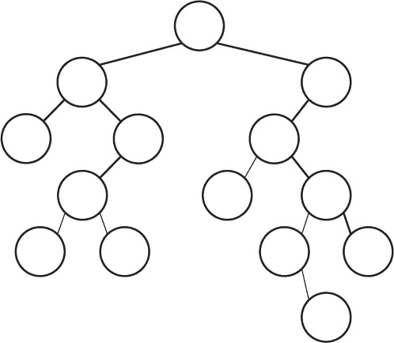

图 12-2：树通常是根节点在上，枝干向下分布到叶子节点，尽管生物学上并非如此。

我们将在下一章讨论一般树（即每个节点可以有任意数量的子树），所以这里我们将重点讨论最常见的版本——二叉树。

#### 二叉树

*二叉树*要么为空，要么恰好有两个子树。稍后我们会看到一些额外的定义，所以图 12-2 中的树实际上也可以是二叉树。如果每个节点要么是叶子节点，要么有两个非空子节点，那么这棵树是*满*二叉树。图 12-3 展示了一个可能的情况。

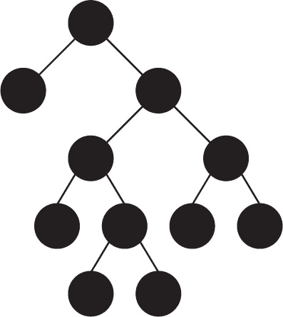

图 12-3：满二叉树：所有节点要么没有子节点，要么有两个子节点。

满二叉树本身并不特别有趣，除非它还满足其他一些属性。例如，如果一棵树是满的，并且所有叶子节点都在同一层级，那么它被称为*完美*二叉树，这意味着节点尽可能紧密地排列在一起，如图 12-4 所示。


图 12-4：完美的二叉树是满的，且所有叶子节点位于同一层级。

一个有趣的性质是，通过简单的数学证明，完美二叉树的大小为 *h* 高度的 2*^h* – 1，因此添加一个新层大约会使树的大小翻倍。反之，具有 *n* 个节点的完美树的高度是 log *n*，向上取整。（我们使用的是以 2 为底的对数。）

最后，如果你有一个高度为 *h* 的树，在删除所有 *h* 层的节点后（最后一层可以例外），它就会变成完美的树，这种树称为 *完全树*。我们将在稍后的第十四章中学习堆时，进一步探讨这些结构。图 12-5 展示了一个完全树，因为如果你删除底层的所有节点，剩下的将是一个完美的树。

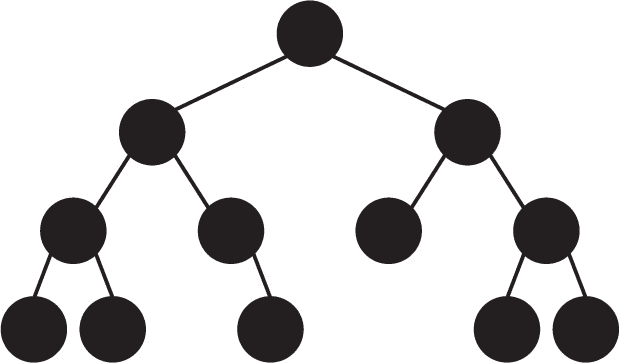

图 12-5：如果删除底部叶子节点，一个完全树就会变成满二叉树。

了解了通用定义后，我们开始讨论二叉树。我们将在每个节点中包括一个键值，并且可以根据需要添加更多的数据属性。我们还将为左右子树设置指针：每个指针要么为空，要么指向另一个二叉树。让我们开始编写一个二叉树模块（你将会在后面的二叉树变体中重复使用一些方法）：

```
❶ const newTree = () => null;

❷ const newNode = (key, left = null, right = null) => ({
  key,
  left,
  right
});

❸ const isEmpty = (tree) => tree === null;
```

这段代码不复杂：newTree() ❶ 构建一个初始为空的树；newNode() ❷ 创建一个具有给定键值和（默认是空的）子树的新节点；isEmpty() ❸ 检测树是否为空（这没有什么好惊讶的）。

#### 二叉搜索树

在本章剩下的部分，我们将使用 *二叉搜索树*，这是一种二叉树的变体，用来实现 *袋* 或 *集合* 抽象数据类型（ADT），因为它们提供了非常高效的键值查找。（记住，袋允许重复值，而集合则不允许。）对于这些树，每个节点将是一个包含键的对象，并且有一些链接指向它的子节点；实际上，你也可以在节点中包含额外的数据字段，用于其他用途。表 12-1 描述了该 ADT。

表 12-1：集合的操作

| 操作 | 签名 | 描述 |
| --- | --- | --- |
| 创建 | → 集合 | 创建一个新的集合。 |
| 是否为空？ | 集合 → 布尔值 | 给定一个集合，确定它是否为空。 |
| 添加 | 集合 × 值 → 集合 &#124; 错误 | 给定一个新值，将其添加到集合中。 |
| 移除 | 集合 × 值 → 集合 | 给定一个值，从集合中移除它。 |
| 查找 | 集合 × 值 → 布尔值 | 给定一个值，检查它是否存在于集合中。 |

二叉树和二叉搜索树有什么区别？二叉搜索树满足以下性质：对于所有节点，左子树的键都比根节点的键小，右子树的键都比根节点的键大。如果你决定允许重复键，你需要修改这个条件，规定左子树的键小于或等于根节点的键，右子树的键大于或等于根节点的键。在图 12-6 中，其中一棵树是二叉搜索树，另一棵则不是，原因是一个不幸的细节。你能分辨出哪一棵是吗？

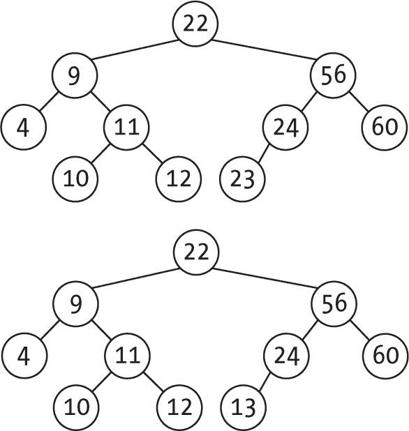

图 12-6：两棵二叉树，但只有一棵是二叉搜索树。哪一棵是？

底部的树不是二叉搜索树，因为 13 的键在 22 的右侧，而它应该在左侧。你能找出它应该放在哪里吗？

关于根节点和子树键的这个性质，使得你可以将二叉搜索树用作集合。

##### 在二叉搜索树中查找键

关于键之间关系的递归性质（同样适用于每个子树）提供了一种简单的搜索方法。如果你在二叉搜索树中查找一个给定的值，必定会发生以下三种情况之一：

+   如果值就是根节点的键，那你就完成了搜索。

+   否则，如果值小于根节点的键，该值（如果存在）一定在左子树中。

+   最后，如果值大于根节点的键，该值一定在右子树中。

你可以测试这个。图 12-7 展示了成功找到 12 的搜索过程，突出显示了所走的路径和所有访问过的节点。

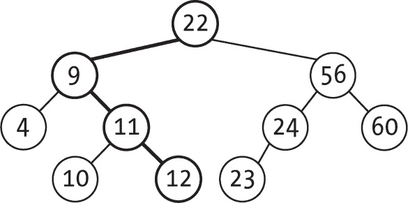

图 12-7：在二叉搜索树中成功找到键 12 的搜索过程

搜索从根节点开始。由于 12 < 22，搜索转向左子树。在那里，由于 12 > 9，搜索进入右子树。接着，由于 12 > 11，搜索再次进入右子树，最终找到目标值。如果你要找的是 34，搜索将会失败，如图 12-8 所示。

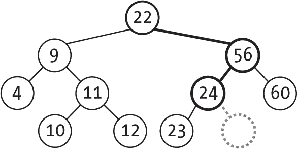

图 12-8：在二叉搜索树中查找键 34 失败的过程

由于 34 > 22，搜索从根节点的右子树开始；接着，因 34 < 56，搜索转向左子树。然后，因 34 > 24，搜索尝试进入右子树，但发现是一个空树（用虚线边框表示），因此搜索失败。

你可以直接编写这个逻辑代码，甚至在考虑如何进行树的插入或删除操作之前：

```
const find = (tree, keyToFind) => {
❶ if (isEmpty(tree)) {
   return false;
❷} else if (keyToFind === tree.key) {
   return true;
 } else {
 ❸ return find(keyToFind < tree.key ? tree.left : tree.right, keyToFind);
  }
};
```

由于树是递归定义的，因此这个算法（以及本章中的大多数算法）是通过递归实现的，这并不令人惊讶。这里有两个基本情况：如果树为空 ❶，则键不在树中；如果键与正在查找的值匹配 ❷，搜索成功。但接下来如何继续搜索呢？如果你查找的键小于根节点的键，你就递归地搜索左子树，反之则搜索右子树 ❸。

##### 向二叉搜索树中添加值

我们如何将新键添加到树中？让我们使用袋子，并接受重复键；你也会看到如何处理集合。要小心不要破坏根节点与其子树之间的关系——使用递归算法是最好的方法。如果树为空，你可以简单地添加一个新的叶子节点。如果树不为空，使用递归深入左或右子树，具体取决于新键应该位于何处，直到到达一个空树，在那里可以插入新键。

上一节展示了一个失败的查找操作，目标是查找键值 34，因此现在新键值将被添加到查找结束的位置，正如在图 12-9 所示。

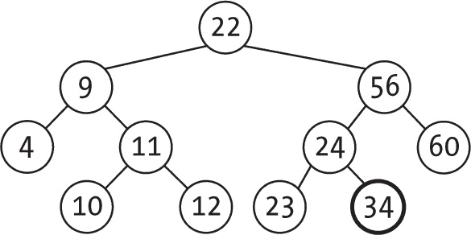

图 12-9：在二叉搜索树中将新键值添加到应该在查找中找到的位置

其代码如下：

```
const add = (tree, keyToAdd) => {
❶ if (isEmpty(tree)) {
    return newNode(keyToAdd);
  } else {
  ❷ const side = keyToAdd <= tree.key ? "left" : "right";
    tree[side] = add(tree[side], keyToAdd);
    return tree;
  }
};
```

如果树是空的 ❶，创建一个包含要添加的键的新节点，并将其作为根节点。如果树不为空，则决定哪个子树需要添加新键 ❷，然后从那里递归地进行操作。（如果实现的是集合而不是袋子，应该检查 keyToAdd 是否等于 tree.key，如果相等则拒绝添加；见问题 12.16。）这个示例使用了一种与 find() 中不同的编码风格，主要是为了多样性。

##### 从二叉搜索树中移除值

现在让我们看看如何从二叉搜索树中移除一个键。考虑图 12-10 中所示的树。

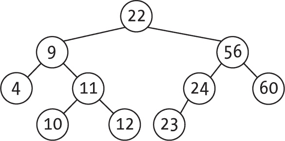

图 12-10：在删除某些键之前的二叉搜索树

如果你尝试移除一个在树中找不到的键，你什么也不需要做。很简单。

另一个简单的情况是移除叶子节点：只需移除其键，这样它就变成了一个空树。例如，移除 10 会导致如下情况，其中 11 的左子树为空，如图 12-11 所示。

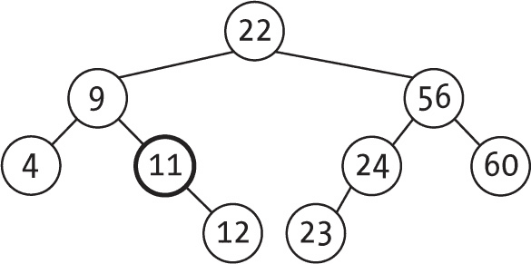

图 12-11：移除叶子节点（此处为键值 10）是直接的。

然而，事情可能会变得复杂。例如，如果你想移除一个至多只有一个子节点的节点，这仍然很简单。只需将其替换为它的子节点，如图 12-12 所示，其中 24 键通过将 23 键设置为 56 键的左子节点被移除。

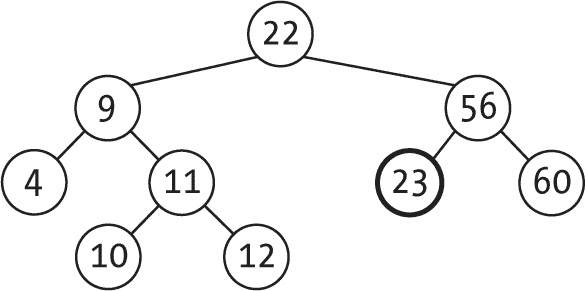

图 12-12：移除一个只有一个子节点的键（此处为 24）也很简单。

一个复杂的问题是处理具有两个非空子节点的节点。最常见的解决方案是找到它后面紧跟的键，移除它，并将其放入你想要移除的节点位置。例如，如果你想移除图 12-12 中的键 9，由于该节点有两个子树，你需要搜索下一个较大的键（在此示例中为 10），将其移除，并将其放入 9 键的位置，正如在图 12-13 所示。

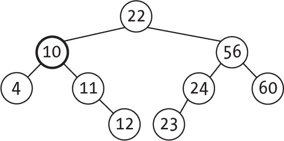

图 12-13：移除一个键（这里是 9）是最困难的情况；你必须放置另一个键来替代它，以保持二叉搜索树的结构。

这种替代被删除键的方法不会破坏搜索规则。不过，仍有一个缺失的步骤——也就是如何找到下一个更大的键。我们将在下一节讨论这个问题，首先是移除键的代码：

```
const remove = (tree, keyToRemove) => {
❶ if (isEmpty(tree)) {
   // nothing to do
❷} else if (keyToRemove < tree.key) {
   tree.left = remove(tree.left, keyToRemove);
❸} else if (keyToRemove > tree.key) {
   tree.right = remove(tree.right, keyToRemove);
❹} else if (isEmpty(tree.left) && isEmpty(tree.right)) {
   tree = null;
❺} else if (isEmpty(tree.left)) {
   tree = tree.right;
❻} else if (isEmpty(tree.right)) {
   tree = tree.left;
❼} else {
 ❽ tree.key = minKey(tree.right);
 ❾ tree.right = remove(tree.right, tree.key);
 }

  return tree;
};
```

前三个条件 ❶ ❷ ❸ 与 find() 方法相匹配：检查树是否为空；如果没有找到要删除的键，则递归地遍历子树。接下来的情况 ❹ 处理删除叶节点：将树设置为 null。接下来的两个条件 ❺ ❻ 处理只有一个子节点的节点；将树设置为该子节点。最后，在最后一种情况 ❼ 中，你必须找到紧随其后的键 ❽，用它替换要删除的键，然后通过递归地从右子树 ❾ 中删除该键来完成操作。你可以通过考虑如何找到下一个更大的键来完成算法。

> 注意

*这并不是唯一的删除方法；我们将在“从随机树中删除键”一节（见第 267 页）和“从 Treap 中删除键”一节（见第 336 页）中看到更多的实现方式。*

##### 在二叉搜索树中查找最小值或最大值

由于根节点与其子树之间的关系，所需的键（即下一个键）必须是右子树中的最小值。（相反，前一个键将是左子树中的最大值。）图 12-14 展示了如何查找比 9 更大的键。你需要去它的右子树，然后不断向左移动，直到不能再向左走，从而找到 10 这个键。

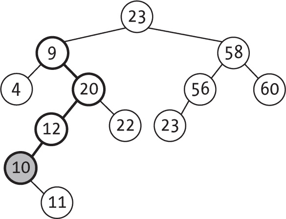

图 12-14：查找下一个键；这里你想要找到比 9 更大的最小键。

另一个例子是，如果你想找到 23 的*前一个*键，你需要先去它的*左*子树，然后向*右*移动，直到到达末尾，找到 22 这个键。请记住，这个逻辑仅适用于具有必要子树的节点。如果你想找到 11、12 或 22 的下一个键，逻辑将会失败。幸运的是，这种情况不适用于你想要找到下一个更大的键的情况。

你可以利用类似的逻辑来实现 minKey() 和 maxKey() 方法：

```
❶ const _minMax = (tree, side, defaultValue) => {
❷ if (isEmpty(tree)) {
   return defaultValue;
❸} else if (isEmpty(tree[side])) {
   return tree.key;
 } else {
 ❹ return _minMax(tree[side], side, defaultValue);
 }
};

const minKey = (tree) => _minMax(tree, "left", Infinity);
const maxKey = (tree) => _minMax(tree, "right", -Infinity);
```

首先查看 minKey()，这是您在此情况下需要的；maxKey() 类似。您有一个辅助的 _minMax() 方法，它根据 minKey() 和 maxKey() 传递给它的参数进行实际搜索❶。查找最小值需要始终向左走，因此这解决了 _minMax() 的第二个参数，它将沿着这一侧一直向下 ❹，直到找到一个空树❸。现在，如果您尝试查找一个空树的最小值❷，应该返回什么值呢？您将执行 Math.min() 函数的相同操作；如果没有传递任何参数给它，它会返回 Infinity（类似地，Math.max() === -Infinity），所以这就是 _minMax() 的第三个参数。

> 注意

*如果您分析删除算法，您可能会发现它做的工作比需要的多，因为它会先遍历右子树找到下一个键，然后再次遍历同一个子树来删除找到的键。为什么不将两者合并一次完成呢？请参阅问题 12.17 中的优化方法。*  ##### 遍历二叉搜索树

许多过程涉及访问树的所有节点（也叫做*遍历*树或进行*树遍历*），以便对每个节点执行某些操作——例如，您可能在一个二叉搜索树中存储了单词，并希望生成一个按字母顺序排列的单词列表。这就是所谓的*访问*节点。如果您不想排除任何节点，那么存在三种可能的遍历情况（这些遍历方法中的前缀 pre-、in- 和 post- 与根节点的访问时机相关）：

**前序遍历** 访问树的根节点，然后遍历其左子树，最后遍历右子树。

**中序遍历** 先遍历左子树，然后访问根节点，最后遍历右子树。

**后序遍历** 先遍历左子树，再遍历右子树，最后访问根节点。

当然，遍历一个空树时什么也不做，因为访问只适用于已存在的键。同时，注意子树的遍历是通过递归地应用相同的遍历算法来完成的。

这是一个基本的算法，其中默认的 visit() 方法只是打印访问的键：

```
const preOrder = (tree, visit = (x) => console.log(x)) => {
  if (!isEmpty(tree)) {
    visit(tree.key);
    preOrder(tree.left, visit);
    preOrder(tree.right, visit);
  }
};

const inOrder = (tree, visit = (x) => console.log(x)) => {
  if (!isEmpty(tree)) {
    inOrder(tree.left, visit);
    visit(tree.key);
    inOrder(tree.right, visit);
  }
};

const postOrder = (tree, visit = (x) => console.log(x)) => {
  if (!isEmpty(tree)) {
    postOrder(tree.left, visit);
    postOrder(tree.right, visit);
    visit(tree.key);
  }
};
```

代码遵循描述：例如，preOrder()首先访问根节点，然后遍历左子树，最后遍历右子树。

为了调试目的，能够按升序打印树的键列表非常有用。如果您有一棵树并调用 inOrder()，所有键将按顺序列出。它从根节点开始，处理所有小于根节点的键（按顺序列出）。接下来，它打印根节点，然后处理所有大于根节点的键（也按顺序列出），从而提供所需的结果。

> 注意

*这个算法类似于 第六章 中的快速排序。你有一组左侧的键，将它们排序。然后你有一个枢轴键，然后你有一组右侧的键，也将它们排序，最终的结果就是完整的有序数组。*

获取键的列表是可以的，但看到树的结构会更好，因此你需要获取树的打印输出。请参考 图 12-15 中的树。

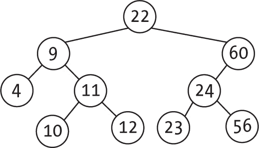

图 12-15：我们希望打印出其结构的二叉搜索树

你可以使用 `console.log()` 来输出，但这并不太友好；`console.dir()` 会稍好一些。你也可以尝试类似 `console.log(JSON.stringify(tree))` 的方式，但那样输出非常难以阅读，你会得到一些非常不友好的输出：

```
{"key":22, "left":{"key":9,  "left":{"key":4, "left":null, "right":null}, "rig
ht":{"key":11, "left":{"key":10, "left":null,"right":null}, "right":{"key":12,
 "left":null, "right":null}}}, "right":{"key":60, "left":{"key":24, "left":{"k
ey":23, "left":null, "right":null}, "right":{"key":56, "left":null, "right":nu
ll}}, "right":null}}
```

为了理解树的结构，可以考虑基于前序遍历代码的 `print()` 方法。它首先打印根节点，接着打印左子树（前面加上 L: 来表示左子树），然后是右子树（加上 R:），并且将子节点往右缩进，子节点的子节点进一步缩进，以此类推。

结果输出内容大致如下：

```
 22
  L: 9
  L:  L: 4
  L:  R: 11
  L:  R:  L: 10
  L:  R:  R: 12
  R: 60
  R:  L: 24
  R:  L:  L: 23
  R:  L:  R: 56
```

根节点（22）在顶部，接着是 L: 9（再下面是 R: 60），显示了根节点的两个子节点。对于每个新的键，你还会看到它的子节点，且缩进更深，因此对于调试来说是足够清晰的。

产生这种输出的代码如下：

```
const print = (tree, s = "") => {
  if (!isEmpty(tree)) {
    console.log(s, tree.key);
    print(tree.left, `${s}  L:`);
    print(tree.right, `${s}  R:`);
  }
};
```

如果你将逻辑与之前的 `preOrder()` 方法进行比较，会发现其基本思路相同：首先处理键，然后按顺序处理它的左子树和右子树。

##### 考虑二叉搜索树的性能

现在我们已经详细了解了二叉搜索树算法，那它们的性能如何呢？我们先从 *最坏* 情况开始。你在树中添加了几个键之后，可能遇到的最糟糕情况是某种线性结构，就像 图 12-16 中所示，这种结构在搜索时基本上等同于简单的链表，时间复杂度是 *O*(*n*)。

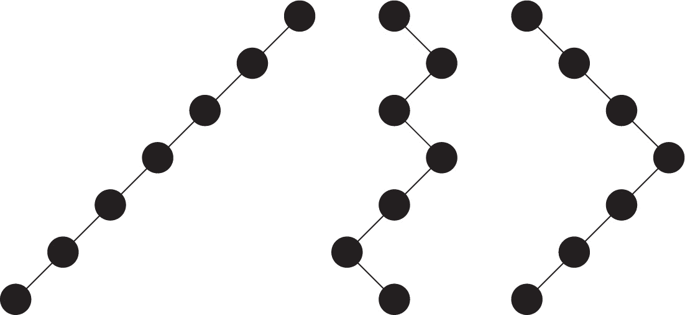

图 12-16：一些最坏情况下的二叉搜索树

回到我们之前看到的树形结构，显然树的形状会影响算法的性能。最理想的树形结构是最好的，其时间复杂度是 *O*(log *n*)。对于类似线性结构的情况，搜索的时间复杂度会变为 *O*(*n*)，而对于大树来说，这是一个巨大的差异。

从概率角度来看，如果你随机顺序取一组键，可以证明大多数树的高度会比较短，坏情况会相对较少。虽然最坏情况下时间复杂度仍为 *O*(*n*)，但在平均情况下，我们期望获得 *O*(log *n*) 的性能。表 12-2 展示了树的平均和最坏情况性能。

表 12-2：二叉搜索树操作的性能

| 操作 | 平均性能 | 最坏情况 |
| --- | --- | --- |
| 创建 | O(1) | O(1) |
| 添加 | O(log n) | O(n) |
| 删除 | O(log n) | O(n) |
| 查找 | O(log n) | O(n) |
| 遍历 | O(n) | O(n) |

那么该怎么办呢？接下来我们将探讨两个方案，旨在确保树不会变成不良形状，并保持尽可能短且平衡。

### 保证平衡的二叉搜索树

正如我们之前看到的，树可能变成线性（或几乎线性）的结构，性能会非常差。不过，确保树保持平衡是可能的，从而保证最佳的性能。这里有两种不同的处理方式：

+   *保证平衡树*之所以高效，是因为它们遵循某些明确的结构约束，这些约束确保树始终不会失衡，但这也意味着额外的运行时间和内存使用，需要更复杂的算法——通常是 add()和 remove()——来确保修改树之后约束仍然适用。这些树提供了在绝对意义上（一种非摊销也非概率的方式）的稳定性能。

+   *概率平衡树*（或*自调整树*）仅在摊销意义上是高效的。它们没有遵循任何显式的结构规则，而是可以呈现任意形态，依赖像 add()或 find()这样的操作来调整结构，以便随着时间的推移，最有可能获得更好的性能。

高度平衡的*AVL 树*通过强制保证每个节点的左右子树高度差不超过 1，来避免树失去平衡。权重平衡树也能保证平衡，通过保持每个节点的左右子树的权重差不超过某个给定的因子；稍后我们将讨论*有界平衡*（BB[α]）树。

#### AVL 树

1962 年，Adelson-Velsky 和 Landis 发明的 AVL 树，通过遵循一个简单的规则保持良好的平衡：*对于所有节点，左右子树的高度差最多为 1*。这自动排除了所有表现不佳的二叉树形态。

图 12-17 展示了一棵平衡的树和一棵不平衡的树。哪个是哪个？

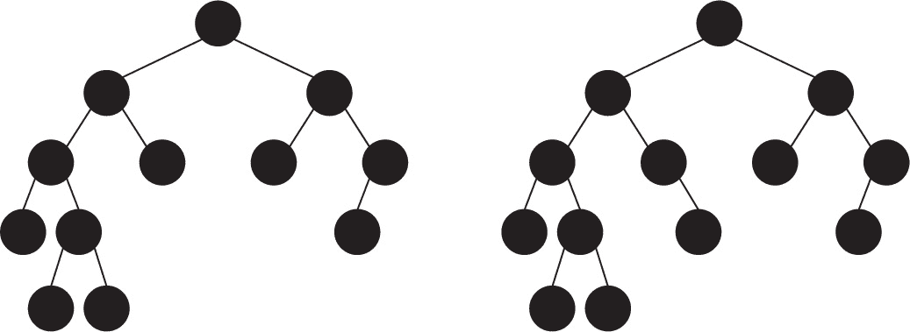

图 12-17：两棵二叉树，只有一棵是平衡的。是哪一棵？

最右边的树是平衡的，而最左边的树不是，因为根节点的左子树失衡：它的左子树高度为 3，右子树高度为 1。节点的平衡是指其左右子树高度之差，因此图 12-17 中的正确树的平衡情况，将如图 12-18 所示。

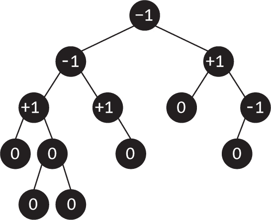

图 12-18：展示了所有节点平衡情况的平衡二叉树

现在我们已经了解了 AVL 树的期望形态，你可以开始编写它们的代码了。

##### 定义 AVL 树

我们将基于二叉搜索树构建 AVL 树。许多操作仍然适用——例如，在 AVL 树中查找一个键与在普通二叉搜索树中的方式完全相同，所以我们在这里不会再展示该代码。不过有一个小的不同之处：你需要为每个节点添加一个*高度属性*，以帮助检查它是否平衡，并且需要编写代码来访问或计算该属性。基本的代码如下——请注意，你将重用一些基本二叉搜索树的方法：

```
const newAvlTree = () => null;

const newNode = (key) => ({
  key,
  left: null,
  right: null,
❶ height: 1
});

❷ const _getHeight = (tree) => (isEmpty(tree) ? 0 : tree.height);

❸ const _calcHeight = (tree) =>
  isEmpty(tree)
    ? 0
    : 1 + Math.max(_getHeight(tree.left), _getHeight(tree.right));

❹ const _calcBalance = (tree) =>
  isEmpty(tree) ? 0 : _getHeight(tree.right) - _getHeight(tree.left);
```

当构造一个新节点时，添加新的 _ 高度属性❶，然后有一个 _getHeight()方法来访问它；注意，空树的高度是 0❷。新的 _calcHeight()方法❸计算节点的高度；假设两个子树已经计算出它们自己的高度，而整个树的高度是其最高子树的高度加一。最后，计算节点的平衡性❹，即右子树和左子树的高度差。该平衡值只能是-1、0 或 1；其他值意味着树不平衡。

##### 向 AVL 树添加一个键

添加新键的逻辑与我们之前看到的类似，唯一的不同因素是：在决定添加新键的位置后，树可能会失去平衡，所以你需要移动节点来恢复平衡。以下是附加的代码：

```
const add = (tree, keyToAdd) => {
  if (isEmpty(tree)) {
    tree = newNode(keyToAdd);
  } else {
    const side = keyToAdd <= tree.key ? "left" : "right";
    tree[side] = add(tree[side], keyToAdd);
  }

 **return _fixBalance(tree);**
};
```

这与二叉搜索树的代码完全相同，只是它添加了一个最终的 _fixBalance()调用，用于在需要时平衡树。在进入这一部分之前，让我们回顾一下如何删除键，这与之前做的非常相似。

##### 从 AVL 树中删除一个键

在了解如何添加新键之后，删除键会显得很熟悉：

```
const remove = (tree, keyToRemove) => {
  if (isEmpty(tree)) {
    // nothing to do
  } else if (keyToRemove < tree.key) {
    tree.left = remove(tree.left, keyToRemove);
 } else if (keyToRemove > tree.key) {
    tree.right = remove(tree.right, keyToRemove);
  } else if (isEmpty(tree.left) && isEmpty(tree.right)) {
    tree = null;
  } else if (isEmpty(tree.left)) {
    tree = tree.right;
  } else if (isEmpty(tree.right)) {
    tree = tree.left;
  } else {
    tree.key = minKey(tree.right);
    tree.right = remove(tree.right, tree.key);
  }

  **return _fixBalance(tree);**
};
```

与添加一个键一样，唯一不同的是在最后应用平衡修复。

##### 在 AVL 树中旋转节点

添加或删除节点本质上与常见的二叉搜索树使用相同的逻辑，但如果不干预，树可能会失去平衡。解决方案是应用*旋转*，这些旋转不会影响搜索，但能恢复平衡。

两种基本的树旋转是对称的，如图 12-19 所示，其中负号表示比正号小的键值。经过任何旋转后，树仍然可以进行搜索，但高度和结构可能发生变化，这可以让你恢复一个 AVL 树。

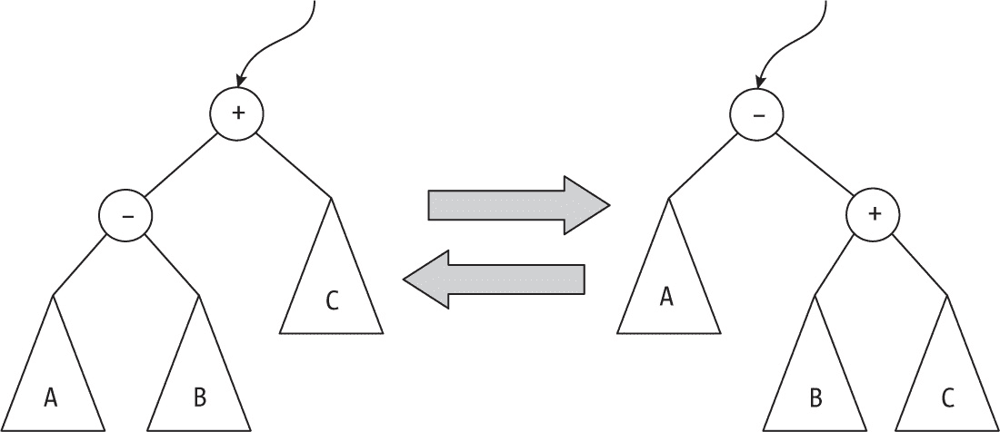

图 12-19：可以用来解决平衡问题的两种对称旋转

从左到右的旋转是右旋，从右到左的旋转是左旋。要记住哪个是哪个旋转，可以注意观察旧根节点的移动方向：在右旋中，根节点成为其右子树，而在左旋中，根节点成为其左子树。另一种看法是，在右旋中，原本在左边的节点成为了根节点（也就是它移动到了右边），根节点变成了一个子树，而在左旋中，原本在右边的节点成为了根节点。

> 注意

*如果你搜索更多关于树旋转的信息，你会发现很多不一致的地方，在某些情况下，我们称之为右旋的旋转，其他来源却称之为左旋，所以要小心。*

需要进行旋转时有两种可能情况：一种需要单次旋转，另一种需要两次旋转。在第一种情况（如图 12-20 所示），树是平衡的，但在子树 A 中添加了一个新键，使其变得更高，从而导致整个树失去平衡。（或者，您也可以从子树 C 中删除一个键，使其变短。）在这种情况下，问题出现在根节点的左子节点的左子树，或者对称地，出现在右子节点的右子树。这些情况在逻辑上被称为*左-左*和*右-右*。

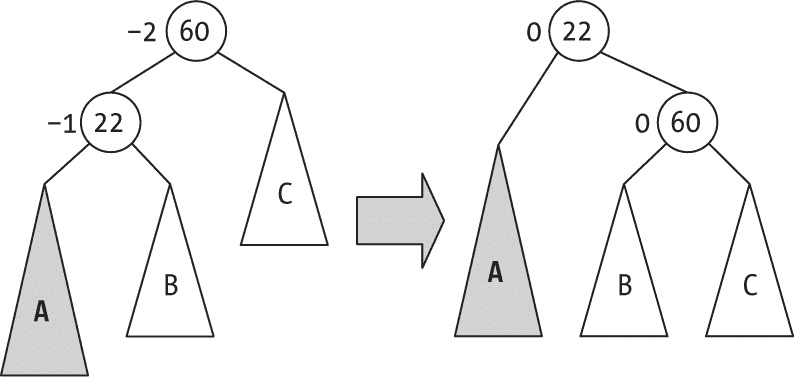

图 12-20：使用右旋转修复键值为 60 的失衡节点

解决方案是对左子树的根节点应用右旋转（因为失衡发生在左子树上），从而使树恢复平衡。

图 12-21 展示了一个更复杂的场景。一个新键被添加到根节点的左子树的右子树中，使得后者失去平衡。这个*左-右*情况及其镜像的*右-左*情况需要两次旋转才能修复。

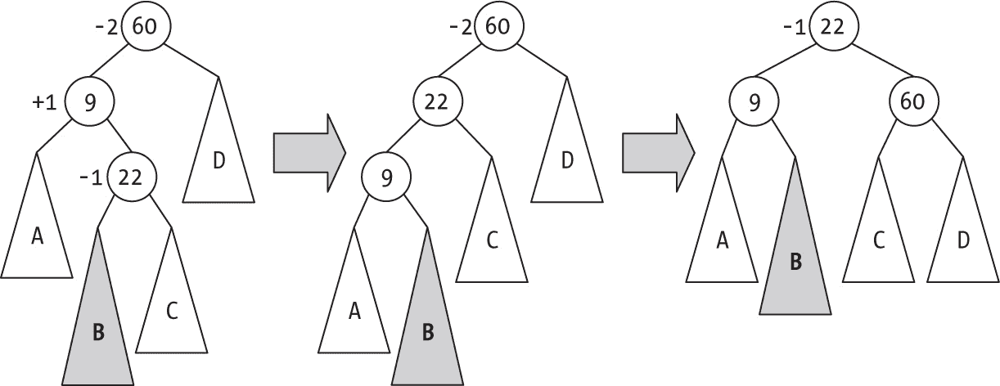

图 12-21：修复更复杂的失衡情况需要首先进行左旋转（在 9 键节点处），然后进行右旋转（在 60 键节点处）。

第一次左旋转将最低的键（在此情况下为 22）移动到根节点附近，现在右旋转将它完全提升到根节点，恢复平衡。图 12-21 展示了添加操作发生在 B 的场景；如果它发生在 C 中，解决方案仍然相同，如果不是添加，而是从 D 中删除了一个键使其变短，情况也一样。

现在考虑旋转一个节点的代码：

```
const _rotate = (tree, side) => {
❶ const otherSide = side === "left" ? "right" : "left";
❷ const auxTree = tree[side];
❸ tree[side] = auxTree[otherSide];
  auxTree[otherSide] = tree;

❹ tree.height = _calcHeight(tree);
  auxTree.height = _calcHeight(auxTree);
  return auxTree;
};
```

你首先找到旋转的“另一侧” ❶，并获取根节点一侧的节点的引用 ❷（将成为树的新根节点）以简化代码。然后，交换一些指针 ❸，最后重新计算这两个节点的高度；重要的是先处理“较低”的节点 ❹。

> 注意

*如果你调用* _rotate() *并传入一个* left *参数，它实际上会执行右旋转，这可能有点令人困惑。其思想是你在指定哪个节点应该成为根节点。因此，对于右旋转，左子节点上升成为根节点。在某些算法中，你会发现这样做更自然。*

现在，让我们通过提供缺失的 _fixBalance()方法来完成：

```
const _fixBalance = (tree) => {
❶ if (!isEmpty(tree)) {
  ❷ tree.height = _calcHeight(tree);
  ❸ const balance = _calcBalance(tree);
  ❹ if (balance < -1) {
    ❺ if (_calcBalance(tree.left) === 1) {
        tree.left = _rotate(tree.left, "right");
      }
    ❻ tree = _rotate(tree, "left");
  ❼} else if (balance > 1) {
      if (_calcBalance(tree.right) === -1) {
        tree.right = _rotate(tree.right, "left");
      }
      tree = _rotate(tree, "right");
    }
  }
  return tree;
};
```

如果树为空 ❶，则无需任何操作。否则，重新计算根节点的高度 ❷（因为最近的添加或删除可能已改变它），并且还要找到节点的平衡 ❸。如果节点在左侧不平衡 ❹，检查是否需要额外的旋转 ❺，并在必要时进行旋转，最终进行单次旋转 ❻。另一个 if 只是对称的情况 ❼，它执行相同的操作，但左右两侧交换。

##### 考虑 AVL 树的性能

鉴于 AVL 树结构提供的确保平衡的特性，所有操作（添加、删除、查找）都具有相同的对数性能。没有不同的最坏情况，如 表 12-3 所示。

表 12-3：AVL 树操作性能

| 操作 | 平均性能 | 最坏情况 |
| --- | --- | --- |
| 创建 | O(1) | O(1) |
| 添加 | O(log n) | O(log n) |
| 删除 | O(log n) | O(log n) |
| 查找 | O(log n) | O(log n) |
| 遍历 | O(n) | O(n) |

可以证明，AVL 树的高度被 1.44 log *n* 所限制，这也确认了之前列出的性能（见问题 12.18）。在下一章中，你将学习 *红黑树*，它们有类似的限制和性能，但基于多路树。搜索可能稍微慢一点（因为这些树可能更高），插入则稍微快一点（因为需要的旋转更少），但总体结果是相同的。

#### 权重约束平衡树

与确保任何节点的两个子树高度相差不超过 1 不同，*权重约束平衡（BB[α]）* 树维持着一个不同的不变量：即左右子树的*权重*（树的大小加 1）有一个特定的关系。如果一棵树的大小为 *n*，其左右子树的大小分别为 *p* 和 *q*，那么就有 (*p* + 1) ≥ α(*n* + 1) 和 (*q* + 1) ≥ α(*n* + 1)，其中 0 < α < 0.5。

另一种等效的方式是要求 (*p* + 1) / (*n* + 1) ≥ α 和 (*q* + 1) / (*n* + 1) ≥ α。由于这两个分数加起来等于 1（见问题 12.20），这相当于说两个子树必须满足 α ≤ weight(子树) / weight(树) ≤ 1 – α。中间的商称为子树的*平衡*。图 12-22 显示了一棵 BB[0.29289] 树，其中从 1 到 12 的键按升序插入；边缘上的数字表示相应子树的平衡。

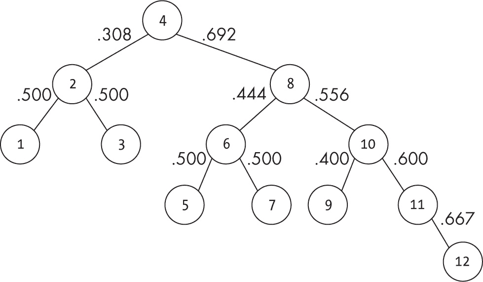

图 12-22：一棵权重约束平衡树（此处为 BB[0.29289]），显示了每个有子节点的节点的计算平衡

α = 0.5 的值看起来像是一个完美的平衡（对于所有节点，左右子树的大小将相等），但已证明它并不适用，并不是所有的 α 值都有效。为了实现平衡，α 应该在 0.18182 (= 2/11) 和 0.29289 (= 1 – √2/2) 之间。

> 注意

*当我们定义一个节点的权重并将其大小加 1 时，如果没有那额外的 1，就无法构建只有两个节点的权重平衡树。你能看出为什么吗？*

BB[α] 树需要在每个节点中携带额外的大小数据，以便计算其权重。这对于平衡是必要的（以便你可以检查之前给出的平衡条件），但它对其他操作也很有用，比如通过秩查找键。

在向树中添加或删除键时，如果没有保持平衡，我们会应用旋转（如同在 AVL 树中那样）来恢复平衡。由于 BB[α] 树是二叉搜索树，查找操作和遍历操作不需要任何修改。你只需要考虑添加和删除操作。

##### 定义加权平衡树

这些新树与 AVL 树共享大量的代码。最大的区别是，我们不再在每个节点中包含树的高度，而是包含一个大小属性，并通过考虑大小而不是高度来修复平衡：

```
const {
  find,
  inOrder,
  isEmpty,
  maxKey,
  minKey,
  postOrder,
  preOrder
} = require("./binary_search_tree.js");
const newBBTree = () => null;

const newNode = (key) => ({
  key,
  left: null,
  right: null,
❶ **size: 1**
});

❷ const _getSize = (tree) => (isEmpty(tree) ? 0 : tree.size);

❸ const _calcSize = (tree) => 1 + _getSize(tree.left) + _getSize(tree.right);

❹ const _balance = (subtree, tree) =>
  (1 + _getSize(subtree)) / (1 + _getSize(tree));
```

创建新节点时，将其大小设置为 1 ❶，而不是设置为高度属性。并且你将不再使用与获取或计算高度相关的函数，而是有一个函数用于获取树的已计算大小 ❷，另一个函数用于计算任何树的大小 ❸，以及第三个用于计算子树平衡度 ❹，这些都是你修复平衡时所需要的。

##### 向加权平衡树添加和删除键

我提到过会有一个惊喜，那就是添加或删除键的方式与 AVL 树完全相同。请看前面部分的代码。添加新键时，你是以标准方式进行的（即，与二叉搜索树相同），并且在最后通过调用一个函数来修复平衡（如果需要）。这里唯一的不同之处是，后者的函数将以另一种方式实现：

```
const add = (tree, keyToAdd) => {
  if (isEmpty(tree)) {
    tree = newNode(keyToAdd);
  } else {
    const side = keyToAdd <= tree.key ? "left" : "right";
    tree[side] = add(tree[side], keyToAdd);
  }

  **return _fixBalance(tree);**
};
```

删除键的过程与添加键相同。你首先应用标准的二叉搜索树算法，并且在结束时，像添加操作一样调用相同的函数，在需要时恢复平衡。

你会看到完全相同的过程；唯一的区别是你恢复平衡的方式。

##### 修复加权平衡树的平衡

描述 BB[α] 树的原始论文（这里没有包含数学推导）显示，有两种可能的情况（以及它们的对称情况），并且简单或双重旋转足以恢复平衡。现在考虑一个节点具有超重的左子树的情况；对称情况将以相同的方式处理。

首先，回顾一些条件。子树的平衡应该满足 α ≤ balance(subtree) ≤ 1 – α。当平衡时，会使用一些常量，但我们在这里不推导这些值：

+   α 是低重心限制；如果子树的平衡度低于 α，则树处于不平衡状态。

+   β = 1 – α 是超重限制；如果子树的平衡度高于 β，树也会不平衡。

+   γ = α/β = α / (1 – α) 是子树孩子的低重心限制。

+   δ = 1 – γ = (1 – 2α) / (1 – α) 是子树孩子的超重限制。

以下代码定义了各个值（注释中显示了每个常量的大致值）：

```
const ALPHA = 0.29289;
const BETA = 1 – ALPHA;     // 0.70711
const GAMMA = ALPHA / BETA; // 0.41421
const DELTA = 1 – GAMMA;    // 0.58579
```

现在，你将修复不平衡的树。第一个情况如图 12-23 所示。左子树过大（或者右子树的大小减少），导致树不平衡。你可以计算左子树右子树的平衡因子（B），发现它低于δ，因此并没有超重。在这种情况下，通过单次右旋（将 B 子树移至右侧，而 B 子树本来就应为轻的）即可重新平衡树。


图 12-23：在某些情况下，单次旋转可以修复平衡问题。

第二种情况稍微复杂一点。左子树超重，而且左子树的右子树的平衡因子超过了δ值。单次旋转不足以恢复平衡（树仍然不平衡），在这种情况下，需要进行双次旋转才能将一切恢复正常。注意，超重子树的一部分被移至右侧（C），另一部分（B）则保留在左侧，如图 12-24 所示。

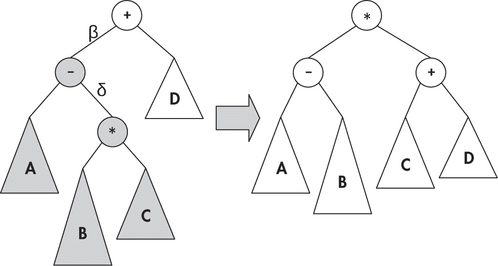

图 12-24：在更复杂的情况下，需要两次旋转来修复平衡。

因此，判断是否需要旋转（以及旋转类型）的逻辑如下：首先检查两个孩子，看是否有一个超重（假设是左孩子），通过比较其平衡因子与β。如果是，接着检查另一侧的孙子节点（左孩子的右孩子），但要与不同的δ限制进行比较。根据第二次检查的结果，你将执行一次或两次旋转：

```
const _fixBalance = (tree) => {
  if (!isEmpty(tree)) {
  ❶ tree.size = _calcSize(tree);

  ❷ if (_balance(tree.left, tree) > BETA) {
    ❸ if (_balance(tree.left.right, tree.left) > DELTA) {
      ❹ tree.left = _rotate(tree.left, "right");
      }
    ❺ tree = _rotate(tree, "left");
  ❻} else if (_balance(tree.right, tree) > BETA) {
      if (_balance(tree.right.left, tree.right) > DELTA) {
        tree.right = _rotate(tree.right, "left");
      }
      tree = _rotate(tree, "right");
    }
  }

  return tree;
};
```

如果树不为空，首先更新其大小 ❶。然后，首先检查左孩子是否超重 ❷；如果是，接着检查左孩子的右孩子 ❸，如果该树也超重，则进行第一次旋转 ❹；接着执行右旋 ❺，完成任务。如果左孩子没有超重，则检查右孩子 ❻，逻辑与之前提到的情况对称 ❹ ❺。

你现在知道如何通过添加或删除键来更新树，但 BB[α]树还支持其他操作，包括通过秩查找、将树分裂成两棵树，或将两棵树合并成一棵。##### 在带权重约束的平衡树中按秩查找元素

如前所述，BB[α]树为了平衡目的需要在每棵树的根节点上保存其大小，这不仅能提供额外的好处，还能支持更高效的操作。例如：通过秩查找一个元素（在此情况下是第七个元素），就像在第十一章中所看到的那样。图 12-25 中的树与图 12-22 相同，但现在每个节点旁边显示了子树的大小。

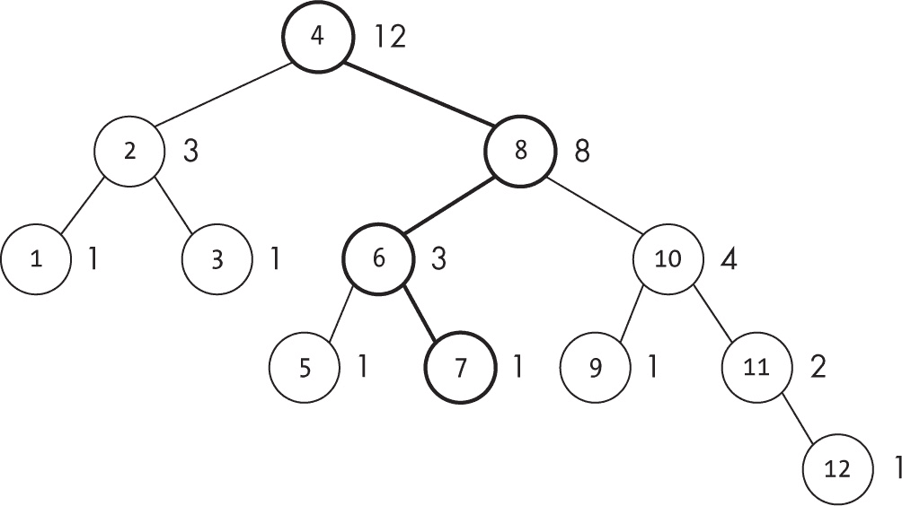

图 12-25：在每个子树根节点处包含其大小，可以高效地按秩查找元素；这里你正在查找第七个键。

左子树有三个元素，因此，如果你在寻找第四个元素，那就是根节点本身，查找就完成了！但是在这种情况下，你是在寻找第七个元素，所以你需要继续查找。首先，决定是向左还是向右：左子树只有三个元素，所以第七个元素必须是右子树中的第三个元素。你需要排除左子树的三个元素和根节点，因此从总数中去除四个元素，然后向右移动。

现在你来到了 8 号关键根节点，它的大小为 8。左子树有三个元素，而你正在寻找该树的第三个元素，于是你继续往左走。在 6 号关键根节点处，重复相同的过程，这次要向右走，因为你需要排除左子树的一个元素和根节点的一个元素，因此现在你要找的是右子树的第一个元素。然后你到达了 7 号关键节点，这就是你要找的元素。

你可以很容易通过递归实现这个查找：

```
const findByRank = (tree, rank) => {
❶ if (isEmpty(tree) || rank < 1 || rank > _getSize(tree)) {
   return undefined;
  } else {
  ❷ if (rank <= _getSize(tree.left)) {
     return findByRank(tree.left, rank);
  ❸} else if (rank === _getSize(tree.left) + 1) {
     return tree.key;
  ❹} else {
 return findByRank(tree.right, rank - _getSize(tree.left) - 1);
   }
 }
};
```

首先，排除所有查找失败的情况 ❶：一个空树或查询的秩超出了树的大小。如果你想要的秩不大于左子树的大小 ❷，那么就在左子树中继续查找。否则，如果你想要的秩恰好是左子树大小的一个加 ❸，那么根节点就是答案，查找完成。最后，如果以上条件都不成立，就向右走，你需要排除左子树的大小和根节点，继续查找 ❹。

##### 考虑加权平衡二叉树的性能

与 AVL 树的情况一样，确保 BB[α] 树的平衡可以保持恒定的性能，不会有最坏情况。对于所有操作（添加、删除和查找），总成本是对数级别的，因此加权平衡二叉树能确保良好的性能，正如表 12-4 所示。

表 12-4：加权平衡二叉树操作性能

| 操作 | 平均性能 | 最坏情况 |
| --- | --- | --- |
| 创建 | O(1) | O(1) |
| 添加 | O(log n) | O(log n) |
| 删除 | O(log n) | O(log n) |
| 查找 | O(log n) | O(log n) |
| 按秩查找 | O(log n) | O(log n) |
| 遍历 | O(n) | O(n) |

与 AVL 树相比，代码并不复杂，并且在这两种情况下，都是依赖于在添加或删除后使用“平衡修复”函数。

### 概率平衡二叉查找树

保证平衡树使得操作更加复杂，以确保始终保持良好的平衡形态，从而提供操作的恒定性能。另一种方法是*概率平衡*树，它在实现上更简单，不需要额外的内存使用，并且在效率上（从摊销的角度来看）可以和保证平衡树一样高效——但你必须接受可能会在一长串快速操作中夹杂一些单独的慢操作这一缺点。

因此，这些树并不保证平衡，而是以概率的方式保证平衡，除非你非常不幸运，它们的表现会非常好。在本章中，我们将考虑这两种树的版本：*随机化* *二叉搜索树*，它以随机的方式应用平衡操作，以及*伸展树*，它通过重构树来加速未来的搜索。在第十四章中，我们还会考虑另一种选择：treaps*。

#### 随机化二叉搜索树

平衡树通过强制执行一些约束来保证性能。这在性能上是一个优势，但它为操作增加了额外的复杂性，而且每个节点还需要一些书籍管理信息来判断是否需要重构。避免坏情况的另一种方法是使用随机化算法，它能保证对于任何类型的输入数据，在概率上提供*期望*的性能。根据实现方式（以及你的特定数据），随机化算法可能比相应的平衡版本更快，且可能更适合你的需求。例如，如果你按升序添加键，平衡树将不得不频繁执行平衡操作；如果算法在某些点上做出基于随机决策的操作，可能会需要更少的平衡操作；稍后我们会更清楚地看到这一点。

我们将要查看的第一个这种结构使用随机数来决定新插入的元素是应该放在树的根节点，还是放在它的常规位置。插入和删除算法通过随机决定是将一个键添加到树中，还是将一个键从树中移除。这两个过程都会生成一个随机结构，就像你在第十章中看到的那样，输入值被随机打乱。记住，我们不需要重新考虑如何查找一个键，因为我们仍然在处理二叉搜索树，之前的搜索逻辑依然适用。

##### 定义随机化二叉搜索树

随机化树的结构将与 BB[α]树相同，包括一个大小属性，但我们将不再使用它来重新平衡树，而是用它来帮助随机决定采取什么操作。基本代码如下，我们将再次重用一些来自标准二叉搜索树的代码：

```
const newRandomTree = () => null;

const newNode = (key, **left = null, right = null**) => ({
  key,
  left,
  right,
  size: 1
});

const _getSize = (tree) => (isEmpty(tree) ? 0 : tree.size);

const _calcSize = (tree) => 1 + _getSize(tree.left) + _getSize(tree.right);
```

这与 BB[α]代码的开始方式完全相同，只是这里的 newNode()方法允许你为左右指针提供初始值，否则将其设置为 null。

> 注意

*拥有一个*大小*属性意味着你也能像在 BB[α]树中那样快速按排名查找元素。*

##### 向随机化二叉搜索树添加一个键

在标准的二叉搜索树中，如果你开始向一个最初为空的树中添加键，第一个添加的键会成为根节点，并且除非你移除它，否则它将一直保持在那里。这个算法的行为有所不同。每次添加一个键时，它会随机决定是否应该将其作为根节点，或者作为叶节点添加到树的某个位置，这与之前描述的抽样算法类似。这个方法确保了*任何*键都可以成为根节点，因此你进行添加的顺序不会影响结果。

如果算法选择将新键放置为根节点，它会将树分成两个子树：一个包含所有小于新根的键，另一个包含所有大于新根的键。否则，如果算法没有选择将新键放置为根节点，将应用常见的插入逻辑。首先看看基本算法，细节将在稍后填充：

```
const add = (tree, keyToAdd) => {
❶ if (isEmpty(tree)) {
   tree = newNode(keyToAdd);
❷} else if (tree.size * Math.random() < 1) {
 ❸ const newTrees = _split(tree, keyToAdd);
 ❹ tree = newNode(keyToAdd, newTrees.right, newTrees.left);
❺} else {
   const side = keyToAdd <= tree.key ? "left" : "right";
   tree[side] = add(tree[side], keyToAdd);
 }
❻ tree.size = _calcSize(tree);
  return tree;
};
```

如果树为空 ❶，则将根节点的键设置为空子树，并在返回之前计算其大小。由于你正在移动节点，因此需要重新计算大小。就像第十章中的抽样算法一样，你可能决定新值必须作为根节点 ❷。在这种情况下，使用辅助算法将树分为两部分 ❸：正在添加的键成为根节点，两个拆分后的子树成为其子树 ❹。

作为替代方案，如果随机测试失败，应用你在二叉搜索树中非常熟悉的算法 ❺。（记住，为了实现一个集合而不是一个袋子，你需要检查 keyToAdd 是否等于 tree.key，如果相等，则拒绝添加新键。）但是需要注意的是，在每个递归步骤中，你还在使用随机数来决定是否拆分当前的树，因此随机性不仅仅作用于树的根节点，还作用于整个结构。add()的最后一步是计算根节点的大小 ❻，无论之前的步骤发生了什么，都必须进行此操作。

在处理缺失的拆分代码之前，考虑一下该算法的示例情况。假设你要将键 20 添加到图 12-26 所示的树中。

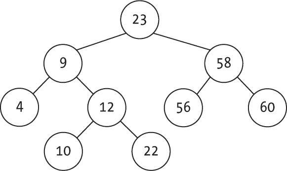

图 12-26：在添加键 20 之前的二叉搜索树

在比较 20 和 23 之前，生成一个随机数。由于树的大小为 9，算法有九分之一的概率会拆分树并将 20 设置为根节点，而在九分之八的情况下，根节点仍然是 23。否则，你将继续以通常的方式在二叉搜索树中添加键。

假设测试通过。将树分成两部分，并将它们设置为 20 的子树，20 成为新的根节点，如图 12-27 所示。

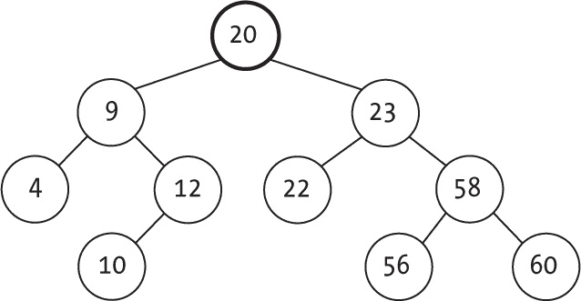

图 12-27：如果随机测试成功，新键将成为树的根节点。

现在，假设测试失败。将原始根节点保持在原位，移动到它的左子树，将 20 和 9 进行比较。这一次，由于当前树的大小为 5，随机测试成功的概率为五分之一。如果这次测试成功，20 将取代 9，分割以 9 为根的树，并像之前一样执行相同的操作。

第三种可能性是如果随机测试第一次和第二次都失败。在这种情况下，将 20 和 12 进行比较，并进行另一个随机测试，这次成功的概率为三分之一，因为原始以 12 为根的树有三个节点。如果该测试仍然失败，你还会再次尝试，这时成功的概率为二分之一，然后再将 20 和 22 进行比较。*只有当*每次随机测试都失败时，你才会最终将 20 放在普通二叉搜索树中应该放置的位置：在这个例子中，放在 22 键的左边。

##### 随机二叉搜索树的分割

分割算法让人联想到 第六章中快速排序的枢轴部分。你有一个“枢轴”键，想要将结构分割成两棵树，这样第一棵树中的所有键都小于枢轴，第二棵树中的所有键都大于枢轴。

从我们之前使用过的相同树开始，看看如何根据 20 键进行分割，如 图 12-28 所示。

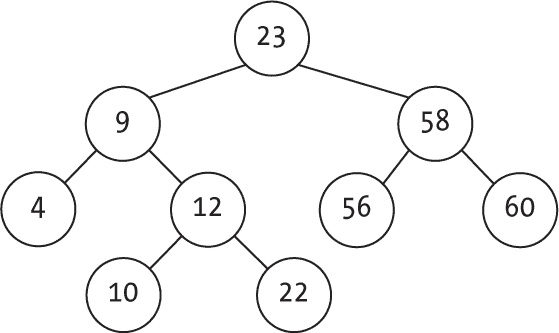

图 12-28：与 图 12-26 相同的树，在根据 20 键进行分割之前

首先建立两棵空树：一棵包含小于 20 的值，另一棵包含大于 20 的值。两棵树都从空树开始。第一步将 20 和 23 进行比较。由于 23 大于 20，因此这个根节点及其右子树进入了大值树中。同时，你需要“记住” 23 的左子树（现在为空），因为将来任何大于 20 但小于 23 的值将进入这个位置。两棵分割后的树（当前为空的较小值树）将像 图 12-29 中显示的样子，接下来你将处理以 9 为根的子树。

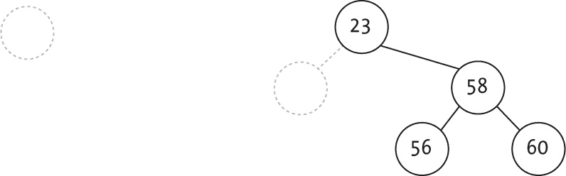

图 12-29：第一步：23 大于 20，因此部分树结构向右移动。虚线圆圈显示了将要添加新子树的位置。

现在你有 20，它大于 9，因此 9 和它的左子树进入“较小”树，你还需要记住 9 的右子树，这是将来任何大于 9 但小于 20 的值将要进入的地方。现在，分割后的树形就像 图 12-30 中的样子，你可以继续处理 12 键。

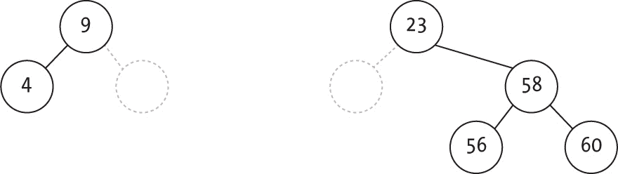

图 12-30：第二步：9 小于 20，因此部分树结构向左移动。

这是相同的情况：20 大于 12，因此将 12 和它的左子树连接到较小树的记住的右子树中，得到 图 12-31 中显示的场景。现在记住 12 的右子树作为未来添加更多值的地方。

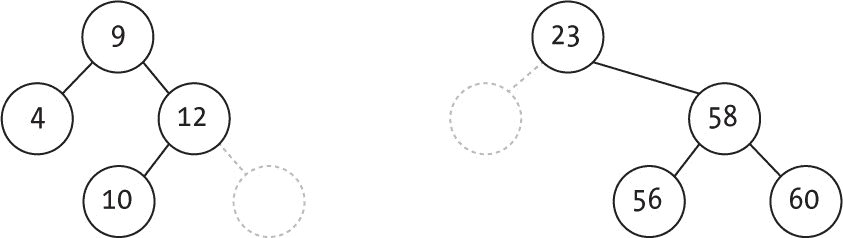

图 12-31：第三步：12 小于 20，所以添加到左树。

你几乎完成了：20 小于 22，所以 22（以及它的右子树，如果有的话）会进入“较大”树中的预定位置，如图 12-32 所示。

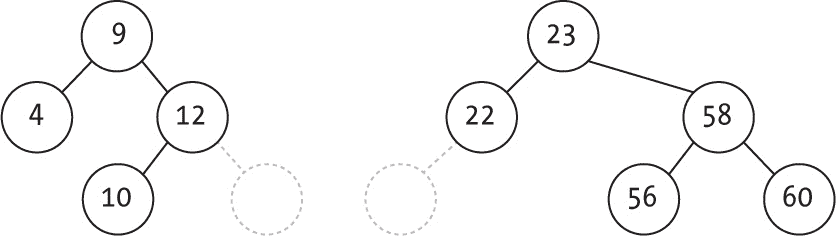

图 12-32：第四步：22 大于 20，所以添加到右树。

由于没有更多的节点需要处理，最终将最终树的根节点设置为 20，并将“较小”和“较大”的树作为子树。结果，如图 12-33 所示，就是你之前看到的情况。

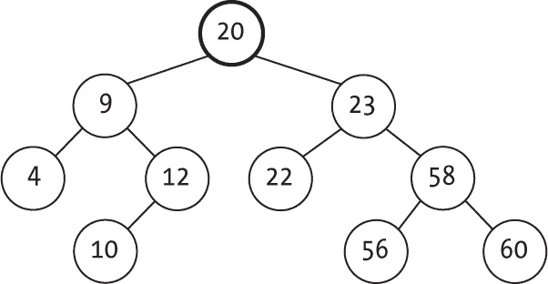

图 12-33：第五步：树被拆分，现在你将 20 设置为其根节点。

现在检查代码，重点在于如何记住拆分树中的位置：

```
const _split = (
  tree,
  keyForSplit,
  newTrees = {left: null, right: null},
  lastNodes = {left: newTrees, right: newTrees}
) => {
❶ if (isEmpty(tree)) {
   return newTrees;
❷} else {
   const [side, other] =
      keyForSplit <= tree.key ? ["left", "right"] : ["right", "left"];
  ❸ const nextTree = tree[side];
    tree[side] = null;
  ❹ lastNodes[other][side] = tree;
    lastNodes[other] = tree;
  ❺ const newSplit = _split(nextTree, keyForSplit, newTrees, lastNodes);
  ❻ tree.size = _calcSize(tree);
    return newSplit;
  }
};
```

首先创建两棵树 newTrees，当你拆分原始树时。如果完成树的拆分❶，则返回那对树。否则❷，决定拆分的哪一侧❸，并将拆分部分合并到正确的新树中；你还需要记住下次合并的位置❹，然后递归地处理树的其余部分❺。最后计算树的大小❻，因为你需要它进行随机测试。

##### 从随机树中删除一个键

删除键的算法几乎与之前相同，但有一个主要的区别：如果要删除的键有两个子节点，应该怎么办。以下是基本代码：

```
const remove = (tree, keyToRemove) => {
  if (isEmpty(tree)) {
    // nothing to do
  } else if (keyToRemove < tree.key) {
    tree.left = remove(tree.left, keyToRemove);
  ❶ **tree.size = _calcSize(tree);**
  } else if (keyToRemove > tree.key) {
    tree.right = remove(tree.right, keyToRemove);
  ❷ **tree.size = _calcSize(tree);**
  } else if (isEmpty(tree.left) && isEmpty(tree.right)) {
    tree = null;
  } else if (isEmpty(tree.left)) {
    tree = tree.right;
  } else if (isEmpty(tree.right)) {
    tree = tree.left;
  } else {
  ❸ **tree = _join(tree.left, tree.right);**
  }
  return tree;
};
```

该算法相当标准，你已经见过这个代码好几次了，只有一些小的例外。当你从子树中移除一个键时，你需要更新大小属性❶❷，但有一个有趣的区别是，当你要删除一个有两个子树的键时，你需要使用合并过程❸将左右子树合并成一棵新树，然后用新树替代被删除的键。（更多关于删除算法的内容，请参见问题 12.22。）

##### 合并两个随机化的二叉搜索树

你可以通过选择一个子树，并将其根节点作为新子树的根节点，递归处理其余的树，来构建一棵新树。考虑图 12-34 中显示的示例情况，并尝试删除之前添加的 20 键。

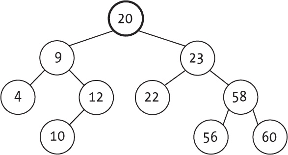

图 12-34：删除根节点（这里是 20）需要将其子树合并成一棵树。

你需要通过随机选择的方式将根节点的左子树和右子树合并成一棵树，因此 9 或 23 将成为新的根节点。假设随机选择了 9。将 9 设置为新树的根节点，并将其左子树保留，同时将其右子树与另一个以 23 为根的子树合并，作为右子树。

现在，你需要在 12 和 23 之间做选择；假设你选择了后者。你可以将 23 及其右子树添加到你正在构建的树中，然后仍需完成合并以 12 和 22 为根的子树。如果你随机选择 12 作为下一个根节点，你将得到图 12-35 所示的情况。

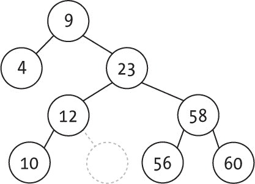

图 12-35：随机选择 9 作为根节点，23 作为右子树后得到的新树

作为最后一步，你需要合并一个空子树（12 的右子树）和 22 的子树，因此最终的树形如图 12-36 所示，你通过新算法移除了 20 这个关键字。

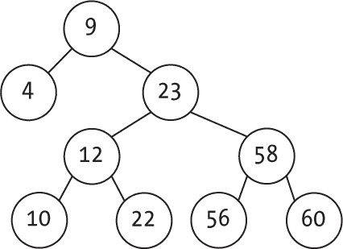

图 12-36：最后一步，在合并 12 的右空子树和 22 的子树之后

考虑代码。为了决定从哪棵树选择根节点，使用与你考虑采样时相同的规则：如果子树的大小分别是 6 和 4，你将以 6/10 的概率选择第一棵树的根节点，4/10 的概率选择第二棵树的根节点。以下是算法：

```
const _join = (leftTree, rightTree) => {
❶ const leftSize = _getSize(leftTree);
  const rightSize = _getSize(rightTree);
  const totalSize = leftSize + rightSize;

❷ if (totalSize === 0) {
   return null;
❸} else if (totalSize * Math.random() < leftSize) {
   leftTree.right = _join(leftTree.right, rightTree);
   leftTree.size = _calcSize(leftTree);
   return leftTree;
❹} else {
   rightTree.left = _join(leftTree, rightTree.left);
   rightTree.size = _calcSize(rightTree);
   return rightTree;
 }
};
```

首先，获取要合并的树的大小 ❶，以便稍后进行随机选择。如果两棵树都是空的 ❷，那么操作完成。如果不是，基于树本身的大小随机决定哪一棵树将提供根节点 ❸。如果是左树，那么保留其根节点和左子树不变，并用另一棵树的右子树替代右子树。 当然，如果你选择了右子树 ❹，逻辑是相同的，只不过是镜像操作。

##### 考虑随机化二叉查找树的性能

随机化添加过程的效果使得平均性能呈对数级增长。即使结构有时会变形，持续的操作会使其恢复到良好的形状。最坏情况下，时间仍然是线性的。毕竟，存在所有随机数“对你不利”的可能性，导致生成一个形状不好的树，但平均而言，这种情况并不常发生；请参见表 12-5。

表 12-5：随机化二叉查找树操作的性能

| 操作 | 平均性能 | 最坏情况 |
| --- | --- | --- |
| 创建 | O(1) | O(1) |
| 添加 | O(log n) | O(n) |
| 删除 | O(log n) | O(n) |
| 查找 | O(log n) | O(n) |
| 遍历 | O(n) | O(n) |

这种结构提供了高概率的对数级性能：查找树的形状将是由随机键序列创建的树的形状。现在考虑一种不同的结构，它将提供摊销对数性能，因此一系列操作的总时间在平均上是对数级的。

#### 伸展树

如前所述，二叉搜索树可能会有*O*(*n*)的性能，尽管这种情况只会偶尔发生，但它可能是个问题。前面提到的平衡树采取了预防措施来避免这个问题，但*伸展树*提供了另一种解决方案。这种版本的二叉搜索树保证了摊销的*O*(log *n*)性能，这意味着一系列*k*连续操作的性能将是*O*(*k* log *n*)，虽然这不如保证的*O*(log *n*)性能好，但几乎差不多。

使用伸展树时，每当访问一个节点时，该节点会通过一个叫做*伸展*的过程移动到树根，这个过程是一系列旋转操作，目的是将目标节点移到树根。这并不保证树的平衡性，但随着时间的推移，伸展树通常会变得比较合理，并提供了一个比其他二叉搜索树实现更好的替代方案。

请参考图 12-37，假设正在查找 12 这个关键字。

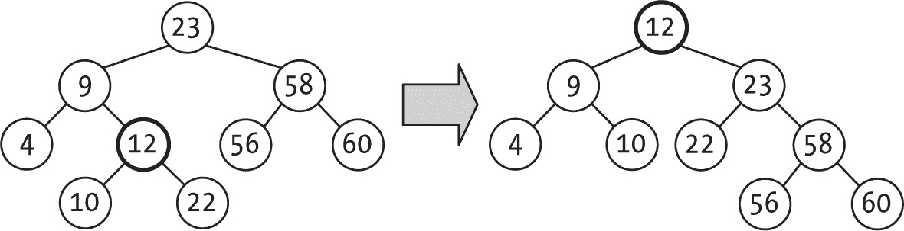

图 12-37：在伸展树中，经过一次搜索（在这里是查找关键字 12），找到的节点成为树的新根节点。

找到 12 后，这个关键字被提到树根（稍后你会看到如何操作），这也会导致其他路径发生变化：23 被推到树根的右子树，10 靠近树根，22 从左边移到右边。即使树形可能变得不太平衡，操作的顺序通常会重新构造它，从而在长时间内提高性能。如果你频繁需要访问一些特定的关键字集合，搜索会非常快速，因为这些关键字会更接近树根，这对于许多应用场景是一个优势。编译器及其符号表就是一个例子：通常，当一个符号被定义（比如在一个函数中）时，很有可能在短时间内多次访问它。

##### 伸展树操作

伸展树有一些特定的规则，并且有一些很有趣的名称，如*zig-zig*或*zag*，它们基于简单的旋转。考虑不同的情形。在图 12-38 到图 12-40 中，要被移到树根的关键字始终是 1（已高亮显示）。

**情形 1：树根的左子节点**

如果关键字是树根的左子节点，应用单次右旋将该关键字移到树根。这叫做*zig*情形，如图 12-38 所示。

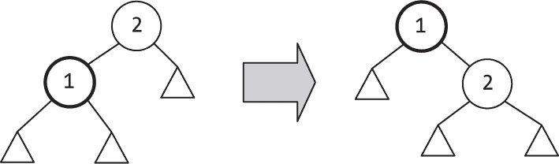

图 12-38：单次右旋将左子树移到树根。

相反的情况是如果关键字是树根的右子节点；此时你需要进行一次左旋，这叫做*zag*。

**情形 2：树根左子节点的右子节点**

在这个*zag-zig*情形中，首先对关键字进行左旋，然后进行右旋，将其移到树根，如图 12-39 所示。

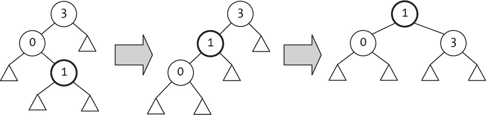

图 12-39：对于左子节点的右子节点，需要进行两次旋转。

在相反的情况下（*zig-zag*），先进行右旋再进行左旋。

**情况 3：根节点左孩子的左孩子**

这个*zig-zig*情况可能会让你感到困惑，因为旋转的顺序发生了变化：首先你需要将底部键的*父节点*向右旋转，然后再旋转该键本身，如图 12-40 所示。

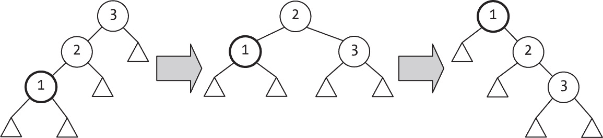

图 12-40：左孩子的左孩子需要两次右旋。

你可能认为在这种情况下一个更简单的算法可以旋转键两次，但结果并不理想，一个简单的例子可能会让你相信这一点。假设你从一个（不太好的）树开始，如图 12-41 所示，然后将 1 键进行伸展。

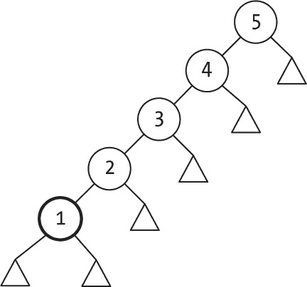

图 12-41：为什么总是旋转找到的键并不好

你可以尝试使用右旋将 1 移动到上面。在每一步中，1 会向上移动一个位置，将原始根节点移到右侧（首先是 2；然后是 3 和 2；再然后是 4、3 和 2；以此类推），当 1 移到根节点时，其他所有的键（2–5）仍然保持在原先的结构中，如图 12-42 所示。

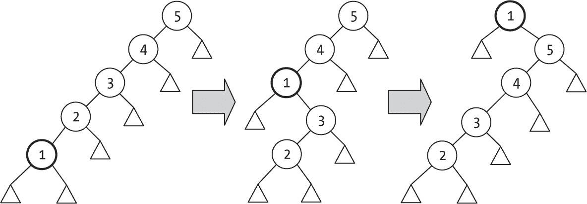

图 12-42：所有旋转后，树的结构变得更差。

在这个伸展算法中，两个 zig-zig 旋转可以处理这种情况。首先，1 变成根节点，2 和 3 位于其右侧，然后 1 移到树的顶部，4 和 5 在其右侧；2 和 3 被重新定位到 4 的左侧，如图 12-43 所示。


图 12-43：文本中建议的旋转产生了更好的结构。

zig-zig 逻辑产生了一个更加平衡的树，根节点到各个节点的路径变得更短，这为使用更复杂的逻辑提供了依据。

现在，考虑一下实际代码中的伸展操作：

```
const _splay = (tree, keyToUp) => {
❶ if (isEmpty(tree) || keyToUp === tree.key) {
    return tree;
  } else {
  ❷ const side = keyToUp < tree.key ? "left" : "right";
    if (isEmpty(tree[side])) {
     return tree;
  ❸} else if (keyToUp === tree[side].key) {
     return _rotate(tree, side);
  ❹} else {
     if (keyToUp <= tree[side].key === keyToUp <= tree.key) {
     ❺ tree[side][side] = _splay(tree[side][side], keyToUp);
     ❻ tree = _rotate(tree, side);
     } else {
     ❼ const other = side === "left" ? "right" : "left";
     ❽ tree[side][other] = _splay(tree[side][other], keyToUp);
       if (!isEmpty(tree[side][other])) {
         tree[side] = _rotate(tree[side], other);
       }
     }
   ❾ return isEmpty(tree[side]) ? tree : _rotate(tree, side);
   }
 }
};
```

伸展过程持续进行，直到遇到空树或找到你要找的键 ❶。只要这些条件没有满足，就继续。决定应该在哪个子树中找到键 ❷，如果该子树为空，则也完成了。 （如果树中不包含你要找的键，那么你找到的最后一个键将向上移动，因此*某些*重构始终会进行。）如果你在子树的根节点找到键 ❸，那么你会遇到一个 zig 或 zag，单次旋转就足够了。如果没有，假如你要查找的键位于子树的同一侧 ❹，那么就是一个 zig-zig 或 zag-zag。首先递归地对最底层子树进行伸展 ❺，然后旋转根节点 ❻，最后再完成最后一次旋转 ❾。另一种可能性是 zig-zag 或 zag-zig：先对最底层子树进行伸展 ❼，然后完成之前描述的另外两次旋转 ❽ ❾。

##### 在伸展树中查找一个键

这个算法很简单。首先应用伸展算法，然后检查移到根节点的值是否是你在寻找的：

```
const find = (tree, keyToFind) => {
❶ if (!isEmpty(tree)) {
    tree = _splay(tree, keyToFind);
  }
❷ return [tree, !isEmpty(tree) && tree.key === keyToFind];
};
```

除非树为空，否则要进行伸展。伸展❶是*始终*进行的，无论关键字是否存在，所以新根节点上的关键字可能是你想要的，也可能不是，这就解释了最终的测试❷。

##### 向伸展树中添加关键字

要添加一个关键字，首先对树进行伸展以重构树结构，然后在顶部添加一个新的根节点。图 12-44 中的树，和之前展示伸展如何工作的树相同，展示了如何添加一个 11 关键字。

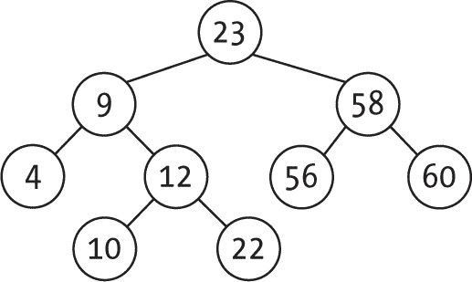

图 12-44：一个你将插入 11 关键字的伸展树

第一步是使用 11 作为伸展值进行伸展。这个关键字不在树中，因此算法的结果是 10 作为根节点，如图 12-45 所示。

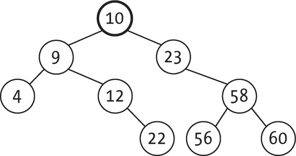

图 12-45：第一步：树以 11 为伸展值进行伸展。

现在很容易完成：11 应该成为根节点，10（当前根节点）在其左侧，23 在右侧，如图 12-46 所示。

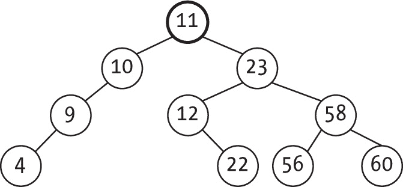

图 12-46：最后一步：11 成为新的根节点，伸展的部分作为子树。

代码如下：

```
const add = (tree, keyToAdd) => {
❶ const newTree = newNode(keyToAdd);
  if (!isEmpty(tree)) {
  ❷ tree = _splay(tree, keyToAdd);
  ❸ const [side, other] =
      keyToAdd <= tree.key ? ["left", "right"] : ["right", "left"];
    newTree[side] = tree[side];
    newTree[other] = tree;
    tree[side] = null;
  }
  return newTree;
};
```

首先，创建将成为新根节点的节点❶。然后，进行树的伸展❷，使根节点成为最接近所添加的关键字的节点。接着正确连接新根节点❸，新的节点将成为树的根节点。

##### 从伸展树中删除关键字

删除一个关键字从对树进行伸展开始，这样根节点就会变成你想删除的关键字，或者如果你想删除的关键字不在树中，就会变成其他的关键字。如果找到了该关键字，执行通常的步骤。如果该节点没有子节点或只有一个子节点，删除就很简单；如果有两个子节点，找到右子树中下一个关键字并将其作为根节点，但也需要进行伸展。

你可以通过尝试从图 12-47 所示的树中删除 12 来了解这个过程是如何工作的。


图 12-47：一个你想从中删除 12 关键字的伸展树

第一步，和添加和查找一样，是使用 12 作为关键字对树进行伸展；你已经看过这个例子，结果是更新后的树，如图 12-48 所示。

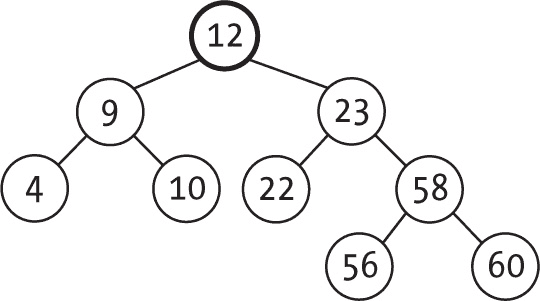

图 12-48：树经过伸展后，12 成为根节点。

由于找到了 12，你可以继续。此时你有两个子树，所以必须找到紧随 12 之后的关键字（22），并使用该值来伸展根节点的子树，得到如图 12-49 所示的新树。

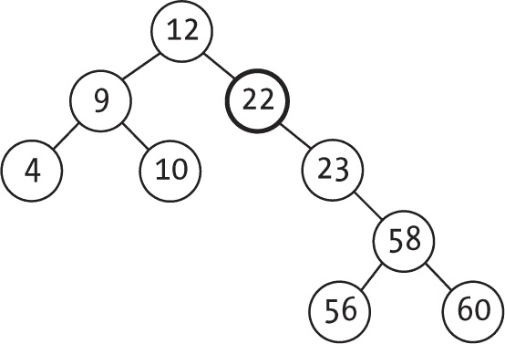

图 12-49：将 22 作为根节点的子树进行伸展后的树

现在你可以通过将 22 放到 12 的位置轻松删除 12，算法就完成了，如图 12-50 所示。请注意，22 这个关键字不能有左子树，因为 12 和 22 之间没有值。

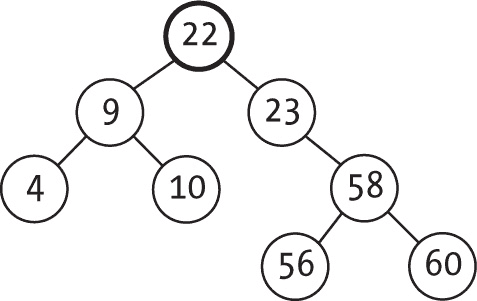

图 12-50：22 成为根节点后的最终树

首先查看代码来伸展树，将其最小值移到顶部。回想之前的算法，我们通过向左查找最小键，直到无法继续。这里的思路是应用旋转操作，使最小键最终位于顶部：

```
const _splayMinimum = (tree) => {
  if (isEmpty(tree) || isEmpty(tree.left)) {
    return tree;
  } else {
  ❶ tree.left.left = _splayMinimum(tree.left.left);
  ❷ tree = _rotate(tree, "left");
  ❸ return isEmpty(tree.left) ? tree : _rotate(tree, "left");
  }
};
```

该算法基本上与 _splay()相同，只不过你总是假设你要向左走❶❷❸。对比代码；它与之前的代码相同，只不过 side 被替换成了 left。（还有另一种方式来推导 _splayMinimum()代码；请见问题 12.25。）有了这些说明，删除操作的代码如下：

```
const remove = (tree, keyToRemove) => {
  if (!isEmpty(tree)) {
  ❶ tree = _splay(tree, keyToRemove);
    if (keyToRemove === tree.key) {
    ❷ if (isEmpty(tree.left) && isEmpty(tree.right)) {
       tree = null;
    ❸} else if (isEmpty(tree.left)) {
       tree = tree.right;
    ❹} else if (isEmpty(tree.right)) {
       tree = tree.left;
     } else {
     ❺ const oldLeft = tree.left;
     ❻ tree = _splayMinimum(tree.right);
     ❼ tree.left = oldLeft;
     }
   }
 }
 return tree;
};
```

如果树不为空，首先进行伸展❶，然后检查你要删除的键是否已经位于根节点。如果是这样，你可以轻松处理新根节点少于两个子节点的情况❷❸❹。否则，保存左子树❺，然后伸展右子树，将其最小值移到顶部❻，最小值取代了你要删除的键。只需修复其左子树❼，就完成了。

> 注意

*请参见问题 12.24，确认你理解这个算法的一个重要细节：为什么你只在删除过程中最后几个步骤中覆盖伸展子树的左子树？*

##### 考虑伸展树的性能

伸展树在最坏情况下可能会生成一棵线性树，因此在这种情况下性能将是线性的，并且可能会在实时上下文中被排除，因为你需要对处理时间有绝对的保证。然而，一系列操作的摊销成本是对数级的，这意味着，平均而言，一系列*k*次操作（添加和删除）的总成本是*O*(*k* log *n*)，这相当于对数摊销性能；表 12-6 总结了结果。

表 12-6：伸展树操作的性能

| 操作 | 摊销性能 |
| --- | --- |
| 创建 | O(1) |
| 添加 | O(log n) |
| 删除 | O(log n) |
| 查找 | O(log n) |
| 遍历 | O(n) |

一个有趣的特点是，这种结构不仅能够自我重组，还能提供更好的性能，因为频繁访问的键最终会靠近根节点。这使得伸展树非常适合用来实现缓存。例如，节点不需要额外的书籍数据（如树的高度或大小），这在内存紧张时特别有用，另一个好处是，平均而言，它的性能和其他树一样高效。

### 概述

本章介绍了树结构，特别是二叉搜索树，它们为袋（bag）和集合（set）ADT 提供了良好的实现，并具有高效的*添加*、*删除*和*查找*方法。你探索了这些树的性能，并看到了几种旨在确保良好、快速算法的变体。

在接下来的章节中，我们将探讨更多的树形结构，并且我们还会考虑一些特殊的面向搜索的结构，这些结构能提供非常高效的搜索和更新。

### 问题

**12.1  层次问题**

你能用层次来定义树的高度吗？

**12.2  打破规则**

文件系统的目录通常被认为具有树状结构，但这并不总是正确的。你能想到一个特性，使得目录能够像循环链表（如在第十章中看到的那样）甚至像图（如你将在第十七章中看到的那样）吗？提示：目录条目可以有多种类型。

**12.3  名字里有什么？**

这里有一些关于满二叉树、完美二叉树和完整二叉树的问题：哪个术语包含另一个？例如，满二叉树也是完整的二叉树吗？那么完整的二叉树是满的吗？满二叉树和完美二叉树会怎样？完美二叉树和完整二叉树呢？

**12.4  一个** **find()** **一行代码**

这肯定不太清楚，但你能用一行代码写出 find()方法吗？

**12.5  树的大小**

编写一个 calcSize()函数来计算二叉树的大小。

**12.6  像树一样高**

编写一个 calcHeight()函数来计算二叉树的高度。

**12.7  复制一棵树**

给定一棵二叉树，编写一个算法来生成它的副本。（提示：你可能想要考虑使用前序遍历。）

**12.8  做数学运算**

如果你正在编写一个编译器或解释器，这个问题可能会出现。假设你有一棵二叉树，其节点可以是数字或数学运算符（加法、减法、乘法、除法）。这样的树可以用来表示任何数学表达式；例如，图 12-51 中的树表示 (2 + 3) * 6。

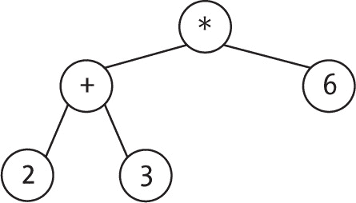

图 12-51：做一下数学运算。

证明你可以通过正确遍历树来评估这样的表达式。

**12.9  让它变坏**

在常见的二叉搜索树中，你应该以什么顺序插入键值才能生成一个线性列表？如果你有*n*个键值，如何生成一棵没有任何一个满节点的树呢？（提示：你可以先选择哪些值来加入树中？接下来可以加入哪些值？）

**12.10  重建树**

如果给定一棵二叉搜索树的前序遍历和中序遍历，并且树中没有重复的键，你可以重建它；编写一个算法来实现这一点。你的输入将是两个数组：第一个数组是树的前序遍历结果，第二个数组是中序遍历结果。

**12.11  更多重建？**

对于之前的问题，你能从中序遍历和后序遍历的结果重建出这棵树吗？那么从前序遍历和后序遍历的结果呢？

**12.12  相等的遍历**

对于哪些树，前序遍历和中序遍历访问键的顺序是相同的？那么中序遍历和后序遍历呢？或者前序遍历和后序遍历呢？

**12.13  通过遍历进行排序**

使用 inOrder()遍历，给定一棵二叉搜索树，生成一个按顺序排列的键的数组。

**12.14  通用顺序**

编写一个 anyOrder(tree,order,visit)函数，它接受一个 order 参数，可以是"PRE"、"IN"或"POST"，并且会根据给定的 visit()函数执行相应的树遍历。

**12.15  无递归遍历**

实现所有遍历方法时不要使用递归；请改用栈。

**12.16  不允许重复**

修改二叉搜索树的添加逻辑，以拒绝添加重复的键。发生这种尝试时，树应该保持不变，并抛出错误。

**12.17  获取和删除**

编写一个 _removeMinFromTree(tree)方法，找到二叉搜索树中的最小键，删除它，并同时返回该键和更新后的树。利用这个新方法优化 _remove()，从而不再需要 _findNext()。

**12.18  AVL 最差**

与树的高度相关，AVL 树最小可以有多少个节点？换句话说，如果一棵 AVL 树的高度为 1、2、3……，那么它最少可能有多少个节点？

**12.19  仅限单个**

考虑一个没有兄弟节点的子节点，称为*单一子节点*。在 AVL 树中，是否可以有超过 50%的单一子节点？

**12.20  为什么是 1？**

在权重平衡树中，为什么左子树和右子树的平衡（即*weight(left subtree) / weight(tree)*和*weight(right subtree) / weight(tree)*)加起来是 1？

**12.21  更容易随机化？**

一位开发者有以下想法：

如果按顺序添加键，二叉搜索树的表现会很差，但如果键是随机顺序添加的，则表现良好。如果我在将键添加到树中之前先对它们进行哈希处理，会发生什么呢？哈希后的键从所有角度来看都是随机的，因此一个有序的键序列会变成完全无序的，保证良好的性能。当然，在查找一个键时，我需要查找哈希后的键，但这不是什么大问题。问题解决了；使用哈希键的二叉树将*始终*表现良好！

这个推理是否正确？

**12.22  为什么不递减？**

在随机化二叉树的 remove()逻辑中，为什么使用 _calcSize()而不是像下面那样递减？

```
const remove = (tree, keyToRemove) => {
  if (isEmpty(tree)) {
    // nothing to do
  } else if (keyToRemove < tree.key) {
    tree.left = remove(tree.left, keyToRemove);
    **tree.size--;**
  } else if (keyToRemove > tree.key) {
    tree.right = remove(tree.right, keyToRemove);
    **tree.size--;**
    return tree;
    ... etc. ...
};
```

**12.23  坏伸展？**

你之前看到，按升序或降序添加键是常见二叉搜索树的坏情况。那么在这些情况下，伸展树会怎么样呢？如果在这些添加之后删除一些键，得到的树形状会是什么？会更好吗？

**12.24  什么左子树？**

在伸展树的 remove()方法的末尾，在伸展根节点的右子树之后，`this.right.left`的值是多少，为什么？

**12.25  代码转换**

展示你如何通过假设 keyToUp 等于-Infinity，将 _splay()转换为 _splayMinimum()。为什么这样做有效？

**12.26  完全重平衡**

你已经看过了几种重新平衡树的方法，但你可能还想平衡一个普通的二叉搜索树。你能想出一个`restructure(tree)`函数，将二叉搜索树平衡成尽可能完美的形状吗？你应该尽量在树的每个地方将节点在左右子树之间尽可能均匀地分配。
