## 13 树和森林


在之前的章节中，我们探讨了二叉树，这些树的每个节点最多只有两个子节点。在本章中，我们将考虑一些不受这一限制的新结构，如森林和果园（当仅处理一棵树不够时）。之后，我们将继续学习 B 树和红黑树，以便进行更快速的搜索。

### 定义树和森林

*二叉树* 可以为空树，也可以由一个节点（根节点）和两个子节点组成，而这两个子节点本身也是二叉树。特别地，*二叉搜索树* 也是*有序*树，因为我们定义了子节点之间的特定顺序，并区分了左子节点和右子节点。

让我们进一步扩展这些概念。首先，你将允许一个节点拥有多个子节点，而不仅仅是两个——换句话说，节点的度数可以大于 2。你可能会遇到每个节点有特定数量（可能为空）的子节点的树，例如二叉树或三叉树，但通常情况下，节点的度数没有限制。有时，度数不确定的树被称为*多叉树*或*多路树*。

超越单棵树，*森林* 被定义为一组不相交的树。例如，你可以将计算机中某个硬盘的目录视为一棵树，但计算机中所有不同的存储设备（如硬盘或 USB 闪存）将构成一个森林。

我们甚至可以进一步定义一个*果园*，它是一个有序关系的森林。在森林中，树木分布杂乱无章，而果园则有着明确的布局。继续用计算机的例子，如果你为你的驱动器分配字母（如 C:、D: 等，微软 Windows 风格），那么你的存储实际上就是一个果园。与森林相关的术语还不止这些：你还可以拥有*林地*，它们像树一样，但节点之间可以有链接，可能将数据结构转化为一个有向（且可能是循环的）图。

> 注意

*为了简化本章的术语，我们将使用“森林”这一术语（当树木之间没有特定的顺序时），以及“有序森林”（而非果园），这是大多数教科书使用的术语。此外，本章中我们不会涉及林地。*

#### 使用数组表示树

你知道如何表示一棵普通的树吗？那森林呢？我们从树开始，因为通过这样做，我们会发现处理森林的一些技巧。你可能会想到的第一个解决方案是使用数组指向每个子节点，在 JavaScript 中，使用长度可变的动态数组是最简单的解决方案。图 13-1 展示了一个普通的树，其中节点有不同的度数。

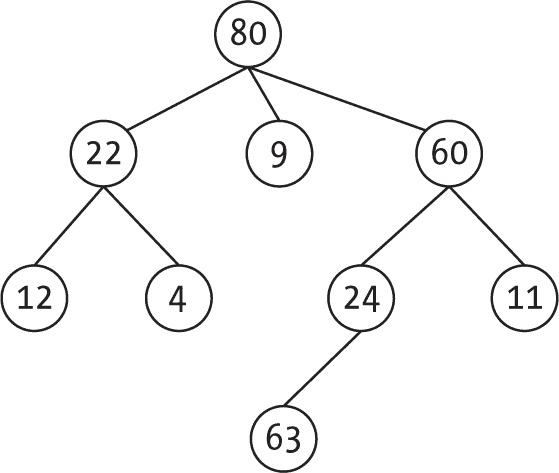

图 13-1：普通树

为了实现这样的树，在每个节点上添加一个子树数组，形成如下所示的结构（从 JavaScript 的角度来看，这段代码与书中的风格略有不同，表示使用类的树结构，这使得你可以使用像文档对象模型 [DOM] 节点接口这样的标准接口）：

```
class Tree {
  constructor(rootKey) {
  ❶ this._key = rootKey;
  ❷ this._children = [];
  }

  isEmpty() {
  ❸ return this._key === undefined;
  }

❹ _throwIfEmpty() {
    if (this.isEmpty()) {
      throw new Error("Empty tree");
    }
  }

❺ get key() {
    this._throwIfEmpty();
    return this._key;
  }

❻ set key(v) {
    this._key = v;
  }

❼ get isLeaf() {
    this._throwIfEmpty();
    return this.childNodes.length === 0;
  }

❽ get childNodes() {
    this._throwIfEmpty();
    return this._children;
  }

❾ get firstChild() {
    return this.isLeaf ? null : this.childNodes[0];
  }

❿ get lastChild() {
    return this.isLeaf ? null : this.childNodes[this.childNodes.length - 1];
  }

  // ...more methods...
}
```

一个关键字段 ❶，也作为标志，决定树是否为空 ❸，默认情况下，子节点数组 ❷ 为空。`_throwIfEmpty()` 方法 ❹ 检测到对空树的不正确访问（这在多个方法中使用）。你还添加了一个 getter ❺ 和一个 setter ❻ 来获取和设置树的键。然后添加一些 getter 来检查节点是否是没有子节点的叶子节点 ❼，如果不是，则获取其子节点 ❽，特别是访问它的第一个 ❾ 和最后一个 ❿ 子节点，模仿常见的 DOM 节点相关方法。

> 注意

*欲了解更多关于 DOM 节点接口的详情，请访问* [`developer.cdn.mozilla.net/en-US/docs/Web/API/Node`](https://developer.cdn.mozilla.net/en-US/docs/Web/API/Node)*.*

你可以考虑为树添加更多的方法，但你需要一些额外的字段来重现某些方法，如 `parentNode` 或 `previousSibling`。我们将在本章稍后看到实现这些功能的一些方法。现在你可以表示一般的树并访问它们的节点，接下来看看如何添加或移除数据来更新树。

##### 向树中添加节点

首先，在同级节点中的特定位置添加一个新子节点：

```
❶ addChild(keyToAdd, i = this.childNodes.length) {
❷ this._throwIfEmpty();
❸ if (i < 0 || i > this.childNodes.length) {
    throw new Error("Wrong index at add");
  } else {
  ❹ const newTree = new this.constructor();
    newTree.key = keyToAdd;
  ❺ this._children.splice(i, 0, newTree);
  ❻ return this;
  }
}
```

要添加一个新的键，只需指定它在同级节点中的位置；默认情况下，你将把它添加到末尾 ❶。如果树为空（没有根节点），则抛出错误 ❷，如果索引超出当前子节点数组的范围，也会抛出错误 ❸。如果一切正常，创建一个新的树 ❹，将新键作为其根节点，并将树放置在正确的位置 ❺，最后启用链式操作，如其他情况 ❻。

附加节点很简单：

```
appendChild(keyToAppend) {
  return this.addChild(keyToAppend);
}
```

你只需依赖 `addChild()` 的默认参数，这也会测试树是否有根。这里不需要特殊的代码。

##### 从树中移除节点

要移除给定的子节点，只需要测试并进行一些数组操作：

```
removeChild(i) {
❶ this._throwIfEmpty();
❷ if (i < 0 || i >= this.childNodes.length) {
    throw new Error("Wrong index at remove");
  } else {
  ❸ this._children.splice(i, 1);
  ❹ return this;
  }
}
```

在验证树有根且不为空 ❶ 后，检查要删除的子节点的索引是否有效 ❷。如果有效，对数组进行操作，将该子节点从同级节点中移除 ❸。最后，如同添加节点时一样，启用链式操作 ❹。

#### 使用二叉树表示树

使用数组表示树是有效的，但处理树的另一种方法是使用更简单的树形结构——二叉树。诀窍在于不同于以前的使用方式，左指针指向第一个子节点，右指针指向下一个兄弟节点。

> 注意

*如果你在想这种技术是否纯粹是学术性的，或者是否能在实际中使用，我们将在第十五章学习二项堆及其变种时使用它。*

回顾一下图 13-1 中展示的树。另一种表示方法是每个节点的左链接指向该节点的第一个子节点，右链接则创建一个节点的兄弟列表。（与本书中的其他所有图示一样，为了清晰起见，左和右的空指针被省略。）如果你重新排列并旋转图像 45 度，使得左指针实际指向下方，这个方案就会更清晰，如图 13-2 所示。

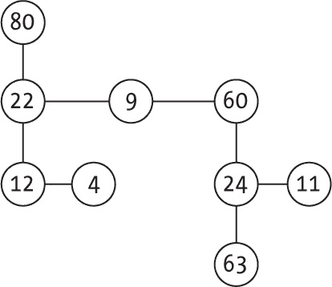

图 13-2：使用“左孩子，右兄弟”样式表示的树

许多结构使用这种*左孩子，右兄弟*约定，但为了更清晰，最好将左指针重命名为*下*，*右*指针仍然指向兄弟节点。至于算法（添加或删除值等），你不需要做任何不同于在第十二章中学到的二叉树内容的事情。

#### 表示森林

你可以将这些表示树的方法扩展到表示森林。如果使用数组作为指针，你可以简单地有一个根节点数组，每个元素指向一个特定的树（我们将在讨论二项堆和斐波那契堆时再次看到这个概念，见第十四章和第十五章，所以可以把图 13-3 看作是一个小剧透）。

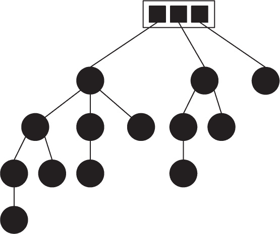

图 13-3：一个森林，表示为根节点数组

在森林的顶部是一个数组，其中包含指向每棵单独树根节点的指针。如果你更喜欢二叉树的表示方式，你可以做两件事：要么考虑所有根节点都是兄弟节点，要么添加一个虚拟的“超级根”，它包含所有森林中的树作为子树。第一种是常见的表示方式，类似于图 13-4 所示的森林（这与图 13-3 中展示的森林相同）。

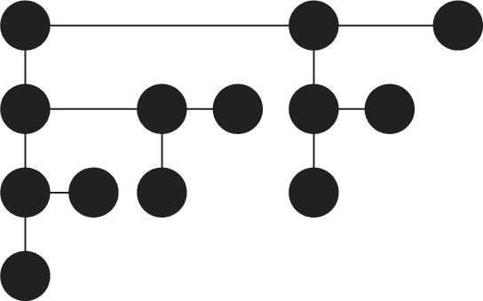

图 13-4：同一森林的另一种表示方法；根节点通过右指针连接。

要访问这个森林，你需要一个指向最左根节点的指针；从那里，你可以访问所有的树。你甚至可以通过使兄弟列表变成循环和双向链表来进一步扩展；我们稍后会探讨这个，并且看看为什么这些增强（以及复杂性）实际上是必要的。

#### 遍历树

在第十二章学习二叉查找树时，我们讨论了三种不同的遍历树的方式，通过“访问”所有节点，按照不同的方案进行遍历。对于一般树，你没有那么多的方法，但我们会新增一些。但首先，复习一下我们之前做过的遍历，并将其中的两种方法适配到一般树上：

**前序** 对于二叉树，*前序*意味着首先访问根节点，然后遍历其左子树，最后遍历其右子树。你可以将这个方法适配到一般树上，首先访问根节点，然后按顺序遍历每一个子树。

**后序** *后序*方法对于二叉树来说类似于前序方法，但它首先访问根节点的左子树，然后是右子树，最后访问根节点本身。其变体要求先遍历所有根节点的子节点，并按顺序访问，最后访问根节点。

**中序** *中序*方法实际上没有完全对应的版本。对于二叉树，它意味着首先遍历左子树，然后访问根节点，最后遍历右子树。然而，对于一般树，你没有合适的替代方法，因此可以跳过这种遍历（尽管对于本章后面讨论的 B 树，你确实有可能实现一个中序版本）。

编写前序和后序遍历的代码是相当直接的，二叉树的版本只需要做一些小的修改（我们将在本章末的习题中讨论它们的实现）。然而，有两个新方法值得学习，并且也出现在其他类型的算法中，例如游戏或函数优化：*深度优先*和*广度优先*遍历。

##### 深度优先遍历

实现可能最合逻辑的遍历方法需要首先访问根节点，然后使用相同的算法遍历所有子节点。实际上，这相当于在移动到另一分支之前尽可能深入地进入一个分支——因此，称为*深度优先*。 图 13-5 展示了这种遍历的一个示例；节点中的数字反映了访问发生的顺序。

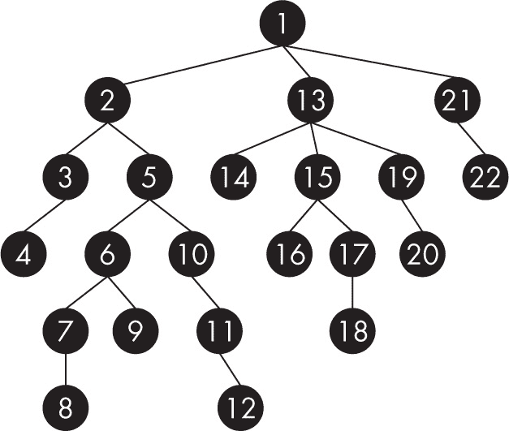

图 13-5：树的深度优先遍历

这种算法是一种经典算法，通常用于搜索或游戏。例如，如果你试图走出迷宫，你会沿着某条路径前进，直到你要么退出（并完成任务），要么遇到障碍，在这种情况下你会回头尝试另一条路径。（请参阅第 69 页的“迷宫路径查找”。）同样，在游戏中，你会尽可能地考虑某一系列的移动（因为时间有限），如果你还没有找到获胜的路线，就会回头尝试另一条。其逻辑如下：

```
❶ const depthFirst = (tree, visit = (x) => console.log(x)) => {
❷ if (!isEmpty(tree)) {
  ❸ visit(tree.key);
  ❹ tree.children.forEach((v) => depthFirst(v));
  }
};
```

这个算法与在第十二章中为二叉树编写的某些算法类似。首先，定义一个默认的 visit()函数❶，它仅列出节点的键，然后如果树不为空❷，访问其根节点❸。接下来，递归地按照深度优先的方式访问所有子节点❹。

##### 广度优先遍历

遍历树的另一种方式是广度优先，这是一种你还未遇到的遍历方式。（这种遍历方式也被称为*层次顺序*，原因稍后会显现出来。）其基本思想是从根节点开始；然后，访问下一层的所有子节点。然后（仅在此时），访问第二层的子节点，以此类推。你永远不会访问一个节点，直到你已经访问了所有更靠近根节点的节点，一层一层地向下访问。图 13-6 显示了这种遍历方式。再次提醒，数字表示节点访问的顺序，你可以验证每一层在开始下一层之前都已被完全访问。

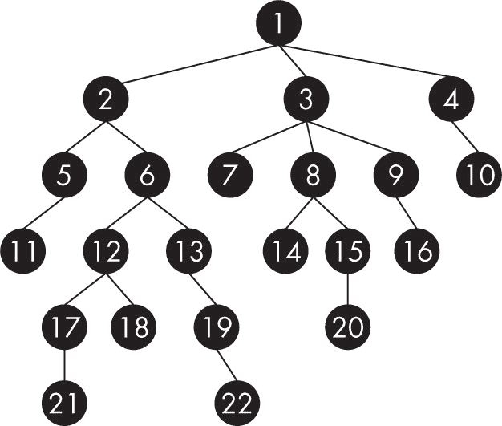

图 13-6：树的广度优先遍历

实现这一策略需要使用队列，如第十章中所讨论的那样。当你开始“水平”地访问节点时，你需要记得稍后访问它们的子节点，因此使用先进先出（FIFO）策略的队列很有效。你可以将其作为一个独立的函数进行编码以增加多样性：

```
❶ breadthFirst(visit = (x) => console.log(x)) {
❷ if (!this.isEmpty()) {
  ❸ const q = new Queue();
  ❹ q.push(this);
  ❺ while (!q.isEmpty()) {
    ❻ const t = q.pop();
    ❼ visit(t.key);
    ❽ t.childNodes.forEach((v) => q.push(v));
    }
  }
}
```

与其他遍历方法一样，默认的 visit()函数❶会记录节点的键。如果要遍历的树不是空的❷（在这种情况下你不需要做任何事情），则初始化一个队列❸并将树的根节点压入队列❹。其余的算法比较直接：当队列未被清空❺时，你弹出队列的顶部❻，访问该节点❼，并将它的所有子节点压入队列以便稍后访问❽。

这个算法根本不是递归的，这对于树和其他递归定义的结构来说并不常见。这里有一种有趣的对称性：不使用递归进行广度优先遍历树需要使用队列，而不使用递归进行深度优先遍历则需要使用栈；见第 13.3 题。

### B 树

B 树具有自我调整的树结构，确保在添加、删除和查找时具有对数时间性能，因此从这个意义上讲，你可以将它们视为高度平衡的二叉搜索树的扩展——而且是性能更优的扩展。这些树的一个关键特征是节点可以拥有多个子节点，这使得树变得更宽、更矮，从而实现更快速的搜索。

> 注意

*没有人真正知道 B 树中 B 代表什么。这个结构是由 Rudolf Bayer 和 Edward McCreight 于 1972 年定义的，但并没有给出这个术语的解释，所以你可以选择自己的解释：一些提议包括“平衡”，“广泛”，“灌木状”，当然，还有“Bayer”。*

B 树的定义（以及实现）在不同的来源和作者之间有所不同，因此我们需要明确这里所使用的定义。一个阶数为*m*的 B 树满足以下属性：

+   每个节点有*p* < *m* 个按升序排列的键，和*p* + 1 个子节点。

+   除了根节点外，每个节点必须至少有*m*/2（向上取整）个子节点，换句话说，所有节点（除了根节点）应该至少是半满的。

+   根节点应至少包含一个键。

+   所有叶子节点必须位于同一层级。

B 树的结构类似于二叉搜索树：给定一个节点中的键，该节点左侧的所有子节点的值都小于该键，右侧的所有子节点的值都大于该键。例如，你可以有一个如下所示的节点，参见图 13-7。

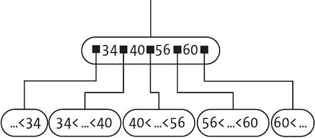

图 13-7：一个 B 树节点，展示了键的位置

在这种情况下，节点有四个键，因此有五个子节点。第一个子节点位于 34 键的左侧，包含比 34 小的键；位于 34 和 40 之间的子节点包含介于这两个值之间的键，以此类推，直到最后一个子节点，它位于 60 键的右侧，包含比该值大的键。（这些事实就是我们用来在 B 树中进行搜索的依据；你很快会看到算法。）这种结构类似于二叉搜索树，不同之处在于每个节点现在允许更多的子节点，而不是最多两个子节点——对于实际的实现（如磁盘中文件的索引），通常更大的值更受欢迎，以便缩短树的高度，从而加快访问速度。

#### 定义 B 树

让我们像在二叉搜索树中一样，首先定义我们需要的基本函数：

```
❶ let ORDER = undefined;

const newBTree = (order = 3) => {
❷ if (ORDER === undefined) {
    ORDER = order;
  }
  return null;
};

❸ const newNode = (
  newKeys = [null],
❹ newPtrs = new Array(newKeys.length + 1).fill(null)
) => ({
  keys: newKeys,
  ptrs: newPtrs
});

const isEmpty = (tree) => tree === null;

❺ const _tooBig = (tree, d = 0) => tree.keys.length + d > ORDER – 1;

❻ const _tooSmall = (tree, d = 0) =>
  tree.keys.length - d < Math.ceil(ORDER / 2) – 1;
```

你可以定义任意阶的 B 树，我们将使用一个变量 ORDER ❶来存储你想要的阶数。当你第一次创建 B 树 ❷时，你将存储所需的阶数（默认情况下是 3），这样所有未来的 B 树都会具有这个阶数。（这个决定引出了一个问题：如果你想要不同阶数的 B 树怎么办？参见问题 13.9。）newNode()函数 ❸默认情况下会创建一个包含单一空键的新节点，并且两侧有空指针；当然，这个节点会显得“过于空”，除非 ORDER 值很小。然而，值得注意的是，如果你提供一个键的数组 ❹，一些 JavaScript 的技巧将被用来生成（如果需要）一个对应的空指针数组，数组长度比键数组多一个；你能理解这怎么工作吗？

最后，一些辅助函数会派上用场。有时，你需要测试一个节点是否超载（或者如果添加 d 个键后会超载），即它的键数超过了允许的数量 ❺，_tooBig()函数将检查这一点。类似地，_tooSmall()函数判断节点是否过小（或者如果移除 d 个键后会过小），即它没有足够的键 ❻。（注意不要对根节点使用 _tooSmall()——根节点是唯一允许小于规定键数的节点。）你将在添加或删除键时使用这两个方法。

#### 在 B 树中查找键

让我们从最基本的算法开始：查找一个键。从某种意义上讲，算法类似于查找二叉搜索树中的键；你查找该键，如果在某个节点中没有找到，你会判断接下来应该在哪里继续查找。考虑一些例子。假设你有一个阶数为 3 的 B 树；空链接用空白框表示，如图 13-8 所示。

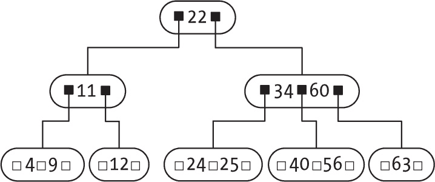

图 13-8：阶数为 3 的 B 树

如果你在寻找 22，那就简单多了：它就在根节点中，因此无需做任何操作。你可以让它变得更复杂，像寻找 56 一样，参考图 13-9。

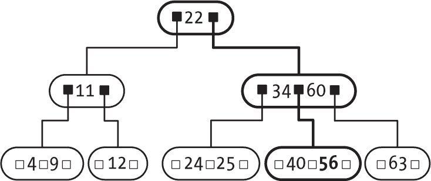

图 13-9：键 56 的搜索过程

从根节点开始，由于 56 > 22，沿着根节点的最后一个指针到达一个新节点。在那里，你发现 56 应该位于 34 和 60 之间，因此沿着中间指针到达另一个节点。在这个节点中，你最终找到了 56，因此搜索成功。

如果要查找的键不在树中呢？如果你在寻找 38，整个过程和寻找 56 是一样的，但是在没有找到包含 40 和 56 的节点中的 38 后，你会继续沿着节点的第一个指针（因为 38 < 40），但发现它为空，搜索就会失败。

现在进入算法部分。每次到达一个节点时，你需要检查所需的键是否存在；如果不存在，算法会告诉你该跟随哪个指针到达下一层；为此有一个辅助函数：

```
const _findIndex = (tree, key) => {
❶ const p = tree.keys.findIndex((k) => k >= key);
  return p === -1 ? tree.keys.length : p;
};
```

这会寻找键数组中第一个大于或等于你所搜索的键的元素 ❶。如果没有匹配的键，findIndex() 会返回 -1，因此在这种情况下，你返回 ptrs 中最后一个元素的索引（你很快就会明白为什么这段代码如此巧妙）：

```
const find = (tree, keyToFind) => {
❶ if (isEmpty(tree)) {
    return false;
  } else {
  ❷ const p = _findIndex(tree, keyToFind);
  ❸ return tree.keys[p] === keyToFind || find(tree.ptrs[p], keyToFind);
  }
};
```

如果你在搜索一个键，并且到达一个空节点 ❶，显然该键不在其中。否则，_findIndex() 方法会找到第一个不小于所搜索键的键 ❷。如果该键正好等于你要查找的值 ❸，则搜索完成；否则，继续沿着相应的指针进行搜索。这就是为什么你让 _findIndex() 返回数组中的最后一个位置——因为当你要查找的键大于节点中的所有键时，这是你需要跟随的链接。

进行线性搜索可能看起来是倒退的一步，尤其是在你已经看过更好的搜索方法时；有关更好的搜索方法的想法，请参见问题 13.7。

#### 遍历 B 树

我们可以定义二叉树的中序遍历等效方式，这意味着按升序访问所有键。由于每个节点有多个键，因此需要仔细操作。图 13-10 展示了如何实现这一点。

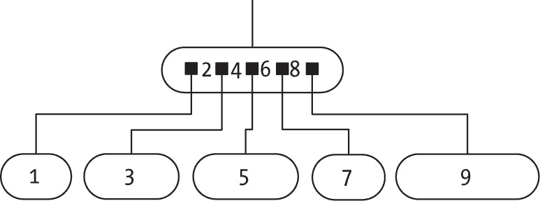

图 13-10：B 树的遍历，类似于二叉树的中序遍历

这种版本的中序遍历应该按升序访问键，因此，对于图 15-9 中的节点，首先访问最左边的子节点，然后访问该节点的第一个键，再访问第二个子节点，然后是第二个键，然后是第三个子节点，依此类推，直到遍历完最右边的子节点。

下面是一个它工作的示例：

```
const inOrder = (tree, visit = (x) => console.log(x)) => {
❶ if (!isEmpty(tree)) {
  ❷ tree.ptrs.forEach((p, i) => {
    ❸ inOrder(p, visit);
    ❹ i in tree.keys && visit(tree.keys[i]);
    });
  }
};
```

如果当前节点为空 ❶，什么都不做；否则，执行一个循环 ❷，在遍历子节点 ❸ 和访问键 ❹ 之间交替进行。对于后者，请记住，键的数量比子节点少一个。此代码使用&&表达式语法作为 if 或三元运算符的快捷方式：当且仅当条件为真时，表达式才会被求值；在此情况下，只有当对应索引在键数组范围内时，才访问键。

#### 向 B 树添加键

现在考虑如何添加一个键。如果你想向一个有足够空余空间的节点添加键，这很简单。问题在于试图将一个键添加到一个已经满了的节点。考虑使用之前提到的 3 阶 B 树作为例子（见图 13-11）。


图 13-11：你将添加一些新键的 B 树

首先，尝试添加一个 66 的键。经过查找后，你决定它应该与 63 的键一起，并且因为该节点有足够的空间，所以不需要额外操作（见图 13-12）。

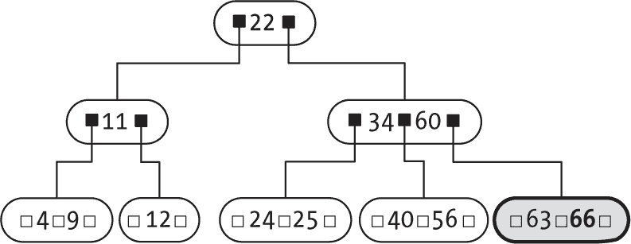

图 13-12：在有空间的节点添加键不会遇到问题。

现在让事情变得更复杂，添加一个 10 的键。这个问题在于，左下角的节点已经没有空间了。首先，你可以让它超出最大大小（见图 13-13）。

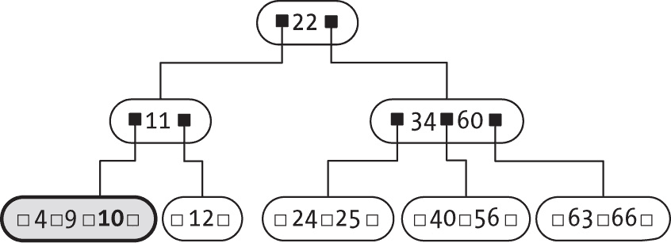

图 13-13：在节点达到限制时添加键需要分裂节点并旋转一个键到上层。

现在你需要将过大的节点分裂成两个，并将它的中间键上移到父节点。幸运的是，父节点有空间，所以操作完成了（见图 13-14）。

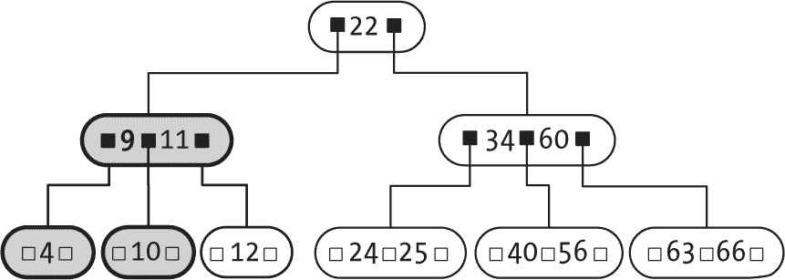

图 13-14：分裂后，B 树结构恢复正常。

如果你尝试添加一个 78 的键，这个节点会分裂两次：首先，66 的键会移动到 34-60 节点，然后该节点会分裂，将它的中间键（60）传递到父节点。这是 B 树唯一的生长方式：如果根节点需要分裂，它会增加一个新层级。

看一下代码，看看根节点层级发生了什么：

```
const add = (tree, keyToAdd) => {
  if (isEmpty(tree)) {
  ❶ return newNode([keyToAdd]);
  } else {
  ❷ _add(tree, keyToAdd);
  ❸ if (_tooBig(tree)) {
      const m = Math.ceil(ORDER / 2);
    ❹ const left = newNode(tree.keys.slice(0, m - 1), tree.ptrs.slice(0, m));
    ❺ const right = newNode(tree.keys.slice(m), tree.ptrs.slice(m));
    ❻ tree.keys = [tree.keys[m – 1]];
    ❼ tree.ptrs = [left, right];
    }
    return tree;
  }
};
```

最简单的情况是如果树为空 ❶，因为这时你只需要创建一个新节点，并加入新的键和几个空指针。否则，将键添加到树中的某个位置 ❷（使用一个辅助的递归 _add()方法，它会立即处理），并检查根节点是否变得太大 ❸。如果是，创建两个新节点 ❹ ❺，每个节点包含一半的键和指针，并将中间键保留在根节点 ❻，根节点将有这两个新节点作为子节点 ❼。

但是，新的键是如何添加的呢？之前的 _add()方法又有什么问题呢？下面是代码：

```
const _add = (tree, keyToAdd) => {
❶ const p = _findIndex(tree, keyToAdd);
❷ if (isEmpty(tree.ptrs[p])) {
    tree.keys.splice(p, 0, keyToAdd);
    tree.ptrs.splice(p, 0, null);
  } else {
  ❸ const child = tree.ptrs[p];
  ❹ _add(child, keyToAdd);

  ❺ if (_tooBig(child)) {
      // Child too big? Split it
      const m = Math.ceil(ORDER / 2);
    ❻ const newChild = newNode(child.keys.slice(m), child.ptrs.slice(m));

    ❼ tree.keys.splice(p, 0, child.keys[m – 1]);
      tree.ptrs.splice(p + 1, 0, newChild);

    ❽ child.keys.length = m – 1;
      child.ptrs.length = m;
    }
  }
};
```

首先找到当前节点的子树中应该添加新键的位置❶。如果子树不存在（相应的指针为 null），说明你已经到达了最底层，可以直接在此添加键❷；无需做其他操作。（当然，底层节点可能变得过大，但这会由其父节点检查，并在必要时解决问题。）如果存在子树❸，则递归地将新键添加到该子树❹，然后检查子节点是否变得过大❺。如果是，你需要添加一个新节点，将过大节点的后半部分键和指针移到新节点❻；中间的键和指针将上升到父节点❼，而原始子节点将保留前半部分键和指针❽。这段代码并不特别难理解，但正确处理索引和数组需要小心。

#### 从 B 树中移除键

添加一个键会引入复杂性，有时节点可能会变得过大，处理这个问题需要旋转或将键上移。移除一个键也会带来困难，因为节点可能变得过空，需要从其他节点获取键，或者最终需要从父节点获取键，这可能导致整个 B 树的高度变短；就像添加键可能使其变高一样，移除键则可能使其变低。

有几种可能的情况需要研究，这里有两种：移除一个不在叶子节点中的键和移除一个位于叶子节点中的键。

##### 从非叶子节点移除键

在内部节点中移除键很容易；它与二叉搜索树中的操作相同。将键替换为后继键（按照升序排列的下一个键），然后从树中移除*该*键（它会位于叶子节点）。例如，假设你想从图 13-15 中的树中移除 22 键。

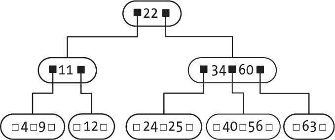

图 13-15：一个 B 树，你将在其中移除一个非叶子节点的键——在这个例子中是 22

你需要首先定位到 22 后的键，因此跟随 22 后的链接，然后继续沿着最左侧的链接，直到到达一个叶子节点找到 24 键（见图 13-16）。

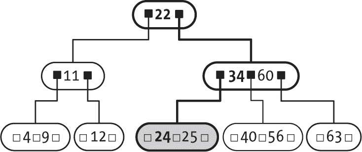

图 13-16：要移除 22，首先定位到下一个（更大的）键，在此例中是 24。

现在，将要移除的键（22）替换为下一个键（24），然后继续按照从叶子节点移除键的逻辑进行操作（在图 13-17 中以灰色标记）。

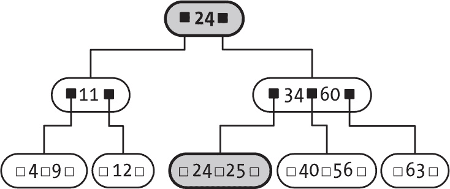

图 13-17：将 24 移到 22 的位置后，你现在需要从叶子节点中移除 24。

通过这种方法，你总是需要从叶子节点中移除键。以下是如何操作。

##### 从叶子节点移除键

在找到要移除的键并确认它位于叶子节点后，你有两种可能的情况：要么该节点“足够满”，因此移除键不会使其过空，要么该节点处于最小大小，这意味着移除键会让它变得过小。

第一个情况很容易处理：继续上一节的例子，要移除 24 键，只需将其从节点中移除，因为该节点有足够的键（见图 13-18）。

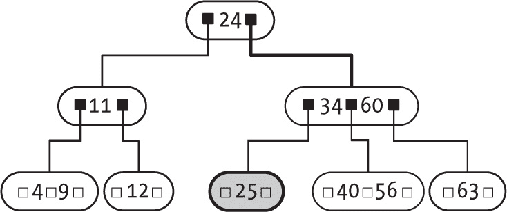

图 13-18：如果移除后叶子节点仍有足够的键，你就完成了。

但考虑一个更复杂的情况：如果你要移除 12 键，会发生什么？你会遇到问题，因为对应的节点最终会键数不足，如图 13-19 所示。（在这种情况下，节点会变为空，因为你正在处理一个 3 阶的 B 树；在更高阶的 B 树中，节点仍然会有一些键，但不足够。）

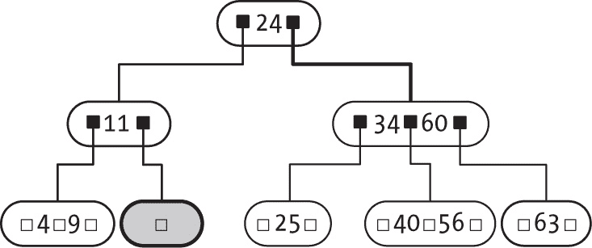

图 13-19：尝试从兄弟节点旋转键以重新组织 B 树

这里的解决方案取决于节点的兄弟。你可以尝试从其中一个兄弟借键，检查是否可以从左边或右边的兄弟借键；两个兄弟是对称的。在这种情况下，左兄弟有足够的键（4 和 9），所以从它那里借一个。9 键进入父节点，11 键被旋转到叶子节点（见图 13-20）。

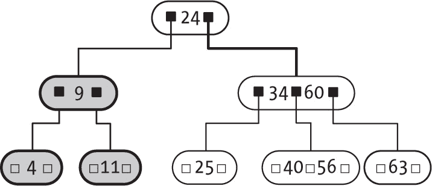

图 13-20：旋转解决了问题，所以你完成了。

你只剩下一个待处理的情况：如果没有兄弟节点有键可共享，会发生什么？在这种情况下，将节点与其兄弟合并，并从父节点借用一个键。这个步骤可能会导致节点变得不足，并需要修复。在这个例子中，假设你要移除 11 键。将它与其兄弟合并，并借用 9 键，达到了图 13-21 所示的情况。

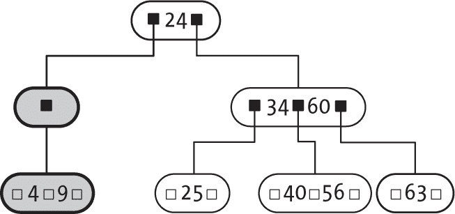

图 13-21：叶子节点已经修复，但它上面出现了问题。

为了解决新的不足节点情况，你再次使用借键的概念，旋转键，最终的树形如图 13-22 所示。

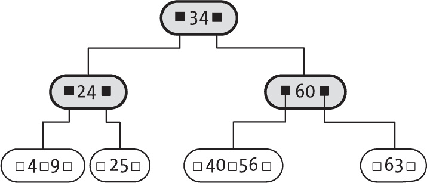

图 13-22：新的旋转解决了问题。

在进行共享和合并时，最终树可能会变得更短。如果你连续移除了 4 和 9 键，你会得到图 13-23 中的树形。


图 13-23：移除几个键可以使 B 树最终变得更短。

你能做出中间步骤吗？

##### 实现 remove()方法

现在你已经看到所有的应用策略，接下来是如何编写代码。处理根节点的删除是简短的：

```
const remove = (tree, keyToRemove) => {
❶ tree = _remove(tree, keyToRemove);
❷ return (isEmpty(tree) || tree.keys.length === 0) && !isEmpty(tree.ptrs[0])
    ? tree.ptrs[0]
    : tree;
};
```

首先使用 _remove() 函数递归地从树中移除关键字 ❶。如果树为空，或者根节点已经没有关键字（因为它只有一个关键字，并且在两个子节点合并时必须将其传递下去），但节点仍然有一个非空的子节点（根节点可能已经位于最底层，没有子节点） ❷，则返回该子节点。这意味着 B 树已经变得更短。

现在开始实际的关键字移除过程：

```
const _remove = (tree, keyToRemove) => {
❶ if (!isEmpty(tree)) {
 ❷ const p = _findIndex(tree, keyToRemove);
    if (tree.keys[p] === keyToRemove) {
    ❸ if (isEmpty(tree.ptrs[p])) {
      ❹ tree.keys.splice(p, 1);
        tree.ptrs.splice(p, 1);
      } else {
      ❺ const nextKey = _findMin(tree.ptrs[p + 1]);
      ❻ tree.keys[p] = nextKey;
      ❼ _remove(tree.ptrs[p + 1], nextKey);
      ❽ _fixChildIfSmall(tree, p + 1);
      }
    } else {
    ❾ _remove(tree.ptrs[p], keyToRemove);
    ❿ _fixChildIfSmall(tree, p);
    }
  }
  return tree;
};
```

从进行搜索时开始：如果树为空，操作结束 ❶。否则，检查当前节点是否包含你要移除的关键字 ❷。如果找到关键字并且已经到达底层 ❸，直接移除该关键字及其对应的指针 ❹；否则，如果你在更高的层次，使用 _findMin() 查找按升序排列的下一个关键字 ❺，并将其放入你想移除的原始关键字的位置 ❻。最后，移除树中的下一个关键字 ❼，并在需要时修正其大小 ❽（因为子节点变得太小，里面没有足够的关键字）。如果关键字不在节点中，向下移至下一层进行移除 ❾，并在必要时修复大小 ❿。

如何找到下一个关键字？你之前可能见过类似的方法，对于 B 树，代码也相当简短：

```
const _findMin = (tree) =>
  isEmpty(tree.ptrs[0]) ? tree.keys[0] : _findMin(tree.ptrs[0]);
```

如果没有最左边的子树，返回节点中的第一个关键字；否则，向下进入子树并寻找那里的最小值。

最后一种方法是 _fixChildIfSmall()，它处理之前提到的所有情况并正确地重新平衡节点。以下包括四种不同的情况，但每种情况的逻辑都很简短：

```
const _fixChildIfSmall = (tree, p) => {
  const child = tree.ptrs[p];

❶ if (_tooSmall(child)) {
  ❷ if (p > 0 && !_tooSmall(tree.ptrs[p - 1], 1)) {
    ❸ const leftChild = tree.ptrs[p – 1];
      child.keys.unshift(tree.keys[p - 1]);
      child.ptrs.unshift(leftChild.ptrs.pop());
      tree.keys[p - 1] = leftChild.keys.pop();
  ❹} else if (p < tree.keys.length && !_tooSmall(tree.ptrs[p + 1], 1)) {
    ❺ const rightChild = tree.ptrs[p + 1];
      child.keys.push(tree.keys[p]);
 child.ptrs.push(rightChild.ptrs.shift());
      tree.keys[p] = rightChild.keys.shift();
  ❻} else if (p > 0) {
    ❼ const leftChild = tree.ptrs[p – 1];
      leftChild.keys.push(tree.keys[p - 1], . . .child.keys);
      leftChild.ptrs.push(...child.ptrs);
      tree.keys.splice(p - 1, 1);
      tree.ptrs.splice(p, 1);
  ❽} else {
    ❾ const rightChild = tree.ptrs[p + 1];
      rightChild.keys.unshift(...child.keys, tree.keys[p]);
      rightChild.ptrs.unshift(...child.ptrs);
      tree.keys.splice(p, 1);
      tree.ptrs.splice(p, 1);
    }
  }
};
```

首先，验证子节点是否仍然足够大 ❶，如果是，则无需做任何操作。然后，检查子节点是否有一个左兄弟，如果从中取一个关键字不会导致它变得太空 ❷；如果是这种情况，则进行如前所述的关键字旋转 ❸。或者，检查子节点是否有一个右兄弟，且其包含足够的关键字 ❹，如果是，执行与该兄弟的旋转 ❺。如果无法进行旋转并且有左兄弟 ❻，则将其与子节点合并 ❼；否则，必定有一个右兄弟 ❽，因此与它合并 ❾。再次强调，情况不复杂，但操作索引时需要小心；很容易出错。

#### 考虑 B 树的性能

B 树确保每个节点（根节点除外）至少有一定数量的子节点，因此随着层次的增加，它呈指数增长，意味着高度是对数的；从根节点到另一个关键字的所有路径都将是 *O*(log *n*)，因此所有算法的时间复杂度都呈对数增长，如 表 13-1 所示。

表 13-1：B 树操作的性能

| 操作 | 性能 |
| --- | --- |
| 创建 | O(1) |
| 添加 | O(log n) |
| 移除 | O(log n) |
| 查找 | O(log n) |
| 遍历 | O(n) |

B 树确保良好的性能，因此被广泛应用，特别是在为数据库创建索引时；事实上，B 树是 MySQL 和 PostgreSQL 的默认结构。

### 红黑树

B 树功能强大，但实现起来可能有些复杂。不过，你可以使用二进制表示法来操作它们，从而以不同的方式产生相同的结果。具体来说，我们将使用阶数为 3 的 B 树，但我们会以二叉树的方式表示它们。最终得到的*红黑树*性能非常好，广泛应用于 Linux 内核中，用于跟踪目录条目、虚拟内存、调度等。在这一部分，我们将介绍左倾红黑树，这是一种由 Robert Sedgewick 创建的变体，比原始的红黑树更容易实现。

> 注意

*阶数为 3 的 B 树也被称为 2-3 树，暗示它们的节点有两个或三个子节点。同样，阶数为 4 的 B 树被称为 2-3-4 树或 2-4 树。*

将红黑树中的节点视为 2 节点（有两个子节点）或 3 节点（有三个子节点）。你可以将 2 节点表示为任何二叉树中的普通节点，但在这里你需要添加一个额外的节点来表示 3 节点（参见图 13-24）。

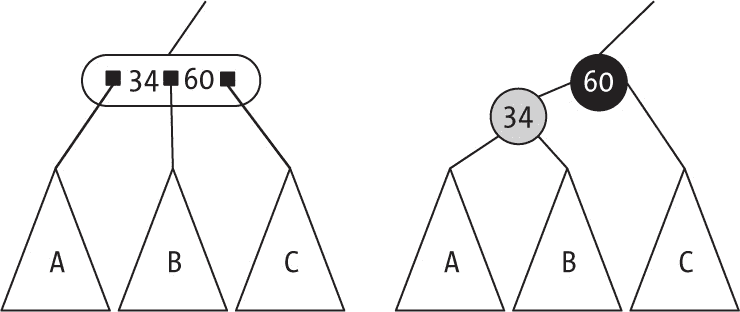

图 13-24：一个红黑节点实际上等效于一个阶数为 3 的 B 树。

标准节点是黑色的，为了区分 2 节点和 3 节点，3 节点会添加额外的红色节点。你也可以说，指向黑色节点的链接是黑色的，而指向红色节点的链接是红色的。

> 注意

*由于本书是黑白印刷，"红色"节点将用灰色表示，黑色文字；"黑色"节点将用黑色表示，白色文字。*

根据表示方式的定义，红色节点总是位于左侧；此外，红色节点不能与另一个红色节点连接（或者说，不能有两个连续的红色链接）。另外，根节点是黑色的，空树（位于底部的叶子）也是黑色的。

现在，让我们把之前处理的 B 树转换成红黑树（见图 13-25）。

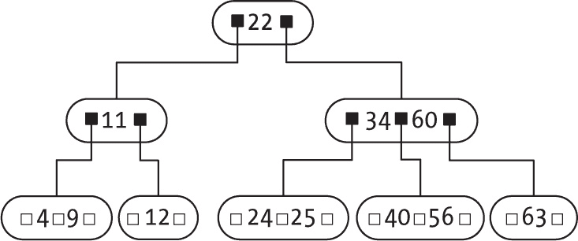

图 13-25：将转换为红黑树的 B 树

所有 2 子节点变为黑色节点，3 子节点则添加一个新的红色节点，如图 13-26 所示。

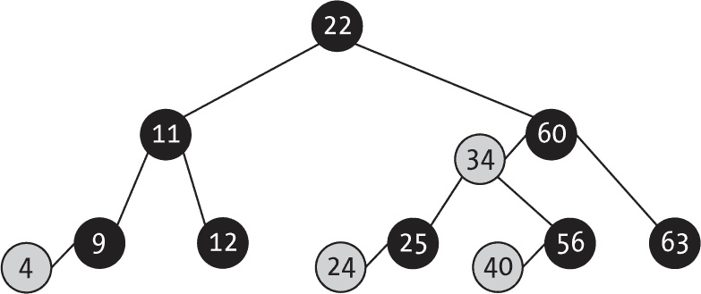

图 13-26：等效的红黑树

现在你拥有的是一棵二叉搜索树，这意味着你可以使用之前的关键字查找逻辑而不需要任何改变，但在添加或删除关键字时需要进行调整。

> 注意

*由于其源自 B 树，红黑树具有另一个重要属性。从根到叶的所有路径具有相同数量的黑色节点，并且最多有相同数量的红色节点。这个属性被称为黑平衡，我们在本书中会经常提到它。*

接下来，我们来看看如何实现这些红黑树，但请记住它们与三阶 B 树的等价性，因为这样算法会更容易理解，实际上它们做的是本章早些时候介绍的相同类型的工作。

#### 表示红黑树

红黑树只是二叉查找树，所以你可以从一些已经有的函数开始，例如 find()方法和其他不需要更改的函数。对于这些新树，你需要定义几个常量和一个用于翻转节点颜色的方法（你将频繁使用这些方法）：

```
const RED = "RED";
const BLACK = "BLACK";
const flip = (color) => (color === RED ? BLACK : RED);
```

现在开始定义新的树：

```
const newRedBlackTree = () => null;

const newNode = (key) => ({
  key,
  left: null,
  right: null,
❶ color: RED
});

❷ const _isBlack = (node) => isEmpty(node) || node.color === BLACK;
❸ const _isRed = (node) => !_isBlack(node);
```

为了表示节点的颜色，添加一个颜色属性❶，新节点是红色的，尽管这个颜色可能会在以后更改为黑色。你还需要添加几个辅助方法来测试节点的颜色❷❸。请注意，你定义了空树是黑色的。

#### 向红黑树添加键

本质上，你只是向之前描述过的 B 树中添加一个键。始终将节点添加为红色，这不会影响树的黑色平衡，但你可以稍后修复它们的颜色或做其他更改。还要注意，根节点始终是黑色的，并且确保满足红黑树的所有性质。

为了实现该算法，你将暂时允许出现右侧红链接或两个连续红链接等问题，但你会使用旋转和颜色变化来修复这些情况，直到完成。只需添加键，稍后再修复问题：

```
❶ const _add = (tree, keyToAdd) => {
  if (isEmpty(tree)) {
    return newNode(keyToAdd);
  } else {
    const side = keyToAdd <= tree.key ? "left" : "right";
    tree[side] = _add(tree[side], keyToAdd);
❷ **return _fixUp(tree);**
  }
};

❸ const add = (tree, keyToAdd) => {
❹ const newRoot = _add(tree, keyToAdd);
❺ newRoot.color = BLACK;
  return newRoot;
};
```

使用辅助方法 _add()❶ 添加键，算法与普通二叉查找树相同，唯一的创新是调用 _fixUp() 函数❷，该函数负责在结构出现问题时恢复树的结构。添加操作本身完成后❸，首先使用 _add() 将新键添加到树中❹，然后确保根节点是黑色的❺。

#### 恢复红黑树结构

如果红黑树结构被损坏，恢复它的诀窍在于 _fixUp() 方法。记住新节点总是红色的。添加新键时的可能情况取决于新键是否最终形成了 2 节点或 3 节点的一部分。

第一个情况很简单：如果新子节点是黑色节点的左子节点，你就把一个 2 节点变成了 3 节点，并且由于红色子节点位于根的左侧，一切都没问题。将此情况称为（a）。否则，如果新子节点位于黑色根节点的右侧，你可以通过旋转来修复它。将此情况称为（b）。图 13-27 展示了这两种情况；N 是新添加的键，R 是 2 节点的原根节点。

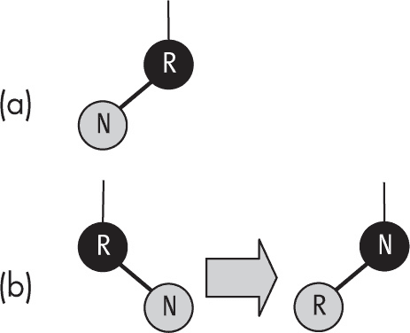

图 13-27：如果将节点添加到右侧，需要进行旋转。

对于情况（a），无需执行任何操作，左旋即可解决情况（b）。在这两种情况下，整个树的黑色平衡没有受到影响。你没有添加任何黑色链接，所以一切仍然正常。同时注意，最初是红色的 N 节点已经变成了黑色。

更复杂的情况发生在你将新键添加到现有的 2-节点（从而创建 3-节点）时，因为在这种情况下，所有的情况都是错误的。修复起来相对最简单的情况是当新键成为 3-节点中的最右边键，如图 13-28 所示。我们将此情况称为 (c)。

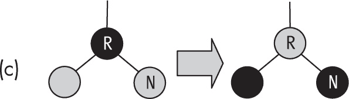

图 13-28：你可以通过翻转颜色来修复将新键添加到 2-节点树中的情况，但它上方可能会出现新的问题。

这里有一个快速的解决方案：只需翻转三个节点的颜色。但是要注意，翻转后会将一个红色链接向上传递，可能需要进一步的递归修复。同时，确保树的黑色平衡保持不变，这样修复就算有效。

接下来复杂度较高的情况是将新键添加到 3-节点中最左侧的左子节点左边。我们将此情况称为 (d)；你需要两步才能解决它，如图 13-29 所示。

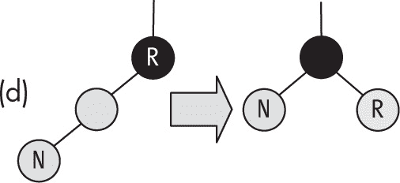

图 13-29：将子节点添加到左子节点的左侧也可以通过旋转来解决。

如果新键是 3-节点中最小的键，你就会有两个连续的左红子节点。首先在根节点做一次右旋转，这样你会得到之前的情况（黑色根节点，两个红色子节点），然后再进行一次颜色翻转来解决问题，尽管你可能还需要更多的递归修复。

最终的情况 (e) 是最复杂的。添加一个新键，这个新键最终成为中间键，位于 3-节点中两个现有键之间，如图 13-30 所示。

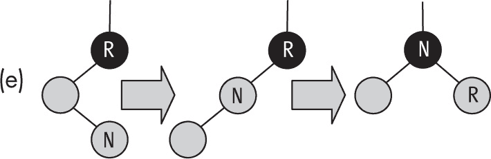

图 13-30：你也可以通过旋转加颜色翻转的方式来修复将子节点添加到左子节点右侧的情况。

在这种情况下，你会得到一个红色节点位于另一个红色节点的右侧，这是不允许的。你可以通过开始左旋转来解决这个问题，这会使你得到一个已经处理过的情况，然后完成右旋转，得到一个你之前见过两次的场景（黑色根节点和两个红色子节点），因此最终的颜色翻转可以解决所有问题。

看一看旋转代码，它与我们在第十二章研究 AVL 树时完全相同，唯一的不同是我们不需要维护高度属性：

```
const _rotate = (tree, side) => {
  const otherSide = side === "left" ? "right" : "left";

  const auxTree = tree[side];
  tree[side] = auxTree[otherSide];
  auxTree[otherSide] = tree;

 **auxTree.color = auxTree[otherSide].color;**
 **auxTree[otherSide].color = RED;**

  return auxTree;
};
```

唯一的新增内容是两条粗体线，它们交换了颜色。

现在我们将深入探讨应用所有已描述修复的更有趣的代码（请注意，我们也将在删除操作中使用这段代码；同样的逻辑适用）：

```
const _fixUp = (tree) => {
❶ if (_isRed(tree.right)) {
    tree = _rotate(tree, "right");
  }

❷ if (_isRed(tree.left) && _isRed(tree.left.left)) {
    tree = _rotate(tree, "left");
  }

❸ if (_isRed(tree.left) && _isRed(tree.right)) {
    _flipColors(tree);
  }

  return tree;
};
```

如果你查看的节点有一个红色的右孩子，进行左旋转❶，这解决了（b）情况，并且是（c）和（e）情况的第一步，当你递归向上时，后续步骤将完成。如果你有一个左红色子节点和一个左红色孙子节点❷，这就是（d）情况；你也可能在（e）情况做完旋转后到达这里。最后，在前面的变更后，要么你已经修复了所有问题——如果你最初处于（a）或（b）情况——要么你仍然需要翻转颜色❸，然后完成。

另一个来自该算法的收获是：左右旋转和颜色翻转都能保持树中的黑色平衡，因此，如果你从一棵红黑树开始，并且只应用这些变换，你最终必定会得到一棵红黑树。这个概念对插入操作很重要，但在删除操作时也会应用。

#### 从红黑树中删除一个键

从红黑树中删除一个键可能是本书讨论的最复杂的算法。（许多教科书和其他资源通常会省略它，或者最多只做简单提示。）虽然添加一个键并不复杂，基本上和常见的二叉搜索树算法一样（加上一些检查约束是否保持的逻辑），但是删除需要一个更复杂的过程，包括树的上下变动。

你需要确保要删除的键位于树的底部，作为一个三节点的一部分（无论是黑色节点还是红色节点），因为在这种情况下，删除它不会导致任何问题。如果要删除的是红色键，直接把它删除即可。如果要删除的是黑色键，将红色键替换到它的位置，但将颜色改为黑色以保持平衡。图 13-31 展示了这两种情况；X 标记了要删除的键。

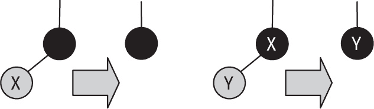

图 13-31：删除一个红色叶子是直接的，而删除黑色根节点也容易实现。

过程是这样的。你可以在向下过程中做旋转或翻转颜色，因此始终保证根节点要么是红色，要么有一个红色的左子节点，并且（暂时）容忍有红色的右子节点或两个红色子节点的黑色节点。当你找到你想要的键时，将其替换为下一个键（如同二叉搜索树），然后继续从树中删除该键。找到时，将会有图 13-31 中所示的两种情况之一适用，你就能有效地删除该键。最后，应用“修复”算法回到根节点，处理可能残留的任何问题。

记住需要遵守的不变式：根节点或其左子节点必须是黑色的。假设在算法的某个时刻，你必须向左移动。显然，如果根节点是黑色的，你只需向左移动（左子节点是红色的）。不变式将得以保持，现在根节点将变为红色。然而，如果左子节点是黑色的，那么有两种情况，取决于根节点右子节点的左子节点的颜色。如果那个子节点是黑色的，你可以直接翻转颜色，正如图 13-32 所示（为简化起见，它没有包括其他链接或子树，因此你可以专注于重要的节点）。小三角形指向新的红色节点，你将其向左移动以更新不变式。


图 13-32：颜色翻转调整了这个情况。

就等效的红黑树而言，这就像将节点合并创建一个 4-节点，稍后你将需要将其分割。

如果根节点右子节点的左子节点是红色的，你将需要更多的步骤：翻转颜色、右旋、左旋，再翻转颜色。但经过这些变换（所有这些都保持黑色平衡）后，你就可以向左移动：根节点左子节点的左子节点将是红色的，并且不变式得到保持。图 13-33 显示了所有步骤。

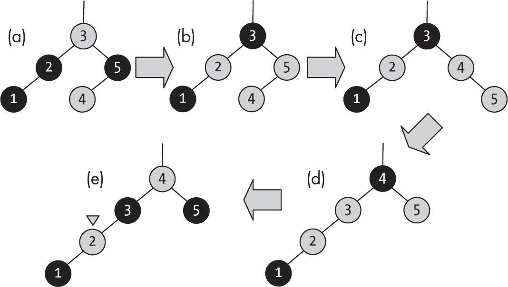

图 13-33：最复杂的情况需要多个旋转和颜色翻转。

初始树是（a）；（b）是翻转后的树；（c）是旋转根节点右子节点的左子节点到右边后的结果；（d）是将根节点旋转到左边后的结果；最后，(e)是翻转颜色后的结果。

考虑等效的 2-3 树，这次删除操作就像从一个 3-节点借用 4 键，并将 3 键下移，和 2 键一起创建一个 3-节点。如前所述，你在保持黑色平衡，稍后不会有需要修复的情况。

现在考虑另一种情况，即你想要向右移动。这个情况与之前的类似，但稍微简单一些。如果根节点是黑色的，且右子节点是红色的，那么直接向右移动即可。如果根节点是红色的，且其左子节点是黑色的，并且根节点左子节点的左子节点也是黑色的，你可以直接翻转颜色。看看图 13-34 中展示的情况。

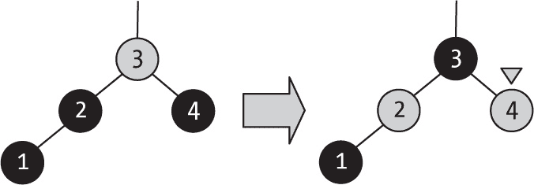

图 13-34：颜色翻转也修复了潜在的 4-节点树。

如前所述，这个解决方案相当于将节点合并并创建一个 4-节点树，稍后需要修复。

最后一种情况发生在你需要向右移动，而根节点左子节点的左子节点是红色时。你需要翻转颜色，进行旋转，然后再翻转颜色以恢复不变式，正如图 13-35 所示。

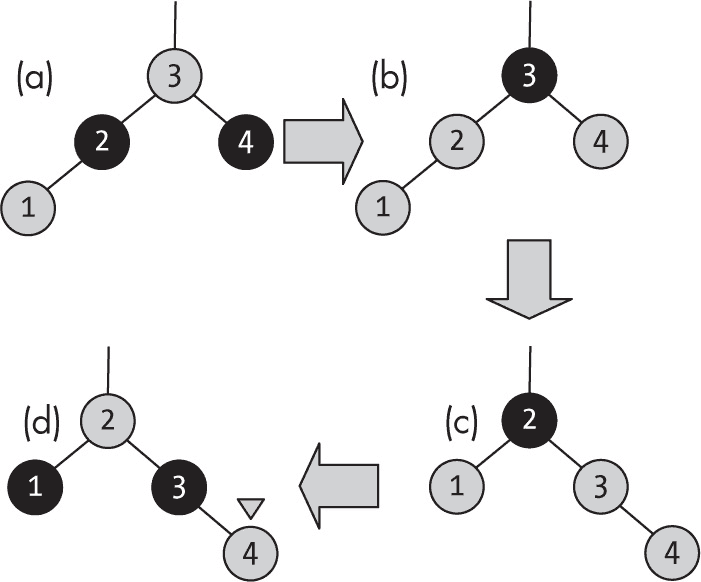

图 13-35：这个复杂的情况也需要同时进行颜色翻转和旋转。

在这个场景中，(a) 是初始情况，(b) 显示了翻转后的颜色，(c) 是将根节点右旋后，(d) 是再次翻转颜色后的状态。

再次以原始的 2-3 树为例，这个例子就像是将 2 键从 3 节点中移动到 3 键的位置，之后 4 键与其合并成一个 3 节点。然而，注意最终的情况是不合法的（右侧有一个红色子节点），因此稍后需要修复。

完整的算法直接基于 Sedgewick 自己的代码，但错误请归咎于我。简单部分如下：

```
const remove = (tree, keyToRemove) => {
❶ const newRoot = _remove(tree, keyToRemove);
  if (!isEmpty(newRoot)) {
  ❷ newRoot.color = BLACK;
  }
  return newRoot;
};
```

首先应用描述的算法，实际从树中移除键 ❶，然后确保根节点是黑色的 ❷，除非显然没有键，且树变为空。

删除操作的复杂部分是 _remove() 代码：

```
const _remove = (tree, keyToRemove) => {
  if (isEmpty(tree)) {
    return null;
❶} else if (keyToRemove < tree.key) {
  ❷ if (_isBlack(tree.left) && _isBlack(tree.left.left)) {
      _flipColors(tree);
      if (_isRed(tree.right.left)) {
        tree.right = _rotate(tree.right, "left");
        tree = _rotate(tree, "right");
        _flipColors(tree);
      }
    }
 ❸ tree.left = _remove(tree.left, keyToRemove);
❹} else {
    if (_isRed(tree.left)) {
      tree = _rotate(tree, "left");
    }
  ❺ if (keyToRemove === tree.key && isEmpty(tree.right)) {
      return null;
    } else {
    ❻ if (_isBlack(tree.right) && _isBlack(tree.right.left)) {
        _flipColors(tree);
        if (_isRed(tree.left.left)) {
          tree = _rotate(tree, "left");
          _flipColors(tree);
        }
      }
      if (keyToRemove === tree.key) {
      ❼ tree.key = minKey(tree.right);
        tree.right = _remove(tree.right, tree.key);
      } else {
      ❽ tree.right = _remove(tree.right, keyToRemove);
      }
    }
  }
❾ return _fixUp(tree);
};
```

在验证树不为空后，检查是否需要向左移动 ❶，如果需要 ❷，你可能需要先应用之前看到的变换，再实际向左移动 ❸。如果要删除的键大于或等于根节点，首先进行一次旋转 ❹，这样红色节点将移至右侧，稍后会用到。如果找到键 ❺ 并且它没有右子节点，那它一定在树的底部，此时可以删除它。你会想向右移动，因此按之前描述的程序设置好 ❻，但不要立刻移动。如果找到了键，但无法删除，替换成树中的下一个键并向右移动删除该值 ❼；否则，直接向右移动继续寻找要删除的键 ❽。最后，一次最终的修复 ❾ 将解决树中的任何错误配置。

红黑树在搜索方面的代码最简洁，而添加新键的代码也不复杂（基本上，只是在最后添加一个修复调用），但是删除操作则相对复杂。正确编写代码是很困难的（见问题 13.10 中的小细节）。

#### 考虑红黑树的性能

我们不需要分析红黑树的性能，因为它们只是 B 树的另一种情况，因此你已经知道所有算法（添加、删除、搜索）都是 *O*(log *n*)，如表 13-2 所示。

表 13-2：红黑树操作的性能

| 操作 | 性能 |
| --- | --- |
| 创建 | O(1) |
| 添加 | O(log n) |
| 移除 | O(log n) |
| 查找 | O(log n) |
| 遍历 | O(n) |

当然，由于可能嵌入的红色链接，红黑树的高度通常比高阶 B 树要高（并且并非从根到叶的所有路径长度都相同），但这并不改变结果。即使搜索速度变慢了一个（有界的）常数因子，性能仍然是对数级的。

### 总结

在本章中，我们超越了二叉树，探索了字典抽象数据类型（ADT）的两种新结构：B 树和红黑树（红黑树是从 B 树衍生出来的）。这些结构提供了良好的性能，且因其实现不复杂且速度显著，常被使用。

在下一章中，我们将学习堆，它是二叉树的一种变体，随后在接下来的章节中，我们将学习扩展堆，它结合了堆和森林，以实现高性能。

### 问题

**13.1  缺失的测试？**

在树的 appendChild()方法中，是否应该包括对 this._throwIfEmpty()的调用？

**13.2  遍历一般树**

实现缺失的前序和后序遍历。你可能需要对使用子节点数组表示的树和使用“左子节点，右兄弟”表示的树都进行实现。

**13.3  非递归访问**

实现一个不使用递归的深度优先遍历树的算法，通过使用栈作为辅助结构。

**13.4  树的相等性**

实现一个 equals(tree1, tree2)算法，用来判断两棵树是否相等——即，它们具有相同的形状和相同位置的键值。你可能需要“跳出框框”思考。也许你甚至不需要递归！

**13.5  衡量树**

重新实现第十二章中的 calcSize()和 calcHeight()函数（参见问题 12.5 和 12.6），使其适用于多路树。

**13.6  更多共享**

在 B 树中，除了兄弟节点共享一个键之外，如果它们共享更多的键，则可以实现更好的平衡。例如，在添加键时，如果一个节点变得过于拥挤，而一个兄弟节点有足够的空间，那么与其仅传递一个键，不如尽量传递更多的键，直到两个兄弟节点的容量差不多。删除键时，类似的过程也适用。实现这一优化。

**13.7  更快的节点查找**

本章使用了节点的线性查找，但由于键值是有序的，使用二分查找会更好。进行这个更改。这样会对 B 树的方法顺序产生影响吗？为什么或为什么不？

**13.8  最低阶**

阶数为 2 的 B 树是否有意义？

**13.9  多阶树**

如果需要处理不同阶数的 B 树，你会怎么做？提示：这里的问题是导入的模块是单例模式。尝试寻找一种方法来避免这种行为。

**13.10  安全删除？**

在红黑树的 remove()算法中，当你实际删除一个节点时，是否确定能够在不产生负面影响的情况下将其删除？
