## 第十四章：14 堆


在上一章，我们处理了二叉树，本章我们将继续使用二叉树，不过这次使用的是一种不需要动态内存的变体：堆。堆允许我们轻松实现一个新的抽象数据类型（ADT）、一个高效的排序方法，并为二叉搜索树的增强版本提供新的结构。我们将考虑实现堆（特别是二叉最大堆，但也包括其他类型），并探讨堆在优先队列、堆排序和另一种叫做 treaps*的新结构中的应用。

在下一章，我们将介绍另一种堆的表示方法，它使用动态内存，并且为一些新操作提供了更多的自由度和更好的性能。

### 二叉堆

*二叉堆*，通常简称为*堆*，是一种具有两个特定属性的二叉树：一个*结构属性*，决定了树的形状；一个*堆属性*，指定了父节点与子节点键值之间的关系。

#### 结构属性

堆是二叉树的一个子集，结构属性要求树必须是完全树，且最后一层的所有叶子节点必须位于左侧。请看图 14-1 中的树。只有一个符合堆的条件，而其他两个不符合。你能分辨出哪个是哪个吗？

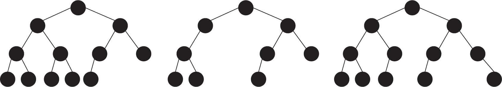

图 14-1：在这三种堆候选中，哪一个是正确的？

图 14-1 中左边的树是唯一的堆。中间的树有一个不完整的中间层，而右边的树则底部的子节点不全在左侧。

根据这个规则，你可以在一个普通的数组中存储堆，而无需动态内存或指针，从而简化实现。（参见问题 14.18，考虑另一种替代方案。）将根节点放在数组的第一个位置，然后依次放置第二层节点（从左到右）、第三层节点（也是从左到右），以此类推。图 14-2 展示了一个示例的数组布局。节点中的数字对应于数组中的索引。

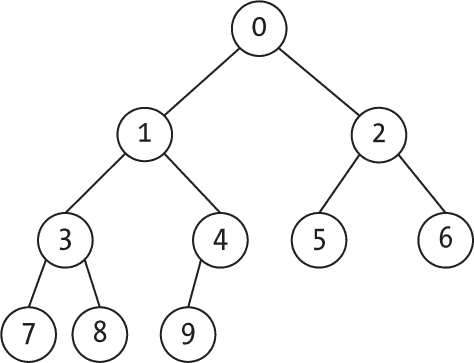

图 14-2：将堆的节点存储在数组中

在这种表示法中，堆的根节点总是位于位置 0。位置为 p 的节点的左右子节点分别位于连续的相邻位置 2*p+1 和 2*p+2，除非它们超出了堆的末尾，此时该节点的子节点会较少。非根节点位置 p 的父节点位于 Math.floor((p-1)/2) 位置。

你可以通过几个示例验证这些规则。根节点（在位置 0）的子节点位于位置 2*0 + 1=1 和 2*0 + 2=2。节点 4 有一个子节点，位于位置 2*4 + 1=9，因为另一个子节点会超出堆的大小。节点 9 的父节点位于位置 Math.floor((9-1)/2)=4。节点 2 的父节点位于位置 Math.floor((2-1)/2)=1。

这些规则让你能够实现算法而无需任何指针；一个简单的数组就足够了。与第十二章中的完全树一样，如果堆最多有*n* = 2*^h*^(–1)个节点，则它的高度将是*h*，因此它的高度受限于 log *n*，这是在顺序计算中会出现的一个结果。

#### 堆属性

堆的第二个属性很简单：节点的键值必须大于或等于其子节点的键值。这与二叉搜索树有重要的区别：在堆中，左右子节点没有区别（任意一个可能大于另一个），但它们的键值都会小于或等于其父节点。任何同时遵循结构属性和堆属性的树被称为*二叉最大堆*，或者更简单地，称为*堆*。

> 注意

*为什么我说堆默认表示“最大堆”？歌曲《New York, New York》也许能给我们一些线索：弗兰克·辛纳特拉描述了想成为“山丘之王”或“堆顶之王”。这表明堆的根节点（顶部）应该是最大的值，不是吗？*

你可以反转条件，指定父节点的键值要小于或等于其子节点的键值，这意味着根节点将是堆的最小值。这个变体称为*最小堆*，你可以在（其他场景中）使用它来合并多个链表，这需要反复找到许多元素中的最小值（见第 14.5 题）。图 14-3 中显示的堆同时满足结构和堆的属性。

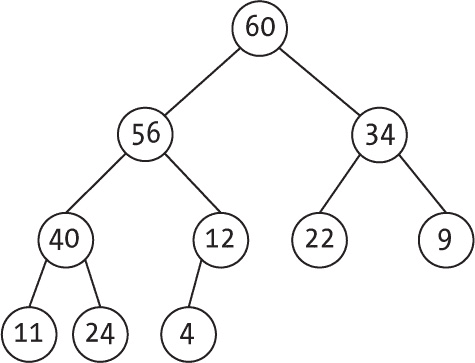

图 14-3：有效的堆

如前所述，这棵树也可以通过数组来表示，其中 60（根节点）位于数组的第 0 个位置，如图 14-4 所示。

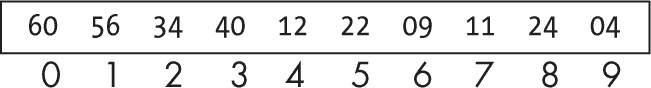

图 14-4：与图 14-3 相同的堆，以数组形式存储

堆属性有一个直接的结果：堆中的最大值必然位于根节点；你能看出为什么吗？你会在堆中的哪里找到第二大值？第三大值？第四大值？（见第 14.13 题。）这个结果对于我们稍后在本章中学习的一种排序算法*堆排序*至关重要。

#### 堆实现

为了实现堆，你只需要一个简单的数组。堆是一种数据结构，具有一些操作，如表 14-1 所示。

表 14-1：堆的操作

| 操作 | 签名 | 描述 |
| --- | --- | --- |
| 创建 | → H | 创建一个新的堆。 |
| 是否为空？ | H → boolean | 确定堆是否为空。 |
| Top | H → key | 给定一个堆，返回它的顶部值。 |
| Add | H × key → H | 给定一个新值，将其添加到堆中。 |
| Remove | H → H × key | 给定一个堆，提取其顶部值并相应更新结构。 |

你将为这些操作实现的函数是：

**newHeap() **创建一个新的堆

**isEmpty(heap) **判断堆是否为空

**top(heap) **获取堆顶（最大）元素的值

**add(heap, value) **将新元素添加到堆中

**remove(heap) **移除堆顶元素

前三个函数非常简短：

```
❶ const newHeap = () => [];

❷ const isEmpty = (heap) => heap.length === 0;

❸ const top = (heap) => {
  if (isEmpty(heap)) {
    return undefined;
  } else {
    return heap[0];
  }
};
```

创建一个新的空堆与返回一个空数组相同❶。堆的大小是 heap.length，因此检查其是否为 0 可以判断堆是否为空❷。另外，堆的顶部（除非堆为空，此时该代码返回 undefined）位于数组的第一个位置❸，所以实现细节非常直接。

##### 向堆中添加元素

向堆中添加新值的步骤如下：

1. 将新值添加到数组的末尾。

2. 如果值大于其父节点，反复交换位置。

3. 当值小于父节点或者到达堆顶时，停止。

让我们看看这个是如何工作的。首先看一下图 14-5 中显示的堆。

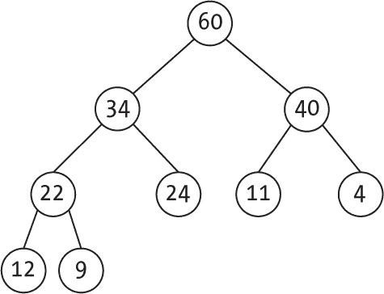

图 14-5：初始堆，在添加新值之前

如果你想插入一个新的值 56，第一步是将它添加到堆的末尾，这样你就会得到图 14-6 所示的结果。

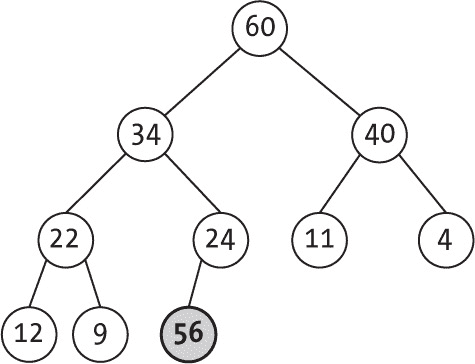

图 14-6：新值（56）从堆的末尾开始。

让我们看看新值是否需要上浮。比较 56 与其父节点（24）后，发现它们需要交换，结果是得到一个新的堆配置（见图 14-7）。

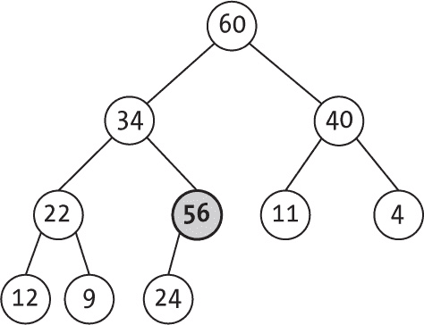

图 14-7：如果新值大于父节点，它必须“上浮”。

上浮后，继续递归检查，如果需要，继续向上移动（见图 14-8）。

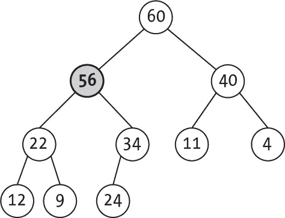

图 14-8：上浮继续，直到添加的值不大于其父节点或位于堆的根部。

最后一步导致了插入值不大于其父节点的情况，因此算法停止。

我们的 add()版本简洁明了：

```
const add = (heap, keyToAdd) => {
❶ heap.push(keyToAdd);
❷ _bubbleUp(heap, heap.length – 1);
  return heap;
};
```

如前所述，新的值被添加到堆的末尾❶，并通过使用 _bubbleUp()辅助函数强制它上浮到最终位置❷。

如前所述，递归实现是最简单的。如果元素已经上浮，使用 _bubbleUp()递归应用以保持其上浮：

```
const _bubbleUp = (heap, i) => {
❶ if (i > 0) {
  ❷ const p = Math.floor((i - 1) / 2);
  ❸ if (heap[i] > heap[p]) {
    ❹ [heap[p], heap[i]] = [heap[i], heap[p]];
 ❺ _bubbleUp(heap, p);
    }
  }
};
```

如果元素尚未位于堆顶❶，则使用数学方法（如“结构属性”第 318 页所示）确定位置 i 的父节点 p❷。如果需要交换元素❸，使用解构赋值非常方便❹，并且可以通过递归继续上浮（如果需要）❺。

##### 从堆中移除

接下来，你需要 `remove()` 方法。记住，整个堆必须变小一个元素，所以移除堆顶后会发生什么呢？如果堆为空，就没有东西可移除；抛出异常，然后完成。如果堆不为空，取出堆中的最后一个元素，放到堆顶，然后将堆的大小减去一。如果该元素没有子节点，就停止。如果该元素大于其子节点中的最大值，也停止。否则，将该元素与它的最大子节点交换，并继续将它向下移动。

下面是一个示例，展示了这个过程是如何工作的。请从图 14-9 中的堆开始。

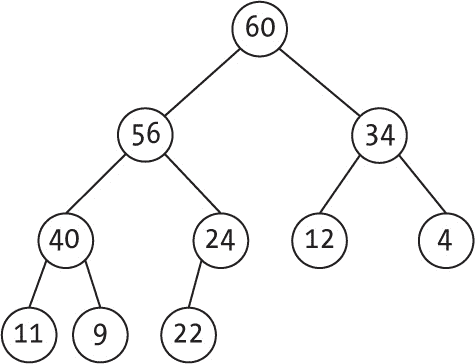

图 14-9：移除堆顶之前的初始堆

第一步是移除堆顶的值（60），用堆中的最后一个值（22）替换它，然后将堆的大小减去一，这样就得到了图 14-10 所示的情况。需要向下移动的值已被高亮显示。

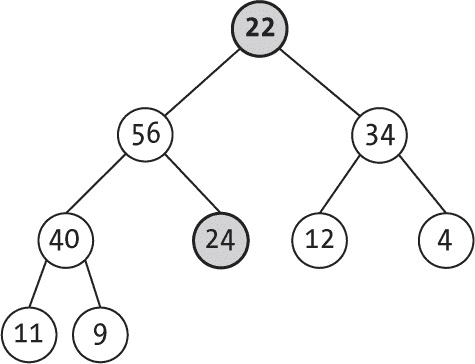

图 14-10：移除堆顶后，将其替换为堆中的最后一个元素（22）。

现在开始向下筛选。将 22 与它的子节点进行比较，需要与 56 交换，这样就得到了图 14-11 所示的新情况。

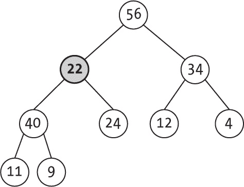

图 14-11：如果新的堆顶不大于其子节点，它必须“下沉”。

递归地将 22 与它的新子节点进行比较，结果它仍然需要向下筛选，如图 14-12 所示。


图 14-12：向下筛选一直进行，直到该值大于其子节点或达到叶节点为止。

在这种情况下，22 现在大于它的子节点，因此向下筛选过程结束。如果值 40 变成了 20，22 将与 24 交换，并且向下筛选过程也会结束，因为 22 将没有子节点。

请看以下代码，它使用递归的 `_sinkDown()` 辅助函数将一个值推向堆的下方：

```
const _sinkDown = (heap, i, h) => {
❶ const l = 2 * i + 1;
❷ const r = l + 1;
❸ let g = i;
  if (l < h && heap[l] > heap[g]) {
    g = l;
  }
  if (r < h && heap[r] > heap[g]) {
    g = r;
  }
  if (g !== i) {
  ❹ [heap[g], heap[i]] = [heap[i], heap[g]];
  ❺ _sinkDown(heap, g, h);
  }
};
```

计算 l 和 r，分别为父节点 i 的左子节点和右子节点；你可以使用之前在“结构属性”章节第 318 页❶讨论的公式，通过添加 1 ❷来找到 r，因为在数组中 r 紧跟 l。使用 g 来确定位置 i、l 和 r 中的最大值 ❸。如果 i 位置的值不大于其子节点，交换它 ❹，并递归地继续向下筛选 ❺。

到这个阶段，你终于可以编写 `remove()` 函数了：

```
const remove = (heap) => {
❶ const topKey = top(heap);
❷ if (!isEmpty(heap)) {
  ❸ heap[0] = heap[heap.length – 1];
  ❹ heap.length--;
  ❺ _sinkDown(heap, 0, heap.length);
  }
❻ return [heap, topKey];
};
```

这段代码紧跟着前面示例中的描述。当你获取堆顶（如果堆为空，则可能是未定义的）❶，如果堆不为空❷，将最后一个值放到堆顶❸，将堆的长度减去一❹，并将新的堆顶向下筛选❺。最后，返回堆顶值和更新后的堆❻。

##### 考虑堆的性能

表 14-2 展示了刚刚探讨过的算法的性能。

表 14-2：堆操作的性能

| 操作 | 性能 |
| --- | --- |
| 创建 | O(1) |
| 是否为空？ | O(1) |
| 顶部 | O(1) |
| 添加 | O(log n) |
| 删除 | O(log n) |

三个操作是常数时间的：创建堆、测试是否为空和获取顶部值。其他两个操作，添加和删除，则更为复杂。添加元素可能会使其从堆底部向上冒泡，直到顶部。由于堆的高度是 log *n*，因此此操作需要对数时间。类似地，删除元素意味着将新元素放到顶部，并可能将其下沉到底部。这个过程的操作数量与添加元素时相同，只是顺序相反（同样是对数时间）。

让我们继续考虑一个新的 ADT，并比较堆与之前讨论过的其他数据结构的性能。 ### 优先队列与堆

*优先队列（PQs）* 与第十章中讨论的队列不同，因为每个元素都有一个关联的优先级，决定了哪个元素会被首先移除。在优先队列中，第一个被移除的元素是具有最高优先级的元素，而不是最早添加的元素（这与先进先出 FIFO 策略不同）。

> 注意

*英语语言存在问题！术语* priority one *意味着最高优先级，但 1 是最低优先级数字。如果你按优先级顺序排序任务，最低编号的任务应该最先处理，那么较低的数字具有较高的优先级。然而，一些工具（例如 Microsoft Project）假定 0 是最低优先级，较高的数字具有较高优先级，因此没有明确的规定。不管怎样，如果你需要最小堆而非最大堆，参见问题 14.4。*

优先队列（PQs）在多个算法和不同的场景中都有应用。操作系统调度器通过优先级来选择下一个执行的进程。离散事件模拟根据时间戳决定下一步的操作（在这种情况下，较小的时间戳表示较高的优先级）。Dijkstra 最短路径算法（我们将在第十七章中讨论）需要找到与另一个给定顶点的最短距离的顶点。Prim 算法用于查找图的最小生成树，也需要找到与另一个顶点连接最小（最便宜）的顶点。霍夫曼编码算法构建树并反复需要找到两个概率最小的节点，用它们的概率之和替换为一个新节点。所有这些操作都需要优先队列（PQs）。

从抽象数据类型（ADT）角度来看，优先队列的描述需要以下操作，参见表 14-3（其他增加更多操作的版本将在后面讨论）。

表 14-3：优先队列的操作

| 操作 | 签名 | 描述 |
| --- | --- | --- |
| 创建 | → 优先队列 | 创建一个新的优先队列。 |
| 空吗？ | PQ → boolean | 判断一个优先队列（PQ）是否为空。 |
| 顶部 | PQ → key | 给定一个优先队列（PQ），返回其顶部元素。 |
| 添加 | PQ × key → PQ | 给定一个新键，将其添加到一个优先队列（PQ）中。 |
| 移除 | PQ → PQ × key | 给定一个优先队列（PQ），提取其顶部元素并相应地更新优先队列。 |

就提供的操作而言，堆符合优先队列（PQ）的要求，因此实现起来很简单。然而，为了多样性，看看其他一些简单的优先队列实现方式，并比较它们的性能：

+   使用无序数组或列表时，获取顶部元素的时间复杂度是 *O*(*n*)。移除它的时间复杂度也是 *O*(*n*)，因为你需要遍历所有元素来找到它，添加新元素的时间复杂度则是 *O*(1)。

+   使用有序数组（最大值位于最后一个位置）时，获取和移除顶部元素的时间复杂度是 *O*(1)，但添加新元素的时间复杂度是 *O*(*n*)；在找到元素的位置后，使用二分查找的时间复杂度是 *O*(log *n*)，你还需要物理移动元素以腾出空间，这就是 *O*(*n*)。

+   使用有序列表（最大值位于第一个位置）时，结果与使用有序数组时相同。

+   使用平衡的二叉搜索树时，三种操作的时间复杂度都是 *O*(log *n*)。如果你有一个指向最大值的额外指针，获取顶部元素的时间复杂度变为 *O*(1)，但插入和删除操作会稍微变慢，因为它们需要维护该额外指针。

这个优先队列实现方式的列表并不完整，但足以展示堆是实现优先队列的最佳方式之一，且由于其低复杂度，获得额外的优点。在接下来的章节中，我们将考虑一些额外的操作，这些操作可能需要其他优先队列的实现方式。

### 堆排序

堆可以用来创建一个表现良好的排序方法。给定一组值，使用堆可以轻松找到集合中的最大值。移除最大值并恢复堆后，你可以找到第二大值，依此类推。基本的算法结构如下：

1. 将待排序的值构建成一个堆。

2. 然后，直到没有更多元素，交换堆的顶部元素和最后一个元素，堆的大小减一，并恢复堆的性质。

看看这个算法是如何工作的，然后考虑一些优化。

#### 威廉姆斯的原始堆排序

首先，这是 1964 年由约翰·W·J·威廉姆斯发明的堆排序算法的示例实现。你可以重用之前的 _bubbleUp() 和 _sinkDown() 函数（因此我不会在这里列出它们），新增的部分仅包括以下内容：

```
function heapsort_original(v) {
❶ for (let i = 1; i < v.length; i++) {
    _bubbleUp(v, i);
  }

❷ for (let i = v.length - 1; i > 0; i--) {
  ❸ [v[i], v[0]] = [v[0], v[i]];
  ❹ _sinkDown(v, 0, i);
  }

  return v;
}
```

堆排序的第一阶段从数组的开始到结束，将每个元素“冒泡”到正确的位置 ❶。第二阶段 ❷ 将堆的顶部元素与（当前）堆的最后一个元素交换 ❸，并使用 _sinkDown() 的第二个参数限制它可以下沉的深度 ❹。

下面是算法的执行过程。构建阶段按照图 14-13 所示的步骤进行。高亮区域对应正在构建的堆，其他部分是尚未添加到堆中的值。

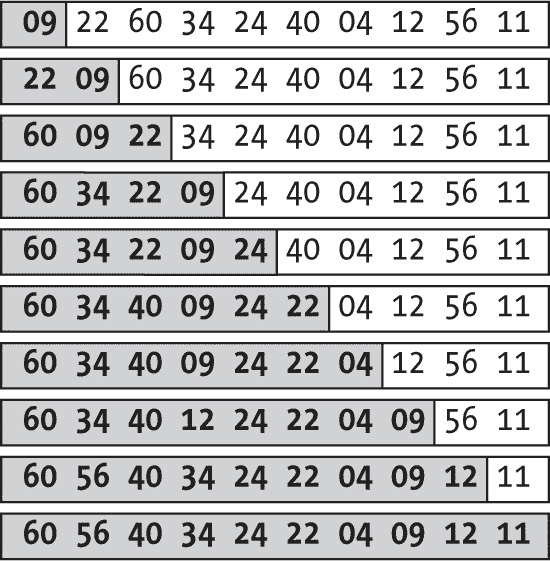

图 14-13：堆排序的第一阶段是逐个构建堆（高亮区域）。

在算法的每一步中，一个新的值被添加到堆中，并根据需要上浮，直到堆中元素的数量增加了一。构建阶段完成后，算法的第二部分开始。堆顶元素与堆的最后一个值交换，堆的大小减一，新的堆顶元素下沉以恢复堆的性质，详见图 14-14。

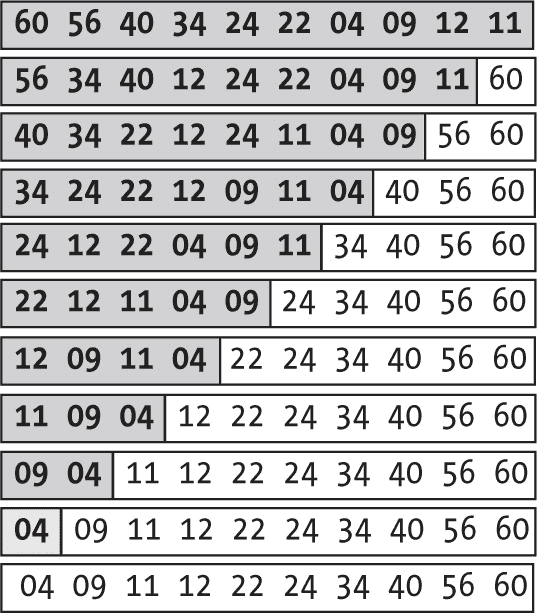

图 14-14：堆排序的第二阶段是不断移除堆顶元素，以构建有序数组。

在第一步中，堆顶值（60）与堆的最后一个值（11）交换。11 下沉，56 上浮到堆顶。在接下来的步骤中，56 与最后一个值（再次是 11）交换，11 下沉，40 上浮到堆顶。这个过程一步步进行，当堆的大小为 1 时，数组就已排序。

#### 堆排序分析

堆排序的时间复杂度是多少？不深入数学细节，如果你要排序*n*个元素，你需要调用 _bubbleUp()函数*n*次，每次一个元素可能会浮到堆顶，而堆的高度是 log *n*，因此时间复杂度为*O*(*n* log *n*)。类似地，在从堆中移除元素以产生有序数组时，需要调用 _sinkDown() *n*次，元素可能会下沉到底部，因此也是*O*(*n* log *n*)；最终得出的结论是该算法的时间复杂度是*O*(*n* log *n*)。

一个有趣的特性是，这种行为是有保障的。没有任何数据集会导致像快速排序那样的最坏情况（快速排序可能会变成*O*(*n*^²)）。此外，由于我们已经确定*O*(*n* log *n*)是基于比较的排序算法中最优的时间复杂度，因此可以看出，堆排序是一种稳定的算法，具有一致的性能，通常用于库函数和其他可能需要排序的算法中。

最后，堆排序并不是第六章中所示意义上的稳定排序（具体例子见问题 14.12）。

#### Floyd 的堆构建优化

Williams 版的算法非常高效，但借助 Robert Floyd 的改进，堆构建部分的时间复杂度被优化为 O(*n*)，尽管我们这里不会深入探讨数学原理。这个结果的原因在于大多数元素都在底部，因此将它们下沉比将它们上浮要快得多。很少有元素接近顶部，那里的下沉速度比上浮慢，这些因素足以改变堆构建的顺序。由于过程的第二部分仍然是*O*(*n* log *n*），算法的总时间复杂度不会改变，但无论如何，它会运行得更快。

这个算法不是让每个元素上浮到它的位置，而是构建小的堆，然后通过将它们合并成更大的堆，直到最终得到完整的堆。最初，你可以将树的所有叶子视为大小为 1 的小堆。然后，取两颗叶子和它们的父节点，并重新组织它们（如果需要的话），使这三个值形成一个堆。不断重复这一过程，最终你会到达堆的顶部并完成堆的构建。

首先查看代码，然后再看一个示例。这种新的堆排序版本的代码将依赖于之前的 _sinkDown()_ 代码，后者将保持不变。其余部分的算法如下：

```
function heapsort_enhanced(v) {
 **for (let i = Math.floor((v.length - 1) / 2); i >= 0; i--) {**
 **_sinkDown(v, i, v.length);**
 **}**

 for (let i = v.length - 1; i > 0; i--) {
    [v[i], v[0]] = [v[0], v[i]];
    _sinkDown(v, 0, i);
  }
  return v;
}
```

算法第二部分（交换和重构）的代码是相同的；唯一的区别在于你是通过 _sinkDown()_ 来构建堆的。图 14-15 展示了这段代码的堆构建部分，具体来说，就是数组的更多部分如何逐步成为堆。在每一步中，成为“迷你堆”的数组部分都会被突出显示。

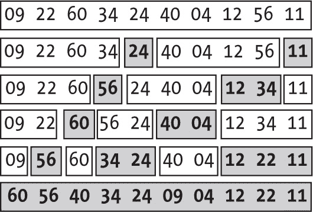

图 14-15：增强版的堆构建算法通过较小的堆逐步构建出完整的堆。

为了更好地理解图 14-15，请查看不同阶段的堆。最初，数组看起来像图 14-16，显然还不是堆。

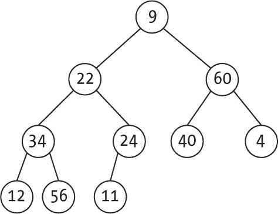

图 14-16：一个初始数组，未满足堆的性质

经过两步，构建了来自 11 和 24 的子堆（这两个保持不变），以及 12、34 和 56（其中 34 下沉，56 替代了它的位置）。

图 14-17 展示了另外两步。

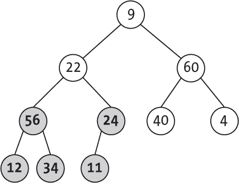

图 14-17：经过几次旋转，构建了几个子堆。

堆几乎完成，根节点为 56（22 的值下沉，56 取代了它的位置），另一个根为 60（无需任何变化）。你只差一步就可以完成，如图 14-18 所示。

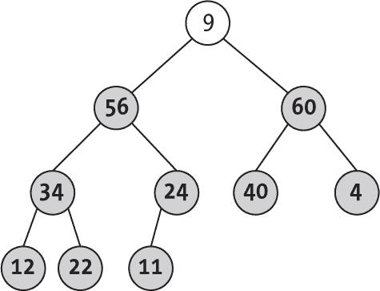

图 14-18：越来越多的子堆被构建出来，逐渐达到顶部。

最后一步完成堆的构建；9 的值下沉到它的位置，被 60 替代。图 14-19 展示了完成后的堆。

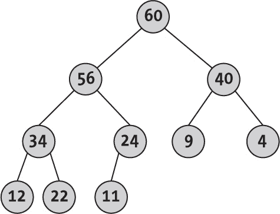

图 14-19：到达顶部时，数组已变成堆。

Floyd 的增强算法有两个优点：第一阶段更快（第二阶段生成排序结果相同），并且代码更简短。你可以利用这种方法改进堆逻辑并修改 newHeap()函数（见问题 14.8）。 ### Treaps

在第十二章，我们讨论了二叉搜索树及几种保持其平衡以避免搜索缓慢的方法。在 1989 年，发明了一种新结构，混合了树和堆的特性：treaps。这些树是平衡的，尽管它们的高度不一定是*O*(log *n*)；相反，随机化和堆属性被用来以较高的概率保持平衡。

*Treap*（发明的术语）是*tree*和*heap*两个词的混合词。这种混合是怎么来的呢？基本上，每个键都关联一个随机优先级，当你构建二叉搜索树时，需要确保满足堆属性，因此父节点的优先级总是大于其子节点的优先级。（这种结构属性不一定满足；节点是通过指针链接的，而不是数组。）注意，除了使用随机数生成器外，你还可以对键应用哈希函数，从而生成其“随机”优先级。对 treaps 的数学分析依赖于真正的随机数，但哈希生成的随机性也有效。在测试算法方面，哈希具有确定性的优势。

让我们再深入思考一下。如果你恰好按照优先级排序键并按优先级递减的顺序插入树中，生成的树将满足堆属性。（你能看出为什么吗？）这意味着分配随机优先级等同于在插入树之前对键进行随机排列，这将以概率的方式为生成的树提供良好的形状，期望高度为*O*(log *n*)，与平衡树相同。

给定一组不同的键及其对应的（也是不同的）优先级，生成的 treap 是唯一的，我们可以为此构造递归证明。首先，treap 的根节点必须是优先级最高的键。然后，所有较小的键将进入根节点的左子树，较大的键将进入右子树，我们可以递归地应用相同的推理来证明这两个子树也是唯一的。

你也可以修改第十二章中的二叉搜索树算法来创建 treaps。与 AVL 树或红黑树的代码相比，这种代码更简洁，但却能提供竞争力的性能，通常优于那些更复杂的替代方案。

#### 创建与搜索 Treap

既然 treaps 本质上只是二叉搜索树，那么在第十二章中讨论的大多数代码仍然适用。开始编写 treaps 的代码如下：

```
const {
  find,
  inOrder,
  isEmpty,
  maxKey,
  minKey,
  postOrder,
  preOrder
❶} = require("../binary_trees/binary_search_tree.func.js");

const newTreap = () => null;

const newNode = (key) => ({
  key,
  left: null,
  right: null,
❷ **priority: Math.random()**
});
```

Treap 基于之前的二叉搜索树 ❶，并且许多在那里的函数依然有效。在创建新节点时，添加一个随机的优先级 ❷，但这里的变化就只有这些。

> 注意

*如果你想测试你的代码并且需要确定性的结果，可以将优先级计算为键的哈希值；只要结果足够随机，这样做就行。*

接下来我们要进行的是添加一个新键，这需要一些额外的编码。

#### 向 Treap 中添加键

向 treap 中插入节点基本上与二叉搜索树插入的逻辑相同，唯一的区别是在将节点插入到适当位置后，可能需要进行旋转以保持堆的性质。向 treap 中添加新键可以通过前面章节介绍的 _rotate() 方法来完成。基本思路是首先根据值将新节点插入到树中，然后根据需要进行旋转，既保持二叉搜索树条件，又满足堆条件。图 14-20 展示了基本的旋转操作。

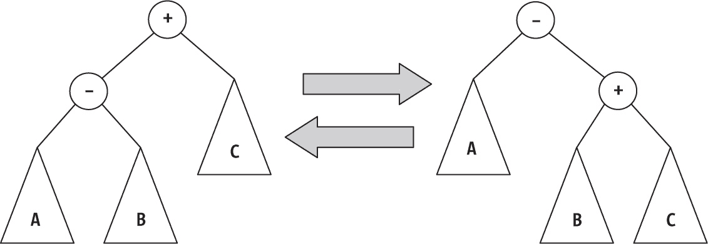

图 14-20：旋转操作也使得二叉搜索树变成了堆。

减号表示比加号对应的键值更小。如果放置在下方的节点（减号）比其父节点（加号）优先级更高，如图左侧所示，可以执行 *右旋转* 操作，从而得到图右侧的情况，这样就满足了堆的性质。相反，如果有右侧的情况，且下方节点（加号）的优先级高于其父节点（减号），则可以执行 *左旋转* 来获得左侧的情况。在这两种情况下，最终得到的树依然是二叉搜索树，但节点的位置发生了变化，使得最终的父节点优先级大于其子节点。

下面是 add() 算法如何工作的示例。我们从 图 14-21 中显示的 treap 开始，节点的右侧显示了优先级。

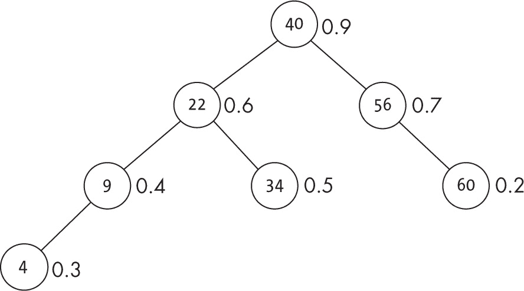

图 14-21：在 treap 中，键值形成二叉搜索树，优先级形成堆。

如果你想插入一个优先级为 0.8 的 12 节点，第一步是按照二叉搜索树的标准方法插入新节点，而不考虑优先级和堆的性质，这些会稍后处理。这个插入（按照 第十二章 中描述的标准方法进行）会导致如 图 14-22 所示的树。

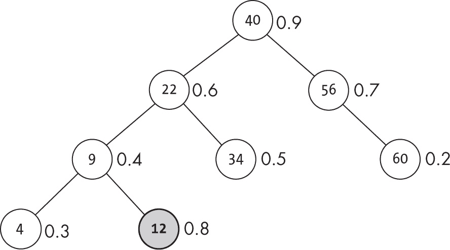

图 14-22：在标准插入操作后，得到的二叉搜索树可能不再是堆。

Treap 支持搜索操作，但由于 12 节点的优先级高于其父节点的优先级，因此堆的性质没有得到满足。你可以通过执行左旋转来解决这个问题，从而得到 图 14-23 所示的树。

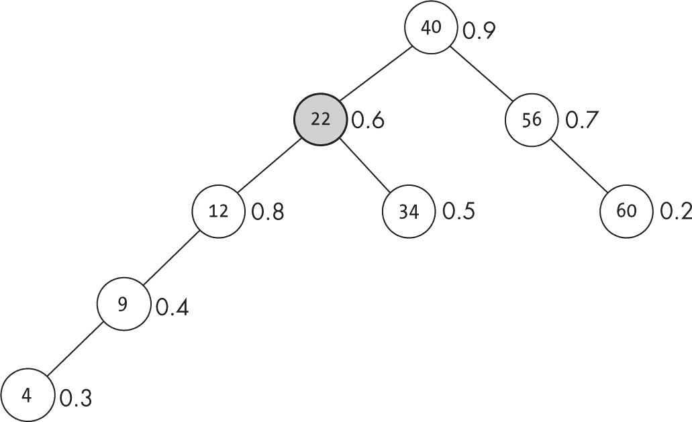

图 14-23：旋转操作会一直应用，直到满足堆的性质，但这个树仍然是错误的。

旋转仍然保持有效的二叉搜索树，但过程尚未结束，因为堆的性质还没有完全满足。12 节点的优先级高于其父节点；进行一次右旋操作以解决这个问题，这样就得到了图中所示的树图 14-24。

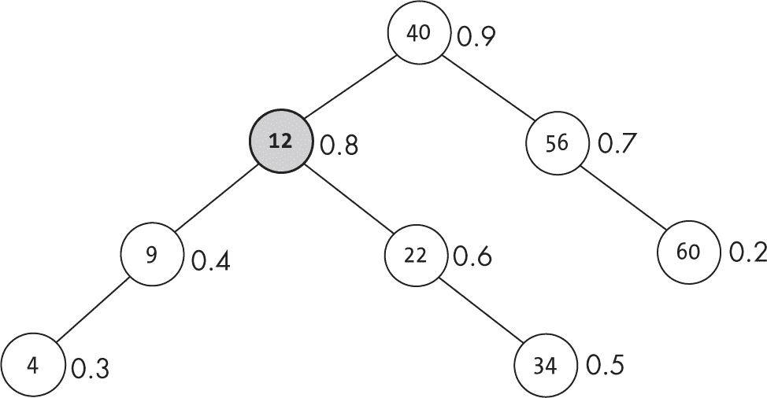

图 14-24：现在堆的性质已经满足。

在第二次旋转后，你可以检查堆的性质是否已经满足，因此添加到 Treap 中的操作是正确的。

以下是最终的代码，其中有一行与普通的二叉搜索树不同：

```
const add = (tree, keyToAdd) => {
  if (isEmpty(tree)) {
    return newNode(keyToAdd);
  } else {
    const side = keyToAdd <= tree.key ? "left" : "right";
    tree[side] = add(tree[side], keyToAdd);
    **return tree[side].priority <= tree.priority ? tree : _rotate(tree, side);**
  }
};
```

粗体的那一行确保堆的性质得以满足。在树的[侧边]添加新键后，如果该子树的优先级不大于根节点的优先级，你就完成了；否则，应用该侧的旋转将优先级更高的元素提到上面。

最后需要的方法是从 Treap 中删除一个键。

#### 从 Treap 中删除一个键

从二叉搜索树中删除一个键的算法包括先找到该键，可能需要找到它的后继节点，并将后继节点放到被删除节点的位置。对于 Treap，由于你必须保持堆的性质，这个过程稍微复杂一些，但就像插入操作一样，你可以使用旋转来确保结果是正确的。要删除一个节点，使用与之前二叉搜索树不同的逻辑：

+   如果你在空树中查找要删除的键，什么都不需要做。

+   如果要删除的键小于根节点的键，从根节点的左子节点中删除该键。

+   否则，如果要删除的键大于根节点的键，从根节点的右子节点中删除该键。

+   否则，如果该键既没有左子节点也没有右子节点，直接删除它。

+   否则，如果它有右子节点但没有左子节点，将其设置为右子节点。

+   否则，如果它有左子节点但没有右子节点，将其设置为左子节点。

+   最后，如果它有左子节点和右子节点，应用一次旋转将该键移到树的更低位置，并尝试再次删除它。

最后一步可能会让人感到惊讶，它与二叉搜索树的处理方式完全不同。通过前面在插入 Treap 时展示的旋转操作，可以旋转一个节点与它的某个子节点，而旋转后的节点会在 Treap 中较低的位置。如果你仔细选择使用哪种旋转方式，你仍然可以保持堆的性质；因此，如果在旋转之前 Treap 是有效的，旋转后它仍然会保持有效。最后，随着要删除的键逐渐下移，它不能总是保有两个子节点。在某个时刻，它只会有一个或没有子节点，然后你可以快速完成删除操作。

考虑一个更复杂的情况。从图 14-25 所示的 treap 开始，删除 9 节点（如在“向 treap 中添加键”一节第 333 页所示，优先级显示在节点的右侧）。

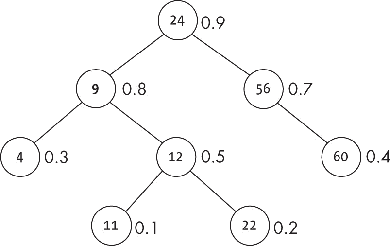

图 14-25：初始的 treap，包含一个待删除节点

找到节点后，恰好它有两个子节点，所以需要进行旋转。9 的右子节点优先级更高，因此执行左旋，得到如图 14-26 所示的中间状态（注意，此时堆性质尚未满足，但在你删除 9 节点后就会满足）。

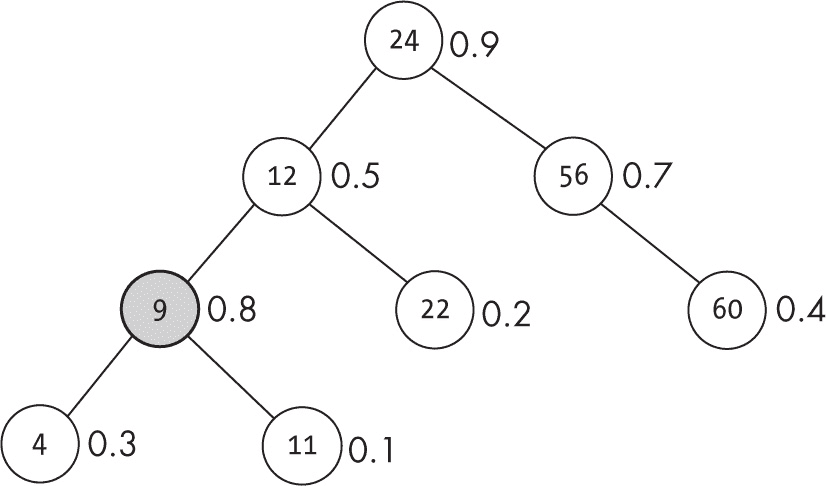

图 14-26：左旋将要删除的节点向下移动。

9 节点再次有两个子节点，因此进行新的旋转。这次，优先级更高的是左子节点，因此可以进行右旋，得到新的状态（见图 14-27）。

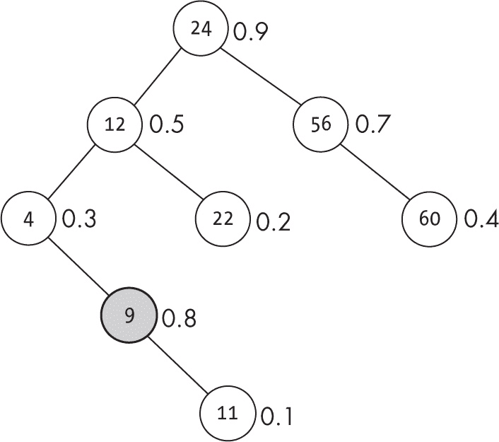

图 14-27：新的旋转将要删除的节点进一步移至 treap 下方。

现在你已经遇到了一个简单的情况，因为 9 节点只有一个子节点，这允许你删除它，最终得到如图 14-28 所示的 treap。

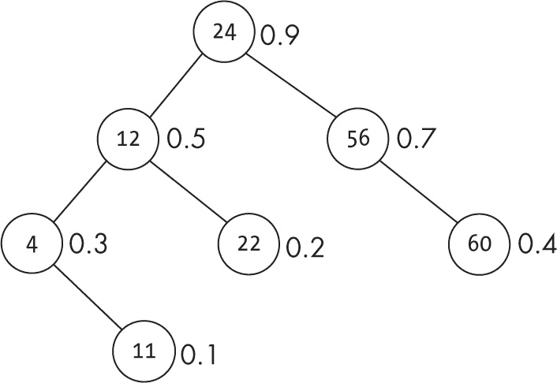

图 14-28：删除目标节点后的最终 treap

删除键的代码如下（请注意，该实现严格按照前面列出的步骤进行）：

```
const remove = (tree, keyToRemove) => {
  if (isEmpty(tree)) {
    // nothing to do
  } else if (keyToRemove < tree.key) {
    tree.left = remove(tree.left, keyToRemove);
  } else if (keyToRemove > tree.key) {
    tree.right = remove(tree.right, keyToRemove);
  } else if (isEmpty(tree.left) && isEmpty(tree.right)) {
    tree = null;
  } else if (isEmpty(tree.left)) {
    tree = tree.right;
  } else if (isEmpty(tree.right)) {
    tree = tree.left;
❶} else {
❷ **const [side, other] =**
 **tree.left.priority < tree.right.priority**
 **? ["right", "left"]**
 **: ["left", "right"];**
❸ **tree = _rotate(tree, side);**
❹ **tree[other] = remove(tree[other], keyToRemove);**
  }
  return tree;
};
```

代码与常见的二叉搜索树相同，不同之处在于当找到一个有两个子节点的键时❶，你需要决定进行哪种旋转❷，然后执行旋转❸，接着递归地向下尝试删除该键❹。如果执行了左旋，原根节点（即你想删除的键所在节点）将被移到左子树，因此删除过程将在左子树中继续。如果执行右旋，删除过程将在右子树中继续。

你现在已经使用堆来扩展二叉搜索树。让我们看看这种变化的结果。

#### 考虑 treap 的性能

如前所述，treap 的预期高度是*O*(log *n*)，这意味着添加、删除和查找键的预期时间复杂度都是这个级别。然而，优先级的随机化并不能确保不会出现坏情况，实际上，最坏的情况与二叉搜索树相同：树的深度为*O*(*n*)，并会影响算法的性能。

与常见的二叉搜索树的主要区别在于，实际上，获取一个“坏”的数据序列并不出乎意料，常常会导致糟糕的树。然而，在 treap 中，由于随机优先级的存在，无论原始数据的顺序如何，构建一个“坏”的 treap 的概率非常低。实际上，要得到一个平衡差的 treap，优先级必须与键值相关联，而这种情况在随机数中非常不可能发生。因此，算法的平均性能将独立于键值插入的顺序（见表 14-4）。

表 14-4：Treap 操作性能

| 操作 | 平均性能 | 最坏情况 |
| --- | --- | --- |
| 创建 | O(1) | O(1) |
| 添加 | O(log n) | O(n) |
| 删除 | O(log n) | O(n) |
| 查找 | O(log n) | O(n) |
| 遍历 | O(n) | O(n) |

Treap 的关键在于，随机化使得实现一定平衡的可能性非常高，从而提供了高性能。（这与随机化二叉搜索树的论点相同。）此外，treap 允许你实现其他方法，例如将一个 treap 分成两个或将两个 treap 重新合并为一个。我们在这里不会直接讨论这些方法，但请参阅本章末尾的问题 14.15 和 14.16。

### 三叉堆和 D 叉堆

如果二叉堆是优先队列的一个良好结构，那么逻辑上的推广就是，正如 B 树那样，每个层级拥有更多的子节点会使树更短，算法更快，例如*三叉*（也称为*三元*）堆，其中每个节点有三个子节点，或者*四叉*堆有四个子节点，一般的*d 叉*堆每个节点有*d*个子节点。

基本上，所有的差异都在于 _bubbleUp()和 _sinkDown()方法中，这些方法现在必须处理超过两个子节点，如下所示：

```
const {newHeap, isEmpty, top} = require("./heap.func.js");

❶ **const ORDER = 3;** // with ORDER===2, we get classic heaps

const _bubbleUp = (heap, i) => {
  if (i > 0) {
  ❷ **const p = Math.floor((i - 1) / ORDER);**
    if (heap[i] > heap[p]) {
      [heap[p], heap[i]] = [heap[i], heap[p]];
      _bubbleUp(heap, p);
    }
  }
};

const _sinkDown = (heap, i, h) => {
❸ **const first = ORDER * i + 1;**
❹ **const last = first + ORDER;**
  let g = i;
❺ **for (let j = first; j < last && j < h; j++)** {
    if (heap[j] > heap[g]) {
      g = j;
    }
  }
  if (g !== i) {
    [heap[g], heap[i]] = [heap[i], heap[g]];
    _sinkDown(heap, g, h);
  }
};

const add = (heap, keyToAdd) => {...exactly as before...}

const remove = (heap) => {...exactly as before...}
```

看一下代码中的变化。我们添加了一个 ORDER 变量（这里设置为 3），用于存储新堆的阶数❶。计算节点的*父节点*需要使用修正的公式；与二叉堆不同，不是除以 2，而是除以堆的阶数❷。然后，做相同的更改（将堆的阶数替换为 2）来查找元素的子节点❸❹。由于一个节点可能有多个子节点，因此需要循环遍历它们，找到最大的一个❺。

如果你创建一个新的堆（在此为三叉堆），并按顺序添加值 22、9、60、34、24、40、11、12、56、4 和 58，你将得到图 14-29 中的堆（同时以树形和数组形式显示）。

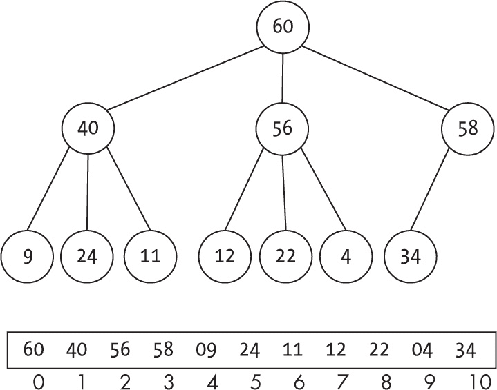

图 14-29：在三叉堆中，实现方式与二叉堆相似。

那么 *d* 叉堆的一般顺序如何呢？由于树的高度始终是 *O*(log *n*)，因此所有操作的时间复杂度是相同的。然而，一些操作的性能可能更好或更差。例如，向上冒泡变得更快（因为树更平坦），但向下沉降会变得更慢（因为你必须在更多的值中找到最大的一个）。

### 总结

本章介绍了一种新的数据结构——堆，有多种变体：二叉堆和 *d* 叉堆，以及最小堆和最大堆。我们看到了堆如何用于实现一种新的抽象数据类型：优先队列。堆的另一种用法是作为一个具有良好常数性能的排序算法。最后，我们应用堆的概念创建了一个随机化的二叉搜索树：treap。在下一章中，我们将继续探索相关概念，并考虑一些堆的变体，以支持新的操作。

### 问题

**14.1  它是一个堆吗？**

给定一个数组，写一个函数返回该数组是否为最大堆。你不需要构建堆，只需回答它是否已经是堆。

**14.2  用队列凑合一下**

假设你只能使用优先队列，而不能使用栈或队列。你如何使用优先队列来模拟这两种抽象数据类型（ADT）？（提示：由于栈和队列没有优先级字段，你可以为它们分配任意值。）

**14.3  从最大堆到最小堆**

假设你有一个最大堆；你能否在*O*(*n*) 时间内将其转换为最小堆？

**14.4  最大或最小**

为了将最大堆转换为最小堆，你需要对最大堆做哪些修改？

**14.5  合并吧！**

假设你有几个有序的列表，并希望将它们合并为一个单一的列表。使用最小堆实现这个算法，在每一步决定选择哪个节点。

**14.6  搜索堆**

尽管这没有太大意义（因为堆本身并不是为此结构化的），你如何实现一个 `find()` 函数来在堆中查找一个值呢？

**14.7  从堆的中间删除元素**

在堆中，你总是移除顶部的值，如果你想移除堆的最后一个值，这很简单，但是你能写一个算法来移除堆中的任何元素吗？

**14.8  更快的构建**

Floyd 的优化方法以 *O*(*n*) 时间构建堆。修改 `newHeap()`，使其在给定一个值数组时，使用 Floyd 的方法初始化堆。

**14.9  另一种循环方式**

在 `heapsort_original` 函数中，你本可以很容易地使用 `forEach()` 来构建堆；你能看到怎么做吗？

**14.10  额外的循环？**

在 `heapsort_enhanced` 函数中，如果在构建堆时执行一个完整的循环，会发生什么？更具体地说，如果那段代码写成如下形式会怎样：

```
for (let i = **v.length - 1**; i >= 0; i--) {
  sinkDown(i, v.length);
}
```

**14.11  最大平等性**

如果你用堆排序来排序一个填满相同值的数组，它的时间复杂度是多少？

**14.12  不稳定的堆？**

堆排序不是稳定的，尝试排序一个短数组就足以验证这一点。你能提供一个这样的例子并展示其不稳定性吗？提示：你不需要一个很大的数组。

**14.13 修剪选择**

你可以使用堆从 *n* 中选择出 *k* 个最大值，通过将堆顶移除 *k* 次。然而，如果 *k* << *n*，你可能会稍微加速一些。证明这 *k* 个最大值一定出现在第 1 层（根节点）到第 *k* 层（但不超过此层），并利用这一发现，在进行选择前修剪堆。

**14.14 它是一个 Treap 吗？**

给定一个二叉树，其中每个节点有键和值域，你能写一个函数来检查该树是否实际上是一个 treap 吗？

**14.15 拆分 Treap**

给定一个 treap 和一个限制值，将其分成两个独立的 treap：一个包含所有小于限制值的键，另一个包含所有大于限制值的键。假设限制值不在 treap 中。

**14.16 重新连接两个 Treap**

考虑第 14.15 问题的逆问题：假设你有两个独立的 treap，第一个 treap 中的所有键都小于第二个 treap 中的所有键。你能找到一种方法将这两个 treap 合并为一个吗？

**14.17 从 Treap 中移除**

如果在 treap 的 remove() 方法中你更改了这一行

```
tree[other] = remove(tree[other], keyToRemove);
```

改为

```
tree = remove(tree, keyToRemove);
```

它仍然会起作用吗？参考代码如下（更改的行以**粗体**显示）：

```
const remove = (tree, keyToRemove) => {
  if (isEmpty(tree)) {
    // nothing to do
  } else if (keyToRemove < tree.key) {
    tree.left = remove(tree.left, keyToRemove);
  } else if (keyToRemove > tree.key) {
    tree.right = remove(tree.right, keyToRemove);
  } else if (isEmpty(tree.left) && isEmpty(tree.right)) {
    tree = null;
 } else if (isEmpty(tree.left)) {
    tree = tree.right;
  } else if (isEmpty(tree.right)) {
    tree = tree.left;
  } else {
    const [side, other] =
      tree.left.priority < tree.right.priority
        ? ["right", "left"]
        : ["left", "right"];
    tree = _rotate(tree, side);
    **tree = remove(tree, keyToRemove);**
  }

  return tree;
};
```

**14.18 树作为堆**

如果你使用二叉搜索树来表示堆，会发生什么？三个基本操作：add()、remove() 和 top() 的性能会如何？你能想到哪些方法来加速 top() 操作？
